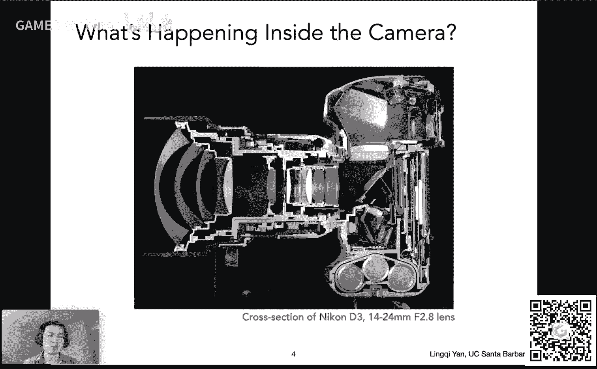
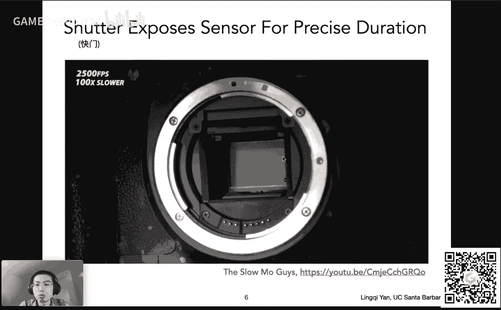
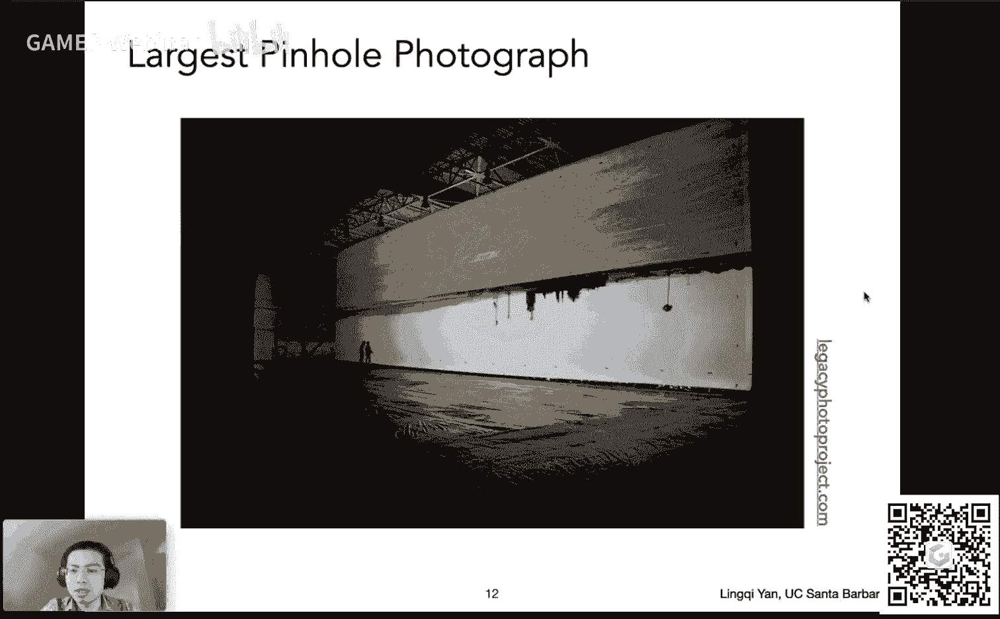
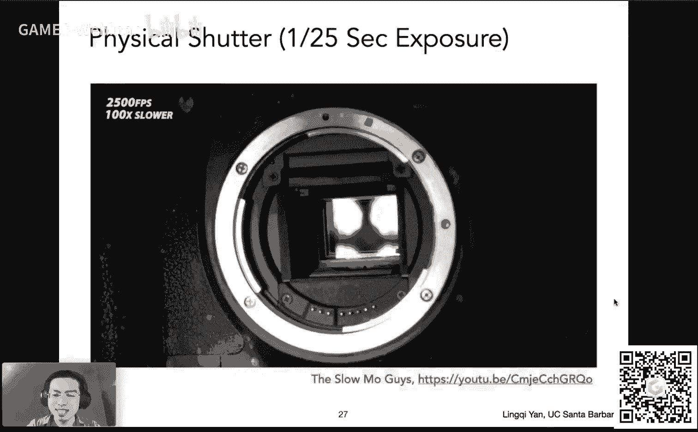
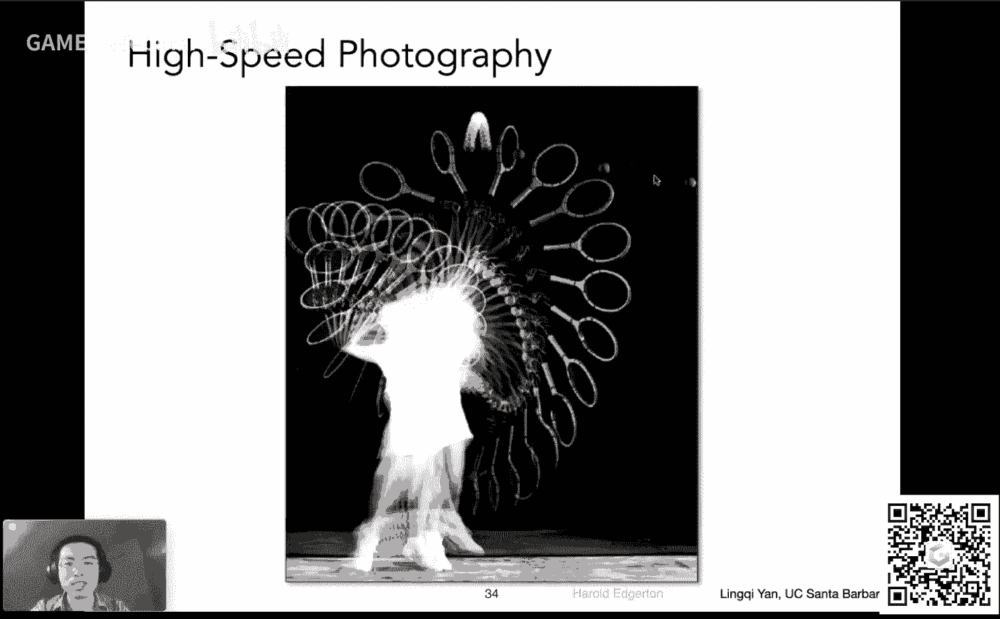
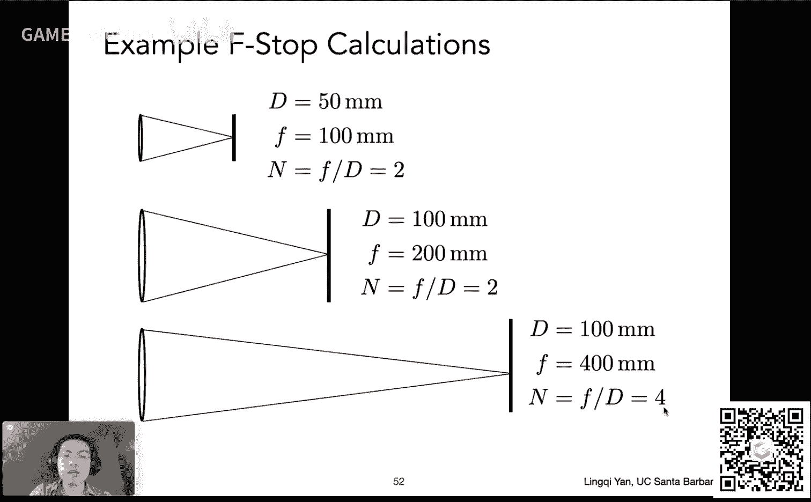
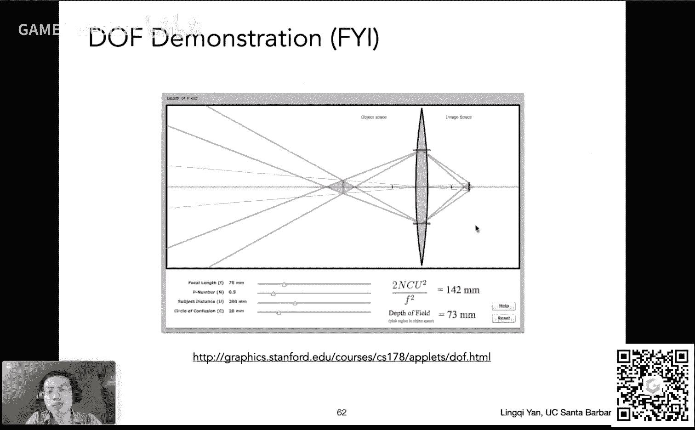
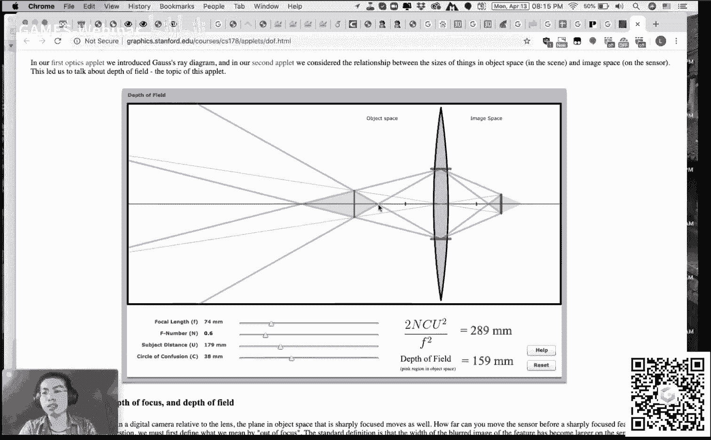
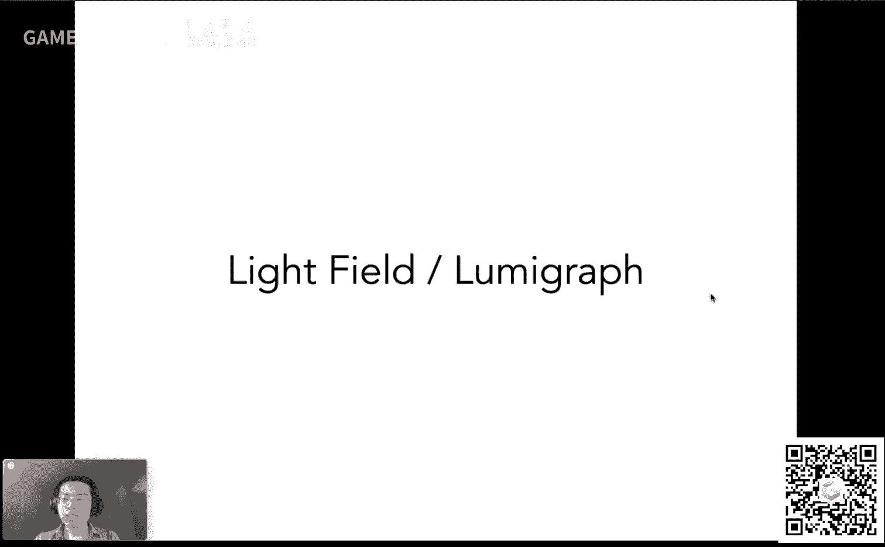
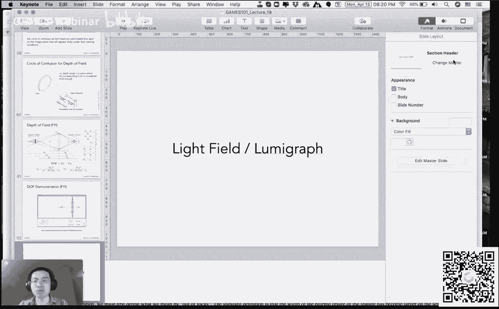

# GAMES101-现代计算机图形学入门-闫令琪 - P19：Lecture 19 Cameras, Lenses and Light Fields - GAMES-Webinar - BV1X7411F744

今天呢我们讲了一个全新的话题，我们之前这个嗯怎么说呢，我们之前一直在说这个嗯这几大块儿，大家看着下面这几个图吧，我们说这光栅化成像对吧，然后我们就说这个几何。

我们就说到呃这个which is diretracing，以及后面的pass tracing对吧，后面我们还会提这个模拟与仿真，那么今天我们在说什么呢，今天我们再说一个相对独立的话题哈。

我们今天说一说这个相机，然后棱镜，然后以及呃广场这些事情，为什么要说这些呢，因为这些都是这个图形学的重要组成部分，有时候呢我们在这个涉及到各个方面的时候，我们就默认大家知道这个事情。

可是这些知识从哪学呢对吧，基本上来说就还是得从这个同心学课上来，好吧啊行，没问题啊，今天这个我来的相对较晚啊，然后这个没跟大家这个之前课之前聊一聊这个事情啊，没问题，大家发现我今天带了个耳机哈。

呃ok啊，那咱们还是从嗯嗯嗯课前的一些这个这个事项来说起啊，就是说我刚才提到这周不只是这节课，我们都会说一些这个独立的话题，今天呢我们提到这个相机啊，棱镜呃，广场下一节课我们会提到呃，我想想啊。

下一节课我们会说颜色对吧，就是说颜色与感知我们到底怎么会看到各种各样不同颜色呢，光谱是什么东西呢对吧，然后这个这个我们所看到的到底是什么呢，就这些东西对吧好，那这样一来呢。

我们这个呃差不多就把这些杂七杂八事情弄完，下一周我们就可以呃进入呃说模拟与仿真这块的内容好吧，那么呃同样道理啊，这这个星期没有相对应的作业，所以这个大家听一听啊，算是了解一下这个同学之后，呃。

这个算是背后的一些这个简单知识啊，没什么问题，那么呃大家在关心的一个事情啊，大作业我们什么时候会呃给大家放出来对吧，然后这个很快就是现在大家这个这个正在制作中，然后很快很快就可以放出来。

然后记得我们之前安排的时间啊，到4月19号，然后大家去提交啊，提交一份这个这个大家准备做什么什么事情啊，然后如果说你要是做我们这个给定的一些题目，就是这个就不需要交了。

然后如果说你要做一些这个呃呃其他的题目啊，然后而且其实如果你自己想自己选题，做一些更有意义的东西，然后这个欢迎呃这么做啊，我们非常鼓励这么做，然后呃到时候你就只需要写一写这个你想要做什么。

然后反馈给这个助教同学就可以了，到时候呢这一份这个所谓的proposal呢会作为一次作业提交，然后呃如果你这个呃呃还还是一样哈，就是说如果你的选题是从我们给定的系列里面选题呃，里面随便挑一个。

然后这个就不需要写啊，只是你说如果要自己做一个新的呃这个项目，然后你就写一份这个proposal，非常简单，写清楚要干什么就可以了啊，没有任何篇幅上的要求好那么就是这个事情好。

那么咱们这今天继续今天的话题，那咱们从什么说起呢，咱们从成像说起对吧，我们一开始说啊，计算机图形学有两种成像方法，一种呢就叫这个呃光栅化成像对吧，是上面这幅图对大家可以看到这个软阴影对吧。

然后嗯一种呢是光线追踪成像，然后我们说到光线追踪还有高级的话题对吧，但这两种成像啊其实都是相当于是一种合成的方法，就相当于这些这些东西啊，在自然界中或者在这个世界中，其实并没有存在，对不对。

那我们成像起来，这可不只是说嗯做一些这个不存在的这些东西，也就是说通过合成方法来成像，我们也可以通过捕捉方法来成像，什么叫捕捉方法来成像呢，就这个capture啊，什么叫capture呢。

意思就是说啊我这真实世界中存在的一些东西，我把它变成照片，这就是什么像，没问题哈，就是说这是非常朴素的理解，但很对，然后就是说嗯当然有各种各样复杂的这种成像方法，嗯。

那么最简单的一个这种这种所谓capture，所谓主捕捉的这个城墙方法用什么呢，因为相机对吧，拿个相机随便往一个地方拍张照，那就是成像没有任何问题，所以丞相作为这个图形学中的一个重要组成部分啊。

我们肯定是要说的对吧，那这就是呃我们这个呃一些这个背景，那么呃肯定有同学关心说，那个现在肯定是不是有人还在研究各种各样别的什么成像技术对吧，然后怎么样去更好地捕捉各种各样的光，呃这个是有的。

而且现在大家也非常积极在做这方面的研究，比如说呢我就知道有地方在做什么研究呢，做这个光线的传播啊，这个光传播其实有时间的对吧，大家知道不是光是以光速传播，那么我能不能限制说我在某一个极其微小的时间内。

然后这个呃这一段呃我能看到的这个光是什么样一个情况，诶这里发生了什么嗯，没诶我们又回来行，没问题哈，就是说嗯这个有一些研究可以研究光在一个极短的时间内，然后它的传播，然后我会看到什么。

你就可以看到这个光线真正在这个空间中进行传播的这么一个过程啊，这个过程叫transient imagine，如果大家有兴趣的可以看一看，就整个的这个image的这个范畴呢。

更多是在这个计算摄影学叫computational photography这块里面做这个研究，那么这怎么区分各个不同的这个方向，我们之前在第一节课上也跟大家提过对吧，简单说过这个事情。

那么咱们回到图形学上的这个这个话题上来，既然我们说捕捉，那咱们今天就从相机开始，这个相机是最简单的这个这个呃所谓成像的工具对吧，我们直接这个拍张照就行了，那么相机的背后到底是什么。

那这就是咱们今天要讲的话题。

好吧嗯好嘞，那咱们这个开始先说camera对吧，那所谓这个相机呢它是什么呢，大家可以看到这是一个相机，这是一个相机的截面图啊，然后这这很少大家可以看到这么一个形状对吧。

可以看到它的内部到底是一个什么样的构造，大家可以看得清楚啊，它有这些这个镜头对吧，很多不同的这个棱镜组组在一块，然后呢它又有一个机身，它最后又有感光元件。

然后它这个这个有各种各样的这个各种不同的步骤对吧，咱们今天把这些各种各样的原理可以都讲清楚。

而今天的内容挺多的，我讲快一点，然后这样咱们把这个时间争取能不往后拖啊，那么是这么回事啊，就是说我们提到相机，我们很容易想到的是这个相机带一个大的这个镜头的这种对吧，然后这样的相机。

但是在这个很古老的时候啊，最早的情况下，大家这个研究相机是从一个最简单的现象叫做小孔成像开始，那么小孔成像是什么意思呢，就是说啊比如说咱们看这个人对吧。

然后这里有一个这个这个物体的一个一个就就就是某一个表面吧好吧，一个纸板好吧，中间钻了一个孔，这中间钻了一个孔，我们知道光线直线传播的呀对吧，如果这个这个这个人可以被我们看到的。

这个人肯定在往四面八方反射光线对吧，那么它肯定任何一个部分都在往任何一个其他地方反射光线，那么那如果比如说这个从这帽子上啊，如果往这个水平方向反射，它会被挡住，那它往哪儿反射不会被挡住呢。

它就只会这个往这个洞这个方向，如果他正好钻过这个洞，那这这条光线就不会被挡住，那么大家看，如果我认为这个点是一个理想的点，那么所有的这个不同的这些呃有反射光的这么一些点啊，都可以有反射光往这个洞里面去。

那么他自然就会形成一个在另外一侧，形成一个和之前这个左边这个人呃倒立的一个一个这个像，然后如果右边我们放一个所谓传感器，我们把记录在某个胶片上诶，我们就可以得到一张一张这个相片没有问题对吧。

哎这个道理这个很简单，那么这个这个相机呢小孔成像的原理是有真正对应的相机的，这种相机就叫做针孔相机，叫拼后camera好吧，然后呢它当然我们平常见的最常见的还是这种带棱镜的相机。

那咱们今天都会说好吧好，那么呃我们这里呢就是就是说这个呃，把这个相机的各个部件先给大家说一下，比如说这里看到的这个这个部件是什么东西啊，这个是在这是去掉了镜头的相机对吧。

然后大家可以看到嗯这个嗯去掉了镜头呢，这块是什么呢，显然是控制光是不是能够进到这个机身里面去的一个部件。

那这个部件就叫做快门啊，叫shatter，然后shatter呢能够控制这个光在多少多少分之一秒内，然后进入这个相机啊，这是一个不讲，然后呃那咱们看这个当这个光进入了相机之后怎么办呀。

那肯定是要被捕捉到对吧，什么东西可以捕捉光，并且可以把东西记下来呢，那这个东西就叫就叫做传感器，就叫做sensor对吧，呃这是一个这个这个嗯部件。

然后这里这里其实从标题上大家可以看到这个部件到底记录了什么，对吧，大家肯定是学了这个光线传播，特别学了辐射度量学之后，大家可以解释很多问题，比如说啊我们就说这个传感器上面任何一个点。

或者说咱们把它理解成像素吧好吧，然后这任何一个点记录的到底是什么，然后这里已经告诉大家记录的是irradiance啊，然后这是怎么回事，咱们马上就说好吧，呃ok那咱们现在看这个例子。

那我们这就这就知道说这个如果有一个相机啊，它没有棱镜，或者说他没有那个针孔嗯，这个是不是我还能拍上一张照，哎这个是不可能的，为什么呢，因为你如果直接把一个这个感光元件啊，就是这个右边假设是一个传感器。

然后感光元件放在一个人的面前，那么呢它任何一个点上，它都有可能收集到来自于这个不同方向的这个光对吧，我们知道人的反射光吗，任何方向，比如说看这个蓝色的线都有可能感受到这个点，而这个点本身作为传感器。

它又不区分来自各个方向的这个光线，那这样的话他就把所有的这些呃，这个来自各个方向的能量都给综合在一起，反映在这，个点上了，那我们就可以理解成他收集的就是以radiance。

他收集不了radiance信息，那所以既然这样的话，那我们肯定不能直接用一个这个传感器放在人面前，那就所有东西都是糊的啊，就是这么个意思好吧，所以很多东西呢我们都可以通过这个这个学习。

这个这个呃这个相关的知识来解释啊，那咱们这里先确认一个事情，对于传感器上的任何一个部件，一个点啊，它记录的是irradiance好，那这就是这么回事，但是有一点要说啊，就是目前来说有人在研究这个事情。

研究出来一些传感器，它可以这个通过方，向性的这些光就是不同的方向，它可以这个分开记录，然后这个呃分开这个船感分开记录啊，这个非常厉害啊，就是有人在研究这些东西，所以说现在科技还是在发展的。

然后这个目前来说，咱们现在还是这么认为，说传感器现在记录不了radiance，只能记录以radiance好吧，那就到这，那么咱们现在先从最简单的这个相机开始说啊，我们说这个针孔相机。

那针孔相机的成像过程是怎么做的呢，那我们现在来分析一下，那么早在这个公元前哈，大家就会发现有人就已经发现了这个小孔成像的原理，然后，比如说这里大家可以看到这个右边这个高塔，然后他们分的反射光。

然后经过了这么一个小的这个这个针孔，然后投影到这个幕布上对吧，然后也就是说这个针孔相机呢。

这个大家都对这个很早这人们就已经发现了好，那么事实上来说，针孔相机是直到今天，我们甚至还可以用它来拍照，没有任何问题，就是现在大家用的都是这个各种各样的带棱镜的相机，没问题，但如果我们真正能做一个针孔。

比如这里啊，大家看到一个硬纸板，然后这个中间有一个能透光的地方。

大概是6mm的直，径是这个安排，然后呢我就可以这个用这么一个这个小的这个针孔，然后这还是同样和那个刚才大家看到这幅图一样，然后我可以对着某个场景拍，然后我把这个拍到的结果给记录下来。

在这个呃记录在某个胶片上，然后我就可以拍出这么一个场景诶，大家会发现这个还还真是可以拍出来，这个效果还是不错的对吧，那么嗯大家在学了这个课后面的部分就会就会发现啊。

这个针孔相机他拍出来的东西是没有深度可言的，就是它的任何地方都不会是虚的，都是一定是清楚的，所以说，你这个无论是前面还是后面还是中间各个地方，都一定是这个这个光滑啊，不是叫光滑了，就锐利的啊。

然后就是说看不到这些会虚化的一些地方，那么虚化到底怎么回事啊，这个咱们之后就会说这是因为棱镜的存在啊，然后嗯这里针孔摄像摄像机，这里我们说清楚，这里针孔摄像机呢我们做嗯关于追踪的时候。

用的就是这种针孔摄像机的这个模型，所以正如我们这么做，也得不出这种这个会有这种不同的地方，会有不同的模糊，所谓的景深的效果好吧，然后嗯这里呢这个我们就先说，到这儿那同样道理反过来对吧。

如果大家可以去模拟这个啊光线如何与棱镜作用，那我也可以做出这个这个带有景深的渲染，那咱们这个课之后会说好吧，那么这里就是说小孔成像的这个针孔摄像机完全可以拍一张照片。

没有任何问题，好吧好，那这么一来呃，这个呃我们开始在逐个的介绍各种各样不同的概念好吧，那咱们从最简单的开始，咱们从这个所谓feel the view，也就是市场开始好吧。

那么市场说的意思就是说我能看到多大的范围啊，那我能看到多大的范围呢，这个这个我们好理，解对吧，如果我们拍张照对吧，所谓是个什么广角这个这个镜头对吧，然后这样就意味着我能拍这个更广的角度。

也就是说我能看到这个所谓市场更大对吧，f o v更大，那如果说我对于普通的这些，比如说这个iphone上的这个这个相机嗯，它对应的这个field of view，它就相对比较窄，对是这个意思好吧。

然后我们更关心的是什么呢，是说什么因素能够举决定这个市场对吧，那这个是按说这个相机设设定的时候，他就应该能够设计这个东西，答案是可以的，没问题，那咱们就从这个小孔成像的针孔，摄像机来理解。

那这就是说我们先不说这个这个啊棱镜这种相机的好处哈，就是说我们小孔成像其实很容易理解这个市场是多少，因为它有一个简单的相似三角形关系啊，我们看到这个出去的这个这个三角形哈，就是这个带这个呃。

就是就是比如说从某一个小孔，然后往这个世界去看对吧，它是形成某一个角度，然后如果我反向延长这么这种角度啊，然后它会达到这个呃传感器上面，那我这在设计的时候，我希望这个把这整个传感器的所有地方我都用。

我都利用清楚对吧，然后我的，定义呃这么一个事情，就是我认为呃这个传感器会感受到这个所有的这些光线啊，就是说我这个呃比如说我传感器的边缘，我连一条聊条线，然后连小孔，然后它就打到这边。

这个右边呢连连一条线，连到小孔，可以打到左边，那么这中间的区域我觉得都能看见对吧，我们这这样认为肯定没问题好，那我这个这个传感器它的宽度我认为是h呃，正常情况人们认为是高度哈，就是说我们定义这个所谓。

但是这个fd view的时候，正常会定义水平和垂直两个不太一样，咱们以垂直为例，正常咱们不，说就说这个数值方向上它的这个可视角度是多大，好吧，呃跟之前咱们定义这个这个投影是一回事。

那么我说这个呃传感器的高度是h，那么再再定义一个量，我定义传感器和这个和这个小孔之间的距离哈，然后这里咱们先忽略这个棱镜的事情，和小孔之间距离，我们认为这个东西叫做焦距好吧。

然后当然对于小孔来说不存在焦距这个概念，没关系，咱们这么定义好吧，那这样定义的话，那我这个角度啊，这个呃feel the view角度啊，那太好算了，怎么算呢，你看咱们把它p一半对吧，p一半之后。

我这个我就知道它对应的角度就应该是这个下面这个三角形，它是一半角度，这一半角度是什么呢，我知道这一半角度的tangent，那就是二分之h除以f，那自然而然我就可以通过这种方式把它给算出来。

那么如果我把这个这个呃这个传感器啊，呃拿进拿到这个跟小孔更近的地方呃，那这样的话我就知道哦，原来这个时候我的呃焦距它就变小了，焦距变小了的话，那对应的这个呃这个市场就变大了对吧。

那所以说我们就可以通过这个它的内部设计啊，然后来这个推断出它对应的市场有，多大啊，是这么算，很简单啊，好那不同的这个这个市场，那肯定会决定不同的拍照的结果，对不对，然后这肯定是需要一个这个严格的定义的。

那么怎么定义呢，我从我们刚才的推导来看啊，这个市场和什么有关系，和这个传感器大小有关系，和焦距也有关系，诶那这怎么办呢，那这个这样的话，我这样定义市场是不是不太好定义呢，对吧。

那所以说人们通常在定义市场的时候，人们认为是以这个35mm格式的胶片为这个为为这个这个基准，就是我认为传感器如果都是这么大，然后我来，定义它的这个它的这个这个呃通过定义它的焦距的方式。

我来定义它的这个呃呃field of view就是这个意思，那这就造成了说我为什么在市场上买这个各种单反的，这种这种这个镜头的时候啊，然后大家就会发现它有一个焦距的这个这个呃概念对吧，17mm。

17mm呢它对应的就是广角镜头，十几毫米是f短的，就焦距短嘛，焦距短，然后我对应又是相同的这个呃传感器的大小，那我得出来的这个视野肯定就大嘛对吧，所以呃道理就在这儿，所以我们平常会这么说好吧。

然后这里有一，点正常情况，如果大家看手机，手机上会告诉你它的焦距是28mm，是这么这么一个一个概念啊，然后或者说更大或者说更小，但是你大家可能会问这么一个问题啊，会问这么一个问题。

就是说我手机总共才多厚啊，我手机总共厚度不到1cm，那怎么可能它的焦距是28mm的，这怎么可能是这么成像呢，对这就是说我们之前的这个定义哈，我们说它的焦距是指对应到如果是35mm大小的。

这个这个这个这个呃胶片呃，我们认为它焦距是多少，那对于手机来说，它的它的这，个胶片肯定更小对吧，然后呢它的这个这个呃那它对应的焦距也就其实小很多，他这个只是说等效的这个所谓嗯呃焦距是多少。

是这么个意思好吧，这就是我们平常的定义方法，咱们知道就好，这以后再看到手机的参数，咱们能明白对吧啊这个是非常好理解啊，那么咱们看一看那不同的这个角度的镜头呢。

自然可以拍出各种各样不同的这个效果对吧，比如说大家可以看到这四幅图，这四幅图是站着同一个地方拍的，但是用了不同大小的这个呃这个这个而是市场好吧，就是feel the view，各，不相同。

咱们从这个示意图上可以看到不是不是多大哈，但是可以看得到，就是说这个当你的市场越窄，你可以看到东西其实越远对吧，就是这个意思啊，好那没有问题，呃，这一块儿就是挺简单的一些一些这个基础知识。

那么呃如果我们看这个另外一个因素，我们刚才一直在说这个焦焦距的事情对吧，我们说焦距这个在不同的焦距的情况下，那我可以改变它的市场，那我认为我的这个这个所谓这个感觉这个传感器，然后它的大小是不变的。

那如果说我真的能改它的传感器的大小对吧，我用了一个大一点的这个传感器和用一个小一点的传感器，那自然而然这个小一点的传感器就对应小一点的这个呃，这个是市场对吧，就这个这个可视的角度。

那从这个这个图上来看啊，再明显不过了，呃如果我减小呃传感器的大小，那当然对应的这个角度要减少好，那就没问题，那也就是说有两个因素决定，平常我们定义会用一个会固定这个传感器的大小。

然后去用所谓的焦距来衡量它好，咱们把这个弄明白就行，那么另外一点要给大家说的呢，是这么回事，这里呢其实我在这个这，个怎么说呢，混淆是使用两个概念啊，一个叫传感器，一个叫胶片，这两个事情它不一定一样哈。

就是说这个呃平常我们大家认为这是一回事，因为传感器上我就认为各个不同的呃不同的这些点吧，嗯然后他这个对应他最后会写到这个对应的位置上面去，所以它有一个一对应关系，就是说呃我认为传感器接收到的图像。

那就是我最后呈现出来的图像，但正常情况下，其实呃我们不区分这个概念没什么关系，就是所谓sensor和film，我们可以认为是一样的，但对于渲染来说，对于如果大家用渲染，器这里多多给大家说一句。

这两个概念区分，这个传感器呢就负责来记录所谓最后的这个收到的dients到底多大，每个像素最后的film，然后由大家来决定到底要把它存成什么样的图片格式哈，是这个意思，所以说呃这两个概念可以不一样。

但是对于我们目前来说，我们把它给混混淆时使用。

好吧好，那这就是传感器和呃这个胶片的事情，那么传感器当然有不同的大小，那咱们刚才已经说了，对于一个正常的大的这种相机对吧，它有大的这个传感器，那当然它就可以有更大的分辨率对吧，也就。

是说所有不同的相机它价格各不相同，然后好多相机都是大的相机对吧，这很好辨辨认哈，就是在买相机的时候，相机机身越大越好，然后这个镜头越大越长越好，就是这么回事。

然后当然这价钱也是这个按照这个上升的没什么问题，所以大家会发现学图形学可不只是要学会啊，数学啊，物理啊，可是这生物啊各种各样不同的这个这个这个这个学科啊，这个还得有点家底才能研究明白这个相机什么事对吧。

好吧啊，这就简单说一句哈，然后大家看这个手机，手机对应的传感器呢就相对较，小对吧，然后这就是为什么手机可以用一个非常短的这个焦距，然后从而还能够达到一定的这个嗯可视的角度对吧，好啊，没问题啊。

那么行没问题啊，那咱们这个呃现在再进入下面一个这个这个事情的一个很小的事情啊，就是说如果说你有一个这个小的这个手机，那怎么办呢，你要又要又要让它这个保证有相同的这个这个field view。

咱们刚才就已经说了对吧，然后人们是怎么做的，咱们刚刚才其实已经提了，对于这个手机来说，那他如果说小的传感器，那我就把这个这个焦距也给变小，那，么其实可以达到相同的这个build of vie。

这是没问题的好吧，那嗯基本上就是简单就是就是这么做，就是相当于feel the view，然后和呃焦距和传感器大小这个关系非常这个简单明了好吧，那么呃咱们进入下一个话题啊，咱们再说另外一个事情。

咱们刚才已经提了几个概念了，你接着说下面一个呢我们要说曝光这个所谓曝光度啊，或者曝光是一回事啊，exposure，exposure到底是什么呢，咱们可以这个从这个公式开始看。

exposure定义成h h等于t乘一，哎t成e是什么东西呢，下面其实解释了就是exposure啊，是相当于是，irradiance成time是这个意思，那这个怎么理解呢，很简单。

如果你对着一个明亮的场景，然后你拍一张照，你得出来的结果是不是看起来就亮一些对吧，那如果说你对着这个一个比较暗的场景，但是你这快门按下时间很长，然后你觉得曝光时间很长。

那你也可以得到这个这个一个一个一个比较亮的照片，那所以说通通通过这两个道理对吧，一个是进了多少光，一个是我让他进来多长时间，然后把它累积起来就可以得到这个曝光度。

那么大家在这个概念上就可以联系到之前咱们说辐射度量学上，我们辐射度量学生一直在说单位时间对吧，单位时间呢这个有光达到这个呃某一个表面又单位时间又辐射出去，那我们就考虑单位单位时间就好了。

那么这里照相可不是考虑单位时间，这个照相是考虑整体的事件对吧，那我这个自然而然我把这个快门留着，这个这个这个时间很长，那更多的光就可以进来，就可以被传感器这个捕捉到，那么自然而然得到的结果就会更亮。

所以它跟时间有关，他记录的最后就是能量，就是这么个意思对吧，所以它记录的不是power对吧，它记录的是那个嗯，就是就是就是就是不是单位时间的，而是总共的这个能量啊，ok啊那没问题啊。

咱们说到这个这个这个这个exposure这个事情嗯，这就是说这两个事情呢在相机里面就是决定给这个曝光的两个因素，一个是时间呃，一个是这个呃所谓这个过了过了多少光，就是这个radiance自己对吧。

这两个事情在相机里面其实都是有体现的，特别是时间时间呢在相机里面它的体现非常明显，那就是快门，这个我可以控制他这个有多长时间光可以进来对吧，这是一个那么这块呢相信大家拍个照都会明白这个事，情好吧。

那么我再说一下这个事情是怎么回事呢，就是说啊就是说我记录sensor上面的任何一个点，我说他设置他感感知到的这个所谓irradiance，对不对，然后由相机的哪些部件可以决定诶，这个就比较有意思了对吧。

然后呢它是由很多因素决定的，然后其中有一点我们要说的是这个所谓这个光圈的大小呃，这个aperture的事情咱们之后会单独说好吧，这个光圈的大小会影响到你这个到底这个镜头接收到多少光。

比光圈其实就是挡光用的吧，就相当于是如果你把光圈这个放的比较开，那这样的话就，更多的光直接会进来，那单位时间内得到接收到的erro本来就会多对吧，咱咱们考虑相同的曝光时间，那所以有很多事情啊。

在这个相机上我们都是可以单独来控制这个不同的这些这些呃部分，然后来决定最后的这个曝光度是多少，那咱们可以做一个总结，那在相机里面这个到底有哪些因素在影响最后的这个这个照片拍出来，它到底亮还是不亮呢。

那首先我们刚才提到的这个事情，所谓光圈的大小，这个光圈的大小呢其实对于这个相机来说，相机是一个精密仪器，它是可以控制这个，光圈它的大小的，那么这个光圈的大小呢，你这个就是说它最大。

那肯定就只能开到跟镜头那么一般大对吧，然后就是说那这个可以可以继续变小对吧，然后这个由什么来控制呢，由一个东西有一个数字啊，叫f stop或者叫f数，这个马上就会给大家说。

这个东西呢可以控制这个呃这个这个所谓光圈的大小，那么光圈其实是一个仿生学的设计哈，就是说对于这个光圈来说，它是在仿照人的瞳孔，大家知道人瞳孔是可以动态调节大小的，那如果在一个相对暗的环境下。

瞳孔会自动放大，这样，的话你就可以这个这个单位时间接收到更多光吧，你可以看清楚更多东西，那如果在一个非常亮的情况下，你瞳孔会缩小，这样不让这个更多的光进来灼伤你的视网膜对吧。

那所以光圈其实就是这么个意思，就是一个挡光的东西啊，那当然他可以决定这个这个曝光度没问题啊，那么第二个是什么呢，我们刚才已经提到了对吧，这个这个呃快门。

这个快门呢更多情况下大家会这个更专业的来说就是short speed，就是说这个快门它本身有一个速度，或者说你可以理解成是这个快门开放的时间，那这是有一个关系的，就是说shelter speed越快。

就意味着我们这个快门它开放的时间越短，就意味着更少的这个光会进来啊，是有这么一个关系，咱们把这个搞明白呃，那这个刚才咱们已经说了，那还有一个咱们刚才没说的叫什么呢，叫做iso增益，那这个是什么意思呢。

这个这个呃有时候也被说成是感光度哈，这是什么意思，最简单的理解是什么呢，就是理解成这个i s o啊，它是一个后期处理，当你的这个这个最后这个感光感光元件已经感觉感到了，感知到了某个层级的光。

比如说嗯这个呃得，出来的答案是0。1好吧，然后你觉得答案你要把这个0。1这个它的所有的这些值啊，都给乘个十，你把它给乘到这个这个一上去，是这么个意思，就相当于它算是一个后期处理，它接收到多少光。

他该接收到多少，多少到多少，就是就算是多少，然后呢你只不过后期给它乘上某一个数，是这么个意思，可以这么理解啊，然后但是这个城它可以发生在各个不同的地方，它可以是发生在硬件上。

比如说这个这个这个呃传感器本身你就可以通过调节它的灵敏度对吧，然后来这个嗯增加它的，iso，然后呢或者你最后生成了这个这个相机的这个最后照片之后。

然后你也可以这个在这个呃照片的所谓数字信号上面去调这个东西，就是说这个iso的具体实现咱们不给大家说，就是说关于关于这块来说，大家就可以简单的认为是最后接收到多少能量，我乘上一个数而已。

那么这里呢呃我们就可以看到这几个因素，肯定都会影响到最后的这个图像的亮度嘛对吧，这样想，那么呃这样一来就是说呃这些因素各自都有什么样的影响啊，这就是我们希希望这个研究的问题对吧，那么我，们可以看一看啊。

这幅图其实非常生动，这幅图就说明了这个各种各样的这个呃这个现象啊，就是说我用这个各种不同的这些配置，比如说呃光圈的大小对吧，大家可以看到这个我们刚才说用一个什么东西来表示光圈的大小呀。

用一个叫做f数的东西，大家会发现这个写的其实挺明白的哈，就是外面算是遮挡物，黑色的遮挡物，那中间这块就是实际的光圈的大小，那么我会发现f后面跟着一个数，这叫f数，这数越大，其实光圈越小对吧。

就是这个事情把这个搞明白就好，那么这个这个，数到到后面越来越小的情况下啊，另外这个这种写法是欧洲写法，就是把点号写成逗号，这个是5。6的意思，这是1。4的意思啊。

然后就是说嗯这个呃哎我们刚才说对这个数字f数越小，其实对应光圈越大，咱们把这个搞明白好吧，那么shutter speed，咱们刚才说了shutter speed啊。

通常咱们用一个分数来表示这个分数其实非常好理解，就是我的快门开放多长时间，那我这个1000/1什么意思呢，我开放1/1000秒也是1ms，然后我可以得到这么个图，然后如果我开放这个2ms，我可以得到。

一个什么样的这个这个这样的图对吧，然后同样道理这个iso也可以调，那么那么在调iso的时候呢，也可以看到有各种各样不同的这种这种效果对吧，然后然后不同的i s o。

你就可以认为是一个直接简单的这种线性的往上乘啊，然后就比如说这里iso 100和iso 20相比，那i s o200 就是在iso 110100这张图上成了一个二唉，就这么回事啊，这样理解。

那么这是第一大家可以看到，第二大家可以看到另外一个什么样的现象呢，大家可以看到啊，我在改变不同的这些属性的时候，比如说，我改变这个光圈大小的时候，诶，我对应这些图为什么感觉这个好像不太一样对吧。

什么不一样呢，大家会发现我光圈用的大诶，我会发现这个这个照片就很虚啊，在一定的区域内就会很虚，如果光圈用的小，它这个这个整个图看上去都很锐利，是这么回事对吧，这是为什么呢对吧。

那如果说我对于快门时间来算，我这快门开的时间短，我可以看到一个比较这个正常的这个人在跑步对吧，那如果我这个呃快门开的时间非常长，我怎么会看到这么一个模糊的东西呢对吧，也就是说这些这些。

都可以都可以通过我们今天学这些东西来解释，那么咱们今天这个呃我们先把这个iso给说明白哈，就是说我们先从这个最简单的iso开始，毕竟嘛就是一个这个图最后往上乘了一个数对吧，这样想，那咱们现在这样想哈。

就是说i s o作为后期处理，就是往一个这个比较暗的图上面乘了一个数，那咱们现在对应到这个信号啊，或者别的什么这个这个领域上面去哈，任何一个信号它本身肯定得有这个呃噪声对吧，它有这些噪声的话。

如果你对整个一个信号去乘以一个很大的数，你会放，大信号不错，是的，但是你同样也会放大噪声的程度，这就是为什么说你如果在一个很暗的房间里面，然后你用一个很小的光圈里，还是用很小的快门时间。

你拍出来一张很暗的图，但是你用了一个相当大的iso把它给拉大呃，呃就是就是变得更亮，然后你就会发现它是变得更亮了，但是它同样得出来另外一个问题，那就是得出了这个呃，这结果就看上去非常非常的noisy。

也就是大家看到这右边这么一个效果对吧，这正是因为它是直接往上冲，他什么也不管哈，会有这么一个情况，那么也就是，说对于这个iso来说，正常情况下大家不愿意通过调节它来这个得到一个更那个的图，更更亮的图。

在一定的小范围内调没有问题，调到非常大的情况下，一定会出现噪声问题，这正是因为简单放大信号会同时放大噪声的原因好吧，那么为什么有噪声，肯定有同学要问这么个问题哈，那这个问题其实很深。

那咱们现在最简单的理解就是把光盛为是光子，咱们之前也想过这个photo mapping对吧，我们讲过这个这个呃算法，那么实际光线传播呢，我也是我也认为光线就是光子，那么如果说快门时间不，够。

那进到你的这个呃这个感光元件部分的这个光子数就少，光子数少造成什么结果了，看上去结果就是no easy，没有任何问题好吧，那这么理解是对的哈，然后只不过说真的想把这个事情给解释清楚不容易。

那咱们现在就先这么认为好吧，那咱们就先沿着这个i s o来说，我们先把这三块分别都说清楚啊，i s o是最简单的，我们刚才说了i s o呢又叫增益，然后呢它是简单的在你最后的结果上面去乘一下啊。

而且它是线性的iso 20就一定是这个iso 100的两倍，然后这个呃就是这么，一个就是这么个意思哈。

好那没问题好，ok那么iso调iso会会不会得到这个噪声，是不是我瞎说的，并不是啊，大家可以看到这种就是说我控制其他的变量啊，我保证说这个得出来的结果，这个一张比张爱。

然后呢我再通过i s o把它给调回来，调成一样的这个亮度啊，这是大家看到的，那么大家就会看到aiso 100的时候，这个拍出来这个结果挺好的，iso等于18000的时候，唉不不12800的时候诶。

大家会看到这个结果的噪声就非常非常明显了，好吧，那这个没有问题，也就是说i s o确实，能够提升这个曝光度，但是同样会造成噪声的放大问题，好那iso是最简单的，那咱们回到前面的这个话题上来。

我们一个一个说，我们现在呢把光圈给说明白，那么光圈呢用来描述光圈的大小是有一个数的，咱们刚才说叫f数，叫f number，也叫f stop好吧，然后这两个其实是一回事啊。

当然这个更专业的这个相机领域有人区分这个东西，我们不区分，认为是一回事，平常的f数的有两种写法，两种写法，一种是f后面跟一个数，刚才大家看到的什么f32 对吧，然后还有一种写法是f后面打一，个杠。

然后这个数然后呢我们关心的就是这个数自己啊，咱们就把这个事情说清楚，就不管他怎么写，我们要的是这个n啊，这个n就是这个f数，大家要去拍这个用用这个单反拍各种照相，这个各种各种照片啊。

这这个事情肯定是要这个学习的对吧，然后就是说啊这个简单理解这f数是什么对吧，我们现在呢先给大家一个非正式的理解，咱们这个课最后会会这个给出正式的这个解答哈，就是说非正式理解怎么理解啊。

就是这个f数就是这个这个光圈，如果我认为光圈是圆的哈，就是，这个光圈的直径的这个这个呃逆也说，说白了就是一除以这个直径啊，一除以直径就是直径分之一这么个意思，那也就是说这个n越大，这一问直径越小对吧。

咱们刚才已经看到了f32 对应的是最小的光圈好，那没问题，那对应光圈来说，我调光圈，那显然我可以得到这个这个不同时候，这个呃呃不就是在某一个呃固定的时间段内，进入到这个相机内的这个能量对吧。

那所以当然我调光圈可以直接调出这个各种各样不同的曝光度，那大家看到这三幅图就是这么个意思对吧，那么，呃这个实际上来说呢，这个光圈来说应该还有更多的东西，咱们晚上再说，然后我现在先回到这个快门这块。

再给大家说这个快门的事情，那么这个快门这块是怎么控制的呢，对吧，然后这块儿我们以这么一个这个视频为例哈，这这这里我给他放出来，其实它是有声音的，但是他声音这个挺小的，然后我给大家解释一下怎么回事啊。

就首先我们可以先停在这吧，对困难好吧，呃这样哈就是这么说，就是说这个快门的工作原理是这样的，好诶大家可以看到这个动画已经看完了，对吧好，那咱们，回到回到开始，那这个光圈是唉呀唉好，这个光圈是怎么回事呢。

就一开始不是光圈啊，这快门啊一开始是关闭的，有一个镜子一样的东西，后来呢它会升上去，升上去之后，然后有一个这个哎这个快门突然一下打开，然后大家可以看到有这么一个过程，对不对，然后他就又可以把它关上对吧。

它可以可以突然一下打开，然后把它给关上，然后所以这呃会有这么一个情况对吧，然后这就是我们平常这个真正的相机里面控制这个所谓快门，就给多长时间，让光能过去这么一个过程，这是它实际，过程。

但我们关心的是哪一段哈，我给大家指出是是中间这么一段，大家可以看到这个快门突然一下诶，看从这里从这里完全关闭状态到突然打开，其实我说它是突然，它其实是有一个过程的，没问题吧，就是说我们实际上来说。

对于任何一个相机，我肯定不可能说我这个不可能说我这个这个快门在这个任何时刻，不不再是一个瞬间就突然就打开了对吧，那肯定得有一个过程，哪个地方打开了地方没打开，它再快也得有这么一个过程，而这个有同学会问。

那这个过程会造成什么样的影响。

呢那会没问题啊，咱马上给大家说，那么这里呢我就先给大家说一说这个关于这个快门啊，它这个这个它的曝光时间，然后到底对这个最后的这个这个结果有什么影响，那么我们就说啊，当然它可以起到调节曝光度的作用没错。

但我们更关心它除了这个作用还会产生什么，咱们刚才看到有一个运动的小人，对不对，那如果我说我这个快门时间这个长，就相当于是我让光传进来更长的时间，那为什么这个小人就模糊了呢，哎这种现象就叫做运动模糊。

这个运动模糊就是正常情况下有东，西在运动别人握手，或者这种就是说这个这个呃高速运动的这些物体的情况下啊，这种情况就会容易出现这个运动模糊，运动模糊是怎么回事呢，其实这样好理解，为什么呢。

因为它和这个快门打开的时间有关，在快门打开的这一段时间内，然后这个物体呢已经发生了一些运动了，那咱们知道认为光线是以光速传播的，那么这个物体发生了一段移动呢，就意味着在快门打开的这个诶，刚开始他在这儿。

那快门就准备关闭的时候，他在这儿，那这样的话，你这肯定中间这个过程的肯定都会，被记录下来，那把这些过程都记录下来，你的传感器就起到一个平均的作用，看到的是什么呢，那就是模糊对吧。

那这个就是所谓运动模糊就是这么回事，好那么这里呢就是就是这么一个情况，那么这里就是呃给大家多说一点啊，我们说的是这种快门都是这种机械式的快门啊，就是说呃就是实际上它这个是这么个运作方法，就是有一些快门。

就是说呃这个这个呃其他方式控制的，咱们就不多说了好吧，就是说它是呃这个呃呃咱们马上马上马上就提这个话题啊，好那么这里就是说如果，我把这个快门的时间啊，就是它中间让光进来的时间给提高一些。

提高一些呢进来的这个这个光就更多，然后我在这个如果我物体以相同的这个呃速度运动，那它运动的范围就更更长，那我得到了这个所谓的这个运动模糊就更严重对吧，那这个反映了这这这么一个问题啊。

就是说我为什么用这个更长的曝光时间会呃造成更严重的运动模糊，那反过来想，如果我用这个等长的这个快门的时间啊，我快门时间不动，那物体当然运动越快越容易出现运动模糊，没有问题吧，对道理就是呃，这样的好。

那所以这个从这个例子呢，大家可以看到这些这些运动模糊，手抖的情况下就会出现各种各样的这种运动模糊的现象啊，就是就是说我们拍照为什么要保证这个要一个稳定的，这个这个这个手臂给给架住，或者用三脚三脚架啊。

就是为了减小这个在短时间的这个曝光时间内，然后产生的这种运动模糊好吧，这是一个事，那么另外一个事情啊，当然这是另外一个例子哈，就是说这个呃如果我用这个呃更短的这个呃曝光时间对吧。

我用这所谓更快的shutter speed，那这种得到的结果就，是运动模糊会减轻，没错吧，那当然大家会问，那这种情况下会不会曝光光度也也降低了啊，不对没问题，肯定曝光度也降低了。

为了达到这个相同的亮度哈，你肯定要么调s，要么还得调这个光圈，对吧啊，这个咱不说，那咱们返回头来说另外一个问题，就是说啊这个运动模糊它一定是坏事吗，不一定对不对，因为比如说大家要打过这些什么。

这个这个这个这个这个赛车类的这些游戏啊，就是说为了体现这个赛车的速度，然后就是说如果没有运动模糊，你会觉得这个车特别慢，就是这么回事，就是说人们在平常这个长久以来啊。

利用人的人的眼睛来感知这个世界的过程中，就自然而然造成了这么一个感觉，有运动模糊的，那一定是快的，就是这么一种感觉，比如说大家看下面这两幅图，大家会感到左边有明显的动态，然后看起来是很快的一个运动。

对不对，然后右边甚至是摆拍对吧，有可能是这个意思，那么这是一方面，另外一方面是说这个运动模糊到底怎么来的，然后对吧，然后就是说如果我不让他有运动模糊，那意味着什么，那咱们可以这么想，那么我在不同的帧。

比如说我，要拍一个这个视频啊，不同的帧，然后我用非常短的这个快门，那么就任何一个时刻我都记录这个物体运动的这个任何一个位置，但是实际上物体来说它的运动是连续的，那相当于是我在不同的帧。

也就是不同的时间对物体的所在的位置做了一个采样，那这个事情就和我们之前所说的这个这个叫什么呃，反走样就非常像，对不对，那我们平常来说，如果我用这个像素呃来采样，这个像素的中心是不是在三角形内。

我采用的是三角形这么一个信号对吧，那么采用这个像素，如果我这个分，布的比较开对吧，有一个这个间隔，这个像素跟像素之间有一定距离啊，这样采样出来结果它是有怎样的现象，那我们要做这个所谓的这个反走样。

那我就会引入一定的模糊，那么道理在这里是一样的，只不过我这里采样是在时间上采样，在时间上采样，这个就是说如果我这个呃有这个运动模糊的话，其实反倒是有反走样这么一个效果，是这么个意思好吧。

那就是说从两个方面，一个是人的感知，一个是通过这个这个时间上的，这个嗯采样这两个事情来分析这么一个呃杀了speed的这么一，个事情好吧好，那没问题，那刚才这个就有同学问了这个事情对吧。

就是说对于有一些这个这个快门，然后如果他是这种电子控制的，我可以真的认为它在任何时刻就是同步打开对吧，任何一个位置同步打开，但是我们刚才看到了，这对于机械的快门来说，它确实来说它有一个过程。

它再快有一个过程，那如果说物体的运动比这个东西要快，或者跟他差不多，那这种情况下就一定会出问题，那什么问题，大家看到的这个问题就叫做rolling shutter。

问题就是这个shutter它是以一种某种方式渐渐打开的，是，rolling啊，rolling shutter问题就会造成对于超级高速运动的东西，比如螺旋桨就会造成扭曲，哎为什么会扭曲呢，很简单。

这就造成了一个结果啊，就是说你的这个呃不同位置的这个这个这个图像啊，就是图像上就是不同的这些这些位置，它有可能记录的是不同的时间的这个这个所谓进来的光对吧，是这个意思，那如果出现这种情况下。

那如果有一些高速运动的物体，那不同的位置记录的就是不同时候，那可不是要出现这种扭曲的现象，就是这种这种现象啊，就是这个通过这个呃就是这种快门，它本，身打开了时间这个事情这导致的好吧好，那没问题啊。

行那咱们把这个呃呃快门这块那就说到差不多，这那咱们和呃光圈两个事情在一块考虑，其实咱们刚才已经说了对吧，快门的时间我打开了短，打开的短呢就会就就会按爱了，怎么办，那我就就可以提高这个呃所谓的光圈大小。

怎么提高光圈大小对吧，然后就是说用更这个这个我想一想啊，提高光圈的大小应该用更小的f数对吧，然后所以说呃这些事情都是有相互对应的，特别是什么呢，比如说大家看到这这些，就是说这这个表格。

啊上下这么一些对应基本可以达到呃相同的曝光度，也相同的亮度呃，是怎么理解呢，大家可以看到这个f stop，比如说从4~8啊，f stop从4~8，那实际上是来说它是直径相当于是在减小对吧，然后直径减小。

然后那那对应的光圈的面积减小了多少，就是这样想，就是直径原本是四变成了八，那么它的面积应该变成了原本的1/4啊，没问题吧，直径变成了这个原来的1/2，那面积比例成原来的1/4，然后这种情况下呢。

你就应该用四倍的曝光时间诶，然后去补偿这个现象哎，所以说这个实质性都是可以放在一块儿去解释的，那带上i s o之后也不会有问题，好吧，呃唯一有一点就刚才我说的啊，这个f stop说的是直径分之一。

是这个意思啊，就是说我们要考虑多少光进来，那肯定是按面积算好，但是这么回事，然后呢这种这是不是说是不是说我们用这个f数用四，这个快门时间用1/60，他就严格拍出来的照片就相当于一。

就是和这个f是f stop是八，然后呢这个这个曝光时间是1/15秒，他得出来的两张结果就一模一样的，并不是，并不是因为咱们，刚才已经说了哈，就是说这个大光圈会引起这个前景深的问题呢。

咱咱们待会儿再给大家分析啊，然后这个这个曝光度又会引起这个呃不是曝光度啊，就是这个快门的时间呃，又会影响这个运动模糊这么一个事情对吧，那所以说呃这两个事情正常情况下都是这个需要权衡的呃。

所以说正常情况大家要拍照的话，如果你想要景深，你就不能考虑这个运动模糊，如果你要这个呃运动模糊就不能要谨慎，那当然这两个事情咱们之后再多给大家分析啊，啊这是这个事情好，那么就是把所有，东西都放在一块。

至少这可以保证说我们可以搞出一套，这个有相同的这个曝光度的一套照片，这是没有问题的，好吧，那就是这里了，那么呃有一个简单的应用，那就是说对于这个呃快门来说啊，对于这个快门的时间来说呃。

这个大家如果用这个东西用到一定境界。

大家就可以拍出非常非常这个呃有意思的照片哈，然后这些都是什么，大家可以看到下面这两个游戏，明显一个子弹穿过一个苹果和这个应该也是子弹啊，穿过这个三个气球，应该是这么个照片对吧，那这里呢就是所谓的这。

个high speed就是高速摄影，那所谓高速摄影呢它其实是这么回事，咱们咱们想啊，所谓高速摄影就每秒钟我要拍更多的这个帧数，对不对，然后我再按照正常的帧数来放，那我每一秒要拍更多的照片。

就意味着我这个我我每每一张照片啊，留给他的这个快门时间就非常少，对不对，那就也就是说非常快的这个呃shelter speed，也就是非常短的快门时间，那我又要保证每一张我都能看得见。

我都要让他有正常的这个曝光度，怎么办，咱们刚刚才说对吧，那我就用更大的光圈或者更高的iso iso呢，大家不喜欢，就不希望这个结果最后会让他这个这个变得有噪声对吧，那这大爷就用更大的光圈。

那就可以拍得出没有没有问题对吧。

那这就是大家去拍这个所谓这个高速摄影是怎么样做的对吧，高速摄影这个另外一个例子，这个大家可以看到运动员这个呃，抛网球以及机网球这么一系列的这个动作对吧好。

那么另外对应一点呢，那对于高速来说，这个反过来了，那就是超低速，超低速大家怎么理解呢，大家就可以理解成是说哦我可以给一些照片特别特别长的曝光时间，那特别长的曝光时间呢。

那我就让它这个用非常小的光圈慢慢慢慢让他拍对吧，这是可以的，没有问题，然后呢这样所谓这个拍出来的东西呢就是延迟摄影，就是这是一个大家很喜欢的东西，在摄影界俗称拉丝啊，这看上去就像是有丝一样啊。

就是这个意思啊，然后这个大家可以看到这是一个延时自摄影的作品，这大概像是一个飞机的着陆对吧，或者是起飞，我这看不清楚啊，就反正这是这是一个例子啊，这是这是另外一个例子，虽然我没搞明白他是什么啊。

就是说它是在海面上运动的某样东西诶，然后他这个，这个通过很长的曝光时间，那么大家看到的其实是所谓斯啊，它就是呃就是运动模糊啊，没有任何问题，就是因为你在打开快门的这个时间段内，物体发生了剧烈的运动。

然后你都把它记了下来，就就变成这么一个情况对吧，那么还有一个这个这个作品，我猜测是这样哈，他在拍一个啊这个电线杆，这个电线杆子下面有各种各样的飞虫，飞虫。

它们运动轨迹形成了某一种某一个的这个这种延时摄影，不知道谁这么想的哈，当然看起来非常有趣的啊，没问题啊，那这样一来呢，这个我们就把这，个关于快门这么一个应用就给说了好吧，那咱们现在进入下面一个话题啊。

下面一个话题就相对这个困难一点啊，那嗯那咱们这里要给大家说的是什么呢，因为咱们刚才一直在说这个这个相机这个各种各样的不同的部件，然后有一个这个部件最最重要的地方就是说除了光圈啊，除了这些快门啊。

最重要的就是镜头对吧，那咱们现在要转移到这个镜头这个方面去说，那么呃大家可以看到这个标题啊，我们说了一个这个这个薄的棱镜的这个近似啊，这是怎么回事呢，那咱们从这个镜，头开始说起。

那么对于一些真正的这些棱镜来说啊，对于这个呃正常的一些呃相机，不管是什么手机的相机还是什么，大家看到这里是iphone的相机，他们的镜头都非常非常非常复杂，也就是说从来呃就目前来说。

应该不会有相机是用单个棱镜来来做成像的，大家都用一个棱镜组来做这个成像，大家可以看到这是多少层不同的棱镜组成啊，这里背后这个当然是感光元件对吧，就是说真正的棱镜非常复杂。

那咱们想用一个简单的方法来描述它，那么还有呢有一些棱镜它不像我们假设的这，么一些棱镜嗯，比如说像这种棱镜怎么呢，一面是凸的，一面是平的，像这种它们它就不可能把光给聚到一块儿去，他就有这么些性质。

就是造成所谓的aberration这种性质，就是说你这个平行光进来，按说棱镜的性质对吧，这个这个会把这些光聚集到一点，结果它就是聚做到一块儿去对吧，他就这个不满足那么一种形状。

所以说实际的棱镜啊它可能很复杂好吧，就是说我们研究的这个棱镜呢，我们先说明怎么回事，我们研究的棱镜呢是一种所谓的这个呃理想化的薄棱镜，这本身棱镜的厚度咱不，不考虑忽略不计啊。

那么理想化的情况他能够做一个什么事情呢，他做这么一个事情，就是说对于平行于这个棱镜的这个光如果打进来，他们都会被集中到一个点上去，这个点叫焦点，那么同样道理，咱们咱们定义焦距呢。

就是焦点到这个啊棱镜的中心这么一个距离好吧，这叫焦距啊，那么同样咱们之前学过这个光线的性质对吧，光度有可逆性，那也就意味着如果光线穿过了焦点，然后被棱镜折射之后，它会变成平行的一束光，好吧。

这没问题好吧，这个应该都好理解，咱们之前所有的这个，物理课肯定都会说这个事情对吧，这两个事情我们先默认没问题啊，过焦点一定会变平行星光，然后平行光一定会被这个聚到这个过焦点好，然后呢。

我们这里再多说一句，这个是什么呢，这里就是我们独特的一个假设的呃，我们假设说这一个薄薄的棱镜可以任意地改变它的焦距，然后虽然来说大家想到对于一个设计出来了的棱镜来说，它的焦距肯定是这个肯定是固定的对吧。

它不能改，我们这里认为他能改，为什么我们认为它能改，这正是这个现在的这些这些相机他们的好处，他们，用这个棱镜组的好处，他们可以通过各种各样不同的组合。

使得组出来的这个结果就好像是一个博棱镜能够改这个啊薄冷静，然后来改它的这个呃焦距一样好吧，所以在现实中你就可以认为说我可以改变我的这个棱镜的焦距啊，对这个非常好对吧。

那就是说现在大家的这些设计都非常精巧，可以来做到这个事情，那咱们把这个事情也作为我们一个基本假设，冷静的这个焦距可以动态改变好，那么棱镜呢会满足一个基本的这个呃嗯基本的一个物理规律哈，物理规律。

那除了我们刚，才说平行于这个这这种平行光啊，也就相当于是垂直入射这个棱镜的，这种光会被折射成过焦点以及过焦点的光会被变成这个平行光出去啊，这两个事情，另外一个事情是这样。

任何一个棱镜我们都可以假设从任何一个方向穿过棱镜的中心，它的方向都不会发生改变，这是对称镜啊，就相当于是任意的一条框，只要它过中心，它一定不改变方向，往前走好吧，那就这么一个意思。

那么我们现在看这个基本配置哈，我们左边呢有一个这个某一个物体，然后它经过了棱镜之后会成像到右边，这么一个物体上去对吧，然后这个大家都知道，那么我们可以定义两个两个距离，所谓第一个叫物距和物距。

就是z0 ，什么意思呢，就是这个这个物体它到这个棱镜的垂直距离啊，叫z0 ，然后另外一个叫相距，也就是它成像乘出来的这个像它到棱镜的这个垂直距离是多少好吧，然后当然我们之前定义过棱镜的这个焦距f。

那么对于棱镜的成像来说有这么一个规律，大家之前物理肯定都学过对吧，就是什么呢，就是这个呃这个焦距分之一等于等于什么呢，等于像距和物距各自分之一，加起来啊，这个也就是说他们有这么个关系。

那这个关系说明什么呢，这说明对于一个固定这个呃焦距的棱镜来说啊，如果要改变它的这个相距，它的这个呃呃这个物距啊，像距一定得跟着改，就这个意思就是就是这个当然非常有道理哈。

那么大家可能会问这个式子从哪儿来的呢，对吧，其实这个式子非常的简单，那这里呢给大家这个简单的解释一下这个事情是怎么做的好吧，首先平行光过焦点，然后过焦点的这个光会变成平行光好吧。

那么这样一来我可以得到这这么一个基本配置，然后大家可以看到我，我对于任何一个这个物体啊，某一个这种尖的物体，我可以成像成一个反应的向，然后我画两条线出来，222条光路，一条是平行光过焦点。

一条是过焦点出来平行光，而这个是很简单的，那咱们要看的是什么呢，那咱们不要忽略这条这个所谓欺负过这个终点的这这么一条路，呃，这这条光路，那咱们只看这么一部分，就只看这两条光，然后呢我们现在要推什么。

还记得吧，我们要推这个呃，物距，像距和焦距，它们三者之间的关系，那么它们三者之间的关系从哪儿找的，肯，定得从几何的这个方向上来找对吧，那我们看到了什么呢，我们看到了这么一个几何关系，大家来看大家看。

对于左边来说，就就是说我这个发出来的光啊，到达这个棱镜之前，我是不是可以形成这么两个相似三角形，一对相似三角形对吧，这个这个呃这个点它发出来的光穿过焦点，然后再打到轮胎上，而形成这么两个相似三角形。

所以有了这个第一组这么一个关系啊，就是这个物体实际的高度除以这个它它到这个呃焦点的距离，然后它应该等于什么呢，等于这个在棱镜上这么一段a，除以这个焦距没问题啊，相似三角形，那同样道理，这个过了棱镜之后。

右边我也发现了一个相似三角形诶，我发现相似三角形什么呢，同样的比例啊，咱们把它写出来对吧，同样比例写出来之后呢，然后我们就可以这个简单做一做这个数学运算，这刚才这两个比例哈，然后怎么做呢。

我把这两个对应的h啊，就是他两个对应高度物和项的高度给拿到一边，因为这俩我不知道对吧，然后这个比如说把h除过来，把这个z z0 减f拿过去，右边同样处理诶，都写成h呃，这两个对应他们两个高度。

这个像和这个呃物它们两个的高度，它们两个高度之比是一样的呀，那所以我就可以把这两个式子写在一块，挤在一块之后，他又会发现那剩下的全是最最简单的数学，我只需要解除这个最后的这个公式就好了，怎么做呢。

把它盛出来盛出来展开，展开了之后挪到一边去，然后就可以写成这个性格，所以这是非常非常简单的一个这个公式啊，这个公式就是反映了啊，咱们再次说焦距，物距相聚之间的这个一个一个关系啊，这个是一定都会满足的。

然后呢这个东西又叫做什么高斯的这个，这个这个定理哈，当然我们有时候就直接管它叫做这个啊薄棱镜的这个公式啊，这个非常简单，那前提是我们对于这个理想化的棱镜对吧，我们刚才说平行光过焦点，过焦点呃，会变平行。

好啊，那没问题，那呃这个呢非常简单，那这里呢有一个非常不错的这个演示软件哈。

演示软件这里给大家演示一下，大家可以看到这个软件呢呃嗯大家也可以从这个链接中直接点开，我们刚才说啊，我们假设这个这个呃哎哟哈au好，我们假设说这个呃呃棱镜它有一个这个焦距叫f，然后如果我调这个。

这个左边啊s o啊，我们的这个概念用的不一样，但是没有关系，就是说你看我调这个物距的过程中，这个相机要跟着变，看，看见没，然后同样道理是这个另外一边我调也是一样的，就是有这么个关系。

然后呢我也可以调整调整这个焦距，那我可以调整这个很短的焦距，那这样的话物距和像距不太一样啊，就大家可以看到诶对吧呃就会有这么一个关系在里面，所以它们三者之间的关系很很清楚的对吧好。

那没问题，这就是这个薄棱镜的这么一个基本原理好吧，那么我们通过这个宝棱镜，啊就可以解释好多好多的问题，我们根本不需要到实际的棱镜组，那怎么怎么来解释呢，我们先解释第一个问题。

这个所谓defocus blur，这个就是能够解释景深的这么一个问题哈，然后我们这个先来看这么一个简单式子呃，这是怎么回事啊，就是说我们为了解释这个模糊，我们得引入一个概念。

这个概念呢叫做这个呃所谓circle of confusion，这circle of confusion是什么东西啊，首先呢简称为c o c啊，circle of confusion，coo c。

这个coo c是什么意思，意思就是说啊你这个原本某一个这个呃，我知道原远处如果有一个这个平面，然后，这个平面呢所有的光它经过棱镜之后，都会被这个聚焦到这个呃右边这某一个平面上啊。

那我就说这个左边这个平面，这叫vocal play，然后右边是我成像的，这个就是就是看上去最锐利的这么一个成像平面，那如果说我的物体不在这个focal plan上，那会造成什么情况。

大家想大家都照顾这个这这个这个像对吧，然后开任何一个这个呃就一张照片出来，然后他肯定有一个地方，然后他是这个完美的，他不模糊的，然后其他地方都要模糊。

那比如说这个地方它远离了这个这个focal play，他肯定要模糊，对，吧那他为什么会模糊呢，咱们来看一看，是这么回事，就是说啊这个这个任何地方有一个点有一个点呢，它穿过棱镜之后。

我们知道这个呃我们可以算他这个用这个棱镜的这个公式对吧，呃焦距分之一，它就等于物距分之一，加上这个这个这个像距分之一诶，那这个像距分之一就告诉你它像距它应该成像在这，它会被聚焦到这里。

但是你的成像平面呢不在这个地方，你的成像平面在他离他有一段距离的情况下，那怎么办呢，我们之前想光线不会不会碰撞，光线继续传播，那继续传播就意，味着说我原本左边有一个点，那然后我经过了这个诶棱镜之后。

他到了这个点之后，继续再往前走，再往前走，就等于这一个点呢，当你被这个呃你的所谓呃叫什么来着，这个sensor感光元件了，那接收到的时候，它就不再是个点了，它变成了一片，那当然这是一个二维的一个图对吧。

它变成了一条线，那实际上对于这个呃三维的实际的情况对吧，我们认为这整个棱镜也是圆的，那整个这一个点它在你接收到的时候，它就会变成一个圆对吧，是这么回事。

那这个语言呢就叫circle of confusion，为什么呢，因为你，在这个圆这个这个范围内，你就区分不了它是这个这个哪个点来的，因为比如说你从这个点来，然后呢它也可以投影出来一个这个这个圆。

这两个圆就叠在一块了，所以你就不知道这个点到底在哪，所以这个circle of computer起的名字很很对的啊，没有什么问题。

那么我们来看看这个呃怎么来算这个circle of computer的大小对吧，那肯定这个和几个因素都有关，首先和这个aperture的大小有关系，然后怎么说呢，我们看这里其实形成了两个相似三角形。

大家看对吧，左边这么一个三角形，右边这么一个三角形，那么，我这个这个呃circle of computer呢，除以这个呃这个app它们的直径啊，然后我等于什么呢。

大家可以看到等于这这一段等于这一段除以这段太简单了对吧，相似三角形，那么这个这段是什么，大家看这个z i这个就是像距这个事情是我知道的对吧，因为我知道这个物体离它多远，那物距知道呃，这个焦距知道。

那像剧自然知道zi我知道，然后呢我又知道我的成像平面和棱镜离得有多远，所以zs我知道他俩一减就是这个d prime，所以我就知道这个式子了，那这个式子反映了什么问题哈，就是说这个如。

果我认为呃我这个嗯这个circle of computer和其他这些都没关系啊，其他假如说我可以把它这个固定下来，那也就是说我看某个距离的这个物体，它的这个模糊程度和什么有关呢。

是和这个app的大小有关系的，比如说我们把这个a拿到右边去，哎，那就说明这个c o c的大小和这个呃这个棱镜本身它的大小，它是成正比的对吧，我们得到这么一个关系，所以这个事情啊其实也都挺容易啊。

没什么问题，那么我们为什么要介绍这个所谓circle of confusion呢，是因为唉circle of confusion就直接告诉我们你看到的东西模，糊不模糊取决于光圈的大小。

那么光圈如果这个光圈除以1。4，这个f数是1。4对吧，而不是除以啊，杠哈，就是说这个这个啊光呃这光圈的f数是1。4，那就意味着是大光圈，大光圈自然就期待能够看到更模糊的效果，然后这个小光圈就看不到对吧。

然后呢这个在这个准备这个课程的过程中，我还专门查了一下这个c o c到底是什么意思，就是circle of computer，我希望给大家一个中文翻译，结果呢我发现了这么一个事情啊，这个实在是太有趣。

是不得不给大家分享一下，我拿去google翻译了，一下circle of computer，翻译成混乱的圈子，这是真行好吧嗯这个行吧，反正这个大家当笑话看了好吧。

反正这个也就是说ai距离统治世界还有段距离是吧，这个还得再努力还得再努力好吧，贵圈真乱是吗，这简直了行吧行吧行吧啊，这coo c啊这么个道理啊，就是因为你的这个一个点。

然后成像过来反映到了你的这个呃ser上面变成了一个圈啊，这个意思好，那么呃这个这个我们回头再来看光圈啊，我们不是说这个c o c跟光圈大小是成正比的嘛，对吧好，那这样一来呢，我们现在回头把这个光圈给。

定义清楚之前我们定义说是定义它直径分之一对吧，其实际上是不对的，它这个这个f数的定义它是有明确的定义的，是什么呢，是这个呃焦距除以这个这个呃光圈的直径好吧，那也就是说确实跟直径分之一有关系。

但是还跟还跟焦距有关系，是f去除以这个呃直径，那么正常情况下很多相机呢它都有这些这些各种各样的这些数，这f数比如1。42啊这些这些事情啊，然后就是说呃之前我们说了，他经常会写成f杠多少。

也直接写成f多少，我们就关心这个数就行了，好那么呃通，过这个定义我们直接可以看出来啊，对它等于什么呢，这个这个数是n啊，如果这f数如果我们定义成这个n的话，它就等于f除以a嘛对吧，f是这个焦距。

a是这个光圈的直径，那很简单对吧，那对于这些不同的这些相机来说，那么就可以直接算它的f数对吧，然后这个知道f知道d他一除就可以得到这个f数，那没有问题，那所以基本上来说啊，我们这也做了一个什么事情。

就相当于是把f数和光圈的实际大小和这个焦距。

把这三者联系在一块啊，它是这么定义的行，那咱们为什么，要用这个呢，那就是说啊，还记得咱们刚才说这个coo c的大小等于a乘以某个东西对吧，a不就是那个那个呃光圈的这个直径吧，那自然就等于焦距除以f数啊。

焦距除以f数就于f除以n，那同样道理，这个大家又可以看出来这个coo c和什么又有关系对吧，这个coo c和这个呃这个n是有这个呃怎么说呢，就是有反比关系的对吧。

那也就是说我们平常我为了拍这个更清楚的这个这个照片，那我自然要用小光圈，就是这么一个道理对吧，那所以从上面这个例子大家可以看明白好，那就，没问题了。

和f数也就联系起来了啊，ok那么下面一个问题就是这个说这个这个这个棱镜啊，我们之前不是说我们可以给棱镜做一个简单的模型，就是这个薄棱镜对吧，然后我们说光线怎么样穿过它，我们都知道诶，那么光线穿过它。

我知道那自然而然我就可以用薄棱镜来渲染啊，那我之前说我们用这个呃，正常的这个这个我们现在做plication也好，怎么样也做也好啊，我们都是从这个怎么怎么产生光线，还记得吗。

ratiation我们从这个相机往任何一个像素中心去连这个线，其实就默认了这是小孔，成像的模型对吧，针孔摄像机的模型，但是我们完全可以渲染出这种模型了，就是这样的，我们可以模拟这个薄冷静。

然后我们可以给它一个这个呃焦距对吧，然后我们可以这个把它给放置的，这个就是说我的这个成像的平面，所谓这个ser和这个这个这个镜头有多远，然后实际去做光线追踪，那这个怎么做呢对吧，这个很简单很简单。

大家来看这么一个例子，其实就完全就可以明白了，那么首先呢我肯定要先定义这个场景，定义场景，我肯定得定义这个棱镜啊，各方面的各种各样的事情，那，所以给大家一种设定方案怎么做呢。

首先啊我先确定我的这个sensor它本身有一定大小啊，这肯定得定义，这就是我的成像平面嘛对吧，然后它本身在空间中占了多大这么一个区域，然后呢我还定义一个这个呃棱镜本身的属性。

棱棱镜的属性呢就是它的这个这个这个呃焦距和它的光圈的大小，没问题吧，我可以定义这些属性，这些属性大家看到和场景都还没关系呢对吧，就是我先把这些成像平面和呃棱镜我都定义起了。

这里就没什么所谓camera position，没那个东西了，没有那个小点了对吧，我把，这个定义下来，那么下面一个呢我定义什么呢，我定义我把这个棱镜啊放的离这个场景中某一个平面有多远好，我就认为好。

我这个平面是是我想这个着重我去我去拍摄的，就是这个意思啊，然后就是这一个平面，我认为他这个呃离嗯我的冷静距离也就是物距是z0 ，好吧，我把这个棱镜真正的放在了场景上的某个位置。

不就说白了就是这个意思吧对吧，那我棱镜属性设置好了，这个sensor设置好了，我又把它放在场景中某个位置了，那这样的话根据棱镜公式，我知道这个呃物距的是是z，零对吧，然后我又知道它的焦距是多少。

我自然知道相距是多少对吧，那也就是说这样就知道这个a sensor呃，和这个这个这个棱镜的距离是多少的，就是这个zi没问题啊，这刚才我们说的这个呃薄棱镜的公式，那这样一来呢。

我们就可以实际来做retracing对吧，那怎么做呢，很简单啊，这么做就是说我我现在不就是想找一些光线，让它穿过棱镜能够打到场景里面去吗，那行那我对于我的三字上面呢，我来找一个这个哎呀，好。

问题是这样哈，有同学有同学问这个问题，说这个呃这个棱镜和透镜是不是，一个是不是一个概念，呃好像我一直在在这个混用这个概念哈，呃理论上来说应该是管它叫透镜，而不是把它叫冷静哈，呃棱镜应该是另外一回事。

嗯好那行，从现在开始我来改口啊，就是说不管怎么样，我们这节课说的都是这个length啊，然后呃就就叫透镜吧，好那没问题，那呃是这样哈，那我在这个成像平面上呃，或者说感光元件上选一个点x prime好吧。

然后呢我在这个透镜上选另外一个点，就是透镜本身不是薄的透镜嘛对吧，然后我认为他是在这个上面的任何一个一个点上，它本身就不是，一个圆吗，对我在上面选一个点，那这就是第二步好，那么我们选定了这两个点之后。

我把这两点连一连一条线，连一条线之后，我就立刻可以知道他会这个往另外一个方向去到哪儿对吧，就为什么我知道呢，是因为这个呃连着这条线啊，它是从这个这个x a prime等x prime prime对吧。

它这个中间他们两个的垂直距离就是相距嘛，那么我知道这个这个光过去了之后，他一定会达到这个x这个三点这个这个位置，这是在哪儿，他一定是在这一个哎平面上对吧，这这个不会有问题，然后这就是我们在。

用能力公式我们可以知道它会达到这么一个位置上去，那就没问题，那我知道呃，就是说穿过x prime和x这个prime prime，然后到这个triple prime上面，然后这条光线这是一个什么样的方向。

诶，这个是没问题的，可以知道，那我知道这个了之后怎么办呢，那我自然而然我就知道哦，这条这条光线最终会被记录到这个呃3s上的呃这么一个点上好啊，这样的话我就只需要考虑这一条线。

这个x double prime到triple prime这条光线上，它带有的radiance，最后算出来可以寄到这个x prime上就可以了，没问题吧，唉也就是说这个呃说。

白了其实就是简单利用一下这个棱镜公式去算一算，它这个折射的光线的方向就可以了，好吧那行，那这就没有问题啊，好我们那就进入下面一个这个这个话题啊。

啊那我说呃下面一个我们就可以用这个defocus blue来正式的定义嗯，这个景深这么一个概念好吧，那所谓景深，那咱咱们看这个两张这个照片哈，两张照片，然后他用的就是不同的这个光圈大小。

用大的光圈和小的光圈没问题吧，那么我就是说啊这个呃我们之前知道大光圈对应大的c o c，然后得到的就是一个点会变成更大的，一个圆，所以就会更模糊，没错吧，那么但是总归在有一些地方它是不模糊的。

那就是在他的这个这个这个呃就是focal plan啊对吧，在这个平面上都是不模糊的，那也就是说什么呢，也就是说啊我这个用大光圈和小光圈会影响到什么，会影响到这个模糊的范围对吧。

就是说我知道在这些地方它总是不模糊的，但是为什么这个稍微远点它就模糊了对吧，它肯定有一个模糊的范围，然后就是说呢我这个用大小光圈会影响这么一个范围，那咱们现在来研究这么一个范围好吧，这是怎么回事呢，咱。

们可以看到啊，就是说这个呃有有这个光，然后经过这个透镜透镜，然后它会达到某一个这个成像平面，在这个成像平面的附近一段区域内诶，这个区域内我都认为啊这个c o c是足够小的，大家看这里定义就是这么回事。

我们怎么定义呢，我们认为景深就是指在这个呃实际的这个场景中，有一段这个深度，这一段登录经过透镜之后，会在这个呃会在这个这个这个呃横向平面的附近形成一段这个区域，这段区域内我认为coo c都是足够小的。

是这么一个意思，好吧，这样想，那就那就没有，问题好，那呃呃所以说呢那我要算这个景深，其实我就是想算在c o c这个呃很小的一段范围内，然后呃我我基本上认为这个对应的那边我看到的这个场景。

这一段它是呃就是清洗的诶，为什么我们可以这么理解呢，你可以这样想啊，虽然他不是这么回事，这样想就是说你的成像平面不是有各种各样的像素嘛对吧，一个像素它再怎么说它不是一个点，它是有这个大小的对吧。

当这个c o c的大小跟像素相比，它只要跟像素差不多或者比像素小，哎我都认为得到的结果最后是锐利的，对吧我可以这么认为，那也就是说这就是为什么说我不止说这个成像平面。

自己成像平面附近的一个很微小的范围诶，我都是可以接受，认为这一段成像出来结果都是锐利的啊，这样想就对了，那所以说这个呃所谓景深对应的这一段就是这个cc小的这一段好，那么咱们来看这么一个这个图哈。

这个图看起来非常复杂，其实一点也不复杂，然后大家这个是怎么说呢，我说景深实际上是指这场景中间的某一段深度，然后使得它经过这个棱镜之后到达成像平面附近，在这个范围内，它的c，o c都比较小对吧。

我们就是这么说的嘛，那我可以考虑这个景深的最远处和最近处呃，最近处我可以让它穿过棱镜呃，呃透镜，然后让它这个到某一个地方对吧，然后最远处穿过透镜，它会到某一个地方。

然后这样的话呢我就可以得到这么这么一个范围，然后这个范围它对应c o c是多大，我自然也知道好吧，那这些我都可以用各个不同的距离把它给标注出来，这里呢不做推导好吧，这里其实想推导的话超级简单。

大家不要看这里量这么多哈，我们到底要干什么，我们要把这个the field也，对应了它这些深度，比如说最远的这个深度叫df大写d啊，和他最近的这个深度叫dn，以及他在这个这个聚焦的平面上。

focal plan上它的这个深度叫ds大写，然后他这个投影过来之后，不要投影过来啊，穿过龙透镜之后，它到这个成像平面附近，它对应的深度，我们希望把这几个深度和这个呃焦距给联系起来啊，就是这么一个事情。

那那就是说简单的来说，就是说我们看这边形成的相似三角形就好了啊，然后这里就不再给大家说了，看这个式子大家肯定都会明白，就在这个这个透镜的右边来，进行分析就可以了。

然后呢我们知道所谓depth of field，我们刚才定义了就是某一段深度多少呢，df减dn就是这一段对吧，然后这个深度到底有多少，然后我们就可以解出来啊，非常简单非常简单，真的不要看那么多数啊。

ok那么同样道理。

这里也有也有一个这个这个例子哈，然后这里给大家看一眼，然后啊这是什么意思呢，就是说大家可以看到这边啊，从这个点到这个点，那这就是我认为这就是呃det field没问题，然后呢那我可以调一调。

比如说诶我可以调一调这个呃我这个不同的这个深度，假如，说我要呃我要看怎么说呢，就是说我的depth of field在变化对吧，然后这边就是我的这个sensor。

对应的就是sensor离这个呃透镜的距离在变化诶，我可以看到这个s离这个呃透镜距离近的时候，然后对应deft field就变大诶，然后这个离太远的时候，deft field变小，当然了。

然后还有一些这个这个其他的各种性质，比如说最简单的性质，如果我改变focal length对吧，就是说这个改焦距的时候会有这么一个会有这么一个这个现象对吧，然后这个如果我用这个大的焦距。

我就会看到更浅的这个david也就看到了这个就是只，有一小段是不模糊的，其他地方都是模糊的对吧，那如果说我要改这个f number，f number是什么，还记得吧，就是改这个棱镜不是透镜的大小呗。

就是光圈的大小呗，光圈改光圈大小的时候，我会发现也有这么一个性质啊，改光圈大小的时候，我会发现这个光圈越小，然后我发现景深越大，这个是非常能解释问题的，就是光圈越小嘛，我这个嗯透镜就越接近这个小孔对吧。

接近小孔的话，在各处都应该是这个清晰的，那也就意味着它的这个depth of field就是清晰的范围会大，有问题啊，那所以说通过这个大，家就可以这个呃去分析这个事情。

以及说我们还可以这个做另外一个实验，就是诶这里把它调回来，比如说我们可以调这个confusion，如果我对这个circle of confusion的大小，这个呃做一些限制。

我认为哈就这么大的时候我还能接受对吧，我还觉得这个时候这个呃各处城像这些东西都是清晰的，那我自然而然对应更大的circle of computer，得到的这个景深就越越就越深。

就是这个意思好吧行，那这回这个这块景深这块就说明白了，景深就是指这个成像清晰的一段范围啊，这个意思行，那么我觉得今天应该是没时，间来这个继续讲广场和这个所谓loomy graph这个事情了哈。

然后广场咱们留到下一节课开始再给大家说吧，虽然颜色这块也有很多的内容哈，就是颜色这块涉及到感知，可能来说比这节课还要相对来说难以理解一些，为什么呢，因为这节课毕竟如果大家这个呃推导工作没有做过，没关系。

大家这个照相照得多，对这块理解肯定是没有问题的，那么下节课讲颜色与感知的时候，有很多事情是违背常理的，然后所以说我们嗯下节课再好好把这个话题说一说，在争取把这个呃广场再继续往后呃，看看吧。

如果有时间就讲，没时间算了好吧，那那咱们今天这个哦好吧，有同学反应说让讲完，今天就不讲完了，今天不讲完了，实在是不敢再拖堂了，那么嗯这这边是这样啊，我之前给大家解释过一小时15分钟，这是正常时间啊。

我原本之前这个课正常的课时时间就是一小时15分钟，然后呃那行没问题，那今天我们说到这儿，然后如果大家有问题的话，欢迎呃这个这个呃现在来呃，这个，发弹幕啊，然后我现在关注一下，然后如果没有的话。

其实现代摄影入门啊是是这么回事，就是说我们这个这个图形学嘛，这肯定是得把这个呃这个这个相机这块儿给讲讲明白对吧，就是说相机这里面涉及到各种各样的公式，但推起来真的不难，就是就是这么个意思。

就是咱们把各个这个不同的这些功能，各种不同的组件，它到底是什么意思，说明白就好，在这里给大家道歉哈，这个是确实它应该叫透镜，不应该叫棱镜啊，这是真是糟糕，我想当然哈啊，ok那没问题啊，如果有同学在反应。

希望想多了解广场的话，我想想办法多说一点吧，但其实从图形学的角度上来说，不涉及具体项目，广场本身挺好定义的，这个并不难哈，那那行没问题，有同学反映啊，曝光补偿和曝光时间，光圈大小有什么关系诶。

咱们之前不是这个说了吗，放在这个slides里面，三个的不同影响吧对吧，就是三个不同因素呃，然后f stop是光圈大小，也是透镜大小，这可以这么理解，可以这么理解。

就实际上来说你是通过不同的东西去去挡这个透镜哈，然后你就可以理解成我是在动态的改这个透镜的大小，这是可以这么理解的啊，没什么问题，对啊ok啊，这公式现在还有用吗，有啊有啊，就是就是现在来说。

虽然大家用这个呃薄冷呃，薄透镜哈，用的这个这个比较多，但实际上来说在生产制中间各种各样这个透镜组对吧，然后然后这些设计肯定还都要用到这些公式，然后他们还有各种各样复杂的这些呃不讲就不只是这个凸透镜。

还有这种凹透镜，还有一面是平的，这种凹透镜都会放在一块儿，这就是我说为什么组合在一块儿可以去动态的改变，改变它的这个呃焦距啊，是这么个意思，好吧嗯成像位置和焦点的关系是怎么理解。

这个其实完全不是一回事啊，就是说这个嗯对吧，丞相嗯就这样想吧，就是相当于满足这个呃嗯满足这个透镜公式的这个这样一些配置，就是说呃在物距是某一个距离的情况下，然后如果焦距是某一个距离。

你可以算出来一个相距，如果你正好把成像平面放，那那就是说你正好可以看到那个在物距那么长的这个这个距离的呃，那个平面它的清晰的投影投到这个呃这个感光的这个这个胶片上，所以说嗯应该是这两个之间没有什么关系。

是一个实际的一个一个这个位置和一个这个就是焦点的这么一个位置，就是说焦点它唯一的它的性质就是说这个过焦点会变平行，平行的会过焦点是这么个意思，它和实际的没关系，理解就理解成这个呃透镜左边画一个三角形。

右边再画另外一个三角形，就这么理解对了，好吧啊好嗯，今天讲的和视锥这个关系有，但是这个比较复杂，这我就不得不再多说了好吧，那ok那要不咱们今天讲到这儿好吧。

ok那行，感谢大家的这个大力支持啊，那咱们这节课讲完还有三节课，然后嗯之后咱们在这个把后面几节内容再好好讲完，这节课就这这这门课差不多就可以圆满结束了，行啊，现在咱们把时间交还给技术秘书同学啊。

感谢大家啊，咱们这几天后再见啊。

