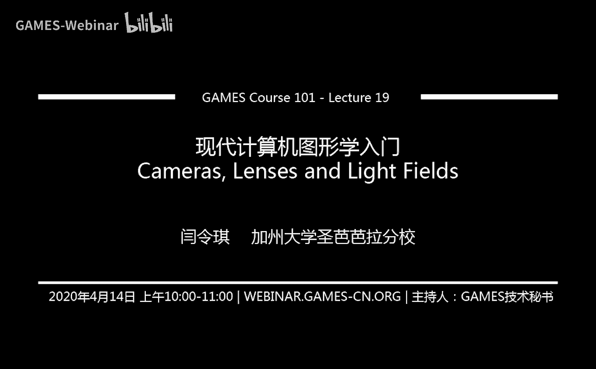

# GAMES101-现代计算机图形学入门-闫令琪 - P19：相机、透镜与光场 📷

在本节课中，我们将学习计算机图形学中一个相对独立但至关重要的组成部分：相机。我们将从最简单的针孔相机模型开始，逐步深入到现代相机中复杂的透镜系统，并解释光圈、快门、ISO等核心概念如何共同影响最终的成像效果。理解这些原理，不仅有助于我们更好地进行图形渲染，也能让我们明白真实世界中的摄影技术。

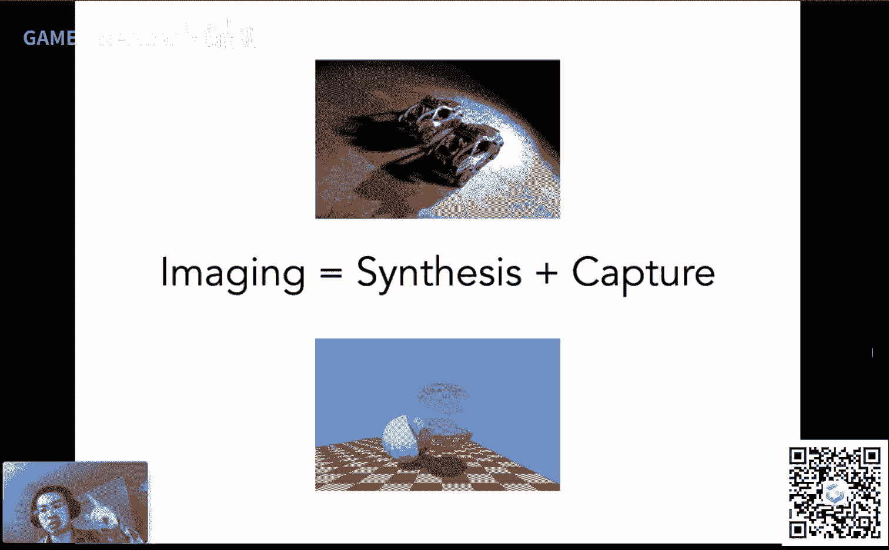

---

## 概述：从捕捉到成像

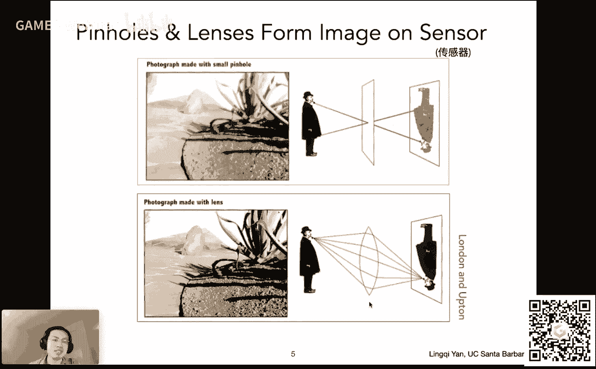

上一节我们介绍了光线追踪等合成成像方法。本节中，我们来看看另一种成像方式：捕捉。捕捉是指将真实世界中存在的事物转化为图像，最典型的工具就是相机。相机作为图形学的重要组成部分，其背后的物理原理是我们今天探讨的核心。

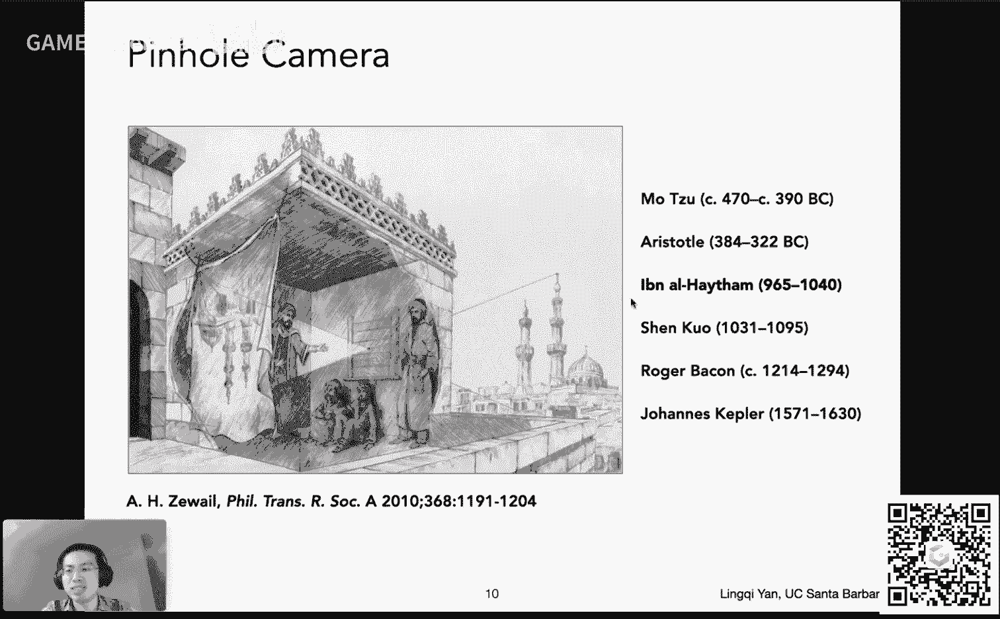

---

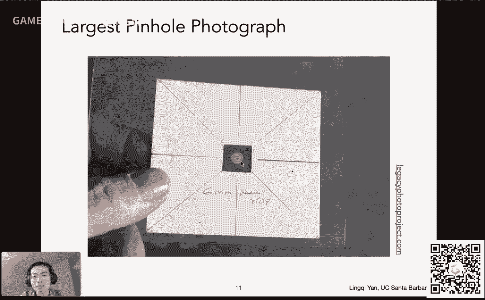

## 相机的基本原理

### 针孔相机：最简单的模型

成像最古老、最简单的原理是小孔成像。其核心是光线直线传播：场景中的点发出的光线，只有穿过小孔的那一部分，才能在另一侧的平面上形成一个倒立的像。这种相机称为针孔相机。

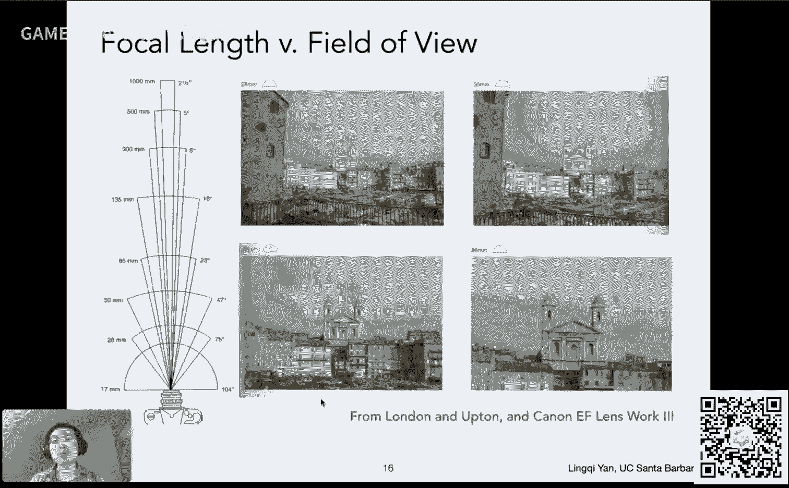

**公式**：针孔相机模型是我们在光线追踪中常用的简化模型。它没有景深效果，所有物体都清晰成像。

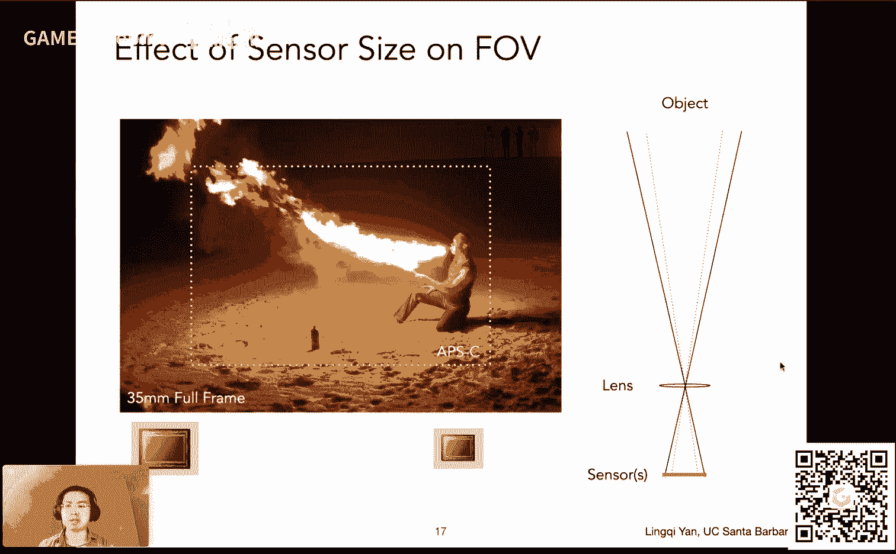

### 现代相机：复杂的透镜系统

真实的相机远比针孔复杂，它们使用透镜组来汇聚光线。为了简化分析，我们引入一个关键概念：**薄透镜近似**。我们假设存在一个理想化的薄透镜，它具有以下性质：
1.  平行于透镜主轴的光线，经过折射后会汇聚到一点，该点称为**焦点**。
2.  穿过焦点的光线，经过折射后会变成平行光。
3.  穿过透镜中心的光线，方向不发生改变。

对于薄透镜，物距（物体到透镜的距离 \(z_o\)）、像距（成像平面到透镜的距离 \(z_i\)）和焦距 \(f\) 满足**高斯透镜公式**：

\[
\frac{1}{f} = \frac{1}{z_o} + \frac{1}{z_i}
\]

这个公式是理解透镜成像的基础。

---

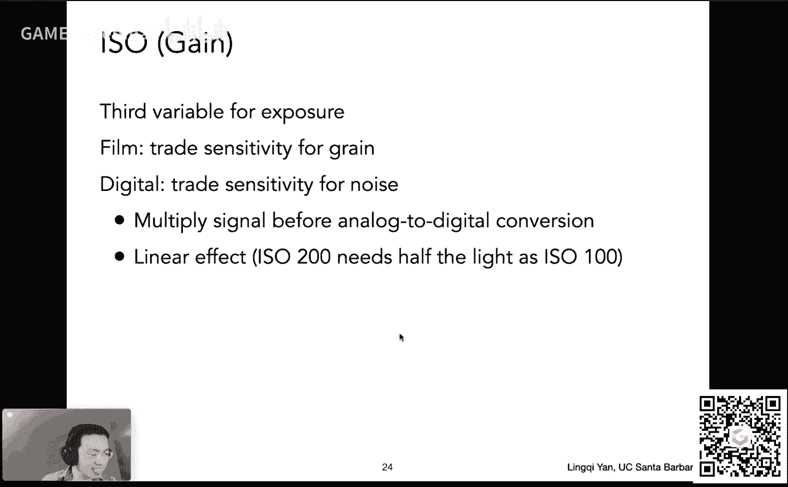

## 相机的核心组件与概念

了解了基本模型后，我们来看看构成一张照片的几个核心要素：视野、曝光三要素（光圈、快门、ISO）以及景深。

### 视野 (Field of View, FOV)

视野决定了相机能“看到”多大范围的角度。它由传感器尺寸和焦距共同决定。

**公式**：对于给定的传感器高度 \(h\) 和焦距 \(f\)，垂直视野 \(\alpha\)（以弧度为单位）可以通过下式计算：
\[
\tan(\frac{\alpha}{2}) = \frac{h}{2f}
\]
焦距越短，或传感器越大，视野就越广。

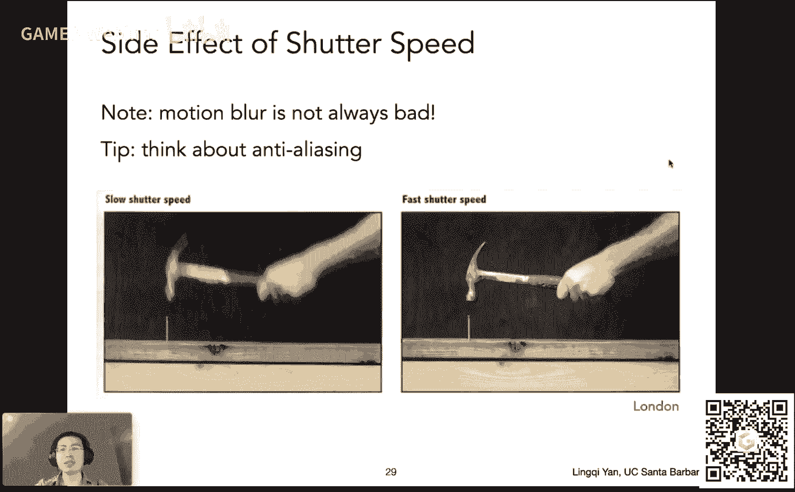

在摄影中，通常以35mm胶片为基准，用“等效焦距”来描述视野。例如，一个“28mm镜头”意味着在35mm传感器上能提供28mm焦距的视野。

### 曝光三要素

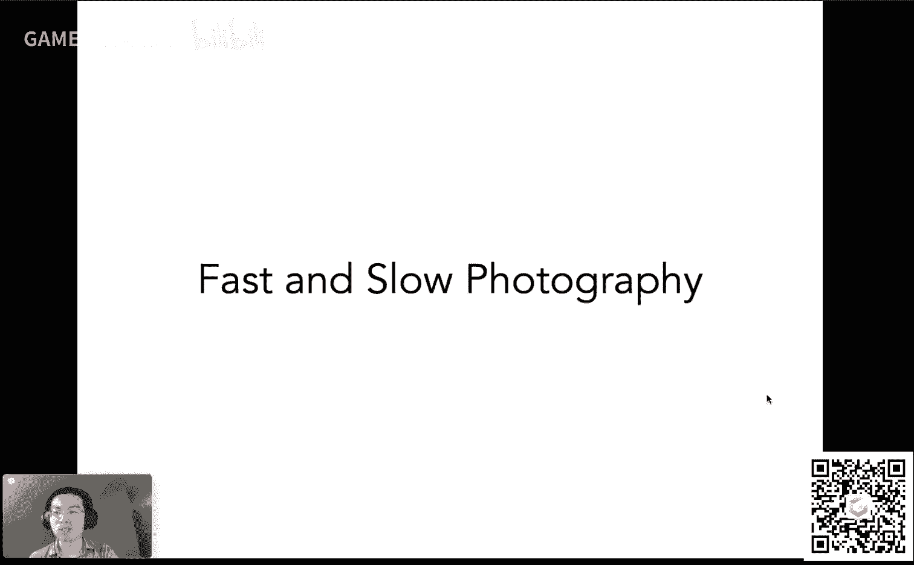

曝光决定了图像的明暗程度。曝光量 \(H\) 定义为：
\[
H = E \times t
\]
其中 \(E\) 是传感器单位面积接收到的**辐照度 (Irradiance)**，\(t\) 是曝光时间。相机通过三个参数控制曝光：光圈、快门速度和ISO。

以下是控制曝光度的三个核心参数及其影响：

1.  **光圈 (Aperture)**
    *   **作用**：控制单位时间内进入相机的光量。光圈越大，进光越多。
    *   **表示**：用 **f数 (f-number或f-stop)** 表示，记为 \(N\)。\(N = f / D\)，其中 \(f\) 是焦距，\(D\) 是光圈孔径直径。**f数越小，光圈越大**（如f/1.4是大光圈，f/16是小光圈）。
    *   **其他影响**：光圈大小直接影响**景深**（后文详述）。

2.  **快门速度 (Shutter Speed)**
    *   **作用**：控制曝光时间。时间越长，进光量越多。
    *   **表示**：通常以分数形式表示（如1/1000秒）。
    *   **其他影响**：快门时间长短会导致**运动模糊**。快速运动的物体在长时间曝光下会变模糊。在图形学中，模拟运动模糊可以避免时间采样上的走样。

3.  **ISO (感光度)**
    *   **作用**：可以理解为信号放大器。它线性地放大传感器记录到的信号。
    *   **代码逻辑**：`最终信号 = 传感器原始信号 × ISO增益`。
    *   **代价**：提高ISO会同时放大噪声，导致图像出现颗粒感。因此，通常优先调整光圈和快门，ISO作为最后手段。

这三个参数相互制衡，不同的组合可以得到相同曝光度但视觉效果迥异的照片（例如，大光圈浅景深 vs. 小光圈长曝光带来的运动模糊）。

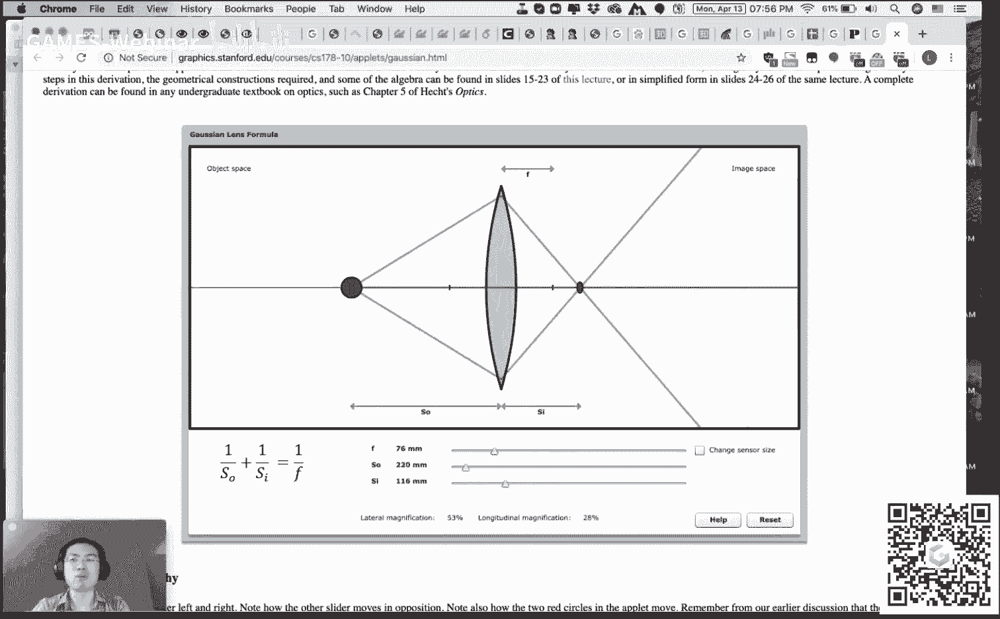

### 景深 (Depth of Field) 与弥散圆

在薄透镜模型中，只有处于**焦平面**上的物体才会在传感器上清晰成像。不在焦平面上的点，其光线经过透镜后，会在传感器前后汇聚，从而在传感器上形成一个**弥散圆 (Circle of Confusion, CoC)**。

**公式**：弥散圆直径 \(c\) 的近似计算公式为：
\[
c = A \frac{|z_s - z_i|}{z_i}
\]
其中 \(A\) 是光圈直径，\(z_s\) 是传感器到透镜的距离，\(z_i\) 是像距。由此可知，**光圈越大（A越大），弥散圆越大，模糊越明显**。

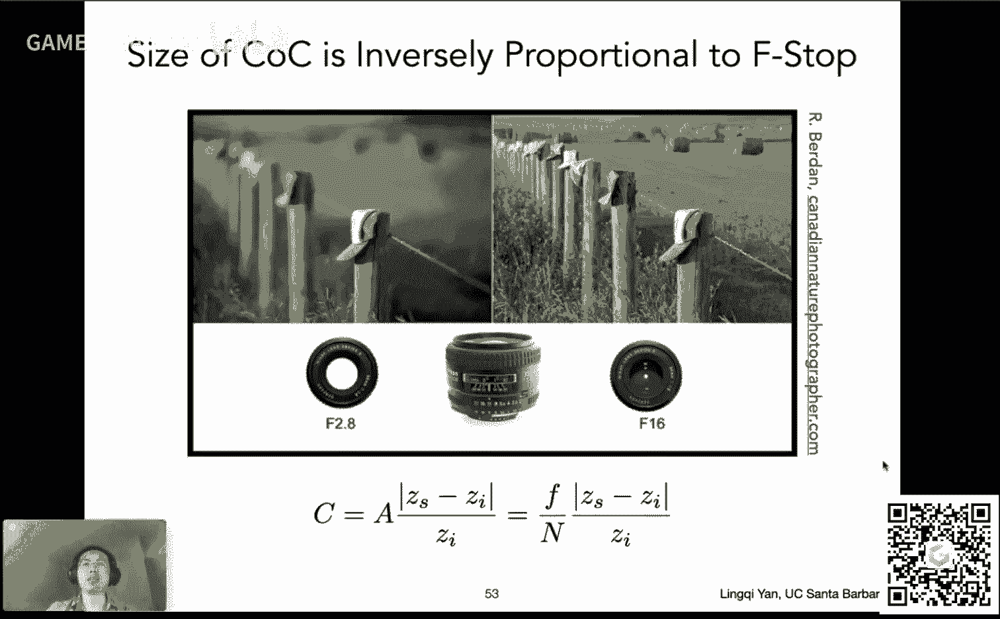

**景深**就是指在场景中，能产生“足够小”的弥散圆（我们认为图像清晰）的那一段深度范围。光圈越小（f数越大），景深越深，清晰的范围就越大。

---

## 在渲染中模拟真实相机

理解了薄透镜模型后，我们可以在光线追踪中模拟真实相机，从而渲染出带有景深效果（虚化）的图像。

**算法思路**：
1.  为相机定义传感器平面、透镜（包含焦距 \(f\) 和光圈大小 \(A\)）以及期望的焦平面距离 \(z_o\)。
2.  根据高斯透镜公式，计算对应的传感器距离 \(z_i\)。
3.  对于传感器上的每个像素点 \(x'\)，不再像针孔模型那样发射单一光线，而是：
    *   在透镜光圈范围内随机选择一个点 \(x''\)。
    *   连接 \(x'\) 和 \(x''\)，根据透镜公式计算出这条光线在焦平面上的交点 \(x'''\)。
    *   从 \(x''\) 向 \(x'''\) 方向发射光线进入场景进行追踪。
    *   该光线携带的**辐亮度 (Radiance)** 最终贡献给像素 \(x'\)。
4.  通过大量采样，不在焦平面上的物体就会因为光线路径的发散而形成模糊，即景深效果。

---

## 总结

本节课我们一起学习了相机成像的核心原理。我们从基础的针孔相机模型出发，引入了理想的薄透镜模型及其成像公式。然后，我们详细剖析了构成一张照片的关键要素：**视野 (FOV)** 决定了画面范围；**曝光三要素（光圈、快门、ISO）** 共同控制画面明暗，并分别影响景深、运动模糊和图像噪声；最后，我们利用**弥散圆**的概念解释了**景深**现象，并了解了如何在光线追踪渲染中模拟真实的相机镜头效果。掌握这些知识，是连接图形学合成成像与真实世界摄影捕捉的重要桥梁。

---
*课程内容源自 GAMES101-现代计算机图形学入门 第19讲。*