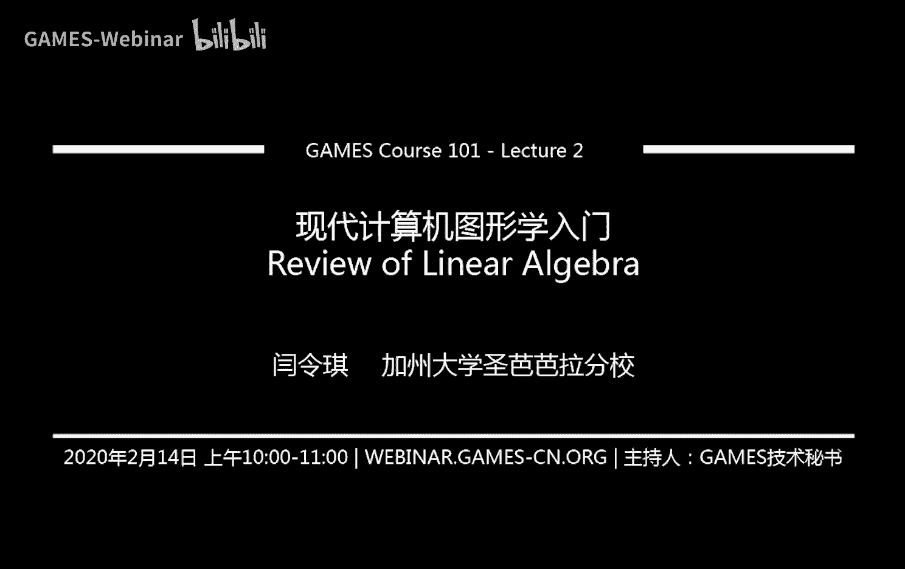
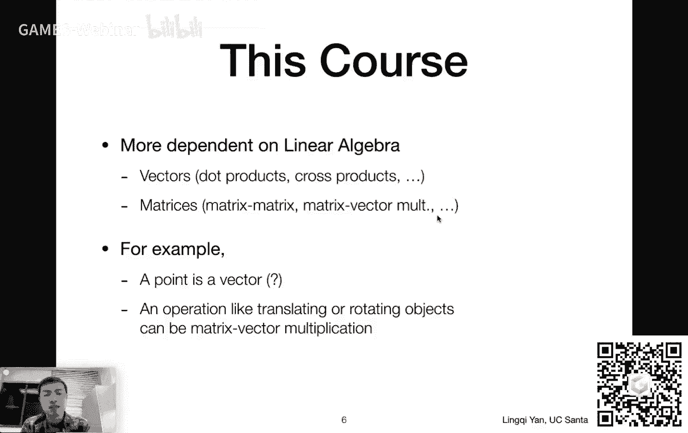
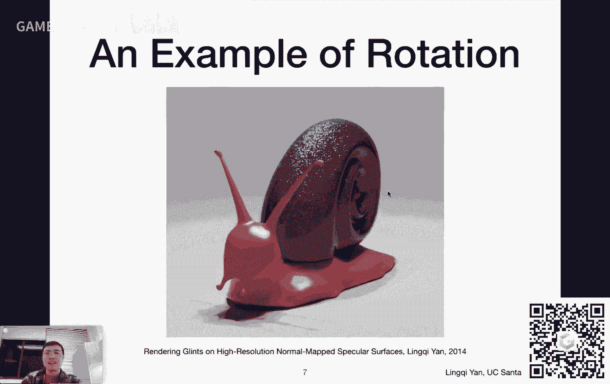
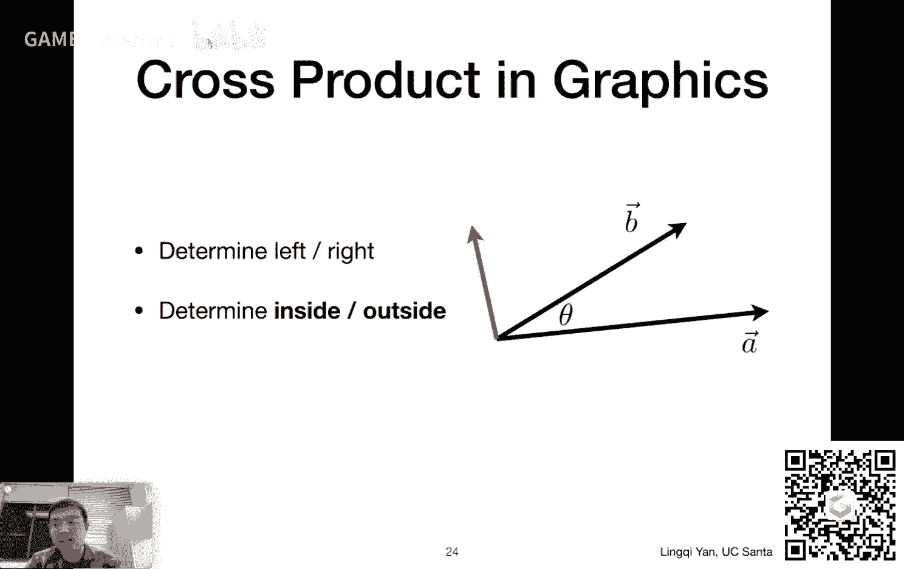
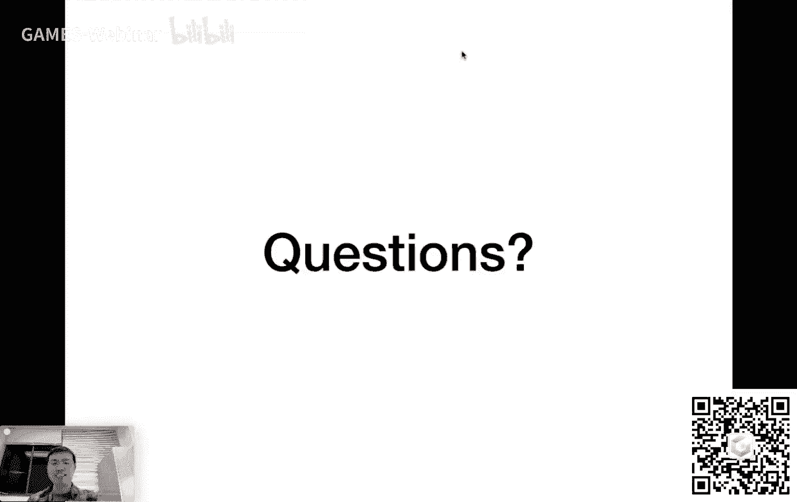

# GAMES101-现代计算机图形学入门-闫令琪 - P2：Lecture 02 Review of Linear Algebra - GAMES-Webinar - BV1X7411F744

那呃咱们这就开始啊，在这个课啊之前，我们先说一说是有几个事情啊，宣布一下，首先呢一个是呃每一节的课后，然后我们的这个呃这个课件会以这个pdf的形式放出来。

然后我们这个这个录录播也会也会放到这个games的网站上，然后这两者都可以在我们课程主页上找到，也就是通过我的这个主页啊，然后有一个课程课程主页，然后找到了之后，这个嗯课件和这个录音都可以看到呃录像哈。

然后这就是大家应该能够看到的这么这么一个表格，就是每一节结束之后都会有这么两个链接，然后呢有同学反映到说这个课件啊，然后嗯会会比较慢，然后从games的网站上。

大家也可以看得到这个呃在百度网盘上面上传的这个课件，所以说应该都没有问题啊，然后呃嗯这里大概就是这么一个方式，然后另外呢大家可以看到，比如说这个今天14号，然后这个说向量与线性代数，那么在这个课之前呢。

大家就可以先看，呃虎书，the tiger book，然后他的第几章，这个是书里面和咱们这个课上要讲的这个相似的内容，大家如果愿意的话，然后课程之后也欢迎再去阅读，好吧，就是说这本书本身就不做要求。

那么大概就是这么回事，然后另外一个呢这个今天是国内时间，已经是2月14号情人节，然后祝大家情人节快乐，然后如果大家现在还单身，祝大家早日脱单，早日找到另自己的另一半。

然后如果大家这个这个啊已经有了另一半的话呢，这个祝大家有情人终成眷属，然后长长久久好吧，那这个呃就说到这里啊，另外还有一点啊涉及到这个打赏的这么一个事情啊，这个这个和毫无必要啊。

这个这个嗯就是说首先这是一个本来就是这个公众平台公益的性质，然后这个要打赏就这个那显得多少有一点这个不合适啊，这个反正感谢大家，大家要是愿意支持我就多过来上这个课就可以了，完全没有必要来做这个打赏。

好吧啊，那就说到这里，那么这个我们上节课呢说到什么了呢，这个我们提到什么是计算机图形学，我们定义了一下，然后我们提到了说我们这个课啊分为四部分，然后如果大家还记得的话，光栅画几何。

然后这个光线追踪和这个呃模拟或动画这一块总共四块，然后呢课程涉及到这些网站啊，别的这些各种各样的这这个啊，这各方面的这些事情应该都已经交代到了，那么上一节课大概就说了这个事情。

那么这节课呢咱们要就要从这个最基础的内容开始，一点一点把这个图形学的基础这个开始构建起来，那么图形学呢其实依赖于很多东西，那咱们这节课主要是来说这个线性代数，大家可以看到这个标题非常恐怖，对不对。

这个swift and brutal introduction，然后这个这个其实是参考之前清华有门课的这个呃，这个这个这个标题啊，那个我记得当时那门课叫计算机入门。

然后这个课叫做swift and brutal introduction to computer science，然后大家国内翻译成超快萌这个计算机入门啊，然后我们借用一下概念，然后其实呢怎么说呢。

大家线性代数这个概念其实本身并不难，大家就会知道其实相对简单啊，没什么问题，咱们这节课只是说的快一些啊，然后啊这就是主要的内容，那么咱们为什么要说线性代数呢，是因为图形学依赖于线性代数。

其实图形学依赖于很多不同的东西，比如说这个基础的数学，像这个呃线性代数微积分，然后统计像这些都是这个非常用得到的一些知识，然后呢也涉及到一些基础的物理，物理呢主要就是涉及到光学和力学这些方面的知识。

嗯然后以及说随着现在图形学的发展，大家越来越看重说更高深一点物理学的知识，比如说其实我自己这边也在做类似的所谓波动光学的研究，就是说那当我们不能再假设这个光是直线传播这个时候，然后这种情况下。

这个光作为一种光波，如何与这个物体的表面材质进行作用，然后得到不同各种各样不同的这个这个这个呃外观啊，这都是这个图形学涉及到的东西，光学和力学这里，然后呢这个还涉及到一些杂七杂八。

各种各样方面的知识都会涉及到，比如说这里我特别提到信号处理，因为有很多情况下呢，我们要分析说这个这个这个出现了一些，比如说我们平常经常听到的一些走样这种现象，然后有一些叫做反走样的技术。

有很多这些技术呢在背后都是要解决一些信号处理的问题，然后另外数值分析这是一个非常重要的事情，有很多情况下，图形学其实就是在解一些复杂的一些这个数学计算，比如说积分。

像这个渲染整个过程其实就在解一个这个呃递归定义的积分，然后呢像这个模拟或者仿真，这里其实有很多在解一些比如说有限源问题，或者说呃呃各方面的这些扩散方程之类的事情，就是说嗯这块呢依赖了很多。

然后呢图形学还要依赖于另外一点点啊，这一点给大家提一下，还需要一点点美学，做出来点东西之后啊，其实这个大家都希望这个图形这个大家做出来的图形能够挺好看的，所以说有一点这个美感是很有很有必要的一件事情。

当然了上这门课也能够培养那么一点点啊，大概就是说我们会提到这么一些一些这个这些内容，这些呢渐渐的都会穿插在这门课里面，然后这个之后再给大家慢慢介绍，那么咱们这节课就会把这个线性代数说一下，嗯。

然后它更多的依赖一些基础的这些课程，特别是线性代数，然后线性代数呢我们主要要说一些这个向量啊，矩阵啊这些操作对吧，向量涉及到什么点乘，叉乘，也这个这个呃向量的呃，这个这个矩阵呢涉及到矩阵和矩阵的乘。

矩阵和向量的乘，然后比如说在图形学里面啊，咱们要表示一个嗯什么呢，一个点对吧，x y z3 个这个坐标啊，然后这个空间中的一个点，那我们用三个数来表示，这个实际上就是一种向量表示。

然后呢这个涉及到各种各样的，比如平移旋转缩放，各种各样的这个操作，我们都可以把它给表示成这个啊矩阵和向量的乘法，所以这些是非常有必要的，然而这些东西呢并不难，那咱们这个课呃。

这里呢先给大家看一个这个例子啊，这个动画是我自己做的，然后呢这个嗯它为了说明的就是其实这个这个物体在旋转下，它会看着是长什么样啊，这个蜗牛的这个壳，然后大家看到很多不同的这些发光点。

然后但是呢这里大家要关注的点在哪呢，在这个蜗牛啊，它本身是在是在这个不断旋转的，然后如果大家这个仔细看的话，嗯其实这个这个这个蜗牛的旋转速度它一直在变化，也就是说它这个是从一边旋转到另一边。

然后到了两边突然就停下来，然后再再回到这边也是一样，并不是以一个固定的速度来进行旋转，这是一个非常简单的例子，所以说这个是很有意思的一个事情，然后这当然了。

这就是一个旋转的例子，很简单，就是用一个旋转矩阵，然后咱们很快就会说，那么咱们今天的课呢最最基础的内容，咱们自然要从向量说起好吧，然后这个向量呢这个这个概念叫做vector。

然后涉及到数学和物理上面不同的定义，数学上更愿意管它叫向量呃，物理上更愿意管它叫矢量，就是那个箭矢的矢，就是就是射箭的箭，就是那个矢量，然后呢呃这个呃我们就管它叫向量好吧，这个没有什么关系。

那么这个向量呢这从名字就可以体现得出来，它表示的是一个方向，那么呃在这里大家可以看到，比如说呢我有一个箭头，这个从a指向b，那么这个向量其实表示的就是从a指向b这么一个方向。

那这个方向经常是怎么得来的呢，就是从这个b的坐标减去a的坐标，然后就可以得到这么一个向量，从a指向b然后向量呢如果你去平移这个向量，它表示的都是同一个向量，因为它只要指向同一个方向，那它就是同一个向量。

然后像这里这个ab向量b减a，然后，嗯b减a得到这么一个a b这个向量，然后我们也可以把它也可以把它写作另外一个用用某一个字母来表示，比如说写作a然后上面打个箭头。

然后或者呢这个印刷上面经常会涉及到这个向量，把它写作一个粗体的一个字母，然后写作a没有问题，然后呢这个向量最重要的有两个属性，一个呢是方向，就是这个a和b它当然了向量向量表示的就是不同的方向。

然后另外一个向量本身还能表示它的长度，所以从a到b，如果这个b离得远一点啊，那a和b之间这个距离长，那就是这个向量的长度要长，如果要短的话呢，向量短呃，就就相对较短，所以向量表示两个不同的内容。

一个是这个方向，一个是长度，然后呢我们刚才提到这个向量，如果你平移它移动各个这个到不同的位置，那它表示的仍然是同一个向量，因为a和b之间的相对位置没有改变。

所以说这个向量的我们并不关心它的这个绝对的开始的位置，然后就是这么一个意思，然后啊向量我们刚才既然提到它的方向和长度，那我们就把它的长度可以直接写出来，是什么呢。

就是说比如说一个a向量就是a上面一个箭头啊，然后这个左边右边各加两个斜杠，然后这个表示的呢就是这个向量的长度，然后向量的长度呃，这个有什么用呢，就是这个向量的长度可以给我们提供一个这个什么呢。

给我们提供一种向量吧，叫做单位向量，什么叫单位向量呢，就是如果这些向量它表示的长度是一，那么这个就是单位向量，那么给你任何一个向量，你怎么把这个向量给变成单位向量呢，很简单，你去把这个向量本身去除。

以它的长度，那么你得到的就是一个和你原始的向量同方向，并且长度为一的向量，也就变成了一个单位向量，这也就是大家看到的这里这个公式哈，大家可以看到这个公式啊，他这个呃是这个原始的这个向量a除以它的长度。

然后我们把它定义成a然后上面写一个这个东西，这个东西这个我们正正常英文会管它读作a hat，hat，就是那个帽子，然后正常情况下呢，我们用这个形式来表示单位向量。

然后在图形学里面可能更多的是大家一提到方向，就认为我们用一个单位向量来表示方向，然后我们不关心它的长度好吧，然后那就是就是说我们用单位向量是可以只表示一个方向的，那这个就非常好用。

然后在图形学里有涉及到各种各样不同的方向，然后咱们再待会儿再给大家这个一一解释，然后向量呢有很多基本操作，然后基本操作呢挺简单的，比如说最最最最简单的操作就叫做这个向量求和，那么向量求和呢很简单。

你要给两个向量，比如说给你a和b，然后给你这么两个向量呢，然后你如何去算出a加b是什么，那么这里有两个不同的解释，一个叫做平行四边形法则，一个叫做三角形法则，那么平行四边形法则是什么意思呢。

大家看左边这幅图，那咱们可以把这个a和b既然我们我们我们刚才说啊，这a和b都可以任意的这个移动，不影响它们的值啊，然后呢a和b我们可以把它放在同一个起点上，然后放在同一个起点上。

那就是大家看到的左边这张图的左下角，然后呢然后我们把这个b和a都这个平行的搬移一段距离，使得呢这个这个这个a和b和另外一个a和b围成一个平行四边形，那么这个平行四边形的对角线。

这条红线就是a加b那这是一个平行四边形法则，然后这样可以告诉我们两个向量加起来是什么，然后另外呢向量还有一个计算方法叫做三角形法则，三角形法则在这个图形学里面用的也挺多，就是说这个很简单。

我们要相加若干向量，我们就把这些向量首尾相接的拼起来，那么最后形成的这个最开始和最结束，我们把它连起来，那就是这个这个相加的和那这个不只适用于一两个向量啊，就很多向量也可以这么做，比如咱们看右边这幅图。

这个要算a加b怎么办呢，把这个a和b首尾相加，也就是说把这个b的开始放在a的结束上，然后呢a加b也就是从a的起点到b的终点，那如果a加b加c，大家可以这个一直这么操作下去，那这个就很方便。

然后这两种呢不管是平行四边形法则还是这个三角形法则，最简单的做法呃，就是就是啊嗯通过这么一种几何的这么一种理解呃，然后然后来看这个在几何上两个两个向量加起来是什么。

那么还有一个理解就是在这个数学上或者代数上，这个向量相加是什么呢。

那就是直接把他们的这个坐标加起来，这个非常简单，这个很快就要跟大家说，大家如果看这个例子，就是说啊我们现在呢在描述同样是一个向量向量a，但是这里呢大家会看到这个有一个这个坐标系在这里面。

然后有一个x一个y x向右y向上，然后这个这里呢就其实是在用这个直角坐标系，或者叫笛卡尔坐标系来描述这个向量，那么这个向量什么意思呢，我就认为这个向量永远都是从这个原点开始，零零也就是左下角。

然后呢这个沿着x有一些这个单位向量，然后向右走，这个大家可以看到这个x被分成了好多段啊，这就认为是这有有很多不同的这些单位，然后呢y方向也是一样，这个分为好多段，那么一个向量到底是多少呢。

我们就可以用几个x加几个y来表示，然后通常的这个xy是是这个定义成这个互相垂直的，并且都是单位向量，然后这个像这里的情况，这个a向量呃，黄颜色表示我们就可以把它表示成四个x加三的y。

大家可以看到这个比较清楚对吧，然后这样的话呢有什么好处，就是说我们可以直接用这个坐标四和三这两个数来表示，这么一个向量，那在这里这个这个a向量大家可以看到左下方这个a向量写作xy。

这个x y呢就是表示他这个前面的数就是多少个x和多少个y的意思，那么这就是它的这个坐标表示，然后这里有一点哈，在图形学上，我不知道在其他的领域怎么样定义，在图形学上，大家默认给一个向量嗯。

如果不说它是一个什么样的形式，我们就认为这个向量是一个一个这个往下写，也就是说任何一个向量嗯，这个呃缺省的设置是这个向量是个列向量，就是一列数好吧，然后呢这个向量我们也可以把它变成一个这个横的。

也就是变成一个行向量，像这个中间大家看到了一个a t等于x y，这个t是什么意思呢，就表示这个转制就是把这个这个呃任何一个向量的行和列互换，那自然是这个原本是默认是列向量，那么这个转制之后呢。

就变成了这个行向量x和y横着写啊，这个呢在矩阵上面大家也会这么用，然后呢我们为什么要这么写写写呃，这个定义这么一个呃，这个这个x和y这个直角坐标是因为如果我们这么定义的话，对于两个轴如果垂直。

而且又是这个以单位向量这么一节一节给加起来啊，就是说那我们算这个向量长度就非常简单，那怎么算呢，比如说像这里这个二维的向量对吧，然后我们就用它的x平方加上y平方，然后开个根号就可以得到这个向量的长度。

然后比如说像这个情况，大家看看水平方向是四个格子，竖直方向是三个格子，那么这个大家知道这个勾股定理就告诉大家这个这个向量长度是五啊，那也就是说啊，我们把向量表示成直角坐标系的这样一种代数形式。

是非常有助于计算它的长度的，所以这就是为什么大家平常会用一套坐标系啊。

那大概就是这么一个道理，那向量的加法以及他们这个之前的这个这个表示都是非常简单的，那么向量更广泛的用法，也就是这节课主要要跟大家说的两个这个计算，就是向量的这个点乘和叉乘这么两个计算啊。

那么都是什么意思呢，这个就是说啊这个嗯向量的乘法它和这个数的乘法不太一样，像我们提到数的乘法，那就是乘法呗，那向量的乘法其实是两个不同类型的乘法，那也就是说两种不同的运算，那咱们把这两个分别看明白好吧。

就是说呃比如说啊大家现在看到这个屏幕中间只有两个向量a和b，然后呢这个呃这个向量的点乘是什么意思呢，就是这么定义的，大家可以看到这个呃a向量点乘b向量，然后等于这个呃等于什么呢。

等于a的长度乘以b的长度，再乘以它们两个之间夹角的余弦，然后就是这么这么一个定义，然后这个定义呢自然是最最最标准的定义了，比如说给大家呃给定了两个不同的，向量，那么它的长度我们自然知道。

然后这个两个向量之间的夹角，我们假设能够算出来，然后这个用一个余弦cos就可以算出来这个这个这个数是多少，那么有一点这个是需要这跟大家说明的，就是说这个大家看到从这个a向量点乘这个b向量中间打个点啊。

这个最后的结果，你看a向量的长度是一个数，b向量的长度是一个数，这个余弦仍然是一个数，所以说这三个数乘起来它其实还是一个数，所以左边是两个向量，然后它的点乘是一个数字，然后或者叫做一个数量。

然后就是说这，这里就是点乘能够告诉大家的结果，就是说向量的点乘给大家最后得到的是一个数，那么下面要给大家说的呢，就是说嗯这个定义呃我们要怎么用它，特别是在图形学里怎么用它，这个很简单。

比如说我们可以做一个简单的变化，把这个a和b的长度啊，拿和那个a和b的点乘拿到一边去，把这个夹角余弦放在另一边，那也就就是发现大家可以看到这个左下角的这么一个画面，一个定义哈，这个给定两个向量。

两个向量之间夹角的余弦是它们的点乘，然后这个除以他们这个呃各自的，长度呃的积，那么也就是说给你两个向量，大家立刻就可以算出这个嗯呃这两个向量之间的夹角，余弦也进而可以算出两个向量之间的夹角。

也就是说点乘可以帮助大家快速的得到这个呃两个向量之间的夹角，特别是在一个什么样的情况下最方便呢，特别是在两个向量都只是方向，也就是都是单位向量的时候，大家可以看右边这个公式。

当两个向量都是单位向量的时候，它们的长度自然都是一，所以他们的点乘自然直接就是它们夹角的余弦，所以这个时候只需要我们做一个这个，反余弦我们就可以得到这个这个呃两个向量之间的夹角。

所以向量的点点乘是很有用的，那么说到现在其实还没有说明这个这个向量点乘要怎么算，对不对，然后这个我们之后在代数的这一方面，然后给大家解释，那么这个这个点乘呢，然后它本身既然是一种运算运算法则呢。

都会满足各种各样不同的这个呃性质，比如说点乘满足有这么几个性质，这个和数字的乘法非常相似，什么呢，交换律结合律和分配率对吧，这个大家可以看到交换率呢也就是说a和b点乘等于b和a点称，这，个挺好的。

然后呢如果a和b加c这个做点乘，那么就等于是a和b做点乘，然后再加上a和c做点乘，然后如果有一个数字k去乘以某个向量，再和另外一个向量做点乘，那就好像是说这个某个向量和这个这个这个k嗯。

呃应用在另外一个向量上，他们两个做点乘，或者说先做点乘在前面再乘以一个k这个问题都不大，这些是这个向量的一些基本属性啊，这个向量点乘的一些基本属性啊，然后我们刚才就提到这个事情啊。

就是说这个点称自然有它的定义对吧，就是呃a的长度，b的，长度，然后夹角的余弦撑起来，那么在这个直角坐标系或者笛卡尔坐标系下，他们其实这个点乘的运算会更加简单呃，为什么呢，因为大家可以看到。

比如说在二维的情况下，那我们用两个数x y来表示一个向量，那a呢就是x a然后y a然后这个b就是x b y b，然后他们两个的点乘就是x a乘x b加上ya乘y b。

大家发现这个就是其实就是对应的元素相乘，并且加起来，那么这个道理可以同样扩展到高维，在三维上也是一样的，就是说这个这个两个向量在三维上，那自然怎么表示，呢那就是用x a y a z a这三个数。

然后表示a，然后x b y b z b这三个数表示b，那么这个两个向量怎么做点乘呢，很简单，也是对应元素点乘x a x b加上y a y b加上z a z b，就是说对应的元素相乘，再把它们加起来。

那么从这个过程大家可以清晰的看到哈，这个给定的两个数呃，两个这个输入都是向量，都都是这三个一组或者两个一组对吧，然后最后的结果就是一个数，这也就是点乘的性质，那么就是通过这种方法来计算的。

然后呢这个点成我们刚才已经提到它最大的作，用特别是在图形学里面，就是用来找到这个两个项链或者两个方向之间的夹角，然后或者说是余弦夹角，然后呢嗯特别是比如说我们之后在做光照模型的时候。

我们知道光从哪一个方向进来，然后这个物体表面的法线是什么样的，然后这个我们从哪个方向去看啊，那这些方向之间互相的夹角，这个计算都是通过点乘来来这个运算的，然后呢这个点称还有另外一个这个很有用的事情。

就是说我们要找到这个呃一个向量投影到另一个向量上是长什么样，这个是什么意思呢，大家可以，看这么一个例子，就是说我们现在看啊，a和b它们两个方向是不一样的。

然后但是我现在希望把这个b向量所谓投影到这个这个a向量上去，那是什么意思呢，就是说假设有一竖这个光线平行着的啊，然后他们垂直着a方向照过来，那么这个b自然会投出一个阴影，在a上，那投出了这个阴影。

这一段我们就管它叫做这个b在a上的投影，然后呢这个这个这个这个大家就会看到这里是应该怎么计算它呢，这个呃，这里就需要用到刚才我们提到的这个向量的这个这个基本属性的知，识那向量有哪两个属性呢。

有方向和大小和长度对吧，那么既然是b向量投影，在a是a向量上，那么这个投影一定是沿着a方向的对吧，所以说首先啊这个这个投影这个所谓b pp这里这个这个这个东西啊，这个符号叫做pp。

也就是perpendicular的缩写，这个b pp的这个这个方向就已经定下来了，那一定是沿着a对吧，因为我们要算它沿着a的投影，那么一定我可以把这个b pp表示成这个a4 a向量对应的方向。

也就是这个a的单位向量a hat乘以一个长度，这个k那么现在只要我们能够把它，的长度算出来就可以了，对不对，那么怎么算它的长度呢，那大家看到这这里这个有一个直角三角形关系。

因为我们要把b向量投影成be purp，那么这里自然有一个这个嗯这个呃直角三角形在这里存在，也就是就是从这个呃b pb的中点到这个b的中点，然后这么一条边，然后还有b pp本身加上这个b向量自己。

那这个形成了一个直角三角形，那么be pob的长度是多少呢，那也就是b的长度乘以这个a和b的夹角余弦对吧，然后也就是这里为什么是b的长度乘以cos c的，然后这个夹角余，弦怎么做，大家已经知道了。

直接拿这个点成这个a a和b的点击，然后他会告诉我们夹角的余弦，所以这里就等于是能够把一个这个呃，能够把这么1111个向量在另外一个向量的投影算出来，那么投影算出来有什么好处呢，对吧。

然后这个嗯投影算出来有一个好处，就是说我们可以把一个向量分解成两个向量，其中让一个一个方向这个平行于某方向，然后另外一个方向垂直于某方向，比如说像这里，我们既然知道be purple怎么算。

那么另外一个方向这个b减去be pop，我们就可以知道，是是什么，然后这里减法呢不给大家多做介绍，因为减法和加法是互逆的嘛，就就是说这个嗯be pp这一段加上这个b减去b pp这一段加起来之后。

大家用平行四边形法则会发现诶这个就等于这个b向量没有问题，那么呃这个呃嗯这就是点乘能够给大家带来的一个好处，就是说大家可以把一个向量任意的进行这个垂直与平行的分解，然后这是一个很重要的事情。

那么在图形学里面呢，这个点乘还会给大家这个另外的一些好处，比如说我们可以计算这个两个向量啊，或者两个方向，有多么接近，那什么叫接近呢，就是说我们可以算这个两个向量的这个点乘点乘的结果。

然后根据他们点乘的结果，我就知道它是否是接近还是远离这两个方向，那待会儿会给大家说，然后呢这个向量的点乘还可以告诉大家关于一个前与后的信息，这个事情非常有用，那什么意思呢，咱们可以看一下这个例子。

就是说啊大家可以看到，如果这个有一个呃向量a给定了某一个方向，那么我我可以这个这个考虑到这个呃，比如说从a的起点，像这个整个上面方向看过去以及向下面方向看，过去，然后各会形成一个半圆。

然后在这里整个大家可以看到一个整个圆被分成了两部分，一部分在这个上半部分，我们认为如果有一个向量是处于这一部分的，就是说它的终点是落在整个这个虚线以上的。

诶那我们就认为这个a和b是属于基本上算是相同方向，或者说都是向前的，然后呢如果有一个向量，比如像这里向量c它的终点落在了这个曲线的下一部分，然后这个时候呢我们就认为说这个哦。

a和c他们两个方向基本是相反的，那么这里怎么样判定这个事情呢，就是说这，就是典型的一个好处，就是说我们如果用呃这个a和b向量求点乘，我们会发现哦这个点称会给我们一个这个大于零的值，也就是正数。

然后呢如果我们去点成a和c，然后这里的点乘的结果会告诉我们这是负数，然后呢如果说有一个向量正好它的这个终点呃，在这个虚线上，那么这个a和这个向量求了点成之后会给我们一个零这么一个结果。

那就是说啊嗯这个向量的点乘可以告诉我们方向性就是方向基本一致，或者方向基本相反，或者方向垂直，那么同样道理，点乘也可以告诉，我们这个呃这个这两个向量有多接近，比如说呢这个b向量和a向量它就比较接近。

然后我们求点成点击的时候啊，这个得到的结果啊就会比较接近一，然后呢如果说这个这个b向量渐渐渐渐这个方向和a远离了，比如说远离到一个什么程度呢，到和a垂直，它就会渐渐变成零，然后这个再远就会渐渐变成负。

一直到他们两个完全相反这个方向，然后他们两个如果都是方向向量的话，那么点乘的结果会这个从这个一就是完全相同的方向，变成完全相反的方向，也就是-1，就是说它。

这个值呢可以告诉大家这两个向量在方向上有多么接近，然后这个呢很有用的，就是说这个之后这个大家会看到这个呃，之后这个在图形学中的应用，然后这里就是点乘，那么啊这样哈我们很快要给大家介绍这个插成。

然后在这之前我先看一下这个大家之前有没有什么讨论的一些问题哦，我明白了，大家有同学问这个说为什么要用这个呃，呃这个这个这个为什么要用哦，为什么为什么默认是个列向量啊，这是约定俗成的一件事情。

当然可以用这个行向量，有一些书是用行行行向量，没有问题，但是就是说呃更多的应用，比如说特别是在这个图形学的这些硬件上面，这个或者说app上面这个open gl之类的东西。

大家默认都是在用这个这个默认的列向量，然后这样的话所有的矩阵可以组成这个之后，我们再给大家说，然后呢嗯这个有人有人问有什么应用啊，啊点乘的这个呃说为什么两个向量是否接近，这个有什么应用啊，这里这很简单。

比如说这个大家看一个镜子哈，然后有一束光打在这个镜子上，然后大家知道有这个镜面反射这么一个一个一个反射的定律，那如果，啊那如果说你的眼睛这个是就是这个啊。

嗯就是从它的这个镜面反射出射光的这个方向上看过去，那你就会看到一个反射的点非常亮，如果你这个呃眼睛稍微这个和这个方向错开一点点，那你就看不到这个反射，那如果对于金属来说，金属的这个高光是怎么来的呢。

同样的道理就是说入射的入射光打到这个金属表面，它会反射，然后在这个它的镜面反射的这个方向周围，然后如果你从这些方向去观测啊，那这个得到的结果都是这个基本上属于在这个呃高光里面，那如果说离得远。

那你就看不到，所以我们需要有一个办法来这个这个提供这个两个向量，是否接近这么一个标准好吧，那大概就说到这儿，然后这里这个我们继续往后说这个向量的这个差距，那么向量的差距是什么意思呢。

就是这是另外一种计算，它虽然也是乘法，但是它是和刚才的点击是完全不一样的计算，那么这个嗯大家可以看到这是一个示意图哈，嗯所谓这个差距呢，它会呃输入两个不同的向量a和b。

然后他会给呃这个给出也就是计算出另外一个向量，这个计算出的这个向量，也就是说这，两个向量的原本这个输入向量的这个差距的结果，和原本的两个向量都要垂直，那么大家想一想，那既然既然这么定义了的话。

嗯这个差成之后的向量，假如说咱们把它记作c，那么c要垂直于a，c又要垂直于b，那么c必然垂直于a和b所在的平面，那也就说明了这个向量c一定和a和b不在一个平面内对吧。

然后呢这个呃这个大家可以从这个公式的定义上面来看啊，就是说我们会写a叉乘b，然后然后这个呃它的定义是这个a的长度乘以b的长度，再乘以sin，西塔其实还需要，一个方向啊，这里这个这里写的并不并不正确。

就是说呃不是说不正确，而是不完善，就是说这里只是给大家定义了a这个叉乘b的嗯，这么一个大小应该是多大，但是它的方向并没有写出来，然后它的方向应该如何决定呢，我们刚才说啊，这个叉乘会给大家一个新的向量。

垂直于a又垂直于b，这里呢就需要大家应用一个叫做右手定则的一个一个这个规律，什么叫右手定则呢，很简单，伸出右手来啊，说起来是这样啊，有两种不同的右手定则，一个是伸出你的右手的三个指，这个拇指食指。

和中指这样的话，然后你会把它给摆成一个这个互相垂直的一个方向啊，这是一种右手定则，但是在这里呢我们给大家介绍的是另外一种叫做右手螺旋定则，大概是这么个意思啊，就是好像大家点赞这么一个样子，什么意思呢。

就是说大家是这个四指的方向代表了一种旋转的方向，就是说我们要算这个a和b的差乘或者是差几，那我们就从a旋转到b方向，那么这个拇指对应的方向就是它这个这个向量的这个呃，这个这个他们两个向量叉乘出来。

得到了这个结果，它的方向，那么这，里大家可以对照这个屏幕，这个a和b大家看一下对吧，从a绕到b那自然就是向上的，那么这个给大家这个既然说了这个右手定则哈，那咱们大家可以试一下，那如果b差成a是什么呢。

那大家可以想象一下，从b插成a，抱歉对大家做这个动作并不意味着什么事情啊，这个从b到a这个这个这个呃转过来大家会发现啊，这个b差成a其实得到的一个向量正好和a差成b相反。

他们的这个这个上下这个这个方向是相反的，然后呢这也就告诉我们，如果，我们要交换两个向量的叉乘的顺序，那么必须得加上一个负号，就是这么个意思了好吧，然后这个这个这个这个嗯嗯向量的差距有什么作用呢。

我们可以用它来建立一个三维空间中的直角坐标系，然后这里大家就可以看到这是什么意思呢，比如说啊这个在三维空间中，大家给定了一个x轴和y轴，然后我们可以通过x轴差成y轴的方式算出z轴是什么。

这个就是就是这个呃这个向量叉乘的这么一个一个一个，其中一个明显的作用，那同样道理大家可以试试看这个，比如说用y轴，差成z轴会得到得到x对吧，然后z轴差成x轴可以得到y。

这个大家只要这个对右手螺旋定则把握对了，就是应用对的话，就是这些正负这个左边列出来，这六个是一定不会有问题的，咱们就只用记住头一个就是x x乘y得到z，另外呢这里多说一句。

就是说如果说在一个三维的坐标系里面，x和y的差乘得到的是z，那么我们就说这个坐标系是一个右手坐标系，因为大家是通过右手这个螺旋定则算出来的这个z方向，然后我们在这门课里面考虑的全部都是右手坐标系。

然后大，家如果说会接触到这个呃open gl或者是一些别的什么什么什么呃，这个api里面啊，呃他们会假设说我们用的是左手坐标系，也就是说x x乘y得到的结果是负z，这个就这个就不是很方便啊。

特别是作为教学用途，我们觉得我们在这里就这个做一个这么一个这个假设吧，我们认为这个呃这个插成呃，如果x x乘y得到z，那这就是右手系，然后咱们这个呃就一直用这个右手系好吧。

然后我们看右侧右侧这里面有几个不同的这个呃这个性质，我们刚才才提到这个差城没有交换率，有如，果要交换顺序一定要加一个负号，然后呢我们现在想另外一个事情，就是说这个呃一个向量差成他自己得到的是什么呢。

得到的是零，为什么呢，咱们刚才回到刚才这个差成的指长度，差成的长度是两个这个输入向量的长度，再乘以它的这个夹角的正弦值，我们知道这个两个向量如果它是重合的，那他们两个夹角是零，正弦就是零。

所以这个得出来的结果是一个长度为零的向量，这里是需要跟大家指出的，就是说这个这个不管怎么样啊，呃向量叉乘得到的都是另外一个向量，所以它是，一个向量，但长度是零，所以它是个零向量。

所以它并不是一个零这么一个数字，这个大家知道就好，然后呢后面两个都相对简单，这个分配率和结合率仍然存在，好吧，这里就是说这个向量的这个差成，然后向量的叉乘呢在这个代数上也是可以直接写出来的。

然后大家可以看到这里啊，插成这个相对较为复杂一些，但是没有关系，大家看这个这个上半部分啊，就是a向量叉乘b向量，假设都是x a y a z a这种表示方法，那么得到的是一个向量。

大家可以看到又是一个列向量，是这个呃三，个元素，三个元素分别是呃这么算出来的，对，知道就行，也就是说通过这个在这个笛卡尔坐标系下，向量的差乘也可以非常明确的写出来，然后呢这里给大家这个多说一句。

这个之后我们会在这个这个啊，我们会在这个呃后续的讲座里面再继续说，就是说啊这个向量的叉乘可以表示成矩阵形式，就是说我们可以把这个向量a写成一个对应的矩阵，然后我们再用这个矩阵去乘以这个向量b。

然后一样可以得到这个上面写出来的这么一个结果，那么呃这里呢呃之后很快就会给大家讲，好吗，然后那咱们刚才提到这个向量的叉积或者差成这个怎么算对吧。

那么它到底有什么样的作用呢，特别是在图形学里面有什么样的作用呢。

这个作用当然特别重要，那这里我列出两点啊，第一判定左和右，第二判定内与外，当然这两个是同一个概念，然后是什么意思呢，就比如说给你两个向量，然后你可以算出来它的这个差距是多少。

那为什么就能告诉大家左和右的信息呢，那咱们看下面这两个例子，那大家看左边这个这幅图啊，左边这幅图假设大家现在在看一个平面啊，一个平面，然后这个平面呢是xy平面，也就是所有这个这个操作都是x跟y。

这个z呢是大家大家可以通过这个右手螺旋定则可以这么算出来啊，x x乘y就是从x绕到y，那么大拇指对应的方向z算出来右手戏没问题，那么这里如果大家呃有两个向量a和b大家想判定啊，这个b在a的左侧还是右侧。

那什么叫左侧右侧呢，就是从a我我这个向左旋转或者逆时针旋转，还是向右旋转，顺时针旋转，就这么个意思，那现在在这里大家可以看到嗯，这个b向量应该是在a向量的左侧，没问题，我直，接可以看得出来。

那么在数字上如何表示呢，很简单，那么用a叉乘b得到的结果，大家会发现这个z是正的，那就说明b在a的左侧，那如果说反过来，那a是不是在b的右侧，咱们可以试一试，比如说b差成a那应该是这么一种方式啊。

b差成a呃，这样一种右手螺旋桨的方式，然后大家会发现哦，大家得到一个向量，这个向量的z必然是负的，那就说明这个a是在b的右侧，所以说呢叉积可以告诉大家，这个向量的左和右这么一个关系好吧，然后嗯嗯那么我。

刚才还提到啊，判断左和右是一方面，那么另外一方面就是判断内和外，这一点在这个图形学里就得到相当广泛的应用了，比如说一个非常这个这个直接的例子，现在大家看到右侧有一个三角形abc啊，然后呢有一个点p点。

这个p点我想问他是不是在三角形内部嗯，就是这么一个事情，那那这个问题大家要如何回答呢，那这里呢就需要用到咱们的这个呃，这个这个这个差距的这么一个应用了，那么我们刚刚提到左和右这么一个信息哈。

假设说咱们有这个a abc这么三个点，这三个点是，逆时针排列的，那么咱们可以做这么一个，这是差几谁和谁呢，先看ab和ap就是说这个点这个点p现在是大家看到在三角形里。

然后呢这个a b差成a p得到的结果是向外的对吧，然后也就是说这个p点是在a b的左侧，没问题，那咱们对于bc来说可以做相同的操作，用bc去插成bp我们就可以得到，ok没问题，p点仍然在bc的左侧。

然后呢大家再看c a，大家注意这个绕的顺序哈，a b c，所以应该是a b b c c a然后大家如果看这个ca，那么这个p点也在c a的左边诶，那那这就说明，什么呢，这就说明这个p点在三角形的内部。

否则的话，否则的话一定至少得有一边，使得这个这个p点它是在这个这个这个这个呃某一个这个边的右侧，我不信的话，大家可以把这个p点啊，大家脑补一下，把这个p点放在这个ac这个右边，放在ac右边。

大家会发现判断ab的时候好，它仍然在ab的左边没问题，然后判断bc的时候，bc差成bp仍然可以得到这个结果啊，他在bc的左边，那么在判断ca和cp的时候就不是了，因为那个时候如果p点在外面的话。

那就变成了在p点在c a的右边对，所以说呢通过这个这个这个插成，我们可以立刻的判断这个三角形点是不是在三角形内，那么呢这个大家可能会问一个问题啊。

这里你先假设了三角形这个a abc它的这个绕向它本身这个规定，这三个点就是逆时针排布，那假如说我有个三角形，我比较倒霉，我我写成了a c b这么一种形式啊，就是a b c的排布变成了顺时针。

那这怎么办呢，这个没有问题，为什么呢，因为这个时候你会发现在这个时候这个p点都在三条边的右边，也就是说呢如果大家想判断的一个一个就是说最准，确最这个合理，对于任何的这个三角形a b c。

不管你的输入顺序是逆时针还是顺时针的，那么都可以说这个都可以算对，那怎么判断呢，就判断这个p。一定一直在三条边的左边，或者是都在三条边的右边就对了，就是这样的话，就直接就可以这个这个忽略这个三角形。

给定的这个三角形三个点的顺序，那么这一点非常之重要，这就是之后大家做这个三角形的这个光栅化的一个基础，我们要判断三角形覆盖了哪些像素，那我们自然要知道这个这个像素呢，这个这个是不是在三角形，内部。

然后我们好给这个像素进行着色对那么有同学会问了，那如果得到结果正好是零，那怎么办，那算是在内部，算是在外部呢，就是说这个正常情况下在图形学里面啊，咱们这个正常的考虑就是像这种。

我们管它叫corner case，corner case，意思就是说呢这种情况你自己决定，你说他在里面行，没问题，说他在外面也可以，咱们之后做光线追踪也会涉及到这个问题。

假如说有一个光线正好擦着三角形一个边过去了，你说这算香蕉不算这个，这自己说了算啊，就是这么个意思好吧，然后呢这个这就是我们，这个呃关于这个向量叉乘的一个应用，然后向量叉乘之后我们还会再继续提到好吧。

那么这里呢呃既然定义了这个向量呃的这个基本操作，然后我们就可以说用这用这些向量来定义一些，这个这个不同的这个坐标系，其实刚才咱们已经这个跟大家说了对吧，然后呢这个就是说我们用这个向量的叉乘。

我们可以定义一些互相垂直的轴，让这些轴就会形成一个坐标系，我们刚才提到右手系对吧，然后呢我们如果定义这样一个这个坐标系，像这里定义u v w，然后u v w呢认为这三个，向量都是单位向量。

然后呢并且它们之间的这个都互相垂直，也就是点乘的结果都是零，然后呢给你u和v，你是叉乘得到w对应就是x y x乘得到z啊，这样的话得到的结果自然就是这个呃一个呃右手的这个呃直角坐标系，然后三维的。

那么这样定义一个坐标系有什么好处呢，我们就可以把任意一个向量都给分解到这三个轴上去，就是呃这个向量的分解，咱们刚才已经说了，这个就要利用他们的这个投影，他们的投影怎么算呢，就是用点击。

而且这里有一个好处是u v w都是单位，向量，所以他们这个一个向量投影到这个这个对应的这个方向上，它们的长度是多少，这个直接用点乘的结果就立刻可以得到，因为什么呢，点成比如说p点成u它是什么呢。

p的长度，点乘u的长度再乘以cosc的，但是u的长度偏偏就是一，所以它这个结果就是p的长度乘以cos a c的，所以正好就是他投影的长度，然后投影的长度乘上它的这个u方向的单位向量。

就把它变成了一个在u方向上的投影的向量，然后v方向w方向三个方向都是这么投影，得到三个向量加起来就是原来的，向量，这就是为什么我们喜欢用这个这个这个直角的这个坐标系，因为它非常方便对吧。

那这里就是当然了，另外一个点乘的一个向量呃，一个应用啊，那么到现在我看一下啊，这个大家有没有什么这个什么问题啊，应该差不多啊，我觉得那咱们就继续，那咱们这里要再给大家提到的就是矩阵对，那么这个矩阵呢。

这个大家可以看到，几乎所有的这个计算机的课都会涉及到一些这个矩阵的一些操作，然后这个啊当然在大家这个可能会很头疼，但是矩阵呢其实并不难，咱们这个给大家说一，说特别是应用在这个这个变换上啊。

矩阵其实挺简单的，然后呢这个呃我们这个之后会给大家特别提到说，我们如何用矩阵表示一些基础的一些变化，比如说这个移动啊，旋转啊，缩放错切啊之类的这种操作，然后嗯在图形学里，当然了。

这个这个变换就是矩阵的一个最大的应用，那么矩阵是什么呢，很简单，矩阵就是一堆数，然后这堆数呢把它给安排在一个这个平面上，然后这个变成一个几行几列的这么一个结构对吧，像这里大家看到一个矩阵。

这个矩阵是三行两列，所以是这个3x2，啊这样的一个矩阵，然后呢这个矩阵的一些基本操作，比如说矩阵可以乘以一个数，然后乘以一个数，很简单，就把矩阵里面每一个数都乘这个数就可以了，然后呢这个非常简单。

那么咱们这个这个就直接忽略它，那么矩阵最困难的操作，也其实最有用的操作是什么呢，是矩阵的乘积，那么矩阵的乘积，这个首先前提要求，你要是给定两个矩阵，它两个必须得能成才行，那什么是这个可以乘的矩阵。

那就是说啊如果大家看这两个矩阵，这个这两个矩阵分别是三行两列和两行四列，如果写成这，个这个这个形式啊，大家可以看到上面m乘n，然后点成这不不不就是这个m乘n的一个矩阵，乘以一个n乘p的矩阵。

这样成才有意义，也就是说啊第一个这个矩阵它的列数必须得等于第二个矩阵的行数，然后这个呢我觉得这个就直接用这个几乘几，这样看着最明白，就是说这个中间呢这个n必须相同，也就是说这里3x2。

那必须乘以一个二乘什么什么什么，在这里是2x4，那乘的结果其实也很明白，就是说就好像是中间这个n抵消了一样，就相当于变成了原来m乘n，然后，这个这样一个矩阵乘以n乘p这么一个矩阵。

那么我们就把它得到的结果就是一个m乘p的一个矩阵，然后就是有这么一个性质，那么关于这个矩阵这个新的这个矩阵呢，它这个每一个元素都是什么，这个中间有各种各样不同的数学定义，也是这个地方比较不容易记住。

但是这里呢我给大家提供一个简单一点的技法，然后这个怎么做呢，那大家首先看这个例子啊，这个例子是三行两列，3x2的矩阵乘以一个2x4的矩阵，那么大家知道最后得到结果肯定是3x4的矩阵，不会。

错咱们先把这个大小定下来，那么现在我我就问这么一个事情，就是说每一个元素，比如说这里大家看到这个26这么一个数字，就是二行四列，在这个最后结果上，这是怎么算出来的呢，那就是这么算的。

因为我要想算这个26是多少，他我知道啊，我我想算的是二行四列的结果，那么我们就去找第二行和第四列，分别是在两个这个这个输入矩阵里面找，很简单吧，比如说这个26是二行四列，那么我们找原原来的第二行五和二。

然后呢四列是四和三，那么这两个向量找到了，求一，个点击就可以了，比如4x5，22x3得六，加起来26，就是这么回事，然后比如说这个这个呃，我们看这个左下角这个八呃，就是新的这个矩阵，左下角这个这个八啊。

然后它应该是三行一列，那三行一列很简单，我们去找第三行，第一列，第三行是在第一个矩阵里面零和四，然后第一列是指这个第二个矩阵里面三和二，那么他们两个乘积呃，他们俩点击就是43x0得零，4x2得八。

加起来就是八，所以这样做就比较简单，就是说省得去记一系列的这个这个各种各样的这个复杂，的公式i j k的什么东西不需要，咱们就利用了一下点乘的这个概念好吧，就记得需要算d d第几行，第几列。

那就去找第几行和第几列就可以了好吧，那这就是这个这个矩阵的乘积，那么矩阵的乘积呢这个有一个非常重要的性质，这个性质就是没有任何交换率，ok所以说a乘以b嗯，正常情况下都不等于b乘以a。

有一些情况下是这个等于的，但是更通用的情况下是这两者基本不等于，所以说a和b和b乘a这个两个是不能交换顺序的，但是呢矩阵的结合率和分配率都有，特别是，什么比较有用，结合律很有用，什么叫结合律呢。

就是a b c这个放在一块乘，那我可以先乘a b再乘c或者先乘bc再乘a，只要我不涉及到把它顺序对调这种就可以，就是说结合率是有的，就是不能交换，交换率是不行的，对吧，就是这个意思啊。

当然这个分配率很简单，就是就是这个意思了，然后呢这就是这么一个一个一个呃一个性质，然后呢就记得他没有这个交换率就好了，然后呢那么一个矩阵如何在一个特殊的情况啊，如何和一个向量乘。

那就是说我认为这个向量是一个列向量，这，里就有意义了，那么这里我就始终认为这个这个矩阵在左边，然后向量在右边，然后向量永远都是一个列向量，也就是永远都是m乘一的这么一个矩阵。

然后呢左边这个矩阵只要它是什么乘m就可以，这样就可以在一块乘，那这就是最最最最重要的核心，也就是说我们要算这个这个变换，比如这里可以给大家剧透一下这个呃，咱们下节课要给大家说这个呃变换呃。

一个最简单的变化，就是说任何一个形状二维的啊，然后咱们要把它给按y轴做一个对称操作，那y轴做对称操作，也就是，说给你任何一个x你都得把它变成负x，那y的话不变，因为它是按y轴进行操作。

也就是x轴在变好吧，那也就是说给你x y，然后呢一定会把它给变化成负x和y，那么什么样的矩阵可以让xy变成负x和y呢，那就是左边的这个看大家看到这么一个矩阵呃，-10和零和一啊，这么一个矩阵。

大家可以乘一乘试试，大家就会发现这个确实是这样，那这就是一个左边这个矩阵，就是一个这个用来求这个这个镜像的这么一个矩阵，当然咱们之后会说的更多好吧，这里啊这里就简单给大，家提一下而已。

那么矩阵还有什么什么别的操作呢，很简单举证，还有一些这个转制转制操作，咱们刚才在这个嗯这个这个这个呃向量上已经说了，那就是把行和列互换，那矩阵上也一样，那么原本三行二列，那这里自然变成二行三列。

这个原本的这个i行j列变成了这行i列，就是把它给这个调换一下顺序，然后呢这个呃矩阵的转置有一个这个性质啊，这个性质就是说如果你要乘两个矩阵再转制，那就好像你先对后一个矩阵做转制，再乘以前一个矩阵做转制。

所以这是一个比较有意，思的现象，他这个就是说乘积的转制啊，你要先把它这个顺序调过来，然后分别做转职再做乘积，这里就是就是一个这个呃这和直观上并不一样的事情啊，就是说这里是矩阵的一个性质呃，转制。

然后另外一个呢给大家提了一个特殊的矩阵，叫做这个单位矩阵，然后这个单位矩阵是什么意思呢，它是一个对角阵，所谓什么叫对角阵呢，就是说这个呃就是说啊只有对角线上有这个呃非零的元素，在这里呢。

这个对角线上全都是一，什么是对角线，左上到右下这条上面啊，就是说单位矩阵呢也，分这个它它的这个这个这个维度或者大小，像这里大家看到的是一个3x3的单位矩阵，然后单位矩阵是什么意思呢。

或者说它用来干什么呢，单位矩阵基本不做任何操作，比如说这个单位矩阵，咱们管它叫i i，如果乘以a得到的结果一定还是a，然后a乘以a得到的结果也应该是a，然后就是他基本没用，他没用的。

但是可以定义下面一个式子，叫做这个矩阵的逆，矩阵的逆是什么意思呢，如果你能找到一个矩阵和你原来的矩阵相乘，然后不管顺序，然后得到的结果就是呃得到的结，果都是一个这个这个单位矩阵。

那么我们就认为这两个矩阵是互逆的，那也就是说我们原本有一个这个矩阵a，然后它乘以a的逆就可以得到单位矩阵，那么当这个逆矩阵的计算呢和这个转制的计算其实很相似，就是就是说如果有乘积的逆。

其实相当于先把这些这个这个呃对应的这些矩阵啊逆过来，然后在这个这个相乘，然后并且顺序是反的，这里可以看到大家先这个对b进行逆，然后再对a进行这个逆，然后再乘起来，这当然是它的一个性质。

然后呢这个我们刚才提到说向量可，以写成这个呃，可以有这个点乘和叉乘的操作，那么其实向量的点乘和叉乘都可以写成矩阵形式，什么意思呢，比如说咱们看这个点乘点乘呢，就是a点乘b可以写成a转置和b的乘法。

就是a转置，你认为aa如果是一个这个这个原本是一个列向量啊，a转置变成了一个行向量，那么这个行向量直接乘以这个这个列向量b得出来的结果，正好就是一个数，就是大家看啊行向量是多少，一行三列。

然后这个b的列向量是什么，三行一列，所以一行三列乘三行一列，一定得到一行一列，也就是，一个数就是一个数，所以大家在右边看到也就是一个数，没有问题，那么这个嗯差成是否能写成矩阵的形式呢，这个相对困难一点。

但是其实是可以的，就是说我们把这个a向量给这个重新组织一下，写成这个a星号这么一个这么一个这个矩阵，这个不是a乘b哈，这个是a星号，是一个矩阵，然后他乘以这个b向量，ok所以这个a a型号是什么呢。

就叫做这个dual matrix，然后然后这个就是从a把它这个向量转化成这么一个矩阵，大家可以看到是怎么排的哈，这个x要排在哪，y排在哪，z排在，哪加什么负号。

然后就是说通过这个矩阵乘以这个b向量得到的结果，就是这个差成的结果，那我们为什么要这个东西啊，就是说我们之前有a和b的话，我是直接是可以算这个这个这个插成呢，我们之后会看到在一个旋转上面。

这个呃这个这个旋转的一个推导上面啊，这一步是其实挺有用的，也就是说在这里，大家知道说这个向量的乘积也可以写成矩阵形式就可以了。

那么给大家看一个例子，这个例子呢就是这个这个一个运动着的相机啊，一个运动者的相机，然后呢在一个这个某，一个场景中间这个场景还是很有名的，叫做spa啊，如果大家做这个做这个这个rendering做一点点。

大家会知道有什么东西，然后呢它它这个相机在这个场景中任意移动，然后大家可以想象一下这个相机呢你看可以往各个不同的方向看，所以说涉及到旋转对吧，然后呢他又可以往各个地方不同不同地方走。

所以如何去定义这个相机，如何去运动，那自然就是涉及到我们的这个各种各样不同的这些变换。

咱们要把它合在一块儿，那这就是说之后要给大家讲的内容，然后呢到目前为止啊，好ok ok，好像大家这个没说什么太那个的的问题哈，哦我明白了，有同学这个反映了一个事情，说这节课挺简单的，没问题。

大家说的太对了，这节课非常简单，可是在三节课之后就会变得非常困难好吧，大家知道有这么一个事情就好，然后就是说咱们由浅入深的说嘛，先把这块简单的东西说明白。

但是一定要相信我这课这个这个这个只会越来越难好吧，这个嗯这节课简单是对的，可以告诉大家一个信息，这个嗯这个这个这个这个线性代数，特别是咱们图形学上要用的线性，代数基本就到此为止了。

到这就等于是等于是就已经够了，所以我觉得如果大家觉得这个课这节课简单，那就太好了，没有什么问题，然后咱们之后这个下节课开始到下下节课，咱们会讲更多的内容，比如说咱们会提到这个二维的旋转。

然后呃不是二维的各种各样的变化啊，然后以及说我们要开始提到一个叫做这个这个，这个这个这个我想了想啊，中文应该叫，中文应该叫什么呢，这样吧，我请同学帮我翻译吧。

我要我要我要这个跟大家说的一个概念叫做homogeneous coordinate，然后这个大家有知道的吗，这个应该翻译成什么嗯，我来关注一下啊，对啊，齐次坐标对对对对对，就是这个。

然后这个涉及到这块呢，就会渐渐的开始会变得这个稍微麻烦一点，然后这个之后这个呃咱们慢慢的把这些事情都给说明白好吧，希望大家之后的这几节课都会觉得跟这节课一样简单，那就成功了好吧。

那咱们下一节课就会开始说transform好吧。

当然了，不是变形，而是变换好吧，那咱们这个呃这节课时间正好，那咱们就说到这里好吧，感谢大家，然后之后希望大家继续支持，我，也希望把这个课这个每节课都说这么简单，那就好了好吧，ok哦对，还有一个事情啊。

还有一个事情这个这个这个呃我在想啊，我现在麻烦我们的助教同学试图做一个这个作业零的框架，呃，大家知道我们有那么多次作业啊，然后就是说我希望大家上手作业一的时候要相对容易一些。

所以大家呃这个准备一个作业零，所谓作业零呢，其实并不是这个这个一次什么作业，就是大家把这个环境配起来，这个就算是作业0了，没什么事情啊，就是说这样呢提早也可以给大家放出来。

这个虚拟机和这个这个对应的用法的a，也可以熟悉一下visual studio code的这个这个这个呃是一个怎么样的，这个这个运作方式，然后之后大家写代码怎么怎么做，就总之作业灵没有任何实质内容。

就是给大家上上手好吧，那就是这么一个事情，然后啊对这个之前提到呢，这个如果有时间咱们说一说变换，看来是没时间了，那咱们下节课再继续做，好吧啊，同样这个课程结束之后，官网会有录播。

然后我也会立刻把这个课程的这个这个呃pdf对应的讲义，然后放在我们的课程网站上，好吧，那就就这样吧。

