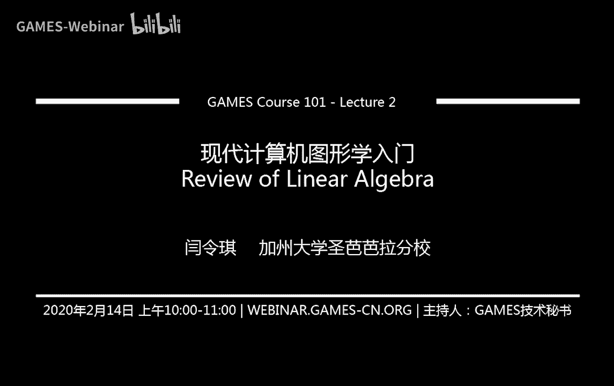

# GAMES101-现代计算机图形学入门-闫令琪 - P2：Lecture 02 Review of Linear Algebra - GAMES-Webinar - BV1X7411F744

## 课程概述

在本节课中，我们将从最基础的内容开始，逐步构建图形学的基础知识。图形学依赖于多种学科，包括数学、物理、信号处理和数值分析等。本节课将重点介绍线性代数，特别是向量、矩阵及其操作。

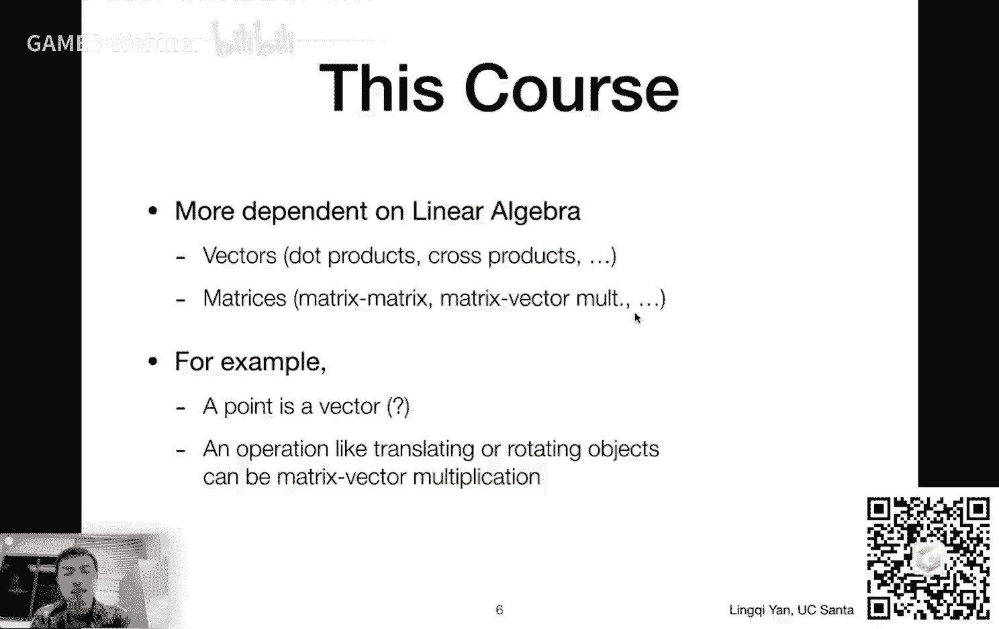

## 线性代数基础

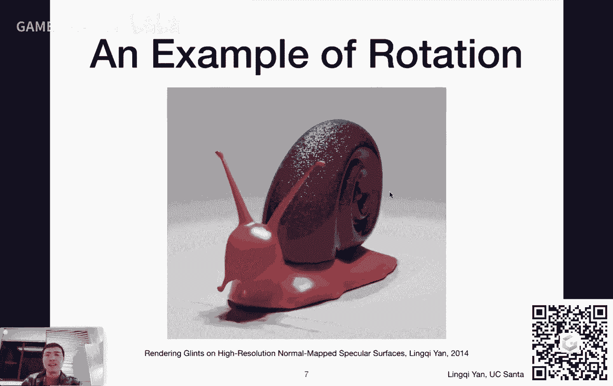

### 向量

向量是表示方向和长度的量。在图形学中，向量用于表示点、方向和力等。

**向量表示**：

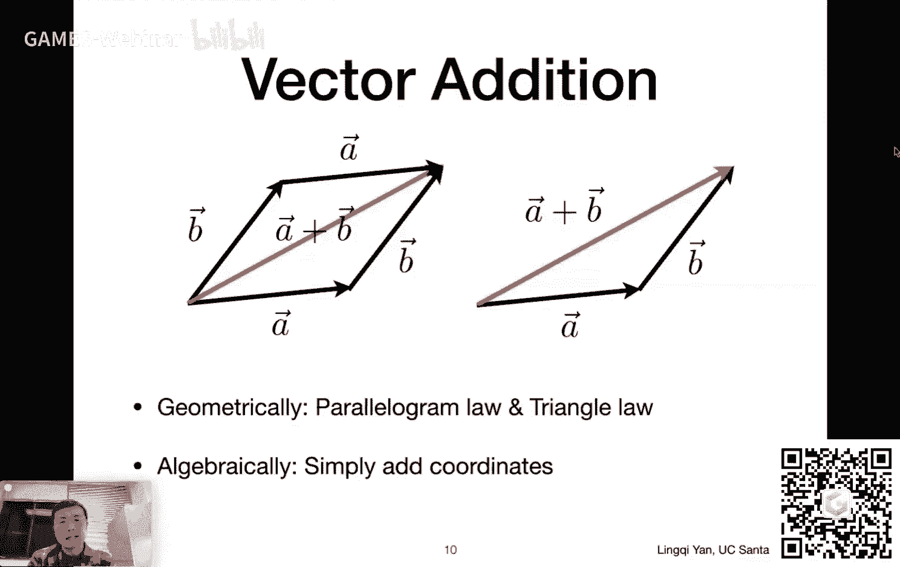

* 向量可以用箭头表示，例如 $\vec{a}$ 或 $\vec{a} \rightarrow$。
* 向量也可以用坐标表示，例如 $\vec{a} = (x, y, z)$。

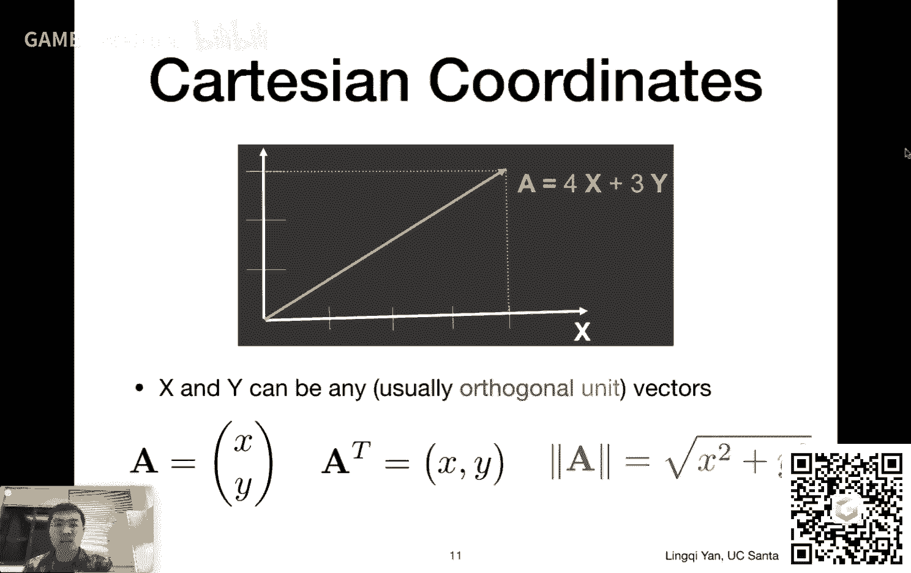

**向量属性**：

* **方向**： 向量的方向由起点指向终点。
* **长度**： 向量的长度表示其大小。

**单位向量**：

* 单位向量是长度为1的向量，表示方向。
* 单位向量可以用 $\hat{a} = \frac{\vec{a}}{|\vec{a}|}$ 表示。

### 向量运算

**向量加法**：

* 向量加法可以用平行四边形法则或三角形法则表示。
* 向量加法满足交换律、结合律和分配律。

**向量点乘**：

* 向量点乘是两个向量的长度和它们之间夹角的余弦的乘积。
* 向量点乘可以用来计算两个向量之间的夹角、投影和方向关系。

**向量叉乘**：

* 向量叉乘是两个向量的长度和它们之间夹角的正弦的乘积，并乘以一个垂直于这两个向量的单位向量。
* 向量叉乘可以用来判断两个向量的左和右、内和外关系，以及建立三维空间中的直角坐标系。

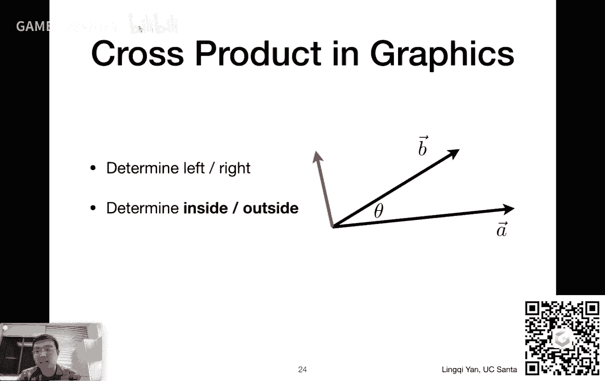

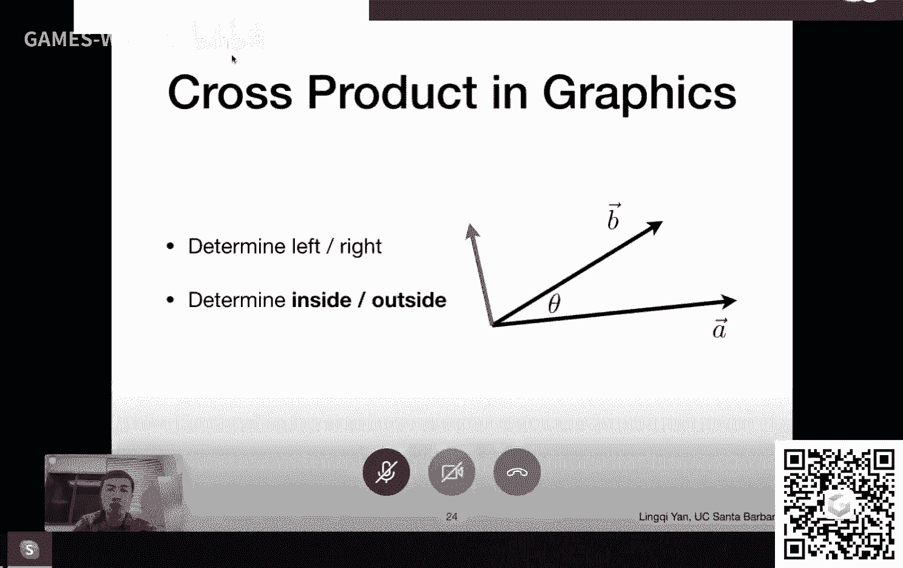

### 矩阵

矩阵是按行和列排列的数字数组。

**矩阵乘法**：

* 矩阵乘法是将一个矩阵的每一行与另一个矩阵的每一列相乘，然后将结果相加。
* 矩阵乘法满足结合律和分配律，但不满足交换律。

**矩阵转置**：

* 矩阵转置是将矩阵的行和列互换。
* 矩阵转置满足 $(AB)^T = B^T A^T$。

**单位矩阵**：

* 单位矩阵是一个对角线元素为1，其余元素为0的矩阵。
* 单位矩阵乘以任何矩阵都等于该矩阵本身。

## 总结

本节课介绍了线性代数的基础知识，包括向量、矩阵及其运算。这些知识是图形学的基础，对于理解图形学中的各种算法和模型至关重要。

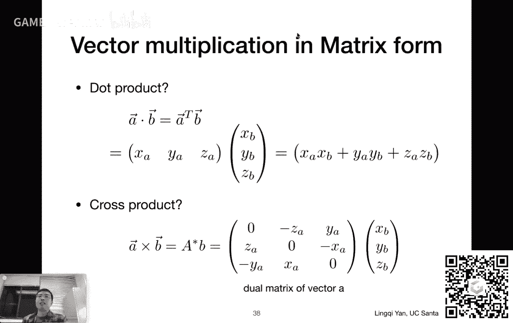

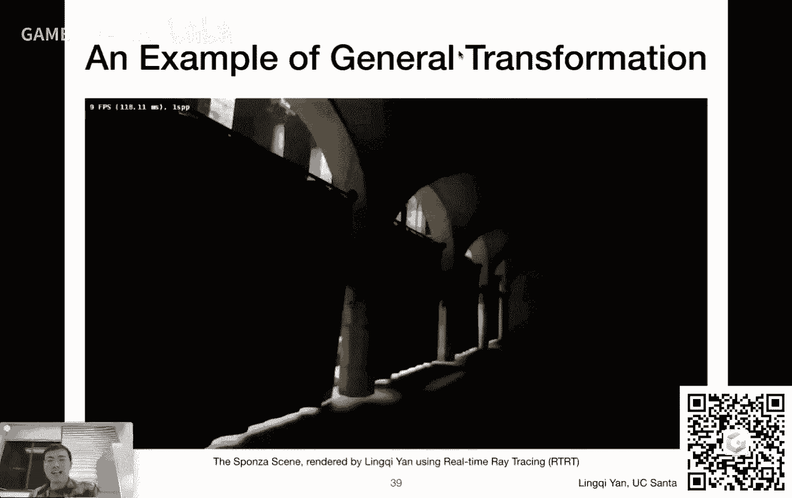

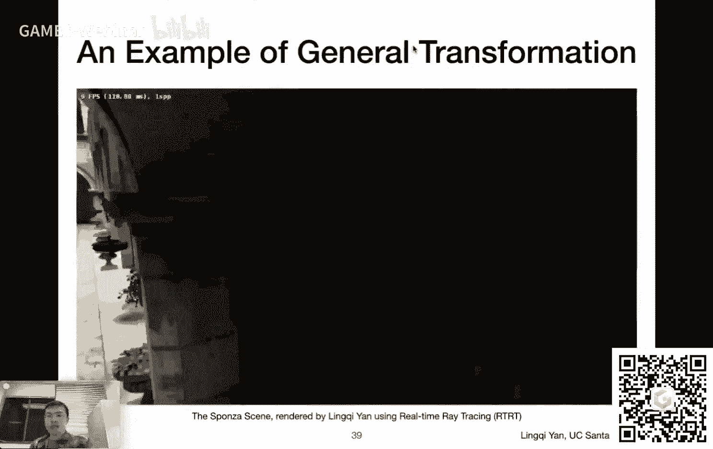

**本节课中我们一起学习了**：

* 向量和矩阵的基本概念
* 向量运算，包括加法、点乘和叉乘
* 矩阵运算，包括乘法、转置和逆矩阵

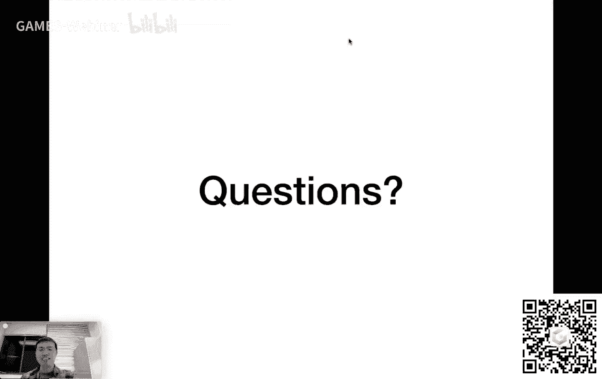

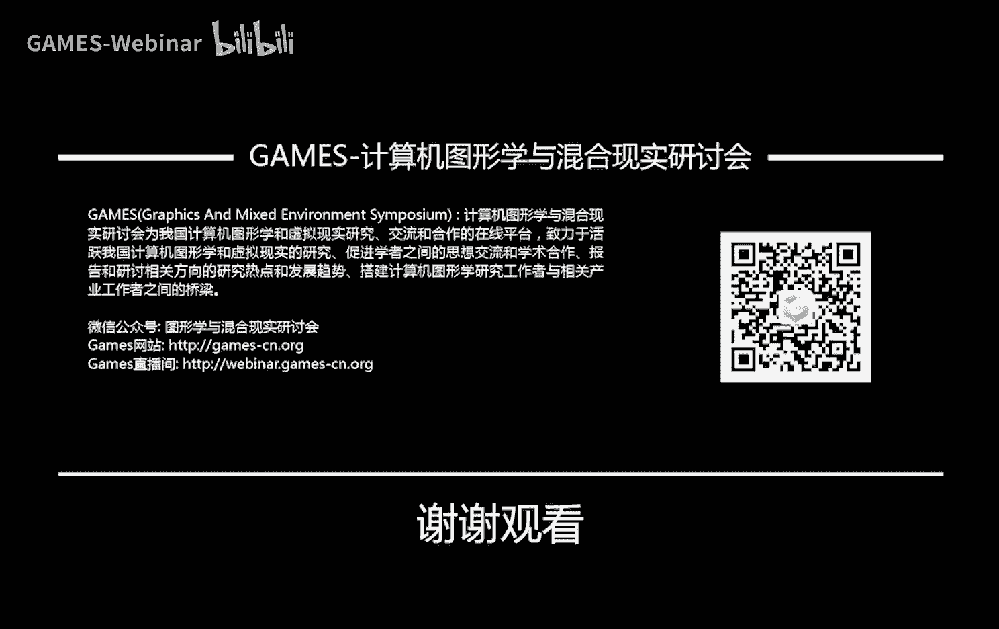

**下一节课我们将继续学习变换，包括平移、旋转和缩放**。