# GAMES101-现代计算机图形学入门-闫令琪 - P20：Lecture 20 Color and Perception - GAMES-Webinar - BV1X7411F744

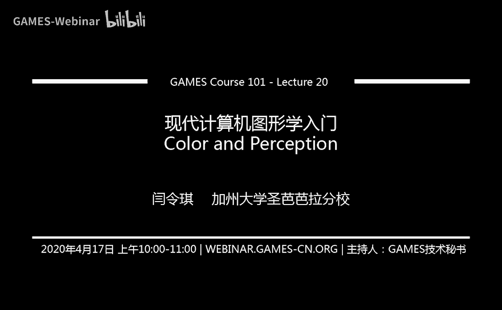

咱们今天这个开始讲啊，第20节课啊，颜色与感知嗯，在这之前咱们上节课历史遗留问题根本没有提到这个广场对吧，所以说我先把广场问题解决掉，好吧啊，那是今天的内容，首先还是欢迎同学们啊，第20节课了。

很快还有还有两节课，我们总共22个课时，然后这门课就可以顺利结束了啊，非常好啊，感谢大家一路支持啊，好那么同样在课前，咱们先呃说几个事情，一个是上一次我忘了啊，作业六虽然已经很久之前提交的了。

但是呃我忘了说了，239份提交非常好啊，然后作业期目前来说20分啊，确切来说是今天早上啊啊呃不错啊，大家现在在继续做着，那么作业期呢这个中间我和助教啊在一块讨论了一下，发现了一个问题。

这个问题呢呃是这样，就是说在提交了的同学们的作业里面，我们发现有这么一个现象，就是说我们之前不是说路径追踪，把这个光线的传播分成两部分嘛，111部分呢是对光源的采样考虑，光源对这个着色点的贡献。

另外一部分呢我们考虑说这个呃在着色点上呃，光会弹射到各个方向去对吧，我们去对这个半球进行采样，然后采样会打到其他的地方去，然后这两部分是互斥的，如果当它达到了这个光源之后，他应该就不再算了。

就应该直接返回零，因为光源对这个点的贡献之前咱们已经算过了，没有问题啊，这部分不要重复计算，这个大家在这个计算的时候，这个注意一点就好了，反正把这个道理想明白对吧，这应该是互斥的关系好。

那么呃这是这个事情，那么作业八啊，之前我们不是说七次做a嘛是吧，然后这个因为加了现在的作业期，ptracing相关对吧，然后我们这个原本的作业期也就是现在的作业吧，是一个绳子模拟器啊。

这个非常有趣的一个一个作业，然后会在作业期发布啊，补作业期截止的时候，然后我们发布，然后同样是一周时间，这个非常非常简单啊，大家这个坐着玩就好，没什么问题。

然后会用到我们之后所说的这个所谓这个呃智联弹簧系统，然后这是什么意思呢，咱们知道下节课就开始说好吧，然后呃呃在我们说这个大作业之前哈，呃我们这节课嗯算是把这两个这个相对比较杂的话题给说完。

就是我们上节课说到呃相机对吧，然后我们这节课把颜色什么东西说清楚，然后我们就进入到第四个，这个也就是最后一块儿呃这个这个话题，然后最后一块我们来说呃运动模拟，然后仿真这块东西好吧，然后是这么个安排法。

呃那么我们的大作业呢，这里肯定有很多问题，大家关心一个是说呃我们大嘴描述中间提到这个事情，我们非常鼓励大家自己去想这个需要做什么好吧，然后如果大家呃想到了一个可以做的方向，然后欢迎联系助教和我。

然后我们会决定说这个方向到底合适不合适，是不是应该做好吧，然后越早越好，这个我们这虽然有一个截止日期啊，但是如果你早早点反馈给我们，我们可以早点看对吧，哎好，那么呃这个关于作业的提交呢。

我们说是在课上我们不断这个呃这个这个这个给大家解释说，各种各样的这种提交方式，这里呢先给大家说一下，就是说提交的时候啊，我们希望大家能够提交一个什么呢，一个两分钟的视频。

然后这个视频呢是基本上就是你这个做了一个ppt啊，然后呃你一呃就是就是你会把自己的声音给同时录进去，然后一边放这个ppt啊，总共是两分钟时间嗯，然后这样呢把你做的内容呃说清楚，做了什么。

然后什么呃技术的困难对吧，然后最后得到了什么样的结果啊，还是不错的好吧，就是通过这么一种形式，然后还有啊，然后我们看一下，就是说啊有一点很重要的事情，这是图形学课，而且大家看到啊。

我是很努力的在这个把这个呃我们的这些课件什么东西啊，做的比较好看，然后如果大家关注我的科研的话，大家也会发现啊，我对这个场景啊，对这个最后嗯呃制作出来的效果啊非常重视。

然后所以我呢在这里也要求大家嗯对美学稍微重视重视一点啊，审美啊，aesthetics，顺便大家补一个词吧好吧，然后这个啊审美非常重要啊，千万不要说这个做出来的这个东西技术非常好。

然后但是看上去非常难看啊，这个就不好了，所以花点时间打磨一下自己做出来的这个产品对吧，呃为什么这么说呢，咱们从第一节课上就这么提到这个事情啊，就是说呃游戏里面现在越来越重要，重要的是什么呢。

就是所谓dling graphics对吧，就是说这个图像要好看，好看了才能把游戏给卖掉，当然它有其他的因素，但是游戏呃游戏上来说，这肯定是这个画面是非常重要的，那电影各方面肯定都是这样。

那么嗯从一个更广泛的角度上来说，你有一个好的东西，然后你需要把它给卖出去，对不对，然后能够和你做的这些呃内容，然后相称的一个外观，对不对，然后所以说啊这方面都是大家需要锻炼的能力，特别是在图形学里面。

然后可能其他的课程啊不会要求这个事情，所以呢利用这个机会让大家正好也锻炼一下，然后做一些稍微好看一点的结果，好吧啊，这是一个事情，然后呢嗯我自己啊，我自己非常非常不喜欢写报告。

所以呢我也不要求大家怎么写报告，然后大家做完了这个之后，反正有两分钟视频嘛对吧，然后做完了之后，基本事情都说清楚了，然后如果有其他地方，比如说这个更多的结果，然后或者说这个还有些什么技术难点。

然后在这个呃视频里面说不清楚的，然后你把它写到这个报告里面，然后报告里面顶多写个一二差不多了啊，然后就是说根本不需要，那么这个长篇大论的写了一篇论文之类的，这种不需要啊。

就是说呃你的所有的展示基本都在这两分钟里面啊，这个意思好啊，那这样的话大家还有什么其他问题没有，关于大作业的提交方式，这样哈，我这边先等一等，上课天天写报告好吧，而是这么回事。

这节课呢其实我是时间相对较为紧张一点哈，然后否则的话其实可以给大家多谈一谈关于这个体会，我自己吃过亏，我自己之前这个嗯本科时代，怎么说呢，导致我这个这个一直就不怎么接触这个领域，你就是因为写报告的事情。

我觉得写报告是非常痛苦的事情，所以我不想写，所以我就把那个课给退了，当时有没有过这么一段故事啊，这个之后再多说吧，反正就是说我个人性格不惜写报告，就是这个事情啊，哈哈哈哈行吧，呃时间有限啊。

这节课内容确实多，所以先不给大家多说这些杂七杂八内容了好吧，那么有同学会问了，说我我怎么去这个录一个呃所谓我的presentation，然后我还得把声音录进去，太简单了啊。

你做一个p p t的这个或者是keynote的这这些幻灯片，然后做好了之后，然后你用这个训练模式排练模式啊，然后呃或者说用这个录音模式，反正就是说一边你可以播放着，然后一边就可以把这个结果给录下来。

然后这个事情我做过很多次啊，特别是这个kindnote挺好用的，然后就是说没有任何问题，就正常播放下来，然后自己把这个该说的内容说清楚就好了，两分钟记得不要超时啊，这个非常重要好。

然后啊那也有也有同学问说我这个嗯得出来的结果，然后我希望这个截一个屏对吧，然后然后他又说动画这个怎么办呢，我怎么样录一个嗯，嗯这个对屏幕录一段时间呢对吧，然后哈哈哈这个那怎么办呢。

就是我个人来说啊啊我用linux，然后在linux下面呢，我推荐这么一个软件，很简单，叫coreen recorder，然后他的名字就和他自己一样简单啊，非常好用，然后大家直接去搜索他就可以用了。

然后嗯在其他的平台上我帮不上忙，我这个不是特别清楚应该怎么样去录啊，然后但是差不多啊，就是说不管怎么样呃，你这个录制一段屏幕，然后这个压缩下来放到你的ppt里面去，然后你再去这个呃用排练模式录下来。

然后就可以导出了对吧，那这就是关于这个大作业我能想到的一些事情，好吧哦，有同学反映说嗯同学学研究是不是得到正确的颜色，是是这次我们这个还要说这个颜色的问题好吧，然后大作业提交时间能不能延后哦。

这个事情是这么回事啊，就我个人来说，我觉得大作业确实应该提供更多的时间，只是我不希望给助教提供呃，呃相当于是给助教增加额外的麻烦，因为这这门课呢咱们很快就要结束，结束了之后，如果再拖个两三周。

然后再提交大作业，这个是不是对助教来说工作量有点大，但是既然有同学提到这个事情了呢，那我就呃我就问一下好吧，我们了解一下关于大作业的提交时间啊，那就这样，大作业中的模型是自己搜吗，是没问题。

你自己可以这个随便用各种各样不同的模型啊，随便去找，然后也可以这个从各种各样的网站上面去这个买啊，然后这是这个模型什么东西呢，就是自己去找一找就好了，好吧好的，那么嗯这就是关于今天我们这个说的内容啊。

那么今天我们的课程，然后我们开始说颜色这两块的内容都非常多，所以咱们今天得赶紧，然后可能是咱们先预告一下，那么呃嗯不管怎么样，咱们今天一定得把这个内容解决掉，解决掉。

下节课才能开始进入到呃这个动画与模拟这一块，好吧，那就是这么个安排，那咱们就先顺着上一节课的呃，相机这块来说对吧，我们开始说广场，然后呢大家看到这个广场呢我用了两个词对吧。

一个叫做这个light field，然后另外一个叫做loomy graph，然后这个是怎么回事呢，这这两个指的完全是同一个东西啊，就好像番茄和这个叫什么呃西红柿一样啊，然后但是嗯这属于历史遗留问题。

是属于两个不同的组，各自发现发明，还是发现了这个广场这么一个东西啊，然后各自给这个发射线的东西命了名，然后现在还争论不休，到底哪一个是先发明的，然后到底广场应该叫什么，但是从中文的翻译来看。

广场可能大家认可的更多的是左边这么一个事情，对吧啊，那这个我们就不做多考虑，然后在我们这个课里面呢，我们就用light field的这个概念，好吧啊好啊，那咱们开始说这个广场到底怎么回事，对吧好。

首先呢我们要从我们看到的是这个世界是什么说起，这个事情非常非常复杂对吧，但是如果我们呃设定一个简单的场景，比如说呃我们坐在这里，然后呢我们看这个屋子以及透过屋子，我可以看到一个树，没有问题吧。

这是我们看到的世界这么一个过程对吧，那么如果我把我看到的东西画下来，唉这就是一幅图，这是这是一张图对吧，然后我们可以看到这窗户，窗户外面的这个数在这对，这也没有问题，是墙壁各各方面的东西。

那么我现在问这么一个问题，如果我说啊我把这个房间算是给砍掉，或者说在这个房间这个中间加上一个幕布，然后这个幕布呢它非常好，它能够严格意义上模拟你之前看到的这些这些光线，从某个点打到另外一个点。

它的强度是多少好吧，然后加一个这个幕布，然后这样的话这个幕布呢我让它显示什么，我让它显示的就是你刚才所能看到的是这么一张图，那么你坐在这里看这个幕布，你是绝对不会体会到有任何和这个真实世界有区别的。

就好像是你之前坐在这个真正屋里，然后往前面去看对吧，这里呢我想到两个事情，第一这就是虚拟现实的原理，本来虚拟现实嘛，你这个嗯大家带一个头戴式设备，然后成像平面在这里。

但是它是会让你认为说要呈现的是整个世界，对不对，就是这个就这么一个意思，也就是说你如果把所有的信息都记录在这么一个平面上，如果把这些信息都完整地记录起来，然后被人能够看到。

那是严格意义上和人看到真实场景是一样的，那这是一个事情，另外一个事情呢只是稍微这个一点的话题，这个应用其实在这个科幻电影里面已经已经出现了对吧，大家要看过碟中谍啊，我不记得，是第几部了。

中间有一个在克里姆林宫里面发生的事情啊，这里嗯就是严格意义上应用的是这么一种技术哈，然后这里呢先不给大家多说啊，这个这个呃大家回去自行去查这个就好了，好那么嗯这里呢我们就说了一下。

关于大家看到的是什么对吧，大家看到的就是从各个方向进来的光线对吧，大家其实看不到这个光线，这个从多远近的对吧，以及从什么地方进的这个文明不关心我们只关心就是人眼，从呃这个从某个方向看向某个方向。

我能看到什么，就这个事情好，那么我们可以描，述这个人到底可以看到什么东西啊，然后呃用的是什么呢，我们可以用一个函数叫做所谓全光函数，叫做panopic function，然后这个全光盘数是什么啊。

然后这个全光函数大家从这个问答就可以看出，这就是我们所能看到的所有东西对吧，然后这就是全光函数，为什么为什么是这么回事呢，然后这画的是什么意思呢，那咱们从最简单的全光函数开始，咱们一步一步把它给说明白。

那么假设说啊我站在一个场景里面，然后呃我的位置固定，然后呢我可以往四面八方去看，我往四面八方去看呢，然后我，知道我可以定义任何一个方向，用它的极坐标表示c它和y对吧，那我可以定义这么一个函数。

我往任意一个方向上看，我可以看到一个什么值，然后那这这个这个函数自然就是c它five的一个函数，它的最后的结果是一个数对吧，哎那没问题，那这个自然而然我就可以表示我在某个地方往某个方向看。

往所有方向看对吧，可以看到什么好，那没问题，那么我们可以稍微把这个呃函数稍微改进一点，改进成什么呢，改进成我们引入一个波长这么一个概念，所谓波长其实就是引入了各种不，同的颜色对吧。

大家知道我们虽然还没说颜色，但是颜色呢基本就是因为这个光有各各种不同的波长，那如果我把每一个这个过程呃，呃对应的这个光啊，然后我往某个方向看，可以看到某个波长的光，这个信息给记录下来。

那我才看了一个彩色的世界，对不对，哎没问题，那咱们可以再继续把这个呃函数全光函数再进一步扩展，我们不是想得到我们能看到的所有东西嘛对吧，那么我们现在扩展一个时间t，扩展一个时间t，那么是什么呢对吧。

那大家可以可以想到这就是电影这整个一，个思维的函数，这就是电影没有任何问题对吧，因为你可以往各个不同的方向看，你看到的各个不同的方向来的这个信息它都是彩色的，然后这是nt对吧，然后呢。

然后你在不同的时间它显示的东西不一样诶，这可不就是电影吗，对没问题啊，然后我们就这就扩扩展了这个概念，那咱们还可以进一步扩展，进一步扩展怎么办呢，我们刚才说啊，这个人站的位置我们不是一直固定着吗。

我们考虑它往哪个方向去那行，那我现在考虑说我这个人的这个位置啊，或者说摄像机的位置，我也可以任，意在三维空间中任何一个地方来移动，那么三维空间中任何一个位置，我知道as yz对吧，我可以定义这个事情。

那我要定义了这个事情之后呢，这个我看到的是什么呢，我看到的这就是一个所谓全息电影，意思就是相当于是啊我看到的整个这个世界，我不止可以看到，我还可以改变我自己的位置，从另外一个角度来看这个世界，诶。

这是没问题的对吧，那么这就是我们可以看到的这个这个呃，所谓这个全息电影这么一个概念好吧，然后呢我们还可以最后再改进一步对吧，再改进一步怎么，说呢就是说我们把这个函数不当做一个电影来看。

我们来把它理解成什么呢，我们把它理解成说我在任何位置，然后往任何方向看，并且在任何时间，然后我看到的都是这个这个呃不同的颜色，那这就是典型的我们所看到的所有的事情，这是没有任何其他的东西在里面。

大家可以想象一下，对不对，没错吧，在任何时刻，任何位置，任何方向看到的东西对吧，那也就是说整个一个世界，整个一个视觉的世界是一个什么，是一个这个几个维度呢，七个维度的函数哎，大家觉得这个事情是不是这。

个很神奇的一件事情对吧，我们可以看到这么丰富的这个世界，其实看可以拿这个七个维度就可以衡量了，没有问题，那当然了，大家说这个之后还可以再把它这个再改进，再加入点什么对吧，这是有可能的，没问题。

那么到此为止，其实我们就可以把这个七维的这个函数当做啊，我们所嗯叫做的这个所谓全光函数就这么一个理解方式，好吧，哎这样的话啊，我就等于整个世界都可以拿这个方式来表示的。

那么光场的概念就是从这里开始的对吧，就是呃那么我们我们先从这个这个嗯全光，函数本身这个呃它的定义上来看哈，它不一定是离散的，这里的表示是离散的这些紫色的点哈，然后从任意一个方向。

然后我知道他过来的光是多少对吧，然后这个方向也应该是一个连续的，没有问题，然后呢这个这个目前这就是一个简单的一个情况，他的所有的点都在二维的情况下，它的方向都是意味着没有问题吧，啊好。

那这样的话就等于是说我可以从这个所谓的全光函数中，提取一部分信息出来，然后用来表示这个更复杂的这些光，就是说我们，平常在一个点，我们往这一个方向看，那我记录的这光信息是什么呢。

那就是来自各个方向的这个光的信息，那么所谓广场就相当于是记录了稍微多了那么一点点的信息，那么广场其实就是这个全光函数的一个小部分好吧，那这就是我们这个现在要开始来定义这个广场好吧，那定义广场之前呢。

我们先嗯定义一下这个这个啊光线啊，光线我们之前老早之前就定义过这个事情对吧，它得有个起点，得有个方向，那起点就是v x v y v y v z方向就是其他没问题啊，三维空间中的任意，一条光线。

然后呢那我们定义了光线之后，我们会发现啊，刚才那个定义我需要一个这个呃一个呃起点和一个方向，那是不是说我这个呃这样定义就是最好的对吧，不一定对吧，我有各种各样不同的方式来定义一条光线。

我就可以定义这么条光线啊，假如说方向我们知道啊，假如说方向我们知道，就是说呃负的或者正的这种，那我任意取两点两点确定一条直线吧，基本上就可以确定这么一个事情，然后嗯这样的话呢，不管怎么样，我就是说呃我。

要想定义这么一条光线，其实我需要什么，其实我只需要这个二维的这个位置和二维的方向，那这个怎么理解，我们马上就说好吧，那就是说不管怎么样哈，我用两个点可以定义一条光线。

然后嗯那么如果我想定义这个对于任何一个物体吧，它的表面，它这个这个这个物体它可以被放在某一个盒子里面，那我看向这个物体，我无非是从任何任何方向对吧，然后任何位置，然后任何方向看一下这个物体。

那么反过来理解光光路的可逆性，我也可以认为我要想描述，这个物体所能被看到的所有的情况，然后它往各个呃，它在任何一个位置，往任何一个方向过去的光线对吧，把这个事情描写清楚。

我就可以得到我从任何一个位置看向这个物体，它应该长什么样了，没有问题吧，这样想，因为你从任何一个物体看上一个一个一个这个物体，然后呢你自己这个呃观测的位置有一个点哎，这样两个确定了一条这个光线。

然后知道它的方向，知道它，的方向，你就可以查询你这个呃我呃我们记录了这么一个函数对吧，那么这个函数是什么，这个这个函数呢记录了不同的这个呃点，也就是说在物体表面啊，不同的位置。

它往各个不同的方向的发光情况，没错吧，然后这个我们可以理解成一个黑盒，它往各个方向去，这个这个都是什么样的一种光照情况，如果我们把这个信息给记录下来，这就是我们要的光场，那么总结一下广场是什么呢。

就是在任何一个位置往任何一个方向去的光的强度好吧，那这样一来就等于，是我们把这个广场和这个全光函数，这也算是建立起来联系啊，广场是一个这个全方函数的一小部分，只是位置和方向，二维的位置，二维的方向。

那么现在我们再回头看，怎么理解二维的位置，二维的方向呢，这里我们可以看这个物体的表面啊，我们之前老早就定义过这个事情对吧，3d世界中，然后二维物体呃，不三维物体的表面其实是在一个二维的空间中的对吧。

大家可以理解成是纹理映射，用两个数就可以表示uv对吧，就可以表示任何一个位置对吧，没问题，那么方向也是任何一个，空间中的方向我都可以用c加f来表示，那也是两个数，那也就相当于是两个数表示方向。

两个数表示这个位置，这就是广场好，那么咱们可以看一看这个呃，如果我们有了一个物体的光场啊，大家可以看呃，任何一个位置对吧，然后他往任何一个方向都有这个呃都可以发光，那我们刚才所说的是什么呢。

我们刚才说我们在任何一个位置，然后往这个物体上看过去，只要有光场，我就可以知道我会看到什么，这怎么理解呢，假设啊我有一个摄像机放在这儿，我往这个物体看过去，然后呢我就，可以发现哦，如果我往这个点看过去。

我应该有这么一条光线对吧，如果往这个点看过去，我应该有这么一条光线，然后往这个点看，往这个点看，那么我会发现我之前在记录广场的时候，其实就是任何一个位置，往任何一个方向我都记录过。

那所以说我在呃从这个点往这个点看的时候，然后我完全是知道这条光线它带的能量是多少，所以我知道我能看到什么，这是我从广场中直接可以提取到的信息，那同样道理，这条线也知道，这条线也知道，这条线也知道。

那么也就是说我从任意一个位，置往这个物体的光场上去看，我都知道我可以看得到什么，没问题，那么好的这个广场的好处是什么呢，就是说我从任意一个位置都可以看见这个物体，看上这个物体之后。

无非我就找到往各个方向看的这个方向哎，往各个点看到这个方向，然后各个点呃这个呃又是有各个方向的话，我就可以查询到，从这个这个思维的这个广场里面查询到我之前记录的光场的值，这个也就是这这个光的强度。

那这样的话我从任意一个位置往任意一个方向看，我都知道看到什么，所以我有了广场之后，我们得出一个结论，我们可以得到任意一个不同的这个物体的不同的观测，也就是说我从任意一个位置看向这个物体，我就都知道好吧。

这也就是这个广场的好处，它是一个思维的函数，然后它可以任意给我们任意的一个这个观测的方向，要看到的结果好，那么另外再多想一点，咱们刚才提到说啊，这个广场我们不是说定义在这个物体表面嘛对吧。

但是我们之前这个前一个例子，比如说把这个物体放在一个盒子里面，然后我不需要知道这个物体是什么，我只需要这个任何一个这个盒，子上的任何一个点，然后它往任何任何一个方向会把它记录下来，就可以。

这个就是我们之前说的，我们在一个屋子里面对吧，我们看到这些东西到底是什么，到底是一块幕布还是整个这个物体的几何，我们并不关心，我们只关心说这个到达这个我们的观测点呢，某一条光线它带的能量是多少。

那也就是说啊，我不需要知道这个呃，我我的这个广场它表示的是什么东西，这个不需要知道，我表示认为它是一个黑盒，然后它是一个黑盒，只要在它在它的盒子表面任何一个位置，我都知道任何。

一个方向它过去的这个呃光线诶，那我这样的话就可以记录它的广场，没有问题，如果在里面，那我们没有记录这个信息对吧，没有问题好，那也就是说我们是可以通过简单的这种方式来记录工厂的，那么咱们更进一步啊。

就是说这种方式呃，我们还可以把它理解成是什么呢，理解成是啊，我这个我取一个平面，我取一个平面，然后这个这个这个平面呢，可能这个平面的右边是一些发光的物体哈，假设这么回事，然后这些发光物体。

会发出各种各样的光，他们会穿过这个平面，我们刚才说话，这个平面右边这些东西我们可以忽略，我只需要知道这个平面左边是什么就可以了对吧，然后我知道任意一个方向就可以了对吧，所以说我知道平面上一个点s。

然后它的这个方向如果是这这种平面情况，一个一个数就够了，如果三维情况两个数set的fine对吧，我们可以这样描述，那么我是不是说呃对于任何一个这个广场。

我是不是可以用两个平面来定义这个任何一个广场是这么一，个理解，那么我们刚才说对于这个我知道右边有一个这个物体啊，这么想，然后这边有一个平面，我可以这么参数化这么一个光场。

那么我之前所说这个对于一条光线来说啊，对吧，这个s然后这个从这个点出发的这条紫色光线，我们不是用i s和这个方向，也就是说呃一个位置一个方向来描述这个光线吧，我们回到刚才我们说光线还可以定义成什么呢。

光线还可以定义成说这个两个点我就可以确定一条光线，往一个方向去得到这条光，线上面强度我也可以定义两个平面相互平行的平面，然后这两个平面上呢我任取各自任取一个点，那两个点都是二维的，对不对，然后这2。

1连唉，我就知道这个对应的这条光线是什么了，然后这就是为什么说我们对于广场里面啊，平常大家会用到这么一个概念，就是uv和s t，这就是大家对广场的参数化的过程。

就说白了就是说它本质上它就是一个思维的函数，这取决于我们如何这个描述这个思维函数而已，那么我们想象一下，对于两个平面来说，假设我们知道这个发光的物体，或者说我们关心的东西在右边。

然后我们就知道所有光线的方向啊，假设知道这么个信息，那么这样的话任意呃两个点大家看到诶，这个平面上一个点，这个平面上一个点，然后这两个点一连线，我就可以找到这一条光线，我把这条光线值记下来不就行了吗。

那我只需要找到所有的uv，所有的s t它们的组合就可以了，那么所以说这是一个经典的参数化表示方法啊，这个很简单嗯，就基本上来说就是相当于是我用诶两个平面上各自取一个点，来决定某一个方向。

然后我只要考虑所有可，能的可能性我就可以描述所有的这个呃不同的位置，然后不同的方向出来的这些光线没问题吧，也就是说这是通常大家用到的一个参数化方法好，那么到这为止呢，我们这个呃广场这一块。

这基本上来说它的概念这就说明白了啊，就是说我们记录这个所有可能的这些光的位置和方向，那么呃我们可以看看对这个这个两个平面啊，这种参数化方式的一种两种不同的理解方式哈。

然后我们看到有uv平面和st平面对吧，这两个平面，那么我可以有各种各样不同的理解方式，我可以在s，上取一个点，然后呢我看所有的uv它长什么样对吧，然后像这里我可以在st上去不同的点。

那我看到的这个整个uv上面这个平面看到的肯定就都不一样。

那么这是什么意思呢，那这张图就可以一目了然的这个呃看清楚到底是怎么回事。

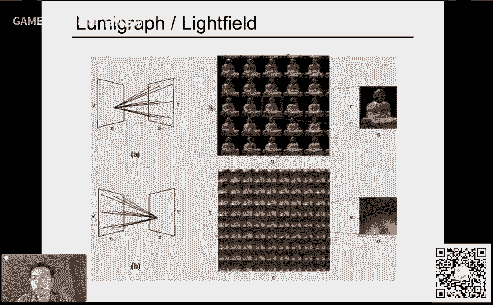

是这样啊，就是说我们记录的这个广场，它相当于是st上去一个呃取一个点，然后uv上取一个点，然后这么一连对吧，那现在如果我认为我从uv上面这个呃去固定的一个点，然后我看向所有的这个呃sd平面。

我会看到什么呢，这就好像是啊，这就好像是说，我根本就这个呃没有广场一样，是这个意思哈，为什么呢，因为我在uv上随便取一个点，然后呢我看向这个世界，这个世界右边是我们所关心的东西，这就好像一个针孔摄像机。

我们所能看到的东西，对不对，所以他会看到一个这个图，他会看到一个这个呃完整的这个物体，这么一个图啊，没问题哈，那然后如果说我把这个uv位置换一换，诶，我换到这个角上，他就好像说从这个角上有一个摄像机。

然后拍向这个整个世界，然后这个整个世界在右边，对不对，然后会看到一个从另外一个角度看到，的这么一个世界的图没问题，然后呢那这块好理解，相对困难，a点是什么呢，是反过来我固定s上的一个点。

然后呢我往uv平面上去看，那这个会看到什么，这个就比较有意思对吧，那我们怎么理解呢，这样想这样想，整个世界还是在s平面的右边，那么我不认为说我这个从这个呃st亮点往uv看。

然后我都看向st上的同一个点好吧，然后呢这样的话我就可以看到什么呢，我就可以看到这个完完全全对于同一个物体，然后它的不同方向，然后是什么啊，这块就不好理解啊，就是说对这个呃就是说这块应该应该怎么样想。

咱们马上说这个呃，说这个广场上摄像机的时候，然后我们会把这个事情说得更清楚一点好吧，总之就是说呃这是这是另外一种不同的这个理解，就是说我看的是同一个东西，我看的是同一个东西。

只不过是我从不同的这个角度去看，就好像你盯着同一个点，盯着同一个点好吧，然后你可以从这个不同的这个角度去看，你会看到一些类似这个不同的高光的这种这这样一个感觉好吧，那是这么一个意思，或者说你怎么。

理解呢当你的这个呃一个摄像机，然后拍了一张图之后，你的一个像素上存的是什么，你的像素上存的是irradiance，咱们上节课说了，对不对，那其实通过这种方式。

它可以把像素上的irradiance给展开成为radiance，你可以看到达到任何一个像素上不同的方向的光到底是什么，好吧，这是这么一个意思好吧，那这里呢相对难理解一点。

然后但是我们这个分别展开来给大家说一说这个事情，那么咱们从最简单的这里这里开始啊，就相当于是我有很多摄像机啊，我从某一个角度看向整个世界，然后拍一张图出来，对吧，然后我把这些所有图都组织在一块儿。

这就是整个广场诶，那行，那到底有没有人这么做呢，当然是有哈哈，这个斯坦福他们就做了一个这么一个这个呃摄像机的一个一个矩阵，大家可以看到这个矩阵有多少个，大概是12x12百，12x52x8啊。

这么多个呃相机组成，然后呃这个就是我们刚才所说的这个广场的理解对吧，就相当于是我在不同的位置，然后我这个对这个场景，然后我拍不同的图对吧，然后然后我每个位置对应一个啊s t对吧，呃每个位置是一个uv。

然后，呢我拍到了这个这个照片，它是st，那这就是四维的对吧，那这样想每一个相机成像出来是不是一个二维的图，然后这个相机本身是不是二维的，所以二维成二维，那这就可以解释了，当然了。

一个这个摄像机阵列是是要花很多银子的。

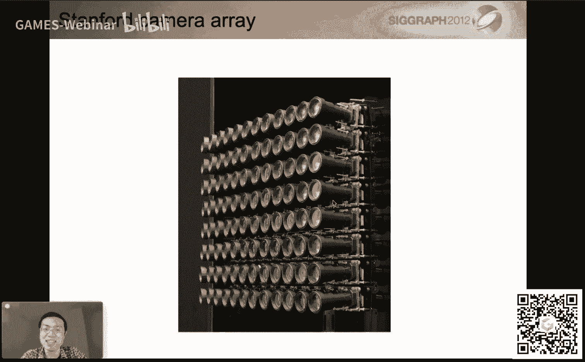

大家可以算一算这个概念啊对吧，然后呢嗯我们其实更关心的是另外一种，另外一种相对困难一点，但是这个如果从这个角度上来说，其实就相对好理解一些了，这为什么我们要说这个呢，是因为在自然界啊。

就是有一些这个昆虫是生物，比如大家看到苍蝇，这苍蝇呢它的眼睛我们管它叫妇炎对吧，然后这个苍蝇的眼睛的成像原理，它其实就在就是在成像一个广场诶，这个到底怎么理解呢，我们这样想。

还是从刚才的这个角度上来说啊，我们盯着这个原本的正常的拍出来的一张照片来看，那么照片上面的任何一个像素，它记录的是所谓irradiance对吧，irradiance就是我不区分来自于各个方向的这些光诶。

然后我就把它都给平均在一块对吧，这就是我们上节课还提到说，为什么我们一定得有一个镜头，我们不能说让这个把这个直接把感光元件放在人面，前对吧，因为任何一个这个感光元件的一个部件或者一个像素吧。

它就会受到所有的这个不同方向上来的光，然后他就把这个这个记录下来，平均起来是这个意思，那么就是说我们对于这个广场来说，我们的另外一种理解方式，大家还记得吧，就刚才说这个困难一点的，怎么说呢。

我们先把这个所谓lslate啊，这里当做某一个像素，大家可以看到，比如说对于这个像素来说，他接收到的光有来自于左边的蓝色，来自于正上方的绿色，来自于右方右方的这个红色，然后它这个呃像素如果是普通的。

相机啊，咱们就把这个像素给记录下来了，然后这个记录下来结果就是所有的这个蓝色绿色红色的平均啊，对于这四个来说都是这样的，那么如果我有办法可以把它给分开啊，比如说我这个光打到这个像素的时候。

我不立刻来记录它，而是我把这个像素变成一个这个某个小的透镜，某个角度透镜之后呢，它的作用是把来自于各个方向的光给分到不同的这个位置上去，分到不同的位置，我就会发现哦，我把实际的感光元件放在它背后。

放在底下，然后呢我用前面的一个小的透镜，然后我，其实呃经过这个所谓风光这步操作之后啊，然后我就其实可以把打到原本的这个像素上的各个方向上的光，分别记录在不同的位置。

大家可以看到这个打到这个像素上的红光都被记录在这里，然后绿光在这里，然后蓝光在这里，唉也就是说我本质上来说，就等于是我记录的不再是一个像素的radiance了，我记录的就是他这个所看到的。

往往这个世界不同的方向看到的这些radiance，那这个就非常好，就是说这也正是这个啊光场照相机的这个基本原理好吧，那么从这样的话，我觉得就稍微清楚一，点了啊。

就是说这个反过来理解这个广场就是相对是比较困难一些，然后就是说大家再回过头来想嘛，就是我看着一个像素啊，我看着一个像素，然后我其实是相当于看着这个穿过这个像素的不同方向的光，就是这么个意思对吧。

那么这里就是就是这个道理了，那咱们就直接可以进入到下面一个话题。

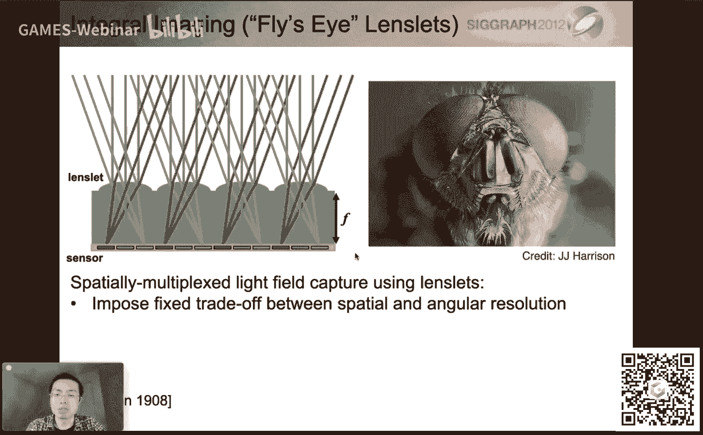

就是光场照相机啊，就是说光场的原理，咱们这个就是说说了。

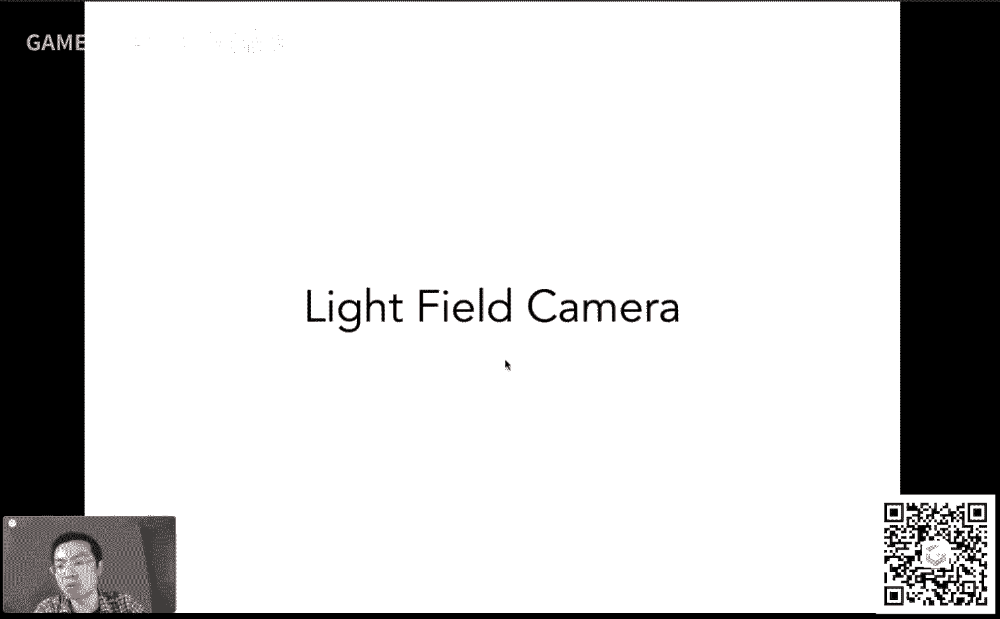

然后现在呃利用这个原理可以做一个摄像机出来，那么呃这里呢要这个提到广场照相机，就，是berkeley的这个rng老师，然后这个其实应该念做rn in哈，这个这个ng这个姓它其实是无这个姓啊。

中文的无这个姓，然后就很奇怪的一种写法啊，然后嗯但是不管怎么样，就是呃professor人，然后呢他这个呃是怎么回事呢，他创立了一个公司叫做这个light tro光场照相机，然后算是这个世界上首创。

然后就是说真正能够让这个计算机不是计算机啊，这个呃这个广场照相机进入到这个消费者的层级上去，然后呢，嗯那么那么它这个原理就是我们刚才所说的这个这个呃微透镜，这么一个原理很简单，把一。

个这个像素替换成一个透镜，然后让这个透镜可以呃把这些来自于不同方向的光分开，然后再把它记录下来，是这么个意思好吧，那么它这个呃光场照相机有什么功能，它最重要最重要的功能就是支持后期的重新聚焦。

那么什么叫后期的重新聚焦呢，就是说你随便你拿到这个这个照相机之后先拍张照，然后咱们在这个这个考虑聚焦啊，或者是别的什么一些问题啊，就是说我还可以考虑这个光圈的大小，也可以可以后期来改。

然后呢我这个聚焦这个各个各那我我就可以动态的来调，节呃各种虚拟的这个呃焦距就是这么个意思，就是说呃他可以做到这么一个事情，那它的原理就是利用了广场这么一个道理，好吧啊。

然后这里重要的事情说先拍照再调这个聚焦，这就非常好对吧，比如说有时候你可能要拍一张重要的照片，结果调这些这些各种各样的参数给你给调坏掉了，然后你拍出来一张比较糊的照片来，对于光场照相机不存在这个道理。

就是说你直接拍，拍完了之后，它可以动态的调好，那么这几张图是什么呢，这个呃就是这个人ng老师，然后他在debt啊，然后嗯右，边这两幅图分别是这个呃light tro照相机的一代和二代啊。

一代一个非常小的，大家看到这个手持的这么一个非常小的设备，然后二代呢就和一个真正的相机差不多大，诶这两个实体我都是见过的，而且也拍过照啊，在在berkeley这块儿，然后呃这些设备啊其实都很常见。

大家已经拿各种各样这些设备来做一些呃各种各样实验了，然后另外一个小事情是这么回事，就是说呃我的毕业典礼上是这个呃这个原ng老师帮我拨碎啊，然后这这里是这个照片啊，有同学可能要问，那为什么不会不是你老。

板来给你帮你脖子嗯，对这个这是另外一个问题哈，另外一个问题，那咱们就先不说了啊，那就这样啊，那嗯这是关于这个广场召唤机的原理啊，那我刚才说了啊，重要的就是它这个设计这个呃微透镜的设计以及它的这个作用。

好吧啊，那么它可以做什么呢，咱们可以看一看这个啊，就是说大家看到我可以拍一张很糊的照片，就是用广场照相机，这是真的，这是真的，是用这个广场照相机nuro拍的，然后我可以动态的调这个焦距。

比如现在大家可以看到这个，呃这个这个聚焦的平面啊已经在这个人的脸上了，然后诶我们还可以再继续把这个聚焦的平面往前推，大家可以看到这个人头里面变得清晰了，然后呢现在现在变成聚焦在这个平面左右了对吧。

在这个椅子这一块儿，然后我还继续可以往前推，大家会发现诶这个椅子这块现在比较清楚了，后面人自然就变虚了，诶然后我还可以继续，我到了这一步之后，我就会发现诶这里这个聚焦的平面在不断的这个往近处拉近对吧。

那就是说确实它可以做这个设备机啊，好那么呃没问题，然后嗯，好这就是整个一个这个这个效果哈，那么这个光场照相机的原理是什么，它其实就是广场的原理，很简单啊，怎么理解呢。

我们原本说啊我们的成像平面会放在这么一个位置，假设说现在可以呈呈现一个这个聚焦了的结果，那我会发现这里哈在呃以前在普通的相机里，这就是你的像素啊，这就是你的像素。

任何一个像素它会接收到来自于各个不同方向上的光，然后呢把它平均起来对吧，这就是irradiance，那么光场照相机的原理就是相当于是我把这些原本的这些像素，换成了一些这些呃微透。

镜这些微透镜呢就会把这个来自于各方面的光，大家可以看到啊，来自各方面的光给分散到不同的方向上去，然后分散到不同方向上去呢，我在后面再把它给记下来，也就是说我把感光元件往后拿一点点。

然后让让这个不同方向的光啊，经过这个透镜之后，然后正好分散在一片区域上，诶就是这么一个道理，那大家看这个广场照相机和这个和这个呃普通照相机的区别是什么呀，那就是说原本啊我记录一个像素对吧。

那么现在我要记录一块像素，就是这么一个道理，然后大家看这个广，场对应的光场照相机直接照出来的最原始的图它是什么，它其实就是说诶我原本的一个像素，现在变成了一个圆对吧，它至于设计成为什么，圆不是一个方块。

或者这个就无所谓了，就相当于是任何一个圆内部，它其实就是如果你把它平均起来，它就是以前普通的传统的这款机得到的结果啊，然后如果你这个考虑他这个这个在一个圆的内部，它是各个像素到底在干什么。

他其实记录的就是各个不同的方向，那这样想就就就比较好理解这么一个事情啊，然后这个有同学说这个小孔不，是也可以把这个项给分开，没有那么容易啊，没有那么容易，这是一个非常理想化的情况。

就是说实际上来说用透镜只会比这个要更加复杂啊，这是一个事情，咱们之后要说就是关于设计的事情好吧，那嗯不管怎么样，他他能够做到的事情就是就是什么呢，就是把这个来自于各个不同方向上的光都给记录下来。

那么大家看这里哈，大家如果看这个呃，就是现在的这些透镜的这些位置呃，不同的透镜它对应不同的位置，对不对，那不同的透镜它又可以接收到不同的这个方向上来的光，并且，把它存起来。

咱们不管它存起来右边的右边的事情了，但是我们看从这个透镜向左边看，这可不就是一个广场吗，大家想一想这个事情对不对，我有一个这个不同的这些位置，每个位置都可以往不同的方向上去，并且我可以把它记录下来。

对对所以这就是这个广场的道理，所以这里呢就是光场照相机本身的原理，那说白了就是一个像素，它原本记录的irradiance被拆开了，就这么意思好吧，那么我们怎么更深入理解这个事情。

那我们就想我给了之前那张原始的这个图对吧，那是拍出来的这个光，场这个这个呃相机拍出来的一个图，那这个图我想得到一个普通的这个这个这个嗯最后照出来的相片，那怎么办，哎对吧，所以说这是一个很很现实的问题。

我拍出来一个刚才那个跟这个复眼看到的这个呃照片，一样的一个东西啊，诶我怎么去把它还原成某一个普通的这个照片，很简单很简单，怎么说呢，大家还还这样想啊。

诶我原本来说这个用光场摄像机之前这些这些透镜微微透镜啊，它原本就是像素，对不对，那我就说如果我把这些呃每每一个透镜哈，然后它下面的各个这个不同，的光线我选一条。

比如说在这里呢我就选这个最底下这条我就选这个呃，最底下这一条，也就是说光线都是从这个方向进来的，唉我每一个透镜我都选这么一个呃一条光线诶，每一个都选这么一条光线，然后呢。

我把这个得到的结果记录在对应的这个一个一个像素的结果上啊，然后就是也就是说现在来说这一个透镜对应的就是一个值了，那可不就可以得到一张原始的这个照片了吗，这就好像什么。

这就好像说你把这照相机这个呃从就放在某一个位置，然后往这个方向上去看，对不，对那么更进一步来思考，那如果说我取的不是这么底下这条光线啊，我每一个透镜我取的都是中间这条光线唉。

那就好像说我把这个相机给放在这个正中间，往前面去看对吧，往左边这个方向去看诶，那反过来呃，那如果说我我取得这些光线都是上面这条光线，那就是这条从这这个位置向左下方打，哎，这个位置向左下方打。

我每一个这个透镜我就取这么一条光线诶，我得到的就是相当于是我的这个相机在上面，所以那通过这种方式我们做到了什么呢，就相当于是有了这个广场之后，我们就可以虚拟的移动这个摄像机的位置对吧，大家可以想想一想。

这个以前这是不可能不可能的事情，如果你说你拍一张照片，你拍了之后，你想把镜头挪一下什么位置，那你这个得得依赖于这个这个这个计算机视觉，然后重新来算一下这些东西。

但是光场照相机是可以严格地做到这个事情的对吧，这就是我们刚才分析的这么一个道理对吧，我取不同的方向的光线，其实就好像是说我的移动这个这个呃摄像机的位置对吧，所以这个是非常呃有有趣的一个这个现象啊。

这呃所以说，呢这一块算是一个直接的应用，那么嗯这里呢我其实不是呃，不会给大家说这个具体的这个动态的这个这个重新聚焦怎么做哈，但是重新聚焦利用的是完完全全一样的道理，为什么呢，因为你拥有整个广场吧。

你有整个广场，你就想象着说如果我要把一个这个呃这个焦平面离得非常远对吧，然后或者离得非常近，那我在移的过程中，对应的这些光线应该如何变化，如何变化之后呢，我就知道说我应该去查询我在这个思维的这个广场中。

我记录了所有可能的这个这个呃光线的这些位，置啊方向啊，这些信息对吧，那我就可以查询说我这更新了之后的光线，我应该插哪一条，那就有可能说我对于不同的这些这些透镜啊，我要查到这个光线并不是同一个位置。

那没有关系，就是你算出来你应该查询某一个方向，你就去查询这个方向，就是按需从这个广场里面去取就可以了，那这个道理是一样的，跟你移动这个这个呃所谓相机的位置是理论上是一模一样的。

也就是说中间需要进行一些计算，然后你才能够算出来说我到底应该去哪些方向，是这么个意思，那么咱们总结起，来是什么呢，就是说为什么这些功能可以得以实现，我可以移动这个摄像机的位置，我也可以动态的做聚焦。

正是因为光场照相机记录了整个广场的信息，而整个广场就是所有的这个进呃，进到这个相机里面的这些所有的信息，那这样一来我们就可以用这个光场来解释这么一个问题好吧，那么呃刚才其实就有同学提提到这个事情了对吧。

然后就是说呃光场照相机是不是完美的，能不能解决这个所有问题对吧，或者他自己有没有问题，答案是有的对吧，比如说，一个这个这个事情呢呃非常明显的一件事情，光场照相机通常都有分辨率不足这么一个事情。

诶这是怎么回事呢，因为大家可以想象啊，这里原本说我这个成像平面在这里，现在成像平面在后面，那么成像平面在后面，它记录的是什么呢，大家还记得吧，每一个小块，比如说我们认为是比如10x10诶。

这一个小块我记录的是原本的普通相机对应的一个像素，那如果说我们都用相同的这个胶片来说，那我就等于是我原本一个像素记录一个像素的信息，现在我得用100个像素记录一个像，素的信息。

因为我把不同的方向给分开了嘛对吧，那也就是说我的这个这个胶片的分辨率现在变成了什么呢，变成了一个所谓这个空间上的分辨率，也就相当于原本照片上这个分辨率乘以乘以什么呢，乘以方向上的分辨率。

那你现在方向上你既然要记录得多，那你在照片上本身它肯定记录的分辨率就低对吧，那所以说他对这个胶片的分辨率要求非常高，然后自然而然呢它就会造成另外一个问题，就是高成本。

高成本不仅体现在说我为了让广场照相机达到跟以前一样的这种呃空，间上的分辨率或者是照片上的分辨率，那我得用超级大的实际的这个这个胶片的分辨率，这是一第二呢就是说我这里关于这个嗯这种微透镜。

这些透镜它们的原理很简单，但实现起来绝对没有这么简单，它是一个超级精密的这种仪器，它中间设计有各种各样的问题对吧，就造成了这个光场照相机的高成本，这是一个没有办法避免的问题，目前来说啊。

目前来说没有办法避免的问题，就是说这个当然我也希望这个科技进步，到时候能解决这个，问题对吧，那但不管怎么样，这是目前来说光场照相机的一个问题，那么另外一个事情是什么，其实也不是问题了。

相当于是我们的一个体会怎么呢，就是说大家会发现啊，从这个分辨率上我们就可以看，如果我需要记录更精密的方向信息，比如说我10x10，我觉得不够，我要记录个100x100。

那这样的话我的位置信息其实就丢失的更多，就相当于是留给我记录这个像素的数量其实就更少了对吧，大家可以还可以想象之前的复眼那张图，那如果一个圆圈特别大，那你记录的圆圈数就少，对吧这样想。

所以说再次大家又可以体会到整个计算机图形学啊，就是关于各种方面的权衡，就如果你提升了另外一块，另外一块可能就要受影响，但是大家最重要的目标就是你提升这个很多方面，而且都可以同步得到提升，那是最好对吧。

那这也是就是大家这个进步的这个思路啊，好啊没问题，那这样的话呢关于这个广场这一块，那咱们这就呃差不多结束啊，那到此为止这个现在有什么有什么问题没有啊，大家就是说广场这块儿。

我的理理解就是说就是一开始的这个uv s t平面上，就就仅仅是说这块的理解稍微麻烦一点点，就是特别是反过来的那个理解，然后但是对应到广场照相机上。

你可以理解成是把radiance分成radiance之后，那我觉得这块儿就不难了，所以说整个广场这块呢，就理解成是一个这个思维的这个分布在空间中对吧，任何一个点往任何一个方向呃对吧。

他都都是这个呃可以记录一个这个光线的这个强度对吧，这就是广场嘛，就和我们的所谓这个磁力场啊，引力场啊完全一个概念对吧，好比如说这个嗯好吧，这边时间所限啊，我暂时就不解释，反过来了，这个，怎么理解了。

反过来那个跟这个跟这个微透镜完全一个道理，完全一个道理啊，对没问题啊，大家这个就理解成复眼就是没有问题的啊，那咱们这样吧，咱们就先先说这个话题，先说颜色这边因为毕竟还有很多内容，然后这边如果呃顺利说完。

咱们回头再想想看有没有办法能够嗯再再多解释一下好吧，那么呃那我们现在就进入这个话题了，说一说颜色啊，那就是说颜色呢到底是什么对吧，这个颜色在早期牛顿做过一个实验，这个光线呢就是一束白光穿过一个棱镜。

然后它会被分解成各，个不同的这个颜色对吧，不同的颜色呃，就是我形成了一个这个彩虹的颜色对吧，呃然后就是说呃不同的这些颜色可以合成这个各种各样的这个呃，呃其他颜色，比如说呢这个实验其实是有后续的。

就是说嗯嗯怎么说呢，就是说呃把这些分解了的这些颜色吧，再把它们合到一块儿去，又会形成这种白色，也就是说啊颜色这些东西本质上来说，其实是这个通过这个牛顿的这个实验，我们发现它其实是一个这个混合出来的结果。

对不对，他应该有很多不同的这种基本颜，然后最后混合出来，会形成某一种颜色，这个是怎么回事，那咱们就是今天要研究的话题对吧，那么呃研究这个颜色呢，首先刚才那个实验已经说明了这个事情。

大家知道为什么说这个光线会被折射成不不同的这些颜色，是因为不同的波长对应有不同的折射率，而给你任何一种光，它一定对应某一种光谱，所谓光谱呢就是这个光线的能量在不同的波长上的分布没有问题吧。

这块是最基本的这个物理的知识哈，然后光谱呢它是一个很长的范围，但是我们平常关心的特别是图形学里关心的呢是一个叫做，可见光的光谱，可见光的光谱它是分布在什么呢，分布在这个波长400nm到700nm之间。

大概哈就是这么一个范围，这么一个范围的过程，我们是可以看到的，然后在其他范围内我们看不到，就是紫外线和红外线这么一个意思，那么我们既然说到这个光谱呢，其实还有一个稍微更准确一点的定义叫什么呢。

叫普功率密度，其实说白了就是说这个光线啊它在不同的波长，它的强度是多少对吧，咱们之前定义这个呃辐射度量学的时候，我们一直没提波长的事情对吧，我们提的都是这个，就是这个光本身会怎么样怎么样对吧。

但其实不同的波长它的表现是不一样的，那也就是说这个呃我们用这个普功率密度或者叫s p d啊，咱们之后就用s p d就可以描述这个光在任何一个这个波长，它的分布是多少对吧，然后也就是说如果大家看这个例子。

大家可以看到这个蓝天某一个地方，然后它的这个呃这个s p d是多少呃，你你会发现哦，它更多的能量集中在这个呃这个这个高频这个地方，大家知道第一波长啊，小波长就是意味着这个呃这个叫什么来着啊，高频嘛对吧。

就是说会看出来这个蓝颜色就是这个意思，然后呢呃对于这个阳光来说啊，这块它就是另外一个呃不同的一种，这个pd就是这么一个意思，也就是说通过pd我可以描述这个光在各个波长上的分布。

那当然我们一切都可以从这里开始对吧，然后各种各样不同的光呢对应自然有各种各样不同的s p d，那这个大家可以看到这个日光灯和这个l e d灯，那它就是不一样对吧啊，不是日光灯哈。

就是日光和这个led灯就不一样对吧，所以说嗯这个自然而然大家这都好理解，为了描述一个这，个这个光线的强度在各个不同的波长对吧，我们肯定得引入这么一条曲线对吧，s p d啊。

那么这个s b d呢它有一个性质，什么性质，线性的性质非常简单，什么意思啊，这个嗯很简单，大家在生活中就接触过了，大家看这个图也是一目了然啊，比如说我有一种能够记录这个这个光强度的东西。

然后我用某一种光来照亮它呃，得得到某一种这个分布，然后另外一种光照亮它，然后得到另一种分布，那两种光同时照亮它，那这个分布其实就是它们之和啊，这两个对应的s p d之和，这个是非，常简单的事情。

大家可以想象一下，我开了很多盏灯，它就会越来越亮，对不对，然后这个是没有什么问题的，线性的性质啊，那么就是说我们最终要回答的问题是什么，是颜色，而而不是什么呢，而不是这个这个光线的这个光谱，对不对。

我们要我们要回答的问题是我们为什么看到颜色，我们看到的到底是什么东西，那么这里呢先给大家这个这个结论，什么结论，颜色其实是人的感知对吧，是人是人的感知，然后呢，他并不是说这个这个嗯叫什么。

一一种一种这个物理上的一些一些什么东西啊，就跟人有关啊，颜色跟人有关，他和这个这个实际的光的这个分布呢，它其实并不一样对吧，是这么一个意思，那这个事情是不是听起来很正经对吧。

咱们咱们这个呃待会儿就会来解释这个事情，好吧哦，有同学问到说，s p d是不是关于信号上定义的那个s p d是一模一样啊，然后可加性这块呢这块儿嗯其实来说我自己来说。

基本上来说就是相信这个结论就差不多了，基本上来说这块我也没有考证过，说为什么会有这个这种这个可加性哈，这个事情相对深入一些，我就不再多回答了，关于这个呃干涉这块儿这块儿嗯这个我也不知道啊。

就是说嗯这里差不多咱们就解释成对，就是说这个大家发现了一个原理，然后咱们用它就好了好吧，ok那么我们回到这个话题上来，我们希望解释到底什么是颜色对吧好，那么为了解什么是颜色，既然是感知。

那人怎么感知的对吧，大家可想而知，我下面要给大家放什么土对吧，人怎么样感知到颜色，哈哈哈对吧，所以肯定是这么一个这个眼球的这个图啊，眼球的这个图呢，其实人的眼睛就是一个摄像机没有问题。

然后人的眼睛有瞳孔，瞳孔的可调节大小设置光圈对吧，然后人的眼睛有晶状体，晶状体就是透镜没有问题，人精状体怎么调节这个这个呃这个叫什么来着，焦距怎么调节焦距就是通过这个肌肉来拽它对吧，是这么个意思。

把它拽成各种不同形状，然后呢呃人人也呢他这个这个感知的这个呃这个地方在哪里，在视网膜上，视网膜就是这个贴在这个内壁上的呃这一块儿去啊，视网膜就可以理解成是这个呃图像对吧，然后呃这样一来呢。

就是这么一理解，就是其实相当于是我们人也就是一个相机，然后他希望，能够看到的东西都呈现在视网膜上好那就这么一个意思，那么视网膜是最终光线到达的地方对吧，那么顺着这个思路。

咱们就可以研究明白说这个视网膜为什么说光线到了，我就知道我看到东西了呢，那是因为在视网膜上有感光细胞，那这个感光细胞是是这个是怎么回事，大家可以看到这是一个这个呃简单的可视化啊。

对于这个视网膜上的不同细胞的一个可视化，然后大家会发现这个视网膜内壁上有很多跟毛一样的东西啊，就这种东西，然后这这这这些不同的这些毛呢，然后它，会被分成两个种类，一种呢我们称作棒状的细胞。

这个棒状的细胞呢，它是这个看上去就是棒状的啊，没什么问题，这生物学家研究出来的东西，它可以用来感知光的强度，但是它不感知颜色啊，它感知的是光线的强度，然后就基本上来说。

用这些棒状细胞你就可以得到一个灰度的图啊，没问题啊，这是一第二呢，还有一种细胞，这种细胞呢叫做这个锥形的细胞啊，然后就关于这个具体的这个这个这个生物学上的翻译，这个，我就没办法了。

我只能说这个简单这么翻译一下啊，就是说这个锥形的细胞，大家会发现这是另外一种锥形的细胞呢，少一些少很多，大家可以看这个这个实际数据的对比对吧，然后这个少很多，但是这些锥形的细胞可以用来感知颜色诶。

那其实也就是说我们为了研究这个颜色是怎么回事，我们应该去研究这些锥形的细胞对吧，锥形的细胞内部又分成三种不同的锥形细胞，有意思吧，就是这个意思就是我们原本说根据形状分成了两类。

然后呢用来感知颜色的锥形细胞又被分成三类。

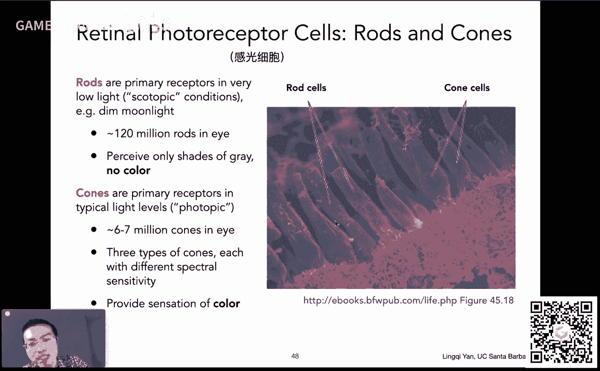

这三类分别是什么呢，我们说清楚，这是在这个锥形细胞内部，也就是用来感知颜色的细胞内部做的分类啊，然后这三个分类为什么这么分类呢，是因为三种细胞对三种类型的波长的这个响应各不相同。

然后呢s类型的细胞它感知的呢就是这个低呃，这个这个这个波长就是小波长或者高频率到这么一个这个呃呃，这就是他能够感知更更更灵敏的感知这个关于这块的这个光线的，这个这个呃强度啊。

然后这个m呢它感知的是反正就是说对于中，间波长这一系列的光啊，然后l呢这块呢它感知的就是这个职业长波上，那就是这么一个意思，那么大家会看到这里呢，还有还有这有一些曲线，这些曲线叫什么呢。

这些曲线就是就是所谓的这个呃就是response的曲线，就是这个呃响应的曲线，也就是说如果你给它不同的光，它会有这个多强烈的反应，他就是感知的能力，就是这么一个意思对吧，叫响应曲线。

那么人们是如何利用这些不同的细胞，人感知各种不同的曲线呢，这是下一个话题，但是在这之前有一个非常非，常非常违背这个自然规律的一个事情啊。

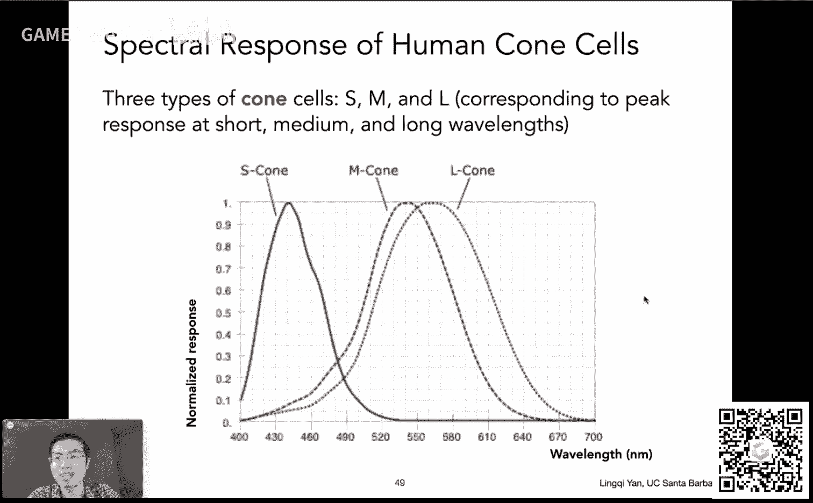

但是是一个真的事情什么呢，我们提到这三种细胞分别用来感知不同的类型的光对吧，但是不同的人眼睛里面啊，这三种细胞的分布非常非常不一样，大家看到这里是12幅图对吧，12幅图12个对应着12个不同的人。

12个不同的人，这个大家这个眼睛里面这三种锥形细胞，然后他这个他们的这个分布，大家一眼就可以看到它们的分布绝对不一样，而且他们的数量上有有严重的个体差异，这个事情非常神奇，比如说这个人这左下角这。

个人他就有很多这种绿色的这些这些感光的，这些这些呃锥形的细胞对吧，那比如说这个地方就是这个人右上角，这个人他就有很多这个对于红色的这个更敏感的感知的细胞，这就非常神奇对吧，就每个人之间差异非常大。

这所以说呢不管怎么样啊，就是说我们回到这个事情上来，嗯，再次印证了这么一个事情，颜色是人感知的结果是这么一个意思对吧。

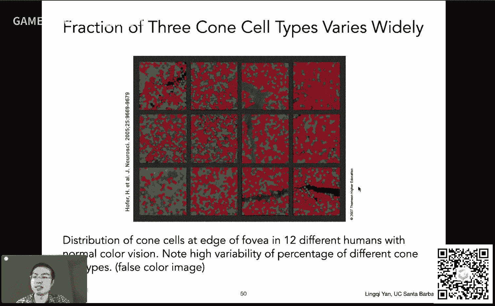

那这里就是呃对于这个呃思想算是一个证明好，那么我们再回到这个呃这个所谓真感知这些颜色上面来对吧，咱们刚才提到三种，不同的细胞，那三种不同的细胞对于这个不同的这些对这些呃光线，它是如何感知的呢。

那我们想一想，刚才我们定义了这个光在在不同的这个波波长上的分布对吧，我们又知道这个某某某一种细胞对于某一个波长它的这个响应是多少，那么感知的结果是什么呢，感知的结果其实就是这个这两个函数。

然后我们把它这个对应位置这个相乘起来，然后积分起来没有问题吧，就相当于是我给你某一个这个呃波长，我知道这光线的强度是多少对吧，然后呢我光线的强度是多少，然后我就。

和这个呃我就和这个呃相应的这个感知的这个曲线的这个感应的强度，然后乘起来，然后我把每一个这个不同的过程都考虑进去，哎这可不就是最后的结果嘛对吧，也就是说啊，我就是要把这个呃所谓响应曲线。

和这个呃原本给定了光的s p d这两个事情做个积分，我就可以得到一个值，那么这就是人们如何去感应不同的颜色，那当然了，三种不同的细胞自然就会感应出三种颜色来给你三个结果，对应sm l okay。

那这反映了一个什么问题啊，反映了什么问题，就是说就是说大家立刻就，可以体会到就是说给定任何一个一种类型的光线啊，呃就是说他有任何的s p d没有关系，那么人们到底看到的是什么对吧。

通过这个响应曲线这种计算方式，我们就知道人们看到的是三个数s m l，人们看不到这个光谱是什么，这些已经被积分掉了，大家会发现啊，这个积分结束之后得到的结果就是一个数，没错吧。

每一个曲线和一个另外一条曲线，我们乘起来积分对吧，然后这个这样得出来三个数，也就是说我看到的这三个数才是我真正感知到的颜色，而并不是这个光线本身的，s p d，这样我们就可以解释这个问题了。

那么有同学反映说这个每个人眼中世界不一样，确实就是这么回事嘛对吧，然后呃因为每个人这个眼睛里面三种这种细胞分布各不相同嘛，对那么这就是原理对吧，我们刚才已经说了，那么人眼看的到底是什么光线，有光谱。

然后这个光谱经过人的眼睛反映到视网膜上，然后被三种不同的细胞感知到，形成三个数，这三个数送到人的脑袋里面去，然后就会就会这个你就会认为哦你看到的一个什么样的颜色，也就是说你看到的绝对不是光谱，而。

是就是这三个数s m l，ok这个事情是不是很神奇对吧，然后但是这就是这个科学的这个这个这个过程啊，没问题，那么有同学自然会问这么一个问题哈，就是说这个啊就是说我们既然看到的不是这个光线的光谱。

我看到的是光线光谱和各种各样的曲线积分出来的结果，那么会不会有一种情况，就是说诶有两种光线，诶，它们具有的光谱不相同，可是被我们看到的结果却是相同的，这是很有可能的，这种现象就叫做同色异谱现象好吧。

那么红色异谱现象到底怎么回事呢，对吧，就是说啊，不同的这个信号，咱们刚才说了，不同的这个这个信号进来之后，经过了积分之后，得到三个数却是相同的，这是完全有可能发生的一件事情。

而这个同色异谱现象呢就是非常非常重要，正是说我们利用这个这现象，才能够给人们呈现各种各样不同的这种颜色，这种呢这种过程就叫做所谓color matching过程。

颜色的匹配过程就相当于是我想通过不同的这种这个调和，各种各样不同的这种光谱，然后我得到某一种颜色，使得这种颜色跟我看到的另外一种颜色一样，我并不需要说这个最后的这个，得到了两种光，它们的光谱不一样。

我只需要它们的颜色一样，就是这么一个意思好吧，哎那就是说啊这个这里是一些实际的例子，这实际的例子呢就是它们的光谱就是s p d对吧，各不相同，就是说通过那三条曲线积分了之后，得到三个完全相同的结果。

哎这这就是说明这个呃这就是这个这个同色异谱现象啊，那就是说我刚才提到说这重要的一个应用是什么呢，就是说同色异谱现象，我可以说就是说有一个这个照片拍了一个太阳，然后呢我希望在显示器上，然。

后可以显示出这种东西来，那么应该用什么样的颜色呢，那我就可以说我去通过不同的这种调节方式，使得人看上去这两个这个呃呃颜色长得一样对吧，但是我这个混合出来的这个光谱呢可以和之前的光谱长得完全不一样。

这个是没有关系的，对吧好，这就是这个关于这个颜色这背后的一些知识哈，嗯没问题，有同学说色彩空间会不会说会马上就说ok行，那么我们刚才提到同的意图，就意味着我们可以重新这个给定任何一个颜色。

我就可以去匹配它，我可以用不同的颜色去混合得，到它对吧，那么为了得到这个混合这么一个一个颜色啊，我们首先得说颜色应该如何混合，平常我们会认为啊，在我们的这个计算机的成像系统里面。

我们认为这种成像系统叫做加色系统，什么叫加色系统呢，很好理解，我有几种不同的所谓原色啊，这里以这个rgb，这是最常见的这个rgb 3种颜色这个为例，那么我把这个rgb呢。

这个他们各自不同的颜色呈上某一个强度啊，然后我们把它给混合起来诶，我混合起来之后，我就可以得到一种颜色，得到这种颜色，我就用它们各自混合的这个系数，也就是强度，而gb这三个数来表示这种颜色。

这就是我们怎么混合，那怎么理解成加色系统呢，加色是这么一个意思，就是说啊在我们的计算机里面，大家知道如果把这个rgb这三个值都给调到255，就是最高得到什么颜色呢，白色。

然后呢从这右边这个图上我们也可以看到，在真实的这个世界里面，如果我把这些不同的光都给照到同一个位置上面去，诶，我会发现各个光在混合了之后，它会变强，会变成这个。

就比如说rgb 3个颜色混合之后会变成白色，和我们画画就不一样，如果我们调和，各种各样不同的这种颜料，它会越调越黑，最后会变黑，那种叫检测系统，就是说这是不同的这个理解啊。

我们这里用的都是这个呃加色系统好，那没问题，那么加色系统就允许我们通过刚才的这种线性组合这些基本颜色，这些方式来匹配任何给定的颜色，怎么做，太简单了，这里就是一个这个基本例子对吧，我给你任何一个颜色。

然后我希望用三种不同的颜色去这个混合匹配得到相同的颜色，那我就是说如果我从上方往下看，我会看到这么个东西对吧，左边是给定的颜色，右边是我混合。

出的颜色只只要我把它右边混合出来的颜色混的跟左边一样就可以了，对那道理就在这，那怎么做呢，比如说左边是某种颜色，也是这个颜色，右边颜色呢我可以给它这个每一个颜色，它有一个系数，就是它的强度对吧。

然后我会发现诶这时候他并不匹配，然后这还不匹配诶，这个时候匹配了诶，这就说明啊哦我找到了多少个这个呃就是说用多强的这种第一个颜色，多强的，第二种颜色多强，第三种颜色混合起来就可以得到这个这左边的颜色。

这部分呢自然实验就可以解决，对于任意的，一个颜色我都可以通过类似的方法解决，但是有一些情况很奇怪，有些情况很奇怪，什么呢，比如说啊我这个我可以调一个这种颜色。

然后然后我发现啊左边这个颜色我右边怎么混都混不出来，诶有这种情况诶，比如说啊我我现在可以这么做对吧，然后就这样混合出来还是混合不出来，那怎么办呢，那有人就发现啊，我其实还可以这么做。

我可以呢把这个左边给定的，我需要混合的颜色往上加一个颜色啊，往上加一个颜色，那就好像是说如果我左边不给它加一个颜色，就相当于是这个对，应右边我就给它剪掉这个颜色就可以了，顶多是零对吧。

所以说通过这么一种方式啊，给这个我要匹配的颜色加上颜色，就好像是对呃，我右边的颜色减去颜色一样，这就是用了刚才那个线性的性质哈啊然后这就这就告诉我们啊，如果我们通过几种不同的颜色去混合得到一种颜色。

这个不同的系数其实可能是负的，是没有问题的对吧，就可以理解成另外一边加上，那么通过这种方式呢，人们就发明了一个所谓啊这个ci 2 gb的这么一个系统，诶，这里就。

渐渐的开始有点像这个我们的这个正常这种颜色空间去表示了，这个是那我们来说啊，这是什么意思，就是ci e2 gb c i e呢是一个组织一个这个好像是法语，不是英语哈。

就知道这是组织他们定义的这个rgb的这个系统，这个rgb，然后我们说清楚他要干什么，他要做这个颜色的匹配，那么给你的任何一个颜色，它是这个这个单波长的颜色，它是某种激光。

它的的s p d不是颜色的s p d，它的这个光线的s p d就是一个单一的一个所谓这个delta函数，然后它这个你也就可以理解成某一，种曲线吗，没有什么关系对吧。

就是说他给你的永远是一个所谓单色的一个一个颜色，然后呢你要用三种也是不同的单色的这个这个光，然后就是说他们的这个呃在频谱上分布也是非常非常集中，几乎就是在同一个这个波长上好吧，然后不管怎么样吧。

他给你什么样的颜色，这个这个s p d对吧，然后这个给你的这些所谓这些基础颜色，这rgb 3种基础颜色它是什么样的s p d我们都不用管对吧，我们只需要考虑说如何用这三种。

然后混合出得到某一个某一个这个波长上，它对应的，这个颜色对吧，然后呢他们就做了实验，多数时间对于任何一个这个波长上的颜色，就是这怎么解释这幅图哈，就是说我们看这幅图。

它并不是刚才我们所说的这个响应的这个函数跟响应没关系，他是在做这个颜色的这个匹配嘛对吧，我给你任何一个固定的波长，咱们取一个竖线，比如这里咱们取450好吧，一个竖线，这就是我要匹配的颜色。

这个颜色我需要用这么多的蓝色，这么多的绿色和这么多负的红字，然后把它给混合起来，得到这么一个颜色好吧，这样就说清楚了，就等于说我，们这这个就告诉了我们。

这幅图告诉我们如何这个通过混合各种各样不同的这些单色光，得到任何一个这个呃一一个这个呃波长上面的这个呃，给定的这个一个一个光线，它的颜色对吧，这样想好，那么这样一来呢。

我就可以这个呃把这三条曲线就就这么做出来对吧，我对每一个这个波长给给定一个不同的颜色，我做一个实验，我可以测出这么一个形状，我会发现什么事情呢，我会发现确实有负的对吧，然后我们刚才说负的没关系。

肯定是可以的对吧，就是说他们这些曲线来说算出来，这个这个红色这么一条曲线是很明显有一块负的，然后其他地方看起来比较正常对吧，是这个意思好，那么这样一来呢，就是说它可以得到一个所谓的这个匹配函数。

这个这个就叫做匹配函数，就对于不同的这个波长，然后我需要用多少的这些原始的这些光，这些呃对这些光给组合起来好，那么做了这个实验之后呢，那我就可以说如果我现在给你任何一种实际的这些这个光的光谱。

那么我们刚才说他要匹配的是什么一个单色的光谱对吧，任何一个波长上，它就只有那么一个波长上，面有值，然后它匹配是需要多少这个这些呃原始的这些光对吧，那现在给你任何一个实际的s p d分布，那怎么算。

我需要多少，这个二多少g多少b，那这个时候呢，我就需要把每一个过程我都考虑说需要用多少的这个红色，绿色和蓝色，然后混合在一块才能得到它，那我考虑每一个波长都考虑进去，那自然而然就是另外一个积分。

这个积分出来结果之后，我就可以得到三个数，这三条曲线分别会告诉我说这三个数，那咱们把这个事情说清楚啊，这里就是说要想匹配任何sd的光，咱们刚，才做的实验得到三个这个这条曲线是对于每一个单个波长的光。

那这里自然就是积分，他会发现这个形式和咱们之前那个响应的形式非常像对吧，这是差不多的，但是他们的意思并不一样啊，这个要理解清楚就好，那不管怎么样吧，就是说给你任何一个颜色，你都可以用这么多红，这么多绿。

这么多蓝来表示，这就是我们的rgb的系统，没问题吧，就是说我们通过这个rgb不同的调和，我们可以调出各种各样不同的这个呃这个呃实际的颜色对吧，那也就是说这个是所谓颜色匹配函数这么一，个应用好吧。

那么再进一步我们开始来说这个啊颜色空间的事情，那么既然我们刚才提到这个啊rgb对吧，然后rgb呢它是一个广泛使用的一个标准的系统，这个rgb系统其实它的这个名字应该叫做标准rgb啊，standard呃。

standard die的rgb或者叫s rgb，然后这个其实是应该是这个更正规的一个名字哈，然后这个s r g b呢它就是就是这种颜色系统，就广泛的应用于各种各样的成像设备。

比如说我们电脑的这个显示器对吧，然后呢他怎么做的呢，他就是说我先找某一台机器，某一台机器的它二gb给做好，之后行，我后来制造，我就按照这个这台机器的这个方法来制造，就是这么个意思哈。

然后rgb呢用了很多，但是rgb这个这个颜色空间，它所能形成的色域是有限的啊，这都是什么意思对吧，然后马上就说对吧好那么再说rgb这个系统之前，我们先说一说这个呃另外一个系统啊，另外一个系统。

这个系统其实来说虽然咱们不常用，但是在科学上会会更更加的这个这个广泛应用一些是什么呢，这个系统叫做c i e x y z系统，还是那个组织啊，xyz xyz系统是在干什么，同样它也要定义这个所谓颜。

色匹配函数，大家还记得刚才那个rgb的这个呃颜色匹配函数吧对吧，他这个红的是有负的对吧，然后这里呢这个cie xyz它是反过来的，它不是一个实验测出来的这个颜色的匹配系统。

它是人造的一套这个颜色匹配系统，那这个颜色匹配系统它就首先它我自己先定义好这这几种不同的曲线，好吧，它是虚拟的啊，不存在啊，就是说这些颜色匹配匹配的曲线就告诉我还是一样啊，对于任何一个波长。

比如说咱们看这个450 450nm，这个波长我需要这么多的，绿的很少对吧，稍微多点，红和很多的蓝色哎，就这么一个意思对吧，那告诉你这个事情之后，同时呢由于它的设计啊。

就是它的覆盖又比较这个正常从400~700，然后呢他这个分布又挺对称的，所以正常情况下先用这个用这些这个呃这些小写x y z啊，这三个这个颜色匹配函数，然后我匹配出来各种各样的颜色。

它得到的y这个大写y这么一个数啊，就类似于rgb那个那个g那个数，就这个大小y这个数一定程度上就可以表示这个颜色的亮度，就，是这个意思好吧，然后呢大家可以看到它这个设计就是说呃这个红色它其实有两个峰值。

但是它却没有那个呃没有负数对吧，然后他的所有的这些这些呃函数，它都是这个覆盖在你所有的可见光的范围内对吧，400~700都有，但是待会看左边多那么一点点啊，这个问题不大好，那么我们刚才说什么来着。

就是说x y和z对应的是三种不同的这个，然后我们可以用这三个数来表示某种颜色，特别的这个y本身其实表示的是一个这个啊亮度是这么一个意思好，那么它仅仅和rgb的区，别就是在于它的这个匹配函数的问题对吧。

所以不管怎么样，这三个数，那么有人说我能不能把这个呃x y z系统能够表示所有颜色，我们都显示出来诶，这是一个好的想法，对不对，但是我们想啊x y z就是大写的x y z这三个数，它这个本身它是三维的。

我可视化一个三维的东西，不好不好，可视化对吧，那我怎么办呢，我只想显示其中的两位，那他怎么做的呢，他做了这么一个事情，它对于任何的大写x y z先做一个归一化，大家还记得归一化吧。

就是让这个x y z加起来等于一啊，这，里是加起来等于一，咱们之前做向量那个是平方，加起来等于一，就是说我把x除以xy，z之和，y也是z也是。

那这样的话我就可以这个xy就是得到三个归一化的的值小写xyz，那我知道这小写的归一化的指xyz小写加起来等于一，那我只需要这个显示诶，比如说前面两个维度诶，然后能得到一个什么样的图就可以了。

那我为了显示前面两个维度，我其实是还是有这个大写x y z3 个数的，对不对，那么我既然知道这个大写y表示的是一个亮度，那我其实可以把亮度给固定成某一个数，然，后我让这个x大写x和z它们发生变化。

然后我显示的图显示小写x和y啊，这个我不知道说的清楚吗，就是这个就是不管怎么样嘛，就是他想对这个大写的xyz做一个这个可视化，它固定了大写y，然后可视化小写的x和小写的y，然后可以显示出这么一个图像来。

好吧，哎这么显示是有道理的，因为你如果改变大写的y其实也只不过改变他们的亮度而已，你其实还是可以一目了然的看清楚各种各样不同的颜色，大家会看到它是一个有一个什么扇面形的这么这么一个形状哈，就是。

它有一个这种边界，然后这是很有意思的，那么这个叫什么呢，这块大家看到的东西就叫做色域，就是所有一个颜色空间可以显示的颜色，就是这么回事，好吧，那么对于这个色域来说啊，有很多事情可以看得出来。

这个中心这个地方就是呃白色的这种颜色，然后我们知道白色是由各种各样的颜色混合起来的啊，那所以我们说白色是最不纯的颜色，然后纯的颜色都在哪儿呢，都在这个它这个形状的边界上，这是最纯的。

算是单色这么一种感觉啊，就是说呃一定记得，我们用了加色系统，所以白色是是混合的，最多的是最不纯的啊，这个意思好，那么就是这么一个意思呃，这个呃整个这一块儿这个这个分解呃叫什么来着。

就是说这个显示起来就是这么回事啊，这个啊好，那么这里就是关于这个呃所谓色域的事情啊，色域我们就可以这个定义起来，我们刚才说了所有可能显示的颜色，一个颜色空间了，所有可能表示的颜色，那么有同学会这么问呢。

那难道不同的颜色空间表示了这个呃颜色的这个范围是不一样的吗，答案是确实如此啊，就是说确实不同，的颜色空间，比如说咱们看s rgb，其实它仅仅能够表示这么一个很小的三角形在这个里面啊。

也就是说它表示不了这么这么像这个呃x y z这么大的色域好吧，然后就是说也有各种各样神奇的这个其他的各种各样的这些呃，呃颜色空间，它们能够表示的颜色也各不相同。

总之就是说我们看这个色域这张图就可以看得出来好吧，那么呃这里就是关于这个呃颜色空间这块呃事情啊，然后我们已经快讲完了，其实还好啊，那这样哈，既然有同学问这个这个事情啊，就关于颜色空间这一块。

它的显示我们再把它说清楚一点哈，就是不管怎么样，类似于rgb x y和z，我们是可以得到三个不同的这个呃，这个数的就是大写的x y和z表示某一种颜色，对不对，我们为了做可视化。

我们不可能把这三个这个颜色都给这个这个显示出来，显示在三维空间内，这样看不着，我们希望只显示其中两维显示，为了显示其中两维，他做了归一化，得到了小写的x和y和z，它们可以保证加起来等于一。

这样的话我就可以只用显示x和y就可以了，因为我知道那个是z是多少对吧，显示x在这，个小写的是这个水平轴，小写的y在这个数值的轴，但是我刚才说了，为了显示这个小写的x和y。

它其实来说它表示的颜色还是由大写的x y z来定的，所以它其实还是三个变量，那么怎么办呢，那既然这个大写的y表示的是亮度，我就可以固定住某一个亮度，我只关心不同的颜色的类型。

也就是说把y当做一个常数来看，那这样的话这个小写x和小写y都是这个大写x和大写z的这个函数，没问题啊，那这样的话我就做这么一个可视化好，那么这里是我们再回到这个这一块儿啊，好那么这个我们现在再来看啊。

这个呃还有其他的各种各样不同的空间，咱们刚才说了x y z，咱们又说了二gb其实是很小的对吧，然后还有没有其他的空间呢，有特别是对于这个photoshop啊。

这个比较熟的同学肯定会知道这么一个颜色空间叫h s v，虽然你可能没听说过，但是没关系，就是说你在这个在生活中肯定已经广泛使用了，这就是所谓颜色拾取器啊，就这么个东西能干什么呢。

就是说它可以允许你这个选各种各样不同的所谓色调，这个q然后呢这个你又可以选择各种各样不同，的饱和度，然后这个是叫做叫做saturation，然后brightness是颜色，有时候叫做value。

叫做v h s v嘛，然后也有时候叫做叫做什么来着，呃这就不记得了哈，但是没关系，就反正就是说这个h s v呢，这个就是给这个艺术家们定义的，这个非常好好理解什么呢，大家可以从这个条上看的清清楚楚啊。

色调就是不同类型的颜色，什么红色，蓝色要什么颜色对吧，那么饱和度饱和度指的就是说这个呃是更接近白色，还是更接近这个颜色本身的唇色，就是这个意思，咱们之前不是说了吗，你这个白色算是最不纯的，然。

后这个颜色本身算是算是最纯的，从这个这个切面图啊，咱们可以看到这个饱和度越饱和，它就越接近单一颜色越不饱和，就意味着它是这个呃，这是什么来着，混合颜色就是白色，好吧，这个这个啊那就是这么一个意思。

那么value最好理解它就是亮度对吧，从黑色一直到这个某种颜色，那么这里是一些正式的定义哈，但问题不大，就是说也有人叫h s l啊，叫lighlightness，但其实就是h s v问题不大。

主要就是它这个通过色调选不同的颜色，通过饱和度决定它是偏白还是偏这个颜色，然后亮度决定偏，黑还是偏这个颜色就是什么事情好吧，那所以说呢呃这个就比较这个适于呃艺术家们去调对吧，呃选某种颜色很方便。

那这是其中一种叫h s v，那么还有一种呢也是c i e，大家会发现这个c i e在这个颜色界它是有统治地位的对吧，然后他们还有一个空间叫什么空间呢，叫lab空间，跟实验室没关系啊，lb这个这个意思。

然后呢这个lab色彩空间是什么呢，也是一个跟感知有关的，我们刚才说这个h s v是的，因为一目了然可以看到什么颜色了对吧，那么这个呃lab空间它也是跟感知，有关它感知是怎么个感知法啊。

大家会看到它有三个轴啊，看到三个轴，a轴这个负a正a，然后和它垂直的一个负b正b这么个值和一个这个l的值，那么l和还是永远是最简单的，就表示的都是这个亮度哈，零就是黑呃，呃这个100就是就是这个呃白。

然后呢你会发现在这个其他两个轴啊，a轴和b轴上它表示的是什么呢，这a轴表示的是这个红和绿啊，红和绿这两个颜色，然后呢这这分别是两个镜头啊，然后呢这个它表示的是这个蓝色和黄色，是这个意思。

那么这是什么意思呢，就，是说啊在lab这个空间内，他认为任何一个轴上表示的颜色，它的极限两端哈都是互补色，那什么叫互补色，那大家可以理解我这个比如说白色它的反义词是什么呢，它就是黑色对吧。

这这就是说白色跟黑色是互补的，那么不好理解一点的是什么呢，是红色凭什么跟绿的是互补的，然后黄色为什么跟这个跟这个这个蓝色或者紫色，这这些是互补的对吧，这些呢是根据这个实验得到的一个事情。

就是说人人人的这大脑它是对这些互补色其实本身是有一个定义的，我们马上会看到，就是说，呢就是说呃这个它的轴这么安排背后的原理，就是说你平常会说，比如说有一个这个大家可以看到一个浅色的这个绿色对吧，深绿。

然后黄绿蓝绿都有，这些大家都好好想想，可是大家绝对不会想到说有一个这个颜色是有一种偏红的绿色，这个是很困难的对吧，为什么呢，就是因为红色跟绿色差的太远了，他这个他们两个完全是成为了一对互补色。

这跟人脑有关系的啊，就这么一个意思好，那么就是说这个从什么地方可以看出来呢，咱们可以从一个非常简单的例子，通过人眼的视觉暂，留来验证这么一个互补色。

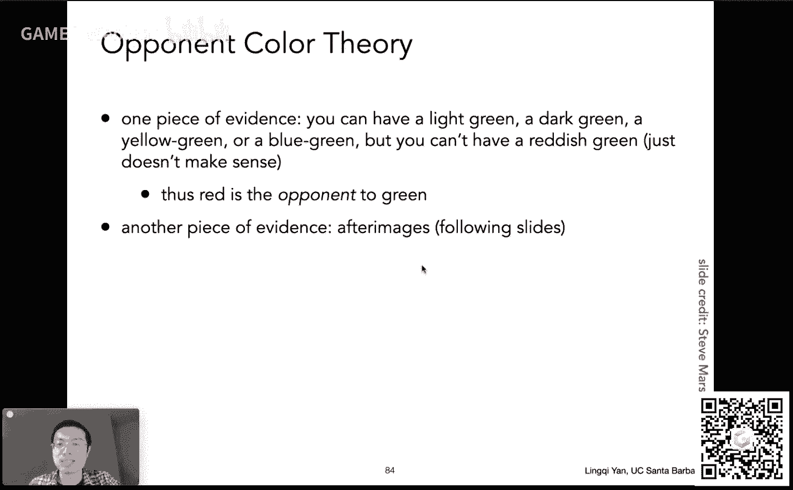

那么这里呢给大家看一个，那么现在我会给大家做什么实验啊，来先不用看啊，我给大家做一个实验，是这样的，就是说下一幅图我给大家显示一幅完全是白的图，这幅图呢是一个互补色。

那么人眼的视觉暂留的意思就是你看一幅图，看时间长了之突然切换到另外一个图，你会看到这个图的互补色，那咱们现在可以做一个实验，大家看中心有一点哈，中间有个点，大家盯着这个点看，看个十秒钟，我来切换到下。

面一个这个图上来，咱们开始123456789。

怎么样，有没有看到，应该是没有问题哈，这个呃好，那那这个这就是这其中一个例子哈，也就是说呃这个人脑呢会自动的把这个互补色给补上啊。

就是这么一个一个道理，那么下面一个例子哈，下面一个例子大家可以看到这是一个这个忍者神龟啊，大家可以看得到，它显然也是互补色，但是这个例子呢。

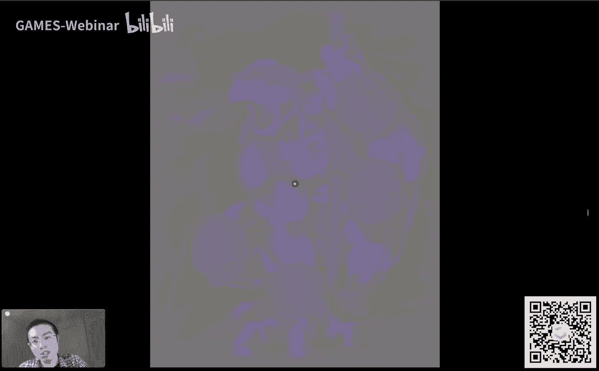

下一张图我要给大家显示的是一个这个灰度的这么一个哎忍者神龟。

这么一个例子，那么这里，是为了干什么呢，大家可以想象啊，比如大家一开始先看第一张图。

看了之后呢会看到它的互补色，并且你同时又会看到这个灰度图，所以相当于是你会把这个互补色加到这个灰度灰度图上。

那我们知道这种偏红的颜色过来之后就正好是偏绿。

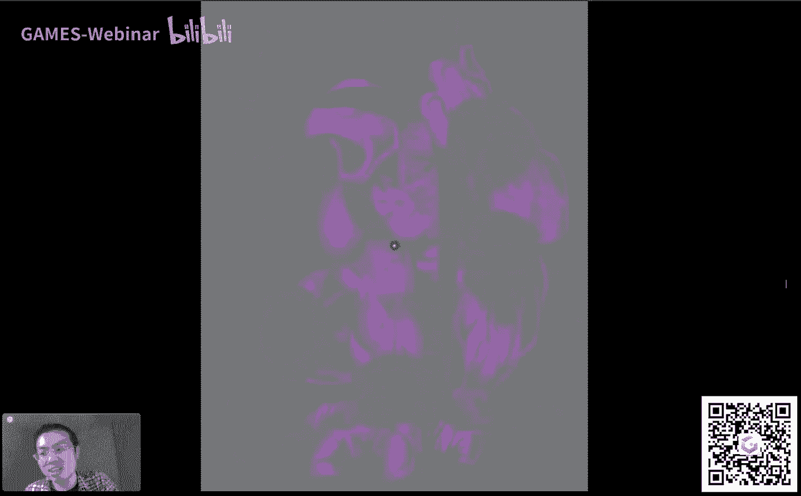

那大家大家知道忍者神龟本来就是绿的对吧，那大家可以看到看一下是不是能看到这个现象。

那么大家现在可以开始计时啊，盯着中间这个点，然后12346789是怎么样。

我是看到哈哈哈还是不错的哈，然后这个嗯就是不管怎么样吧，人，脑啊它自动是可以这个这个达到一个互补色的这么一个效果的，好吧啊，行没问题，那也就是说啊这个互补色有道理，这就说明刚才的什么呢。

lab空间有道理没问题啊，就是说它有三个轴，三对轴啊，就相当于是这个一个轴上两个对对点，它都是这个呃完全是互补的，这么个意思，那么颜色呢还有很多这个很神奇的东西啊，很很神奇的东西是什么呢。

就是说啊颜色很多都是相对的，相对的就是颜色本身是感知，咱们回到这个颜色这个话题上来，对不对，颜，色本身是感知啊，也就是说你看到的颜色它到底是有多强，这个事情是你自己觉得是这么回事。

它和实际上可能有这个相悖的这个效果，什么意思呢，咱们看这个例子，这个例子在干什么，这个例子在干什么，大家看到这个渲染图非常简单非常简单，大家看到这个这个地板上有这个这个棋盘格这种东西对吧。

然后大家看到有个a有个b对不对，我现在问的问题也非常简单，这个a和b哪一个更亮，哪一个更啊，就是这么回事，然后大家会觉得这个问题太简单了，a显然要更暗，a非常暗，b，是一个浅灰色，a是深灰色，对不对。

本来就是这么回事嘛对吧。

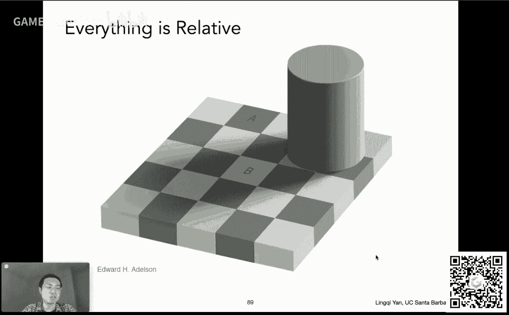

但事实上来说啊，并不是这么回事，让大家来看啊，比如说我把左边给挡住。

然后呢我再把右边给挡住，挡住挡住之后呢，然后呢呃a还是比b要暗嘛对吧，然后但是那么可以再把上面给挡住，再把下面给挡住，然后我再把中间给消掉，然后大家现在会发现，如果我只盯着a和b来看。

大家会发现什么呢对吧，大家会发现这个这个a和b其实他们两个颜色是一模一样的，也就是说咱们之前看这幅图。

这幅图a和b我始终觉得这个，a肯定要比b要暗嘛，但是事情并不是这样，咱们刚才通过刚才的例子来看，就可以看到这个事情，也就是说这直接证实了这么一个事情，也就是说从这幅图咱们直接切换到这幅图。

大家会看到a跟b这绝对是一样的颜色对吧。

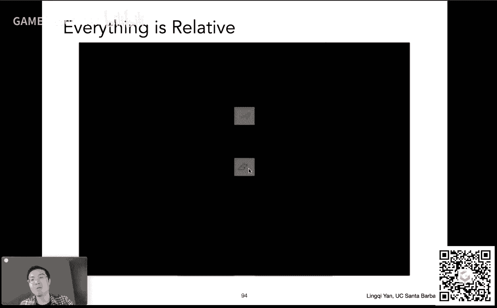

那么咱们还可以有另外一个例子，同样道理哈，就是说颜色本身是相对的这么一个事情可以得到很很容易的证实，这里问这两个黄色的叉啊，黄色的差本身哪个更亮，大家会觉得好。

左边这个黄色的差显然要比右边这个黄色差要亮啊，然后但是如果我简单的我，做一个水平的一个呃这个纯色的一个一个调，大家会发现把这两个连接起来之后会发现哦，两个颜色其实是完全一样的，所以说这就说明什么呢。

这就说明整个颜色完全是一个人脑感知的道理，咱们又回到之前所说的颜色这么一个事情上来，那这是一个事情，那么最后最后还有一个事情没有说什么呢，检测系统，检测系统其实这个在生活中应用得更加广泛，什么呢。

就是在各种各样的印刷啊，这些这些东西里面打印啊，这些这些事情里面用的都是检测系统，检测系统是什么意思呢，就，是说啊这个我给你不同的这些颜色，我把它混合在一块儿，然后会越混越黑，这里大家都看得清楚啊。

就是说这个一个典型的检测系统是叫做c m y k系统，c m y k是什么意思呢，是这个蓝绿色啊，这个这是这种色c啊，然后品红色这个这个magenta这个颜色就是这种颜色啊。

然后这个yellow就是黄颜色，就c m y，然后k呢k就是黑色，就是这个意思，这为什么用这套系统呢，就是因为大家可以看到c m y可以通过混合得到各种各样不同的颜色，对不对。

然后这就是说我们这个这个打印上诶，我，可以通过混合各种各样不同的这些呃墨水，然后越混越黑嘛对吧，这是检测系统嘛，然后我可以调出各种各样不同的颜色，那么现在这个肯定很好理解对吧，检测。

那么我问这么一个问题哈，大家可以看到我混合c m y，混合c m y本来就可以得到k对吧，就可以得到黑色，那我为什么还要黑色，为什么这套系统不叫cm系统。

为什么叫c m y k为什么他一定要带上这个黑色自己，这个应该是我觉得大家应该完全可以回答这么一个问题对吧，我现在直接告诉大家，这是因为什么呢，这是因，为这个在印刷上大家是要考虑成本的，对不对。

这是一个实际的系统，就是说我这个正常情况下打印啊，有很多东西正常应该是以黑色居多，然后黑色会得到很广泛的应用，但是黑色本身这个墨水呢它好造，它便宜，然后cm y这三种带颜色的墨水它不容易造。

然后就是说这种呢它会这个你混合出来得到黑色，这就很亏，这样成本就就是非常高，对不对，那所以说平常带上一个这个黑色的颜色，然后需要用黑的直接用，省得它浪费彩色墨水啊，所以说这就是便宜哈。

就是这么一个道理好吧，那，其实今天啊那咱们就说到这儿啊，时间上也差不多吧，我觉得这个嗯基本上就是这样，那现在看看吧，咱们可以认为这个已经下课了，然后如果有同学有问题的话，欢迎提出啊。

那行大家在这个这个说问题的时候，我简单给大家说一下，你看这这两节课基本上以科普为主对吧，但是还是很有意思，就是在图形学上有很多事情，特别是像今天这些颜色，我觉得有很多东西很神奇对吧，嗯ok嗯。

想想大作业框架需要自己写吗，可以，自己写你也可以去拿别人的问题不大哈，um ok，那用别人的记得写清楚，比如你的文档里面写一写这个用到了谁的东西就好了，好吧哦，关于伽马就任何这个好啊。

这块的话就是说我们有一些东西并没有提哈，就是说在咱们这门图形学课里面嗯，比如说什么没有提呢，这个呃hdr就是high dynamic range，叫高动态范围图像，我们没有提，就是说颜色当颜色亮过了。

白色会不会还能更亮对吧，像这种东西啊，没有提，另外一个呢我们没有提伽马校，正所谓干嘛，就这意思就是说我们之前在做ptron的时候问过这，么一个问题说你算出来的最后是pixel radiance。

radiance最后要变成颜色，然后是不是简单的做一个线性的变换就可以得到，并不是就是因为你本身的颜色这个显示啊，在这个啊显示器上它是非线性的，你必须先把这个校正过来，使得你这两部分非线性抵消了之后。

还是线性，是这么一个意思，就是说这个部分叫做伽马矫正，但是我们也没有提啊，这块呃基本上来说不提应该差不多啊，问题不大呃，如何发现新的颜色空间怎么样，也就是怎么样造一个颜色空间是吧，哦这个挺难的。

这个我并不知道哈，一，个典型的这个想法是这么回事，你造了之后得有人用对吗，就是说他得有自己独特的性质，比如咱们刚才说这个呃叫什么x y z，它就非常好的理论性质，非常大的色域，然后rgb呢就好用。

平常这个咱们用红绿蓝很直观对吧，然后像这个hsv它比较好调颜色，我觉得这个随便选颜色比较容易对吧，然后就是类似这种这种感觉，就是做这些东西呢肯定有很多东西需要考虑，当然你可以造一个虚拟的吧。

就像xyz一样，ok那么嗯好呃，颜色知识有没有推荐书，这个够呛，这个够呛啊，我想想办法吧，好，吧那没问题啊，这个这个暂时没什么办法啊好吧，然后是这么回事，有同学问这个下节课会不会讲动画，是的。

从下节课开始，我们两节课时间，我们来把这个动画这块你说说嗯，就基本知识给说明白，正好咱们可以接到下一节下一门课的关于这个呃，更高级的这个动画仿真与模拟这块的知识好吧。

然后呢这边有同学问d65 和d50 这块我就不再多提了，这仅仅是相当于有不同的光源，就说第d65 有一种有一种什么样的这种灯，它叫做6d65 ，它具有某一种特定的这个呃光，谱的性质性质这个问题不大。

仅仅就是说这个测出来的一些东西哈，ok啊没问题啊，这个嗯下一门课什么时候出，按说广告应该很快就要出了哈，目前来说我还是别说了啊，我虽然知道，然后等到咱们官方的广告出来。

然后以及我的最后一节课也会给大家稍微介绍一下这个事情好吧，那这样想就是咱们暂时不用太担心这个事情，什么时间段我确实不知道，有可能是连着的，有可能中间歇了一段时间，但是这块儿并不是特别清楚，好吧嗯好吧。

那这个那那我想想s r g b广泛应用是因为，什么这好问题哈，我还真不知道，我只知道大家是在广泛应用这个东西，嗯行吧，高质量渲染会公开吗，有同学会问啊，那这个事情是吧，就是关于我之后可能会开的课堂。

就是说我这边呢这个呃虽然所谓专业研究渲染这块吧，就是说之后有两门直接的课，一个叫做这个实时渲染，一个叫做这个呃，这也就基本是离线渲染，实时渲染会说一些这个工业界的一些这些啊，跟这个游戏啊。

这些实时的应用相关的一些技术，然后呢嗯离线渲染主要，是可以理解成是学这门课就可以自己手写一个渲染器啊，这么个意思就是说呃这个差不多是这么一个安排之后，至于什么时候交什么再说吧好吧，反正这个现在这个课嘛。

games 101们头一节课啊，头一门课吧，先把这个做好之后，我们再做这个这个呃稍微高级一点的课，你这个二开头啊，我之前给大家解释过没有，就是关于哦我我我先说一句啊，就当下课了，没什么问题啊。

随便说一说，也就是说在这个国外的这些课程体系里面啊，这个标号通常都是一开头的课，算是基础课，二开头的课，算是提高课啊，基本这么安排，然后按照我们课号之后一个一个往后排就是了。

也就是说下一门课应该会叫做201，可能之后会给家教202或者零三啊，这么个道理啊行吧，那什么时候真能讲到50门课再说吧，好吧嗯行啊，那没问题，那看看如果大家没什么其他问题的话，那咱们今天这就到这儿吧。

好吧啊，ok行行行啊，三开头没有没听说过啊。

这个哈哈ok这样吧，那今天就到这了，时间也拖了非常久了，然后这个呃不管怎么样，给大家说一说这些知识相对愉快哦，啊确实没时间回头来，说那个叫什么来着，就是反过来的那个uv和s t这个理解了。

但是在回去自行理解吧，通过光场相机这一块儿应该不难啊，这样想，那咱们今天就说到这儿啊。

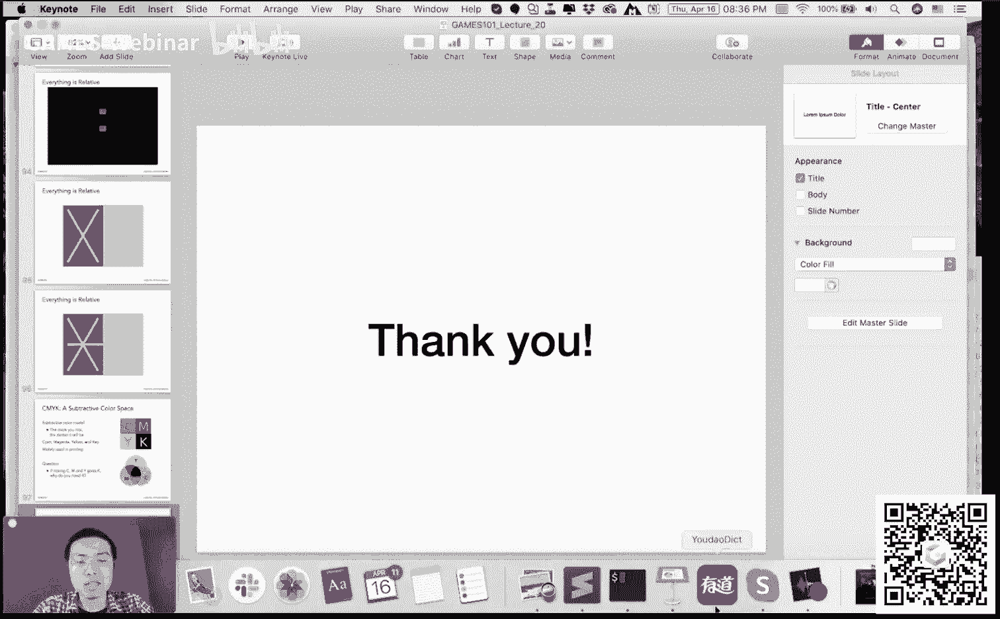

那把时间交还给我们的技术秘书同学啊，也感谢大家的支持，好啊，ok那咱们就这样啊，好嗯，各位同学再见啊。

