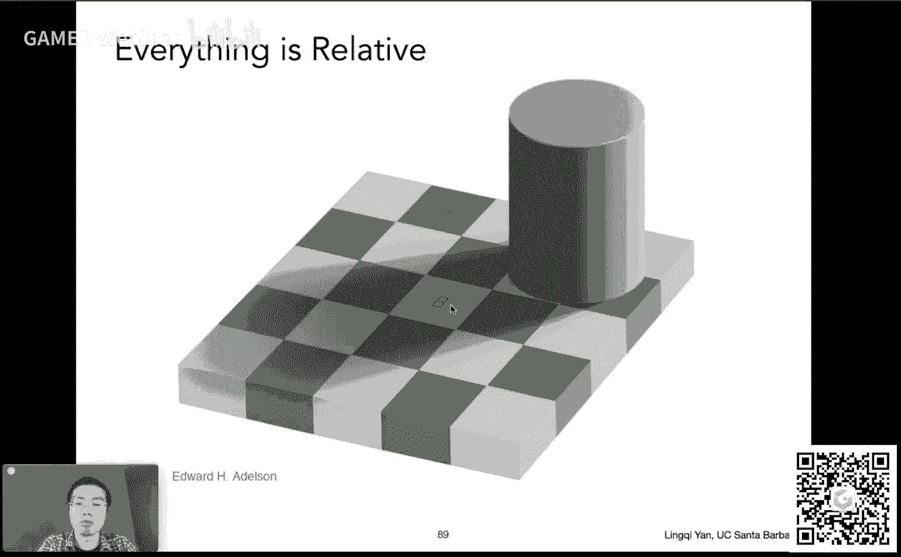

# GAMES101-现代计算机图形学入门-闫令琪 - P20：颜色与感知 👁️🎨

## 概述
在本节课中，我们将要学习计算机图形学中关于颜色与感知的核心知识。我们将从上一节课遗留的“光场”概念开始，深入探讨其原理与应用，然后系统地学习颜色的物理基础、人眼感知机制以及各种颜色空间。课程内容旨在让初学者能够理解这些看似复杂但至关重要的概念。

---

## 上节课遗留问题：光场

上一节我们介绍了相机模型，本节中我们来看看一个相关的概念——光场。

光场，也被称为全光函数，描述了在空间中任意位置、任意方向上的光线强度。它是一个七维函数，包含了位置、方向、波长和时间信息。但在实际应用中，我们通常使用其简化版本，即四维光场，它只记录物体表面任意一点向任意方向发出的光线强度。

我们可以用两个平行的平面来参数化光场。一个平面（UV平面）记录观察位置，另一个平面（ST平面）记录观察方向。连接两个平面上任意两点，就定义了一条唯一的光线。通过记录所有可能的（U, V）和（S, T）组合对应的光线强度，我们就得到了整个光场。

以下是理解光场参数化的关键点：
*   **UV平面固定**：这相当于在不同的观察位置（像摄像机阵列）拍摄场景，得到一系列不同视角的二维图像。
*   **ST平面固定**：这相当于从同一个观察点，记录成像平面上每一个像素点接收到的、来自不同方向的光线。这类似于昆虫的复眼结构或光场相机的原理。

## 光场相机 📸

理解了光场的概念后，我们来看看它的一个直接应用——光场相机。

传统相机的每个像素记录的是来自各个方向光线的**辐照度**。而光场相机在感光元件前加入了一层**微透镜阵列**。每个微透镜会将打到其上的、来自不同方向的光线分散到后方感光元件的一片区域上。这样，原本一个像素记录的一个**辐照度**值，就被“展开”为一片区域记录的多个**辐射度**值，即记录了光线的方向信息。

拥有了完整的光场信息后，光场相机可以实现传统相机无法做到的功能：
1.  **先拍照，后对焦**：拍照后，可以通过算法模拟不同焦距的透镜效果，选择让场景中不同距离的平面变清晰。
2.  **虚拟移动视点**：通过选择光场中不同方向的光线进行合成，可以模拟从不同位置观察场景的效果。

当然，光场相机也有其局限性，最主要的是**空间分辨率与方向分辨率的权衡**。为了记录方向信息，需要牺牲一部分空间分辨率，导致对传感器分辨率要求极高，成本也随之增加。

---

## 颜色的物理基础 🌈

现在，我们进入本节课的核心主题——颜色。首先，我们需要了解颜色的物理本质。

颜色源于光。白光通过棱镜会被分解成不同颜色的光谱，这说明白光是由不同波长的光混合而成的。描述光在各个波长上能量分布的曲线，称为**光谱功率分布**。

SPD具有**线性可加性**。这意味着多种光线混合后的SPD，等于各自SPD的简单相加。这是颜色混合的理论基础。

然而，**颜色本身并不是一个纯粹的物理量，而是人类视觉系统的一种感知**。接下来，我们将探讨人眼是如何感知颜色的。

## 人眼如何感知颜色 👁️

人眼类似于一个摄像机，视网膜上的感光细胞负责接收光线。感光细胞主要分为两类：
*   **视杆细胞**：感知光线的强度，用于形成黑白视觉。
*   **视锥细胞**：感知颜色。它又分为三种类型，分别对短（S）、中（M）、长（L）波长的光最为敏感。

当光线进入眼睛，其SPD会分别与三种视锥细胞的**响应曲线**进行积分运算，最终得到三个数值（S, M, L）。大脑正是根据这三个数值来“感觉”到某种颜色。

这个过程引出了一个重要现象：**同色异谱**。即两种光谱组成（SPD）完全不同的光线，经过人眼三种视锥细胞积分后，可能产生完全相同的（S, M, L）响应值，从而被人感知为同一种颜色。这正是颜色再现技术（如显示器显示颜色）的基础——我们不需要复现真实世界的光谱，只需要复现对人眼的刺激效果即可。

## 颜色匹配与RGB系统 🎨

为了定量地描述和复现颜色，科学家进行了**颜色匹配实验**。给定一种目标颜色，用三种**原色**（通常是红、绿、蓝）以不同强度进行混合，直到混合出的颜色在视觉上与目标颜色无法区分。

实验发现，为了匹配某些单波长的颜色，有时需要将一种原色“加”到待匹配色一侧，这等价于在混合色一侧使用“负值”的该原色。由此，国际照明委员会定义了 **CIE RGB** 系统，其**颜色匹配函数**在某些波长区域为负值。

基于颜色匹配实验，我们建立了**加色系统**（如显示器），即通过将不同强度的原色光叠加来产生新颜色。最常见的加色系统是**sRGB**，它定义了红、绿、蓝三原色的标准，广泛应用于数字设备。

## 颜色空间 🌐

为了更科学、更直观地表示颜色，人们定义了多种**颜色空间**。

*   **CIE XYZ 色彩空间**：这是一个由CIE定义的人造、与设备无关的色彩空间。其颜色匹配函数均为正值，且覆盖了整个可见光谱。其中，Y分量直接对应于颜色的亮度。通过对XYZ进行归一化（x=X/(X+Y+Z), y=Y/(X+Y+Z), z=Z/(X+Y+Z)），并固定Y值，可以在二维平面上绘制出**色域图**，它能直观展示一个颜色系统所能表示的所有颜色范围。
*   **HSV/HSL 色彩空间**：这是为艺术家设计的感知性色彩空间。
    *   **H**：色调，表示颜色的类型（如红、黄、蓝）。
    *   **S**：饱和度，表示颜色的纯度（从灰色到纯色）。
    *   **V/L**：明度/亮度，表示颜色的明暗程度。
*   **CIE Lab 色彩空间**：另一个感知均匀的色彩空间。L表示明度，a轴表示红-绿对立，b轴表示黄-蓝对立。它基于人眼对**互补色**的感知（如长时间看红色后，再看白色会看到绿色）。

## 减色系统 🖨️

与显示器的加色系统不同，印刷、绘画使用的是**减色系统**。当颜料混合时，它们吸收（减去）特定波长的光，反射剩下的光，因此混合越多，颜色越暗。

最常见的减色系统是**CMYK**：
*   **C**：青色
*   **M**：品红色
*   **Y**：黄色
*   **K**：黑色

理论上，CMY混合可以得到黑色，但实际印刷中单独使用黑色墨水（K）成本更低、效果更好，因此形成了CMYK标准。

## 颜色的相对性 🧠

最后，我们必须强调颜色的感知是**相对的**，深受周围环境和大脑解释的影响。经典的“棋盘阴影错觉”证明，两个物理上完全相同的灰色块，在不同的背景和阴影暗示下，会被感知为截然不同的明暗度。这再次印证了颜色是一种主观的心理物理体验。

---

## 总结
本节课中我们一起学习了图形学中关于光场与颜色的核心知识。

我们首先解决了上节课的遗留问题，深入理解了**光场**的概念、参数化方法及其在**光场相机**中的应用。随后，我们系统性地探讨了**颜色**：从物理上的光谱，到人眼通过三种视锥细胞感知颜色的生理机制，以及由此产生的**同色异谱**现象。我们介绍了基于颜色匹配实验建立的**CIE RGB**和**sRGB**系统，并讲解了多种重要的**颜色空间**，如CIE XYZ、HSV和Lab，它们分别服务于理论分析、艺术设计和感知均匀性等不同目的。最后，我们区分了用于显示的**加色系统**和用于印刷的**减色系统**，并通过视觉错觉认识到颜色感知的**相对性**。

这些知识是理解数字图像处理、色彩管理和真实感渲染的基石。