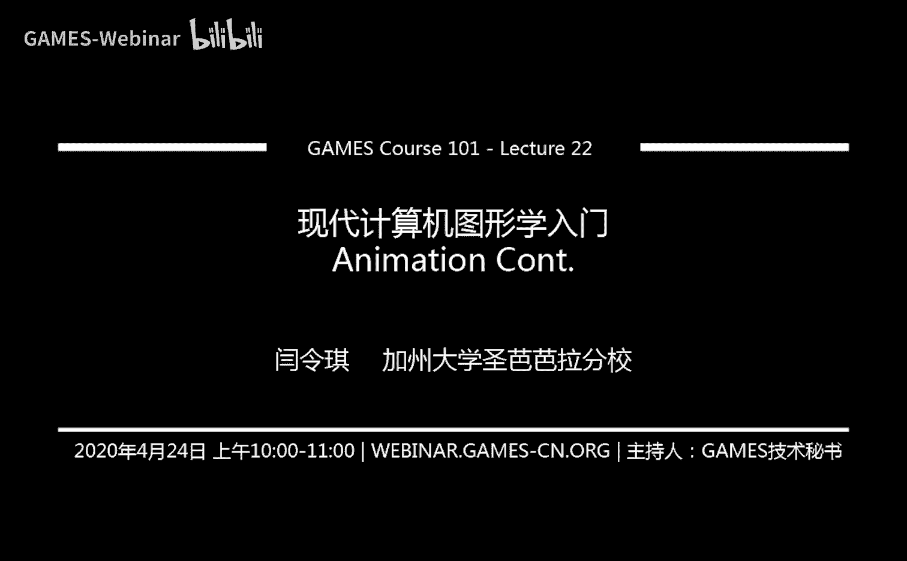
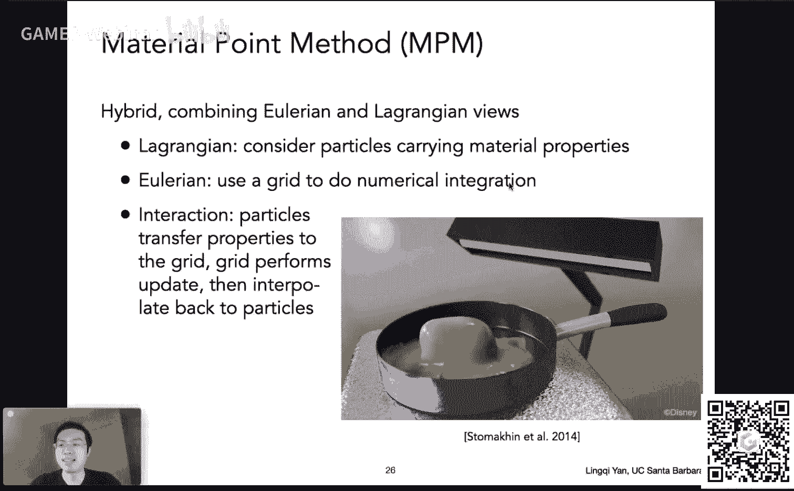
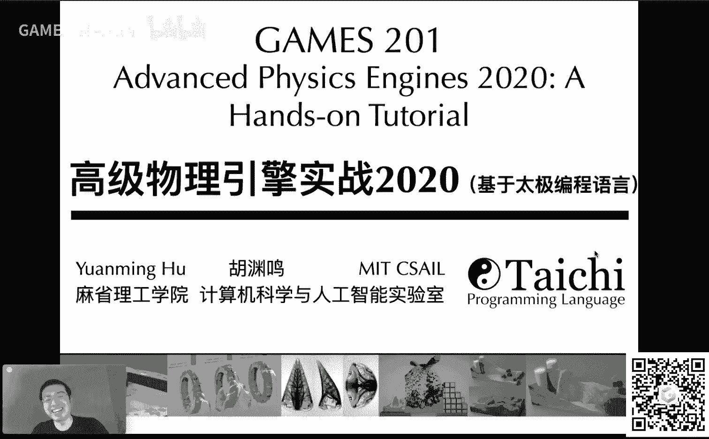
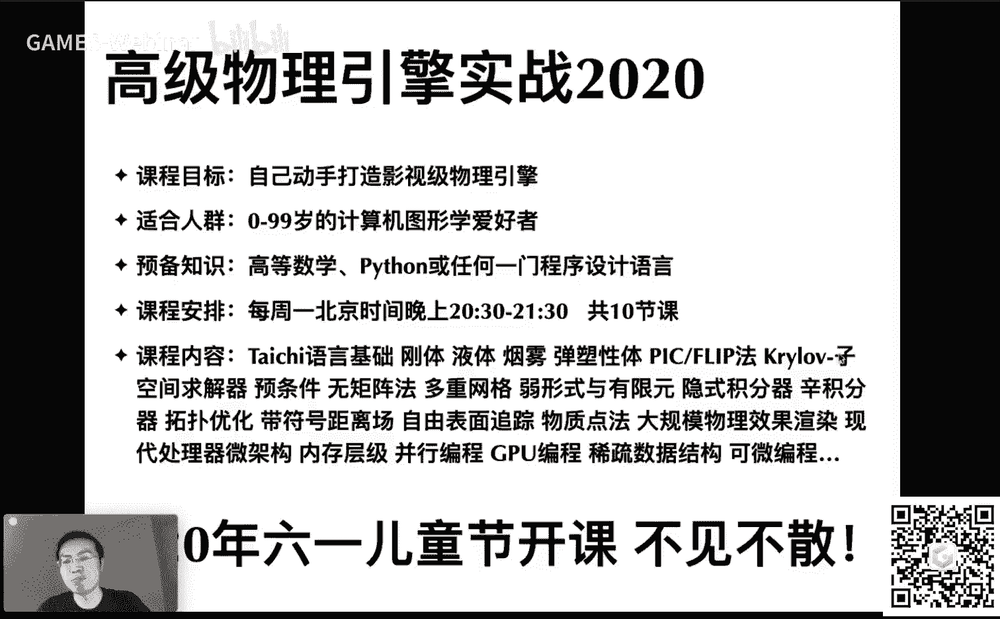
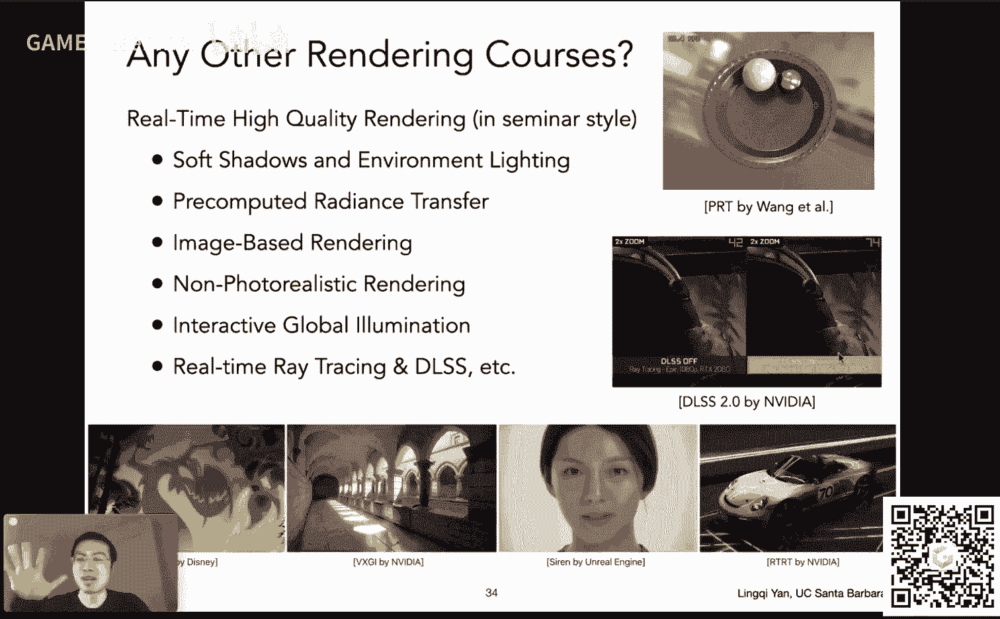
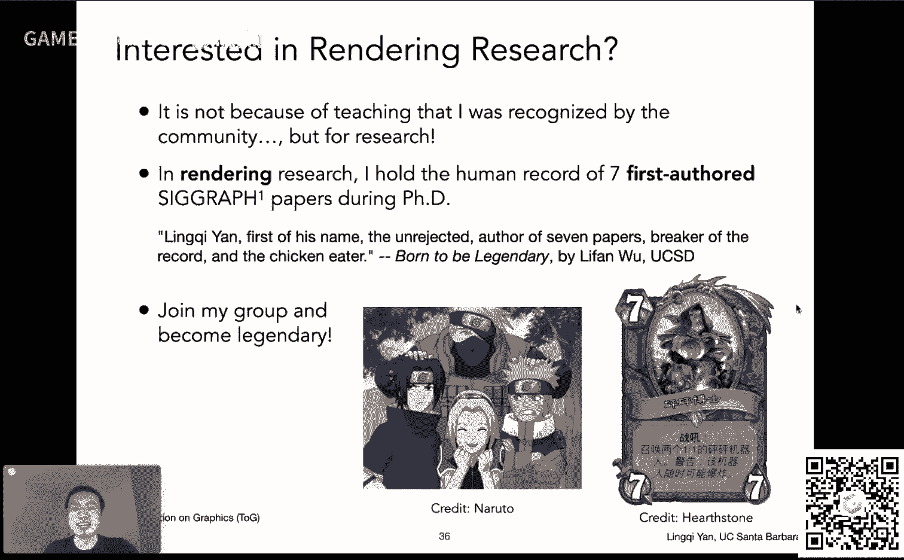
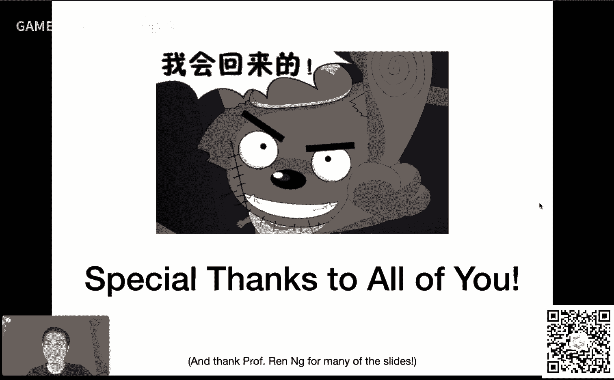
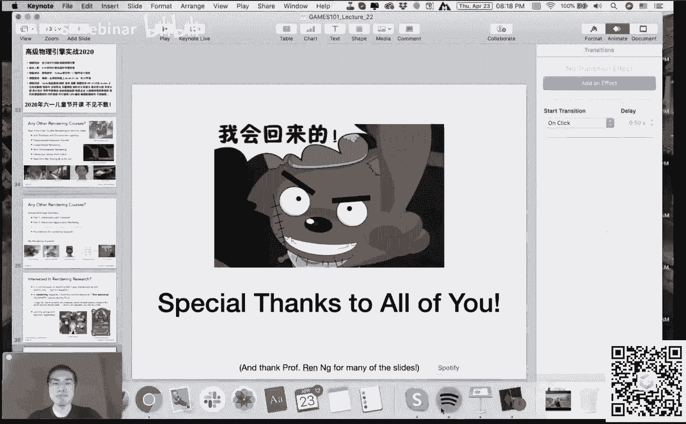
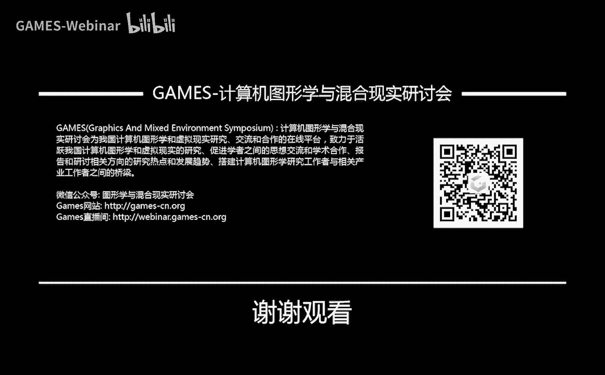

# GAMES101-现代计算机图形学入门-闫令琪 - P22：Lecture 22 Animation Cont. - GAMES-Webinar - BV1X7411F744

嗯是咱们的呃games 101的最后一节课啊，第22讲，咱们把嗯动画和仿真这块给说完，然后咱们这个课呢叫现代计算机图形学，入门对吧，然后上下来之后大家体会到了吧，这个虽然是入门啊。

但是有很多现代化的东西在里面，然后今天能这个把这门课给完结掉，然后我自己也非常开心啊，那咱们这个今天的课程内容相对较少啊，呃我们把课程内容说完之后，给大家做做广告，然后呢来跟大家互动互动。

如果有各种各样的问题呢，欢迎大家提出好不好啊，那咱们就这么安排啊，第22讲啊，在课程之前呢还是一样，咱们先说一说呃各种各样其他事宜哈，一个是应大家要求，我们把大作业的这个截止日期，往后延长了一个星期。

没问题啊，如果大家觉得不够的话，之后我们再反正都好商量啊，这个之后反馈给助教同学，或者呃这个论坛上吧，然后如果大家真需要更长的时间，那就更长时间吧，我觉得差不多够了哈，一个星期。

那么作业期现在是175份提交，然后比之前要少一些，所以我现在非常建议大家，如果说觉得作业难啊，多花点时间没问题，之后咱们还会很快把这个作业期的呃，重新提交给开启，然后大家就可以到时候再把它给补交上来。

没什么问题啊，然后呢这个呃怎么说呢，这里就是说呃做一期相对难一点，然后到时候我们有可能会想办法，把他的这个权重稍微往下调一点哈，大家看到这里其实出现了我的签名，这是怎么回事呢，这个我们问了。

这就是我们要说的下面一个事情哦，哦中间还有一个哈，就是说我们的作业吧，今天会给大家放出来，非常简单的绳子模拟器，之前上一节课还是见到的啊，没什么问题，正确实现mass spring就可以了。

好那么这个签名是主要说什么事情呢，是说咱们这本这门课了，大家上完了之后不会让大家白上啊，大家把这个作业呃，都已经这个都辛辛苦苦做完对吧，然后我们也会给大家提供一份证书，然后呢这个证书会有我的这个签名啊。

就会是这个签名啊，然后呢啊到时候会给大家呃放出这个嗯，电子版的就是pdf版本的这个证书啊，然后呃什么时候呢，那自然是大家提交完了大作业，以及这个所有的补充，这个补提交都已经提交了之后啊。

咱们把所有的作业成绩都给改出来之后，然后给大家发放这些证书，那么怎么发这些东西呢，需要大家提供一些呃这个认证的这些，这些嗯怎么说呢，信息比如姓名啊，邮箱啊这些东西怎么办呢，把它当做一次作业。

我之后会让助教同学们呢建立一个作业，虚拟的哈，就叫做这个所谓certification request，如果你需要一个呃这个电子证书的话，然后到时候呢，我们这个你你按照这个助教的要求。

然后提交这个所所要的信息就可以了，就当成一次作业提交，非常简单啊，提交了之后，然后每一位提交的同学，我们最后给大家这个发放这个啊证书，当然了，这你得能够顺利通过这门课对吧，这个没有问题啊。

好那大概就是这么个安排法啊，那么这里呢这个嗯有同学反映，我的中文字写的还可以，没有我专门练过签名啊，这个事情其他的字写得不怎么样啊，啊这这个事情，另外这是在ipad上面写的。

所以说其实和实际上写字还是有点区别哈，就是一个事情啊，好那么今天最后一节课了，虽然我也很难过，对不对，这个最后一节课了，这个之后就没有了，妈对吧，这之后我们再给大家说啊，这个事情啊，不过这门课结课了。

还是挺开心的一件事情啊，没问题，好那么好，那咱们这个呃开始说今天的话题啊，今天的话题啊什么呢，就是说我们今天啊沿着上一节课的思路，上一节课，咱们不是介绍了各种各样不同的方法对吧。

然后嗯就是说模拟各种各样的运动，基本知识对吧，我们说我们定义一个物体它的速度啊，然后我自然而然在任何一个时刻，我都可以算出来它在在哪，而是这么一种意思，对不对，但是我们没有讲具体怎么做。

那么咱们这节课呢，主要就是说从上一节的概念出发，咱们讲一讲方法，真正怎么样把这些物物体啊，这些各种各样不同的位置啊，时间在对应的不同时间，它出现在哪里对吧，一个物体以及堆物体，咱们怎么把它解出来啊。

简单给大家说一下，这里呢简单提一下这个欧拉方法，以及这个解决不稳定的若干提高的，这个办法好吧，然后简单给大家提一下钢铁的模拟，最简单的模拟，后面给大家说一下流体的模拟叫fluid，好吧。

差不多今天这么安排，最后再加上一些广告啊，就这么一个打算好哦，有同学反映说啊，之后要不要嗯给大家安排一下，这个是好问题，好那行，那没问题，那这个之后我在讲广告的时候，这个正好给大家穿插说一说好吧。

那今天内容其实这个非常简单哈，那咱们看一下呃，我们要干什么，刚才说清楚了，对不对，我规定了一个物体，它任何一个时刻，比如说啊任何一颗一个时刻的速度，然后呢，我又知道他一开始出现在某一个位置上。

那么我们想解什么呢，我们想解在某个时间之后，它会出现在哪里啊，这个这个事情啊很简单，对不对，那如果一个物体它有一个固定的速度，那么它原本出现在某一个位置上，在t0 时刻出现在某一个位置上。

然后在t一时刻它应该出现在哪儿，咱们知道对吧，把这个位置加上速度成立时间就可以了，那如果说唉这个问题没有这么简单的，大家看右边这个例子哈，这边这个例子呢，我们现在在说的，就是说我想模拟某一个例子。

他在一个什么呢，在一个速度场中怎么样运动，什么叫速度场啊，大家理解成跟广场啊，跟磁场啊，其他一切的这种厂完全一样的概念，也就是说任何一个位置，只要你知道这个位置，你就知道他这个时刻的速度啊。

这当然是一种理想化的情况，在这个实际的情况中，这种情况这很难做到的，对不对，你这能够定义任何一个位置，他受多少力，这差不多，但是一个位置它的速度是多少，不知道对吧，但是咱们认为哈有一种理想的情况。

这种就叫速度长，那大家可以想象，如果有一个粒子在这个地方，它应该会沿着这个类似水流的这个方向，往这边走，对不对，这个意思，那也就是说任何一个位置，x任何一个时间，我都应该知道它有一个速度没有问题啊。

然后我们现在考虑一个例子之后，我们再再把它这个提高到这个，很多例子在一块儿，咱们考虑好吧，行那是这么一个情况了，我们定义的啊，长对吧，有位置有方向，那这这自然就是一个速度长，然后呢这里看啊。

如果有一个物体，它一开始在这儿，然后他每一个点定义了它的速度，大家就知道这就是他所谓的切线方向，他往前走那么一点点就会改变一点点速度，然后就随着这个速度长，什么这么运动下来对吧，是这么一个意思。

我们希望做出这么一种模拟来，就是这个意思了，那么我们有什么呢，在任何一个x我有他的x点，还记得这个这个写法，这个x上面打一个点，就表示它是这个速度，一阶导数打两个点，那么在任何一个位置我都知道它的速度。

它的速度的定义，当然是一阶导数的dx除以dt对吧，嗯然后呢，它就有一个这个呃不同的这个速度，任何一个时候对吧，就这么一个定义方法，那么这里呢我们定义的这种写法，就叫做一个常微分方程。

就是大家如果上过这门课，那自然是很明白这个道理对吧，而且是个一阶的常微分方程，什么叫一阶呢，我们就说这个我知道这一个量，它的微分是多少，然后我希望推出这个量是多少，是这个意思，这是常微分方程。

那为什么叫常微分方程呢，叫ordinary对吧，o d e然后常微分方程的意思就是说啊，这里面不存在其他的对对其他变量的微分，或者说导数，比如说它这个可能还有一个d什么呢。

d u d v d y d t d这个d t出现了啊，如果这个还有其他各种各样的变量，然后呢你求出来的某一个值，它对某一个变量，它的导数你就写上这个partial x除以partial t。

这个partial这个写的很像这个呃，这个倒写的字母a啊，这个意思嗯，那么这里呢只有一个变量，这个变量呢就只有对它的微分，那这就叫常微分方程啊，好理解啊，就是单变量的微分方程好，那么我们现在呢知道速度。

我想求任何一个时刻它的位置，对不对，那就是这个意思咯，那我想知道任何一个时刻他的位置，我肯定一开始先得给他一定的起始位置，没问题吧对吧，那其实我认为它在x0 ，那我想要做什么呢。

我想给他任意的时间t你都能告诉我他，他会在哪个位置对吧，这个意思，这样我就等于可以把这个点，它随着时间运动，它的轨迹给解出来，没有问题啊，那么我们怎么解怎么解呢，这个其实呃一个最最简单的想法啊。

就是呃那我就呃怎么说呢，我要求一定时间之后一个点它位置在哪，那我把这个时间给细分成很多，很多很多的时间的小块，然后每一个小块呢我计算，比如说我当前的时间t，我计算时间t加上某一个deltt，唉。

这个之后他在哪儿，然后我不断这么做是不是就可以了，对不对，那么我每一步啊我要考虑的这个叫做不长，就是叫做delta t啊，就是从某一个时刻到这个时刻加上delta t，下一个时刻，这个应该怎么样变化。

也就相当于啊，我们对这个时间上，进行了一种离散化的操作啊，没有问题，那么具体怎么做呢，这里先给大家提出一种，这个最最最最简单的想法，其实不说他的名字，自己倒是想也可以想的出来啊。

欧拉方法欧拉方法呢他怎么做呢，呃最简单的这个思路就是说啊，我在上10个时刻就是t时刻啊，大家把时刻都给写在右上，右上方上一个时刻是不是有一个位置，然后我要帅这个t加上delta的一些时间，那那怎么办呢。

咱们知道这个事情就是说速度怎么样呃，那就是说啊我这个给定一定的时间delta t，加在速度上面，就变成了下一帧的速度，没问题啊，然后呢同样道理，那如果我说我上一帧有一个速度，有一个位置。

我怎么算下一帧的位置呢，那也是这么算啊，就是说这个下一帧，他肯定是下一帧的这个位置加上呃，这个这个就是上一帧啊，上一帧它的这个位置就是上一个时间，就就是t时间呃，他的位置加上它的时间。

乘以这两个时间中间的这个这个时间间隔，对待奥特t诶，这我就可以更新到下一帧的它的位置去，没有问题，那大家可以看到一个什么事情呢，就是说啊我用到的量，我始终在用上一个时刻的量，大家看啊，x t x。

t还是两个点t，始终用上一个时刻的量去估计下一个时刻，它的量应该是多少，对那个同学不说，我能不能这样啊，你看啊，上一帧有一个速度，我就可以算这一帧他的这个新的速度，我在用这个新的速度，我再去算这个呃。

这个呃这下一帧它的位置是在哪儿，就说这里呢，我能不能把这个速度换成这个呃x点，然后什么呢，t加l的t就用下面这个式子算没问题，这也是另外一种方法，然后这种方法就不再是欧拉方法了，好吧。

我们说的欧拉方法很简单，或者叫前向欧拉，或者叫显示欧拉，这是一个最最简单的方法，所有的量我都用上一帧的，然后我估计就是估计下一帧的，这两个是截然分开的，大家可以看到对吧，哎等式的右边用到的这个x的三个。

这个没有点一个点，两个点用的全都是上一个时刻的等式，左边全都是下一个时刻的啊，这么个意思好，那么他有什么问题呢，他非常不准啊，它非常非常不准，还会出问题，什么问题，这个叫做稳定性上会出问题。

会迅速的变得不稳定，那么这是什么意思呢，对吧，那咱们可以看这么一个例子哈，在任何一个这个位置上，我们还回到刚才的速度场上，考虑最简单的位置速度两个事情，那么在任何一个位置上，它会有一个这个呃速度。

然后在这里对不对，那我要要计算它在下一个deltt时间之后，它会出现在哪儿，那咱们用欧拉方法，那在一开始它有一个x0 对吧，然后一开始有一个v0 ，然后我们把它把这个v0 乘以deltt，加上x0 。

是不是就可以得到下一个位置，然后我同样办法，我在这个点诶，我再去找一次它的速度是多少，然后它的位置，它的速度我就可以知道下一个位置在哪，没问题，下个位置知道了又知道速度，我就可以不断的模拟下去。

那么可想而知啊，对不对，我如果用这个不同大小的不长，什么叫不长deltt对吧，deltt，如果我分得越细对吧，这样的话我的模拟就应该越准，那如果说我的这个步长走得非常大。

我每一次取一个速度让往前走很长一段，他就其实和我要的这个实际的这个路线啊，偏离的越来越多，那如果说我用一个小的步长诶，我每次用了很小的不长，然后我这样1。一点一点让它往前走，那就越来越精确。

是不是这个意思对吧，就是说我们用肯定是用这个更小的tt，然后他才会更精确，那是这么一个意思哈，没问题，这就是它产生的一些所谓误差，没有问题，这个误差呢可以通过你减小deltt来完成呃，来把它给做对啊。

这个意思好，那么呢这个另外一个问题是什么呢，另外一个问题咱们刚才说了，涉及到稳定性的事情，所谓稳定性呢，就和误差是不太一样的一个概念了，什么意思呢，就是说还是同样我们考虑这个欧拉方法啊。

欧拉方法任何一个位置，考虑它的这个位置，和他这个位置所在的速度对吧，我们正好这样模拟下去，大家看右边这个螺旋形，右边这个螺旋镜，它就会出现这么一个问题啊，就是说我不管取多大的不成。

我不管取多大的不长之后啊，就是时间上取多大的不长之后啊，然后我我会发现无论如何，我得到的这个这个线啊，都是呃肯定不可能沿着这个螺旋形走啊，不管怎么样，我只要取一个不长，那就意味着任何一个点啊。

我取它某一个速度，这个速度，如果认为是这个螺旋形曲线的切线，那就往往一个方向去到另外一个地方之后，它速度又会变成另外一个切线对吧，然后就一直这么走，一直这么走，最后造成的结果是什么，噪声根，结果就是说。

他一定会离开这么一个螺旋形的一个，速度场，而事实上来说我们看到啊，这个按理说这个如果你任何一个时刻，都有一个和你的这个位置垂直的，这么一个一个速度哈，它无论如何，这个粒子。

它应该是按照一个严格的圆周运动来做的，它不可能飞出去，对不对，就会出现这个问题，不管你不长取多小，它一定都会飞出去，它有这么一个问题啊，这个意思，那么同样道理，下面这个呢稍微更麻烦一点。

但是其实一回事啊，大家看到这个场更奇怪，它的厂呢是类似于这样的，跟头发一样的这种造型啊，在这里会有一个速度，会把这个一开始的粒子给打到上面去，上面去呢又发现下面又有一个速度要往下，又把它给扔到下面去。

然后呢下面这个又扔到了某个位置之后，又发现哦，它又有一个速度向上又变成这样了，所以说其实如果你正确模拟的话，应该怎么样呢，应该会按照这么一个这个这个区间，慢慢慢慢慢慢走到水平，对不对，走到这么一个情况。

但是这种情况它就会出现越模拟越大，出现这么一种情况，那如果大家学过信号与系统的话，其实这种情况会不会被叫做什么呢，叫做正反馈，对不对，就是说你出现了一些问题之后，这些问题会被无限的放大。

就会出现这么一种情况对吧，而这个问题，咱们还是回到这个螺旋上面来说啊，这个问题它就和误差它是两码事的，因为你不管delta t取得多少，他一定到最后都会出现这么一种，这个这个变成和你的实际的结果无限远。

这么一种情况，这种就叫做不稳定，这就是欧拉方法的问题，好吧好，那这就是就是说咱们提到这两个事情啊，误差和不稳定性，那么我们总结一下啊，就是说一切用数值方法去解，这个怎么说呢。

解微分方程都会面临的这些问题，第一个呢叫做这个这个误差，误差其实问题不大，因为你在每一步计算都会有误差，累积起来它还是有误差对吧，没有问题，那如果说我这个呃用的步长较小，我就可以降低它的误差那个问题。

然后有时候呢你模拟出来一些误差，按说问题也不大，特别是对于图形学的一些应用，其实大家主要这个关注的地方是说，你这个模拟看起来效果怎么样，对不对，而不是说物理上特别特别的真实，是这么个意思对吧。

那这种误差，那更大的问题其实在于不稳定，不稳定他才是问题，他就说啊，这个大家注意这个diaverage这个词，哎这个就比较厉害啊，就是说这个diverge呢，这边这边意思就是说。

你有任何一个这个某一某一种模拟方法，但是你不管你怎么样模拟你的结果，他最后他都和这个实际的这个呃，你要的这个正确的结果，它差的特别特别的远，就越来越远，出现这么一种情况啊，这种情况那就是问题。

而且它是一个非常非常基础的问题，就一定是会出现有这么一个问题的，所以说大家都在试图想办法，解决这么一个不稳定的问题好吧，那么这里给大家看一个例子啊，这个真实的游戏里的例子，这就是这个啊，绝地求生大逃杀。

里面的一个这个车子的例子啊，大家可以看到这是一个多么神奇的现象，好吧没问题啊，短短的几秒啊，我试试看能不能回来一点好，大家可以看这个车子撞上了一个摩托，按说呢他应该是直接继续往前走。

或者说这个弹一下对吧，他是不可能出现这么一手，很神奇的魔女的现象的，对不对啊，当然了，这个背后发生了什么，最后不知道啊，然后这个是不是说，因为这个不稳定性造成的一些问题，这个我也不知道。

但是咱们这里作为一个例子，不稳定确实会出现这么一种问题啊，诶有同学反应，这是诶嘿嘿行，这是我直播翻车现场行，挺好挺好挺好，机智啊，ok哎没问题啊，这是这个这个一个典型的例子哈。

然后嗯那咱们再回到这个课程上来，我们既然提到了不稳定性对吧，那我们肯定要想办法解决这个不稳定性，而且啊从刚才的介绍上来看，我们怎么解这个微分方程呢对吧，我们是不是用呃欧拉方法来解，那也意味着。

是不是有其他各种各样的改进方法，对不对，能够帮我们解决这么一个不稳定性，那确实是可以的，怎么办呢，这里呢提供若干种不同的方法，这些方法呢你看看大家可以看到呃，中点法啊，终点法，然后以及动态的这个改变。

或者说自适应改变不长的方法，然后以及影视的方法，然后以及说其他的一些，这不是基于物理的方法，而且都是什么意思，咱们挨个给大家说啊，非常容易理解的一个事情啊，就是怎么说呢，我们先介绍第一个概念叫做终点法。

那么我们要干什么，我们不希望说这个欧拉方法，让在这模拟的过程中啊，让这个结果离得越来越远，对不对，我们不希望出现这种情况，那怎么办呢，也有人发明了一个这个方法，什么方法就是叫做终点法，怎么做呢。

那一开始有一个位置，一开始有一个方向，咱们是不是可以直接拿欧拉方法来模拟，某个l i t，假设这个ott能够让它从这里先到达a好吧，没问题啊，当当它到达a之后，我们不用这个点，不用这个点怎么用呢。

我们取这个原始的点跟这a点中间的中点，取这个终点呢，考虑终点所在的速度啊，终点这个点他在的速度长，它可不是应该是有这么一个速度吗，啊终点我们认为是b点，然后它有一个速度，往往这个几乎是平着的这个方向。

然后我再回到原始的出发点上去，回到原始的出发点上去呢，然后我应用刚才的这个b点，也就是终点它的速度来重新再算一遍，欧拉方法唉，就是说这一点，我现在不再沿着它原来的速度上去了。

我现在沿着刚才我算出来终点的那个方向，也就是这个方向哎，这条黑线方向往这边走，考虑它的一个时间点太低诶，然后我就算出来，他这个时候就应该到达了c点，就这么一个意思好吧，这样一来呢，大家可以可想而知啊。

原本来说它的路线是不是应该这样的对吧，从这个速度长出，咱们可以猜测出来他先往上诶，到到这里开始平，到这里开始往后我往往下对吧，那么在这样一来呢，我会发现我用中点法计算出来的。

这个这个值要和要和这个什么相比啊，和这个原始了一次这个欧拉方法相比诶，那它好很多，对不对，就是会出现这么一种情况，那自然而然这个重重点方法呢，这就会比这欧拉方法要准确，那就有这么一个概念在里面。

那么它的核心是什么，核心是什么，就是说我仍然是用的欧拉方法，只不过用两次，第一次为了得到第一次的终点的速度，那么第二次是用中点的速度，再算一次欧拉方法啊，这个意思好吧，那么他的这个想法呢。

自然而然就是说，我这个我，我我在第一次模拟欧拉的这个过程中啊，它速度肯定会发生变化对吧，他在一开始跟最后的速度肯定会发生变化，我找一个更有代表性的速度，能够代表他整体一个运动对吧，那谁呢，就取一个终点。

就这么一好吧，就这么一种模拟方法，然后呢它其实也可以，这个写的非常呃这个呃工整啊，是这么一个一个一个算法啊，呃没有问题，那大概就是就是这么一个，简单的一个写法啊，然后你发现什么了呢，你会发现啊。

就是说我在把这个式子给展开了之后，给展开了之后，嗯，其实终点法为什么会准确，是因为中点法呢，比欧拉方法多了一个这个二次的项，也就是说啊通过终点法，其实你模拟出来了一个这个所谓抛物线。

这么一个一个呃运动轨迹，扔个意思啊，至于这个24个从哪来的呢，那自然就是说，我在平均两个速度的情况下啊，然后这么算出来的好吧，那这个就暂时先呃不用多说了好吧，然后这块呃重点方法就是嗯。

简单而言就是相当于是原本的欧拉方法，你可以认为是认为是一个局部，线性的一个估计的模型，那么这里呢用终点方法啊，那其实就相当于你算出了一个局部的呃，二次的模型，而这个意思。

那当然它就比这一次的模型要准确了，对吧好，那就是这个这个事情，那么对于中点法呢，它其实有一个稍微更怎么说呢，更呃好的一个应用哈，就是说我用中点法，我是不是可以得出两个点，刚才大家还记得吧。

a点和c点对吧，a点呢是我一开始咱们回去吧，好那a点是我用一次这个欧拉方法呃，来来来做出的对吧，这个正向或者是显示的欧拉方法，算出来的点，那么c点是我用中点法算出来的点，没错吧。

那么我能不能把这两个方法给结合起来，好吧，然后呢这这样一来呢，就有人这个想出了这么一个事情，就是说我还用终点，但不是用中点方法那个终点哈，就不是用终点的速度，那怎么做呢，很简单很简单。

还是把终点这个思想给应用进来嗯，就是说我应用一个时间的dio tt，比如说呃这个这个一开始有一点在这里，时间delta t之后，我用欧拉方法得到的，在这个大写x t上对吧，那显然它不是多准，那怎么办呢。

我把这个时间减半，我把时间减半，我把它分成两个单ott，我两个带ott呢，我算两遍，那我可以这么算，那在这个点我用这个二分之delta t，我可以算算到这个位置上，没有问题，那再二分之delta t。

我从这个点我再算一次这个欧拉方法，咱们这个点的速度，显然它就是终点的速度了对吧，再算一次欧拉，诶，我可以算到这里，那也就是说这样得出了另外一个点，叫x t除以二，其实是应用两次二分之t t没错吧。

那么这两个点它可能会有不一样，对不对，那怎么怎么去这个利用这个思想呢，如果这两个点它俩差的挺远的，那就意味着说我把这个deltt啊，分成两部分来分别考虑，我先跑一个二分之l tt。

再考虑一个二分之d tt诶这样做会更准确，那我就应该把这个时间再给拆分的，更短一点，考虑1/2的tt就是这么一个意思对吧，那这里啊再次强调一下，和刚才终点法啊不一样，没有。

是这个应用没有在一开始这个点重新应用，终点的速度，而是说就是说我就跑两次，每一次呢跑一半时间，在这个终点，重新估算这个它的这个呃新的速度，然后再用另外一半时间从终点出发，算出另外一点啊。

虽然都是利用了终点的概念，那不管怎么样吧，就是说他会给我们一个标准，我是否这个划分，把这个dd划分成两部分，而取决于说我这个这两个点差得远不远，那如果说我分成两部分来跑，然后跑出来两个这个点位置差不多。

那这就说明什么呢，这就说明啊，我现在用的这个deltt，或者说二分之d o i t，时间已经足够小了对吧，时间已经足够小了，我就没有必要再把它往下分下去了，就是这么一个道理啊。

这个是呃基本的一个呃怎么说呢，自适应也叫adaptive的一个思路啊，就是说我试着把时间分成两半，分别跑，跑出来的结果，如果说我的这个跑出来结果接近，我就不管了，我觉得是了，差不多了。

就是说已经没必要往下分了，如果跑出来两个结果相差甚远，那就说明什么呢，就说明这个我是有必要继续往下分的，对吧啊，这么个道理，那么分下来之后，你得到了一个什么呢，你就得到了一个在不同的位置。

你会选用不同的deltt来做这个计算，哎这就非常好，这样的话呢大家可以看到通过这种方法，你其实可以模拟的非常好好吧，这是一个事情，好啊没问题，那这是第二个方法了，那咱们现在呢再给大家说第三个方法。

第三个方法是什么呢，第三个方法叫做影视的欧拉方法，那么饮食的方法呢，嗯有时候也被人称为反向，或者是就是这个backward的这个方法啊，但是这种方法正常不是多么正式，正式的说法。

就是说我们之前教的大家的那个方法，就是叫做呃，叫做显示的欧拉方法或者前向的啊，然后这里叫呃，这里应该是叫做影视的欧拉方法，然后或者叫后项的，但是其实呢把它说成是后向的，这个更好理解，为什么呢。

因为它的一个核心思想，就是我用的这个所谓derivative，也就是就是我用的梯度也好，我用的这个导数也好，用的永远都是下一个时间的导数，咱们刚才说这个欧拉方法的时候，咱们有这么两个式子，对不对。

有这么两个式子，我刚才说啊，就是他无论如何是用上一个时间的位置，这个时刻它的这个呃速度和呃，和和位置对吧，那么嗯对于影视的欧拉方法就不是了，影视的欧拉方法是说啊，我用的速度，我是用这个下一帧的速度呃。

那么所有的区别就在这里，就在这个加dltt这边，然后这就是它和人欧拉方法的所有区别，那么大家可以看到一个什么事情啊，可以看到一个一个很明显的事情，是说你再用下一个时刻的这个呃，嗯就是就是速度嘛。

然后下一个时刻的速度，你一开始还不知道呢，你可能也是还是不知道嘛对吧，你用的相当于是未来的一个时刻，它的这个属性对不对，就这么一个意思，那么你这里要怎么做呢，这里最后要解出来是一个这个呃，一个方程组。

一个方程组，它要解出来一个它的位置和它的速度，是这么一个意思，所以说这种情况下就不就就嗯比较不好解，就是说我们对于目前来说，一个简单的运动方法，那自然是一个很好解的一个事情啊，间。

不是按照这么一种简单的线性方法，来来叠加的对吧，那么这种情况下，我解这个式子就不再好解了哈，就是说这里不希望给大家一个错觉，大家会觉得哎这下一个时时刻的这个速度，不是直接可以拿这个下面公式，这个算。

我把这个这个公式给扔进去，然后我就发现这可不就解出来了对吧，然后是这么回事啊，然后但是呢正常的一些情况，但是是不是特别容易解出来的，不是特别容易解出来，怎么办呢，大家想象一下啊，我可以认为啊。

我在下一个我在这个时刻位置知道，那么也就是说我只需要解下一个时刻，它的位置和速度，那么这个怎么解，我有两个等式，然后有两个未知数我肯定可以解出来，然后正常情况下，家呢大家会说用这个怎么说呢。

用各种各样的这个优化方法来解，或者说用这些求根公式来解，那比如说用牛顿法来找一些函数的零点啊，这些是肯定是可以直接做的，没有问题，但是呢大家可以想，就是如果我要解除某一个值，那跟我之间用这个公式。

我去推出这个下一个值，明显的公式直接写出来，然后呃正正相比的话，那这些数值解法那肯定是要慢很多，对不对，但是这个影射的欧拉方法就会给大家提供，非常非常好的这个呃稳定性，就是这么回事好吧。

那么啊就是这么一个意思，影射的欧拉方法啊，那么既然我们提到啊影射欧拉方法，我们又提到这个稳定性，那么肯定有同学要问这么一个问题，说我如何定义这个方法是不是稳定的，以及它有多么稳定，对不对。

这是一个很自然而然的想法，那么怎么定义呢，通常啊人们对这些数值方法的定义，它会定义两个概念，一个叫局部的所谓trication error，就是局部的截断误差啊，这是一个什么意思。

也就是你每一步会产生多少的误差，咱不是把这个时间分成很多dl t嘛，每个dlc t呢是一步对吧，我们走很多步，那大家可以想象，那我每一步的误差最后肯定会累积起来，最后累积起来的误差叫什么呢。

非常好理解啊，局部的每一步的误差，和整体最后算出来的误差，用这两个概念来衡量稳定性，然后是这么个意思，那么正常情况下呢，人们认为啊研究这两个这两个数，而是没有意义的，但是应该研究他们的这个阶好吧。

他们皆是什么意思呢，就是说他们和我取的delta t的关系，那咱们刚才说过这误差怎么样减少对吧，误差怎么样减少呢，我用更小的代l s t，自然而然这个误差就会减小，可是这个误差。

它是如何随着更小的delta t而减少的，他们之间是一个什么样的关系，诶这里是大家要研究的一个问题好吧，所以数值方法呢，大家会用这些这些办法来解决这个问题，那么我们现在直接给大家结论什么呢。

影视的欧拉方法它是一阶的，什么叫一阶的呢，意思就是说局部的误差，它是有一个这个o h平方的误差，然后呢这个全局的误差是h的误差，这么一个意思啊，不这是什么意思呢对吧，所以大家可以可以想象一下这个意思啊。

就是说呃这里a h呢是表示我们取的不长，对于咱们的实际情况来说，对于这个情况来说就是deltt啊，deltt，那么deltt取的越小，那我最后得到的误差肯定就越小，就是这么一个意思好吧。

那么怎么理解这个不同的o h多少多少，多少次方呢，那我们这样想，就是说啊，这里我们认为比如说这个影视的欧拉，我们告诉了大家，他的阶数是一，那如果咱们以这个这个全局的这个创开始，a或者说这个最后的结果。

然后以这个呃最后得到的结果的误差为例，它是o h的，意思是就是我现在说的这句话，就是说如果我把h减小一半，或者说deltt啊减小一半，那我就期望我得到的误差，也会跟着减小一半好吧，这样就好理解了。

对不对，嗯那那这样就这这样的话，那自然大家可以体会到这么一个事情啊，就是说我的这个接触，我这个不同的方法肯定有不同的接触，接触是越高越好，为什么呢，因为我这样的话，如果说我有一个平方的直接数啊。

那如果我把h减小一半，那我的这个误差可以减小到1/4，对不对，那如果有个三次方的这个方法，o h3 次方的诶，那我这样的话我把h减小一半，那我的误差我就可以变成1/8，那就非常好，对不对。

那所以说呢人们就这个经常去研究这些，这个不同的这些呃呃怎么说呢，就是不同的这些数值方法，来来来计算这个嗯他们对应的稳定性对吧，就是用这种方法来定定义，用他们的接触来表示他们的稳定性，那这样一来。

咱们就把这个稳定性跟一个接触，表示起来了，那么咱们讲完了这个影视的欧拉方法之后，咱们有一个方法是肯定是要提的，是因为在这个数数值的这个计算领域啊，有一类方法是非常非常有名的方法，叫什么呢。

叫龙格库塔方法，就是这个具体这个事是哪国的，这个这个文字我就不说了，反正中文这肯定是呃翻译成啊，龙格库塔方法，但是呢它不是一个方法，它是一类方法啊，然后这一类方法呢。

它是非常非常呃擅长解这个ode的好吧，就是偏v2 差常微分方程，特别是什么，特别是对于这个非线性的情况，咱们刚才不是说了吗，就是说这个当场扭曲的比较厉害的情况下，咱们看到终点法比这个呃前向欧拉法要好。

因为前向欧拉法永远认为它是一个这个，线性的模型，然后呢重点法认为它是一个平方级的模型，诶这里是更好，就这个龙格库塔方法是更好，那么呃龙格库塔方法，中间有一个龙格库塔方法是用的最广泛的，一个叫什么呢。

叫这个rk four，这是什么意思呢，就是说它有一个四阶的方法，咱们刚才说了，这阶数是越高越好对吧，大家知道这个隐士的欧拉，它这才是一阶的，他可是四阶的，所以大家想想，这个他的这个误差是有多么的小。

对不对，那么他这个这个方法呢就叫做这个ark for，就是简简称啊，这么这么说，然后呢同样道理，他解决了这个问题，跟这个啊影视的欧拉啊，或者各种各样的欧拉方法，咱们定义的这些方法其实完全一样的哈。

就是说我有一个呃某一个一阶导数，大家看有没有某一个一阶导数，某个量是这个量呢，它是肯定是时间和我这个量，这个就是这个导数本身肯定是有我这个呃，比如说位置啊，比如说位置这x这里就是y对吧。

然后和时间都是有关系的，它是某一个函数，一开始呢这个位置它出现在某一个位置上，那大家会发现，这里跟我们之前定义的这个位置，对时间的导数，也就是速度其实是非常一致的，对不对，还有一个这个初始情况。

知道了初始情况之后，他怎么做也是一样啊，他少不了做这么一个事情，就是说我取一个h就是delta d啊，delta t大家会看到诶，我从某个时间可以进入到下一个时间对吧，然后下个时间就是当前的时间加上。

不带t买h没问题，那么它只是在更新的时候，稍微和这个其他方法有点不一样，什么什么不一样呢，大家可以看到啊，它的更新是用上一帧的这个量啊，最后我要的就是对应咱们的呃，刚才速度场的，这就是呃位置啊。

呃上一帧的位置怎么样更新，才能更新到下一帧呢，那么通过这种方法来做什么呢，1/6乘以这个deltt啊，乘以deltt肯定得有，然后这后面这一系列东西，大家会发现，就相当于是deltt乘以某个平均值啊。

k一加两倍，k22 倍k3 加k4 除以六啊，这是怎么来的，咱们就不说，咱们这给大家这个简单看一下，这几个量都是什么，大家会发现这几个量其实都是，你这个x就是就是不是x就是x的导数。

就是类似于咱们速度场啊，速度场它在这个不同的位置，以及不同的时间，可以看到不同的位置以及不同的时间，它们的值都是多少，也就相当于是一个推广的这个终点法，对不对，这么一个一个理解方式。

只不过呢它这个中间算，这是经过精心设计的，并且它的它的这个呃，最后的接触也是可以呃，严格证明的没问题啊，它最后是这个四阶的，那么肯定有同学反映，说这个更神奇的这些方法都到哪，才能这个呃了解的更详细一点。

把这个方法彻底给搞明白，这里呢呃如果大家上过啊，这门课的话，这个课里面肯定是会讲到这个大量的这些，龙格库塔方法的，以及去分析他这个到底是怎么做的，好吧，然后这门课呢其实来说对图形学来说。

也是非常有用的一门课，然后所以我建议大家去上一上，如果没上过的话，数值分析，当然咱们之前课还提到过信号处理对吧，这些都是啊很有用的一些课程，然后如果大家说想要把图形学，那肯定把这些东西都掌握的会比较好。

好吧，呃比如说我这里自己其实就已经忘了，他是怎么样推导的，这些这个它的这个接触哈，但是不管怎么样，就是这一块儿嗯，呃数据分析这块的课程肯定是会讲明白了，好吧，那咱们这里就不再赘述，讲到这里差不多了好吧。

那么这是一系列方法啊，好啊，ok那咱们现在呢再说这个最后一种方法，就是一种咱们刚才说的是这个呃，不是基于物理的方法，那么这种方法呢其实是一个呃，最最最最简单的这种计算方法啊。

大家可以看到叫做position based，或者他还有个名字叫vent integration，这块呢咱们不用管它，意思就是说呢，我只通过调整它的各种各样不同位置，使得它最后能够满足某一定的这个嗯。

呃某种限制是这么个意思啊，然后咱们待会儿会讲了一个具体的这个，所谓position base的一个例子，那么这里是怎么回事呢，我们为什么要提这个概念呢，因为有时候啊这一系列的这些呃，不是基于物理的方法。

它其实挺好用，比如说咱们在这个嗯作业吧里面啊，我们就会有一块让大家实现这个事情，就是这个verlet integration，他是怎么想的呢，他认为说我这个弹簧，我可以认为某一截弹簧它确实是弹簧。

但是它只要被拉开了某一个位置之后，他立刻会回到原状，你可以认为它是一个精度系数，无限大的一个弹簧，那当然在物理里面，是不可能出现这种情况的，就是说它的长度肯定不会改变，但它会提供一定的力。

这个是说不过去的，对不对，但是它的实际的模拟中是非常好用的，这个为什么呢，因为你可以理解成是，当这个弹簧某一个地方拉了这个多长之后，然后他会想办法立刻去调整，这两个这个弹簧的两个端点，他们的位置。

使得使得这个弹簧立刻能够回到它的，这个原始的长度，是这么一个意思，那也就是说，他中间经过了一个这个很复杂的一个，什么样的过程，通过了一些非呃物理的一种简化方式，我就直接改变它的位置。

就是这么一个意思好吧，那这里咱们先说到这儿，马上让咱们说流体，就会说一个具体的这个例子，怎么我去调整这些这些呃，这个例子它们不同的位置好吧，就这个意思好啊，那这里呢首先它的这个呃，肯定它实现起来会很快。

它不需要经过这些物理模拟嘛对吧，我只需要这个呃，把这些位置给调好就对了对吧，那么既然不是基于物理的，它有时候它会嗯不太能够保证一些性质，特别是能量守恒的性质，就是这个意思。

就是说如果咱们应用了这个vintegration，在咱们绳子模拟器上啊，咱们会立刻发现这个绳子会很快停下来，会会有呃很大的能量损失，这么一个意思好吧嗯，ok那不管怎么样，大家自己在实现作业八的时候。

就会发现这个事情啊，另外是真的作业吧，非常非常非常容易，然后大家这个肯定可以立刻上手啊，没问题好，那咱们这里呢讲完了一个例子，对不对，怎么样去模拟它，那咱们回过来讲另外一个事情，讲什么呢。

讲这个钢铁的模拟，钢铁的模拟其实非常简单啊，rigid body就叫钢铁，那既然是钢铁，那通过名字咱们也可以理解的出来，它不会发生形变，它不会发生形变，那那意思就是说他基本上来说啊。

就是说这个这个这个这个他会嗯，他会让它的内部的所有的点，都按照同一种方式去运动对吧，它不可能出现某一个点，它的运动和其他东西不一样，那所以说既然是这样的话呢，那这个呃，其实钢铁的运动。

基本上就是一个粒子的运动，没有什么特别意外的情况对吧，就是这么个意思，所以说你能够模拟一个粒子，一定可以模拟一个缸体，只不过呢在缸体的模拟里面，人们会这个更多的考虑其他的物理量。

比如说这里大家看到这么一个公式啊，这个公式它是说呃这么些量，它对时间某一个这个导数是多少对吧，那呃这些量都是什么，比如它的位置，一个一个缸体，它的位置以及一个这个缸体的朝向，就是它的旋转的角度啊。

然后然后以及说它的这个呃速度啊，速度这个大家看到位置上面打个点嘛，速度以及它的什么呢，它的角速度它旋转的有多快对吧，这里呢也就是说考虑钢铁的时候，无非就是说在原本的位置和速度的基础上。

我们又可以考虑它的现在的所谓角度，和它的角速度对吧，那我们知道这四个量分别求导之后，咱们可以看到比如说位置对时间求导，它就是速度对吧，然后它的角度对时间求导就是角速度，然后你会发现它的输入。

会跑到另外一个输出里面，跟咱们刚才的这个是一回事嘛对吧，然后呃位置求导变成速度，那么你对于这个啊，没问题，这都是什么，这些物理上咱们都说过对吧，然而这些都没有什么问题好。

那既然我可以把这么一个式子给写出来，写出来之后，那我自然而然，我可以这个用欧拉方法去重新的呃，就是说呃给定一个时间dt啊对吧，用各种各样不同的什么欧拉方法，或者龙哥扩大方法，别的什么样的数值方法。

我就可以求出任何一个时间t之后，这个呃缸体它对应的位置，以及它是怎么样旋转的，没问题吧，就相当于是对一个粒子，简单的一些扩充而已好吧，那么嗯这块呢自然没什么特别需要多说的，一个内容哈。

那么我们现在直接进入下一个话题，我们刚才既然已经提到了，说呃所谓position based，它不是一个基于物理的方法，对不对，但是有时候挺好用，那么我们以一个这个流体的模拟的呃。

呃场合来给大家作为一个例子啊，呃分析一下这么一个所谓，position base的一个方法，那么首先我们先这个搞清楚，这方法干什么的呢，这方法是要去通过模拟这个呃，形成这个整个一个水的体积的这些小球。

它们的位置来模拟整个水，或者说浪花他们的运动啊，它是这么回事，咱们一个个来分析，首先呢他认为整个一个水体是有很多的，不可压缩的钢铁小球组成的，好吧，没问题吧，大家可以从这个例子上都可以看得很清楚。

很多很多很多小球对吧，那么这些小球，只要我能精确的模拟出每个小球的运动，那我最后我就剩下来的就是渲染的问题了，对不对，那咱们之前说过这个事情呃，模拟和渲染这是两个分开的过程。

先去模拟模拟出来这些小球的位置之后，至于怎么把它变成一个物体的表面，然后怎么去渲染，用不同的物理模型，对这些就是就是渲染的事情了，那咱们就是说只要能模拟出不同的，这些小球的位置。

我就可以模拟出整个这个这个水或者浪，或者水面与他们的运动啊，这点知道就好，那么它这里有一个重要的假设是什么，假设呢，认为啊，这个水它在任何一个地方都是不可压缩的，什么叫不可压缩呢，就是说你原本有一个。

比如说1l的水在这里，然后你这个用各种各样不同力去压缩它嗯，这正常情况也是压不动对吧，然后当然你也不可能把一个1l的水，你给拉开，你把它拉开之后变成变成这个2l的水，这是不可能的对吧。

这所以呢这是一个基本假设，它的基本假设就是认为啊水不可压缩，也就是说在任何的这个时刻，这个水呢在任何一个位置，它的密度都应该是一样的，好吧，会有这么一个情况，那么他既然这么假设了。

那么就有了他这个所谓position base的方法，的一个基本的解决思路是什么呢，意思就是说给我任何一刻一个时刻，这些小球它们的分布的这个呃，呃这个这个位置，就像大家看到的这些。

这些水花飞溅的这些情况对吧，任何一个时刻，这些小球它们的分布我都可以知道，任何一个地方它的密度对不对，如果说有任何一个地方的密度变成，变成什么呢，变成和一开始平静的水，它任何一个时刻的密度不一样的情况。

没错吧，如果我认为这个水是不可压缩的，那么任何时刻它都它的密度，任何一个点，它的密度它肯定都得和之前是完全一样的，那如果他有了变化，就通过我移动这些小球，它们的位置，然后使得这个任何一个他的呃。

密度不正确的地方，它就是这么一个思路啊，所以说呃大家可以看到这个假设，是一个很重要的一个假设对吧，其实就是在模拟这些这些水花，他们这些一个个小球对吧，是d对吧，怎么样去运动，就是这么一个事情好。

你需要做什么对吧，你需要知道说我这个呃任何一个点，它的密度，它的密度对什么呢，它的密度对这个所有的这个小球，它们的位置，这一个梯度是多少，没问题吧，或者说导数是多少啊，没问题。

只是说梯度呢是这么这么个理解方式哈，就是说你看任何一个点呃，如果考虑说他周围有一圈啊，这些呃粒子都会影响它的密度，那么如果我移动任何一个粒子，是不是都让它的密度发生一定的改变，哎那这就是这个密度呃。

它对于这一个例子它的位置的导数，那我当然可以求这个密度，对所有其他粒子它的呃位置变化的导数，比如说我这个这个水体，这么这么一个位置哈，这么一个位置，它的密度对对什么呢，对这个小球它的位置的变化。

如果我求一个这个这个导数，我得出来的结果一定是零，因为这个点的这个它的位置变化，是不太可能影响到这么一个点对吧，是这么个意思，但是如果我考虑这个点它的密度，和它周围的一些这个紧邻着的一些。

这个呃小球他们的位置关系，那我就知道，如果周围的这些小球变化一下位置，你就很有可能会影响到它的密度，没有问题啊，就是说我们这样一分析就知道啊，任何一个点处，它的密度都是任何一个其他的这些小球。

它的位置的一个函数，那我当然可以求出，求出它的导数怎么做，咱们不用关心啊，就是说把这个求出来了之后，剩下来的是什么，咱们还记得怎么做吗，对吧，任何一个位置上，我要让它原本不正确的密度。

让它回到正确的密度上面去，并且我又知道我如何去调整，各个不同的小球的位置，使得它的密度，往我们要的这个方向上去变换，那么这是一个什么过程，这再好理解不过了，这就是gradient descent。

梯度下降了，没有任何问题啊，就是说呃，我想要我的目标，和某一个这个这个结果相似啊对吧，然后我就让我这个当前的这个状态，往这个最后我的那个目标方向上面去，怎么样通过调整我的输入。

然后让这个结果更和这个目标相似呢，那这个过程就是标标准准的gradient descent，就是这么一个意思好吧，那通过这个在任何一个局部，我去调整各个不同的点对吧，它的这个呃怎么说呢。

它的这个密度什么东西都都怎么样变化诶，我都可以保证说我这个水它它的密度是呃，始终在任何一个地方都是不变的，大家会发现这个中间并没有解，什么样的各种各样物理方程啊，或者什么东西对吧，没用的。

什么欧拉什么方法，这是一个不是基于物理的一种模拟，好吧，没有问题哈，就是说大家大家可以看到说任何一个时刻，我都知道如何这些小球应该如何运动，那我自然可以把这个过程重复进行，随着时间。

那我自然也可以模拟出这么一些效果了，对吧，是这么个意思好，那具体的呢咱们就不再多说了哈，诶这个会会哈，然后就是说嗯会出现一个一个情况，就是你一直让它这个运动运动运动运动，最后他这个水呢它从左到右。

再从再到左再到右，一直停不下来，会有这种情况，然后然后呢，但是另外一点我们说的事情，就是说关于这个所谓position base，它本身就不是基于物理的对吧，然后首先它应该会有能量损失。

如果他有能量损失，他最后会停下来，但是另外一点是，你也可以人为的给它加入些能量损失，让他让他在这个更改这些过程中，然后还会考虑到能量衰减，这是可以的，没有问题啊，就是说实际的过程中，人们会采用这个。

肯定会比这个稍微复杂一些的办法，然后让这个模拟最后会停下来，没问题，好好没问题啊，那咱们现在呢我们说了这个呃，怎么样去改各个不同的这些点，他们的位置，对不对，那么我们既然提到这个概念。

我们现在就给大家来说一说，在物理模拟中模拟这种大规模的这些物质，这个过程中用到的两个基本不同思路，咱们刚才已经见到了模拟水，它是怎么模拟的呢，他认为水是由各种各样圆形的，小水滴组成的。

然后这些小水滴我挨个模拟，我总共得到的结果就是对了的，没问题啊，这种方法我们管它叫拉格朗日方法啊，然后呢俗称叫质点法，怎么理解呢，比如说你要模拟一群小鸟的移动哈，然后你就盯着每一只哎。

比如说这只黑色的这个香蕉，然后他在什么时候应该在什么地方，我把每一只都正确模拟了，那就没问题了，就是这么回事，当然我要考虑他们之间相互作用啊，这也没有关系，那这就是所谓拉格朗日方法，它是如何去分析。

我们对于一大堆这个物体怎么样考虑，那么另外一种方法叫做欧拉方法，那么欧拉方法，这和我们刚才说的那个欧拉方法，去解那个这个数数值的这个呃常微分方程，这不是一回事啊，就是说这里欧拉方法是指什么呢。

是指说我如何去看待，我模拟这么一系列大规模的这些这些物体，怎么做呢，我把这个整个空间，我把它分成各种各样不同网格，然后呢我不管你网格里面的东西，这个是出去了还是进来了啊。

我就考虑说我这一个网格随着不同的时间，比如比如时间它应该是如何变化，就是这个意思，那以还是以这个为例，假如说我把这个空间切成这样的，横着的一条一条这样格啊，那么我我知道哦。

在时间t它应该是显示这个黑色的鸟，那么在时间t减一，它应该是显示这个蓝色的鸟，当然这幅图我始终觉得有点怀疑哈，从这个鸟的朝向上来看，这里应该是t加一，你你能看到的时间，对不对。

也就是说在t t加一的时刻，你应该能看到这个蓝色的鸟飞到了这里，就是你盯着盯着看的是什么，盯着看的是某一个固定空间，那么在上一个时刻，应该是这个橙色的鸟出现在这么一个呃，小的空间里面这么一个事情。

对不对，那也就是说这是考虑所谓网格法，咱们想象一下，如果要对这个流体做模拟，那它就会把空间拆成各种各样不同网格，然后网格里面这些，他们他们本身每一个格子的密度，应当如何去变化，是这么个意思对吧。

然后他盯着格子来看，而不是盯着这个物体来看，那很好理解啊，就是中文我觉得会比这些呃，这个拉格朗日和这个欧拉啊，这个更好理解一些所谓质点法和网格法啊，那么呃这里呢呃其他不同的翻译，有的管它叫做所谓。

欧拉视角和拉格朗日视角啊，怎么样看待这么一个呃，不同的这个模拟方法啊，然后呢呃不管怎么样，两种方法都是有人用的，并且在最近，然后有人把这两种方法给结合在了一块儿，确切来说这个方法很早就出现了呃。

就是所谓一种hybrid，这种方法就是混合型方法，就是说我考虑欧拉方法，我又考虑这个呃拉格朗日方法，那就是说这两个两个我都去看待，怎么样做呢，就是这样哈，就首先我认为我认为这些不同的粒子。

其实它都具有某些材质属性，比如大家看到这个，这个在烘烤的一个兔子哈，那兔子肯定这个上面，它它里面有各种各样的粒子对吧，这些粒子本身肯定得有粘性对吧，它肯定得有密度，它肯定不是质量对吧。

有各种各样不同的这些属性哎，都存在点上，然后呢我去模拟它，去这个这怎么样去融化啊，这些过程就这些过程我把它在格子里面做，我考虑不同的这些格子，然后呢我算出来了之后，我是不是还这个信息都记录在格子上。

我再把这些格子里的信息写回他们，不同的例子上面去，是这么一个意思啊，就是说他们是把这两个不同的视角混合在，要考虑这种考虑的方法，就叫做material point method，叫材质点方法呃。

或者物质点方法啊，然后a m p m，然后这也是这个呃，整个模拟仿真领域，现在非常火热的一个话题啊，就是说怎么样能够尽快地模拟它，就是这么一个事情好，那么这里呢就是呃简单说一下。

我们看待这个模拟的各种各样呃，不同的方法，那么到此为止呢呃就可以恭喜大家了。

咱们的这门课今天就算圆满结束啊，总共22节课，然后讲了11周啊，将近三个月了对吧，然后感谢大家这个一路支持啊，然后咱们可以看看我们学到了这些东西，对吧啊，然后这四块之前在我们课程中频繁的出现，对吧。

然后现在终于这个没有一块是嗯，加粗的写法了啊，都已经学完了，没问题，到此为止，可以放心的跟大家说啊，咱们这个呃课程啊，就算是这个呃圆满结束啊，非常好，我觉得啊，至少咱们把这些现代化的这些题目。

基本都已经说到了，然后呢，现在图形学中的各种各样的一些发展，基本上也都覆盖进去了，以及说我们也讲到了各种各样的实现的，这个具体的细节对吧，然后背后怎么样去理解各种各样的东西，如果返回头来。

这个大家再去回答这么一个问题对吧，之前有同学问问说，这节课会不会教open解对吧，咱们一直说啊不讲，然后为什么呢，因为你学了光栅化这块之后，你自己可以手写一个软件的光栅化渲染器，而且你这个就算不手写。

直接去掌握open gl，现在在过去学，那就没有任何问题对吧，那就这么回事，所以说刚才有同学问，下面一步咱们应该怎么学呢，那关于这块哦，首先感谢大家哈，有同学反映哈哈哈哈，可以可以可以啊，非常好啊。

谢谢大家，不要谢我，我这个嗯应该的应该的啊，那么这么回事啊，实时渲染这一块儿，那大家现在是最好的时间去拿到real time，rendering这本书，然后呢。

在对照着这个任何的open gl的编程的东西，基本上来说自己就可以这个开始学下去了，肯定不会有任何问题，这中间各种各样变换什么背后的知识，我们说的一定会比这个各种各样，其他的这些使用欧问题啊。

呃这些参考书要难啊，然后如果大家想学这个不是open g，要学一些这个direct x，比如说大家想掌握说之后怎么样和这个，real time retracing结合在一块儿对吧。

dx 2怎么用或者volen，我怎么样搞这跨平台的东西对吧，都是没问题的，一切这些光栅化的东西都差不多，然后注意一下学业，学这个各种各样不同的所谓着色器，新的东西对吧，咱们讲过这个顶点和呃和和片段对吧。

然后这块呢肯定是直接就可以上手了，没问题，几何这块呢我不是专家，这块不能乱说，怎么说呢，就是几何这块东西还是挺多的，如果大家要学的话，肯定得有这个嗯背后呃深厚的数学基础，得去学呃。

微分几何以及离散微分几何啊，这些是肯定是必须要学的一些东西，然后以及数学上涉及到各种各样的拓扑，流行这些东西啊，肯定是要掌握的，那么呃如果大家还要学呃，这个啊光影传播的话，那这个没问题。

就是这块肯定还有各种各样的资源，我们马上要做广告，对不对，这块没什么问题，就是怎么说呢，从我的角度上来说，如果大家认识我对吧，呃在这门课之前，如果大家认识我，大家都知道关于rendering这块。

我是很有自信的，是没有问题的，这块我觉得能够给到足够的指导，没有问题哈，那么这块儿待会儿再说吧，啊光线传播，那么第四块呢呃模拟与仿真，那自然就涉及到咱们的电es，201这门课了，咱们的广告已经发出去了。

然后由我的这个学弟啊，胡彦明大婶啊，现在还是博士在读生啊，第3年，然后给大家来讲这个呃，呃关于模拟仿真这块最新的东西，用他自己写的太极，太极这个模拟仿真器以及渲染器，没问题啊。

这个呃我自己也非常期待哈哈，我很想看看这个呃，好吧啊，那没问题，然后呢，呃这里呢，我给大家再再继续多说一点什么呢，多说点广告啊，哈哈哈哈嗯行哈，就是我刚才其实简单的也提到了一些，这些事情啊。

那么咱们一个一个说啊，首先呢这个首先要要特别感谢这个games平台，嗯，这门课其实原本策划，我们跟跟跟大家说过对吧，聊过这个事情，原本呢根本没想到会有疫情，这么一个事情哈，然后呃是指差不多。

去年12月份开始策划这个事情，然后呃因为疫情的原因，然后咱们把这门课给点提早了一些，变成2月份，然后呢这个特别感谢这个games平台，然后这是这琉璃刚老师，这个呃呃为了这个国内的途径学发展了。

然后这个呃也是付出了呃非常多的心血啊，我觉得如果我能够贡献在这个课，这个怎么说呢，就是games的这个课程这块里面啊，我自己也非常开心啊，没问题嗯，然后呢games啊，首先这个缩写大家都见过吧对吧。

它是这个图形学与混合建设研讨会，这个缩写其实和games没关系，不过咱们说的这些东西呢，当然可以应用在游戏里面对吧，没什么问题啊，然后呢嗯大家肯定知道这games每次都会组织。

每个星期都会组织这个非常呃高质量的呃，各种各样的学术报告，然后大家有兴趣的话，都会对这个这也没事过去听一听，肯定会有所收获啊，然后呢呃今年这是咱们的games 101，是第一门这个在线课程啊，非常好。

我觉得大家既然喜欢对吧，那咱们之后就可以继续，再多做一些各种各样的优质的课程，然后给大家这样的话呢，喜欢图形学，那肯定就能够找到这个对应的这些资源，那非常好，然后所有的视频ppt，这都可以。

当然大家都知道对吧，嗯没问题，那么以后这个肯定可以发展的更好啊，然后这是各种各样的，这个这是加微信群的方法，如果大家现在还不在的话，我自己是在第六群里面，可想而知对吧，现在还是很火热的啊。

非常好啊非常好，那么这是一第二呢，在这个games平台之后啊，电子平台之后我们再介绍两个事情，两个学术会议都是在国内进行的，然后这两个会议呢第一个叫做china graph。

2020是这国内的图形学的会议，然后呢，嗯今年如果没有这个之后的这个，这个更严重的疫情出现哈，那咱们暂定这个会议日期是在，10月23~25号在厦门大学进行，然后这个这个会呢正好也邀请了你。

到了我和胡彦明啊，这到时候再会再混上啊，还会给大家说一说，关于这个呃渲染和这个呃模拟仿真，这两块呃的这个怎么说呢，怎么样去进入这个科研这么一个话题啊，做这个会前课程，然后大家又看到几何方面的大牛。

和各种各种这个嗯，嗯反正这个肯定大家会呃，这参会肯定会有所收获啊，做做广告，以及咱们的两位特邀的嘉宾给大家做报告，所以说应该会是一个非常质量，非常高的图形学的大会啊，好那没问题啊。

这是关于china graph，同样道理啊，同样道理啊，我们还有这个china v2 这么一个会啊，这china v2 呢嗯嗯大家看到v2 对吧，虚拟现实大会，然后那同样道理。

也会有各种各样的这个高质量的会见课程，然后如果大家有兴趣的话，这个一定要参加啊，没问题好啊，那这里就是关于咱们的这两个呃会议，这么一个简单的介绍啊，然后啊是这么回事，我简单多说一句哈。

就是说不知道大家对这个参会这个事情，理解是不是怎么说呢，感觉有点遥远，如果大家还都是本科生的话，我相信啊，主要是咱们的主要听众应该是本科的同学，对吧，嗯没有任何问题，我觉得是这样哈。

就是参会本身一定会让你这个呃，就是体会非常多，比如说我自己，我自己，其实我本科的时候没有参加过会议哈，然后我到了这个博士阶段，然后开始参加各种各样的学术会议，然后见到各种各样的大牛。

然后这个之前就听说过名字的，但是实际实际生活中没有见过的，然后都可以接触接触，然后和各种各样的这个朋友们在一块儿，听一听报告对吧，然后记录一些这个自己的一些想法，然后再和这个演讲的人讨论讨论。

非常非常开心的一件事，然后呢我也有学生在做这个，比如说cigaret啊，这些会议的这个志愿者，然后当志愿者本身也可以，当这个是一个非常不错的经历，认识一些朋友们，然后以及呢。

也可以顺便利用这个志愿者身份对吧，去这个这个听一听这个各种各样的呃，会议内容，这是非常不错的事情，总之呢开会是一个非常愉快的事情，可以认识很多人，然后呢可以学到很多不同的东西。

然后就算是你听一个和你完全不相干的，一个报告对吧，你觉得我比如说我的领域，我做rendering，然后呢我过去听什么，我听这个呃微分几何的这个前沿进展，我仍然会觉得非常有趣，听不懂归听不懂，对不对。

然后有时候呢可能在各种不同的这个呃，不同领域的人看待，可能看到同一个问题的视角也完全不一样，然后可以了解一下大家，这个对一个同一个问题的，这种不同的分析方法，或者什么样的这个呃演讲呢。

我也可以在中间学到不少东西，所以参会这个事情，永远不是说说自己说一定得有些论文啊，然后过去去讲一讲啊，这个这个事情啊，就是说呃肯定会嗯是一个不错的收获，我这么觉得，所以我非常鼓励各位同学呢。

以各种各样不同的身份参与到这些呃，不同的这些学术会议，重点一定可以让你的这个这怎么说呢，学术生涯吧这么说有一个很好的起步啊，这么回事好，那么ok这就是这个事情啊，听不懂没关系啊，真没关系好。

那咱们现在进入到这个话题哈，我我这个好好给我师弟这个也宣传宣传啊，就是呃胡彦明大神mit的，然后呢，呃这个他在本科期间就已经是自己动手，实现了50余片哥cigarette paper啊。

大家可想而知这种这种功力对吧，然后呢他自己实现了一个这个可微分的，可编程的呃太极编程语言啊，然后这个编程语言呢，呃也就是咱们下一节课提高课games，201要给大家讲的东西。

去做各种各样的呃物理模拟仿真，好吧啊，这个没有问题，然后呢这里多说一句哈，关于这个课号的事情，这个课号呢是按照国外的这个编排标准来，正常情况下以一开头表示基础课，以二开头表示提高课啊，没问题。

是这么个安排方法，然后后面的这个数字呢就从一开始编啊，这么个意思好啊，没问题，总之就是说啊这个唉对吧，这是反正时间充足啊，给大家多说一句吧，大家听说过这个，这两天闹得沸沸扬扬的这个事情。

叫什么雷课堂的事情对吧，哈哈哈哈，是这么回事，我觉得胡彦明写了出来啊，哈哈哈哈。

这个水平明白了吧，嗯好啊，没问题，这门课大家可以看到，是让自己手动写一个物理引擎啊，然后呢适合人群，不管你是什么样的基础，所以我自己我也非常期待作为这个嗯，我我我是这个属于研究方向相对单一的呃。

比如说我做的就是渲染这一块，希望能够专精这一块，然后呢啊然后对于这个模拟仿真这块，我自己也非常期待能够听这门课啊，是这个意思，所以啊非常好，然后如果你是这个上了咱们的这个games，101。

然后再上这门课，那肯定更没有任何问题对吧，然后只要你会任何一种编程语言，就差不多啊，课程是这样的，从六一开始啊，从六一开始，然后啊，也就是说中间有差不多一个月时间啊，休息休息，也算是把咱们这门课。

这个大作业做一做对吧，然后呢呃六一开始开十节课，每周一节啊，比咱们这个嗯要没那么频繁啊，每周一节，然后呢呃呵呵呵呵，嗯，这个嗯大家可以自己去看这些课程内容哈，基本上来说覆盖了各个方面。

从这个各种各样不同的模拟对吧，各种各样不同的模拟方法，几种不同的视角，怎么样去这个做各种各样的优化方法对吧，各种各样的呃内容都会在其中覆盖到，还会说你模拟出来之后，如何用太极模拟器直接把它给渲染出来。

对不对，这个非常好，然后所以说呢，大家通过这门课，肯定可以学到非常不错的东西啊，这个呃非常好啊，呃大家这个呃都很期待啊，那咱们呃六一不见不散啊。

真的是同学啊，好，那么这里呢，我在利用这个机会给自己做做广告啊，怎么说呢，就是说有同学反映说我在rendering这块，如果想要继续把它学下去，呃，应该学些什么呢，呃首先是这样哈。

我自己这边啊有一门课叫做呃，叫做实时高质量渲染啊，然后这些基本上就是在说这个工业界，现在用到了各种各样实时的技术里面，然后最新的一些东西大家都是怎么做的啊，然后这是一个好，那么大家可以看到这个课呢。

咱们这这这门课呃提到，但是没有说怎么做对吧，这个辐射传输是什么意思呢，就是说我可以把这些各种各样的计算呃，有一些复杂计算拿到这个渲染之前去做，然后之后渲染的时候，我就可以使用轻量级的计算。

就可以得到非常好的效果啊，然后呃基于图像的渲染，就给你一张图，咱们之前见过了，已经对于这个环境光对吧，然后这个是呃怎么样去渲染，这是一个事情啊，然后以及说我怎么样实现嗯，比如说在呃游戏中实现这种水面。

反射出了天空这种概念啊，这些都是基于图像的渲染方法，然后还有一些呃非正式感的图形渲染这块，比如说像塞尔达，大家打这个塞尔达旷野之息啊，这块就就是大家看到画面，基本上来说是卡通的。

但是这种卡通的东西怎么做对吧，咱们之前最早第一节课还跟大家说了，一些关于无主之地的事情对吧，关于卡通渲染这块是怎么回事对吧，然后嗯以及说这个实时的，或者说交互性的这个全局光照。

咱们知道自己现在实现过这个作业期了，对吧，知道全局光照多慢了对吧，那如何把这个过程给做到实时呢，对吧啊，而确实就有一些人就可以把它做到事实，那么这个中间是怎么样做的对吧，这都是要给大家提了一些事情。

然后呢嗯呃关于最新的一些进展也会提到，比如说这个实时光线追踪这块我挺熟的，然后关于这个呃，d l s s，超采样，对吧啊，这没有问题，那么嗯这里我们来看看啊，实时渲染是这么回事啊，我现在先说一下。

是我现在在这个在在国外，也就是在我这边啊，3a8 不开的课，然后这个课呢已经是第二次开，我希望再把它做好，然后呢呃之后呃会以中文的形式呃，我在和这个刘利刚老师商量。

然后看看咱们什么时候再拿到games里面来播，好吧，这是这个事情嗯，总之就是说呃应该是没问题，应该到时候会给大家播出来啊，这样搞啊，然后这门课呢我到时候也可以考虑，请到一些大神。

比如说大家知道这个我师弟，刘师兄做的这个啊d o s s啊对吧，然后可以请他过来给大家说一说，各种各样的东西都没有问题好吧，就是以一种研讨会，研讨会行使，每次说一个专题，这样来说，好吧啊，那没问题。

那这样哎对，大家是不是反映，这个是不是反映出来一个问题，是不是我有很多大牛师弟们，对不哈，哈哈哈，这个非常好啊，可以啊，这当然了，从另外一个角度反映了，我这个带头作用带的还不错啊，这个意思啊。

就是自夸一点。

自夸一斤啊好，那么另外一方面呢，肯定不只是实时渲染这一块对吧，离线渲染这块其实要求的功率更高，那就是说你要真正能够写对各种各样的，所谓呃复杂的光线传播方法，咱们之前在那个课上呃，这个就是说咱们有一节课。

在讲完材质之后对吧，给大家说了一下，各种各样的最新的一些进展，对吧啊，然后呃呃这一块呢在另外一门课，就是高级的图像合成这个这块里面，来来给大家说所谓这个合成嘛对吧，就是基本上来说。

就是通过渲染的方法来生成这个意思啊，然后如果可能的话，其实我在想这门课，我在想，要不要加入一些关于这个，更先进的一些东西，emerging technology，就是说各种其他东西怎么样怎么样。

用在这个渲染里面的，比如说呃大家可能听说过虚拟现实上面，现在大家在用这个叫做for viated rendering，就是说人眼看到的可视角度挺大的，但是人眼盯着看的这些区域其实挺小的。

那就意味着说我只用把大量的资源投入，盯着看的这些清晰的区域，在其他的这些区域，或者就或者说清晰的区域之外，这些地方我就可以投入更少的计算资源，对不对，这块对渲染来说有什么好处呢。

然后就是说在这块又引出了什么样的新的，渲染问题呢，对不对，一块都是我们要思考的一些问题对吧，作为这些最新的这些呃这些科技对吧，我们如何把它应用在渲染里面，也是我在思考，可能要这个可以加入这个。

关于这个这个高级的这个呃，课程中间的一个一个一个事情啊，好吧，就是说进入呃渲染的科研的一个呃，非常好的一条路了，就是说如果有这么一门课的话，那呃这个课呢，我之后也会在继续想办法和呃。

和这个games这边嗯讨论一下，然后看看什么时候咱们把它安排出来好吧，那这么一个事情，那么在这里呢，这也给大家呃显示一下我个人啊，对于整个一个rendering领域的这么一个把握，我是这么理解的。

就是说每一个领域嘛，都会有一个嗯怎么说呢，叫做gold standard，就是黄金准则，这么说啊，比如说咱们说这个信号处理，大家就说这个嗯这个耐quest sampling，就耐克斯的采样率对吧。

这块是一个非常非常重要的一个概念，比如说网络，然后这肯定会提到呃，这个三次握手，这是一个非常非常重要的概念对吧，那在rendering里面，那咱们就说rendering equation。

咱们之前老早就跟大家说了对吧，这个最重要最重要的概念，那么我自己呢其实是有一个版本的，这个版本呢在说什么事情，大家可以看到什么呢，就是说我们渲染最终要达到一个，什么样的目标对吧，咱们把这个事情搞清楚。

那渲染自然而然最后要达到目标很简单，中文说以假乱真，没错吧，我希望我生成的东西是无限真实的，那就是说我们希望的所谓ultimate realism对吧，然后这里呢这个大家可以看到，也就是说啊，做渲染。

其实来说最终的目标就是所谓无限阅读，对不对，然后如果可以发动了这个之后啊，大家可以想象所有东西都是虚拟的吧，假的吧，那肯定是通过这个渲染的方法来做吧对吧，然后人们生活在这个环境中。

却不知道这个看到的东西是假的，这是一种什么样的境界，对不对，这样想哈哈哈哈行，那这是最终的目标，怎么达到呢，那大家可以想的啊，这边稍微挡住一点啊，就是说实时和离线的渲染，这块肯定是要是要这个了解对吧。

就是说关于实时和和这个离线，现在都能做到一种什么样的地步，然后呢，我们这相当于是在解已知的一些问题，比如说全局光照不知道怎么做，那么对于未知的问题，就是咱们之前也在课上提到的，说我对于这个动物毛发呀。

我不太了解，是他和光线怎么做，所以我做出来东西不真实，那对于这块这个研究，就叫做所谓appearance modeling对吧，这个材质的建模的外观的建模，然后呢这块就是已知的和未知的。

咱们研究出来之后，下面一步就要成下成像，还会有什么样的挑战，什么呢，比如说咱们在现在的这个显示器上来说，并没有什么太大问题对吧，那咱们说如果考虑到v2 a2 这块，头戴式设备，那要成像两个眼镜。

两个眼睛，并且都是90帧，那这个计算量是不是一个问题，对不对，然后以及说呢，这个整个一个这个头戴设备啊，不同的领域对他的理解是不一样的，对我来说，我就认为它就是成像设备。

他这个呃会对这个整个的渲染的输出，会有这这个不小的挑战性对吧，这块需要考虑以及什么呢，不只是这些，对不对，这些东西本身既然是要成像，那肯定背后需要用到这些呃。

整个rendering这个领域需要做到的一些知识，对不对，那么以及说这个时下的一些热门的，这些话题，这些能不能够被用到来这个研究，整个一个这个这个渲染的这么一个过程中，对吧。

把这些所有的东西都给考虑在一块，那就是最后咱们能达到的这个所谓这个啊，无限阅读的这么一个最后的境界哈，那当然这是一个很理想的情况，但是这是属于我毕生追求啊，我希望能够把这个，这个真正能够给做出来啊。

当然不容易对吧行吧，那不管怎么样，咱们说到这个哈哈嗯，关于这个科研这块啊，不管怎么样，再做一个广告吧，我就这个利用一下，好歹我也上了这个20多节课对吧，然后做个广告啊，不许不许说我什么，这怎么说呢。

就是说啊如果你对渲染的科研有兴趣，那我觉得非常好，然后呢我这里给自己做一个广告，那对于这样p p t我就一点也不谦虚了哈，就是说我来说一下这个事情，首先呢可能有部分同学认识我，是因为这门课对吧。

但其实来说对于这个领域认识，我并不是因为任何课，而是因为科研，在科研这方面呢，我做的还是唉还是不错的啊，这么说，然后我个人的一个成就呢，之前其实我感觉这个不只是在那个呃，咱们的课程上说这个事情啊。

就是说呃另外还有一点就是嗯，其实在渲染领域，我自己是保持着一个世界纪录的啊，当然这个记录不然不完全统计哈，就是啊先说清楚渲染的科研领域啊，然后我在博士期间，然后我发出了欺骗第一作者的siggraph。

论文啊，然后这个应该是目前目前还无人打破哈，呃这个整个渲染领域哈，然后嗯所以说这个叫什么，我的同学们拿这张卡牌来描述我啊，哈哈哈哈哈啊对，其实我认为这门课上也给大家说过，炉石的事情哈。

就是说我自己也是这个很喜欢打炉石，很很久之前，然后我们之前在berkeley的时候呢，我们我们有一个三人的小队，参加过一个叫做test part的一个竞赛，炉石的比赛，我们还打打进了季后赛，可惜啊。

后来被淘汰掉了啊，然后但是还不错哦，那个时代如果大家打过炉石的话，会知道哈，呃我给大家说一下我的卡组，大家就知道了，叫奴隶战啊，这个应该知道那个时代，这个是是是什么情况啊，ok行吧。

然后就是说咱们再回到这个话题上来啊，这个是保持者啊，然后呃这样呢，我有一个学弟，然后他这么描述，我叫令吉言，first of his name。

the unrejected author of seven papers，breaker of the record and the chicken eater，怎么样。

然后这个呃如果大家看这个前列的游戏好，大家就知道这个是在描述谁对吧，然后是用那个用那个句式来写的好的嗯，当然了，这里算是自夸一下啊，就是说呃不管怎么样，rendering领域我还是这个还是不错的啊。

所以说我非常希望如果大家有兴趣啊，并且这个能够在running领域做的比较好的话，如果有兴趣加入我的这个组，那我会非常欢迎啊，然后加入我的组，打破我的记录，成为新的传说，传说中的三人啊。

哈哈哈哈哈哈呃行吧行吧行吧，没问题啊，那呃行，那这样的话咱们这就呃到此为止。

广告也就差不多了啊，那么这里最后需要好好感谢一下这个呃，所有的同学们啊，然后咱们这个呃这个叫什么来着，大家看啊，我会回来的，当然大家也可能会意识到另外一个问题，用这个头像反映了家庭地位啊。

这是没有问题的啊，然后如果说之后大家有什么问题啊，这个呃欢迎来信和我交流啊，然后还可以怎么说呢，这个呃就是说关于这个课啊，还希望大家踊跃的在论坛上去发问，然后咱们这个一直到这个课程最后结束。

然后还记得啊，记得及时去提交呃，那个叫什么来着，那个申请，就是就是就是给大家发这个证书的，这个申请啊，呃作为一次作业，别忘了这个事儿啊，好啊，那没问题，那既然说我会会回来的行，那之后啊跟大家保证之后。

什么时候啊，再会回来之后再给大家开其他的课啊，没问题，好哈哈哈哈哈哈，哎行啊，那没问题，那咱们就到这儿吧，啊啊好嘞。

