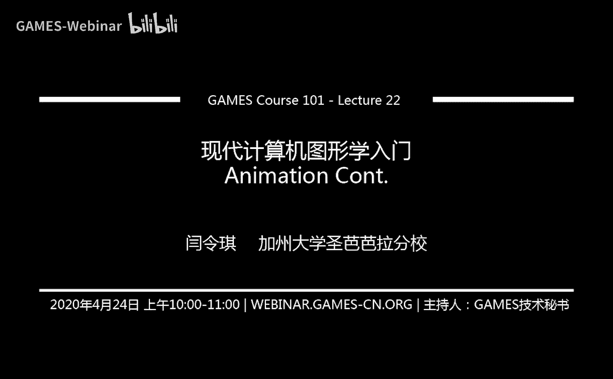
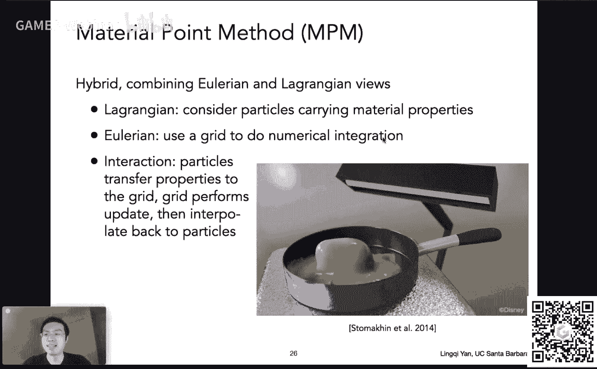
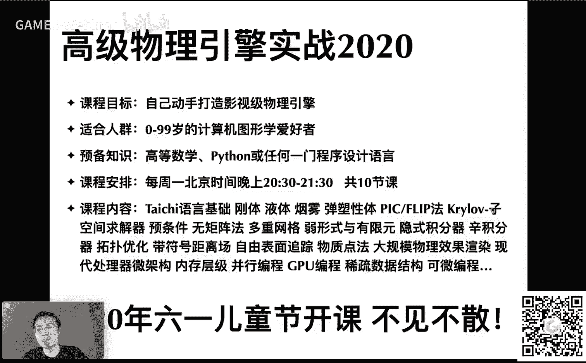
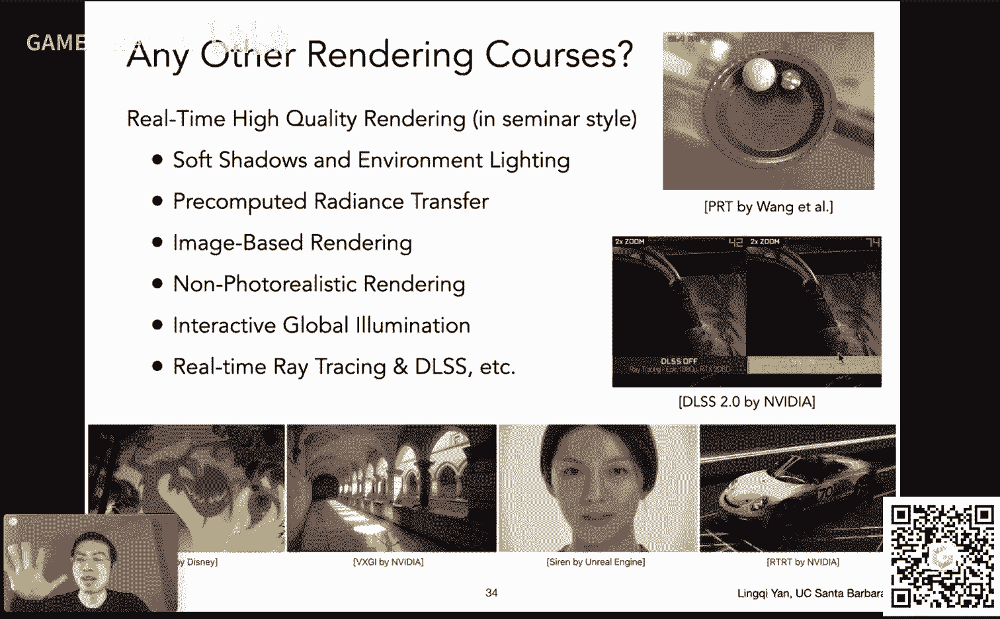
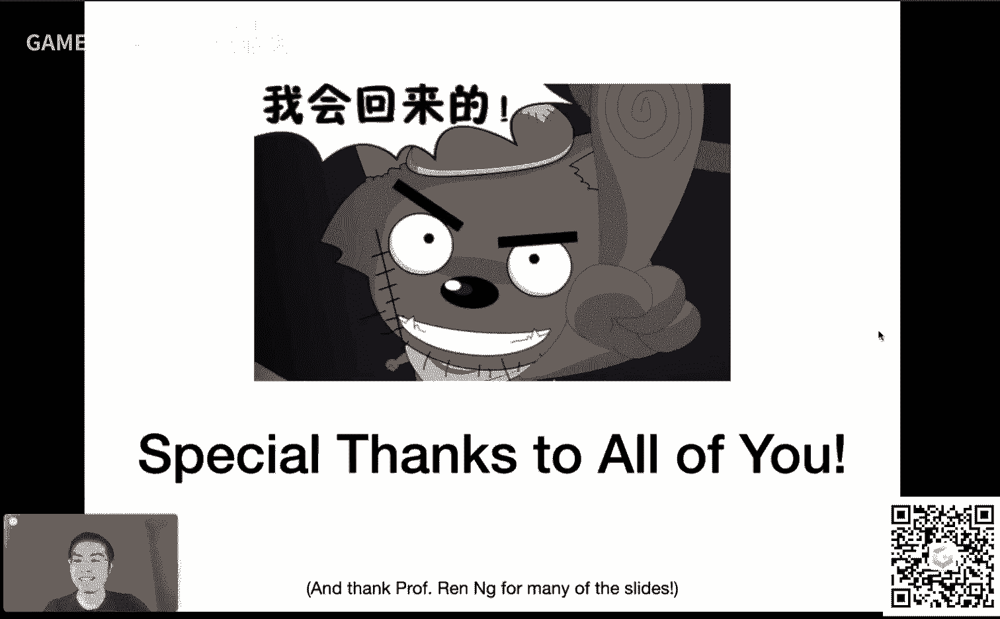

# GAMES101-现代计算机图形学入门-第22讲：动画（续）🎬

在本节课中，我们将继续学习动画与仿真的核心内容。我们将从上一节介绍的基本概念出发，深入探讨如何通过数值方法具体模拟物体的运动。课程将涵盖欧拉方法、提高稳定性的改进方法、刚体模拟以及流体模拟的基础知识。

---

## 课程安排与公告 📢

上一节我们介绍了动画仿真的基本概念，本节中我们来看看具体的实现方法。在开始之前，先说明几项课程相关事宜。

以下是关于课程作业与证书的安排：

*   大作业截止日期已延长一周。若需更多时间，可在论坛反馈。
*   作业七目前提交数量较少，建议同学们多花时间完成。之后会重新开启补交通道。
*   课程结束后，将为完成所有作业并合格的同学提供带有签名的电子版证书。
*   领取证书需提交个人信息，届时会建立一个名为“Certification Request”的虚拟作业供大家提交。

---

## 从概念到方法：求解运动轨迹 🧮

我们已知物体的速度定义为其位置对时间的导数，即 **`v(t) = dx(t)/dt`**。若已知初始位置 **`x(t0)`** 和一个定义了任意位置与时间对应速度的**速度场**，我们的目标是求解未来任意时刻 **`t`** 物体的位置 **`x(t)`**。

这引出了一个**一阶常微分方程（ODE）**：**`dx/dt = v(x, t)`**。我们需要在已知初始条件 **`x(t0) = x0`** 下求解此方程。

数值解法的核心思想是对时间进行离散化。我们设定一个时间**步长 Δt**，从初始时刻开始，逐步计算 **`t + Δt`**, **`t + 2Δt`** ... 等时刻的位置。

---

## 欧拉方法及其问题 ⚠️

最直观的数值方法是**（前向/显式）欧拉方法**。它使用上一时刻的量来估计下一时刻的量。

其更新公式为：
**`v(t + Δt) = v(t) + a(t) * Δt`**
**`x(t + Δt) = x(t) + v(t) * Δt`**

然而，欧拉方法存在两个主要问题：

1.  **误差**：步长 Δt 越大，单步误差越大，累积误差也越大。减小步长可以降低误差。
2.  **不稳定性**：对于某些系统（如守恒力场），无论步长多小，欧拉方法模拟的结果都会逐渐偏离真实轨迹，甚至无限发散，导致模拟崩溃。这在图形学中是需要解决的核心问题。

---

## 改进的数值方法 🔧

为了解决不稳定性等问题，人们提出了多种改进方法。

### 中点法

中点法的核心思想是：先用欧拉方法走半步，用半步终点的速度来修正整个步长的前进方向。

步骤如下：
1.  计算初始位置 `x(t)` 用欧拉方法走半步到达的位置 `a`。
2.  计算 `x(t)` 和 `a` 的**中点** `b`，并获取 `b` 点处的速度。
3.  用 `b` 点的速度，从初始位置 `x(t)` 出发，应用欧拉方法走一个完整的步长 Δt，得到最终位置 `x(t + Δt)`。

这种方法相当于用二次模型来近似局部运动，比线性近似的欧拉方法更精确。

### 自适应步长法

该方法动态调整步长以保证精度。其思路是：
1.  用步长 Δt 做一次欧拉积分，得到位置 `X1`。
2.  将步长减半为 Δt/2，连续做两次欧拉积分，得到位置 `X2`。
3.  比较 `X1` 和 `X2` 的差异。若差异很大，说明当前步长 Δt 过大，需要进一步减小；若差异很小，则认为当前步长足够精确。

### 隐式欧拉方法

隐式（后向）欧拉方法使用**下一时刻**的导数来更新当前状态。

其更新公式为：
**`v(t + Δt) = v(t) + a(t + Δt) * Δt`**
**`x(t + Δt) = x(t) + v(t + Δt) * Δt`**

由于等式两边都包含未知的下一时刻量 `(t + Δt)`，这形成了一个需要求解的方程组（例如用牛顿迭代法），计算比显式方法更复杂。但其优点是具有更好的数值稳定性。

### 龙格-库塔方法

这是一族高精度的ODE求解方法，其中最常用的是**四阶龙格-库塔法（RK4）**。它通过计算多个中间点的导数并进行加权平均，来获得更高阶的近似精度。RK4是四阶方法，意味着其全局误差与 **`O(Δt^4)`** 成正比，精度远高于一阶的欧拉方法。

---

## 非物理方法：基于位置的动力学 🎯

在图形学中，有时我们更关注视觉效果而非物理绝对正确。**基于位置的动力学（PBD）** 方法通过直接调整顶点的位置来满足约束条件（如弹簧保持原长），而非求解物理方程。

例如在绳子模拟中，**Verlet积分** 就是一种简单的PBD方法。它先让顶点自由运动，再将其拉回以满足弹簧长度约束。这种方法实现简单、速度快，但通常不严格遵循物理规律（如能量守恒），模拟中可能会有明显的能量损耗。

---

## 刚体模拟 🤖

刚体是指形状不会发生变化的物体。其运动可以分解为**质心的平动**和**绕质心的转动**。

因此，描述一个刚体的状态需要四个量：
*   位置 **`x`** 和朝向（角度） **`θ`**
*   线速度 **`v`** 和角速度 **`ω`**

它们满足以下关系：
**`dx/dt = v`**
**`dθ/dt = ω`**
**`dv/dt = a`** (加速度，由受力决定)
**`dω/dt = α`** (角加速度，由力矩决定)

这样，刚体的模拟就转化为对一个具有更多状态变量的“粒子”进行ODE求解，可以使用之前讨论的任何数值方法。

---

## 流体模拟入门 💧

流体模拟的一个常见思路是**拉格朗日视角（质点法）**，即将流体视为大量微小粒子的集合。每个粒子携带质量、速度等属性，通过模拟所有粒子的运动来表现流体。

一个典型的非物理方法是假设流体**不可压缩**，即密度恒定。模拟步骤为：

1.  根据粒子当前位置，计算空间各处的密度。
2.  若某处密度与目标密度（静水密度）不同，则计算密度场关于每个粒子位置的梯度。
3.  沿着梯度下降的方向，调整每个粒子的位置，使该处密度回归目标值。
4.  重复此过程，粒子位置的变化即表现为流体的运动。

这种方法本质上是使用梯度下降来优化位置以满足约束，属于基于位置的方法。

---

## 模拟的两种视角：拉格朗日 vs 欧拉 🔄

大规模物质模拟主要有两种思路：

*   **拉格朗日法（质点法）**：追踪每个物质点的运动。如上述的粒子流体。
*   **欧拉法（网格法）**：将空间划分为固定网格，关注每个网格单元内物质属性的变化（如密度、速度），而非追踪具体粒子。

近年来，**物质点法（MPM）** 等混合方法结合了两者优点：粒子携带材质属性，在欧拉网格上进行物理计算，再将结果写回粒子。

---

## 课程总结与展望 🎉

本节课中，我们一起学习了动画与仿真后半部分的核心内容。

我们首先探讨了如何通过数值方法（如欧拉法）求解运动微分方程，并分析了其误差和不稳定性问题。接着，我们介绍了一系列改进方法，包括中点法、自适应步长、隐式欧拉以及高精度的龙格-库塔方法。此外，我们还了解了基于位置的非物理模拟方法、刚体模拟的基本原理，以及以质点法为基础的流体模拟入门知识。最后，我们区分了拉格朗日和欧拉这两种基本的模拟视角。

至此，GAMES101《现代计算机图形学入门》的全部22讲课程已圆满结束。我们从光栅化、几何、光线传播到动画仿真，系统地学习了现代图形学的基础知识与核心概念。希望大家能以此为契机，继续在图形学的广阔领域中探索前行。

---
*感谢大家一路以来的支持！课程虽已结束，但学习与探索永不停止。祝大家在图形学的道路上一切顺利！*