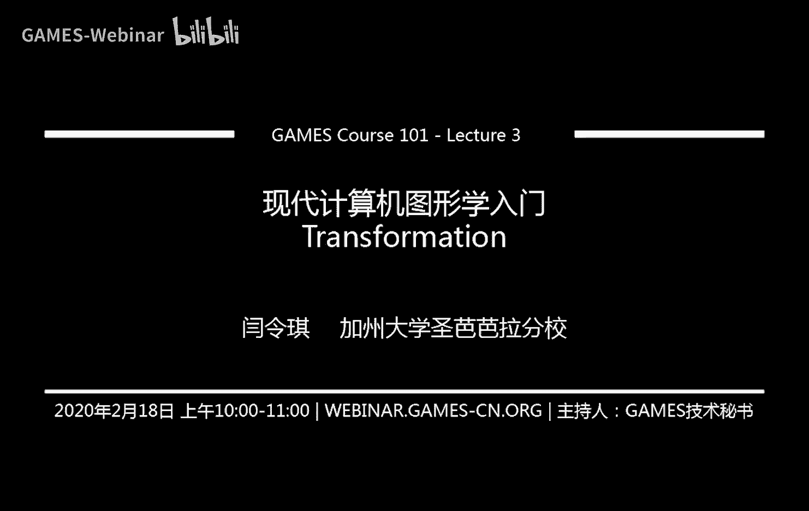
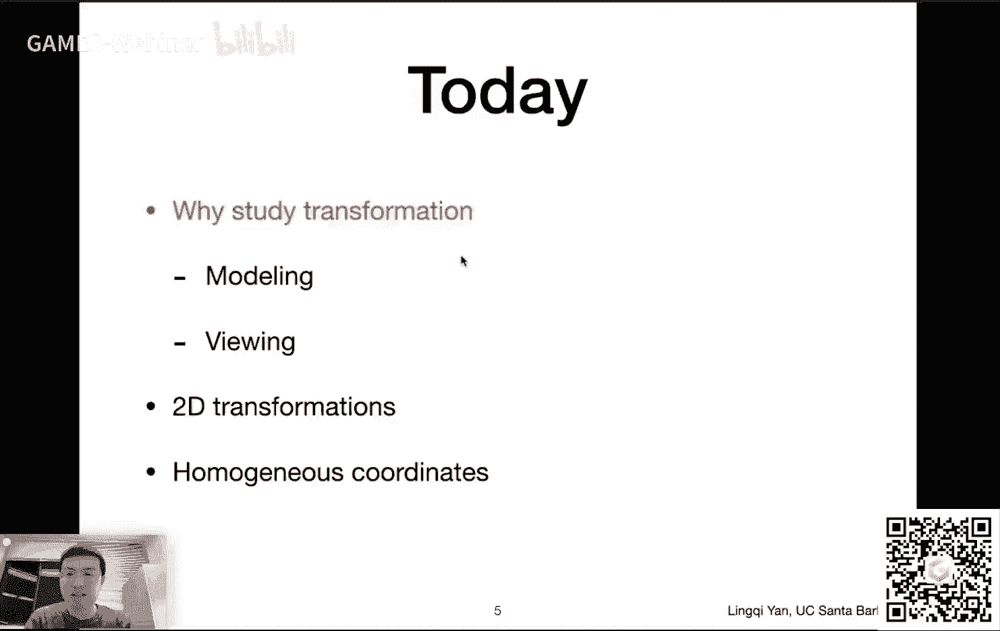
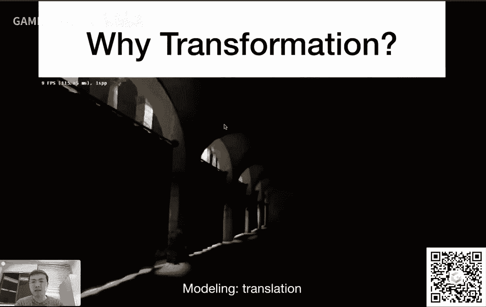
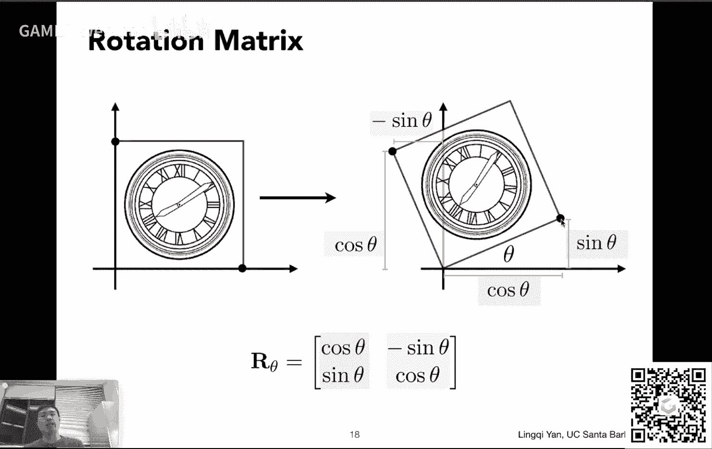
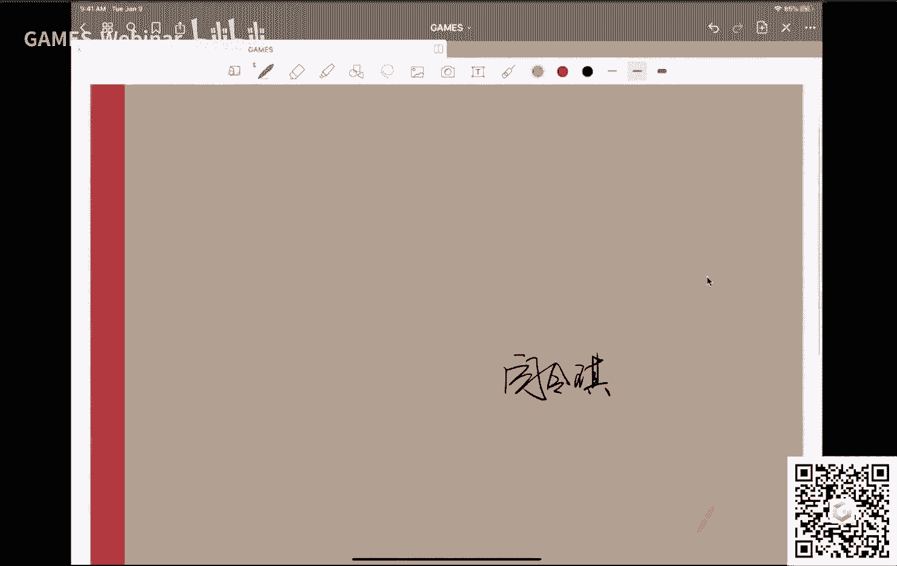
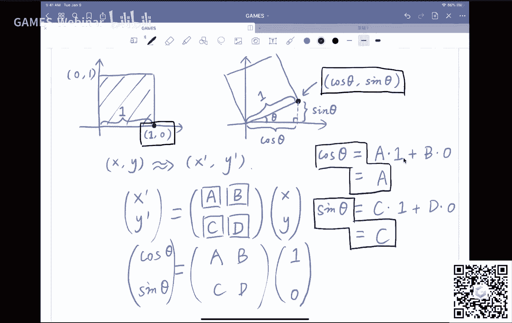
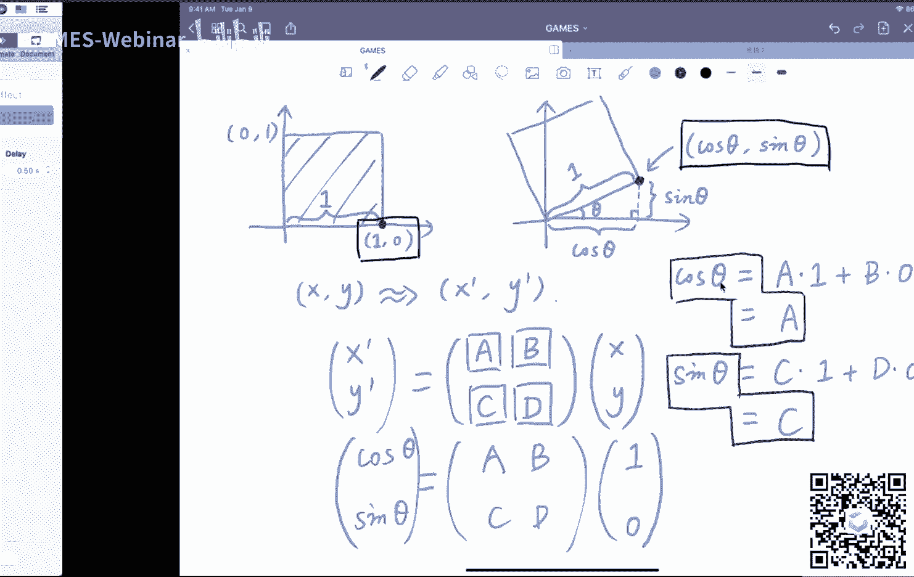
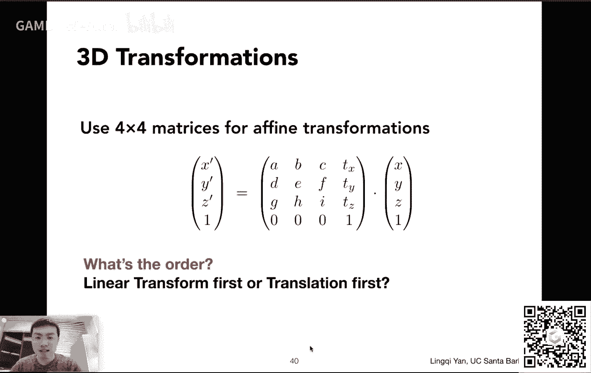
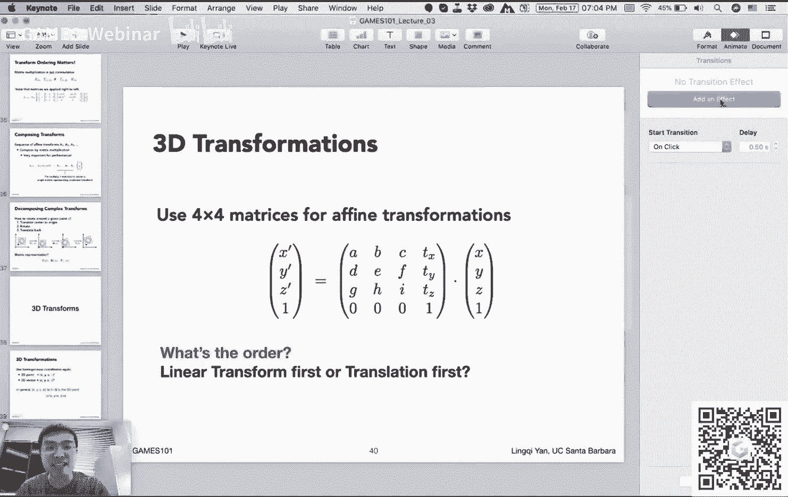

# GAMES101-现代计算机图形学入门-闫令琪 - P3：Lecture 03 Transformation - GAMES-Webinar - BV1X7411F744

感谢大家一如既往的支持，咱们今天是这个games 101这个现代计算机图形学的第三节课，然后咱们从这节课开始要花个几节课的时间呢，给大家讲变换，那么咱咱们这个立刻就开始，然后这节课的最开始呢。

首先给大家说两个事情，一个是作业零，作业零很快就要放出来了，然后我们这个和这个这个助教们这这段时间这个好好讨论一下，看什么时候把它给这个做好，然后给大家很快啊很快。

然后这个啊因为有一些同学反映说怎么注册这个作业，提交系统不能不能注册，那是因为你用，了qq邮邮箱啊，然后我们这个系统它自动过滤这个qq邮箱不允许用，所以说注册的时候大家可以用一些别的什么其他的邮箱。

好吧啊，就是这么两个事情，那咱们这个今天的正式课程，然后大家普遍反映啊，上节课的内容相对简单啊，没问题，上节课确实简单啊，这个我们提到了一个向量向量的这个定义，基本操作加成特别提到乘呢有两种。

一种叫做点乘，然后点成呃，在很多情况下被用来做这个嗯，判断前和后，根据它编程出来的结果是正是负来决定对，吧，然后我们又讨论了另外一个叫做插成cross product。

然后呢这个这个插成呢两个向量的叉乘得出来的或者叫叉g啊，得出来的是一个新的向量，然后这个向量根据它的朝向，我们可以判断两个向量的相对左右关系，那么上节课我们主要说的就是这个内容。

然后我们提到了一点点关于这个呃矩阵的一些这个这个计算，以及这些呃向量和矩阵在图形学中的应用好那这就是上节课的内容，咱们为什么要这个花时间说这些呢，是因为这一系列都是这个之后要提的变换的基础。

那么这一次我，们就主要来说变化，然后今天大家可以看到我们要着重说下面几个内容，首先提到说我们为什么要变换，也就是说这个变换到底它是在干什么对吧，然后这个我们会提到几种这个呃比较常见的二维空间中的变换。

特别是旋转缩放以及切片，然后我们会给大家介绍这个嗯，其次坐标的概念，以及说我们为什么要用它，然后最后我们会提到说怎么把各种各样不同的变换给组合在一块，形成新的变化，如果有时间。

咱们今天开始说一些这个三维的变换，然后给之后的课留一点这个这个这，个充足的时间，但是够呛啊，咱们尽量那么嗯今天咱们就先从第一个话题开始说，首先大家可以看到变换，这里呢我提到两两个这个呃不同类型的变换。

一个叫做model，一个叫做viewing，咱们暂且把它的一个叫做这个模型变换，一个叫做视图变换。

然后这个是什么意思呢，大家可以看到啊，就是说这个呃动画咱们在上一节这个啊课里面已经提到过了，大家可能看到这个这个动画，然后这个动画主要在说明什么呢，这是一个静态场景，没问题，但是呢摄像机在移动，而且他。

在以一个这个这个平滑的一个曲线这样一种移动方式。

沿着这么一个曲线移动，然后大家可以看到一个平滑的过渡的动画，所以说这个首先呢这个描述这个这个这个这个摄像机的运动啊，这里当然是变换了一个非常重大的应用，然后这里大家会看到一个另外一个例子哈。

然后这是一个跳舞的机器人，然后大家可以看到这个机器人呢他这个各处关节都是可以移动的，然后它这个可以形成一个呃这个某一种舞蹈对吧，大家可以看到这个，头现在也可以移动，然后各处关节也可以移动。

然后这里多给大家介绍一点关于这块这块涉及到这个计算机动画之后，要给大家介绍的这块知识，就是说还有一种运动啊，比如说你拿着这个机器人的手，然后往空中这个某一个地方这么一放。

然后你问那么在这个如果这个手的这个指尖停在这个地方，那么它的这个关节应该怎么样去弯曲，才能使得他这个手被移动到这里来，这里就是之后要给大家介绍的逆运动学方向的知识啊。

然后就是说这里呢当然就是给大家举一个例子啊，就，是说变换啊，同样可以表示各种各样复杂的旋转，以及他们之间这个互相错综复杂的这个呃联系在一起之后，形成了这种复杂的变换。

然后呢这一个例子大家应该都见过对吧，看过皮克斯的动画，大家都知道这个这个皮，这个皮克萨他们这个做的一个这个这个经典的开场就是一个台灯，然后这跳来跳去，然后跳在这个i这个字母上面。

然后大家着重可以看一下啊，这个这个癌，然后这个会被这个压扁对吧，然后压扁过程中变胖，然后最终完全被压扁，然后也就是，说变化还可以表示各种各样的这种这种这个呃缩放，这样111系列的呃动画。

就是说啊很多动画都是由各种各样不同的变化，然后合成在一块儿的，那么不只是动画，要给大家介绍的这个这个如何成像，就是说光栅化成像这么一套方法里面也是大量涉及到变换，特别是这里大家可以先看左边这个例子啊。

左边这是什么呢，是一个人坐在一个屋子里面，然后他在看这个一个窗户外面，我确切说是往窗户这个方向看，然后呢会看到一部分这个，然后他会看到什么呢，他在这个三维空间中往这个方向看。

它会看到右边这样一个二维的这个图呃，也就是说如果我在在人这个人眼这个地方放一个照相机，往这个他看的方向这么一摆，然后这个拍一张这个这个照片出来，然后它就会变成这个二维的平面上的东西。

那么大家想这个中间啊发生了什么事情对吧，原本这个世界是三维的，然后你拍了一张图之后呢，把它给变成二维的，因为存在平面上了，嘛对吧，然后这个从三维到二维，我们管它叫做投影。

然后这个投影也是一种非常非常重要的变化，这就是之后要给大家这个介绍的，然后这么几节课呢给大家讲变化，正是为了做这样一步，从三维世界到二维平面这么一个投影变换，这么一个铺垫好吧。

那这就是这个这几节课的逻辑，那么大家看到啊，这个变换不仅在动画或者成像，在这个各方面都得到广泛的应用，那咱们这个可以继续，那么呃我们从什么开始呢，我们先说一说这个二维的变换，那，么二维的变换。

这个最主要的就是说我们要把这个矩阵和变换联系起来，那这个咱们这就开始好吧，比如说啊这个呃首先我们提到一个缩放变换，什么叫缩放变换呢，大家来看这两个例子啊，从左边这张图。

然后假如说我看到的是一个这个方块的这个这这这张图啊，它的左下角放在这个世界这个的这个原点，也就是零零这么一个二维的平面的原点，然后呢我们要把这张图做一个缩放，我们要把它给变小对吧，这个大家这个很常见。

大家在这个adobe photoshop里面经常会做到这种这个图像的缩，放啊或者什么这些缩放就是一种变换，没有问题，那么对于这个例子来说，就是说啊横轴和纵轴都缩放了0。5，也就是都变为原来的1/2。

那么这个写成数学形式是什么呢，就是说啊如果我们认为一开始任何一个点的坐标是x y，然后呢经过这么一个呃呃缩放操作之后，它就变成了一个x撇和y撇，然后这个应该念作x prime和y prime啊。

然后呃如果我们把它写成数学形式，那就是x prime是x乘以x，那y也是同样操作，那么在这里s呢大家可以看到就是0。5，那么我们之前学过这，个矩阵了，对不对，那么对于这两个式子。

咱们可以把它写成一个矩阵形式呃，那就写成这么一个矩阵的形式，大家可以看到啊，是一个这个一个对角阵，这个s00 s然后乘以x y，那乘以出来的结果呢就是x prime和y prime，那那是不是这样呢。

咱们可以验证一下，比如说大家可以看到这里矩阵这个大小是多少啊，这个矩阵大小是2x2对吧，xy呢是大小是2x1，那得出来的结果就是2x1没有问题，所以说x y变成x prime和y prime。

然后那咱们看看比如说x prime等于什么呢，那咱们会发现它是，二乘以矩阵的第一行，第一列，还记得咱们上节课给大家介绍的，对不对，就是说取这个第一个矩阵的第一行，然后再取第二个矩阵的第一列。

也就是s0 啊，点成xy，那么得到的结果就是s x呃，那就发现x prime就是s x，那是对的，没有问题，y同样也可以这么验证，那就是说我们可以把刚才两个式子给写成这么一个矩阵形式。

那么这里我们就管这个对角阵s00 s叫做这个呃缩放矩阵，在这里，如果你让i s等于0。5，那么它这个就对应着这么一个，把这张图和横轴和纵轴都各缩小一，半这么一个变化。

那么这是这个这个缩放的矩阵比较简单啊，然后呢大家可以想到，假如说呢这个x和y方向它这个缩放的各不相同，比如说大家看到这个例子，这里呢x方向缩放的这个是一个按照0。5的比例缩放的。

然后y轴呢这个y坐标根本没有变化对吧，就比如说咱们可以看到这个在左上角，这个这个这个角大家应该可以看到我鼠标鼠标对吧，然后这个角现在仍然对应这个角，那么右上角仍然对应右上角，你会发现他们的纵坐标没有。

变哈x的坐标也就是横坐标缩小了0。5，不过没有关系，我们仍然可以写成这么一个这个对角阵形式，只要让这个s x和xy不相同就可以了，那么这里s x应该对应0。5，这里x y应该对应一，就是应该是这样的好。

那么呃这里是关于这个缩放也很简单，然后呢咱们提到另外一种啊，其实上节课给大家提到过这个事情，对不对，这里给大家做一个反射的操作，什么是反射呢，这个或者说对称的操作啊，就是说大，家看到左边这张图。

它其实这张图相对于y轴，如果经过一个反转，就可以得到这个呃这个右边这张图，那么相对于y轴做一个反转，那么表示成数学形式是什么呢，那就是说原本给你一个x对吧，然后反映在新的图上，它会变成负x。

也就是它告诉你新的坐标x prime应该等于负x对吧，那么y坐标同样没有变，对于任何一个点，咱们看这个呃，右上角对吧，右上角现在这个经过翻转之后变成了左上角，但是它们的高度都是一样的。

所以y轴一直没有变，所以y prime还是等于y，那么大家也可以，自己试一试，把这个给写出来，这个矩阵形式写出矩阵形式应该是什么样子呢，应该是这样的，就是说如果我让一个图啊。

这个相对于y轴进行一个镜像操作，那也就是说把x反过来，那就应该是变成这么一个矩阵呃，这个-1001，也就是它只影响x不影响y，那么这个矩阵和这个左边的这两个等式的写法，是应该是完全完完全全一样的。

咱们把它写成矩阵，大家之后可以看到这是一个很方便的写这个表示方法好吧，那咱们可以继续，那么这里给大家提到一个稍微困难一点的这个，这个变换啊，这个变换叫做切变，也叫sheer啊，什么叫切变呢。

就好像说你拿到的这个图啊，它本身带有这个弹性，然后就是说你可以这个拽着它上面这条边，对于咱们这个例子来说啊，拽着上面这条边向右向右这么大，然后你就会发现这张这张图被你给拉这个歪了对吧。

然后就会形成这个右边这么一个一个这个呃结果，那么这个结果我们仍然可以通过这个矩阵呃，或者说我们通过分析啊，这个前后经过变换前后它们的坐标之间的关系，咱们可以写出这么一个x和x prime之间的关系。

以及，y和y prime，那么这里这里怎么样去理解呢，大家可以先看左下角的这个这几个提示哈，这也就是我们能够观察到的一些这个这个现象，首先咱们可以看最后一点这个这个vertical shift。

也就是说竖直方向上，大家发现这个切片啊，我们是沿着水平方向去拽的对吧，其实对于任何一个点来说，它的纵坐标没有发生任何变化，比如说呢咱们看这个左上角这个点，这个点原本在这里，然后现在移动了之后呢。

出现在了这里，然后大家会发现啊，他只是这个水平方向坐标发生了变化，诶它这个y坐标也就，是竖直方向坐标并没有变，那对于其他任何点都是如此，比如说这个啊这个表盘的中心啊，这个经过了这个切片之后。

它会发生一定的移动，但仍然是水平方向发生移动，这个数值方向它并没有发生任何变化，所以有一个有一个式子已经可以明确的写出来了，是什么呢，就是y prime一定就等于y，因为y方向根本没有任何操作诶。

那这一点之后我们就已经确定了一半一半的关系了，对不对，那咱们现在就只需要研究这个水平方向上，它到底发生了些什么，那么水平水平方向发生什么呢，咱，们可以看另外两个提示，也就是观测到的结果。

就是如果我这个y等于零，什么是y等于零呢，就是说我们盯着这底下这条边来看，我们发现底下这条边啊，最底下这条边完全没有发生任何变化，这仍然是底下这条边，说明任何一个点，只要它在最底下这条边。

它的水平方向的移动都是零对吧，那我们再看顶上这条边，如果我们看顶上这条边，我们会发现啊，呃比如说左上角这个点，它现在出现在哪儿呢，它现在出现在这个位置上，那这个位置它的水平方向呃，它的水平坐标是多少呢。

原本是，零对吧，它左左上角，然后现在变成了a那么原本这个假如说是一，那他这个就应该是右上角这个水平的坐标，假如说是一，那么经过切片之后呢，就是变成这个位置，这个位置对应的应该是一加上a然后我就发现啊。

这个在最上面这个呃这条边上面任何一个点的移动嗯，它移动了多少呢，它都移动了a这么一个距离，我是说水平方向上都移动了a这么一个距离，那么咱们总结一下，在底下这条边所有点的水平方向移动都是零。

那么在上面这条边所有点的水平方向移动都是a然后咱，们可以看一下中间这个位置，那中间这个位置比如说在y等于0。5的时候，那么水平方向的移动是二分之a它原本在这里，现在移动到这里。

那也就是说水平方向到底移动了多少呢，应该移动了a乘以y没有问题吧，那咱们如果写出来，那就应该是这么一种形式，也就是说任何的x水平方向的移动都是a乘以y没有问题吧。

然后这样的话就等于是x prime是什么呢，x prime就是原本的x加上a y，那x加上a y写成矩阵形式，就是这个ea乘以x y，那这就是这一行，那咱们刚才说过这个，y方向上这个坐标一直没有变。

所以y prime一定就等于y，所以咱们可以把它简单写成这么一个矩阵形式诶，那咱们就可以看到这个这个呃这个矩阵啊，就是这个切片这么一个矩阵啊，他写作这个1a01 是指水平方向的这样一个切片好吧。

这就稍微困难一点，但是大家从这个中间可以看到一个规律，就是说我们要想写出一个变换很简单，我们就要找一个对应，找一个这个变化之前的这个xy和变化之后的x prime y prime，这两者之间的关系对吧。

只要找到了这么一个关系，那么自然而然就，可以写出这个变化来，那么那咱们可以继续啊，那么这里给大家说一个这个更复杂一点的这个变换了，这个变化当然是非常非常常见的，大家在这个图像的编辑里面。

或者说在这个各种各样的这个这个游戏啊，或者干什么都会涉及到各种各样的这个旋转这么一个变换，然后旋转呢这里咱们首先先说这是二维的旋转，在这个平面内的旋转，然后咱们规定两个事情，第一任何时候我们说旋转。

只要我们不说别的这个这个信息，我们就认为它是绕着原点，也就是零零进行旋转，也就是说相，当于啊你这个你把这个圆点这个点零零这个点定死，其他的呢就绕着它转，就是这个意思。

ok然后这个另外如果咱们不说旋转方向，那就是说我们默认是逆时针方向，逆时针方向啊，也就是说这里如果我说我们把左边这张图旋转45度，那就应该是说左边这张图呃，以这个原点为中心，逆时针方向旋转45度好吧。

然后咱们管它写作r45 ，然后大家可以猜测这个旋转之后是长什么样对吧，应该长成右边这个这个这个样子，那么旋转那当然是也是对应一种变换对吧，那么旋转，的公式，咱们应该如何把它写出来呢。

或者说旋转的矩阵咱们如何把它给表述出来呢对吧，那么大家可以看这么一个例子，这个这就是大家应该看到的旋转矩阵的这个这个结果是什么啊，那么大家肯定关心这个旋转矩阵咱们是如何得到的呢，对吧。

那这个时候我给大家做一个简单的推导，但是这个推导之前啊，先这个呃给大家回忆一下，我们刚才已经说了对吧，不管再复杂的这这么一个变换操作，最重要的是什么呢，最重要的是找到一个一一对应关系。

找到这个前后这个啊坐标之间，的关系，也就是说xy原本说xy，比如说这个点，然后旋转之后变成x prime prime，它应该变成了什么新的一个什么样的点对吧，把这个关系找到就可以了。

那么我们现在这个看一眼啊，这个是头一次在这个课上给大家首推公式啊，好。

ok那咱们看一下这个旋转，好这假设是这个输入的这幅图已经画好了，然后呢咱们要把它旋转某一个角度，咱们假设它是c塔角度好吗，ok那我们可以看到偶三维的时候就不再首推了哈，然后我们可以看到原本说啊。

比如说x y这个它会被旋转到x prime y prime，那么我们要的其实就是这么一个关系，就是说x prime y prime它是等于什么样的一个矩阵，乘上x和y对吧。

那也就是说我们需要知道这四个数都是什么，如何得到这四个数呢，那么这里就有一个这个简单的技巧，首先呢就是说我们这个旋转上面啊，所有的点任意给你一个xy，肯定都得符合这么一个旋转公式。

那么既然任意一个点都要符合这个旋转公式，那么对一些特殊的点肯定也要符合对吧，那呃什么特殊的点呢，在这里我给大家一个例子，比如说咱们看这个点一零这么一个点啊，就是这个点，然后咱们画一个红色吧。

o然后它旋转了之后会旋转到这个点上去，并且呢我们知道旋转的角度是c塔角度好吧，那么我们知道这个旋转呢，他肯定不会改变这个物体本身的大小对吧，那我知道这条边的边长，这条边的边长是一，那么旋转了之后。

它的边长肯定也还得是一，那么我们知道这个三角函数告诉我们了，那如果我有一个直角三角形在这里，我知道它的斜边是一，并且它的有一个锐角是c塔，那么我们就应该知道它对应的另外这两边两个直角边都是什么。

这两个直角边是什么呢，一个是cos in c的，一个是sc的好，然后这样一来呢，我们就知道了一个信息，什么信息啊，那就是说原本的这个一零这么个点被旋转成了cos，theta和sin thet，诶。

那么我们找到了一个什么对应关系呢，这里一零cos sin，那咱们现在假如说啊可以做这么一个操作，我们这四个数，这个矩阵的四个数咱们都不知道对吧，不过没关系，我们把它写成a b c d。

那么我想知道这个如果，如果我的输入，是一和零的话啊，x y是一和零，那么经过这个a b c d这么一个变换之后，它会变成cos theta和sin thet，那也就是说什么呢，把这个矩阵展开。

我们就可以看到cos c塔等于a乘以一，加上b乘以零，也就是a然后呢我们如果看sin thetsin the，它等于什么呢，我们找第二行和第一列，也就是说c乘以一加上d乘以零，也就等于c。

我们发现什么了呢，我们就会发现哦，原来cos c的等于a，也就是a等于二糟糕，也就是a等于cos c的，然后呢这里，c等于cc，所以就等于说啊我们用这么一个特殊的一个点，一和零这么一个点。

我们考虑一个简单的三角函数，我们就立刻可以得到a和c等于多少，那么同样道理对不对，我们只需要再考虑另外一个特殊的点。

然后我们就应该可以把b和d算出来，而且其实我相信大家应该已经可以猜到。

我们会用另外一个什么样的点，来把这个后面这个这个第二列给算出来对吧，大家可以看到我们可以用这个零一，也就是说左上角这个点这个点向左旋转一，同样是一个theta，然后它会旋转成什么呢。

它会旋转旋转成负sin theta和cos theta，然后这样的话我们就可以把这个第二列也可以算出来，那么大家看到一个什么事情啊，就是说我们通过简单的这两个特殊的点。

我们就可以把一个完整的旋转公式给推出来，我们并不需要考虑一个一般性的结果，因为刚才逻辑就是这样的，既然任何一个点都得满足这个旋转公式，那么对于这两个特殊的点肯定也得满足。

所以我们只需要把这四个数给弄出来就可以了对吧，所以说那关于这个第二列的推导，我就不再多说，那这个第一列这个咱们咱们这个已经说明白，那思路就是这样的，那呃到此为止，咱们就可以得到一个旋转的矩阵。

那么这个旋转的矩阵呢完全没有任何必要去记忆对吧，如果你实在忘了，你就照这个方法推导一下就可以了，对吧好，那么这里就是这么一个这个旋转的这个矩阵，然后嗯这里呢呃大家会发现啊，有一个什么共同点。

咱们讲了这么几个这个呃运算了，或者说这个叫什么变换变换啊，都可以写成什么形式呢，都可以写成这么一个x prime是a和b的某一种组合，或者说我们叫线性组合，就是a x加b y，然后y等于c x加b y。

然后写成矩阵形式，大家会发现啊，这个就是我们刚才要推的这个这个这个矩阵，然后a b c d对于对于这个呃缩放，如果大家还记得，那就是对角阵就是a和d是有直的，然后b和c是零，然后旋转的话。

四个都有跟c它有关，然后对于切片也是一样的，那么都可以写成这么一种形式，然后如果呃我们可以把这个呃变换写成这么一种形式，也就是说用一个这个呃矩阵去乘以你这个呃输入的这个坐标，可以得到输出的这么一个坐标。

那我们就认为这种变换我们管它这个起个名字啊，叫做线性变换好吧，那也就是说这个这就是这就是我们这个这个介绍的一个概念啊，我们刚才提到这几种，这几种变换都是线性变换好吧，那么写成矩阵的形式。

大家可以看到x prime就等于一个呃矩阵乘以一个这个原本的一个坐标，x好吧，然后这就是就是这么一个这这个这个这个简单的这么一个矩阵乘法，这就是说啊我们这这里就把这个联系建立起来了，对于一个变化。

我们就用一个矩阵来表示，然后呢大家看到这里我提到一点，这个我们要用一个相同维度的矩阵来乘以这个向量，这是为什么呢，难道说这个不相同维度的这个矩阵，我就呃也也也可以乘上某一个这个这个输入的变量吗。

比如说这个变量是二维中间的一个点，那肯定是两个数，那如果我用一个3x3的矩阵，肯定没有办法乘它对吧，那我为什么要特地提到这么一个事情呢，这就是为了区分后面的一个概念，那咱们为了理解这个事情。

咱们这个继续这个进展一块重要的一个一个概念给大家介绍一下，叫做齐次坐标好吧，然后为什么要这个提到齐次坐标，最重要的事情就是说，首先我们要理解我，我我我们为什么一定要引入这么一个复杂的东西对吧。

然后再去理解说，我们为什么要这个这个这个这个呃需要需要用到它对吧，然后呃以及后续的这些操作要怎么样去操作，如何去定义，那么从一开始来说，我们为什么要用齐次坐标这个概念呢，那正是因为有一种变换。

它非常特殊，什么变换，平移变换呃，平移变换这个这个这个有什么特殊的，大家看这个例子对吧，大家看这个例子，这个什么呢，左边有一幅图，然后他经过了一个平移，很简单，x方向平移了一个tx。

然后y方向平移了一个t y，就这么简单，就是简单的移动一下它们的坐标，然后大家肯定会觉得这个太简单了，那咱们直接就可以写出来它们的对应关系对吧，原本的一个x会变成什么呢。

x加tx原本的y会变成我这个y加t y啊，正是如此，大家可以简单的把它给这个这个这个写出来对吧，然后这个写出来之后啊，大家会发现是挺简单的，但是好像有一个问题，好像有一个问题对吧。

就是说你你还能不能把这么两个式子写成他们刚才写的这个矩阵形式，就是说x prime呃，呃y prime这个这个向量是不是还能写成等于某一个矩阵，a b c d乘以x和y，这回大家发现不能不能吧对吧。

这个这个这个怎么回事呢，是因为大家只能把它写成这么一个形式，大家可以发现什么形式呢，大家看到这里呢，大家熟悉的这个形式，咱们刚才说的这么几种变换啊，是这样的，就是a b c d乘以x y唉。

这里又加上了一个tx和t唉，为什么我们一定要这个加上一个txt，因为我们可以看到前面这个矩阵a b c d乘以x y，无论如何，他得到的形式肯定都是a x加b y。

或者说多少多少x加多少多少y这么一个形式的组合，然后我们再回到刚才的平移的这个这个呃情况来考虑哈，我们是x加上了某个常数，外加上了某个常数，也就是说这个矩阵并不能表示这么一种操作，所以无奈之下怎么办呢。

咱们这个先用这个矩阵乘以这么一个xy，再加上一个这么一个向量tx t y，然后咱们来这个这个描述这么一个这个超级简单的变化，对不对，平移变换，那么平移变换呃，如果只有平移的话。

大家可以知道这个a abcd，那就应该是这个这个这个这个单位矩阵，也就是说它是这个1001乘以x y乘了之后没有任何作用啊，就是xy，然后再分别加上tx t y。

那么这个x prime y prime就对了对吧，也就是说通过这么一种形式，我才可以去表示这么一种平移的操作，这个就就发现这个有点反人类啊，对不对，然后这个这个同时也反映了一个问题。

就是说啊这个平移操作并不属于咱们刚才定义的这么一个线性变换，这么一个一个范畴对吧，因为我们说了，线性变换必须得表示成一个向量，等于一个矩阵乘另外一个向量，那这里不行，它多了一个这个向量。

它后面要加上一个东西，那所以平移就不再是线性变换，而是一个特殊的情况，那虽然它简单，但是也得这么承认，但是我们呢都不希望把这个平移当做一个特殊的情况去考虑，说每次我都带上这么一个尾巴，把它加上去对吧。

人类总是懒的，懒呢是一个一个一个一个一个美德，就是说这个人类有很多进步都是因为这个这个这个懒才造成的，人们很贪婪，人们希望有一个简单粗暴解决方法对吧，那对于这个例子，同样道理。

我们不希望把平移变换当做一个特殊的变换，那么这里大家就会问这么一个问，题，有没有办法能够把所有的这些变化，然后和平移在一块儿，用一个最简单的变化来表示对吧，这就是大家要的东西对吧。

那这个嗯这就是大家这个这个这个思路哈，就是说呃我们在提任何的这个齐次变换，旗子坐标是什么东西，之前咱们先提到这么有这么一个问题好吧，那么人们就沿着这么一个问题往下问好吧，能表示各种各样不同的变化。

那自然是好，那如果能找到自然是好，那那那就是说呃这个这个这个人们经过探索之后，确实发现了一个解决办法，就是引入齐次坐标这么一个概念，但是咱们在讲这个齐次坐标这个概念之前呢，先给大家说一下这个事情啊。

就是在计算机科学或者说各种各样的这个这个不同的这个这个领域吧，都会有这么一个情况，就是说我们永远要考虑的一个事情啊，叫做trade off，什么叫trade off呢。

就意思就是说你为了引入某种这个方便的，什么样的一种一种表示也好啊，比如说这个大家学这个数据结构好吧，大家这个知道呃，各种各样不同的这个这个降低这个时间复杂度的办法，但是都会引入更多的这个空间复杂度。

那如果能够这个两者都能够保证都很低，那就非常好，但更多情况下是一个这个非此即彼的事情，此消彼长的事情对吧，所以这个这个呢呃也有一个定理叫做no free lunch serum对吧，没有免费的午餐。

道理就在这儿，咱们就要注意这么一个事情，就说齐次坐标，那咱们既然已经提到这个概念了，那它自然就是用来解决说这个我不想让这个平移成为一个特例，这么一个1111个目的。

然后我希望用齐次坐标能够把所有的这个呃变换都给统一的表示起来，那自然是好的，那么它不好的地方在哪里，咱们就要关注这些这个呃这些问题好吧，那咱们这里这个就继续往后说。

那么人们在这个这个长期的这个斗争过程中啊，就发现了啊，我们可以这个引入一个新的形式来表示这个物体的坐标，那么我们现在说的是二维的变换，那么人们会发现啊，我可以把这个二维的点或者向量给增加一个维度。

就是大家可以看到在这里啊，就是对于任何的一个二维的点x y呃，我们不再写成x y，我们把它写成x y一这么三个数，然后呢对于任何一个这个向量，对于任何一个向量，然后我们把它写成x y0 。

这个取决于说你这个xy到底目的是为了表示一个点，还是为了表示一个向量，那那这这这是在干什么，大家会发现这个直观上来看，大家就等于是把这个原本的这个这个这个二维的点增加了一个维度，这不这不是浪费吗。

但是大家会发现啊，我把这个呃x y增加了一个一之后，然后他就有了一个非常好的性质，什么性质，咱们看下面这行，这行说的是什么呢，就是说大家看啊xy 1，这就是我的二维的一个点，仍然是xy啊。

仍然是二维的一个点x y啊，然后只不过他写成了这个用三个数来表示x y1 ，那么在他前面乘以的这么一个矩阵做了一个什么事儿，大家可以看到这么一个矩阵，它是基本是对角的。

除了在这个最后一列上有一个tx t y，然后呢，这个你会发现这个矩阵乘以x y一这么一个向量之后会变成什么呢，会变成x加t x y加t y，然后一哎大家发现这个这个如果我单看前面两项。

这不正是我要的平移的变换吗，对吧，我希望把x变成x加tx y加上y y y变成这个y加t y哎，这就是我要的平移操作，并且这个平移操作现在可以写成一个矩阵乘以一个向量的形式了对吧。

也就是说啊我们的这个这个引入齐次坐标最大的目的，这就达到了，就等于说我们用齐次坐标可以这个通过增加一个数这么一个方式呃，然后来把这个平移变换也写成这么一个矩阵乘以向量的形式，那么大家肯定要问了对吧。

这个那其他的这些变化是不是也可以这个写成这么一个形式行，没问题，其他的线性变换也可以，咱们之后会看，但在这之前呢，大家这个肯定会有人会问这么一个问题啊。

这里这个这个为什么我们会把这个点和向量区别对待对吧，我这个点还是二维的点，我后面给增加一个一，然后呢我这还是二维的点，我后面增加了一个零，我就是用来表示向量，我这是干什么对吧，那这里我们要把它搞清楚。

那么这里其实啊大家回忆之前我们讲的一个概念，大家就知道为什么呢，因为我们提到一个向量，所谓向量它表示的是方向性，我们提到说如果你把一个向量从这边移到这边，那它的方向是不变的对吧，它仍然表示同一个向量。

这就这就表示一个什么什么事情呢，咱们正式的来说就是向量具有平移不变性，也就是说不管你对向量进行任何一个形式的这个平移操作好吧，在它上面做任何的平移变换，这个向量永远还得是它原来的这个向量。

它不应该发生变化啊，那也就是说如果有一个向量x y0 同样经过这么一个矩阵，它的变换得到的结果，我仍然希望它是xy 0，绝对不是x加t x y加t y0 ，没错吧。

也就是说我这个呃把这个向量的最后一个维度增加一个零，是目的，就是为了保护它，让它这个经过这个平移变换之后，它不变对吧，就是这么一个目的，那么这个更深层次的一个理解呢，就是怎么说呢，就是就是这么看。

就是说啊我把后面增加一个一还是零，其实是有意义的，为什么呢，因为我们知道啊，在空间里面我们提过这个这个不管是二维还是三维啊，这个向量加上一个向量，那我们我们记得这个三角形法则对吧。

首尾相接得到一个新的项链，没问题，那么如果他的这个这个呃坐标最后是零，比如说啊第一个向量叫x1 y10 ，第二个向量叫x y x2 y20 ，那么加起来之后就是x一减x2 ，然后y一加y2 。

最后还是零，也就是说它还是一个向量，没问题，那咱们可以再继续验证这么一个事情啊，就是说这个呃那如果原本空间中有个点，那我减去空间中另外一个点，那我知道这是在干什么，这就这样就形成了一个这个向量对吧。

从被减数指向减数的这么一个向量，那那我们看看对不对呢，比如说x1 y11 ，这是一个点，然后x2 y21 ，这又是一个点，相减之后正好会出现x一减x2 ，y一减y2 ，而最后一个维度1-1=0诶。

正好反映这么一个问题，点减点是等于一个向量a所以说这么一个定义它，他这个在这种这个基本的这个加减这个操作的情况下，仍然是非常有意义的，那那个咱们可以自行验证第三点对吧，一个点加上一个向量，什么意思啊。

一个点沿着一个向量移动移动到了一个新的点上，所以说最后一位原本是1+0还是一道理就在这，所以说这就是这个这个引入这个齐次坐标，它这样一个妙处啊，就是说他这个呃这个向量最后一位是零。

不仅保证了它的平移不变性，而且它还能保证在这些操作下是对的，那同样道理，第四点也是一个点，加一个点本来就没什么意义对吧，这个这个这个x y1 ，这这后面也是一加起来最后是二诶，这是什么意思呢。

这个其实人们也扩充了它的定义，然后这个定义是什么呢，什么呢，大家可以看就是说啊，首先咱们先这个说清楚，我们还是在描述一个二维的点，也就是说只有xy是有意义的，这个w是我们加上的一个东西。

那么如果我们认为任何的x y w作为一个二维的点，它表示的点其实都是什么呢，其实都是x除以w，y除以w，然后一诶，那这样的话就等于是对于任何的w，只要w不是零对吧，w如果是零。

那这个x y w就是一个向量了，就不再是这样，那x y w在w不等于零的情况下，可以把x y w都除以w，那么这样的话第三个维度就自然而然变成一了，于是现在表示的就是一个点了，那表示什么点呢。

就是x y w表示的点就是x除以w和y w这么一个二维的点，那么从这个呃这个这个这个定义上啊，这是一个扩充的定义，我们其实就可以得到说这个点加上点到底是什么呢。

然后这里我简单直接给大家这个提供一个答案哈，一个点加另外一个点，在这个齐次坐标的表示下，表示的就是这两个点的中点对吧，那这个我希望大家这个这个自己回去验证这个事情，为什么呢，因为呃很简单。

因为w会变成二对吧，那你怎么把w变回一呢，呃通过这个思路应该就可以，这个很容易的知道会得到另外一个点的终点诶那行，这样的话咱们就等于是把这个齐次坐标说明白了，那最重要的是什么，不是这些变换。

而是目的我们引入齐次坐标，就是为了把所有的变换给写成一个矩阵乘以一个向量，这么一个简单的形式，而不希望有平移操作这么一样的一一这么一种特殊的变化，好吧好，那么这里对于任何的一种变换。

如果我们把它这个原本的这个变化，大家可以看到呃，我们之前讲过线性变换abcd这么一个矩阵乘以x y，然后如果这个后面再加上一个平移啊，然后我们就可以写成一个新的这么一个坐标，对于类似的这种变换。

我们可以给它起个名字叫做仿射变换，然后这个叫做a fine transform啊，然后反射呃呃这么一个变换，那么所有的仿射变换都可以写成这么一个呃这个齐次坐标的形式。

大家可以看到这这两个表示有什么区别呢，正是在下面这个矩阵里面啊，下面这个等式里面，我们只需要用到一个矩阵，然后乘以这么一个向量，就可以得到一个新的向量好吧。

那这样的话就是说诶我们就用一个矩阵统一了所有的操作，然后这个矩阵呢其实有一定的结构，这个这个可以研究哈，大家可以看到，如果我们用这个其次坐标去表示一个这个二维的仿射变换的话，那么它的最后。

一行永远都是001，然后呢这个它的平移永远是写在这个最后一列的头两个数上，然后它左边还有一个2x2，是原来的这个这个这个abcd就是原来的这个线性变化的这一个部分，那么它对不对呢。

咱们可以通过这个之后的这几个例子可以看到对吧，那我们会发现啊，果然是这样的，就是说啊我在其次坐标的表示下x y一对吧，这这个这个某一个点上，然后我们要对它进行一个这个缩放操作，那就乘以一个s s x。

然后在y上乘以一个x y，然后这个大家会发现诶结构还是这样，的最后一层001，然后因为它只有这个缩放嘛，它并没有考虑这个平移，所以等于是两个平移，tx t y都等于零，那么旋转是同样的一个道理。

你会发现只有左上角2x2是一个旋转，也就是说这一部分2x2是线性的变换，然后呢最后一行永远是001，然后没有平移，这个txt y都等于零，那对于平移来说，同样道理，没有经过这个线性变换。

然后所以左上角是一个单位矩阵1001，然后它只有平移，所以平移写了最后一列txt对吧，这样一来的话，这个就等于是我们知道我们可以，用这样一个矩阵可以把这个线性变换的部分改成二和，这个平移这一部分啊。

都统一的写成这么一个形式，那么咱们现在回到之前说的这么一个这个这个这个呃问题上来哈，我们知道这样一来呃，我们用其次坐标，就可以很方便地把各种各样不同的变换给写成同一个这个呃，统一的表示形式。

那么它的代价是什么呢，很简单，我觉得大家就已经可以看到对吧，它的代价自然就是说它引入了一个额外的数字，然后任何的一个点x y都让他写成了x y，一任何一个向量都让他写成了xy，零，所以这是额外的数字。

那对于这个对于这个矩阵来说呢，原本2x2，然后我顶多再加上两个数，然后这是六个数对吧，平移的两个数，然后现在它其实是九个数，但其实呢大家会发现最后一行这个竟然表示仿射变换，他最后一行都是001。

所以说大家都知道，所以其实存储的话，理论上来说只需要存储前面这几个就可以了，所以理论上来说这是一个非常好的发明法，几乎没有什么这个这个代价的情况下，就可以把很多东西给写在一块儿。

然后呃这里呢呃给大家强调一个事情，我，刚才一直在说啊，在仿射变换呃，或者说在表示二维情况下的仿射变换的时候，这个旗子坐标对应的这么一个矩阵，最后一行才是001，并没有说在任何情况下都是001啊。

就是说在其他情况下，它这个是是有着他自己的意义的，咱们之后再说这个投影变换的时候，大家会意识到这么一个问题好吧，然后呃行，那这就是这个咱们引入这个旗子坐标这么一个一个概念好吧，然后呢。

在这里简单给大家这个这个这个提一些这个各种各样其他的变化，比如说咱们从这个呃这个呃逆变换，开始，然后咱们之后会涉及到这个变换的合成好吧，那么逆变换是什么意思呢，很简单。

就是说如果我把一个这个变换的这个操作反过来，那就是它的逆变换，然后咱们看下面这么一个例子哈，就是说我们看到这个这个这个这个这个图像呃，原本说这个左下角在原点，然后它这个经过某些变换之后变成了这么一张图。

那如果我想把这张图给变换回原来的这个形状，那他应该经过一个什么变换呢，经过的就是咱们之前说的这个变换的逆变换，然后这个逆变换正好在数学上对应的是什，么呢对应的是乘以这个变换的逆矩阵。

然后咱们之前提到过这个逆矩阵对吧，就是一个矩阵乘以它自己的逆矩阵一定等于这个单位矩阵，就是等于是我做了一遍什么操作之后，再做了一遍反应的操作，诶，它就等于什么操作都没做过，这道理是完全一样的对吧。

咱们比如说从这幅图开始，经过这个m变换之后，又经过m的逆变换之后，那我就知道他肯定还得回到原位，什么都没有变对吧，那么这就是它的这个这个逆矩阵，然后唉这里就是就是这个逆变换这么一个概念，然后逆边框呢当。

然是有用的，然后咱们马上就要给大家这个介绍这么一个事情好吧，然后在这里之前呢，我们给大家介绍一个这个这个变换的组合这么一个一个过程，那这是什么意思呢，就比如说咱们还以刚才的这个变换为例。

咱们这个左下角有一张图，然后呃这个这个都通过了某些变化之后，它变成了这个右边这么一幅图对吧，然后那么我们自然而然就要问呃，那这个变化是怎么得到的呢对吧，那我们也许可以尝试一下这么做对吧。

比如说我可以先让这幅图向右平移一个单位，也就是说平移量，分别是一和零，在x和y上对吧，然后就是我们把它写作t10 ，这是一种简g啊，然后呢我们再把它旋转45度，这个我们刚才说了啊。

只要不说这个旋转永远是沿着这个呃以这个圆点为中心旋转，然后这个旋转方向永远默认是这个这个逆时针方向，那么先平移一个单位之后，呃，x方向一个单位之后，然后再做一个45度的旋转，我们会得到这么一幅图。

右边这幅图哎，如果大家对比这幅图呢和左边这这个我们要的这个图会发现不对对吧，哎这个这个这个这个呃呃并不是我想，要的这个结果大家可以看对比对吧，那这个说明这个这个尝试不成功哈，那怎么样做才能成功呢。

那我们可以这么做，比如说我可以给你一个这个这个图仍然是输入的这张图，我先做一个旋转操作对吧，我先做一个旋转操作，这个45度的这个旋转呃，变成这么一个图，然后我再把它平移一个单位，向右移一个单位诶。

那我发现这张图就是我要的这个结果了对吧，也就是说通过这么一种组合方式，我们就可以得到这么一个结果，也就是说这里提到了两个事情啊，第一是这个，首先呢我。

们复杂的这个变化可以通过一系列简单的这个变换得到br，变换的顺序是非常重要的对吧，因为我们这两步做了什么操作呢，一个是咱们现在看到的先旋转后平移，然后一个是先平移后旋转，这么两个。

这个呃虽然来说做的事情呃，这个单个的事情都是一样的，但组合起来顺序不一样，得到的结果也就不一样，那这个可以通过什么事情呃这个理解呢，那就是矩阵的乘法，大家知道这个咱们刚才已经说了，旋转呃，不是旋转啊。

变换就是在某个向量前面乘以一个矩阵，那么如果说我再变换，一次那就在前面再乘以一个矩阵对吧，那那也就是说我的矩阵乘的顺序，这个如果调换得到的结果就不一样诶这个是非常有道理的，因为咱们上节课就已经提到了。

呃，你是不可以任意的把这个方向去这个这个改变的，呃这个这个顺序啊对吧，那自然而然就和咱们之前说的这个矩阵的操作联系在一起好吧，那这是一个题外话，然后呢这个我们刚才提到的这个结论，咱们已经说了。

这个变换的这个呃顺序是非常重要的，然后呢这个矩阵的这，个不能这个叫什么，咱们刚才也已经验证了，然后呢这里着重给大家提到一点，就是说啊我们之前这个在提这个向量概念的时候。

我们就说呃向量在咱们这门课里面默认是一个列向量，那么如果我要乘一个矩阵的话，那应该是这个矩阵放在它的左边，然后就相当于是呃它左边这个矩阵就会应用到这个向量上，没有问题吧，那咱们看现在这么一个例子哈。

咱们刚才说如果先旋转45度，然后再进行这个呃一个单位的平移，然后就可以得到这个准确的结，果那么这两个向量要如何呃，这两个矩阵要如何，分别乘在这个我们这个一开始的这个任意一个坐标xy上面。

那就是现在咱们这么写的，就是说给你任何一个xy，你要先做平移，所以在他左边写一个呃，先先做旋转啊，先做旋转，然后在他左边写一个这个旋转45度，然后等这步操作结束了之后，要在这个整体上再做一个平移。

也就是说在它的这个左边再写一个这个这个呃平移操作，那也就是说他会写成这个t然后二，然后是这个呃输入的向量这么一个形式，也就是说呢给你一个向，量它会从右到左逐个的去应用这个矩阵，没问题吧。

也就是说嗯这么这么这通过这么一种这个表示方法，然后咱们就知道了啊，这个是和这个数学上是完完全全一个概念，就是说如果我这个呃有个向量在最右边，然后前面有一对矩阵，那么它会从右边一个一个的去应用这个矩阵。

一直应用到最左边，然后对于这么一个例子也是这样，然后同样道理大家可以再熟悉一下，这个在啊其次坐标下描述的二维的变换的矩阵，大家可以看到这个呃一开始我们要先应用一个这个旋转矩阵，所以。

这个这个3x3的这么一个齐次坐标表示的矩阵的左上角2x2，就是这个呃旋转矩阵，并且这里没有平移，然后也就相当于在左边乘以这么一个呃平移的矩阵，那大家看到这个这个2x2呢是什么也没做的对吧，单位矩阵。

然后只有这里有一个一，也就是说左边这么一个3x3的矩阵所做的事情只有一个，就是沿着x单位呃，沿着x轴平移一个单位对吧，那呃算是再熟悉一下这个齐次坐标好吧，那也就是说我们这里着重跟大家说的。

就是说这个矩阵的应用从右到左，那么这个概念是可以推广的，什么意思呢，就比如说啊，如果我有原本有一个点，然后我连续给它应用很多不同的这个呃这个这个呃变换呃，分别是a1 a2 a3 好吧，大家看这个顺序啊。

就是说我要对这个点分别进行a1 a2 a3 ，a4 这么一个一个计算方法，自然希望它先应用a1 ，再应用a2 ，最后应用到a n，那如果我要把它写出来，怎么写呢。

大家可以看到这个左边这个这就写的很清楚了呃，首先给你一个x，你要先对它应用a1 ，然后应用完了，呢会得到另外一个点，然后再应用a2 ，然后最后最后再应用a a n，那么写成矩阵的形式呢。

就会变成这个an一直乘乘乘乘乘乘到a1 ，再乘以这个点xy一好吧，a那这样的话大家会发现一个这个事情，首先呢这个呃应用顺序没有问题，从右到左，先应用a1 ，一直最后到a n。

但是这里给大家要提的一个事情呢，就是说矩阵首先没有交换率，这是它的一个性质，但是矩阵有结合律，矩阵有结合律，在这里有什么有什么作用呢，那也就是说我们看啊，这里是一系列的矩阵相乘，最后乘以一个。

这个这个向量对吧，我们之前是说啊，这相当于是这个向量逐个应用这个呃矩阵，从右到左，先应用a1 ，再应用a2 ，再应用，最后到a n，我们也可以认为什么呢，也可以认为我可以先把这些an a a n减一。

一直乘上乘到a一这么一个这一些变换啊，咱们先把它盛在一块儿，乘在一块之后得到一个矩阵，然后我们再用这个矩阵去乘这个原始的这个向量，这当然是可以的对吧，数学生告诉我们这样这样做是这样做完全没有问题。

而这样做告诉我们一个什么事情啊，大家想一想，这个a一如，果说我们表示还是这个二维这个空间中的呃，用其次坐标表示的变化，那么它就是3x3的矩阵，那么a2 也是3x3的矩阵，一直到a n都是3x3的矩阵。

那么乘完了之后得到一个矩阵是多大呢，还得是3x3，也就是说我把这这么些矩阵乘起起来了，我得到了一个矩阵，它可以就等于是啊等于是一下做了这么多矩阵可以做的变换，它仍然是表示乘3x3这么一个表示方法。

唉也就是说啊这个这个矩阵是非常厉害的对吧，这种表示变换的矩阵，只要我给他一个3x3的矩阵，它，可以表示非常非常非常复杂的变换，这就是一个这个非常好的一个一个一个性质对吧。

就相当于是我们我们可以说用一个3x3的矩阵，这个表述非常复杂的变换，而不而不是像这个之前我们会想象成这样说这个啊变换，那我自然是这个变换经过的次数多了，然后它会变得越来越复杂，越来越复杂的。

然后可能33不够用，不会这里就是大家得到的这么一个结论，好吧，那就是这里这个关于这个矩阵，咱们怎么把它给合成这个不同的这个呃合成一个矩阵，把把很多不同的这个矩，阵啊，对合成一个同样道理。

这个变换呢不只能够合成，还能够分解，咱们其实一开始做的这个这个操作啊，咱们再试图猜咱们从这个左边一幅图变成右边一幅图，这么一个变换应该是什么样的，先旋转，而是先还是先平移。

这就已经是在试图做一个这个分解矩阵了，这呃这个变换的分解，但其实变换的分解其实有很多，而且呢很多程度上能够帮助我们理解，比如说咱们现在要回答这么一个问题，我们之前提到过一个这个呃什么呢。

提到过一个呃旋转，如果我们默认咱们什么都不说，就是，说认为它是沿着呃，按照这个零和零零这个这么一个点呃来旋转，就认为这个原点不变，然后其他都是绕着它旋转，那么如果我们想沿着呃，不是说沿着啊。

就是说以任意一个点为中心进行旋转，而不是受限于说我只能以这个原点为中心旋转，那这个怎么办，那假设说我们想跟想以这个c点为中心啊，然后对它进行旋转，对于这个特定的例子来说。

咱们认为这个c点就是这么一个点啊，左下角这么一个点，然后我们希望以它这个为这个中心进行旋转啊，那么怎么做呢，这时候就体现出这，个呃变换这么一个分解它的好处怎么办呢，咱们可以这样。

我们先把这个点这个任意一个点c先把它给移到这个原点上去对吧，我们只会做这个这个关于这个原点的旋转对吧，那我们自然就先把这个问题转化成我们会解决的问题，那就先把这个点给移到这个原点上去。

那当然不能只把这一个点移到圆点上去，要把所有点都这个对应的也发生一个移动，那怎么做呢，我们就先把先把所有的点都沿着副c方向移动这么一个距离对吧，就是说为什么是负c啊，原本这个点它对应的坐。

标是c然后你要想把它给移成零，可不是所有的点都要减去c吗，那就是说这个所有的点都要移动一个副c这么一个方向呃，就是有x有y啊，这里是一个向量，然后哎移动到这个情况下，那我就知道了。

那我那我就可以这个呃按照之前我们所这个教的这个旋转的矩阵，我们可以对这么一个图进行旋转，因为这个时候这个点我们要旋转，这个中心点已经移到了原点好，那么咱们可以简单做一个旋转操作。

然后呢咱们再把这个点经过旋转之后，我再把这个点给移回来对吧，我再把这个，点这个中心点啊，从这个原点我再把它移回这个c，然后我就就要经过这么一个平移操作这个tc这么一个过程对吧。

那么诶这个就是一个一个典型的这个这个分解这么一个过程啊，然后在这个旋转阿尔法角度，那如果我们要把它写成矩阵形式，大家记得这一点一定是从右到左，所以这这里是最右边是副c，然后最左边是c好吧。

这个应该是大家知道了这个应用的顺序之后，这个就没有问题了，也就是说这是一个非常不，错的应用咱们之后这个这个三维空间中沿着任意轴曲旋转也同样，这个可以这么考虑好吧，那这里就是说关于这个呃变换的分解。

那么看来是有那么一点点时间哈，那这个嗯简单说一下这个这个三维的这个变化好吧，呃说起来是这样啊，让我先看一看有没有同学问什么问题啊，或有同学问的问题相当那个相当深入啊，这个不容易啊，ok这样吧。

嗯感觉应该是没有什么这个直接简单回答的问题之后，大家把这些问题收集一下，然后拿到那个里面吧，拿到论坛里面，我有空给大家回回一下好吧，然后这里先给大家这个说一下这个三维三维的变化。

那咱们刚才已经说到了这个二维的变化了对吧，那么三维变换自然而然咱们利用这个这个这个思维哈，就是把这个所有二维的变化拿过去做类比就可以了，并不复杂好吧，就是说三维，空间中的变换。

那就这个自然而然这个呃东西会稍微多一点对吧，那大家可以想三维空间中也会有线性变换，三维空间中也会涉及到平移，对不对，那同样道理，大家在这个三维空间中，x y z我可以在前面乘以一个3x3的矩阵。

然后可以得到一个x prime y primary prime，那如果有平移，后面还得再加上一个txt t那我也不想这么表示对吧，我们仍然是需要做这个类比，那么这个怎么办呢。

我仍然不希望在三维空间中的平移变成一个特殊的现象，那我就希望把平移也给写进同一个操作里面，那怎，么办呀，原本我们现在变成三个数对吧，那那如果我现在试图引入齐次坐标，那我可不是还得再加一个数吗。

那这个自然而然就变成了用四个数去描述三维空间中的点和向量，没有任何问题对吧，那同样道理，三维空间中的点，咱们在最后加个一向量，咱们就加一个零好，那这个同样道理。

我们仍然会定义它的这样一个这个基本的这样这样一个呃操作对吧，就比如说xyz w或者说定义只要w不等于零，那它表示的就是一个点对吧，因为零表示的向量，那w不等于零，我怎么把w转换成零呢。

等我把x y z w哎不不不不不等于零，它不等于一哈，就是说就是说只有在w等于一的情况下，才会表示一个空间中的点，如果w不等于一，那咱们就把x y z w全都除以w。

不就都变成这个这个呃w等于一的情况了吗，那这个时候就等于说他告诉我们一个结论，x y z w表示的其实是三维空间中的这么一个点，什么点呢，x除以w y除以w z除以w道理是完完全全一样的对吧。

now ah这里这里并没有问题哈，咱们用这个四个数为了表示的是三维空间中的这么一个点，所以说这个x，y z各除以w啊，然后好，那同样的道理，三维空间中咱们也可以用这个呃这个齐次坐标描述的矩阵对吧。

来来这个简单的去乘以三维空间中的一个在齐次坐标表示下的点，x y z1 ，那大家知道x y z一它是四行一列的，那咱们前面乘以的矩阵自然得是4x4，然后4x4呢，大家会看到一个很很有趣的这个现象啊。

首先最后一行永远还是0001，也就是说在描述三维空间中这个呃的仿射变换的情况下，呃，这个呃对应的这么一个4x4的矩阵，最后一行肯定是0001，那，么平移在哪里呢，平移还在最后一列。

咱们通过对比可以发现很多事情就很简单对吧，这个平移三维空间中的平移当然是沿着x y z了对吧，那所以说这个平移仍然是tx t y t z在这，然后呢如果大家会发现呢。

这样一来就等于是围出来的一个左上角的一个3x3的这么一个区域，那3x3的区域大家自然可以可以想象哦，那这个3x3那肯定是三维空间中的线性变换对吧，x y z各缩放50%之类的这种操作，的平移。

咱们很快要给大家讲，然后呢呃这里就是这么一个呃应用方式，好吧，这里就跟这个二维情况下呃很一致，那咱们后面还会涉及到说这个具体的是如何表示，但是今天咱们这时间差不多到了啊，在这里用这个问题来结束吧，好吧。

唉就是说我们刚才一直说啊，我们可以把这个仿射变换给写成这样这样一个简单的矩阵形式啊，然后这个这个矩阵它表示的这个呃是两个操作对吧，第一是一个这个呃线性变换换的一个部分。

就相当于这里3x3的上面这个3x3呃乘，以xyz对吧，然后他同时还要表示这个平移，那么我问当你写上这么一个4x4的这么一个形式的时候，它是先表示平移呢，还是先表示这个线性变换呢。

就是说他呃这个矩阵应用在xyz这样一个三维点上，它是先线性变换再平移，还是先平移再线性变换呢对吧，然后这个其实呢这个咱们刚才这个这个答案已经这个这个写出来了，对吧，咱们先回到上面一样啊，诶诶诶诶诶好吧。

唉在这里好，在这里，那大家可以看到我们用这这样一个这个齐次坐标的矩阵表示的，其实对于xy来说是先应用，线性变换，然后最后再平移对吧，这两个式子是等价的，在三维空间中是完全一样的。

所以大家这个顺序不要搞错，当然呃就是说我们这里先应用线性变换再平移，然后写成这么一个形式，到了后面这个位置，到了后面这个位置，也就是说他他告诉我们，如果说我有一个这个二维空间中一个点先进行一个线性变换。

这里是旋转，然后再平移，其实这两个矩阵是可以写在一起的，没有问题吧，然后这两个矩阵写在一起是什么结果呢，非常简单，最后一行001不会变，左上角旋转不会变，然后右。

上方这个平移x和y只要把这里这个零右上角的零改成一就可以了，没问题吧，所以说这个顺序咱们这个大家不要搞反，大家只要知道这个对应到这个不用其次坐标的表示是什么就可以了，那咱们回到这一页。

好这个那就是这节课的全部内容了好吧，希望这个咱们这个说这个叫叫什么来着，齐次坐标这块呃会比较好理解，从为什么开始，然后再去思考这个这个呃如何去表示，好吧啊。

ok那咱们把这个这个这个画面在教给我们的技术秘书，同学好好行。

感谢大家的大力支持好，那咱们下节课再见。

