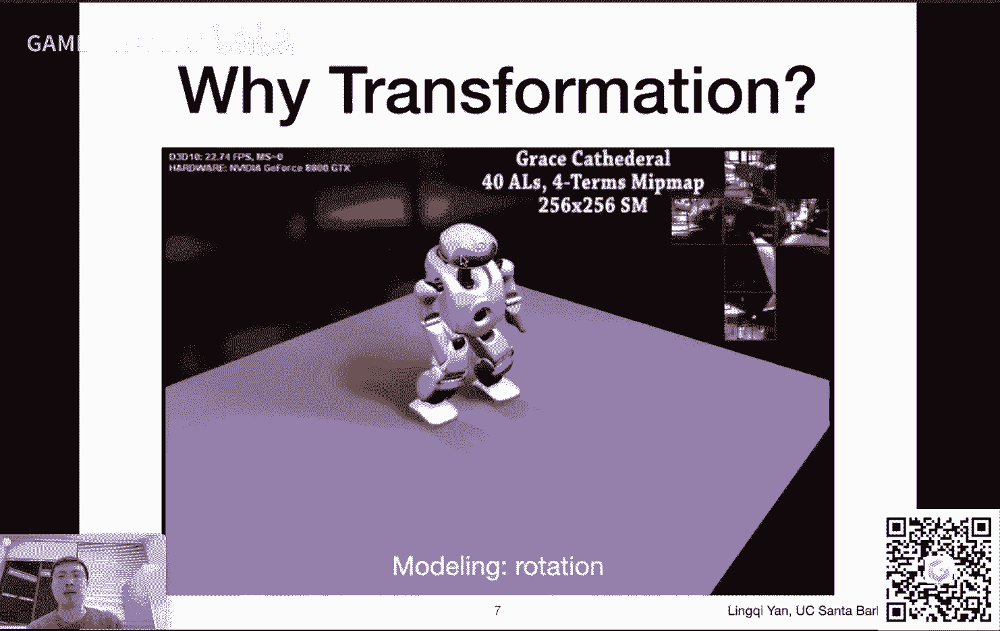
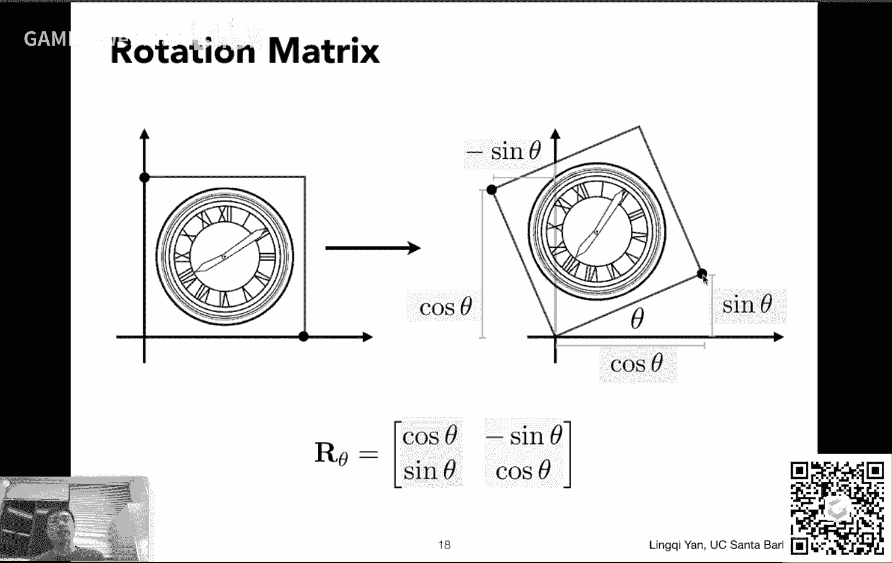
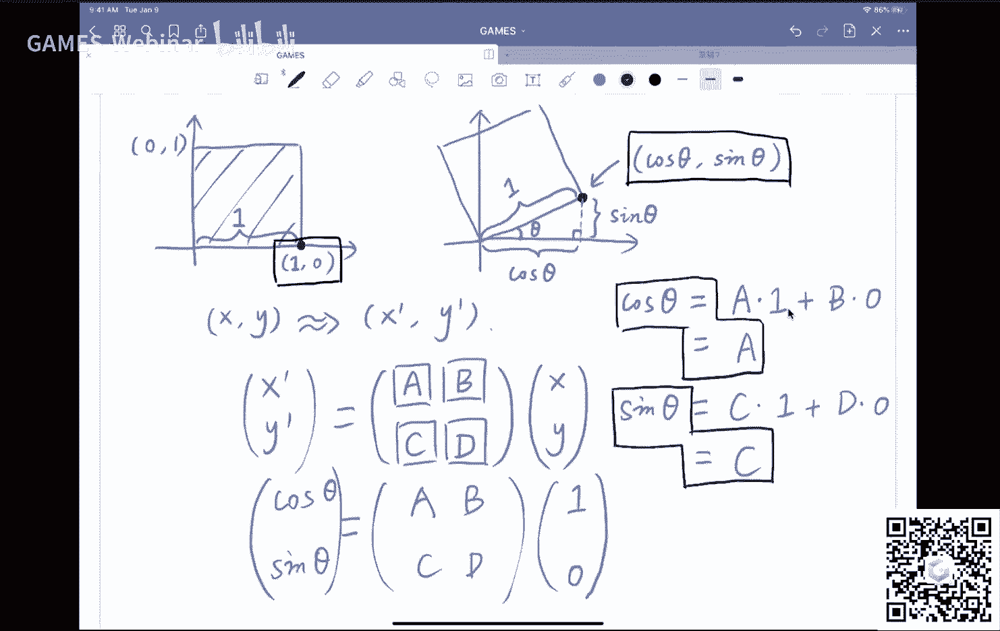
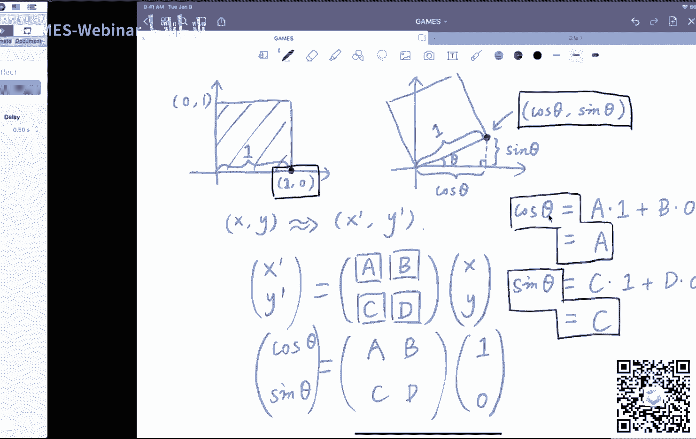

# GAMES101-现代计算机图形学入门-闫令琪 - P3：Lecture 03 变换 🌀

在本节课中，我们将要学习计算机图形学中一个核心概念——变换。我们将从二维变换开始，理解其数学表示，并引入齐次坐标这一重要工具来统一处理包括平移在内的各种变换。最后，我们会将概念扩展到三维空间。

---


## 课程概述与回顾


上一节课我们介绍了向量的基本定义、点乘和叉乘操作，以及它们在图形学中的应用。这些知识是理解变换的基础。



本节课我们将主要探讨变换。首先，我们会了解为什么需要变换以及变换的应用场景。接着，我们将学习几种常见的二维变换：缩放、反射、切变和旋转，并理解它们的矩阵表示。然后，我们会引入齐次坐标的概念，以解决平移变换的特殊性问题。最后，我们会学习如何组合不同的变换，并简要介绍三维变换。

---

## 为什么要学习变换？🎬

变换在计算机图形学中无处不在，主要有两大应用方向。

上一节我们介绍了动画，动画本质上就是一系列变换的组合。例如，摄像机沿着平滑曲线移动，或者一个机器人的关节进行复杂的旋转和移动，这些都是通过变换来描述的。变换还可以表示缩放等效果，例如皮克斯动画中台灯压扁字母的经典场景。

除了动画，变换在成像过程中也至关重要。光栅化成像方法大量涉及变换。例如，将三维世界投影到二维平面上，这个过程本身就是一种非常重要的变换——投影变换。我们这几节课学习变换，正是为后续理解三维到二维的投影变换做铺垫。

---

## 二维变换

二维变换的核心是将变换操作与矩阵乘法联系起来。通过矩阵，我们可以简洁地描述点坐标的变化。

### 缩放变换

缩放变换是最简单的变换之一，它改变图像在x轴和y轴方向上的大小。

以下是缩放变换的要点：
*   如果一个点的原始坐标是 `(x, y)`，缩放后变为 `(x‘, y’)`。
*   当x和y方向缩放比例相同时，变换关系为：`x‘ = s * x`, `y‘ = s * y`。
*   这个关系可以写成矩阵形式：`[x‘; y‘] = [[s, 0], [0, s]] * [x; y]`。
*   如果x和y方向的缩放比例不同（分别为 `sx` 和 `sy`），则矩阵为：`[[sx, 0], [0, sy]]`。

**公式**：
```
缩放矩阵： [[sx, 0], [0, sy]]
```

### 反射变换

反射变换，或称镜像变换，使图像关于某个轴进行对称翻转。




以下是反射变换的要点：
*   关于y轴的反射：`x‘ = -x`, `y‘ = y`。
*   其矩阵形式为：`[[-1, 0], [0, 1]]`。

**公式**：
```
关于y轴反射矩阵： [[-1, 0], [0, 1]]
```

### 切变变换

切变变换类似于将图像像一块有弹性的材料一样水平或垂直拉扯。





以下是切变变换的要点：
*   考虑一个水平切变的例子：图像顶部被向右拉动，底部固定。
*   观察发现，任何点的y坐标在变换前后不变：`y‘ = y`。
*   点的x坐标变化量与它的y坐标成正比：`x‘ = x + a * y`。
*   因此，变换矩阵为：`[[1, a], [0, 1]]`。

**公式**：
```
水平切变矩阵： [[1, a], [0, 1]]
```

### 旋转变换

旋转变换让图像绕原点按逆时针方向旋转一个角度。

以下是旋转变换的要点：
*   默认旋转中心是原点 `(0,0)`，默认方向是逆时针。
*   旋转角度记为 θ。
*   通过分析特殊点 `(1,0)` 和 `(0,1)` 旋转后的坐标，可以推导出旋转矩阵。

**公式**：
```
旋转矩阵： R(θ) = [[cosθ, -sinθ], [sinθ, cosθ]]
```

---

## 线性变换与齐次坐标

上一节我们介绍的缩放、反射、切变和旋转都有一个共同点：它们都可以写成 `x‘ = A * x` 的形式，其中A是一个2x2矩阵，x是点的坐标向量。这类变换称为**线性变换**。

然而，平移变换 `(x‘ = x + tx, y‘ = y + ty)` 无法写成这种单一的矩阵乘法形式，它需要一个额外的向量加法。这使得平移成为一个“特殊”的变换。

### 为什么要引入齐次坐标？

为了能用统一的方式（即单一的矩阵乘法）表示包括平移在内的所有变换，我们引入了**齐次坐标**。

其核心思想是：为二维空间中的点和向量增加一个维度。
*   点 `(x, y)` 的齐次坐标表示为 `(x, y, 1)`。
*   向量 `(x, y)` 的齐次坐标表示为 `(x, y, 0)`。

这样定义的好处是：
1.  **统一表示**：平移变换现在可以写成一个3x3矩阵乘以齐次坐标向量的形式。
    **公式**：
    ```
    平移矩阵： [[1, 0, tx], [0, 1, ty], [0, 0, 1]]
    ```
    应用该矩阵于点 `(x, y, 1)`，得到 `(x+tx, y+ty, 1)`，完美表达了平移。
2.  **保持向量性质**：向量 `(x, y, 0)` 经过平移矩阵变换后仍是 `(x, y, 0)`，这符合“向量具有平移不变性”的几何意义。
3.  **运算一致性**：点与点的减法得到向量，点与向量的加法得到点，这些运算在齐次坐标表示下依然成立。

对于齐次坐标 `(x, y, w)` (w ≠ 0)，它实际表示二维空间中的点是 `(x/w, y/w)`。这允许我们用非1的w值来表示点，例如两个点 `(x1, y1, 1)` 和 `(x2, y2, 1)` 相加得到 `(x1+x2, y1+y2, 2)`，它表示的是这两点的中点 `((x1+x2)/2, (y1+y2)/2)`。

### 仿射变换的齐次坐标表示

缩放、旋转等线性变换与平移变换组合在一起，称为**仿射变换**。在齐次坐标下，任何二维仿射变换都可以用一个3x3矩阵表示：

**通用形式**：
```
[[a, b, tx],
 [c, d, ty],
 [0, 0, 1]]
```
其中，左上角的2x2子矩阵 `[[a, b], [c, d]]` 表示线性变换部分，右边列的 `[tx, ty]^T` 表示平移部分，最后一行固定为 `[0, 0, 1]`。

---

## 变换的组合与分解

复杂的变换通常由一系列简单的变换组合而成。理解变换的组合与分解至关重要。

### 变换的顺序很重要

变换的应用顺序不同，最终结果也会不同。在数学上，这对应着矩阵乘法**不满足交换律**。

例如，先平移 `T(1,0)` 后旋转 `R(45°)`，与先旋转 `R(45°)` 后平移 `T(1,0)`，得到的是完全不同的图像。

### 矩阵乘法的应用顺序

在齐次坐标表示下，对一个点应用一系列变换 `A1, A2, ..., An`，其矩阵运算应写成：
`P‘ = An * ... * A2 * A1 * P`
其中 `P` 是点的齐次坐标。**矩阵的应用顺序是从右到左**，即先应用 `A1`，最后应用 `An`。

根据矩阵的结合律，我们可以先将所有变换矩阵 `An * ... * A2 * A1` 乘起来，得到一个单一的复合变换矩阵 `M`，然后用 `M` 乘以点坐标 `P`。这意味着无论多复杂的仿射变换，最终都可以用一个3x3矩阵来描述。

### 变换的分解：绕任意点旋转

我们之前定义的旋转是绕原点进行的。如果想绕任意点 `c` 旋转，可以通过变换分解来实现：

以下是实现步骤：
1.  将整个图形平移 `-c`，使得旋转中心 `c` 移动到原点。
2.  执行绕原点的旋转 `R(θ)`。
3.  将图形平移 `+c`，将旋转中心移回原位置。

这个复合变换的矩阵为：`T(c) * R(θ) * T(-c)`。这再次体现了矩阵应用从右到左的顺序。

---

## 扩展到三维变换 🧊

将二维变换的思想推广到三维空间是非常直接的。

三维空间中的点和向量也可以用齐次坐标表示：
*   点：`(x, y, z, 1)`
*   向量：`(x, y, z, 0)`

三维空间中的仿射变换可以用一个4x4矩阵统一表示：

**通用形式**：
```
[[a, b, c, tx],
 [d, e, f, ty],
 [g, h, i, tz],
 [0, 0, 0, 1]]
```
其中，左上角的3x3子矩阵表示三维线性变换（缩放、旋转等），右边列的 `[tx, ty, tz]^T` 表示平移，最后一行固定为 `[0, 0, 0, 1]`。

变换的应用顺序规则与二维相同：先进行线性变换部分，再进行平移。

---

## 课程总结

本节课我们一起学习了计算机图形学中的变换。

我们首先了解了变换在动画和成像中的广泛应用。然后，我们深入探讨了缩放、反射、切变和旋转这几种基本二维变换的矩阵表示，并引入了**线性变换**的概念。

为了解决平移变换无法融入线性变换体系的问题，我们学习了**齐次坐标**这一强大工具。它通过增加一个维度，使得所有仿射变换都能用单一的矩阵乘法来表示，极大地简化了变换的描述和计算。

我们还学习了变换的**组合与分解**，理解了变换顺序的重要性（矩阵乘法不可交换），以及如何通过矩阵的复合来表示复杂变换。最后，我们将这些概念自然地推广到了三维空间。


掌握变换的数学基础是理解后续三维投影、视图变换等高级图形学概念的基石。