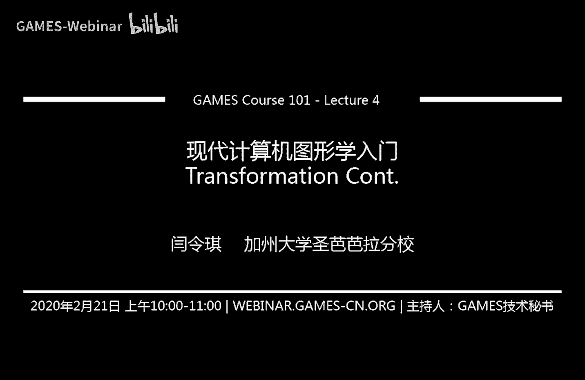

# GAMES101-现代计算机图形学入门-闫令琪 - P4：Lecture 04 变换（续）🚀


在本节课中，我们将深入学习变换的更多内容，特别是三维变换和观测变换。观测变换是图形学中将三维场景转换为二维图像的核心步骤，包括视图变换和投影变换。我们将详细讲解正交投影和透视投影的原理与实现。

## 课程内容概述

上节课我们介绍了基础的二维变换，包括旋转、缩放和错切。我们提到平移变换的特殊性，并引入了齐次坐标来统一表示所有变换。本节课我们将首先补充一个关于旋转矩阵的重要性质，然后深入讲解三维变换，并重点介绍观测变换的完整流程。

## 补充：旋转矩阵的性质

在深入新内容之前，我们先补充一个上节课遗漏的重要知识点。在二维变换中，旋转θ角度的矩阵为：
```
R(θ) = [ cosθ, -sinθ ]
        [ sinθ,  cosθ ]
```
那么，旋转-θ角度的矩阵应为：
```
R(-θ) = [ cosθ,  sinθ ]
        [ -sinθ, cosθ ]
```
观察可知，`R(-θ)` 恰好是 `R(θ)` 的转置矩阵（即行和列互换）。同时，从定义上看，旋转-θ角度是旋转θ角度的逆操作。因此，我们得到一个重要结论：**旋转矩阵的逆等于其转置**。

在数学上，如果一个矩阵的逆等于其转置，我们称该矩阵为**正交矩阵**。这个性质在后续推导中会用到。

## 回顾：齐次坐标与变换合成

上一节我们介绍了旋转矩阵的性质，本节我们回顾一下上节课的核心内容。我们学习了如何使用齐次坐标统一表示线性变换（旋转、缩放）和平移变换。在二维中，一个点 `(x, y)` 用齐次坐标表示为 `(x, y, 1)`，一个向量表示为 `(x, y, 0)`。变换矩阵则扩展为3x3矩阵，其左上角2x2子矩阵表示线性变换，最后一列的前两个元素表示平移。

这种表示法的好处是，复杂的变换可以通过矩阵乘法合成。并且，根据结合律，我们可以先计算变换矩阵的乘积，再应用于点或向量。

## 三维变换

理解了二维变换后，三维变换的思路是类似的。在三维空间中，我们使用齐次坐标将点 `(x, y, z)` 表示为 `(x, y, z, 1)`，向量表示为 `(x, y, z, 0)`。相应的变换矩阵从3x3变为4x4。

以下是三维空间中的基本变换：

*   **缩放**：缩放矩阵是一个4x4对角阵，`sx`, `sy`, `sz` 分别表示在x, y, z轴上的缩放因子。
    ```
    S(sx, sy, sz) = [ sx, 0,  0,  0 ]
                    [ 0,  sy, 0,  0 ]
                    [ 0,  0,  sz, 0 ]
                    [ 0,  0,  0,  1 ]
    ```
*   **平移**：平移矩阵的左上角3x3是单位矩阵，最后一列的前三个元素 `tx`, `ty`, `tz` 表示平移量。
    ```
    T(tx, ty, tz) = [ 1, 0, 0, tx ]
                    [ 0, 1, 0, ty ]
                    [ 0, 0, 1, tz ]
                    [ 0, 0, 0, 1  ]
    ```
*   **旋转**：三维旋转相对复杂。最简单的旋转是绕x, y, z轴的旋转。
    *   绕x轴旋转α角度：
        ```
        Rx(α) = [ 1, 0,     0,    0 ]
                [ 0, cosα, -sinα, 0 ]
                [ 0, sinα,  cosα, 0 ]
                [ 0, 0,     0,    1 ]
        ```
    *   绕y轴旋转β角度（注意正负号与x, z轴不同）：
        ```
        Ry(β) = [ cosβ,  0, sinβ, 0 ]
                [ 0,     1, 0,    0 ]
                [ -sinβ, 0, cosβ, 0 ]
                [ 0,     0, 0,    1 ]
        ```
    *   绕z轴旋转γ角度：
        ```
        Rz(γ) = [ cosγ, -sinγ, 0, 0 ]
                [ sinγ,  cosγ, 0, 0 ]
                [ 0,     0,    1, 0 ]
                [ 0,     0,    0, 1 ]
        ```
    绕y轴旋转矩阵符号特殊的原因是坐标轴的循环对称性（x×y=z, y×z=x, z×x=y）。绕任意轴的旋转可以通过罗德里格斯旋转公式描述，该公式的推导将作为补充材料提供。

一个重要的概念是，任何复杂的三维旋转都可以分解为绕x, y, z轴旋转的组合，这三个旋转角被称为**欧拉角**。

## 观测变换概述

学习了三维变换后，我们进入本节课的核心——观测变换。观测变换的目的是将三维场景中的物体投影到二维平面上，形成图像。这个过程类比拍照：
1.  **模型变换**：摆放好物体（摆pose）。
2.  **视图变换**：调整相机的位置和角度。
3.  **投影变换**：按下快门，将三维场景投影到二维胶片上。

这三步合称为MVP变换（Model, View, Projection）。

## 视图变换

视图变换对应着摆放相机。要定义一个相机，我们需要三个参数：
1.  相机位置 `e` (eye position)。
2.  相机看向的方向 `g` (gaze direction)。
3.  相机向上的方向 `t` (up direction)。

为了简化后续计算，图形学中有一个约定：将相机变换到一个标准位置。我们总是将相机放置在原点 `(0,0,0)`，让其看向负Z轴方向 `(0,0,-1)`，并以Y轴方向 `(0,1,0)` 作为向上方向。

视图变换的目标就是将一个任意位置和朝向的相机，通过一个变换矩阵 `M_view`，移动到标准位置。同时，为了保持相机与场景中物体的相对关系不变，我们需要对场景中的所有物体应用同样的 `M_view` 变换。

`M_view` 矩阵可以通过以下两步构建：
1.  **平移**：将相机位置 `e` 平移到原点。平移矩阵为 `T_view = T(-e.x, -e.y, -e.z)`。
2.  **旋转**：将相机的朝向 `g` 旋转到 `-Z` 轴，将向上方向 `t` 旋转到 `Y` 轴，将 `g×t` 方向旋转到 `X` 轴。

直接写出这个旋转矩阵 `R_view` 比较困难。一个技巧是先求其逆变换：将标准坐标系的X轴 `(1,0,0)` 旋转到 `g×t` 方向，将Y轴 `(0,1,0)` 旋转到 `t` 方向，将Z轴 `(0,0,1)` 旋转到 `-g` 方向。这个逆变换矩阵 `R_inv` 很容易写出：
```
R_inv = [ (g×t).x, (g×t).y, (g×t).z, 0 ]
        [   t.x,     t.y,     t.z,    0 ]
        [  -g.x,    -g.y,    -g.z,    0 ]
        [   0,       0,       0,      1 ]
```
由于旋转矩阵是正交矩阵，其逆等于转置。因此，我们需要的旋转矩阵 `R_view = (R_inv)^T`。

最终，视图变换矩阵为：`M_view = R_view * T_view`。先平移相机到原点，再进行旋转对齐坐标轴。

## 投影变换

完成视图变换后，相机位于标准位置。接下来需要进行投影变换，将三维空间中的物体投影到二维平面上。投影变换主要分为两种：正交投影和透视投影。

### 正交投影

正交投影没有“近大远小”的效果，通常用于工程制图。其核心思想是：将观察空间中的一个长方体区域（由左`l`、右`r`、下`b`、上`t`、近`n`、远`f`六个面定义）映射到标准立方体 `[-1,1]^3` 中。

> **注意**：由于相机看向负Z轴，所以离相机更近的平面（近平面）其Z值 `n` 更大，离相机更远的平面（远平面）其Z值 `f` 更小，即 `n > f`。

正交投影变换 `M_ortho` 可以通过以下两步完成：
1.  **平移**：将长方体的中心平移到原点。平移矩阵为 `T_ortho = T(-(r+l)/2, -(t+b)/2, -(n+f)/2)`。
2.  **缩放**：将长方体缩放为标准立方体。缩放矩阵为 `S_ortho = S(2/(r-l), 2/(t-b), 2/(n-f))`。

因此，`M_ortho = S_ortho * T_ortho`。

### 透视投影

透视投影模拟人眼成像，具有“近大远小”的效果，平行线在投影后不再平行（如铁轨交汇于一点）。透视投影的观察空间是一个视锥体（Frustum）。

透视投影的推导相对复杂。一个巧妙的方法是将其分解为两步：
1.  将视锥体“挤压”成一个长方体。
2.  对这个长方体进行正交投影。

我们主要关注第一步“挤压”变换 `M_persp->ortho`。考虑从侧面（YOZ平面）观察视锥体。根据相似三角形原理，对于视锥体内任意一点 `(x, y, z)`，其挤压后的y坐标 `y' = (n/z) * y`。同理，`x' = (n/z) * x`。

这意味着，点 `(x, y, z, 1)` 经过挤压变换后，应该与点 `(nx, ny, unknown, z)` 表示三维空间中的同一个点（因为齐次坐标乘以同一个非零常数表示同一个点）。由此，我们可以推断出变换矩阵 `M_persp->ortho` 的部分元素。

为了完全确定矩阵，我们利用两个已知条件：
*   **近平面上的点不变**：近平面 `z=n` 上的任何点 `(x, y, n, 1)` 在挤压后位置不变。
*   **远平面中心点不变**：远平面中心点 `(0, 0, f, 1)` 在挤压后位置不变，且其z坐标仍为 `f`。

利用这两个条件建立方程组，可以解出矩阵中剩余未知的元素。最终推导出的 `M_persp->ortho` 矩阵为：
```
M_persp->ortho = [ n, 0, 0,    0   ]
                 [ 0, n, 0,    0   ]
                 [ 0, 0, n+f, -n*f ]
                 [ 0, 0, 1,    0   ]
```

因此，完整的透视投影矩阵为：`M_persp = M_ortho * M_persp->ortho`。

> **思考题**：在透视投影的“挤压”变换中，对于视锥体内 `z = (n+f)/2` 处的点，其z坐标是向近平面 `n` 靠近，还是向远平面 `f` 靠近？可以通过计算 `M_persp->ortho` 对z坐标的变换结果来分析。

## 总结

本节课我们一起学习了图形学中变换的进阶内容。

我们首先补充了旋转矩阵是正交矩阵的重要性质。然后，我们将二维变换的知识推广到三维，介绍了三维空间中的缩放、平移和旋转变换。

本节课的重点是**观测变换**。我们了解到，将三维场景转换为二维图像需要三个步骤（MVP）：
1.  **模型变换**：摆放场景中的物体。
2.  **视图变换**：将相机移动到标准位置（原点，看-Z，上Y），并对所有物体应用相同变换以保持相对关系。
3.  **投影变换**：将三维坐标投影到二维平面。我们详细讲解了两种投影：
    *   **正交投影**：将长方体映射到标准立方体，无近大远小效果。
    *   **透视投影**：通过“挤压”视锥体为长方体再进行正交投影来实现，具有近大远小效果，更符合视觉感知。

透视投影矩阵的推导是本课的难点，但其核心思想是利用齐次坐标的性质和几何关系（相似三角形）来求解变换矩阵。

理解这些变换是理解现代图形渲染管线的基础。在后续课程中，我们将看到这些矩阵如何被应用到顶点上，从而将三维世界呈现在二维屏幕上。


