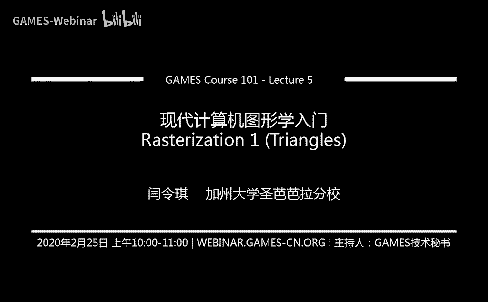
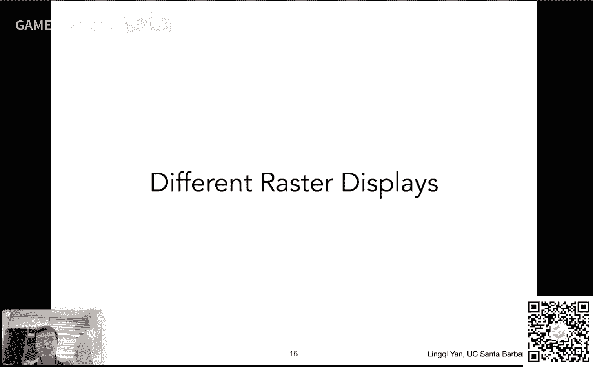
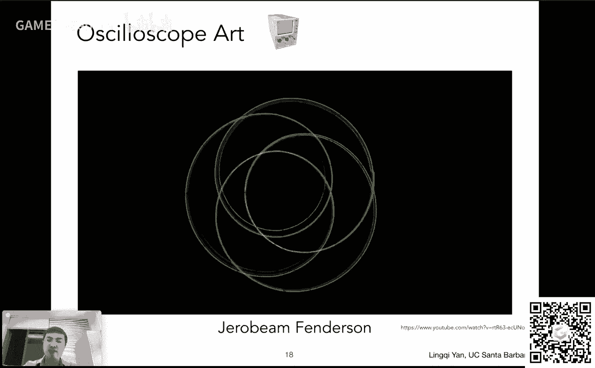
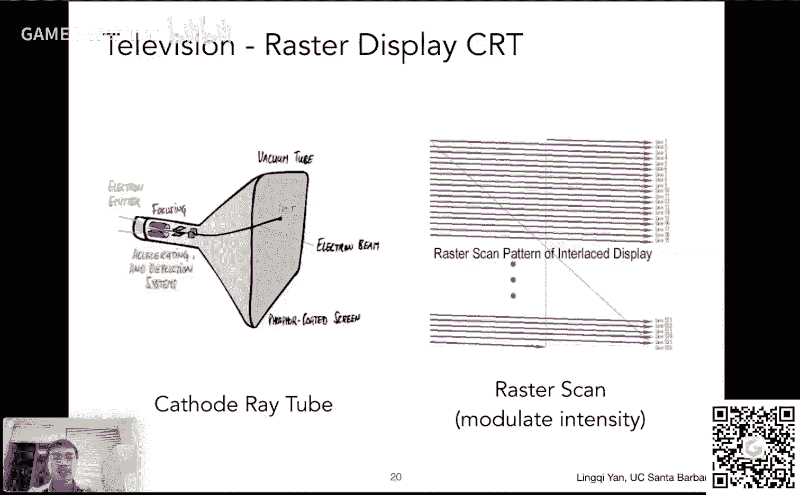
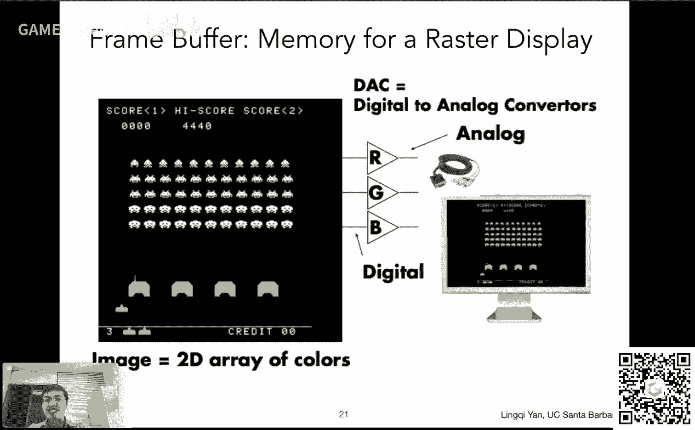
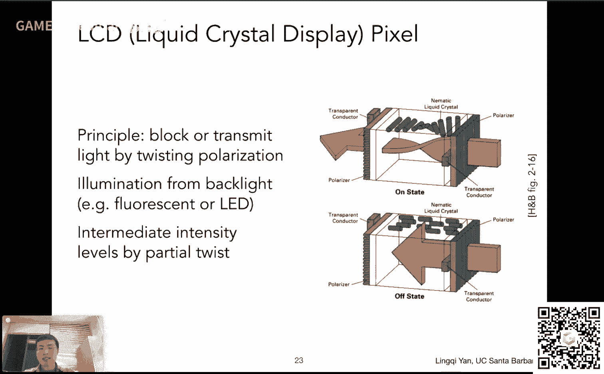
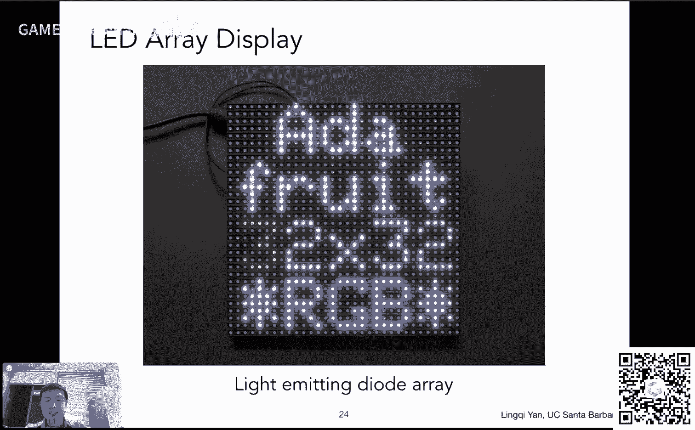
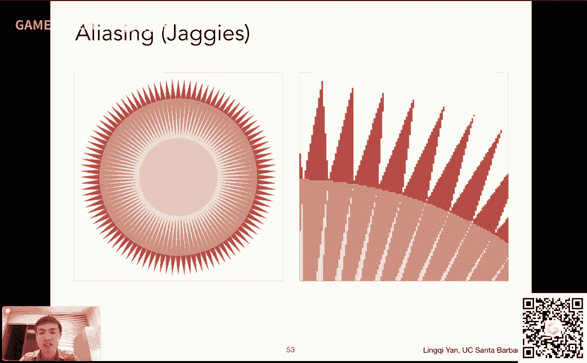
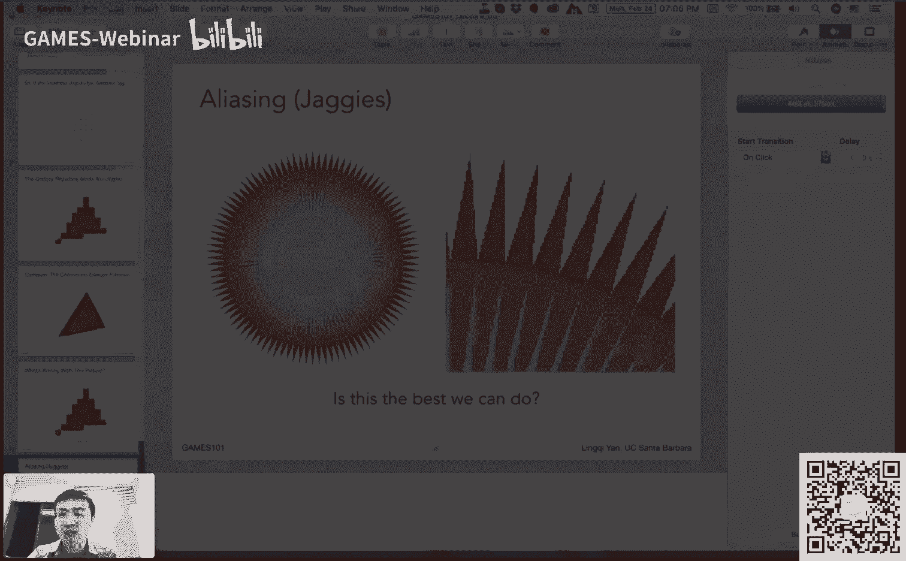
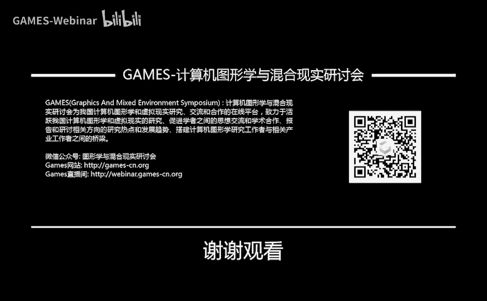

# GAMES101-现代计算机图形学入门-闫令琪 - P5：Lecture 05 Rasterization 1 (Triangles) - GAMES-Webinar - BV1X7411F744

亲爱的观众朋友们，大家好，欢迎来到咱们这个现代计算机图形学入门的第五节课，然后咱们从这节课开始，这个之前的变换就已经说完了，咱们开始把这个呃三角形的光栅化开始这个呃说一下。

然后这应该是呃整个咱们第一块的这个呃最重要的部分了，大家可以看到，其实这个如果大家注意我们每一页这个这个ppt啊，封面，每一个封面嗯都会有这么四个图，然后我们的这个课程主页上也有这个嗯。

就是对应这四张图，分别对应的就是咱们这个课要讲的四个主要内容或主要部分吧，咱们第一块也是大家看到左下角这个这两个车子啊，然后阴影这块这块就是我们要给大家说的这个光栅化成像。

然后这个也就是相当于实时的这个应用，这些它们生成这个图像所所着重使用的方法，然后咱们前面几节课呢花了点时间讲了一下这个呃变换，然后这个变换呢相当于是基础，然后应用这些变换。

咱们就最终可以把这些三维中的场景给画在屏幕上，那咱们这节课就开始说这个事情，好吧啊，没问题，那这个今天咱们讲三角形的光栅化，那么在这个啊正式进入课程之前，我们先这个宣布几件事情，第一是这个作业零。

截至目前这个收到了188号提交，这我觉得真不容易，这个课咱们这个又不要求大家做作业，然后大家还这么积极，然后挺好的，提出表扬啊，如果说呃你希望这个把作业零这个提交。

但是中间遇到了一些各种各样什么技术困难呀，然后这个比如说虚拟机不能跑啊，然后这个编译出现各种各样的困难，而这些没问题，是正式作业，零的目的是让你这个让大家在之后的这个作业中，不再会出现这么些问题。

好吧呃挺好的，那么呃好，那这就是关于作业零啊，另外作业灵会不会做批改，大家就提交了就提交了好吧，然后这个嗯从作业一开始，这算是正式作业，然后今天呃这个理想状态下，咱们今天会把这个作业一给放出来。

然后以后呢就是每个星期会有一个作业，然后嗯这个作业啊，或者说从这个作业一开始吧，咱们每个作业都分为两部分，一个算是基本要求，另外一个算是提高部分，就是大家作为自己这个兴趣爱好在上面再加入新的功能。

这这两部分呢嗯会被分开的这个给分，然后如果如果这个课最后咱们结业，大家需要一个证书或者干什么，这个我们会这个以这个基本要求为主，所以说这个提高要求呢大家用来这个提升自我。

然后这个这个感兴趣的同学多做一些，大概就是这么一个要求，好吧呃好，然后呢，那这个有同学，我看到现在现在同学们这个很踊跃的在这个课程bbs上面提问，这个非常好，然后有一点呢就是说嗯跟大家说一下。

就是说呃就是考虑到这个大家问问题以及回答问题的这么一个效率上，还有效率啊，就是说呃大家在发问题之前把这个问题这个想好到底是什么问题，然后我做了一个什么样的事情，得到了一个什么样的这个结果啊。

到底这里出了什么问题，就是说把这些事情描述清楚，这样也方便我以及助教呃，同学们在这里这个帮大家这个呃这个答疑解惑好吧，然后这是一个，然后另外一个是我看大家这个有同学在在用我们games的这个这个群。

在里面问这个课程相关的问题，这个我现在正在和这个呃技术秘书同学以及呃助教同学们在思考，我们要不要这个建立一个专门这个用来用来探讨这个作业嗯，和问题的这个群，专门专门用于这节课。

这样的话省得大家会这个因为讨论而这个错过一些games的其他重要信息，比如说这个有一些好的讲座或者是其他的通知之类的，好吧，这个我们正在呃这个这个思考中好吧，那这个呃是关于bbs。

那么今天今天要给大家讲的这个这个课啊，相比于上节课，那这节课太简单了好吧，然后这节课大家就是这个嗯，听下来我相信大家一定都可以听得明白，那么上节课咱们说了什么呢。

咱们上节课主要说了这个观测这么一个变化对吧，那么所谓视图变换，就是在利用这个呃这个摄像机和物体的相对运动关系，咱们始终把摄像机从任意的一个位置，然后移动到一个这个经典的位置对吧，呃在这个原点。

然后呢看向负z并且向上方向是y对吧，然后把其他所有物体都和这个相机一样的移动，然后这样就可以保证这个我会把这个模型变换应用在所有的模型上，然后把所有的这个视图变换也应用在所有的模型上，然后在这个之后。

我们就知道这个所有物体都是由一个这个呃标准位置的，这个相机看过去，然后我们就需要把它给投影成一个呃照嗯，投影成一个照片对吧，从三维投影到二维，那么我们提到了两两类呃，一类叫做这个正交投影。

一类叫做透视投影，然后这个呃它们的区别就是，正交投影是把这个直接把这个深度信息忽略，然后或者可以理解成相机放在无限远，然后投四投影呢相当于是可以达到一个近大远小的效果。

然后我们还提到说如何去推导这个正交投影矩阵，以及说这个嗯透视投影如何通过先变换成正交投影，在这个这个投影过去对吧，然后就是说我们把这这些举证着重推导了一下，那么大家这个回到一个这个高一点的层面上来看啊。

这个整个这一块叫做观测，这个变换，变换完了之后，无论如何，最后我们得到所有的这个物体，在场景里，所有的物体都会被变为这个呃-1~1的三次方，这么一个经典的这个立方体里对吧，然后呢这个下一步是什么对吧。

这就是我们今天需要回答的问题，说这个在做完观测矩阵之后，所有物体都已经在这个嗯经典的-1~13次方这么一个空间里，下一步我们应该怎么办，然后当然大家知道下一步就是要把它给画在屏幕上，那么怎么画对吧。

这一部就叫做光栅化或者rusty zation，这就大家看到了今天的这个呃两个主要话题，然后如果咱们有时间，咱们把下一节课的这个呃，涉及到这个遮挡与这个呃这个可见性这一块儿也说一下啊。

然后因为下节课内容其实相对比较多，然后咱们这节课尽量能够改正一点好吧，那这就是今天的这个内容，那上一次呢咱们把这个透视投影转化成正交投影，这部已经已经说明白了对吧，然后这个大家可以看呃。

右上方这个示意图，那透视投影转换成正交投影是要保证什么呢，然后它的大小，那么大家应该记得说在这个正交投影里面啊，我们如何定义这个三维空间中的这个长方体对吧，我们用它的这个x轴的覆盖，也就是左和右。

然后y轴的覆盖这个这个下和上，然后这个呃这种的覆盖，也就是远和近这么几个数字来表示这这么一个立方体对吧，我们需要六个，然后呢呃这里既然远和近，咱们这个用透视投影和正交投影表示都是一样的，咱们不用管它。

就是near和far或者n和f这两个值，我们认为我们知道，那么呃在做这个透视投影的时候，我们是要把这一个frost变成这么一个呃长方体，那么我们如何定义这么一个frost对吧，或者说这么一个视锥。

就是大家看到的这么一个近大远小这么一个一个一个呃形状，然后然后这个如何定义呢，呃其实很简单，大家看下面这个示意图，就是说我们从这个呃摄像机出发，我们看向某一个区域。

然后这就好像大家在看一个这个显示器一样对吧，显示器有它的这个呃长和这个宽和高，然后我们可以定义一个宽高比，也就是叫做这个嗯aspect ratio，然后这个宽高比是什么意思呢。

就是就是它的宽度除以它的高度，然后就好像说我们说一个屏幕是什么，这个四比三的，这是早期的或者现在的ipad对吧，或者说16比九的指的就是这么一个信息，那么我们同样可以这么来定义。

就相当于是诶我摄像机摆好了，往一个方向去看，然后我试图看到的一个区域，它的这个长宽比我们把它定下来好，这个这个是可以定义的，然后呢我们还需要定义另外一个这个概念，这个如果大家这个玩相机啊，大家会知道。

然后这个这个叫做呃这个视角，然后呢或者叫做field of view，就是就是表示了什么呢，表示就是就是你可以看到的这个角度的范围，就是说嗯大家还是看这么一个例子哈。

假如说我们在呃盯着从一个这个相机盯着这么一个屏幕去看，然后我们这个连出两道红线的，这两个红线分别从相机连到这个屏幕的，这个上面有一个边的中心和下面一个边的中心。

然后这个中间所夹的角度就是两条红线之间所夹的角度，我们就管它叫做垂直可视角度，这然后这个角度正常是用来这个定义，我看到的这个世界啊，就是说这个我是用什么样的相机看到的，大家都知道这个相机有很多种。

因为这个比如说大家要拍这种近距离的物体，大家需要用到一个这个呃叫做广角的相机，所谓这个广角其实就相当于是这个可视角度会比较大对吧，然后反映在这个frost上，就相当于他张得比较开。

他一开始从零迅速就可以张到一个非常大的一个范围，然后如果他这个呃垂直的可视角度叫做这个field of view，然后它比较小，那相当于它它这个开口比较小，然后这样的话就相当于这个透视投影就越不明显。

就就就是越像什么呢，就是越像这个这个正交投影对吧，但是这样一来你可以这个这个很容易地拍到这个远处的物体对吧，然后呃这就是我们用来定义这个嗯透视投影，它这个视锥需要的两个概念好吧，一个是长宽比。

一个是垂直的可视角度好，那没问题，然后嗯这里是这样，就是说有一些这个这个图形学的这个呃图形学上面，特别是涉及到大家打游戏的时候，这个这个呃会涉及到一些这个水平的可视角度，这两个都是可以相互转化的。

没问题吧，就是说通过这个长宽比，然后通过这个垂直的这个可视角度，我们当然可以推出这个水平的可视角度，那也就是什么呢，就是从这个相机我连出两根线，这两根线分别连向左边和右边的中点对吧。

然后这两条线形成的一个角度，这就是水平方向的这个这个可视角度，所以这都是可以的，那么嗯有了这么两个概念之后啊，这个长宽比和这个呃垂直的可视角度之后呢，我们就可以把这两个概念给转化到。

这个和之前咱们定义这个空间中的长方体，就是用于做这个正交投影的这个长方体呃，这个转化成同一个概念啊，怎么做呢，大家可以看到这么一个示意图，那咱们在某一个方向上放上这个呃，某一个位置放好了这个摄像机。

然后往一个方向看，大家可以看到，如果我们从侧面嗯去这个看，我们这个是这个事件来说，就是说我们会看到这么一个三角形，还是跟之前推导一个一个意思哈，因为我们想想的是，这个相机是往负z方向的嘛对吧。

所以这个距离是n的绝对值，然后这样呢我们又知道这个垂直的可视角度，那可视角度我们刚才说了，是那么两条红线连上面一边和下面一边的中点两条线，他们的家教，那也就是说垂直的可视角度除以二嗯。

这里才是这个这个我们所看到的这么一个三角形，它对应的这个这个呃张开的这个角度，然后嗯那大家立刻就会可以看到一个这个呃三角形和三角函数关系，对吧，如果我们取它的这个呃tgent这个角度的tgt。

也就是这个垂直角度除以二，然后这么一个角度tan是什么呢，是右边的这个呃高度的一半去除，以这个这个呃呃near这么一个距离对吧，也就是说这个右边的这么一个式子就是这么定义的了。

那么呃右边的这个呃怎么说呢，就是说我们把这个呃可视角度如果知道，我自然就会知道这个嗯怎么说这个屏幕的一半的高度，也就是这个top是多少，也就是相当于这个呃这个屏幕的最高点，然后它对应的y的这个值呃。

应该就是就是我们算出来这个t对吧，然后然后呢那屏幕的最低点对应对应的y就应该是负t好吧，然后也就是说我们如果要定义空间中的一个长方体的话，那么这个b就应该等于负t，那同样道理水平方向咱们也可以直接来算。

为什么呢，因为我们知道长宽比，我们知道这个这个知道这个这个高度对吧，知道高度这个总共是t，然后那么他们的这个这个水平方向的宽度就应该是这个呃什么呢，就应该是这个呃t去乘以这个宽高比。

就可以得到它的这个呃可以得到它的宽度了对吧，那也就是说这些概念都是可以相互转化的，那么这里也就是告诉大家，正常情况下，如果我们要定义一个视锥的话，很简单，我们就只需要定义一个垂直的可视角度。

定义一个这个宽高比，然后这个嗯其他的这些都可以自动把它给转化到，这个我们定义正交投影的这么一个呃，远近左右上下这么几个概念上去好吧，然后这里就是就是这个简单说一下啊，这个应该挺容易的。

那么我们上节课停留在这个呃，mvp也就是model view projection做完了之后对吧，大家都知道这个做完了之后啊，model view projection做完了之后呢。

呃所有的物体都会停留在-1~1的三次方，这么一个经典的这个这个立方体里面去对吧，然后呢嗯不管怎么样，大家可以看到这个我是做正交投影也好，然后最后它会出现在-1~1的三次方，我要是做透视投影的话。

先做正交呃，先做这个转化到正交投影，再做正交投影，那最后肯定也是-1~1的三次方，那么自然而然下一步咱们就要知道要这个-1~1的三次方，这么一个立方体怎么画在哪儿呢，大家都知道要把它画在屏幕上对吧。

那么嗯既然是要画在屏幕上，咱们这个应该要先这个嗯把这个屏幕这么一个概念给定义好对吧，然后什么是屏幕呢，对于图形学来说，咱们把它抽象的认为是一个二维的数组，然后这个数组中的每一个元素是一个像素对吧。

这个其实好理解，比如说大家看到这个屏幕，大家都说分辨率是多少的对吧，比如说是1920x1080的对吧，就表示有这么多个这个像素，并且这么多像素形成了一个二维的数组，然后啊那我刚才既然提到这么一个数。

这个数字对吧，1920x1080，他们的这个也就是这个屏幕的大小，我们这我们管它叫分辨率对吧，这个嗯要么是这个比如说1280x720，我们管这个分辨率形象成为720p，然后如果是这个1080。

1920x1080，我们就管它叫1080p，当然还有更高的叫做2k或者4k对吧，这些就表示了我这个像素的多少，这个就是啊就是它的这个呃分辨率好没有问题，然后呢嗯屏幕是一个典型的。

我们管它叫做光栅成像设备，那么所谓光山啊，就是这个ster这个rua是什么意思，我们平常这个经常说光山话，就是rust orization啊，那么其实这个rua是在德语中啊定义的一个一个一个一个词。

它其实就表示屏幕好吧，然后那么光栅画也就是restaurri是什么意思呢，就是说我们把这个定义为嗯就是呃把东西画在屏幕上，对不对，把这个名词变成动词，把东西画在屏幕上这么一个过程就是光栅化的过程。

那么以后我们就这么说好吧，然后呢呃我们多提一句，我们刚才既然提到像素对吧，大家都知道这个屏幕上有好多像素，然后呢这个像素首先它的名字的由来是叫做picture element。

然后大家把它缩写成pixel这么一个说法啊，然后这个呃像素当然其实挺复杂的，但是咱们在这门课里面，我们把它认为啊是一个一个的这个小的方块，然后每一个方块它内部的颜色都不会有变化。

也就是说要么整个方块是这个什么样的一个，比如红色吧，然后要么整个一个方块是完全相同的，一个白色或者黑色或者什么，就是说像素已经是最小的单位了，在这个里面不会有任何的变化，咱们这么理解，当然这是不对的哈。

咱们之后会给大家在这个看到这个课的最后，大家就会看到像素远远比这个要复杂，但作为一个抽象，咱们这么理解没有问题，然后呢这个嗯一个像素它可能会表示不同的颜色，如果我们认为说这个这个啊它表示的是一个灰度。

就是说从这个黑到白，那我可以把它划分成若干等级，正常情况下大家把它划分成256个等级，然后呢嗯这个就表示了，比如说零等级零，我就表示它完全是黑的，然后等级255，我就认为它完全是白的，那么呃同样道理。

这个我也我也可以用三个不同的数字，然后分别表示这个红色，绿色和蓝色的这个这个强度的等级，那么它组合在一块就可以形成各种各样不同的这个颜色，所以我们认为一个像素类的颜色都可以用rgb 3个值来表示好吧。

然后同样道理一个像素内颜色不会发生这个任何的差异好吧，那这里就是简单的定义一下我们这个屏幕，然后呢呃在这里呢我们先把这个这个呃屏幕的空间也给定义一下，那什么叫屏幕空间的呢。

其实就是相当于我们在屏幕上建立一个坐标系对吧，然后这里呢大家如果看这个虎书，他自己当然有一套定义的方案，那咱们自己也有一套定义方案，那大家可以看这么一个示意图，好吧。

假设我们现在看到的这个屏幕的左下角就是这么这么一个坐标系，那么呃就是我们认为屏幕的左下角是圆点，屏幕空间的原点，然后向右是x，向上是y，那这样的话就相当于是呃我们可以定义这么一个这个坐标系。

从左下角出发的，然后x和y，所以任何的这个屏幕中间的一个点，我都可以用x和y来表示，那么有一些规定，这些规定当然是我们就是说平常这么用，然后就约定俗成了，并没有什么特殊的意义啊。

就是首先我们定义这个像素对吧，呃我们这个像素呢这个它的坐标，或者说我们把它定义成这个这个这个下标，或者说管它叫这个位置或者什么，就是说呃管它叫index好吧，然后就是说像素的这个坐标呢。

我们认为它都是写成xy形式的，然后呢每一个像素它是一个小方块对吧，然后我就用一个整数的这个坐标来描述它，比如说大家现在看到的这个这个蓝色的这个像素啊。

咱们就可以用这个呃二一这么一个呃坐标来表示这个像素啊，大家可以向右数对吧，从零开始对，然后呢，呃我们认为这个这个呃像素都可以通过这么一种这个坐标来表示呢，那么所有的像素如何来表示。

就是说如果一个屏幕我认为它的分辨率是with成height，那么所有的像素那就是从001直到with减一乘以hiit减一这么多，这个这个可行的这些坐标没有问题，那咱们认为从零开始吧对吧。

所以它的宽度就是with这么多个像素高度，自然也是一样，没有问题，那么我们再继续定义这个事情，就是说呃像素大家可以看到，虽然我们用的是整数的坐标来描述它，但其实这个像素的中心在哪儿呢。

大家可以很明确的从这个蓝色的这个这个像素可以看得出来呃，这个蓝色的像素它这个是二一这么一个坐标，那么它实际的中心是2。5和1。5，没问题吧，所以大家如果看这个中心，它在数轴上。

它的这个到底应该是什么坐标，咱们可以这么看，那么对于任何一个像素来说，那么它的其实中心他应该准确的在x加0。5和y加0。5上对吧，那这也是咱们这么一个定义，那么既然这么定义了。

那咱们考虑到一个像素它会覆盖一这么宽度对吧，然后这个就在x和y上都覆盖一，那么咱们整个屏幕会覆盖多少呢，如果我认为整个屏幕的宽度是with，也就相当于有with这么多个这个呃像素每个像素占一。

那自然就是从零到with，然后这个这个高度也是从零到heat好吧，那咱们这么一定义，这样，这样的话屏幕空间就非常清楚了，那么呃大家可以想象，那么我们现在要干什么呢，啊记得吗。

咱们现在有一个这个-1~13次方这么一个立方体，咱们要把它给转化到这个屏幕上，那自然要做一个从这个-1~13次方，然后到这个屏幕也就是零到with乘以零到height这么一个空间的一个变换。

那么这就是我们之后要做的事情，呃，大家可以看到这个示意图上呃，右边这个示意图，然后-1~13次方，我们要把它映射到屏幕空间，然后呃在这里呢会有一个问题对吧，这个原本呢它在-1~13次方。

它可不是有一个z嘛，也就是说是一个三维的，首先仍然是三维的坐标，我映射到这个屏幕上，那我怎么处理它的这个z方向的值很简单，暂时我们先不管它对吧，这个z自然而然它之后有它的用途，咱们很快就会说。

那么只盯着x和y来看，那就简单了，x和y原本是-1~1的平方对吧，然占据这么一个这个这个正方形，咱们现在要把它拉到0x0到with乘以零到height对吧，那这个太简单了对吧，那这个嗯怎么做呢。

我那我就先把这个呃-1~1，-1~1给先给拉成这个让它的宽度是with，让它的高度是height，那么这个怎么做呢，那我们知道原本来说啊，-1~1-1~1，它是多大呀，还是这个宽度是二，高度也是二对吧。

我把这个宽度和高度都先除以二，然后再乘以对应的位置或者height，然后这也就是大家看到的这个这个变换啊的呃，左上角的这个3x3，其实大家可以看到对角阵，然后在这个宽度上呃，把它变成with。

高度上把它变成height，然后变完了之后呢，大家别忘了这里中心还是在零零这里，但是我们发现这个呃不是这么回事对吧，我们要把这个呃我们要把这个屏幕空间，他的这个呃左下角定义在原点上。

那也就是说如果我原本这个中心是在零零，那么我要把中心移到它该应该在的这个中心呃是多少呢，就是宽度除以二和高度除以二，咱们回来看，就是说呃这一页上，假如说这个屏幕就这么大，4x3啊。

然后那么它的中心就应该在这个位置，那咱们应该要把它这个之前先给缩放了的这个-1~1，像大小已经一样了，我们把中心从零零移到这边去好吧，所以就是说我们这里要做这么两个操作。

那当然可以写成一个简单的这个变换，那么这个变换就被称为视口变换，也就是相当于是把这个-1~1的平方，然后给变成这么一个呃屏幕空间好吧，然后这里还是一样，咱们不管z啊，z方向，咱们咱们就不动它。

大家也可以看到这里确实z方向这里写的是一，所以说确实z方向没有病，没有经过任何的改变好，那么呃这就是我们要做的最后一个变换了，那做完这个变换之后，大家就可以看到好。

那我定义的之前不管是frost通过这个呃宽高比，还是说呃和呃宽高比和这个可视角度定义的frost，还是说我定义的这个正交投影的这么这么一个哎，这个就是三组这个这个对边的这个这个位置对吧。

呃不管我怎么定义，然后反正他们已经变化到-1~1的三次方了，然后现在我又把它的x y给变到了屏幕上，那也就是说现在我已经可以得到一个二维的，一个一个就相当于场景的一张虚拟的照片了对吧。

那么呃下一步是什么呢对吧，下一步自然就是我们要把这个得到的这些结果，大家别忘了，这仍然是这个这个空间中描述的一堆三角形啊，这些这些这个信息对吧，然后我们要把它变成真正的这个图。

也就是说我们要把它给打散成像素，没错吧，这个呃这里就是我们要说的这个光栅画这么一个过程了，所谓光栅话我刚才已经解释了，就是说大家可以看到这么一个这个例子哈，这个是这个少年派的奇幻漂流。

这个电影里面大家都知道这个老虎是假的，但是做的栩栩如生啊，这个就是嗯这个这个啊图形学的贡献了，大家可以看到这个老虎呢上面有这个各种各样的这个多边形对吧，这些多边形它经过变化，经过各种各样的操作之后。

它会形成在屏幕空间中的多边形，但这不够，咱们要把这个多边形进一步打碎，打成这个像素对吧，显示在这个一个个像素上，告诉我每一个像素的值都应该是什么，这一步的过程应该叫做就是我们所说的光栅化。

把这个多边形这个在屏幕空间真正的给画在屏幕上好，那这就是咱们要说的这个内容好嗯，在这个之前呢，就是说可以用这个进行这个这个绘画的这么一些机器，可不只是这个这个屏幕，这里给大家稍微介绍一下对吧。

这个大家可以看到有一些这个实际的这些呃绘制用的这些工具啊，就是真正能够在一些这个物体上面画，大家可以看到这是一类一个类似机器人的结构，然后他绑着绑上一支笔，然后这个可以根据这个编程的这个这个这个位置。

然后控制它的移动，这样的话它可以真实的在任何的地方去画画对吧，那咱们的这个在屏幕上画，是不是这么一个道理呢，对咱们之后可以再继续看，然后呢同样道理在一些这个制造过程中。

比如说像这个比如用激光去这个切割一些这个金属，然后这些当然也都是控制好的，相当于是在金属上面这个进行一些这个绘制，那么同样道理咱们在这个屏幕上也是一样的对吧，那咱们这个介绍在屏幕上绘制之前。

咱们先给大家介绍各种各样不同的这个呃光栅，光栅的这个显示设备对吧，那么呃这个分别都是什么呢。

大家可以看到这个嗯最简单的，或者说一个非常常见的一个一个这个光栅的显示设备，这个早期啊其实这个嗯很多电脑显示器也都是这样，咱们这个之后会的给大家介绍这个呢是示波器啊。

然后如果大家做过这个什么物理实验或者什么这个应该都这个嗯，见过这个没问题吧对吧，然后这上面它可以形成各种各样不同的曲线，正常情况都是绿的对吧，然后是是这么一个设备，然后呢这个呃这个设备很神奇的。

然后呃给大家放一段这个视频，welcome这个internet，然后这个大家听到这个噪音是真的，这个视频里面有噪音，然后这个视频是在干什么呢，这个视频是在试图用示波器去画一个这个蘑菇啊。

大家刚才应该已经看到了对吧，now first we need a sign wave on our horizontal deflection channel。

and a cosine wave on our vertical deflection channel together，they add up to a beautiful circle，哈可以啊。

所以说呢这个示波器其实是很神奇的东西，他这里说的不知道大家听明白没有啊，他他这个为了画一个蘑菇，然后他用到各种各样的正弦和余弦的波，并且还使用了声音作为这个一种这个噪声的输入，是这么一个意思。

然后自然它还有后续啊，这个后面就不再给大家看了，然后呢咱们直接进入到这下面一页好吧，然后就是说这个示波器本身当然是一个成像设备。

然后它的成像原理是什么呢，它和这个和我们早期的这个这个显示器的成像原理一模一样，什么呢，这个大家可，以看到叫做阴极射线管，然后应激射线管是什么意思，大家可以看到就是比如说有一些这个这个电子啊。

就是在这个左边这幅这个electron immeter这里画的这个事情，它会产生很多的电子，然后这个呃这个会穿过这么一个这个这个显示设备，然后它会发生这个偏转，偏在不同的位置上。

然后会打在这个屏幕上的某一个位置，然后如果这个过程进行了足够快，那就是你不会看到说这个一个一个的这个电子打在这个屏幕上，然后它会变成一个什么样的一个一个形状，对，吧，如果足够快。

那自然每一个点都可以这么操作，那自然而然你从右边向左边看过去，就可以看到一个这个屏幕对吧，这就是非常非常早期的这个屏幕，也叫做c r t屏幕，自然就是这个缩写应急射线管的缩写。

然后这个屏幕这个非常伤眼睛啊，这个跟这这个示波器基本一个原理，很多电子打过来对吧，大概大概是这么一个道理，然后当然这个这个呃后面然后这个得到了一个呃非常不错的提高，然后我们之后再给大家说。

就是说关于这么一个这个crt显示器，它还有一个这个很有意思，的东西，这里给大家补充一下好吧，就是早期的电视也好，或者是早期的电脑显示器也好，嗯他们是如何这个把这么一个一个的点打在这个屏幕上。

从而形成一一整个完整的画的，然后其实很简单，他们是通过一种所谓扫描的方式，怎么说呢，就是说我可以认为它这个我可以控制它，这个电子要打在哪一个位置对吧，那我可以从这屏幕左上角开始，我先画一道线对吧。

然后我在这个换一行，我再画一道线，然后这个都是水平的这样的线对，然后当我画的这些线足够密集的时候，那基本上它，就可以覆盖整个屏幕了对吧，那当然它有一个先后顺序。

然后这个大家可以看到在这个右边的这个示意图上啊，他从从上从上往下一直这么画过来，然后这些线画的足够密集的话，你就可以看到整张图，然后还有一个有意思的现象呢，就是说它这个通过划线这么这么这么些方式啊。

然后成像他其实这个人们是很聪明的，当然很懒的对吧，我们之前提过这么一个事情，这是懒惰是进步之源，然后人们这个发现啊，这个呃我为了让他画得快点儿，然后我其实对于这个这个每一张图像来说，我其实就可以画一半。

什么叫画一半呢，就是我隔一行画一条线对吧，我隔一行画一条线，比如说我在在当前这幅图或者当前这个时间我就画这个第一行，第三行，第五行，第七行，这些基础好，然后呢，那我到了下一个时刻对刀。

或者在下一张图的时候，然后我在画这个偶数行，这个叫246 80，这这么几行，那么这个呃这个技术就被称作这个隔行扫描这么一个技术，这个有什么好处呢，很简单，那你画每一张图的时候。

你的工作量都减少了一半嘛对吧，然后那这个放在一块儿，人眼本身这个，本身能够感知动画是因为人眼有一定的视觉暂留的效应，然后就是说我的这个呃这个每两张画相当于可以呈现，呈现出一个完整的画面。

然后我也不会发现说这个中间其实缺了也行，因为这每两幅画之间相隔的时间非常短对吧，我短暂的这个这个视角会停留在这个呃这个呃呃呃，就是以前画了的这个这个东西上。

所以你每一次看到的其实都是这个这个呃相当于一幅完整的画面，而这是一个聪明的做法对吧，然后这个隔行扫描呢直到现在还在一些视频压缩里面，这个起到一些，作用就是相当于是呃我仍然沿用这么一种思想。

虽然来说我的成像不再是这么成像，而是说我这个呃如何去压缩我的视频呢，那我相隔的两帧之间，哎我这一帧我只记录它的基础行，我下一帧只记录他的偶数行，然后这个我到时候放的时候，反正大家看不到对当然了。

这里还是有一个问题，就是说嗯这个隔行扫描会造成这个严重的这种画面撕裂，特别是对于这个嗯这高速运动的这些画面，就比如说像涉及到一些体育比赛啊，或者什么，如果大家看到有一些这个隔行扫描的这个这个。

视频的输入，大家会看到这个人物在移动的时候，会发生这么一种这样的这种交叉的这样一种这个这个鬼影的现象对吧，这就是这个呃这个隔行扫描的问题了，这当然了，给大家这个随随便说一下。

就是说这是早期的一种显示设备，叫c r t好吧，那咱们可以继续。

那现在的一些显示设备，其实来说这个这个我们就只需要知道它们的原理就可以了，什么呢，就是说呃给我一个显示器，我怎么知道它要显示什么呢对吧，然后呢这个很简单，就是说我的显示器呃，我自然是这个啊，通过这个这。

个这个呃显卡或者说这个嗯通用来说，就是说呃这个内存里面的一块区域，然后显卡里的内存我们管它叫显存啊，所谓这个memory，然后呢就是说内存中间的一块区域，我们把这块区域给映射到这个屏幕上。

这里就是我们认为现在这个屏幕的显示方式嗯，这个之后呢咱们还会给大家讲，就是说我们可以生成这个不同的这个呃，这个图像存在这个显存中的不同区域，然后我们可以告诉显示器，我们让了让它显示呃这个到底是哪一幅图。

然后这里这个之后会这个这个多说一些，总之呢这里，这个大家明白这个显示的图像其实就是内存中的一块区域就好了，那么这里再给大家多补充一下大家这个左边这块，如果大家这个小时候。

这个这个这个这个打过这个这个这个所谓的红白机哈，然后他应该接触过这个游戏，然后国内俗称叫小蜜蜂，但其实它有一个这个这个这个真名的，他叫space invaders，叫太空侵略者啊。

这里给大家这个简单给大家这个这个补充一下这块知识。

ok然后呢呃那咱们刚才既然提到说这通用的显示设备，那现在大家都在什么样的一个设备上显示呢，那现在的，主要显示设备就被称作平板显示设备啊，在这里主要是lcd lcd是什么，马上就给大家说。

然后大家可以看到有两个这个呃两个这个不同的例子哈，一个是计算器对吧，大家可以看到计算器是一个超级低分辨率的这个这个lcd的显示器，然后大家可以看到一个一个的格子。

然后呢手机大家可以看到底下这是一个非常高分辨率的显示器，以及呢到了现在的这个发展，然后呃人们发发明了一些这个这个非常非常高分辨率的显示设备，高到什么地步呢，高到这个屏幕。

的分辨率已经超出了人的视网膜的分辨率，这种屏幕我们就管它叫做视网膜屏幕对吧，然后就是这么一个情况，然后呢大家可以看到不只是这个lcd，更进一步的什么l o l e d啊，各种各样不同的这些显示设备。

那咱们就不再多说，给大家着重说一下这个l c d所谓lcd是什么呢，就是我们管它叫液晶显示器对吧，液晶显示器是什么意思，顾名思义，它就是利用液晶的原理，然后来控制一个像素，它到底显示什么。

然后大家可以从右边的示意图可以看到这个液晶，它，会通过自己的不同排布影响光的极化，也就是说光的偏振方向大家可以看到，其实这个这个呃这个液晶显示器的结构啊，一个像素它这个有两个不同的光栅。

大家可以看到左边和右边呃，这个相当于有两个光栅以不同的方向进行排布，这个我相信大家在物理上都学过对吧，就相当于这个光它其实是有波动性的，然后这个光经过一个光栅，也就是说只会留下这个光在这一个方向。

在光栅所规定的方向上，这个震动的这么一这么一些能量好吧，也就是说通过了光栅之后，光的振动方向，就和这个光栅的振动方向一致，那么大家想象一下，比如说先看右下方这幅图，这个光先通过了这个呃，右边这个光栅。

这个它自然是这个竖直分布的，所以这个光只能变成竖直的震动，然后光又想试图通过左边这一面，它是这个水平震动，那通过完了之后就没了对吧，就是这个就是说你只有竖直的光通过这个水平方向。

那可不是变得什么也没有了吗，那么液晶显示的原理就是相当于通过液晶的这个扭曲，然后把这个光的这个这个这个振动方向渐渐的给调过来，大家可以看到右上方，就是说这个液晶显示这个这个光原本是竖直的。

然后通过这个光栅之后，它被扭成这个呃，不不是通过这个光栅，他通过这这个右边这个光栅之后仍然是竖直的，然后呢经过这个液晶的扭曲之后，把它给扭成了这个水平的，然后它就可以从水平的光栅出去了。

这就是为什么你可以看到这么一个像素啊，它就是这么一个原理啊，然后这个当然得到一个非常这个呃广泛的应用，然后这块呢当然要想理解的话，得需要这个呃呃这个大学物理是稍微知道一些这个光学方面的知识，当然不难。

啊就是说得需要知道一些这个光的波动性，那么呃这里大概就说到这里好吗，这是着重给大家介绍一下这么不同的种类。

那么我们刚才提到这个呃lcd对吧，液晶显示，那还有一种我们广泛使用的东西，这个显示设备叫l e d l e d呢，其实它这个缩写这个就完全不一样了，叫什么呢。

叫light in meeting dialed，然后这意思就是发光二极管的意思，然后这个发光二极管很好理解，要么发光，要么不发光，大家可以看到这这个这个图啊，这个图上面这个是一块板。

然后这个板呢是有各种各样不同的，这个呃，一个阵列的这么一个发光二极管构成，然后有一些可以发出这个呃，这个蓝色有些可以发出红色不同的颜色，这个当然是之前预定预定义好的好吧。

这就是这个l e d这个显示器呃，或者显示设备啊，这些呃简单跟大家说一下好。

然后还有一种这个显示设备，然后如果大家这个买过一些什么电子墨水瓶对吧，如果买过亚马逊的kindle，那家就会知道啊，有一种显示设备是这么一个原理，就是相当于它有这个这个这个黑的有白的啊。

这个不同这个这个这个墨水，然后呢经过这个给不同的这，个这个通电的这个电压啊，或者是模式啊，不同的情况它可以发生翻转，就是这个黑的在上面还是白的在上面哎，这样的话你就可以通过控制这些不同的像素。

它到底黑的还是白的在上面，然后控制它这个到底你看得见看不见字，这就是这个这个电子墨水屏的原理对吧，然后当然它有一个严重的问题，这个问题是什么呢，就是说这个这个um叫什么呢，就是说呃它的刷新率很低。

也就是说你要想改变一次，他这个嗯就是每一个像素它的黑色和白色的朝向，他要花一定的时间，而且是一个，肉眼可见的时间，这就是为什么大家要是有kindle的话，就是说大家会发现翻页非常的慢对吧。

他得这个刷新一遍，然后呢用它看动画更是不可能，就是因为他有这么一个问题，当然它的好处就是看起来非常自然对吧好，那这个呃这就是一些简单的这个成像设备，那咱们现在回到这个呃这个课题上来对吧。

怎么样在这些成像设备上面画东西，然后另外大家还记得咱们咱们这个还是假设这个屏幕上呃，是由各种各样不同的像素构成的，每一个像素是一个这个呃内部颜色不会发生变化的，小方块儿好，那么从这里开始嗯。

我们已经提到说，怎么把把这个一系列的这个三维空间中的这个呃多边形也好，或者多边形的顶点也好，然后我们把它给这个变换到屏幕空间上面去，下面一步就是把多边形实际上拆成不同的像素对吧，光栅化的过程。

那么我们既然提到多边形，刚才大家看到这个老虎啊是一个就靠这个不同的四边形组成的，那么咱们现在看到的这么一个例子是靠这个三角形组成的，然后嗯这里呃就是说呃三角形刚才可以用来表示这个这个三维空间中。

这样一个，一个这个不同的呃不同的命令对吧，然后这个三角形同样也可以表示在二维空间中不同的图形，比如说像这里大家可以看到呃这么一个复杂的图形，它其实也是有很多的不同的三角形构成的对吧。

也就是说三角形啊它表示能力其实很强的，这也就是说我们为什么认为三角形，它这个这个呃会在这个图形学中得到广泛应用，因为它有很多不错的性质，比如说呢这个三角形是最最基础的多边形，很简单。

这个这个没有比这个三角形更这个边更少的多边形了，否则就退化成线段了，对，不对，然后呢任何其他不同的多边形我都可以把它拆成这个三角形，没问题，那也就是说呃这个这是一个不错的性质，就是相当于三角形。

算是所有多边形中的基础对吧，然后呢三角形还有很多这个独特的一些性质，就是说嗯三角形内部只要我们给定个三角形三个点，那我们连成一个三角形，它一定得是平面的，所以说如果大家想象一个四边形，一个四边形。

如果我沿着它的某一个对角线，我这么一折好了，那这个四边形就不再是平面的，但三角形不可能，除非你把它折成两个三角形对，吧然后就是说呃三角形内部一定是平面的，然后呢这个三角形的内外这个定义是非常清晰的。

就是说如果涉及到多边形，多边形里面有洞怎么办，比如说像这个多边形，如果它不是凸多边形怎么办，就会有各种各样神奇的问题，但三角形不存在，三角形的内部外部定义的非常清楚。

并且咱们可以通过这个这个三角形的啊不向量的叉积来定义一个点，是不是这个呃是不是在三角形内对吧，做这样的判断，然后咱们这节课很快还需要用到这个知识，然后呢这个三角形还有一些好的性质。

比如说我只要定义三角形三个顶点，它们不同的属性，那么在这个形成的三角形内，我是可以做一个渐变的，这个就是把三角形内任何一个点的这个属性都给猜出来，就根据它这个三角形上和里面任何一个点。

和这个三角形三个顶点的位置关系，我可以得到一个逐渐的变化，从从这个呃三角形的一个顶点变成另外这个不同的顶点，这就是说它们之间的属性在三角形内部如何差值。

这就是我们之后要提到的这个嗯呃这个这个重心坐标的差值方法好吧，这个之后会说就是三角形是，有很大的优势的，那么咱们现在就盯着三角形来看，那么我们既然知道空间中不管什么三角形啊，xyz什么。

经过一系列变换之后对吧，现在在屏幕坐标我只看它的x和y，那么呃我就会找到哦，这三角形和三个顶点在屏幕上都是什么位置，比如说像现在看大家看到了左边这幅图，然后是个三角形，三个顶点我都可以把它写出来。

然后这个这个当然这是随意的，这个写一写这个坐标，这里认为大家可以看到，其实这里的这个坐标起点在左上角，所以这并不是我们定义的屏幕空间啊，但是没，有关系就是说我们不管怎么样，我们经过了这个mvp变换之后。

再经过视口变换，我们就可以拿到每一个顶点在这个屏幕空间下的坐标，那么我们现在就是要把这个三角形给变成这个真正的这个，这个像素对吧，大家知道这个一个像素了，它是这个呃内部它是不可能有颜色变化的。

那也就是说如果大家看这个像素对吧，这个像素现在正好被三角形盖住了大概一半的位置，那那到底咱们这个应该怎么算对吧，就是说它到底是亮还是不亮呢，然后三角形内部呢这些点这些像素自然应该。

是比如说这个像素应该是全红的对吧，那像这些判断我们应当如何去判断，那这就是我们要下一步要做的事情，也就是光栅化中最重要的一个概念，也就是判断一个像素和三角形的位置关系呃。

更确切来说我们考虑这个像素的中心点与这个三角形的位置关系好，那么这里呢给大家介绍这个一个最简单的做法来做这个光栅化，怎么做呢，就是说我们这个呃通过采样的方法，那采样式是什么什么概念对吧。

所谓采样呢就是说给你一个函数，它是连续的，然后我在不同的地方我去问啊，这个函数的值是多少啊，这个就是采样很简单嘛对吧，然后比如说我们说呃有一个函数fx等于sin x，然后我给他这个x等于一，x等于二。

x等于三，一直等于x等于100啊，这些对应的fx都是多少，或者sin x都是多少对吧，很简单的这个理解，也就是说采样其实就是把一个这个函数给离散化的过程，没问题。

这就是它相当于是一个呃稍微正规一点的定义，那么我们可以看这么一个这个这个代码，这正是我刚才说的对吧，给你个函数f x，你给它不同的x求出不同的这个这个函数值fx这，就是采样。

然后呢采样是一个非常非常重要的概念，在图形学里面，这个我们会涉及到各种不同的采样，咱们这里说的采样是指这个利用这个呃像素的中心，对屏幕空间进行一个采样，然后嗯大家可以想象。

比如说屏幕空间咱们定义是零到with乘以零到height对吧，这么一整个区域，那么我们用像素中心进行进行采样，也就相当于是我们要算出这个呃这个我们需要的某一个函数，定义在屏幕空间上的某某某一个函数。

在不同的像素中心它的值是多少对吧，然后呢我们之后还会提到说我们，还会采样，比如时间，然后位置，然后函数的这个这个这个这个呃怎么说呢，就是物体的这个表面的反射的这个性质，各种各样的东西都可以采样。

三维空间也是，比如说大家可以看到医学中涉及到什么c啊，或者说这个什么呃这个呃核磁共振成像啊，各种各样得出来的这些这些成像的结果，其实成像出来的结果是三维的。

然后就是说我们知道你这个这个病人的体内任何一个位置，然后它的这个比如说这个组织的密度是多少，对可以得到这些信息，那这个我们要把它显示出来，同样涉，及到采样，所以这是采样的重要性好吧。

然后呢那我们这里回到我们要做的这个工作上来看，那我们要采用什么呢，我们要采样的就是说呃给你一个三角形，然后我要在这个像素的中心，然后来判断是否这个嗯这个像素的中心在三角形内啊，这是也是一个函数对吧。

如果我们可以定义一个函数，这个函数什么呢，我们把这个函数定义成这个inside的这么一个函数，这个函数什么意思啊，也就是说给你一个三角形，给你屏幕空间中的任何一个点的坐标x和y。

然后我就要知道说这个点是不，是在三角形内，它当然是一个函数，没问题，大家可以看到对吧，给定任何一个三角形try或者是t啊，没关系，然后给你任何一个坐标，这个坐标不一定是整数，这个坐标可以是任何一个实数。

那给你任何一个xy，你你肯定可以得到诶，这个这个点要么在三角形里，要么不在那，根据它在三角形里，或者是不在，我们定义这个函数是一或者零，那咱们回到刚才的采样，这个我们这里在采样什么呢。

我们就是在采样在屏幕空间中定义的这么一个inside的这么一个函数，就是在这个不同的这个像素的中，心我们要确定这个函数的值到底是一还是零，简单吧，就是说我们要做这么一个事情，然后。

然后呢就是说我们如何去进行这么一个采样对吧，很简单，这个还是还是沿用之前我们的这么一个采样的这么一个呃，这个代码上面的一个定义对吧，那只不过这里我们把它给变成这个二维的形式，什么意思呢。

大家可以看到两个for循环做了什么事情呢，就是相当于是我把整个屏幕上所有的像素都考虑一遍对吧，所有的像素x y，那么这就回到我们一开始的这个定义上来了，那每一个像素它的坐标是整形的x和y。

那么它实际上它的中心在哪呢，它的中心在x加0。5和y加0。5上对吧，然后我们就要判断这个x加0。5和y加0。5是不是在三角形里，所以这个判断我们就通过这么一个函数来表示inside这个triangle。

然后这个他们对应的这个实际上它的这个像素对应的中心对吧，如果他在那得到的结果是一，如果不在得到结果是零，就相当于让这个像素xy它的值要么等于零，要么等于一啊，当然之后我们可以给它不同的颜色。

那在这里就是一个最最最最简单的通过采样的方法来进行，这个光栅化的过程对吧，那么嗯这里就是这个这个呃采样的这么一个呃，在这里光栅栅化的过程中一个最重要的应用好吧，然后呢那这里就是一个嗯怎么说呢。

就是说呃一个简单的回顾吧，就相当于是我们之前定义这个像素，它原本是这个呃index整整形的这个index，然后它其实它的中心是在x加0。5和y加0。5上的对吧，然后嗯现在在这个做工商化这个过程中。

咱们这个已经提到说我们可以定义一个函数，这个函数表示了说这个x和y这个点是不是在三角形内，那么当然重中之重就是说我们如何判断这个点是否在三角形内对吧，那刚才这个呃采样的过程有了。

那么现在我们考虑到这么一个这个细节的这么一个一个函数里面，这个函数具体在咱们的图形学中应该怎么样去实现，那其实这个问题咱们之前在这个呃前面提到这个向量的这个呃，差机这块我们已经提到了对吧。

然后如果大家还有这个概念的话，大家可以看这个三角形啊，这里啊我们有一个三角形p0 p1 p2 ，然后这是三个顶点，然后我们要判断这个点q是不是在三角形内，那怎么办呢，我们做叉积。

比如说现在大家可以看这条这个这个边p1 p2 ，如果说我们可以建立一个向量，从p一到p2 对吧，然后我们去插成这个向量，p1 q也就是相当于是我们这个这个嗯p1 p2 插成p1 q。

可以告诉我们这个q点在p1 p2 的左侧还是右侧嗯，比如说像这里，咱们这个这个插值应用一下又有什么病则对吧，我们可以得到p一差成p2 呃，错p1 p2 插成p1 q得到了这个向量是朝外的。

朝屏幕外面的对吧，然后也就是说会得到一个z的值是正的这么一个结果，也就是告诉我们q在p1 p2 的左侧，然后那同样的道理我们可以判断呃在p0 p一对吧，这个这个q点在p0 p一的哪里呢，在这里看啊。

应该用p0 p一差成p0 q，那么得到的结果仍然是这个呃q点在这个p0 p一的左侧，只不过呢如果我们判断这个呃这个q点在p2 p0 的哪个方向诶，咱们就会发现不对，那这个p2 p0 差成p2 q。

我们得到的结果是这个这个向里的一个向量对吧，然后这就说明秀点在p2 p0 的这个右侧，然后这就说明这个q点不在三角形内，否则的话这个这个q。一定是在p0 p1 p1 p2 p2 p0 。

它的这个呃在这个三三个不同的这个这个这个向量呃，这个的左侧对吧，然后同样道理，如果你这个这个三角形呢是这个顺时针安排的这个嗯，这个顶点的顺序就是说大家比如说把p0 ，把p一和p2 互换一下位置。

那这样的话你就会发现你的这个三个这个在左还是在右的测试，如果它都是说明这个q点在三条这个呃向量的右侧，然后我们才能说明这个q点在三角形内对吧，然后就是说嗯。

这这就是我们之前这个这个说的这个向量叉积的这么一个定义，也就是说我们总结一下啊，考虑一个三角形，把它安排成某种顺序，比如a b c或者p0 p1 p2 ，然后咱们不断地重复它。

就是a b c a b c a b c，这样这样顺序就不会错，我们就会找到ab b c，然后c a而不是ac对吧，按照这么一个循环的这么一个顺序去对这个判断，这个差乘得到的结果要么全是这个z是正的。

要么全是z是负的，只有在这两种情况下才会判定q在三角形呃，这个这个呃p0 p1 p2 里面对吧，所以说啊那行，那咱们现在就可以知道这个函数应该怎么样写出来了对吧，插件的这个这个呃公式我们也知道。

然后现在咱们这个就已经可以判断任何一个点呃，它的这个给定一个坐标x和y我们都知道是否在三角形内，那么在结合咱们之前所说的这这么一个采样这么一个方法。

我们就可以知道这个呃这个每一个像素是否应该被填上一个数字了，那么这里有同学会问这么一个问题啊，就是说呃这个如果有一点，但是正好碰巧他在三角形的边界上，这可怎么办对吧，然后像同行学里面啊。

我们这个这个经常会遇到这样的问题，但通常对于这样的问题，我们要么不做处理，要么特殊处理，那么在这里简单跟大家说一下，比如说在在咱们这门课上，咱们不做处理，也就是说这个点到底算是在这个。

比如说大家现在看到这幅图啊，这个点到底在三角形一还是三角形二上，呃，这个这个这个这个或者说两者都在对吧，然后这个只要自己定义一个标准，自己把这个这个说通就可以了，就是说如果我认为这个点只要在某一条边上。

然后他就就在三角形内，那么得到的结果就是记在一又在二上好吧，然后如果你认为在边界上不算，那也没有关系啊，然后就是说呃这是自己定义的，当然在一些这个图形学的这个api上。

比如说像open gl和这个direct x，他们有着一个非常非常严格的规定，比如说他们认为上边和左边，这一定是这个呃，如果有点落在这个三角形上边和左边的话，然后这呃这两个点这个点都认为在三角形内。

然后如果落在右边和下边的话都不算，那当然这个规矩相对复杂一些，但是也没有必要这个这个特别去掌握它，大家只要知道这是一个大家这个这个要么自己规定，要么不严格的处理的事情好吧，然后这是这个事情。

那么我们刚才提到这么一个，这个通过采样来进行光栅化的这么一个一个过程，嗯那么呃大家在想啊，这个刚才我们写了一个二重的循环，x从零到最大，然后从呃y从零到最大。

也就相当于是我这个考虑一个三角形的光栅化的时候，我就要把所有的像素都给走一遍，是不是没必要对吧，这里这里就是说一个三角形，它其实只能覆盖一个相对较小的区域。

比如说大家可以看到这里一个蓝色的这么一个区域对吧，那我说嗯左边至第一列啊，这么一些像素，它根本就不在这个蓝色的这个区域里，那它更不可能碰到这个三角形，所以我对于这些像素根本就不用看这个三角形。

根本不可能填充到这些像素上，没错吧，那么对于蓝色的这么一个区域，跟这个这个更那个的说嗯，就是更严格意义上来说，因为它是这个这个水平的和竖直的这么一个边把它围成的好吧，那比如说大家知道这个三角形。

咱们把它给变成这个呃，在这个屏幕左右屏幕空间的坐标下，这个p0 p1 p2 ，我们都知道它的坐标x y对吧，然后所有的x我都可以取最小，也可以取最大，然后所有的y这三个点啊，所有的y都取最小和最大。

那么自然就可以得到这么一个这个这个这个方形的这么一个区域对吧，然后呢这个区域，然后如果说我这个像素这本来就不在这个区域里面，那我自然就没有必要去做这个光栅化对吧，因为这个三角形一定不可能覆盖到它。

然后只有这个这个区域内的这些像素，我们才需要做刚才的循环，很简单，就是for x等于这个这个呃x me，然后呢让它一直循环到x max，然后y也是同样这么操作就好了。

就不用这个所有的x都要从零到with，这个整个屏幕上所有的点都这个走一遍对吧，所以说这里呢这个这个bounding box，其实它还有名字叫ais aligned bounding box。

然后我们平常会缩写成aa bb，就是这么个道理，之后还会给大家说好吧，然后就是说这个呃，比如说大家看这里，就是说我可以对这个三角形所覆盖的区域啊，我每一行都找它的对应的这个最左和最右对。

这样的话我连一个像素都不会多考虑对吧，当然这个事情说是容易，但做起来其实不太容易的，而且是这样啊，那这么一个三角形呃，或者说这么一个方法吧，这么一个方法适用于光栅化什么样的三角形呢。

呃那那这个我我猜大家可以这个这个想不出来对吧，什么时候一个三角形其实没覆盖多少像素，它覆盖了不少像素呢，那自然是这个三角形挺窄长的，然后又是旋转过来，就是旋转45度，这样这样正好倒霉。

那就是说对于这种情况来说，挺适合用咱们现在画的这么一种方法，所以说呢呃这个就是说针对不同的情况，那自然有不同的处理方法好吧，然后呢啊所以说这个呃这就是我们提到的这么一个这个光栅化的一点，点。

这个这个简单做法对吧，通过采样这个呃inside的这么一个函数，然后我们得到了光栅化呃的方法，其实说白了就是每个像素就是每个可能的像素吧，检测一下是不是在三角形内，那么这个理论是非常简单的。

那咱们现在提到提一下这个实际的这个这个屏幕的光栅化，或者说我们看一眼这个这个实际的屏幕应该是什么样的好吧，比如说这里这里拍了两个手机的屏幕，它们在显示同样的一个画面啊。

然后大家可以看到这一个是iphone，一个是三星的galaxy，然后嗯这里呢大家会发现不对，那就是这个老师讲错了对吧，一个像素它根本就不是这个这个一个这个小的一块呃，比如说左边这个iphone上面。

大家可以看到一个像素其实是由三个不同的条对吧，呃红绿蓝就是rgb 3个不同的条放在一块变成一个像素，没错，这是像素的这个这个内部的一些这个结构，然后呢大家可以看看右边更有意思了。

右边这个这个是这个红绿蓝仍然是三个颜色，然后这三个颜色它形成了某一种这个图案对吧，这种图案还可以给大家说一下，b a y e r啊，然后呢这里像素根本就不是一个方块的对吧。

你很难找一个方块把它给这个圈起来，说这就是一个像素对吧，然后呢另外还有一个特点，这里好吧，这个这个正好有时间给大家这个多说一下啊，这里大家可以其实可以看到一个一个现象，如果大家仔细注意的话。

这个呃绿色的点其实要比这个红色和蓝色的都要多，这个要怎么看呢，就是如果大家盯着这个这个某一块区域看，其实不容易看清，那我给大家提供一个方法，要这么看，比如说大家就只看红颜色的点。

大家可以大概有一个这个红颜色的点，它的这个密度是多少，我说的是这个三星galaxy啊，右边这个，然后就是说大家可以看到红颜色的点，它大概有一个什么密度，它和蓝颜色的点，它的密度基本上是一样的，对不对。

然后呢，但这个如果大家看这个绿颜色的点，就只看绿颜色的点，大家很明显会感觉到啊这些绿色的点它的密度要比红色和蓝色都要高，也就是说实际上啊这个这个嗯对于这种屏幕来说。

或者对于这个bar pattern来说，他用了更多的绿色的点，然后这是怎么回事呢，这是因为啊人眼它这个这个本质上来看，他对这个绿色这个颜色最为敏感。

所以说在绿色上多一些这个这个不同的这个这个像素是有好处的，哎啊稍等啊，就是说这个同样道理在这个相机里面，其实有很多相机也是这么设计的，就是相当于这个不同的感光元件，比如涉及到绿色的感光元件。

它们就放的多一些，就用通过这么一种这个bar pattern的形式，这这这么一种这个就就是把这些这个原件以不同的密度组织起来，这样的话在绿色上会有更多的感光元件。

也就是说可以得到这个在绿色上更好的这个还原，从而人眼看上去会更舒服，就是这么一个道理，好吧好，这是这么一个呃意思，当然在这个其他成像设备，比如说彩色打印机上大家会看到一个更复杂的这样一个一个这个图案。

大家可以看到右边这是一个左边这幅图放大了一点的结果，大家可以看到这些图案这个分布非常非常奇怪的对吧，这个斜着的这样这样一个蓝色的分布，以及说还有这样的红色的分布，然后还有黄颜色的，就是说在打印的过程中。

大家这个有时候会更多关注一些，比如说如何去最省这个这个末对吧，以及其实我们之后会在颜色这一章专门给大家说，这个是一个打印来说，这是一个检测系统，所谓检测系统就是说你往上加的能量越多，不加加的颜色越多。

他最后得到的结果越黑，然后我们平常提到的这个这个屏幕他们是一个rgb呃，这个他们正好是反过来的，就相当于是这个rgb的值越高，表示它越亮越靠近白色，对吧啊，这里这个简单说一下。

然后呢呃再回到咱们这门课上，咱们这门课仍然认为这个呃屏幕上面每一个像素，好吧，这里是没有问题的，这就是简单给大家说一下好，然后那咱们今天的课就差不多了，咱们咱们在这一课的最后看一个问题对吧，大家看到哈。

我对于屏幕中间这些不同的像素的中心点，然后我都可以判断啊，这个是否在三角形内那行，那我自然要知道好，它在三角形内，咱们就把它填成这个三角形对应的颜色，那咱们又知道像素是一个小方块。

所以如果说这个大家现在看到的这幅图是屏幕的中心点，它都点成了这个对应的，要么是红色表示三角形内，要么是这个白色表示三角形y那对应在不同的像素上是什么呢，大家其实看到的应该是这么一幅图，对不对。

所以一个三角形会会这个变成这么一幅图，唉这个大家就发现不太对对吧，那么大家想要什么呢，大家想要的是这个对吧，想要的是这个三角形，可是大家得到的是什么呢，得到的是这么一个形状，你要说它不是这三角形吧。

也不能这么说对吧，它基本上形状跟它一致嗯，但是大家很明显可以看到一个东西叫做锯齿对吧，这个锯齿就是这个相当于是光栅化图形学里面，这个一直在致力于解决的一个严重问题，好吧，这就这个锯齿的原因到底是什么。

从这个这个图大家就已经可以看出来，是因为这个像素本身它自己有一定的大小对吧，然后并且我们的采样，如果如果咱们用下节课将要讲的内容，就是说我们的采样率对于这个信号来说是不够高的。

所以产生了这么一个信号的走向问题好吧，然后这个所谓走样大家可以看到叫做ali a alien，在这个我们的光栅化图形学上就体现在锯齿上，那么咱们之后自然而然的一步工作就是要抗锯齿或者反走样。

这就是咱们图形学中的一个重大的技术，那咱们之后会在下节课里面给大家说好吧，那今天这个咱们就说到这儿，正好这个呃圆满完成，还提到了这个这个这个走样问题。

那咱们下节课会给大家说这个呃嗯关于怎么样去做反走样啊，然后这个并且会着重给大家分析一下，在这个在这个频率上如何去解释这么一个走向问题，从这个采样的方法上来看，这样的话这两节课大家对比着就会知道。

这节课为什么这么一个简单的话题，咱们一定要通过这么一个采样这么一个概念去分析它啊，把它给转化成一个理论上的问题，好吧，下节课大家就知道了啊，好那咱们今天这个嗯就说到这儿好吧，然后在这啊，我我这样吧。

我现在先来看一看大家这个今天的课上会有什么问题对吧，但是这个嗯内容相对较多，所以说我没来得及给大家回答这个事情啊，好吧嗯似乎没有什么特别困难的问题对吧，然后就是说这个ok啊，那挺好的。

那说明今天这个这个大家这个理解的都挺到位，没问题，好，ok那没问题，但是这样哈就是说呃还是一样，下节课这个预告一下，下节课绝对不容易，因为特别是对于咱们没有接触过这个信号处理的同学。

可能下节课会相对较难，但是我希望下节课咱们把这个事情给说清楚，这样的话联系到这个这节课的这个内容，大家都知道这个采样到底是一个是是怎么回事，以及怎样的基本这个这个成因以及解决办法。

好吧嗯，ok那咱们今天就到这儿，然后咱们把时间交给这个呃这个这个技术秘书同学。

然后谢谢大家好，那咱们下节课再见啊。

