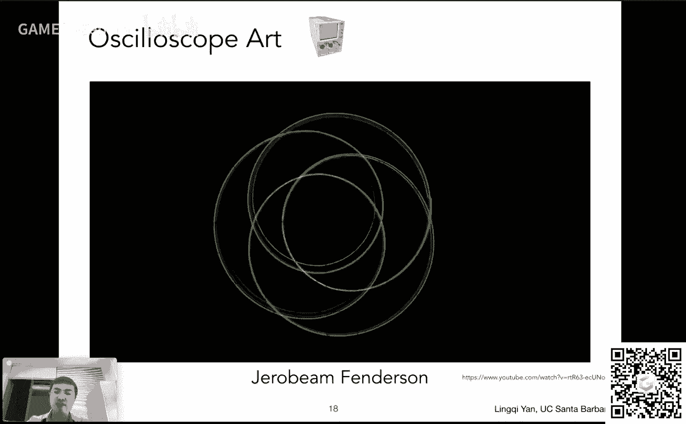
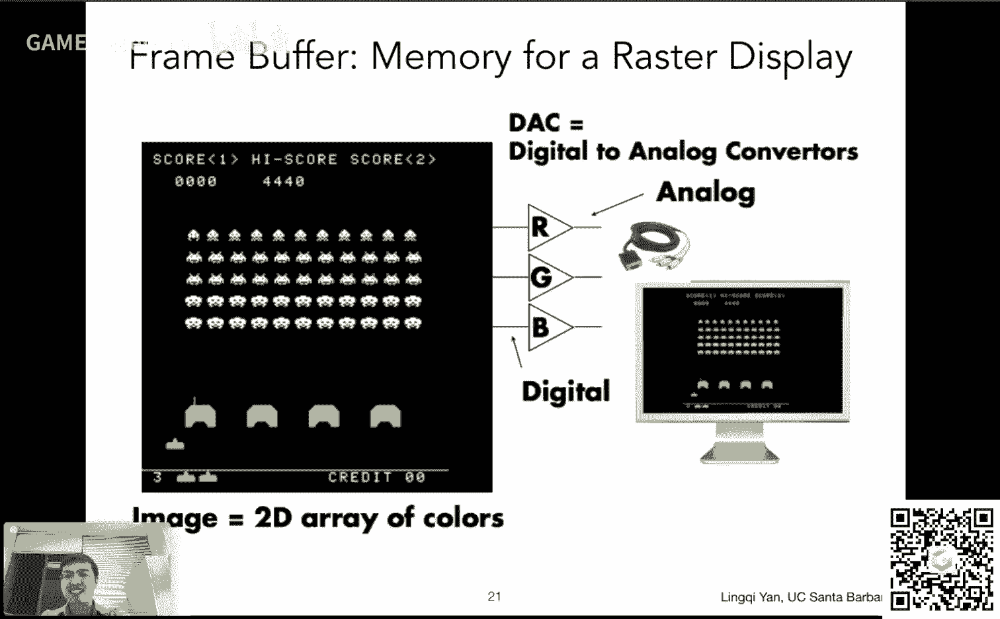
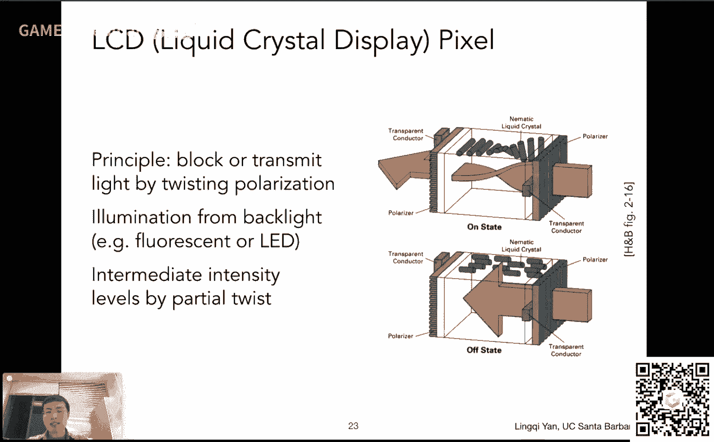
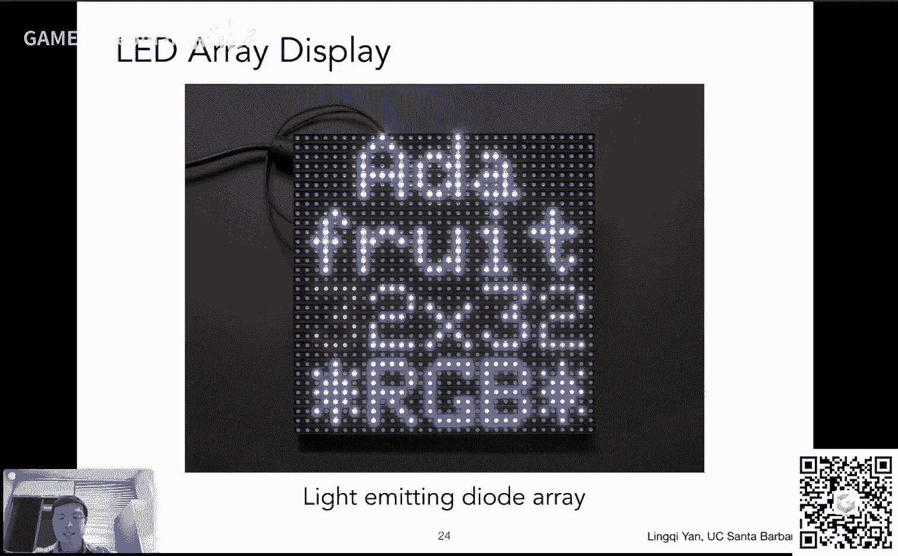
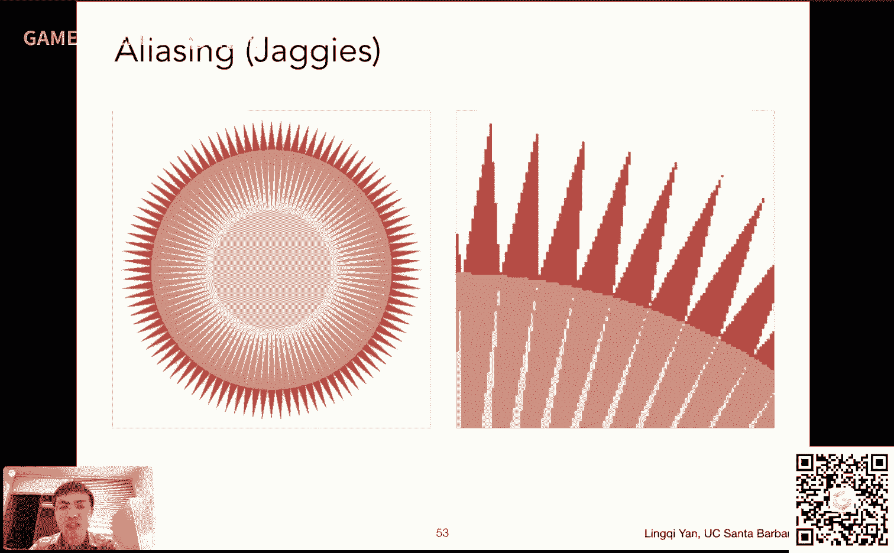
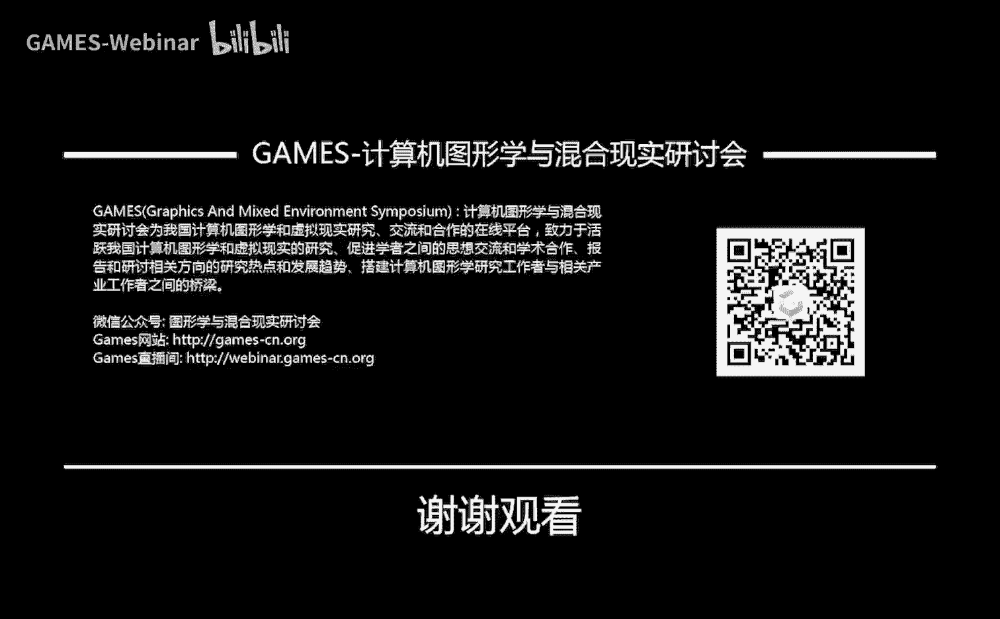

# GAMES101-现代计算机图形学入门-05：光栅化（三角形）📐

在本节课中，我们将学习如何将经过一系列变换后、位于标准立方体（-1到1的三次方）内的三维物体，最终绘制到二维屏幕上。这个过程的核心步骤被称为**光栅化**。我们将从定义屏幕空间开始，逐步讲解如何通过采样方法判断像素与三角形的关系，从而完成三角形的光栅化。

---

## 课程概述与回顾

上一节课我们介绍了观测变换，包括模型变换、视图变换和投影变换。经过这些变换后，场景中的所有物体都被映射到一个标准的**规范化立方体**（Canonical Cube）中，其坐标范围在x、y、z三个轴上均为-1到1。

那么，下一步就是将这个立方体内的物体画到屏幕上。本节课，我们就来探讨这个“画到屏幕上”的过程——**光栅化**。我们将聚焦于如何将三角形这种基础图元转换为屏幕上的像素。

---

## 屏幕空间的定义 🖥️

在开始光栅化之前，我们需要明确定义什么是“屏幕”。

*   对于图形学而言，**屏幕**可以抽象为一个二维数组，数组中的每个元素称为一个**像素**（Pixel）。
*   屏幕的**分辨率**（如1920x1080）指明了这个二维数组的宽度和高度。
*   我们将屏幕空间视为一个坐标系：
    *   原点 `(0, 0)` 定义在屏幕的**左下角**。
    *   X轴正方向向右，Y轴正方向向上。
*   每个像素可以用整数坐标 `(x, y)` 来索引，其中 `x` 的范围是 `[0, width-1]`，`y` 的范围是 `[0, height-1]`。
*   像素本身是一个小方块，其**中心点**的坐标是 `(x + 0.5, y + 0.5)`。
*   因此，整个屏幕空间覆盖的连续区域是：X轴从 `0` 到 `width`，Y轴从 `0` 到 `height`。

---

## 视口变换 🔄

现在，我们有了标准立方体（-1到1）和定义好的屏幕空间（0到width，0到height）。连接这两者的桥梁就是**视口变换**。

视口变换的目标，是将标准立方体的x和y坐标（暂时忽略z坐标）从范围 `[-1, 1]` 线性映射到屏幕空间的范围 `[0, width]` 和 `[0, height]`。

这个变换可以分解为两步：
1.  **缩放**：将 `[-1, 1]` 的范围（总长度为2）缩放到屏幕的宽度和高度。
    *   X方向缩放因子：`width / 2`
    *   Y方向缩放因子：`height / 2`
2.  **平移**：将缩放后的中心点（原本在(0,0)）平移到屏幕中心 `(width/2, height/2)`。

将这两步结合，可以得到视口变换矩阵：

```
M_viewport = [[width/2, 0, 0, width/2],
              [0, height/2, 0, height/2],
              [0, 0, 1, 0],
              [0, 0, 0, 1]]
```

应用这个矩阵后，物体在x-y平面上的投影就位于屏幕空间中了。

---

## 为什么是三角形？🔺

在光栅化中，我们通常处理的基本图元是**三角形**。这是因为三角形具有许多优良性质：


*   **基础性**：三角形是最简单的多边形，任何复杂的多边形都可以被分解为多个三角形。
*   **平面性**：给定三个顶点，它们必然确定一个唯一的平面，不会出现四边形可能存在的非共面问题。
*   **清晰的内外定义**：判断一个点是否在三角形内部有明确且高效的算法（例如使用叉积）。
*   **插值属性**：在三角形内部，任何点的属性（如颜色、纹理坐标）都可以通过三个顶点的属性进行平滑插值得到（后续课程会详细讲解重心坐标插值）。



---

## 光栅化：采样方法 📊

光栅化的核心任务，是确定屏幕上的哪些像素应该被“点亮”以表示一个给定的三角形。最直接的方法是通过**采样**。

**采样**，简单来说，就是将一个连续函数在离散点上的值求出来。在图形学中，采样无处不在。


对于三角形光栅化，我们定义这样一个函数：
```
inside(triangle, x, y)
```
这个函数接收一个三角形和屏幕空间中的一个点坐标 `(x, y)`，返回 `1` 如果该点在三角形内部，否则返回 `0`。

那么，光栅化过程就转化为：**对屏幕空间内所有像素的中心点，采样这个 `inside` 函数**。



以下是实现这一过程的伪代码：
```python
for y in range(0, screen_height):
    for x in range(0, screen_width):
        if inside(triangle, x + 0.5, y + 0.5): # 判断像素中心点
            framebuffer[y][x] = triangle_color # 设置帧缓冲区颜色
        else:
            framebuffer[y][x] = background_color
```

---



## 判断点是否在三角形内 📐



上一节提到的 `inside` 函数如何实现？我们可以利用向量的**叉积**性质。

给定三角形顶点 `P0`, `P1`, `P2`（按一定顺序，例如逆时针排列）和待测试点 `Q`，可以进行如下判断：

1.  计算向量 `P0P1` 与 `P0Q` 的叉积。
2.  计算向量 `P1P2` 与 `P1Q` 的叉积。
3.  计算向量 `P2P0` 与 `P2Q` 的叉积。

如果 `Q` 点在三角形内部，那么上述三个叉积结果的**Z分量符号应该相同**（同为正或同为负，取决于顶点顺序）。如果符号不同，则 `Q` 点在三角形外部。

> **关于边界**：如果一个点恰好落在三角形的边上，可以自行定义规则处理（例如算作内部）。在成熟的图形API（如OpenGL）中有更严格的规定，但本课程中不做强制要求。

---

## 优化：使用包围盒 🎯

上述采样方法遍历了屏幕上的每一个像素，效率很低。一个三角形通常只覆盖屏幕的一小部分。

因此，一个常见的优化是使用**轴向对齐包围盒**（Axis-Aligned Bounding Box, AABB）。我们首先找出三角形三个顶点在x和y方向上的最小值和最大值：
```
x_min = min(P0.x, P1.x, P2.x)
x_max = max(P0.x, P1.x, P2.x)
y_min = min(P0.y, P1.y, P2.y)
y_max = max(P0.y, P1.y, P2.y)
```
这个由 `(x_min, y_min)` 和 `(x_max, y_max)` 定义的矩形区域，就是三角形可能覆盖的像素范围。我们只需要在这个矩形区域内进行采样循环即可，大大减少了需要判断的像素数量。

---

## 光栅化的结果与问题：锯齿 🔍

按照上述方法对三角形进行光栅化，我们得到的图像并非完美的三角形，而是带有明显**锯齿**（Jaggies）的图形。

这是因为：
1.  **像素是离散的**：屏幕由有限个、不连续的小方块（像素）组成。
2.  **采样率不足**：我们用像素中心点进行采样，相当于以屏幕分辨率对连续的三角形信号进行采样。当信号变化剧烈（如三角形边缘）时，过低的采样率会导致信息丢失，在视觉上表现为锯齿。

这种现象在信号处理中被称为**走样**（Aliasing）。解决走样问题是图形学中的一个重要课题，即**反走样**（Antialiasing）或**抗锯齿**。我们将在下一节课中深入探讨其原理和解决方法。

---

## 其他显示设备简介（补充知识） 📺

除了常见的LCD/LED屏幕，历史上还有其他类型的光栅显示设备：
*   **CRT（阴极射线管）**：通过电子束轰击荧光屏来成像，采用逐行或隔行扫描的方式绘制图像。
*   **电子墨水屏**：通过电压控制黑白颗粒的朝向显示内容，优点是视觉舒适、省电，缺点是刷新率极低。

此外，实际屏幕的像素结构可能比“均匀小方块”更复杂。例如：
*   手机屏幕的单个像素可能由红、绿、蓝三个子像素条并列构成。
*   一些相机传感器或屏幕采用**拜耳阵列**（Bayer Pattern），其中绿色感光元件的数量多于红色和蓝色，这是因为人眼对绿色最为敏感。

---

## 课程总结

本节课我们一起学习了光栅化的基础流程：

1.  **定义屏幕空间**：将屏幕视为二维像素数组，并建立坐标系。
2.  **进行视口变换**：将标准化立方体中的物体投影映射到屏幕空间。
3.  **理解三角形的重要性**：因其简单、平面、易判断内外等优点，成为光栅化的基本图元。
4.  **掌握光栅化核心——采样**：通过判断每个像素中心点是否在三角形内，来决定是否绘制该像素。
5.  **实现点-in-三角形判断**：利用向量叉积的符号一致性进行高效判断。
6.  **引入优化方法**：使用轴向对齐包围盒（AABB）来大幅减少需要采样的像素数量。
7.  **认识光栅化的问题**：由于离散像素和有限采样率，会产生锯齿（走样）现象。






我们成功地将三维变换后的三角形“画”到了屏幕上，尽管结果存在锯齿。下一节课，我们将深入分析锯齿产生的原因（从信号采样的角度），并学习如何抗锯齿，以获得更平滑、更高质量的图像。