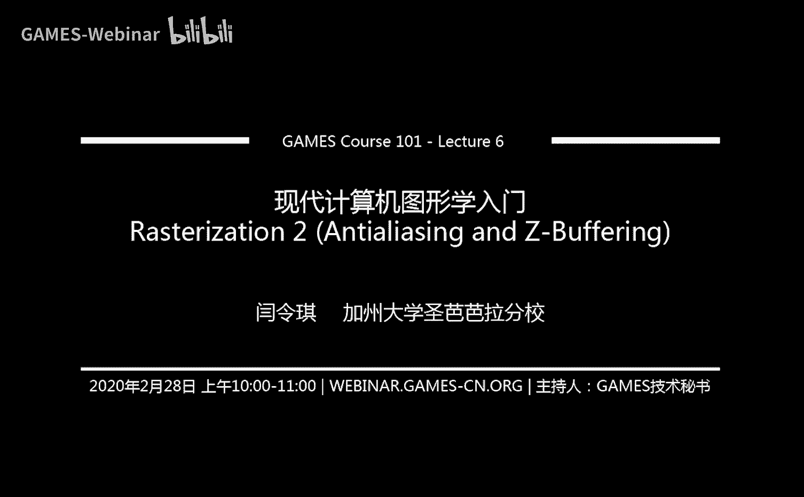

# GAMES101-现代计算机图形学入门-闫令琪 - P6：Lecture 06 光栅化2（反走样与深度缓冲）📐

在本节课中，我们将要学习光栅化技术的两个核心部分：反走样（Antialiasing）和深度缓冲（Z-Buffering）。我们将从分析锯齿现象的成因开始，引入信号处理中的采样理论，并最终讲解如何在图形学中实现反走样效果。

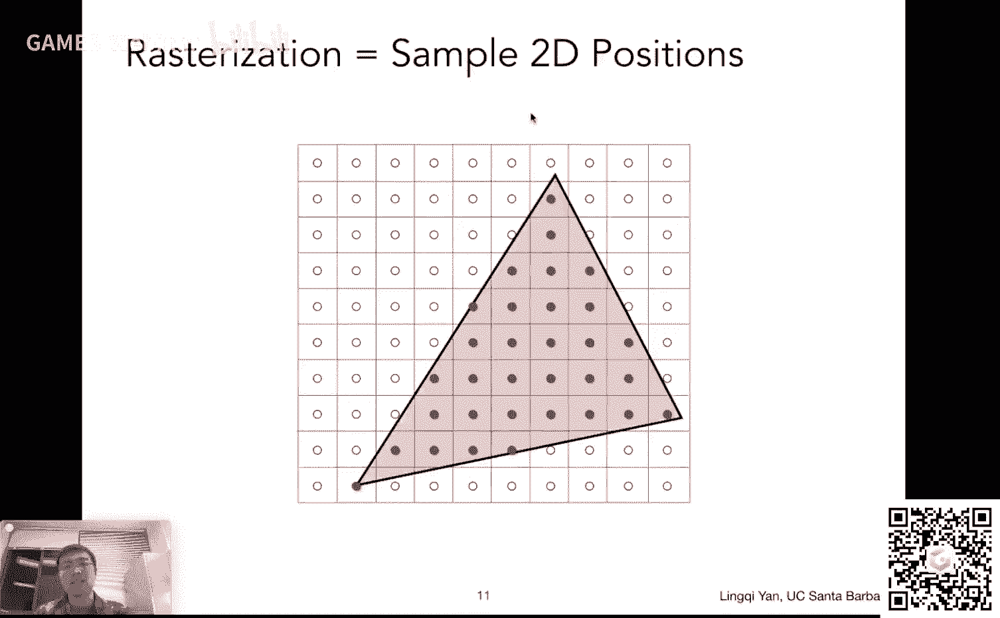

上一讲我们介绍了光栅化的基本概念，即利用像素中心对屏幕空间中的三角形进行采样。本节中，我们来看看这种采样方法会带来什么问题，以及如何解决。

## 采样与走样问题

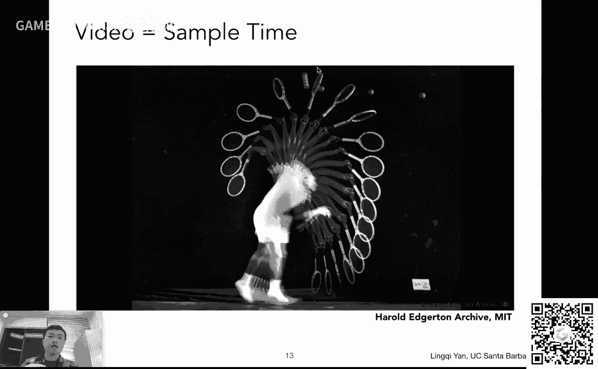

采样在图形学中广泛存在。光栅化过程就是在屏幕空间用一系列离散的点（像素中心）对“是否在三角形内”这个函数进行采样。

采样不仅发生在空间上，也发生在时间上。例如，视频或动画就是一系列在时间点上采样的静态图像。

采样会带来一系列我们不希望看到的结果，这些结果在图形学中被称为 **Artifacts**（瑕疵）。以下是几种常见的采样Artifacts：

*   **锯齿（Jaggies）**：在三角形边缘等地方出现的楼梯状图案。
*   **摩尔纹（Moiré Patterns）**：当用相机拍摄显示器等规则纹理时出现的扭曲条纹。
*   **车轮效应（Wagon Wheel Effect）**：高速旋转的物体在视频中看起来像是在反向旋转，这是时间采样跟不上运动速度导致的。

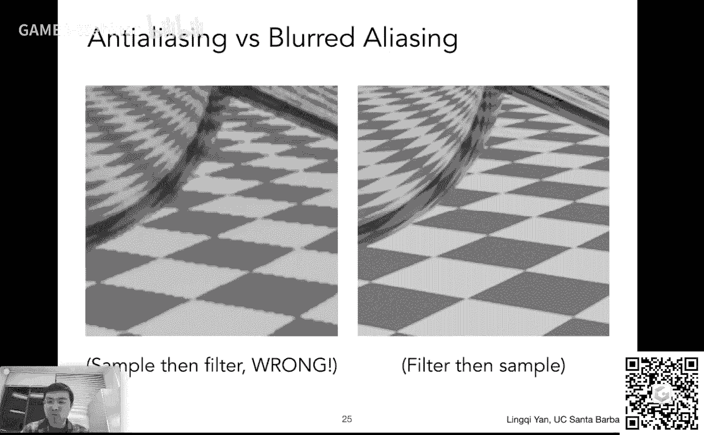

这些Artifacts的本质是 **走样（Aliasing）**。其根本原因是**信号（图像内容）的变化速度超过了采样的速度**，导致采样结果无法准确还原原始信号。

## 反走样的基本思路

如何解决走样问题？一个直观的思路是：**在采样之前，先对信号进行模糊（滤波）处理**。

对比两种操作顺序：
*   **先模糊，再采样**：这是正确的反走样（Antialiasing）方法。
*   **先采样，再模糊**：这只能得到模糊后的走样结果（Blurred Aliasing），无法消除锯齿。

为什么顺序如此重要？我们需要从频率的角度来理解。

## 从频率理解走样

为了分析走样，我们引入信号处理中的频率概念。一个函数变化越快，其频率越高。

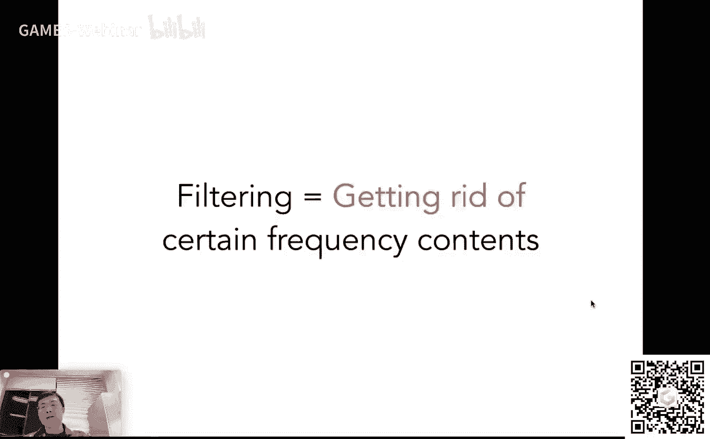

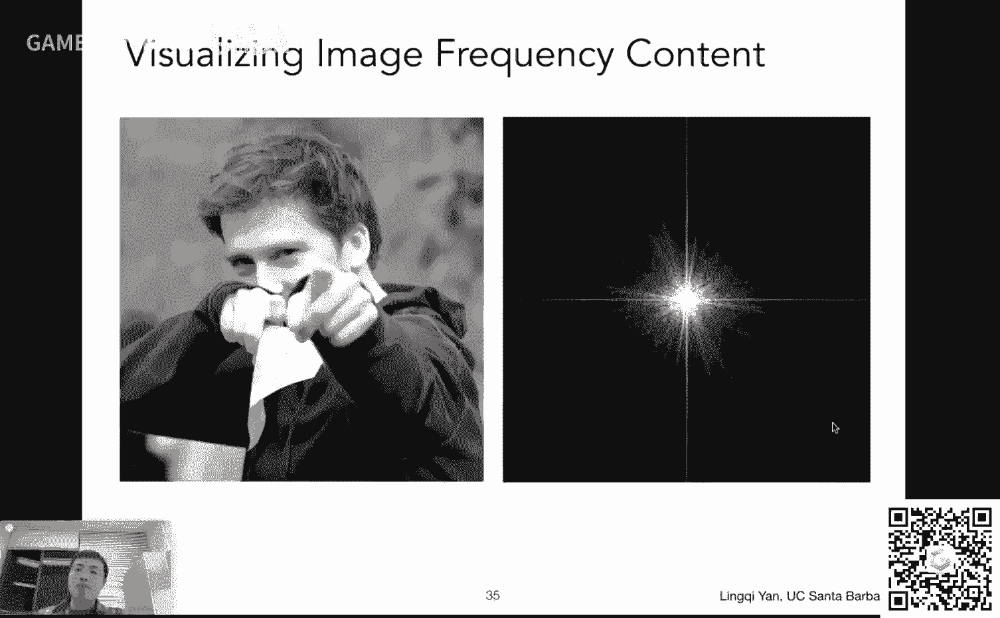

任何函数都可以通过**傅里叶级数展开**表示为一系列不同频率的正弦和余弦函数的和。而**傅里叶变换**则可以将一个函数从**时域（或空间域）转换到频域**，让我们看到信号中各个频率成分的分布。

对于一张图像，其傅里叶变换后的频谱图中心代表低频信息（图像大面积的色块），外围代表高频信息（图像的边缘和细节）。

**滤波（Filtering）** 就是从频率上移除特定频率成分的操作。例如：
*   **低通滤波（Low-pass Filtering）**：移除高频，只保留低频，结果是图像变模糊。
*   **高通滤波（High-pass Filtering）**：移除低频，只保留高频，结果是得到图像的边缘。

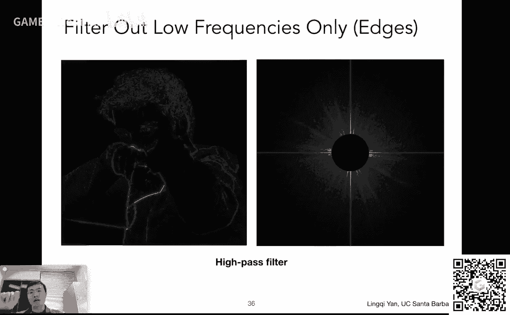

在时域/空间域中，**滤波操作等价于卷积（Convolution）操作**。卷积的数学定义是：一个函数（信号）与另一个函数（滤波器/卷积核）进行加权平均。例如，用一个3x3的盒状滤波器对图像每个像素及其周围像素求平均，就是对图像进行低通滤波（模糊）。

卷积有一个重要定理：**时域中的卷积，等于频域中的乘积**。反之，时域中的乘积，等于频域中的卷积。

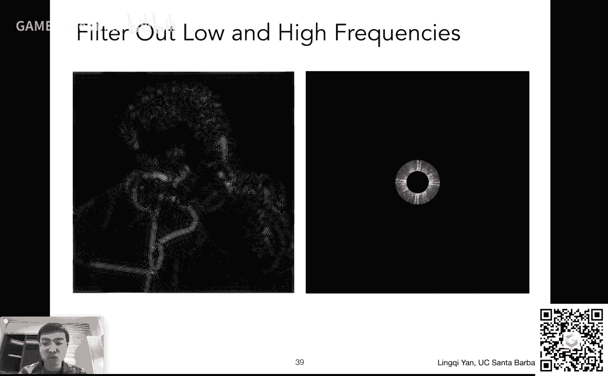

## 采样在频域中的意义

采样操作，在时域中相当于原始信号与一系列冲击函数（只在采样点有值）相乘。

根据卷积定理，时域的乘积对应频域的卷积。因此，**采样在频域中的效果，是将原始信号的频谱进行周期性的复制和平移**。

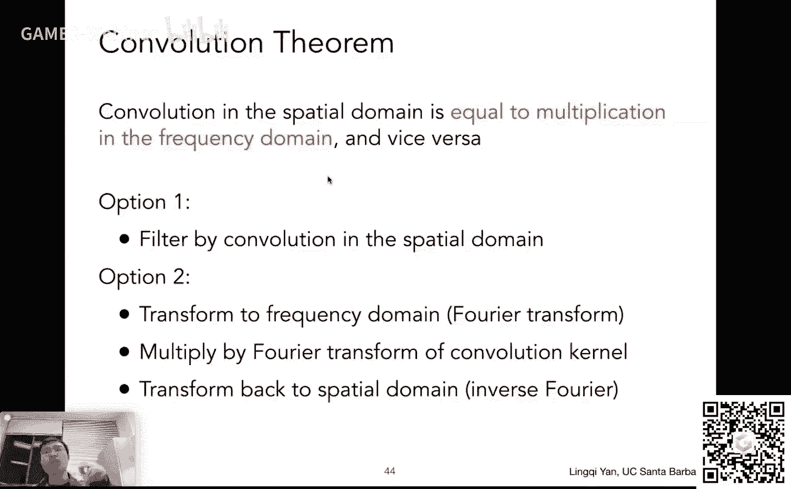

走样（Aliasing）在频域中的表现就是：**由于采样率不足，复制平移后的频谱间隔太小，导致不同复制体之间的频谱发生了混叠（Overlap）**。这种混叠使得我们从采样结果中无法区分原始的高频信号，从而产生了视觉上的瑕疵。

## 反走样的频域解释与实现

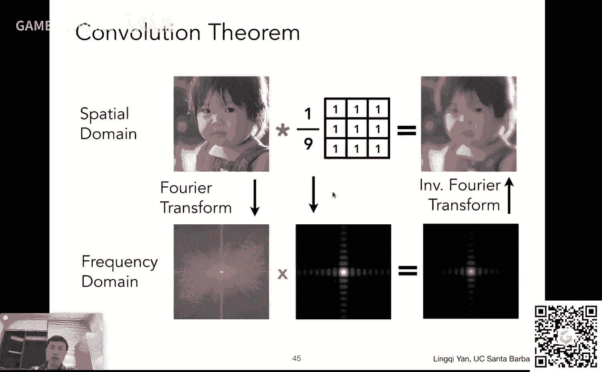

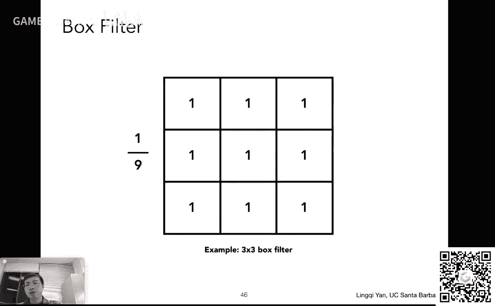

理解了走样的频域成因，反走样的策略就清晰了：**在采样之前，用一个低通滤波器移除信号中过高（超过采样率一半）的频率成分**。

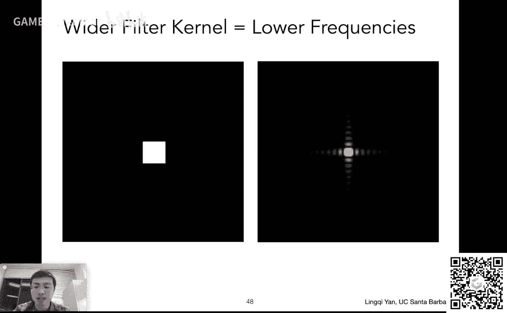

这样，处理后的信号频谱变窄，即使以相同的采样率进行采样，复制平移后的频谱也不会发生混叠。这就是“先模糊，再采样”在理论上的正确性。

在实际的光栅化中，如何对一个三角形进行“模糊”呢？理想情况是，对于每个像素，计算三角形覆盖该像素区域的精确面积比例（覆盖率）。这个覆盖率就是对该像素进行低通滤波（求平均）后的结果。

然而，精确计算三角形与像素的相交面积比较困难。图形学中常用一种高效的近似方法：**超采样抗锯齿（MSAA, Multi-Sample Anti-Aliasing）**。

## MSAA：一种实用的反走样方法

MSAA的核心思想是：**用一个像素内多个采样点的结果，来近似三角形在该像素内的覆盖率**。

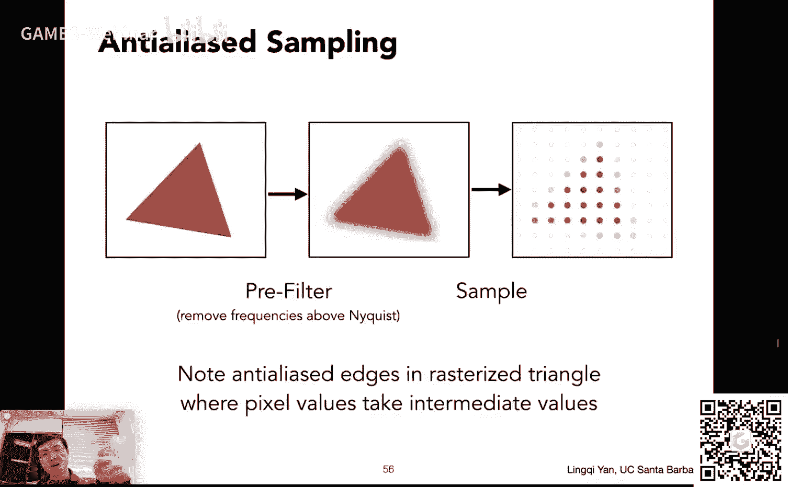

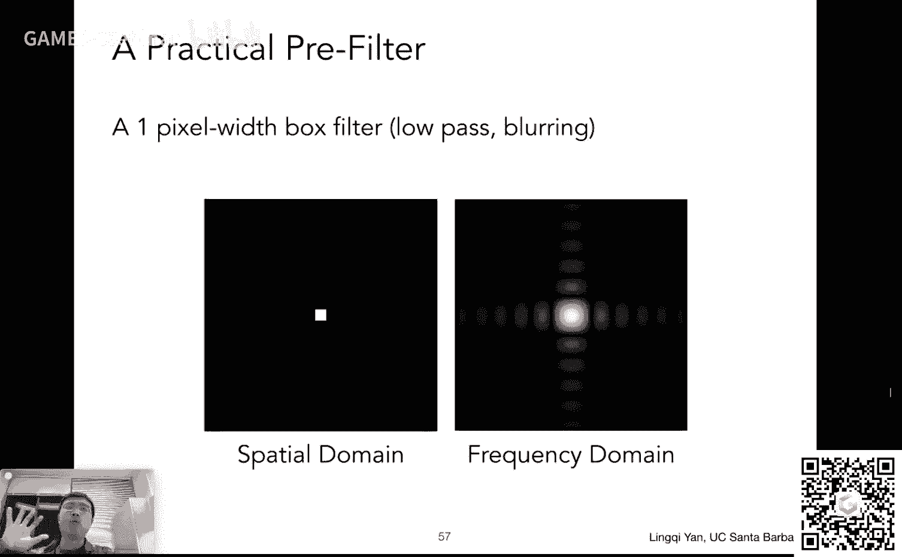

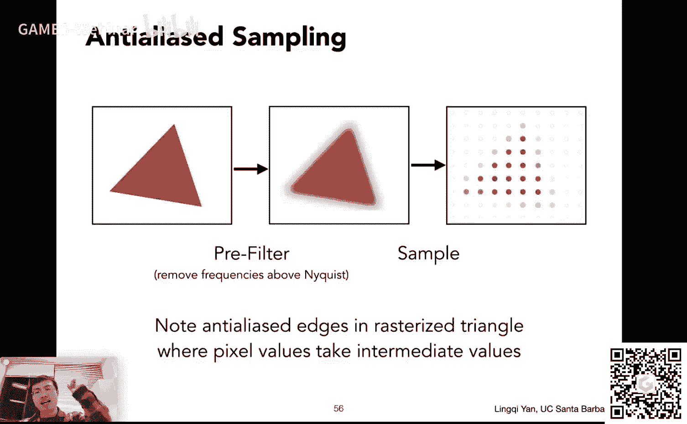

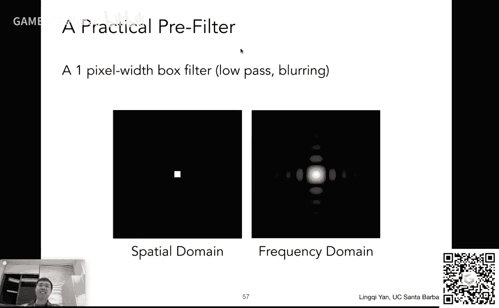

以下是MSAA的工作步骤：
1.  将每个像素划分为更小的子像素（例如2x2，4x4）。
2.  判断每个子像素的中心点是否在三角形内。
3.  计算在三角形内的子像素点数量占总子像素点数量的比例，作为该像素的覆盖率（颜色值）。
4.  最终像素的颜色 = 三角形颜色 * 覆盖率 + 背景色 * (1 - 覆盖率)。

**请注意**：MSAA并没有提高最终显示图像的分辨率，它只是通过增加采样点来更准确地估计每个像素的颜色值（即完成“模糊”步骤）。采样步骤依然是对每个大像素输出一个颜色值。

MSAA会增加计算量（需要计算更多点是否在三角形内），但工业界会通过优化采样点分布、复用相邻像素采样点等技巧来提升效率。

## 其他抗锯齿技术简介

除了MSAA，工业界还广泛应用其他抗锯齿技术：
*   **FXAA (Fast Approximate Anti-Aliasing)**：一种后处理技术。先得到有锯齿的图像，然后通过图像处理快速识别并平滑锯齿边缘。速度快，与采样无关。
*   **TAA (Temporal Anti-Aliasing)**：时间性抗锯齿。复用上一帧的采样信息，将MSAA的采样点分布到时间轴上，在当前帧几乎不增加额外计算量，但对运动物体需要特殊处理。

此外，**超分辨率（Super Resolution）** 技术（如DLSS）与抗锯齿有相似本质，都是解决样本不足的问题，但它旨在从低分辨率图像重建高分辨率图像。

---

本节课中我们一起学习了光栅化中反走样技术的原理与实现。我们从锯齿现象出发，深入探讨了采样理论、频率分析、傅里叶变换和卷积，从而理解了走样的根本原因在于频谱混叠。反走样的核心是在采样前进行低通滤波（模糊），而MSAA是这一思想在光栅化中的高效近似实现。理解这些概念对于掌握现代图形学至关重要。

（注：由于课程内容较长，深度缓冲（Z-Buffering）部分将在下一讲中详细介绍。）

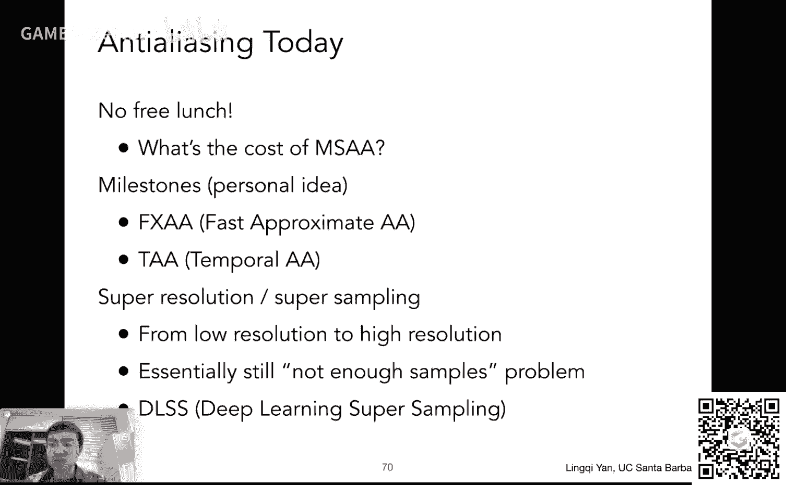

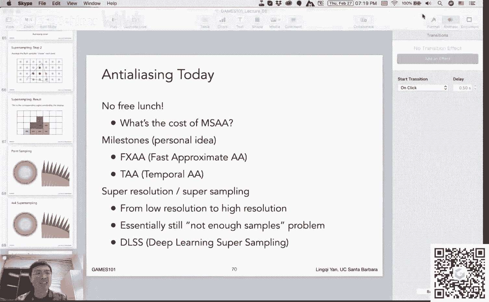

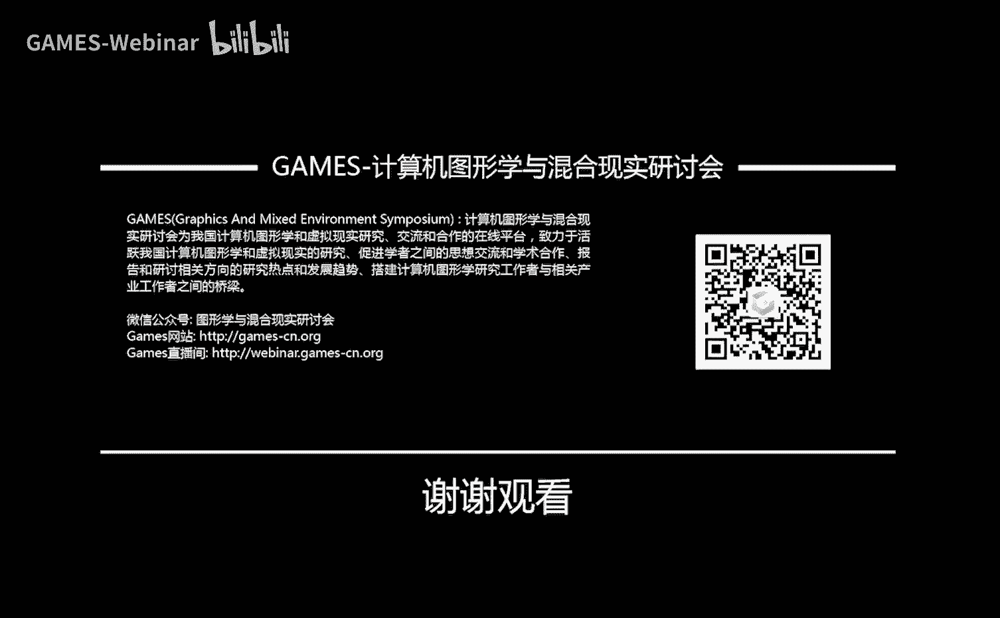

