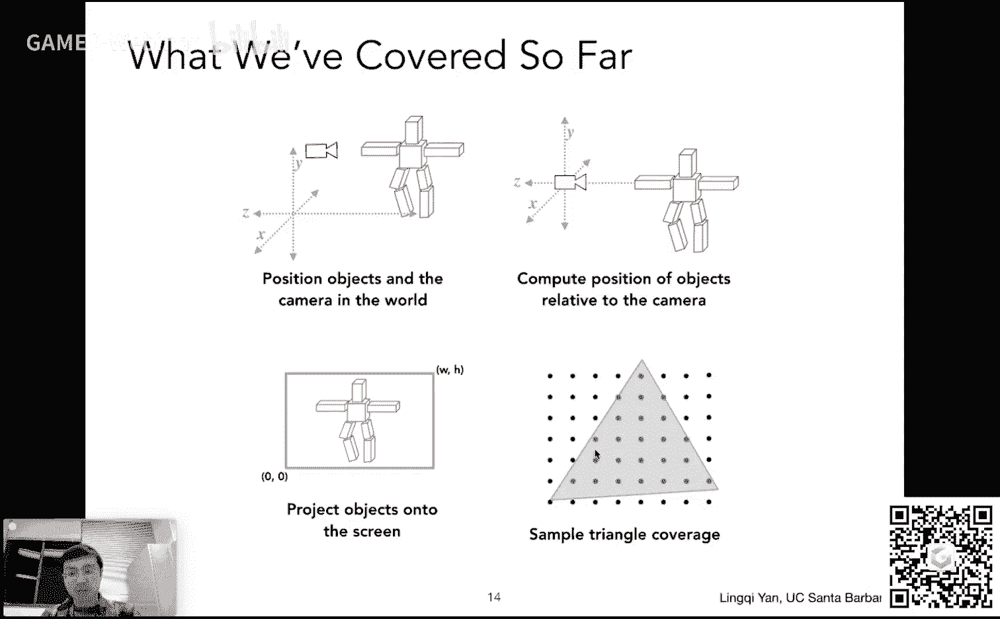

# GAMES101-现代计算机图形学入门-闫令琪 - P7：Lecture 07 Shading 1 (Illumination, Shading and Graphics Pipeline) 🎨

在本节课中，我们将要学习图形学中的着色基础。我们将从光栅化的最后一个环节——深度测试开始，然后进入着色的核心概念，包括光照模型和图形管线的基本流程。课程内容将分为深度缓存算法和着色模型（以漫反射为例）两部分进行讲解。

## 深度缓存（Z-Buffering）算法 🧱

上一节我们介绍了如何将单个三角形光栅化到屏幕上。本节中我们来看看当场景中有多个三角形相互遮挡时，如何正确地处理它们的可见性顺序。

### 画家算法及其局限性

一个直观的想法是模仿画家作画的过程：先画远处的物体，再画近处的物体覆盖远处的物体。这种方法被称为画家算法（Painter‘s Algorithm）。

画家算法在一定情况下是适用的，例如绘制一个立方体时，可以先画背面，再画侧面，最后画正面。然而，当多个三角形在深度上形成循环遮挡关系时（例如三角形A遮挡B，B遮挡C，C又遮挡A），就无法定义一个明确的绘制顺序，画家算法就会失效。

### 深度缓存算法原理


为了解决上述问题，图形学中广泛采用了深度缓存（Z-Buffering）算法。该算法的核心思想是：**为每个像素单独维护一个深度值，记录当前该像素所看到的最浅（离相机最近）的几何深度**。

算法需要同步维护两个缓冲区：
*   **帧缓冲区（Frame Buffer）**：存储最终渲染出的图像颜色。
*   **深度缓冲区（Depth Buffer / Z-Buffer）**：存储每个像素当前看到的最浅深度值。初始化时，所有深度值设为无穷大。


以下是深度缓存算法的伪代码流程：

```cpp
// 初始化
for (each pixel in screen) {
    depth_buffer[pixel] = INFINITY; // 深度设为无穷大
    frame_buffer[pixel] = background_color; // 颜色设为背景色
}

// 光栅化每个三角形
for (each triangle T in scene) {
    for (each pixel (x, y) covered by T) {
        // 计算三角形T在当前像素(x, y)处的深度值z
        z = compute_depth(T, x, y);
        // 深度测试：如果新深度比缓存深度更浅（更近）
        if (z < depth_buffer[x, y]) {
            // 更新深度缓存
            depth_buffer[x, y] = z;
            // 更新帧缓存，绘制该三角形的颜色
            frame_buffer[x, y] = T.color_at(x, y);
        }
    }
}
```

### 深度缓存算法示例

我们通过一个简单例子来理解算法过程。假设屏幕上有两个三角形：红色三角形和蓝色三角形。

1.  **初始化**：所有像素深度值为无穷大（∞）。
2.  **处理红色三角形**：遍历其覆盖的像素。例如，在某个像素上，红色三角形深度为5，小于当前深度值∞。因此，更新该像素的深度为5，并将颜色设为红色。
3.  **处理蓝色三角形**：同样遍历其覆盖的像素。
    *   在某个像素上，蓝色三角形深度为8，而深度缓存中已记录深度为5（来自红色三角形）。因为8 > 5，所以蓝色三角形在该像素被遮挡，不做任何更新。
    *   在另一个像素上，蓝色三角形深度为3，而深度缓存中记录为5。因为3 < 5，所以蓝色三角形更近。于是更新该像素深度为3，并将颜色更新为蓝色。

通过这种**逐像素比较并保留最小深度**的方法，无论以何种顺序处理三角形，最终都能得到正确的遮挡结果。该算法的时间复杂度为O(n)，其中n为三角形数量（假设每个三角形覆盖常数个像素）。

### 深度缓存的补充说明

*   **与顺序无关性**：深度缓存算法的结果与处理三角形的顺序无关（假设不会出现两个深度值完全相等的情况）。
*   **浮点数精度**：在实际应用中，深度值通常用浮点数表示。由于浮点数精度问题，两个计算出的深度值几乎不可能完全相等，这在一定程度上避免了深度相等时的歧义。
*   **透明物体**：标准的深度缓存算法无法正确处理半透明物体的混合，需要特殊处理。
*   **与MSAA结合**：在使用多重采样抗锯齿（MSAA）时，深度测试和存储需要在每个子采样点（而不仅仅是像素中心）上进行。



至此，我们完成了对光栅化中可见性问题的探讨。接下来，我们将进入本节课的核心主题——着色。


## 着色（Shading）基础与漫反射模型 💡

将几何图形正确绘制到屏幕上后，我们需要决定每个像素的颜色。这个过程就是着色。着色主要研究**光照如何与物体材质相互作用**，从而让我们看到丰富多彩、具有明暗变化的图像。

### 着色的定义与假设

在图形学中，我们定义着色为**对不同物体应用不同材质的过程**。本节课介绍的是一种局部着色模型（Local Shading Model），它有两个重要假设：
1.  只考虑着色点本身，不考虑其他物体的存在（即**不考虑阴影**）。
2.  着色点的颜色只与光源、观察方向、该点表面属性有关。

### Blinn-Phong反射模型概述

我们将以一个经典的、经验性的着色模型——Blinn-Phong模型为例进行讲解。该模型将光照效果简化为三个部分的叠加：
1.  **漫反射（Diffuse）**：模拟粗糙表面将光线均匀反射到各个方向的效果。
2.  **高光反射（Specular）**：模拟光滑表面在镜面反射方向附近形成亮斑的效果。
3.  **环境光（Ambient）**：模拟间接光照，为物体未被直接照亮的部分提供一个基础亮度。

本节课我们先详细讲解漫反射部分。

### 漫反射（Diffuse）项详解


漫反射的特点是：光线照射到粗糙表面后，会向所有方向均匀散射。因此，**观察者从不同方向看同一个漫反射点，其亮度是相同的**。漫反射的亮度主要取决于两个因素：**光照方向与表面法线的夹角**，以及**光线传播的距离**。


为了定量计算，我们需要定义一些向量（均为单位向量）：
*   **表面法线（n）**：垂直于着色点所在微小表面的方向。
*   **光照方向（l）**：从着色点指向光源的方向。
*   **观察方向（v）**：从着色点指向相机的方向（漫反射计算中暂时用不到）。

#### 兰伯特余弦定律（Lambert‘s Cosine Law）

着色点单位面积接收到的光线能量，与光照方向 **l** 和表面法线 **n** 夹角的余弦值成正比，即与 **n · l** 的点乘结果成正比。
*   当光线垂直照射（**l** 与 **n** 同向）时，**n · l = 1**，接收能量最大。
*   当光线平行于表面（**l** 与 **n** 垂直）时，**n · l = 0**，接收能量为0。
*   如果点乘结果为负（光线从表面下方射入），则没有光照贡献，取值为0。

因此，接收到的能量比例可用 `max(0, n·l)` 表示。

#### 平方反比衰减（Inverse Square Law）

光线从点光源发出，在空间中传播。根据能量守恒，在任意时刻，光能量均匀分布在一个球壳上。因此，单位面积接收到的光强 **I** 与距离 **r** 的平方成反比：`I’ = I / r²`，其中 **I** 是光源在单位距离处的强度。

#### 漫反射公式

结合以上两点，并引入**漫反射系数 kd**（一个三维向量，代表表面颜色，即对不同波长光线的吸收率），我们得到Blinn-Phong模型的漫反射项公式：

**漫反射颜色 = kd * (I / r²) * max(0, n·l)**

其中：
*   **kd**：漫反射系数（表面颜色），例如(1.0, 0.0, 0.0)代表红色。
*   **I**：光源在单位距离处的强度。
*   **r**：着色点到光源的距离。
*   **n·l**：表面法线与光照方向的点乘。

这个公式清晰地表明：漫反射的亮度与观察方向 **v** 无关，只与光照方向、距离和表面朝向有关。一个石膏球在点光源照射下，正对光源处最亮，侧面逐渐变暗，正是这一模型的直观体现。

---


本节课中我们一起学习了图形管线中两个关键环节。首先，我们掌握了**深度缓存算法**，它通过为每个像素维护最小深度值，高效且正确地解决了多物体的遮挡问题。然后，我们进入了**着色**领域，详细分析了**Blinn-Phong反射模型中的漫反射项**，理解了表面颜色、光照角度和距离如何共同决定一个点的基本明暗和颜色。下节课我们将继续完成该模型的高光和环境光部分，并对图形管线进行总结。