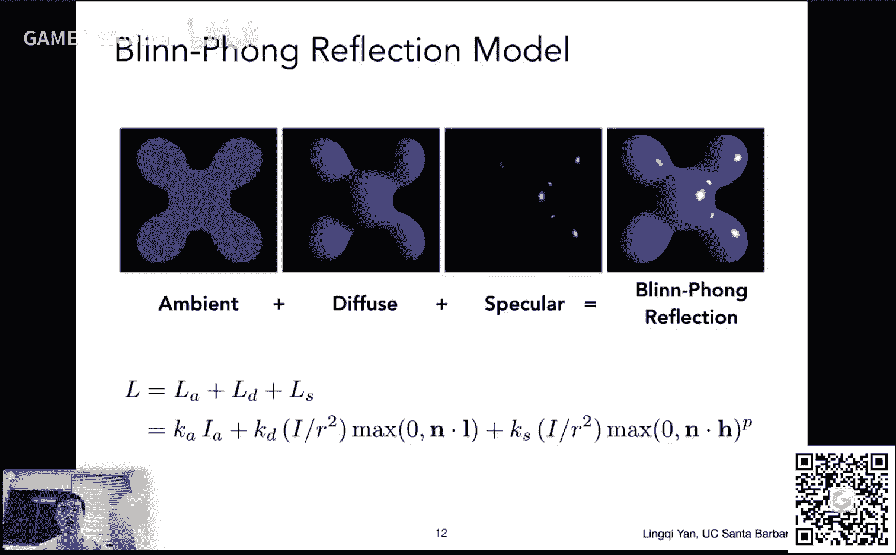

# GAMES101-现代计算机图形学入门-第八课：着色2（着色、管线与纹理映射）🎨

在本节课中，我们将学习着色模型的完整构成，探讨不同的着色频率，了解实时渲染管线的基本流程，并初步认识纹理映射的概念。

---

## 课程概述

上一节我们介绍了着色模型中的漫反射项。本节中，我们将继续学习布林-冯（Blinn-Phong）着色模型的高光项和环境光项，理解如何将着色应用于不同频率（逐三角形、逐顶点、逐像素），并概览从三维场景到二维图像的实时渲染管线。最后，我们将引入纹理映射的基本思想，为后续学习差值方法打下基础。

---

## 布林-冯着色模型详解

布林-冯模型由漫反射、高光和环境光三项组成。我们将逐一分析。

### 高光项（Specular Term）


高光出现在表面光滑的物体上，当观察方向接近镜面反射方向时可见。布林-冯模型使用了一个巧妙的简化：它通过比较**法线向量（n）**和**半程向量（h）**的接近程度来判断高光，而非直接比较观察方向（v）和反射方向（r）。半程向量是光照方向（l）与观察方向（v）的角平分线方向。


**半程向量计算公式：**
`h = bisector(l, v) = (l + v) / ||l + v||`


衡量接近程度使用点乘，并引入指数p来控制高光区域的大小。p值越大，高光越集中。

**高光项公式：**
`L_s = k_s * (I / r^2) * max(0, n·h)^p`
其中，`k_s`是镜面反射系数（通常为白色），`I/r^2`是到达着色点的能量。



### 环境光项（Ambient Term）

环境光用于模拟间接光照，确保场景中没有完全黑色的区域。这是一个极大的简化，假设环境中所有点接收到的环境光强度恒定。

**环境光项公式：**
`L_a = k_a * I_a`
其中，`k_a`是环境光系数，`I_a`是环境光强度。此项与光照方向、观察方向和法线均无关。


### 完整的布林-冯模型

将三项相加，得到完整的着色模型：

**布林-冯模型公式：**
`L = L_a + L_d + L_s = k_a * I_a + k_d * (I / r^2) * max(0, n·l) + k_s * (I / r^2) * max(0, n·h)^p`


该模型能产生具有漫反射、高光，且无纯黑区域的着色效果，类似塑料质感。

---

## 着色频率（Shading Frequency）

着色模型定义了一个点如何着色。接下来我们需要决定将着色计算应用在哪些“点”上，这就是着色频率。

以下是三种主要的着色频率：

1.  **Flat Shading（逐三角形着色）**：对每个三角形面计算一次着色（使用其面法线），三角形内部颜色一致。
2.  **Gouraud Shading（逐顶点着色）**：对每个顶点计算一次着色（使用顶点法线），三角形内部颜色通过对顶点颜色插值得到。
3.  **Phong Shading（逐像素着色）**：对每个像素计算一次着色。首先对顶点法线在三角形内进行插值，得到每个像素的法线，再为每个像素单独计算着色。效果最好，计算量也最大。

**顶点法线的计算**：通常取该顶点所关联的所有面的法线的加权平均（如按面积加权）。

选择哪种频率取决于模型复杂度。当三角形足够密集时，Flat Shading也能得到不错的效果；反之，对于简单模型，Phong Shading能显著提升视觉质量。

---

## 实时渲染管线（Real-time Rendering Pipeline）

渲染管线描述了从三维模型到最终屏幕像素的完整操作序列。现代GPU硬件实现了这一管线。

**管线主要阶段：**

1.  **顶点处理（Vertex Processing）**：
    *   输入：三维空间中的顶点。
    *   操作：进行模型变换、视图变换、投影变换（MVP变换），将顶点投影到屏幕空间。
    *   可编程部分：**顶点着色器（Vertex Shader）**，可在此阶段进行顶点着色（如Gouraud Shading）。


2.  **三角形处理与光栅化（Triangle Processing & Rasterization）**：
    *   操作：将屏幕空间中的三角形转换为屏幕上的离散片段（Fragment，可近似理解为像素）。判断哪些像素位于三角形内。
    *   深度测试（Z-Buffering）也在此阶段或紧随其后进行，以解决可见性问题。


3.  **片段处理（Fragment Processing）**：
    *   操作：为每个生成的片段计算最终颜色。
    *   可编程部分：**片段着色器（Fragment/Pixel Shader）**，可在此阶段进行逐像素着色（如Phong Shading）和纹理查询。

4.  **输出合并（Output Merging）**：将片段颜色写入帧缓冲区，最终形成图像。

**着色器（Shader）**：指在GPU上运行的小程序，用于可编程阶段（主要是顶点和片段着色器）。开发者通过编写着色器代码来控制顶点变换和像素着色的具体方式。例如，一个简单的漫反射片段着色器代码如下（GLSL风格）：
```glsl
uniform sampler2D myTexture; // 纹理
uniform vec3 lightDir;       // 光照方向（全局常量）
varying vec2 uv;             // 插值得到的纹理坐标
varying vec3 normal;         // 插值得到的法线

void main() {
    vec3 kd = texture2D(myTexture, uv).rgb; // 从纹理获取漫反射系数
    vec3 n = normalize(normal);
    vec3 l = normalize(lightDir);
    float diffuseIntensity = max(0.0, dot(n, l));
    gl_FragColor = vec4(kd * diffuseIntensity, 1.0); // 输出像素颜色
}
```

现代GPU还支持几何着色器（Geometry Shader）、计算着色器（Compute Shader）等，功能更加强大。


---


## 纹理映射（Texture Mapping）初步

着色模型中的各种系数（如`k_d`）可以不是常数。纹理映射的核心思想是：定义物体表面任意一点的不同属性（如颜色、粗糙度等）。

**基本概念：**
*   **纹理（Texture）**：一张二维图像。
*   **纹理坐标（UV Coordinates）**：用于定位纹理上的点。通常规范化到[0, 1]范围，横轴为U，纵轴为V。
*   **映射（Mapping）**：建立物体表面点（三维）与纹理坐标（二维）的对应关系。

**工作原理：**
1.  对于三维模型的每个顶点，除了位置坐标，还预先指定其对应的纹理坐标`(u, v)`。这通常由建模人员或参数化算法完成。
2.  对于一个三角形，已知其三个顶点的纹理坐标。
3.  对于三角形内部的任意一点，其纹理坐标可以通过其三个顶点的纹理坐标**插值**获得。
4.  根据插值得到的`(u, v)`坐标，去查询纹理图像，获得该点的属性（如颜色），并用于着色计算。


纹理可以重复平铺（Tiling）使用，设计良好的**可平铺纹理（Tileable Texture）**能在边界处无缝衔接。

---


## 课程总结

本节课我们一起学习了：
1.  **完整的布林-冯着色模型**，包括其漫反射、高光和环境光分量的定义与公式。
2.  **着色频率**的概念，比较了逐三角形（Flat）、逐顶点（Gouraud）和逐像素（Phong）着色的区别与适用场景。
3.  **实时渲染管线**的完整流程，理解了从顶点到像素的转换过程，以及顶点着色器和片段着色器的角色。
4.  **纹理映射**的基本原理，即通过UV坐标将二维纹理图像映射到三维物体表面，以定义表面属性的变化。


我们留下了一个核心问题：如何在三角形内部根据顶点属性进行**插值**？这需要用到**重心坐标（Barycentric Coordinates）**的概念，我们将在下节课详细探讨。