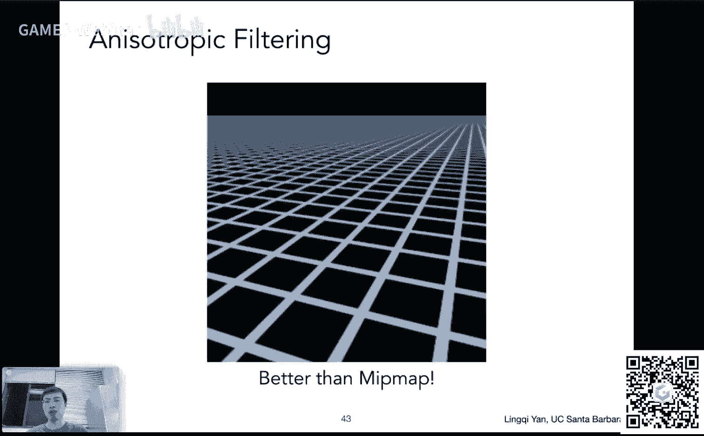

# GAMES101-现代计算机图形学入门-第九讲：着色（三）纹理映射（续）📐

在本节课中，我们将继续学习纹理映射的相关知识。我们将重点探讨如何在三角形内部进行属性插值，以及如何解决纹理映射中出现的“纹理过大”和“纹理过小”问题。通过引入重心坐标、双线性插值、Mipmap和各向异性过滤等概念，我们将学习如何高效、高质量地处理纹理。

---

## 概述

上一讲我们介绍了着色模型和纹理映射的基本概念。本节我们将深入纹理映射的具体实现细节，特别是如何解决纹理采样时遇到的质量问题。我们将从三角形内部的插值方法开始，逐步讲解纹理放大和缩小时的处理技术。

---

## 1. 重心坐标与插值 🔺

在上一节中，我们提到为了在三角形内部实现平滑的着色过渡，需要进行插值。本节中，我们来看看如何利用重心坐标在三角形内部对任意属性进行插值。

### 为什么需要插值？
在图形学中，许多计算（如颜色、法线、纹理坐标）是在三角形的顶点上完成的。为了在三角形内部得到平滑过渡的效果，我们需要根据顶点的值计算出内部任意点的值。

### 插值什么内容？
可以插值的属性包括但不限于：
*   **颜色**：实现顶点颜色在三角形内部的平滑渐变。
*   **纹理坐标 (UV)**：确定三角形内点对应纹理图像上的位置。
*   **法线向量**：用于实现逐像素着色（Phong Shading）。
*   **深度值**：在光栅化过程中进行深度测试。

### 如何插值：重心坐标
重心坐标是定义在三角形上的一套坐标系，用于描述三角形所在平面内任意点的位置。

**定义**：对于三角形ABC所在平面内的任意点(x, y)，都可以表示为三个顶点坐标的线性组合：
`(x, y) = α * A + β * B + γ * C`
其中，系数需满足：`α + β + γ = 1`。

**点在三角形内的条件**：当且仅当所有系数均为非负数时（`α ≥ 0, β ≥ 0, γ ≥ 0`），该点位于三角形内部。

**计算方法**：重心坐标可以通过面积比来计算。以系数α为例：
`α = (A点对面小三角形的面积) / (三角形ABC的总面积)`
同理可计算β和γ。三角形的重心坐标即为(1/3, 1/3, 1/3)。

**插值公式**：已知三角形三个顶点的属性值`V_A, V_B, V_C`，则三角形内任意点（重心坐标为(α, β, γ)）的属性值`V`可通过下式插值得到：
`V = α * V_A + β * V_B + γ * V_C`

**一个重要注意事项**：重心坐标在投影变换下不具备不变性。因此，对于三维空间中的属性（如深度），应在三维空间中进行插值，再将结果映射回屏幕空间，而不是在投影后的二维三角形中直接插值。

---

## 2. 纹理映射的应用 🖼️

了解了插值方法后，我们来看看如何将纹理应用到物体表面。核心思路是：对于屏幕上的每个采样点（如像素中心），利用插值得到其纹理坐标(UV)，然后从纹理图像中查询该坐标处的颜色值。

**基本步骤**：
1.  通过重心坐标，插值出当前像素点对应的纹理坐标(u, v)。
2.  在纹理图像上查询坐标(u, v)处的颜色值。
3.  将此颜色值作为漫反射系数`kd`，代入布林-冯着色模型进行计算，从而得到该像素的最终颜色。

这相当于将纹理图像“贴”在了物体表面，并结合了光照模型产生明暗效果。

---

## 3. 纹理过小与放大问题 🔍

当纹理图像的分辨率低于屏幕渲染分辨率时，纹理会被拉大，导致一个屏幕像素可能对应纹理上的一片区域。如果简单地取最近纹理像素的颜色，会产生明显的块状瑕疵。

### 问题分析
一个屏幕像素覆盖了纹理上的一片连续区域，但我们只采样了一个点（如像素中心映射的点）。当纹理细节变化剧烈时，单点采样无法代表整个区域，导致走样。

### 解决方案：双线性插值
为了提高质量，我们不再寻找最近的单个纹理像素，而是考虑该点周围四个最近的纹理像素，并通过两次线性插值来估算该点的颜色。

**步骤如下**：
1.  对于非整数纹理坐标(u, v)，找到其周围四个最近的纹理像素：`u00, u01, u10, u11`。
2.  计算该点与左下角像素`u00`的水平距离`s`和垂直距离`t`（s, t ∈ [0, 1]）。
3.  进行两次线性插值：
    *   **水平插值**：先用`s`在`u00`和`u10`之间插值得到`u0`；再用`s`在`u01`和`u11`之间插值得到`u1`。
    *   **垂直插值**：再用`t`在`u0`和`u1`之间插值，得到最终的颜色值。

线性插值公式为：`lerp(v0, v1, t) = v0 + t * (v1 - v0)`。

通过双线性插值，像素颜色能够在其覆盖的纹理区域内平滑过渡，有效避免了马赛克现象。更高质量但计算量更大的方法还有**双三次插值**，它使用周围16个像素进行插值。

---

## 4. 纹理过大与缩小问题 🧩

当纹理图像分辨率过高时，一个屏幕像素可能覆盖纹理上的一大片区域。此时，如果用像素中心单点采样，相当于用高频信号中的一个样本来代表整个区域的平均值，会造成严重的走样和摩尔纹。

### 问题本质
这本质上是**信号采样频率不足**导致的走样问题。一个解决方案是超采样（如MSAA），即在像素内进行多次采样再平均，但计算开销巨大。

### 高效方案：Mipmap
Mipmap的核心思想是**避免采样，直接进行快速的范围查询（求平均值）**。它是一种图像金字塔结构。

**Mipmap的构建**：
*   从原始纹理（第0层）开始，每一层图像的长宽都是上一层的一半。
*   第`n`层图像有`(width/2^n) * (height/2^n)`个像素。
*   总层数为`log2(max(width, height))`。
*   额外存储开销仅为原始纹理的**1/3**。

**Mipmap的查询**：
1.  估算屏幕像素在纹理空间中所覆盖区域的近似边长`L`。
2.  计算应在Mipmap的哪一层进行查询：`D = log2(L)`。
3.  在Mipmap的第`D`层图像上，查询对应纹理坐标处的像素值。由于第`D`层的一个像素恰好代表了原始纹理中`L×L`区域的平均值，因此这次查询就快速得到了范围查询的结果。

**三线性插值**：
直接查询离散的`D`层可能导致层与层之间出现不连续的跳跃。为了解决这个问题，我们进行**三线性插值**：
1.  在`D`的上下两层（如`floor(D)`层和`ceil(D)`层）分别进行**双线性插值**，得到两个颜色值`Color_low`和`Color_high`。
2.  再用`D`的小数部分在`Color_low`和`Color_high`之间进行一次**线性插值**，得到最终颜色。

三线性插值在层内和层间都实现了平滑过渡，是游戏中广泛应用的技术。

**Mipmap的局限性**：它只能快速进行**正方形区域**的近似范围查询。当像素覆盖的纹理区域是细长的矩形时，用正方形去近似会取到过多无关区域的平均值，导致过度模糊。

---

## 5. 各向异性过滤 ⚖️

为了改善Mipmap在处理矩形区域时的过度模糊问题，引入了各向异性过滤。

**核心思想**：除了构建标准的Mipmap（对角线压缩），还额外预计算一系列在水平或垂直单一方向上压缩的纹理链。
*   这样，对于一个在纹理空间中是`2x8`的矩形区域，我们可以直接在水平压缩2倍、垂直压缩8倍的特定层级纹理上进行快速查询，从而得到更准确的平均值。

**效果与开销**：
*   各向异性过滤能显著改善远处或倾斜表面的纹理清晰度。
*   其存储开销约为原始纹理的**3倍**，但现代显卡显存通常足以承受。
*   它仍然不能完美处理所有不规则形状的区域，更高级的方法如**EWA过滤**通过多次圆形查询来覆盖不规则形状，但计算成本更高。

在游戏中，开启各向异性过滤（如16x）能大幅提升纹理质量，而对性能影响很小，因此建议在显存足够时开启。

---

## 总结

本节课我们一起深入学习了纹理映射的高级主题：
1.  我们首先学习了**重心坐标**，这是在任何三角形内部进行属性插值的数学基础。
2.  接着，我们探讨了**纹理过小（放大）** 的问题，并引入了**双线性插值**技术来平滑纹理，避免马赛克。
3.  然后，我们重点分析了**纹理过大（缩小）** 导致的走样问题。为了解决高效的范围查询需求，我们学习了**Mipmap**这一图像金字塔结构，以及为了平滑过渡而使用的**三线性插值**。
4.  最后，我们了解了Mipmap的局限性，并介绍了**各向异性过滤**如何通过预计算更多方向的纹理链，来更好地处理矩形区域，减少过度模糊。

通过这些技术，我们能够在保证渲染效率的同时，显著提升纹理映射的质量。至此，光栅化渲染器的主要技术环节已基本讲解完毕。下一讲我们将进入新的模块——几何。