# GAMES102：几何建模与处理 - P1：课程介绍 - GAMES-Webinar - BV1NA411E7Yr

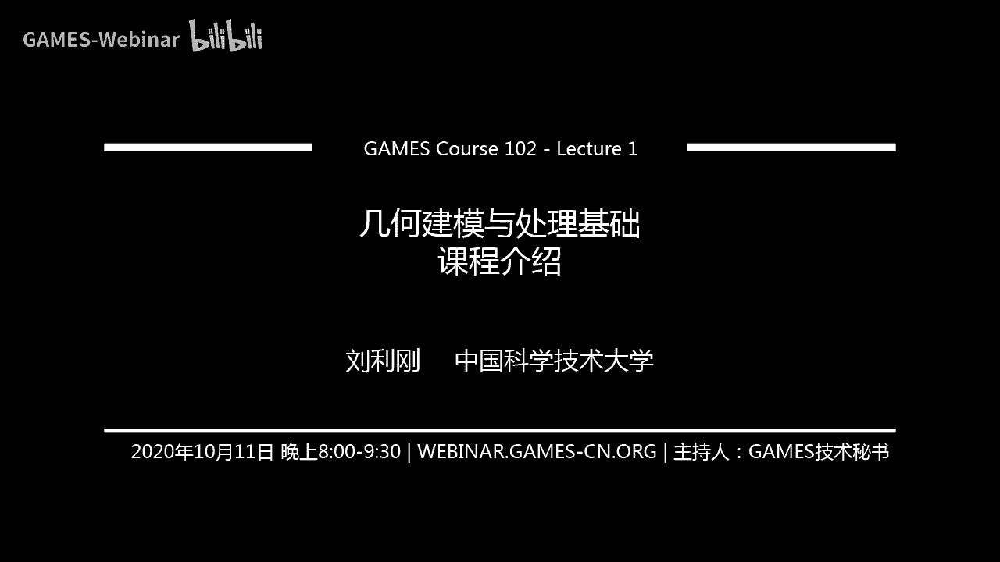

啊各位games啊，群友啊，晚上好啊，我是中国科学技术大学琉璃刚啊，今天非常高兴啊，这个在这个games在线论坛来给大家讲一下games 102这个概念在线课程啊，这个电池101和10201啊。

两位两门课程刚刚结束，那么我来开始讲一下关于几何的一些这个课程啊，好那么呃，我首先介绍一下我们这个课程的一些基本情况。

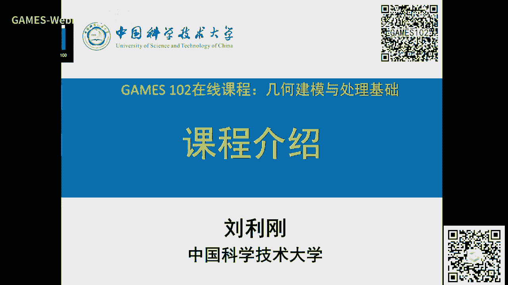

之后呢，再讲我们正式内容，那么非常欢迎大家啊，这等待了一段时间，因为9月份啊我还是比较忙，所以在10月份啊，我还是如期来开这个课啊，虽然也是非常忙的一段时间好，那么这个讲之前呢。

我还是想呃这3年来吧啊我和几位老师啊，这个在gains这个在线论坛的一些操作上好，然后给大家介绍一下game，全面介绍一下这个game的一些情况，那电池呢是图形学与混合现实在线平台这样一个啊，缩写啊。

那么这个它的主要的一个宗旨呢，主要是是希望给重新学及相关领域的一些，我们的华人在线社区交流的平台啊，那么，那么它实际上是是2016年，就当时我们的呃专委主任，16年4月份创建了这样一个平台games。

但是那时候是线下活动，那么在17年啊，17年6月份我们在杭州开了个会，决定呢也把这个活动啊，让更多人受益啊，想把它搬到线上，那么最后讨论由我来负责创建这个game是线上的活动，所以201117年啊。

6月份我就开始处置，花了将近一个多礼拜，就网站建设，所以把它运营起来了，那么我把这个模式基本上运行这个差不多好了以后呢，啊，稍微等一下啊，喂啊，那么这个声音怎么样，喂好，那么到2019年1月。

那么这个论这个在线方式呢就交给了那个我们的浙大的周晓薇老师，到现在，那么到现在为止将近3年的时间，3年多了3年半，那么呃已经举办过158期，大家可以看到这这个基数158 七这个那个在线报告啊。

另外还有一些今年开始又有一些专题啊，今年开始呢我们又创新的这个在去年的时候就开始规划了，由杨林奇老师第一个来讲101的这个计算机入门，后面我们又请了胡彦明同学来讲这个201这个高级课程啊。

那么呃之后的话就下半年就我来讲几何，明年的话叶利钦老师还会出来讲202的高级课程实时渲染，还有那个啊黄旭熙老师来讲这个三维的一些视觉与重建，理解方面的东西，当然像现在3年来已经这个社区发展规模蛮大的。

有11个群啊，有近5400多人啊，大家如果各位网友还没加入的话，可以扫右边这个二维码啊，这个二维码就可以进行加入啊，按照那个网页的方式，网页大概应该大家都熟悉啊。

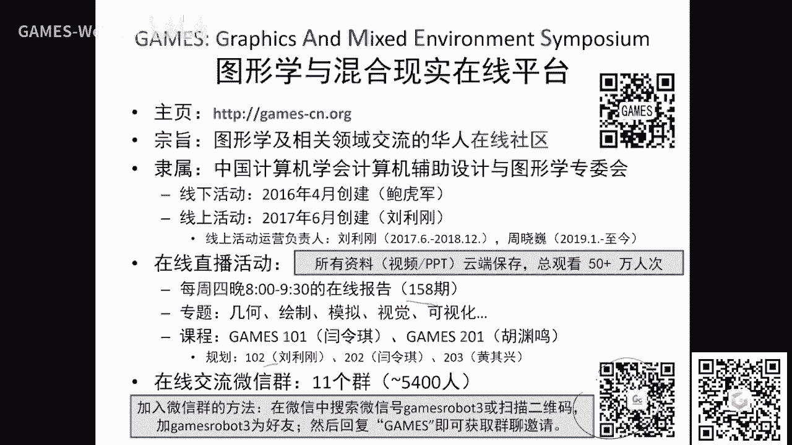

我这我也给大家介绍一下这个网页，这个这个网站呢是啊games啊。

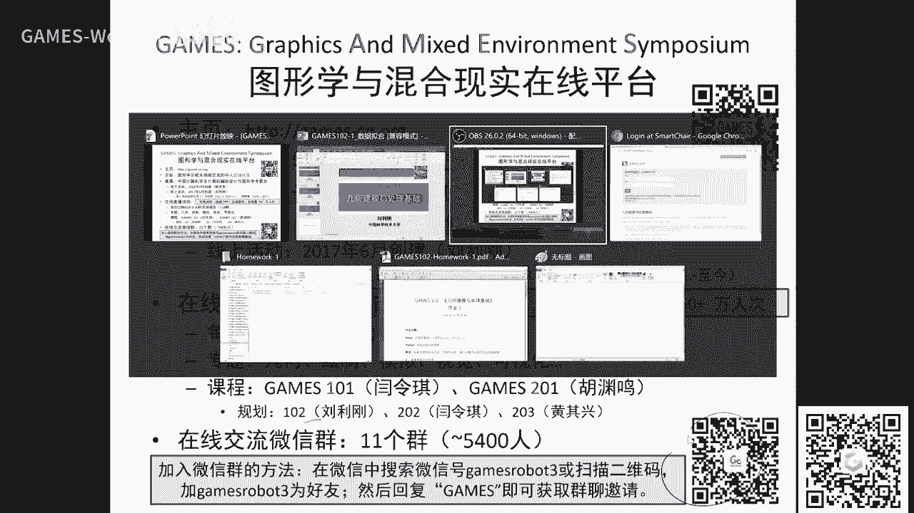

gcn。y g像这里面有好多内容，像这个是往期的报告和视频，你们想回顾以前100多期啊，这这个视频ppt都可以在这里访问到，那么这里是在线课程。

就101201和102的很多很多一些ppt视频也可以在这里访问到，那么这里呢是每年我们会有一个线下会议，今年由于疫情啊啊新冠疫情呢我们这个推迟到明年了，所以这个你能访问到1918年的啊，甚至以前的啊。

这里呢更多资源里面呢有很多我们一些学术会议的一些资源啊，你点进去就可以看到我们在8月份在吉林啊举办的cad。

这个会议的一些视频下载啊。

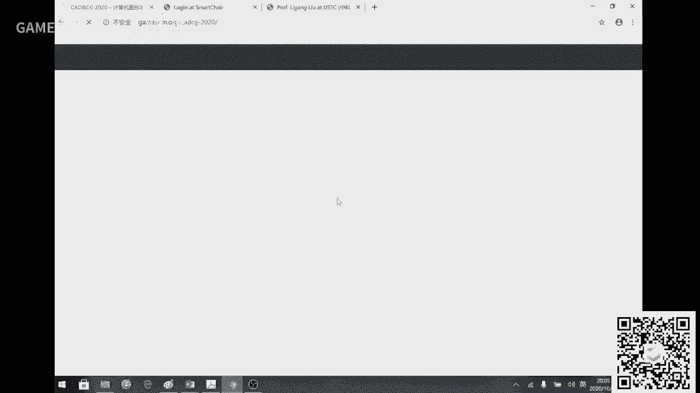

我就不打开，然后他有这个走音高校，我们现在办了三期了啊，他们那些视频我们都保留起来啊，给大家共享，也是希望让这些资源更多地受益于啊授予啊，这个我们的一些网友。

还有我们啊我本人在科大办的属于学校啊这个课程等等。

所以这里面实际上是我们积累了很多很多这样的资料，可以是适合于不同的方向，不同的领域不同的啊，呃这个一些一些同学让他们能够在足不出户就能够享受到这些高级啊，高端的这样一些讲座和一些课程啊。

这3年来我们得到了很多老师，我有病验啊，主要是我们专委的一些领导啊，就是日常的这些报告的安排，还有这些组织活动啊，这个也是啊，感谢这些老师是这个无视的付出，特别感谢现在现在的这个啊。

我们的在线上运营负责人，浙大的朱小伟老师啊，这个把这个模式搞得越来越规范，越来越好，越来越顺畅，还有背后的默默无闻的这个技术秘书，陈林浩同学，还有董俊廷同学，还有其他几位保护不列举。

当然这个是当时我前面1年半的时候的一些啊基础团队和秘书啊，我这里一并感谢好，那么啊这3年来还是呃虽然付出很多很多时间来那个，但是也有很多啊，这个收获也从里面学到了好多新的东西，也是特别感谢这个平台。

我也是受益人之一好那么我们怎么今天开头的这个102课程呢，啊大家如果想访问这个更多信息，可以到我的主页上啊，我的主页上这个有个提取。

然后下面有一个啊啊这个games 20102的这个点进去就能访问到主页，这个注册这个smart chair这个作业系统呢有100多哦，看到很多很多的啊，这个网友的说明是说没有任何的数学这个几何基础。

希望啊讲一些这个非常基础的东西，那么当然有些我看了一下，有些有这个建模的经验的网友啊，所以呢啊这里这个这个这个听众啊，可能从啊没有数学背景到有一些几何经验啊。

还有一些可能是啊我们非图形专业的这样一些同学，所以我尽可能讲的通俗易懂吧，啊如果呃大家对这个课程这个有一些反馈，或者甚至给我写邮件来给我反馈，那么这个课程呢我定义成基础，因为我想先讲基础。

后面明年我可能会考虑，或者是我们同事会考虑开一些三维几何处理的高级课程啊，事实上我们在科大每年都会开这个数字几何处理这个啊，那个啊我们团队的付晓斌老师今年开的这个课呢也录屏了，也在b站上可以找到啊。

大家也可以看，但是这个课呢我想定位在基础知识啊，所以啊大家放心不会太难啊，我把很难的东西呢放在啊以后的高级课程里面去啊，那么这个课时间就是这个时段啊，那么这可能为了让大家这个还是要从从做中学。

我我还是布置了5~6个编程作业啊，这个编程作业呢也不是太难啊，所以大家也不用害怕，那个呃希望大家如果有时间啊，跟着我们的课一起来做啊，这个这个是提交系统啊，在里面，还有这个我们也建了两个群，一个bbs。

bbs是挂在games网站，大家有一些技术的专题的问题可以在bbs上问，可能会问你很多会覆盖你的问题啊，如果你bbs上问的话呢，可能会比较好的组织在那边，几位助教啊，都会在上面会回答大家的问题啊。

那么这个助教都是我的研究生啊，那个他们啊在这方面都很有经验啊，你们也可以跟他们建立一些联系，有问题也可以直接问他们啊，那么还有一个跟前面两门课以后，我们在课程结束后也会颁发这个结业证书啊。

那这个当然也是颁给那些孩子付出了啊，特别是完成了很好的作业的这个同学，那我们开始讲这个课程啊，那么我们这个课呢呃怎么和建模离不开，图形学本来就是图形学的一个非常大的一个内容啊。

这个是我呃呃7年前我那时候记得是暑假啊，刚好有点空啊，那个就抽了大概一天多时间吧，写了一个介绍什么是图形学的一个帖子啊，因为那时候我我也在刚去科大一年左右吧，啊，就经常有同学来找我。

我跟他们解释了很多遍，所以呢那时候我就花了一天多一点时间把这个帖子给写完了，然后按照我的理解把图形学分成了三块内容啊，建模啊啊仿真与渲染啊，这个上单问题，当然还有人机交互，还有其他的一些啊。

这个扩展应用应用的一些领域啊。

大家有兴趣可以看一下，实际上是这三个方面的建模，动画渲染啊，161是讲呃呃图形学基本中心渲染偏多一点，201呢是动画活跃名字啊，那么所以我今天把最后这个建模这一块呃给大家讲，这也是出于这个目的啊。

基本上今年的这个三个课cover了这个图形学的三大块内容。

那么我们来看一下啊，就是图片是什么，照片是什么啊，实际上照片呢就是我们的三维世界这个投影到我们的这个，比如说我们眼睛就是我们的视网膜啊，这个上面的成像啊，当然我们大脑会把暴力的这个成像解释为正立啊。

这是我们大脑的这个解释好好，那么对于我们这个机械的这个这个相机呢，算是这个一个啊，是基于世界中的物体成的是倒像对吧，然后这上面呢也是有跟我们感官细胞一样的，它有一些感官元件，这原件呢能接受。

通过发到这一点的这个光的汇聚，就形成了颜色，就呈现相应颜色，所以就把自然界的这个场景，通过透镜就呈现在了这个相机的胶片上面或者底片上面。

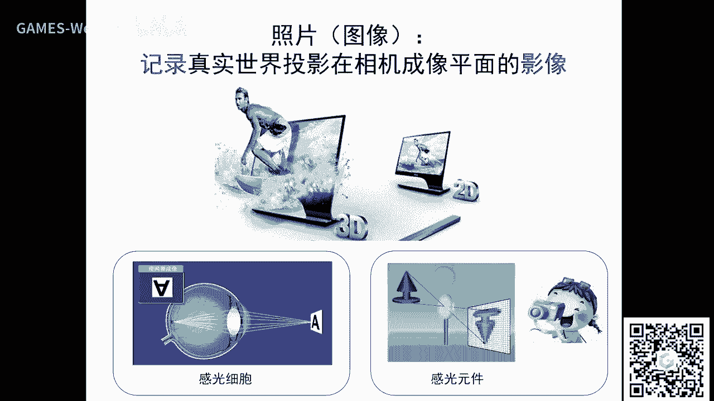

而这个由于这个感光元件是一个个啊有物理大小的一个元件，所以无论它是有多小，它总是占有空间体积，所以我们的存储图像都是离散方式。

所以你看起来这张图片是连续的一个区域，去一区域，但事实上你可以看到它实际上是有好多好多这样一个小的感光元件，所组成的这样一些像素所组成，每个像素呢是有红绿蓝三个分量啊，这个就是我们的颜色的一个。

所以图像本质上啊就或者叫数字图像，本质上在我们所有计算机存储的时候，基本上都是这样一个离散存储，这个叫图像，也叫荒山显示图像啊，我们显示器我们的手机屏幕都是这种光栅化的。

所以说啊只不过呢就是这个这个啊像素呢小到很小的时候，我们人眼分辨不出来，我们就分辨不出它是离散的还是连续空间啊，所以会有这个x乘y这个n行m列呢就叫做它的分辨率，分辨率啊。

这个就是指这个图像的像素的多少，举例来讲，如果是1000x1000的这样一个图像，它的像素是100万啊，这百万像素级啊，所以图像的表达啊非常简单，就是这样线性的，虽然它是取证，取证也是线性。

因为你把矩阵可以拉扯一列啊，那么呃那么我们同事说那个是叫图像，那么我们还有两个是叫图形，图形的话呢，给大家呃稍微我自己理解的图像和图形的区别，图形的实际使徒性就是有具有数学表达的几何对象。

一个点或者一条线，一个线段或者一个多边形，一条曲线都叫图形，还有一个区域去有这个填充的啊等等，那么如果你这个里面的填充颜色可以设置很好的话，你也可以做出像右下角这个老虎这样的一个非常啊。

这个真实的或者漂亮的这样一个矢量图啊，所以这个叫图形，所以图像呢是由像素所表达的离散的一些点图形呢，什么是有一些点所表达的一些几何元素啊，这是两个不一样的，那么图形有的时候也叫做矢量啊。

在有些领域也叫矢量啊，比如说图像的矢量化，就是把它变成一片一片这样的区域，每个区域呢是由这个数学表达的边界所表达好，那么我们处理的图形假设是啊这个平面上的线多边形，三角形等等。

那么它呢要把它显示在这个电脑上面，就一定要把它转化成这个像素所表达的，那么这一部就叫光栅化啊，你们相信你们在101的时候都学过这个光栅化啊，比如说一条直线怎么样用这个像素去填充来表达一个直线啊。

这个当然这个像素很小的时候，你就看不出它里面有这种很明显的锯齿啊，这个句子叫这个走样啊，这个严严老师也讲过这个走样的方式的原理以及怎么消除啊，我就不展开好，还有三角形，你给它个点里面哪些哪些点是填充。

哪些点不填充，这个也是一个这个光栅化的啊，很重要的一个，还有一般的多边形，事实上在我们电脑中存储的这个文字，字母等等，你可以看到多次矢量，所以呢这些文字放大以后呢都非常清晰，为什么呢，你把它放大以后。

我们重新要求填充里面像素，所以它里面的像素不是存储起来的，是什么，是实时算出来的，我们存储的只是这些多边形的顶点啊，这个所以你放大这顶点重新算一下，里面的填充区域又重新变化了，我们又重新少量转化。

帮他换一下，所以你无论怎么放大，它里面的这个边界看起来都是非常非常光滑的啊，好这就是矢量啊，这个图形与三格图像的区别，这张图像因为只是存了这些像素，所以它的信息只有这么离散的这个n乘m的这样一个像素。

所以它放大后，你如果不采用一些特殊的这个差值啊，外差或者上采样技术，这个图像看起来很模糊，那么暂时矢量就不一样质量，因为它存的是一些点线的坐标，所以呢它放大后呢点线的坐标重新计算以后。

我里面的填充区域重新被光栅化，重新计算了，所以它始终是能保持非常高级分辨率的一些这个啊这个这个效果，所以矢量图形呢也有的时候把它叫做这个呃这个无穷分辨率的图像啊，这这就是一种叫法。

但是我我更偏向于它叫图形啊，图像是离散的，图形是连续的，是有数学表达的好好，那么这个我们拍实际照照片当然是可以把这个这些影像存储起来，但是呢如果我们人类要去创造这样一些影像怎么办呢。

好了我们人类从很早以前就知道我们用不同的彩笔去绘画啊，画出我们这种想象的这个世界啊，比如啊这个小孩子画这种卡通型的，还有这种啊大师画的这种非常表意性质啊。

当然还有一种啊艺术家能画出跟照片一样的这种写实型的照片，当然这个这种艺术家的这个手法非常啊，他对这个自然界这个光照啊，这个这个理解非常好，你可以看到下面三幅图片，这个一个水果，一个一个动物哈，豹子。

还有一个一个一个人能像你，你如果不说是个是个画出来的啊，那么大家都会认为他的照片，当然这种呃这种才华是要非常很多年呃，这个这训练才行，比如说我这个人脸这里啊是是光源，在这里是阴影啊。

怎么这个头发在这里面怎么交互等等，它主要是自己靠脑袋去想象的啊，它是它甚至没有一个参照物，就可以把这个这么真实的东西画出来，但这东西肯定不是一个常规的做法是吧，比如说我要画一组动画呢。

这样画的话根本不可行，所以我们能不能通过计算的方法来创造出这种图片机的东西，这也是很多年前大家在追求的，那么如果你要去做这个事情，你就要去理解这个图像成像的原理是吧。

好这里面这是一个镜头成像的这个啊主要元素啊，这是一个成像平面，那么这是一个四世界物体，好，如果你这个没有光源，你什么都诚意成不了，因为有一片黑暗，那么如果你加了个光源在在这。

那么呢这个物体上的这一点就通过透镜达到这一点，就可以把它光源呈现起来，所以呢一个物体的颜色它能不能被看到，能不能被被感光元件感受到，一定要光源的存在，光源与它发生作用。

它的材质反射出来的这个这个光线汇聚到这一点，才能形成这一点的像素颜色，这也是我们图形学做渲染的一个基本的一个啊物理的原理啊，实际上是啊大家很多同学学过101就清楚，实际渲染就是光的计算科学啊。

比如左边这个就是一个局部光源，我一个光源照到这里，我眼睛在这，那么这个这些反射出来的光光线就跟这个夹角相关是吧，那么夹角越大，就是看着这光就越弱，因为它是按照一定的分布会会散开啊。

就是那个cos这样一个set up啊，这个角度好，那么对于辅更加真实一点的话，这个光源不仅在这一点反射到人眼，而且还有多次弹射，还有折射，甚至其他的一些光学现象，这就是我们的一个光光照方程啊。

这是渲染的一个核心，就在解题方程左边，这个呢其实这个方程的一个一个简化版本啊，因为它里面假设的b r d f是一个长值啊，各个方向这个是一样啊，所以这个左边是右边的一个简化，但是真正的你要绘得很好的话。

像下面这张图啊，一个实际场景，我一个这样模型就能够通过光源来这个计算，渲染计算就能呈现出这么逼真的效果好，那么这个就是里面用大量的这样一些计算好，但是你要做这个事情呢，少不了什么，少不了你的原材料。

一要有这个场景模型是吧，这就是我们办校几几何，这也是我们这个课要重点讲的，其次你的光源怎么设置，你怎么打这个光能够让我看起来比较和谐啊，还有什么这个上面这些模型上的一些啊，纹理是怎么样。

特别是这个材质bdf，你这个因为因为这个光源与这个模型发生作用以后，反射出来的光源来说，这个这个光的强度都跟这个材质相关，所以呢呃这个材质的设置非常非常重要，如果你材质设置不好，你再怎么样的算法。

你绘制出来都不好看啊，就是因为就像艺术家给他们涂色一样的，木头的材质跟沙发这个布的材质就不一样是吧，所以你这个事实上是在在很多领域，特别是游戏啊，这个这个场景的创建啊，多次有一批啊叫做美美工啊。

也叫美术啊，还有既美啊，技术美术一批人在里面做创建，那么场景这些素材啊，几何好，纹理漂亮，还有才才子说得对，那么你才能形成一个真实场景，所以呢你们做渲染，大家都关注在怎么写这个方程，事实上还有很多部分。

你这些东西要素没有是好，你怎么画都画不好啊，当然这里面这里面这个难度还是非常大的啊，我后面会再展开好，可以看到现在利用假设我们材质设好了，这种透明的都设好了，那么再通过强大的算力。

就可以绘制出这么逼真的一些这个啊这个图像啊，这个左上角是那个啊狮子王啊，这个呃一个渲染出来的，那么左下跟右边这个是啊阿丽塔这个一个电影啊，在里面这个用了大量的这个几何去表达，还有材质表达。

这个物体绘制出来非常逼真，那么一个物体，我们世界物体还有动态物体啊，特别是流流体啊，这种软体是吧，那么呢怎么去去呃那个表现这个运动物体呢，上次就是这个运运动的科学，所以里面是运算的计算是吧。

那么说到底这里面就是在解各种各样的方程，再解什么解偏微分方程啊，刚才渲染的是在解积分方程，那么仿真是在解p v方程，所以pv方程的数值解法就很重要是吧。

那么左上角这个这个在胡彦斌那个201课程也讲了是吧，就是解这样一个n i方程啊，这个这个叫net net stock，就是这个n方程，那么它有不同的解法，你可以把这个啊这个从历史的观点。

从皇冠店你解法是不一样的，当然也可以结合就是最近流行的mp m方法啊，当然对于这种楼型，这个刷窗帘布料可以用这种弹簧自检系统去解啊，当然还有有限元等等啊，也可以去做做的啊。

这个给给给不同的物体去做这种仿真运动计算，所以呢仿真就是在做运动计算，你当然还有钢铁运动啊，就是那个牛顿那个力第二方程啊，还有这个一些其他的一些量的一些变化啊，这个我不展开啊，所以你要去做仿真。

就是在解不同各种各样的不同的运用和力学方程，流体方程以及这种波动方程等等，好那么可以看到在电影里面，像这个左边是冰雪奇缘，这个血的一些变化，还有这个海洋奇缘这个水的变化都做的越来越逼真啊。

这这次通过一些非常强大的算力啊，能够生成一部这样非常大的一个电影啊，我通过一些物理仿真，再通过渲染就可以得得出这么多啊，生成这么多三维的虚拟的电影啊，那那那那我们国内在这一块也最近几年发展起来啊。

左右上角那个就是去年的大片啊，流浪地球，这个叫白蛇缘起啊，这是哪吒魔童降世啊，这个大家应该都看到过是吧，里面都是纯三维的一些东西好，每个人物，每个故事都是不一样的。

你可以按照你的你的想象去创造里面的这个世界，实际上是在里面就是那个导演啊，就是创造了一个真实的一个平行世界。

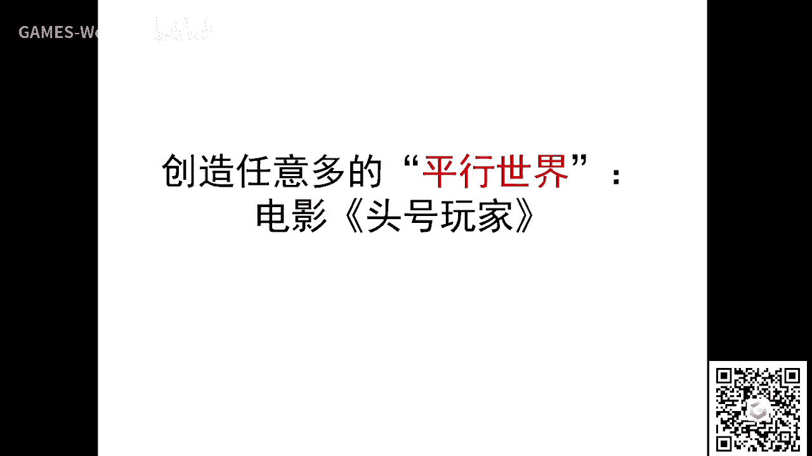

那么这个电影大家如果看过应该都非常熟啊，就一个一个任何一个人戴上这个头盔啊，然后启动那个程序，他就能马上就到了另外一个世界，当然这里面它是一个畅想啊。

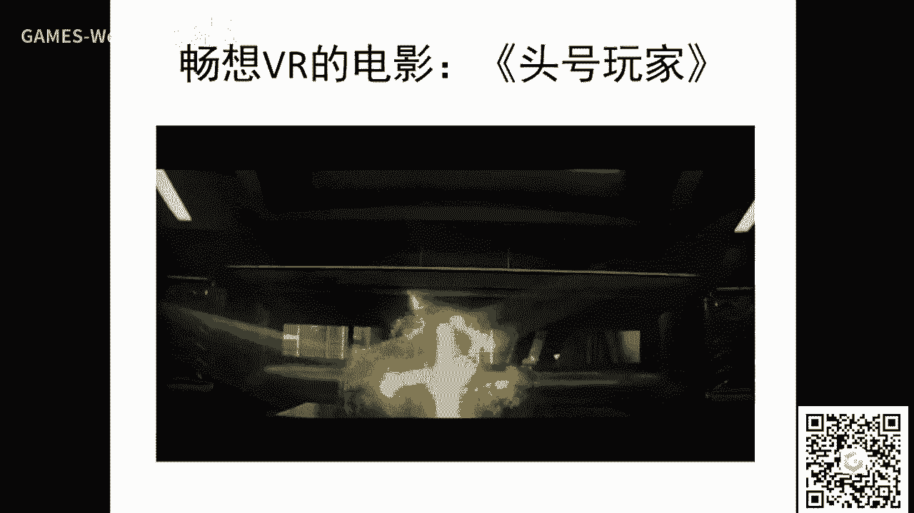

他身上还要绑好很多触觉传感器，还有运动传感器等等，那么你进去以后呢，看到的世界是另外一个，并且你里面的感觉触觉啊。

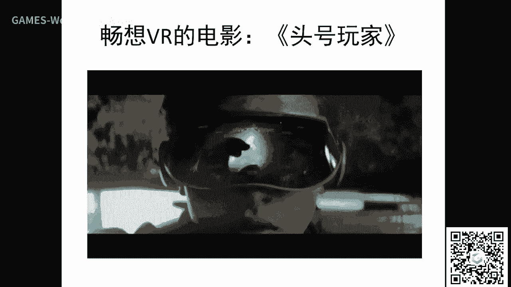

当然你这个规律跟球一样，你就没有无感对吧，如果你跟地球不一样，是月球的这样一个吸引力，那么你可能就会觉得比较轻好，但这是另外一个事情好，那么进去以后的话，那个世界就有一套规则啊，那个世界叫绿洲啊。

那个那个绿洲后面有个boss定义了这个世界的一些运营方式。

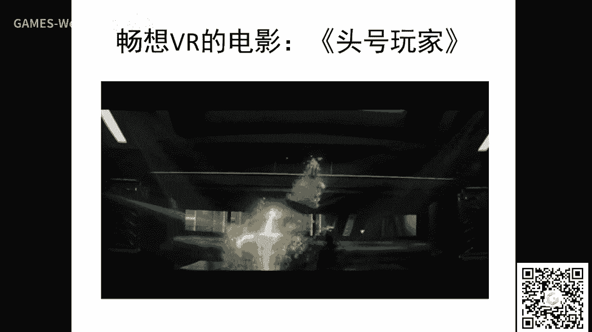

你就可以在里面跟那其他的虚拟人啊，但每个虚拟人都对应一个真实人进行社交活动啊，可以接触可以啊，谈话可以这个啊可以赛车，你可以看到他进去以后。

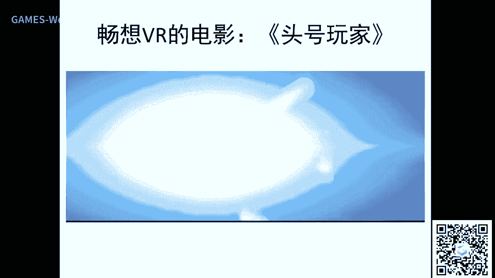

然后就可以在在里面进行啊，赛车啊，里面这个赛车里面的这个车装在这里面已经开，它也有真实的力反馈，有速度有力的这个作用。

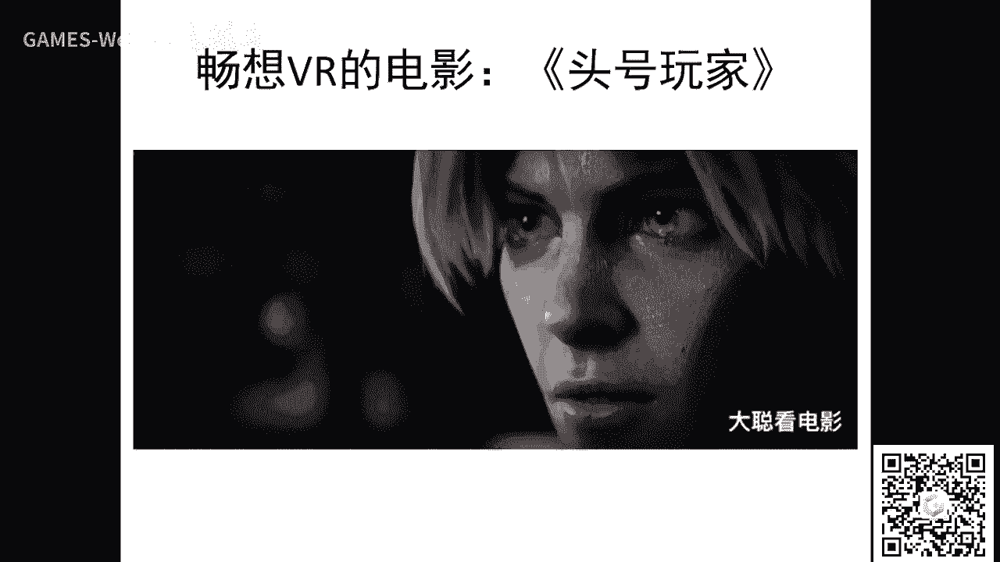

你在里面这个车跟在我们正式界开始一样的的感觉啊，就是所以纯粹是在另外一个时间，当然你可以在大街上跟一批人这个这个汇聚啊。

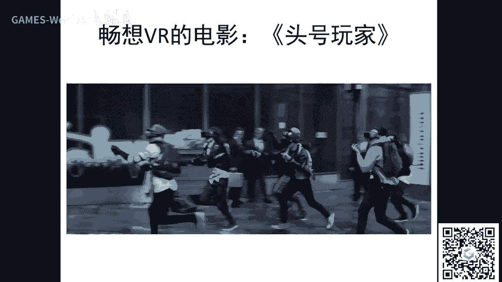

这是最后一批个片段，把那个这个这个这个啊打打那个坏人的情况啊，那么我们可以看，所以这个电影呢呃如果大家没看过，值得去看一看啊，这个展示了我们这个vr就是虚拟现实。

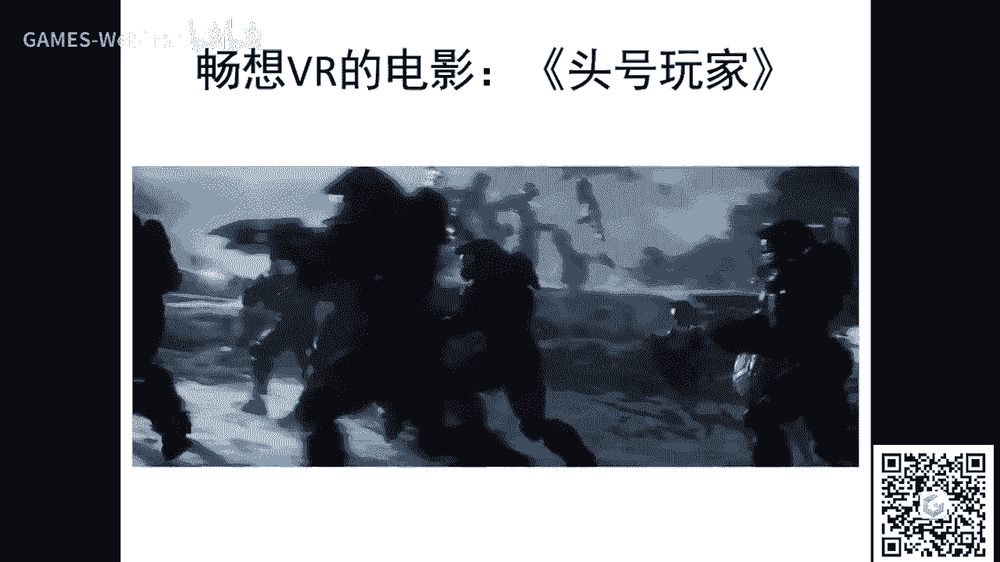

未来如果哪一天各个支撑技术都能够到位啊。

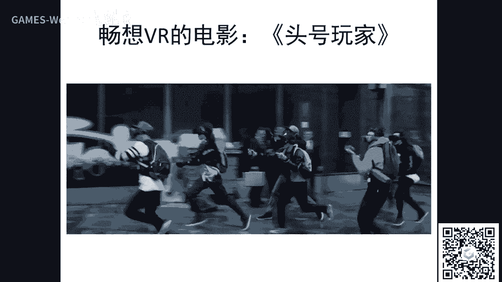

触觉啊，力学啊，这些到位。

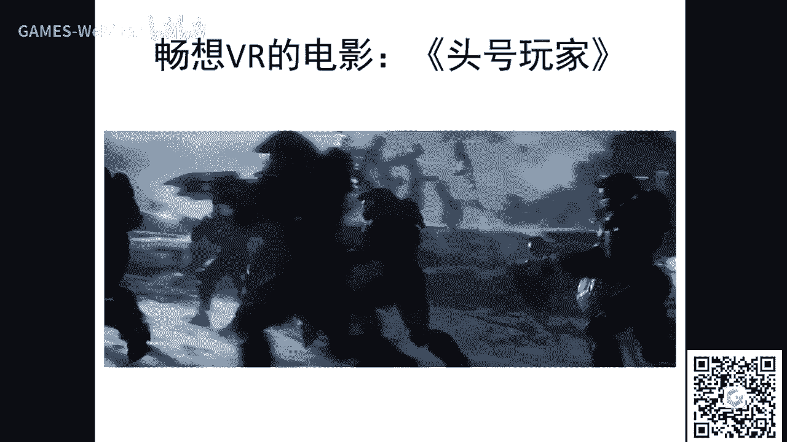

那么这个我们每个人都有创造这个虚拟世界好，那么我刚才讲完了那个呃这个世界我们可以利用从一些技术去创作，但是一个问题大家有没有想过数据从哪来算了，我刚才讲的数据，从右边这张图里面看到数据。

你造一个这样的这个用这个这个图像的这样一个啊数据，你要去建模，你要去把它做uv展开啊，uv展开以后我们会讲啊叫参数化啊，你要去给它生成法线贴图啊，这个偏移天图，还有这个啊这个一些这个材质贴图等等。

所以你要去做那么多东西，你才有可能创作出这么逼真的一个渲染效果，那么这个效这个效果，你们如果是只只只只只是做那个渲染或者是仿真的时候，你们可能觉得数据是已知的啊，不用你去撞，创造已经有，当然没问题。

但是这个数据来源是非常非常困难的，201可以靠哎，我们用美术，你靠美术去堆吧，靠美术去画，他们去调这个美术就会疯掉对吧，因为这种虽然这个美术这个能够帮你做的这些事情。

所以我们这个课目的就是来讲这些数据我们怎么来构建，怎么来自己有这个能力，无论是通过工具也好，还是通过程序也好。

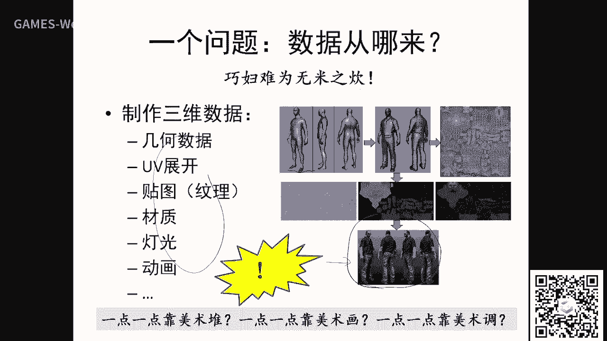

来来做这个事情好，那我们来看这张图，这张图呢左边有很多那个啊，就是这个有很多不同的模型啊，左上角那个啊这个模型大家一看小s就就能感觉到啊一些方块啊，一些求啊柱啊啊，这个这个追啊等等。

所以这些是比较简单的几何，大家一看马上就能想出它的数学表达，但是如果看右下角啊，左下角这个是在工业界需要造一辆汽车，造飞机，它的曲面是要非常非常光滑，非常非常光滑，那么这个你光用一些点是表达不了的。

那么这就需要有连续的这个数学表达，那么这个就是后面我们会讲一些样品啊，还有诶就是在一些动画里面，我们可能不需要这么光滑，但是我里面有很多细节，我可以通过一个简单的通过一个一些规则去细分。

然后再加上一些雕刻去建模，这里面就是叫细分以及雕刻这样一些像gba这样一些软件的一些应用，当然如果你要做的更加逼真，你还有这种translucent啊，这个叫叫叫半半透明的材质，还有这个毛发啊。

还有这种啊这种啊像毛一样的，还有这个啊这个金属表面的一些脏啊，这个这个这个印章一样的东西啊，如果你要去刻画这样一些东西的话，你的建模就更更加要精准了啊，就是材质怎么获取，魔法怎么表达。

还有这些这样一些这种秀啊，这个这个铁锈怎么表达等等，当然这里面涉及的建模手段以及这个表达方式也有很多，所以呢啊这里面现在到现在为止，你说渲染可以很真实了，这个这个这个仿真也可以拿这个骗我眼镜了。

但是建模我们把它叫做几何内容的生成，仍然是图形学的一个瓶颈之一啊，我们这个课呢啊最左边的这个几个建模手段，我会在下面的十几周，我会给大家做一些这个介绍啊，希望大家能够有所了解，右边这些高级建模呢。

可能未来有机会啊，我们再再来详细讲好吧，那么所以我们左边的那个课好，那么现在我们就呃讲开始这个讲我们的，我想今天的第一个内容就是函数拟合，我们先讲这种连续精准建模好吧。

那么可能很多呃在游戏界或者是一些这个工业界的朋友，可能更多的接触是离散建模，那么我想这个先把建模这一块，大家先有个概念，有个基础，后面的讲一散就容易啊。

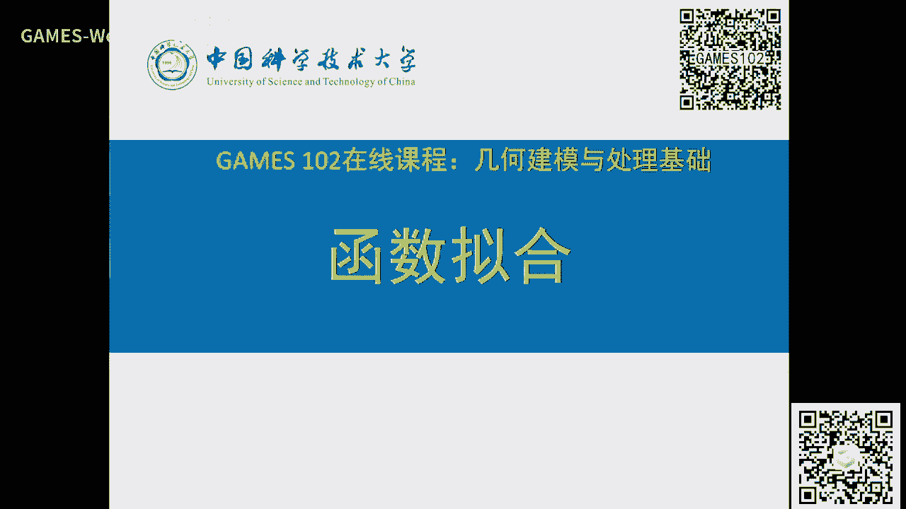

更容易接触啊，那么呢呃我也看到很多同学在注册的时候留言，能不能这个数学方面的考虑到他们的基础，所以呢我尽量的会把数学概念讲得清楚，然后一点点数学开始讲啊，这个一点都不讲的，这个是没法去去表达一些啊。

这个后面的一些一些一些概念，数学正面大家千万不要怕啊，这个这个不是说我们科班出身的同学，数学这个就就切成好，不是这样，数学呢实际上是它是一种语言，就是说我要表达一个量。

我就要用x y z x b c是吧，它就是一个符号，所以呢这符号表达一个规律，这就是一个符号，数学数学表达，还有智能方程，还有这个这个啊其他的更复杂的这样一些这个方程，所以数学呢啊我今天呢就不能展开。

因为展开的话呢，我也把数学历史讲一讲，实际上是数学是来源，生活就会从古代的这个结成技术到丈量土地，就开始有了这样一些呃这个呃树和新的概念的话呢。

就后面og里则又把它啊把这个这个这个一些几何的东西抽象出来，形成了五条公理，几何的这个这个这个理论框架，所以说他一些聪明的人善于把一些观察的一些各个规律，把它变成一些公理。

然后用这个公理的在无限的去推啊啊，这个是数学的这样一个发展过程，那么数学实际上真的是非常有用啊，特别是做这个科研来讲，你没有这个数学的好的思维，这个做做就做不深啊，所以我在这个课呢。

也希望给大家来建立一些这个数学思维和数学建模能力，当然这可能不能像我在科大跟我们的本科生上课，那样的一个啊这个难度我会尽量的把它讲的通俗啊，大家尽量的啊这个跟一下好，这个数学产生。

我刚才也基本上提了一下，就是来源于实际目的，就是减少基数和土地丈量，后面呢就有些出名的人呢就把它变成一个逻辑游戏了啊，我刚才讲的平面结合就是什么从里面抽出了五条到七条公里啊。

就欧气里的这个家伙就把它写成了几何，原本就从50km出发，大家要认同的好，只要这五条公里或几条公理，那么你就可以无限的演绎啊，繁衍啊推理去产生各种各样的这个性质啊，如果公理如果有一条是不对的。

或者是把它变一下，变成了另外一个这个这个学科，比如说平面几何啊，从中间的两条平行线互相交变成相交为一点，那就变成了顺应集合等等，所以说他就把它变成一个这么纯粹的一个理论的一个学科啊，你就是纯纯纯数学。

就是它呢嗯可能不考虑它的应用，我只把它考虑一个这样一个逻辑体系，你也可以把它看成是一个逻辑上的游戏啊，这是属于纯数学的这样一个范畴，像我本人虽然数学出身上，我也不是纯数学这样一个啊研究工作者。

我我更希望把数学用到我们的工程工程问题是吧，所以纯数学很多一些听地理啊，新命题啊，猜想啊，各种各样的非常深刻的，但是呢啊这个不一定有实际的用处啊，当然可能若干年后会发生用处啊。

这是纯数学的一些就是逻辑上的一些这个这个游戏规则好，要训练要把实际问题啊转换成一个数学模型啊，这个这个模型是什么呢，所有的学有可能是诶用一些符号表达一些问题的一些变量，然后呢是用优化模型呢。

还是用方程模型，是用其他的统计模型等等，模型有了以后你才知道对这个问题进行一些刻画，后面才是真正就把那模型去求解，有可能是优化，有可能是解解这个方方程，有可能是解解一个这个这个概率问题或者统计问题啊。

最后代码才是实现你这个算法的一个东西啊，代实际上是在这个整个研究里面是最不重要的，但是没有他你你有想法，你验无法验证也没用，所以代码是必须的，但是更重要的是什么，是这个这个过程啊。

从问题到模型怎么去去进行建模啊，那么后面可能会碰到一些课程中讲的一些东西，我会引导大家来来进行这样一方面的一些啊，那么数学还有一个东西呢，就要要要善于抽象啊。

就是就是这个本身数学符号就是从事件中抽象出来的，比如说我们在幼儿园啊，我们做加法，你不能太抽象，我们说老师一定是问你两个苹果加三个苹果，直接一个苹果压啊，五个苹果是吧，就苹果很具体。

小学呢苹果可以扔掉了啊，233。5到中学呢，那2x加3x等于5x x可以是苹果，也可以是人，也可以是是一个虚拟的东西，甚至是一个是吧，我有函数的这个性质了，那么怎么就是一个这个这个微分方程了。

所以东西越来越越越来越抽象，越来越高深啊，好那么我们那个要去开始讲那个你和我想前面一些铺垫，我给大家回忆一下，在数学科班的同都会学到这些，可能非数学专业的可能不一定学，但这些概念都是些基本的啊。

大家不用不用不用担心好，首先是集合，就是一些具有同样性质的对象啊，比如说我有我有一些数字被构成集合a可以可以当然可以啊，那么呃这个这个集合呢是什么，是可能可能是有无穷多个，比如说自然数集，有理数据等等。

它也是结合我们在讨论一些东西的时候呢，我们都会限制在一些特定的集合上来讨论，比如说我们讨讨论这个这个人的性质，我们可能会局限在人这个这个群体来讨论啊，我们讨论一个这个这个向量性质。

可能讨论在一个n维向量，不会把不同维的向量放在一块是吧，所以集合是具有同样性质的一些对象的结合啊，这个这一堆好，那么结合这里就有啊，可触及不可阻击啊，这是要无穷级，如果有限级的话。

就是个数无无限级的话就是可数跟不可数，大家可能啊可数的话就意思是它能跟自然数一一对应啊，上次比较这个面积的大小呢，你只要能跟n对应起来啊，一一对应，他们就是个数是一样的啊。

虽然可能比如说整数跟自然数就是一样大小都是属于可数集，虽然好像自然数集是整数集的一个子集一样的是吧，因为什么他们两个就可以建立一一对应，我把自然数一对应整除一，自然数二对于整个的-1啊。

就就就像间隔就可以，我建议一一对应，因为什么无穷之后我们可以不用管它啊，那么还有一种不可数集，就是次数啊等等好还有这个还有集合的这个一些运算啊，这个并按交叉啊，大家一看，这稍稍微看一下就行了。

好那么集合之间呢，如果他们没有一些运算，那么这个集合呢就比较难去构建一些关系，我这个我这个a元素跟b元素之间到底是什么什么什么什么关系，不知道，所以呢我们要引入一些运元素之间的运算，就是说两个集合相加。

还是这个集合里面，如果这个集合放大多少倍，还是在这个集合里面，那么这个集合具有非常好的性质，叫线性结构啊，要满足于这些病率啊，要交换率啊，a加b等于加a结合率等等。

这个呢在里面大一的微积分就学过这个线性空间是啊，如果具有这个性质的这样一个一个一个集合呢，它具有非常好的结构，什么意思呢，我里面的每个元素啊，就不要一个个去列举了，我我的元素呢都是能写成这种形式。

就这样的vi呢就是里面的若干个一个g啊，这个这个这个叫叫叫basis，那么这个basis的个数线性无关向量叫做维数，那这样的话呢我这个空间啊就实际上是很简单，就它所有元素都表达成一些vi的一些组合。

这个aa就是实数，就是它的系数，每个元素啊就对应了一个这样的n维向量，只要n个实数就表达了中间的一个啊，这个元素如果你看这个位数又又可以啊，同同构于这个n是n维的这个欧式空间。

所以这空间这样一个性质就让它结构非常简单，我们就可以很容易去去描述充多的这一类东西啊，最终那些什么有一个非常好的细菌结构啊，那么所以我们看到的一维实数啊，二维平面，三维空间，这叫欧式空间，还有多单词。

这个这个空间都是这样的结构，因为有了这个结构以后呢，我们讨论这么无穷多的东西呢，就把它变成一个有限的，就n个n个实数的这样一个性质了，这是一个特别啊这个重要的一个概念啊。

所以我为什么我们要学线性线性空间，学线性代数就是这个好影射，隐身的话就实际上是这个啊，就是有两个集合a和b这个a和b如果a中有一个任何一个元素，在b中都有一个像跟它对应，那么这个就叫影影射。

那么这个f呢就叫做影射规律啊，这个下面这个呢a对应两个这个b b1 b2 ，那么这个就不就不是影射啊，就只能a对一个b，那么能不能多个a对一个b呢。

象象征这个多一个可以啊啊那么啊还有有没有这个有没有影射到呢，也可以啊，那么如果每个影射是都不一样，这个叫单色啊，如果多一满了就满次，如果是一对应的话，叫双色，也叫弯弯啊，一对一映射啊，这个好。

这里有几个啊，一个影射的地域，一个叫值域，a就是定义域，b就是值域啊，就是我这是df这样一个定义是在这里上面可以作用，b就是它它的值，那么a叫项比较原项，那么当两个集合a和b都是实数的时候。

a和b都是实数，这时候呢就是我们初中就接触过的叫函数啊，所以x在这y在这是吧，然后呢这个y等于fx就是表达了一个实数印到了另外一个实数，这就是我们一个啊这个函数的概念啊，也叫变换啊。

这个反正影射函数变换有的时候在不同的上下文都可以就可以混着用，但是函数特定我们在这里啊，特定就是指实数r1 f就是实数到实数的一个变换啊，这个叫函数，那么这个函数怎么可视化呢，这是挺麻烦的事情。

为什么你x是啊是个实数啊，是个十轴，i也是个实轴，这里点运到这里来，这里点进到这里来是吧，那么它怎么可视化呢，就不好可视化，因为y x从这里走到这的时候，他可能在这里一一回来，来来回回就爆口化了。

人们就定义这样，对于这样一元函数，我把它分为生成二维一个x把y放到这里来看好，这样就可以吗，就这里一点x加上y呢，fx呢就放这个y就变成这样的一些，但是我们初中时候就会了啊，实上这个就是图像。

而不是函数的可视化，也叫做函数的图像，这个非常容易理解啊，这个大家先记住啊，我我们对函数的可视化，什么是是人为的把它升级为了两维，相当于是这里一个点就是空平面上的一个点，给个x有个fx是吧。

然后把这个x和fx啊，这个点放这里啊，那么x走走完这个定义以后，这个它所形成的这个项就变成一个曲线，这叫函数的图像，我们对于高维的函数，我们就不这样做了，我们啊这个下周会讲好。

那么幂函数你可能是要有哪些函数，我们在初中就学会很乱的函数啊，等幂函数啊，三角函数等等是吧，这个大家都初中就学过他们的很多性质，那么我们的函数你需要去研究函数的话，也需要有一个特定的领域啊。

这个范围这个就是函数集合啊，好行情和也一样，就是如果你现在在比如说有一些g函数啊，这个f f i x，那么只要只要让它当成一个线性空间，那么就能够什么就表达我有这样一个线性组合的函数的一些类啊。

也叫函数类啊，不会叫函数组啊，在不同的学科里面，他们的叫法稍微有点区别，但是什么意思，就是一个函数的一个集合，我要去研究问题，我一定得先定义我在哪个集合里面去找我要的东西，如果你不给我定义。

说你去找个函数在世界上千千万啊，这个这个挣那么多啊，这个无穷多我怎么去找对吧，所以我希望在某一类里面去找话呢，怎么就把一个函数啊，变才去找跟刚才一样的去找n个技术的这个一个事情了。

就是所求函数求函数就是什么，就是在这样一个线性空间里面，还是线空间里面去找这个n个系数代替这个n系数就可以了啊，比如说你现在在密集就多样子空间，那么你去找这个n个这个信息组合系数，这个三角函数空间。

你去找这个cos sin的这个组合技术就可以了啊，所以我们研究问题一定得先限制我们在哪去研究，最好是这个空间有结构，这样的话呢我就把用了一个我要的东西变成了一个量，这个量呢虽然是n维的一个一个一个向量。

但是它毕竟是一个n个实数可以表达的，所以这当然你选函数空间也也不是说随便选啊，因为你随便选的话，这个函数表达能力不够，比如说我只选三次函数，三次多项式，三次项式有一个呃，这个连就只有一个拐点啊。

这个不能产生很多别的类型，你这个函数的这个表达能力就不够，你函数函数的这个这个g函数啊，也要足够的管，要什么，要能靠近我想要的东西啊，比如说我那个函数很复杂，你如果仅仅用三次函数这个啊这个类去毕业。

我肯定毕业不好是吧，所以呢还有一个问题，这个函数空间的时候呢，一定要什么里面存在一个函数能够很好地逼近我，我要的那个要的那个真实的这个这个规律的啊，这个啊实际的函数内函数是什么，我不知道。

但是我希望他要逼近，所以这里就在发函分析里面，就要研究这个函数里面很多一些性质，那么首首先你要去读什么叫这个函数逼近那个函数，所以中间要引出度量好，这里就引起了很多一些函数的内积，立即就硬诱导这个算数。

算数就就可以去诱导这个距离，你你有两个函数距离，你就可以去度量这个函数跟那个函数好不好呀，那个函数是不是我在最好的，毕竟啊等等性质，还有一个完备性，什么叫完美性，就是说我这个函数线性空间啊。

这个n取大一点，我那个函数表达能力就很强，比如说我当n趋向于正无穷的时候，这就是我们这个定理叫万能逼近定理，叫while trust定理，这个在大一数学分析里面就非常有名的一个定理，什么意思啊。

就一个区间上的一个连续函数，无论什么函数，这个函数你要给我啊，你不告诉我也好，还是告诉也好，它都可以用多项式来逼近它，只不过这个这个后面写个级数级数是什么，有可能像素很多啊，但如果像素给定一定的话。

他这个就是那个责任是逼近，这个叫鱼香啊，好同样你可以看到如或是这个周期函数都可以用三角函数去逼近啊，一些一些这个主要信息去逼近啊，所以这个叫所以说你要去选函数的时候呢，你必须要考虑它的完备性。

因为为什么我要保证我要找到我要的函数，好好我们看一下这个这个才一概念，大家不用去太着急啊，叫复范一一看，就是数学概念，我们先不管好，我们看一下这个弗利尔基数，在这个是所有工科同学都学过的。

就是任何一个周期函数都可以写成cos和sin的一个这个组合啊，你可以看到什么，就是这个函数无论是怎么复杂，只要是周期函数可以写成cos一个sin的组合，实际上是上面两个表达是一样的。

就这个框框跟着框框这两个表达式是等等价的，由上面可以推出，由下面可以推出上面来啊，可以看到它也可以看到是有一个函数就可以表达和一个fx，这个fx是一个内这个函数，只要它的周期是周期性的好好。

那么看看那么任何一个函数都可以通过一个函数去表达，但这个函数呢你可以看到里面的变量是t里面什么里面乘那个因子，然后呢还加了个平移上，这个是什么意思呢，t就变成了我把这个抽象一下阿尔法t加上贝塔。

那么那么在意这个这个用阿尔法加贝塔，就sin函数呢就就衍生出了很多这样的一些一些一些函数，这函数呢也可以看到是一个奇函数，什么意思呢，我用一个函数的一些变换，我也可以装成一个空间。

这个空间呢就可以逼近任何一个函数，大家看到啊好那么这个这个变化是什么呢，是阿尔法t加贝塔，如果把贝塔去掉，阿尔法t呢就是把这个函数进行伸缩，连连x方向伸缩，阿尔法是小的话呢，就就就比较宽是吧。

所以你可以看到阿尔法阿尔法大的话呢就就比较窄，就去看阿尔法为二，就是比较直，还有贝塔呢，贝塔是什么，让这个sin x往左右平移，所以这里有一个很奇怪很很有意思的现象，就是说我用一个函数sin x。

我通过它的这个这个函数本身的啊，就是让他密点啊，就是往x方向挤一点，拉一点，以及我左右平移，我也能够很有效地表达一个非常复杂的函数，这个函数可以任意复杂啊，当然这里只是我们局限在周期函数啊。

所以这里面是一个非常有意思的性质啊，这个我这里先卖一个关子啊，这个后面会会会有一个东西跟他非常非常类似好，那么我们通过这样一些简单函数再通过复合是吧。

我我可以就把一个任务把这个函数变成很多个函数的复合啊，我先用f0 ，再用f一在那个啊，这个叫符合，符合意思就是fk里面是什么呢，是fk减一。

然后到到最后f1 f0 x就这样他不断的把这个算作结果给f1 ，把这个算结果给f2 ，最后把这个结果给他f k这就符合函数，所以呢通过复合也可以构造出非常任意复杂的函数啊。

从它的这个这个函数的这个能力啊，表达能力就就就就就更强了啊，但是他要做很多个基础的复合好，那么下面一个问题就是怎么去求满足我要求的这个函数啊，上次呢在后面的建模过程中呢，我会跟大家讲讲一些这个案例。

很多实际问题啊，都是怎么和建模师找一个函数，只不过这个函数呢是一个pd 1 pd用方程也是在求一个函数，只不过函数是用pd表达，还有什么优化方程又化优化。

就是只是对这个函数的一些性质来进行一些这个这个度量是吧，只不过呢这问题呢是变量不一样，维度不一样好，怎么样找这个函数都有这么三部曲啊，这是我所个人归纳的啊，这个导函数就是这三部曲，大家记住啊，一往哪走。

你是在哪个函数空间找，这就是我刚才讲的空空间，第二找哪个什么叫哪个，就是哪个学校，哪个是最好的啊，哪个是相对于你要的东西，或者说呃你希望它满足什么性质，就是定义这个哪个哪个就是定义它的好坏啊好坏。

那么这个也可以把它叫做loss function损失函数，我这我这个损失少，我这个函数觉得好啊啊，这个呢就是一个函数空间啊，好那么怎么找诶，好我定义好了，哪个叫好，在哪里去找，那么怎么找这个问题呢。

就是什么就是求解或者叫优化啊，当然最好的优化方法也较快越好，那么这是非常好的，好吧好记住啊啊这里我们后面今天的课基本上都是在讲函数啊，就是你要去找这个函数，一到哪找啊，你度量哪个叫好好坏。

你要你要告诉我有个度量，第三怎么就是我要去求解它，混淆优化它啊，模型策略啊，以及后面优化啊，也叫算法是一样的，所以这个呃就深圳网络本上也是在纯最终这三三步，如果呢它是用网络来表达一个函数集合与空间啊。

好啊，那我们来看一下一个这样的问题，逆向工程啊，我们这里呢假设我们这个呃呃我们回到几十年前啊，那一个我们拿到一个船型的这个这个设计图，但是这个设计图纸啊，这个这个这个我们只有图纸，没有方程。

我们只要造船的话，一定要有它的方程，一定要看它函数好，那怎么办呢，唉我们这个当时呢就是在很早年啊中，如果没有很多基础自学技术核心的情况下呢，都是把别人的产品拿来。

当然我们再怎么去反求它的方程或者反求它的函数，那怎么办呢，我我就在上面，你好多多点，我虽然不知道它的方程，但我但我可以瞄他的点，那么这个描描描里面点以后呢，那么我怎么去用函数去把它把它拟合出来。

叫就把用函数去逼近它，那么我认为我的函数就啊这个拟合的这些采样点，因为这个在在制造里面我们是还是需要光滑函数的啊，这个在后期我们可能会直接讲明离散的这个处理。

但是前面我们这里还是假定我们一定要有一个不表达，才能做后面的应用好，那么怎么办，好好那么在在很多很很早年前，这个逆向工程是中国的一个非常大的一个啊，这个这个应用就是说我很多很多一些零零件啊。

是不是高机密零件，我们都是没有它的它的函数方程，但是我们要制造的话，就一定要输到电脑里面去啊，这个去去去那个使用这些方程函数怎么办呢，我们上面去描踩点，去用三维扫描仪炒少了一些离散点啊。

这些第三点呢只是这个录取的一个外表面的一些这个测量点，那么我怎么样去造出它的那个模型呢，我要去这样去求出一个光滑函数啊，就就这个问题，所以这是三个问题啊，那么我们来回答二位问题，好，数据拟合好。

恢复期是这样一个问题，好我给定了这个平面上的若干点啊，x0 x i和xn啊，这么这么一点好，我以及呃这个点你可以看的是我们从一个船型上采来的，或者是从一个机器零件上面采来的好。

那么我们要去找一个函数y等于fx去反映这些规律，规律可能是一个呃现行啊，这个船型的这个这个外外外表面轮廓有可能是个机械零件啊，这就是个拟合问题，所以我们这里先限制在我们的都是一维啊，高维的问题呢。

可能同学们啊要理解到下节课我再我再给大家解释啊，先一尾，因为就是我们现在因为函数是最简单的好好，那么这个红线这个函数我应该去怎么找呢，那么同样你要去找找一个函数，叫你和他这个在大学很多同学应该都学过啊。

这个就叫拟合问题，好，这首先三部曲啊，这个这个礼盒也叫回归啊，这个此时用三部曲一放哪儿找，一是想去用多项式去你和这个线船型呢，还是想想用那个其他的函数或者三角函数去拟合，如果你发现它是有规律的。

可能有周期的，就可能三角函数可能会比较合适，你选定一些基本函数，这个叫g函数，有可能是中原实，有可能是其他函数啊，那么这样的话你一个fx呢就表达成这样一个系数，只要是带领这个系数我去求解出来。

你这个函数就找到了，对吧好，那我们看一下好，下个问题找哪个对吧啊，那个那个函数空间我就定义好了，我我选定了，假设我用同样使我选定了，就在在这一课这个里面去找啊，用这些啊。

幂函数的组合也是就是n字多项式里面找一个去逼近我的数据好，那么第二个就是度量找哪个哪个叫好是吧，好，假设我要求很严格，这些点我都是很精确的，我需要你一定要这个函数经过我这些点啊，这个问题就叫差值啊。

就是我这个函数得经过所有点啊，那么这差值的话就是误差是零嘛，就是因为这个函数啊，这个满足所有这个这个这个点的这个啊这个关系，再带到这个阶函数里面，就就形成了一个a可以a0 到an啊，假设是继承阿尔法。

就变成一个阿尔法等于b这样一个线方程组啊，啊这个线性方程组的实际上就是我们啊以前学过的，大一学过的一个拉格朗日，它的中样式就可以求求求出来啊，如果你这个有n加一个点，用n子多样子去逼近，是有一点啊。

就是我们下面这个插拉格朗日插值多项式，这在在1年级就应该学过了是吧，就是啊差值n加一个点，用次数为n的，不超过n的多项式是存在且唯一的啊，这里是差值是吧，刚好这个自由度是零嘛。

因为未知数个数等于已知数个数，所以一定有n个未知数啊，比如n加一个未知数，n加一个方程就一定是有解的，解也可以表达成拉格朗日的这个行插值函数形式，但这里面有个问题就是什么，有些这个问题是病态的病态。

就是这个这个a啊的矩阵呢，他这条件处过高，求解是非常不稳定的啊，这个就是数值上面就有问问误差，这个a那么什么叫条件数呢，就是a的他们那个呃叫做离职啊，这个这个这个啊比例比较大。

就是就是有一有一个方向特别特别窄，这时候就容易形成变态啊，这个是数解法里面的一些问题，我这里不展开啊，未未来有机会再再跟他解释好，那么还还有另外一个目标找，刚才我讲完了哈。

就是就是这个这个目标意识差值好，有可能呢目标我是说我找哪个呢，我有其他的一个度量什么呢，我不需要插值，要靠近，因为这些点呢我虽然是踩重里面采来的，但是呢有可能我设备的误差，我可能存储的误差。

我可能这个数据呢是不是精确的，我只是大致如如果是大致，那么这时候呢你说我曲线这个函数一定要差值，这个就不是很合理，允许他有一定误差怎么办，那我说我曲线呢我只要靠近它就行了，这这个叫逼近问题。

问题就是说这两个值就不要严格相等，但是呢我希望它的误差呢尽量靠近，误差尽量小，所以呢我希望他们两个差啊，这个一一个某个度量，比如说它的平方和新管加起来是最最小啊，这里变量仍然是那些系数。

就求n加一个系数，使得满满足我这些啊，这个这个误差平方和最小的一个啊，这个函数是在哪里，这叫逼近问题，大家能理解吧，哦当然你说诶我能不能不用平方啊，我用绝对值可不可以啊，答案了就可以了啊。

这也是一种误差，那这个值就度量了这个点到取取线的这样这样这样一个距离是吧啊，当你说我用更好的距离，我有这样一个点到这个曲线的在函数的一个一个垂直距离，垂直距离好不好啊，平方和最小可不可以也可以，没问题。

这些东西都是你家的这个目标，你的度量，你度量这个函数的好坏啊，但是为什么我们不采用刚才我讲的一个绝对值，一个怎么点到曲线距离这样的度量，因为什么，因为怎么找，很难不好优化，就就就不好去求解啊。

因为怎么找你，你你自己设了一个更这个这个坎啊，这个坑在这里对吧，所以呢我们大部分这个优化它的时候呢就喜欢用平方，因为平方有好处，因为你要去求这些最小值。

你要只要对这个目标函数求这个关于这系数未知数的导数，就它的重点啊，那么二次平方一求导就变成线性了，就让这个求解非常快啊，也是为什么我们喜欢用平方来作为这个度量的一个原因，是让后面我们这个啊这个怎么找。

把这个问题不要去设设定那个坑，让让自己为难啊，所以这也是当然你说在某些特定的应用里面，四平方一定要有绝对值，那没法让你只能去硬着头皮去解这个啊，这个这个一模的这样一个问题啊。

那么这个这个平方我们也有时候把它叫做平方模啊，叫一模好，那么前面两个目标，一个是差值，一个一个逼近啊，问题怎怎么找啊，指什么早餐问题，数据模型出来了是吧。

最后一句就就就这个啊那个对每个点它的误差和啊打大达到极小，我怎么去求这个，你要求一个函数的极小值，这是一个关于关我把它计算器啊ga 0 an的一个函数对吧，因为里面变量是系数好，我要去求它的最小值大于。

因为我们当然说学过了，就是求它的驻点，驻点什么呢，什么意思呢，就是这个函数对每个变量都要等于零是吧，等于零啊等等，就只要这个等于零，这个等于零，就是有有n加一个方方程就出来了，好n加一个方程。

n加一个系数啊，重量也可以得到一个线方程组，那么这个呢有个特定名字叫叫法，方程叫罗某与亏损法，方程就是这个呢就是这样一个问题所得来的一个方程，那么这个这个方法呢就叫做最小二乘法。

最小二乘法就是诶我这个最小2x2乘就是二二层，就是这个这个二二盼数误差最小，那就是这个值最小啊，就是这个也是最少好，那那么这里呢就是啊很容易理解，就是我去求它的梯度就能够得到方程啊。

这个是大家经常用的啊，最小二乘法非常非常普遍啊，那这样做也把这个问题解掉了，我毕竟问题我也可以可以找到一个函数了是吧，那么实际上是呃你和也叫回归，只不过是你差值型还是逼近型运用的比较多，为什么呢。

我们数据中总是认为它是有一些概率以上的一些误差，你如果差值的话呢，啊稍微啊这个自由度不够高是吧，毕竟的话函数空间可以可以可以给更多好，这里的话呢就还有一个问题，你这个你你假设我这点很多有一一笔1万个点。

你你如果你用那个啊9999次的数量是一tp拟合就不合适，所以我一般我们不用那么高次系数比较少啊，它的误差都在这里体现了啊，这个呢就没问题是吧，去减少我可能只有十个点，你一定要用一个二次十多项式去拟合。

或，毕竟这时候就会产生很多问题啊，这个问题啊后面马上就会讲了啊，你怎么去选多项式，选几次是是非常非常纠结的，你们有应用背景，你没有这样一个啊，这跟一些先验知识，你去随便试试的话，往往是解不好啊。

这里面就出现很多问题啊，就是你系数选少了，你这个表达能力不够，这就是欠拟合，如果如果点少了70多，我本来就是一个逼近你，你你你每个点都差值啊，这个就像下面这个啊图啊，马上就好了啊。

好那么我们拟合与差值就这样概念好看才他已经提到了过拟合，就说本来是红点，是我采样的，我希望求出一个略曲线给我，有绿函数给我啊，你求出来这个这个函数呢确实误差也很小，是蓝色的，是他非常震荡。

虽然在红色这些点拟合得很好，就是它在在非红色的这些点的预预测极其离谱，什么原因，这是因为你虽然你度量的是那些观察点，你像采样点的误差，但是你这个函数本身的行为不好，为什么这个这个这个函数很强。

因为它次数很高嘛，但是呢这个这个这个不是我想要的，情况经常发生啊，所以大家在用的时候一定要去好好思考你这个应用背景啊，呃这个后面我们会引出神经网络，就是用的时候是上次没注意这些东西往往是过拟合。

以为很好，那么这就为什么说诶我这个呃这个你说这个这个误差很小啊，但是为什么预测很很差啊是吧，所以实际过程中呢大家也会这样搞，我把数据集里面随机抽取10%，我把它拎出来，我不去做拟合，我90%虚拟合。

然后用10%呢去做验证啊，来认证这个函数说得好啊，这样的话又可以降低混凝土的概率啊，但是不完全好好，我这里就稍微这样提一下，这是铅笔盒，铅笔盒，如果这个函数是一个这个二次作为一个线性函数去拟合。

就欠拟合，因为你拟合能力不够，就是这表达能力不够，你的函数空间太小了，你只有线性函数在在这里面啊，那么如果我我这个这个点很很少，但是你用了一个非常复杂的函数给我这个叫叫过拟合啊，这个叫嵌啊。

那么过拟合什么呢，我误差我我用户看起来误差很小，等于零正等于零，没有误差，但是函数呢并不是可靠啊，那什么时候才是一个比较好的函数呢，这东西有办法，那我们人们想了好多这种交叉验证啊。

就跟我刚才讲的哪一部分数据来随机拿不出去来做测试啊，能能够很大概率减少啊，当然也必须这个从理论上来讲是没法避免啊，除非这个数据分布我是预先知道的，那么我是有办法去避免。

但是这些在过程中你根本不知道这个实际数据是什么样的行为，所以它啊这个什么事情都可以发生，如果你这个啊函数空间讲得不好的话，这样在神经网络里面这个一个神经网络就是一个函数空间啊。

那那些因为全函数就定义了所有函数的形式好了，那么这里面就没办法，这个就不不断的需要尝试啊，还有不断的教他验证啊，这个这个呢我把它叫做调仓，就调仓，那当然避免过拟合，就是我实际过程中。

如果你这个这个物体是知道的是这个船，那么还好这采样不会有太大问题，但是呢如果是一个实际问题，你根本不知道这个这个样本在哪里，一直只是观察，那么你可能有部分踩的比较少，有部分踩的比较多啊。

举例啊举例假设我我是个正规律，你你看你不知道你在这里踩的很很很多，这里采了几个好，你想进你和他，你想你会出这个样子，你怎么可能以后好，他以后可能以后出一个这样的规律的曲线出来。

所以在这里的预测就肯定是不准的啊，那么这时候你要么什么要么就是增增加数据，采样多一点啊，还有一个呢什么数据什么去造啊，还有简化模型啊，还有加正则项好，那么今天我这这就不详细展开。

我后面就讲一下这个几个重要的政策项啊，时间有限，那么第一个政策项目呢就叫李回归，就是啊我距离和一个一些点，那么最后得到一个最好零二的拟合以后，我对这些系数的系数就是我刚才那个a0 。

我希望它的膜也很小个什么mini值刚才的误差，这是模中间一个圈，表示这两个的重要性比例什么，我希望它能磨小一点啊，这时候呢就让这个回归问题啊就变得更加稳定一点啊。

就是我因为以前呢以前以后模型只有前面部分对吧啊，我对这个这个系数呢加了加了加了加了个限制啊，让他啊这个能够更加稳定啊，这个也是十几十年前这个啊，就是我具体去选哪些函数，我确实没把握，但呢我知道了我。

我可以我可以知道这个现象里面有好多函数都有这种性啊，这个跟他类似，我们把这个函数全拿来啊，函数有可能是过冗余的，甚至这些函数有可能是什么，可能是线性相关的啊，就是叫过完备啊。

不不像不像刚才讲的函数是线性无关和线性相关，怎么办呢，好那我没我我我采用什么策略呢，我取了好多函数a i x这个函数呢不一定线性无关，而是线性相关，那怎么讲，我对这个a啊。

a0 到a n这个w就是这个临摹什么意思啊，临摹确实这里面的非零元素个数好，我也希望他误差项，这是飞行员的项，希望他最它尽量小尽量小，什么意思呢，希望它里面有尽可能少的非典元素，什么意思。

希望它里面有尽可能多的零，但是这里面某个项等于零的时候，实际上是这个g函数就没有被采用到，所以你虽然给了我很多基函数，我呢只是通过这样一个优化，在里面选了部分的基函数来组合我要的东西，我再讲一遍啊。

这个临摹表达这个向量的非零元素个数，也就是说这个值越小，非的元素越越少，也就是很多是零，就是呃呃零的元素是越多好，那么假设是这一项这一项啊只有三项式非零。

是不是表达了只要用这三个基函数来刻画我的要的东西就可以了啊，那么这样的话呢，中国这样一个临摹啊，这优化问题啊就可以来什么选择，根据不同的数据来选择我要的函数啊，这个上面这个跟下面这个是等价的啊。

就这个是写写成一个约束方式，任何一个贝塔都存在一个谬，他们两个这个解释啊，相啊这个是优化理论，这个中间的我就不展开啊，我就讲思想啊，就是就是那么又想了好多方法啊，对我要的函数加一些限制。

使得啊我能不用在乎那些函数怎么选择，因为刚才讲了选择函数是非常非常痛苦的事情，你选的不好，你感到人不够太少好了，你欠你欠你和你选的多了就过你喝对吧，然后总是应用中发展一个问题。

那么我能不能利用用别的方法，然后对这个啊函数讲的这个会那个啊这个选得更精准一点，好讲到吸收优化啊，实在是这里这叫展开又讲很长时间，我还是提一下吧，可能可能听众你里面也有部分的同学学啊，是这个呃。

呃了解过这个压缩感知，但是感真的在10年前是非常热啊，特别是10年到20年左右吧，啊这个这个研究非常非常火，没没没人去去研究了，但事实上这里面还是有很多很意思的东西，但是什么意思呢。

就是我有一个有一些这个信号，讲的是一个x很很很高维的，但是这信号呢我知道它是稀疏的什么，只有少量的元素是非零，这个信号呢你要你要你要去记录，要很长的存储是吧，那么简单呢我我通过一个方法。

我通过一个采样矩阵采取正在对他进行一个呃，这个现行乘法相当于点击就存储了一个短的一个y，我有一个问题就在于，我已知一个y已知这个采样矩阵y我能不能恢复出x从数据上来讲，不可能。

为什么这x有无穷多格我我怎么怎么怎么可以可以呢是吧，就这个方程它是方程个数少于未知数个数，显然是有无穷多个解是吧，哎但是里面其中有个解是什么呢，其中有个解呢最稀疏也是唯一的吧，这个证明非常强啊。

这就是我们著名的华人数学家陶哲轩，这个插座证明了就是说如果你知道这个这个函数是稀疏，通过这样一个方法，你就能够用很少的存储量去存储这个系数信号，然后呢通过这样一个优化就能够反解出x。

并且可以证明在在于1亿以下能够得到增减啊，什么叫概率一，就是说这里不保证每次写的都是啊，一定是真假，但是很大概率是真减啊，就是你减1000次可能有999次啊，这个都是真结啊，这个概率上面它有有有一些。

因为毕竟中间用里面有一些这个随机的一些量在这里好，我就不展开，像这里就是一个稀疏，你看临摹是不是稀稀疏啊，因为什么一个向量只有少部分是非零吗，啊这这个就叫稀疏优化啊，所以稀优化跟压缩感知是相关联的啊。

这个特别是压缩感知很成功运用在一些这个像c啊，mi这个信号采集啊啊等等，我我不展开，今天我想这个啊把这个这个函数在这个啊拟合啊，把它讲完啊啊啊，我不知道这样讲啊，这个对一些啊没有从来没接触过的同学啊。

有没有这个难度啊，但是我已经进自己可能性把它讲的讲的比较通俗了好了，函数都没问题，但是这种非函数型是吧，像这个曲线它如果你这样去看看它，这应该是他有若若干个y，所以它显然就不是函数。

所以用函数来表达这种曲线是不是吧，那么怎么办啊，那么我们我们下周会来讲这种复杂它的曲线啊，后面还有曲面的一一个一个去怎么表达，怎么怎么怎么怎么去拟合啊，那么今天这个呃呃这里面我再我再提几个思考。

一个是这种非函数型的曲线拟合啊，还有呢，啊为数可以可以往高位走是吧，还有一个复杂度很高的是吧，那么就要考考虑不同形式啊，甚至考虑什么，我我把大问题变小问题，就把一个复杂的函数曲线变变成分段。

这一段又一个函数，或者要求曲线，这一段又有曲线是吧，那这段用曲线去取决你和他对吧啊，这都是都有这种技巧，但是我保证他们的这些光滑性啊，这里有些约束啊，这就是这个在这个建模领域非常重要的一个东西。

条调的话，数学东西味道也很多啊，我我只是讲讲思想，我后面不会不会去讲非常多的这种理论推导好，大家离了思想就明白了，这思想明白以后的话呢，你们去用3d max maya ro这种软件。

你就知道怎么去控制那些啊这个行词点啊，你们只要有这一概念，但是对于数学专业同学呢还是需要深入的去了解一下，因为后面还有好多东西是基于这些性质来进行啊，这个好，同样那个我也希望同学们跟着课啊。

啊今天是第第一次啊，这样这些内容呢从原理看来讲都是你们大一啊，只要你们是本科生啊，这个如果非本科生高中生，那可能还是有点难度的啊，因为很多这种什么啊，嗯你和呀啊函数啊，这个复范呢这一集都没接触过。

那确实有点难度，那么你们也别着急，以后等你等你学了微积分以后再来再来重新学也是来得及的啊，不用担心好，那么对于大学本科的同学啊，有这个基础的这个作业实际上就是你们大一的一个课程作业哈。

那么只是现在通过我的课呢啊，把你们这些啊这个知识啊，从啊这个深埋在啊这个远深处的这个记忆把它先拎出来啊，有有益于后面去讲这个更复杂的一些东西啊，你们最好是这个课呢，还是要要要跟着不断的回忆一下啊。

还有这个作业也做一做，这作业很简单啊，什么是作业，我来我把这个作业的这个这作业会稍后挂在我们的这个网站上面啊，这作业是什么呢，就是啊函数拟合就给了这个n个点，给了这么n个点。

然后你要求一个函数去拟合它拟合的过程，你可以用差值，你也可以用用逼近啊，就是我刚才讲的只要解个方程是吧，那么解现在的话呢你可以不用自己写啊，能用啊，你有个库就用用户，还有i跟库就比较好啊。

就可以得到那个非常好的那个啊求解方法，那么这样，那么这些点呢你你也可以是鼠标交互式的去指定，也可以是啊像那个啊它也是函数去生成，然后再加一些脑洞等等去看一看，你们可以练一练啊。

看看这个礼盒性质啊是怎么样，特别是我希望你们也去看一看，如果这个函数空间缺少了会怎么样去多了，那么你画出来这个是不是呃你想要的这个函数啊，那么你们做完以后的话呢，也通过这个系统去提交好吧。

我先试一下看啊，那个可能进度比较快的同学呢，就啊按照这个时间17号来完成啊，同学那没也没关系啊，别慌啊，那个后面我们这个还是会这个延长啊，因为毕竟这个不一样啊。

不像我在啊那里面教同学这个进度可以可以保存一样，所以这是网络上面有不同的背景，同同学和这个网友啊，所以大家你看啊这个就不用分，太担心好，还有另外一个就是你怎么去画画这个曲线，画成函数。

那么在这里面这个刚才讲光栅化就清楚了，我们任何一个这个曲线在计算机里面都要把它变成像素啊，那变向数的话呢，一般曲线变向数是是是比较麻烦，所以对在平面上我们只对直线段变向数提供基本的函数。

那就是直线的光栅化啊，这个啊我们那个库里面或者文里面都提供了，对于取现在的话呢，那个除非圆啊，椭圆这种特殊的有特殊算法去把它关上化，那么其他的曲线没有一般方，那么怎么办呢，只能在曲线上面。

比如红红的是你所求出的函数，你可以在上面取若干点，你就越密这个点啊，这个就会越多啊，然后依次连成线段，那么你就把这个线段依次把它画出来啊，就是就是靠那个欧米ga或者是g3 g的这些api啊。

我们给的那个框架里面也有基本的这个画直线的，所以我们在计算机里面画曲线，都是要把它离散成啊这个多边形才能去把它画出来啊，为什么你们在讲呃101课程时候都是以三角网格来做做做，做那个渲染，做柜子。

我给的是个连续函数的这个曲面，我也必须把它离散成一个个点，一个三角片画画出来，所以光滑函数是在工程中，这个是表达是非常强，但是绘制时候还是得把它离散出来啊，所以平面上是画线段。

空间中画三角形与三角形投影到这个屏屏幕上就是三角形啊，你们挂上画啊，那么就可以把它画出来，好吧好，那么这些东西呢是呃呃对于呃呃我们数学专业同学应该都是比较基本，能力很简单。

但是对于呃第一次接触这方面知识的同学呢，可能还是我稍微稍微好，请其他同学稍微耐心的跟一下，因为第一次潜艇前几次呢我会讲得稍微慢一点啊，因为后面可能就会比较快了，因为后面很多复杂的东西呢，我也不会讲太多。

因为讲太多的话，这个难度有点高的话呢，会会导致有些同学可能啊根本啊或者是是持续兴趣，那么这个课后面的一些计划，我也稍微稍微简单讲一讲前面的呃连续性这个曲线曲面啊，这是基本为什么。

这是在业界就是呃汽车行业，飞机行业啊，这个工业界用的标，这这这个叫做非均匀有理面条啊，这种建模呢呃在很多软件里都有3d max玛雅啊，特别是有些专业软件reno新牛都是用nbs建模，是非常强大的啊。

所以它可以建出非常光滑的这种曲面，像汽车为什么要光滑，因为不光滑，它它如果是面片，那么跳出来就很不光滑，所以在工业界中都是用这种连续性的样条函数来表达这种局面啊，那么这是前面大概1/3到一半不到。

我会讲这个，但后面留2/3啊啊或者更少一点时间就会讲这个离散的这个曲面，因为离散曲面呢就是它们它不具有方程，它是把方程那个离散成那个三角面片，那么那么只要有面片，我就可以啊。

只要点足够多面片就足足够逼近那个曲面，我就可以对它进行进去，就进行那个那个研究啊，那后面的这些东西呢就是啊内容也比较多啊，这个重重建呢去造啊，还有这个啊，还有是这个变形编辑等等啊。

就后面那个东西还蛮多的，那个呢就是偏向这个离散型曲面好吧，所以我们这个课呢前半前一半不到是是连续，后面的是离离散的好，离散的那个呢也有好多东西，大家也要数据上面稍微有一点了解，我尽量的能照顾到更多同学。

好吧好，那么今天的这个课呢差不多时间也差不多了啊，我看看有没有一些问题哈，这个平台上，呃如果啊大家说可不可以用别的编程语言写，当然可以啊，你用mac写也可以啊，我们我们会提供一个框架。

这个框架是我们自己这个这个这个写的好，这个没问题，就是问这个会讲多少啊，里面不会讲的太多，因为毕竟这个不是面向啊，这个图形学这个学专业或者数学专业的同学，所以我会讲一些思想。

是因为变样条这东西讲清楚还是要花很长时间，所以我我会尽量的讲的那个通俗一点好吧，照顾到各种各，我同学还有一个同学问这个拟合函数跟神经网络的关系是什么，那个这个我唉如果下周来不及回答下。

下周应该能回答这个问题好吧，就上次啊就是在做拟合，上次我们做拟合，不不管是曲线也好还是曲面也好，做这个拟合实际上就是在在回归，在预测我们的三维的数据或二维数据，只不过一它的神经网络呢是回归什么。

回归更高为抽象数据，因为人类超过三维的空间就没法想象是吧，很少有人想象出来，那么几万维是吧，那么我们这个我们的这个呃里面或者是c我们的图形图像，图形学里面研究的的这个位数呢相对特定。

我们能看见能看见是空间中的点，能看见是空间中的曲面，而一但超过三维高维以上的话呢，曲面就不可想象了，就不可不可见了是吧，如果你要去可视化超过三以上的数据，比如设为5a这是100为那个人办，没办法啊。

只能把它通过保持一些度量，比如说这个相邻呃这个边长的关系啊，把它投影到三维来，或者投影到二维来可视化哦，我们就认为二维方这个分布就反映了高位那个东西分布。

这里的这个投影的这个或者或者降维的这个方法也很重要，如果你降维方法不对，实际上是你根本反映不出来，本来有一批点在一起，你降维方法不对，就可能把它分散了，或者说他们本身这些点不在一块，在高维中不在一块。

你降维方法不对，你它把它在二维中呈现或三维中呈现存在一块儿，你也会导致你的这个错误判断，所以各位数学的东西呢是是是非常麻烦的啊，也也确实是比较难研究啊，好那么我想这个啊先解决道理。

还有这门课与付老师数字几何处理有哪些异同啊，郭老师的那个课呢在b站上，在我那个课程主页上面也会挂，也可以发表访问，他那个是专门讲述几何啊，比较深的一些东西，所以他那个的可以看到是我这个课的高级版本。

如果明年啊呃排课能排出来，那么可以有傅老师或者是我们一起啊来讲这个更深的数据和处理啊，这个也会增加啊，这是啊客观这些我们我们是腰嘛，要开头的课是基础课，二开头的课时高级课啊。

嗯哦还有这个switch能不能分享，这个肯定没问题，这个我们结束之后啊，我们的df都会发给啊这个games的技术秘书会分享在这个games网站，我一些网站上面我也会挂一份好吧。

主要是用github来来回复，大家可以学一学好吧，还有什么问题啊，没有推荐的教材呃，这个呢嗯教材因为我的内容实际上是涵盖了两门课，一门是就是我们叫做计算机辅助几何设计的一部分内容。

还有一个是就是数字几何处理，所以呢教材呢我后面啊稍微推荐一些比较基础的吧，下下节课再推荐吧，或者是我找到了一些比较简单的，我就把它挂在主页上，大家可以去参考好吧，那个如果有电子版本，我也会更分享给大家。

这最后一个问题对于有间断点的函数多项式是不是就不完备了，这个这个未必啊未必，因为在有些原里面，也经常会用一些间断函数来来那个表达一些这个啊啊函数性质，特别是建筑有限语言是一个非常大的一个联方向。

所以说那个呃用实际上它只要是能够表达能力，比如现在函数它可以表达什么，表达一些不啊，不光滑的函数是很有表达能力的啊，我们在202016年就利用这个性质啊，做做了一篇非常好的工作啊，发发在top上面。

大家有些可以看一下其他的啊，没有，那么如果有问题的话，跟我们的助教我，我有时间我也会回答，大家好，那么今天啊时间已经到了好。

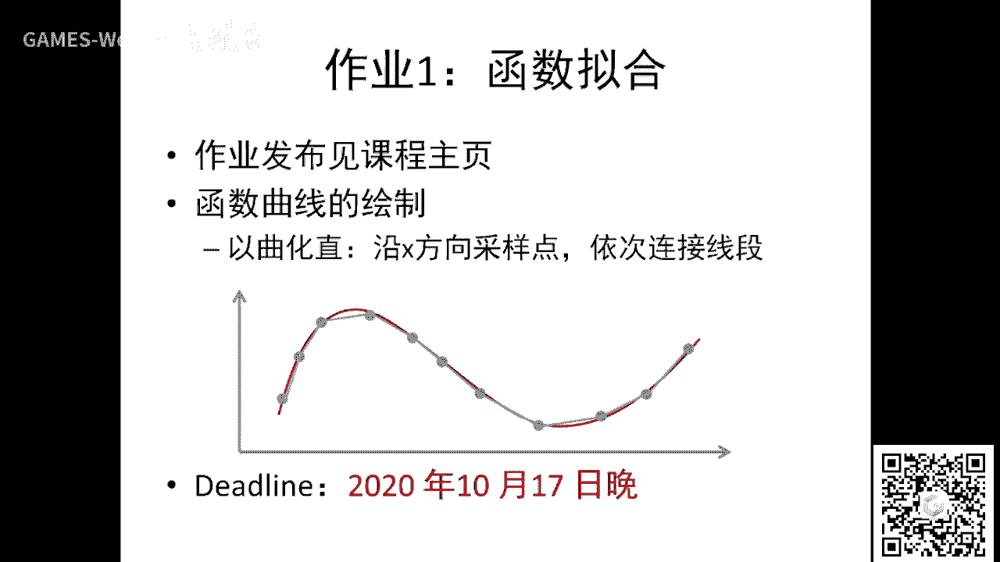

那么今天呢这个课程就到这里为止，好我们下周日再见。

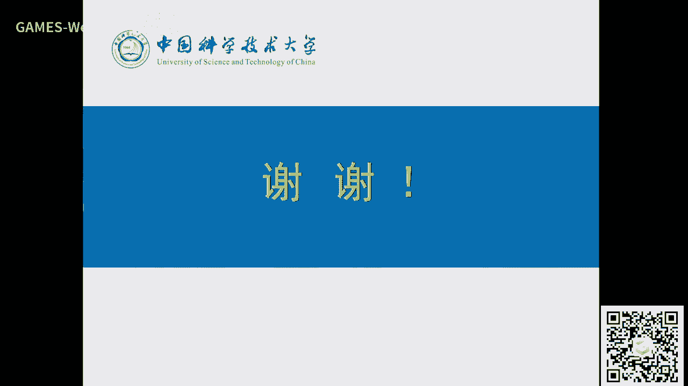

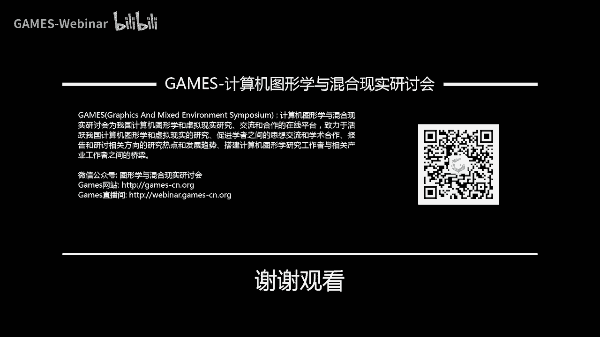