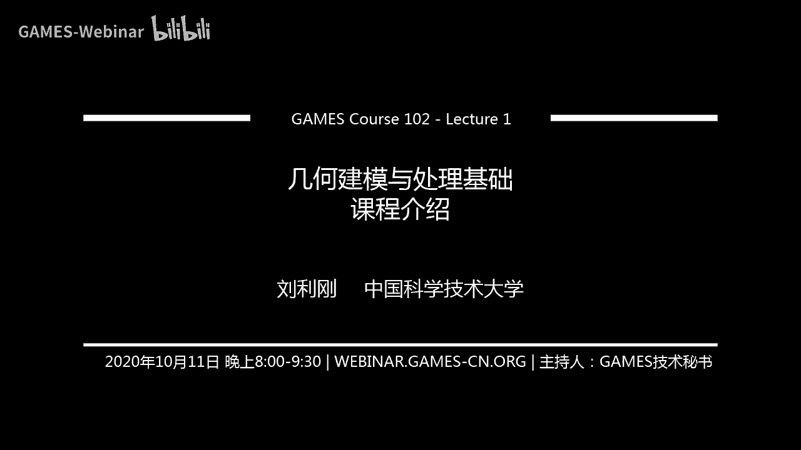

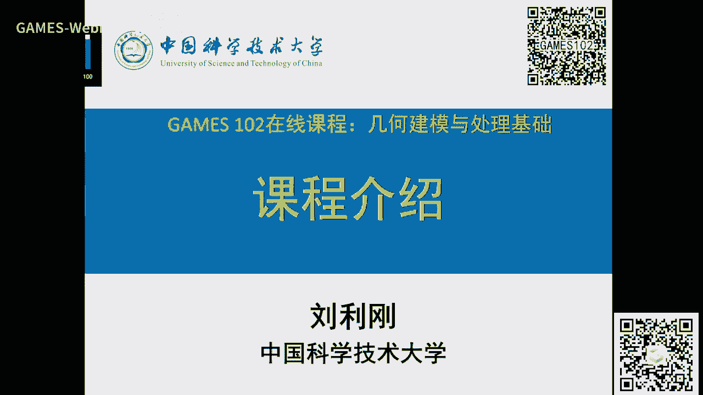

# GAMES102：几何建模与处理 - P1：课程介绍 📚

在本节课中，我们将学习GAMES102课程的整体介绍，了解几何建模与处理在计算机图形学中的核心地位，并初步探讨函数拟合这一基础建模方法。

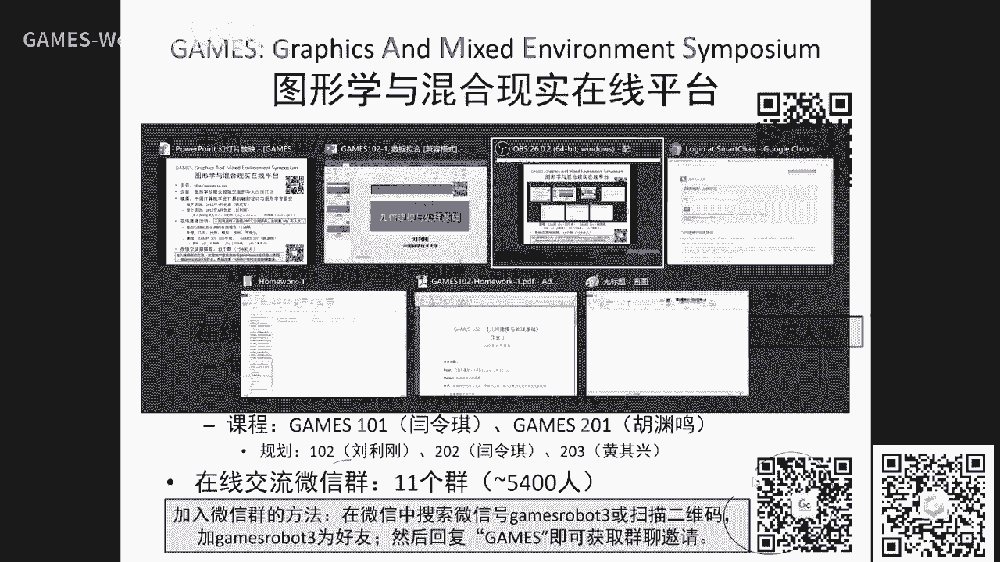

## 课程与GAMES平台介绍 🎓

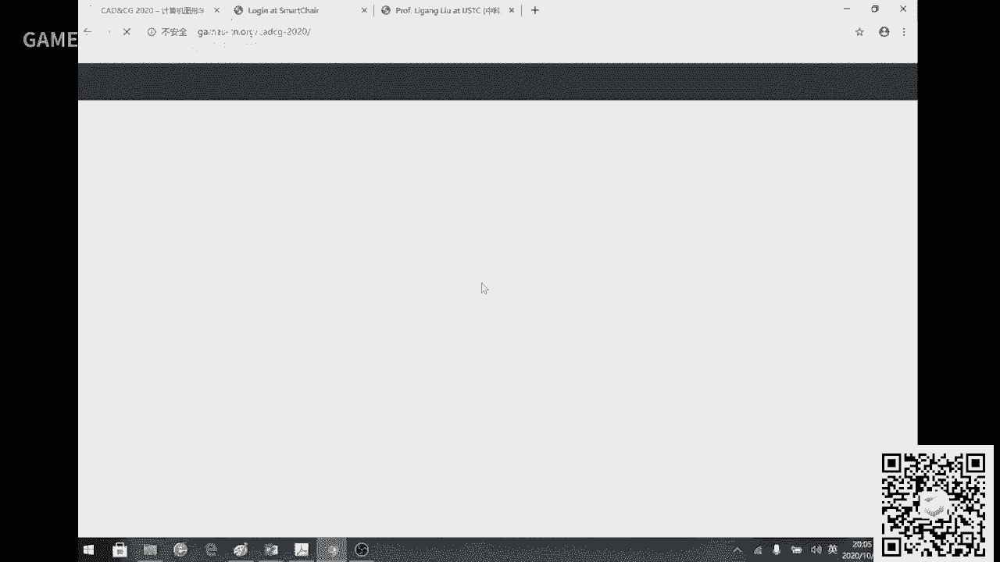

大家好，我是中国科学技术大学的刘利刚。很高兴在GAMES在线论坛为大家讲解GAMES102这门课程。在101和201两门课程结束后，我将开始讲解关于几何的课程。

首先，我介绍一下本课程的基本情况。

GAMES是“图形学与混合现实在线平台”的缩写。它的主要宗旨是为图形学及相关领域的华人社区提供一个在线交流平台。该平台于2016年4月由专委主任创建，最初是线下活动。2017年6月，我们决定将活动搬到线上，让更多人受益。自2017年6月网站上线运营至今，已举办超过158期在线报告。今年开始，我们创新地推出了系列课程，例如杨林青老师的101入门课程和胡渊鸣同学的201高级课程。下半年由我来讲授几何课程，明年还会有老师讲授202高级课程等。目前社区已发展至11个群，近5400人。如果还未加入，可以扫描屏幕上的二维码。

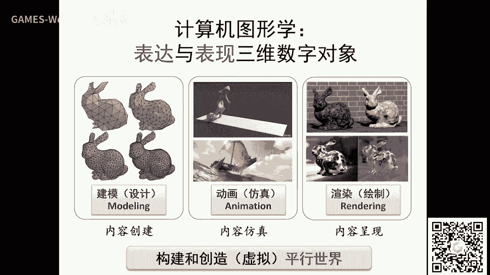

GAMES网站（games-cn.org）包含往期报告视频、在线课程资源、线下会议资料以及更多学术会议资源。我们积累了大量资料，旨在让不同方向的同学足不出户就能享受到高端讲座和课程。

过去三年，我们得到了许多老师的无私付出，特别感谢现任线上运营负责人周晓巍老师以及背后的技术秘书团队。虽然付出了很多时间，但我们也从中收获良多，我也是受益人之一。

关于102课程，更多信息可以访问我的个人主页。在课程注册时，我看到很多网友留言说没有数学几何基础，希望讲一些非常基础的内容。听众的背景可能从未接触数学到有一些几何经验，甚至是非图形专业的同学。因此，我会尽可能讲得通俗易懂。如果对课程有反馈，欢迎给我写邮件。本课程定位为基础课程，后续可能会考虑开设三维几何处理的高级课程。在中国科学技术大学，我们每年都会开设“数字几何处理”课程，相关录屏也可以在B站找到。

本课程将布置5-6个编程作业，难度不会太大，希望大家有时间可以跟着一起做。我们提供了作业提交系统，并建立了两个交流群和一个BBS论坛，助教（我的研究生）会在上面回答问题。课程结束后，我们会向认真完成作业的同学颁发结业证书。

## 图形学中的几何建模 🖼️

现在，我们开始讲解课程内容。建模是图形学中一个非常重要的组成部分。

大约七年前，我撰写了一篇介绍图形学的帖子，将图形学分为三大块内容：建模、动画与渲染。GAMES101主要讲渲染，GAMES201讲动画，而我今天的课程将覆盖最后一块——建模。这样，今年的三门课程就涵盖了图形学的三大核心内容。

那么，什么是图像？图像本质上是三维世界投影到我们视网膜或相机感光元件上的成像。由于感光元件是离散的，所以数字图像在计算机中是以离散方式存储的，即由像素组成的栅格图像。图像的分辨率指的是其像素的行列数。

图形则不同，它指的是具有数学表达的几何对象，例如点、线、多边形或曲线。图形也称为矢量图。矢量图存储的是几何元素的数学描述（如顶点坐标），而非像素。因此，矢量图可以无限放大而不失真，因为它会根据数学描述实时重新计算并填充像素，这个过程称为光栅化。而栅格图像放大后则会模糊。

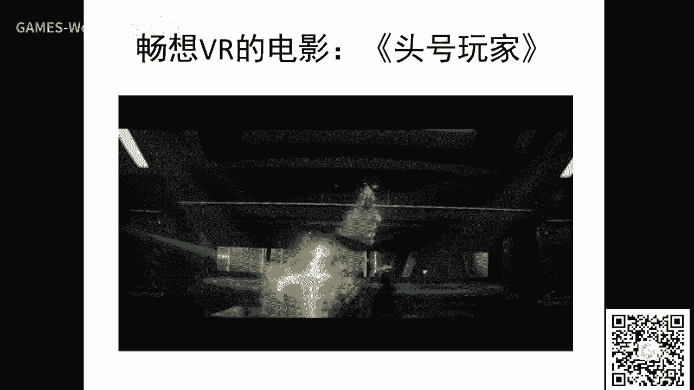

人类很早就会通过绘画来创造想象的影像。但若要大规模创造，例如制作动画，靠手绘是不可行的。因此，我们需要通过计算方法来创造图像。

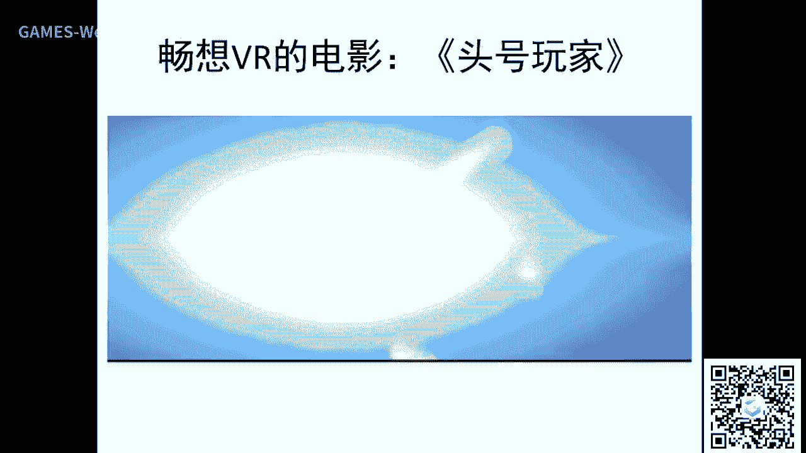

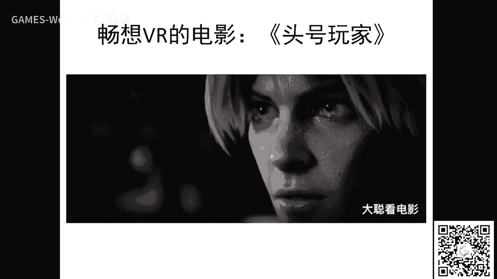

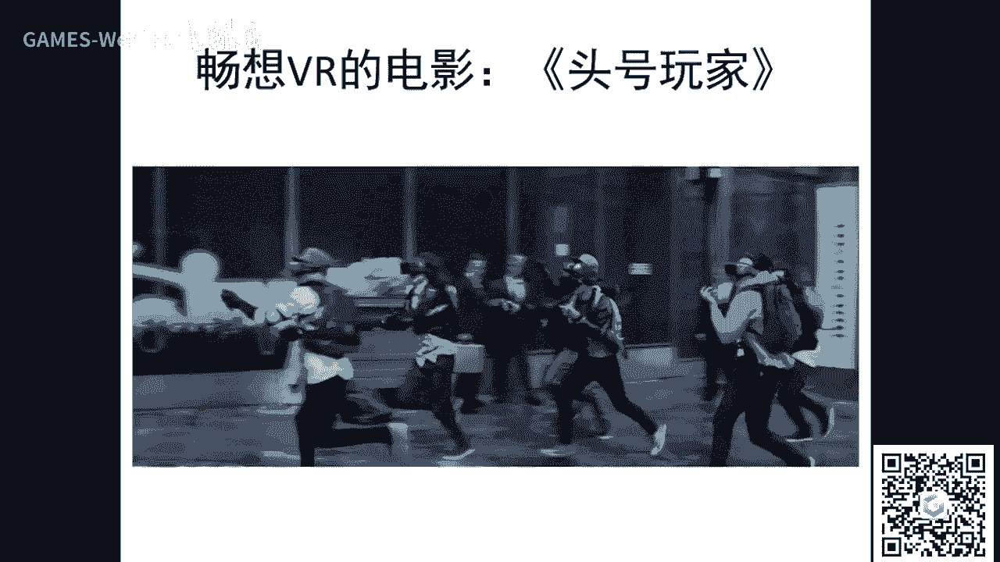

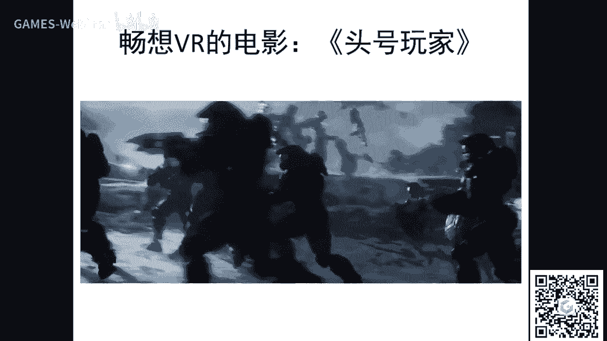

## 从成像原理到内容创造 💡

要计算生成图像，必须理解成像原理。成像需要光源、物体和成像平面。物体表面的颜色能否被看到，取决于光源与其材质的相互作用，反射或折射出的光线进入人眼或相机。这就是图形学渲染的基本物理原理，核心在于解算光照方程。

然而，要渲染出逼真的场景，仅有算法是不够的，还需要原材料：场景的几何模型、光源设置、纹理和材质。这些要素共同构成了虚拟世界的内容。在电影和游戏工业中，有专门的美术和技术美术人员负责创建这些内容。

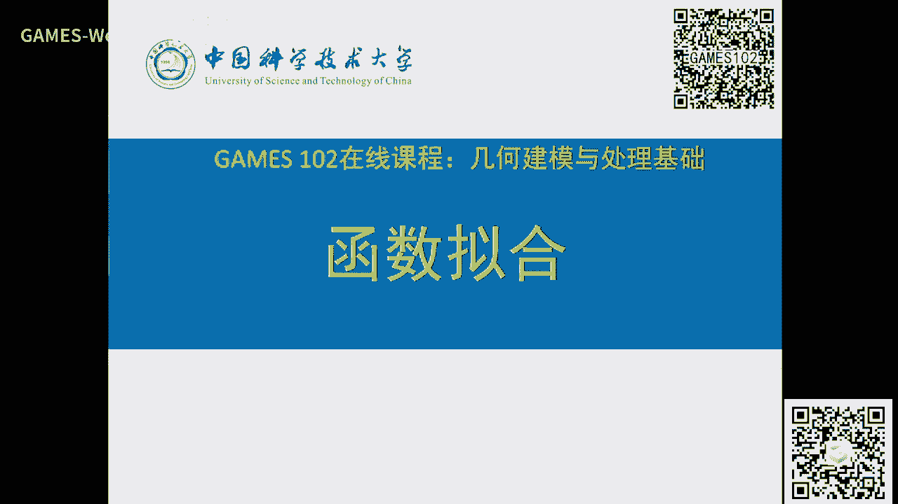

对于运动物体，如流体或软体，则需要仿真的科学，即通过解算各种物理方程（如纳维-斯托克斯方程）来模拟运动。仿真就是在做运动计算。

结合强大的建模、仿真与渲染算力，我们可以创造出如《冰雪奇缘》、《流浪地球》等电影中逼真的三维虚拟世界。这就像导演创造了一个真实的平行宇宙。

电影《头号玩家》描绘了虚拟现实（VR）的未来图景：人们通过设备进入一个由规则定义的虚拟世界“绿洲”，并进行社交和活动。这展示了未来虚拟世界的可能性。

## 几何建模：数据的来源与挑战 🧩

但是，创造这些虚拟世界所需的数据从何而来？要渲染出一个逼真的模型，需要建模、UV展开（参数化）、生成法线贴图、位移贴图、材质贴图等一系列复杂数据。这些数据的来源和构建非常困难。

虽然可以依靠美术人员手动创建，但效率低下。本课程的目的就是讲解如何通过工具或程序来构建这些几何数据。

几何建模有多种形式。例如，简单的几何体（方块、球体）可以用简单的数学表达。但工业上制造汽车、飞机所需的曲面必须非常光滑，这就需要连续的数学表达，如样条。在动画中，则可能通过细分和雕刻技术来建模。对于更逼真的效果，如半透明材质、毛发、金属锈迹等，建模手段和表达方式就更复杂。

几何内容的生成至今仍是图形学的瓶颈之一。本课程将重点介绍左侧这些基础的建模手段，右侧的高级建模未来有机会再详谈。

## 函数拟合：连续精准建模入门 📈

现在，我们开始讲解第一个正式内容：函数拟合。我们先从连续的精准建模讲起，建立概念基础后，再理解离散建模会更容易。

我也注意到很多同学在注册时留言，希望考虑到数学基础。因此，我会尽量清楚地讲解数学概念，并从一点点数学开始讲起。完全不讲数学是无法表达后续概念的。大家千万不要害怕数学，它本质上是一种描述规律的语言。

数学来源于实际需求，如计数和土地丈量，后来被欧几里得等人抽象为公理体系，发展成纯粹的演绎科学。我个人更倾向于将数学应用于工程问题。

将实际问题转化为数学模型的过程至关重要：首先用符号表达变量，然后建立优化、方程或统计等模型，最后通过代码实现算法求解。代码是验证想法的必要工具，但更关键的是从问题到模型的建模过程。

数学还要求善于抽象。从幼儿园具体的“苹果相加”，到小学抽象的“数字相加”，再到中学的“代数相加”，概念越来越抽象。

## 必要的数学概念回顾 🔢

以下是后续课程需要的一些基本数学概念回顾，非数学专业的同学也无需担心。

*   **集合**：具有相同性质对象的总体。讨论问题时常限定在特定集合内。
*   **线性空间**：在集合上定义了满足交换律、结合律等性质的运算后，该集合就具有了线性结构。线性空间中的任何元素都可以表示为一组基向量的线性组合，这大大简化了描述。
*   **映射与函数**：映射指一个集合中的每个元素在另一个集合中都有唯一元素与之对应。当两个集合都是实数集时，这种映射称为函数。一元函数的可视化图像是二维平面上的一条曲线。
*   **函数空间**：研究函数时，需要限定在特定的函数集合（空间）内寻找。如果该空间具有线性结构，那么寻找目标函数就转化为寻找一组系数。函数空间的选择很重要，它需要具备足够的表达能力（完备性）来逼近我们想要的函数。例如，魏尔斯特拉斯逼近定理指出，闭区间上的任何连续函数都可以用多项式级数逼近。

## 函数拟合的三部曲 🎯

在许多建模问题中，核心是寻找一个满足要求的函数。这可以归纳为三个步骤：

1.  **在哪找？（模型）**：确定在哪个函数空间中寻找。例如，是在多项式空间还是三角函数空间中找？
2.  **找哪个？（策略）**：定义“好”函数的标准，即损失函数。例如，要求函数必须经过所有数据点（插值），或要求函数与数据点的总体误差最小（逼近）。
3.  **怎么找？（算法）**：根据定义的标准，通过优化或求解方程来找到目标函数。

## 逆向工程与数据拟合实例 🔄

逆向工程是一个典型的拟合问题。例如，我们拿到一个船型的设计图纸，只有离散点，没有方程。为了制造，需要反求出描述船型的函数。

数据拟合（或回归）问题描述如下：给定平面上若干点，寻找一个函数 y = f(x) 来反映这些点的内在规律。

**1. 插值**
如果要求函数必须精确经过所有数据点，这就是插值问题。例如，用n次多项式拟合n+1个点，解一个线性方程组即可。拉格朗日插值多项式是经典解法。但插值可能对数据误差敏感，且可能导致数值不稳定（病态问题）。

**2. 逼近**
如果数据存在测量误差，我们允许函数不一定精确经过每个点，但要求总体误差最小，这就是逼近问题。最常用的误差度量是平方和（L2范数），由此导出的方法称为**最小二乘法**。通过求解目标函数关于系数的偏导数为零得到的方程，称为法方程。

**3. 过拟合与欠拟合**
选择函数空间（如多项式的次数）至关重要。
*   **欠拟合**：函数空间太简单（如用直线拟合曲线），表达能力不足，误差大。
*   **过拟合**：函数空间太复杂（如用高次多项式拟合少量点），虽然对训练数据误差小，但对新数据的预测能力差。为避免过拟合，可采用交叉验证、增加数据、简化模型或添加正则项等方法。

## 正则化与稀疏优化 ⚖️

为了在复杂模型和泛化能力之间取得平衡，可以引入正则项。

*   **岭回归**：在最小二乘法的损失函数中，添加系数的L2范数（模的平方）作为正则项，限制系数的大小，使模型更稳定。
*   **LASSO回归**：使用系数的L1范数（绝对值之和）作为正则项。L1范数倾向于产生稀疏解，即让许多系数为零，从而实现特征选择——从大量基函数中自动挑选出少数重要的。
*   **稀疏优化与压缩感知**：如果一个信号本身是稀疏的（只有少量非零元素），那么可以通过远少于信号长度的观测值，利用稀疏优化算法高概率地精确重建原始信号。这与函数拟合中利用稀疏性选择基函数的思想一脉相承。

## 总结与展望 📝

本节课我们一起学习了GAMES102课程的概况，理解了几何建模在图形学中的重要性，并深入探讨了函数拟合这一基础建模方法的核心思想：通过“模型、策略、算法”三部曲，在选定的函数空间中，根据定义的误差度量，寻找最能描述给定数据的函数。我们还了解了插值与逼近的区别，以及过拟合、欠拟合和正则化的概念。

然而，许多曲线（如一个圆）并不能表示成单值函数 y=f(x)。对于这类更一般的曲线、曲面以及高维复杂函数的拟合问题，我们将在后续课程中探讨。解决思路包括参数化表示、分段拟合并保证段间光滑性（样条）等。

**作业**：实现给定数据点的函数拟合（插值或最小二乘逼近），并可视化结果。观察选择不同次数的多项式时，拟合效果的变化。

**课程计划**：本课程前半部分主要讲解连续的曲线曲面建模（如工业界标准的NURBS），后半部分则转向离散的三角网格曲面处理（如重建、编辑、变形等）。我会尽量讲解核心思想，照顾到不同背景的同学。

本节课就到这里，我们下节课再见！