# GAMES102：几何建模与处理 - P10：曲面去噪 采样与剖分 - GAMES-Webinar - BV1NA411E7Yr

各位在线的同学们。

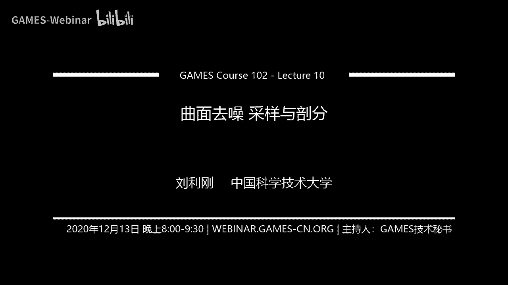

今天我们开始今天的课程。

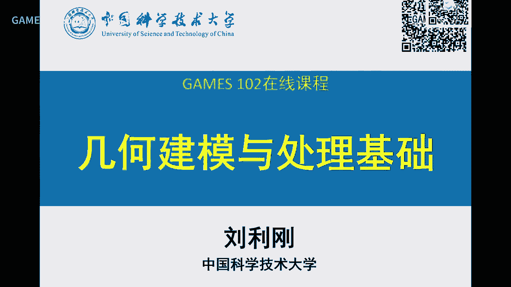

那个同样我们今天首先看一下。

这次卓业期的批改情况，呃 这次卓业总体上交的同学还是不错的啊 那个其中可能有同学一个压缩包是空的啊。

请这位同学检查一下啊 然后看看大家的一些作业的结果，啊 给交的同学基本上做的还是到位的啊 你看这个，同学是实现了两种这个称方方法 其实全不一样 一个左边是均匀权。

右边是那个这个计效取这个mean value啊 这个平均曲率权 就那个contention的权啊 可以看到，效果还是有点区别啊 那么怎么看效果呢 就要把一个。

矩形域上的棋盘格 等大的棋盘格把它印到局面上 就可以看出它那个，效果你可以看到这个均匀权的话 效果这些地方就不如，右边的结果可以看到那个参数化的时候 这个权对结果还是有影响的啊 那么。

如果是把这个，边界固定 整个性能方向图求解 就可以求计效曲面。

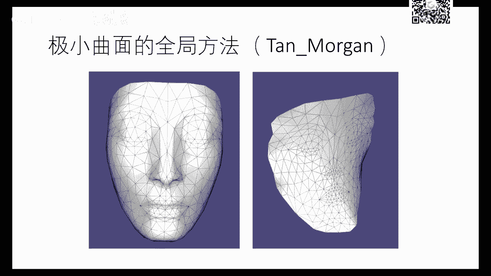

啊 那么这是另外一个同学的这个参数化 右边是他的结果。

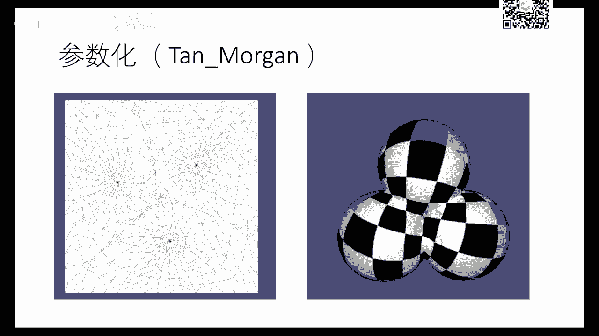

啊 这里应该是有个视频 我们来一起看一下 这是。

用utopia这个框架来做这个实验啊 可以在这里操作生成计效曲面，好 也可以生成参数化，啊 等等就可以看到他那个，随时可以在用共同的这个作业啊 把它几个作业都放在一块了啊 好。

那么 这个是另外一个同学做计效曲面跟参数化的一些演示，啊 也有个demo 这是全球法球，计效曲面 这是参数化结果，这次作业 大家发现全球法比上次作业的。

这个迭代的局部法要稍微快一点 也会稳定一点 这也是，看到局部迭代法的一些不足 那这样的局部迭代法呢 就比较容易实现 也比较快，好 这是威廉影视的结果，所以这次作业主要是让大家学会怎么去构造一个。

这个网格曲面的，这个拉布拉斯矩阵 以及怎么去求解一个大型系数方程组啊 因为这个非常重要，在后面的很多训练系里面都会用到 所以 呃 大家务必掌握这个这种系数方程求解的方法。

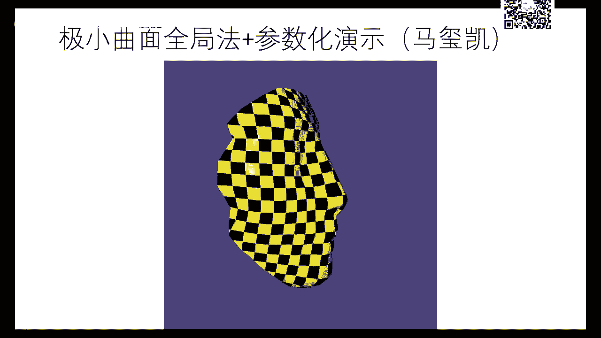

那么这是另外一个同学的一个演示，好 界面有所不一样 他也把这个平行曲率给他可视化出来了，好 他把它印到一个球面上的这个圆边界 可以看到他那个参数化的马上结果。

好 这是可以在不同的这个参数化结果中进行切换 边界也可以切换 所以他做的就比较，那个灵活，这是他的那个极小曲面的结果 极小曲面的平平曲率，我们再跳过去啊。

这是最后一个比较复杂的armduino这个模型的平行曲率的一个结果，好，好，行 他这里是一个优化 学照的一个结果，那么这是昨夜同样我们把优秀同学的。

就是昨夜比较优秀的代码和报告啊也挂到网上啊 课后大家可以参考，我们这里就不详细展开，这样的话 每次昨夜放在网上以后呢 同学们就可以自己去学习。

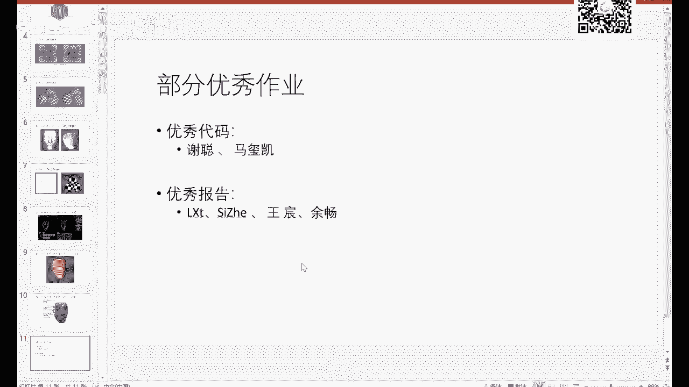

特别是后面补昨夜同学啊 自己去对比参考啊。

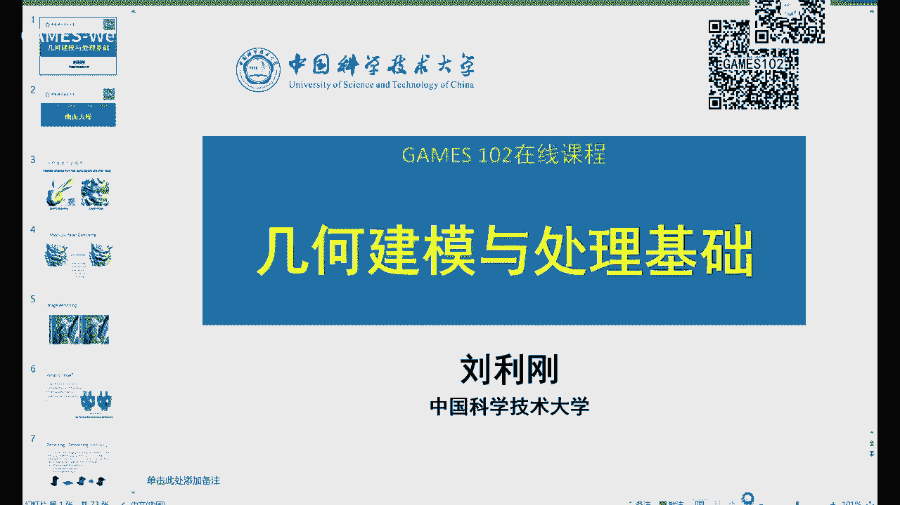

那么今天我们开始讲一个新的话题啊 有一个曲面很重要一个课题叫去照。

可以正常图层可以看到就是在我们，实际的应用中啊 我们的数据啊往往是从一些扫描仪或者是一些重建算法所得到的，那么由于设备的误差或者是重建算法的计算误差，那么往往的这个数据上面带有一些这种可以看到一些这种。

小的细节 那小细节呢 你知道这个可能不是顶点的正确坐标，他可能是经过了一些劳动啊 那么这个劳动呢 我们把它叫叫做噪声，因为这个噪声产生可能是由于测量仪器啊 计算误差所造成的啊 那么。

给定左边的一个带噪声这样一个网格曲面，如何能把这个噪声去掉 那么这个过程就叫做denoising，这个noise就是噪声 是吧 加个顿名词表示，这个操作 那么这个dee呢 大家应该是很常见的哈。

那个你们经常写程序会有一些bug是吧 就是一些一些错误，debug就是去掉这个错误 dee就是那个delete，的缩写啊 就去掉这个bug 那么denoising呢 就是去除这个噪声。

所以这也是这个领域所，所所专用的一个词 好 那么这个，把噪声给去掉 不管是网格还是曲面 反正这个，曲面就是连续的 网格就是离散的而已啊 那么这个。

还有一个是叫smoothing 以前我们见到过 是吧 这个光滑呀 光顺啊，也有时候会叫 把它叫做滤波filter 等一下我们会解释filter。

这个一个真的含义 当然还有些地方也把它叫做improvement，这个表示网格质量极高 当然还有些paper呢 也会用fairly来描述这个过程，但是我们以前在上班。

课介绍过这个fair 表示光顺 光顺呢 在造型里面是有特殊的含义 是指，比光滑还要更高要求的 就是不要有曲里抖动的那个词 但是呢 在在这个离散情况下呢 我们fairing。

跟smooth经常会混用 所以我再打个信号，这个你也可以 大家有时候也会看到这个题目是用fairing这个词 但意思是一样的啊 我们就是指。

怎么把这个噪声给去掉 虽然我们以前讲这个fairing 光顺还有更多的，不仅是去除噪声 还要去除多余拐点 这些限制 这些要求，这个可以回到前面几节课 可以看到这一这一。

这个词 这是正含义 那么在这节课里面呢 我们就是就是指把这个噪声给去掉啊 不是指这个整体的这个曲面的光顺的一个含义，好 这个去噪并不陌生 很多同学如果学过数字图像处理。

图像左边的那个lina图有些噪声 那么把它去掉啊 也也是同同样的这样一个意义，只不过呢 他们是针对个二维平面的图像区 我们是针对一个二维流行上的一个几何信号。

网络曲面来做而已 所以是那个对象不一样 实际上是，从这里可以看到就是我们做这些，操作 事实上本质上都是一样 就是对这个数据进行操作。

只不过你的数据呈现是在二维上的r g b这种像素呢 还是一个流行空间上的一个一个顶点坐标，所以从这个方面来看的话 同学们就。

对这个几何处理也应该不用太太多担心 为什么呢 因为他只不过这个信号的表现形式复杂一点，这个处理的手段 被编成的数据结构复杂一点，他的很多方法都是可以从图像的相关的一些这个问题就是。

比如说这个去照问题 图像也去找问题 所以在图像领域有大量的这种去到的算法，同样都可以把它迁移到这个二维这个流行上的，数据上来就是我们的网格曲面啊 所以这个。

如果从这个角度来看的话 如果同学们对图像处理比较熟悉 事实上对网格处理呢就是把这个，数据的类型把它变一下 把这个关键的一些流行上的数据的这个形式把它想明白。

基本上就可以做很好的研究 或者是解决很好的问题，好 那么讲这个之前的话呢 这个什么叫噪声 noise 什么叫noise 上这个呢，没有一个非常严格的定义 我这边右下角看到我这里写了。

就这种模型来讲 我知道上面就有噪声 但是怎么正义噪声呢，你是说这个这个是什么量 是是是大一个什么值才是噪声呢 这个是很没法确定的。

所以人们呢 往往会采用一些这种经验性的描述 比如说这个高频啊 这个小部分，还怎么还还一些什么小的小的这个bumps，这个振动或者叫包啊 还有什么曲率比较高的地方。

还有还有什么 我定一个能量 这个能量很高 就像我们以前做光束一样的定一个那个曲率的一个平方的积分，这个地方如果这个积分很高 那么我就认为这个区域是有是有噪声的。

但这些呢 事实上是都不严格 因为什么 什么叫high 啊 什么叫高 什么叫是small 是吧，所以这个没有个量化 比如说你说high coverage parts 就是这个曲率比较高的地方 大的地方。

那这但是这些群这个网络本身的尖点或者叫一些不连续点，不光它点也是曲率很高啊 你怎么这个可能就是会把它当做噪声呢，我这个是要把它留下来的 所以说噪声在一定尺度上跟这个future是很难区分的。

就是这里就呈现一个问题啊 就是往往你有时候去照，过去照了以后会把这个本来这个几何体的一些特征就就像这个右边的这个弓箭一样的，把它的一些边和角给它磨平了 那么这时候这样你就去到结果。

就不是你所想要的 为什么 你给你改变了我以前的这个几何 所以说怎么样保证这个，保持原来这个几何模型的特征情况下去照 这个是一个一直是比较难的问题。

这里可以说 我就展开一下 这里可以说这个噪声跟future这个保持，是一个chicken leg 就是叫中文叫鸡生蛋 但是鸡的问题，如果你能够把造成去掉 特征就就容易检测 是吧。

反过来我特征如果能够检测到这个右边 左边这个特征是在哪 假设是这条线跟这条线，那么我去照呢 就就会相对容易点，所以这两个问题啊 实际上是是是卡不在一块的。

这导致这个去照啊 在对一些 特别是这种cd零件带有特征的这种尖锐特征的模型呢 是比较难处理，往往就会把这个边角啊 叫角点给他给他磨掉了，所以这个噪声到现在为止都还是只是一些定性的描述啊。

比较小的bounce 比较高的这个curvature 这些一些描述，所以这个要根据具体的问题啊 具体的应用来来这个尝试这样用不同的这样一些参数或者一些量来规定，好 那么这个是在维基上看到这个。

有人对噪声去照这个问题的一个描述啊 上次这个也是差不多，他的意思是说 我给定一个这样带噪声的问题，我怎么样找到一个逼近函数 使得这个这句逼近函数 使得他能逼近这个这个这个值。

并且保留这个这个数据中的一些叫important pattern，所以所以这个描述呢 也是定性的 那么什么叫做important pattern，这pattern是什么 对吧。

对我们对我们这个例子当然简单 pattern就是这个三个平面 两条折边啊，但是呢 如果这个数据为数很高 或者是为数数据很复杂，这个pattern你本身就是一个问题啊。

这也是机器学习领域也是在纠结的问题 是吧，我给了很多数据给你 你怎么样去找你的pattern，让使得能够表达这个数据的这个数据的规律啊。

同样我们这里也是 只不过这个数据呢 是一个二维流行上的一个数据而已，好 如果我们要把他变成一个formulation 变成一个数据模型，好 我们输入呢 是一个带噪声的一个m。

我希望找到一个m0 m0就是我希望的理想中的这样一个没有噪声的一个曲面，那么一般的这个模型就说 哎 我知道这个这个输入模型是我的理想曲面加了一些noise，这个noise我们这里就用ε来表达。

所以呢 我输入是一个m 要得到得到一个干净的 没有噪声的m0，当然 噪声把它去掉 就是ε，所以这个问题呢 显然是一个eo pose的问题啊。

这个很多视觉的问题也是这样啊 我只有一幅图像 我要回过他的几何和光照，这个 这两个都不知道 他们就很难的 这个叫eo pose的问题啊 就是，啊 这个问题就比较难 因为什么 我是不知道m0和ε。

刚才我也讲了 他们两个是cover在一块啊 这个这两个谁先知道都有另外一个问题的解决，好 所以呢 这个问题就相对来说这个是比较难的一个问题啊，但是难 我们也要把它去解出来哈 那我们看看。

在这个业界或者我们学术界有没有一些方法去解呢，当然有了啊 好 我们就一步步先把问题做简化，假设是我一个网格网格曲面啊 就是左边的这样一个，对啊 它是网格 只不过每个顶点呢 它有一些抖动。

所以造成这样一些噪声的这个这个样子啊，所以呢 我们先把这个问题呢 变成简单一点，我们就是求什么 求顶点一个新的位置，啊 比如说每个顶点进行一些挠动或者偏移。

哎 使得这个我构成的网格啊 这个右边这个网格呢 哎 就非常光滑，啊 这个也保持了一些尖锐特征 这就非常好了啊，好 那么这里有个问题，我们的顶点应该怎么样去偏移 怎么样去劳动 或者叫怎么去修改。

那么这个顶点是朝哪个方向去修改啊 就把这个，问题呀 从刚才这个问题变成一个具体的啊，我就要去搞清楚每个顶点的偏移的量，我就可以去求出这个去照的方向，好 进一步我们把这个网格问题就变成这样的问题。

我已知一个代造成的m 就是上面每个顶点是v，我要去求一个m0 顶点变成了v0 v0就是m0的一个顶点，我认为呢 这个这个这个代造成的顶点呢 是原来这个干净顶点加上一个偏移量。

这偏移量是什么 我进一步又去这个，啊 这个假设就他是朝某个方向偏移了一个epsilon距离，啊 那么 那么这个这个方向是什么 对吧 方向是什么 对吧。

好 如果这个方向我知道了 那么这个问题就进一步会简单了 是吧，所以呢 一般大家很容易想到哎 我这方向是不是就是，v0的一个法项就好了 对吧 如果如果这个这个造成都是。

沿着这个原来这个曲面的法项去劳动的话，这个造成这个特性就就就是相对简单一点 是吧，好，所以这个这个这个n呢 如果你是取为0就是那个未求的那个，曲面的顶点的法项 但是这个这个曲面还没求出来。

所以同样是一个又破译问题 所以以后也导致这个问题很难解，哎 所以所以说哎 我们能不能想一想就是，或者变个思路 我们是假设是为这个原来这个网格就微分网是知道的。

用他的那个normal来来做呢 至少就让这个问题可解了 对吧，但是虽然他不是精确的 但是呢 我经过若干次迭代，随着这个v啊这个造成越来越少的时候呢。

这个normal啊这个会越来越逼近这个理想的曲面的normal，这就是你们作业6所做的极小曲面那个作业的一个迭代过程的一个思路，好 那么我们model就变成了啊，那么我也假设已知道n。

这个原来的曲面点点v 我只要沿着这个n偏一个epsilon就可以了，这epsilon是等于多少呢 哎 这个就是你自己，经验去取 当然你理论上可以证明或者某些结论啊。

epsilon取多少就迭代是稳定的 我们这不展开，就像有些同学说 哎 0。1是不是不合理，对于有些模型0。14是过大了 是吧，可能要0。05或者0。01这个步长，那么这个我就不想你展开 这里就是一个。

基于这个拉布拉斯这样一个坐标的一个光方寸，就每个点呢 这个点的朝他的这个，这个法项方向 这方向就是那个平均曲率法项的估计啊，这个就是你们左右6，是左右7 左右6和左右5这个这个方法啊 就是这个练习。

那么光纯呢 刚才也提到了一个叫filter 叫叫滤波，那滤波呢 实际上是数学上在数学分析或微积分里面一个概念啊，这个我这里稍微解释一下 因为这里面，还是有不少理论的东西可以讲的啊。

就是两个函数啊 一个叫xt 一个叫ht，他们两个的这个卷积啊 这是一个新的函数，你可以把它变成啊 比如比如这个g t等于什么，他变成是t 他这个符号这个新的函数。

他等于什么呢 xt跟ht呢 这样一个乘积的一个积分，啊 把它理想形式就变成这个样子，好 我我这里画个图啊，你这个上下面这个图如果仔细看 大家可以看得懂，我们这里有一个几何意义 大家要理解。

理解到几何意义以后呢 就容易理解这个滤波是在干嘛，我这里啊 这个示意性的，再详细画一下啊 假设这里有一个所谓的xt，好 那么这句话证明呢 ht啊是一个全函数 ht。

而且ht呢 他也是个函数 假设这个函数呢，我这里取一个特殊的啊 叫高次函数，在0这里呢 是最大 越远0呢 是是是越小 那什么意思呢 你看，那么对某一点x。

我要去求这个函数跟这个函数的两个函数的卷积是什么意思呢，我就把这个函数啊放到这里来，放在就偏偏移到这个x这个地方了 好 怎么呢，我就对应点相乘 对应点相乘。

对应点相乘 当然注意啊 这里实际上是应该把这个ht做个近近面以后再再相乘，因为我这个ht是对称的 所以我这里画出来是一样的啊。

实际上是应该是这个点跟这个点相称 我把它做个做个近镜像好了啊 做个对称好 您说，这个值跟这个是相乘 加上这个值跟这个是相乘啊 这是理想情况 那么对于连续就是做积分嘛 是吧。

好 这个什么意思呢 假设这个ht是一个这样的高产数 是不是相当他是个全函数啊，这个全离我0点越远就表示越小 离我这里0越近就越大 表示这个点的值啊。

我用周围的一些值来进行加全 离我越远的地方呢 这个全系数是越小，离我越近的地方呢 全是越大，所以呢 他相当于把这个点周围的一些值啊 给他我平均起来了。

那么平均他不是均平均 他是一个加全平均 这个全呢 就是这个ht函数所提供的，所以说你如果ht提升这样一个高产数是很有道理的 为什么。

我离我越远的呢 这个全对我的影响加全的对我影响小 离我越近的对对我影响比较大，而这就叫滤波 所以滤波是很有几何意义的。

这个可能大学里面很多老师没有把这些东西交给你们 只把这公司交给你们的话 你们就很难记住，事实上你只要记住这个几何意义 那么这个这个滤波的概念或者几何意义，或者意义是什么意思 为什么用就很容易理解。

什么意思 就是用一个函数作为一个全函数对这个点周边的值进行一个加全，那么这个这个ht你取成高次函数是比较通常的做法，你取别的函数可不可以 当然没问题 你只要只要是一个。

加全等于1的一个一个函数 基本上这个都可以用来做这个卷积，所以卷积的意义是什么 就把周边的值给它平均，那么如果周边有些值是比较比较比较高的，噪声 它那一平均以后呢 就是因为噪声是比较稀疏嘛。

所以它不会被平均压下来 又把这噪声给去除了，所以滤波本质上也是在在做一个中间的一个周边的一个光滑，那么这里就有问题 你如果平均的话 这个特征就会丢失 对吧。

所以这里面后面大家又会去想怎么去构造保持特征的这个滤波，对吧 这个后面我们再讲啊 我们先把这个滤波给他讲明白，啊 里面这个滤波以后你看公司就是什么 就是在在做加全啊。

所以这公司只是这种 这个这个几何意义的一个体现，数学从来就是个符号系统啊 所以大家不用怕，这个上我希望大家这个这个不要看到公司就觉得好像很难，不难的啊 只要你理解。

就理解好了以后 你就知道他这个这些文章中的公司是啥意义，好 那我们就把这个滤波这个在这样一个形式化。

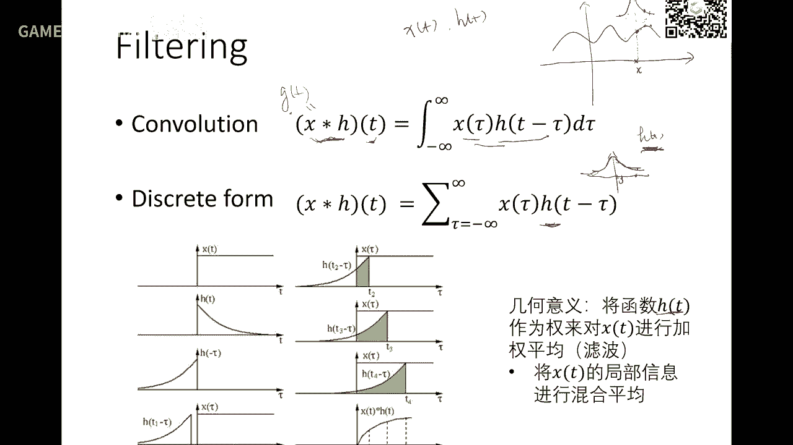

就是这一点 这是原来的一个信号，我们讲信号也好 讲数据也好 反正就是一个数据啊，这个i 所以用这个i呢 用一个这样的这样的函数，这个函数你可以看到是二维二维了 图像平面。

所以他的加全函数啊 这个就是个这个二维的一个高斯 是吧，就是跟距离相关的 就是rbf嘛 就是景象机函数去加全，加全以后呢 就中间就变得光滑了 噪声也被去掉了啊。

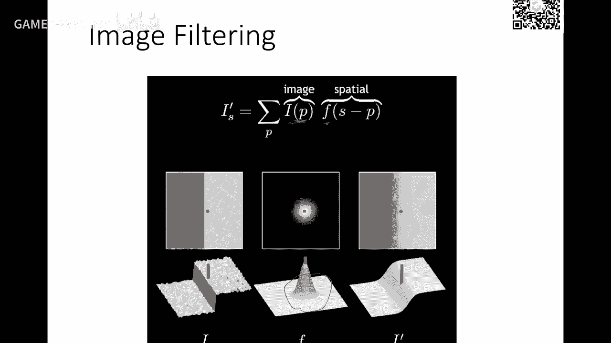

就是这样一个意思，所以呢 人们往往喜欢用这个高斯函数进行加全，因为高斯函数有很好性质啊 首先它是概率密度函数，因为积分等于这个这个这个相对面积啊，另外就是这个函数具有对称性 它是跟这个距离相关。

离我这个点距离越远 这个值越小 是吧，离我越近 值越大 就是大家经常，不经常基本上都是会用高斯函数作为加全函数啊，好 这是图像的一个势力 图像势力就是叫卷积，卷积这个这个这个眼罩 找眼码 mask。

就是拿一个比如三乘三这样大小，当然这个是个是个是个这个kernel呢，是一个比较均匀的九分之一 拿这个九分之一跟这个，跟这个三乘三啊 对应值相加啊，这个这个就得到了这个这个区波后的滤波后的值啊。

那这样从左到右 从上到下滤一遍啊，所以这个操作就是就是非常快的啊，这个我再提一下 好 我们回到平面上来 而且三分钟来，好 那么上三分钟的话就是怎么样跟这个加全呢，实际上是我们一推倒就知道了。

实际上是就等价于这个点呢 朝他的一个方向，我们刚才讲的这个某个法相方向去去偏移，那么这个我们在上期课讲过，拉布拉斯这个向量就是法相的一个很好的近视，如果你是考虑口腔的这种权的话。

咱们就考虑这个几何的信息 那么这个近视是非常准确的，或者就在极限意义下 它是收敛的或者逼近的，这时候你就放心用啊 所以你们已经理解这个方法了，所以滤波对象呢 除了那个顶点你可以滤波。

你是不是法相可以滤波啊，因为法相他有也是转来转去的会有，甚至包括曲率可不可以滤啊，你上面如果颜色有噪声就像平面上的噪声一样，图像一样的 是吧 当然你还可以滤别种，所以这个滤波对象我们今天重点可能讲顶点。

法相后面会提一下啊 同样的别的也可以做好吧，那么当然你们做过了那个局部法以后，你发现这个这个这个迭代次数啊，就是那个步长 逸步虚荣这选取都是很重要的，如果选的不一样的话 哎 就可能迭代什么过过方法了。

over-smoothing 是吧，有可能啊 这个产生很严重的滞交 还有还有萎缩现象 对吧，所以这个趋兆呢 这种方法毕竟虽然比较简单，但是也有它自己的一些问题 好 那我们。

先讲一讲那个顶点去去造光顺的啊，我们最熟的就是拉布拉斯，所以今天我们可以很快讲掉这个部分，因为你们已经做过作业了嘛，啊 虽然是那时候是面向极小曲面，你们在面向极小曲面的这个局部法 每一步都是在做去造。

对吧 因为你把噪声全部去掉不就是最光滑了吗，就极小曲面了吗 好，所以这个图一看你们就明白了啊，做过作业 做过作业的同学啊就非常明白啊，我就不展开 好 那么这个方法就是啊。

就是不断的去用用用一个lambda值，未来有些方法可能会自动决定 决定这个lambda是最好的，那么一般的话我们都会取个经验值，不断去迭代就可以了啊，这里这里有一个东西挺有意思 大家可以推推。

事实上的这个拉布拉斯光顺呢 是等于加什么 等于加于，我这里画个示意图，这里有一圈鳞鱼啊 等于加什么呢，你去极小化，就这个点要移到哪呢 极小化他们的边长的平方和，就是他们的边这个鳞鱼边的边长平方和。

极小化这个值式性 等于加于是做拉布拉斯光顺，这个是可以证明的 我再提一下，好 那么光顺就有这样问题啊，你如果如果参数取得不好 或者是集在次数比较多。

就会容易产生over-smoothing 就是特征没了，这种被我丢了 像这个眼睛啊，本来这个有个眼珠的啊 没了 是吧，这个就会产生问题，这个叫shrinkage 就是缩缩的问题。

啊 就特别是这种简单的拿拉布拉斯光顺，我以前也解释过 因为这个这里的比例比较密，他的拉布拉斯向量比比较小 这里比例比较稀，拉布拉斯向量比较长 所以这边的光顺就就会快一点。

就为这边缩缩的快 这边还保留着一个比较高的，最后呢 还这个这个这个角度收缩掉了 没了，当然无穷以后呢 还是会变得已经同样平面，那这样这种结果可能也不是我们需要的，那有没有办法去改呢 当然有了啊。

那我们都会想到很多办法出来，所以拉布拉斯光顺呢 又有一些改进的啊，我这里一下他的思想 距离不展开，这是我们常见的拉布拉斯 取个lambda 是吧，那么呢 那么在90年代呢 就有人说。

哎 我收缩完以后 我再怎么 我再把它扩张回去，你可以看到啊 这里这里首先是先收缩，然后再怎么 再再扩张一个一点点，这一点点呢 就是用一个拉布拉斯的两两级拉布拉斯，啊 就是相当于我再起来补回去一点。

啊 还有些呢 哎 这个呃 我用双拉布拉斯，拉布拉斯就更光滑 它是个四阶的微分量，啊 这个叫by labration啊 就是双，就是相当于是拉布拉斯 这是拉布拉斯一算子，再给他做个算子。

好 我们会把它记成这个这个算子，就是这个平方的算子 这个就表示更光滑了啊，也有这样做的 好，可以看到 这是一般的拉布拉斯 这次用的那个加上了那个。

expansion 就是那个扩张的时候 就稍微把细节给他补回来一点点，造成也能去掉 好，好 那么 嗯 这个第二种方法就是mean curvature。

mean curvature是什么 我们中间加了一个平均曲率的估计 是吧，这样的话 它是朝平均曲率这个流 等于0的方向去去去去收缩，这个大家也有体验了啊 那么这种方法呢 就跟几何相关。

因为他那个权是cotent的那个权，所以他这里呢 cotent权呢 他会小一点 这边会大一点，所以你可以看到 你如果用你如果用这种方法的话，你你收缩的过程中呢 这三个峰啊 都保持着同样的高度。

就不会像刚才那样的话 一个一个塌的非常快 一个塌的慢一点，这就是要考虑几何影响的这个权，就会对这个结果产生这这这些影响，那么具体的Nissan mean curvature这个权 大家都很熟悉了啊。

你们是你们做过作业 都非常清楚啊 这也是他的一个比较，好 那么刚好群里面也有人同学在问 如果保特征怎么办，这里呢 我们提一个比较 比较通用的，或者是当时也是从图像里面借鉴过来的方法。

叫双边滤波 就是我们记住啊 刚才的一个，这个和啊 和函数是对什么 对这个数据本身进行了一个，啊 就是他周边的值进行一个加权 是吧，这个s周边的那个相中值也可以是他的一个顶点坐标。

我们这里呢 又进行了一个加权 就像像什么呢，我考虑这两个点之间的值的这个这个这个差异，如果这两个值差的越大 这个权呢就越小 什么意思呢，我一个点周围的值 值什么意思呢 值就是跟他相差很大。

相差很大说明可能他们之间可能会有一个特征，比如这个点，我们应该看看这里 比如在这个点 如果取个领域，他的领域可能有些领域跑了跑了跑到这来了 是吧，你看这个值跟这个值是不是相当很大。

所以这个值就对他影响应该要大量减少 甚至不影响，所以他把这个值的因素也加上来了以后，来给他又给他一个和函数加权 加上是两个和函数跟他一起加权，我不仅要距离要一个影响 而且值也要给我有影响。

值相差越大影响越小 因为什么他可能发生在有特征的地方，他的值一下子跳跃非常快 我就不要考虑他对我加权了，这样的话就就会爆特征，所以这个双面滤波当时在十几年前吧，03年有两篇文章同时提出来。

上次这个想法在图像渠道里面已经有了，下面这个除以这个呢只是为了把它规划。

规划就是为了这个这个权值等于，那么这个有一个例子，首先special就是指距离上就是从传统定义上的这个加权，而距离越远就加权越小，这个呢就是什么值 就是一定影响力，就是你看可以看到像这里有一条尖锐边。

那么这里上这些点呢就这个权呢就没有影响，为什么 他因为这个值相差很大，高斯函数一下子就让他变得很小 甚至非常非常非常小，所以影响就不大 所以说你在这一点的去求他的滤波的时候呢。

这一半的这个像素也就是这里的值，对这一点的滤波是没有影响的，为什么 这个高斯函数一下子把他率性掉了，这就是双边滤波的事项，当然你说我还可以考虑别的吗，我再加个高斯核可不可以。

有 这个叫tri-lateral 叫三边滤波，你觉得还有什么因素可以考量吗，比如说法项考虑进来可不可以，再给他加一个法项的影响fgh是吧，可不可以 有这个叫tri-lateral。

也有人tri-lateral 三边，你说我四边五边可不可以，这个就没意思了啊 就是就是没有必要为更多，就是说你这个就是考虑一些重要信息，你就可以去创造更更多的这些加强方法。

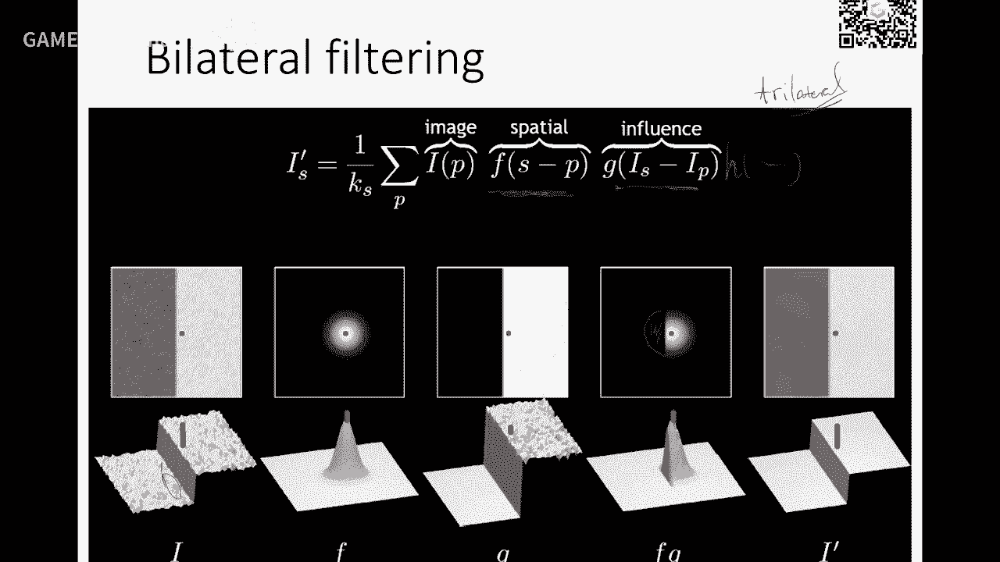

好 那么看看这是这双边滤波的一个意义啊，可以看到这个高斯函数在这里一下子就变成很小了，因为这个值很大 是吧。

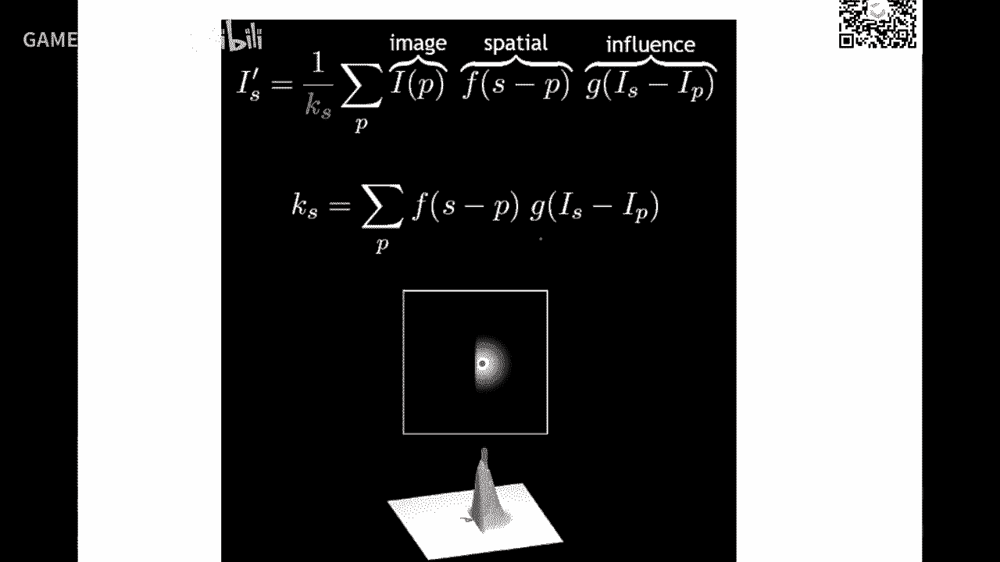

值很大就 值就变得很小，好 那么同样这个想法能推广到网格局面，我就讲讲思想啊，这个如果要感兴趣可以看一下，secrub2003年一篇文章，题目就叫by lateral filtering。

好 这是一个曲面上的，我们就二维来演示啊，一些点 这个点呢，事实上分布在这个曲线的左上下带有招生嘛，好 我们来看看这个蓝色点的一个去照，好 那么蓝色点，离这个理想曲面都是有些距离 是吧。

所以我们也不知道是这些理想的曲面在哪里，但是我们可以估计出这个蓝色点的一些信息，好 那么信息怎么样呢，我们就要要要保持这些信息啊，那么我们一般的会怎么，首先算出这个点的一个法项的估计。

这法项估计呢 我们后面可能会还会想一展开，这个我今天介绍思想，一般的会取这个点的周围的一部分数据，然后做一个最佳线性逼近啊，这个逼近呢叫PCA。

叫principle components analysis，就是叫主源分析，那么主源分析的这个应该是一个3*3的，一个矩阵的特征值，最大特征值所对应的法项啊，这个像这个相量就可以作为他的法项的逼近。

这个是通用大家都非常熟的啊，就是一个点的法项怎么估计呢，用他的领域做一个最佳线性逼近，一个平面啊 在这个二维中心这个直线，那么他的法项就作为这个点的法项估计，好 然后呢把所有点的往这个法项上面去投影。

是不是就有个距离，好 这距离就让什么呢，就让离这个切平面的远近，越远的点呢 是不是因与他，就是这个值越大的点是不是因他，应该离 因他影响越小，好 那么再看这个距离，这里越远的对他影响越小对吧。

这个值越大 影响就越小，所以把这两个值考虑进来，就是叫双面滤波，如果不考虑这个值对他影响的话，只考虑这个距离呢就是通常的单面滤波，网上单面滤波和双面滤波就这样一个做法，好 那我就不去详细讲了。

然后做法就是你去算切平面，然后去算刚才那些值，然后呢 然后就用高斯核去把它加权一下。

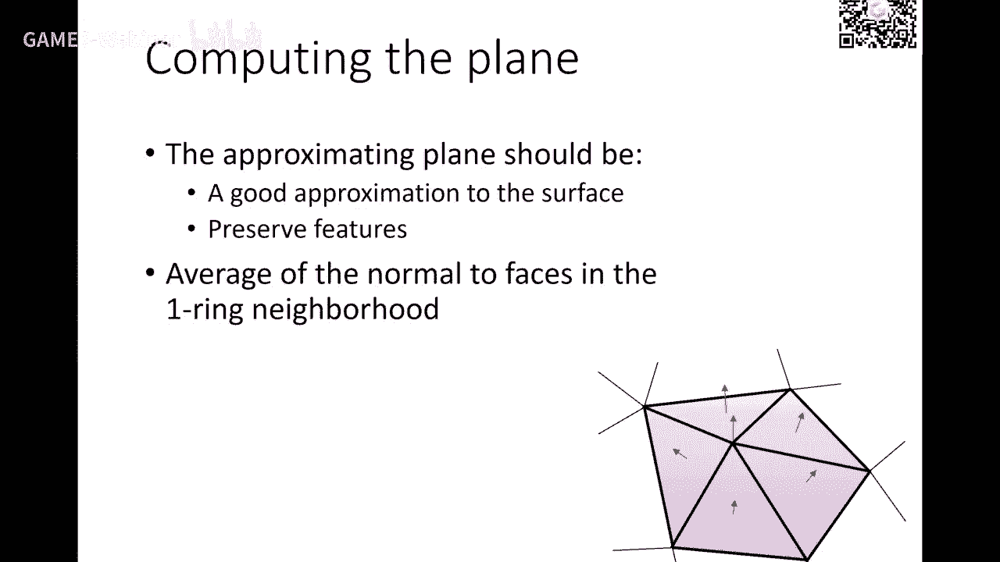

加权 所以这里两个高斯核都是两个参数，你也可以去设 参数不一样 结果都不一样，所以一个算法呀 他一定会带有些参数，这参数呢对这个结果是有影响的。

那么当然这一篇文章对当时提出来的时候呢，对这个做了很多例子，可以看到做了几次迭代以后，他有些特征就越来越会明显一点，好 具体呢 大家可以去尝试一下，这个算法实际上不难。

因为就是一个这个两个高斯核这个滤波 是吧，你们在昨夜午时实现了一个非常简单的，这个这个法项就是拉帕拉斯像那样的一个。

用他的第七代 这里呢稍微算一下，这是当时一些例子，大家可以看到当时在03年17年前，在SIGGRAPH那时候这个方法还是比较新的，效果也还不错，当然最近十几年发展，又有很多新的方法超过他，好了 那么呢。

这里再给大家讲一下另外一种这个滤波的，就是刚才呢是顶点找他的一个法项，那么那么用作为点跟他一个做做一些滤波，这个平均是吧，平均呢就可以得到新的法项 偏移方向，那么还有那个这就是用老的这个方向来决定。

事实上应该什么呢，应该是用最理想的那个曲面，所以说应该用新的法项来做是不是会更好，那么这种方法叫隐视 为什么，因为这个东西还还没知道还不知道是吧，但是呢如果你是用了新的曲面的法项来做。

这个估计那应该是更有道理了是吧，但是呢这个呢是两边都是未知数，所以这个叫隐视方法，因为从从这个是可以推出下面这个式子的，就是说你这个拉巴拉斯这个南无阿达是在这，你去做这个一个迭代。

那么这个方法呢就叫隐视方法，他要通过求解一个西苏，就现行西苏方程组才能才能得到结果，就是有点类似于你们实现的那个拳击法，就是这次作业的拳击法，所以你只要看一次想，那么最后他变成了什么方程组呢。

你们现在已经有能力，做过作业的同学就有能力去实现他了，就不难了，所以为什么我们会设计的时候会把，西苏现行方程组作为一个非常重要的一个作业，给大家去做掌握他，那么这些方法就自然都会去实现了。

具体你这个看一下这个公司或者相关的文献，就可以看得懂了，好，那么还有一种呢，刚才我也提了一下，就是滤波的时候呢，我不一定是决定顶点进行滤波，我还还对法样进行滤波，那么这种方法呢也比较容易理解。

这里是一个左边的一个输入数据啊，这数据先加进啊，这个数据是已经有联系关系了，有关系的话，你可以看到这边的法象就是这些蓝色的这个法象啊，弯弯扭扭啊，一左一右啊，这偏移很厉害。

如果我有办法把法象进行一个滤波，那份法象呢比较光滑的变变化，而不是一下子左右这个变化非常剧烈，如果法象他有一个光滑的这个一个变化，好，那如果我去求一个新的顶点坐标，或者叫一个曲线，使得这个曲线呢。

以这个新的这些法象为法象的曲线的时候呢，是不是这个顶点分布也会很很很光滑的，因为因为这个法象比较光滑的嘛，是吧，所以这个会迫使的这个顶点会比较光滑，就把他造成给去掉，所以这个方法呢，是什么。

是通过对法象进行滤波，然后去反求网格顶点来得到的，所以这个方法这个也流行了十几年啊，所以这思想非常简单，好，那么具体法象怎么滤波呢，没关系，你你顶点有什么滤波，我这里也可以拿来，顶点有拉巴斯。

我这里有拉巴斯啊，对吧，那个法象也有这个定义在这个边上的中点啊，或者上阳线的中点，反正也有拉巴斯啊，所以那个顶点有双边，我这里也可以考虑双边嘛，所以说所以说这里没有任何问题，所以你这个法象滤波呢。

可以用前面讲的任何方法啊，全球法也有啊，好，就这样的话呢，就对法象进行了一个新的求解，求的一套新的法象，好，那么这一步怎么办，就这一步，因为这一步呢，很容易，因为这一步就是用以前的方法。

只不过着用对象是法象而已。

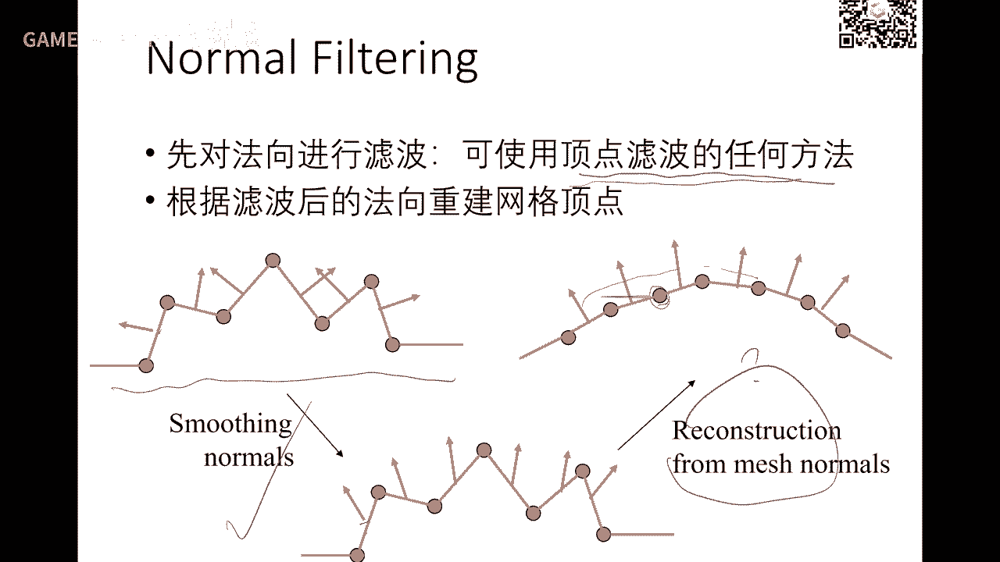

好，那么有法象重新顶点呢，这个是一个，就是你可以，事实上从数学上来讲，这个是没问题的，因为法象是一阶微分量，微分量是可以通过积分，就可以求出顶点的，但是对于立场情况下呢，我们把它变成了一个这个性方程组。

这个是什么意思，我稍微说明一下，这里有xi xj xk，好，我知道这个平面的法象，新法象是SFF，好，你要对这个上阳线顶点进行劳动，此时这个三角形啊，这个以它这个方向，新的方向作为法象，怎么办呢，是吧。

法象跟这个三角形具有什么关系啊，是不是垂直啊，所以说这个法象必须垂直这条边，也必须垂直这条边，也必须垂直这条边，对吧，所以说三条边垂直就是3个点1等于0，所以我要求的新的一个顶点坐标，怎么，必须满足。

以这个法象跟三条边垂直，xi是这些xi是位置量，顶点是位置量，那么这样的话就构成了一个非常庞大的信义方程组，因为每个方程只有两项是非0，所以你们用这个，这次作业的这个练习就可以去做的事情，没问题，所以。

做了作业以后，这些东西我想象就非常快了，已经前面做过铺垫了，因为这个就变成一个ax=b，ax就是所有顶点坐标，那么这里法象是已经求出来了吗，就每个每个就另一个方程，没有没有方程，就可以了。

具体的你可以看一下我们五年前的一篇文章吧，里面也介绍了这种方法，也引用了这个相关的基于法象滤波的一些文章。

大家可以从一篇文章开始就可以找到一些相关工作，好，好，那么那个后面我会也快速讲一下，这个方法大家也能听懂了，非常非常容易，那个这个呢，是07年，我们一篇cd文章，那就是用全体法来做。

那么这个也是一大类的这个做这个光顺的一个方法，就是什么，我认为我这个原来曲面是s，我要求它的渠道曲面s1'，这个时候我要求的，我认为呢，事实上是我去定一个能量。

这个能量就是我想求的这个s1'的这个某个某个度量，在这里的度量是什么，就由于两部分，一个是光法，一个是叫Δ，这上面呢，正常就是s1'离s呢，不能太远，是吧，因为这两个误差，minimum值就比较小。

还有还有一个呢，s1'要尽量光滑，那这个φ呢，就是描述s1'光滑性的一种度量，你可以看到这里是用一阶两个一阶的平方和，这个是用两阶都可以度量一些光滑性，大家如果记得前面我提到光顺的时候呢。

也提到这种能量是吧，我度量一个一个曲面，这个这个这个曲率啊，或者是这个微分量的一些平方的时候呢，你是达到一个微分光滑，所以说我要求一个s1'，使得他呢，跟s不能太远，然后s1'要比较近。

你去求取这样一个能量优化，就可以去得到一个结果s1'，那么这种方法叫叫能量优化法，优化法，那么在我们这里的话，你可以可以看到，你可以定义就是这个能量是用用用什么来定义呢，就是这个这个光滑性。

因为这项是非常简单，就是每个顶点偏移，不要不要不要太远就可以了啊，主要是前面的一项，前面的一项上当时我们是用拉巴拉斯，因为拉巴拉斯就是这个两极微分量的度量啊，所以有一个拉拉斯就可以构成一个方程组啊。

这个我们做过作业就很熟了啊，我就很快讲讲掉了，好，那么你xyz上是在上个礼拜我们也讲过这样一个方法，我们就快速过去啊，好，那么如果你希望保持特征，你这个点是特征，这个点不要动怎么办呢。

我就这里加一个约束啊，就是这三个坐标啊，都都等于某个给定的值啊，你就把它作为软元素放在这来，如果有另外一个点呢，也是那个特征，你也不要动，那么就把它加到下面来啊，就这样的话呢，像是求解一个拉巴斯。

然后呢，然后又某些点是不动的啊，但是别的点是近两个相近就可以了啊，那么如果还有一些什么，我希望这个三角形的这个重心不要发生改变，我在光称时候呢，这个某三角形的重心我认为它是很很重要的，我就把它固定住。

这时候呢，这个表示这个值是制造的啊，这时候呢就这个值呢，制造也是中间加了一个一行是吧，三三个量乘积等于某值啊，所以也是一个方程组啊，好，同样你可以让某个边的中间或者某某个点来变成。

然后这不动也是个线性约束，甚至你还约束101的这个重心坐标都都可以，只要是只要是线性的都可以往往这个大的方程组去加，最后呢就变成一个啊，这个一个非常长的一个x啊。

那么这时候用这个就像二层就是法方程序做啊，这个东西也是大家非常熟悉的啊，这个必须要掌握就是怎么去求一个超定的一个方程组的解，超定什么意思呢，就是啊方程组多于变量的个数，因为就有可能没有没有解嘛。

但是我可以求求什么呢，求ax-b^2 minimize这样一个值啊x，那么那么这个呢，实际上是等价于求求这个值求这个法方程啊，那么求这个方程，求这个新的方程组呢，你们你们作业也做了啊，就都知道了。

用chores分解啊，很多分解方法就可以做，或者直接调一些数学库就可以去做了啊，那么这方法实现可以作为作业给你们，但是你们已经有这个能力可以去实现了，没问题啊，我们就不作为作业了。

作为大家以后如果遇到这样一些问题呢，也可以用这个方法去去去去解啊，那么最后我们再看一下，这部分那个还有个概念叫improvement，就是叫网络质量提高，上光滑我们在以前讲上部分课的时候。

就已经接受过那个割角就是一个光滑，你把一个尖锐的这样一个多边形，慢慢磨光啊，磨光割角就是磨光嘛，就可以变成一个光滑曲线，所以它也是一个smoothing的一个问题，那么那些improvement什么的。

就是也是希望把一些尖锐的东西把它割掉啊，我有一次课我记得是形象的比喻，拉不拉丝的一种操作，就是相当于割了几次角而已，是吧，所以割角以后呢，点点就会进行一些变动，就变成一个质量更好的，那么在在历史上呢。

也有这样一些比较启发的，或者是叫局部操作的一些网格的质量提高的一些操作，比如说我我来考察一个相邻两三人形的一个四边形，如果这个对角线这两个质量不够好，我我我给它换换一条边。

就是相当于是这个黑边变成这样一个啊，这个边这两个质量的比这个两个质量是要好，具体怎么叫质量好，我们等一下再再来补充一下啊，好，我就把它这个edge啊，给他给他flip掉，把它把它叫做翻转一下。

把把这个联系关系变一下，好不断这样操作，不断操作，那么总会操作这个质量会越来越好是吧，好，我们回过头来怎么来看这个质量，质量的话，你可以看到最简单，哎，这个这个角度比较小，像在这里吧，这个角比较小。

你可以看到哎，这里像这两三人形最小角在这，这两三人形最小角在这，你看这个角就比这个角是要大，是吧，所以说这个质量相对好一点，因为角越大嘛，就越胖一点啊，胖的话就像正三人形一样的啊，就比较质量比较好。

那角比较小呢，就比较比较狭长啊，就不好，是吧，所以你这里可以提提出很多度量，然后当这个操作是可以做的啊，当然也也有也有操作，像你这里再再再怎么做，也也也发展不了的时候呢，你也可以把那些边给删掉啊。

再变成这样一个样子也可以啊，这也是一些local的操作啊，能够改提高这个网络质量啊，也就是采用这样一些方法就可以可以go，好，去到呢，呃，这么多年文章非常非常多，我这里呢，因为基础课。

我也不去详细介绍所有的方法啊，给大家一个概念，那么对这个是最开始对这个去造就一个formulation，怎么去做他的数学模型啊，从模型出发就知道哎，我们怎么去去构成一个法，这个方向，那么去到呢。

又可以对法相操作，事实上还有很多的方法啊，我们这里，呃，我个人认为几个最大的方法，我这里列了三个文件啊，引用西数优化的方法啊，就是一三年西瓜，还有我们自己的一个英语压缩感知。

这两个方法实际上本质上有点类类的红啊，只不过我们是从那个更好的理论，我们理论保证是非常好的啊，这个这个新文章非常非常不错啊，大家有兴趣可以看一看，那么也有用机器学习方法，机器学习方法怎么的。

机器学习方法就是一个拟合嘛，就是啊，就是他他认为啊，这里在噪声，呃，他可以构造好多ground truth一个光学面，随意给他加加噪声就啊，然后还要求S0啊，那那么这是不是一个隐私啊。

我这里多边噪声是什么是什么分布，我就要求一个硬件函数，变成一个呃这个光秀是一个法项，所以他中间构造了好多这种呃局部算子，然后呢，也通过这个机器学习去求这样一个影子F，所以他他他就把这样一个。

这个这个渠道问题变成一个连续影子，但是这里这种方法呢，有个问题在于他的数据体一定要非常非常的充分，并且你的数据的这个噪声的分布，一定要在数据其中要体现，如果体现不好的话，他拟合就不好啊。

这机器学习本质就是你做拟合嘛，啊，我们以前就讲过啊，所以这个这方法呢，这个作为一个新方法，大家可以去参考啊，但是实用性上面的话就要去取决于你这个，数据应用的时候呢，你数据的这个分布类型是什么样。

你要你要你要构造大量的这样的样本啊，里面还有这样分布，你这样做的就比较好，当然这个去找每年都有很多工作啊，当然观看我们这个课，这个啊，一个小时课是讲不完的啊，嗯，更希望大家理解这里面的一些思想。

然后以后你们碰到问题的时候，通过这个课也好，文件也好，自己去再去探索，好，好，那么刚才讲的是有一个假设是是个match，match是turb结构是不变的，对吧，所以你只要去变这个顶点啊。

所以那些方法呢都是假设这个联系关系是变的，但是对于别的一些类型啊，像point cloud就是一些点，你怎么去做他去找，因为他这里没有没有联系关系是吧，谁跟谁联系不知道的这个点就这个叫点云。

就是原始点云，他没有够网没有充够网额，那么这个点怎么够呢，是吧，那么怎么办啊，那么这里呢，我大概讲一下啊，但是如果碰到我们不会的东西，尽量把它想办法把它变成我们会的东西啊，这是一种思维方式，啊。

我已经会了一些东西，比如刚才网络去照我会了是吧，好点云来了，哎呀，这个我我不会，我以前也没没做过怎么办的是吧，好，那怎么把它转成会呢，哎，你可以看啊，刚才去照是不外部不就是找他的相相相邻的一些东西吗。

是吧，所以你可以找一个R领域啊，把这些点呢给他够够一个切平面没问题吧，所以呢，你这就可以假设实际上是可以这样的，我之前的临时的跟着这些一领域某一领域，这时候他他叫一笔一笔零，他不叫一领域了。

因为就是刚才网格是就跟他有直接边缘的关系，你想念这里呢，哎，我没有我去取一个距离就一笔是某个距离，这距离的是可以是很小，这个这个啊，0。1啊，或怎么样，然后让他这些点包含起来。

你就可以去做这个他的一些估计，微分属性估计，这时候就把它转成了，哎，我局部构成了一些相邻关系来做这个去照，好，好，点晕这话我们再重新讲一下啊，就是呃，大家能听到了吗，喂，好，那么可以，然后点晕的话呢。

就是把它转成网格的这个形式，就是用他的近领域来把它连起来啊，那么就变成局部的每个点都有个局部的突破关系，你就可以用网格的这个方法去做啊，一样的哈，那么对这个怎么提数据呀。

还有什么深度数据就是用connect这种数据去去做，也有一些去到的一些方法，因为特别是对这个debs，他有RGB，还有还有还有D，D就是那个深度啊，Debs，那么。

那么有的时候去到那会用图像像素跟那个深度集合一起结合的啊，就是叫叫联合滤波，有很多这样一些方法，大家去看的时候就是哦，我我不仅有那个红绿蓝这个三个分量，还有一个深度，我滤波的时候呢。

可以结合这两个信息一起来做就可以了啊。

好，那个去到这个，这个做了几十年啊，这个基本上几十年，但是仍然还有很多问题，特别是对于现在这个深度相机流行啊，大家也知道，现在iPhone啊，包括我们国内一些手机厂商都集成了深度相机。

但深度相机的数据呢，实际上是很差的啊，就于数据这个是不是深度这一围啊，他的精度没那么高啊，那么随着设备硬件的发展会越来越高。

但是这个去照问题还仍然是还是存在的啊，所以这里面还是有很多方法去去做的。

那么去到这一块呢，我就大概这样。

讲一下这个这个入门的一些东西哈，今天还中文还一块内容呢。

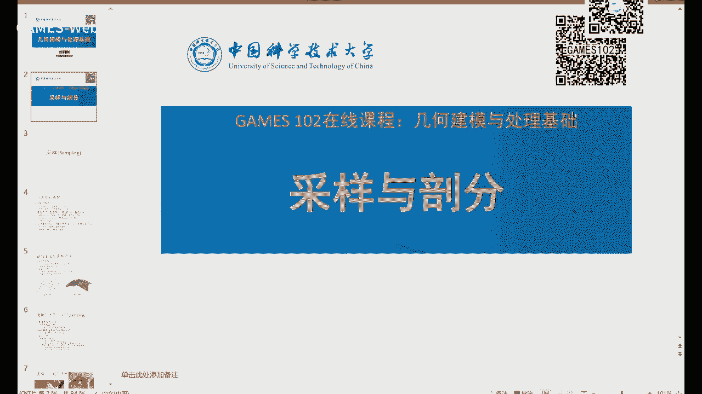

我要我要先快讲完，只有半小时了，好那个现在开始讲一下这个第二部分内容采样与破分。

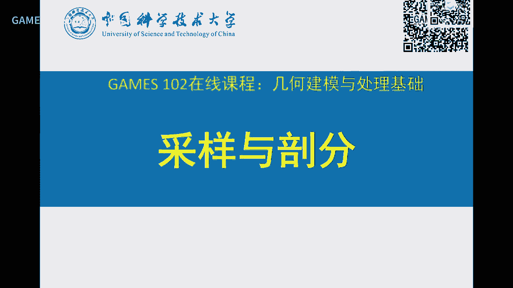

这个也是非常重要啊，那么我们先看采样，我们只要学数据处理或信号处理，就要一个采样，采样什么的，采样上就是我们在就是就是离散啊，就是我们讨论对象往往是连连续的函数啊，什么一个空间啊等等，但是呢。

我们无论在计算也好，还是在做存储也好，都是有都是有离散的一些表达对吧，那么我怎么样，比如说大家知道对调曲线，我怎么样去对它绘制曲面绘制，我不可能去让计算机去画一条光滑曲线。

都是把它离散成分段的叫线性函数，分成多样式或者叫占氧片网格才可以做对吧，所以一样的字就在做采样啊，这采样的话呢，你可以看到我们前面也讲过一些这个那么曲线的采样，一些这个概念是吧，在这那么还有。

这不是在印象工程里面，我们对一个模型进行扫描，我们我们去踩上面的点也不可能所有点都踩到，都是踩中间的若干点，特别有时候会踩一些稀疏点，一些侧层点，然后再来估计这个曲面，原来这个曲面的性质。

就是这个sampling采样，那么比如一个图像，我们上次这个这个Lina这个图像照片，看起来是很光滑的一张序，事实上它是很离散的，因为它我们光散化的这个显示器就是一个点一个点存储的是吧。

所以我们还是包括我们的红绿蓝的RGB，这个这个这个格式的文件也是这样，包括包括视频，视频不是一个连续的这个画面，它是离散画面，只不过用25秒一帧，骗我们眼睛。

我们眼睛因为分辨这个时间的这个分辨率没那么高是吧，所以也就变成一个光滑的图像，曲线采样，大家都很清楚了啊，网格也一样采样是吧，所以好采样是什么，是说我们通过一些设备设设施或者计算。

来对一个连续信号进行观察，那么重建呢，这是我们未来要一个讲的一个课题，今天不讲啊，今天我只是把这个概念提出来，重建什么，我根据这个离散观察，怎么去估计这个连续信号的信息，这个叫重建。

重建实际上是前面我们花了很多时间去讲这个拟合，拟合就是重建，你只不过你用什么函数空间，你用什么函数去估计去拟合这些这些采样，还是用什么神经网络这个函数去拟合而已，好，那么那个这个在相容定理啊。

就是信息论的这个基底啊，我们我们的采样一定要充分多，要高于那个原始信号的平均的两倍，你这个重建才是可靠的，要不然这个是会有损失的，那么这个在Games101，应该也大家如果听过的话。

也这个严老师也讲过这个是吧，就是采样的问题是欠采样就是什么，就是因为我们的信号啊，我们来看看这个看那个例子，这个例子从两方面例子啊，假设这个蓝色的是原始信号，我们怎么只采了这些这个空源这些信息。

结果拟合出来是拟合出来一条黑色曲线，是不是就怎么就欠拟合了嘛，因为你这个这个圆圈这些点啊，间隔太太大了，还还没有达到这个蓝色这个信号，所达到的这个这个频率，甚至还没达到他这个一倍，别说两倍了是吧。

所以呢，你这个很容易出现欠拟合，就是欠拟合的现象，好反过来，假设我这个黑色曲线是我这个理想曲线，我采了一些点，这些点呢，这个信实际上是采的还挺好是吧，灰不黑色的，但是你用了一个非常，高复杂度的函数。

比如说这个蓝色函数，频率很高的函数去拟合他，拟合出来是蓝色这个样子是吧，上次他也没有表现出黑色曲线的性质，所以这个叫过拟合，好吧，所以你把黑色看成我们的目标，这个采样用蓝色去拟合这个点呢，就产生过拟合。

反过来你用蓝色是是原始信号，你用低频率去拟合呢，就欠拟合，所以在做这个采样和拟合过程中，这些问题经常存在，你不知道原始信号是什么，是什么频率，你采样到底原样本够不够，你就拿一个什么很武当的函数去拟合。

都是不对的，都会有问题，那么采样有很多应用了，就是stippling，就是这个点化图，就是根据这个图像的，这个这个这个灰度啊，或者颜色的密度来进行一些点的分布，也是一个采样用，还有我们打印机。

这个叫Halftone，叫半色调，Dithering也一样的概念，就是通过一些这样的密度不一样的采样，包括这里，来表达这样一个，就是只要用黑和白两色，就可以去逼近一个，或者叫那个近视一个图像。

甚至在打印机就是这样一个原理，因为打印机只有黑的一种颜色嘛，所以他要么打要么不打，通过这样一些格子就可以去逼近一个图像，今天我们不讲这个，我们看一下，曲面采样大家就很清楚了，大家已经做过作业了。

这个就是分辨线性并行函数，就是三项曲面，好，那我们现在先限定在二维，因为三维中有些概念，这个或者计算方法不一样，但概念都是一样的，好，我们看一下平面区，如果平面区你要采样的话是不是很简单。

就假设你要采样这些，一百个点，10乘10就有一个grade，采样非常均匀，是吧，没问题，好，关键是这种不规则采样，好，假设这样一个区域，一个这个桌面型区域，中间我采了这么几个点，那么在这个几个点呢。

那么你怎么把这个区域又把它分解成更小区域，因为我们要去分辨线性逼近它嘛，所以说我们很自然就会说，我怎么从这个采样点去剖分出一个这种三角化的区域，或者是叫平面三角网格，使得我剖分比较好，那么好。

这里一个剖分，我们怎么再看下一个剖分，好，在这里啊，我这个剖分等一下再再再来展，好，那么这个三角化就是什么，就是这个一个函数的线性逼近嘛，那么这采样呢，里面还有个叫蓝噪声采样Blue Noise。

这个呢，那我这里也不想你展开，大家有兴趣可以看在graphics这个paper里，这个这个graph有好多文章，特别是十十十五六年前吧，文章很多都在讲怎么去产生这个蓝噪声采样，蓝噪声是什么概念呢。

就是这个采样呢，既不均匀，也没有规整的pattern，你不能用这个格子去采样，因为人对这个重复pattern是很敏感的，那么什么你可以看到这个采样，看起来又很随机，但是呢又很均匀，但又没有那么规整。

所以这个叫蓝噪声，那么从数学上来讲，就是可以用这个这个信号的一个叫频谱图，来看他的这个这个这个噪声，这个分布为什么会有这个规律，那么这个频谱图呢，就是右边这个显示的这个样子。

你可以看到这个这里有有些噪声，那么他的这个频谱图呢，就是第一个比较高，第二个稍微比较矮一点，大概有三两三个峰值，这个叫蓝噪声，但这个也不是严格的啊，大家如果有兴趣可以看一下，因为这个在在很多应用。

包括一些rendering啊，包括一些这种imaging，这些都很有用，我这里不展开，好我们来我们重点是看一下，我们几个上的一些三角网格的构造，好我们我们来问这个问题，给了平面上这些点。

我怎么样构造一个三角网格，使得我们认为是可用的，或者是比较好的啊，好对于这些点呢，我们可以这样构造一个三角网格对吧，可以这样连啊，那么这些三角形是这样形状，我也可以这样连，注意哦，这两个图。

这个点点是一样的，只不过这个三角化不一样，那么大家如果用肉眼看，你们觉得是哪个比较好，是吧，可能大部分同学都会说左边的比较好，因为右边呢，你可以看到这质量相对来说，好像不是那么好，像像这个三角形。

这个角非常小，还有还有在这里是吧，还有还有这里是吧，对于说看起来这个三角形呢，就是比较比较狭长，就是就是不是不是那么胖，这个胖子，你看到这个三角形呢，这里的三角形大部分都比较正向。

正三角形或者叫靠近正三角形，胖一点，所以呢，我们我们会选择左边的会比右边好，那么这里就会会不会有一个度量，说哎，到底给一些点以后怎么样，三角形是最好的呢，是吧。

所以历史上就有一些几何计算几何的学家来研究这个问题啊，这就涉及到一个这个叫做质量的问题，那么什么叫一个质量比较好，我们从直观上来讲，左边为什么比右边好，因为什么左边的这个三角形形状比较更接近正三角形嘛。

是吧，所以你可以用什么最小角来描述，可不可以啊，没问题，可不可以用这个外接元或者内接元的比例啊，来来来度量啊，也没问题是吧，还有一个什么可不可以用一个奇值，这什么意思啊，假设我要度量一个。

度量一个三角形的好坏，我可以，算一个它到，正三角形一个影射，像这个影射呢，就在平面上就是用R乘以2的矩阵，M A，那么把它A在两个奇值上做一个奇值分解，σ1，σ2，U和V都是正交，那么σ1，σ2是什么。

表示了这个这个这个影射啊，假设是可以把它看成土球的话呢，就是一个是σ1方向，一个是σ2方向，如果它们两个都等于1，表示这个这个影射是一个这个等大的影射，叫这个等距，如果σ1和σ2差的很大。

就表示它们这个变得比较狭长，所以用σ1和σ2，就奇值啊，比如σ1比上σ2，假设这个比这个大，这个值非常大，那么表示这个质量就越差，就会用这样一个度量来表达质量，后面我们下个礼拜就会可能再解释一下。

minimizer这个东西，你也可以去取考这个质量，这个比例不要太大，太大就表示有出现了非常差的占氧型，其实是用奇值来表达，所以你可以看到，怎么来度量一个好的占氧型，你可以用不同的角度去度量，好。

那么历史上有两位数学家，这个一个叫Dinoli，这个还有一个叫Volnoi，这个两个词可能有些同学已经不陌生了，因为经常会出现，这两个数学家都是俄罗斯人，这个应该是上上世纪了，俄罗斯人他们发明了。

或者叫做对这种点阴颇分进行一些研究，好 我们来看一下，什么叫Volnoi这个颇分，那么这些绿点是一些平面上的点，那么如果给定这个绿点，我对平面的空间做一个这样的颇分，你可以看到每个绿点都有一个区域。

每个绿点都有一个区域，像这个绿点在外面，它的区域是没有边界了，就是一个无穷边界，像这个点的边区域就是这些多边星所凝成的，那么这个区域是怎么构成的，每个点的区域的点，都是离它最近的点所构成的。

比如说这个点离这个点是最近的，因为它离这些点都比这个距离是要远，就是这个性质，什么意思，每个点占有一定的疆域，你可以把这些点看成是，非洲大草原的狮子吧，狮子在这里住了个窝，它呢 这就是达成规则。

离我最近的领地是我的，你不能抢 是吧，这个地方令你近，就是你的，那么这些狮子窝已经构成了，问这些狮子的领地是什么，这个就是文而图，那么可以看到就这样定义，离它最近的点应该是归成它，不归成别的 是吧。

所以可以想象，这里上的每个点都是离某两个点，整距的点吧 是吧，所以可以证明这条边，就是这两个点的连线的一个中锤线，所以马上就可以证明出来，这里的所有边，都是某两个点的中锤线所构成的 是吧。

所以这个性质很容易被证明，我可以判定，只要把我们所有中锤线给找出来，那么删掉一些不可能的，那么留下的就是这文而图 是吧，文而图的这个对额图，对额图我们以前也提到过 是吧，这个蓝色是文而图。

红色就是这个对额图，对额图是什么，点变成一个面，应该是在这，边对边 面对点，就这样，它的一个对额过来的话，就是变成一个这种橙色的，平红的这样一个三角形，这个叫Denoy三角化。

所以文而图跟Denoy三角化，是一个对额关系，好 我们来看看文而图怎么，这里有很多不同的方法来求解，一个点击，我们这里先限制平面，点击的这个文而图，首先找两点求中锤线，中锤线去扫略一下，找到这个点。

那么再在看，那么再求它的中锤线，这样慢慢慢慢迭代，这个在网上可以找到好多这种，比较有效的方法去求这个文而图，在很多数据库里面，像CGL 包括后面我会讲到，这个QRAN口库里面都会有这些方法。

大家可以去看一看，这个不难，因为这个东西非常成熟了，求文而图有很多很多方法，你们甚至可以自己去实现，那么它的对额图叫QRAN generation，记住 在这个图。

就是文而图的对额图就是QRAN generation，这个DT Denoy generation，有非常好的性质，这个性质大家非常，这个比较通用的就是叫什么，叫空源性质，什么意思呢。

我每个DT Denoy的三角形，这三角形的外接源，这是其中的某个三角形，就是这个层三角形，它的外接源一定不含另外的这个文外点，就是那个给头的点，不会包含的，这个是个非常好的性质。

也就是说我每个三角形的外接源，只有这三个点在上面，但是这里是不含四点共源的现象，四点共源的话就不在这个范围之内，那四点共源也没有点的内部，只有在边上，还有这个叫最小角最大，就是我们刚才说的。

这个最小角是在这，因为以这些点为三角化的，这个三角化有很多很多，我对每个三角化，我求其中的最小一个角，它在这里，那么这个三角化的最小角是在这，这是最大，最小角在这，最大一一定是大于等于四，是大于。

所以顶端的这个三角形，三角化就有什么，最小角，这个最小角，它是所有的可能的三角化里面的，最大的一个三角化，所以它是最胖的，所以这个三角形是最胖的，好 还有这个图包，就是顶端三角形的最外这一层。

就是这些点的图包，这个性质也是非常被用来，求解这个点集的图包，当然还有好多性质，有些性质是一些比较抽象的代数性质，什么极角化它的粗糙度，什么极大化它的平均，这个算数平均，什么意思呢。

这个三角化的三角形的内接圆的，算数平均它是最大的，下面的一些我就不详细去展开了，有新同学可以去看一下，还有这个是，这个后面也可能会提到，它是在更高位空间中的一个，我这里解释一下，就是这是一个高位空间。

这是二维，那么这是三维中间的泡沫面，那么它呢，每个点就在这个泡沫面上也有对应点，把它这个投上去，那么这个三角化呢，在这里也对应三角化，这三角化跟这个泡沫面之间就有个体积，这个体积达到，达到应该最小。

这个三角化，所对应的三角化就是极端三角化，好，这个也是刚才的后面，这个是个代数性质，代数性质是我们101年证明出来的，也是一个新的发现，这个发在CED上面，就是我们把这个Denali。

Denali三角化是不是也对应一个是个网格，是吧，网格的话就有它的拉巴斯，就矩阵，我把这个矩阵L的这个特征根拿来，从大到小排序，比如说有n个点的，n个三角形的，有n乘n，好，那么呢。

Denali三角化的这个特征根啊，相对来说是最大的，比如说有另外一个，另外一个这个这个三角三角化，它有个拉巴斯，它也有比如说lambda1，1'，lambda2或者叫做μ吧，μ1，到μn。

我们我们我们可以证明，我们这个这个lambda是什么，是其中的最小的一个，lambda，就是最小的一个特征根，每个都对应都是小的，这个性质，好，那么怎么去求这个denali呢。

事实上是有一个非常简单的一个方法，就是就用刚才我这个叫做Mesh Improvement，那个就是最小线不断的去改进，不断改进，这改进规则是什么，你只要这个边交换，能够对这个角度变大，有有有好处。

我就交换，比如说这条边，我一交换之后呢，这个角呢变变，这个最小角变大了吗，像这样一个这样的话，这个最小角可能就在这，它比较小，是吧，所以就就就用这个交换，好，那么这通过这个方法呢。

只要出现了可以交换的这个最小线，就可以交换，就就交换，那么大家就会问，这样的话，它会不会收敛，那么理论可以告诉大家，这个是一定是收敛的，你只要去做，总会停止的，你交换不动了。

你这个最后的denali就出来了，但这种方法效率比较低，因为它要迭代很多次，并且这个不可并行，可并行，但是它迭代次数比较多一点，那么这里面有好多方法来求这个monoi图。

monoi图是个非常非常成熟的一个东西，所以大家没必要这个自己去发明新算法，因为相对来说还是很多方法是比较快的，特别是在这个库里面，有很多库都有这个monoi图的一个。

所以我也鼓励大家自己去用他们这些好的算法，去求这个monoi图，好吧，好，我想monoi图跟那个，刚才这个方法不就提到了，刚才光顺时候用到了那个怎么提高网络质量吗，是吧，所以我们下面肯定要去讲。

有没有更好的提高网络质量的方法，好，那么提高网络质量，你如果给定了这个点，我可以找到一个代码化是比较好的，就比较denali，是吧，大家没问题，但是呢，如果点的分布不均匀，注意啊。

这个图在这个图里面质量是不是也很差，但是这些点啊，放的不好，什么采样的时候就没采好，你这个点不好，你我这三样化最好也就是这个样子，也就是这个图是不是，但这个图呢，没法改变了。

为什么这就是denali的三样化了，这是出问题出在哪里，出问题出在这个点的采样，不够好，是吧，所以你要去提高这个这个三样化的质量，是不是就必须动这些点的位置，是吧，我们前面的光顺。

至少把每个点往拉巴拉斯这个方向去移，就有可能把它提高，对吧，还有没有别的办法呢，我们这个历史上也有很多几个方法去做这些问题啊，所以我们如果只是把点固定。

你再去求connectivity联系关系是怎么做都做不好，那么我们就要去动这些点点啊，那么有没有可能动到像右边这个点点，这个三角形分布呢，大家可以试一下啊，你们自己会用那个拉巴拉斯光速的方法嘛。

局部迭代啊，这个有可能会得到右边的结果，但有可能也得不到，因为他毕竟会这个缩练，好，那我这里介绍一个比较好的方法叫CVT，就是文内图，但是它是个centric的，centric什么意思啊。

如果一个文内图，CVT啊，如果他的文内图的这个区域的重心跟这个点本身是吻合，那么这个叫CVT，C就叫centric，那么这指什么，每个cell每个文内cell的重心就在这里，像这个绿的重心也在这。

像如果非非这个CVT，一般的文内图呢，这个红的重心是在这，但是这个点原来的点分布在这，跟他是不重合的，那么这就是非CVT啊，那么CVT有个什么好处啊，它的这个分布非常均匀。

你从这个落叶就可以看到这个这里的蓝色点，跟这两个点这里蓝色点更均匀一点是吧，好，大家有没有去想，我怎么样去生成一个CVT，应该马上就想象出来了哈，好，我们看假设这个点，我给定的分布，我去求一个文内图。

他不是他重心是吧，那么把这个重心移到他这个重心来吧，我把这个点移到这个重心来，我再去求一遍那个文内图，如果还不是是吧，我再移吧，所以非常非常好，就这样一个简单方法。

我就求一个文内cell diagram，就图，然后看这个点在不在他重心，不在我就更新点点，不在我再更新，不断这样重复，这就是著名的这个这个这个乱算法，这算法很早年就有了啊，乱算法就这样啊。

我给定一个采样点，我去求他的这个文内图，求完以后呢，我把这个点更新到他的文内cell的重心，再求再求再求，再求不断迭代，迭代到受链，所有点都动不了的时候，这个这个这个就基本上是CVT了。

那么CVT的这个CVT的这个对额图就是这个样子，就就这三角形就非常好，几乎都是正三角形，所以这样的话就可以，如果采样点个数给定的情况下，就可以生成一个非常好高质量的这样一个分布跟三角化，那么这CVT呢。

事实上有很多很强的理论啊，这个可能时间也快到，时间不够，我就稍微展开，稍稍稍微那个讲一讲，不展开了啊，就是上上端他是在求取一个CVT能量，就是每个这个x啊，就是这文内cell的每个点是离他的平方和。

因为刚才也讲了，这个平方和最小的点就是这个这个重心嘛，然后最重心加一个全，就全函数等于会有一个公式，那么如果从这个能量角度上来讲，你这个low x这个权上如果等于一个一个一个单位单位的话。

low他可以是等于一个单位的话呢，他就是CVT，如果不是单位，假如是个图像，有像素的这个区别，你可以加全，就可以是一个内容相关的一个CVT啊，这个不许展开，那么在CVT能量是是一个一箭可导。

这个在80年代或90年代的时候就已经有了，但那时候大家一直认为他不是CR连续，这个这个能量不是CR连续的，只是CE连续的，后面大概在09年，这个现在在微软的刘洋博士呢，就证明他是个连续函数。

所以大家就清楚的，这个CVT能量是可以两极光法，是可以求导，可以进行很快的加速的，那么这些历史我就不展开，大家只知道一下，好，那么你怎么样把这个CVT这个推广到曲面上呢，是吧。

那么你以前都是在一个平面上，在一个欧式平面上去做，所以他的距离这些东西就很好算，在曲面上的话，只要把这个距离变成曲面上的这个度量，曲面的这个这个测力线度量就可以推广到曲面。

但这个实现相对来说会比较复杂一点，这个后面有如果有机会我们还会讲到的话，我再提一下，就是在怎么把平面欧式距离的这个度量，就是欧式距离啊，变到曲面上的度量，曲面上的度量就是什么，事实上就是测力线。

测力线就是曲面上的最短路径，如果大家没有去学过微微几何，什么叫测力线，测力线就是一个点沿着测力曲线的一个积分，每个点都是测力曲线的方向，那么每个点呢，假设在一个球面上测力线就是那个大圆大弧或小弧的距离。

就是就是在曲面上的话呢，就是沿着最短距离吧，你就把它认为是离上网格的最短距离，那当然度量比较难算一点，那么局部算的话可以把它参照化到平面上去算，如果这个参照化比较好的话呢。

可以用参照化的平面上的这个这个距离去近视曲面上的测力距离，好，我这里就提一下，好，这就是可以看到左边的网格很差，如果用了曲面上的cpt呢，这个就质量变得很好了。

好，可能这部分我们后面还会有专题来介绍，我这里就提一下而已，好，那么相对于cpt呢，还有一个早年有个叫odt，odt是另外一种能量啊，这个也是可以做提高质量提高那个网格质量的，就是由这样一个输入。

这个点的个数m是给定的，然后通过点的移动就可以生成一个高质量的一个shrink，还是cpt，odt呢，比cpt在某些方面是有优势，就是它的它那个这个小的角度啊，不会太多，它都集中在在在那个60度左右。

你看它分布还会不一样，啊，这个，历史上也有很多文，一些文章在分析，我不展开，好，最后我给大家介绍一些个比较好的一个生成二维的平面的。

啊，这个，呃，一个三角化的库叫triangle，它的名字就叫triangle，啊，是那个CMU，卡尔德基梅隆的一个，呃，这个研究工作者写的一个库，这个库呢，呃，在业界还是比较有名的。

因为他也开发了很多年，不断在完善，他只要有新方法就往这里起家，到现在还在维护啊，这个以前课上我也提到过。

但今天我就比较详细介绍一下，他这个库呢，可以生成各种各样的带约束的Denali，带约束什么意思呢，就是我希望这些边在这啊，这些边必须是在边上啊，就是说他最里面可以经营这个Denali。

最外面可以经营Denali，也就是说我用户所教过的这些边呢，我可以成为最后上氧化的一条边，别的地方呢，是像这些结果，别的地方都是Denali性质，至少他能保证，他的所构成的这个上氧型。

在所有可能的上氧型里面是最小角。

是最大的啊，呃，并且可以看到他能做，还还可以去直接指定最小角的这个角度的，的这一个范围，因为因为如果呃直接去用原来的点去连接上氧型，但是达不到这个要求，他中间会自动加入好多景点啊。

那么这些景点叫standard景点，就是他会中间添加很多新景点来达到你的要求啊，让这个最小角超过某个角度，他这些东西做的啊，历史上是这几个这个区刻里面有很多这个不同算法能做到这事情，全国都能帮你做到啊。

你你如果感兴趣，可以看看他的源码，他的代码都是公开的。

也是开源的，你可以看到这个你，你甚至可以指定他那个三角形的最小面积啊，不能超过多少，他也能自动给你中间加入景点。

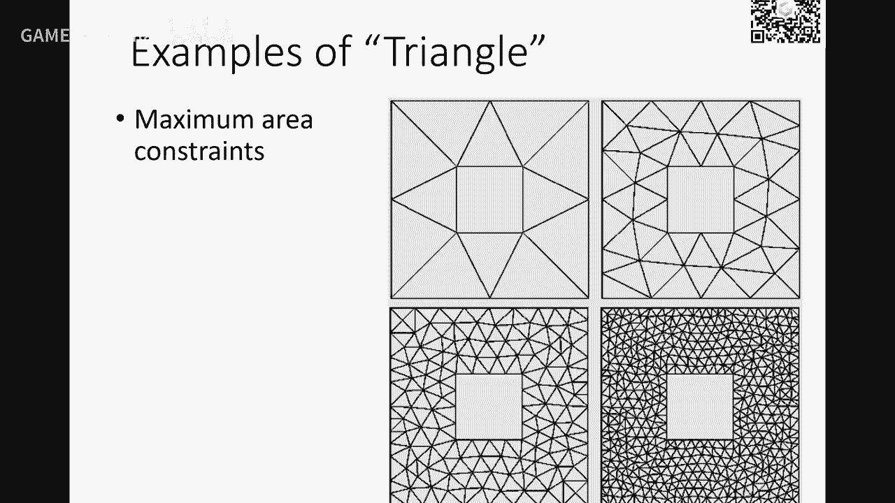

给你生成这些三角形啊，包括这个渐渐进的密度啊。

还有可以看到不同的这样例子，这个在他那个网站上面都能找到好，大家同学们不妨去玩一玩，因为呃生成这样三角形三角化或者叫采样，这是个非常重要问题啊，这个在以后大家会用得到，还有一些这个更高纬数的解析对象啊。

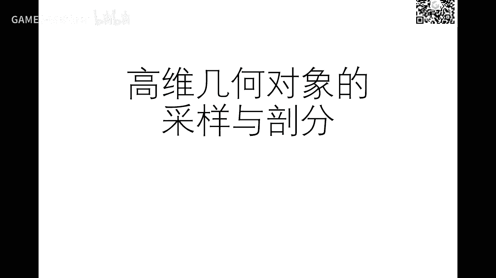

刚才这个流行曲面我也讲到了是吧，你可以看到你踩一下样，你可以采样很均匀，但我先用说呢，因为你也觉得可能呃弯的地方采样多一点，像这个头比较比较平坦，我采样少一点啊，这个叫自适应采样啊。

这个在有些应用中也是也是需要的，为什么如果你在这个上面也采用很密，你的点点就非常非常多啊，造成存储啊，传输啊，绘制会开销很大啊，所以能不能像这个这里一样的，我这个细节比较多的地方的采样多一点。

细节不多的地方采样像少一点啊，自行采样能能做，刚才那个全口就能够做到，同样在曲面上也可以做到这个事情啊，只不过度量上面稍微复杂一点，好，当然这个四边形化也是在很多应用中是非常有用的啊。

让常见我们现在刚才到现在为止都是讲的三角形，怎么把它升成三角形，那么如果怎么生成高质量的四边形也是，这边是在有些原理里面是经常要用这种网格的，也可以去做啊，我们后面会有专题再详细展开。

今天我们只是讲一讲这个这些概念，还有空间体空间体就是一个封闭的曲面内部，那么在表面上是用三角形，但内部呢就要用体，那么最简单的体就是四面体，用四面体对它进行剖分，好吧。

我现在里面要闪亮的点中间点连着四面体，那么对一个体来进行一个三角剖分，那么在有些原理里面的话，平面上曲面上是用四面形，内部呢，他们喜欢用六面体，因为六面体就是四面形在体质最广。

也有这个叫这个叫六面体剖分，这个叫四面体剖分啊，这个就是有不同的这样一个领域，后面我们会有个专题来讲，这就是一个例子哈，像这个一个人头，他如果如果一层层去看，我们放慢一点去看，都是四面体里面都有点。

那么我们在当前这几节课呢，都可能只是讨论表面的这个曲面，这个三角化的问题，没考虑体，因为考虑体的话，你要做体里面的一些分析的话，就要用四面体去做剖分，这个采样啊，才可以去做相关的应用啊。

那么可能在下面几节课，我们只是讨论表面上的这个点的分布，就三角网割，好，那么对于体的话呢，这个也是有一个比较好的库，TEDxGen，TEDxGen呢，我这里链接也放在这里面，他也他也是开源的啊。

就是专门生成高质量的这种四面体，给一个剖面曲面，他可以帮你生成一些不同的四面体，这个是一个华人学者施航，这个开发了很多年，我们在学术在做项目过程中，也经常会用到这样一个库，去生成一个实体的四面体剖分。

里面这个库呢，也会帮你去做自适应的采样啊，还有四面体化，好，Mac这个剖分采样仍然是一个比较难的问题啊，特别是在某些应用中，这里PD我们这个我们这个有限源FEM。

Finite Element Method，就是那个有限源分析，我们这个这一课不会讲，因为这个在做仿真时候是要经常会用到的，上次里面有个关键问题就是这个单元怎么怎么去剖分，因为我们去求一个方程也好。

求一些性质也好，都要去在他的离散的这个域上去做这个分析，做做计算，如果这个离散的不好，那么对计算误差造成误差非常大的，这里就有个例子，如果这个微方程在这里性质上啊，你可以看到如果你剖分的这里不够密啊。

那么你这里出来的结果完全是错的，本身理想结果应该是这样，它就会出现在这个样子啊，所以剖分就是采样，以及网络质量对很多应用，是非常重要一个问题，你这个采样和剖分不对，你可能导致你的数字误差啊。

这个因为这个连续性的计算，在一贯上面的话都是表现成为一个差分，相对的差分的精度不够，你就会导致数字很大的误差，就使得你后面的这个结果是不可靠的啊，所以你在前期就应该把这个采样的问题。

以及网络生存问题就要把它搞得非常啊，这个好后面的计算才是可靠和稳定的，好吧，好那个我们拖几分钟，因为中间网络那个断断了一下几分钟啊，好我们就把这次作业布置一下啊，作业8啊，因为上节课我也讲了。

所以我会带着部分第一期队的同学还是继续走吧，一周一个啊，多练一点，这样的话这同学能够对及格处理掌握的更好，如果后面同学跟上来，你可以参照这个优秀作业嘛，慢慢来好，我们这次作业什么呢。

就是实现刚才说的这个CVT方法啊，就什么，首先生成一个无论来波分，首先采用多少点啊，无论波分，然后呢，算中心把它移过去，不断的更新，非常非常非常简单，事实上你如果想偷懒，处理需求。

也可以去找到很多开源代码，就把这个事情做了，但我更建议大家去至少自己尝试一遍怎么去生成一个无论来算法，如果你不想尝试去实现的，你可以调用别的库，至少你要把这个库给用用起来，包括CGA哦，用用看好吧。

对于当然这些轮值都是已知的，你说你说我不重造轮值，去调研一下行不行，也可以好吧，大家体验一下啊，那个具体我就没有没有限制具体的这个二维形状是什么啊，你们可以去自己去自己去购得一些这个二维形状啊。

然后你们去采样啊，也可以去看看有没有带那个全的啊，像这里密一点这里稀一点啊，密的话是什么意思呢，就是这里可能图像啊，有些绘图纸啊，就像我刚才在找这个PPT找找几页，有个那个stippling啊。

也是一种这个是可以改进的CVT来做的好吧，所以呢，如果您仅仅是把CVT拿来用一下很快就做完了，但是如果有你们有兴趣的时间可以自己去尝试造不同的CVT，甚至密度不一样的，有些地方密度很密，有些地方很稀啊。

你去看看这个全稿上面是怎么去用的好吧，因为这两个库大家学会了以后很多，你们在做实际问题的时候呢，都会都会受益，好，那这个比较难了，就是在曲面上啊，这实际上因为关键在于这个就思考吧。

因为我也写的是可可选的，那如果有比较技术比较好的同学可以尝试一下，他那个CVT呢，实际上就是在曲面上定义那个测距离来来那个期待那个OCD的这个这个距离好吧，所以这个目的呢，就是通过这个练习呢。

体验一下无人论算法，还有CVT算法以及这些数据库的应用，那因为学会了以后呢，后面后面的这些作业都会都会用到有可能会用到这些库，特别是这个产样跟网格化这块好吧，好，那么我们今天作业因为比较简单。

我们也只给一周啊，有点开放性的啊，现在同学们我看这也将近20个多同学都始终跟上啊，基础都还不错，那个技术上面也越来越熟练了，所以呢，我希望大家去看开放式的啊。

你们去自己去创造或者是怎么样生成更好的一些这种文案铺分的一些例子啊，写在你们报告里面，然后下个礼拜，希望有些同学作业被选上能够给大家展示展示一下，好吧，好，大家发挥自己的能动性和创造性。

期待你们的作业的表现，好，今天的课程就到这里，好，那么好。

就这样好，再见，嗯，未经许可，不得翻唱或使用，没人照顾我。

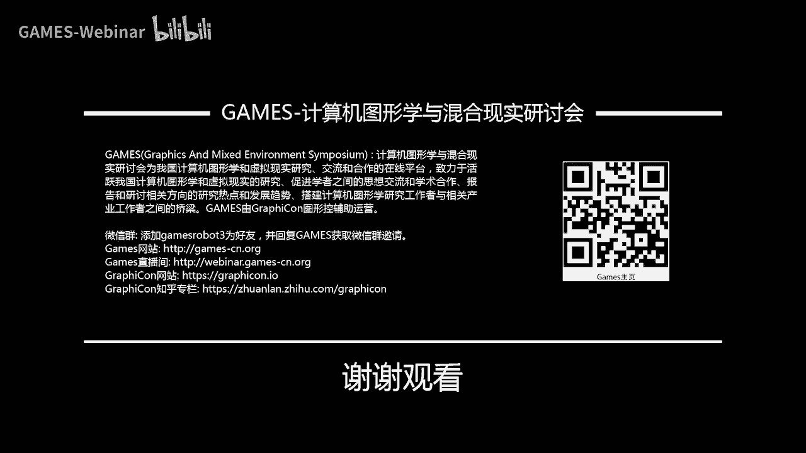