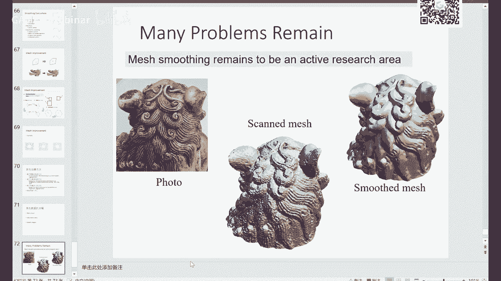

# GAMES102：几何建模与处理 - P10：曲面去噪、采样与剖分 📐

在本节课中，我们将学习几何处理中的两个核心主题：曲面去噪与网格的采样和剖分。我们将探讨如何去除网格数据中的噪声，以及如何从一组离散点生成高质量的三角网格。

---

## 概述

上一节我们介绍了拉普拉斯算子及其在几何处理中的应用。本节中，我们来看看如何利用这些概念解决实际问题，即如何对带有噪声的曲面进行平滑处理（去噪），以及如何从一组采样点生成结构良好的三角网格（剖分）。这两个过程在计算机图形学、三维重建和有限元分析等领域至关重要。

---

## 第一部分：曲面去噪 🧹

在实际应用中，三维数据通常来自扫描仪或重建算法，由于设备误差或计算误差，数据上常带有噪声。给定一个带噪声的网格曲面，去除噪声的过程称为去噪。

### 噪声的定义与挑战

噪声通常被经验性地描述为高频、小尺度的不规则凸起或高曲率区域。然而，噪声与模型特征之间的界限并不严格。一个核心挑战是在去除噪声的同时，保留模型的尖锐特征（如边和角）。这通常是一个“鸡生蛋”的问题：若能有效去噪，则特征更容易检测；若能准确检测特征，则去噪更容易在保留特征的前提下进行。

### 去噪的数学模型

我们可以将问题形式化：输入是一个带噪声的网格 **M**，目标是找到一个干净的网格 **M₀**。假设噪声是加性的，则有：
**M = M₀ + ε**
其中 **ε** 是噪声。这是一个不适定问题，因为 **M₀** 和 **ε** 均未知。

为了简化，我们通常求解每个顶点的新位置 **vᵢ‘**，使其构成的网格更光滑。常假设顶点沿其法向 **nᵢ** 偏移一个距离 **δᵢ**：
**vᵢ‘ = vᵢ + δᵢ * nᵢ**
其中 **δᵢ** 是待求的偏移量，**nᵢ** 可以是当前顶点法向的估计。

### 滤波与卷积

去噪在数学上常通过滤波实现。滤波的本质是卷积操作，即用一個權重函數對信號進行局部加權平均。對於連續信號，卷積定義為：
**g(t) = ∫ f(τ) h(t - τ) dτ**
其中 **h(t)** 是權重核函數（如高斯函數）。在離散網格上，這意味著用一個頂點鄰域內的其他頂點位置，以某種權重進行平均，來更新該頂點的位置。

### 常见的去噪方法

以下是几种常见的网格去噪方法：

1.  **拉普拉斯光顺**：最直接的方法。每个顶点向其邻域顶点的平均位置（即拉普拉斯坐标）移动。更新公式为：
    **vᵢ‘ = vᵢ + λ * L(vᵢ)**
    其中 **L(vᵢ)** 是顶点 **vᵢ** 的拉普拉斯坐标，**λ** 是步长参数。但该方法可能导致网格收缩和特征模糊。

2.  **平均曲率流**：顶点沿其平均曲率法向移动。这比均匀权重的拉普拉斯光顺更具几何意义，能更好地保持体积和特征。其权值使用余切权重。

3.  **双边滤波**：从图像处理借鉴的方法。在加权平均时，不仅考虑空间距离（几何接近性），还考虑信号值的差异（特征相似性）。对于网格，信号值可以是顶点位置、法向等。其目的是在平滑时，跨越特征边的点对彼此影响很小。公式核心思想是使用两个高斯核的乘积作为权重。

4.  **法向滤波**：先对网格顶点的法向进行滤波，使其变得光滑，然后根据滤波后的法向来反求新的顶点位置。这通过求解一个线性系统实现，要求每个三角形的新法向与其三条边垂直。

5.  **基于能量优化的方法**：将去噪表述为一个能量最小化问题。最小化的能量通常包含两项：一项要求新网格与原始网格不能相差太远（保真项），另一项要求新网格本身足够光滑（光滑项）。例如：
    **min Σ ||vᵢ‘ - vᵢ||² + μ Σ ||L(vᵢ‘)||²**
    通过添加线性约束（如固定某些特征点），可以在平滑的同时保持特征。

---

## 第二部分：采样与剖分 📍

采样是将连续信号离散化的过程，而剖分是根据离散采样点构建几何单元（如三角形）的过程。高质量的采样和剖分对许多后续计算至关重要。

### 采样定理与质量

根据香农采样定理，采样频率必须高于信号最高频率的两倍，才能无失真地重建信号。对于几何数据，采样不足会导致欠拟合，无法捕捉细节；而用过于复杂的函数去拟合少量采样点，则会导致过拟合。

在平面上，给定一组点，如何将其连接成三角网格？我们追求“质量好”的三角化，通常意味着三角形尽可能接近正三角形，避免出现尖锐的角。

### Voronoi 图与 Delaunay 三角化

给定平面点集，其 **Voronoi 图** 将平面划分为多个区域，每个区域包含离其对应生成点最近的所有点。Voronoi 图的对偶图就是 **Delaunay 三角化**。

Delaunay 三角化拥有许多优良性质：
*   **空圆性质**：任意三角形的外接圆内不包含其他点。
*   **最大化最小角**：在所有可能的三角化中，Delaunay 三角化能够最大化所有三角形中的最小内角，从而避免产生狭长的三角形。
*   其边界构成了点集的凸包。

### 提高网格质量的方法

如果点的分布不佳，即使使用 Delaunay 三角化，网格质量也可能很差。此时需要调整点的位置。

1.  **Lloyd 算法与 CVT**：**Centroidal Voronoi Tessellation (CVT)** 是一种特殊的 Voronoi 图，其中每个生成点恰好位于其对应 Voronoi 单元的重心上。CVT 对应的点分布非常均匀，其对偶的 Delaunay 三角化质量极高。Lloyd 算法是一种迭代方法用于生成 CVT：
    *   给定点集，计算其 Voronoi 图。
    *   将每个点移动到其 Voronoi 单元的重心。
    *   重复上述步骤直至收敛。
    该方法可以推广到曲面上，此时距离需使用测地距离。

2.  **ODT**：Optimal Delaunay Triangulation 是另一种优化能量函数来提高网格质量的方法，在某些方面具有优势。

### 实用工具库

*   **Triangle**：一个功能强大的二维约束 Delaunay 三角化生成库。它可以生成高质量的三角网格，支持指定最小角度、最大面积等约束，并能在必要时自动插入Steiner点（新顶点）以满足要求。
*   **TetGen**：一个专门生成三维四面体网格的库。给定一个封闭曲面，它可以生成高质量的四面体剖分，支持自适应细化。

---

## 总结

本节课我们一起学习了曲面去噪与采样剖分的基础知识。

在去噪部分，我们了解了噪声的定性描述、去噪的数学模型，并介绍了几种核心方法：从简单的拉普拉斯光顺，到更保特征的基于曲率流和双边滤波的方法，再到基于法向滤波和能量优化的高级技术。关键在于在平滑噪声和保持几何特征之间取得平衡。

在采样与剖分部分，我们探讨了如何从离散点生成三角网格。重点介绍了 Voronoi 图、Delaunay 三角化及其优良性质。为了提高网格质量，我们学习了通过移动采样点（如使用 Lloyd 算法生成 CVT）来优化三角化的方法。最后，介绍了一些实用的开源工具库，如 Triangle 和 TetGen。

掌握这些基础概念和方法，对于进行几何处理、三维重建和科学计算仿真等任务至关重要。