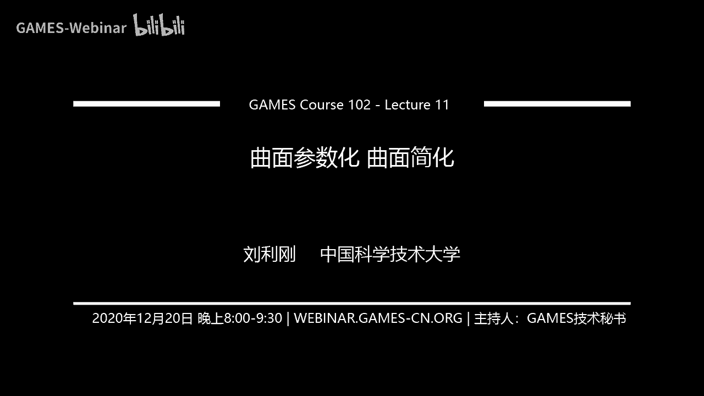

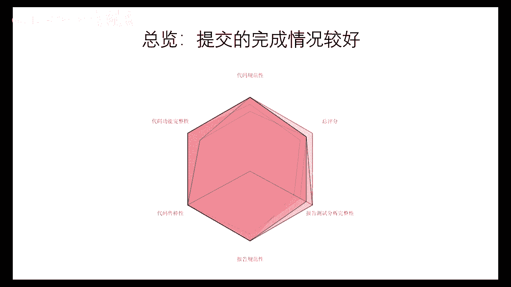

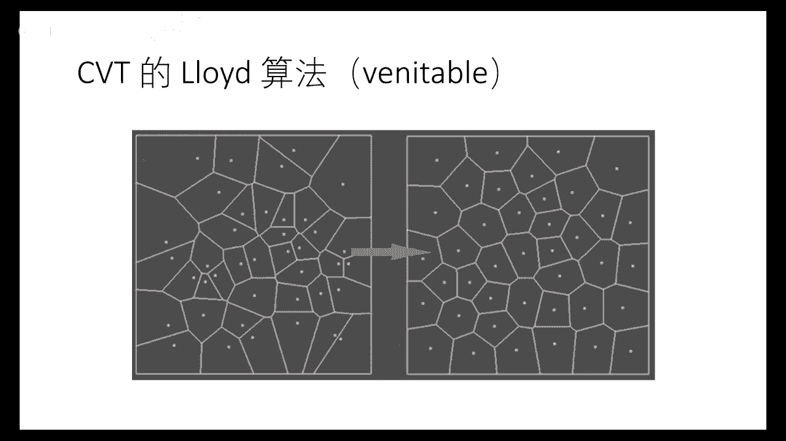

# GAMES102：几何建模与处理 - P11：曲面参数化与曲面简化 🧩

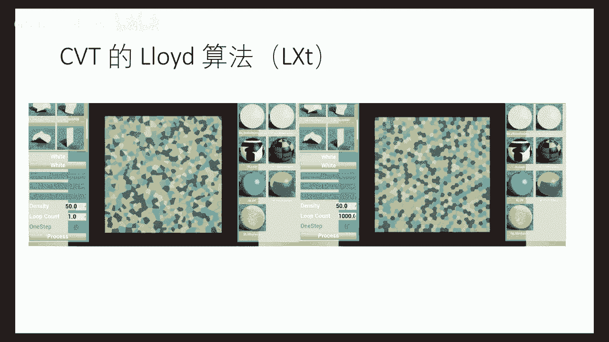

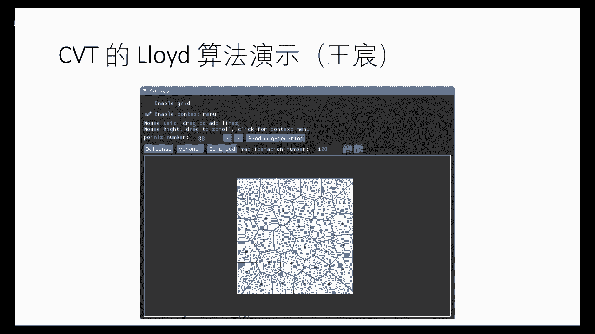

在本节课中，我们将学习几何建模与处理中的两个核心主题：曲面参数化与曲面简化。我们将探讨如何将三维曲面映射到二维平面，以及如何简化复杂网格模型以提升处理效率。

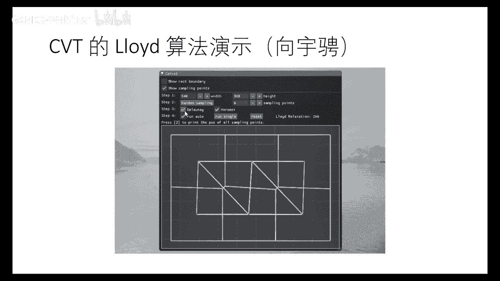

---

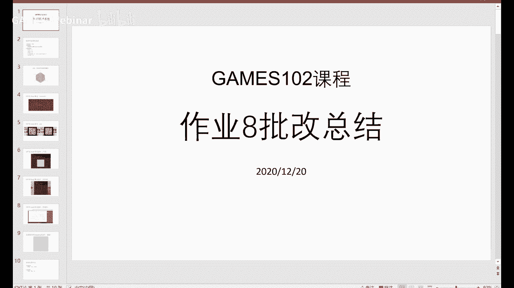

## 卓越作业情况回顾 📊

首先回顾一下本次卓越作业的完成情况。总体上，提交卓越作业的同学完成情况都比较良好。

以下是几位完成情况较好的同学代表。卓越作业主要要求实现CVT的Lloyd算法，这是一个迭代过程。

这些同学的卓越作业界面设计得比较好。

这里有一个演示。该程序实时生成一些点，并使用Lloyd算法进行迭代。用户可以输入点的数量，也可以修改迭代次数。理论上，迭代次数越多，结果越能收敛，但某些情况下收敛会比较慢。

这是另一位同学的结果。他同样在边界上随机生成一些点，构成Voronoi图，同时显示Delaunay三角剖分并进行迭代。在这个例子中，结果较好，生成了一个比较规整的四边形网格。

这是另一位同学的成果。他同样进行实时迭代，并可以用鼠标交互式地增加点。结果可以实时计算出新的Voronoi图。交互增加点时，Voronoi图会相应更新。当然，Voronoi图也可以实现变密度，密度来源于图像的灰度。这样就能生成一种名为“stippling”的艺术效果，点的密度与图像灰度相关，颜色越深，点的密度越高。使用CVT来实现，效果也不错。

部分同学的优秀代码和卓越作业会挂在卓越作业网站上供大家参考。同学们可以根据这些优秀作业来对比自己的实现效果。

---

## 主题一：曲面参数化 🗺️

上一节我们回顾了卓越作业，本节中我们来看看第一个主题：曲面参数化。

同学们应该在前面的作业中已经体验过参数化。我们一直从映射开始讲解，映射涉及不同维数空间之间的转换。映射本身的维度就是定义域的维数。从二维到二维是平面映射，从二维到三维则是一个曲面，这是正向映射。

三维空间中的参数曲面，实际上是从一个平面区域映射过来的。它看起来是三维空间的一个曲面，但本质上是一个二维流形。这一点我们之前已经非常清楚。

这里引出了另一个问题：给定一张曲面，如何找到它的参数域，即对应的二维区域或定义域？这个问题就叫做参数化，也称为“展开”。形象地说，就是将三维空间的曲面展开成一个平面。其数学本质是寻找一个从R³到R²的映射，使得曲面上的点与平面上的点一一对应。

参数化为什么重要？在之前进行曲面和曲线拟合时，大家已经体会到了。如果参数化不好，会对曲面或曲线的拟合结果产生不良影响。虽然之前是曲线拟合，但曲面拟合同理。如果参数化空间不均匀，会导致拟合出的曲面呈现不好的性质。

参数化还有许多其他应用。例如，地图展开就是一个球面展开成平面的过程。在地图绘制中，也使用了参数化技术，在地理学中称为“球体投影”。在图形学中，最常用的应用是纹理映射。准备一个网格，中间有一条割缝，将其展开后，用一张纹理图与之对应。这样每个顶点就有一个纹理坐标。有了纹理坐标，曲面上的对应点就能获得颜色，从而可以给曲面贴图。艺术家可以基于这张贴图进行绘制，在曲面上画上颜色和图案。这相当于在曲面上绘图，因为有时直接在曲面上操作不方便，可以在平面上进行。这个平面图被称为纹理贴图。

在这个例子中，曲面被分割成若干部分，每一部分分别进行参数化，最终拼接成一个参数化集合，称为“纹理图集”（Atlas）。为什么要分割成若干片？主要是为了使每一片参数化的扭曲较小。分割得越小片，效果通常越好。后面我们会提到这一点。此外，还有许多其他应用也基于参数化的结果，我们后续会陆续展开，这里不详细介绍。

将一个曲面展开成一个二维形状或定义域，我们之前在微分几何中提到过，有一种理想的曲面叫“可展曲面”。可展曲面能够没有任何扭曲地展开成平面。可以这样理解：可展曲面是由一张平面纸，可以没有任何皱褶或挤压而拼成的形状。根据微分几何理论，可展曲面只有三类：柱面、锥面和切线面。它们可以没有任何扭曲地展开。显然，对于非可展曲面，就没有这么好的性质。因此，一般曲面的展开都会产生一些形变或扭曲。

最理想的情况当然是可展曲面。但对于任意曲面，我们需要考虑如何最小化这种扭曲，使得参数化效果尽量好。参数化的性质也包括保持其他几何特性，例如夹角。我们希望夹角尽量保持不变。对于曲面上的夹角，即某点处两条曲线的切线夹角，尽量保持不变的映射称为“共形映射”。此外，还有保持局部面积的映射，以及保持等距关系的映射。

从映射的观点来看，这些保持的性质实际上是映射F的几何量，即其雅可比矩阵的行列式。雅可比行列式的模长（行列式的绝对值）反映了度量保持的性质。如果雅可比行列式等于1，就是局部等距；大于1表示膨胀；小于1表示收缩；小于0则表示发生了翻转。因此，可以用映射F的雅可比行列式来刻画这些性质。

由于我们讨论的曲面主要采用离散表达，即曲面被分割成许多小单元，因此映射F可以分解为一系列定义在这些小单元上的函数。F是这些小单元上函数的拼接，只是拼接需要保持一定的光滑性。所以讨论F可以转化为讨论小单元（在我们这里是三角形）之间的变换。

我们知道，三角形之间的变换在平面上可以用一个相对简单的函数来近似，例如仿射变换或线性变换。也就是说，任何复杂的函数在局部都可以用其一阶部分（线性部分）来近似。

因此，我们将一个从R³到R²的映射简化。首先，将R³中的每个小单元无扭曲地旋转并平铺到一个参考平面R²上。这样，到参数域的映射就变成了从参考平面到参数域的映射。所以我们只需要考虑每个小三角形单元映射到参数域时产生的扭曲，因为从R³空间旋转到R²参考平面的过程没有扭曲，扭曲产生于从参考平面到最终参数域的映射Φ。

由于这是一个仿射变换，变换矩阵就是Φ，可以表示为平移加旋转。使用齐次坐标，变换可以写为 `L * x + T`，其中L是一个2x2的旋转/缩放矩阵，T是平移向量。平移对扭曲没有贡献，因此扭曲通常由这个2x2矩阵L来度量。

如何度量两个三角形之间发生的扭曲程度？在数学上，我们可以对矩阵L进行奇异值分解（SVD）。该分解将任何矩阵（这里为2x2）分解为 `L = U * Σ * V^T` 的形式，其中U和V是正交矩阵，Σ是对角矩阵，其对角线元素σ₁和σ₂称为奇异值，它们是 `L^T * L` 的特征值的平方根。假设σ₂ ≥ σ₁。

其几何意义非常好理解：它将一个单位圆变换成一个椭圆，σ₁和σ₂就是这个椭圆的半短轴和半长轴。σ₂越大，表示拉伸得越扁；如果σ₁=0，则发生退化。因此，我们可以用σ₁和σ₂来度量变换的形变程度。

从图中可以很容易地推导出几种度量：
*   如果σ₁ = σ₂，则为相似变换，即**保角**（共形）。
*   如果σ₁ * σ₂ = 1，则表示单位椭圆与单位圆的面积相等，即**保面积**。
*   如果σ₁ = σ₂ = 1，则圆映射后仍为圆，即**等距**（保刚性）。

对于参数化，还需要考虑如何保持低扭曲。可以看到，不同的参数化产生的扭曲是不同的。有些扭曲较小，有些则拉伸严重。

另一个问题是“翻转”。可以这样判断：如果原始三角形的顶点顺序（例如V1, V2, V3）是顺时针，变换后变成了逆时针，则表示方向（旋向）发生了翻转，这是我们不希望的。因为翻转容易导致纹理映射出现“重叠”或“镜像”等不良现象。如果没有翻转，局部映射是一一对应的，就不会有这些问题。因此，翻转也是参数化需要考虑的一个度量。

对于形变，这里有一个图演示：当一个点逐渐移动时，其σ₁会越来越小。当点跨越某条边界时，σ₁趋近于0。当点继续移动跨越边界后，σ₁可能变为负值，因为此时发生了翻转，即从右手系变成了左手系。因此，要避免翻转，就需要确保σ₁不能跨越0值，即σ₁ > 0。从之前的雅可比行列式描述也可以看出，雅可比值等于σ₁ * σ₂。如果其中有一个值为负，则雅可比值小于0，即发生翻转。

参数化领域多年来产生了大量论文，至今仍是一个非常活跃的课题，每年SIGGRAPH等顶级会议上都有相关论文。我们团队也在此领域进行了十多年的研究，特别是最近几年做了一系列工作，稍后会介绍一些主要成果。

我们将参数化方法分为三类。首先介绍第一类方法：Tutte映射法。

---

### 1. Tutte映射法

Tutte映射法大家都实现过，就是上次作业中实现的Floater方法。它基于Tutte理论并进行了拓展。该方法很简单：对于一个开曲面（有边界），先将边界点映射到平面上的一个凸多边形（可以是圆、矩形或正方形）。然后，内部每个点都是其邻域点的线性组合，组合系数可以自定义，可以是均匀权重，也可以是与几何相关的权重（如余切权重）。

这样，整个系统就形成了一个线性方程组。由于边界点被固定，求解这个方程组即可得到内部点的参数坐标。这种方法有一个非常好的理论保证：如果边界是凸的，那么理论上可以保证结果没有翻转，解是良定的。因此，虽然方法简单，但理论保证很好，至少可以生成一个无翻转的结果。

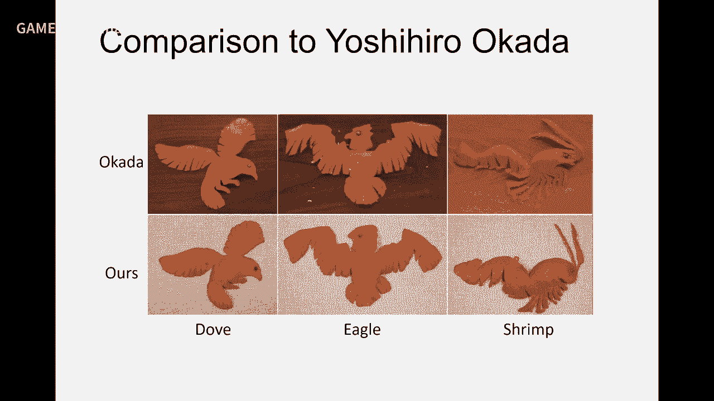

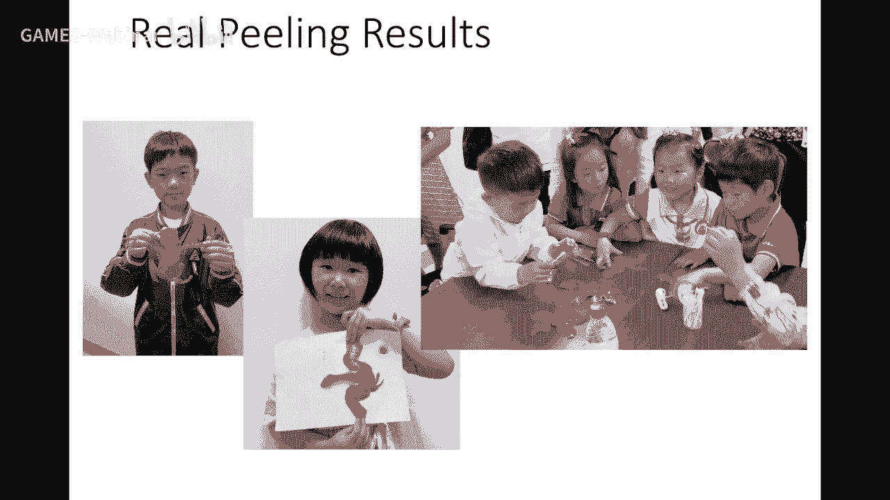

然而，由于边界是固定的，其结果往往扭曲很大。显然，因为边界不够自由，很多点会挤在一起，导致扭曲非常大。因此，这类方法也有许多人进行改进，最近几年（2015-2017）可以看到相关的工作。

---

### 2. 基于几何优化的方法

另一种改进方向是基于几何度量的优化方法。早年有ABF方法，即基于角度的展开。其出发点是保持每个三角形的角度。如果角度保持好了，三角形的相似性就得以保持。因此，它将角度作为变量来求解参数化网格。

变量就是这些角度。对于一个空间三角形映射到平面后，其周围的角度需要满足一些性质：三角形内角和为π（180度），每个顶点周围的角度和为2π。此外，还有由正弦定理保证的边长与对角正弦值的比例关系。因此，它将参数化网格的角度作为变量进行优化求解。如果解存在，就可以保证没有翻转（因为有强约束）。当然，也可能无解，导致参数化失败。整个方法是将这些约束构建成一个拉格朗日乘子系统进行求解。

这是2008年我早年的一篇文章，引用率较高，也比较知名。其思想是尽量保持每个三角形的旋转刚性。这篇文章读起来或实现起来也不难，有兴趣可以仔细看看。未来我们可能还会介绍这个方法，这里不展开。

这篇文章是我们团队的傅孝明博士在读期间的工作。它的变量是三角形到另一个三角形的变换系数，通过优化这些系数（而不是像之前那样优化角度或旋转）来求得最终的参数化结果。

---

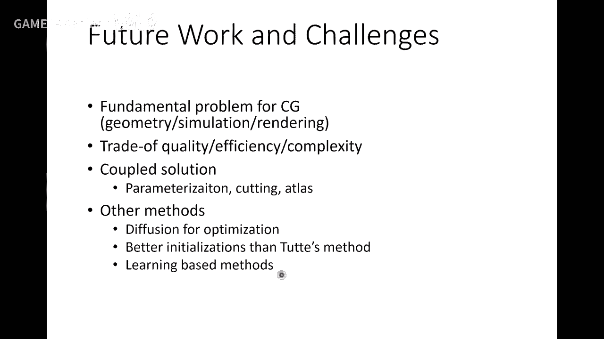

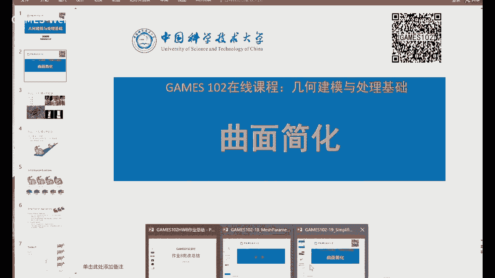

### 3. 严格保证无翻转的方法

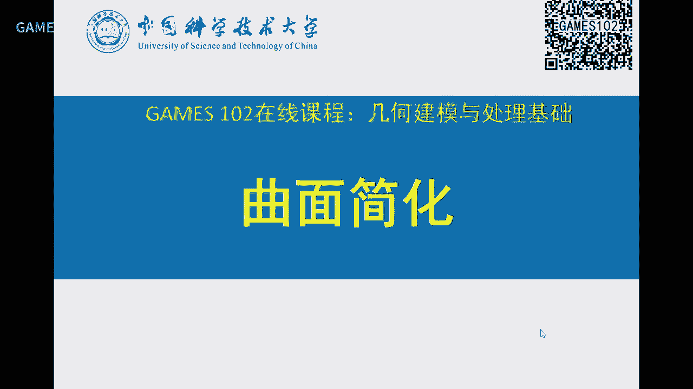

今天我们重点介绍第三类方法：能够严格保证无翻转的方法。这个方法实际上与第一类方法有关。第一类方法理论上保证了无翻转，但问题在于扭曲很大。这个方法的思想是：从第一类方法的结果开始，不断优化调整顶点位置，在优化过程中使扭曲逐步减小，直到无法再减小为止，并且在优化过程中始终保持三角形不发生任何退化（即不发生翻转）。这样就能在保持严格无翻转的同时，降低扭曲。

图中颜色条显示，越红表示扭曲越大，越白表示扭曲越小。可以看到，从一个充满红色的结果，慢慢优化出一个几乎没有红色的结果，表示扭曲很小。

具体如何度量扭曲？多年来，人们发明了不少扭曲度量。我们前面提到，σ₂ ≥ σ₁。可以发现，这些扭曲度量都有一个共同特性：较小的奇异值σ₁出现在分母中。我们之前也提到，如果σ₁趋近于零，其倒数将趋近于无穷大。因此，为了避免发生翻转（即避免σ₁趋近于零甚至变为负值），只需最小化那些以σ₁为分母的能量函数。因为一旦σ₁靠近零，目标函数值就会变得非常大。为了避免这种大值，优化过程会倾向于牺牲其他三角形的度量。因此，任何包含σ₁在分母中的度量都可以用来优化。

早年有这种形式。最近几年（2015年）用得比较多的度量是这篇文章提出的“对称狄利克雷能量”。可以看到，σ₁和σ₂在其中对称出现，共同考虑了两个奇异值。我们后面也主要使用这种度量。当然，使用其他度量也可以，但不同度量的优化难度可能不同。

于是，我们将问题形式化为：对每个三角形最小化其扭曲度量。约束条件是雅可比行列式大于0（表示无翻转）。实际上，σ₁和σ₂是矩阵的奇异值，与变量（顶点坐标）呈高度非线性关系。因此，整个系统是一个非常复杂的非线性、非凸优化问题，求解起来比较困难。加上三角形数量可能很多，整个求解效率是需要关心的问题。

对于优化，如果同学们做过优化就清楚，最小化一个能量函数，就是沿着其梯度方向移动。如果使用一阶梯度信息，就是一阶方法（如梯度下降）；如果使用海森矩阵（二阶导数）信息，就是二阶方法（如牛顿法）。当然，中间还有一些近似牛顿法等。本质上，二阶方法是在寻找海森矩阵逆与梯度相乘的方向，然后确定步长（走多远）。因此，整个优化过程就是：给定初始值（即Tutte映射的结果），不断更新顶点坐标，沿某个方向移动一定距离。

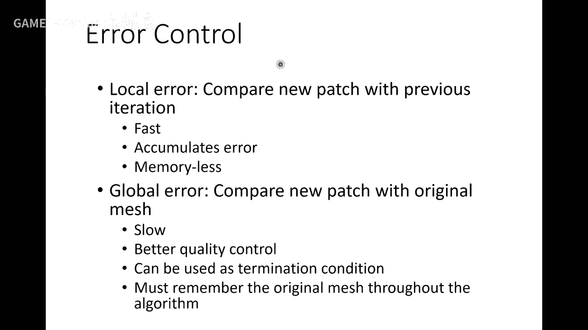

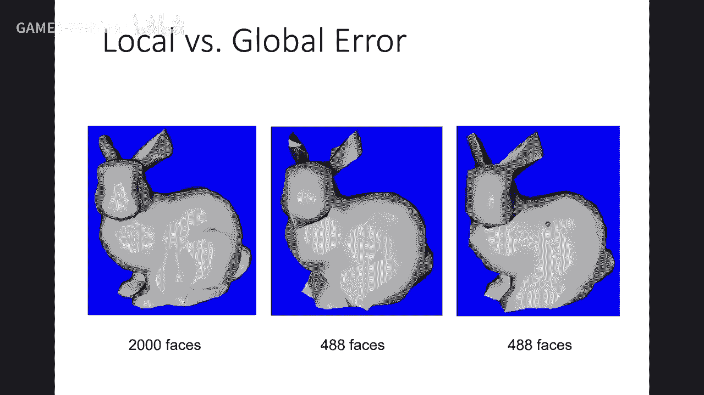

优化过程中有几个重要量：方向、步长和初始值。近五六年，有许多论文研究如何快速求解这个非线性非凸问题。例如，2015年的这篇文章利用拟牛顿法（L-BFGS）来快速求解；2016年的这篇文章利用牛顿法，用拉普拉斯矩阵近似海森矩阵进行二次逼近来优化；2017年的这篇文章也属于一阶方法，用了另一种近似，用向量场算子逼近海森矩阵。

CM方法是最近几年比较有名的一个方法。它属于二阶方法，因此比一阶方法快。它使用了一个矩阵算子来近似海森矩阵。这是较早（2018年）的一篇文章，使用内点法进行优化，也属于二阶方法。

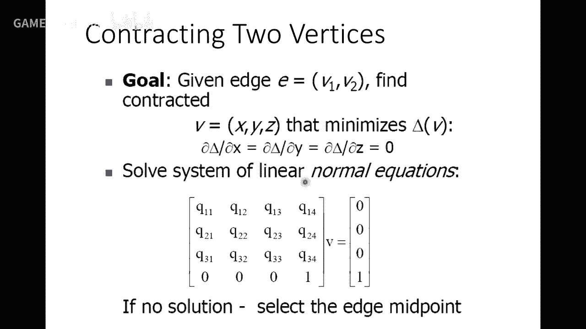

我想多花点时间介绍一下我们2018年的SIGGRAPH文章。前面几个方法都在寻找如何更好地近似海森矩阵，优化框架类似，只是近似海森矩阵的方式不同，旨在使优化过程更快、更稳定。我们这篇文章的思路稍有不同。

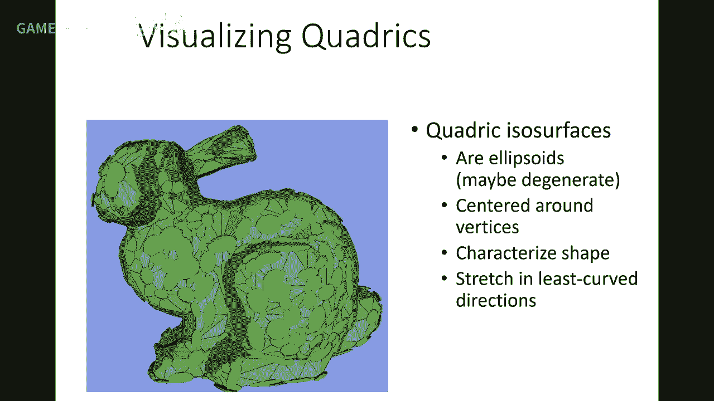

观察这张图：这个模型只有脖子处是边界，边界展开后是一个圆。中间很多头发顶点挤在一起，导致扭曲非常大。扭曲大的原因就在于很多顶点挤在一起。如果直接优化原始能量，会发现中间那些三角形的能量值非常大。从优化观点看，如果目标函数值很大，其下降速度或步长就不能设得太大，下降过程可能不会很快。

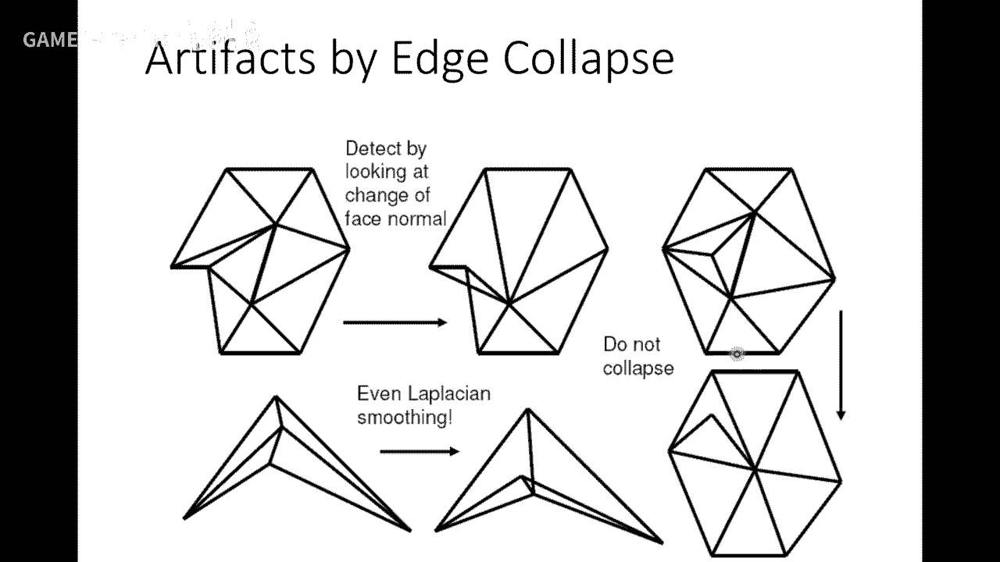

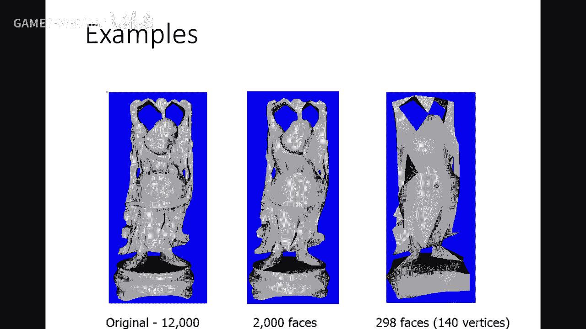

我们的想法是：将一个具有极大扭曲的能量值“压下来”。我们不去直接优化原始目标，而是构造一个中间目标函数，该函数的扭曲是有界的。这样，优化过程就会比较快。当然，优化完这个中间目标后，结果并非原始目标的最优解。因此，我们更新目标函数，再次进行优化。虽然需要多次优化，但每次优化过程由于没有非常大的能量值，所以优化速度较快。这是我们方法的一个特色：我们不是像传统方法那样去寻找更好的海森矩阵近似，而是通过修改目标函数本身来使优化变得更快。

这就是我们这篇文章的过程：有一个初始值，然后构造一些参考三角形，使得扭曲不至于太大；接着不断更新参数化结果以及参考三角形，不断优化，最终得到结果。这个过程也始终保持着防止翻转的目标。这里不详细介绍中间细节，大家可以在我们主页上找到当时SIGGRAPH的PPT，里面有非常详细的介绍。我只是向大家介绍我们这篇文章的思路：通过不断更改目标函数来达到对原始问题的求解，思路与原来非常不同。结果也非常好，数据表明至今仍是速度最快的方法之一。

这里我们对比了当时（2018年）的几种方法。可以看到，我们的方法（能量）下降得非常快。红色线是CM方法，收敛相对较慢，时间也较长。我们的方法速度非常快。这是一个非常大型的模型（Lucy），有近百万个顶点。蓝色线是我们的方法，下降很快，迭代94次就达到了非常小的能量值，而其他方法还在不断迭代收敛。

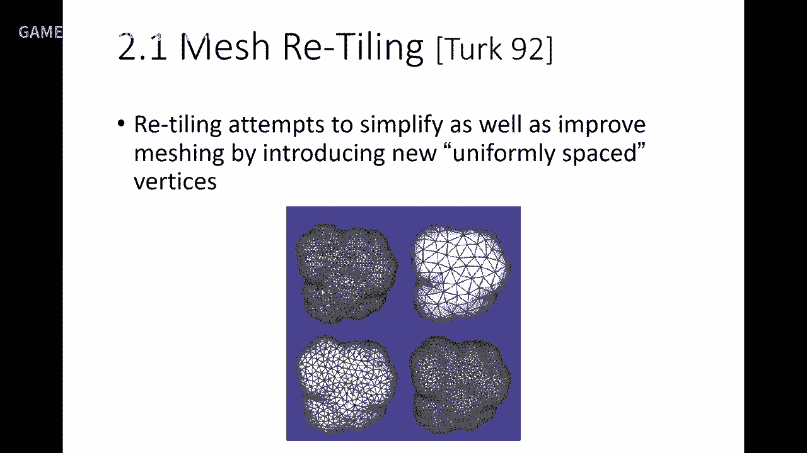

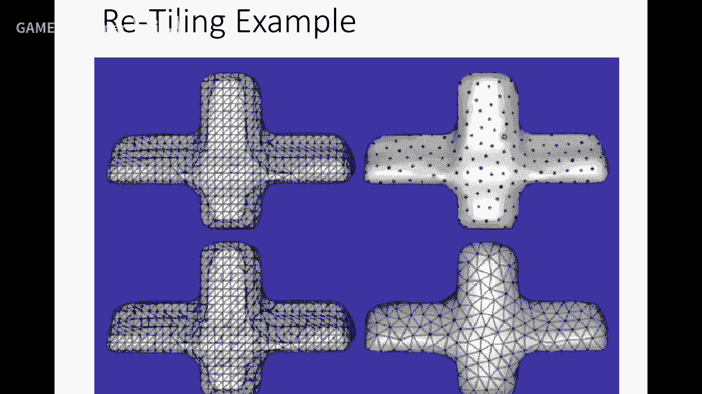

---

### 全局双射参数化

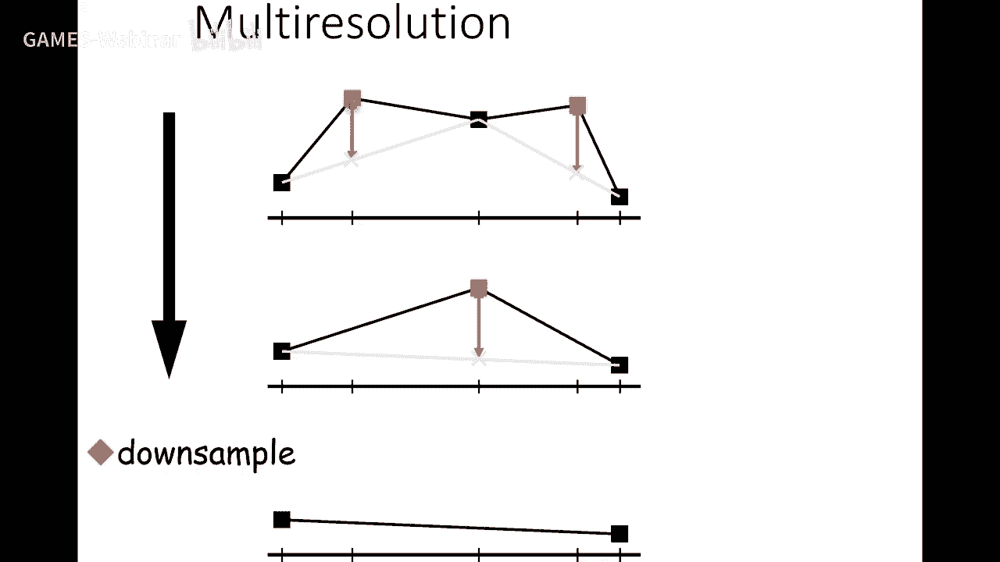

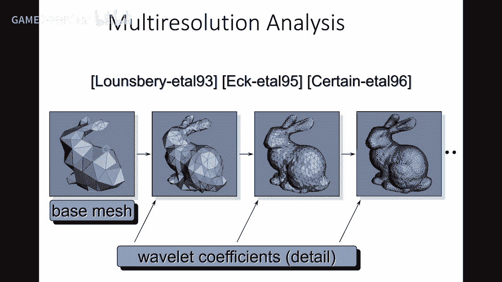

参数化的另一种特性是“全局双射”。局部无翻转是局部双射，而全局双射要求边界在远处也不相交、不碰撞。虽然每个点局部没有翻转，但全局可能发生碰撞，即网格重叠。重叠会导致曲面上的两个点对应同一个纹理坐标，从而产生纹理错乱现象。图中显示，如果没有发生全局自交，就是正常的纹理映射。

全局双射的难点在于：它不仅是映射函数的局部性质，更是一个整体行为。因为要求边界不发生重叠或碰撞，所以它是一个比较难判断的问题。如果将边界看作一个形状，那么就是一个边界不能自交或碰撞的问题，计算量较大。

在我们这项工作之前，只有两篇文章做到了这一点并进行了加速。一篇是2015年的文章，用拟牛顿法加速，但收敛较慢。另一篇是2017年的文章，想法巧妙：在参数化形状外面包裹一层更大的网格。如果这个更大网格不发生自交，就保证了内部网格不会碰撞。但它收敛也比较慢。

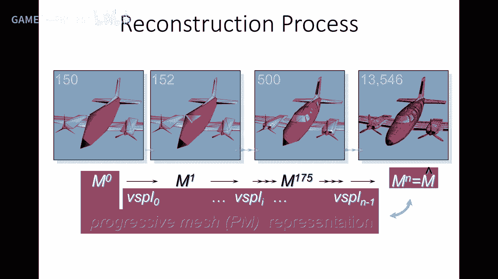

我们今年（指课程录制年份）发表在SIGGRAPH的论文解决了这个问题。同样时间下，我们的方法迅速收敛到结果，而其他方法还在不断迭代。2015年的方法更慢。因为这是一个全局非凸问题，不保证解的唯一性，他们可能找到了其他的局部极小值。

这是我们与这两篇全局双射方法的比较，可以看到我们的收敛速度更快，时间仅用5秒，而他们还在运行。前面提到的渐进式方法（Progressive）虽然总体上比我们略快一点，但它不保证全局无自交。我们虽然稍慢一点，但达到了全局双射的结果。可以看到时间对比：0.26秒 vs 2.23秒 vs 11.77秒，我们的方法比这两个方法快了近一个数量级，将问题的求解效率提高了一个数量级。

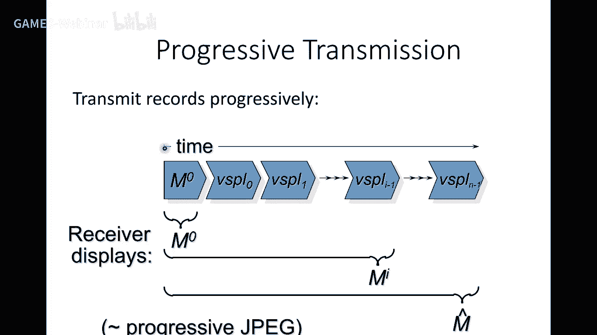

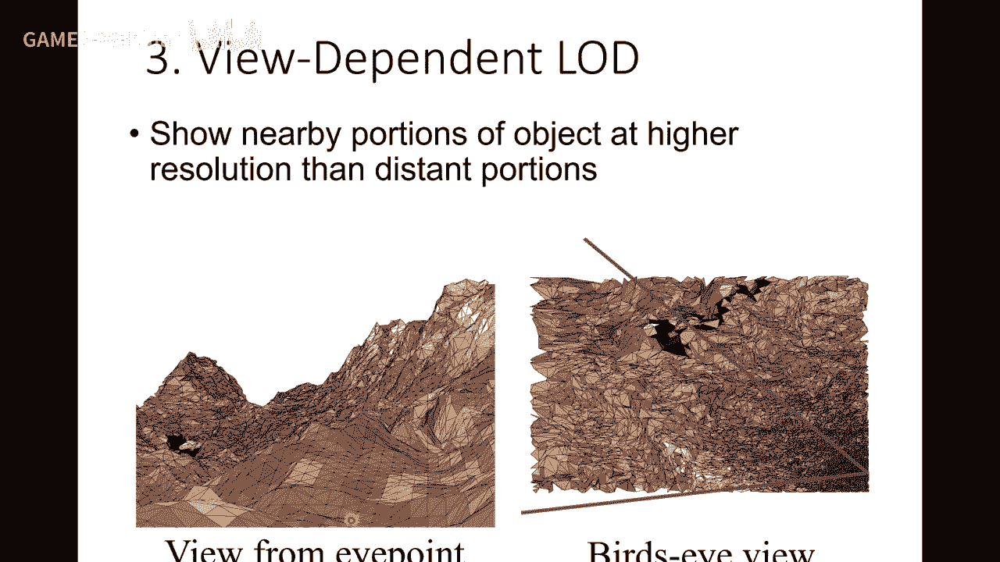

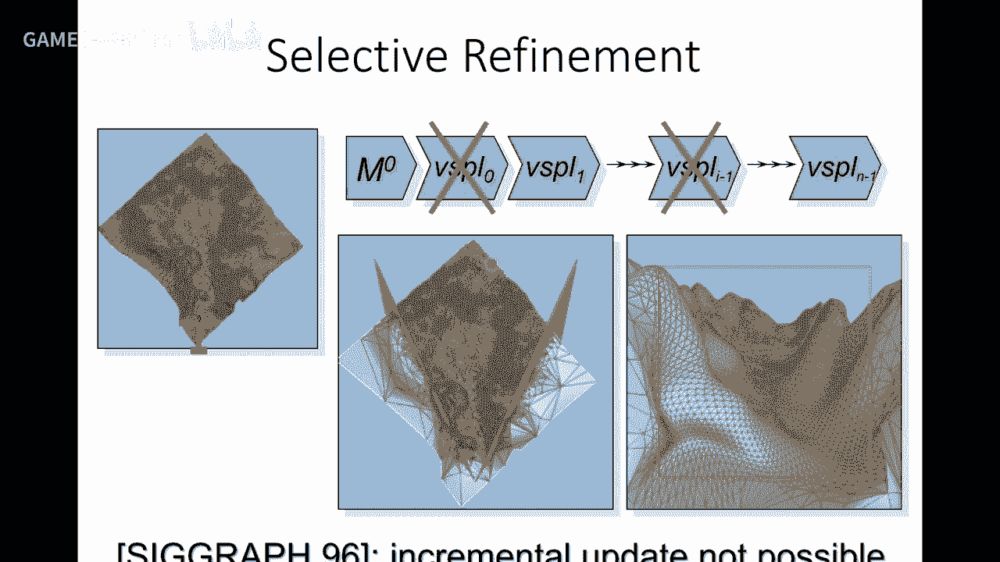

对于一些比较极端的例子，很多方法都无法收敛，但我们的方法仍能得到非常完美的解。

---

### 封闭曲面与割缝

刚才讨论的是有边界的开曲面参数化。但对于封闭曲面（如球面），要将其展开就必须有一条“割缝”，将其切开才能展开。因此，曲面割缝问题也是一个非常重要的问题。不切开就无法将封闭球面摊平。

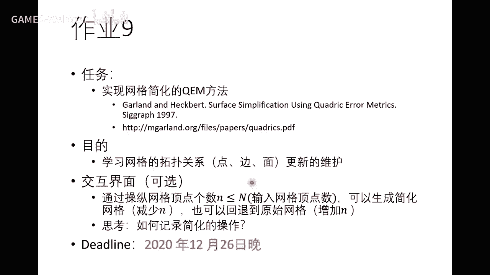

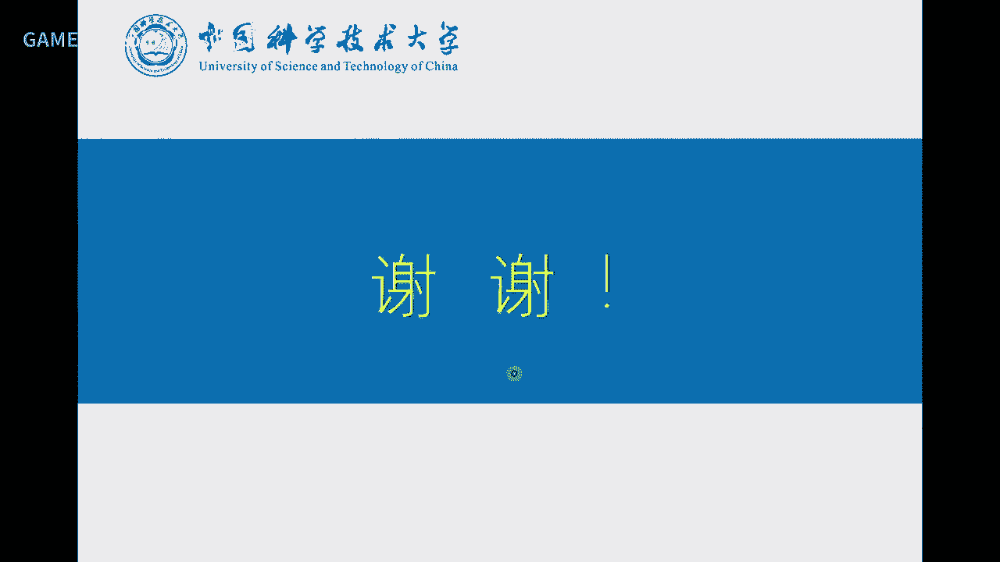

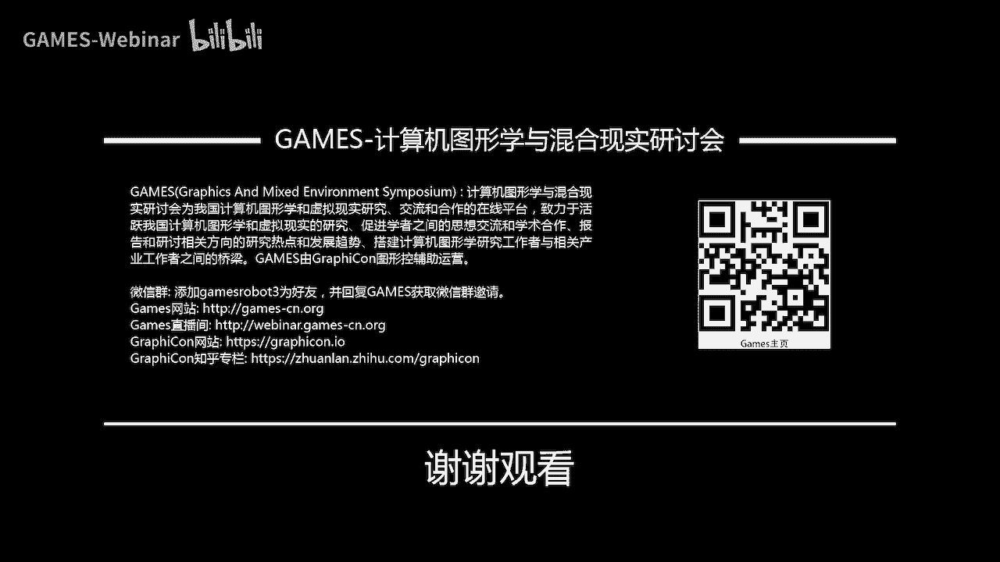

割缝问题也有很多研究。早年（2002年）有一篇比较有名的文章叫“几何图像”，它贪婪地寻找参数化中扭曲最大的路径，将其作为割缝，不断寻找直到扭曲可接受为止。我们团队两年前的一位博士生柴双铭也做过