# GAMES102：几何建模与处理 - P12：几何映射 几何优化 - GAMES-Webinar - BV1NA411E7Yr

各位同學晚上好。

今天課開始，今天的內容是講幾何映射，我們回歸一下上周講的曲面差異化。

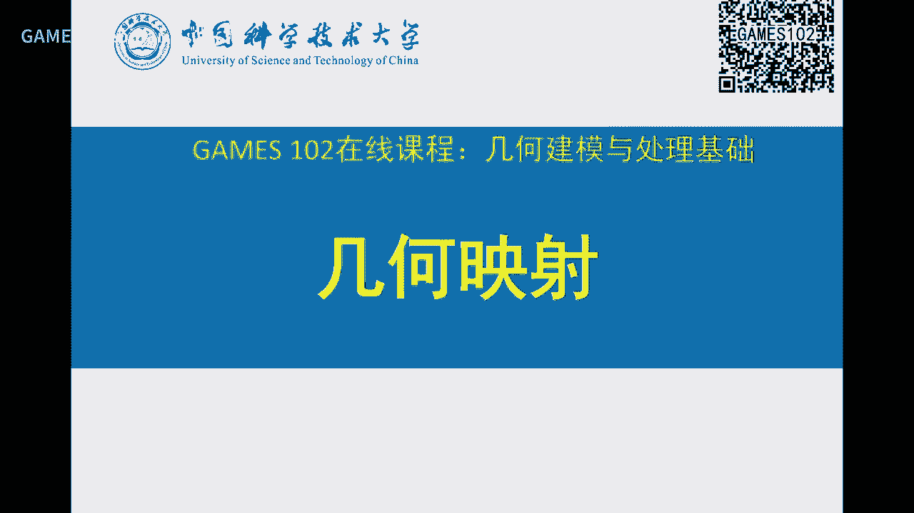

差異化是將一個三維的曲面，因為它本質上是二維流行，所以可以把它展開成平面，有了平面這個相以後，就可以賦予紋理坐標，等等可以做紋理映射等等應用，事實上它本質上是在求解一個F，這個F映射。

這個F映射是從三維空間到一個二維空間的一個映射，這裡每個點對於打到這裡每個點，所以它本質上是個映射，當然上節課我們講了，這個映射本質上可以把它看成一個二維到二維的映射，因為你可以把這個三角形。

平鋪到一個平面坐標，這個C下面的三角形，然後就變成了這樣一個映射，因為這裡就相當於一個剛性變換，沒有任何的形變，所以FF也是一個二維到二維的映射，但是映射的概念在這個課上面，從開始就給大家灌輸，就函數。

如果兩個都是實數，我一般叫函數，只是實數的話，多元函數，都是一樣的催廣，如果是二維到二維的一個映射，就是這樣一個平面去到另外一個平面去，如果同學們學過浮邊函數的話，就是你把這個C看成一個負數。

這就是一個二維到二維的映射，負平面到負平面的一個映射，但是參照化我們學過的，就是一個二維流行到一個平面的映射，上節課也學過的這個球面參照化，就是一個二維流行到一個球面的映射，我們用S平方表示二維球面。

就是二維流行球面，就是三維球面，但是映射也很廣，如果我把這個範圍推廣到一般的定域，我可以一個曲面上的一個點，就曲面到曲面，甚至可以定義在三維空間的一個體，體裡面一個點，映到這裡一個點，這也是映射。

所以映射的這個範圍，實際上是跟我們最早開始講，這個函數映射是一樣的，只不過這裡是定義在我們人看得見的，這樣一個二維三維的一個O值空間，我們人類所能接觸的，二維三維的這個曲面曲線。

那麼我們這些課主要還是限制在，平面映射，我們就假設是二維平面到二維平面的一個映射，那麼二維平面有個定義是UV座標，那麼一個點X表示一個點，映到一個像UX VX，所以大家要清楚，這裡雖然寫了個X。

我用初體上它是個像量，它是個UV兩個值的一個像量，映過去的像也是一個像量，一個U一個V，這是兩個函數，這就是參數曲面曲線的形式，映射表達我們在上半課程中，都給大家講得很清楚，映射有很多個表達。

我們最常規表達就是，把一個函數在一個函數空間去表達，這個函數空間就是G函數，所以每個映射可以看成是一個G函數的一個組合，V分量是另外一個組合係數，那麼這兩個一般都是會共享G函數。

沒必要這個第一個分量擁有G函數，第二分量擁有G函數，可以共享，這樣的話表達就比較方便，那麼這G函數組合就組合出最後這個函數，那麼這是第一個分量，第二個分量BN也組合出另外一個分量。

如果把他們加起來就是這個，這樣的話就表達起來，因為這個G函數是共同的，所以這個AN就是CN就是ANBN就相量，這樣可以表達形式上非常統一，所以你可以看到這是我們以前學過，我們2倍到2倍的映射。

事實上本質上就是一個這樣的組合形式，那麼你這個G函數當然你可以選很多了，你可以選RBF函數，B樣條G函數，還有本質上的G函數，甚至其他的G函數都可以，這個用你自己的這個應用出發，所以這樣的話就定了一個。

這個函數就可以從一個區域到另外一個區域，做一個映射，那麼在幾何數理裡面，由於我們這個曲面都是用離散表達，所以用另外一個方式，我們可以把一個複雜映射，把它分解到各個小片的映射，因為我一個區域可能很大。

那麼我可以把它用散咬化，把它散咬破分，所以我這個一個複雜的函數，映射可能我表達不出來，但是我可以知道，它在某一個小單元上的一個映射，這個結果，所以可以把一個F用一些分片線性。

這個這個仿似變換給它靜止起來，當然在一個小片圓上面的定義的這個函數Fi，跟在另外一個小函數上的Fj，當然要滿足一定的連關華性和連續性，你首先要連續，不連續的話就這裡會有個縫，對吧。

所以這裡就會對這個每個小單元上的函數進行一些約束，後面我們會提，好，那麼幾何映射有很廣的例子，那麼如果你們做過圖像變形，像這個變形的話，你想對這個那個摩蘭依法變形的話，我可以用交互啊，這個點往下拖。

是吧，這個鼻子不動，那就交互想讓他的嘴角往變成這個樣子啊，往往往向彎一點啊，你可以交互，或者說我對一個二維的一個形狀，這是個多邊形，裡面有紋理，那麼我對這個幾個關鍵點，這個點拖拖拖在這。

那麼這個點往上拖，拖到這，那麼問最後的形狀變成怎麼樣，所以這個不管是圖像空間變形還是這個形狀變形，都是有這樣一個交互，那麼這個交互怎麼做呢，是吧，這個是圖形圈裡面或者叫圖像圖裡面一個非常基本的一個問題。

怎麼去對這個進行交互，就是這個形變，那麼後面我們還會有專門課來講這個更多方法，那我們這裡先把它變成一個，是個什麼問題呢，本質就是個差值，對吧，因為每個點有一個目標點拖拽，是吧，那麼問任何一個點。

這個點拖到拖到到哪了，對吧，就是這樣一個問題，所以很容易就想著，哎，我我要去求一個函數FP，那麼使得FP呢，滿足這些拖拽點，到我的目標點，這些這些約束呢，就是這些左圖上的那些，用戶所拖拽的點。

那麼這個FP用什麼形式呢，這個就取決於你的應用，是吧，你可以在一個函數空間，選一套新函數，你可以去定義它，那麼帶定係數，CI求出來就行了，那麼如果你要去差值，那麼你希望這個PI就等於QI。

那麼這個就可以列出很多方程組，是吧，就看這個這個變量個數跟方程的個數是不是一樣，如果不一樣的話，你還要加些條件，就是RBF記憶函數差值的時候呢，就要加那個一些對係數CI的一些約束，是吧，好這個我不展開。

好那麼求解的話呢，就就就有兩種啊，一種差值，就是帶定這些係數，像這個是RBF啊，這裡用了RBF記憶函數，是用了這種形式，你用高次高算函數也可以啊，那麼這裡是一些這個多樣子項啊，只是為了來讓它能夠。

這個增加一些變量而已，好，還有一種呢，能量極小化，我要求一個函數，這個函數的F是什麼呢，是反正就是相當於是對F的一個函數，就叫泛函，我希望它的函數的一個某個值，要達到最小，比如這種形式。

這種形式就是一個叫薄板樣樣條，叫彎曲能量，就是它的兩階偏倒的一個平方和啊，加上一個交叉向的平方的兩倍，好那麼這個這個這個在物理上，他們叫就就這塊薄板，實際上就是平那個線樣條的推廣。

啊就是線樣條是一個線啊，把它彎曲起來，這就是我們已經講過的，三次樣條函數的那個近似，那麼對於快很薄的板呢，薄板樣條呢，就是就這種形式啊，這個一個板彎曲就就有一種彎曲能量，啊物理上可以去近似。

好那麼對F去去進行一個這個求解，那麼同樣也要對F進行一個代定，代定的係數，就接上代定的係數，你去求解它也可以去優化它啊，求出F來，好那麼只不過呢，這這兩種呢，就是一種是絕對差值，我我希望它圓滿足。

一種呢是F呢在某個空間，我要去函數啊，就在函數裏面，那麼這時候呢，這個這個差值呢，可以放鬆啊，比如說這個就約等於，約等於的話就是他們平方和最小，就會把它放鬆一下，就變成軟約數，上面這個叫硬約數。

硬約數就是絕對要滿足，叫差值，軟約數呢就逼近，好，那麼你還可以做很多其他差值，和我以前講過的赫米差值是吧，你可以過來差值，如果差值頂點，那麼印射過來就頂點不動，是吧，如果我還可以差值。

它的什麼兩個這個切線方向，或者法線方向，那麼這時候呢，我可以求的另外一種這個這個啊，印射啊，所以這個這個約數，你可以可以加很多啊，這是對頂點的位置加的約數，這是對它的這個梯度進行約數，也導數，好。

那麼我們以前也提到過那個中庸標，曾經有些課講到過中庸標，中庸標意思就是這樣，你可以對一個多邊形，定義裏面的點跟多邊形點這個關係，如果這多邊形進行交互變了以後呢，裏面的形狀怎麼變呢。

就每個像素重新用這個中庸標，去對邊界多邊形的點進行組合，就得到了它的那個變形的結果，所以這裏面其中有一個，假設這個是輸入多邊形，他們這個邊界就是綠色這些頂點，所構成的多邊形，那麼我們定義一個線際組合。

就是希望裏面的每一個點，裏面的每個點都跟這是QI，那麼這個每個點呢，QI對它的貢獻呢，這是X，對QI對它的貢獻的是一個全αi，但是αi跟X相關的，X在這αi是不一樣，所以這樣可以定義一個這樣的函數。

這個值呢就是X的中庸坐標，對吧，以前是用W來表達，這裏αi是一樣的，就是對一個X某個點就有一套W，去對這個邊界點進行組合，好給一個X就有一個組合，所以這個組合係數就是X的一個函數，那麼這個全函數呢。

你要設計的好，你變形效果就會好，那麼一般這個αi會怎麽設計呢，就是αi在這個這一點QI上面是等於1，那麼對其他等於0，對這裏的每個，這裏是個X區域是吧，所以這樣的話，你可以構造出系列的αi來。

在這裏等於1，在別的等於0，是不是這時候你X在這裏一帶進來，QI就等於1，其他就等於0，好，那麼這樣你構造出一個中庸坐標函數來以後呢，你如果對這個邊界進行這樣一個交互，邊界看看這個點。

這個點應該是變到這裏來，這個點被拖到這裏來，好那麼這樣拖住以後呢，問其中的裏面的每個像素變成什麽樣子，就是在這裏的話，用格子來畫的話，就看得出它的一些這個走向，就是這個格子變成這個樣的格子。

算的時候是每個點，每個交點算出來就行了，其中的每個四面形，對於這裏的四面形，事實上這裏可能不一定是變成一個直的邊，但是這裏是個近似，只要你這個單元足夠小，就可以是個近似，好，那麼這就是中庸坐標。

所以它也是個簡單的Mapping，好，那麽你中庸坐標構造不好，那個它效果就會不好，所以歷史上呢，也有不同的構造中庸坐標的一些方法，常見的有這種中值中庸坐標，還有柯西，還有這個調和，以前都提到過。

我以前忘了在第三和第四節課上面就提到過這個坐標，然後有個網站專門收集了歷年來的中庸坐標的一些研究工作，大家可以有興趣可以看一看，好，那麽你要做一個好的影射，這個要有哪些性質呢。

就是一個好的影射要有什麽性質，那我們這裏從兩方面，一個是叫做雙射，一個右邊叫這個低形變，也叫低扭曲，那麽雙射什麽意思呢，雙射就是我這個這個映射，那個我希望呢，這裏任何一點對應這裏的唯一的一點。

反過來也一樣，就是我們以前學的那個單射雙射滿射，這個概念，雙射就是說有意義對應，這個區域在它的定義域裏面，跟它的那個直域裏面這個點，這個意義對應，那麽那個像這個例子啊，這個就是不是雙射。

因為它有幾個點重合了，可能有一片小區域，重合在一條一條線了，這就不是雙射，像第三個就是雙射，雖然它扭曲了，但是可以看到只不過這個面積，這個面積變得窄了，但是它沒有重合，不像這樣的就重合到這樣。

這樣一條線了，是吧，退化掉了，面積沒了，是吧，就是甚至有反轉，這個這個就是不是雙射，像這個就是這也是雙射，但這個雙射呢，這個白的這個框呢，扭曲會比這個扭曲要小，因為原來是這麽大，是吧。

所以這個是具有更小的扭曲，所以所以同樣是雙射，也有不同的這個性質，所以我們可以考慮，從雙射和扭曲兩個維度來看，來評判一個影射是好還是壞，因為雙射的話呢，保證了這個映射啊，它這裏不會出現這個重疊的點。

還有甚至扭曲，這個特別是對文理，文理映射來講的話，就不會出現在曲面上，有這個鬼影的現象，那麼扭曲越小，當然越好了，就不會出現非常大的形變，這個文理，好，那麽雙射還有一種，另外一個概念，雙射是全局雙射呢。

實際上就是真正的雙射啊，還有一種叫做local雙射，就是局部雙射，局部雙射呢，就是指局部上面，它沒有是一對應的，那麽那個概念叫injective，叫單射，叫injective，就是local雙射，好。

我們來看一下，如果你要對這個，這個左邊這個形狀，把這個頂點點往這邊去拖動，我們來看一下，會發生什麽形狀，如果如果裏面的張牙，如果裏面的張牙形，發生了這個翻轉，好，那翻轉翻轉，翻轉什麽意思呢。

以前我張牙形是V1V2V3，假設是逆時針這樣方向，結果你這個V1V2V3，變了以後呢，呈這樣一個方向，變成了順時針，它兩個朝向，一個順時針一個逆時針，反掉了，比如說這個張牙形，大家看到，這個張牙形。

那麽這時候呢，就這個性能不好，就發生了flip，上次我們上節參照化的時候，就提到過這個現象，這個叫翻轉，也叫這個，算是這個非單射現象，好，那麽你可以看到，我如果我們不容許，好，如果這個不處理的話。

可能會發生這種翻轉現象，你可以看到右邊這個呢，就沒翻轉，只不過呢，這個頂點啊，每個棉花形呢，都保證它的這個正向，只不過這裡的扭曲，會比較大一點，是吧，顯然吧，因為你這個這麽多點，會擠在這裏。

就跟我們參照化的時候，很多點會擠在一起，這裏一樣，但是呢，這個這個翻轉沒有了，所以這個是一個，保證了這個，這個bijective，就是叫flip free，就沒有翻轉的這個一個印射，這個印射是翻轉了。

但是它的邊界條件是一樣的，這個點也是跟這個點的條件是一樣的，好，所以怎麽去構造這種印射，把一個矩形變到這樣一個區，邊界區，然後使得它裏面三角形呢，可以扭曲，但不翻轉，這是個非常硬的一個條件，好。

當然在不翻轉的情況下，能夠減少扭曲，這個是更好的性質，好，好，那我們看一下，翻轉現象就是三角形，從一個這個，逆時針的朝向，變成一個順時針朝向，朝向反了，那麽我這裏提一下，如果我們定義這個。

逆時針這個朝向的三角形的面積是正，那麽逆時針面積就是負，是吧，這個面積可以用他們三個點的那個，座標，求個行列式就可以求出來，那麽這個行列式是正，就是大於零，行列式負，就是小於零，就是沒翻轉。

小於零就是有翻轉，那麽這個點，不會跳到這個邊的這邊來，只會在這邊，但它可能發生非常大的扭曲，就是這個三角形形狀可能不好，但是微因始終是在這個邊的這一側，因為這一側就保持了都是，都是這個逆時針的一個順序。

就這個是沒翻轉，所以翻轉不翻轉，這個本質就在於這個三角形的面積，它的這個有相面積的符號，有沒有辦法改變，如果是沒法改變就沒翻轉，如果翻轉改變就翻轉了，那麽這個面積等於價於就是那個。

他們三個點是不是形成同樣的右手系，或者左手系，剛才我已經講了，就是這個逆時針和順針的關系，好，那可以看到這個，這個global adjective，就是全局這個雙色跟局部雙色，局部雙色也叫做單色。

就是局部是單色的，那麽如果這個全局是雙色，當然是局部雙色，對吧，這個沒問題，但是反可以看到這個例子，可以看到例子，可以看到我把這個矩形把它翹起來，好，這裏始終都沒有發生這個裏面的三角形，翻轉，對吧，好。

這時候呢，從這裏到這，這裏到這裏，那雖然裏面這些點都沒有發生這個翻轉，但是呢，這裏它這個點邊界碰到這個邊界了，所以在對這裏的一些點，這裏的一些點就什麽，就有這個，好。

對這裏的一些點就發生了重疊。

是吧，所以這時候就破壞了這個Byjective的性質，好，如果你再翻轉一期，這個重疊就會非常大，非常多了，那麽這是好，這時候就是Not Byjective，實際上是從這個狀態開始，發生了非雙色。

但是它局部是雙色，就是它這裏處處，即使到這個樣子，它裏面都沒有發生翻轉，裏面沒翻轉的，只不過Global發生了重疊，好，這就是雙色和這個局部雙色和全球雙色的概念，我們在上期課插上話的時候，我們講過了。

就是怎麽去算那個Local Byjective的一些運算，這個優化，就是那個印射的甲殼比大一點，等一下我們還會解釋，那麽對Global的Byjective是比較難處理的。

是要判斷這個他們的邊界是不是碰撞，是吧，我們上期課也提到，我們今年有篇SIGGRAPH文章，做了一個非常快的算法，超過了以前的方法，好，我們展開，好，那麽這個雙色會帶來什麽壞處呢。

就是如果你是把它看成是個文影式的參數域，那麽這裏有個圖片，這個顏色，這裏就這兩個顏色是一樣的，就發生這樣一些重合歸因的現象，你可以看到這片顏色，在這裏也是，那麽在這裏也是，好，那麽這是一個例子。

就這個例子是拖動中間的一個點，應該是拖動這個點往這個方向移動，好，那麽移動到這裏開始發生了，發生了翻轉了，是吧，這個網格在這裏就就就就有重重合了嘛，在這塊重合了，好，那麽怎麽去做這種早年呢。

重合的這個方法，優化也沒有那麽快，所以當時就沒法做，最近幾年這方面進展還是蠻大的，好，那麽我們看一下，我們來看看本質在這裏是什麽，這是什麽，就是局部的一個雙色，也叫injective單色的本質。

數學上是一個什麽概念，這概念呢，這個數學上非常簡單，如果我們把這個印尺F的這個這個叫甲鎬比，先就拿來，甲鎬比是一個2*2的一個這樣的矩陣，他的行列式就叫甲鎬比行列式，這甲鎬比行列式。

等一下我我再來解釋上意，上次這裏再去解釋，他是這樣，他是每個這個分量的函數，對x和y進行偏導，就構成了剛好是這樣，一個2*2的一個矩陣，事實上一個局一個印尺，局部是不是發生翻轉，一個判斷條件很簡單。

就是看他的行列式是不是大於零，這個非常簡單，這個我來把這個解和异，給大家講一講。

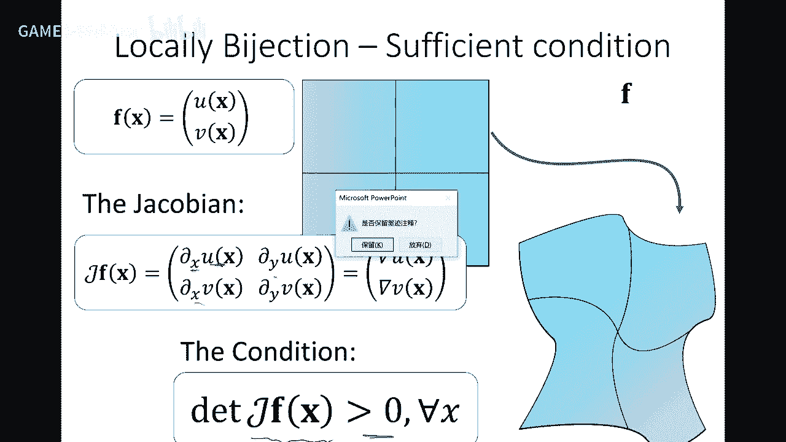

這個在數學上是很好，我這裏還是以二維到二維，就是就這裏這裏有個區域，這裏有個區域，我們這區域叫叫Domain1，那麽這裏有另外一個區域，第二這個一個函數印過來，好我對這裏的一個x假設是x0。

那麽我取他的一個無窮小的領域，但是包含這個x0，這個領域叫做ω，那麽這個f就會把這個x0，印到這裏一個點y0，同樣這個ω這個領域的每個點，印過來以後，他這裏也會形成一個區域，是吧，那麽這個區域。

我把它記成fω，相當於一個區域的每個點，印過來一個區域，是吧是這個區域，好，fω我算他的有限面積，我這裏規定是逆時針，有限面積是正，那麽比上原來的ω這個有限面積，我這裏先假設為數是一樣的，都是二維。

好那麽他的這個值，就是這個這個ω，趨向於0的時候，就ω的面積趨向於0，也就是說這個這個區域，包繞x0在越變越小越變越小，好他這個極限存不存在，有一個印射f把x0變得，假設印射是光滑的。

這光滑就是連續並且可可導，那麽這個x0周圍的這個領域，這個y這個領域，印到了這個領域，這個領域的面積比上原來這個圓向的面積，這個比，也就是說這個比是不是可以，可以可以，大家可以直觀想想。

是不是體現了f在這個點的一個局部的一個性質，他是發生了膨脹，還是發生收縮，對吧，如果這個值小於1，是不是這個相當於這個無窮小的時候，這個值比，這個面積比這個面積小是吧，大的時候，這是不是發生了膨脹。

就是可以體現f函數，在這個點局部的一個是放縮，還是還是這個放大，還是縮小，還是不變，對吧，可以證明這個值體積線是存在的，並且是等於f的雅各比行列式，在x0的這個值，這個j就是這個雅各比，好。

從這樣一個事實，我們我們好好理解一下，好，我們f把一個無窮小領域，印成了一個另外一個無窮小領域，並且他的有限面積比，是一個跟f這個這個這個雅各比相關的，是吧，好，我們看一下，如果這個雅各比。

這個行列式發生了變號，小於0了，小於0是什麽，是有限面積，這個是本來就是這個是正的，變成一個負的，是不是這個就發生了flip，所以小於0就是發生了flip，局部發生了翻轉，一定發生翻轉，等於0就退化。

就退化成了一個一個零面積，是吧，就是這個這個這個degenerate，大於0就沒有翻轉，很好，性質不錯，但是呢，大於0也有大於，因為這個這個體現了這個面積比，所以呢，大於0又可以分幾種情況。

如果是大於1，是不是這個局部面積發生了放大，這個就是，就是叫膨脹吧，就這個這裏面發生了大的膨脹，等於呢，表示面積是不變，這個這就是等級變化，如果小於1，小於大於0，就是收縮縮。

所以我們這個一個隱身的性質，完全可以從F的這個雅各比，這樣一個行列式的性質來著，所以可以看到很多優化裏面，都會拉雅各比這個行列式來做，他的一些這個這個度量。

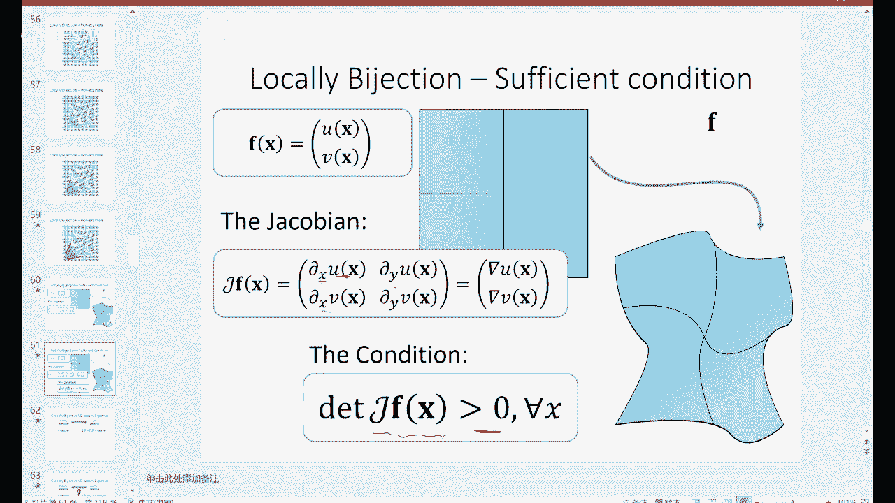

所以在這裏，大家馬上就清楚了，雅各比行列式的這個行列式，大於0就是沒有翻轉，所以這是個硬條件，每個點對每個點都要是大於0，這樣的話，這個F就一定是處處都是injective，好，那麽這個這個沒問題。

好那麽反過來，如果處處每個點都是injective，能不能推出global，這個顯然是顯然不行嘛，對吧，這個我們裏面每個點都沒翻轉，但是全局發生碰撞，但這問題很難，就是你很難從局部性質，推到全局性質。

有些結果這個你可以百度和谷歌，一下這個這個全局inversion，但是這個實用性上面還是比較難的，一般我們還是要，就像我們今年SIGGRAM那篇文章一樣的，還是要去顯示去判斷邊界，到底碰不碰撞。

因為這個情況就發生在邊界，發生碰撞了嘛，就是在很遠的地方發生碰撞，好，所以實際上是個碰撞，免碰撞的問題，好，那麽我們在第二部分來看看這個destruction，我們現在搞清楚了這個雙色，或者局部雙色。

也叫單色的一些性質，好那麽剛才我已經解釋清楚了，我一個無窮小領域，這個Fω，跟ω的這個面積的比，就度量了它的一個形變量，這個大於1就是膨脹了，小於1就縮縮了，等於1實際上就是局部是等級變換。

至少在這個點，它沒有發生形變，所以這也是我們上一節課講的，所以我們一個上下型到一個上下型，求一個這個性質變換以後呢，把它的那個這個性型比，性型這個矩陣拿過來，做個SVD分解，中間的這個奇異值。

就度量了這個它的形變，因為這個東西亞克比，因為這個是正交，這個正交，所以它的這個，它的亞克比，本質上就是這個，Σ1和Σ2的度量，所以這也是上下課，我們那個slice把它拷過來了。

如果是這個局部的一個這樣的，一個變換，這個亞克比，這個奇異值相等，就是表示這個叫保角變換，乘以等於是保面積，那麼這個多等於就是等級變換，那麼為了防止翻轉，所以歷史上大家就想了好多，不同的度量來度量。

這個防翻轉，上防翻轉，這個能量函數，這個最有的特點，就是小的這個奇異值，多在分母下面，因為這裡我們確診是σ1，小於σ2，這樣來變排，所以當你這個σ1，趨向於0的時候，那麼就相當於是這個變形的這個區域。

就趨向於退化，所以要防止這個小的，要趨向於0，怎麼辦呢，我就把σ1放在下面，如果這個σ1很小，趨向於0，那麼這個值它的分之一，而倒數就會趨向這無窮，所以導致這個能量很大，所以可以用這樣一種形式的能量。

去壓制住這個，不要發生這種現象，這就是為什麽，大家都用這種形式來，來避免防翻轉的一些這個應試，對於體也一樣，給體的話，大家也可以看到，都用σ1也放在分母，這裡是σ1，它因為在體的話，有三位空間。

就有三個奇異值，空間的一個反應變化，我這裡可能反了，應該是大於，因為這個性管上是小的，這個稍微大家應該清楚，那我們繼續，那麼我們看看影射的優化模型，優化模型，這是我們上期課講參照化的時候。

就以我們minimize所有三角形的這個能量，因為這個能量叫對稱deuterium能量，這個就是這個能量，然後呢，再約束每個亞克比大於0，這個是能量極小，這個是亞克比大於0，免翻轉，去優化這樣一個能量。

就可以求出一個比較好的一個映射，只不過這是一個參照化的一個映射，這是上期課我們講了，好那麼看一下這個具體，具體怎麽求，我們再簡單的過一遍，你要去算一個映射，這個例子是這個意思，我以為這樣舉行。

我希望把它的邊界，這個邊界變成這樣形狀，就是底邊這個邊界變成這個形狀，問這個形狀變成啥，這個在後面我們做形狀編輯的時候，變形的時候也會講，我這裏只是把它拿來做個例子，好，那麽你說變形。

那麽我這個邊界是一樣的，那麽變形量上面這幾個例子，這幾個圖都可以，都符合我的要求，那到底它是哪個好呢，你要有個度量，我們希望找到那個形變，不是就是比較小的那個，那麽這時候呢，就是你要滿足要滿足什麽條件。

是變形體量比較小呢，還是變形這個夾角比較小，就是你要這裏有一個度量，好，那麽對於不管是什麽要求，你最後把它變成一個優化問題的時候，總是這樣，你minimize一個怎麽能量，然後呢，這裏滿足一些條件，好。

那麽這個就是一個典型的一個優化問題，我們參照化那節課，上個禮拜天的那個課就一直在講這個優化，就是優化這個某個能量，然後使得它滿足某條件，但這個條件如果很復雜，是個非線性約束的話，整個是個非線性系統的話。

就優化會比較慢一點，好，那麽這個叫能量，這個叫約束，我們今天晚上後面會再講優化，講得細一點，好，那麽去做的時候呢，這個函數，這個硬設呢，可以把它分解成三角形之間的，所以對幾何問題來講。

我們可以有很特殊的一個分解，實際上這就是有限元的思想，我們把一個函數，作用在一個三角形上面，只要去度量這個三角形到三角形，這個小單元之間的一個硬設的性質，那麽整個硬設，我把它求和，就可以去量化。

那我們三角形到三角形呢，平面上它是一個仿真變幻，由線性部分加上平移，那麽對扭曲是不影響的，主要是這個aj會有影響，所以我們會用這個，這個它的那個奇異值來度量，所以這種形式的能量有個好處呢，它是什麽。

它是由很多項給組合的，所以呢，我把整個的一個硬設的能量，可以分解成若干個三角形的能量，所以它是separable，就是可以可以分離的，好，你去求解這個硬設呢，這個還有個條件，你希望我的目標的這個。

這個值還是要跟它一樣的，突破關系一樣，所以這個必須要也要也要拼在一塊，如果你每個三角形單獨去做，可能三角形就拼不起來，是吧，就就給它割裂了，這是不行的，所以怎麽樣去保證這些連續，也有不同方法。

我們來看一下，一個方法是說，我這上面一個硬設的ai，把這個三角形硬到這來，下面的aj把這個硬到這來，好，那麽他們就分別把這個兩個頂點，v1和v2，公共的這個邊的兩個頂點，也就是公共兩邊。

分別硬成了ai v1和ai v2，下面這個硬設的aj呢，硬成這兩個是吧，所以呢，我為了保證他們要拼起來，所以你只要保證他們兩個是相等，他們兩個相等就可以是吧，所以可以，如果你去求這個硬設，作為變量的話。

就要保證這個兩個，這個這個性質，他們兩個頂點要重合，這是保證的c0，好這個剛才那個條件呢，是對這個ai aj，實行強制的這個，一些這個約束，是吧，所以把ai和aj看成變量了，是吧。

對這個在15年SIGGRAPH有篇文章，就是用，應該是我們組的傅曉明老師做的，就是把這個這個這個硬設的這個，參數作為，係數作為變量去優化，就是apply這種頂點約束，就構成一個也是個系統。

好還有一種方法的，什麼我呢，希望我就假設我求出來一個，假設這個U1就是這裡呢，求出來一個結果，假設是個參數的話，每每個點有座標，好我對每個點這裡做過來，好ai把這個三角形，用到這個三角形，那麼ai又把。

對這個三角形，用過來以後呢，就是就是是這樣一個條件，好嗎我對別的三角形，也也有這個條件，所以我的變量呢，不是那個變換，而是這個U，就是我的這個結果的這個頂點，就Ui是是變量，好那麼這個ai是什麼呢。

ai呢，事實上是可以由，因為這個Ui是假設，我是要求的，他他他他有的吧，所以說ai是可以由這個vi，跟ui一起來決定的，因為在二維中，大家可以很快寫出一個方程組，就是就是ai乘上vi，vi， vii。

這三個變量變換過來，到又叫叫到v到又叫到U1，這時候呢這個ai的係數啊，就這個矩陣啊，這個三成二成二，每一下可以表達成，vi， vii， viii，U1， U2， U3的一個變換，這個一個表達。

這表達是線性的，所以這樣的話呢，就就把這個變換ai中間，我要求的這個ai呢，由這個U位置數所表達出來，所以整個系統還是關於這個U1， U2， U3，變量的位置數的一個一個一個表達，所以你對ai進行約束。

相當於對U1， U2， U3，這些變量目標的變量，做了約束，所以把這個這個這個要求的這個變量呢，轉嫁就是隱含到了這個ai裡面去了，好那麼這樣的話，你去在這裡的時候，優化的變量呢，就是這些U1。

 U2到這個Um，就是目標之間的這個U，所以只不過這個a_j呢，是由U和原來這個v所決定的，好所以這是這個叫叫隱私的連續，那麼這種方法是用的比較多的，所以我要去求一個目標的目標的一個這個映射。

那麼我想要去帶領這些映射的這個頂點，往個頂點，然後呢中間的所有的變量都可以，包括包括映射都可以由他們來表達，所以你加在a_j上的一些約束，等於加在U上的約束，所以始終變量還是這些這個目標頂點。

好那麼這裡怎麼優化求解啊，這個上一節講了一點啊，我們看一下就是對a這個，每個象形這個仿真變換，就是現行變現行變換的係數，最早是用這個delete kernel能量，delete kernel能量很簡單。

就是這個映射矩陣，就是二乘二矩陣的一個Frobenius範數，Frobenius範數就是abcd的話，就是a平方加b平方加c平方加d平方開根號，就是這種範數，這範數沒有太多幾何意義。

就是純粹度量這個變換，這個這個這個元素的平方和，這個這個那麼w_j呢，一般也會取成三角形的面積，給它加全面積大就就比例高，面積小比例低啊就這樣，但是這個這種意思呢，容易發生非常非常大的扭曲啊。

早年會用的比較多一點，這個這個後來最近就不大用了啊，那麼最近用的比較多的就是這種，保持某種特性，我們上一節也講了啊，比如說我保持這個這個a啊，這個a中的某個旋轉部分是是真正的旋轉，所以使得這個圖形啊。

發生真正的一個旋轉，不會伸縮也不會縮小也不會放大，如果你讓這個a中的這個旋轉分量啊，這個變成一個相似矩陣，這時候呢它又發生放大縮小，但是是比較這個均勻放大和縮小，所以這是個相似矩陣啊，就是叫做包角變換。

那麼這個我們上節都講過啊，那麼這就是對a進行一個u s v的分解，那麼這個這個中間的這個矩陣呢，就是一個對角陣，對二維來講就剛才寫寫過的這個，u乘以v t就是兩個旗子，然後旗子可以看到。

如果讓它盡量的向這個旋轉，那麼這個u1，σ1和σ2都等於1是吧，如果它相似只要它們兩相等，這就是剛才那個度量，相等等於什麼呢，應該等於它們的一個這個平均值，好這就是我們上節課也講了。

那個a i c a p，提了一下啊，就是那麼這是a i a p，a i p就是讓這個，這個中間的那個三角形，變換的這個矩陣部分呢，盡量是一個旋轉，那麼可以看到a i a p呢。

比較好的保持了這個三角形的形狀，a i c a p呢，形狀保證不了，但是它有個伸縮，它有一個這個這個比例的伸縮，但是不是絕對的，好這就是你對，如果這個度量不一樣啊，你是保相似還是保那個等距，就是旋轉。

還是常規的這個迪力克能的量，它的就會證明，minimize是什麽呢，minimize這個奇異值的平方和，這是minimize，它那個奇異值跟平均值的這個差，這個是更易的差，就是保形。

好那麽a i p這個方法，我們上節課沒有去展開，這個我稍微提一下他的思想，這思想呢就是一個迭代優化的過程，就是分成一個局部和一個全局，如果有大家有興趣，上這個文章實現不難，在雛形學課裏面。

我們是把它作為作業，本人也想作為這個課的作業，後來把它去把它那個還是先不暫時佈置，大家可以去看看這文章，是08年我的一篇文章，然後它那是兩兩部，一個是局部局部的話，就是始終對一個結果。

我始終去找一個最好的旋轉去逼近它，然後有了以後，這個散氧氣泡不就分裂了嗎，就把它縫合就算是就求解一個global的一個，系統發展組這個叫global，然後不能不不斷的迭代，後面有個圖我們看一下。

假設我要我要把把這個這個輸入這個紅線，就是中間在紅紅線往上抬，就抬到這裏，但是這裏的話這當然是個結果，但這個結果很不光滑是吧，那麼我們就去看，那麼這裏一個一個散氧氣泡。

原來原來這個我們考慮其中一個散氧氣泡，變到這裏個散氧氣泡，是不是就有個反的變化，但是反的變化可能肯定是發生扭曲，對吧，所以我把中間的這個最相似的旋轉扣出來，然後讓他們每個散氧氣泡發生變形。

這時候每個沒散氧氣泡就就碎了，碎了以後呢，我又要去global的一部呢，把它們縫合起來，就縫合成這樣子，可以看到，這個這個弧度已經出出來了是吧，好我同樣，我再去找一個最相似的旋轉，畢竟每個散氧氣泡。

然後然後然後又分裂了，是吧，然後又把它縫起來，所以分裂這一步呢，是local部，縫起來是global這一步，global是求求一個稀疏性方程數就可以了，那麼不斷不斷迭代，那麼迭代到最後，這個結果呢。

就是盡可能幫剛性的AIP，它使得這個總體上的這個，奇值都等於1，每個散氧氣泡的奇值，這個距離平方和最最小，好，這就是這樣一個結果，大家有興趣可以看看，未來可能用得到。

那麼事實上是這種local global的概念，是非常非常廣的方法，在優化裡面用的非常多，也叫local global這個方法，有的地方也叫交替迭代。

就是alternating local global，就是交替迭代的意思，好，那麼還有一些其他的一些詞，local global是在這，還有一些什麼T數下降，還有一些這種交替投影方法，好，好。

那麼這個這一刻，我們就很快就走出總結，這個幾何映射，就今天詳細解釋幾何映射中間的，幾個性質，還有一些類型，特別是這個bijective，還有這個distortion，這個度量。

那麼對於這種幾何映射的問題，優化問題，它有一個比較特殊的結構，因為它的能量是，這些三角形能量一個核，它是可分離的，所以呢，造成了就有一些比較特殊的方法，去求解它，就是不同於一般的這種優化問題。

它是有非常特殊結構，好，那麼往往這種能量的都是非線性，非推突的，所以對於這個，如果這個三角形雖然很大，它的計算量都是非常非常大的，這也是一個需要人們不斷去，再進一步減少計算量的一個地方，好。

那麼還有一種的就是上次剛才，就是我們不用去做剖分，就最早提出來，就是對這種fx，對某個g函數，組合出一個函數，那麼對整個區域進行一個f映射，那麼這時候，這裡就不需要去做網格化。

因為它是一個定義在整個區域上一個函數，只用這麼，那麼對於這種函數，這個叫matchless，我不用做網格，因為我是定義在這個區域上的，任何一個點，那麼它的這個bijective。

或者是flip-free，notation怎麼度量呢，比如說我要把這個圓，這個左邊這個圓，變成一個這樣一個像一個花的形狀，問裡面的區域怎麼變形，這個f應該怎麼求，是吧，這裡也有一系列的這個工作。

我就不去講，特別是我們組成一個陳琳潔老師，陳琳潔老師在這方面做了很多工作，其中就是這個f，你要有些獨特性質，比如說，我這個f在邊界上滿足一定的性質，我內部就一定能保持滿足一定性質。

這時候我想要把這個複雜度，把這些約束，只要定義在邊界上就行了，那麼這個f怎麼構造，這個是一般是用這個調和，這個映射的一些性質，可以去推出來，這裡面就是對這個f整體上的一些性質的討論。

這個跟基於這種三角片分解的性質不一樣，好，這也是，也有一類的文章來做這個幾何影射，是從這個全局的這個函數來考慮，我們一開始就提到過，函數可以按幾函數分解，也可以按區域分解，是吧。

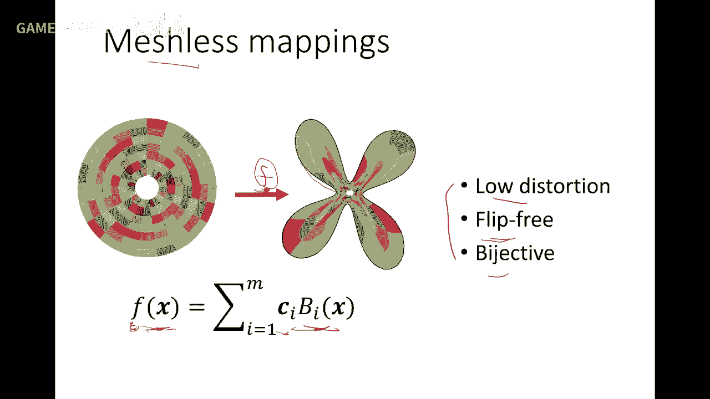

好，那麼幾何影射，我今天主要重點是還是二維到二維，事實上是有很多其他形式，開始我也講了，就是二維流行到二維流行，甚至體就是一個volume，一個體的變形，體的話，內部有四面體，或者是六面體去變形，好吧。

那麼最近我們組，就是傅老師牽頭，寫了一篇中述文章，就是關於這個幾何影射的一些工作，這個內容比我今天講的還要多，因為今天我們主要還是一個入門，這文章應該是明年會發在CVM這個期刊上面，大家有興趣可以去看。

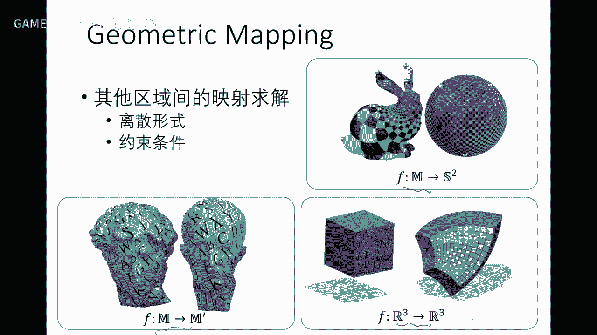

如果做這方面工作的話。

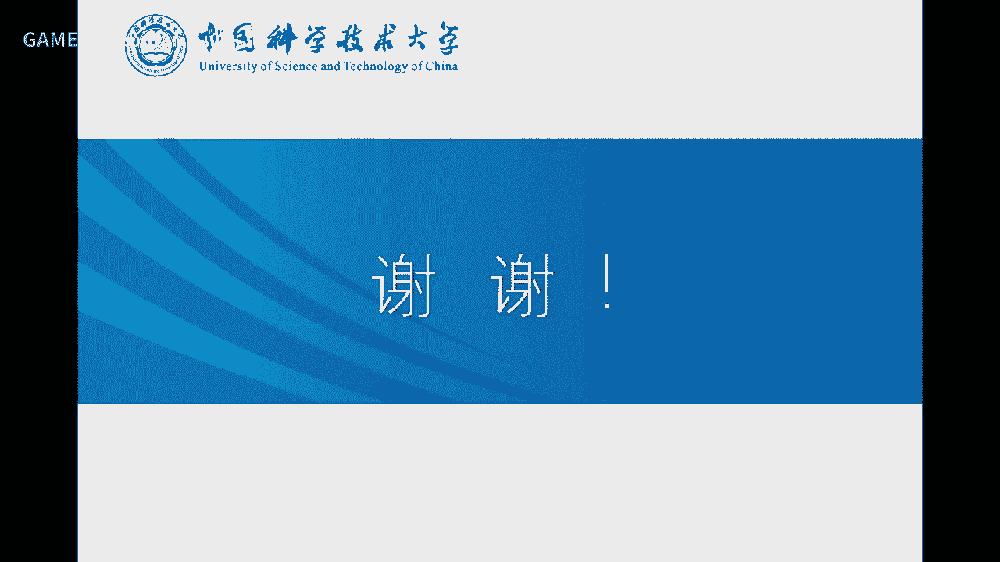

好，這是今天的一部分內容。

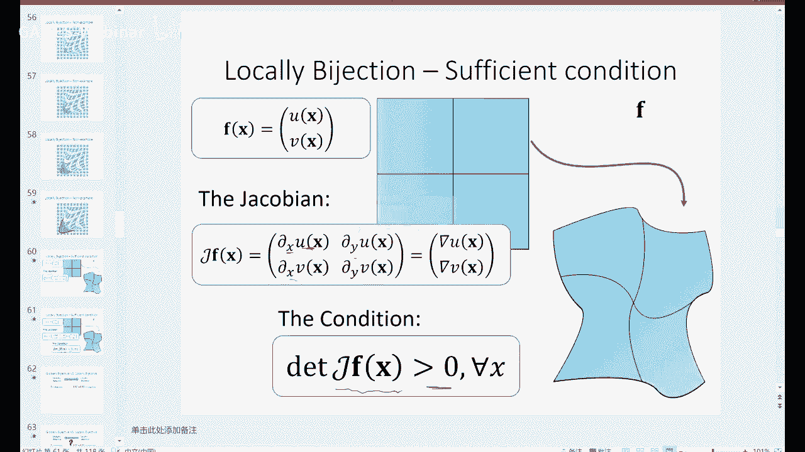

我們今天還要講一部分比較重要的內容，叫優化。

因為有同學這個這個通過助教，還有跟我發信，希望因為在做幾何裡面，特別是圖形學，不管做幾何還是仿真，都離不開優化，因為有大量的優化問題，很多優化問題是非常複雜的，那麼希望我們講一講這個優化的一些。

優化是個大學科，我們也不可能在一節課上講完，所以我今天會花個40分鐘，把優化的一些基本概念，大家給他一個引路，這是指針，如果發現有同樣的一個優化問題，你們再去找那些專業書，或者是paper就可以去看懂。

好吧，因為優化是非常重要，學圖形學不會做優化。

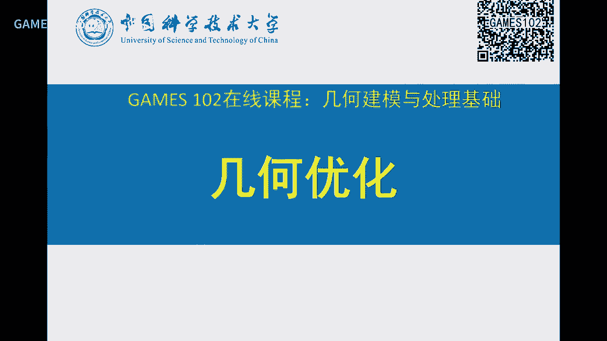

這個就很難做得很好，好，那個在上週我們就開始就介紹過參照化，就說這裡面是一個非常複雜的優化問題，這個是非線性函數，三角形的那個C值是吧，約束也是非線性，所以優化你要注意做這種幾何處理，包括建模啊。

這個沒有不會優化，這個是是就做不深，只能用簡單的工具而已，好，那麼除了幾何問題，事實上是在工程中，包括物理仿真，就大量的這個建模啊，從一個問題提出來，裡面的這個我要求它的結果，那結果呢。

都是可以model成一個優化問題，這個一個optimization問題，那麼這個經常會出現這樣一個模型，這個在這節課開始的時候，我就說到這個對一個問題要去解決，你一個非常重要的思想就是。

怎麼把這個問題變成一個數學模型，這個叫數學建模，這模型有可能是優化模型，有可能是個回位模型，有可能是一個統計模型，有可能是個其他的模型，但是這個模型，把問題變成一個數學模型以後呢。

剩下的東西就是用數學的方法去解它而已，那我們這裡今天介紹，如果你把一個問題變成一個優化模型以後，我們怎麼去解這個優化，那麼一個優化問題，這個整個建模啊，一個解剖問題出來啊，你可能是要找一個能量函數。

就一個目標函數，然後呢就還有好多約束，有些約束是等值約束，有些是非等值，就不等值約束，有些是線性的，有些是非線性的，最後呢，我有個目標函數，minimize這個目標函數，x的變量呢。

可能是一個NV空間的一個點，對於網格來講就是這些頂點坐標，那麼這是等值約束，這是不等值約束，那麼CECR就只指一些函數，那個具體形式，後面會就是根據問題不一樣，好，我們先介紹一些概念。

這個概念做過優化同學應該都清楚，如果沒做過的話呢，這一課對你了解優化是非常重要的，好，我把剛才的優化問題再把它抽象，實際上是在最優化的教材裏面都會是這樣，優化是什麽，我們一般都是指實質函數。

因為如果這個值是向量，向量是不可比大小的，所以談不上最大值和最小值，這大家有個概念吧，就是平面上的點，兩個點不能夠比較大小的，大小只有實數，所以一般最優化問題呢，就只能做是一個實質函數，實質函數。

那麼這樣的話，它這個實數就可以去minimize，求它的最小值，它的變量當然可以是一個高危的函數，這個就叫多變量函數，那麼這個叫目標函數，叫objective，也叫做能量函數，能量函數是energy。

所以你有時候叫目標函數，有時候叫能量函數都可以，還有些時候叫cost function，代價函數，因為這個代價值，你做一個事情，它有什麽代價都可以，所以這三個詞一般都是都可以通用。

一個叫objective，一個叫energy function，那麼這個function呢，有可能是可能會有好多項，F1+F2+F3，我們以前在做擬合的時候，我跟大家講過，有一項呢，我用函數去擬合點。

點擊的時候，F1度量它的誤差，F2度量這個函數的光滑性，F3度量什麽，所以一般這個每一個項呢，就把它叫做能量項，第一個能量項，第二個能量項，第三個能量項等等，或者是叫cost1 cost2。

這個cost代表，那個代表光滑cost，所以這個術語是通用的，好，那麽還有些約束，那麼約束呢，我們會把它分成兩類，一類是等於0，叫等式約束，一類大於等於0叫不等式，大家說我會不會出現一個。

小於等於0這個約束，沒問題，因為小於等於0的話，等價於大於等於0，因為什麽你前面兩邊同時加個負號，就變成大於等於0，所以我們一般寫的時候，只寫大於等於0就夠了，因為小於等於0的話，跟他是只要加個負號。

就可以變成大於等於0，好，所以這是一般優化問題的，一個一般形式，有個能量項數，有等式約束，有不等式約束，好，下面就是說不同形式，不同的這種FGH的這種性質，就決定這個優化，用不同的方法去做，好。

那麽今天不可能講所有方法，這個整整一本很厚的書，假對話書，這個是要一個學期才能上完的，不可能在我們40分鐘，或者半小時就講完，所以今天只是給大家引路，讓大家知道一些概念，你們知道概念以後，去有機的去看。

有目的的去看那些這個方法，這我也順便講一下，你們也不用擔心，說我沒有學會最優化，是不是就不能去做這個優化問題，不能做圖形學了，不是你們是邊做邊學，邊學就是邊去實踐，是學得最快的，所以呢。

今天我基本上把最優化的，大部分方法都會講完，你們只要有個聽完以後，有個印象，這個印象在腦袋中形成一個，一個事實上是，我把它比喻成聲語言中的指針，你們記住指針就行了，然後具體什麽方法。

你們這個遇到問題的時候，再去看這些書，再去找，這是學得最快的，沒有必要去什麽，一定要學一個學期的最優化，再來做事情，這個當你學過那個課以後，這個指針可能會更加全面一點，好吧，好，那我們就就就那個。

盡快把這個優化這個，這個講一下，好，這裏上是做最優化的話，有一個有兩個，有兩個非常重要的，就是說你不同的優化問題，有不同的優化方法，並且呢，你特定的優化問題，需要用特定的方法去解，才是最佳性能，所以呢。

你一般的這個不懂優化的，或者優化不是特別熟的，這個這個這個研究工作者，甚至包括一些老師或者同學，他們就是要有Metalab一個優化器，去求解，像這個是完完全全不夠的，你這個問題具有什麽特點，你要去挖掘。

你這個優化才能做得非常好，否則的話呢，你求解的這個優化，只是用一般的generic，就是通用方法去做呢，未必是達到性能最好，所以你要去根據你的問題，去刺激你的優化方法，本身這個優化優化。

就是一個非常大的一個學科，大家知道優化很多，不管是這個這個做工程的，還是做數學的，優化有非常多的人在做，是吧，其中還有很多院士，好，那麽這裏面有個概念啊，這個我們一步步把它，大家都要有概念。

如果一個函數，一個一個一個高位函數，那麽它對每個變量的偏導，這個叫t度，t度就是導數的一個推廣，那個在如果是n等於1，就是導數啊，那麽n是多位，就是偏導，那就是叫一階導數，這個這個推廣叫t度。

那麽這裏有個圖，這個黑色的是高，白色的低，相當於是一個貌似函數在這裏，只不過我把它顯示了一個揮手圖，事實上你可以把這個這個，這個黑色值想得大一點，就相當於一個高色函數，是吧，那麽這個t度顯然就是都是朝。

朝這個中心的嘛，是吧，事實上這就是為什麽叫傾向階函數，因為它跟方向沒關系啊，好，那麽這個函數呢，是一個坡度一樣的，左邊低，右邊高，所以它t度是這樣，所以t度是很形象，是什麽，是這個曲面。

一個高位曲面的一個最速下降方向，這個大家很容易理解，那麽如果是多變量，這個一個一個一個值率，是也是也是也是多維的話，那麽每個分量的函數，對每個變量去求找就構成一個矩陣，就是以兩何比啊，我們剛才也用了。

還有Hyson 陣，Hyson 陣是什麽概念，Hyson 陣可以看到，我把這個函數啊，在x0做這個tile展開，這是x0這一項，這是一階項，一階項這個就是t度，那麽這是兩階項，那麽中間有個矩陣H。

這個H就是這個Hyson 陣，所以Hyson 陣是一個，是我們兩階導數的一個推廣，那麽如果是tile展開，應該還要還要加上一個小歐，一個x-x0平方的一個無窮小量，無窮小量他就忽略掉了。

所以這是用約等於，就是後面就可以高階項可以忽略不計，所以說Hyson 陣是一個函數的，兩階逼近的一個，兩階項的一個度量H，你可以看到H是什麽意思呢，也可以這樣理解，就是這個是個z-fx，H是什麽。

是他的一個泡沫線在這個逼近，這個值，這個是個泡沫面，他泡沫面的一個逼近的一個，兩階導數的近似，另外一個critical point叫柱點，柱點就是那個t度等於0的點，就是導柱等於0的點。

導柱等於0的點我們用意味函數來，這個紫色曲線是一個意味函數，那麽這些點你可以看到，他的這個導柱等於0，這個在微積分就學過了是吧，那麽一個函數的最小值柱點就等於0，對吧，這是個是個可以是個必要條件。

但是他並不充分，因爲什麽柱點不一定是最小值，因爲什麽他有可能最大值，也可能是這個叫拐點，因為拐點的這個這個這個切線也得1。0，這個導柱等於0，所以但是我們就還是希望去找到這些柱點。

因爲柱點是有可能成爲全局最大點的，最最小點的，還有一個座右的話，大家清楚啊，這個我們的科學包括數學發展這麽多年，對一個函數的最小值求解，我們還是無能爲力，這個數學沒有那麽强大。

所以我們數學還是遠遠不夠用的啊，我經常講的數學不是沒有用是不夠用，是吧，所以說你看我們在實際問題工程中，要去求一個函數的最小值都沒沒法求啊，那麽只能什麽只能求局部績效值，因爲這個函數可能很複雜。

有很多的績效點，那我們唯一的能得到的信息就是說，我從一個點開始，從他點開始慢慢慢慢慢慢去搜索他附近的一個績效點，這個只是一條local minima，但是這個global是在哪裏。

事實上是到現在都沒有理論可以告訴你，當然對一些特殊的函數是有的啊，比如比如說是個突函數或者說是一個陷阱函數，當然這個最小值是很容易求的，但是對一般的非陷阱函數是局部績效最小值，我們是到現在都沒有辦法。

那麽那麽總有某個初值，那這裏就很有意思，你這初值怎麽取呢，所以取決於你的運氣，你運氣初值取得不好，那麽你可以掉到一個不好的這個績效值，那麽離這個最小值差很遠，你這個結果就就就就就不特別好。

那麽你說我求的運氣呢，也不是因為你在不同的問題裏面，你要去好好的想一想，你這個背後的物理背景有沒有，或者工程中有沒有背景，他的初值在哪裏是最有可能的，就最小值在哪裏最有可能。

所以說選初值不能夠這個這個缺乘，就什麽東西都都取零作為初值，這個是不對的，這個是要給你的問題，可能你用一個別的方法去求這個解，這個解作為初值會更好，不能什麽一股腦子，什麽東西都變成零。

從零開始開始來找這個最小值，往往找的就不對，因為我看到好多，包括包括他們做機器學習，深度學習初值就缺乘成零，這種這種稍微比較暴力一點，事實上你要根據這個問題本身，去找一個好的初值，就像我們做參加一樣的。

我們可以從那個float參加化，作為初值，然後再去做迭代，可以設置更好的一個參加化，好那麽一些特殊的函數，像to函數的注點就最小值，因為to函數有非常好的性質，他的最小值就一個，還有這種quasi。

quasi就是有為為to，他不是完全to，但是呢，他的性質很像to了，這個也是非常好求的，那麽這種我們不詳細討論，因為to函數在實際問題中運氣好，因為這個優化這個模型是個to問題，那麽就非常好。

這個能保證，但是大部分形狀的，他不是那個to函數，那麽這個就比較糟糕，那麽你要去想辦法去去求，好優化問題有些概念，概念我這裏稍微提一下，經常大家能看得到。

那麽如果一個minimize一個function，他他那個有些是沒約束的，就是只有一個minimize一個，比如說fx是一個變量，那麽下面沒有約束，這個叫5約束，如果下面有這個subject to。

那麽就是有約束，那麽線性非線性呢，這函數是個線性函數，非線性函數，你是求global的minimum還是local的，還有是to我剛才講過了，還有一個continuous跟discrete，這是什麽。

這是變量的類型，有些時候呢，你的變量的可能是在這個實質空間去去找，那麽那麽這是連續變量，連續變量的這個優化呢，相對來說比較好，因為什麽他的無窮小領域性質，微分就可以用上，還有些有些情況的x是屬於。

比如說我只讓你在整數域上去找，x我只是只是只是整數，你要去幫我找一個函數，幫我找一個好的整數滿足這個目標函數，這時候叫做整數規劃，或者叫做離散規劃，因為他的只是是離散的，他不是整個連續的一個這個定域。

這個叫隨機和確定性，這是優化模型，還有一個呢，這個我也提一下，可能很多地方也會碰到，叫單目標跟多目標，所以你有時候在一些工程問題，你可能有兩個度量，一個度量呢，是比如說你你去找一條最短路。

我們經常用的導航對吧，最短路那麽你希望這個距離最最近，這個是度量他的距離，從一個點到一個點的距離，但是呢我還我還還有個度量，是什麽度量這個這個時間，有些因為距離最近的這個路徑，不一定是時間最最短。

因為他有可能堵車，是吧，所以他可能有一個時間開銷，可能會多開銷，好這兩個開銷呢，哪個重要哪個不重要呢，你很難把握，所以什麽你就從事優化這兩個，希望他們兩個兩個都要小，對吧這個叫多目標，多目標這優化呢。

本質上也比較難，因為你這兩個可能是相互矛盾的，是吧，一般的兩個目標函數呢，會我們這一這個二為例啊，這個先不考慮好，1112往往他們是形成這樣，這樣的關系，11越大的12會會會越小，12越小呢。

12會越大，所以最佳目最佳點的是找找這樣一個點，這個這個點這個這個時候兩個目標都達到一個中和，這個誰也不不吃虧，是吧，所以怎麼找到這個點呢，也是有技巧，還等方式呢，就是說我這兩個目標啊。

我們兩個妥協一下，後面先不看，我就看兩樣，我我我給我給我加個權，給你加個權，如果大家都這個量剛差不多，那麼就lambda1=lambda，一般上去0。5，0。5，但是但是你覺得哎，我覺得時間更重要。

我把這個這個權加大，lambda2=10，lambda1=1，是吧，就表示時間重重要，我也把它權加大，因為權加大的話，會指這個值會進行小，是吧，所以多目標的話就要不就是找一個比較平衡點。

要不就是我們就這樣變成大目標，把兩個兩個目標加權，變成大目標去優化就可以，只不過這兩個目標中間有個權度量，好，無約束的優化問題，我們先講，好，無約束的優化問題就是下面是沒有約束。

沒約束這個這種優化問題相對來說比較容易，我們在微積分不應該在微積分獲得之後，你們如果學過數值數值數值方法就就學過，好，就是提出最簡單就是提出下降法，假設給定一個初值，我們這裏做任何一個優化。

都要給定一個初值，X0，就X0怎麼去一步步步跑到你要的這個局部績效值，X，好，那麼那麼一般迭代就是怎麼朝最速下降方向，對吧，好，我有個其中有一個迭代Xk以後，我下一步要往更低的值跑，怎麼跑呢。

就朝T的方向的負方向跑，是吧，偏一個αk，這個αk是取多少很有講究，這個αk有個名字就叫Line Search，就是度量，我這個αk不能太大，也不能太小，太小就跑很慢，太大呢，可能就就跑破頭了，是吧。

所以很多一些優化方法對αk就是這個步長，就是步長，這個是需要非常謹慎的挑選的，那麼這是這個這個叫一階方法，牛頓提這叫這個提出下降，是叫這個一階方法，那麼還有更高階方法就是牛頓法。

牛頓法的這個幾何意義很明顯，你可以看到他跑的方向啊，是跟這個海省鎮方向的一個相關，實際上他用一個局部的一個拋物線去逼近他，他往這個拋物線兩階方向去跑，跑完以後呢，再往下來，再往下跑，這樣跑的話跑得更快。

因為這樣跑的話，他本來要跑好久才跑到這來，他這樣一下子跑到這來，再一下下來，所以這個是用了一個牛頓，用了一個海省鎮的一個信息，這個來找這個跑的方向，可以跑得更快，那麼這個叫兩階方法。

那麼牛頓法這個兩階收斂很快，但往往有的時候呢，這個牛頓法這個海省鎮啊，他這個這個可能是非正定的，就沒有逆或者是退化的，或者說他的逆很難求，那麼怎麼我們就能不能找一個中間的一個，所謂的矩陣啊。

這個海省鎮的逼近，然後用他來逼近這個海省鎮的逆，這種方法也是一大堆，牛頓法，那麼比較有名的就是BFGS跟LBFGS，BFGS這個沒什麼特定意義，就是就是用發明這個方法的四個作者，這一個頭字母。

就是這四個人啊，這個這個這個頭字母來命名的，因為沒有特別的名字，所以就叫BFGS，以及他的一些這種變種，很多變種啊，比較有名的就是LBFGS，好，這就是說，我牛頓法裡面海省鎮如果不好求，或者性質不好。

我可以去找一個近似矩陣去逼近他，那麼具體這個問題，有些問題好找，有些問題不好找，你要看你的問題本身，那麼還有一種是叫坐標下降吧，這個呢就是畫個圖就容易解，容易清楚，假設是雙變量，這個函數是這樣，他找呢。

他他也不是往T2，也不是往這個二階牛頓去方向，他怎麼他是首先固定X去去，固定X去讓Y優化，然後固定Y在X優化，固定X固定Y固定X固定Y，就是沿著這個坐標軸下降，就是把一個多變量的，變成一個單變量的。

你看第一步是FIXXK去求Y，求到一個YK，然後再FIXYK來求X，上就是這樣這樣做是吧，那這種做呢，就是也也能夠去去找到一個，相對來說比較比較比較這個這個低的值，好，但這個這種方法也要小心應用啊。

因為不是所有函數都具有很好的性質，有可能跑著跑著就就跑偏了，那麼大家那個這個對於不是做優化本身的，一些同學或者是不熟的同學，就直接可以去找Metalab，還有C++有很多庫，這個是LBFJS專門的庫。

像Metalab裡面就一個Fmin，還有MinFunction都可以去用用好吧，用這些函數的時候呢，你們也要注意一個要要那個很好的設好初值，或者你這問題本身我還是這句話，你不能一股腦什麼都確認。

設初始值，比如不常你也念念什麼什麼隨便設，那個那個那個那個初值隨便設0，你還是要想一想，你的問題本身到底有沒有幾何意義，或物理意義，有沒有物理意義去找那個符合這個意義的一些初值，不常呢也要去去好調。

不調的話你可能收斂出來，求出來的值最小值是是不好的啊，那大家多去體驗一下，好那我們再講更多的類型叫整式約束，整式約束的就是比剛才無約束加了一個東西啊，就是多了多了個這樣的啊。

那麼整式約束這幾何意義是什麼呢啊，我們看一看啊，Gx等於0表示什麼，表示他這個這個我的我這個解啊，要滿足這個等式，滿足這個等式這個Gx等於0，我把他的圖像給畫出來假設是這個紅的，好Fx是一個函數。

那麼我把他的等值線畫出來，這是Fx等於0 C，這是CR這是C，好那麼那個什麼點才能達到Fx的極小值，然後又滿足這個條件呢，你可以看到你從直觀上來看，假設這個方向是是是是慢慢變小的。

是不是是不是這個點是最有可能，是吧這點有有什麼性質啊，可以看到這個顯示性質呢，F的t也是這個這個最大化的，G在這點呢也是跟他跟這個等值線是相切，所以呢他有很好性質，這兩個函數啊。

在這在這個我所要的這個目標點這個t度啊，要要重合或者是叫平行，但是可以相差一個正負好是吧，就是就相差一個倍數lambda，就是要有這樣的性質，可以看到我要去求這樣一個代約數的x，那麼他要滿足這個條件。

是吧我們這個條件這個條件就是什麼，就是變成了x就要滿足原來的條件，又要滿足這樣新的條件，這就變成一個方程組的問題，那麼這個lambda在這裡面也是個變量，你只不過多了個變量啊。

這就是這個上次從數學來看來看的話，事實上他把它變成一個lagrange的乘之法，就是fx加上一個lambda gx，minimize這個函數，那麼x和lambda都是變量的，所以你去對x求偏導。

就是這個式子，對lambda求偏導就是變成這個式子，這個式子是對lambda求偏導的，這樣一個等式，所以多了一個變量lambda，但是呢我把它變成一個方程組的求解的問題。

所以對於這種帶等式約束的這個優化，lagrange乘值這個是比較好的方法，當然還有別的方法了，我這裡就不詳細展開，基本上就是把它轉化成一個無約束的，想辦法把這個約束給去掉。

當然很多情況下，如果你這個約束不是特別複雜，你可以反反解把這個消元，把這個裡面的一些變量去掉。

代進去就減少變量，就是把它變成一些on constraint，就因為你可以去消掉一些constraint，這種運氣不一定很好，有些很複雜的這個約束就不一定做得到。

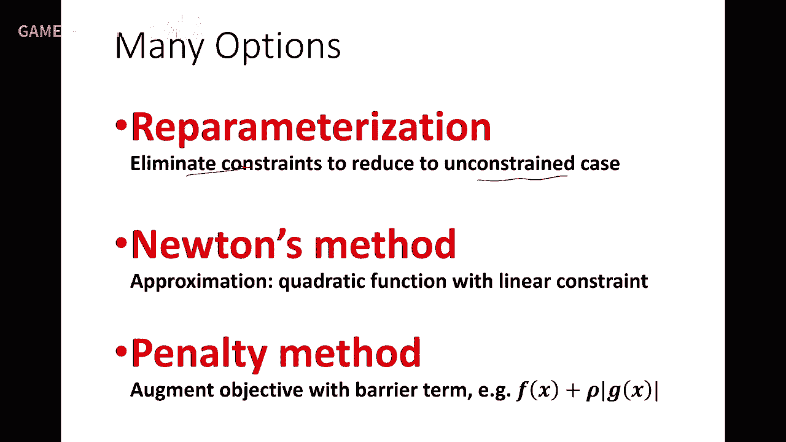

還有現在是用一些這個函數去逼近的，好，那麼還有一種這個方法經常用的，就是有點像這個交替迭代，算就是交替投影方法，什麼什麼意思呢，這裡C1 C2 C3都是一些等式，就是既要滿足這個等式又要滿足這個等式。

P是他們的交集，就是要同時，那麼每個等式約束都是一個空間，就是這裡表示C1，這裡表示C2，這個方法有點像剛才那個坐標這個迭代，我先把這個一個初始往這個C上去滿足，因為C滿足的話。

相當於是P0對這個C進行投影，有個垂足，然後我再去滿滿足C2，然後再滿足C1，再滿足C2，不斷迭代迭代，就找到一個中間點，這個這個就是我們剛才坐標法的一個推廣，只不過這個這個不是朝坐標。

是朝一個這個可行極，那麼這個地方才是C0和C2的一個交集，共用部分。

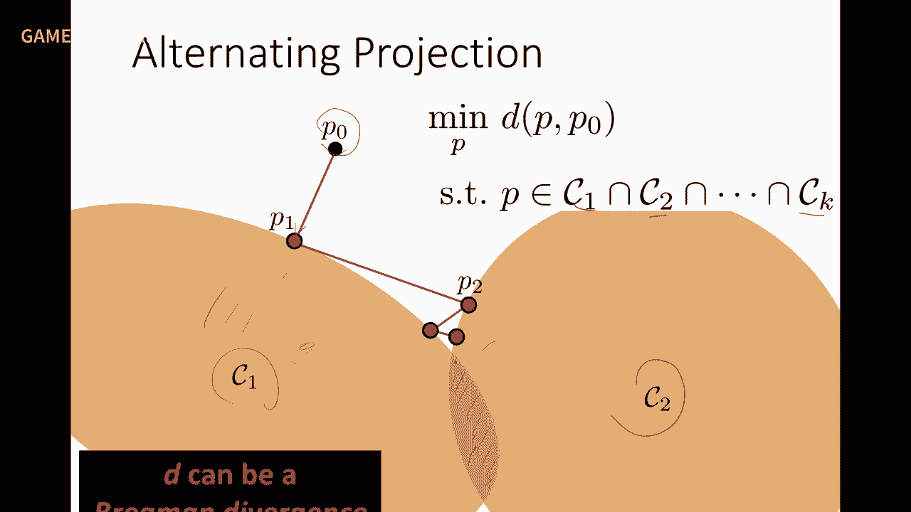

那麼還有這個Lagrange，這個Lagrange的事實上是，就是把這個constrain作為一個目標函數，但是他不是Lagrange，他是中間他就讓他極小化，但是這裡有個權。

這個權是在用過程中是要改變的，還有這個ADMM是最近幾年非常流行的，就是他把這個變量分成兩套，這兩套關係是個現役關係，這時候就可以用這個叫交替迭代法，就像是交替迭代法的本質，是把這個變量分離後。

就變成了若干個小問題，有一個問題關於X的，有個問題關於Z的，還有個問題是關於這個，就是關於這個變量的，變成三個子問題，而每個子問題相對來說好解，因為規模小了。

還有一個是可能是變成一個closed form，中間經常會有個這樣的詞，叫closed form，closed form就表示是一個有意思是什麼，叫解析解，就不要去優化，只要去解析求一下。

那麼大部分情況下，就是有一個優化是局部的位優化，規模很小，有一個是有全局解，全局這個closed form的，有一個是，比如說是一個很小規模的優化，這樣的話，通過這些小規模的優化。

來求解這樣一個大的系統，這裡就是要發現這個變量之間的關係，有些是要這個，這個憑空產生這些變量，作為這個ADM的方法的一種應用，比如我這裡舉個例子，舉例子，就是這裡題目有點像藝術一樣的，你看這個優化。

這個解釋一個，比如是個矩陣，m解=b，是要這是個項量，矩陣乘大就要滿足這個方程，那這個方法，你可以看到，他憑空的生成了一個新的變量，解一把，解一把，解等於解一把，解一把滿足這個。

所以這兩個跟這個是一樣的，但是目標函數，他這裡加了一個這樣的項，GI-GI一把，這個平方和最小，這是不是讓他們倆盡量相等呢，這就是增廣項，那麼他可以變成兩個子問題了，一個求GI，原來的GI，一個求GI。

那麼這時候兩個，就有一個是顯示的，有一個是這個，很容易求解，這樣的話，你就把這個再一個問題的巧妙的，變成這樣一個ADMM的方法，可以求解，很多文章，像這裡有個文章可以看看，他裡面用的技巧，也是比較漂亮。

好，關於等式優化，剛才也講了不少，這個大家，這個這裡我列的主要的一些方法，特別是最近十年來，圖形學裡面大量用到了這些方法，ADMM，這次你就可以看得到，還有AL，這個增廣拉攬日，這個方法。

這個你們碰到看文章的時候，如果碰到了，你就知道他們是怎麼做，是什麼思想，那麼這個懂了這四項以後，就看得懂他那些變換，這個獅子是怎麼弄，所以一篇好的文章，這個基本上就是model，解決問題。

model很重要，model完以後，優化如果你還有自己的一些特色，很好的去，如果不用這個優化，用通常優化很慢，而你想一個好的優化，那麼你這個優化又是文章的一個貢獻，所以很多幾何文章。

基本上都是model是一半，這個優化，這個是一半，就兩部分拼起來，才構成你這個文章的，這個非常大的貢獻，好，那我們等式約束講完，我們再講不等式，不等式約束很簡單，就是剛才等式，這個變成不等號，是吧。

就是他，他是一個不等號，不等號，等式是一個什麼，等式上就是一個高位空間的流行，是吧，不等號呢，小於等於零，大於等於零，大家想一想，一個曲面小於等於零，假設一個球面，球面等於零就是這個球面本身，是吧。

小於等於零是不是球面內部，大於等於零是球面外部，所以他這個表達什麼，表達了一個流行，把空間分成了兩部分，小於等於零是一部分，大於等於零是一部分，所以很簡單，所以他這個不等式約束。

我們理解他的幾何意義以後，我們去想，去看懂那些方法，就能看懂，好，那麼這裡當然都假設F和G，都是實函數，好我們看一下這個，那麼這裡G1X等於零，是一個流行，那麼小於等於零就是這個半空間。

如果是要曲線的話，就是這個半平面，好，那麼大於零就是另外一個空間，是吧，所以那麼這個小於等於零，這個空間，叫做這個約束的可行域，Feasible Domain，可行域，對於整個優化。

對於整個優化問題的可行域，是所有約束都要滿足，像是G1X有個半空間，G2X我也有個半空間，這個半空間跟這個半空間，他們交集，就是這個可行域，如果還有G3等於零，G3小於等於零，那麼就他們交成這個空間。

就這裡面這個X都滿足這些約束，所以從這裡面去找一個Fx，最小的值在哪裡，所以Fx求最小值，應該是在這裡面去找就行了，這個叫可行域，叫feasible domain，就是因為在這個地方。

才是這些不等式都滿足的地方，是吧，所以這個可行域，叫feasible region，好，那麼這裡看一個函數，那麼你這個可行域求出來以後，你這個Fx再去求最小值，就是看他等值面，等值面跟這個可行域的這個。

這個接觸點在哪裡，接觸點，比如說Fx的等值面在這，那麼大家可以直觀想想，那個等值面都是這樣一圈一圈的，那麼是不是這個點是極小值，概率是最大的，對吧，因為這個等值面在這，是吧，所以跟他第一個接觸的等值面。

就是最小值，因為往外就是變大了，對於這個點，所以等值面是跟其中的某個函數，應該是垂足的地方，但是是哪個不知道，這個就要看距離問題，好，這個好，那麼這裡有不少方法，不少方法，這個因為在優化理論裡面。

還是比較豐富的，就是有個叫KKT，這個條件，條件就是一般把這個問題，先轉化成拉格朗的形式，因為這個不等式，我先變成等號，像這個就是個拉格朗的，多個項就多個拉格朗的層次，那麼我也希望。

希望他滿足什麼條件呢，就是這個KKT證明了，這也是三個人名，就是你要去求的這個minimum，他要滿足什麼條件呢，一他要滿足這個拉格朗的，這個是必須滿足，第二這些條件必須滿足，這顯然嘛。

因為這是條件在了，還有第三，這些那層次必須大於零，第四還有一個這個條件，這個條件是比較非直觀的，但是可以也可以看到，他就是這個最小值，lambda i在這裡要等於零，表示差在邊界上面，好。

那麼具體怎麼怎麼個求解呢，這些我就不詳細展開，時間可能比較緊張了，好，然後最後這個怎麼求解，還是有一些方法的，也是這種T2向下，用一些這個GGG的方法，對對對，這是GGG，Active Set的方法。

就是他也是在不斷的去去去去，去迭代這個Active Set，還有一種方法是比較多，採用的叫內點法，內點法，內點法就是什麼，設置這個障礙函數，Borel這個函數，Borel函數什麼意思呢。

Borel函數上的就是這個值的一個倒數，就是如果u小於零，就是u大於零，他就要等於正無窮，他就阻止這個值，要變成u小於零，這個解，所以一般一般的就會把這個GX，作為一個在這。

作為這個這個函數的一個裏面的部分，因為這個值大於零了，就變成了正無窮了，所以不能讓這個值大於零，所以設一個這樣的中間函數，這函數就表示一個障礙，就跟我們剛才講參照化一樣的，就三項型我一翻轉。

他這個值就變成無窮大了，因為因為分母變成零了嘛，所以用怎麼來設計這個障礙，是這個這個這個一個一個一個關鍵，那麼這個呢，解法也叫內點法，好那麼具體方法的陳述，我就不展開，大家有個印象，我想我們我們這個課。

畢竟不是講最優化，因為最優化本身也要講一個學期嘛，所以我在這裏只是給大家一個一個主路線，好還有突優化就相對比較簡單一點，雖然比較簡單，但是也是一門，要要要講可以講很久，也是一本書，因為突函數性質很好。

所以大家都希望怎麼去去那個，把一個這個優化變成出問題去做，那突優化呢，突突擊的概念很簡單，就是任何兩點他連線都出現在這個集合本身，這就是個突擊，突擊他的那個最最小點，他有非常好的性質。

所以這裏面也發展出一系列的這個這個方法，我就不去找，不去不去講，那麼經常碰到的一些典型的突優化的一些類型，這裏應該是類型，類型比如說這個線性規劃，這個像這個x這個線性函數，這些線性整式線性不整式。

這就是突優化問題，這個這個可以用分析境界，就是線性規劃，這個叫二次規劃，他的能量是二次的，二次就是突嘛，就是就是拋物線的推廣，這個只要整式也是線性的，不管整式還是不整式是線性的，都是屬於這種二次規劃。

還有一種叫Conic Program，就是這種模對模進行約束的，也是不整式，還有這種半正徑的這種優化，這個在優化突優化的學裏面，就有很詳細的解釋，大家根據具體問題，如果你的這個目標函數剛好是這這幾類。

那麼儘量用突優化去去解，會解得非常快，還有其他的優化，還有這個這個這個最小二層，非線性最小二層，非線性最小二層的形式是這樣，能量是某些能量的一些和，只不過EIx是非線性，那麼這個是叫，這個是大引領嘛。

因為是平方嘛，平方和但EIx是個非線性的，可能很複雜，最有名的方法就是LM方法，還有整形規劃，整形規劃就是變量，就是混合了有連續性的，還有一些整形的，就是這部分變量的只能取整數，是整數範圍。

所以它是混合型，那麼整形規劃的這個相對來說比較難，比較麻煩，那麼大部分方法就先把它鬆弛成連續，然後再用一些係數方面的東西，把它把它限制在整數上面，這也是有很多比較多的技巧，我都這裡就不展開提一下。

在純優化學裡面這種方法用的比較多，因為很多一些問題要限制在頂點，要限制在一些，比如要對齊啊，直接整數的一些性質，這個約束，好，那麼這個講純優化，剛才講了這麼多，實際上是我們更重要的是。

怎麼把優化用到解我們的問題，是吧，我們解決處理優化問題，優化問題實際上是跟一般的純優化問題，還是有點特殊性，因為這個圖剛才也看過，是吧，就是什麼，我們的優化目標，往往是這種很多小單元的一個目標，所求和。

是吧，所以它的這個目標函數，是有個非常好的結構，separable，是可以分離的，在我們前面的兩次課，包括今天的影射，都有非常多的這種特殊結構的優化，而這種優化呢，是在我們幾個處理裡面。

也非常特殊的形式下發展出來的，很有意思，包括那個18年，我們Sigma Progressive，那個Parameterization裡面，這個方法，我們對這個目標函數進行一些改，這個逼近，是吧。

我們不是優化，這個找方法，不是去找優化方法，而是把目標函數進行一個變化，來去求解它，然後把目標函數不斷逼近原來的目標函數，所以這是這個，這個這個這個發明了一套新的一個優化的觀點，也是非常有意義的，好。

優化這個這個領域很大，所以很多科學家，學者就就一些開源的軟件，包括一些庫啊，等等啊，就發展起來，那麼我們用的比較多的，Igon在卓越6就讓大家去用了，是吧，你們只是用了其中的那個求解稀疏方程組，啊。

實際上裡面他也有一個優化器，如果你要找工具的話，Metalab是是是比較比較用的比較廣的，那麼CVX也是個比較有名的，它是用來做圖優化的啊，啊，還有其他的一些優化軟件，還有Lingo。

Lingo解這個線性規劃，還有一個叫Lingo解非線性優化的。

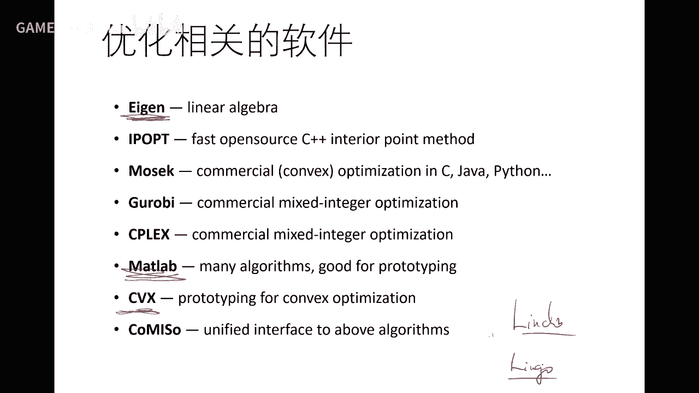

好，如果要去學優化，這個這也不是我們這學科重點關注的啊，本身在這個優化，這個就是一個方向啊，這個很大方向，裡面有非常多的人去做做這個研究啊，這個大家都在希望，希望這個去找一個函數的，那也就是問題很簡單。

就是一個函數找到的最小值，就是這個優化，但是呢，裡面的理論啊，包括這個函數複雜度的分析啊，包括收斂性啊，還有精度啊，等等理論上還是有很多東西可以去做的，啊，但我們對我們來講。

我們就是要靈活的把它用上來啊，如果對圖優化感興趣的可以看看這本書，這本書還是不錯的，那麼對於一般的優化，這本書是我鼓勵大家只看一眼，不要看太多書，這麼這麼這麼教材是最好的啊，啊，雖然是零用年的。

但是基本上還是比較比較經典的啊，那麼如果對整形的話，看這本那整形用的比較少，包括這種組合優化啊，這個左右化可以看這本書，但如果你們在實際問題中沒碰到的，也沒必要去看啊，碰到時候再去看一看啊。

或者是從別的已有文章裡面去得到一些啟發，把它用過來就行了。

好吧，好，那麼今天差不多時間剛到啊。

就今天講了一個幾何映射和幾何優化啊，優化的話呢，講的也是比較泛的，告訴大家有哪些類型，主要去找哪些，啊，這個這個這個方法，還有一些參考書，更多的是我們在實際中成長啊，就是在在做一些實際問題啊。

我們不斷去學學優化，不斷去去去找這些這個優化的一些技巧和規律，從別的的文章中學習啊，這是學的最快的啊，不用擔心說我一定要去選一門課，學完之後才敢來做這個事情啊，往往是在戰鬥中才能成長一名將軍啊。

我也鼓勵大家去多多這個實踐好吧，那麼後面這個課呢，那個還有一個事情交代一下，那個上週因為直播平臺可能出問題，所以後來改成同學會議沒有錄，我會抽時間吧，再再重新錄一遍啊，以保證這個課程的完整性。

那麼後面這個課呢，估計還有三到四次啊，我看情況，因為後面還是SIGGRAPH deadline，我也會比較忙，那麼我想這個有些後面的課題課題呢，我可能就講得比較快一點啊，這個給大家一個指針啊。

幾何處理還有一些什麼問題，還有什麼方法啊，實際上是真的要慢慢細細講，估計還可以上十次課啊，這個可以可以講得比較比較深入一點，但我想未來Games平臺，我們還會再繼續開一些高級課程，把一些問題進化一下啊。

所以大家也不用擔心啊，然後如果一旦碰到問題呢，也可以跟我們聯繫啊，跟一些同行聯繫啊，這個來啊這個繼續學習好吧，所以後面具體還有幾次課，估計三到四次吧，所以後面我想還是盡可能多的，給到各位同學呢。

更多信息對這個領域有個全面的理解和了解，更多是一些指針的一些了解，你們還是要通過做一些實際的項目啊，不管是跟自己做還是跟別人合作，做的過程中就會對這些東西有更多的更深層次的理解，好吧。

實戰中才能成長為這個真正的高手吧。

好那麼今天的課就到這裡為止，各位同學再見，再見，拜拜。

你不是說你會幫我嗎？我會幫你， 但你別想太多了。