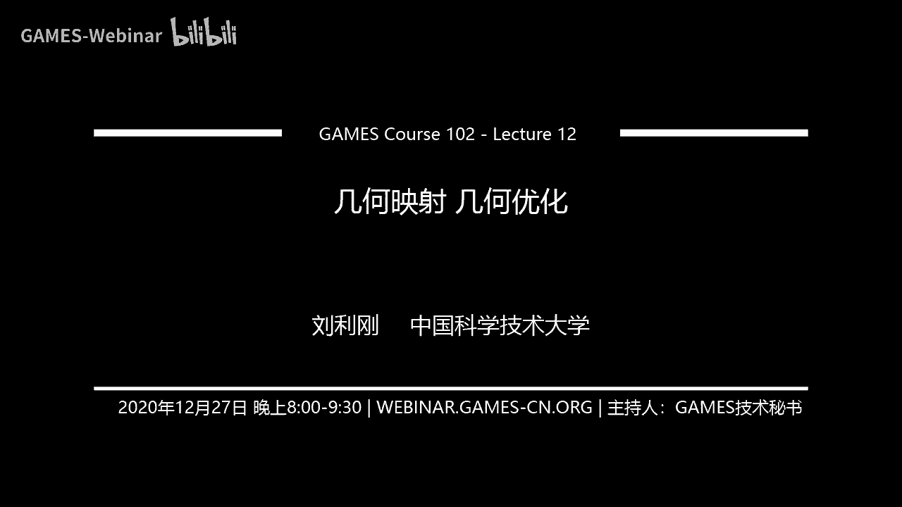

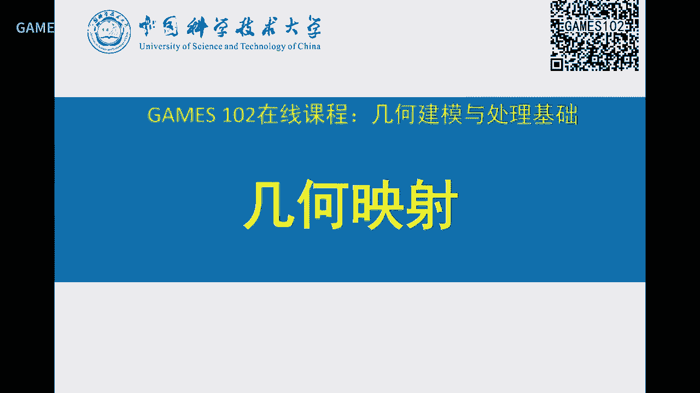

# GAMES102：几何建模与处理 - P12：几何映射与几何优化 🗺️⚙️

## 概述

在本节课中，我们将学习几何映射的核心概念、性质以及如何通过优化方法来求解高质量的映射。几何映射是连接不同几何域（如从三维曲面到二维平面）的关键工具，广泛应用于纹理映射、形状变形等领域。同时，我们也将探讨几何处理中常见的优化问题及其求解思路。

---

## 几何映射的基本概念

上一节我们介绍了曲面参数化，其本质是将三维曲面（二维流形）展开到二维平面。这个过程可以抽象为一个映射 **F**。

这个映射 **F** 是从三维空间到二维空间的一个对应关系。更一般地，我们可以将映射视为从一个域（定义域）到另一个域（值域）的函数。在几何处理中，我们经常处理的是二维平面到二维平面的映射。

对于一个点 **X**（在二维中通常用坐标 (u, v) 表示），映射 **F** 将其映射到像 **F(X)**，它也是一个二维向量。因此，映射可以看作是两个标量函数的组合。

映射有多种表达方式。最常规的是在某个函数空间中进行表达。设有一组基函数 **φᵢ**，则映射 **F** 可以表示为这些基函数的线性组合：

**F(X) = Σᵢ cᵢ φᵢ(X)**

其中，系数 **cᵢ** 是待求的向量（对于二维映射，每个系数包含两个分量）。基函数可以选择径向基函数（RBF）、B样条等。

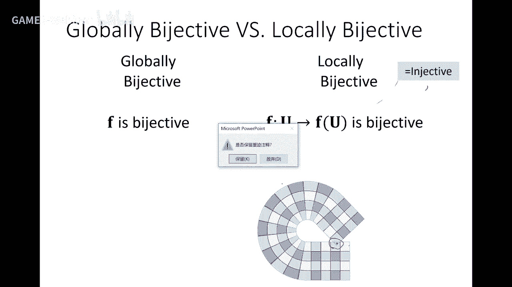

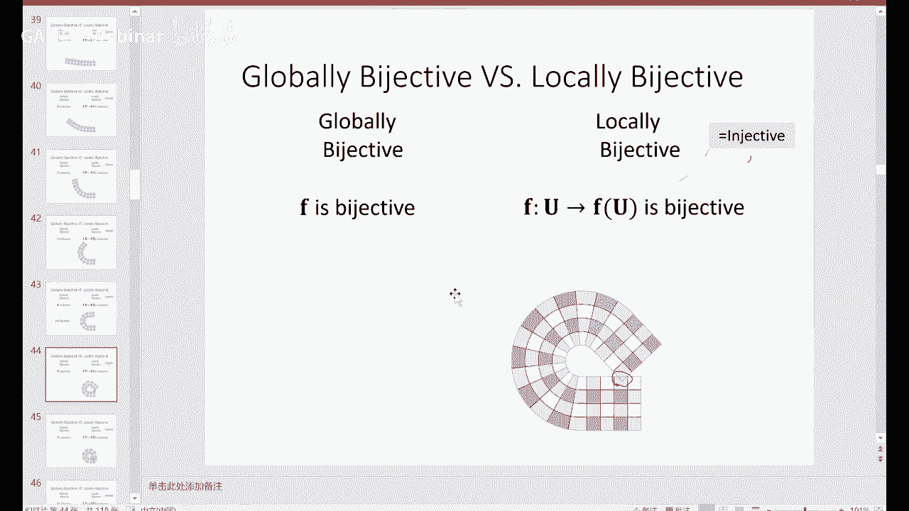

在几何处理中，由于曲面通常用离散网格表示，因此映射也常采用分片表达的方式。我们可以将一个复杂的映射分解到各个小片（如三角形）上，用分片线性（仿射）变换来近似。当然，这些分片函数在边界处需要满足一定的连续性和光滑性约束。

---

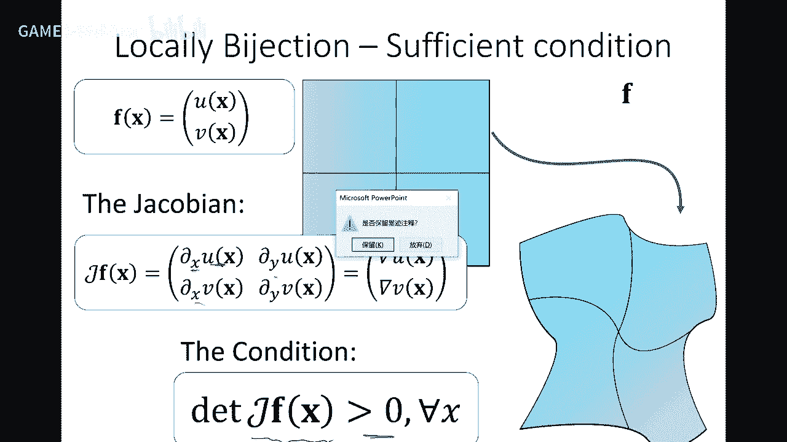

## 几何映射的应用与问题

以下是几何映射的一些典型应用场景：

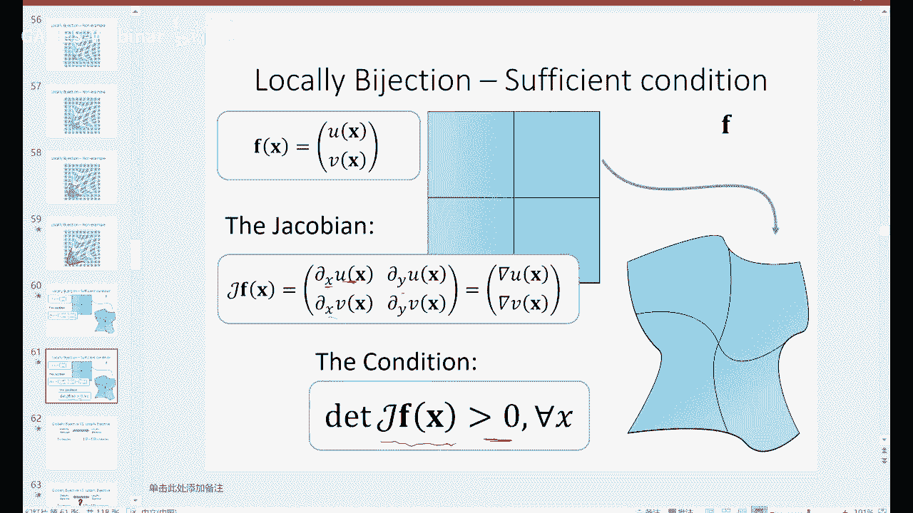

*   **图像与形状变形**：用户通过拖拽几个控制点来改变图像或形状，需要求解内部所有点的变形位置。这本质上是一个插值或拟合问题。
*   **重心坐标变形**：给定一个多边形及其内部点，当多边形边界顶点移动时，利用重心坐标计算内部点的新位置。这也定义了一种从原始形状到变形后形状的映射。

要构造一个好的映射，我们通常关注两个核心性质：

1.  **双射**：映射是一一对应的，即定义域中的每个点唯一对应值域中的一个点，反之亦然。这避免了重叠或折叠现象。
2.  **低扭曲**：映射尽可能地保持局部形状，避免过度的拉伸或压缩。

---

## 映射的性质：双射与局部单射

双射保证了全局的一一对应关系。然而，在实践中，确保全局双射非常困难。我们常常先关注一个更弱的条件：**局部单射**。

局部单射意味着映射在局部邻域内是一一对应的。对于三角形网格上的映射，一个关键的局部现象是 **翻转**。

**翻转** 是指一个三角形在映射后改变了其顶点环绕顺序（例如从逆时针变为顺时针）。这会导致该三角形在参数域中“折叠”起来，破坏了局部的一一对应性。

判断一个三角形是否发生翻转，可以通过计算其有向面积的符号来实现。设原始三角形顶点为 **V₁, V₂, V₃**，映射后顶点为 **U₁, U₂, U₃**。计算映射后三角形的有向面积（例如通过行列式）。如果面积符号由正变负（或反之），则发生了翻转。

**雅可比行列式** 是分析映射局部性质的有力工具。对于映射 **F: ℝ² → ℝ²**，其在点 **X₀** 处的雅可比矩阵 **J** 为：

```
J = [ ∂u/∂x  ∂u/∂y ]
    [ ∂v/∂x  ∂v/∂y ]
```

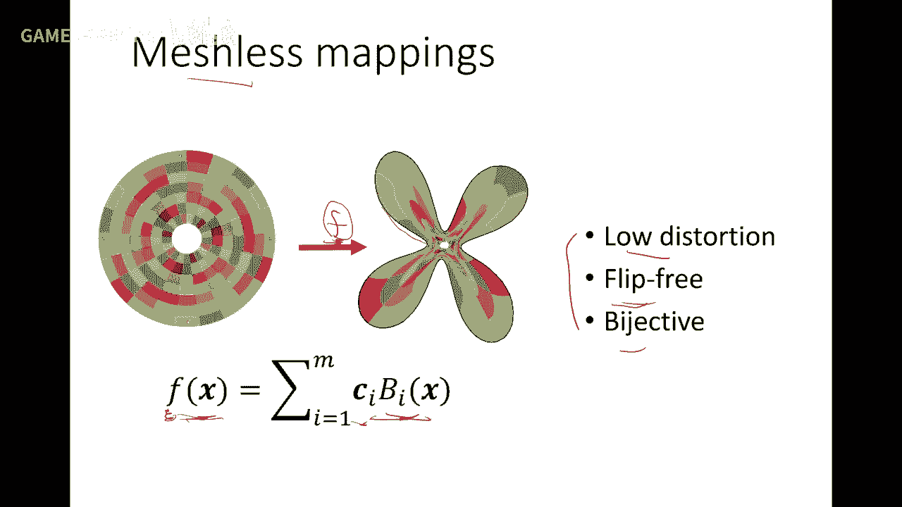

雅可比行列式 **det(J)** 的几何意义是：映射 **F** 将 **X₀** 处一个无穷小区域的面积，放大或缩小的比例因子。

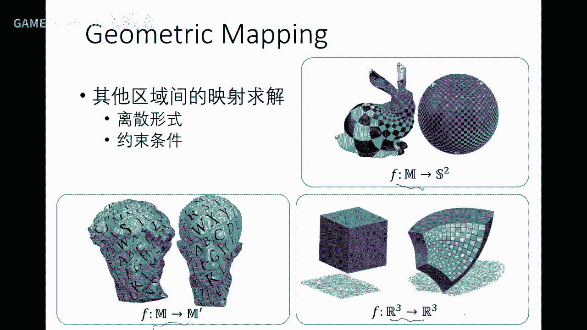

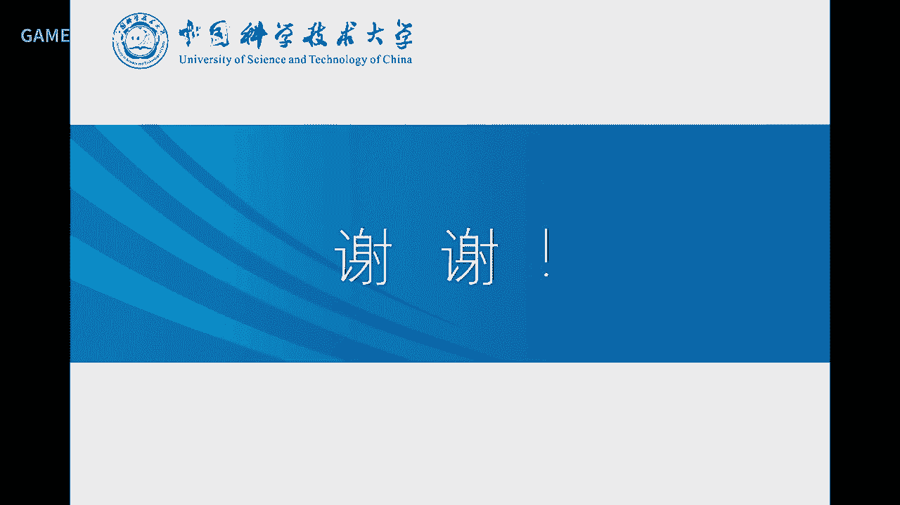

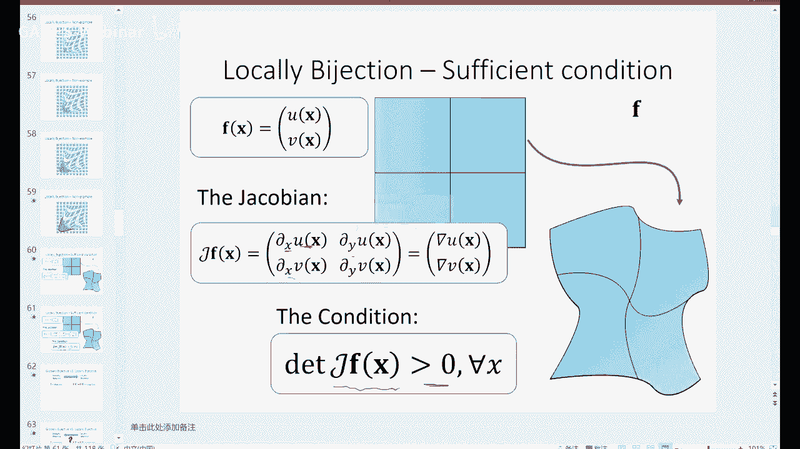

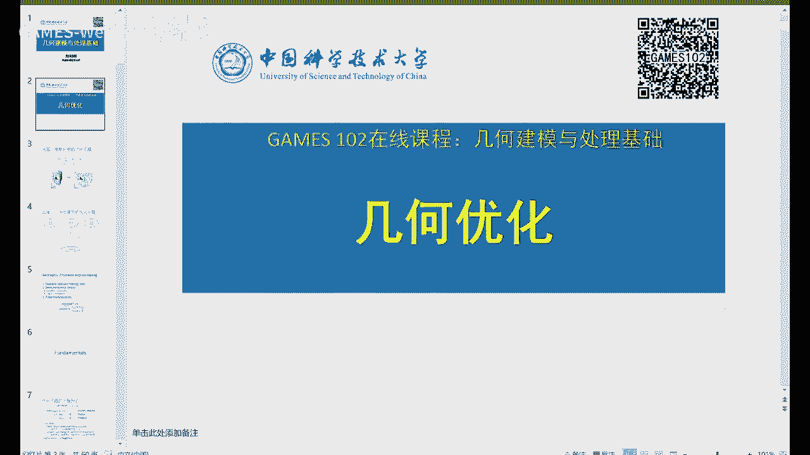

*   **det(J) > 0**：保持定向（无翻转），且表示局部面积变化率。
    *   det(J) = 1：局部保面积。
    *   det(J) > 1：局部膨胀。
    *   0 < det(J) < 1：局部收缩。
*   **det(J) = 0**：映射退化，面积收缩为零。
*   **det(J) < 0**：发生了翻转。

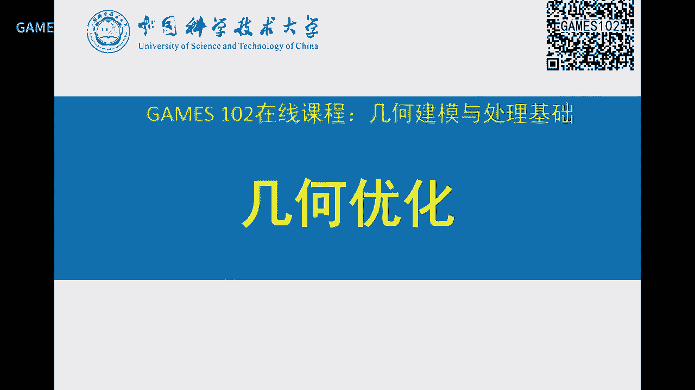

因此，要保证映射是局部单射（无翻转），一个必要条件是处处满足 **det(J) > 0**。但需要注意的是，处处满足 det(J) > 0（局部单射）并不能保证全局双射，因为可能在远处发生边界重叠。

---

## 映射的扭曲度量与优化模型

为了得到低扭曲的映射，我们需要定义一个度量扭曲的能量函数。通常，我们对雅可比矩阵 **J** 进行奇异值分解（SVD）：**J = UΣVᵀ**，其中 **Σ = diag(σ₁, σ₂)**，σ₁, σ₂ 为奇异值（假设 σ₁ ≤ σ₂）。它们代表了主方向上的拉伸系数。

基于奇异值，可以定义多种扭曲能量：

*   **等距能量**：希望映射是刚体运动，即 σ₁ = σ₂ = 1。最小化 **(σ₁ - 1)² + (σ₂ - 1)²**。
*   **保角（相似）能量**：希望映射是相似变换，即 σ₁ = σ₂。最小化 **(σ₁ - σ₂)²** 或 **σ₁/σ₂ + σ₂/σ₁**。
*   **防止翻转的能量**：为了强制 det(J) > 0，常使用如 **σ₁/σ₂ + σ₂/σ₁ + 1/(σ₁σ₂)** 形式的能量，当 σ₁ 趋近于0时，能量会趋于无穷大，从而阻止翻转发生。

一个典型的几何映射优化模型如下：

```
最小化 E(F) = Σ_三角形T Energy(J_T)
约束条件： det(J_T) > 0, 对于所有三角形 T
          边界条件约束
```

其中，**Energy(J_T)** 是定义在每个三角形雅可比矩阵上的扭曲能量。变量可以是映射后每个顶点的坐标 **U**。每个三角形的雅可比矩阵 **J_T** 可以根据原始顶点坐标 **V_T** 和目标顶点坐标 **U_T** 解析地表示出来，因此整个优化问题是关于变量 **U** 的。

---

## 优化方法简介

求解上述优化模型需要用到数值优化技术。优化是一个庞大的学科，这里我们仅概述在几何处理中常见的一些概念和方法。

一个优化问题通常表示为：

```
最小化 f(x)
约束条件： g_i(x) = 0, i = 1,..., m
           h_j(x) ≥ 0, j = 1,..., p
```

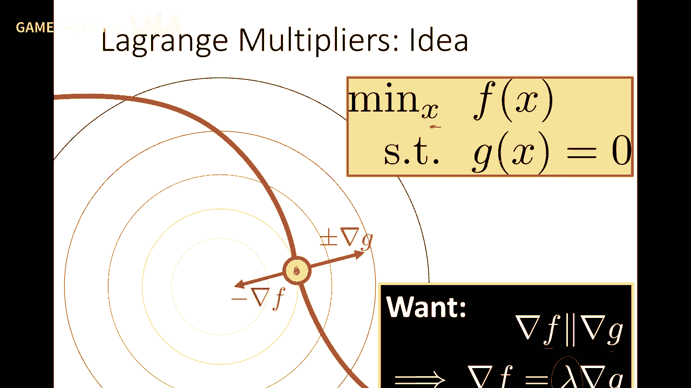

其中 **x** 是优化变量，**f(x)** 是目标函数（能量函数），**g_i(x)** 和 **h_j(x)** 分别是等式和不等式约束。

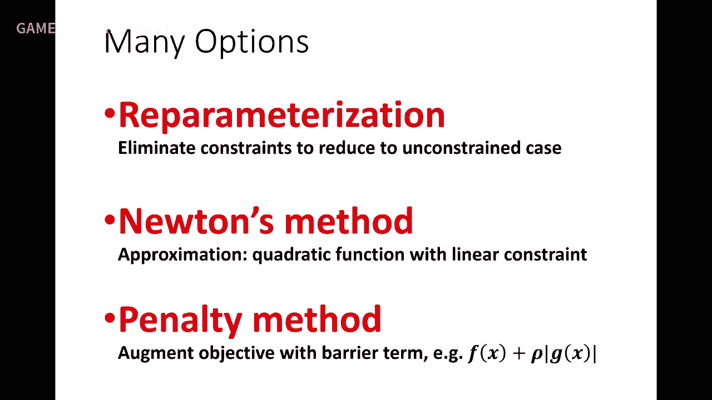

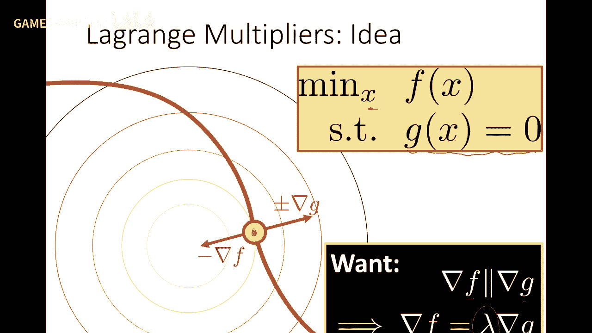


### 无约束优化
当没有约束时，常用方法包括：
*   **梯度下降法**：沿目标函数负梯度方向迭代：**x_{k+1} = x_k - α ∇f(x_k)**，其中 **α** 是步长。
*   **牛顿法**：利用目标函数的二阶信息（海森矩阵）加速收敛，迭代方向为 **-H⁻¹∇f**。
*   **拟牛顿法（如L-BFGS）**：当海森矩阵计算复杂或非正定时，用近似矩阵代替海森矩阵的逆。

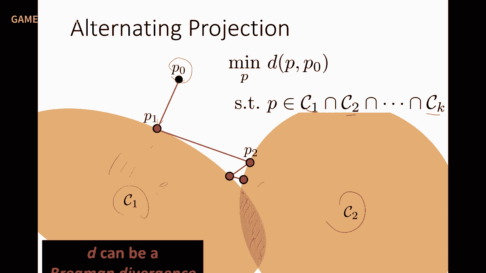

### 等式约束优化
常用拉格朗日乘子法，将原问题转化为无约束问题：
```
L(x, λ) = f(x) + Σ λ_i g_i(x)
```
然后对 **x** 和 **λ** 联合求解。

### 不等式约束优化
更为复杂。常用方法包括：
*   **KKT条件**：最优解需要满足的一组必要条件。
*   **内点法**：通过在目标函数中添加障碍函数，将不等式约束转化为在迭代中自动满足的条件，从而在可行域内部进行优化。

### 特殊结构与现代方法
几何处理中的能量函数常具有可分离结构：**E(x) = Σ E_k(x_k)**，其中 **x_k** 是局部变量（如单个三角形的顶点）。这催生了一些高效方法：
*   **局部-全局交替法**：将问题分解为独立的局部子问题（每个子问题易解）和一个全局缝合问题（通常是一个线性系统），交替迭代求解。前面提到的ARAP参数化方法就是此思想的典型代表。
*   **交替方向乘子法（ADMM）**：通过引入辅助变量和增广拉格朗日函数，将复杂问题分解为多个更易求解的子问题，交替优化。近年来在图形学中应用广泛。

对于特定类型的优化问题（如凸优化、二次规划），存在非常成熟和高效的求解器（如CVX、MOSEK）。在实践中，应根据问题的具体结构（目标函数和约束的形式）选择合适的优化策略或工具。

---

## 总结

本节课我们一起学习了几何映射与几何优化的核心内容。

我们首先明确了几何映射的基本概念，即在不同几何域之间建立对应关系。我们深入探讨了一个“好”映射应具备的两个关键性质：**双射性**（避免重叠折叠）和**低扭曲性**（保持形状）。通过引入**雅可比矩阵**及其**行列式**，我们能够精确地分析映射的局部性质，如面积变化和是否发生翻转。

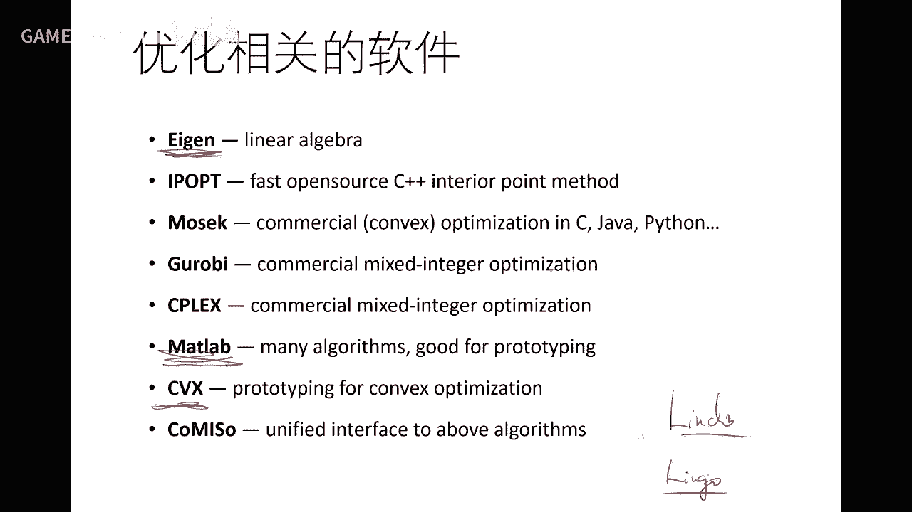

接着，我们介绍了如何将构造理想映射的问题建模为一个**能量最小化问题**，其中能量函数用于度量扭曲（如等距能量、保角能量），并施加**雅可比行列式大于零**的约束以防止翻转。

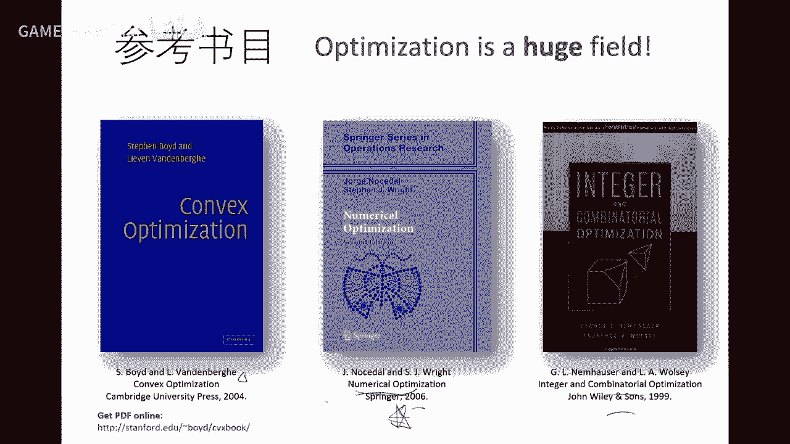

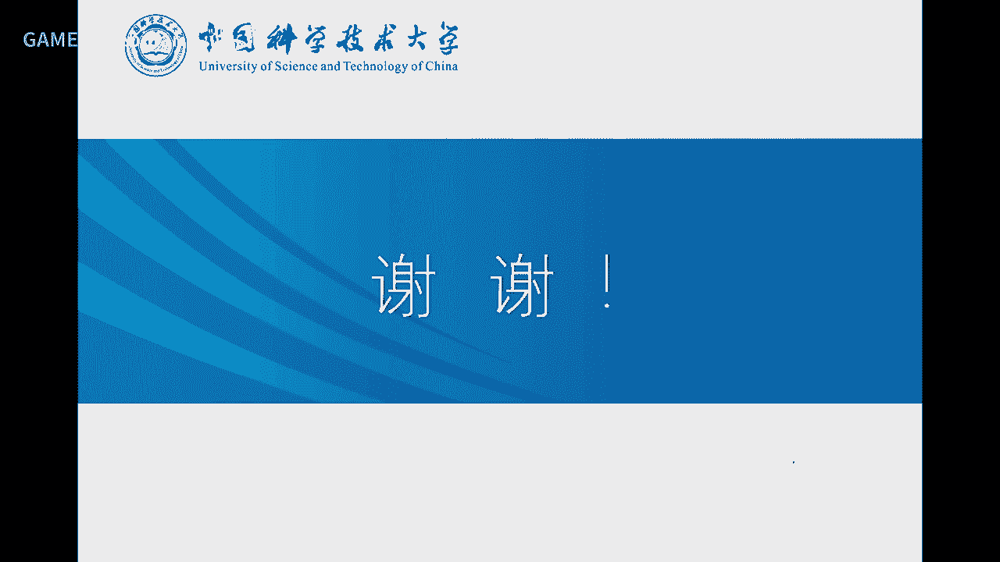

最后，由于几何映射的优化模型通常是非线性、非凸的，我们概述了数值优化领域的基本概念和常用方法，包括无约束优化、带约束优化，以及特别适合几何处理问题结构的**局部-全局交替法**和**ADMM**等方法。

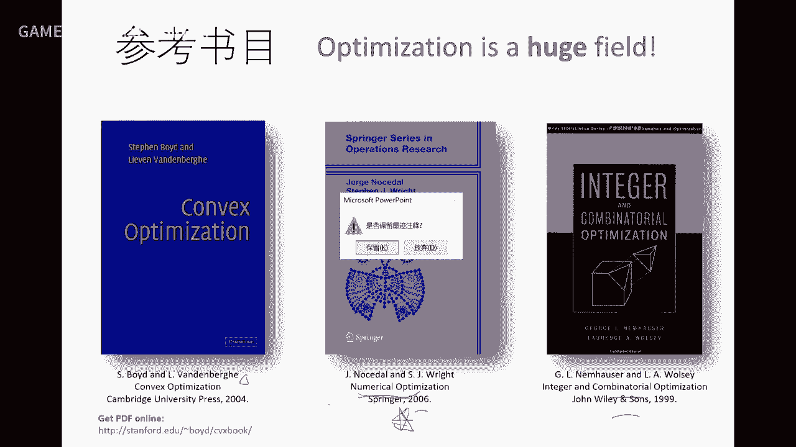

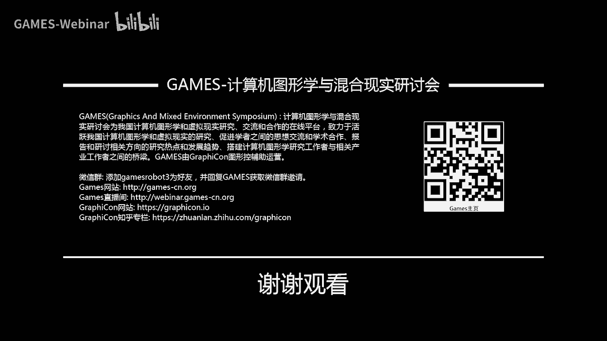

理解几何映射的原理和优化求解的思路，是进行纹理映射、形状变形、参数化等高级几何处理任务的基础。希望本节课能为大家后续的学习和实践提供一个清晰的指引。