# GAMES102：几何建模与处理 - P13：曲面重建 - GAMES-Webinar - BV1NA411E7Yr

好 那个同学们晚上好啊。

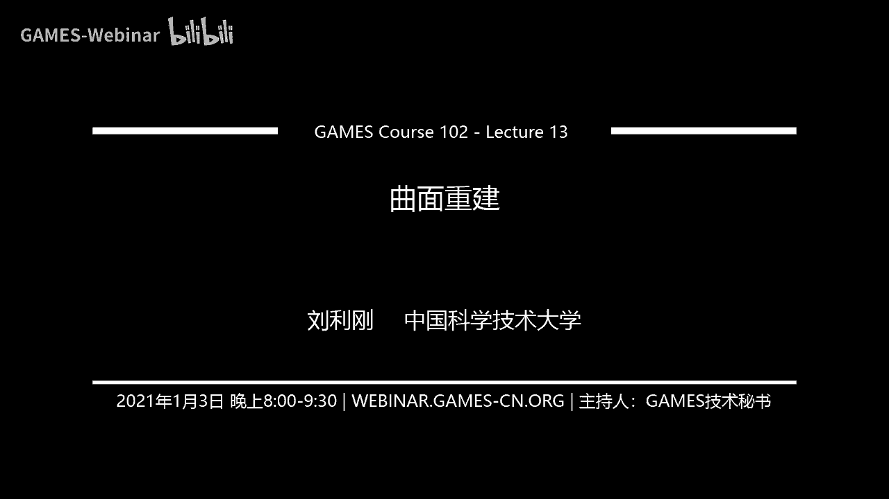

今天开始我们的Games102的课程，跟以前一样 我们首先讲一下这是作业的那个情况。

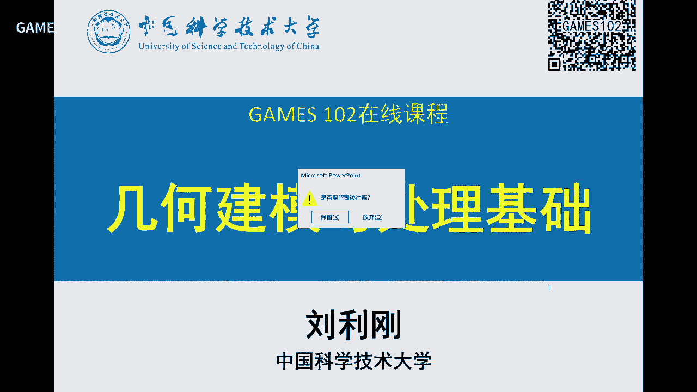

不知不觉我们的课程已经快接近尾声了，这是第9次作业，也非常高兴看到很多同学还是在坚持着这个作业。

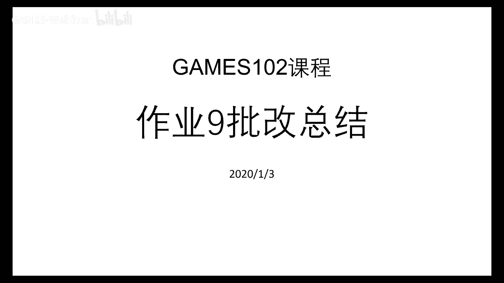

这是作业的主要任务呢 是给定一个网格，然后使用那个二次误差方法，把网格进行简化。

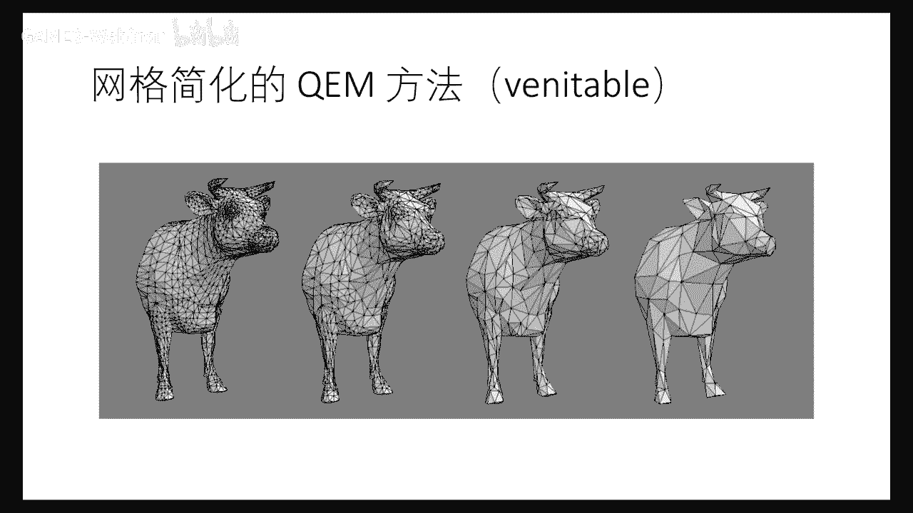

这个简化的顶点可以自己控制，那么我们看一下这是一些同学的报告中的一些截图。

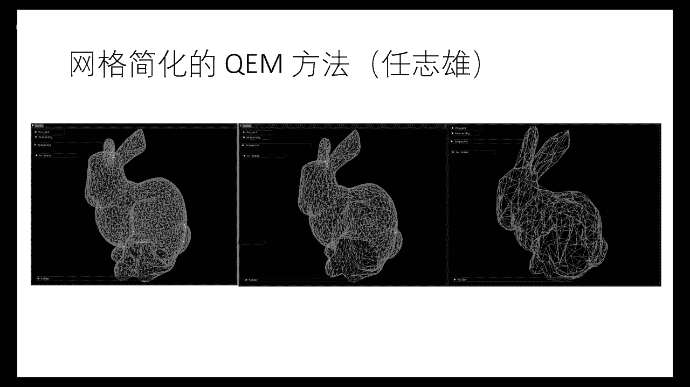

这个总体上做的还是不错的，这一次也有同学做了一些视频，我们也看一下，这个同学写了一个滑杆，这滑杆呢 可以去控制顶点个数，那么顶点的数量是显示在这个地方 是吧。

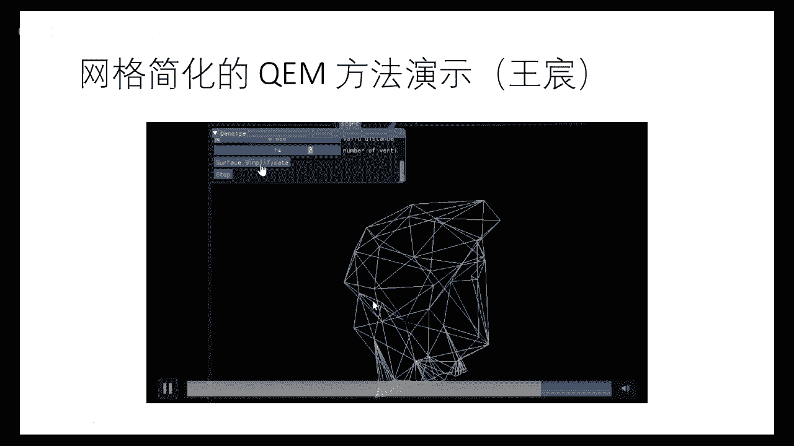

所以他可以对网格进行很多简化，那么这是另外一位同学，这个同学做的也挺好，这是个小松鼠的一个网格，可以看到他的那个顶点不断在减少，到后面，可能这个同学没有往回加。

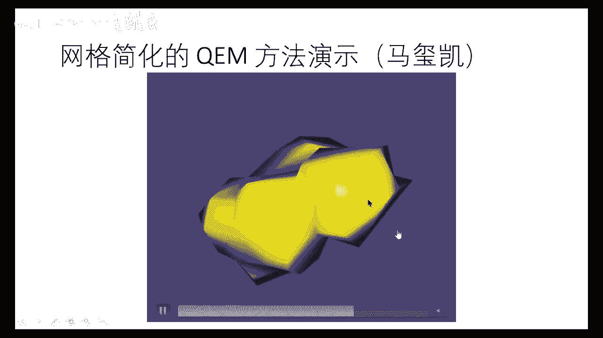

我们再看下一个，这同学呢 也是一样，他用颜色表示了一些信息，可以看到他这边窗口可以控制，他把以前的作业跟现在的作业都集中在一个窗口上面，可以看到那个以前写的那个曲率计算，拉帕拉斯 smoothing。

还有这是简化都写的一块。

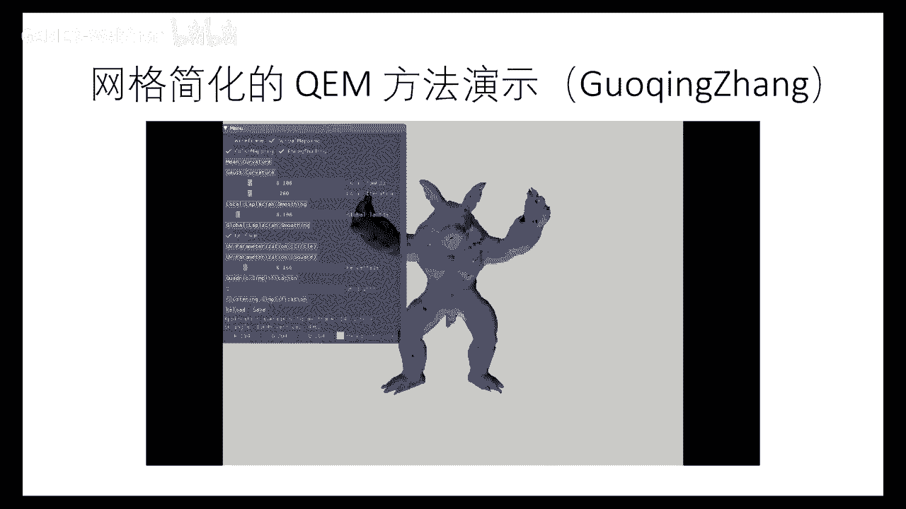

他实现了那个Gulate的算法，那么这是另外一位同学的QEM，我们跳来哈，这个是Armadino，这个go应该是加点，那么他还可以减点，所以他可以从我看跳了下来看一下啊，看这个兔子，这个加密。

然后这个是简化，这是往回加，所以他应该是记录了这个简化的这样一个过程，基本上都还是，比较好的实现了这个算法本身，同样我们也会把这个优秀作业，包括代码报告，这几位同学的，作业情况都会放在网上。

大家可以课后进行参考对比。

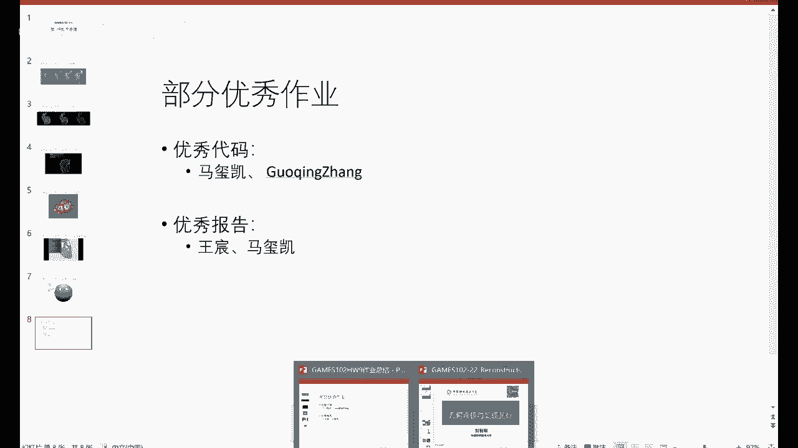

因为每次作业的话，对这个同学们来说，你可以去对比一下这些比较好的同学的报告，这个代码有利提高，当然还有一些同学说，那么在后面补这个都没关系，因为马上可能在学校同学是放假，这个可以利用假期在进行一些。

课程的一个跟进，还作业的补补充都没问题，对于企业员工来说，可能相对年终比较忙一点，以后再找时间，好了，今天我们的这个一个重要的内容就是曲面重建，今天内容比较多，所以我中间可能会跳跳得很快。

因为后面课时也不多了，重建是我们那个几何处理里面，一个非常重要的一个内容，就是建模型对吧。

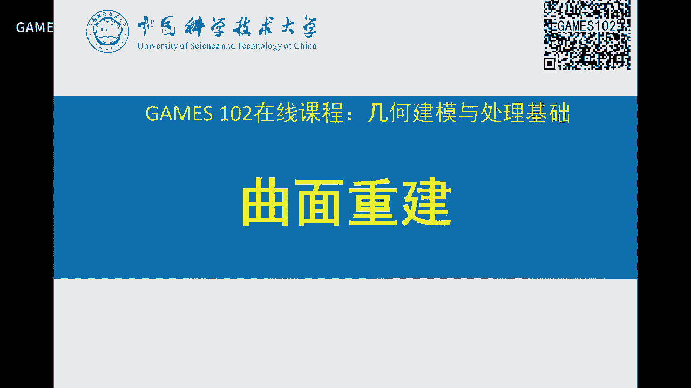

好 那么建模型的modeling，实际上是有两种主要方式，一种是design叫设计，设计的就是说这个物体是不存在的，你怎么去凭空让它设计出来，就像设计一些这个汽车表面等等。

这是我们这个Games 102上半级这个内容，就是怎么用样条，认不出曲线，进行编辑去设计新的物体，这个是叫design，当然后面我们还会讲这个通过已知模型进行修改。

这个编辑editing跟deformation，也是叫设计，还有一种呢，就是说这个物体是存在的，是我们真实空间，我们世界存在一个物体，只不过呢，我要去把它变成三位模型，进行数字化，进行数字化的构建。

这个呢，就叫做这个也叫逆向工程，扫描重建，今天我们重点是介绍第二部分重建，因为第一部分设计啊，有些工这个工具，NURBS啊，这个工具前面都已经讲过啊。

可以那么这个editing跟deformation呢，我们下个礼拜还会再提一下啊，好，我们重点是在讲下面部分曲面重建，你可以看到我们自然自然中，我们世界中存在了好多这种实际模型，像这个马太飞燕。

还有这个是大卫雕塑啊，米开朗基罗的雕塑，那么如果这些物体啊，如果这个不把它数字化过来，可能落干年后，这些这些物体会经过风化消失掉了，像下面这个兵马俑，上次兵马俑故事，大家如果知道的话。

上次兵马俑被挖掘出来的时候，上都是些碎片啊，那么靠人工啊，把这些兵马俑的身体呀，头啊，拼起来才拼成了这么多啊，这个壮观的兵马俑，当然有些像像这个兵马俑的头就找不着了，是吧，那么如果你有数字化。

把这个兵马俑的数字化，这个变成三位模型，那么可以利用一些算法的这个过程进行拼装，那么会加快这个效率，所以对三位模型不仅是数字化，不仅是对三位模型的一个考虑化，比如说数字博物馆啊。

还有一些后面的一些处理啊，也可以帮助人们去做一些更多的处理的一些应用，好，那么这个重建的跟那个叫印象工程也有关系啊，这个我以前提到过一次，就是比如说有些零件我生产不出来，但我也不知道它的数学表达。

那怎么办呢，我我从国外或者是从哪里买到一个零件啊，然后进行它进行数字化，数字化完以后呢，这个数字化，这个这个数学表达，当然也可以用以前的数学表达啊，这个B样条，当然也可以是网格啊。

最后又把它制造出来更多的，这样的话，我们就掌握了这个制造技术，因为从数字化到这个模型就是一个制造啊，所以这个印象工程早年印象工程里面，这个重建是一个非常重要的一个部分。

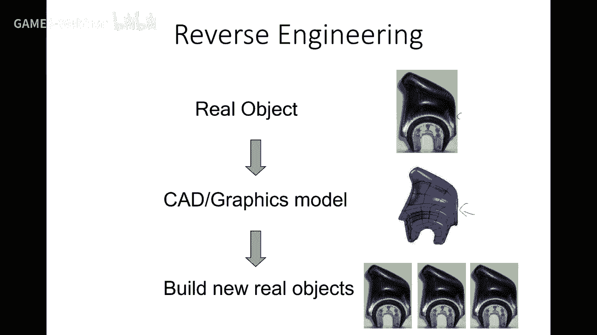

好，那我们今天说讲的就是怎么样从一个实际物体去得到它的数字化的三位网格网格啊，那么我们经常用的啊，在我们图形学里面这个叫Stanford Bunny，叫斯坦福兔子啊，这个非常非常有名的模型，是吧。

在很多图形学的文章中看到，事实上是他是是一个真实的一个这样的右边这样一个陶瓷的一个兔子啊，这故事是一个叫Greek Turk，以前Greek Turk，他当时在斯坦福应该是1992年左右。

斯坦福都不是后啊，至于他当时走走进一家这个纪念品商店，看到这样一个兔子很可爱，他就想能不能把它变成一个数字化模型，然后可以对它进行处理啊，就是他当时就把它扫描下来了啊。

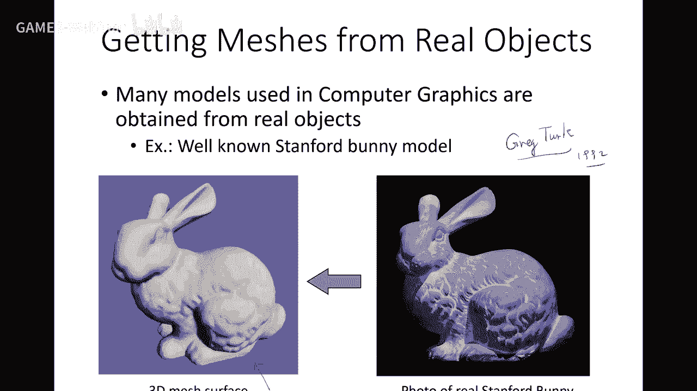

这个Stanford Bunny是非常有名的，另外一个图形学里面比较有名的叫Utah茶壶，Utah Teapot就是这个，在Utah美国Utah州，这个茶是比较有名的，就是茶壶经常看得到啊。

这个呢不是扫描的，这个是纯属靠人工通过避氧条，你可以看到他这个这个茶壶，事实上是有有有有32片，比热的这个片拼起来成一个这样的光滑流行，然后光滑那个曲面啊，然后这个曲面片跟曲面片之间保持CR连续。

所以这个茶壶看起来非常非常光滑啊，这个是个数学精确表达的一个，这个这个茶壶好。

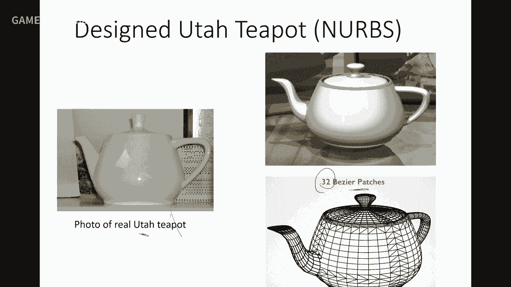

那么我们我们今天的内容比较多啊，我们这样的内容可以看到，我再大致讲讲一下说，你这个从从一个真实模型啊，通过一些传感器Sensing Devices，传感器可以是相机，摄像机扫描仪，甚至激光扫描仪等等。

然后就形成了部分点云，因为扫描过程中你要从不同视角，所以你要把这个点云给他拼起来，就就就要就把他这个注册起来，形成一个完整的点云，点云完了以后到到曲面，曲面当然还不完美，就需要进行一些修复啊。

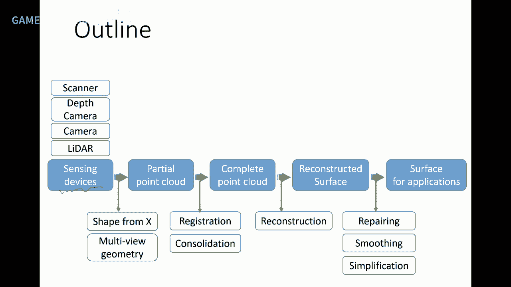

等等后处理啊，好，那我们今天啊就按这几个步骤。

好，我们先看看第一个步骤叫采集啊，这个这个数据是怎么来采集，得到上面上面信息，是吧，这物体是存在的，我怎么样去采集到他表面上的那些三维点的错标啊，这个叫Anquisition采集，好，这个采集的话。

给定个模型，你采采一个点是吧，你也可以采一条线上的点，这个叫profile啊，这个这个轮廓，当然你可以采一个面上的点啊，当然你可以采他的内部的一个横截面等等，所以这里面有不同的这个这个数据的类型，好。

我们看，嗯，常见的一些这个三维模型的这个扫描采采集器呢，是有有这这些啊，就是这个激光扫描，结构光扫描啊，等等啊，这个叫叫scanner，scanner就叫扫描仪啊，就是我怎么样通过一些数学和物理的方法。

得到全面上的一个一个点的坐标，像是每个点的把它扫列出来，就叫扫描仪，好，那么还有很多不同应用中的扫描仪啊，这个包括我们这个相机也算扫描仪，因为相机是采物体表面上的颜色值啊，像这个深度相机后面会讲啊。

就不仅采颜色还会采到它的它的那个深度，还有这个更大范围的这种体验摄影啊，还有这个摇杆采到更高更大范围的这个影像啊，都都是属于一种这个这个传感器扫描仪啊，只不过我们这里是扫描的东西呢，就是要么像它的颜色。

要么它的点云啊，点的坐标啊。

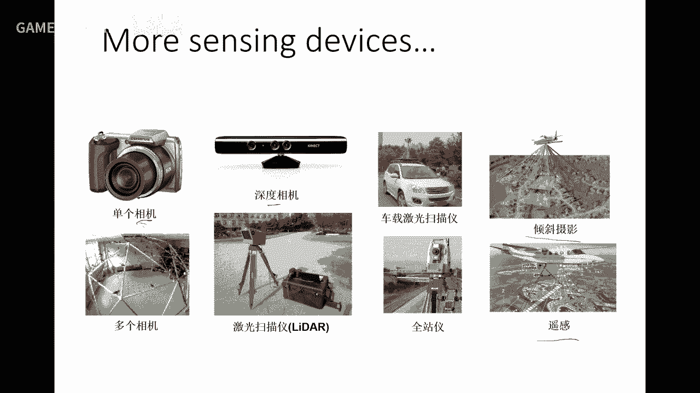

等等，好，那么他们是怎么工作的哈，我们一个个来，好，那么这个首先这个医学上面，用的比较多的就是这种啊，叫CT或者是核磁共振，MRI啊，就是人进去以后呢，他这边有一个设备能够扫你的这个。

比如说你的人体的一个横截面，像这里就是大脑啊，所以他是采集了一系列的这种横截面的一个图像，这个图像呢，那么输出来呢，要需要输出这个人体的一些器官啊。

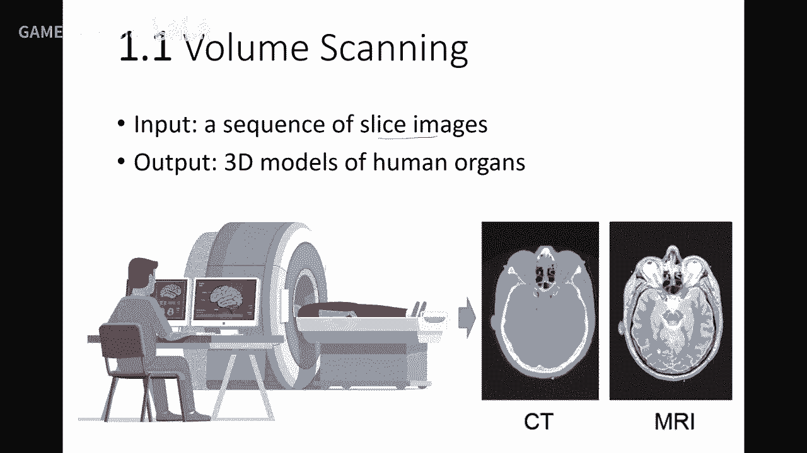

这就是医学图像处理的一个非常重要的一个内容啊，比如说我那个采对一个人的大脑，横截面采集了这么多序列，我怎么样对这大脑啊，进行一个重建，里面有血管，有不同的组织，有利于医生来判定啊。

这个病人的一些一些这个病症啊，就是这样一个过程叫叫医学重向处理。

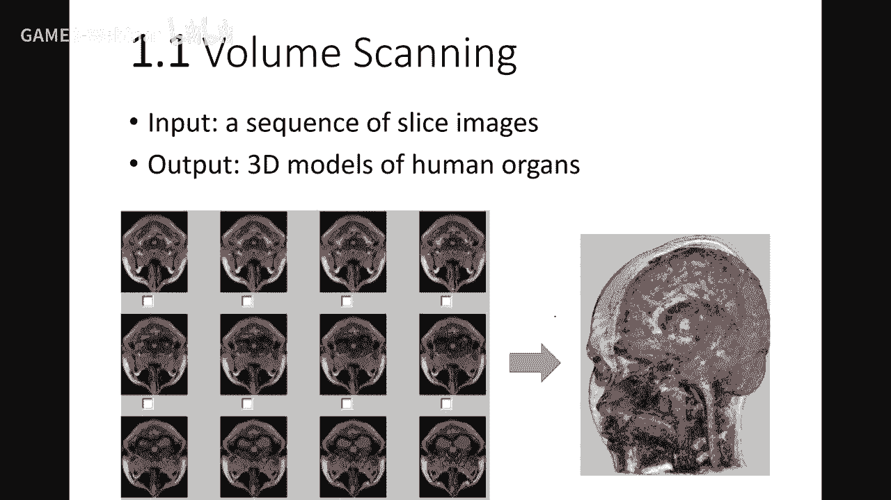

好，那么医学这个采集器，人们也发明了不同的这个设备啊，有这个超声波啊，我们如果大家做过体检的话，就用过这些啊，mri核磁共振，还有X光，X光啊，就探测一些内部的一些这个器官的情况，还有CT啊。

CT稍微复杂一点啊，那么出来的东西都是这样一些，这个横截面的图像，医学图像处理算是一个比较复杂的过程啊，实际上是你要去构建里面的器官，你首先要知道这个器官在这个当前横截面的一些，这个边界。

所以所以这部分是非常重要的分割，如果你分割不准的话呢，你这个你这个重建就不可能准确啊，所以分割在这里面是占用非常重要的地位，因为在影像音讯影像的话，很多很多组织之间的这个分界线不是不是那么那么明显。

除了一些非常像骨头啊，这个边界跟这些组织的边界比较比较明显的话，其他的不是非常明显。

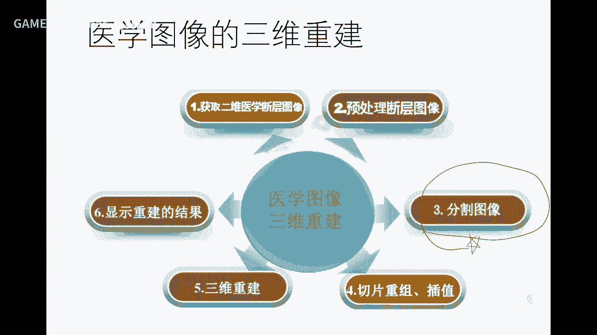

所以这个医学中央重建还是比较难的啊，那么这是一些常用的一些软件啊，这个比较有名的就是这个Mimix叫Materialize，是欧洲的一家公司，可以看到这这这三个窗口这个界面有点像3DMark啊。

这三个窗口都是这个影像的不同的视角啊，这是个三维模型啊，那么这个是一个典型的重建出的一个器官，应该是个肺吧，血管呢，不同颜色表达了不同的这个这个血管或者是组织，还有这个在牙科领域这个也比较多。

用用这种三维重建来来来补牙呀，这个镶嵌牙，还有这个是做手术做做些预演啊，这个我三三重建完以后，我先这个通过通过三维打印把它打出来以后，通过一些预演啊，来在手术之前就就来就来这个预演一下这个手术的过程。

以便于手术能够更加顺利，好那么这里面是让比较有个重要的问题，就是说我以为我这个每个切片都有个器官的一个一个一个分割线啊，我们把它抽象成一个横截面，所以这这个是不同的层，不同层的这个横截面呢。

像这个血管可能一个大血管分成两个血管是吧，也可能是一个血管呢，是连续的，另外血管是从从这里开始，所以呢，这里的这个重建的一个非常重要的问题，有些比较难的问题就是这个拓补的变化，我这里是一个横截面。

这里是一个这里出现两个，那么这两个呢，是不是一个分二还是这个分过去，还是这个连过去，还是说都是不不连通的，这个呢，通过算法完全来判断，是不是有的时候是不是不准确的，需要人工一些干预。

因为医生才知道这个地方的这个血管是什么样子，所以在在作为一个算法，你可能还是需要一些策略来处理这些情况，这个正是医学图像处理重建中的一个非常非常难的问题。

我这里不展开，好，那么这个是医学图像，这个是这个从体里面出发，那么更多的后面的都是从表面出发，就是像重新学这个你们学过101就知道，你给一个模型把它画成一个像像照片一样的，这个真实感的图片的这个叫绘制。

叫渲染，Rendering，那么呢，反过来就是叫Shape from Shading，因为这个就是这个一个加光照以后，这个叫Shading图是吧，就叫明暗图。

那么我们能不能从明暗能够去估计出这个三维物体的顶点的信心呢，当然可以了是吧，因为Rendering我们知道我们加一个光照，光照假设在这对吧，然后呢，这里每每个点啊。

这个这个这个这个这个颜色所对应颜色是什么呢，是是这个这个太阳光照跟这个法线，还有我们四点之间的一些一些关系对吧，所以呢，如果我这个颜色知道了假设光照和四点我也知道了，我们是有可能求出这个点的空间坐标的。

它的基本原理就是这样，就是把这个渲染方程的逆过程把它求出来。

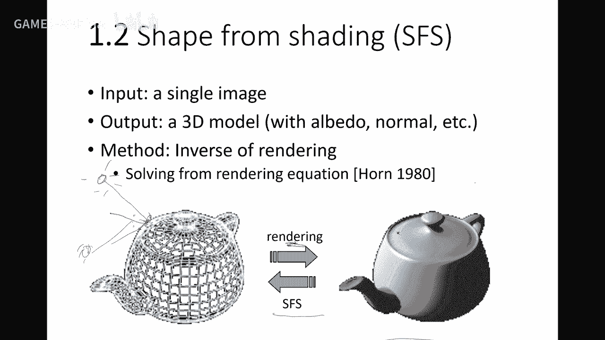

所以我们假设当然这个如果考虑全球光照，这个是非常困难的问题，所以我们在这里的话在基本上都不考虑全球光照，只考虑局部光照，最重要局部光照就是这个Foam模型，Foam Shading Equation。

这个Equation大家非常熟啊，这个光照四点啊，还有这个物体表面法相，还有它的双面坐标之间关系，那么这个一般我们会把它假设成是个浪波的模型，这样你就通过它的颜色，假设相机和光照是这个知道了。

你就可以去反求出它的空间坐标以及它的法相，那么这就是它的基本原理啊，具体这个很早年大概90年代就开始有这种，Super Foam Shading这样一些工作。

从视觉领域他们就开始在做这个事情，图形领域也在做，那么如果你给的这个是一个模型的不同光照，这样子是一个Multiple Image，那么这个信息量更大，那么这样重构出来的这个曲面就更精确是吧。

不仅是重构它的那个它的结合，这个叫三面模型，而且还可以重构它的材质，Arbital就是那个反射率是吧，在Games 101里面讲过的Arbital就是那个反射率，就是那个反射那个系数，好。

那你也可以重构它的Normal，最后就得到一个三面模型，所以你输入是多张，那么更加对这个问题会有帮助。

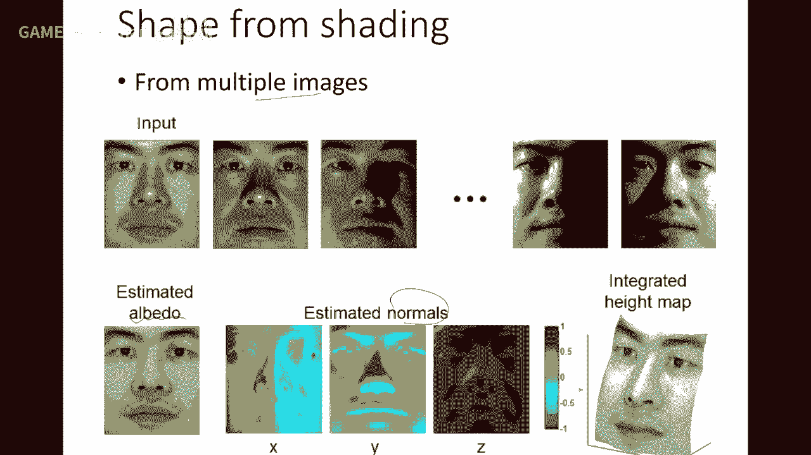

那么如果大家对这个感兴趣的话，可以看一下我们组这个张吉隆老师，最近做的一些工作，这边是发在Parameter上面，这个都是从单张来恢复这个模型，当然在这个工作里面，他用到了人脸的一些新鲜知识。

因为人脸有模板，所以恢复的会比较好一点，这个是对一般物体，这个大家可以兴趣可以看一下，那么对于这种最新文章呢，你们可以看到参考文献，就可以追溯到这种Sharp Form Shading。

一些比较早的文章，从这里出发可以去做一些探索，好，那么这个文章呢，是今年，不应该是去年了，现在已经元旦了，去年CVPR 2020的一篇最佳论文，最佳论文呢，这个文章呢。

就是他就是纯粹是通过这个深入学习方法来做的，就是是一个，你看Optimize就是什么，不需要训练，他就是用一个神经网络来回归这个三面的，这个这个给另一张图像，来你和这个他的三面模型，还有他的AVIDO。

还有他的其他的一些信息，好，我们看看，看看他的一个，因为这篇文章因为他是学习方法，所以你甚至这种卡通啊，这种这种抽象化都可以去回忆出来，好，我们来看看他他的那个是怎么做。

那个我们以前稍微解释过那个神经网络，神经网络他他就你函数对吧，所以呢，我给给定一张这个图片，好，那那么你要去求出这个他的模型在哪，这个模型是是是呃对，这个是确定做啊，好，你可以看从从这个模型。

你可以去回归出他的那个啊，一些这个呃，这个自信度，还有他的深度深度就是这个模型啊，还有他的lighting也可以作为作为变量，还有AVIDO也可以作为变量，所以你用一个回归呃这个一个函数。

一个给给给那个数据以后呢，他可以回归出好多这种中间变量，最后呢，他把它再把它渲染成一张图片，我希望这个渲染图片跟这个图片的尽量相似，所以所以这里有有一个loss，有一个这个回那个叫做呃这个误差函数啊。

就损失函数，所以呢，他整个网络整个网络就是一个回归啊，就就是一个就是就是一个那个拟合啊，拟合的话，使得我得到的三位模型经过我的shading加上AVIDO的，这个一些一些一些这个性质把它绘制出来。

就变成一张跟输入图片一样的这个图片，这样的话呢，我的模型就可靠了对吧啊，所以他是一个这样的不断的在自我的这个呃迭代优化过程，学习过程就是在在优化啊，所以他这个巧妙的把这个呃这个问题啊。

你们的变量变成一个这个神经网络可以去优化的一个过程啊，这个呃就是第一次达到了，就是不需要学习而不需要训练数据就可以从一张图片啊，来来来重建出三位模型啊，这个原理大家清楚啊。

就是一张模型一个图片是得到三位模型，事实上是不为一的，这个解释不为不为一的对吧，所以他那个是有奇异的啊，所以一张图片能得到要么就有很多鲜艳知识知道了哈，要么就是利用一些这个非常特殊的一些技巧好。

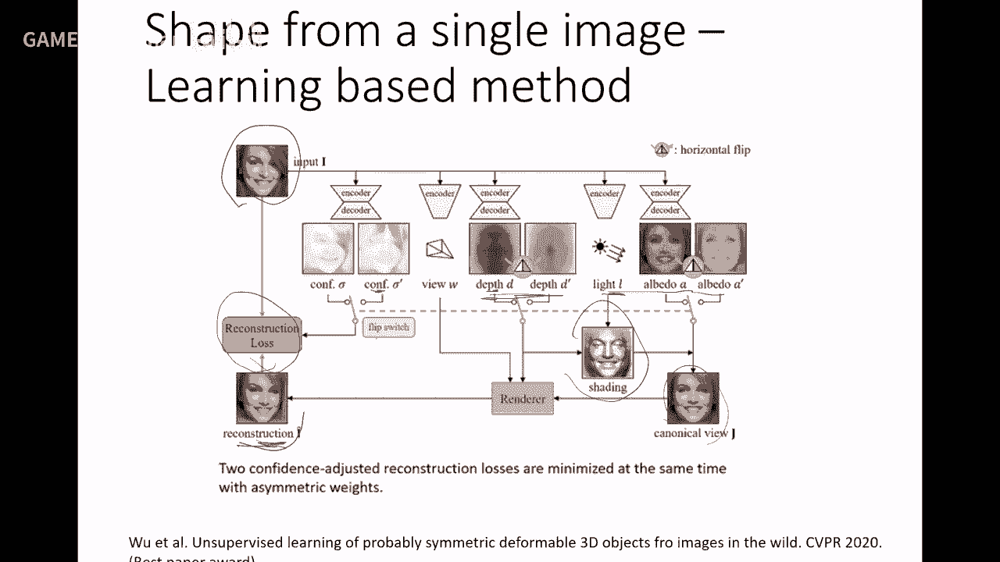

好，那么更多的是什么，因为一张图片到三位模型事实上是有奇异啊，因为一个顶点对于空间中的一条线有很多顶点可以对待对应，所以呢，更多的方法的是这种基于多多视角图片啊，就是我给一个模型。

我从不同视角给他拍照啊，只得到得到若干张照片，每每个照片呢，是从不同的角度去跟他拍的啊，那么我能不能从这个多张照片去重建出这个出去，得到这个三位模型的点的信心呢，啊，这个是有可能的啊。

这个这个里面的数学基础是非常简单。

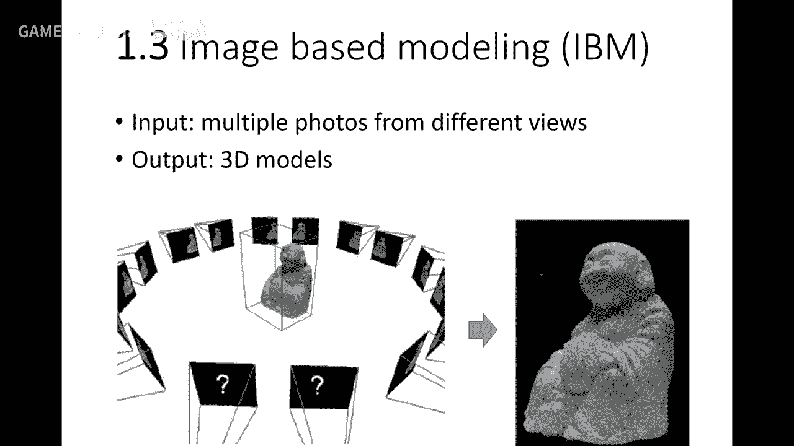

我们来看一下他这个基础呢，就叫做多视角几何啊，上这里这个有一个重要的观察就是如果我相机从这拍从这拍两个视角是有个四角差对吧，就像我们人眼睛一样的是有个四角差。

我们能眼为什么对空间物体是有这个有一个空间的感知呢，就是因为四角差，这个点跟这个点如果是对应的话，在我两个图像的这个位置啊，跟我这个眼睛四角差了，刚好形成一个三角形。

就可以去重建出上面这个模型的一个上面坐标啊，用示意图来看就是这样一个图哈，这是4。1，这个4。2假设假设这个红点这个大的红点跟大这个大的红点是对应关系，你可以看到这个是同样一个模型的一个点。

在两个相机实际上是出现在不同的位置，是吧，那么通过不同位置以后呢，我们来看这个图啊，好，那么假设这个相机啊，这里有两两两两个两个符号，一个叫RT，RT是表示这个相机的这个方位。

它的旋转加平移就是表达它的位置是吧，图形学里面用一个这个四个数啊，一个矩阵加这个T就表达这个相机位置，RTR是这个相机位置，R23 T3是这个相机位置，假设这三个相机位置都不知道。

所以R1 T1 R2 T2 R3 T3都是位置数，但是我能找到这个点在这个相机下的点的这个像素坐标，以及在这个相机下的坐标，你在线坐的坐标就是这三个坐标是知道的，而这个点是公共点，所以这个点是一个变量。

那么那么这三个是知道的，是吧，这个三个同影就X1 X1 X1 X2 X1 X3知道的，而我们也知道了一个相机是个正轨相机，如果这个相机的这个这个焦距，这个内参我们把它叫K，我这里提一下。

这些R1 T1 R2 T2叫外参，内参就是指这个相机内在的一些参数，比如说它的焦距，假设焦距K我也知道了，所以这个点就是X1 E是空间这个点，在这个相机平面上的成像的距离。

而这个这个坐标就是满足这样一关系，空间这个点在相机1这个参数，相机这个内参在这外参在这，这样一个矩阵乘法就得到了一个K X11，就这个点是吧，而X11同理可以得到这个X1就这个点，在相机2的像素在这。

在相机3像素在这，而这些是椅子的对吧，位置的话就是这些K和R1，所以位置数是K，相机是不变的，那么R1是每个相机的旋转，加T1每个相机的平移，这个叫外参这个叫内参。

所以我如果找得到足够多的这些图片中的对应点，有些点可能在三个相机中都存在，有些点可能在这两个相机存在，有些点可能在别的相机里存在是吧，所以就这里可以得到很多个这样这样的等值，只要你这些点点对。

你可以看到这里可以找到好多点对，足够多是不是他就是这个这个等值，个数就超过了面量个数，这个就是一个这个这个过约数的一个一个系统，然后你去求他的最小二乘以一下的解，就可以去挽求出这些相机的内参和外参。

这就是多色点解荷的一个基本原理，当然这里大家就会问，我怎么知道这些点跟这个点是有对应关系呢，并且图片如果假设有很多，我怎么一个个去找呢是吧，那么这是视觉上面有好多这种特征值。

这叫做descript去描述这个图像中之间，这个哪些点是对应有可能对应的，这个有个非常重要的就叫shift，s i f t这个这个算子就可以去帮助你找到，好那么有了刚才这些理论基础以后呢。

你就是求求解这样一个这个超大规模的一个这个方程组，你就可以求出他的相机的内参外参，以及求出这个这些对应点的这些坐标，那么人们呢就由此呢就产生出了非常多的这种多视角的这种补给系统，像像这个是比较常见的。

就是架几个摄像机中间站一个人也好物体也好，扫一圈就可以就是相机都不动嘛，所以只要抓拍一下就可以采集他的不同视角的照片，这个是一个球这个球上面放了好几百个相机同时采集，就像这个一样，这个是他的内部结构。

可以看到这些地方都是下相机，那么这些是打光的光源，让他尽量这个光源均匀一点，那么这种采集系统的基本上就有滤屏，大家知道这个滤屏抠图比较方便一点，只是为了抠出这个主体部分。

那么这种设备在很多很多这个动谱这个一些工作室都非常常见，中间有好多相机，那么搭这种系统的话，一个非常重要的一个难度是什么呢，就是这些相机这些物理设备的一个同步问题。

因为我要知道这个所有相机在同一时刻抓到的图片要对应，所以如果由于网络也好，还是硬件设备的网好造成延迟，这样的话就往往会造成这个偏差，所以这里面做这种系统，这个这个同步的问题是非常非常重要的问题。

也比较难啊，就这是属于工程问题，好，那么呃，image based modeling，我们简称叫IBM，这个软件现在这个算法，大家我一听完大家也觉得不难是吧，但是你要你要做的好。

就是首先对应关系要做的好，同步关系啊等等啊，所以还是不容易的是吧，但是这个随着技术进步，包括算力啊，包括那个一些特征点匹配的精准度越来越高，现在也出现了一些非常好用的一些这种商业化软件。

像SWIPE他们这个地理性这个领域就就用这种飞机啊，去大面积飞城市啊，可以非常快速的重建城市的这个商业模型啊，这是一个artiso，artiso是那个香港中文应该香港科技大学全龙教授。

他们一个团队做的一个线上的一个商业重建，你可以把照片传到他网云端，他云端帮你算好以后下载下来就是商业模型啊，你可以看到现在的商业模型，这个行业摄影就是从空中航拍这个城市拍好的照片。

但通过算法就可以把它重建出来，你可以看到这些渲染出来的这个这个模型啊，这个跟非常非常逼真啊，已经看不出是照片还是商业模型给渲染出来的啊，还有包括这种发工厂，当然你也可以看到有些质量还是不好。

特别是这种比较细的地方还是抓的不好啊，那么好，那么还有一种第四种叫结构光，也叫白光，工业界叫白光，我们学术界叫叫结构光，叫Structured Light，那么它的原理呢不是通过两相机，它只有一个相机。

但是呢，我这边呢通过一个光源，这光源上就是用一般的投影仪，就是我们教室里用的投影到这个这个前面屏幕上投影仪，这投影仪呢不是光光的打光，那么它是打一些条纹，像在这里出现的这种竖状条纹，有些是横状条纹。

有些甚至是格子条纹，反正你用一定的这个，因为他们两个是同步的是吧，所以打条纹是干嘛的，打条纹就是给什么，给他去打特征点，因为条纹是依靠直线，包括这个横条纹，这个焦点是非常容易找到的是吧。

所以就把上面刚才那个去图像中找那个对应，啊，然后那个就变成什么呢，变成我主动的去打一些条纹找对应，那么这对应关系不就是明确了吗，对应关系明确了以后，同样用刚才那个方法就可以去算出这个点的上面坐标。

也包括这个相机参数，但是一般做的时候呢，我们会把相机参数给它记下来，所以相机参数是这个变量的就没有了，以及还有他们的角度也没有了，好，所以可以看到这个在工业界这种，在工商上面算什么也还是比较多的啊。

像杭州，先林啊，就做的非常非常不错，就是你可以看到有些有些是这种像简易的，就一个一个投影仪加上一个相机是吧，还有有些呢，是这里有三个相机是双目就两个相机加一个投影仪也有啊，这样的话。

使得这个精度会更高一点啊，所以可以看到在工业界中用结构框上面，上面以少的精度是非常高的啊，已经达到商用的这个水平，像这里这里少这种机械零件都是非常不错的啊，好，那么呃呃这里呢。

说到的这个双目不妨不得不提一下这个啊，start from motion啊，就是在视觉或机器人领域的这个一个基本东西，上次就是刚才双目坐视角结合的一个基础，还有SLAM，SLAM是机器人领域啊。

是一个机器人啊，怎么样去实时构建这个场景于他他的地图啊，所以这个虽然是同样东西，但是算是在不同的领域，他叫法不一样啊，你可以看到一个在机器人领域，一个在视觉领域，是他们东西是背后东西是一样的啊。

就是刚才说的那个，那么SLAM这个就是拿拿拿个机器人，机器人拿一个这个RGB图这个这个相机啊，当然对机器人来讲，他还有一个内在的叫IMU啊，IMU就是可以定位的一个一个装置啊，就就多了这个这个事情啊。

那么呢，你这机器人拿着相机在运动，就可以实时扫座位的这个图像，实际上是本质上是视频，那么通过这个对应点关系啊，这个原理是一样的，然后呢，就可以进行上面的重建啊，不仅重建完以后还可以构建出他的地图。

因为这个IMU啊，可以定位出他的那个那个那个世界坐标啊，所以地图就出来了，这个在机器人领域比较啊，这个是一个根本东西啊。

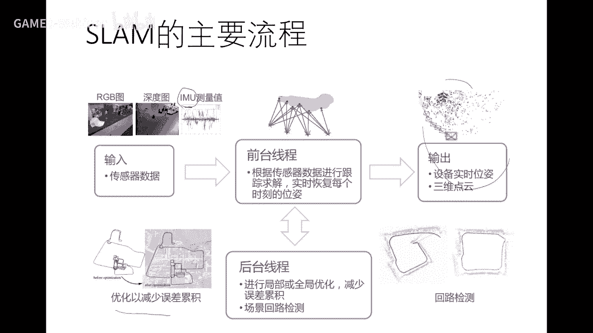

像像这里是个视频图啊，这个是个早年的工作，一个机器人，这个是个机器人啊，然后边走就边可以探索，周边的这些场景的上面上面坐标，他不仅探索出来以后，他还把这个新探索的这个场景的，跟老场景进行匹配。

就构成一张地图啊，那么这里里面还有些问题啊，问题就是这个叫叫避缓问题，因为像机器人从这里转一圈过来，有可能呢，这个根据连续性，他能够把这个场景缝合，但是回来以后呢，发现所莫两真不一定缝合。

这个叫loop closure问题啊，那么在前年的SIGGRAPH，我们做了一篇文章，就是怎么样让机器人自动漫游这个场景，是以这个物标，就是物体为引导的这个一个策略啊，我这里提一下。

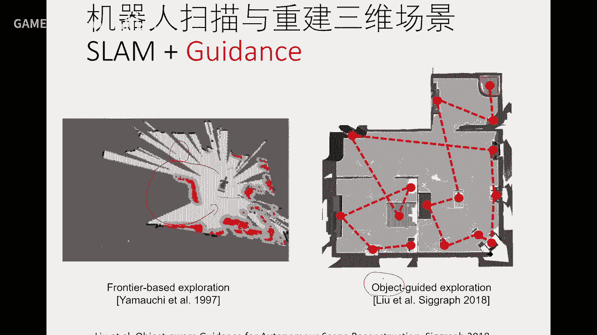

好，那么还有，哪些测距方式呢，还有一种，前面讲的那个测距方式呢，就叫做被动式，为什么，我都是拍照片，或者是这个通过算法来找照片之间对应关系，他是被动的获得这个上面坐标，那么这个这个方法呢。

这个激光雷达也叫LiDAR，这个叫主动式，这个采集装置，因为他怎么他这个，有个相机，这相机的主动的发一个激光，发激光，然后呢，这激光呢，弹射到物体表面以后，回弹以后呢，回到我的接收器，那么这样的话呢。

就通过这个路径，或者时间，我就能够很快自动算出来这个点的距离，所以他这个叫主动，这个测距，也要主动这种扫描。

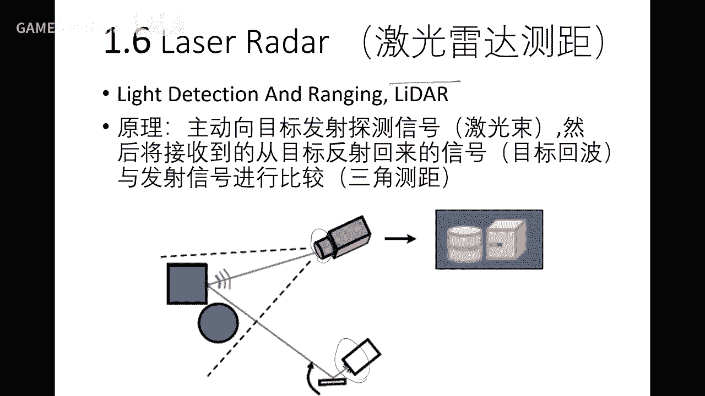

好，这里有个视频，大家看一下啊，就是，这个视频可以可以可以看出，有一个，有一个激光扫描仪，啊，这个视频播不出来啊。

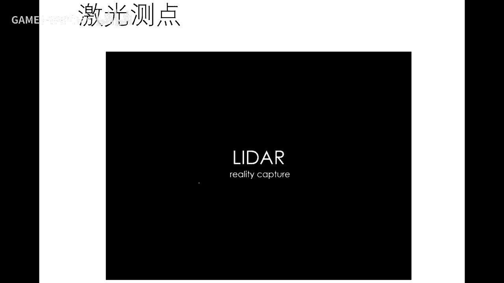

就不看了，好，那么这个在这个最近的十年，这边是最近十年左右，这种激光扫描仪成本越来越低，你可以在有的时候在街上啊，看到路上有些车上装了一个这个东西啊，像这个就是激光扫描仪，他激光扫描仪呢。

怎么他是这个上面有一个高速的，上面有一个高速旋转的一个激光头啊，从上到下去扫描这个建筑，一条一条一条，然后每少一个点的，马上就把这个点的坐标给采集到了，这样的话呢就这个汽车在街上走的时候呢。

就可以对周边的建筑还有树木啊，这个道路进行采集啊，所以现在很多做无人驾驶车的一些公司，采用了这种主动式的激光扫描仪。

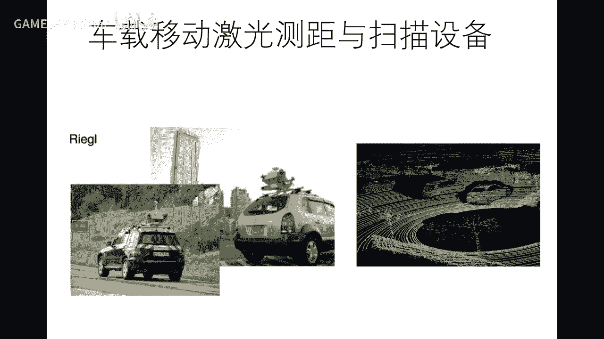

来做这个三维场景的感知，好，那么这个是叫做深度相机深度图像，那么深度图像呢，是也就是大概11年开始，微软的connect啊，这个是2011年10月份发布的一个产品，这个产品呢，当时出来还是非常轰动的。

特别是在玩游戏非常火爆，下面这个视频可以看到，就是当时呢，就可以看到一个人在镜头前做运动，你手上身上不用装任何的传感器，那么这个装置呢，就能够自动的识别出你的骨架，你的运动。

所以你就可以在镜头前面去玩这种，运动控制的这样一些游戏，比如排球啊，跑步啊等等，当时轰动一时，因为那时候大家都觉得，要实时来做出三维信息或者骨架，是不可能的是吧，好那么，这背后的原理是什么呢。

背后原理发现，它并不是从RGB来得到这个事情，它还有个D，D就是这个depth，深度，深度什么意思呢，深度就是每个点啊，我还测得什么呢，测得了我的视点，就是相机啊，到物体表面的距离，哦原来它有三维信息。

所以说一下子把这个采集啊，从这个原来的RGB，主动式的也获得了这个D，就这样的话，就使得这个应用，可以变成现实，之后的话，很多很多大厂啊，像苹果呀，英特尔啊，都在这个这个深度相机这方面，做了很多工作。

这个像前几年iPhone11，包括去年刚出的12，就上面集成了这样一些深度相机，就是它是RGB。

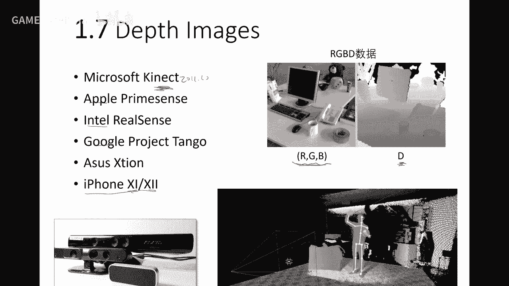

D三个，那么D这个，D这个深度呢，非常规则，那因为它跟图像是一样的啊，就是一个Grid，只不过每个点有一个深度而已，所以它本身上是一个2。5位的一个图像。

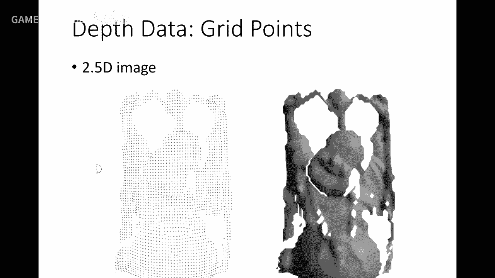

你可以看到，它这个可以理解成一个灰色图。

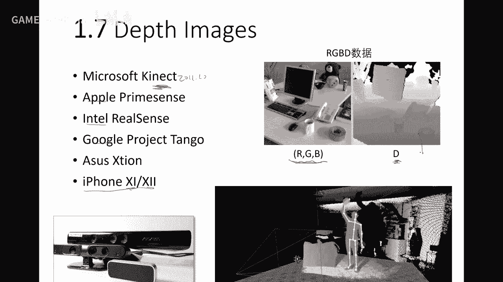

是吧，好，那么这个相机原理，我就稍微提一下啊，那么早年的深度相机呢，叫Time of Flight，叫Torv啊，这个这个相机，它是通过发射时，一个点，然后回来时间，就可以算出它的深度，这个是。

但这种相机呢，它只能采集非常小分明的，就是R56*R56，当时啊，当时这个几年前，现在有可能扩大了啊。

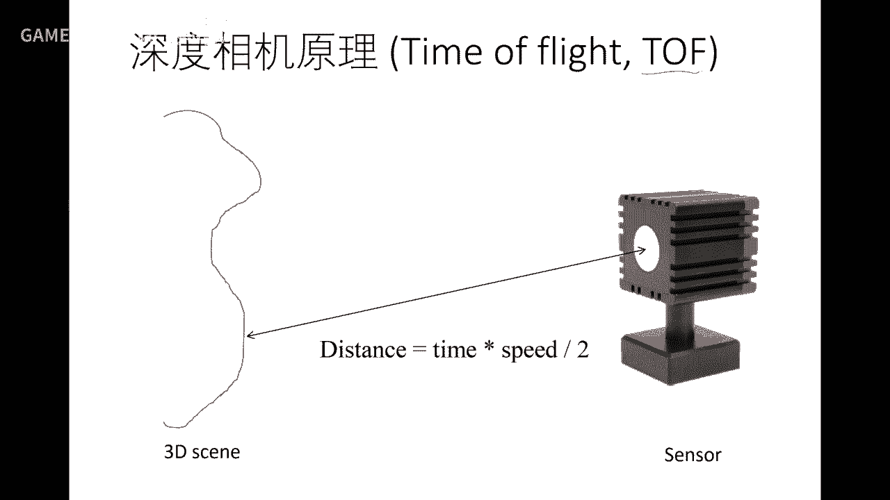

那么那么还有一种是Connect，这个相机，这个相机穿出来的时候呢，它原理非常巧妙，它呢，实际上是从这个，你可以看到这有三个摄像头，一个是RGB，一个是发射红外光斑的，还有一个是接收器。

那么这个这个发射红外光斑的，这个呢，它是发射一个闪斑，一些盘栈，闪斑呢，在不同的距离呢，会呈现不同的pattern，所以呢，你只要识别出，它是属于哪个pattern，它就去那个查找表里面，马上查找。

匹配一下，就知道了这个pattern，所对应的距离，所以你不同的这个距离，如果pattern是不一样的，有天比如距离小，pattern是小一点，距离大pattern大一点，所以它的这个深度啊。

不是要通过刚才说的，那个被动式的采集，要去算的，它不用算，它就通过一个，这个光斑的匹配，算是你把它叫做匹配码也好，然后就可以把它做出来，所以这个connector，包括刚才2IF相机，它非常快。

它一秒钟可以采60帧，30帧，甚至更高帧的一些，针对的动态物体的，这样一些深度，就使得刚才说的那些游戏，运动带有运动游戏。

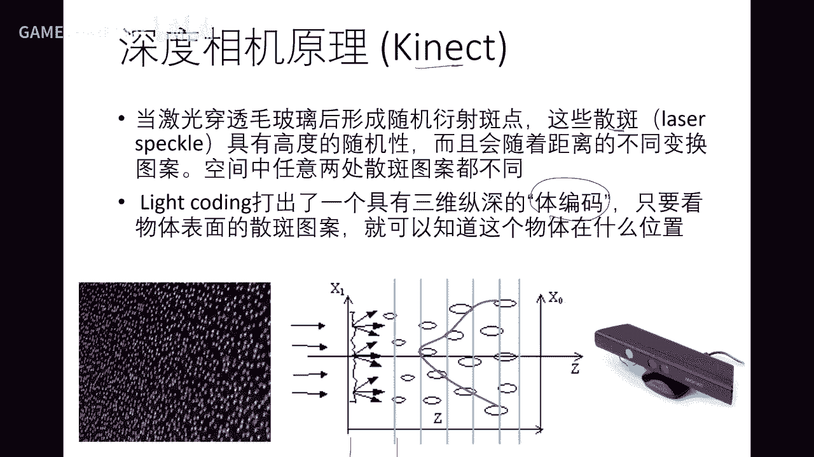

就成为可能，那个一年出来以后呢，我们比较早的就知道了，所以很快做了一篇，把这个基于connector，拿来做人体扫描，发在2012年的TVCG，这文章引用还是非常高的，就是我们通过前后，两个深度相机。

加这个深度相机来扫描，因为深度相机它是发生红外，所以它有这个干扰现象，所以为了避免干扰，我们这个后面后面加一个，前面加两个。

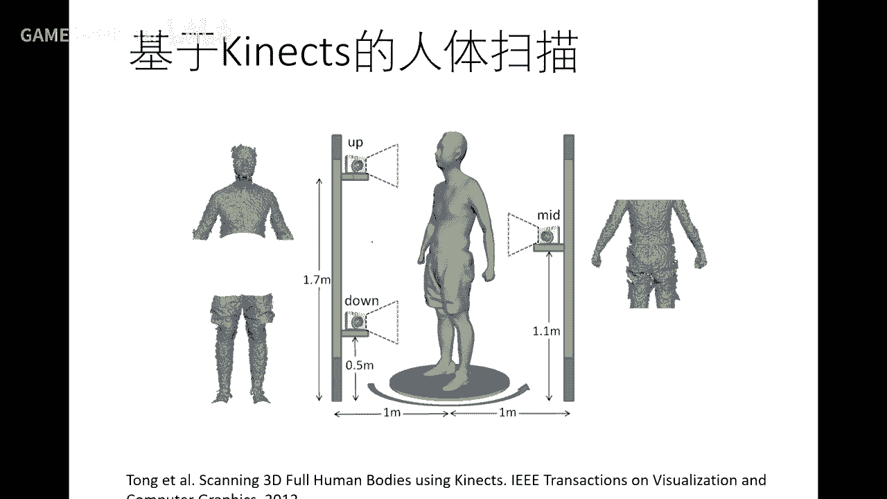

做的比较早一点，那么后来这个，过了一年呢，就connector非常出来以后，就成为主流了，因为他用到了GPU，这一些这个计算，是很小妙的，把这个通过那个隐私函数的方法，然后来得到实时的这个重建。

这文章非常有名，大家有兴趣可以看一下，就你拿着connector，像扫描营一样的，对着一个轮体也好，轮体不要动，或者对一个物体也好，进行一个移动，然后就可以扫描出，很多很多方向的帧率，这个帧。

然后通过一个算法，就可以把它那个重建出来，但是这个现在也成为很多。

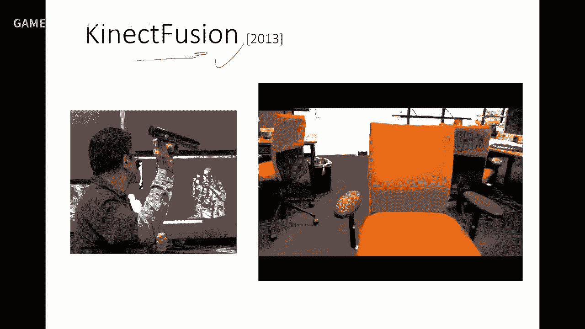

一些上面重建的，一个主流算法之一，还有一些这种，比较特殊的一些重建方法，就是你拍照片以后，假设这个照片，你放在一个滤屏背后，所以说它的轮廓线，就可以抠出来，那么我这个是从视角1看的，这个是从视角2看的。

那么可以看到，从视角1看的话，这个物体一定是存在于，这个视角所导出的，这样一个柱面里面，对吧，你把这个轮廓线，给它这个网空间，因为视点我是知道的嘛，所以往中间去投一个，这样的这个叫swiping。

就是扫略体，好那么从另外一个视点，我也有一个这个横截面，是吧我也投一个扫略体，那么另外一只脚，那么这些扫略体，在空间形成的这样一个交集，就是这个物体本身，是吧所以这个很好理解，这个叫微修后。

叫可视这个图包，那当然你这个，如果视角越多，这个模型就会重建的会越精细，是吧所以它适合于那些，比如轮廓比较清晰的，这样一些物体。

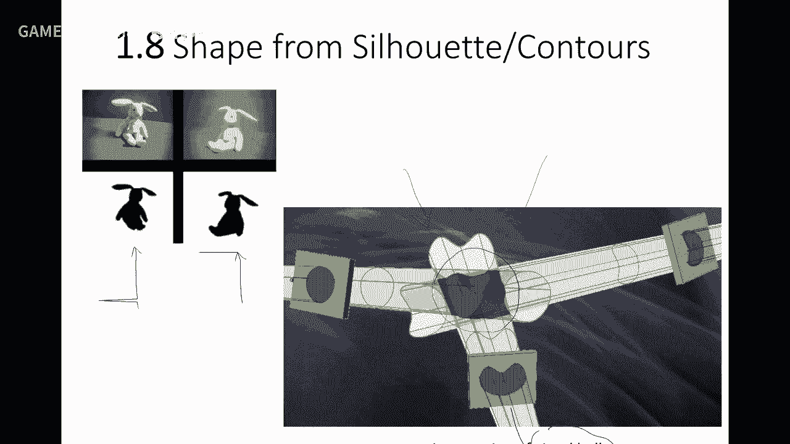

这早年也有这个方法，好那么这个方法就比较老，这个叫探针，探针是这个是在机械行业，可能是我们那个年代还有用，现在不到在某些工厂里面还有用，就是它这个探针的上面有个传感器。

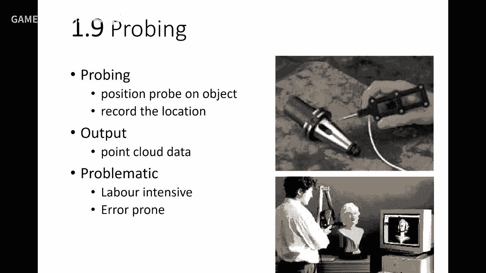

它传感器连个线，这个线是可以知道这个传感器。

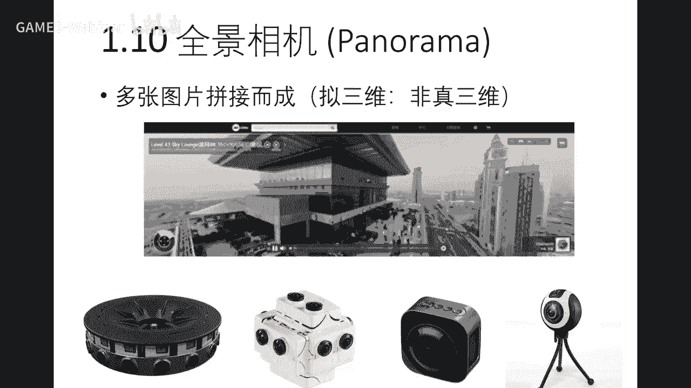

这个嘴尖的这个上面坐标，所以呢你接触这个物体表面，然后按一个按钮就踩到这个点，接触一个表面，按一个按钮就踩到这个点，因为它完全是靠机械装置，来定位这个这个这个锥，嘴的尖就叫plop，叫探针的这个坐标。

当然这种方法在机械行业，可能现在还有用，首先它也非常累，因为你要靠锁工一个个点嘛是吧，就是在早年的这种，这种音响工程还是用的比较多的，一个呢就是它也对物体表面，可能会划伤。

所以它不适合这种比较珍贵的物体，比如文物，这个显然不行嘛，所以这个现在用的不多。

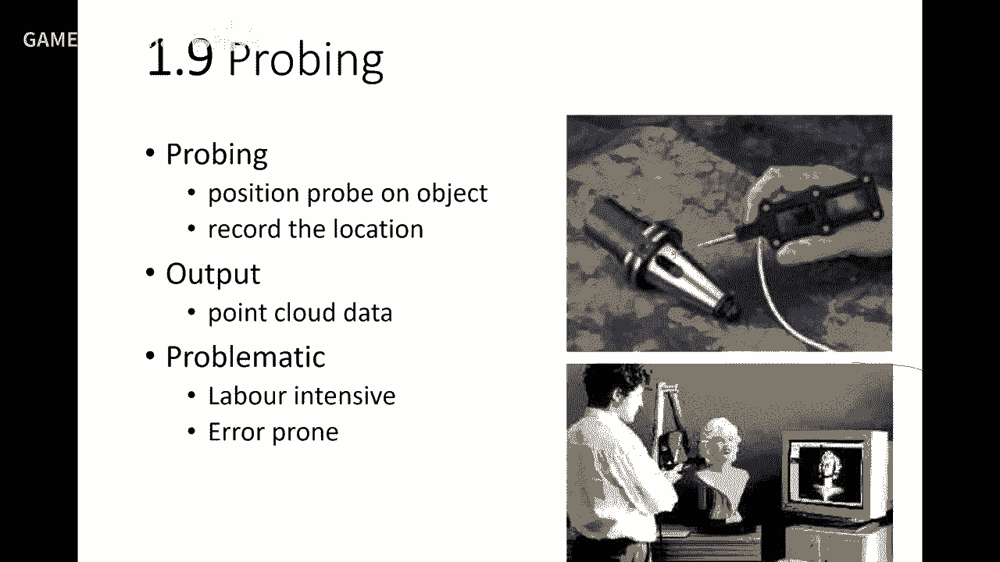

可能在一些不测图行业可能会有，还有一种三维重建呢，这个也是在被业界，特别是工业界也经常提，这个叫全景相机，特别是在一些虚拟现实的一些公司，就戴个头盔，你可以这个360度看到这个场景，也可以拉伸。

也可以这个放大，那么这些呢原理呢非常简单，事实上它就是，它不是个三维重建，它是个全景图，Panorama，就是用桌上图拍出来，只不过是360度而已，你可以看到，这个这种周圈布了好多好多相机。

每个相机都拍成照片，每个相机都拍成照片，把这个照片给拼起来，就变成一个全景，像这里是上面也有拍，所以这是市面上都可以买得到的，这种全景相机，像这个呢是一前一后，只不过两个呢是一前一后呢，就装的是鱼眼。

鱼眼是个广角相机，所以拍的这个范围比较大，比如说可以拍到180度，那么这个后面拍180度，就这样形成一圈，所以只要拍一次，就可以形成这个点所在的，这个位置的360度的这个图片，然后拼成一张柱面。

或者球面的一个图像，你戴个头盔就可以随便转头，就可以看到那个影像。

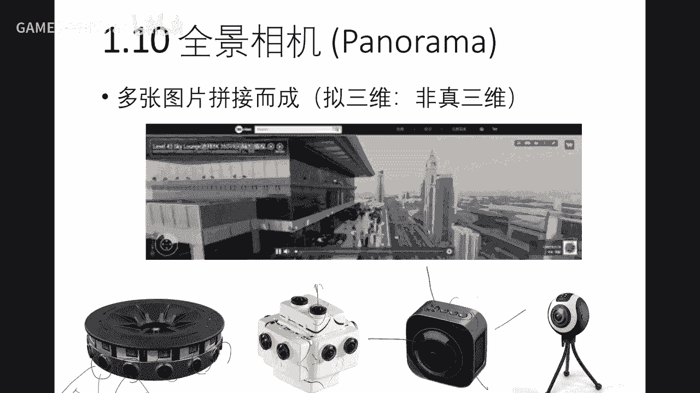

事实上它不是三维模型，它就是图片，那么还有这些怎么牵引像素，就是通过不同相机的这个千套，可以放成很清晰的照片，这个也是最近几年说的，他们有的时候也把这个叫做拟三维，所以刚才很快讲完了。

这个三维这样一些采集，那我们看怎么来重建呢，就回到这一部分，刚才无论是怎么采集，都是从各个角度去看这个物体，所以这个物体呢都是碎片式的，那么你怎么把不同角度的。

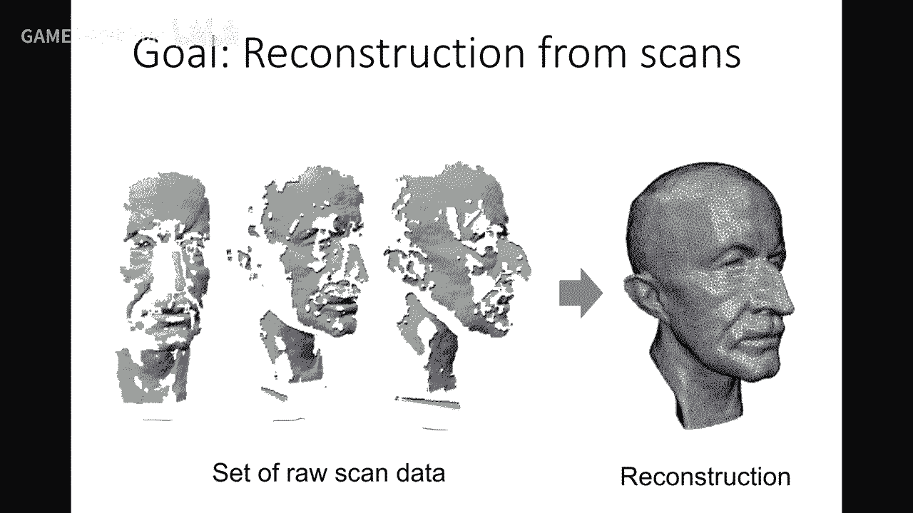

这个模型把它拼起来，变成一个完整模型，这个就叫做，就叫做这个Registration，叫注册，首先扫描本身就就是个体力活，就是虽然现在有很多拿机器人，来帮你扫描，就是为一个物体。

你怎么去扫不同的这个角度，这个，以至于能够完整的把这个物体，给扫描出来。

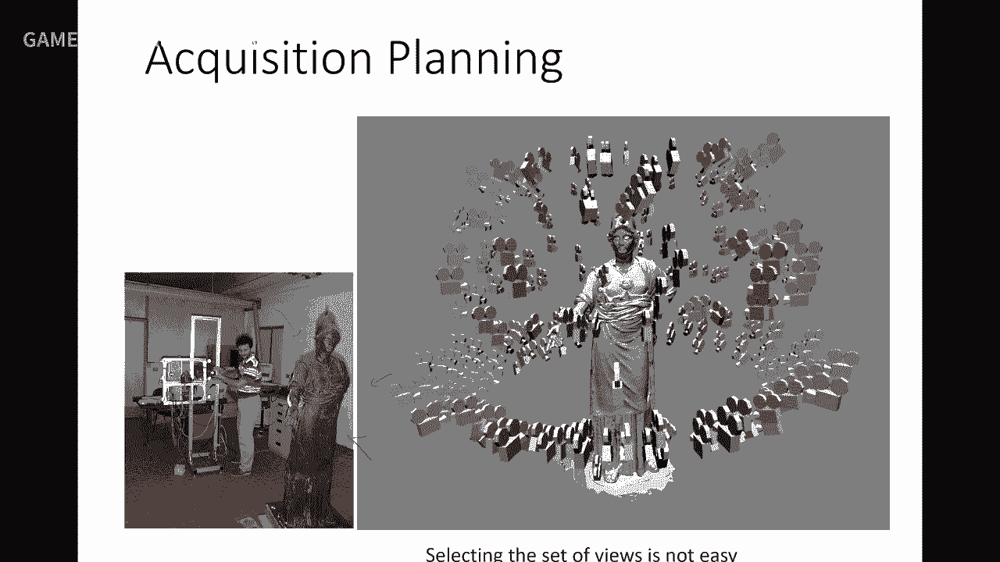

这个叫这个Planning，这个Planning呢就是有一个问题，叫NBV，Next Best View，就是我扫了这个物体，这个侧面以后，我下个视点再拿扫是比较合算，能够最大化我。

对这个物体的这个这个感知，是吧所以这是一个非常好的一个研究课题，最近几年也有一些文章在做，好我们先不谈那个，好假设我从两个两个视角，V1扫了一片，V2扫了一片，你把它放在一块就叫注册。

注册是个什么问题呢，事实上是这个问题很简单，是个什么问题呢，好假设这个X扫的坐标有了，Y扫的坐标有了，我是不是要求一个变换，使得我这个X变换之后呢，跟Y呢要吻合在一块，是吧那么这个变换到底是什么变换呢。

假设这个物体是不动的，是不是这个变换就是一个什么，就是个钢铁变换，旋转加平移就行了，所以这个变换的变量就是一个R和T，是吧一个旋转一个平移，就可以去求出来，那么具体怎么求它，这是另外一个问题。

好我们来看，那么这个问题呢，上次可以看的是个能量计较问题，就是我怎么样让X和Y这个这个，把它align，把它这个放在一块是最好呢，所以变量就是什么，变量就是这个变换，这变化apply在X上面。

要让跟Y最就吻合，所以这里面如果你要对这个，物体来进行建模的话，你这里就有就有不同的这个建模的方式，一般来说就有两项，一项是叫做match，就是这个就是匹配的这个误差，X和Y公共点一定要匹配出来。

第二个就是，如果你还有一些更好的知识，就叫prior，叫先见知识，在这样的话呢就让这个解更好，好我们大概很快过一下，那么如果是个刚性物体的话，你可以看到这个X变到CX以后，量量和它Y相相等。

你可能中间有一些公共点，你要你要引导我这个T，这个去求解是吧，那么这个求解呢，比较方便比较简单的就是这样，假设我已知知道一些GI跟那个对应关系，是吧，我使得我变换后的这个J，跟这个变换后的这个J。

跟我这个X上的这样，就是这个这个变换后的X，这样子点，要他们的距离平方和最小，我是不是这个就必是是必，就是最吻合的，是吧，好那么这里就一个，非常简单的一个一个formulation了。

我求一个旋转加一个平移，因为假设物体是不动的，这个是叫刚性物体，那么我去求一个最好的R和T，使得他们中间有些对应点呢，要尽量的相近就可以了，那么具体这个对应点怎么找，那是另外一个问题。

比如说你可以跟刚才一样的，用图像的一些局部信息呀，或者点阅的局部信息去找对应关系，因为因为X1对J1，X2对J2，那么我希望这个这个对应关系的点，要保持距离要平方和最小，就可以求出来。

当然如果一些物体是叫elastic，叫那个弹性的，如果发生少量的变形，那么这时候呢，这个这个变形的这个尺度呢，我容许他的这个相对边长不变，这是个简单一个弹性的一个这个度量。

当然你说还有一些是这个分段刚性的，就中间就就这里就多了个Sigma，就是这一段跟这段相近，这段跟这段相近，就是分段刚性嘛，所以你可以自然而然就把这个能量改一下就行了，所以说不同的对象。

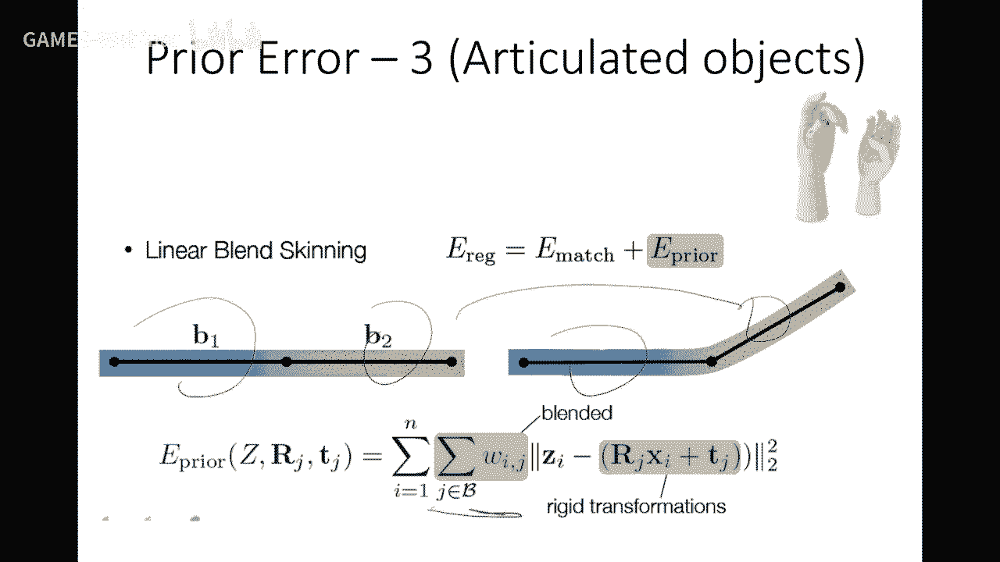

那么你这个能量可以进行，跟你的问题进行不同的更改，那么最有名的一个方法就叫ICP，ICP呢就是一个迭代方法，就像那个索叶8里面的这个RED算法，它怎么呢，就是我有个对应关系，我就可以求出个t这个变换。

求完变换以后，我又可以找对应点关系，然后又去再去优化这个t，所以不断去迭代，就像这个求文外图的那个，就是CVT的那个RED算法，我求完一个以后，我求中心，中心以后我再求文外图，这个原理是一样的。

ICP非常简单，这90年代就就已经有了。

到现在有非常多的变种，所以这里呢又还有一些这个怎么样快速是有效啊，以及这些全怎么去取啊，还有没有一些这个避免错误的对应点，对我这个优化的干扰等等，还有好多问题啊，我这里不展开。

这个loop closure刚才我提到过啊，就是你转一圈以后这个这个接不上了啊，就是你这里这么多针，我这个MR跟M1相相吻合，M3跟MR，到最后MN跟M1呢，中间就可能出现一个巨大的裂缝。

因为这个是误差是它会传导的，它到不是传导，它会积累的，就是到这里以后呢，它就误差可能就会比较大，这时候要通过一个全局优化啊，我这里就不展开啊，那么下面这个图呢，表示你在做的时候呢。

也可以用一些图像的信息来做对应关系。

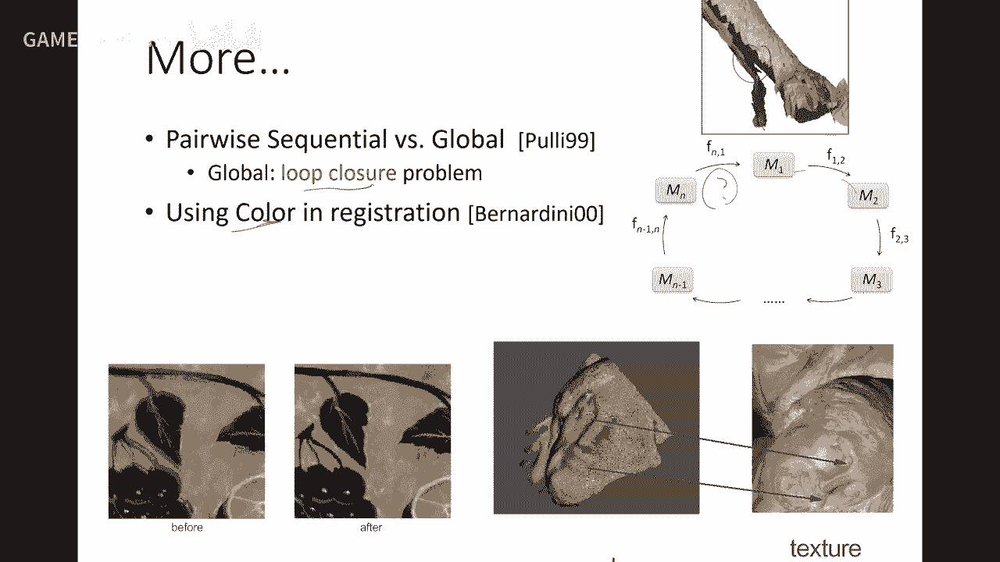

会更精准一点，这个显然吗啊，好，那么下面一个就是叫consolidation。

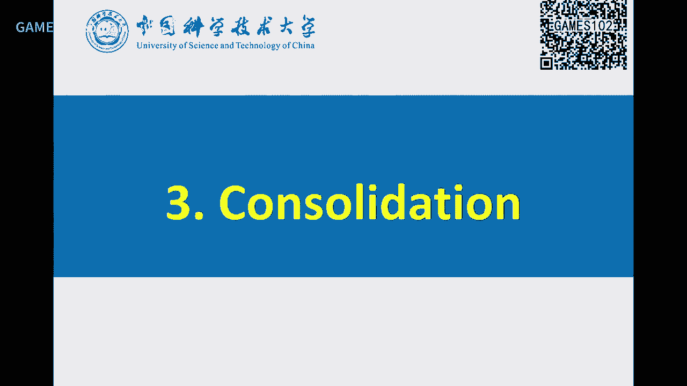

是在这一步，consolidation是干嘛呢，你这个点虽然这个集成在一块了，这个点呢，但是还是有很多问题啊，比如说这个点呢有噪声，还有这个outlier，outlier是什么，表示有理点。

就是它偏移这个曲面比较多了，这个是有可能是对应点关系找错了，或者是重建计算的时候，误差，以及这个设备本身出问题啊，还有好多这种missing parts，就是这个空洞。

因为你这个物体总会有物体这个在背后啊，就是扫描扫描不到就出现这这这种空洞啊，像这种空洞是吧，还有这个采样率啊，这个不均匀，有些地方密，有些地方稀，有些地方啊，这个这个甚至没有就是missing啊。

所以你这个数据呢是不完美的，不完美的话，你到后面去做重建的时候呢，就会带来很多问题，所以呢，一般的这个流程会在重建之前呢，会对数据进行一个前处理，这个前处理过程就叫consolidation。

就是对数据进行一些优化啊，这个好，那么这个consolidation意思就是，哎，我得到一个稍微质量好一点的这个点云，那么这个点云再去做后面重建呢，重建算法就能够work，如果这个点实在是很烂。

你这个后面怎么样的算法都不work啊，所以怎么样去在前面就做一些前处理啊，就是能够保证这个点的质量尽量高，好，那我们看一下有哪些啊，我们不详细讲啊，这个因为基础课，我们不深入展开所有的技术，好。

你比如说可以看到啊，这个这个去噪啊，去除outlier，还有还有什么重建项啊，我们我们来看一下啊，那么事实上挑战挺大的，就是有些时候呢，这个地方的点呢，他不是不是一个流行，他这个有个厚度啊。

叫sync cloud，你怎么样去掉一些多余点啊，因为你想，如果你不是流行，你这重建过程中，你是很多点一坨在在这里面，就他就不是个流行结构，他这个重建后面的算法，怎么做都做不好啊，还有什么。

还有采样这边西啊，这边密啊，不均匀，还有什么，还有特别是对于这种比较靠近的这个点啊，这个往往突破关系很容易产生错误啊，能不能在这里面进行一些预判啊，还有这种尖锐特征啊。

像这个这个sharp future啊等等。

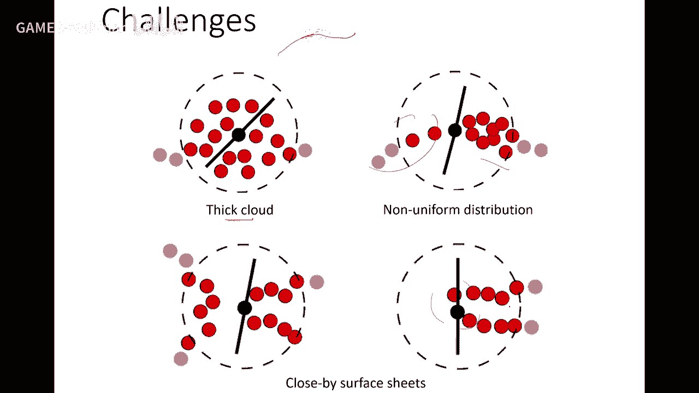

那么这个怎么去去除outlier，有不有有很还是有不少文章去去做啊，这是我们13年一篇文章的一个截图，就是一个室外的一个啊，来打数据啊，你可以看到啊，上面有好多这种妈妈三三的一些些细点啊。

通过这个outlier就把它去除掉了，然后再再通过去照就可以把它这些脏的点把它去掉啊，这个你可以看到这个图就这点，这个图就可以看到啊，这个妈妈点点点就少了很多啊，后面做重建呢，就不会有太多干扰啊。

做这个outlier去除的文章还不少，大家有兴趣都可以看一下啊。

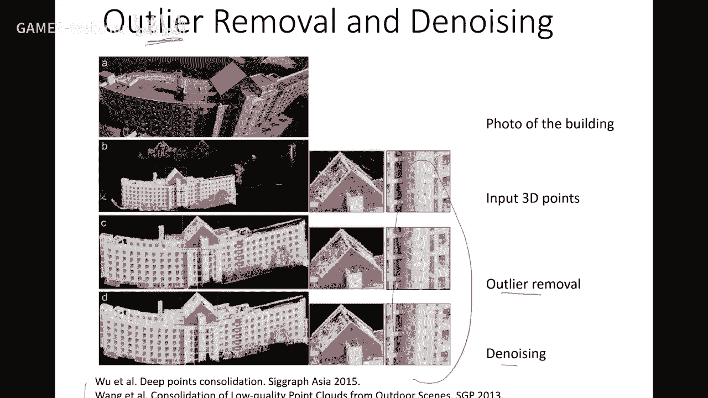

好，那么还有normal consistency，这个什么意思啊，就是你想一个曲面或者叫我们拿二维来说，如果你这这这是一个物体表面，你这那么应该是这个少朝外，这个应该是朝朝外的才对的吧，如果你是算出来。

不小心算出来某某个点，这个那么是朝朝内的，是不一致的，那么你最后面的这个重建，我们前面讲过影视曲面方法，normal很重要，normal怎么定义了内外，如果你内外这里是一矛盾的话。

你重建重新重新肯定是有问题，是吧，所以这个normal你怎么能保证啊，这个这个都是一一致朝向一致，并且这个是做做都朝朝朝下啊，这个就是可以通过预先处理，把这个normal给他变成一致化啊。

有利于后面做重建，那么这个normal这个一致化的话，一个比较简单的方法就是，哎，我假设有个地方的normal我非常自信，所以我就通过他的传播，一步步传传过去是吧，如果夹角小于90度。

表示normal是还是一致的，啊，难就难在这个这个非常尖锐的特征上面，好吧，这里有也有不少文章在做这个事情啊，就怎么样让normal啊保证一致定向啊，否则的话他就不可定向的话，就是非流行就重建出来的。

这个结果就会可能会就会很烂啊，好，那么还这个下面就是resampling，叫叫这个重重新采样，就是有些地方吸有些地方密，那么怎么样让这个点啊，在曲面上进行一些移动，那然后然后让这个点的分布尽量好啊。

后面重建的时候我们还会提，就是如果你是sample不均匀的时候呢，很多重新算法就失效啊，就是怎么样去去进行一些这个点的一些重新分布啊，那分布呢又不能偏移这个曲面，所以这里面也是一个啊，比较要破的问题啊。

那么，这边一篇sigma h09年文章，大家可以去看一下，从从这一文章就可以看到console，进行的一些进展好吧，不仅他们引用的，而且是最近几年引用他们的都会找得到，好，那么这些这也是一篇这个13年。

talk文章就是怎么样，这文章思想也挺有意思，就是他为了保持这个edge edge边界，就是这个特征点，他呢是在非特征的地方呢，这个这个法项的这个采样或者法项传播，那么到，这个特征的地方呢。

再进行特殊处理，因为因为这些地方这个传播也好，还是采样也好啊，这个是比较稳定的，不会出问题，出问题就在这些这个尖锐特征上面，所以他是分两步，第一步对光滑的地方进行一些重采样，以及法项的重定向。

然后在这里面的话再进行一个策略，这策略呢是两边，如果特征的两边同时都往这个地方去采样，好，这就是3D的一个示意图，刚才是2D，这是3D可以看到这个你可以看到就第一步，他对非脚点的地方可以采样。

所以中间是一些缝，就是这个地方没处理，在后面再慢慢再往中间处理，就会形成保证一个非常尖锐的特征，所以他这个叫edge aware。

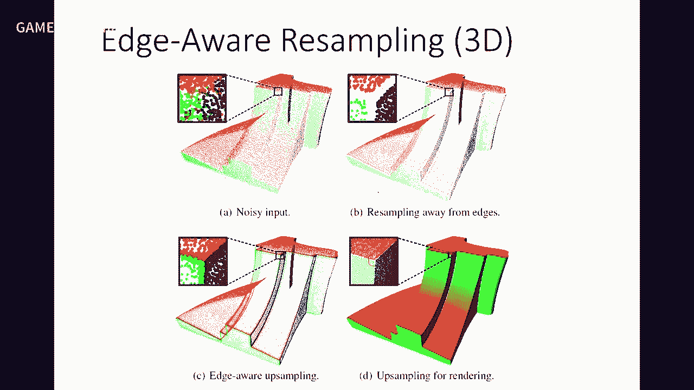

就是变敏感的，还有一些数据，由于质量关系产生一些空洞，怎么样把它补齐，补齐以后的话，这个后面重建就会好，是吧，这个后面我还会提一下，那补齐也不同方法，是吧，你可以看到这个这个补齐方法比较简单。

这个补齐方法呢是相对好一点，你看到这个补齐太光滑了，是吧，一看就知道可能就是用简单的拉布拉斯，smoothing进行那个这个这个这个填充，是吧，那么这个呢就就利用了周边的一些关系，周边的一些信息。

可以把这个游戏把它填填进来，有点像文理文理合成的这个思想，好，好，第四部分就是这个，那么如果点这个就注册好了。

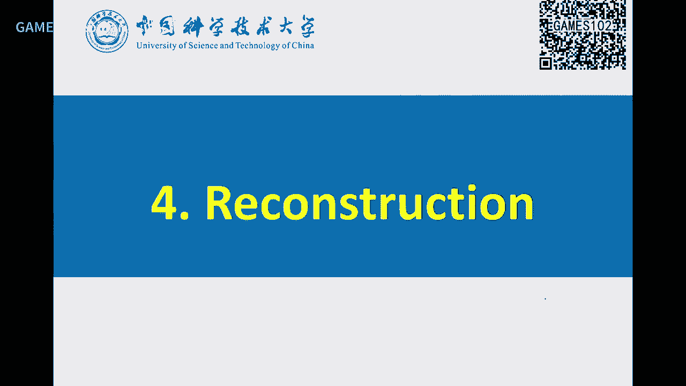

也做了一些预处理，把这个一些脏的点把它删掉了，那么下面就要把它重建出网格出来，是吧，所以网格出来我把它变成一个，把先把这个问题讲明白，问题就是好，我已知一些点，这是一些3D点，好，我怎么样变成一张曲面。

好，这些面可以是连续的用那么说表达，也可以是离散的，我就是三项网格，可以吧，反正你只要是一个流行给给我，那么就这个重建的任务就完成了，所以input就是这些点，这点指示地点。

稀稀拉拉分布在这个阿维流行上面，你要去重建出这个曲面，是吧，实际上是继续学习，学习上就是对高位点来做这事情而已，你这个重建的好，你中间一个空档地方预测就会准，是吧，预测就是在做这个，学习后的一个判定。

好，那我们看，但重建这个问题上是做了很多年，还是没有做得很完美，因为它有好多性质需要我们保持，比如说脱不性，还有这种这个这个有效性啊，还是正确性啊，等等，你可以看到这个图。

这个图呢就在重建中经常会出现问题，就这些点假设不告诉你是怎么连，你有可能这样连，左边的连成一个物体，也可能什么连成两部分，对道理，是吧，但这个是本来就有歧义，如果你没有更多信息给到我们的话。

我们这两个是两个呢，是没法区分的，是吧，所以这就导致了很多时候呢，我们连着一些这个脱不关系就会出错，啊，这个呢，也是以前我们提到过的CD软件，为什么这么难，就是这里面在求交啊，包括这些采样的时候呢。

就脱不关系，你当时维护错了，就导致后面灾难性的一切错误，那么那么这个重建里面也是同样有这种问题，好，那么重建这个呢，我把它分成了两大类方法，那么一大类叫逼近法，另外一大类叫离散法。

我分别把这个事项讲一讲，具体展开可能今天来不及，PPT东西很多很多。

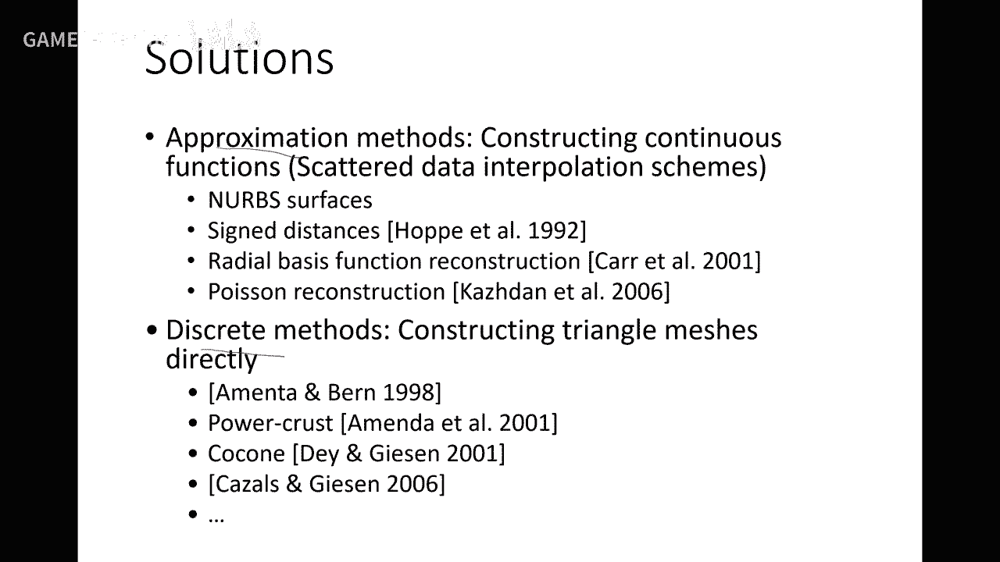

好，那么我们先讲这个approximation，就是逼近法，逼近法嘛，最简单就是我以前就讲过了，就是我中间给了一些点，我怎么样构造一些，先把这个曲面进行分片，每一片呢就是个逼量条，我会叫北辙曲面，是吧。

那北辙跟北辙之间有一些光方法性，对吧，来脚点处像这个脚点处有12345片，那么这五片也要要C2连续，这里三片，那么那么这些地方呢就相对来说连续性比较好控制，是吧，就用这个边。

北辙曲面的控制点点也可以表达，所以呢，你用北辙，这种函数去逼近这个点就行了。

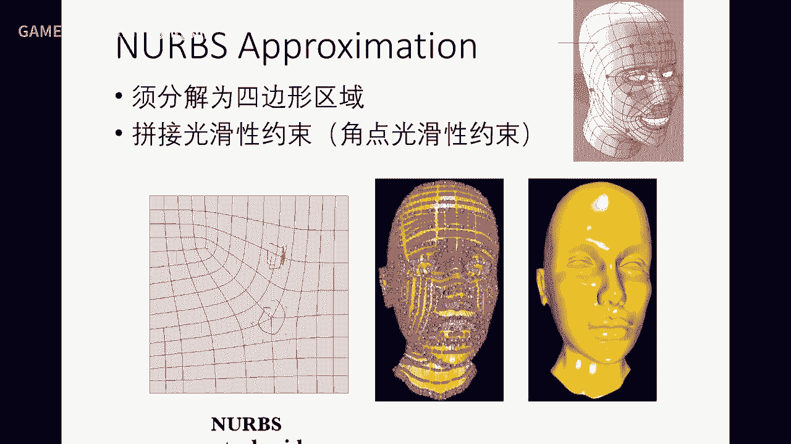

是吧，当然你说这个那么是比较比较点比较多，你也可以用天条来去表达，天条就就点点数比较少一点，这就是我们上半这个内容的一些课，就是用连续函数去逼近点云。

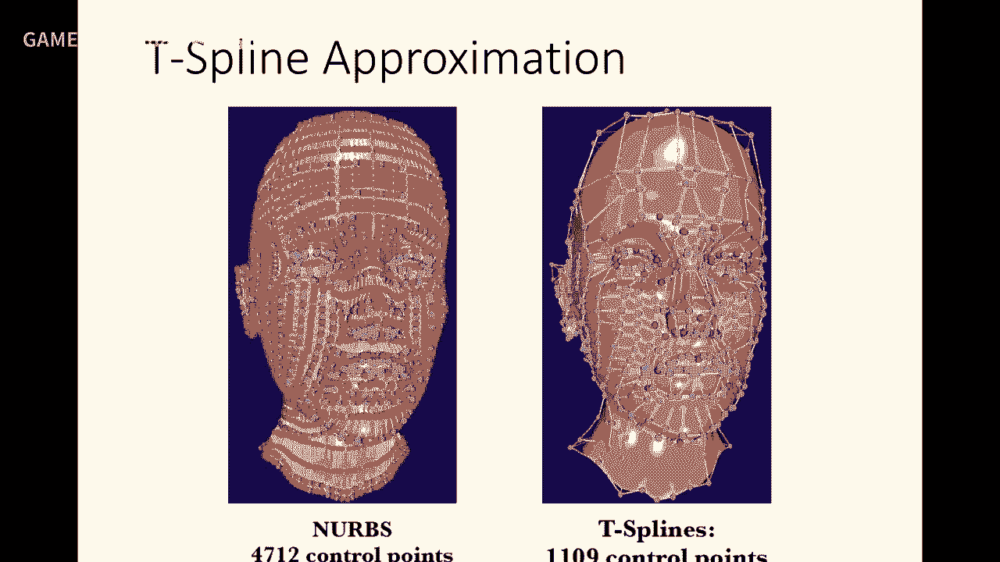

就是拟核嘛，好，那么呢，更多的是这个一些方法的是用隐含数来逼近，你还是逼近呢，我们在这个第九个PPT里面，就是我们以前讲过的啊，就是我们构造一个隐含数，这个隐含数是什么，是一个高位隐含数。

那么在二位中是构造三位，那么我们在三位空间点云的是构造四位一个隐含数，使得这个函数的0整值面就是这些点所经过的，这个能够经过这些点，就是这个is value是0，就是0整值面，最后呢，把代码的出去出来。

好，那么我们这个思想就一下就听懂了，对吧，好，我们来看一下，那么，一般来说就是这个这个对一个点，我如果求的法项，我我法项外求一个点，法项内求点，假设这个这个点值是1，这个点是负1，这个点是0。

是不是一个点就产生了三个点，就在空间中就有三个点的函数值了，1 0负1是吧，所以一般n个点的话就能产生三个点，就就三个点这样一个在空间中就这样一个值。

这样我只要叉值出一个三位空间这个点的一个一个一个函数，上去就有四位函数，这时候呢，我当着0整值面抽出来，就是这个形状本身，是吧，好，那么这里呢，就是画了画了个图，有可能呢，你如果碰到这种情况。

你如果你这个点定义成这个式外面，就可能产生错误，对吧，就可能产生这样一些问题，还有些什么法项错了，也会产生问题，所以基于影视方法的这些方法，这些这个这些方法，基于影视函数的方法，法项是非常非常重要。

你怎么样产生这些点也很重要，是吧，好，那么一般的话，我们就不用这个1负1，是用什么，是用它的距离，所以这个叫做距离场，那么在外面是叫正，里面叫负，所以叫符号距离场，所以你们大量的看到SDF。

就是就是指这个东西，好，那么这这次可视化，就是绿色点是这个原始输入点，那么红色点是外面的这个这个这个偏移的，那么蓝色的是里面的，就是这个三层点放在一块，稍微看得有点不是特别清楚。

但你可以看到他们是三层的点，好，有了点以后，你就就是什么，这个以前那个课上我们也讲过，是吧，就有一个这样的距离场，那么距离场的时候，你就可以重建出一个函数，那么重建函数呢，大家就以前都清楚。

那么你要去拟合一个函，这个空间的函数，你可能要选一个函数形式嘛，就RBF这个继函数，这个我以前我们讲过的，同学们做过了，然后你这个继函数可以采用高斯，也可以采用不同的这种继函数。

这个继函数RBF继函数呢，不一定一定要高斯，只要是像这个帽子一样的，这个这个，往下凹就行了，甚至可以还凹两次都没问题，因为它都是一个线性无关继函数，可以张成很大的空间，你就可以去拟合，所以你这个n很大。

就继函数放哪，n很大，它的表达能力就会很强，具体怎么放，放在哪，这是另外一个问题，那么这样的话呢，你设了若干个继函数，在某XI中设了继函数，你就构成一个函数空间，你就可以去拟合那些点云，最后。

让那些我们的点，带到这里来变成0，因为等于0嘛，就是这个0整值面，曲面外面的点带进来等于1，里面的点带进来等于1，就构成一个非常大型的方程组，就把它平整化以后，就变成这个样子，就这样一个样子。

就是这些带定的系数，就是那个全，这些就是那些值，那么这个矩阵呢，是一个非系数的，是一个绸密的，但是它是对称并且正定，所以一定是有解的，只不过这个规模很大，是n乘，这个n就是你，所放的基函数的那些个数。

有时候呢，我们也会在后面，加一个光化能量，使这个基函数呢，相当之什么，让它有更多的条件，更光化一点，甚至可以加一些多样式，像在后面，这些RBF基函数的一些性质，最后都是在解一个方程组了。

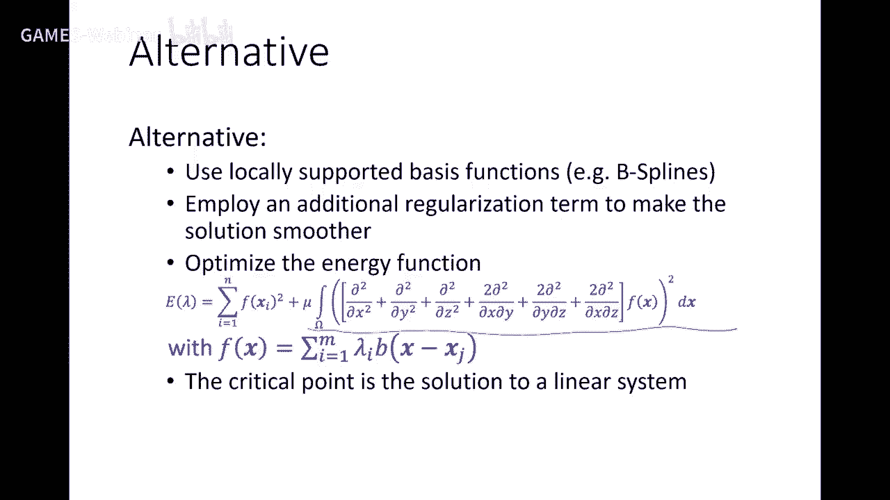

然后，然后这里呢，这个是我解释一下，这就是基函数用了多少，这个呢，是可能用的基函数不够多，所以你可以看到，拟合就不好，因为基函数少了嘛，它的拟合能力就小，所以你可以看到，它抽出0等值面就比较差。

这里是选择好的基函数，那么一个比较简单的，选择基函数的方法就是，我随机在这些点里面，选n个点，选n个点作为基函数机的原点，去构造基函数，也可以，像这个基函数选的少，就表达能力弱，基函数选的多。

就表达能力强，是吧，但是如果基函数再多呢，有可能就过拟合了，是吧，这个跟神经网络的，这个一样的道理，所以神经网络，就是基函数的个数嘛。

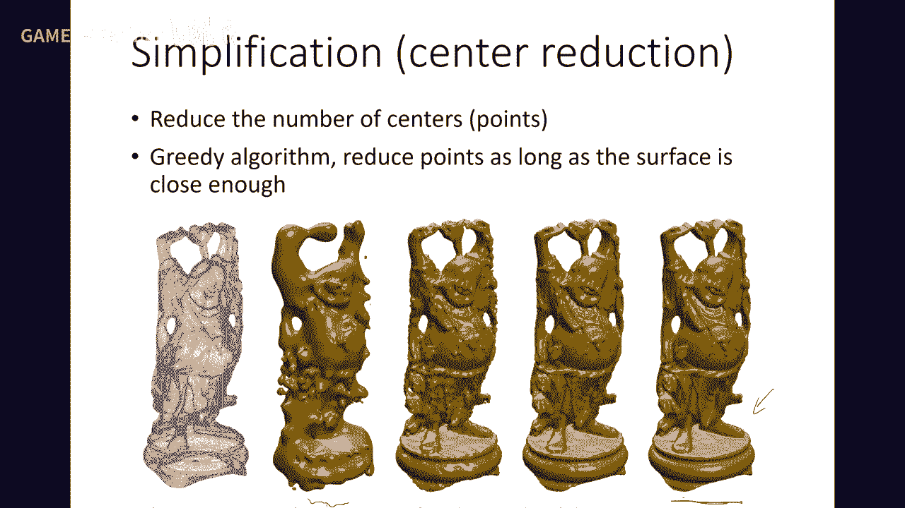

好，那么这个算法呢，这复杂度还是挺高的，有nOn平方，就是，那还有这些，那么西瓜2001年这篇文章，大家去看一下，他就是用RBF去做这个重建，就刚才讲的方法，他呢就是有些技巧就让存储，大量减少了。

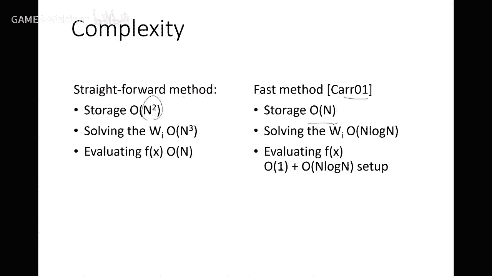

不用存On平方的，只要存On，那么，前面刚才讲过，如果你normal错的话，这个重建就非常差，像这里都是出现了一些，normal错的地方，你可以看到，重建出来的效果非常非常差，这里多了个球。

这里多了一个骨包，是吧，像这里就错了，对吧，这个才是正确结果，所以，所以这种隐含数的方法重建，对这个normal，对这个法项是，是非常非常敏感的，也非常重要。

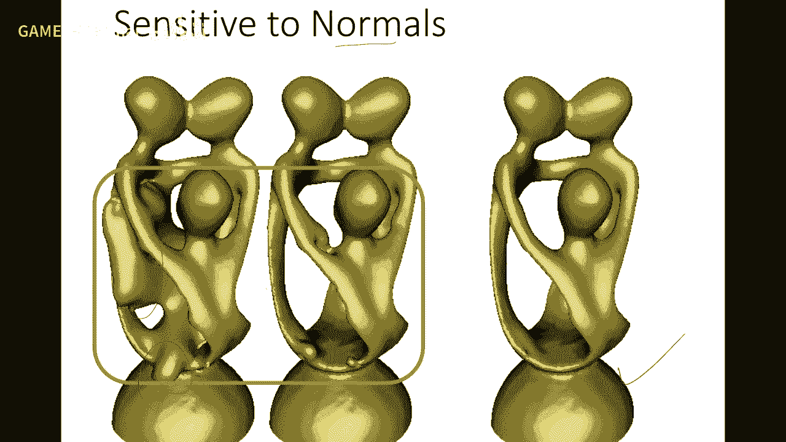

所以法项必须求对，你这个这种方法才能够做得很好，那么这个是2003年一篇siggraph，叫NPU，这个呢，就是一个基本思想，就是，他根据这个，这个距离场，来自使用的来进行破分，离这个越近，这个点。

就是，产量点就会越多一点，然后，然后能保证这个重建的精度会越高，具体的思想就这样，我就不展开，时间已经比较晚了，好，那么这是NPU，大家如果有兴趣，可以看一下这个文章，好，那么，另外一个比较重要的文章。

我要介绍一下，是06年的一篇文章，这个叫破送重建，破送重建呢，事实上他也是在fitting一个indicator，就是叫一个指示函数，里面是1，里面是0，外面，里面是，里面是1，外面是0。

但是他又把这个t2，给他，给他，也去逼近他，像这个t2，就是只有边界的t2是fitting，里面因为全是1嘛，就是t2都是0，外面t2也是0，所以他不仅逼近了这个函数，而且还逼近了这个t2本身，是吧。

所以我们以前接触过，这个这个，实际上是通过一个变分，很容易知道，你你如果一个t2也进行一个差值的话，变分一次的话，就变成一个这个普通方程，普通方程是什么，普通方程是一个两阶变方程。

所以你只要在这个定义上去求解这个方程，就可以了，就把这个重建问题，变成了一个普通方程，去求解这个隐含数的问题，好，那么任何一个隐含数方法，我刚才讲的RBF也好，MPU也好，他求出来都是隐含数。

跟用第一种这个NURBS不一样，NURBS是直接是个显含数，就逼近嘛，那么那么234呢，都是隐含数，那么隐含数就必须要什么，你要把这个上面的点给找到，就要用marking cube方法去找，是吧。

然后我们以前讲过marking cube，我就不展开，那么二维中，以前讲过的思路对吧，这个这个，这个great，这个一正一负，有一定有零点，这个这个两个正就没有，是吧，那么对空间中的话就情况多一点嘛。

因为是他有一个体数有八个点，那么这八个点正负正负的关系，就不同的关系，我把这全部列举出来，总共有15种关系，你就可以去抽，抽出这个这个网格出来，当然这里有好多问题啊，这个这个marking cube。

这篇文章是很很很经典的，这个应该是，87年是挂过的啊，之后有好多好多改进，并且网上有好多代码啊，你们大家不用自己去重新写，网上有很多代码可以参考，好那我们再再讲一讲，那个离散方法，discrete方法。

你这方法的思路呢，怎么他不需求函数，你像像这个是求一个显示函数，啊这这这三个都是在求隐隐函数，是吧，这个不管有函数的话，你求他以后，你还得把他离散在三项网格，你才能渲染，对吧，但是函数呢，表达有个好处。

他比较光滑，好，还有一种方法呢，就是什么，我不去求函数，我直接根据这个点去去点，好，比如说我采样点就就就这些，我把它连起来，构成对平面来讲连这个线，这个这个折线就就就是曲线了嘛，是吧，对空间来讲。

我把这些点跟点连连成啊，这个面三角片就构成了网格了，是吧，就是他去把这个点给这个直接连起来，构成这个曲面，好，我们先先讲上面之前，先把二维讲这个做个示范，比如说这里啊，有一些点，我具体这些点怎么连啊。

是这样连吗，还是有别的连法呢，就你可以看到，你我呃，有好多种不同连法是吧，那么哪个连连这个线的方法，比如我随便连一条，我这样连这样连过来过来过来过来过来，是不是一个连法，但是显然这个连法。

我没有很好的性质是吧，这个不好的性质，那么我们来再问怎么样度量，这个连接方法连接的这个关系是好的，我们要有个度量，这个好的度量有了，我们就可以来正确一步步去去去连这个连线，然后来重建这些曲线，好。

那么这里一个比较重要的一个一个策略呢，是跟我们做三角画一样的，就是用这个Denali，或者叫文外图来进行判断啊，这个这个有好的性质，我稍微提一下，那么文外图呢，以前讲的时候呢，有些课讲过是吧。

我这里再补充一个知识，就是这个中轴，一个形状的中轴是什么呢，就是这个黑色是形状，红的是他的中轴，中轴是什么，中轴是那些，如果是二维的话，那些与他有两个密切，切线圆的圆形的集合，像这个点啊。

就离他的两两两个边是有两个最近的点啊，这两点是只有两两个，所有这些点的集合就叫中轴，我们举例啊，比如说一个矩形中轴，大家想看啊，那么从从这做法，他是应该是他的平分平分线，对吧，从从这里的平分线。

那么那么那么中间一条连线，所以中轴是是是这样，12345中间这个啊，所以这些再问一下，圆的圆的中轴呢，圆中轴就中就差的圆形就就一个点啊，好，这是比较简单的几个形状的中轴，那么对于一般形状中轴呢。

是是这样，好，那么中轴要求的话，实际上是一个比较复杂的数学操作，那么历史上呢，大家发现，我可以用VD文乐图的啊，这个这个这个来逼近这个中轴啊，所以如果你对这个中轴不需要太高精度。

我可以用VD文乐图来做这个近视，那么这里要讲的话，理论还是有一点，我这里稍微展开一点，就是说这个这个这个有一个采样率的问题，就是你要有个性质啊，就是你要这个地理成立的话，要什么要这个信号要足够的密。

就是采样率要达到一定条件，怎么什么条件呢，有个比较简单条件，就叫叫这个叫R sample，怎么意思呢，就这一点呢，我画一个半径VR的圆，那么中间呢，就一定会有这个采样上的点在里面，满足这个性质呢。

就叫一个好的柔的采样，什么意思呢，就说明这里不能空太多，你空太多的话，这个性质就传不过去，你这个计算中轴也好，这个连连线的好，就会产生误差，为什么他会连到别的地方去啊，所以你这些这些理论方法的话。

要假设这个采样足够密，这是一个非常重要的一个要求，如果因为不利用不是很密的话，他就会就就为什么连错啊，好那么这个是这个想法，这个算法我就简单讲一讲啊，就是好，这个是给定的点云啊，假设是P。

我把这个点云P呢，做一个文外图，是不是就有中轴上的那些点点点出来了，是吧，我把这些点啊，跟这些红点加到中轴上的点，加文的中轴上点，一起作为一个点，再做一遍文的图，那么那些出现在。

出现在那个这个这个就是外接源，只有两个点的地方呢，那个那个点呢，就成为这个重建的那些边，这个算法非常简单啊，这道三维也一样，只不过三维稍微要复杂一点啊，所以他算法很简单，首先算这个输入点的这个文的图。

然后呢，把这个这个这个文的图的这个顶点，跟S呢并起来，变成一个新兴的点击，再去做顶道的三眼副分，然后呢，位于那些顶道的三眼副分的边，就是这个曲线本身，就是你看到就这些黑的，这个线就连起来了。

那么这个是有理论保证的啊，理论保证是，但是理论保证什么，要满足刚才那个S sample，所以呢这里面有一个，很重要的要求，就是你的产量要尽量的密，你如果不密的话，这个理论就失效了啊。

就是重建出来就未必是你这个理论上的这个曲面啊，好就就这个啊，如果太大就会失效啊，这是最显然，因为你看这里面像像这里有个极端点，像这个地方就就没有采用点，他就连不过去了，是吧，你即使知道他是封闭的。

你也不知道他怎么连，那么3D的这个class算法呢，就是2D刚才一个推广啊，我这里就不展开啊，这个一展开时间还是有点多，我就留给大家去学习，反正这篇文章是发表c c官1998年啊。

就是就根据刚才那个二位的这个一个推广，只不过他三位中有点特殊，他他要有个最远的极点跟最近几点两个概念啊，我这里不展开。

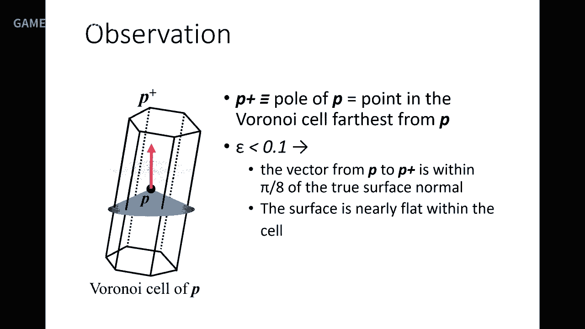

大家看文章，如果你要用的话，大家再再再来再来看啊。

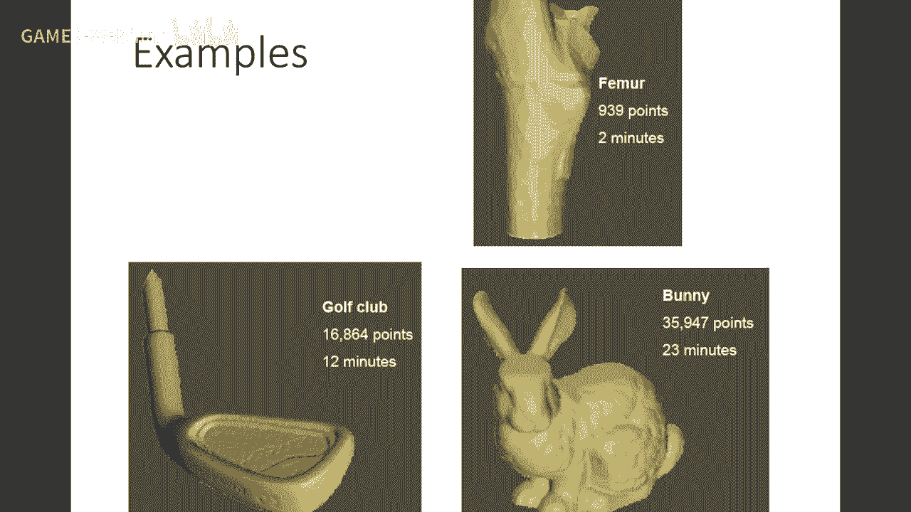

这是当年98年的时候重建的一些一些这个这个这个算法啊，好，嗯，但是算法比较慢啊，因为因为他要不断的去去求能文来图吧，一个顶端参与部分，好，那么这个刚才那个叫class算法，那么后面有好多改进。

是什么什么空算法呀，扣空啊，还有这个power cluster，就这个这个这个就是class上的一个改进啊，当年早年20年前有很多这种文章啊，并且每一文章里面都有一些理论上的保证，但是但是保证的是吗。

最要有条件就是sample一定要足够密啊，但是我们想想那个平时正在应用中哪哪有这么好的分布，这么密的这个产量点给你啊，是吧，所以这些文章呢，理论上很漂亮，但是实用上还是会存在的很大的问题，好。

那么这是这太空空太空空是空空的一个一个改进啊，也是比较早年的一个方法，好，我这边就不展开，好，那么我这里再介绍几几种啊，这个最新的一些方法，这个是这是我们14年CY微学一篇文章，基于这点学习一个方法。

这个方法呢，就是跟两个方法都不一样啊，你可以看到我既不是拟合一个曲面，也不是拿原来的点去去做上下网格，我是什么，我是在就是这些蓝色点是输入的点啊，我是重新采了一些点，然后用这些点。

这些红点构成的上下网格去逼近这些点，你看我我这些我构造出来网格的点啊，不是原来的点点之一啊，只是是重新采的采了一些点，但是我能保证这个网格能逼近你更好啊，那么这个想法比较强调的地方在于什么呢。

就是我怎么找这些红点，这红点是未知数是吧，还有红点之间的连接关系也是未知的，但是我有个度量怎么呢，我希望所有蓝点到这些这个红点，所构成的这些绿三角形上面距离平方和要最小，对吧好。

那么这个距离是什么怎么距离呢，距离是上去一个点到三角形距离就是它到垂直距离，对吧，而这个垂直呢又是三个零点的一个先进组合，就中应坐标嘛，是吧，如果我把红点看成是个位置量，是不是表示这个红红点位置量。

那么这个组合只有三项是非0，是吧，所以这一个大矩阵啊，所以哎，这个这红点是一个未知数，然后每一行的组合系数只有三个是非0，有可能是两个，也可能是一个，如果在边上的话就是一个两个，那在0点就一个，好。

这样的话就把它变成一个什么，变成一个这样的问题，好，我对一个蓝点，啊，它是三有三个红点，以及这个三个新组合，那么这个矩阵是很大的一个矩阵，但是它只有每一列只有三个是非0，所以它是一个非常稀疏的矩阵。

就是它的那个临摹，小一点三，我们以前提到过临摹，临摹就是稀疏性，那么这样的话就把这个问题变成什么呢，这个点其实知道的，这个红点我是未知的，这个同一矩阵呢也是未知的，但是呢，我可以把它看成是个置点学习。

也就是说这里的点是这个置点的一个性组合，那么这里有两个变量一个位和b，那么如果两个变量要一起求解的话呢，很难是吧，我们用这个交替法去求解，就是所以把这样一个问题变成一个。

稀疏优化中的一个非常典型的置点学习问题，通过一个全局优化，因为我们的度量是一个全局无差，就是我们比如说你给定n等于1000，我怎么去找1000个点分布，使得这1000个红点构成的网格。

能够很好的毕竟我原来给定的这个点击，就变成一个这样一个非常，很巧妙的变成一个这样优化问题，就可以进行优化，优化模型就是一个交替迭代法，就是不断的去固定这个一个矩阵求另外一个矩阵。

然后固定另外一个矩阵再求另外一个这个这个这个矩阵，那么当时做的时候效果还是非常不错的，这个你可以看到这里不断迭代，这个上限越来越精细，而且这个方法与这个采样点噪声都不是很不是很敏感。

都能重建出比较好的一些结果，而且它对特征也能抓得很好，因为它是全局优化那些点的分布，所以这个点的分布在那些特征上面是最合算的，如果部分我们当时证明了，如果部分在那些特征点上。

它那个误差就会就会一下子变得很大，这是根据常见的一些这种方法来做比较，你看到这个一些细节就抓的还是不错的，好我这里不去展开，那么这个方法呢这个跟影视函数方法，还有跟显示方法都不一样。

因为它也不是拿原来的点来连，但是它也不是拿这个影函数去去去拟合，它更像这种方法，因为虽然我我不是拿原来点点连，我是重新采的点的连，它还是属于一种显示或者叫半显示方法，还有一些方法。

我这里讲一种比较比较比较比较典型的，这个是06年一篇Eurographics，这个想法的想法比较有意思，你说假设这个点云是一个封闭网格的点，我呢我里面放一个气球，我气球呢不断吹气。

这个气球是不是就会膨胀，膨胀的这个膨胀充满到边界时候呢，它不会膨胀出去吗，因为点把它挡牢了是吧，所以呢你这个膨胀不了的时候，就变成了这个曲面本身是吧，那么具体怎么膨胀呢，就是里面有一个影视距离场。

距离场大的地方就膨胀快，这个叫做deformable model，叫可变形物体，这个气球呢不断在变形，变形呢都是朝法向进行变形，这里有个动画我们看一下，那么这个是一个点云。

那么里面这个地方放了一个小气球，然后不断地把它吹吹它，在吹的过程中这个气球不断膨胀，注意哦这个气球在不同点它也可以合并，也可以不断地膨胀，也可以不断地合并，最后这个吹吹不动以后。

里面这个吹不动以后就变成这个模型本身，所以它这个就是一个演化模型，这是2006年Ulographics那篇文章，还没语义式，那么今年就是去年我一个本科生，就把这个方法推广了一下。

就是我们发现光靠里面一个球去膨胀，有的时候空洞很大的时候呢，它会出来是吧，所以我们改造了一下，我们不仅是里面一个球，我外面也包一个球，我里面的球呢不断膨胀，外面的球呢不断收缩。

想象一下外面有个球我不断去抽它的真空，它这个球往里演化，外面这个球呢不断吹气往外膨胀，当这两个球无限靠近，谁也动不了的时候，这个曲面就被我给找到了，就是这个内球和外球的两个缝隙，误差足够小的时候。

它们中间这个夹缝的这个中间曲面，就是我要的这个重建曲面，这个是刚才看到过的，这个你可以看到，它这个蓝色是里面的球，绿色是外面的球，这些红红点是这个给进点云，所以两个不断在，你演化一次我演化一次。

演化过程中始终保证，它们这个不能相互穿透，也不能被数据点给它穿透，再看一遍，这个红红的点是数据点，蓝色不能穿透红的，绿色点也不能穿透红的，对吧，里面的球在吹气，外面的球在抽气，就是在不断收缩。

那么当它们达到一定这个状态的时候呢，就这个曲面就出来了，那么这个方法呢，对这个大的空洞，这个效果会比这个单个球。

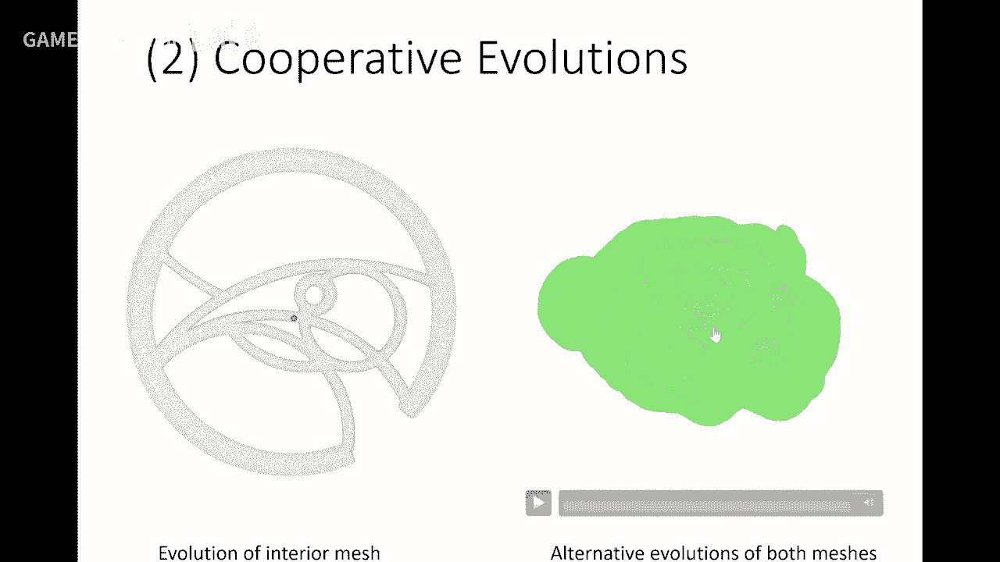

里面那个球的方法要好。

好最后时间很快，然后最后讲第五部分，这个Post Process，就是曲面重建出来以后呢，可能还有一些问题。

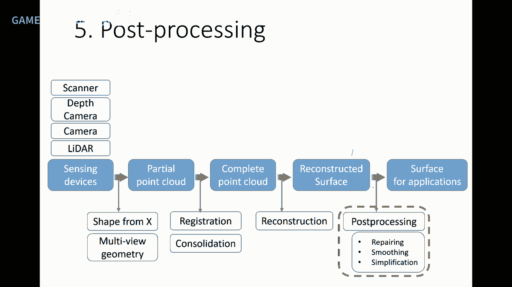

就可以做一些后处理，后处理，那么后处理有好多了，这个修复啊，去照啊，这个光光光顺啊，简化啊，那么这三个已经讲过了，是吧，那么修复什么意思呢，就是有些你重建完以后，发现还有一些空洞，我能不能把它修补一下。

今天稍微提一下这个，Repairing，Repairing也有可能，在有些文章里叫Completion，就是把它补全，Hole Filling，这个补洞，也叫Restoration，不同文章用不同的词。

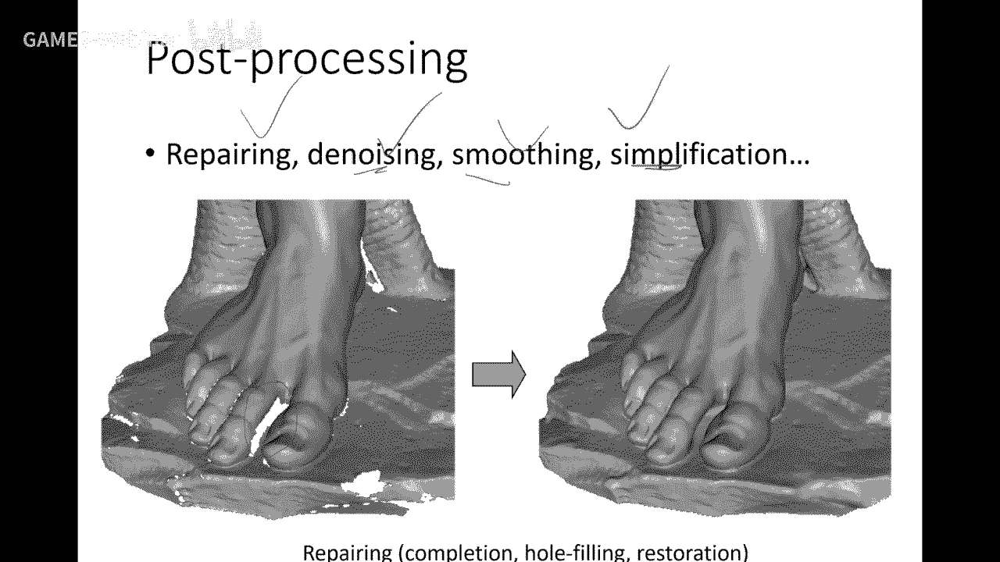

都是在这个对数据进行一些，完整性的修复，那么Denoising，Smoothing，Simplification，都已经讲过了，我们就不讲了，我们就今天稍微提一下，这个Repairing。

Repairing产生原因，可能就是什么，有些地方没没有扫到嘛，是吧，比如说我扫棉仪从这看，这个地方没扫到，就形成了一些空洞，是吧，由遮挡关系所造成的，比较多一点，那么你要去修复的话呢，在图像领域。

有个课题叫Impending，就是修复这个图像中的，缺少部分，比如像照片，我写了一些文字，这个文字被，这个照片被破坏了，我怎么样把它恢复到，原来的这个照片，像这些文字所站的这个区域，就是空洞。

这些空洞怎么修复掉，这个叫Impending，Impending在图像领域，实际上是也做了很多年，这个像一些油画的修复，这些折横丢掉的像素，怎么找回来是吧，那么你要去做这个问题，从数学上来讲。

就是个差值问题，你怎么样从周边的这个信息，差值出中间的信息，你差值是，你回一个什么函数呢，你是不是还可以，你回它的梯度呢，是吧，用Poson当然也可以，所以你可以从不同角度。

去formulate这样一个问题，所以你这里本质上，就是个差值问题，你是用一阶函数，就是一阶差值，还是用PD差值，这个去援引自己的建模，好，那么我们这个，本来图像这个imending，也有很多方法。

我们就不展开，我们就介绍几种比较典型的，网格的这个，这个补充方法，像这个方法比较简单，将就是找到找到这个歌风以后呢，找到编辑以后呢，就直接什么，做一个顶脑里三项三项化，然后再给他。

再给他refinement加密一下，就把它补充了，中间他好像也用用到一些，法项或者曲率的一些信息，我就不去展开，那么这个这个呢，这个是Cyber04年G-Tow的一篇文章，他这个是是中间能保证一些。

这种突破关系，我也不去展开，大家有兴趣可以看一下，那么这篇文章是，就是前面有张图，就是你看可以看到，如果这这这这是个空洞，这个空洞，如果你是简单的，这个这个叉子用方法函数，就这块就显得比较光滑。

就没有周边这样一些文理，加一些细节，如果这个做的比较好的话，你可以是利用的这个上下文，就周边的一些这个细节，可以把它传进来，那么他主要是用的方法，什么呢，就是把周边的一些，几个细节。

也把它学这个学习过来了，用叉子叫content aware，这篇文章是在C504年，这篇文章有点像文理，文理这个修复中的这个文理合成，就是通过旁边的一些信息，把这信息往里拷贝，这个这个这个过程。

好具体不去展开，这是修复了一个骨头，可以看到这个这个，如果简单修复，就是做的光溜溜的是吧，然后修复完以后，就可以保持一些特征的传播，以及这个细节，好，那个留给同学们，这个也是当时。

05年一篇example based，就是他的修复的思想呢，就是如果一个地方修复了，他能去数据库里面去找，跟他相似的，因为他别的地方是一致的，他可以去数据库里找一个相似的，那利用这个相似的这个地方的。

这个这个数据啊，来填充来修复这个缺失部分的数据，所以他叫example based，基于这个数据的，基于例案例的，有点跟现在学习有点相似的这个思想，只不过他是通过这个这个三维形状的匹配去去做。

具体三维形状怎么匹配啊，这个是我们放在下面两两节课会来讲，好，这里我也不展开啊，这些都是online匹配的工作，后面时间比较比较紧张，我就跳下去，啊，这篇文章是05年。

是利用了那个内部的一些信息来做做补动啊，这个就有点像尹寒说的，他把里面的信息拿来做，就可以对补动做的比较这个鲁邦一点，啊，这篇文章就是用纹理合成。

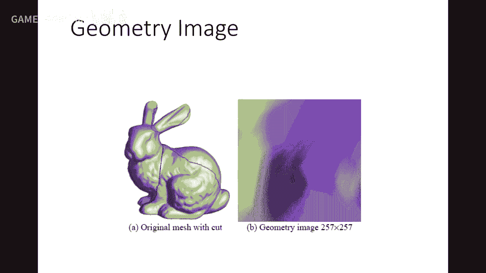

他把就是把把这个网格看作是参照化啊，然后呢参照化完以后呢，你就，网格就参照化完以后呢，就中间有一些空洞，那么他在图像空间中用纹理合成，把他这个像素给他用这些颜色给他填那个填填过去，填过去以后。

这个填完以后的话，把它回过来就就就形成了三位的这个空洞的一个填充啊，所以就把它转成一个二维的一个填充问题，就是把三位的imprinting变成二维的imprinting来做。

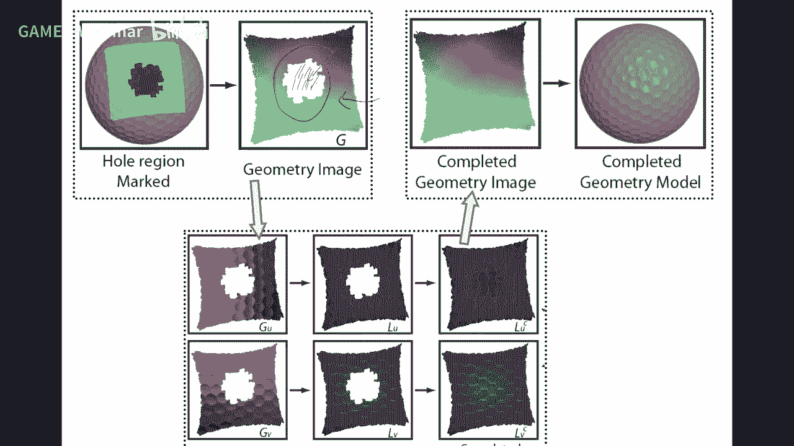

还有一些timeline based等等，这个这篇文章12年有一篇对这个match repelling，做做了一个perspective，就有点像中数的，大家如果有兴趣可以看一看啊，那么最近几年呢。

我也提一下，最近几年呢，做incompletion的文章也很多啊，包括CVPR，他们用很多学习方法啊，这个呃来做这个空洞的填充啊。

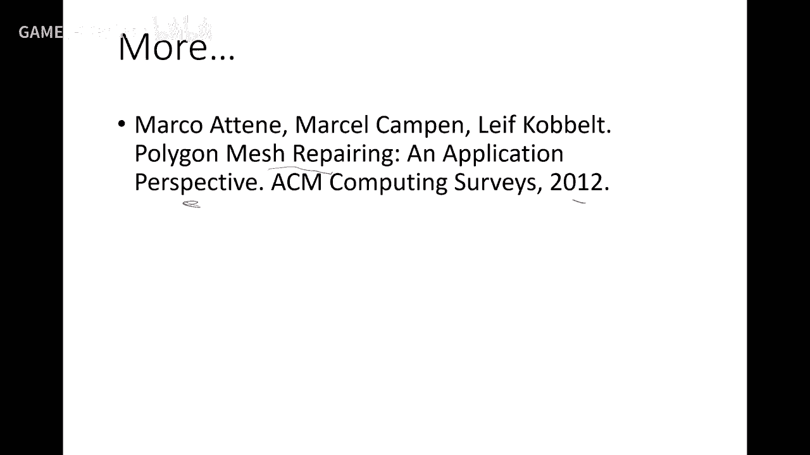

文章不少，我这里就也没提，好，最后还有一部分，我很快讲完哈，这个今天稍微延延个时间。

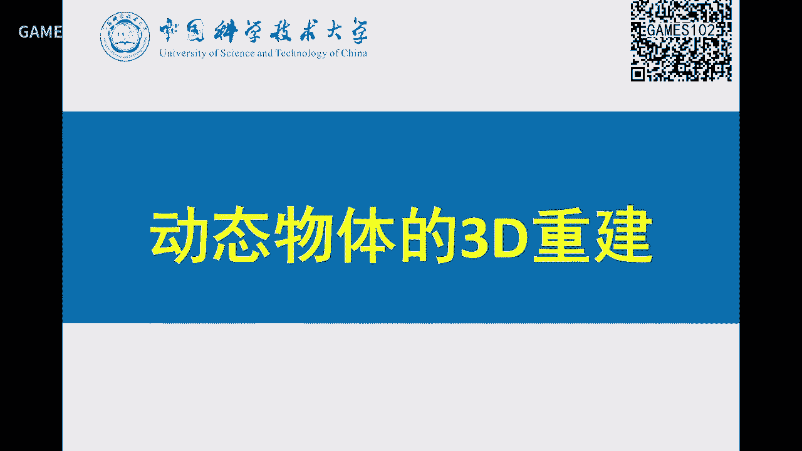

动态物体就是刚才扫描的物体都是静态的，物体是不动的，我们在摄影师生活中呢，还有人体呀，是要经常动的，动态物体的采集就有更更困难一点，为什么你物体是在动的，时时刻刻在动，所以你对这个采集的设备要求很高。

你要一秒钟采很多帧，如果你采的量，就是比如说一秒钟采采一帧，我运动很快，你就不可能重建出动态物体，是吧，所以动态物体采集呢，很多是用这种深度相机，深度相机采集本身就一秒钟可以30到60帧，甚至更高。

还有这种高速相机，一秒钟可以拍很多帧幅，就是他不断的去拍，所以你可以看到，一秒钟30帧的这个数据量的话呢，就采集数据量非常大，而且采集比较困难，这个数据结构也很复杂，还有硬件要求高。

硬件不仅是采要采得很快，而且要各个视角要同步，就是要硬件同步，所以做到这个系统是有点工作量的，采集过程实际上是大致是一样的，只不过多了一个时间维度的注册，因为物体从一个状态变成另外一个状态，它是变形的。

所以你怎么样把当前的物体的网格，把它注册到下一次课的网格上面，然后你多了这样一个注册问题，所以它多了一个时间域的注册，刚才那个注册只有空间域，所以这里是一个时空两个维度的注册，所以只要把这个问题搞明白。

动态物理的这个做就没问题，所以问题大概是一样的，只不过是多了一个时间维度的注册，因为物体是在动的，那么从十几年前吧，也又是十多年了，动态物理重建也做了一系列工作，包括南加州的李浩。

包括Mark Polly。

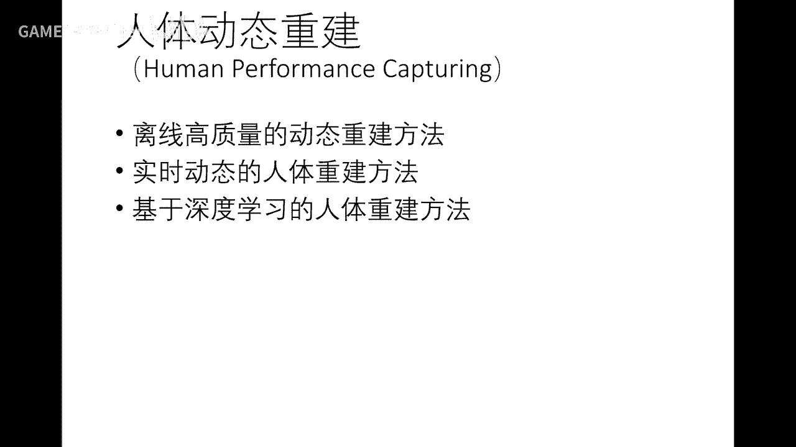

国内清华的刘业斌等等，就做了不少工作，有做离线的，离线什么意思呢，我先把数据采过来，然后再来慢慢做注册呀，一些重建的工作。

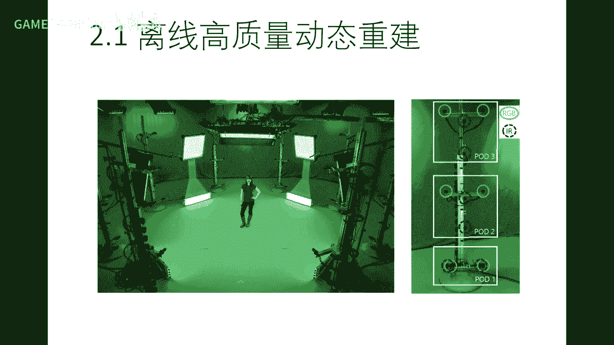

这方面的工作稍微偏多一点，那么离线有个好处，就是你慢慢算，有些算法可以比较复杂，因为时间你不关注嘛，你反正慢慢算，算的时间长一点，最后出来的东西是一个连续变化的视频，一个物体就行了，本人这里有个视频。

我就不播了，那么从十年前开始呢，大家又在关注我能不能实时，因为离线算算很慢，达不到一些这种游戏呀，这种要交互的应用，那么我们能不能去做动态的，实时的，这个挑战就更大，为什么你这个计算量一下子就多了。

你不仅是那个要算出一帧的曲面，而且你要一秒钟算三次整，对吧，所以你计算的这个时间只有30毫秒，因为1000毫秒除以三次也就33毫秒，你只有33毫秒来算，某一帧的这个网格，当然每一帧它不是独立算。

它有相关性，所以我算完前一帧，我这一帧稍微做点变形，就能fit在后一帧，所以这里的大量技巧是用这个技巧，你不能把它看成一个独立计算的过程，所以这种方法就前几帧，可能是要时间稍微长一点。

后面就会变得越来越快，那么还有一个难处就在于这个拓补变化的过程中，你那个跟踪啊就叫chasing，就是我前一帧的网格，能不能跟到完整跟踪到后面那些帧数，如果这个拓补变化很大，或者运动很快。

往往失败率也很高，就是这10年来做的文章也不少。

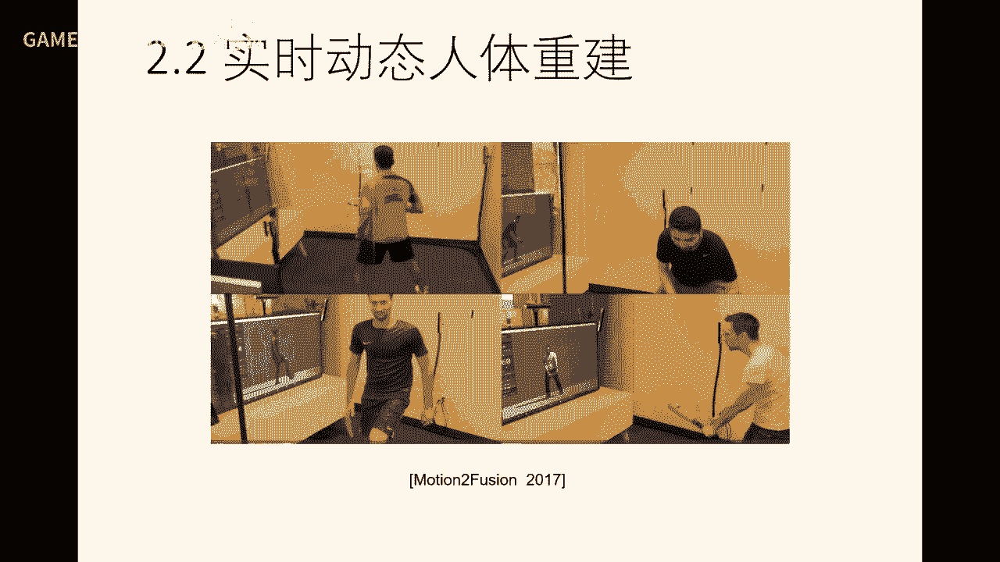

大家可以去看一看，那么还有前两年，包括这两年还有实际学习，反正学习反正就是个拟合嘛，反正也可以拿来做做些拟合，但我个人感觉这个还有好多做的不够好，这个学习方法不一定靠谱，虽然有文章。

这个大家也可以去看一看，作为一个参考，因为还是要根据这个被扫描物体的一些先进知识，还是要要要更多的信息拿来，光靠拟合拟合，你要比如你要采一个人，你要对这个人做训练，你要做采集很久。

训练好你对他重建才会好，好这个时间也也差不多。

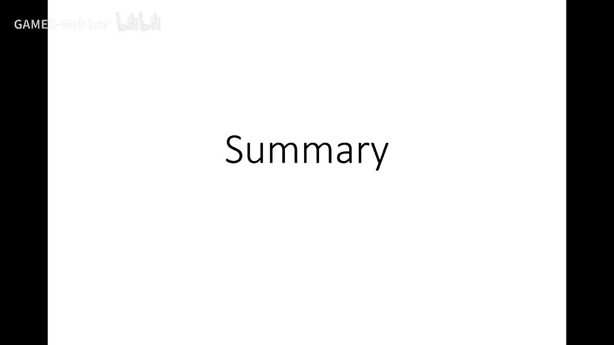

那个我们做一个总结，物体扫描本事上你看，比如说这个大卫有十多米高，那个这个大卫的这个项目是十多年前完成的，就是意大利这个美加朗基罗这个大卫，你可以看到它有21个点，有22个大小型，有32G。

十多年前32G还是挺挺挺大的，22个人花了将近一个月，三四个晚上来来做扫描，所以这个工资量还是很大，现在呢最近几年，也有人考虑，能不能拿机器人来扫描，拿个机器人，反正就那那那机器人。

能自动规划我的扫描路径，自动来检测哪些地方没有扫清楚，我再去扫，就是用机器人来替代人来做这个任务，当然是非常好了，好这个大家如果看到这些。

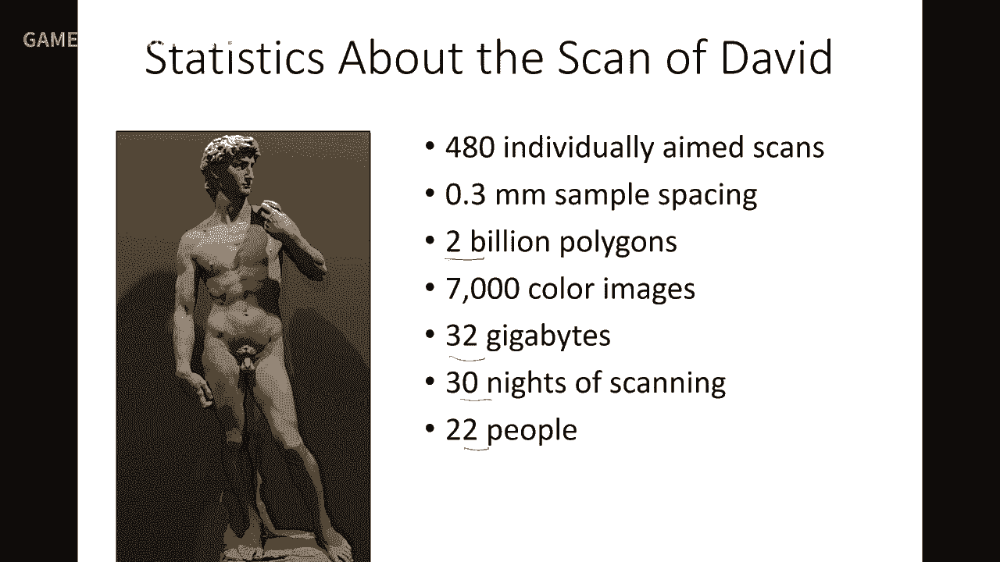

一些要求的话，就会想到一些新的问题出来，当然重建，今天虽然讲了好多文章，这个你可以看到流程也挺长，从从前处理，这个注册呀，包括consolidation，到后面的重建，到后处理，你不同的采集方法。

有不同的这个这个这个数据类型，或数据特点，但总体上来讲，现在这个重建还是个非常难的问题，你无论发了多少文章，这文章像有些文章理论很有保护，但是他要求采样足够精，足够这个密，但实际过程中采样采集的数据。

往往就是稀稀拉拉的，甚至有些缺失，你那些所有的美好的算法都不work，都work的非常烂，我们做过非常多的这个苦头，这个算法这个要求太高，是吧，就是他的条件太苛刻了。

因为你要你要我我采样率要达到一定程度，就跟这个就跟三种原理一样的嘛，是吧，这个你采样密度足够高的时候，这个采样频率高于我信号本身的频率的两倍，我肯定能够理论上保证，我恢复的信号是原来信号嘛，对吧。

但实际问题中往往不是啊，就是这是一个点，就是采样的那个条件不够，第二个呢，就是那些空的case很多，就是一些特殊的一些这个这个情况，我们做算法的人都知道，就是往往一般的case很好做。

但是在一些特殊情况啊，这个地方呢，可能这个点飘掉了，可能这个点反向那个这个求的是有歧义啊，就会让这个地方重建的非常非常不好啊，这个到现在为止就是都没有一个非常好的方法。

软件能够帮助帮助人们能够自动创建这个商业创新啊，那么同性学整个领域啊，我就会谈谈我的想法，就是看法就是同学三大块建模啊，仿真加渲染啊，仿真嘛，就是本质上都在求解各种各样的PDE平方层是吧。

有固体的这个牛顿动力学方程，如果是那个固态的变形，就是有限元，然后液态的话，就是这个MS方程，Navi Stux方程，是吧，就是有拉格朗的观点，有柔拉观点，就是就在求解方程，这方程是固定的。

只不过一些条件不一样，所以他的这个这个这个计算机制是明确的，那么对渲染来讲，给张模型加光照加材质加4点啊，整个信息，你就是求解那个渲染方程就行了，是吧，然后简单一点就是local shading啊。

form模型等等啊，来一点就是pass tracing，就是光路追踪，反正你总是算力的问题是吧，所以现在呢，那个那个仿真也好，渲染也好，也可以仿得非常逼真，渲染也非常逼真啊。

就是就看大家实现的技巧怎么样，是吧，很多引擎像U14虚幻这个技巧用了很多是吧，U3D一样，还有还有新的引擎，大家都在PK这个工程能力，以及挖掘硬件，比如说你你用很好利用到硬件。

或者很好利用到一些云资源来加速我的计算，但是他们的这个计算是明确的，为什么解方程都是解一个PDE，再一个解光路方程啊，就是渲染方程，但是建模这一块第三大任务，始终这里面是一个非常瓶颈问题。

因为三维啊做了多么多年，中心学做了多么多年，发展了很多技术，到现在大家也看到更多的应用，但是还是普通老百姓或者一般的人，包括我们专业做这个这个专业的老师和同学，也很难很容易获得一些模型，拿照相机去拍。

拿扫描，拿那个Kinect去扫，还是很难啊，那么那么那么扫了扫去，这个能出来一个模型，但是质量不高啊，这里丢一点，那那里会有些噪声，那里有一些啊，一方面这个这个设备的这个质量或者精度。

也达不到现在的高精度建模的要求，即使那个深度相机数据质量是还是很差的，其次呢这个扫描过程，由于遮挡啊，由于这个设备的误差呀，或者人手都躲动了，质量没法保证，所以导致现在有些那个应用啊，就是缺乏三维模型。

就没法去爆发一些更多应用，我也我也希望在下面的五年啊，甚至更短吧，那么如果技术发展有限也长一点，能在三维建模这一块面，如果有公司或者有个人，或者有有研究机构，能在这一块，能够大量的让人们去产生这个内容。

三维内容，那么这个领域就一定会爆发啊，那么是是是什么机构，或者是什么设备，我也不知道啊，就是就是主要是内容，就不像图像处理领域，我拿拿个相机随便拍，就能生成大量的图片，就能生成像这个ImageNet。

这样的一个千万级，甚至商业级的这个数据库，就会做很多事情，是吧，三维模型还是很难的问题，我也希望这个各位同学，如果有有这个志向。

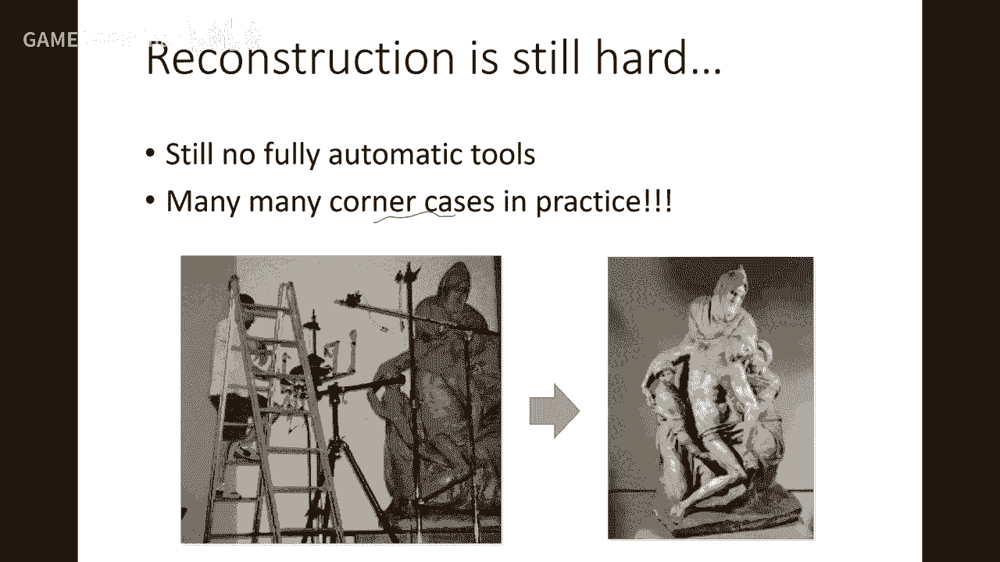

可以在这方面去去尝试一下，好，好，那么今天布置作业时，也是这节课，这门课的最后一次作业，啊，这作业那个，这作业呢，我希望大家体验体验一下啊，随便重建了一些简单算法，算法难度倒不难啊。

你可以从这三个算法里面去选一个，一个class算法，class算法的话，里面要有个one line，包括Dynamic参与部分的这个这个这个调用是吧，这个你们在前面已经学会了，会调那些库了，是吧。

所以你只要去判断那些条件就行了，怎么保留那些三眼变片，啊，还有一个就是RBF，就两个引子方法选一个，这三个选一个做就行了，好，如果你有时间练练手，做两个三个都可以，RBF以前你们也做过。

这个所以也不是太难，只不过把它变成三维而已，婆婆送是一个新的算法，是求减PDE，这个稍微难一点，如果大家时间比较有限，建议是从前面两个选一个，那么后面两个的是引子方法。

你要用MarketCube去去抽抽曲面，建议大家也用现成的啊，就不需要再找轮子，因为MarketCube算法相对来说比较比较比较成熟，如果大家以后发现他的不足，想去改进再去看他代码去改进，好。

这个给两周时间啊，那么这个课可能也就剩下两到三周，我看情况，如果后面两次赶得快的话，我们就两次总共15次结束，就17号晚上结束，如果内容我还想给大家分享更多，但中间还有很多了，后面还有什么呢。

后面还有形状分析，就是怎么来分析上面的那些形状，比如说导盾演算机啊，怎么怎么去匹配啊，还有检索啊，就属于高级高层的那个结构处理啊，还有一些这个，一些制造中的一些结合问题，比如三感应中的结合问题。

还有一些相关的一些应用，机器人中的结合问题，还有VR中的结合问题，还有一些这个AR中的结合问题等等，如果来得及我就稍微提一下，好吧，给大家一些这种启发或者一些指正，以后你们如果有兴趣。

可以往不同的行业去挖掘，或者去解决一些结合问题，好吧，好那么这次作业呢，这是这次课的最后一次作业，如果跟上队伍的这个同学，如果有兴趣，还是把这作业做一下，还是会对你有很多的锻炼，这不是普通的重建。

网上有很多代码，上这几个算法都有代码，你们也可以边参考代码，边来实现一下，也是OK的，至少你有个感官，未来在做你工作过程中，可能就很快就能上手，好吧，好那么我们还有两到三次，那么这些课，这课呢。

后面的内容呢，就不布置作业了，因为后面的内容就比较复杂一点，就是更多的是一些扩充你们知识面，以及了解一些领域的一些结合问题，为主，好吧，好那么今天的课就到这里为止，各位同学好再见。

拜拜，你可不可以帮我把这个帽子脱掉啊？

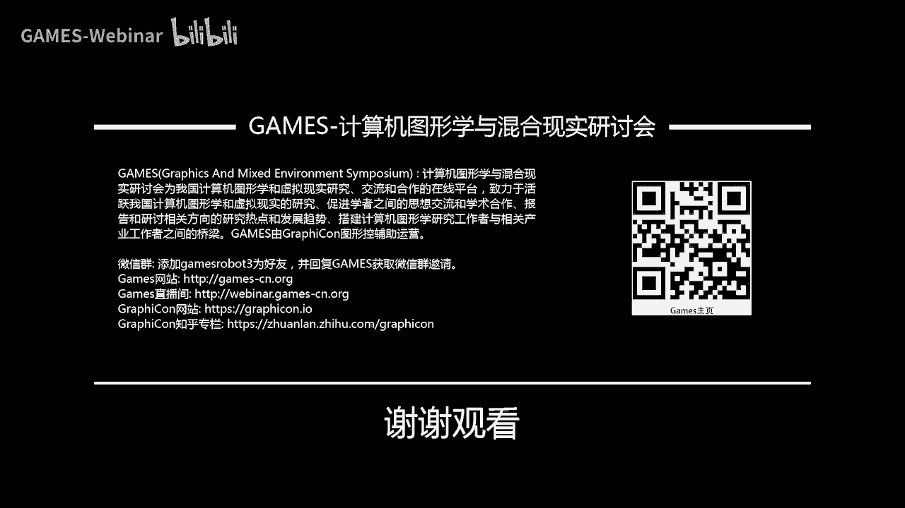

我这脱不掉的帽子就不重要了！