# GAMES102：几何建模与处理 - P14：几何建模 - GAMES-Webinar - BV1NA411E7Yr

好那个各位同学晚上好啊，现在我们今天的课开始了啊，今天是我们的第14次，那个进入到几何建模的内容。

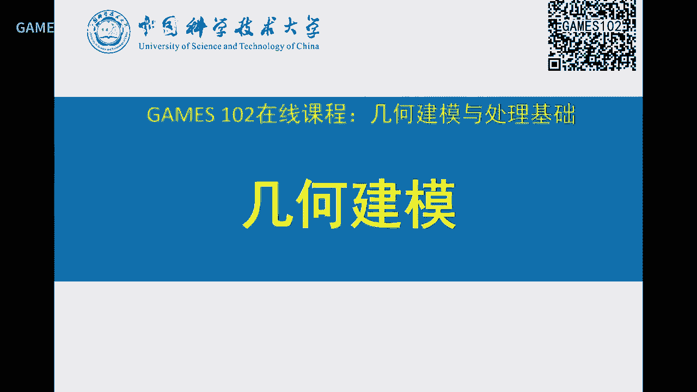

呃，我们回顾一下上一节课啊，这个呃全面介绍一下全面重建啊，从这个采集设备到后面的点云获取，以及啊点云的一些前处理，到后面的重建啊，还有后处理啊等等，所以呃一个模型的重建啊，扫描重建。

现在这个这个仍然是一个比较复杂的一个问题哦，现在市面上虽然有很多算法软件，但是呢还要这个嗯要重建一个高质量的，特别是室内这种物体啊，这个质量的这个软件还是比较难，没有。

现在重庆的一些算法软件呢主要是以深度相机啊这个为主，然后有个别的结构光扫描这种人体呀啊，这个用多组这样这个摄像机来做，也是有不同的系统好，那么那么这个重建我们讲完了，现在我们讲那个设计呃。

因为重建的话呢，它的物理是要是存在的对吧，所以我们通过采集逆向工程就可以去得到它的模型，但是呢人人们常常也会去涉及一些不存在的问题，就是新的物体啊，那么这里有两种方式啊，一种是呃凭空的去设计。

一种是通过已知的物体去去进行一些修改和设那个编辑好，那我们我们就从两方面来讲这个设计啊，就是这个建模的这样一个过程啊，第一个呢就是从从零开始设计，实际上是早年的cad模型啊。

这个就是呃软件就是从零让这个设计者啊呃提供一些工具，让设计者呢啊去创造设计出他们这这个一个形状啊，这里主要有这么几大块嘛，上次这个y friend modern，等一下我去提一下，上就是啊。

特别是机械学院叫工程制图，就是就是从这个三维模型的三个视角的投影图来设计模型啊，那么第二部分的surface modering呢就是我们以前讲的啊，就是这些这ges是2102克的，上半部分就是鼻腔调啊。

啊nobs这套东西来构建这种光滑曲面，那么在这个cd领域里，还有一个叫sd model，叫啊这实体建模，那么实体建模的话这个内容也是比较多的啊，以前我们也是专门一门课。

那么今天呢我可能就是只花半个多小时把这个内容大概介绍一下啊，能让同学们在脑袋中有印象啊，这个形成一个指针以后，如果碰到啊相关的问题呢啊再去进行一些这个探索好。

那么现在第一种叫y friend modern上wifm就是工程制图中的三视图啊，顶视图，前视图还有测试图啊，那么这是一个右上左右上角，这个呢是一个真正的三维模型，是一个是一个透视图啊，透视图。

然后呢呃一，那么那么能不能就要去根据这个to他的弓箭的零件的，三个视角去画出来啊，但是画的过程中也要做一些精确计算，因为比如说在这条边的长度跟这条边的长度是相等的，因为它都是同一个一个零件的一条边的。

都不在不同方向的投影，所以做这个一些这个透透视投影，或者叫这个三视图的时候呢，也是需要空间想象能力以及一些计算，你才能画的好，那么根据这三个视图啊，就可以基本上大部分模型就可以唯一决定一个三维形状啊。

这个工程制图像，这个土建工啊，土木啊，机械这些行业啊，都要学这门课啊，从一些这种比较规整的球啊，椭球啊，环啊，这个可以novs表达，以及这个free form自由的那个novs啊，那个尾就不站提啊。

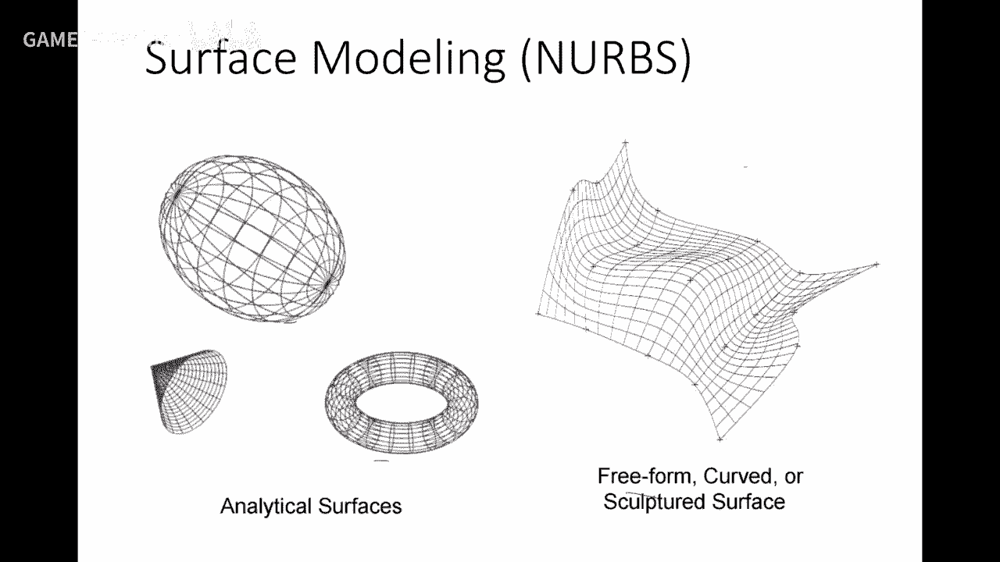

好那么嗯计算部分说的是modern。

我今天稍微提讲一下啊，说的modern是早年这个特别是呃那个现在的一些cd系统里面，非常常见的一种建模手段，好我这里左边有一张图叫institution，就是sweeping，叫叫啊叫挤出也好。

还是这个扫略，他呢就是人们设计一个平面的这样二倍截图，再设计一个或者是垂直于它的那个一条一条方向，当然也可以不垂直啊，那么呢这个二维的截面图形呢就沿着这个直线呢就是扫略啊，什么就是平移平移。

是不是这个二维截截面形状就会在空间中经过一个实体，那么这个实体的边界就是这个物体本身啊，当然从数据上很容易证明啊，就是它是两个平行的面，然后加上这个呃一一圈的这个边就构成一个实体啊。

这个表达也非常容易啊，这个呢右边这张图呢叫叫旋转曲面，就是来一个二维的横截面的一个呃，这个多边形沿着某一条轴啊旋转360度啊，那就是说经过的这样一个空间就形成了这样一个曲面啊，旋旋转曲面啊。

那么这种旋转曲面很适合照这种有对称性的，像杯子啊，碗啊那种啊，圆圆形圆形截面的这样一个物体啊，所以这些呃这些是基本操作，在这个商业软件里面搜walks啊，像卡t啊，哪些公司输出出品的。

还以及autodesk的一些软件里面都有这种基本的操作啊，所以你可以啊去设计一个界面啊，不管是这种界面还是还是这种界面，通过拉伸就是平移啊，以及旋转就可以构成一个实体。

那么这个在呃所有的model里面也叫做参数化建模，因为你这里的一些形状可以定一些参数，你参数修改的时候呢，这个横截面就修改了啊，那么这个体也跟着修改啊，就是参考建模，参建模呢这里有几个概念。

应该叫叫这个轮廓线，叫sketch，也叫啊嗯这个线条还有个dimensional，这个是维度，就是这个图和这个图就是二维的，但是我经过一个操作以后，就变成一个三维的实体啊。

这个这个就叫dimension，就是升维就变成二维到三维了，后面还有一些future，然后后面再解释好，我们来看一下，像这里有一个示例图啊，这个是一个啊二二维的这个这个这个这个横截面。

那么通过一条直线去拉伸，就形成一个实体，如果通过一个旋转这个旋转，但是它没有160度，只有180度啊，就变成一个这样形状啊。

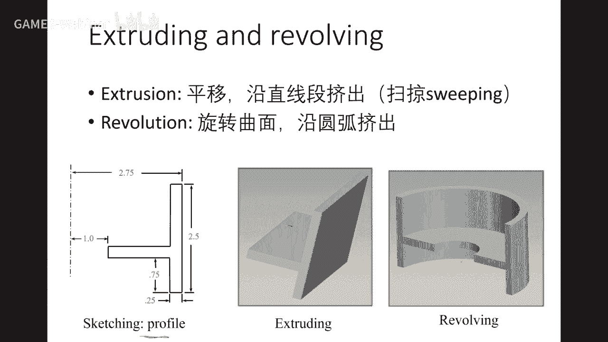

这个非常容易理解好呃，实际上是这个sweeping，这个叫扫略，还可以有更广义的一些操作，比如说这个图里面啊，它是一个横截面，绕着一条非直线，它可能是一个pass，就pass可能是曲线。

那么进行进行一个扫略啊，在扫描过程中呢，可能这个横截面始终垂直于这个截面的这个切线啊，这时候就扫得出这样一个物体啊，所以可以看到呃，你可以定义不同的横截面以及这个曲线，就可以定义复杂的这个物体。

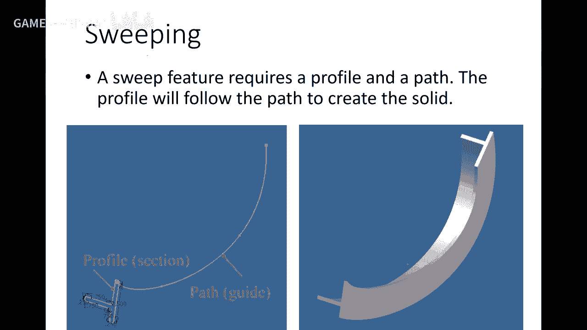

你还可以定义更复杂的什么呢，我可以编少的时候呢，这个横截面可以边变化啊，比如说它这边是一个方形，这边是个圆，那么我中间就可以擦拭出中间一个形状，那么从一个圆变成一个方形啊。

中间扫绿体呢就可以更复杂一点啊，那么这个就生成这种过渡形渐变形的这样一些这个啊实体啊，这个叫robin robin呢啊，中文对应那个词叫放样啊，实际上这也是一种放样，这个算是有什么由体来差值。

一个横截面差着二维向三维是实体来差值。

二维二维的横截面好，经过刚才解释，可以看到这些操作啊，如果你们去去那个呃，这个几个程序啊，怎么样一个二维截面生成一个三维体，这个数据结构怎么存储啊，这个也是不是特别复杂好。

那么还有呢在参观建模里面还有好多这种对这个零件不同，这次这个几何量的一些约束啊，这个叫做设计意图啊，这constrain sconstrain好，我这里有两两种颜色。

这个边界可以看到边界上面有些尺寸对吧，这个是四呃，四这单位当然是你可以试试0米或米啊，这个取决这个零件是是什么啊，我就单位不是就不说2。5好，那么这个这个这个长度呢是2。125好，那么这里两条颜色呢。

我标成蓝色啊，那么黑色黑色的这个这个边呢我是不做约束的，但蓝色呢我是需要它保持这样一些参数，比如说这个长途必须22。25，这个长度是21。25啊，还有右边这个图呢，我这个长度必须保持是1。75。

还有这个角度呢我必须保持是30度，那么你做任何的一些修改，我我必须这些蓝色的参数你不能给给我变化，因为我有特殊的要求啊，好那我们来看一下啊，好我们举个例子就看第一行啊，这里是啊，这个这这条边变长了对吧。

变长了以后根据这个要求26。25，这个这个只是不能改的，所以呢你也就这条边和核桃这条边可以修改啊，那么那么这条边是这个是不动的是吧，所以你你这个这个变异位往上拎了嘛，所以这个2。22。

5不能不能不能不能修改，所以这条边就必须保持不动好，同样你可以看到其他的一些例子啊，那如果你有些约束是不能动的话，那么这个就可以通过一个求解这个约最优约束，然后呢我变化了一条边以后呢。

其他的边和点是怎么变化是可以求出来的啊，当然在这里面有一个比较复杂的问题，就是有些约束甚至是矛盾的，甚至有些约束是这个相互是呃相关的，这时候就解可能是无穷多个，这时候会招造成这个超新系统呢会产生歧义啊。

这种现象也会有啊，所以一个非常呃复杂的这个模型，它里面这个约束求解是一个非常非常困难的问题啊，因为游戏约束可能相互重铸，也可能是这个不够是吧，对于产生多解啊，这是这个sol modern早年的情况。

在这里面处理了非常多的问题，是这些问题好，那么还有一些操作呢，我这里以这个呃这个商业软件的一个一个菜单来来说明哈，就是说呃这这这两个词就叫倒角啊，就是因为因为有些地方这个角我希望这个不是直角啊。

需要需要圆滑一点啊，那么这个是相当于往往外倒角，这个是往里倒角啊，这只是两个词，那么这倒角呢就是诶怎么样啊，就是就是一下一下子想成一个正方形是吧，然后我这里这个边呢把把把它倒一下，就不要那么尖锐啊。

使得一些零件呢就不能不用伤人啊等等这样一些目的。

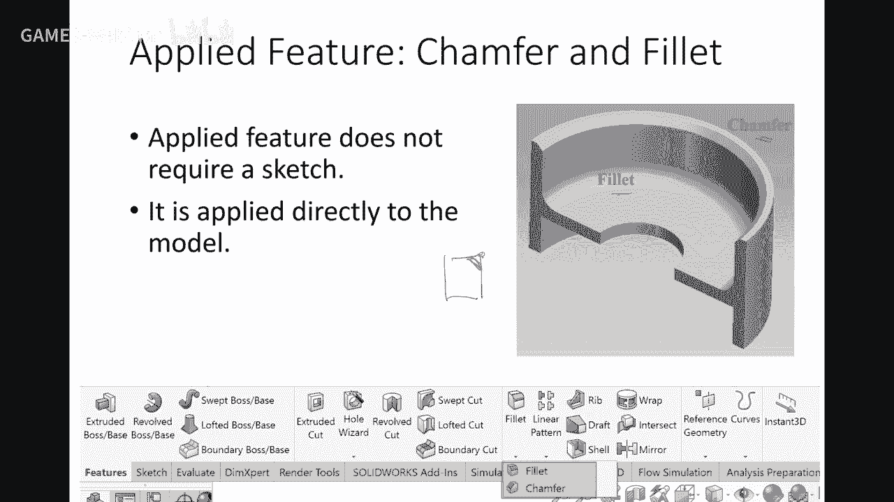

还有share，share就是一个挤挤出或挤压，它不是轮廓挤，它是在在里面定一个里面的这个轮廓，然后往里挤，这样可以把这个物体穿透啊，甚至造造一个这个规格，如果你想想这个横截面再往里挤。

挤中以后，就这个一个洞就出来了啊，规格就出来了好那么还有一些pattern pattern。

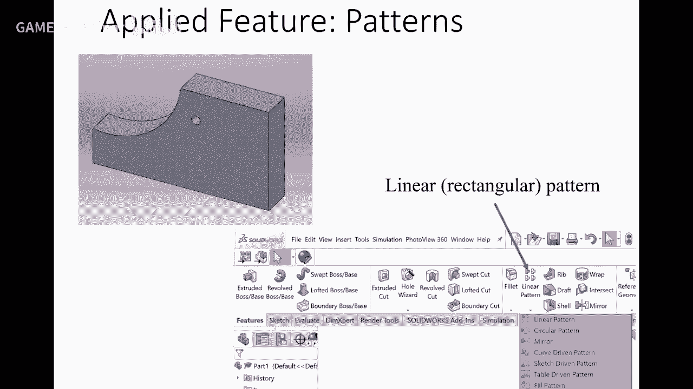

我这里举几个例子哈，那个像这个pattern啊，就可以可以做很多重复的这样这样一些特征啊，比如说我选择一和二，然后再往往往外走啊，这是往里还是往外往外挤啊，然后呢再选这个方向，这时候呢就就可以呃。

就是挤出这个多个洞，因为这里这里是3x3这样一这样一个pattern好好，那其他同样也可以啊，这个旋转啊，你看的是一个矩阵型的3x3，我现在是绕着一个点啊，这个拷贝多多少个啊。

从前上从这个针按照这样一个规则的几何，这个pattern就可以重复这样这样一些特征好。

那么刚才sorry，modern是这个刚才那操作，这操作呢一个比较重要的问题就是怎么去存储存储呢，这个在这个说的modern这里面叫做be rap啊。

rap叫什么叫boundary representation啊，就是边界表达，那变表达里面最重要的就是表达就是从这些点线面的关系啊，我像我们以前处理这个离散网格的时候，用半边结构也是一种啊。

那么这里在cd里面的话，它这里存在的信息量更多，它不仅要存这些点线面，而且还要存他们的这些几何关系啊，甚至垂直啊，平行刚才说的那些约束啊，所以产出的还是比较复杂的，那么无论你怎么存。

它这个实体总是啊这个这个边界总是一个实体的边界，所以它要满足这个欧拉公式啊，那么在呃在早年这个建模系统里面就产生了好多这种操作，怎么有一些点产生一条边，一个边产生一个面，一个面还产生不同的规格。

就就就有很多很多操作啊，我们在读研究生的时候是有一门课专门来讲这个sorry modern啊，这个一些操作啊，我下面就举几个例子吧，因为现在啊基本上这个全国啊这个呃计算机图形学类的这个课程。

好像我都还没看到过，这个还有专门开这种课的，可能机械学，还有啊这个啊计算机啊，数学类的这种课程没有了啊，也挺可惜，就是呃大家不了解这个传统c a d是怎么来做这种操作的啊，那么这个操作叫欧拉操作啊。

欧拉操作欧拉欧拉操作呢你可以看到一个点分裂变成一条边，所以这个叫m e v啊，m1 v再在这里m v m v是啊，爱奇嗯，生成一下右下边make edge啊，还有点好，就生成一下一一个边，生成一个新点。

好就点加一边加一哎，就这样一个操作呢就记录下来，就可以产生出这样这样一个新的一个一个一条边，现在这两两个面保持这样就会编出来了啊，这里从同样啊这里把一个四边形变成两个三角形，就生成了一个面啊。

那么这里呢就生成一个首先剩下的边，然后最后再把再把这个边给q掉，k把他干掉啊，q掉，这时候就剩下一个环啊等等，通过这样一些非常low level的一些操作，就可以创作出不同的视频啊，那么这是一个过程啊。

这个呃如果同学们以后有机会去接触这个所有所有的model的一些软件啊，可能就有机会体验一下这些操作啊，它是怎么一步步来的啊，这是首先是一个点，然后再生成一个三条边是吧，一个眼。

然后就在这个面面的话又得到一些新的面和点，然后生成体就生成一个规格，好啊，这个因为现在啊要做，如果需要做这个实体造型软件的话，这些还是要深入了解一下好，那么在实际造型里面还有另外一个概念叫c s g。

这个大家可能有些同学也看看到过哈，这个c s g呢就是也是一种通过一些这个叫做基本体啊，比如说方形啊，求啊这个追逐啊，那么这些是这个基本体呢也是一些参数所定义的。

比如啊一个一个球可以由一个点加半径就可以定义好是吧，所以它里面也有参数，然后然后这些基本体呢通过一些不操作叫buring operation啊，就不操作，就三个一个两个实体之间的，并还有啊这个病啊。

这个是交啊，这个是差差，又有和这个a减b啊，这个这个然后呢然后呢通过这些实体的不断的操作，就可以构成一些复杂形体，所以所以一个c s g数的模型啊，c s c g模型它是由一个数所表达的数字根节点啊。

就是夜写点啊，一定是这些proto，当然还再放些参数啊，这参数是是否是存在这个节点上面的，然后然后这个这个上面的节点呢就存这些操作是胶啊，还是病啊，还是差啊，像在这里就存存存了个差，它减它就就等于他。

那么这样的话呢，就是一个一个空间的一个子集啊，复封闭的，当然要是通过一些运算以后才能找到它，它的boundary representation就grab啊，因为cs 7它主要是表达是什么。

是一个实际上是本质上是个隐函数的内部啊，你可以看到，因为这里的内任何一个形体，它的内部都是比如说求是呃那个方程的小于等于一的一个集合嘛是吧，所以他们通过呃交并差就得到一个定义了一个啊。

这个空间啊就是半半空间啊，因为大于零是一半，小于零是另外，比如说大于零是外面，小于零是里面，那么这次有很多隐函数所定义的一个空间，这空间的边界就是可以表达成be rap好。

那么这是一个典型的一个c s g这个model的建模过程，你看这个model啊，这个这个这个模型看起来比刚才上一页要要复杂一点点，你可以看到它的数已经比较大了啊。

所以你要啊会会用这个cg来做一个这个机械模型，还是啊需要很多挑战的啊，空间想象能力，而且对这些操作编辑啊，这个要非常熟啊，所以这个过程也是比较繁琐的啊，还是要经过很多训练。

特别是要对几何还有空间想象能力要非常熟啊，否则的话你这个如果你想象一个明显是这个样子，你不知道它怎么去分解啊，这个也是有问题的啊，就是做不出来，当然给定一个模型，比如说这个模型它的cs技术是为人吗啊。

就未必为一啊，因为呃这里你是先求交还是先求差，有些时候是可以交换的啊，所以这个数字不为的啊，那么那么什么素质比较好的，那不同不同的设计者呢，它有不同的这样的经验啊。

可以去去做不同的这样一个c s g的过程，这个burap呢是表达边界，他们之间你看中这个结构内部，他们之间是可以相互转转换啊，啊我这里就不展开好吧，这个因为也能接触到这些啊。

建模手段的同学可能以后还是比较少啊，那么你可以看到这是一个应该是iphone苹果公司的一个呃，网上的一个这个是设计图啊，当然真正的设计图它是不可能公开啊。

因为任何产品的外星人设计这个文件都是这个机密文件啊，他可能给你一个概念图啊，这个他同学们不知道有没有听过是吧，就为就为了这样一个倒角导多少度啊，这个就是一个专利啊。

当年三星和苹果就为了这个这个倒角的专利把这个互相告对吧啊，那我们不说啊，就说这里面那些参数啊，这个这个设计模型啊是非常珍贵的啊，因为这就是它代表这个公司这个对这个产品外形的一些这个技术啊。

可以看到这个这里这里一些参数，那么这是一些在这个设计软件里面的一个渲染图，好就可以看到在我生产之前就能看到它的表表观，它的生产参数。

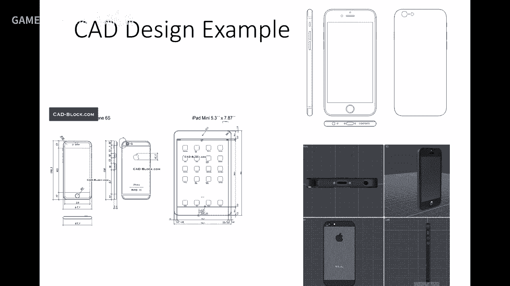

到最后制造的时候，加工的精度是多少啊，等等都能看到啊，这些我就看一下，就是我们日常生活中的小到一个螺丝，大到我们中的家电啊，这个外形设计都要用到这些啊技术。

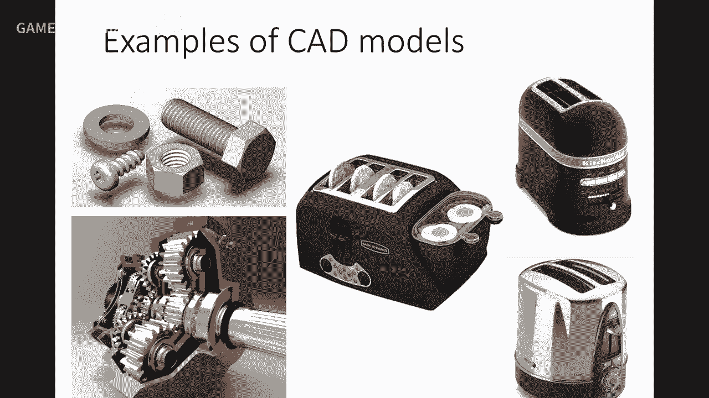

还有这种复杂的发动机，还有更大的到我们的这个整个汽车，你可以看到一个是一个整车中间有几万个零件啊，这个这个里面的每个零件都要有它的cad模型，所以设计一个汽车上实际上非常工程量非常大的一个事情是吧。

更不用说这个天上飞的飞机啊，火箭啊，以及这个航母等等，所以他这些主要依赖于这些c d软件，这软件呢能不能给设计者很好的一些这个设计的路途径，以及保证他们这些这些这些配件之间能够啊相或者那个吻合啊。

也是非常困难的事情，所以一个cd系统的一个挑战，这个虽然这个cd也有很多这种成熟的这个软件啊，那么但是呢是你要做一个很好的cd系统还是非常困难的啊。

其中几个困难点吧啊我以为我们也正在这个网络方向在努力啊，就光圈点一个是求交啊，还有还有一个是这个维持这个产品的一个top啊，大家知道，因为刚才有好多几何形状，他们之间要相互的这个求教啊，求病啊。

所以啊因为你们一个基本的一个非常重要的问题就是求交线，那么这个交线听起来不就是一个解方程嘛对吧，就是两个有两个方程函数解方程吗，但是这里的精度问题非常重要，因为一旦你的精度如果出错。

它的这个整个的拓扑关系就会出错，比如说两条曲面，两个曲面本来是有交交线的，结果你你由于精度问题算没算出交线，这时候就有就那就可能导致后面的很多操作都都是会会出问题的啊。

然后那个另外还有一个就是很很多参数设计的时候呢，它嗯那些约束非常非常非常复杂啊，导致这个优化的时候呢，就会产生很多非线性的一些些些这种优化问题啊。

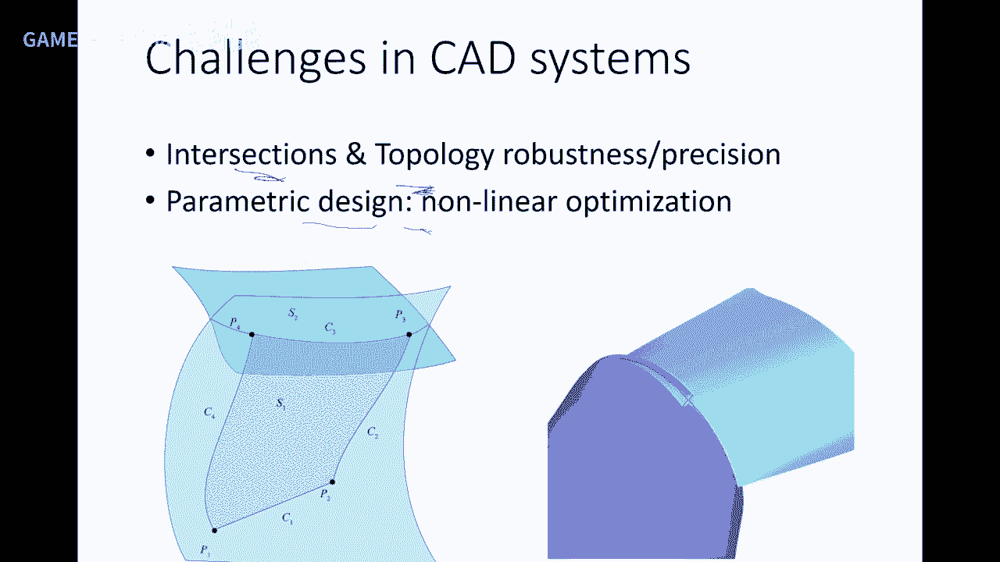

好那么谈到这里，我就简单介绍一下这个呃，只介绍一下这些呃，这个这个cad建模算是在制造业，无论刚才说的这个航母啊，火火箭，大家也很清楚是吧，我们通过廉价的劳动力来学会了大量制造技术。

但是高端的这种机床啊，我们公中国还是一穷二白啊，还是没有放没放起来，所以现在啊除了这个这个加工高精度加工这个设备，另外这个工业设计软件也是非常重要，因为你没有这种软件。

你就没法去做出这么多的这种啊这个产品啊，特别是我们国家所国际国之重器，像c9192 航母啊等等设计，都是非常非常珍贵的啊，所以也希望呃在听着各位同学啊，也或者是各位工业建设的同人。

能够在这一块大家一切努力啊，往前走啊，当然要做好一个工业软件，达到西方的这样一些进展啊，这个或者是水平这个时间不能一蹴而就需要很多年啊，短则5年，长则10年。

因为国产软件也是经历过时三四十年的这个积累慢慢形成的，但是我们往前赶应该还来得及好。

所以大家来继续努力好，那么前面讲的是工业软件从一些设计啊，这个从nba到smodern。

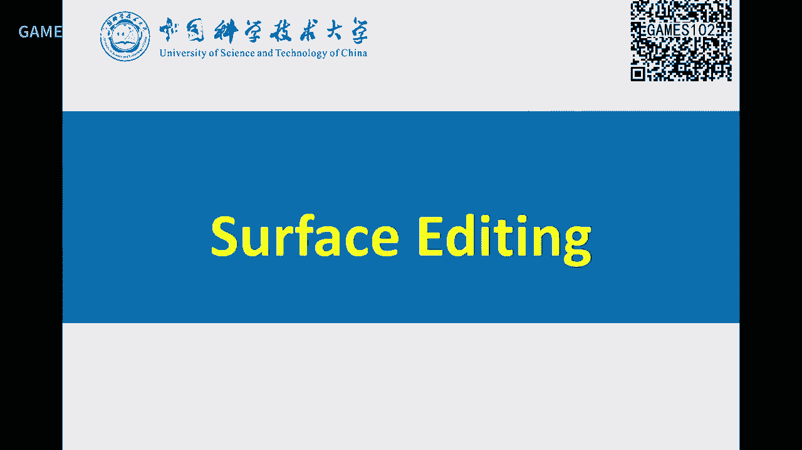

那么后面这部分呢我们叫editing，那是什么，就是从一个给定形状，我通过一些操作进行一些改变这个形状来来进行设计啊，那么后面的部分呢就更加啊就面向这种这个动画啊，这种啊这个行业啊。

或者是我们平时这个生活中的建模啊，这个定位是不一样的好那么这个editing啊这个词叫编辑。

什么意思呢，就是我有个形状，我通过去改变其中一些点线面的关系，还有通过一些这个拉伸挤出，当然刚才那个讲说的model的时候，也也也也有这个编辑操作对吧，然后通过这个修改它的一些错误关系啊。

顶点位置啊来生成一个新的形体啊，就最后在中国，也就是说细分曲面就可以把它生成一个这样的一个啊新的形状啊。

这个过程叫做那么editing的一个最重要一个比较重要的东西是什么呢，就是这个啊中间要有交互叫intective啊，就是比如说我这个鼻子要拉长，要要要要要鼓起来，还是变变成变成这样尖的。

就是用户需要参与到整个设计或者叫编辑过程中，所以它首先是一个active交互的啊，其实呢它是要进行不断的迭代啊，但是这个你怎么让用户能够很好的编辑出他要的形状呢，就这个编辑工具一定要直观啊。

所以要要要直观也要，当然这个结果要非常快地呈现出来，如果错的话，我可以回退等等好，那么后面就什么还有什么保持这个形状的一些特特征，比如说一些呃这个尖锐特征啊，或者是一些这个光滑度啊等等啊。

这是你用户要表达的意图好，所以这个ui就是叫user interface，就是一个编辑，这个是一个非常重要的一个手段啊，这个叫用户的一个交互的一些手段啊，那么要要直观，要非常好用啊。

那么你想如果我要改变一个形状，我要编辑什么呢啊那么这个编辑呢有很难多这个这个手段，那么这个编辑对象呢叫handle，叫叫句柄，有点像我们编程的，对不对一样啊，the handle呢有可能是一些顶点。

也可以看到这些特征，或者一些呃，i i i i i叫region of interest，叫感兴趣区域啊，有可能是一个区域，好，那么我们用户比如以这个图来看。

我又会想让让这个彼此和点的拖到这个红点的地方啊，那么你希望是什么呢，你希望变形效果是这个样子呢，还还是这个样子对吧，不同用户有不同的这个这个这个需求，但是如果你提供这样一些啊不同的种类的变形。

这个这个效果给它，用户就知道怎么去编辑能达到这个要求，比如说诶我希望这个点这个这个可以不不动，比如这个点需要需要固定好，那么那么这种可能性就大一点吧，如果这里没有约束。

那么这个可能性这个可能比较大一点啊，所以他自己的挑战呢就是编辑要什么操作简单啊，也不能太多啊，并且因为像这个点如果有这里有1万个景点，每个点都要这样拖动，就非常复杂对吧，第二个要保持它的特征。

像像这个例子，下面这个例子保证了什么，保证了这个鼻子这样一个条形特征是吧，还有什么保持一些语义，语义特征等等好，那么方法论战呢，我统一讲一下编辑，这里面实际上是呃如果你去直接编辑给定的形状。

这个形状可能顶点非常非常多啊，编辑起来就非常复杂好，那么在后面的一些这个大部分的这个方法里面，都是采用这样这样一个这个这个方法好，我去什么找一个能够近似代表s的一个代理啊，这个叫g啊，p啊。

p是一个比较简单或者叫叫那个更加呃这个呃容易操作的一个对象，那么p来用用p来进行一个s，那么这个这个近视不一定是形状完全近视啊，是某种意义上近视，然后呢只要p定义好了，s就就能够定义啊。

就是这里有个隐私g啊，p给定了s就出来了是吧，好你可以把近年也看到是把s嵌入到一个这个嵌入空间好，这时候呢我们人呢就要去只要去改p变成p一撇啊，这个这个具体怎么改呢，这是具体的方法不同问题。

最后呢我怎么去修改s呢，s呢就通过刚才这个这个影射把修改后的批评夺回来，得到s一撇，那么这样为什么为什么要绕一下呢，因为这个pin呢往往是很简单，就是一条线，可能就是一个非常简单的四边形啊。

或者是一个立方体，所以编辑这个简单的这个代理啊，所以我这里用同一个名词叫代理啊，不同的地方叫的是不一样啊，我喜欢把它叫做代理，或者叫做把它叫做embedded ship啊。

就是这个这个嵌入嵌嵌入空间嵌入形状，所以这是一个非常重要的一个问题，就是怎么去找到这个这个g啊，就是我找到一个好的代理，这个代理呢能够体现s的性质，这样的话呢我代理比较简单，我可以很好地编辑它。

编辑完以后的话，我就可以生成啊，我要的这个f一撇形状变形或者形状啊，这是整个editing整个领域大概的逻辑啊，嗯基本上都符合这种逻辑啊，所以你要去做编辑，这个基本上你就可以看我找什么代理啊。

这个代理好那个那个用户好不好交互，交互完以后我怎么去得到我那个原来是这个形状的啊，形状啊，这个这个物理的形状好，那么代理有很多种啊，就代理上就是我刚才讲的那个handle啊，就简单一点，就是点复杂一点。

对线啊，还有网格等等，好我们来一个一个讲，我们我们先看这个点，在这个代理好点，代理非常简单，就是诶你要去编辑这个龙，左左边是一个输入模型哈，那么我希望把它的轮子这个上上这个上颚把它拉上去。

相当于让这个嘴巴翘起来啊，这个张张开来好，那么我这个代理呢就是什么，就是一个点，我希望拖动它，就是这个点是handle，但是你通过它的时候，如果你整个不固定的话，就整个龙会平移是吧。

所以呢我希望固定一些点，像这一圈的点把它固定，是不是我只允许这部分的顶点进行变形是吧，所以这个点是至少要要要到我目目标点，问点是在哪里是吧，所以它的这个代理呢诶就是一个这样固定的点，加上这个点好。

那么具体怎么去求呢，有不同的方法啊，就是这个方法大家仔细想想是个什么问题啊，好我再讲一讲一讲一下，就这这些这部分的模型是是是不动的，因为这一圈固定了，所以说明他外面的点都不动是吧。

所以动的点就是这个嘴巴加眼睛这部分啊，我圈的这部分好，这五点是不动，是不是相当于用钉子把它钉牢了，这个这个问题，这个点呢我让它拖到这里来了，问其他点是到哪去了，好我们前面5~6节课。

星星会不断的在讲差值，不断讲差值，这是不是一个差值问题对吧，唉这些点不动是不是一个条件，这个点变到这儿来是不是有个条件，我我我我我求一个这个影射啊，这个这个这个每个点变得变到哪去，是不是这个f啊。

所以这个一看穿这个问题，就是实际上本质上是一个插值问题，好我们来看看它的界面啊，这个这是一个呃编辑算法的一个界面啊，这这是个章鱼的模型，好，我要去让这个章鱼的这个触角啊进行一些移动，注意啊，他他这里呃。

他固固定的这些点啊啊这个点在拖动可以看到拖动过程中呢，这个形状是波段是在变化好，那么在变化过程中呢，它也可以控制这个点的朝向啊，这个位置不动，在朝向在变是吧，这个模型也跟着在变，啊也可以拖动啊。

也可以改变这个朝向啊，这个这个模型也会跟着也会差池这个点的这个朝向啊，这是一个典型的这样一个编辑手段，好那么所以这个用户交互界面非常简单啊，就是我固定这些红点，那么这个点我允许它拖动。

那么这些点就是一些要求的一些未知量，外面的这些点呢是不动的啊，那么这些点的是我这个点如果拖动以后啊，然后这些点变成什么什么坐标，就是求这个问题啊，刚才我们也分析了这个问题。

本质一个数学问题就是在求差值啊，求求这样一个函数，这个函数呢满足这这些红点不动是吧波动，然后这个点的f p i这个这个新号啊，变变到p i新的一撇这个形面积啊，要求这样一个函数，那么这个函数占用很多了。

就这个函数你显然你的函数求出来以后，我每个点去应用这个函数不就得到新的点嘛是吧，当然这个点这个函数当然有还有需要把那些性质对吧啊，性质就是诶我我这个零点到底有什么性质。

比如说它的这个这个点的领域保持某些性质啊，比如说拉普拉斯这个函数就可以去求了对吧，对这个函数同样也要保持这个拉普拉斯，就就自然而然就会产生这个一些一些比较好的方法，好我们来看。

所以这里面刚才那个分析实上本质上这编辑都是一个差值问题啊，你要去求一个函数f啊，这个这个变量是f f这些固定点加这个编辑点要要要插值啊，f还要满足一些性质，这性质可能是光滑性啊，能量啊是吧等等是吧。

好你去求他就行了，好那么这个这个例子上有好多证，只要求弹数嘛，大家就会想到是我们以前学过rb f好，那么rb 5你可以构造一个rba函数差值这些边界插值这个顶点是吧，插值插值法向都可以做啊。

所以早年就有rbf系列来做编辑，编辑竟然是求求一个求一个差值函数嘛。

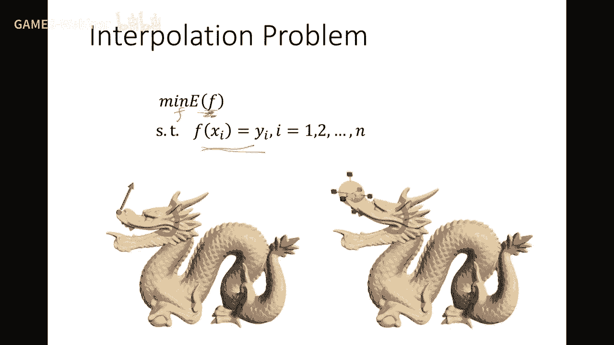

那么r b f可以做，那你其他的可不可以做是吧，这个最小二乘，这是swap 061篇文章叫moving啊，这个叫移动最小的层啊，就是这个点拖拖拖到这啊，那么那么那么那么这个点扭扭一下啊。

那么其他点这个点往下拖，问这个形状变道变到什么形状，那么这这里右边三个呢是三种不同的方法啊，这个就是它的ml 20的方法，这是以前的方法，可以看到以前方法这个扭矩比较大。

这个方法呢相对来说扭曲这个至少头部有些没有那么大，所以它有它的一个非常好的性能，因为它是移动第二层，这个下面的例子是把比萨斜塔啊，这个这个把把它把它叫校正啊，这个这个以前是斜的是吧。

好这个这个方法是这篇文章，虽然做二维的这个变形。

那同样适合三维啊，就只不过是三维空间中的最小二乘而已，好那么这这也是06年一个西瓜啊，这个这个这个这个文章呢就是在空间定了一个厂，这个厂是连续的，那么这个厂呢你可以把它看成啊把物体放在一个水里面。

这个水里面啊，这个每个点是有个流线，你只要去求这个流线，这个点在这个厂里面的运动一个一个变化啊，你就可以得到新的形状，因为每个点看的是个例子，这个例子随着流程变到这儿来，这个例子变到这儿来啊。

这就最后这个例子所形成的形状变成了啊这个这个一个新的形状啊，当然你说你要插指某个点啊，这个要让这个向量场来满足这个性质就行了，好像这张图就是一个典型的一个积分曲线的求解啊。

这个所以它这个这篇文章呢就把它把物体嵌入到一个场里面去，求这个场这个厂的话满足我用户交互的这个性质，这时候呢啊这个物体的变形就由这个厂来决定是吧，好那么具体这个厂这个有什么选择。

这个这个用这个厂这个好处呢，就在于这个厂这个厂的不同，在这里点的这个流流线是不相交的啊，所以自然保证这个物体没有直交，并且它还有这个一些别的性质，比如说我希望它的散度等于零，反正这一定是就是什么。

就是能保持局部体局部的体积啊，所以只要这个条件就会保持保持最性质，detail resume that，你可以对场进行别的约束就可以达到啊，这这是它的一个示意图啊，你可以看到啊，这个只要定一个长以后。

这个点就不是这个形状就会发生相应的改变，这是他文章中的一些例子，这文章一个强大的力强的一个方法，好处在于它中间的变形过程中啊，这个物体始终不会产生至交啊，因为长征这个不同的等高线是不会直交的嘛是吧。

所以它这个一个非常大的好处就在这，所以它比较巧妙的利用一个这个厂的一个原来做物体编辑变形好，那么你因为这个方法，第四个方法是拉普拉斯，拉普拉斯在我们以前有专门一节课讲的好，我这里就提一下而已。

阿巴斯是什么意思呢，就是我希望保证这个局部细节，而我们知道拉普拉斯这个向量呢是能够体验底线，一个顶点周边的跟周边的一个关系是吧，这个拉到向量呢越尖越长，这个点越尖是吧，所以如果我编辑后的话啊。

这个这个点啊，像这像像像这个点固定这个点往下拖，那么新的点成什么样子呢，我希望这个拉普拉斯向量啊，这个点不动或者是尽量相似，所有点如果都能保持这个这个拉布拉向量大概不动。

是不是这个形状的几何细节就保持了是吧，所以我们这篇文章在04年来利用这个拉普拉斯这个向量来做编辑啊，首先是拉普拉斯尽量的不变啊，然后满足用户交互的一些点是吧，通过一个变分就能使这个效果啊，这个这个好。

最后是通过一个求解系统方程组就可以来得到这个变形的结果啊，这个我们以前做做过作业没问题，这就是刚才那个demo说所看的那个结果啊，刚才那个demo就是拉普拉斯iting这篇文章的这个视频啊。

把把这个点往下拖，然后旋转这个这个这个爪子啊，就这个触角就能跟着变形啊，这个龙也一样啊，这个往上往上掰，它就能张开来啊，还还能做这种大的变形都没问题啊，好那么他也做了很多应用。

这篇文章呢也04年s gp这个文章引用率非常高，因为这个文章开始就是拉布拉斯坐标，微分坐标就开始流行了啊，这个应用也非常非常非常简单，它们它将是什么，把他的细节把它迁移过来。

假设这两个两个网格有一一对应，你把它的这个音对应点这个拉普拉斯把把它变过来是吧，把它把它圈啊，这个transform过来是不是就可以找到新网格，就可以找到这样的网格好。

那么这个是把人脸的细节迁移到另外一个人脸，这是把一个人头啊，这个可以看到没，把把这个兔子头啊，就这这个细节是是是人脸的神，是兔兔子的是吧，那么这个怎么做呢，就是就是假设交互一个一个边界。

这个人头跟这个边界吻合，那么人头这里的这个这个细节呢，是就连这个兔子头这里脸这部分的细节是用人头的，下是用兔子的，这时候求解一个方程组就可以找到这样的模型啊，这个呢实际上就是两个模型的拼接。

所以拉普拉斯啊也可以做人模型的这个融合和拼接啊，还可以还有这个细节的混合啊，啊就像这个也是一个应用，把把把它的那个割割下来啊，这个变到这里来是吧，但实际上中间就是一个融合，为什么呢。

这网格的这个细节是用它的这个呃，这部分的细节呢是用兔子的，这个细节是用翅膀的过渡一下，就可以求解一个方程组就可以得到这个模型了啊，那么中间过渡的过程中实际上是是个渐变啊，这是拉布拉斯。

你可以可以这个从1~0啊，这个这个渐变啊，只要控制这个拉布拉向量这个比例就行了，好啊，他同学也做得好，别的应用，把一个龙跟一个一个这个fine这个这个在这里做了，做了拼接是吧。

就可以就可以建模出这种分享的不同的物体出来好，那拉帕斯那篇文章出来以后呢，我们以前在那一课里讲了好多这种应用啊，就就还有好多好多变种啊，讲几个呃这个比较关联的变种，第一个变种呢就是这个婆送。

那普通方法呢，它这个跟拉普拉斯是本质上是数学上是可以证明是一样的，如果它的角度不一样，那这个普送这个文章呢是来源于呃03年一篇吸管啊，播送editing image editing，这个文章。

就是怎么把一个图像的一部分融合到另外一个图像的这个底色区域啊，让让这个边界看的是无缝融合啊，像它中间呢就是在求解一个啊呃两阶的这个偏微分方程，就是普通方程像它的这个这个这个做法嗯，非常简单。

就这就这是个框啊，你要怎么把这个里面的颜色融合呢，我这个框边界是颜色取成这个背景里面的梯度啊，就跟这个这个图像的系数是一样的啊，那么这样一个变分就得到一个微分方程了啊。

就是拉普拉斯等于这个这个长着就是这个梯度的散度啊，就可以求解，那么04年他们就把这个方法呢就推广到了这个曲面啊，也学了什么呢，我如果这这这个偏见我进进行一个交互。

它的这个交互这个这个所产生的变化呢就传到里面，每个三角形的梯度的记住独自需求的时候，系统就就就打反了，那怎么办，通过一个全局的一个普通方程，你身上也是一个拉不拉方程啊。

嗯啊这跟普通方程的这个区别就在于右端是零还是非零啊，呃普通方程呢是这个是可能非零，如果这个是零的话，就是拉布拉方程啊，好那么就可以得到一个这个这个变形后的物体，最后结果是这个是是这个这个结果好。

嗯中间还有好多别的方法啊，都是在保保证这个可变形过程中保持一些性质啊，像这个呃这文章呢呃我来解释一下这三点呢是是是句柄handle是吧，那那那这这个点呢比如说是像这来问这个形状词怎么怎么变。

这篇文章就是把这个求函数这个问题啊，我们以前学括号，把函数问题你可以定在整个区域上，是不是有零元函数定义在什么呢，定义在这个一些有限单元上面，就现在把这个函数分分解成很多小小函数。

就没函数定义在这个这个小扇形上面是吧，所以我只要去求出三角形怎么变化，诶，我就求出了最后的这个变化是吧，好那么我没三角形怎么变化呢，我尽量的保持三角形跟圆三角形尽量的相似，就是又回到以前的ap这种思路。

对吧好，那么如果单独去去去，毕竟它呢可能裂开来了，最后在什么global再求解一个方程组就可以把它缝合好嗯，那么那么这个呢是03年啊，真的是07年，这个就后来这个在3月中用拉普拉斯这个角度。

或者拉普拉斯的这个语言，又可以来来那个重新对这个问题进行formulation啊，什么意思，就是每个在空间变形过程中呢，要保持这个我的拉巴斯向量，或者说我的这个旋转没事没发。

角形在空间只发了一个旋转不变形，所以它这个也叫ai ap啊，as read as possible，我们08年那篇参考文章，这个这个很多启发也来自这篇文章，这是它的变形变形的一些结果。

从上面那个图也可以看到，那么那么这个呃把一个开始出初始的时候只是一个这样的柱子啊，把柱子，然后把把上面这个呢边这个样子来啊，那么开始一个初始值是什么样子。

然后通过那个as rich as possible那个迭代就可以生成这样一个模型啊，啊下面是他做了其他更多的例子啊，就看到ap呢比当年的这个纯拉普拉斯较好的地方呢，就是它中间会膨胀起来啊，如果做得不好。

这是拉布拉斯，结果就会就会收缩，因为拉布拉向量是跟这个旋转是有有关系的啊，如果你旋转学不好的话呢，就拉布拉斯坐标保持原来坐标呢就就会出问题啊，好那么05年这个这篇文章当时也也是蛮有意思。

他这文章呢是呃就宏文讲一讲嘛，就是它是保持了这个曲面的那个呃用了微分几何的曲面的，机基本型和第二基本型，它本质是什么，本质就是保持了就表现出来是相当这个向量的啊。

这个一些一些在在这个顶点的坐标系上的一些参数上，文章可以可以证明它保持了这个曲面的第一基本型和第二基本型，你在做编辑的时候呢，如果你保持原来的曲面曲面的第一行和第二行上，就是保证了它的一些几何性质啊。

就可以通过这个机异型和二型从建出曲面来啊，就是他的思路是这样，大家有兴趣可以自己去看啊，我就不展开，我主要大概讲讲做一些思路上面，无论哪篇文章，他都抓住了某一种几何性质是吧。

你你可以看到是前面的rbf找不到了呃，播送巴拉斯到后面的这个ap是吧，都是在保持某些性质，像这篇文章是保持什么，保持曲面的一型和二型，用到了数学上的，就微微解上的一些性质啊。

那么通过点拖拽就可以看到这些方法上面有有很多这种方法是吧，好那么只不过这个handle变成什么，变成了一条线嘛，所以方法上面大部分都可以共用是吧，这个编辑现在就有比编辑点要来得更有力一点。

比如就是说呃这有一只这个鸟是吧，我希望它的脖子歪一下，我可能交过这样一条线，那那那那变成白的是会会来得更加更加一点是吧，那么你比你去交互很多点要来容易，所以呢呃怎么用线段或者曲线来交互啊。

就可以省很多交互量啊，比如这个很早年就有这个方法来教过一个形状诶，我取中间的一个轴啊，这个轴可能是中轴，也可能是股骨架啊，中轴是数学上的定义，是有精确定义的，上节课提到了是吧，股价呢是人为可以标的是吧。

好我把我把我把这个这个中轴骨架它编辑成这个形状，那外面这个形状就可以跟着跟着变是吧，这里呢有两个，一个是怎么编写这个曲线啊，这是有问题，那么这里就有一个词啊，这个做动画的同学可能做过就知道了。

我怎么把一个底边，这个原来是别人点股价上的点进行观点啊，这个就是一个叫blending，而且全就是这个实在重画，做逛街动画的时候，这个非常重要，你这个诠释的好，我这个股价变了以后，我的形状就变得很好。

如果设置不好的话，这个全片子不好，那么这个可能变形来就会出现滞销啊，因为这个例子比较简单，这些复杂的例子，这个股价是这种复杂的，然后然后然后然后那个形状呢就是这样的话，那么那么特别是碰到这里的时候。

它既跟这个股价相关，又跟这个股价相关，这时候他他们那个圈我们来影响它这个这个权就非常重要了，如果诠释的不好，我去触动股价的时候呢，这个地方呢就产生了非常不好的现象啊，直交啊或者是空洞啊等等啊。

所以刚才说的那个啊那个g函数啊就比较重要啊，就对g函数我怎么根据这个呃消泡后的p一撇得到我的s一撇啊，那么这里就是要要要要去怎么样根据骨架来决定我的形状啊，这个这个变化非常好，好。

这个你可以把一条长长这样一个鱼啊进行绕啊，那后面还有很多人提出啊啊我怎么去编进行文，我交过一条线，然后把把它把它把它这个交汇一下，就可以把这个腿给拉直。

所以用这种sketch或叫skeleton来就编辑到适合于那种长条形的，比较天然的羽翼骨架的一些形状是比较比较好的，这是另外一些例子哈，有些例子还去交互什么交互啊，这个一个轮轮廓线是吧。

来把这个轮廓线改成这个一个这个形状去，里面也也跟着变化了是吧，都没问题，还有把他的脖子歪歪啊，所以所以这里面这个最重要的东西呢，就是我这些线变了以后，我这这个曲面怎么随这个线来进行变化。

就是这个这个mapping啊，这个刚才说的那个影射就很重要啊，这是另外一个用骨架来做变形的哈，这个他呃这骨架呢不是精确骨架，它是用了一个文外图，就是我认为diagram的图的。

这个上节课我们刚刚讲到是吧，然后通过这个文案或者这个立方体啊，就是就是四面体来进行一个呃一些性质保持，然后股价变了以后呢，就是新媒体在变化，像那种的相当于就根据根据刚才那个ap 3角形分解一样。

它把这个这个连续演示分解成到了这个每个四面体的一个变形啊，只要你这个变形保持住啊，这个啊变形效果就就能接受啊，这是它的一个例子啊，啊这也是早年一篇文章叫wise while呢。

是理解起来就是怎么怎么现是吧，它呢定义了一个比较特殊的一个一个编辑编辑，这个编辑手段啊，定了一些这样这样的轮廓线啊，这个细线线呢就叫wi，它又通过编辑这些while。

就是说把把把这把这个这一圈变大一点啊，把这个鼻子这一部分把它拉长一点，这个曲面就变成变形是吧，所以这里有一个问题跟刚才skeleton啊去那些一样啊。

就是你只要把曲面原来曲面跟着五二十间的对应关系怎么变形啊，这个定义好，那么我通过编辑这个while就能够驱动这个原来曲面的变形是吧，具体怎么怎么去做，每个人都会想到自己的方法做，没问题啊。

关键是这个思想啊，就是哎我我我通过这个这个比较愉悦的一件vs我来编辑，它是不是就就更加形象一点是吧，好这边是48505年一篇文章啊，就是从他的这个编辑呢，这个sketch呢就是什么。

是通过这个cvt cvs，什么呢是指轮廓线啊，比如说这有一只耳朵是吧，我我首先啊交互也好，自动检测也好，检测出这个轮廓线，然后那我用户把这个轮廓线进行修改，问这个耳朵是变成什么样子啊。

我这边看一下蓝色的是原来的这个耳朵的轮廓线，我教过成了绿色的，那么这个耳朵变成什么样子呢是吧，然后你教过这个样子啊，这个耳朵可能就变成大一点，尖锐一点，好，我可以交互的稍微小一点是吧，就变成这样子好。

所以你可以看到如果是沿着轮廓线去交互，大家可以你想想啊，我应该保持什么样的形状，我的耳朵还是认为是一个耳朵呢，是吧啊，这篇文章上处理思想啊，跟04年那边拉普拉斯是差不多的啊。

只不过他交互手段变成了sketch，变成cvt，它本质上还还是用了拉普拉斯这样一些这个这个报纸来做这个这个呃，这个结合性质的这个啊优化啊，好这是他的另外一个例子啊，就是当时做的效果还是比较好的哈。

你这个边界变成这个边界，然后中间的这个曲面啊，这个保持拉普拉斯就可以来来这个得到更好的解，所以基本上当时提出了一个这个survisketch的一个概念，好同一年也有工作，就把这个推推到的那个体的。

就是利用这个铁里面，它它把一个模型生成一个四面体里面进行填充，然后里面的铁是这个顶点，边面也是构成一张图啊，所以保证体里面的这个拉普拉斯就能够保持一些，就比如体积不收缩。

以这个保局部保体积这样一些性质是吧，所以把这个表面的拉普拉斯就像是把二维的拉巴斯推广到了三维，拉普拉斯就这章是在做这个事情，这这时候呢他他有了这个提的这个拉80，所以它很多情况下不会收缩啊。

因为它这个保保证保持了那个生命体的拉普拉斯啊，就不会让这个这个表面的拉倒是那样进行呃，这个这个这个收缩它还是会保持一定体积啊，这种现象就就看得更明显了是吧，他这个他这个部位不被这样挤在一块。

也不会进行碰撞，基本上它还做了做了一个应用，怎么从卡通图像来来来生成这个三维模型的这个变形序列啊，嗯实际上都都在都在你和他的上的轮廓线，然后用这个铁的拉拉斯就够了。

好那我们看一下基于这种线或呃这个草除代理啊，你看到有些是交互它的future，有些交互它的轮廓线，交互它的这个骨架啊，还有这个wise，还有还有这个这个图像对吧，就看到就是无论你用什么。

像你关键核心还是构成那那个那个函数，你保持什么东西是吧，是保持拉普拉斯还是保持一些别的性质啊，这些胶布呢你都可以去自己去做扩展和设计好，那我们再讲这个更加复杂一点的这个这个这个代理代理呢。

它不是一条线了啊，它不是一维啊，它是一个什么三维或者平啊，一个一个三维的这样这样一个麦序了，但是呢这个但这个mc呢就比原来的mac呢是要简单，比如说啊我以这个除了这个呃，可能这个模型大家看得出来吧。

是是个鼠标啊，中间还有个古人哈，也也也会影响到这个鼠标的这个这个形状是吧，体里面，鼠标是不是跟着放大，那你只要定义好鼠标上的每一个内部的每个点，你就可以去啊，就代理以后。

那里面的每个点是怎么变这个关系有了你就可以去做的事情是吧，好大家想想这有什么可以，你可以来定一些关系呢啊你可以讲讲不同的函数对吧，那你是不是可以在你这里面定一个呃，这个这个这个三三个张量的变量条被这。

那你就可以定义中间的一个一个体了是吧，然后控制这个这些顶点就看成是这个曲面的北造体的控制顶点，你不就可以去控制里面的所有点的这个这个变形吗，或者函数关系好，这就是86年setbg啊。

这个发明的这个f b d，所以他能把这个模型嵌入到一个非常规整的一个六面体里面啊，这个llis有规整体啊，然后这个nice呢它它用一个这个张量的比值去定义，就p i j k呢就是这些零点啊。

所以里面的任何一个点就是u v w啊，就是由这些点来定义的好，这些点进行进行编辑以后，是不是任何一个点心位置就可以算出来啊，就把每个点给他介绍一个新的位置，就可以找到一个新新的形状啊，就这就就这么简单。

这个这个里面的点都是网格吗，每个点算出来再保存，通过关系就可以算出新的形状来好，这就是当时86年，但是也呃30多年前了啊，34年前啊，那你可以想象那时候的计算机也也是非常弱的。

能做出这个效果还是不错的啊，我把这块放大啊，做做编辑啊，所以就可以得到这样一个形状，就水瓶也一样，我把中间一个一个平行，这样一个伸缩就可以，然后这个题呢容易编辑，就影响这个里面的这个形状的变化啊。

是啊再用那个另外一个语言，就是这个这个形状嵌入到了这个体所定义的一个空间啊，这个体这个这个代理变化，它的空间就变化，就能影响到这个形状的变化啊，所以思想都是一样的。

只不过这个代理呢这里就提升到了一个空间的一个网，北子你控制点这个控制顶点啊，平行进变化曲线是不是也跟着变化了是吧，好更广泛的一类这个代理呢我们把它叫做k局，k局是叫笼子，鸟笼的龙啊，鸟笼就是你把一匹马。

你可以看看周边形沿着这个曲面具体怎么构造，本身是一个非常复杂的问题啊，你可以手工，你也可以啊，当当当年也没讨论啊，我们后面也有很多paper，来来来来来，那个研究怎么去找一些比较好的这种啊，k局代理。

好好这个这个这个k就找到以后的话，我对这个k就进行编辑，是不是就只要拖动几个点就可以变到这个形状是吧，好我问这个马变成什么形状啊，那么这个是什么问题啊，y后面这个简单多边形变形了，里面每个点都会变。

是不是我们就是我们以前讲的重心坐标啊，我只要把里面内部的每个点有边界上的点所表达出来，所以坐标表示出来，那么内部的这个网格怎么变就可以算出来，好好一起到数据坐标。

你讲了有个有个网站是不是是不是列了好多好多这种一发不同的形式，哈哈发明出的这样的一些技术，大家可以去看啊，那个可以可以回去找一下我们以前讲的总体坐标的那个那一小节啊，工作很多啊，value的有哈。

莫尼克有什么什么很长短的重要标，还有一种是叫motional duration mulation，它的代理是什么呢，它代理就是点点点点很这个曲面顶点很多是吧。

我呢可以对它进行一些简化或者叫光顺或者叫简化吧，啊简化这个顶点就少了嘛是吧，然后呢然后我就在这个顶点少在顶点的进行编辑以后，再把这个细节给了给它加加回来，细节给它加加回来啊。

就得到一个啊这个原来形状的一个变形啊，所以所以这部分是我操作比较简单是吧，但我这里这个例子里面是呃，这个这个这个这个形状只是做了个光顺是吧，你肯定可以做简化啊，像这个就是例子，就是做简化这个顶点啊。

这个曲面简化后可能只有几十个顶点或面片啊，对它编辑就相当方便，把它们之间的差异啊，把它加上来就变成这个样子是吧，那么你们上周作业就简写或者简化，那么简化的那那个简化的那个算子的这个量就是细节。

你把把他加回来就可以找到它好，所以你们做过卓越九啊，这个这个编辑效果或者算法就能实现，那么mc这个process你看到从灰尘的lis到cage到这个简化的形状啊。

所以他们会寻求啊不同的这种简单的这个题来进行这个代理啊，编辑好我并进行编辑，这个或者叫变形，还有一种这个叫transfer，就是我呢我骆驼进行编辑呢，我可能我我我不知道这个骆驼怎么跑。

但是呢哎我知道这个马的跑的序列，假设这一行是已知的是吧，能不能让骆驼也来跟着马将跑的序列，我也可以做出来是吧，那么这个叫transfer叫什么迁移马的，这个是变形效果，把它迁移到骆驼上面是吧。

所以里面一个关键的或者叫大很容易想到，你只要跟骂马跟骆驼有个对应关系，你把这些买了这些所谓的一些性质，比如说一些每个三角形的旋转，把它牵引过来啊，ly到这个骆驼身上，就是它的这个线条，这就变成它吧。

它的偏线到这就变成它吧，就这样可以做，是04年呃，应该是这些年这篇文章第一次提出，来来哦，不来到这个模型上面。

06年呃，也是一样的哈，就是你可以看到我，我去进行一个曲面变形，我把它迁移到另外的形状。

另外两点上面好，后面可能内容还有不少，我们快点讲啊，那基于炒作建模也是一个啊这个比较流行的啊，前面虽然见讲过几个基于sketch，sketch就叫草图啊，这个叫sketch。

就是根据朝这个建模呢就更加一点就是什么我我我用户教会一个草图，能不能很快得到一个商业模型啊，就想达到这个目的，就这样的话，小朋友只要会画画啊，画画一些草图，我我就能够啊去就是自动产生吸商业模型出来啊。

就让他建模的门槛可以进一步降低，这个早年这个中国画一些圈呢，画一些，这样的话就是能不能建出一个这样的小这个卡通模型出来啊，那么呃这篇是我们10年和10年前了啊，当时还有我这个摩托生做的啊。

就就用骨架来这个草图啊，那么这个骨架呢我们这里面每个骨架的关键啊，节点上面去定义定义了一个球啊，这个是可以修改的是吧，就这样的用户只要去估呃交货这个股价，然后呢这个就可以生成这个商业模型。

最后再用细分把它进行一个光顺啊，那么这个方法好处在于什么呢，在于这个甚至这个模型呢就比较规整，因为它可以是四边形化啊，有利于做后面的细节去雕刻建模，我们等下就会讲交易建模啊。

好我们看完这段视频可以看到嗯，中间任何一个球这个关键球都可以进行一些修改啊，中间这些对征信可以保持啊，那么这个网会出来了，这个网格有因为它那个是个骨架生成的，所以它的网格基本上都是四边形，有个好处。

有利于这个被home后面的那些啊，啊所以所以后面我们也把这个技术迁移到了另外一部软件啊，让小朋友就可以通过简单的这个交互啊，生成这么多好玩的模型，好可以变成model，这个从上最早的鼻祖应该是这篇文章。

这个这个这个文章叫teddy，非常非常有名好，我后面也有很多文章不断的去去去去进行一些改进啊，或者从不同角度上去进行一些升级啊。

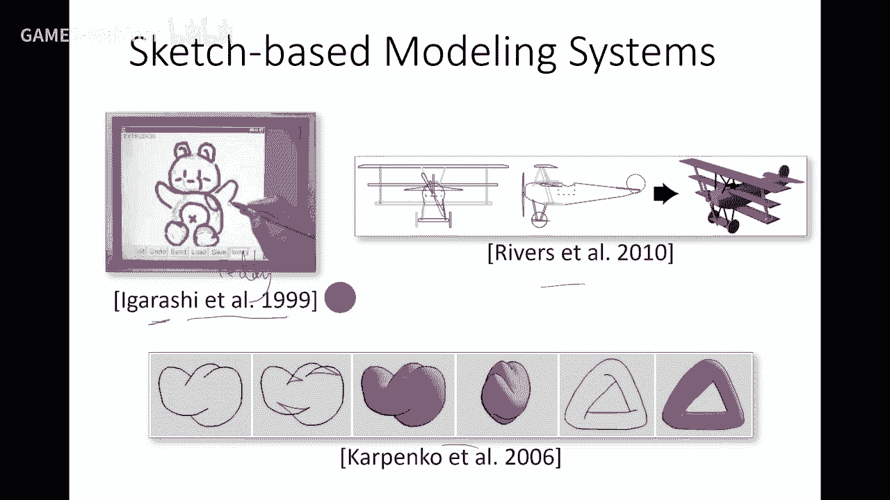

还有就我怎么样通过一个sketch建一个三维场景啊，那么这个sketch怎么去理解这个sketch是什么模型呢，它它有个data base啊，导致在这段这段贝斯里面的一个三维模型。

把它把它把把匹配进来放进来是吧，好那么这个呢也跟后面要讲的这个最基本的这个model有关系啊。

我们后面还会再再展开一下啊。

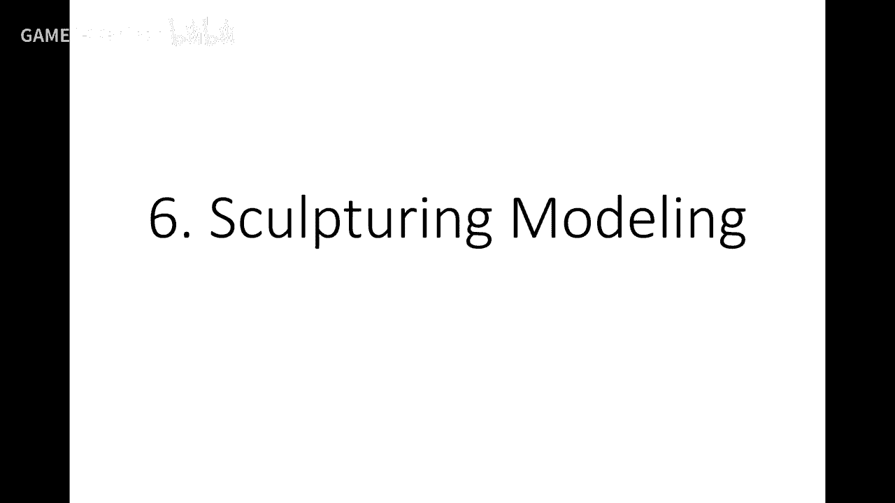

第六本这个叫scary啊，这个是什么呢，就是看看到我们在特别是在一些游戏动画里面啊，经常看到这种高细节的啊，这个这个几何细节非常复杂的一些模型，这个这么这么多细节，那么是怎么来做的呢。

啊那么可以看到人类去雕刻一些细节的时候，会有不同的工具啊，去把这个材料给它给它破掉，或者是把它增加是吧，所以呢你看看这个视频，这个雕刻建模啊，这个键盘是什么呢，就是我我一个模型上面呃。

我可以用好多好多不同工具啊，你这个工具呢可以把它理解成是个刀子啊，那刀不仅只能割掉物体，也能够也能够挤出一个物体啊，通过这个非常小的刀啊，实际上是在工具里面叫叫brush，叫比刷，就是在那上面刷。

就像辅助校准面刷刷刷颜色一样的，只不过这里是刷刷一些这种啊条纹啊，或者这些细节上去就可以，也让一个从一个粗糙的一个网格就啊慢慢慢慢刷刷，是一个非常精细的网格出来啊。

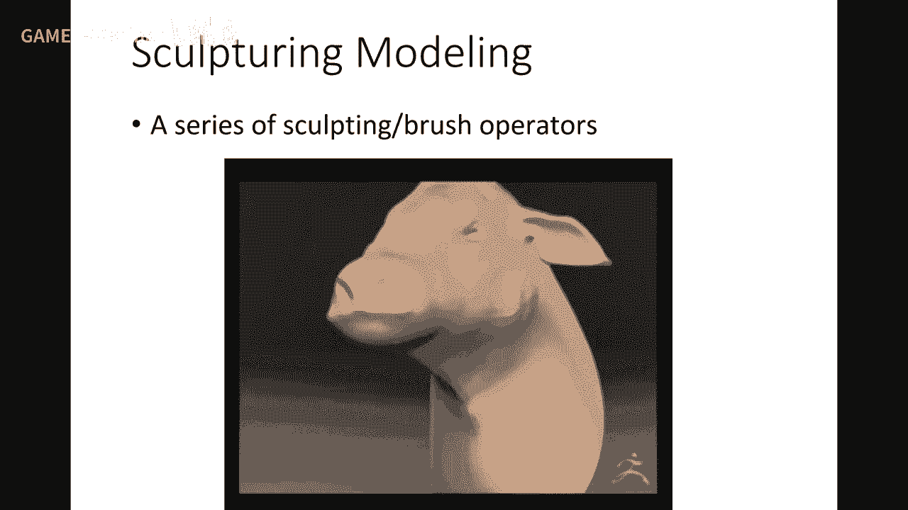

这个叫做雕刻建模啊，雕刻建是呃有好的工具啊，呃像像在大家如果不再用过门哈，像box啊，这brush brush是比较有有有有名的一个软件，就雕刻建模可以建出极其丰富的这个结构细节啊。

是auto desk recall，早年也是比较流行，你可以看到这里啊，你如果不选择不同刷子，它刷出来这个细和细节是不一样的，可以看到它有它有好多刷子，还有还有还有这种呃有点像纹理合成的刷子啊。

可以刷出不同的这这这种凹凸，这样小小小颗粒啊，所以很多工具也提供了不同的这样一些这个刷子啊，然后你可以在表面上进行一些雕刻啊，进行一些细节添加啊等等等等的这样一些建模好。

这是一个比较典您的一个案例案例啊，这个网格可能开始没有细节比较光滑啊，那呃给它加密以后呢，我雕刻啊就可以调细一点，然后又可以给它加密再雕刻，最后就是要设置一个非常复杂的。

像毛发这样一个呃这个这个这应该是牦牛的一个模型啊，啊那么修改editing呢讲了很多，我们这里做个简单总结哈，这个前四种啊啊只只是方法论上面，我把它归纳成啊啊嗯我也可能以前我也有人这样归纳哦。

但是我是今这个这这段时间我我自己来归纳，就是这个的这个proxy代理代理也可以简单的点线啊，还有复杂的网格，还有其他的是吧，还有什么从别的形状去学啊等等啊，这些是上里面这些工作。

就刚才讲的都是在保持警细节，保持什么拉达斯啊，保持距离啊，保持这个体积等等是吧，还有一种变形啊，这个上就是纯纯物理的，就基于这个物理的，比如说我一些材料我要进行检查进行看现在变形。

那么这材料变形实际上就要遵循这个有限元分析啊，这个材料力学，弹性力学等等啊，那么这里面就是属于另外一个重新学的，第二个就叫station，叫叫station领域，所以我我们这里就就不专门讲啊。

这个这个做一些这种啊，顾理财这个防防针啊，game是201，就在讲讲这个液体的方针是吧，就这里面就是也是变形，就你想象一下一个果冻，我给它一个力，这果冻是不是也也会进行变形啊。

这嗯这时候呢你你就不能用纯几何的方法，用物理方法去做啊，就就会更真实一点好吧。

那么我们这节课呢就不展开啊，我们不去讲这个事情好嗯，也提到过这个推塔均衡的这种model，这是最近的10年来这个比较多的文章啊，这个现在这样一些呃技术这个它背景是什么呢。

背景就是说模型越来越多了啊，你可以看到网上还有共享网站，有很多模型啊，这个以前呃100个就算是比较多了，现在都是上万十万百万级别的模型好，那么怎么样从这个模型上面去进行。

也许啊这个这个从用性把你有的模型的一些一些部件重用起来，这就是呃data塔基本model的一个目目的，比如说啊好我们这里有个图啊，这个是04年cpu cpu为一篇文章，这些思想挺好。

就是说我我我要我们数据库里面有有这么多椅子啊，那么我我能不能从不同已知提可以不同的这个部件把它煮，从一把新的引子出来的啊，就是诶我从example里面去去去组合出一个东西，东西出来是吧。

所以我我怎么我我这个把数据库里面的这个以及呢做语义分割线，不同部件，然后再通过我的用户的交互也好，还是选择也好，就可以生成新的模型出来啊，这这个模型在数据库里面是肯定没有的是吧。

可以又可以增添或者交充实这个数据库，那么这是另外一个例子，它这个从数据库里面不同的帆船组合出一个新的帆船出来啊，这个这篇文章是算利用了这个机器学些里面的这个bs网络。

他数据库里面有大量的这种呃这种动物模型，它又把它分成了这个身体呀，尾巴呀，腿呀，头发等等部分，这样的话呢就是这些模型里就构成了这些语义部分的一个一个图，这个单从数据库里面就可以找到很多概率啊。

比如我这里有个身子，那么大概率就好，这边就有尾巴，所以它是个条件，概率已知身体还有的情况下是什么样的尾巴，数据库里面是可以得到一个概率预测的，那么通过这个概率预测可以去。

当然会拟合出一个贝斯这样这样一个概率模型出来，这时候呢它有界面啊，好我这里面有好多动物的头，也有好很多角是吧，好我用户讲他教不出来这样一个形形状，问大概是什么头会会概率最大啊，这个系统会给你推荐出来啊。

可能可能是个羊头，也可能是个牛的头啊，因为这个就有下面这样一个伸腿和脚的情况下，这个头是什么，什么概率是可以由刚才贝叶斯这样网络给他推断出来。

后面还有晚上读paper了，我们就简单提一下，就这篇paper是把这个这个三维形状呢把它印到一个高位空间啊，在这个就嵌入到一个高度空间，然后在高度空间中啊进行一些这种相似性啊，皮皮背啊。

甚至来擦拭出一个新的形状，最后再还原到我们的三维空间，就得到了新的一个引子啊，啊这本是早年啊，也有8年了哈，这个当年呃我我参与了一篇文章，就是怎么从一个图像去构建一个椅子啊。

那么这个这个图无相的一个信息呢，就是这个cat就是这个轮轮廓线啊，所以那基本思想就是我们去数据库里面去找一找一把椅子，跟这个轮廓线最相似，然后再进行变形，但是过程中呢我要保持已知的这个一些这个这个特征。

比如说四条腿要平行啊，要等长啊，这个坐垫要平行地面等等这性质，所以并行过程中是要满足很多约束的，这个约束就来源于这个已知本身的结构啊，但是又要遵循这个图像的轮廓，已知的轮廓，所以它只有两两个约束。

一个是轮廓要向图像的已知，第二个监控要保持已知的这个语结构，这时候在基本变形就可以得到一个比较像这个这个图像里面，以啊这个已知的这个项目模型啊，在西瓜2012年好。

当年我们只说唉我们通过谷歌啊去输入chair，会找到好的好的好的已知，那么从这个选选择已知就可以去得到一个新的这样一个模型出来啊，当然数据库里面没有的椅子，像像这种红的，我我们就做不出来。

因为数据库里没有不存在这样的相似的椅子就就没法做啊，这是当时一个10年第4年的一个图，好嗯就是这个是清华大学啊做的一篇文章，用的也是用图像来来做这种商业模型，它里面分析了这个aptive。

就是有一些啊这个叫叫做呃这个扫扫略啊，就是这个管管状的，所以它定义了好多阵容啊，那广义的cinder去fit这些这些图像的celebrate，这样就可以造出这样一个模型出来。

这是我们13年一篇cp文章啊，这是我的一个博士生啊，直达博士就是1年有篇文章叫shutter joe，就是他通过大数据，然后通过这个大数据啊，就可以呃让人画画的时候呢。

给出一个阴影来指导用户啊去画画的这个像啊，就像一把椅子或像一个衣服，那么我们把这个想法见证到了商业建模，就是我们建过程中，在交过程中呢，我们背后也有些阴影，这阴影是先走呢。

就是提供了大概率说你往往这个方向画，能得到模型的这个效果比较好啊，你就遵循这个阴影。

你就可以去啊不断不断去优化出这样一个模型出来啊，是当时的一个demo，我们做完论文以后做demo，你可以看到它的过程中，这个阴影是时时刻在变，为什么在数据库里啊，会提提出这个根据你画的这个结果。

然后去找到相似模型模型，这个概率呢就提供了一个这样的阴影啊，让让你去follow这个阴影，画的会更好一点啊，中也是保持了一些这个这个high level的一些特征对称性啊等等。

那么这个我就不详细讲啊，时间有限，然后这个这个是最近的5年吧啊出来大量的这种叫generative models啊，这个就是game啊，这个生成对抗网络，利用这个身份对抗网络生成。

那我们呃网络是呃神经网络，我们以前讲到它的本质就是一个函数对吧，那么这个函数呢它在那个这个叫叫隐空间呢，它里面fit了一个高斯高斯模型，那么高速模型呢怎么就废除了那个隐空间的这样一个分布。

然后呢中间随机给给一个数，那么就用这个这个这个函数呢就可以生成一个新的模模型出来啊，这些模型呢它并不是原来模型的拷贝，它是中间的某一个差值出来的是吧，差出来那大概率可能会是个已知，当然也可能不是已知啊。

那么呃呃原理是这样啊，就是说通过这样一个生成模型就可以生成很多的新模型出来，当然这模型要好的话呢，最后还要接一个对抗网络，让真实的尽量的好，不真实的尽量的差对吧，所以这样这样对抗生成。

看这样这样这样一瞬间以画这个这个生成模型就会越来越精准啊，就这个最近几年出了大量文章啊，我这里就不讲，大家有兴趣的话可以看一下那个账号，就是sf u，就是山东freeze的大学，加拿大啊。

嗯这个张浩教授在去年我签了graph啊，邀请他来做个报告，他就讲了这方面工作啊，啊也写了一篇这个这个star叫state of art综述，有兴趣大家可以看一看啊，你也可以关注一下啊。

深圳最大网络呢它确实能啊容易生成这样一些新的模型，但是呢这个模型呢这个精准度啊，这个有些时候好，有些时候不好呃，写文章的时候，大家都说是会挑一些好结果来秀嘛，不好的，这个这个不锈是吧。

就因为它本身是个差值嘛，它差值之后来中间结果到底有没有语义，这个是没没法定的啊，当然后面也有一些呃，研究者呢会把这个语音信息也放到这个网络里面啊，让这个生产出来的东西啊，这个保持的更好。

好想想这个国科大许凯他们做了一些工作。

好啊啊。

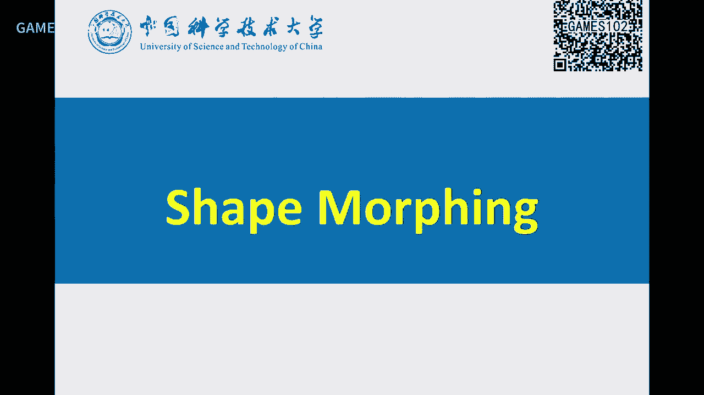

还有十多分钟吧，好我们讲讲讲完这个morning morning跟那个editing这个呃有点有点关联啊，什么呢，这motion是什么，是给定这样一个a好，就一这两个形状是给定的。

我要生成中间的这个这个形状好像要插值出来，你把这个b看着两条形状，中间形状要差值，就是为了做这个关键帧动画啊，我们呃我不知道以前讲过那个关键词没有叫key frame animation，关键帧。

那么那么动画师可能只涉及一些关键帧，中间的啊一些形状的，所以中间很多很多形状不可能中华失去设计，那么他就这种生成啊，所以呢中间呢这些形状也是通过通过要生产出来是建模出来，那么它建模出来怎么建呢。

是根据a和的信息来混合出来的是吧，所以它是从a和b差。

那么这个很有用，就是用在工业设计，这个就是关键帧动画啊，k f我用户设计的，然后硬币硬币between是这个擦出来的，这样的话就连续就可以一个马上奔跑好，上面的是在工业设计里面啊。

这个呃呃比如说这个是一个比较有名的，下面这个应该是个葡萄酒瓶子啊，这个是一个可乐瓶，但是呢你完全嗯跟他这个相似呢就侵权了是吧，那我能不能诶这两两个做的做的知名品牌。

我中间那根据这两个形状呢差指出一个新的形状，我中间挑挑一个还不错的，作为我们这个这样这样一个新的新的产品的外形啊，像这个右边这个是呃呃四个角啊，这是给定的眼镜。

中间可以生成很多很多查指出来一个心中间的眼镜啊。

就有这这四个眼镜的形状和特征啊，跟那个物品或者demvp我们讲的变形是什么，知道a我去找一个函数，然后找到b是吧，那么那是什么，知道a和b我要反求一个f啊，所以物品相对来说更难一点。

因为什么a和b我我要我要我要找这个f是什么，是要把a变成b就是指哪打哪是吧，这个呢是呃我这个f我反正具有硬性值，我打打字码是吧，这个这个形状到底是啥，我也不知道，我只要把bf求出来。

我就可以求出这个变形的物体，但这个什么b是要给进的，所以这f要怎么怎么做，也可以叫叫做blending啊，混合呀，平均啊，差值啊等等和全c选项和过渡啊，好那么一个好的好的morning当然要比较自然啊。

而且用户也要可控，然后问题很简单啊，我们再再描述一下，给定临时这和一时刻的两个两个模型，我要擦拭出中间时刻的中间模型，使得让这些模型光滑的过渡过来好。

那么这中间的模型就是morphine所要做的做的事情好，那目的呢在这个呃这个呃我们重新学建呢，基本上就会把它分解成两个问题啊，因为你要去擦拭他们新装，你首先要知道它们之间点缀关系。

所以这个第一个问题叫correspondence problem，听完以后，我就中间就可以生成新模型了，因为每个对应顶点我就可以生成一个新点是吧，那这个叫past program，叫路径。

问题上就是中间过渡这样这样一个路径啊，所以有两个问题，那么这两问题我我我我那个分别来讲啊，这个稍微讲一下思路啊，工作也也不少啊，那个要散开来也不是这么短短的时间，讲完好，我就讲一下思想好。

我怎么样给你一个a给这个b，我怎么怎么怎么样生成他们中间这个叫叫做一一次的这个网格呢是吧，这一次网为什么顶点一一对应三仅仅要一对应，是不是就这个就一致了是吧，所以一致的话呢。

这个这个叫compatible mah，在有些论文你叫consistent会回去叫ter map啊，叫intercept map啊，这个曲面之间的这个这个这个影射，他就在找两个曲面这一个一一对应映射啊。

所以这前面呃你呃两周前讲的那个影射就在这里要用要用到了啊，就这啊如果引申这一节，大家同学还有经验的话，印象的话就知道它就是个优化问题，好好，那么所以这里面你要去找这个影射，这个中间还是有很多挑战的是吧。

两个模型顶点原始顶点是不一样的啊，还有特别是几何特征也差别很大，你怎么怎么弄是吧，好那和方法论上面的还是呃大家基本上就是呃会比较相似什么呢。

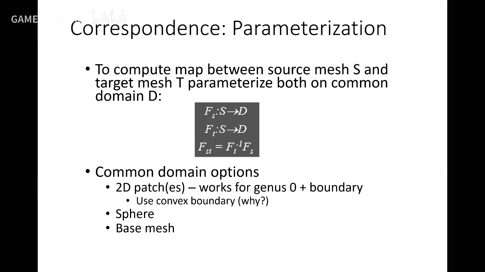

我把第一个就是我找一个公共的这个这个区域啊，比如说这个是模型a这个是模模型b我把a呢也参数化到一个工区域，b也参发一个工区，那么和逼着这个这个突破关系就在这个工具上集的体现。

像这个工工区域是不是就是差的化，这个b是三维模型嘛是吧，所以你你你变成一个，比如说同样上的话到一个八边形好，那么这两个模型一个是a的，一个是b的，那么这两个是不一样的，这个to b to b接口是吧。

那没关系，怎么样，我把我把他们两个叠在一块儿啊，这两个拓扑结构呢就生成一个更复杂的图图模型啊，中间有些是是相交，是不是这个就生成了一个公共的拓扑结构，结合以后哪些点增加了哪些三角形增加了。

我再把它引射回去啊。

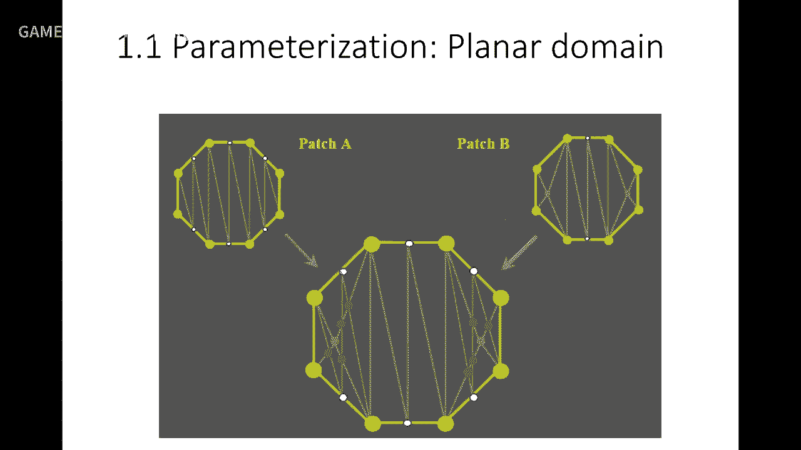

就得到了a和b的一个a和b的一个加加密啊，那么因为他们具有设了一个公共的一个加密这个拓扑结构，所以说a和b呢就就有有公共的一对应关系了啊，这是这是非常自然的一个想法啊。

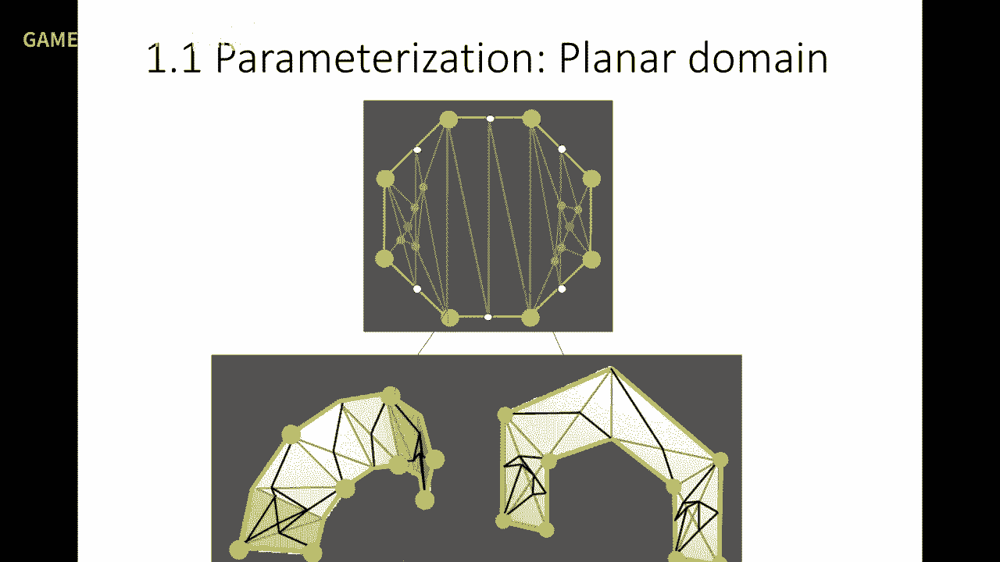

早年都是这样做啊，那么当然你说我我对封闭曲面，我把它引申到球面啊，在球面面上进行刚才那个操作可不可以。

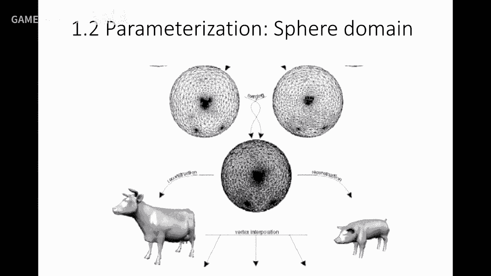

没问题啊，就是在球面上来操作这个事情啊，还有诶我不是在在那个曲面啊，曲面上做，我把它多多简化，如果然后简化的这个这个容易因为顶点比较少嘛，就容易建立一对应啊，在这上面建立了经营以后。

再把它放返回去也可以啊，这99年啊一片西瓜啊。

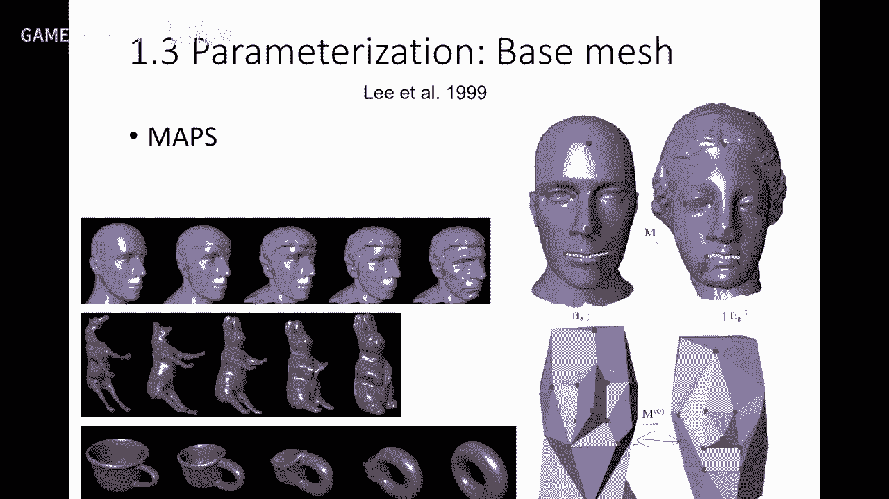

这是这是这是另外一个效果。

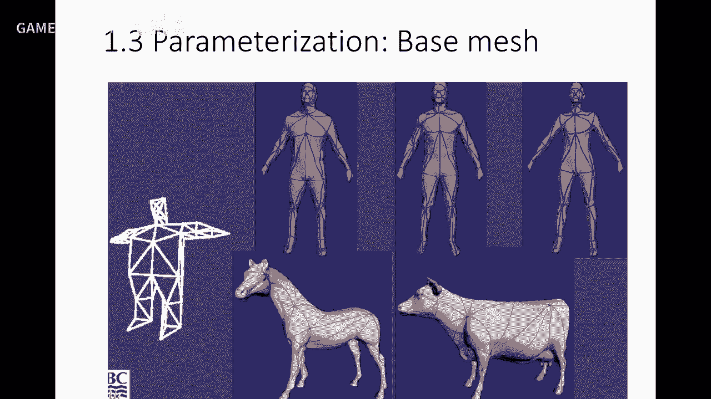

所以他甚至可以把人跟动物也生成一个compatible，一个mesh啊。

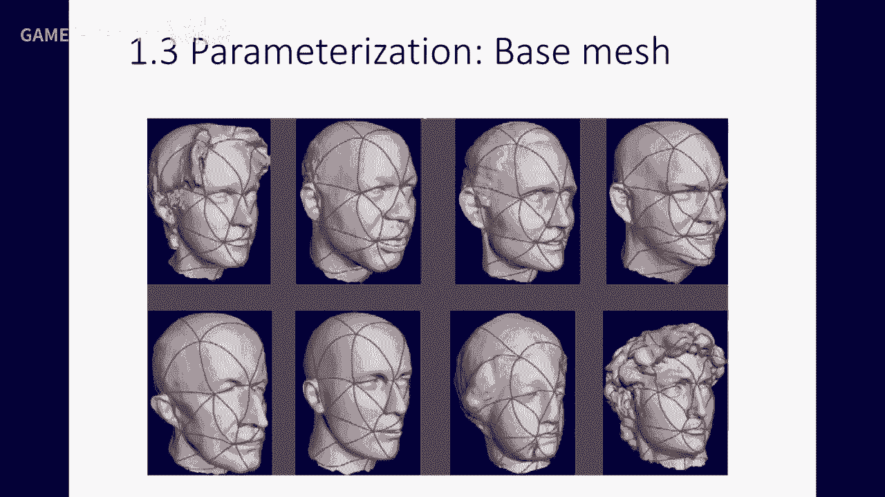

这是不同的人，而是把它一定之后的啊啊还这些方法呢什么我就把问题化简啊，我把这个呃两个模型，一个报纸，一个一个一个死者啊啊一个一个报纸是吧，把它分解各个部分，每个部来分别对应啊，就整个模型就对应好了啊。

就是把一个大的问题变成很多小问题，但分解到什么程度，这个方法当然也是个难的问题了啊。

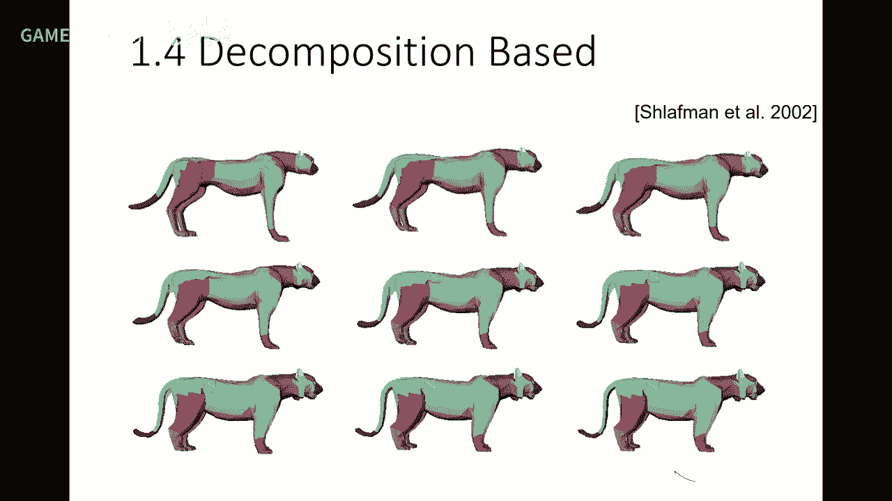

所以这篇文章只是进行一个尝试，还比较早年的另外一篇文章。

就根据这个股价来进行分解啊，最近几年也有也不少文章啊，你可以看到从零次到最近的1615，还有好一些文章都在做这个事情啊，啊那这些文章做事情呢就跟刚才那些思路不一样，咱们把它他们把它变成一个map。

问题就是我怎么把一个网格a它的拓印到一个b上去啊，然后这个这使得呢这个这个扭曲极小啊等等，好那么但如果要了解这些文章，可以可以看一下我们今年啊2020年是去年了是吧，去年我们学社管文章啊。

是我这个博士做的啊，就是这篇文章呢是呃这个就是做了一个很的一个mesh啊，那我们是可以控制这个这个扭曲的键的上键啊，就是你给我一个扭曲的上界，我能够生成一个compad默系，就是三角形。

当然借越小网格会越密啊，但是我们得到非常高效的算法啊，大家有兴趣啊，我们主页上应该也有代码。

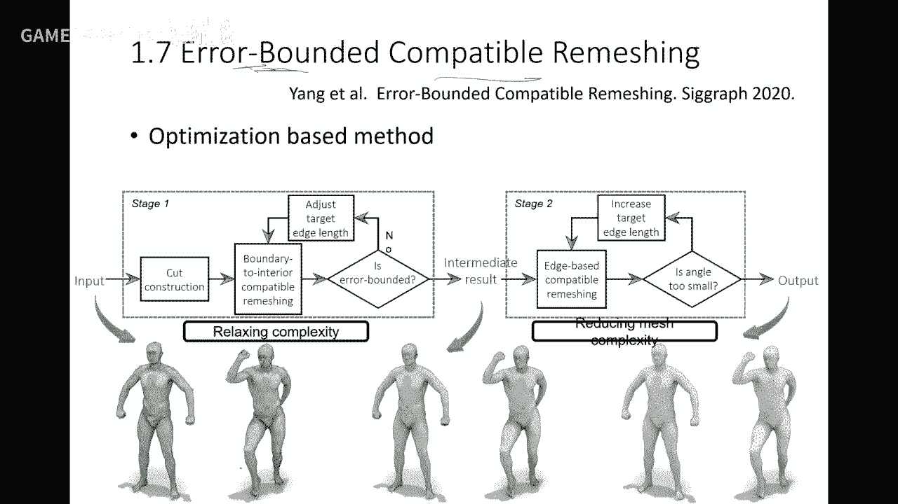

大家可以有兴趣可以看一看，是我们的一些文章的图啊，就像最近几年这个要显示两个网格的一次性，就大家都会用这种带带这种不同字母的这种格子放在一个放在一放，这里你可以看到这个这个u就对应这个这个右侧部分是吧。

那么那么这个w就对应这个w w w咱们在哪里啊，或者是找一个d对应这个啊，就这样哈，就这样回来就看得比较清楚他们之间对应关系啊，还有当然对不同拓扑那个从数学上来讲，一个球跟一个环不可能有一对应是吧。

但是你只要设定一些规则，比如说这个环都是对应这同一个点啊。

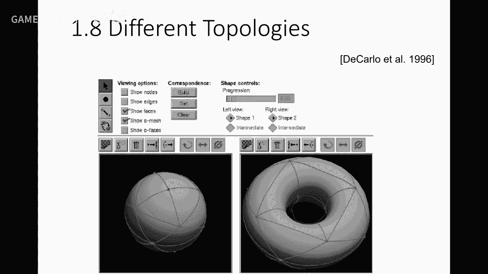

这个就就就可能了是吧，那这个呢基本上这种方法呢都比较特殊啊，做出一些反正你去指定一些这个特征，对应也能做出一些效果出来，但实际e中啊这个比较难用好，那么对应在二维状态上也做了很多啊。

对对应关系这种求解啊，是一种形状分析的一种一个任务，就说怎么样去找两个形状的对应关系啊，我这里看一下啊，这是呃之前做的一篇文章，就是给一个两个形状怎么去找他们对关系啊。

就是为为什么这个第二个点对这个第二点是吧，我们当时真的是把这个形状的一些特征点把它找来啊，我们我们特征点之间最近找好了以后，别的点中间进行插值就够了啊，所以关键是招两个形状的正点，那么正的点是什么呢。

就是那个曲率比较大的地方，或者说呃这个形状有余日不转这个地方就变的地方，那么最关心的呃这个呃大家有时候充不影响，那么像像下面就是什么就是差值路径，那么呃两形状f一和f2 啊。

对关系有了中间差值一下就行了是吧，我们差值呢最简单就是线性差值啊，我我这这一点中间根据t t是0~1，我我0。5就差这个点，这个网格就出来了啊，中中间0。5这个时刻的这个曲面就出来了是吧，0。10。

反正就不同的权嘛，就时间在这啊，好但当那个呢这个在三维中呢，基本上大家对这个问题呢没什么太多的研究，因为三维啊只要两个形状位置啊，中间差值也还不错啊啊那那就是差值问题呢研究的比较少，也有哈。

二维中这个差值这个路径问题研究比较多一点，因为你看到如果a因为如果所谓两个两个朝向是一样，差组没文，但是如果朝向反的话，中间会萎缩是吧，尾宽的萎缩啊，这个人的跳舞的时候，这个胳膊啊就会萎缩。

还有这个呃这个公鸡在吃面的时候，这个脖子会会啊，所以才就要就要采用一些这个非线性插值方法啊，早年在研究这个二维形容差值之后啊，就是这93年一篇文章也比较有名啊，谢谢宝贝。

这个这就是也是发明天量条的那个cbg好，他当时就是不是差的顶点插什么插值这些多边形的边长和夹角啊，就这样一个思想啊，他把他认为在边长和夹角就是这个多边形的一个内在变量。

你插着这些边长和夹角就能插得出好的形状啊，那么这个是差值复利系数啊，我不展开啊，这个是当时我知道一个学生做的是插着这个小波分解的系数啊，就是你对这个形状进行插值，我是插着这个简单形状。

然后小波系数也进行插值啊，差值股价啊，就股价以及它的那个股价，股价有了以后，那个边界点跟股价的关系会差值啊，那么这个呢把这个差值问题，这个函数呢把它分解成定义在两个compatible mac里面啊。

这是平面的222个网格，那么就一对应他们什么，他们就就觉得这个三角形和三角形之间的差值呢，我要使劲测个三角形的，就是这个看到这些一个旋旋转分量跟深度分量的一个差值，所以它不是差值，顶点是差值。

这个三角形的一个仿真变换，反反变分解成一个旋转加平移，所以我中间三角形针又是旋差值，像四层中间中间的这个形状呢就相对会比较好一点，它有你插入完以后，这个这纹理就得到了吗。

就是相对的三角形的纹理的差值不同，评价这些也是我早年的一篇文章，这个也是小工作了啊，我不不不张开好，另外一种踏实的方法呢是什么，就是可以把它升为声明到思维空间啊。

我问你上节课刚刚在讲到那个曲面重建重建呢，比如说那个重建有一种是ct是吧啊，我们每个截截面啊，把这个是截面零，这是截面一，你可以把它看成是t等于零，t等于一，不是相当于什么嗯，你是你是你是全面重建。

是不是构造一个呃这个差值函数啊，在t t等于零的时候，t t可以把它回来看，看的是这个坐标轴是吧，这是xy，那么t等于一的时候，这一圈是取本身就是以函数等于零的t方，外面等于一是吧，里面等于零。

这也一样，所以它差值除于一个高位函数，使得在边界处呢多等于零，这样的话呢这个曲面预算设置出来以后，我中间取一个t等于t00。50。1，这句啊取出截面就是这些形状，所以隐函数差值当啊也是效果不错的。

但这个它就不需要去找找对应关系了，它除出一个隐函数啊，对j等于零和趋近于一的这个形状，边界都等于零，里面出等于一，外面都等于-1啊，或者啊啊这个这个用隐函数差值差这个高别函数。

然后求它的t从0~1的不同的横截面的等值啊，就可以得到中间形状，所以你可以想想这个函数求出来以后是不是相当于一个切，从上往往往往下变化，就是一个连续变化过程了是吧。

因为如果这个引线函数是一个连续函数的话，这个横截面就是连接有变化的啊，这个距离场差值啊，差这两个形状啊，因为上节课我们讲过距离场怎么来重建这个文章。

下一步就能看懂啊，就是构建两个距离场，然后中间差值啊。

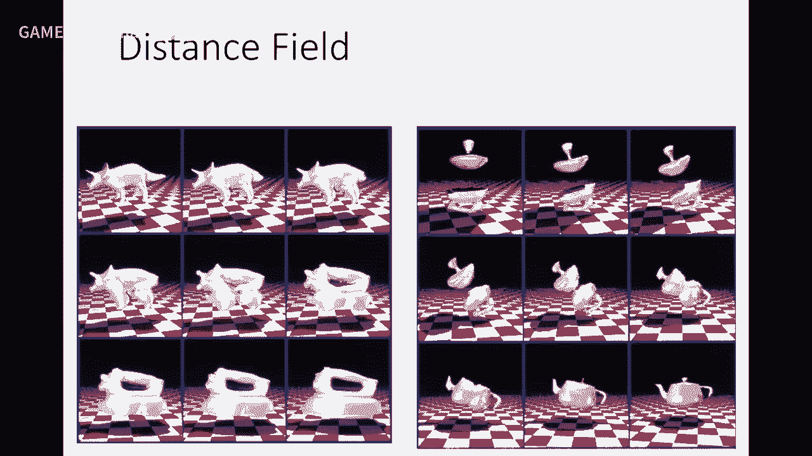

这个999年这本人也一样啊，只不过他是用rbf来构造这个差值函数啊，所以所以你们以前实现了rpf啊，这个呃那些方法与理解这个变形或者win的工作就能理解啊。

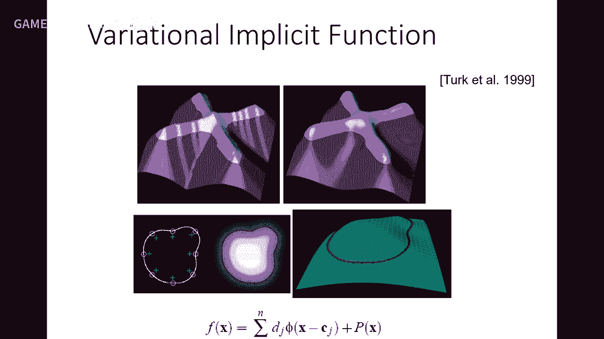

那当时啊他可以模仿任何一个拓扑的形状是吧，但是隐藏出差值的一个问题呢，在中间呢中间的拓扑是不可控制的，它完全是由那个视维的那个隐函数的等于等值面来得到的，是吧啊这个这是零整层面，这是一整层面。

中间这个可能是00。4，那么这个整数面是啥，你只有重现出出出它的的等值面，才知道这个形状就不可啊，并且隐函数有方法有有问题呢，它可能会多出一些这个handle，想像这里这个多一点是吧。

这个函数性质如果不好的话。

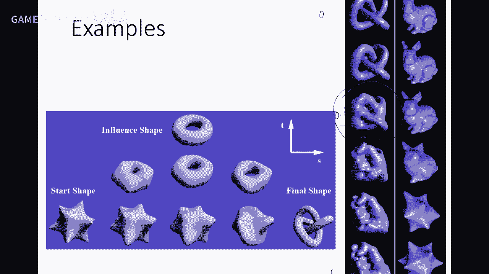

也会出现很多问题，好，那么这个pmf呢也是有人提出来，就是说它可以插值123啊，那么中间中间这个怎么差值呢，当然就是三个点的中心坐标了啊，这个这个只是概念，那么你n个形状就是就是重力坐标来差值就行了吗。

也差不多，我们做个今天内容不少哈，我们系统讲了一个这个形状编辑，还有啊西藏差值，还有中间还有shy modern早年的cad啊啊我就不详细去回顾大家啊，反正看一下课件，上次嗯上节课我在末尾的时候。

我也我也提到这个观点，就是我们的三维内容生成啊，无论是扫描的这种你已有的物体还是这种交互式的构建，仍然这个模型则生成是一个非常难的问题啊，你可以想想我一般的专业用户都要学很多年是吧，你要才能建得好。

一般像像这个初初学者要建个模型还是比较难的啊，虽然研究工作啊，工这个不同的研究人员，你要发明了不同的方法，都希望在减少用户的层啊，就像今天所讲的这些那些方法一样的，通过点啊线啊k局来交互啊。

但是毕竟是三维这个这个多了个维度，而我们的屏幕是二维的是吧，所以它的交互性能不如图像那么直观啊，还有空间想象能力等等啊，所以还是很难的问题啊，我也我也说的是相对于呃仿真跟那个渲染。

因为它们的方程是明确的，但我们这个三维的模型的交互啊，这些这个形状生成呢整整还是一个非常大的挑战。

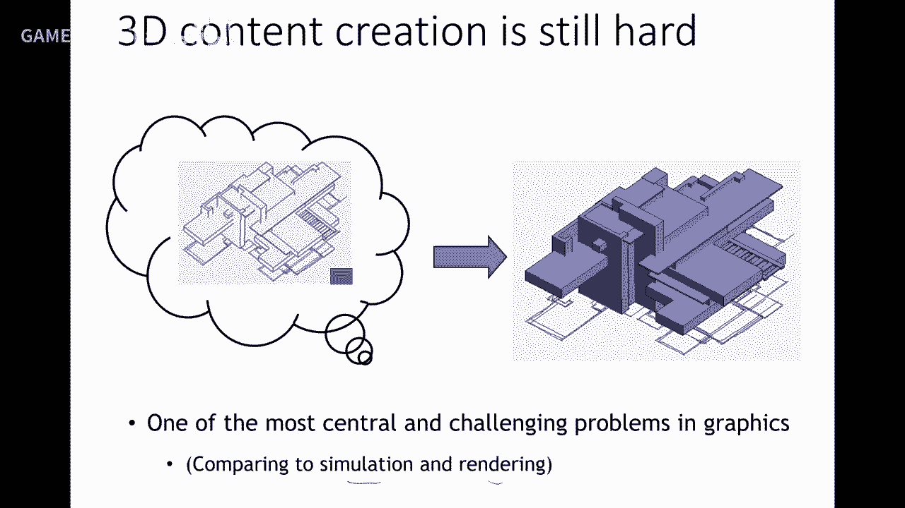

好一些挑战呢这个如果同学们以未来详细找，那如果是呃做可以找找一些比较好的题目，就是这些比较有挑战的一些模型，比如说这种啊结构啊，泡沫，还有这种v v结构啊，因为这种结构的结构模型呢。

就现在的卖血啊或者是rose啊，呃样条都没法表达啊，就可能要用一些啊特殊的这个这个这个几何数学表达啊，但是这什么什么特殊呢，大家都在找找这个不同的表达方法啊，啊这个跟那个实际的一些材料一相关。

因为因为还有一些材料，还有一些物体材料不同的地方是不一样的，所以它要有这种js各项硬性的这样一些空间表达啊，可以表达这个材料的特性啊，材料的一些密度啊等等啊，那么这些是跟制造相关啊。

因为现在3d打印这个成本比而低嘛，所以很多演艺工作者可以用3d打印来验证这样一些这个建模的，这个效果啊，结果好嗯，当然这个要讲讲起来也好，很多东西可以讲啊。

呃我也我们也我们也是在这方面做了有78年的一些积累啊，以后有机会也可以来跟大家分享分享好关这个东西还是不少啊，所以从上次的重建到这次的建模啊，这个呃运动还是蛮很多的，因为才两两次课，也总共三小时讲完。

所以所以也是种马观花啊，给大家一些这种新的一些呃这个建建模的手段的一些介绍，没有详细展开，那么来如果有高级课程，或者是自己根据这些课件的一些指引啊，自己去挖掘一些文章，自己去看好。

那么今天的课程就到这里结束好，我看看平台上有没有提问，时间也不找那个那个如果有提问的话，可以在这群里面进行提问好。

那么我们呃呃这个课上到这呢，建模的主要的这个内容就上完了。

后面还有部分内容我还是想给大家分享啊，所以后面还有如果下节课如果能全部讲完啊，可能就下次下周就结束掉，如果中期还讲不完，我就再讲一次啊，就16次好吧，然后就取决于下周的那个啊。

这个我们讲的速度好，那么这个因为后面我还有一些cup的一些项目。

微信群里面进行提问，那么今天就到这里好。

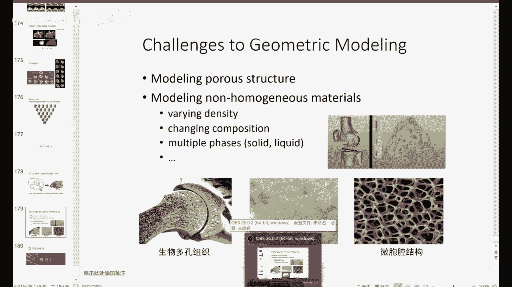

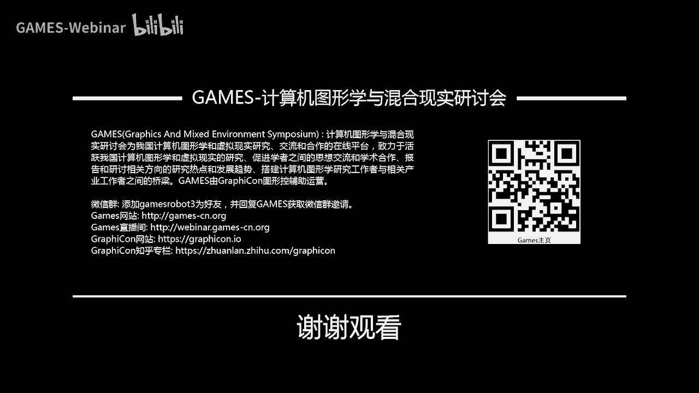