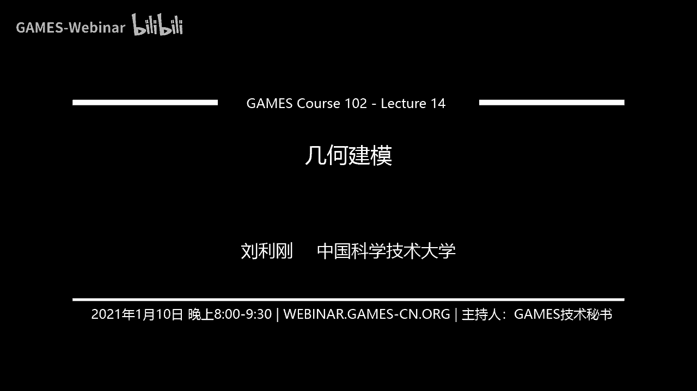

# GAMES102：几何建模与处理 - P14：几何建模 🛠️

在本节课中，我们将学习几何建模的核心概念与方法。课程将从重建与设计的区别开始，系统介绍从零开始设计的传统CAD方法（如实体建模）以及对已有模型进行编辑和变形的现代技术。我们将探讨点、线、面等不同层次的编辑代理，并了解基于数据驱动和深度学习的建模新趋势。

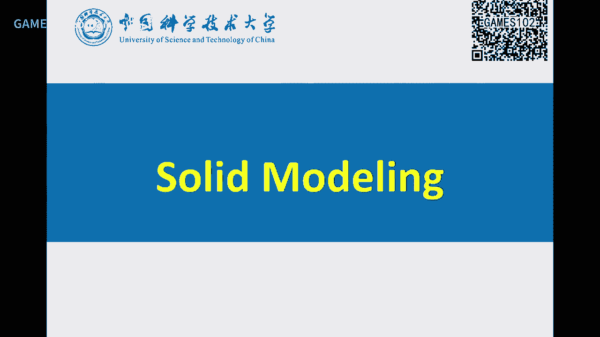

---

## 概述

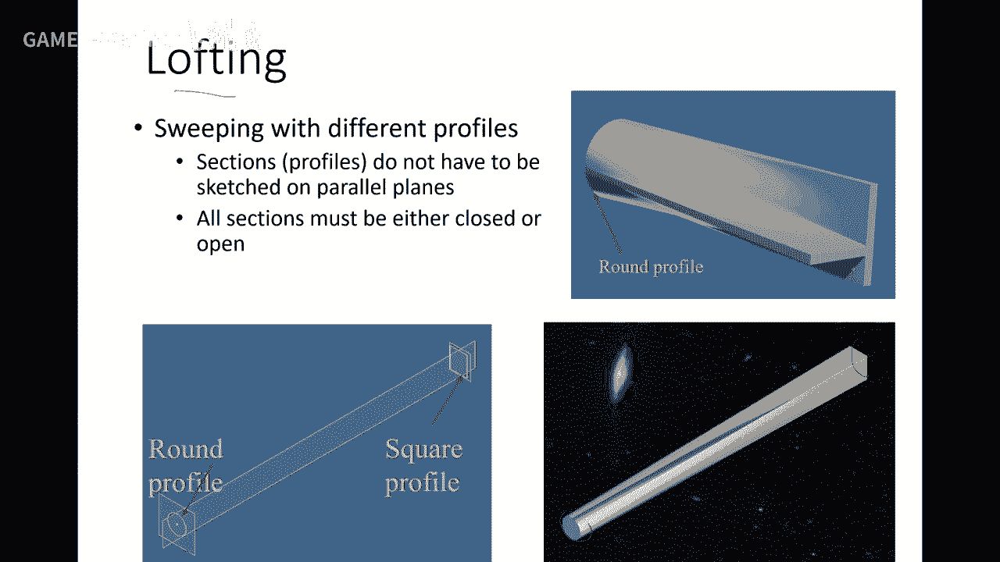

上节课我们全面介绍了三维重建，从数据采集到点云处理，再到网格重建与后处理。重建的对象是物理世界中已存在的物体。然而，人们常常需要设计全新的物体，或对现有模型进行修改。本节课，我们将聚焦于“设计”这一过程，即几何建模。

建模主要分为两大方向：
1.  **从零开始设计**：使用CAD工具凭空创造形状。
2.  **编辑已有模型**：对给定的三维模型进行修改和变形。

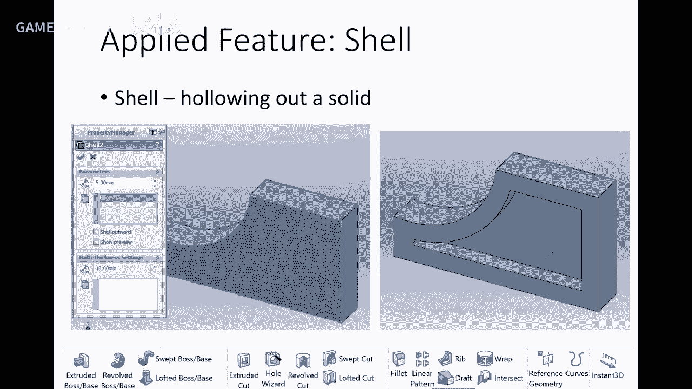

我们将依次探讨这两大类方法。

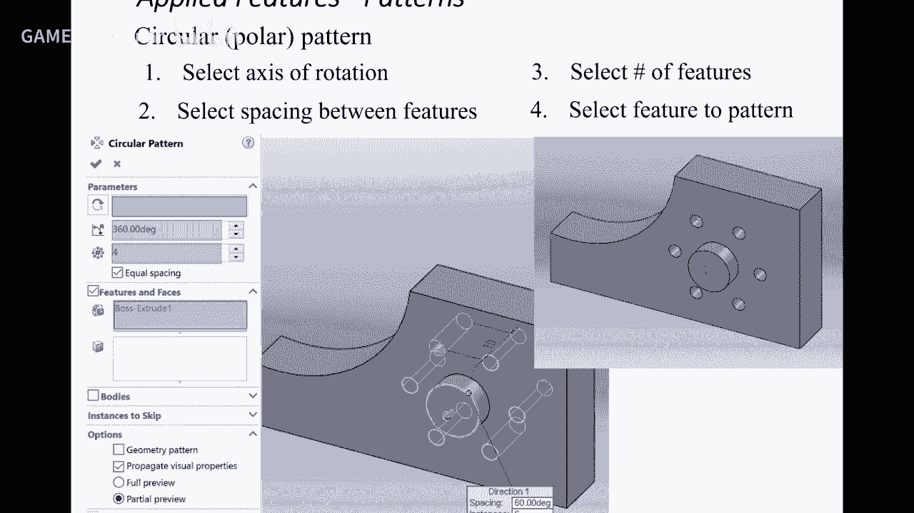

---

## 从零开始设计：传统CAD建模 🏗️

传统CAD建模源于机械、土木等工程领域，旨在精确地设计和表达零件。以下是几种核心方法。

### 三视图建模

三视图建模，或称工程制图，通过物体的三个正交投影视图（顶视图、前视图、侧视图）来唯一确定三维形状。设计者需要具备空间想象能力和几何计算能力，以确保不同视图中的投影关系正确。

**核心思想**：三维形状由其二维投影唯一决定。

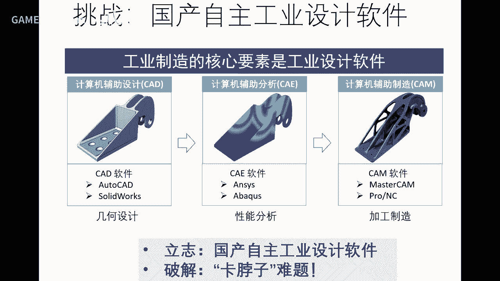

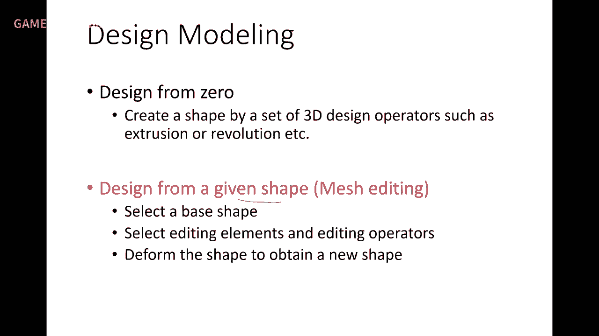

### 实体建模

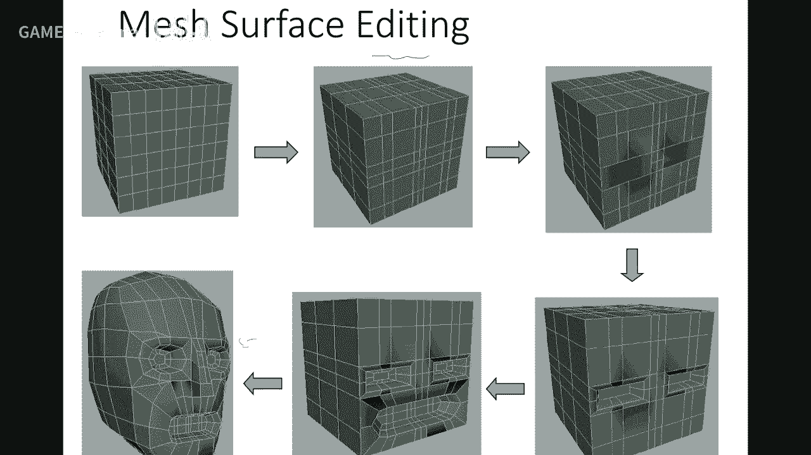

实体建模是CAD领域的核心，它直接构建具有体积的实体对象，而不仅仅是表面。以下是几种基本操作：

**扫掠**
扫掠操作将一个二维截面沿着一条轨迹线移动，扫过的空间即构成实体。
*   **线性扫掠**：截面沿直线平移。
    *   `实体 = 拉伸(二维截面， 方向， 距离)`
*   **旋转扫掠**：截面绕一根轴旋转。
    *   `实体 = 旋转(二维截面， 旋转轴， 角度)`
*   **沿路径扫掠**：截面沿一条曲线路径移动，并可保持截面与路径垂直。
*   **放样**：在两个或多个不同形状的截面之间进行过渡，生成光滑的实体。

**参数化与约束**
参数化建模允许通过修改参数（如尺寸、角度）来驱动模型变化。设计约束用于保持特定的几何关系（如平行、垂直、等长），这些约束构成了“设计意图”。

**倒角与圆角**
对实体的尖锐边缘进行切削或添加圆滑过渡，称为倒角或圆角。

**布尔运算**
通过并集、交集、差集等布尔操作，组合基本几何体（如立方体、球体、圆柱体）来构建复杂形状。
*   `复杂实体 = 基本体A <布尔操作> 基本体B`

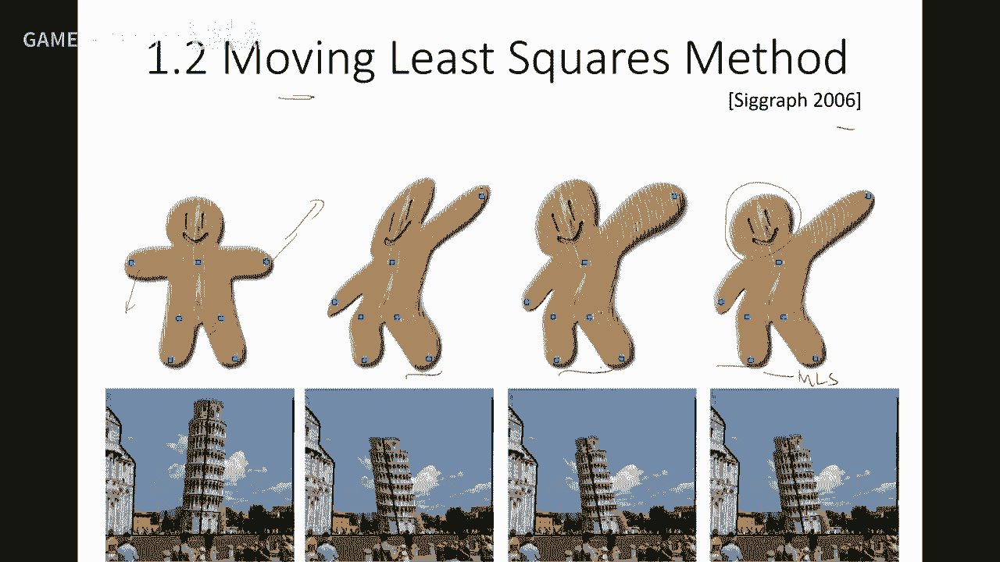

**边界表示**
实体在计算机内部通常采用边界表示法存储，即记录构成实体边界的所有点、边、面的信息及其拓扑关系。它必须满足欧拉公式以保持流形性。

**欧拉操作**
一系列低层级的原子操作（如生成边、生成面），用于逐步构造出复杂的边界表示结构。

---

## 编辑已有模型：交互式变形与编辑 ✏️

对于动画、游戏和数字艺术等领域，更常见的是对已有模型进行直观的编辑和变形。其核心思想是：**通过编辑一个简单的“代理”，来驱动复杂模型的变形**。

### 编辑的方法论

编辑过程可以抽象为以下步骤：
1.  为原始复杂形状 `S` 找到一个简单、易编辑的代理 `P`。
2.  用户交互修改代理 `P` 得到 `P‘`。
3.  通过一个映射函数 `G`，将代理的变化传递回原始形状，得到变形后的结果 `S‘`。
    *   `S‘ = G(P‘)`

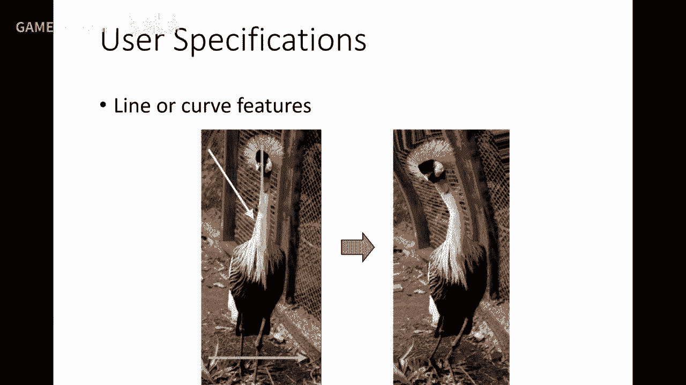

关键在于寻找合适的代理 `P` 和定义有效的映射函数 `G`。

### 基于点的编辑

代理 `P` 是一组顶点（句柄）。用户拖动少数几个点，并固定一些点，系统自动计算其他顶点的位置，使变形自然。

**数学本质**：这是一个插值问题。需要找到一个变形函数 `F`，满足固定点位置不变、拖动点到达目标位置，同时尽可能保持模型的局部细节。

**常用方法**：
*   **径向基函数插值**
*   **移动最小二乘法**
*   **基于向量场的变形**：将模型嵌入到一个连续向量场中，编辑场中的流线来驱动变形，能有效避免自交。
*   **拉普拉斯坐标编辑**：保持每个顶点的拉普拉斯坐标（局部细节）不变或相似，通过求解线性系统得到新顶点位置。这是非常经典且有效的方法。

### 基于线/骨架的编辑

代理 `P` 是曲线，如模型的骨架、轮廓线或特征线。编辑曲线比编辑大量顶点更直观。

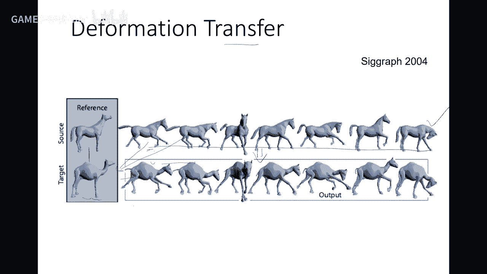

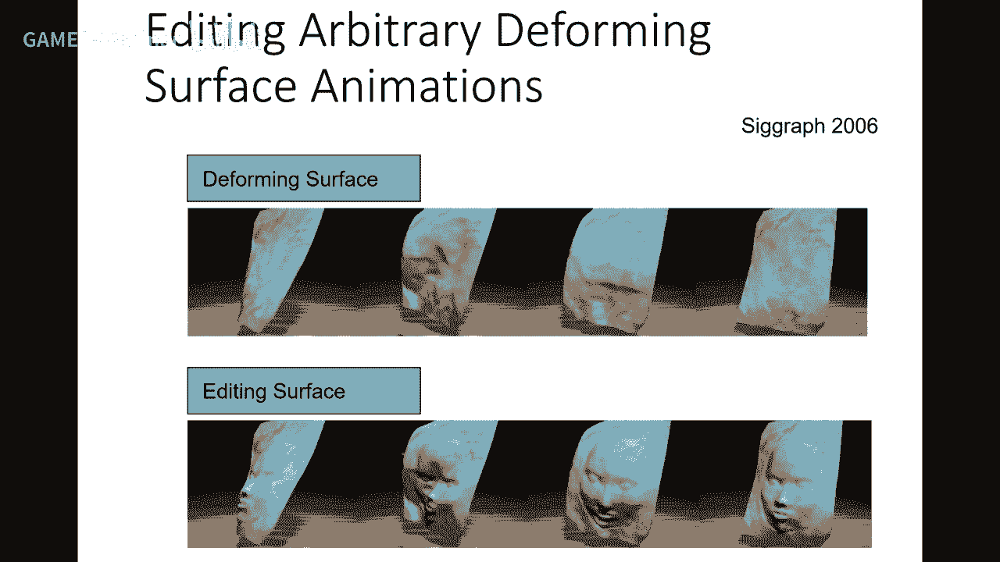

**关键问题**：定义曲面上每个顶点与骨架/曲线之间的权重关系（蒙皮权重）。当骨架变形时，顶点根据权重混合骨架的变化。
*   `顶点新位置 = Σ(权重_i * 骨骼变换_i * 顶点原位置)`

### 基于体/笼子的编辑

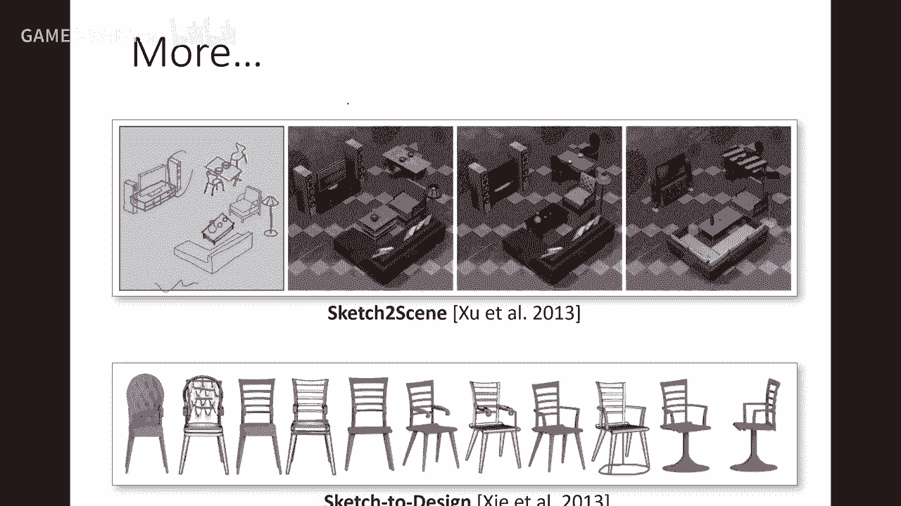

代理 `P` 是一个包围模型的简单多面体网格（称为“笼子”）。编辑笼子的顶点，模型内部的点通过广义重心坐标随之变形。
*   `内部点坐标 = Σ(重心坐标_i * 笼子顶点坐标_i)`

### 基于简化的编辑

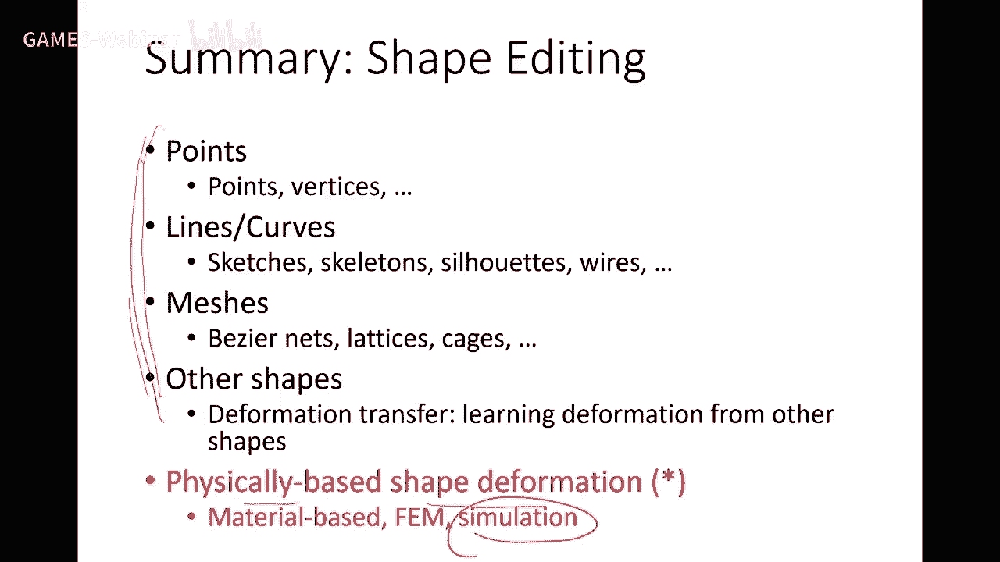

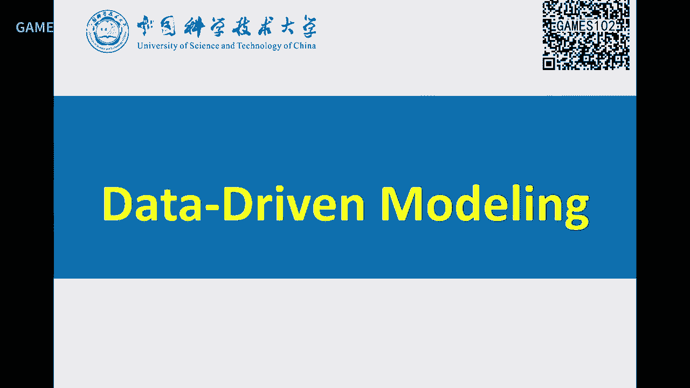

代理 `P` 是原始模型的简化版本。在简化模型上编辑后，将简化过程中去除的细节重新添加回去，得到最终的高细节变形结果。

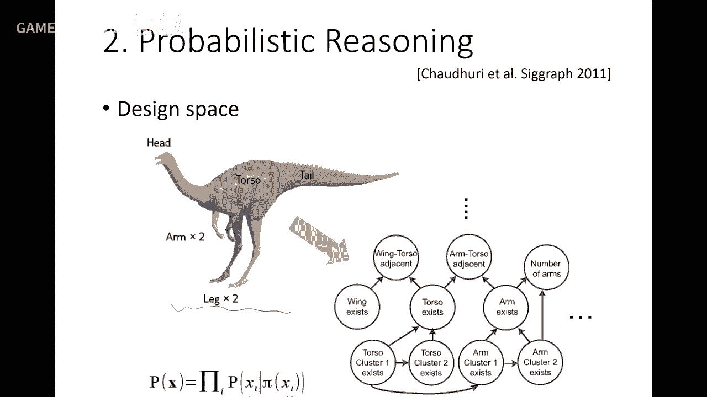

### 基于草图的建模

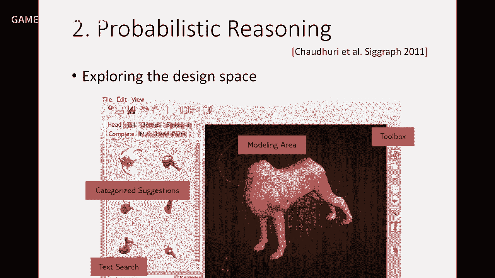

这是一种“从无到有”的编辑。用户绘制二维草图，系统自动推断并生成三维模型。这大大降低了三维建模的门槛。

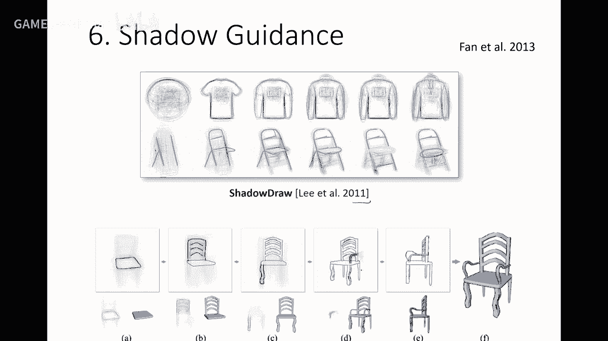

### 数据驱动的建模与深度学习

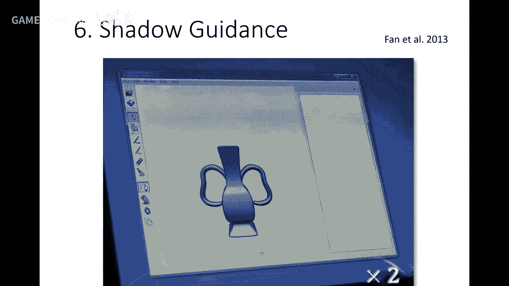

随着三维模型数据集的增长，数据驱动的方法变得流行：
*   **部件组装**：从模型库中提取语义部件（如椅腿、椅背），重新组合成新模型。
*   **概率模型**：使用贝叶斯网络等模型学习部件之间的搭配概率，指导用户创作或自动生成。
*   **深度学习生成**：使用生成对抗网络等深度学习模型，学习三维形状的隐式分布，可以直接生成新的三维模型。

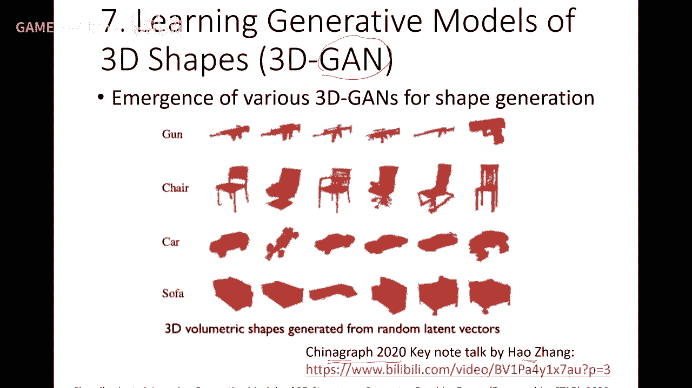

---

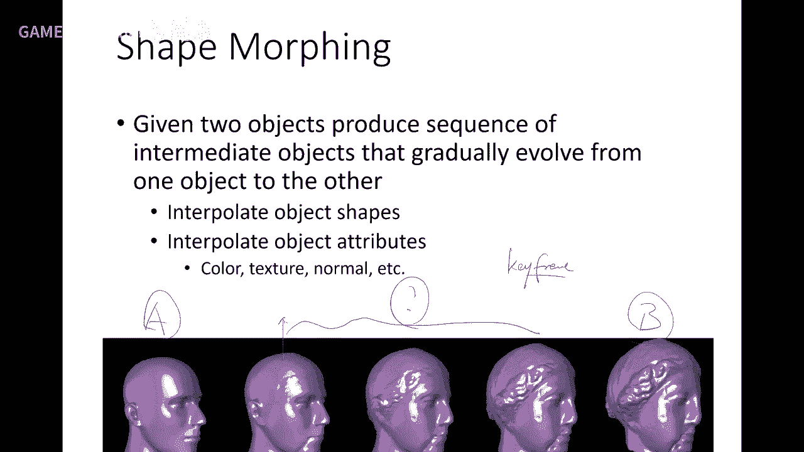

## 形状渐变 🌀

形状渐变解决的是如何在两个给定形状 `A` 和 `B` 之间，生成一系列自然的中间过渡形状。它广泛应用于关键帧动画和工业设计。

形状渐变分解为两个核心问题：
1.  **对应关系问题**：建立形状 `A` 和 `B` 上点与点之间的一一映射。
2.  **插值路径问题**：在对应关系建立后，如何插值对应点以生成中间形状。

### 建立对应关系

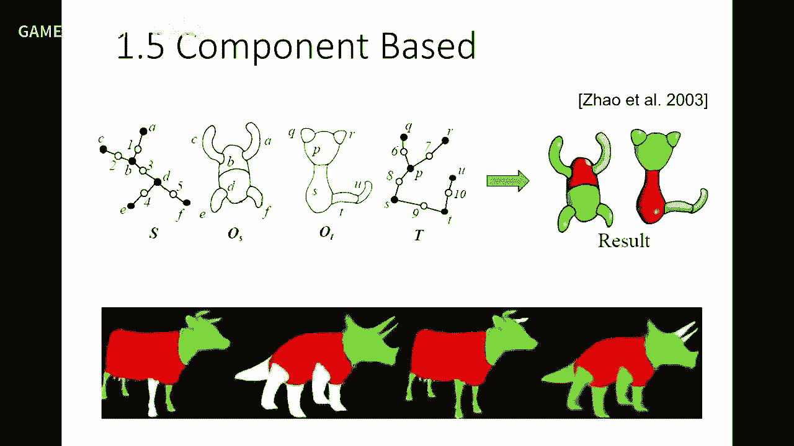

*   **参数化方法**：将两个形状参数化到同一个公共域上，在公共域上建立对应，再映射回三维空间。
*   **基于简化**：先简化两个模型，在简单的基网格上建立对应，再传递回原始网格。
*   **基于分割**：将模型分割成语义部件，在部件级别建立对应。
*   **现代映射方法**：将对应问题转化为优化问题，最小化映射的几何扭曲。

### 插值路径

*   **线性插值**：最简单，直接对对应顶点的坐标进行线性插值。可能导致体积收缩和不自然旋转。
*   **非线性插值**：
    *   **插值内在属性**：插值边长、夹角等网格内在属性，而非顶点坐标。
    *   **仿射变换插值**：将每个三角形的变换分解为旋转和缩放，分别插值。
    *   **隐函数插值**：为两个形状构造符号距离场等隐式函数，插值隐函数，再提取中间等值面作为过渡形状。

---

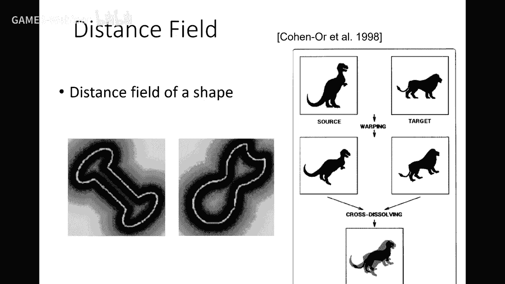

## 总结

本节课我们一起学习了几何建模的两大支柱：从零开始设计的传统CAD方法和编辑已有模型的现代交互技术。

*   **CAD建模** 侧重于精确性、参数化和制造约束，是工业设计的基石。
*   **模型编辑** 侧重于直观性、交互性和艺术表达，其核心思想是**通过编辑简单代理来控制复杂模型**。
*   **形状渐变** 是连接设计与动画的重要技术，重点在于建立模型间的合理对应并生成自然的插值路径。

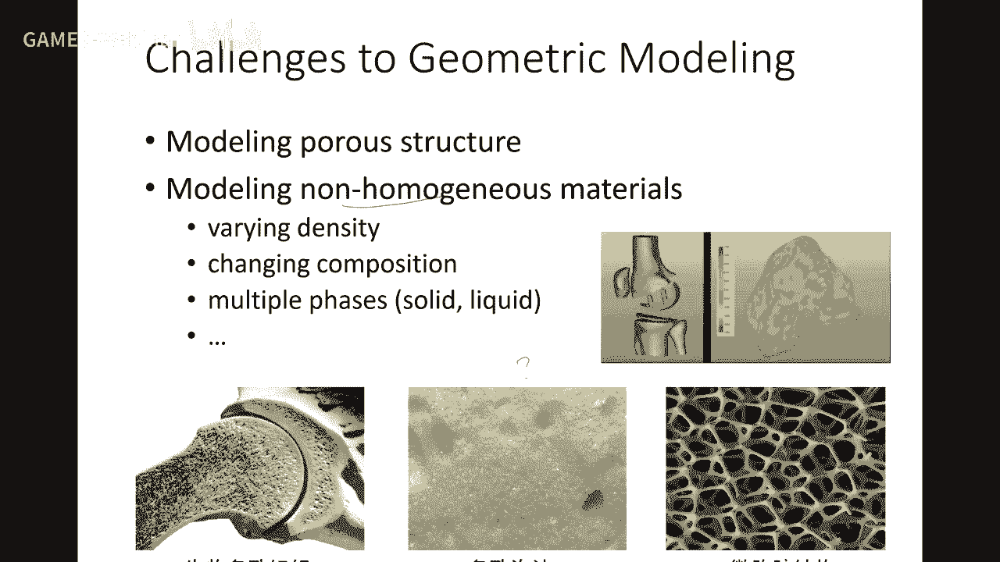

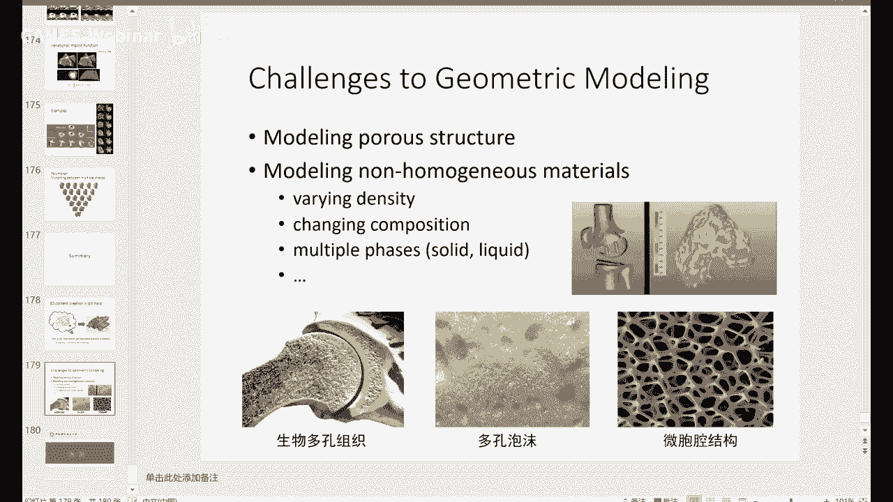

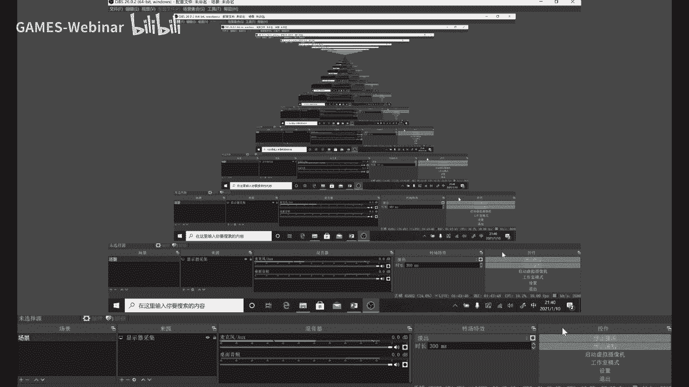

尽管已有众多方法，三维内容创作因其高维性和对空间想象力的要求，仍然是一个充满挑战的领域。数据驱动和深度学习等新范式正在为这个领域带来新的活力。希望本课程能为你打开几何建模世界的大门，提供一个继续探索的“指针”。