# GAMES102：几何建模与处理 - P15：纹理合成 形状分析 课程结语 - GAMES-Webinar - BV1NA411E7Yr

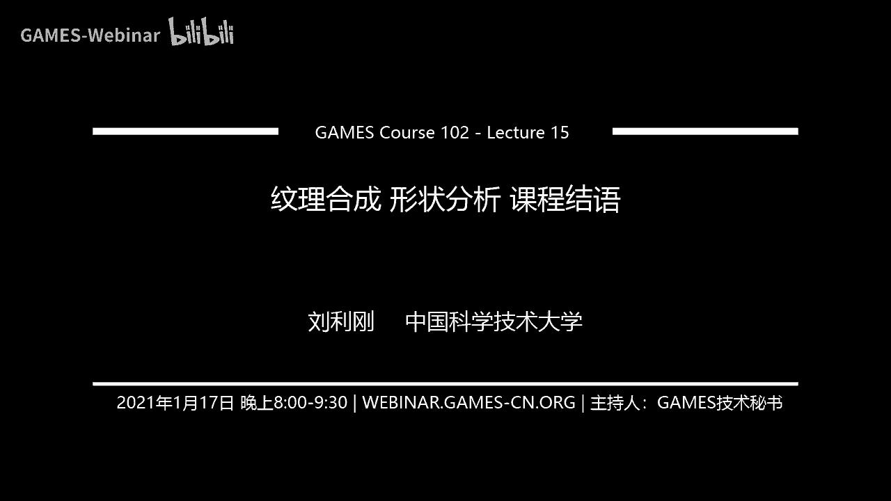

好那个同学们啊，晚上好啊，今天是我们game 102课程的最后一节啊，那么跟以前一样。

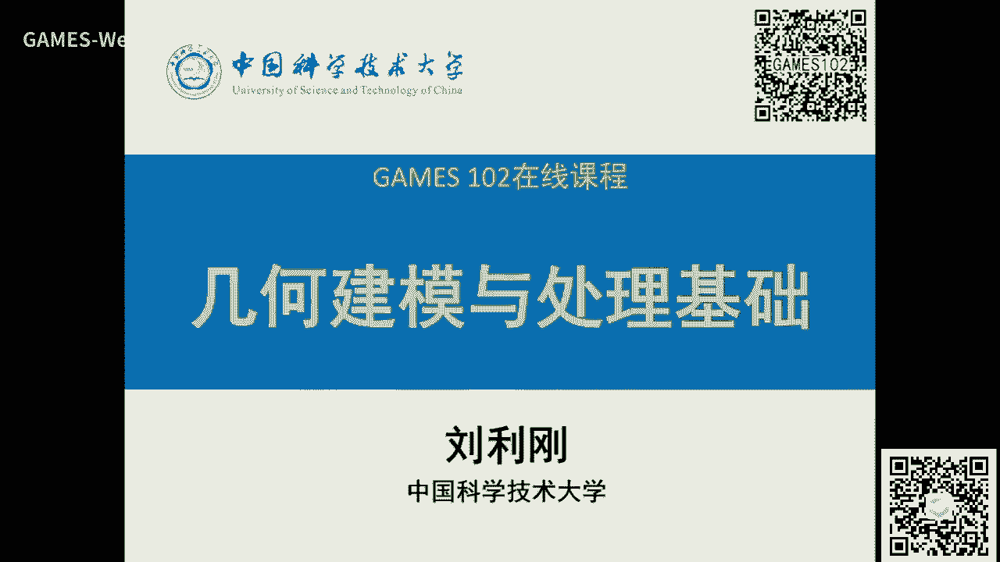

我们先看一下我们这个课程最后一次作业啊，作业时的一个情况啊，总体上交作业的同学还是不错的啊，同学的一些结果啊，这个同学是实现了那个就是显示方法啊，cross换算法，当然算法也出现一些小的问题。

像比如这里一个连接应该是发生错误啊，但总体上大部分还是对的啊，那么这个顶点加密以后呢，这个就会避免这种错误。

那么这是另外一个同学也是重建，用的是火诵方法，普通方法是一种隐私的方法是吧，那么他需要点的法向，所以如果这个法向如果发生错误的话，像这个这个地方就容易出现这个重建结果是错误的，那么出现这种呃异常的现象。

他们大部分情况都是因为法向相反啊，反调了啊，所以啊但不能量这个因为毕竟是昨夜，所以同学们可能没有太多时间去检查这里的一些反向的正确性，因此呢这个反正这个结果有点点错误。

没关系啊，还还是不错的啊，那么这个是一个同学啊，录了个视频大家看一下啊，首先这是点云，那么用普通方法嗯，它调用了一个machine cube的算法。

macube算法也可以看到它那个重建网格都都那个跟那个grade相关是吧，这这这个网格一看就知道是mc cube所重建的啊，这是把这个线框去掉啊，这个重新重建结果还是不错啊。

因为这个数据质量可能还是不错。

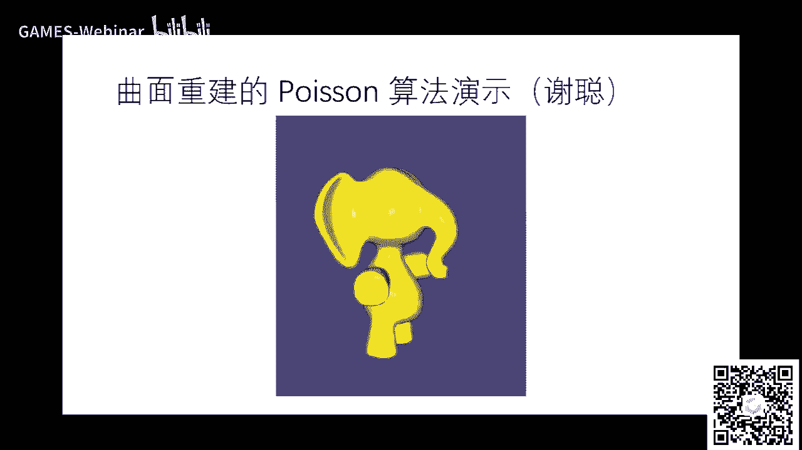

然后反向都是正确的，那么这是另外一位同学呃。

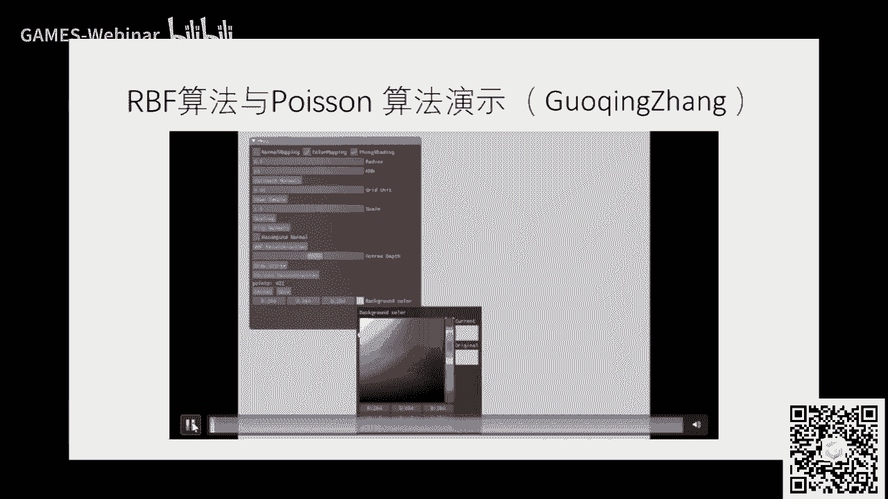

一个比较完整的演示啊，它有两种方法，一个r p f就是一个都是隐藏方法啊。

只不过是r b f g函数拟合，还还是个普通拟合，可以看到他在菜单里面可以去选择啊，不同的方法，以及可以对这个距离场进行自适应的跑分啊，算出那个一些距离值，然后后面但调用这个是应该是rbf的结果。

好看后面他切换到了啊。

破松啊，方法啊可以看到那个顶点，如果不是特别密的话呢，它的重新质量啊也是不是特别好啊。

也发生一些一些小小的问题，但这个就留在于课后。

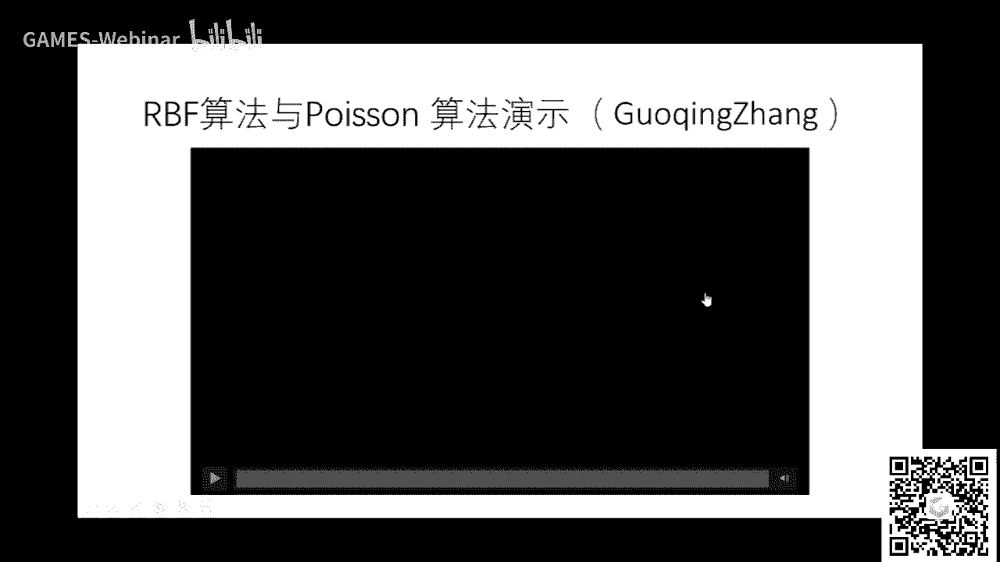

你们大概大概同学们呃自己去检查，好好嘞，那么呃我们同样也会把最后一次作业的报告和代码，和优秀同学的这个报告代码啊，挂在网上供大家参考。

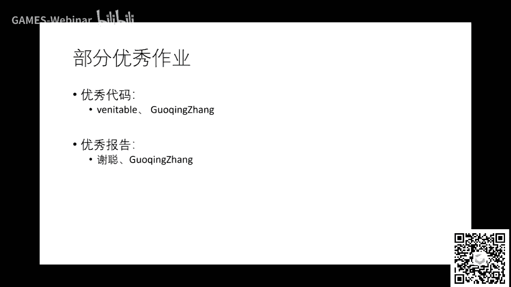

好好，那我们今天这次课程的东西还是比较多。

我们继续来讲完我们今天的这个这个课程的一些最后的部分的内容，那么首先嗯讲一下这个纹理合成嗯。

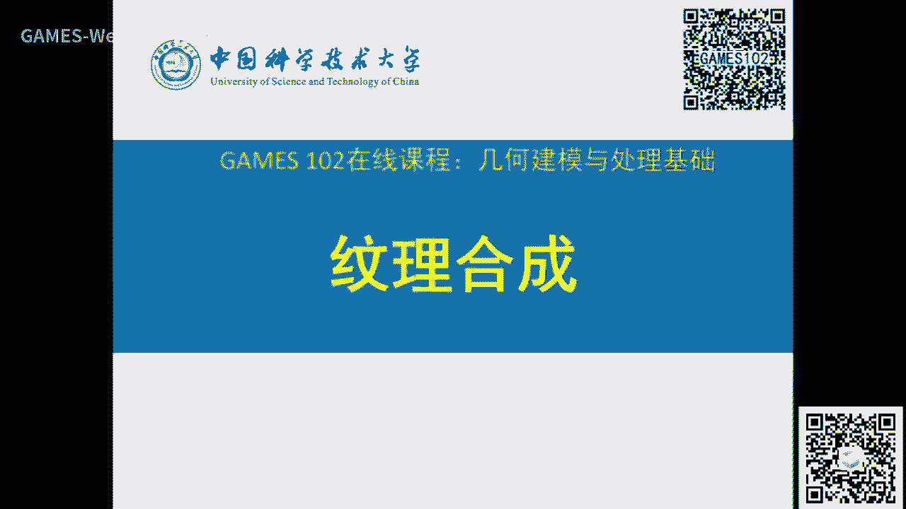

合理课程，那么我们回顾一下我们这节课，特别是前几次啊，从曲面重建到全面建模是吧，重建呢是物体是存在的啊，我们是通过各种设备啊，无人图片还是激光扫描仪，还是照片还是结构光，然后是把这个点给测测出来。

然后再利用一些算法把它重现出一个三维模型，那么建模呢是通过用户交互去做设计是吧啊，是通过各种各样的一些工具啊，拖拉啊，还有一些这个交互的手段，所以重建出模型，那么这些模型你可以看到这个猫头鹰。

还有这样一个小动物，这个模这个模型都是只有顶点数据，但是没有颜色，所以没有颜色的这个曲面的看起来就不真实，所以我们还要给它贴上一个纹理。

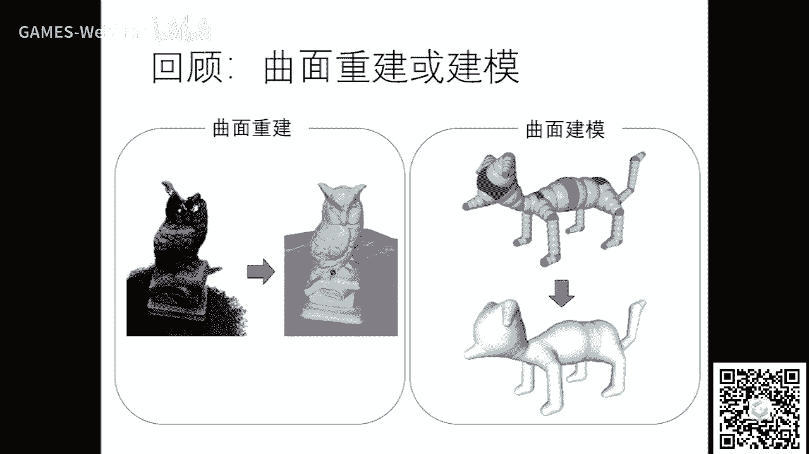

让它看起来更真实一点，所以怎么去给这个模型赋予纹理，好像中间这个兔子啊是没有纹理的啊，但是如果你把它附上每个顶点或者每个面给它附上顶点以后呢，可以发现它这个看起来就很真实啊，就像一个真实的这个兔子。

毛发有毛发的纹理啊，眼睛有眼睛纹理是不一样的颜色，当然你也可以赋予下上下面三行啊，下面一行的三个模型一样赋予其他的纹理，可以看出这个曲面的一些心态，所以在证实着我们的应用中，这个光有几何数据不行。

还需要有一些纹理颜色的信息。

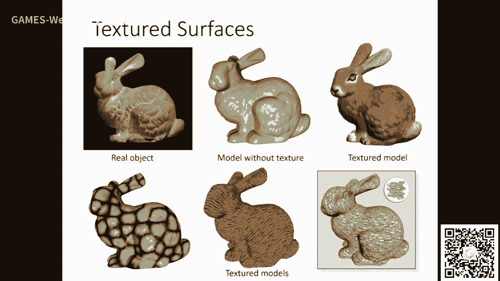

那么复议纹理呢有有这种手段啊，如果是重建，那么你这个采集物体本身就就是图片啊啊物体本身就带带颜色，所以你只要用采集它的那个rgb这个颜色，就把它附上这个结构模型上面，就可以得到带有纹理的是吧。

所以它是因为物体是存在的，你只要把这个物体表面的颜色把它采集下来，把它对应的顶点附上颜色，就能够产生纹理，但是对于一般这个设计出来的模型呢，它是物体是不存在的，是靠人手工设计出来。

所以它的纹理后期呢有一些这个啊也是要交互手段啊，你可以参考一张图片，然后通过图片跟这个参数化的一些结果啊，把它附上颜色啊，可以也可以通过手工去直接用一些画笔在这个平面也好，还是这个曲面唱也好。

直接去画它的颜色啊，这是一种啊人工这个赋予纹理的一种手段啊，特别是在一些行业游戏啊，这个这个属于美工这样一个角色啊，还有既美技术，美工这个角色去做的事情，所以这个要给一个模型附上颜色。

这个模型才会更生动啊，好今天呢我们不去讲那个怎么去画真实纹理啊，我们来看如果给一个模型附上这样一个文叫纹理合成，假设我们已经有一有一个小的纹理，这样一个小片，我能不能把这个小片啊。

把它铺满到一个结合模型上面啊，这样的话也能够让这个曲面赋予纹理啊，那这个这也很多很多应用啊，那么这个呢就叫纹理合成，比如说我有一个纹理的一个样本sample好，那么我通过这个样本呢。

能不能把这个样本呢把它贴到这个几何数据上面，注意啊，我不是一贴一这么一小块，我可能很多很多小块的这个重重叠，所以它是一个这个铺满的过程啊，简单一点，你可以把它看到一个小小的sample。

把它一块块贴贴满整个曲面，当然中间有好多缝啊，这些需要解决啊，这就是纹理合成所要解决的问题啊，我要我要把它填满，但又不能看出结果中有太多的啊这个artifacts这个这个这个缝啊，不连续的现象。

那么我们如果先不看是二三维，我们来看二维，二维就是这样一个问题啊，我给一个小的这个样本sample啊，然后我给一个大的区域啊，这个区域比这个原始样本的大小。

只要大好问我怎么样来生成或叫sc合成一张新的纹理啊，这纹理呢看起来呢哎看起来跟这个纹理像，但是呢可能又不是完全的重复啊，那么纹理合成就是想做这个事，所以说物理方程的这个一个定义好。

给一个这个样本的纹理i啊，这里i那么我们的目标呢就是合成一张大的纹理j啊，这个键呢看起来像这个i但是呢又不是它的简单的重复，所以他这里就是这这个这个度量很难度量，什么叫看起来像。

所以这里面这个数量很重要是吧，然后它又不是简单的平铺啊，简单的重复啊，那么这个就带有一定的随机性啊，对于这个问题呢，呃在啊20 20多年前就开始研究比较热门啊。

因为它比较有用好我们看一下用途在哪呢，好，首先当然是给这个枯燥的，光溜溜的这个曲面赋予这样一些丰富的纹理啊，让它看起来更更形象啊，还有呢你纹理合成，你比如说这个地方是个地毯，左边这张图啊。

地毯我想把它换成另外一张地毯的颜色啊，我我我是不是可以把这个地产的这个这一块把它去掉，然后用那个小纹理去把它找出来，还有右下角这个在这里有一张图片，有个成人成年人跟一个小孩，我希望这个成年人把它抠掉。

磕了以后，这是不是一个空白的区域，就是这这一块，那么这块区域我能不能用背景，然后取一小块小块的那个样本，然后用这个样本呢长出来长填充这样一个成人年啊，成年人所占的区域啊，就这样的话呢就可以啊。

p把把这个空洞给它填掉啊，所以这个我用现有的这个图像的小的sample去合成，填充那些这个位置区域，或者做一些洞啊，这这个就是纹理合成的一个非常重要的应用啊，如果大家用过ps，就是photoshop。

就是它里面有一个叫chrome brush啊，就是就是克隆比啊，它就是可以把别的地方的这个这个这个颜色啊或者纹理啊，把它克隆到你交互的这个地方来啊，所以这也是一种简单的拷贝。

但是呢文理课程不仅仅是要拷贝，而且他要是带有一定的变化，这就是这个问题的一些困难性好。

那我们看首先先看一下什么叫做纹理好，我们来看纹理，我们一听纹理呢可能就是还是跟一般的图像啊，图像我们叫image，文理叫tcture，就是既然用不同的词，可能还是有不一样的含义，对吧好。

那么我们指纹理呢，指纹理呢它是一种啊物体的表表表现啊，比如说主子的木纹呢强啊，还有草地这种啊，这种带有重复性的，还有这种人啊，那种人不能严格算意义上的这个纹理，但是呢因为它有很多重复。

所以文理首先一个特征呢它有很多重复，那么这个什么重复是怎么刻画。

我们等一下再来解释好，那我们来看一下image and texture的区别好如果是一张纹理，先看右边，我任意在两个地方取一个同等大小的框，把他们两个框给拿出来，看这个b在这这个b2 在这是吧。

哎我肉眼看呢觉得他们两个差不多都是同同一个东西啊，同或者同一种纹理啊，那么这种属性的这个图像啊，就是各个地方都差不多的这样一个表现，那么这个叫纹理啊，因为它这个具有一定的这个这个重复相似性啊。

有有点像分型啊，他分析就有这个scale这变化啊，这里不一定有好图像呢，我我也是取不同的地方的框，把它拿拿下来，他能落点一看，显然是不不一样的，不一样的图片是吧，它们相似性没有，所以这个叫图像。

所以图像就是没有太多重复性，纹理呢是具有这种重复性的纹理啊。

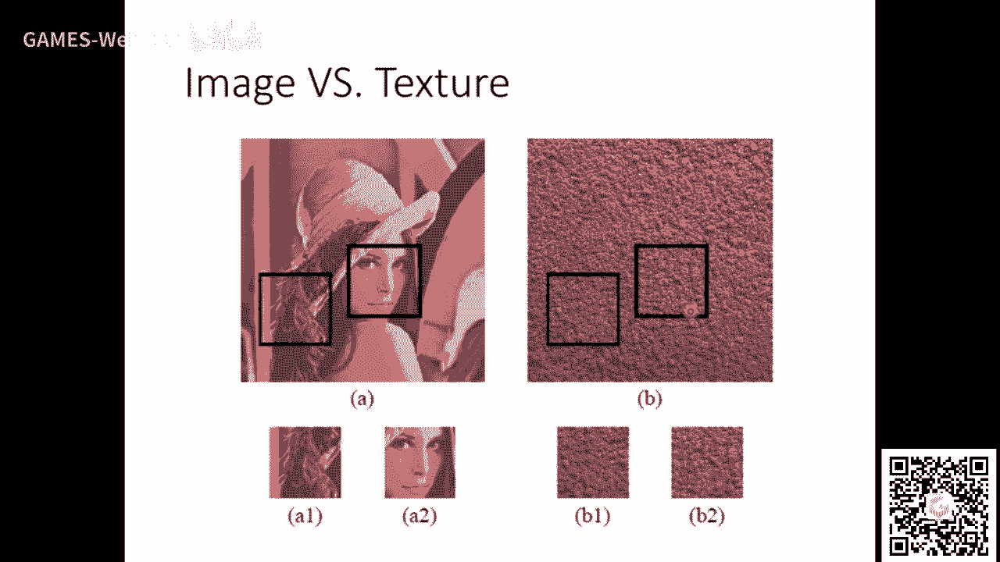

这个图像好，那么下面这些基本上啊大家用刚才那个规则来判断，基本上都可以符合刚才的那那个描述，对啊，刚才那个描述而已，不是定义，因为定义的话是要非常精确的啊，这个看起来像什么叫同一类。

这里都没有严格的去数学描述，但没关系，后面我们会有呃，呃这个相对的方法好，我们来看下面这些图片，你看任取一个小框是吧，这里因为这些小小伙子这个都重复了是吧，像这个辣椒啊，你你认识一个框。

大家都会认为它是个文字这样一个啊，我这个图像，所以也可以认为是文理，像像这个中间这张上面这一行啊，这个有点像噪声啊，随便取取一小块，虽然他们两两个小框啊，看起来而不是完全一致。

但是呢我们肉眼看起来视觉上看起来还是相似的。

所以这个也算美女好，那么这个纹理这个在前面学唱的话的时候，大家知道这个你要给给模型贴上纹理啊，是一个很很很重要的一个过程是吧，这个在gpu中我们读个纹理，直接直接给纹理坐标一负就可以把纹理贴上去。

自然是在一个动态管理，也是一个很重要的技术，就是可以模拟一些水面啊，这是很多水波，你如果用物理方法去算这个水波的，这个这个表面计算量是非常消耗这个这个计算资源的。

那么我们有一种技巧就可以用多张这个不同的纹理啊，然后通过动态纹理的绘制切换，就可以表现出这个水水波荡漾的过程，好这个我在这里稍微提一下，那么这种动态管理呢也是在这个为了为了节约这个计算资源。

我预存一些算好的这样一些纹理，然后让他让他们在随着时间变化就产生出这样一个动画啊，有点像我们的那个g i f文件技术文件，它就是动画文件，它本质上是存在这个图像的序列，然后不断的更新就形成动画啊。

好纹理呢有有不同的这个属性啊，这个分类啊分类呢一般如果你们去做纹理印啊，这个合成的话，就会看到一些词啊，这个叫做iptropical啊，就是各项同性，就是呃基本上看起来呢各个方向差不多。

这个叫各项异性啊，那么这种呢介于两者之间是吧，还有还有这种纹理叫叫叫有重复性，像砖头一块一块重复的，像这个叫随机的啊，就是从根本看不出重复的啊，也有介于中间的啊，所以这些不同的纹理性质呢。

它这个合成的方法会有略啊差别，好那么我们看一下二维的纹理合成啊，我们先把二维搞明白，那三维的话就就容易理解啊，好那么最简单的纹理合成，就像我们家里做啊这个装修一样的，在墙上铺瓷砖或者在地上铺木板。

我就一个个扑扑上去啊，实际是这里右边这张图刚好是左边这张图的3x3，你可以看到是刚好是三块九块1233行三列好，那么这种你说是不是刚好因为这个纹理比较比较特殊，刚好左边与右边呢可以完全连续拼接。

上边和下边也可以完全拼接，你就会铺成这样，至少看不出有很明显的裂缝，但这个文明大家有没有仔细看一下啊，大家有没有觉得怪怪的是吧，因为他123它还有很强的重复的特征，所以呢这个呢没有随机性啊。

就是太规则了啊，所以这个也不是文理合成期望追求的目标啊，那么因为它有这个repeat pattern，所以这个人员对这种特征呢是比较明显啊，比较敏感的好，我们更希望的是什么呢。

就是不不是说这种这种terrible texture啊，terrible是指它给平铺并且无缝的好，那当然这个也有可能给到纹理，我可以去造出这样一个terrible的tt，左右上下都可以拼拼成无缝了啊。

就这种好，我们更希望呢它有一定的随机啊，不是完全的平铺，但是呢哎看起来我还是认为这个纹理是这个啊，这个原始样样本的这个纹理啊，当然我也希望希望要高效一点好。

那么这几个例子中间这个小块呢是一个纹理的这个样本，那这个六个大的都是合成出来的，但是都不一样啊，可以看到嗯，从视觉效果来看的话，我们都能接受啊，在这个结果都可以算到差的一个合理的一个文理合成的结果对吧。

所以所以这个纹理合成本身就是没有无解啊，实际上是很多算法都是没有意见，像曲面重建一样啊，这个怎么连这个插插一条边做一下边这个重视啊，没什么关系好，同样这里纹理合成呢也是一样啊。

就是这个这个结果都可都是什么，都是acceptable，可接受的都可用啊，就可以啊，所以这个算法肯定是带有一定的这种随机性的啊，但是呢这六张图都有个通用特点，无论谁来看，都认为它是这张纹理的啊。

这种啊一样的这个视觉效果对吧，小孩子看也是一样好，那么纹理合成的难度就在于就是说你怎么去捕捉，或者叫描述这个纹理的这种所谓的看起来像因为这种东西，这个这个从数学上来讲，它不是一个精确的定义。

它也它只是个描述啊，这种描述是挺难量化的啊，什么叫看起来像对吧，所以怎么去建模啊，我们做一个问题的时候，就是你如果你能把它建模出来，成一个量化的东西，你就可以通过计算来做。

如果你不可量化这个机会就非常难的做这这种这种计算啊，所以我们第一步就要去怎么去解决这个量化的问题，那么我们今天呢呃这个我们的合成这个呃20年前还是比较热门的哈，就是研究比较透彻。

而我们我们先天只是讲一种就基于这种啊这个样本的啊，叫叫sample bee，你要example based的这个技术，比如说我输入是上小小的样本输出，用户给定的一个大小啊区域。

我要把它生成出来一个纹理啊，那么我们今天主要讲两个方法，一个叫参数化方法，一个叫非参数参数方式，方法呢就是对这个纹理进行一个呃描述，进行一个数学模型建构建。

然后这个构建呢主要是用一个函数去描述这样一个啊纹理片，纹理的这个图像，然后再再把这个函数呢把它把它apply到这个区域，就生成这张，那么非常的话的话呢，就通过一些从这里面去拷贝一些这个这个像素啊。

或者是一些块，然后长成一个这样，然后中间过程中呢让他产生一些这种啊随机随机现象啊，那么我们分别来看这两种方法，我们先来看第一种po magic啊，这个参数化方法，这方法呢这个呃在早年实际上是。

现在仍然还可以有很多不同的这个策略，就是说我对这个纹理啊，嗯我这里只是讲其中一种啊，你可以看到它就对着纹理生成一个金字塔，就是一个做分辨率。

然后每个做配率呢它又用用一个一个一个函数去提取它的future啊，我们这个一个影射，上次就是一个隐私引申成一个在一个非非space啊，然后这个face face呢我就作为这张纹理的一个特征。

然后呢再通过函数逆把它把它把它生成这样一个东西啊，生成再还原成一个原始纹理好，那么你可以看看这个这个就是一个眼睛的一个影射啊，从把它隐藏在一个高位空间空间呢，在中国影射呢就映射回原来图像啊。

就有点像现在的一个呃这个漏斗型的这样一个ae啊，跟vi啊，好，那么呃具体这个隐身怎么构造呢，有不同方法，有些人可能中间采用一些这个卷积或者产权滤波，把它提取一些这个这个这个中间的特征，然后再去再去做啊。

那么呃这个这个这个颜色也一样啊，好那么大概都是这这种方法，就是通过希望建立一个数学模型去描述这样一个纹理，所表达的一个函数，这个函数函数有了有了以后，就这个影射有了以后。

所以它的过程像95年还有20多年前就有这种方法啊，这个当然你用mari resolution这个方法呢就是可以捕捉不同大小的啊，这里就是你可以分享，如果你同样用3x3，你在这个分辨率用3x3。

在这个分辨率用3x3抓的特征是不一样的，在小的这分辨率用3x3相当于加大分辨率啊，是抓这是什么，是6x6了啊，所以在更小的整数分辨率转这个用3x3呢可以抓更大的特征。

所以一般做这种纹理啊或者图像处理的时候，都会在不同的分辨率去抓这个特征啊，好所以可以看到先构建一个多分辨率的一个金字塔，然后呢不断的去去match它的，这里这个算法比较简单。

是用了他的那个history gram，就是这个直方图，直方图大家应该清楚啊，就是颜色啊这样一个分布啊，就他就只是只是mac这个分布，然后然后不断的去去去迭代啊，你可以看到就可以长成这样一些生成啊。

就是啊这样一些这个这个结果。

他说当然这个这个方法比较比较早啊，这个方法也比较简单，他用直方图转图只是体现了这个颜色的分布，并没有很好的刻画这些特征，所以他有的时候长出来或者合成合成出来，这个结果是是是效果不好的好。

那我们重重点看第二类方法叫非参数化的，这个方法好，非常方便的，这个一个非常啊它的思想非常简单，它呢也不用函数去描述这个纹理啊，他不用函数，它呢我就什么我就从原始验样本啊去去拷贝啊。

你那个那个那个局部看起来像嘛，我就只要拷贝，然后拷贝过程中呢，我不我不是从呃呃同一个地方考，我是可以发生一些随机现象啊，在考，那么这样一个过程呢，也可以从数学上把它解释成一个什么呢，解释成一个马可夫厂。

也就是说我拷贝了这一块过来，它周边的这些像像素啊，颜色呢就什么就不能乱拷贝了，不能随便拷贝了，为什么我要根据这个这个这一块的这个特征，去那个样本里面去搜最相似的这个周边的那款。

所以如果你把它看成这个随机过程，比如说我这一块的这个东西给定以后，它周边的一些像素啊，就是什么，就是个条件概率啊，它不是由所有步骤做决定，它只要根据周边甚至什么，所以他这个是一个这样的思想。

当然马可波场这是一个解释啊，那么这个就是一个随机是随机厂啊，比如说经常我们用这样一个呃呃那个文字合成来比喻哈，下面还有一个有英文啊，看大家看到哈，we need的好，当你写了唯一的时候。

need后面最大概率是什么对吧，那个因为每个单词背后啊，它如果统计上面你可以去去去去算一个概率，那么啊只要我们啊这个这个四级的英语就知道哈，we need it后面肯定是to，要么就是一个名词对吧。

如果是呃这个这个这个后面接动词的话，就很to是吧，好to什么呢，to后面又可能接个动词对吧，那么这个动词就很多，可能如果诶我知道是个it啊，那那么it后面你这个这个词又少了很多，比如说e啊。

kk还是eat啊，这个其他的都bread还是什么东西好好，所以这呢就是一个马可夫产的概念，就是我后面那个单词呢只是取决于前面的若干个单词啊，它是个是个比较这个领域的这样一个概率，现象好。

那么基于这样这样一个解释，那我们看假设右边这一块啊，这几块呢这白的这个地方都是不知道的纹理，这一块呢是知道纹理好，红红的这个像素呢是还不知道的颜色，那么我就拷贝这样一个红框里面的以p为中心这样一个大小。

这个这一块的纹理是不是都知道了，所以呢我用这块纹理呢去去里面搜去比对，比对一个最像的那个那个快，如果是这个块，它又把这个块的那那那个颜色把它拷贝过来，是不是就增加了一个像素的这个颜色了，好以此类推。

我下一个旁边的位置，像素也用这种方法去同样的一个大小，然后去里面去找好好，所以这这就是一个非常简单的这个啊。

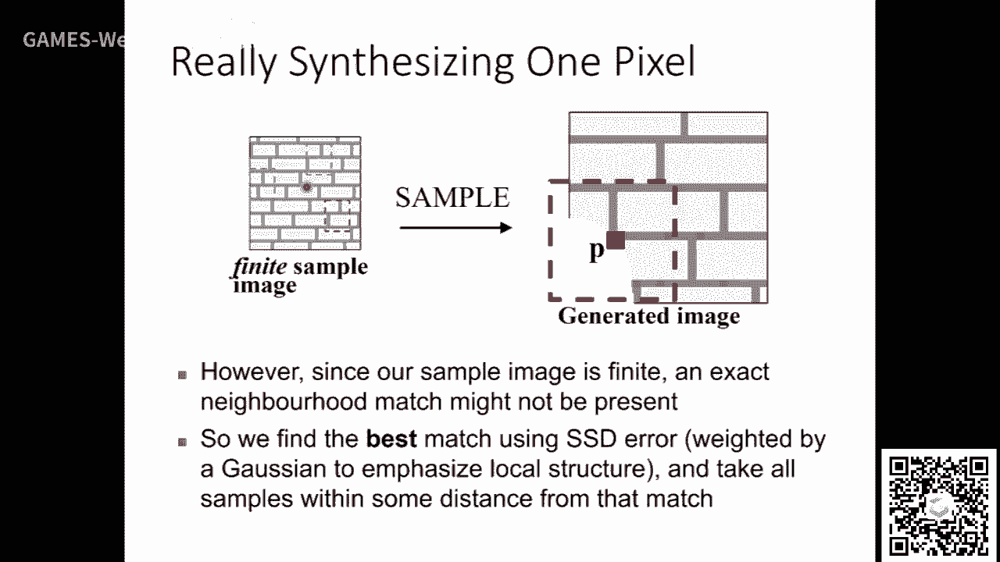

逐像素的一个啊这个纹理合成方法啊，我们来看一下好这个左边是一个呃sample啊，是是一个样本，那假设右边已经合成到了这个地方，那么这个像素呢像素是比较小的，在这里啊，好这个像素是未知的啊。

就就这个这个方像素，我用这个像素周边这个这个非矩形，但是类似于矩形是实际上是更更是一个我们把它叫l l型，这个这个区域颜色知道的对吧，那么我用这个矩形的颜色呢，到这里就全部比对一遍。

那每个地方我就得比比那个比对一遍好，这跟这个l框l型框最相称的那个那个地方在哪，假设是在这啊，我就把这个颜色给它拷贝过来好就长了一个像素好，以以此类推，我下个像素也可以涨，是涨完一行我也涨。

涨下一行就可以一个一个像素的去去去找这里最相似的这个像素，就可以把它拷贝完啊，所以这就是最简单的一个叫pixel base的那个这个方法啊，这个方法呃我先不往下讲的话，大家来思考一下。

这里面计算量最大的是什么，对吧，最大的就是来来比比对这个这个红红框啊，就是这个红框的颜色跟这里这里这里所有的这个颜色要要进行一个啊，这个度量的最相似的度量是吧，假设度量啊我们取最简单的就是l2 范数。

就是逐像素的这个啊这个差异的平方和，那么这就是一个检索问题是吧，所以这个是非常重要的一个技巧，就是要对在这里的这个向量，就是这些像素的这个值啊，把它进行一个组织啊，用刺杀猪啊，八叉树组织起来。

这样子搜索就比较快啊，我这里不提，大家如果要做这方面的时候。

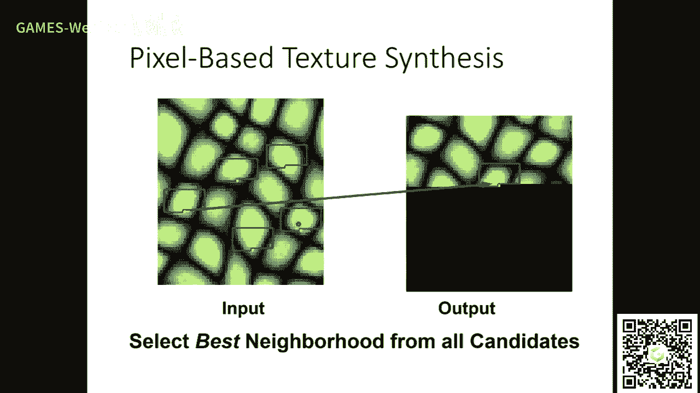

自然就会看到就会想到这种技巧好，这就是这个文文你这个合成的一个方法啊，那么这里呢有一个这个框，就是那个相似比较的那个框大小，你框的太小，实际上就是这个蓝色的就合成质量就会低啊，为什么。

因为这里有个有个有个本质的一个东西，你可以看到这个是绿色框合得好一点，但是这个pattern出不来哎，红色呢哎慢慢好了，如果如果到这个这个品红的这样一个框呢，这个合成出来质量就非常好，因为呢不同的话呢。

它抓抓的那个领域不一样，领域呢像像这样一个纹理，这个这个样本呢它两个圈圈之间呢是一个距离，所以品红这个呢是能抓住他们之间距离，这时候呢他这个合成的就能就能抓得住这个结构啊。

所以这个这个参数呢也对合成结果是有影响的，对这个取决于这个样本中的这些pattern的这样一些大小，这些这些实现了装盘，就大家试试就可以知道这些现象嗯。

那么可以看到这个样本下面这一行啊，这个砖头，那么那么你你这个如果这个比对的这个窗口比较小，这个合成出来虽然是以结构，好像也是一块一块的。

但是没有砖头的现象啊，这个已经有了一点点，再加大这个大小呢就会更好啊，好这是其他的一些结果，可以看到这个只要只要这个窗口大小合适，可能像这种纹理窗口不要太大，因为它没有太多的结构。

像这种纹理的结构要大一点，要不然要不然就抓不住这个结构，就像就像这里所出现的有些快大一块小。

而不是这么均匀好，那么刚才那个算法这个很容易理解是吧，但是很慢，因为什么他每个像素主要是错一遍，那么在这个过了几年呢，这个2002年啊，就是把这个算法推到了这个快。

就是一块呢可以拷贝很多很多很多像素过来啊，那么这个可以快过来以后呢，这个这个过来以后呢，我就可以用周边的这样一个区域也去比对，不就可以马上就拷贝下一块嘛是吧，所以你可以看到这张示意图，假设这一块有了。

我用这个这个这个小的是个矩形的颜色去找一个相似形，最快最相似的块在这，然后最后把这一块的拷贝出来啊，嗯这这这两部分是重叠的吗，好这是比较相似的，所以一块一块就可以很很快速的一次性拷贝多个箱子过来。

而不是一个像素，一个像素，我们想象一下，假设这块是10x10，是不是它一下子就拷贝了100个像素过来啊，速度就比刚才就快了100倍是吧，所以可以快好几个数量级啊。

这就是基于快的这个这个方法好，我们同样我呢我们来解释一下，假设我们哎合成的上面这个纹理好，那么那么那么这一块我不知道是吧，然后我我那个找他的一个领域是这个领域，然后我用这个领域去这里找啊，找完以后呢。

找一个最相似的领域啊，讲了讲到这个领域，就把这一块全部给它拷贝过来啊，那么这就完成了一次这个这个快拷贝，下下一层呢也同样啊，当然这里有一个小细节，就是两块重合在一起呢，它不完全一致，我找一条最小的歌缝。

使得他们那个呃这个人这个呢是取得这里的一块，这个呢是取得新的那一块，但是这个误差是最最小啊，这样的话看起来效果会会更光滑好，那么这里考完一盘以后，我就再考别的款，就就一块一块考啊，那就叫phic cs。

那么这个paypse sse有两个好处，一个是啊质量会更高，因为它一块块考啊，这个不像逐项做烤，容易合成，碎掉了啊，这个或者糊掉了它因为每一块都是原石文理拿过来的，拷过来的，所以它这个清楚啊。

也比较清晰，第二个呢它也比较快，因为他一块块考，刚才我解释了一块，如果10x10的快，那么一下子就100个箱子过来是吧，比一个像素，一个像素合成，当然快了，刚才我提提提出下一个歌分问题。

个问题呢我这里稍微解稍微用用个图来解释一下，就是b和b2 块逼着这个这一块和b2 的这块比较比较相相似了对吧，因为我们我们是拿拿这个边缘去匹配嘛是吧，就是这个但是他们又不完全一致，所以还是有一个误差。

phone是什么呢，然后这边呢是用b e的颜色，这边呢是用b2 的颜色，但这个phone的误差呢我尽量的尽量小，甚至等于零，这是有可能的吧，因为我从三代找一条路径，这就是典型的一个动态规划问题啊。

当然如果从图论来讲的话，它也是个啊典型的叫做最小这个流记最大流最最小值问题啊。

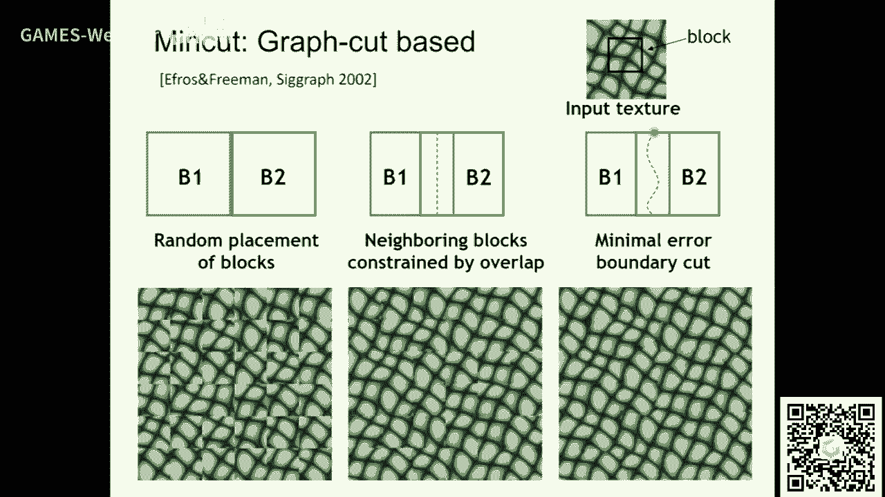

那就是这里有个形象的啊，那么这两块呢它们不完全等于零，但是呢我他们的差，它它们的差是这个图像啊，这个图像不完全等于零，因为如果全是黑的话，表示这两个是完全一致对吧，但是呢我可以找到一条缝。

其实这个缝呢尽量的都走黑的黑的地方，嘿嘿嘿，a地方是不是相当于这个缝走的地方都是误差等于零，这样的话就看起来这个视觉效果呢就就会更好一点啊，那么这个区这一块，这个区这一块，然后把它拼起来啊。

就达到无缝的效果啊，你就理解上就是把这两块的误差图上面，找一个这个这个误差最小的一个缝就行了，好这个叫叫sing啊，就是实际是就是啊gdht啊，最大流最小个的问题啊，图论里面的一个非常经典的问题。

如果同学们做过那个图像处理，这grab cut。

这个啊是是必须要非常熟的好，那么这种算法呢也非常适合去去做这种自然图像，比如说我想把把这个图图图片把它合成到到这来，你只要把它拷贝过来以后呢，找一个最小误差的曲线。

反正就就这个就肉眼就看不出他们之间的差别好，还有啊你可以看到可以把这一块把它拷了，拷贝到这来，只要只要这条缝是看不出差别，就能把两个图片进行合成。

那么这种方法这个呃后面就是十几年前有当时非常热的一个topic字，叫做啊图像缩放，你这缩放可以叫some coin，就是我对一个图像进行伸缩啊，哎我我比如说这条竖直的线就是一条什么。

比如比如说贴住或者是两边差距比较小的线，我把这条线这条线呢占一个像素宽度，每一行都占一个像素是吧，然后你把把这个红色的这个像素把它硬拿掉，左右一拼就完美的就拼成一个啊列数少一个像素的图片对吧。

然后你只要这个差异看不出来这个这个图片是不是少了少了一个对吧，然后你重复操作啊，你你你操作100次，这个图像就少了，列就少了少了100个像素啊，就这样的话可以达到啊这个缩放啊，所以这个缩放的原理。

就是说我这条线呢肯定不会是经过这种明显特征的物体的地方，因为这条线经过这种方法，它的误差是非常大的，就是两边的能量是差别是非常大的，所以它一般会走什么，走那些，这真不是很明显的地方啊。

就是当年这种叫做content aware。

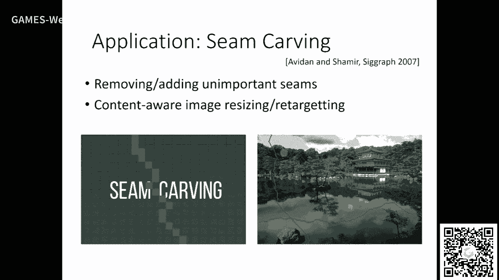

这种叫做基于内容的说法啊，这里是一张图，这个是上面这张是原图啊，左下角就是用刚才那个想法，你可以看到这个线呢就就会保持这样一些比较明显特征的地方，就会得到这个结果，如果你是简简单的这个scaling啊。

你可以看到是这个结果，这个这些地方呢就扭曲挤压得很厉害，如果只是cropping的话，会把这个地方呢三给他截掉是吧，所以这种sim卡这种技术呢基于内容的国家，内容敏感的这种说说话呢就能就既能保留特征。

又能很好的呃达到这个这个图像说过的样子啊。

那么我我这里就不详细展开啊，啊现在这个这个topic的也是年龄比较比较多了，这个呃最近文章也不多啊，但是要大家清楚曾经很火的一种技术，可以把这个基础内容来做缩放呃，纹理这个刚才讲完基本原理。

我们现在看看这个还有很多其他其他方法，像这个tt，因为这个纹理合成最怕就是把这个pattern呢就搞搞碎掉了是吧，所以呢才103年有篇文章就算是微软啊，这个呃呃这个研究研究院的做的就是唉我呢去手工。

或者是通过一些视觉方法去判断里面有一些这种python，就我看到呢就把它叫叫做这个tag，就是你把它理解成是telement纹理的一些元素，如果我在合成过程中呢，能把这个这个这个tag的结构给它保持住。

那么那么对应的就是颜色拷贝过来是吧，所以你这个结构保持住的话呢。

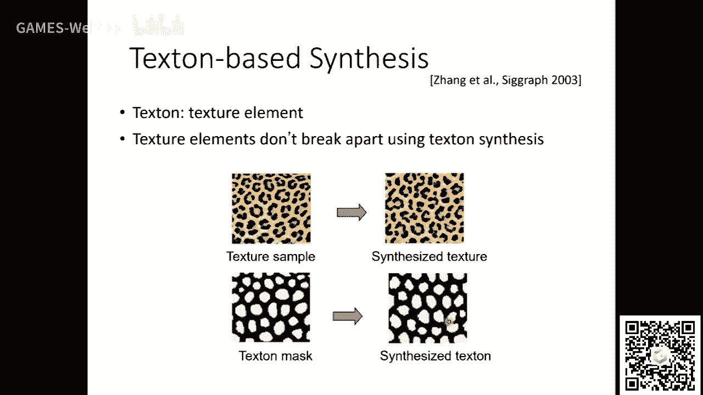

它合成的这样一个纹理就不会不会碎掉啊，这就这就是当时那个呃这个这个太痛的方法去合成，那么他后面还有不同的这个人，从各个角度啊，像什么什么菲谢麦map，本质上也是在在在在寻求这些纹理的一些特征。

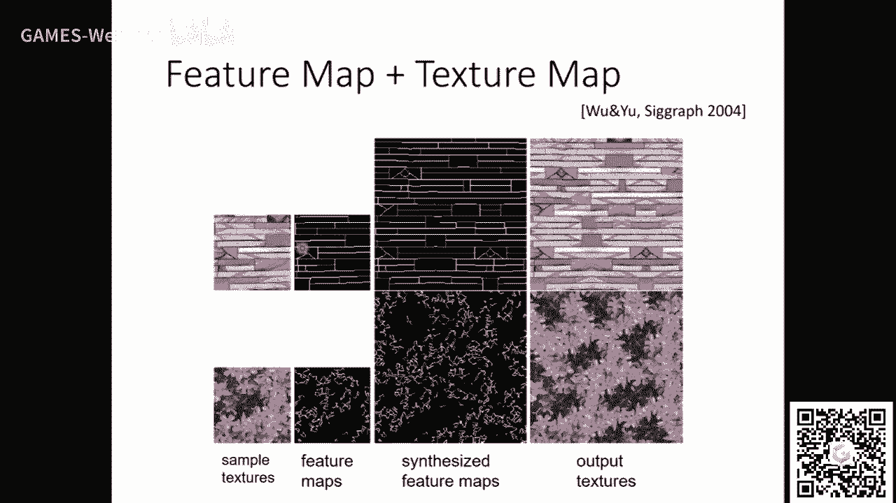

那个把车灯保持住，合成结果就不会不会碎掉，也不会烂烂掉啊，呃呃纹理合成当时做的还有好多是做这种什么local size control，因为它的这个大小在变大，可以产生这种光滑过渡的这种纹理。

这个这个这个伸缩的样子，这个结果啊还可以呢控制这个方向，哎我的纹理合成的时候呢，我里面不是从左到右，那么合成过程是不是可以看的是它沿着一个向量场，只是在和顺序在合成是吧，所以你只要生成这种斜的呀。

这种非规则的这样一些加工厂，我在合成过程中就能找产生出这种不同的朝向的一些纹理结果啊，就是合成过程呢是沿着这个当场背后有个向量场啊来合成啊，这样的话呢就就可以产生分布变化多端的一些这种纹理。

结果就通过这样一些手段啊，一些伸缩呀，一些方向来控制合成结果好，二维讲明白了，那么我们看三维三维这个过程啊，如果二维讲明白三维中心的三，只要类比把这个类比想明白，你上面怎么做，就就就应该不难好。

我们来看一下啊，这个这是个类比啊，就是阿维在上面涨这个平民区涨对吧，涨的过程中呢可以按不同的方向啊，这个大小就合成是吧，那么我们这里是不是也一样，我可以把这个纹理啊在这个曲面上，也在曲面上去找对吧。

最前面呢如果有一定的这个朝向的这样一个定义，比如说向量场，那么我我这个有点像这篇文章的好，那么你只要有个向量场引导，我就可以不断的去扑过去，对吧啊，然后进行合成啊啊这这是一种思路，还有没有别的思路。

有啊是吧，我可以把这个曲面把它剪开来，把它参数化变成一张平面的这样一个定义域是吧，在定义上面去用平面方法去做合成是吧，但是呢这种但是这种方法呢就点击比较明显的问题，就是它扭曲，如果这个地方不是很均匀啊。

他们这个产生的结果就会不是特别好好好，那么同样跟二维一样，我希望快呀，高质量啊等等啊，减少扭曲啊啊连续性啊，不连续性要要避免好多，我的样子这个要求好，我们来看一一个三维的一些纹理合成。

我要我们我把它总结成，反正就这么三类吧，好第一类就是过程时有点像这个二维的这种，从那个用函数来表达纹理啊，那么这个呢叫procedure tech，叫过程时纹理就是用一个函数去定义这个纹理的特征。

那么三维空间中它它用它用一个三维，就是x y z就是r3 到一个值得一个影射啊，你这个这个这个这个函数定义好，然后你把这个三维模型嵌入到这样一个场啊，因为空间中任何一个点都有一个颜颜色的这个影射值。

你把这个模型嵌进去，你就可以得到一个这样的每个表面一个顶点就可以演示，那你这个现实地方不一样，就这个颜色是不一样的是吧，但是它总体上表现出同一类这样啊这个这个纹理的这样一个函数啊。

那么这种函数呢呃叫做这个纹理过程啊，过程纹理函数啊，过程管理函数呢这个怎么构造呢，实际上可以通过人为一些方法啊，对不同的这样一些纹理特征去进行描述啊。

那么早年最早年最有名的就是那个85年的cpf叫pin noise，叫那个啊林噪声，它就是通过一个构造方法啊，那这个生成一个函数，这个函数呢通过一些扰动跟随机。

就可以产生出不同的这样一些纹理的这样一些函数图像啊，啊比如啊这个这个叫这个啊特别ence啊，这个函数啊，它是从通过这样一个这个特别ence这个x啊，通过一个论噪声函数。

那通过这个不断的迭代就可以造产生出不同的这样的效果，那么只要在空间中产生这样一个函数，把物体嵌进去，就能长出这样一些啊，把纹理出来，当然这个怎么设一些函数呢。

啊他给了一些这种啊比较通常的纹理的这个构造啊，所以大家也可以去自己去想一下这个函数啊，好你可以看到它当时长长长长的一些这个纹理啊，嗯当时还设计了好多这种大理石纹理的函数啊。

像这种是大理石纹理marble，后来也有很多不同的学者啊，就构造出各种各样的这种这种函数，这样一些这个这个函数出来，函数一旦有了以后，你把物体嵌到这个空间啊，你这个纹理就会更加变化啊。

啊这是早年的一篇基于这个呃模拟化学物质在上，这个化学物质的一个一个叫reaction，这个reaction叫叫融合啊，就是扩扩散方程。

就是让里面的这个一个像素呢看成是一些啊分子，分子之间有一些这个扩散扩散，然后到稳定状态的时候呢。

就形成一定pattern的纹理，可以可以开上了，当时这个生成一些这样简单的纹理都还是做得到的。

还有既然你这纹理是是在空间中，所以你可以定义在题里面，所以这个纹理不仅在表面上可以定义，你帮你把这个球切开来啊，这个看到里面每个体术都是有一个纹理值啊，就有这个叫sorry的tet叫做体纹理。

后面也有很多工作在做啊，啊这这些结果可以看到这样这些体温里面，你把这个物体把它把它切开来，里面这个这个像体术也是有有这个颜色的啊，像像吸管一样的切开来，里面也还是有这个颜色值啊。

跟我们以前讲的那个ct图像一样啊，他们任何一个点它都有一个延迟值好，那我们看一下这个呃，前面那一类，第二类就是基于sample，什么意思呢，这不就是诶我给一个小样本。

怎么把这个纹理长在这个这个这个曲面上，做这个做这个纹理上面纹理合成的大部分都是这样，都是那个呃由呃，把这个网格的顶点附一个颜色啊，那么这样的话就跟这个这个网格顶点有颜色以后呢。

我们就表示这个网格纹理合成做完了，那么这里就有一个问题，就是网格的顶点如果太稀，你每个点各个颜色就就就会很糊，所以你可以看到这个顶点越来越密的时候呢，就看起来效果就会越来越清晰啊，你要做这个事情。

在图像在平面的时候是有一个大小patch，我在曲面上，你把这几个关键的一因素或者关键的这个这个技术把它想明白，三合成你基本上就能够理解一个是我生成多密的网格，这个这个点的领域，你比如说这个矩形。

我大概是怎么去找它的领域的顶点是吧，它的它的大小怎么样，它的朝向怎么样啊，这一个把它类比出来，基本上三维的这个纹理合成就能做了，好我们来对比，这是个平面的一个图像，那么比如说这个像素我取一个55。

它的领域取5x5，这样这样一个像素，那嗯你可以这样去理解这个点呢，就朝各个方向去走两个距离是吧，所以呢如果在一个曲面上，这个点想取缔于呢，我也抄类比的话。

朝各个各个方向呢去走两两个像素或者多少像素的一个距离，就能够采样，如果这些点的颜色有了，那么那么这个点就可以根据这些领域的顶点去找一个最好的像素，把它拷过来啊，所以这样的话就是在曲面上呢。

我们也要去找一个这样的一个矩形领域，做为他的一个匹配的一个策略啊，这个这个元素好啊，所以这个想明白以后，你我再一看哦，给一个这个网格，我的网格呢啊，首先把它周围的一个一个片呢，先把它fratten。

把它参数化到一个平面，那平台以后呢，就可以在这上面进行采样啊，距离这个东西怎么转，就取决于这里应该有一个背后有个向量场，这个方向呢变成x轴为x轴对吧，然后你在这里采样填完以后，就可以把颜色一个个去匹配。

我们这里有个有个演示好这个点这一块先把它展开展开以后，然后进行采样，采样以后呢，这个采样点就可以照像素点去进行比对啊，啊比对完以后呢，就把这个匹配好最好的颜色，把它拷贝到这个顶点来啊。

当然这是假设作为景点有一些信息是已知的，对吧好，所以这个过程并不复杂啊，这个在在20年前或者10 17 8年前的这个发了好多文章啊，因为当时还没人做到啊，又有一些学者历史做到以后就发了不少这种文章。

这思想都是这样，有些大呢，有些他会用用一些多分辨率的方法去做，那这个效果更好好，那么这个是就是多多分辨率的，为什么多分辨率呢，它它有一个好处在于它可以同时捕捉不同大小的特征，刚才有个细节啊。

前面其实知道了哥，我在低分辨率的这样一个呃，比如说k神k的领域抓的特征相当于在高分辨率的2k乘2k，所以他这里用用同样的代价可以去捕获分辨率的这样一些更大的特征，是这个这个匹配的结果呀，更精准好诶。

这个而不丢失一些重要特征啊，这就可以看到它用下面一块跟上面这一块一起去拼，找找一块最相似的过来，可以让这个双方法呢更加精准好，那么网格也一样，你你你这个生成一个低分辨率的高分辨率一起啊。

然后然后去找找一会就可以拷贝好，我们一起把它列出来看看啊，好图像是一个是一个grade结构，在网格呢是一个非规整是吧，这个solution呢就可以把网络加密啊，用用餐用这个采样啊。

以前讲过的这个曲面加密采样啊，那么图像的话自然有一个横横竖，这个x和y当然这里叫uv自然的这个这个标价，所以这标价呢大家都缺损是横平竖直，但是在曲面上呢没有，所以你要你要你要去定义啊这个一个向量场啊。

哪个是切线，哪个是啊啊这个切线是吧，所以你可以在曲面上生成一个向量场，那么这个向量场来指导这个纹理的这个方向，那么这个是在平面的时候，因为是个规整格子，所以它一行一行一行，这个叫扫描线。

这个顺序在明面上的话就不能唯一定义，因为曲面上这个可以证明后面曲面一定有有起点啊，这一行一行加是这个没这个顺序的，那怎么可以随机要不断的去去做迭代就行了，还有那个裤子啊。

这个规整结构这个非常好定义它的名誉啊，网络方面的话就时时刻刻都要进行这个参数化，然后重采样，就是这个过程好明白以后只能实现的难度要稍微复杂一点，但大致思想是差不多。

可以看到这个加密可以用return啊进进化，然后这个顶点越多呢，这个合成的这个密度会越高一点啊，然后怎么生成向量场呢，这里不同方法对吧，你你你曲面上本质上是一个啊流行r b流行本质是二维是吧。

只不过在空间中，所以你可以利用流行上的一些函数去插值出一些，我用户交互的一些一些这个这个方向，然后生成一个光滑的向量场啊，这里我就不展开这个，当然下场也也是个呃。

这个几何处理里面一个比较呃研究比较呃多的一个问题，就是怎么生成下场买一定禁止，像这里有一个词叫复位是magic，什么意思呢，它要四个方向要对对称，有些下场是一条一条是两个方向对对称是吧。

所以如果你希望这个这个这个纹理呢长成这个样子呢，是四个方向，那个差不多，那么你要生成这种有新的这个向量场啊，那么这个向量场本质上这个啊在这个很多应用里面，插动画也很多应用啊。

整整是一个非常重要的一个一个一个一个一个啊，技术就是怎么生成一个符合用户需要的或者应用需要的。

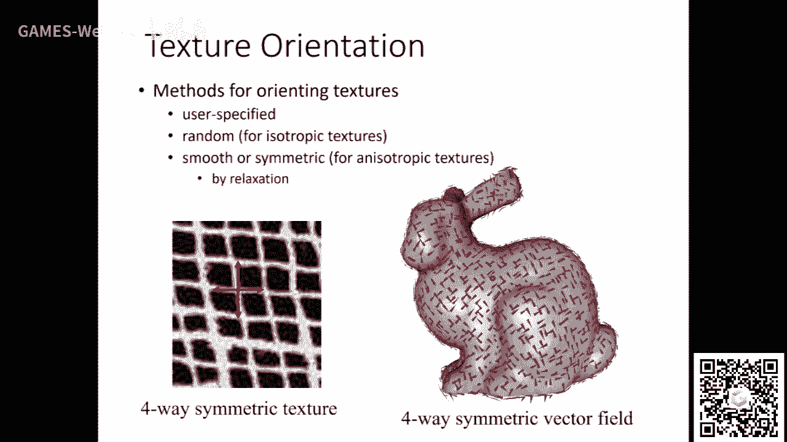

这样一向量场好，那么这个是一个事例啊，就比如说用户通过交互，我这个希望这个下半场在这里是这样子，就就是用户交互若干和离散点的向量场，我要生成一个美，每个点都要有个向量的一个方向的向量场。

我应该怎么做是吧，大家看我只指定了这这些点的这个向量值，那么我要生成任何一个点是吧啊，这显然就这个差值问题是吧，所以我们这节课我们前面他的两次课来讲差值思想啊，实际上是大部分问题都在都在求解。

差值都在求解映射啊，思想啊，这个这个抓牢了什么问题都可以查字啊，但文理合成也是这个差值，只不过差值呢是是通过马可波厂来定义的这样一个函数嘛对吧，基本上可以把就会把它叫做差值问题好，所以在上面好。

你这个只不过是一个流行曲面上的一个距离是，那么那么欧式距离变成了由曲面上的距离，就是比如说车底线，你同样可以用rpf啊。

同样可以用其他的一些函数去去去差值这些点，那么这是不同的结果的一些啊，就像这个是四，这是二对称这个这个这个厂啊啊那么这个是随机，你看到用不同的场的话，你可以生成的效果看一下啊，这是随机的。

这个是二对称的，这个是是对称的啊。

你可以看到它那个与这个特性都会有些差别，那么同样也也有这种多多分辨率角哈，那么呃有有两个低的分辨率及扣成一个高的啊，就这样唉，因为低的这个分辨率呢快，因为它它的像素小点点少。

但是这个结果呢可以帮助来合成这个这一层的这一层呢来帮助他啊，就一层层，因为下面这一层呢2x2x2或者或者是3x3，相当于它的6x6，相当于它的12x12，它是24x24。

所以它这一层的话就抓住了这里的20x24的一些东西结构，可以辅助他抓住一些宏观结构，但是呢又不必要用24x2次，这里的大小去抓它的结构，这样的话就速度会比较快一点啊。

因为你在一个高位空间上去找一个最近0年构建一棵树，那个树的为这个这个向量的维数读过很高。

也是很花时间，所以它为了降维这个思想是这啊，这个是一个示意图啊，这个大家呃就是怎么怎么来生成这个不同分辨率，那么图像的分辨率是大小啊，但是网格服务网格分辨率呢不是不是把它缩小，把它顶点减少啊。

就是以前是n个变成16/44分钟啊，这个这个这个30 33万只能就这样好。

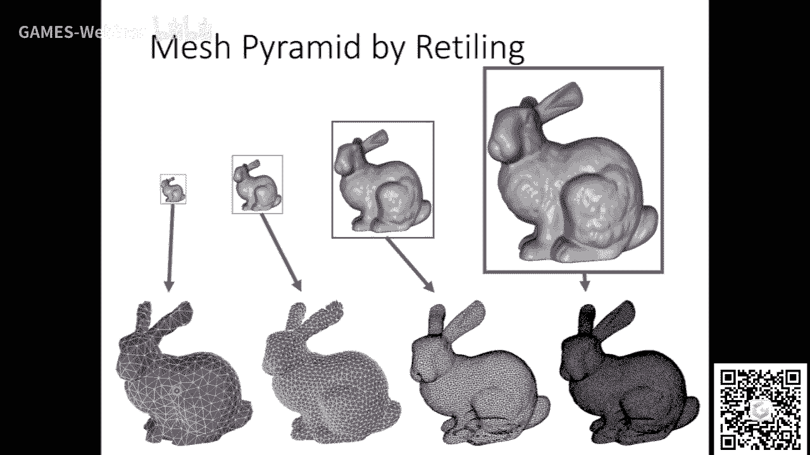

那么这是当年做的一些把这个二维的纹理啊，这个样本合成到曲面上啊，在那个年代这个合成效果还是不错的啊。

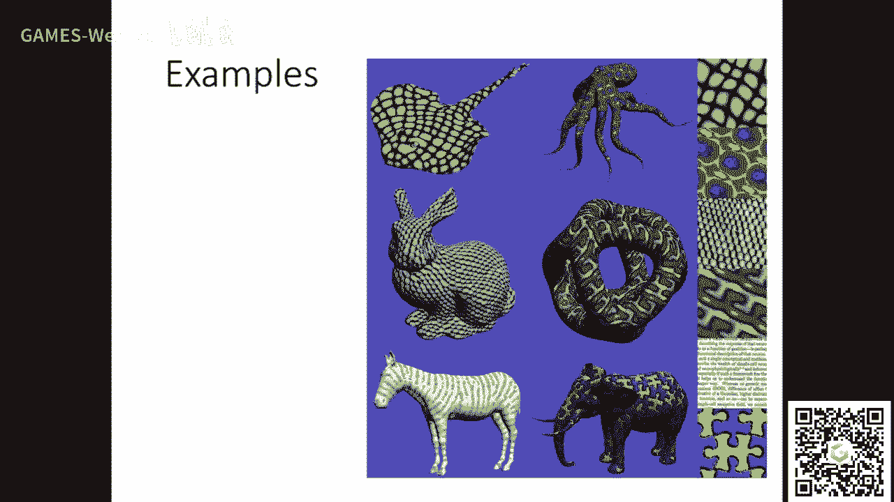

这是另外结果好，那么刚才是主点的一个点，我不可能搞明白了一个点怎么去去去去展开是吧，那么有没用更快的方法，一个面一个面当然有了啊，那么这个就是后面就找了一个面的，比如说我我这里拿一块，我就贴上去。

这然后呢我就也是根据领域去匹配，然后去找一块更好的，然后把它把它把它贴上去啊，这个这个那个叫left texture啊，嗯就像就像贴贴膏药的一样的话，就把这个纹理把它贴上去，然后切过程中呢这个切断打。

那么贴哪一块怎么贴，都是用周围的领域这个相似性去去找啊，这里也是一个啊动画演示啊，首先呃找一块这个patch，然后然后不断地去沿着这个曲曲线的这个方向啊，一个个贴好，首先切c这一块。

在这一块的过程中呢怎么填呢，也要局部把它插上生化的，因为呃这个这个曲面是弯的，你怎么怎么去把它那个这个纹理附上这个顶点，就直接把它展开，展开以后把它颜色给运上去，好这一块就结束了，那么再接第二块。

第二块跟他有一些有有一些重叠，重复重叠呢去找另外一块嗯，然后呢就涨涨到第二块好，然后不断去涨啊，中间它也引引引出一些随机随机的现象，就是你先贴贴完以后呢，那些没有填满的。

就再根据周边的颜色去去找一个最好的块，那么这个为什么他不用整个块去找呢，他他要取这个这样这样这样一个不规则形状的，这个这个他就是觉得这个不规则形状态就抓住了一些主要特征，因为有些象形。

你看这个问你取一个方块就把它截断了，但合成的不利于这个这个纹理块的完整性，所以你可以看到它都是沿着这个纹理的一些基本的元素的，这个边界来来设置。

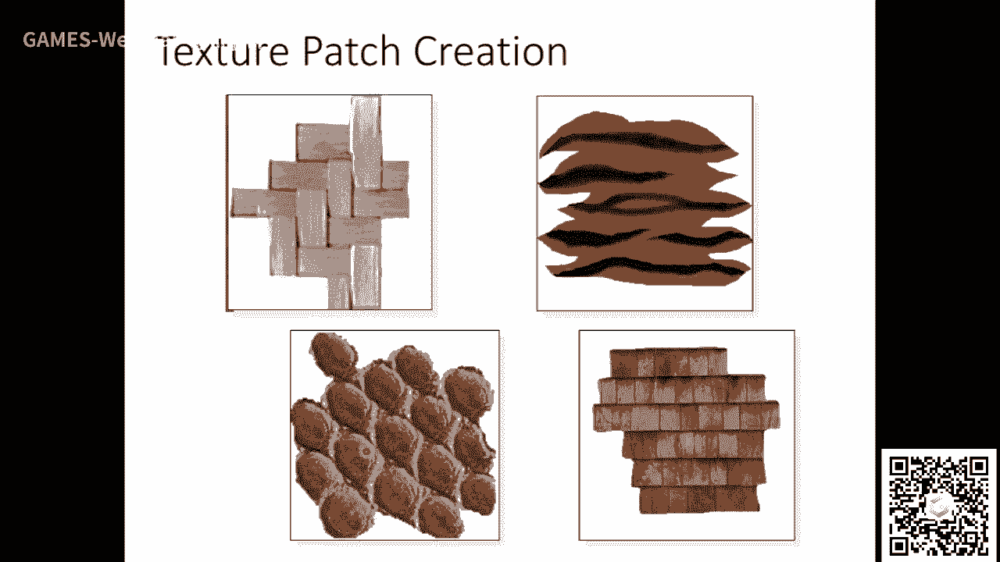

快啊，这样的话可以让让这个合成结果质量更高一点，如果没有结构的话，就就就就随随便举个边界就行了。

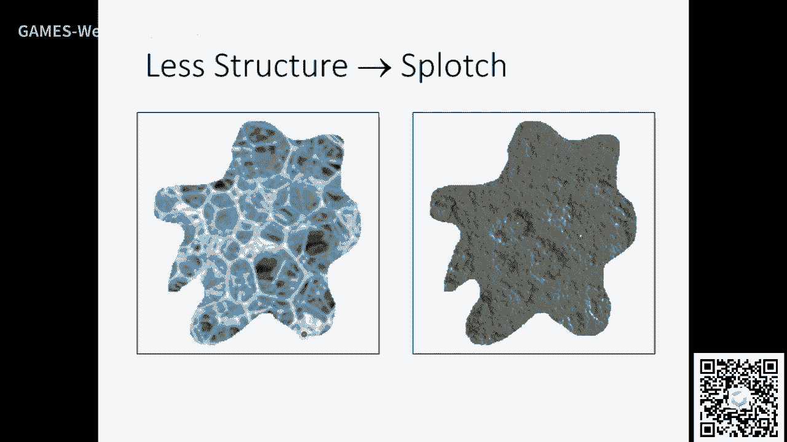

你那我这就一个演示颜色是怎么去取餐的话啊，怎么参的话，多大覆盖到这样一个sample。

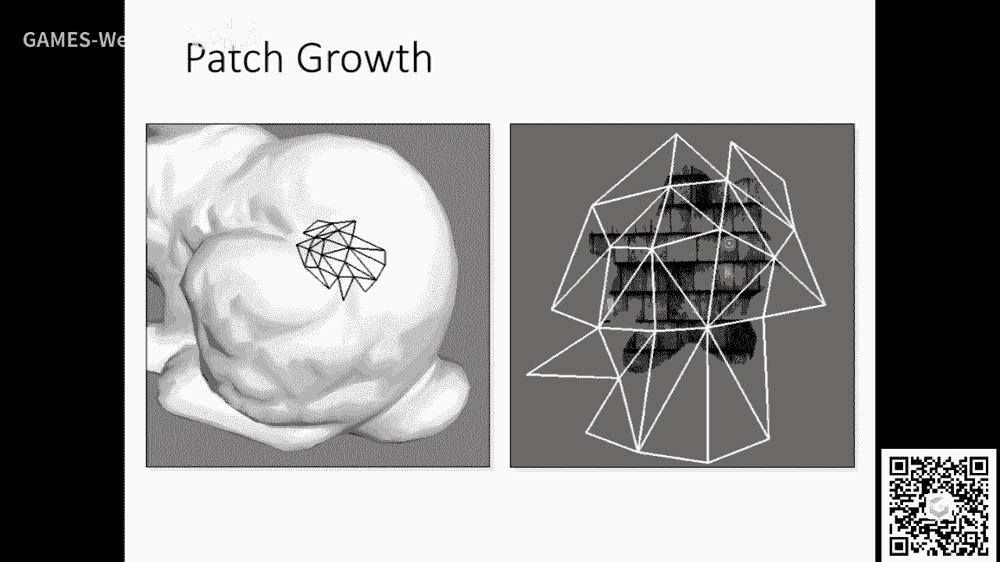

你就就可以就可以把把这延迟拷贝过去好，那么这是一个refer一个演示。

wifi前面也讲过了啊，我们这里它就重叠一下好，这就是不同的，这是一个随机向量场，是随便贴，像对这种纹理没有特没有特别明显的这种特征，你你随机贴方向啊，不一定要一个光光滑向量场，看起来都差不多。

这些这些纹理都是比较各项同性，像这种纹理呢。

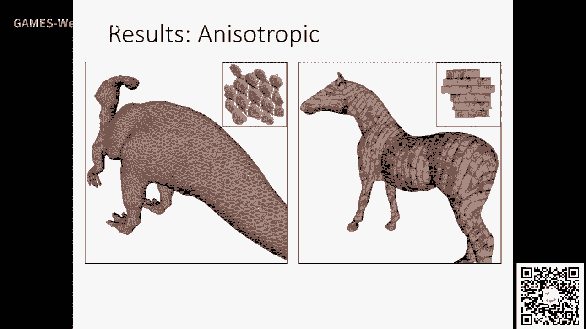

异性就要设计一个好的的向量场，让它长起来更好看一点，好把一个老虎的斑纹贴到柱子身上啊，你可以看到向量法不一样啊。

这个大小不一样，生成的这个结果就不一样，那么这是一个当时出在西瓜和那个proceeding这封面上一个结果，但是这个结果初看还是不错的，但是那个年代并且它每每每一秒能生成2伏针还比较快。

因为他拷贝是一大块一大块拷贝啊。

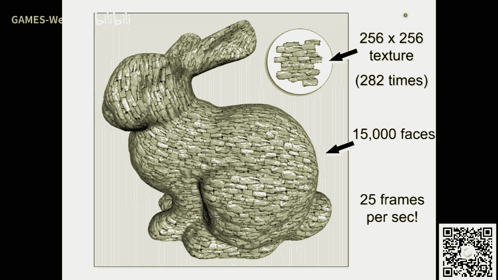

啊当然也有一些呃局限是不完美，因为你还是有些地方匹配不牢，因为它不像像呃这个规整图像这个矩形一样，它总是可以拼得牢是吧，因为它不会断，但是不像我网网课上面的话，它呃就就不一定这么这么运气比较好。

就碰到啊，这个这是20091片sara选，是当年我的学生参与啊，跟国防科大这个徐凯老师一些，他当时还是学生好，那么我们当时一个一个出发点，就是说有些曲面啊，它那个啊特征很明显。

像像这个曲面它有这么多边界啊，我们文理呢也有这个特征，我希望纹理的特征呢也就online这个几何的特征。

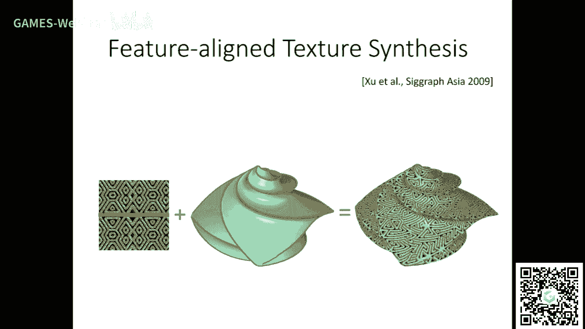

这话那生产出结果呢就不会啊啊这个这个差啊，那么所以我在呃首先给一个给一个几何网格啊，我首先把这个特征给它检测出来，然后我的这个向量场呢尽量的去online，尽量去吻合这个边界上的特征。

就是向量场就是能够在边界上面呢，就能够跟这个特征呢放朝向是一致的啊，当然这里解决一个问题，就是这个下场肯定是有错矛盾的嘛，啊那么这里怎么解，把这个把人些起点，把它把它集中到一些不显眼的地方。

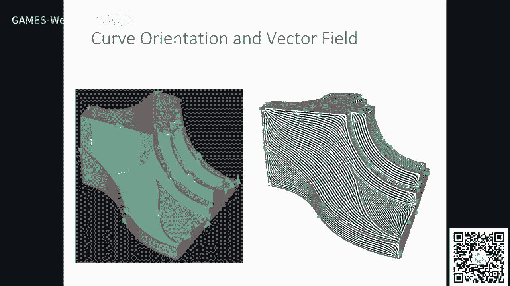

这也是这篇文章工作的一个小卖点，那么你可以看到，如果没有去用这个好的向量场，它合成是这样子，那么我们用的用了好多向量场啊，就是我line这个特征的话。

你可以看到它那些马鞍的特征相这个几何特征就能混合得很好是吧，那么这可是鱼，那么如果这个没这个没online，那么这里online的一些特征可以看到这个鱼的眼睛啊，像这里人脸出不来，我们再看一下啊。

这其实没有用我们的方法啊，这是用我的方法去做的，这个鱼也一样啊，这个鱼的眼睛这些特征都没有啊，那么我们再看一下，这是没有online这个特征，就是online特特征的结果，可以看这个纹理长出来以后呢。

还看起来是不是是个鱼的眼睛好，这个也一样，这个就是特征稍微明显一点，好好这是十多年前的一篇工作，大家好，那么这个当时也有好多啊，可以混合两种纹理啊，在在还有渐变啊。

这个叫progressively和vans的这个纹理合成，这是哦这是02年一篇，我当时你这也是我的第一篇craft啊，这个在微软通通老师知道下好，那这个当时做了什么呢。

就是文理合成是把一张图片把它合成到曲面上是吧，还有一些这个纹理啊，它是什么呢，它是呃有细微的几何结构，怎么就不同的光照，我从不不同事情去看它，不同光照呢它在纹理像是不一样的啊，我们来看这张图片。

就这个是一一个材质，这个那这个呢每个每个图片都是我是视点不变，都是垂直于看它，我光源方向变了，这个可能是从上面造的，这个从侧面造的，所以呢这种纹理呢叫做双向整理函数啊，就是因为它上面有细微结构啊。

有这个microstructure啊，就是有有这样一些这个这个这个这个结构结构呢，当光源不断不断变化的时候呢，它会产生一些自责的阴影，所以导致这个纹理这个图像是不一样的。

本质上是一个什么是一个多元的函数，因为什么它不仅仅是一个二维的这样一个图像，它还有光源不一样，试点不一样这些信息，所以这个叫pdf叫双向纹理函数，本质上就好像是二维，光源是二维，4。2维。

所以它是一个六维函数，所以怎么样把这样一个六维函数把它升到曲面上，始终我合成完以后呢，我上面的光源在变化时候，我也能够看出来他有这样一个立体感觉啊，当时btf这样这样一个合成的这样一个问题好。

因为这个世界上啊事实上的那个啊纹理还是有很多，是像这种木质啊，还是有这种微结构啊，所以啊那么这个方法实际本质上把它把它抽象出来，就是你怎么把一个这样一个高位函数。

因为最近点是同一同一个像素在不同光线下的特征是吧，所以你只要把它抽象出一个真这特征呢啊，就是一个对应的这个像素的一个特征，所以你合成的时候呢，用特这个特征去做匹配就行了是吧，那么从现在来看。

这个影射就是一个啊，比如说你可以网络也可以做是吧，那当时我们是用了它这些语言呃，像素的一个领域的一个啊滤波来做这个真正的抽取，那这特征与维数越高，抓到信息会越多啊，那么如果这个特征为数低的话。

就可能抓不住这个啊这么多视点和光线的啊啊这个方法是吧，这个特征啊，群里有人问你皮肤的几个细节是不是可以可以可以这样来尝试，当然可以了，皮肤呢那个不仅是有几何结构，它还有这种半透明。

这个叫subsurface scattering，就是这个这个半透现象啊，那么那种半透现象的话，它的它的这个光源呢，它不仅是反射，它还有一部分的透视啊，这个我曾经也见过这个用皮肤。

但是皮肤这个采集数据你要先踩到啊，不出不同光线下这个啊它它的表象也可以做合成，那么下面我就略高，你可以看到在不同光源，不同视点看到这个点是做这个颜色是不一样的啊。

那么那么怎么把这些颜色略为这样一个颜色看成是一个简单。

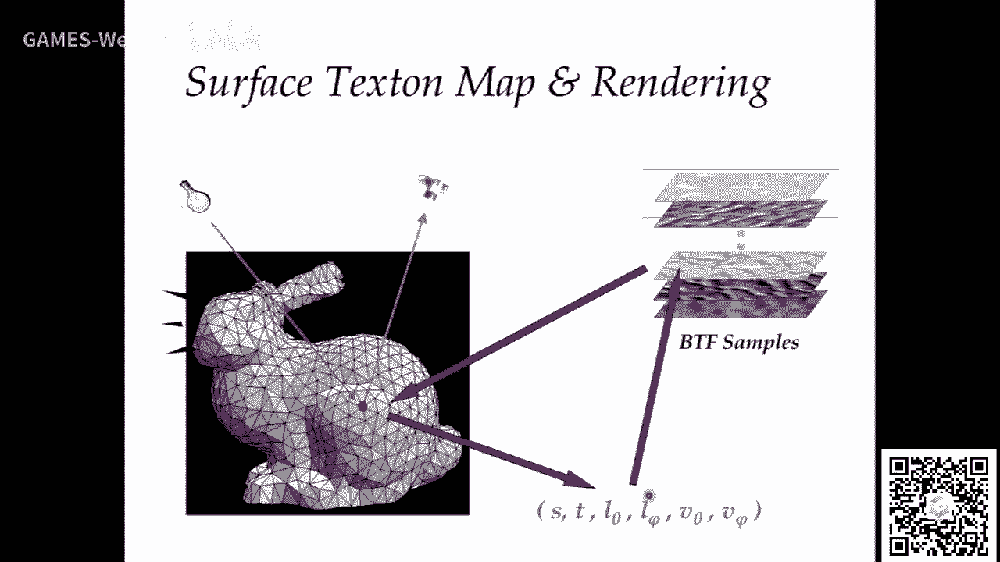

就看的是一个tt啊，btf的这样这样一个表达，买完以后呢，你就合成所一样啊，我们那边有个负债的贡献，就是叫k和口号人以前找或者最佳人这个呃匹配就找一个最好的是吧，那么我们这里呢是说你去找最好的k歌。

那么随机里面产产生一个就是不是就是从刚才讲的是k01 ，就注册找最好的一个过来，实际上那你就啊随机性就稍微弱一点，那么我们说你从最好的五个里面随机挑一个拷过来，可以产生更多的随机性。

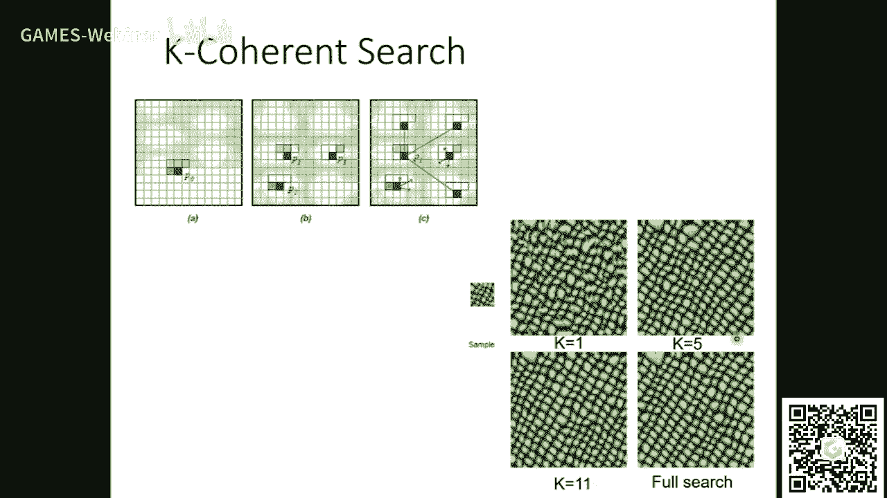

好这是当年的这个动画，我当时我这里没有附上来，就是这个结果呢，他不仅是看的是一个曲面上这样一个文理，你光源光源在变上面的这个纹理啊，阴影啊都会跟着在变啊，这个啊当时还是非常非常酷的，嗯就一个结果啊。

但这个事情是一个这种啊磨砂的这样一个纹理啊，就光线在变的时候呢啊你可以看到这些shadow阴影做的变。

这个是呃一个封封面的一个一个例子啊，就是那个呃这个是凹的啊，你凹的话，你为光源在变的时候，你可以看到就是两个不同的，我变不变物体，物体的朝向不变，但是我光源是在变，可以看到它呈现的这个样子。

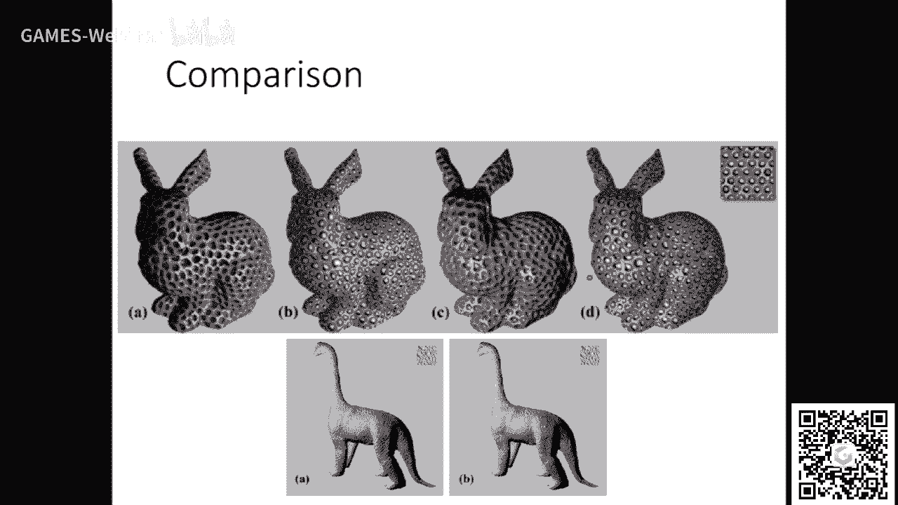

都能让我们感觉到这个这个是凹的地方是吧，那个时间过得很快，那么就我们后面快速过一下这个几何几何合成，九合成呢跟刚才纹理合成不一样，这个结合成就结合合成这个几何结构啊，就是比如说你是从里面提出合成啊。

像比如说合成这样一些细微结构啊，啊你还可以呃，啊叫叫做类比啊，我这样一个体有个这样这样的特征，然后你这个物体怎么合成跟它一样特征，就把它的特征跟它差异啊，比如拉普拉斯啊，把它把它变变过来啊。

还有当时06年呃，这个当时周坤老师也是在海德微软哈，那么他你提了一个这种基于几何的这种匹配，你可以看到没有这个这一块啊，这个结构跟原来这个结构呢进行一个合着一个match，好几个match。

然后match好了以后呢。

就把它拼起来啊，不断不断长出来一个东西啊，就像这里啊，我给一个这个几何的一个sample，这三不是图像哦，是是是一个什么，是是一个几何结构，它是一个几何，就像一个铁丝网。

你把把把铁丝网把它合成到柱子上面啊，这是个钱币啊，这个这是个竹篮。

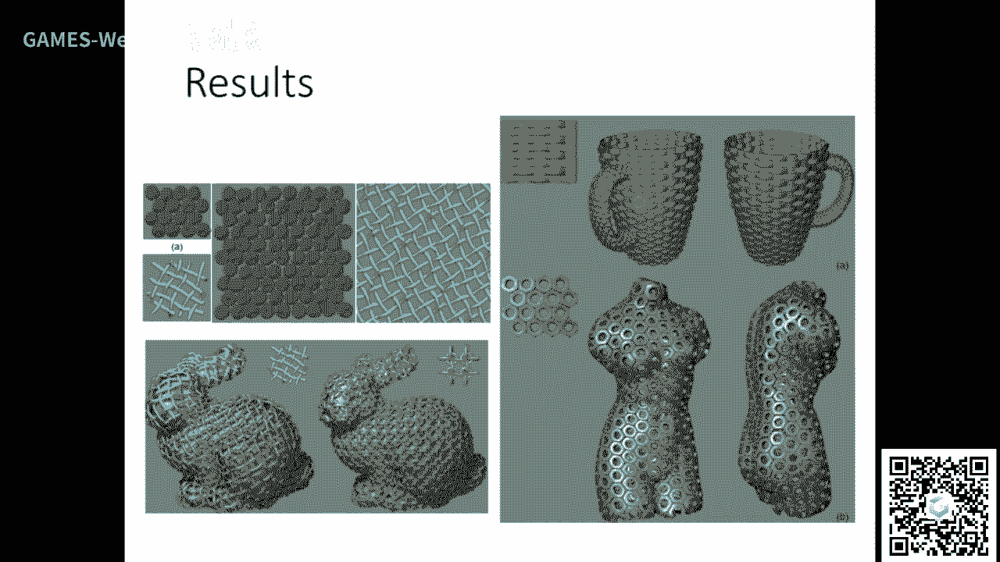

那么纹理合成这个呃我就不展开哈，这个你呃这个文理合成讲一点的话，各种方法展开的话，你还要讲两次课，今天我们一次课不到就把它讲完，就是主要讲的思想啊，管理合成一个最大的应用呢。

我感觉啊我觉得就是啊这个啊这个修补修补图图像啊，像这里把这个成年人去掉啊，还有什么还有去啊替换这个图像里面的一些纹理，注意啊，这个替换纹理你还不是仅仅简单，你还考虑它的它的这个阴影啊，这个shadow。

还有还有这种啊空间关系啊。

这个还比较困难一点，好下面还有部分呢才最后一部分部分呢经常分析与理解啊。

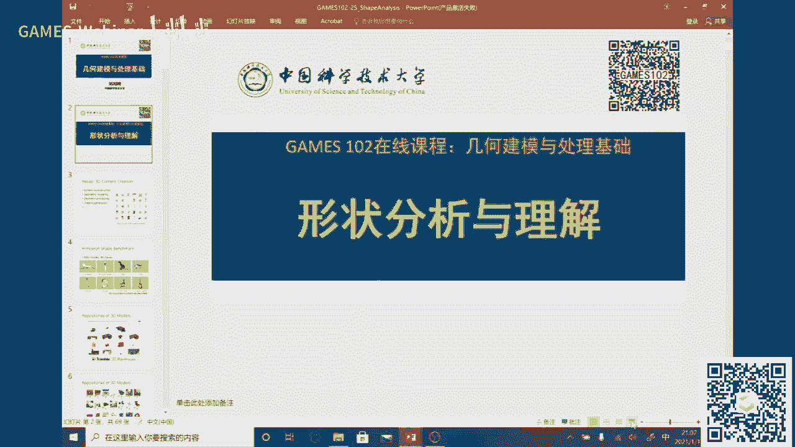

这个呃如果讲慢一点，至少要4~5节课啊，那我今天再很快把它过一下，大家知道这里面是什么问题好吧，那分析与理解呢是跟这个呃建模呃，好处理还是相关的。

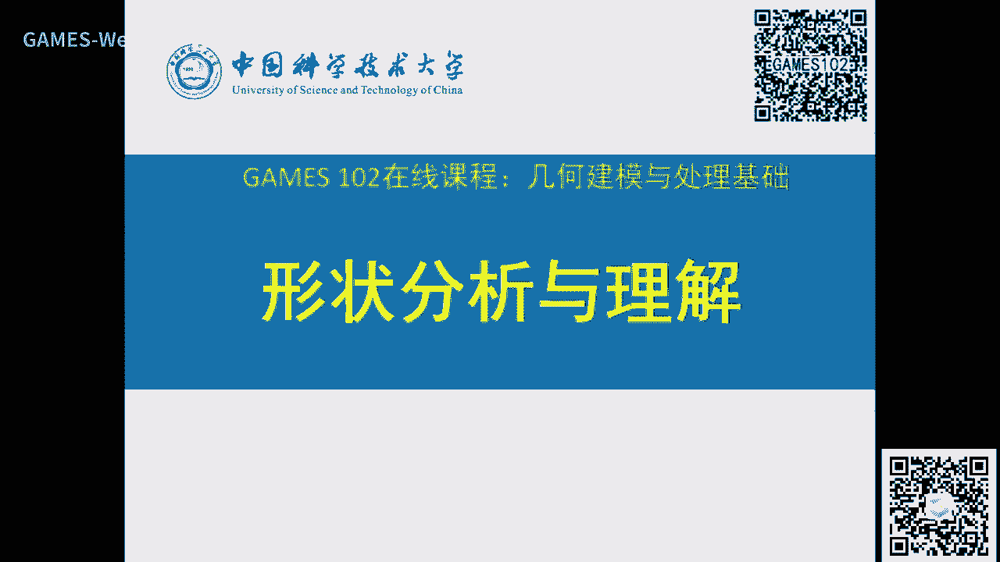

因为它呢呃更更多的是从更高的high level来理解这个形状，好，那我们来看一下recap，就是回顾一下这个前面的课都在讲上面的内容的生成是吧，有些是重建，有些是这个建模设计。

有一些是这个啊通过合成啊，嗯很多模型你看到现在，这是最近的10年越来越多的一些商业模型网站就共享网站出来啊，这模型越来越多啊，不像我们当时读研啊，那个嗯24年前那时候没有互联网啊。

那么我们我们考一个模型都要拿一个这个软盘啊，你们可能然后零零后很多都没见过这种网盘啊，就一个软盘才1。44兆啊，这个模型非常少，我们那时候做研究啊，这个都是呃就帮你啊这个teapot这几个模型啊。

没有像这样这么丰富好，那么随着互联网的发发展，能力建模所占的越来越多，现在互联网上这么多模型，共享这种家具啊，共享这种日常的用品啊，啊还有这种游戏公司共享了好多这种啊动物啊。

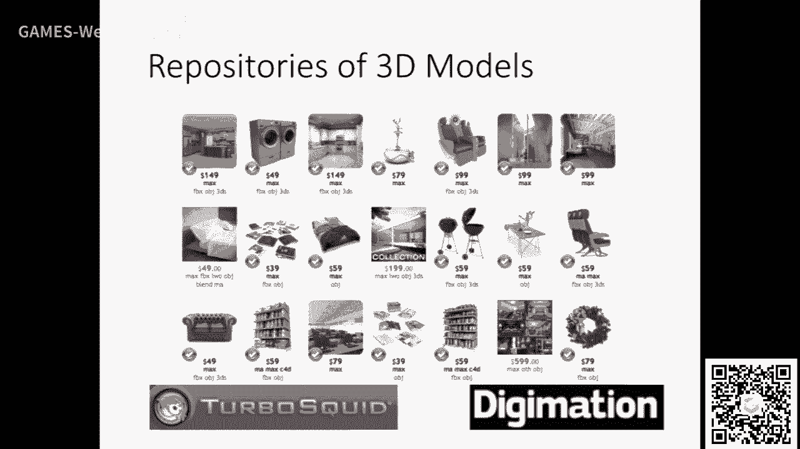

怪兽啊，所以现在呢这个三维模型越来越多好这里自然就就就有个问题啊，就跟视觉领域一样好，我模型给你了，你怎么去理解这种模型啊，你怎么去组织这些数据啊，比如比如说全是有各种各样的已知。

你怎么把这些已知归成一类来理解理解它，或者是理解它们的结构，理解它他们之间的结构关系啊，这个一个椅子有扶手，有背靠啊，它的关系是啥，还有一个呢有没有语义语义的这个这个理解，比如说这个这个已知的不平等啊。

做这地方是工人做的啊，它是有这个功能，是不是来提供支撑的啊，这样我的腿是来支撑支撑这个椅子功能的等等，这些东现在就就就跟传统的结合处理啊，不一样，结合处理唉，我们以前是建模啊，我们来做去照啊。

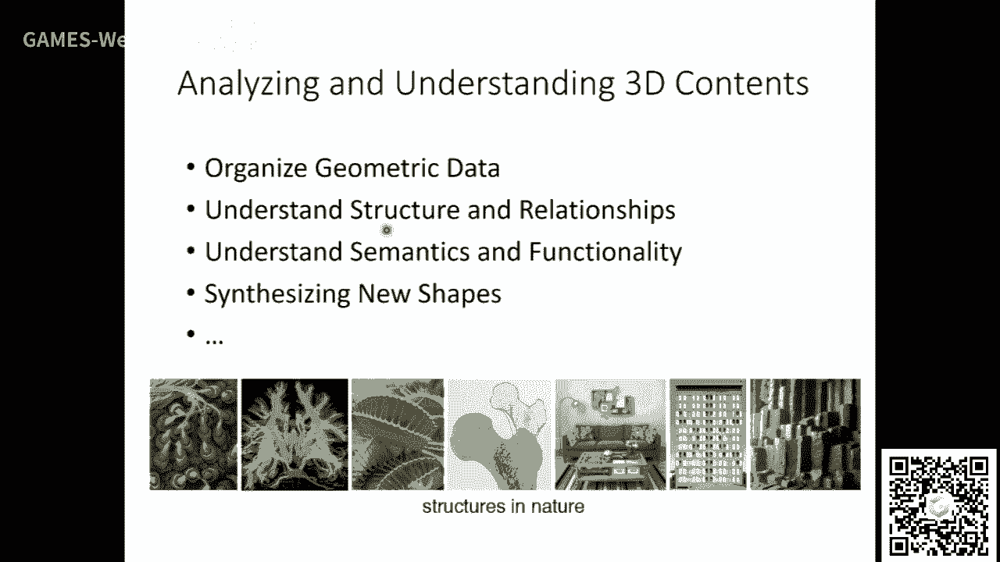

是局部的操作，这里呢更多的是一种什么glogo全域操作好，那我们可以看到就是这些知识也是属于高级课的内容啊，后面可能games我们也会来呃这个规划一些高级课程啊，让大家啊来了解一下这些更高级的。

那今天我就开个头好，那么一以前我们就是这这个我们给102大部分的这个内容都在讲，重建啊，去造修复啊，都是基于这个点的局部信息，但是呢你要去理解这个全局信息，比如说这个物体你分成有几个语音部分。

好像杯子一个差评，一个茶杯是吧，还有这两个人是不同的模型，我怎么知道他们这个点心一对应的是吧，在讲磨粉的时候也讲过，那时候是通过人工去搞啊，假设1万个人模型，你要自动去找他们对应关系好，还有呢检索。

我通过一个汽车能不能减少出数据库里面，跟我的汽车相似的汽车出来啊，或者这个跟我导致所有汽车出来啊等等，这里就需要有一些非常全局的一些对这个形状的一些分析和理解啊。

所以这个你也可以把它叫做从从这个low level这个processing啊，low level是指他这个处理的这个对象是一些顶点啊，面片还可能就更多的是一些啊这个components，一些部件。

一些关系，一些结构啊，是这个含义，这个这个实际上是挺难的一个问题，因为这个thematic怎么样呢，叫语义，就是你要理解一个物体在做语义，啊这个这个我们人眼一看啊，这个是个啊，这个是四个腿啊。

这个两个耳朵一个头是吧，但是这个就你可面对的是一系列顶点坐标啊，面片啊是吧，他怎么能做这事儿呢，但是我们能力又有需求，所以这就是这个导致这个最紧张呃，10年吧，50年左右，特别是最近的56年啊。

这方面研究非常多，因为现在数据这个量越来越大了啊，也是根据现在的这个背景，大数据时代啊，好那么具体问题呢我坚决不可能展开啊，这个要展开可能还要加1+50克，那么我今天就把这些问题呢再把它一列一下。

大家知道哦，原来这方面问题呢在对于这种啊形状分析和理解，还是很重要的一些问题啊，第一个比如说啊这个形状的特征啊，正在里面有着诶有没有一些重要特征点，你你你觉得这个是对这个物体很很关键。

就是一个人头眼睛鼻子这些啊，那么出你可以利用你以为或者认为这些高学历的地方都是特征点是吧，但是又不是所有搞高血地方，比如说头发这里人气有是吧，所以这个怎么判断，还有这叫silence啊。

就是这个这个这个叫做显著性啊，我这个这个模型给你了，我怎么知道这个脸脸是显著性大的哦，这个头发是显著性不不重要的是吧，如果你要做处理的时候，要把这个脸部的这个特征保持住啊。

其他地方呢可以把它损失掉一些对吧好，还有还有这种特征线啊，这个就啊第一步理解这个形状，还有呢哎这个形状我给你一大堆点点坐标，怎么知道这个这个比如说这个词显现了什么，in应该是这样朝朝朝向放是吧。

这叫upright，你要做很多应用的时候呢，你必须所有物体全按朝向一致才能做好后面后面应用，如果朝向一个是横的，一个是弯的，一个是斜的，一个道德，就这样放了很多很多算法都不work。

所以要把它那个啊这个这个这个超像啊，就像图像处理一样的，你把这图像横着摆才可能很多匹配算法都不work是吧，所以首先要把这个人脸啊全部朝下啊对吧。

并且还要什么保留中间那一那一块再来做算法就稳定好这个分割，分割呢就是怎么理解这个物体的一些components，就是叫做指指部件，头啊啊脖子啊，腿啊等等一个椅子啊啊不有了有了有了有了这些部件以后呢。

我就可以对这个物体的结构就有个初步的了解是吧，这个很多很多计算呢就能做得更好，我给一些物体，我怎么一起来找他们的一个鱼构建，这个这个这个手柄啊，有些平啊，非常的没有底座，那么我通过一类物体。

那可以相互着这个这个帮助支持可以来做很好的一些语义，还有label label叫标签啊，我分割完以后，我怎么知道这这个是头，我怎么知道这个是腿是吧啊，还有这个脱手啊啊这个这个这个呃身体啊，耳朵呀。

头发等等，这个叫label label的话，你你你你嗯，如果只你进个模型给到一个一个算法，可能很难很难做，但是我知道它属于某一类类类，里面有同样雷，对称啊，与像我们人人体本身就就是个对称模型是吧。

我怎么能检测一个模型的对称，因为政治化就是减少了这个模型的这种冗余，因为如果你把它最终找到以后，我只我只要存一半，另外一半只要把它copy过来啊，界面啊，那么对称还有一种男的叫这个饮食对称。

就是它对称呢不是全局对称，它是不分对称啊，这个叫分块对称，还有一个那叫隐私对称啊，就是要通过一个整形变化变成一个镜面对称，但是对称还有很多对称啊，除了镜面对称，还有旋转对称，平移对称等等，好股价。

股价也是理解这个形状的一个非常重要的信息啊，这个一个股价就要要要像比如说比如说做做这个分类为，我可以把动物跟人分离，因为因为它的骨架很相似对吧，我不会把把这个动物跟一个已知放在一块啊。

或者就是一个字母放一块，因为股价太不相似了对吧，因为股价就是三维模型，就是二维流形的一个一维抽象啊，一位股价做出一些线点线面是一个空间图，所以可以也可以很很很抽象的来表达这个上面形状对应关系啊。

还有这关系啊，小到点着点着对应关系，大到物体跟物理的作用关系，还有中间我这个部件跟部件的菌关系啊，所以这些怎么度量啊，就是最关心这里是为什么啊，这个还能找到这个点跟这个点对应啊。

这个嘴巴跟最为主要注意是吧，如果我们能交互，当然很容易交不出来，但是要靠算法还是不不不是那么容易的啊，要不去过，你说就是检索啊，我从我用汽车去检索数据库里很多模型能够找到我的汽车是吧，还有这个分类啊。

这个这个呃飞机这些特征，如果规则在这一类汽车还有动物，那么他们的特征要区分出来啊，怎么怎么把这个特征算出来啊，就是要对这个物物体一个形状，给它一个重量维持向量啊，这个后面我再展开，还有结构啊。

这个物体啊有很多这种像特别是人造物，有好多这种这种物体的对称性结构呀，还有这种层次结构分解好，如果做一个三维场景结构，还有更复杂啊，还有比如说啊这个这个窗帘啊，跟窗户会在一块啊，这个会跟我们蒙在一块。

还有床和床头柜会在一块等等这样的一些场景的一些结构，还有日结构等等，你也可以把它分析出来啊，高载就是功能是吧，呃我建个模型有以后，我发现这个抽屉呢是可以抽出来的，它的功能是抽屉，他可以啊。

这个这个放东西是吧，像这里面还有一些动画啊，像像这个是抽屉是平移的，像像这个剪刀还是可以旋旋旋转的，像这个平着平着盖是可以旋转旋出来的啊等等，好像这个是可以往前推的，因为它是它这个真啊真真的这个推理啊。

就这种现在就是更加语音啊，叫functional functionality，叫叫功能性分析，首先还有动画的这个就是像像这个有个铰链啊，它可以种啊，像这种东西呢就越来越潮。

这个这个这个这个这个物体这个功能的这个这个一些理解和分析了，这个这个呃这个最近几年呃，这个有好多文章在这个叫of pda，pd是中文，我不知道怎么翻译啊，这个你可以把它理解成就是这个物体啊。

人跟他怎么交互啊，比如左上右上角这里有一个已知，那么我们能一看就借出已知是吧，这不是一个呃，这是个运动器械是吧，人呢应该是坐在这里，是大概这个知识就坐在这里才能操做这个应用器械是吧。

这是一个joint这个呃contact，这就是你的这个这个要做到这是吧，好这个东西给给给出来以后呢，我知道这是一张床，是能躺，要躺在这里的，你能不能分析出来这个躺是啊，应该是是是是这个床是工工用来躺着。

这是用来做的啊，那么这个是用来挂东西的啊，这种呢是一个人与这个物体之间的一个交互，叫of fortance，像像像这个手去拿这个杯子啊，这个时候应该是拿这里啊这个物体的抽象啊。

还有还有这种复杂的机机构结构啊，这个呃齿轮跟齿轮之间齿轮这个时能带动它，还有带动这个啊品这样一个结构啊，这个叫机构学，但是在机械学，机械这个领域就是叫机构啊，就是多个部件相互组作用。

组成一个复杂的一个系统啊，你们的手表啊，汽车科二里面到处都是这种这种复杂结构是吧，那么在图形学里里面也有很多人，我就不展开，啊只能拖一下了啊，最后一最后一节课好。

那么后面啊还有这个这个这个叫descript，叫形状描述，子描述指，但是实际上是大家可能也三频道什么特征特征特征特征就是一个，我们来看一下，你要去做这些任务，你是不是要度量两个三个元素，这是一个元素。

可以是个点，比如在这个问题里面，我这里给个点，这几个点你怎么知道这两个点需要对应，是不是要他们非常相似对吧，所以你怎么来做呢，那么相似呢，你要把这两个点都印到一个同样的一个表达，比如说它的曲率啊。

法向啊，是所以要要有同同样位数的一个东西来描述它，这个这个同样位数中心呢，就是那些量就够一个多维就做成一个高维的一个向量值，向量值呢就叫做它的特征，这个特征相似，我就认为这两两个点相似，对吧好。

那么对两个形状也一样，我如果用一些方法把它映射到一个这样站的高高位的，这样一个向向量啊，那么猥琐一样的话，我通过他们两个之间的相似性来度量他们两个能整理相似性，所以元素小到一个零点。

一个面是甚至一个patch或者是一个component部件，也可以是整个形状好，那么这里就是关键是怎么来度量这样一个描述值，能够达到满足我的这个应用需求啊。

那么实际上这些本质上都是在这个做这个描述指的这些操作啊，举例我们拿一个分割啊，这是六个动物，就是六个动物的分割，那么为什么这个头在一块，是因为他们的某种描述纸都聚在这一块。

这个啊这个身体这个这个身体都聚到这一块，在这个振动空间里面，我做聚类就能够如果通过这个这个特征做分割的很好的话，它聚类结果就是它的分割结果对吧，所以分割就是根据特征描述纸来做聚类这样一个操作好。

那么你真的描述指不好，没有这个很好的这种啊，这个这个差异化，那么你这个结果就不会很好啊，好那么我怎么来定义特征呢，一个曲曲曲面上一个点，这个点看它周围的这个这个这个一个几何特征可以有好多呀。

比如说坐标什么长度啊，周边的长度啊，角度面积是吧，还可以用它的微分量，也可以用用它的一些其他的变形量等等来描述这个点的周围的，有这样特性，你像这点跟柱子上另外一个点是不是很很相似啊。

是因为它们具有同样的这些量，但是这个点跟首先这个点就很多量就不一样了，比如说取缔就不一样了对吧，所以人们会想出好多办法啊，用不同的这个几何量去去构造这个特征。

来度量它与别的一些地方的点的这个特征的相似性，但是这些东西呢都是通过人为自己去想的啊，你想一些曲率啊，老刘啊，甚至局部体积啊，或者是表面积啊，或者是抽离线距离啊等等，这个叫lov特征，叫profit啊。

至于考研有好多这个论文来提这种特征啊，我今天呃可时间可能不能详细讲啊，这特征呢就是我我后面呃来讲一讲，就这张来有了特征以后的话呢，就在特征空间去比较他们二二范数，他们这比较小，就表示他们两个相似啊啊好。

那我们看一下这这人还要有个好的性，其实就是一个局部一部分的东西，跟它的全局的特征如果相似的话，更呃就是呃更好，性质更好好，这次找您的一些这个关于全局啊，局部的我我我我也没展开好。

那么比如说一个简单的就是你可以我们以二维图形来举例，一个二维图形是这样一个轮廓，我把它的法向拿来反向，你这是不是引申到一个单位球啊，单边球叫高速球是吧，然后呢我用这个这个这个法向的这个分布。

然后来做做一个分布图像，这个地方反向比较多，这个方向反向比较少是吧，然后就可以来描述这个二维形状，所以把这个一个形状的法向把它编码成这样一个图像。

那么这个图像嗯我们把它叫做啊这个扩展的高斯高斯图或者叫高斯下，如果这个中间下这两个物体就像好吧，哎就是这个意思好，那么就就可以看到三维的，不同的三维的就高次项是不一样的。

好那你可以看到这两个还是比较比较相似的，所以这两个相似性更大，他们两个乡村信息就小一点是吧，好那么这个是用用那个直方图，就是就是采用各个方向的这个这个啊啊。

这个曲线就是在某某个某某每个病下面的这个高这个直方图来比较啊。

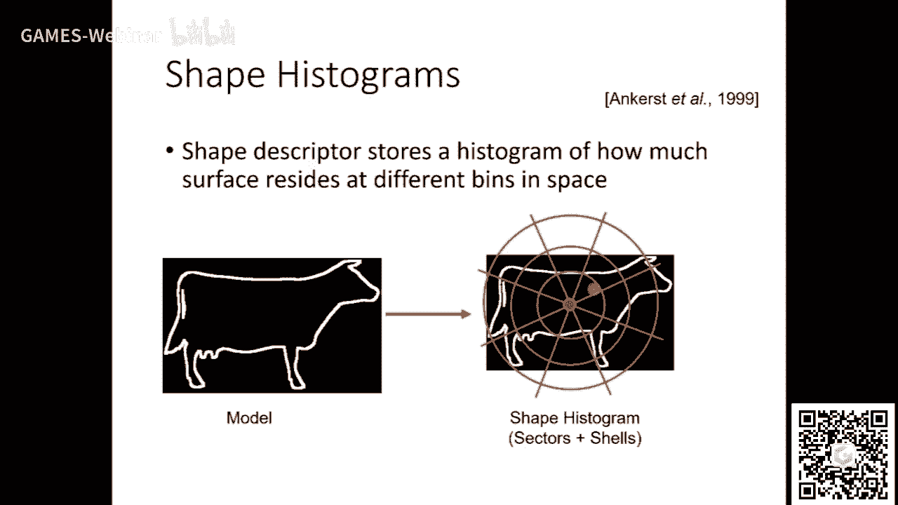

这是早年的一个文章，这是用这个高斯加上一个滤波来来来描述一个形状啊，这是用这个球面的这个一个函数，那么这个是全面的，这个是用那个let's field。

原来like field是跟那个广场那个原理是一样，把它看重心的，把它组合在一起，就能对这个形状进行一些整理上的描述啊。

那么那么看到这个结果是类似。

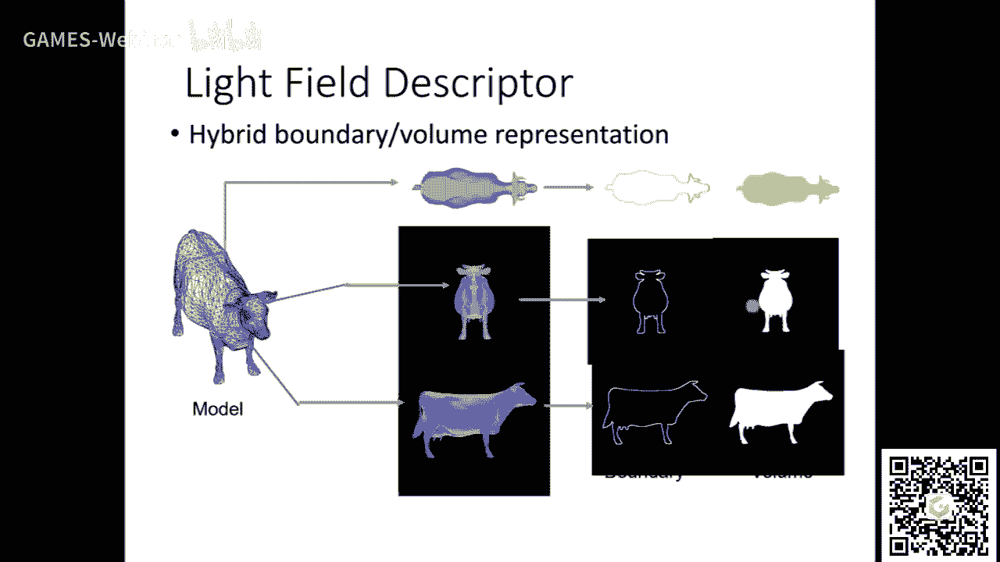

那形状大了没有，类似了啊，呃人们实际上定义从各个角度啊来定义了各种各样的三维特征啊，有些是全局的，有的有的是局部的一个点的啊，那么每篇文章都会针对某一类这个这个物体啊，定的这个特征呢是比较好的啊。

这不是不是就没有第一个特征，这种定义对所有物体都work啊，啊注意基本上都是每个特征呢适适用于某一类啊，如果只这一类的话，这个特征你比过了别人，那么你的特征能数值就会很好，具有创新性啊。

这个这文章印就可以写啊一大堆啊，但是但是实际上是这些啊都是集成了人们对这个物体的理解，所以这些啊特征就叫做hand cre啊，就是人物人工定义的特征好。

那么在这个无论是图形学这个对这个形状理解和他的视觉啊，实际上是这个啊定义特征，这是一个非常重要的一个任务啊，这个这个叫特征工程啊，真的就是我要玩完再加上一个图像，我要经常进行分割，the task分割。

我要或者说这些图像这匹马里面这些点都是一类，这个马啊是一另外一类背景是一类好，那你那你问这11233类是像素到底有什么不一样，你要把这特征定义好，你就聚类就不一样是吧。

所以这个你要去设计这个特征特征这里有两个问题，一个叫叫抽取啊，就就刚才讲的定义，但是就另外一个问题叫选择，因为我可以采用不同的方法，就像刚才那张图有那么多特征。

但是呢你是不是把所有特征把它串起来会更好呢，并不是有些因为不同特征呢，像这个图，比如说你要去度量这两两个地方的这个相似性，这里可以找到啊五种这个不同的文章的方法来这个对这个特征的描述。

你可以看到这两个特征啊，描述这种柱状物体啊，不是所有的特征都合适，可能也就这两个合适，所以如果你把不合适，像这两个，这真的是描述比较平缓的地方，它合适，所以如果你把这五个特征全串成一个更高位向量。

反而让它两个相似性不高，所以这里还要合理地选择合适特征去做你的任务，但是如果你不知道，你也不知道怎么选择，像常规做法就把它串起来啊，这是上是有问题的，那么在这文章里面啊，这是12年我的博士生。

而且现在在深大的湖北人，现在也是老师了啊，做得不错，就当时他提出一个方法诶，我能不能我能不能吃啊，就不同的地方自动地去选择不同的特征来描述这一块，对桌面上的特征呢。

我可能是描述1113这两侧整体组合是吧，所以它这个自适应选择，所以呢我们可以把它看成这样一个问，题，是这个子空间之类，像这些点啊，这个平面是一个子空间，这个线和这个线是指空间是吧，这有三个子空间。

所以直播间什么就是不同的这个子空间的这个特征呢，是用不同的方法去做它的描述啊，这样的话就可以把它后面上是这样一个呃系优化问题，我就不展开，后来把它用到了这个形状分割效果不错，最近的五到10年吧。

就是真的崛起火了啊，就是说人工特征就叫handcrafted，特征就不够好，因为什么你太多的人工经验啊，你对几何可能所有人定义的特征可能会好一点啊，还有呢我们不多特征啊，哪个是最好的，不知道你要去选择。

就跟我刚才讲的是吧，还有呢你如果你把所有特征把它串起来，实际上是往往是不好的，是overfit啊，overfitting的一个特征，那么所以说诶后面就什么端到端，什么意思，以前是要人工特征设计。

再选择去做任务，现在呢我就直接输入我的图图片，还有根据我的预先采集到的一些sample样本啊，这个样本都标好了，那么我中间通过很多影射，这个影射一个特征，第二个隐身造成一个选择，但引申到这个任务。

所以呢中间呢就就跳过了人工设计这一块啊，那么中间所有东西呢是经什么，由这个预先标定的一些数据集去做它的那个啊，fit用用用所谓的一个神经网络网络，它把这个函数空间变得非常灵活。

所以这样反正我直接从图像出发，不用去通过提取特征，通过很多很多层银色，像每个到底是影像是什么，也没有语音语音概念啊。

但是呢它能够通过这样一个not function to minimize这些函数的一些系数啊，就网络系数就可以得到这个很好解，把你这个数据量足够大啊，大到什么呢。

我认为一个处处像你都能在里面找那个相似的，得到一个很他的解，当然也很好了是吧，所以这个这个就不需要中间人工设计。

那么这个方法呢叫做端到端and好好网络，以前我也解释过，它本质上只是一个拟合函数，我们就在做拟合。

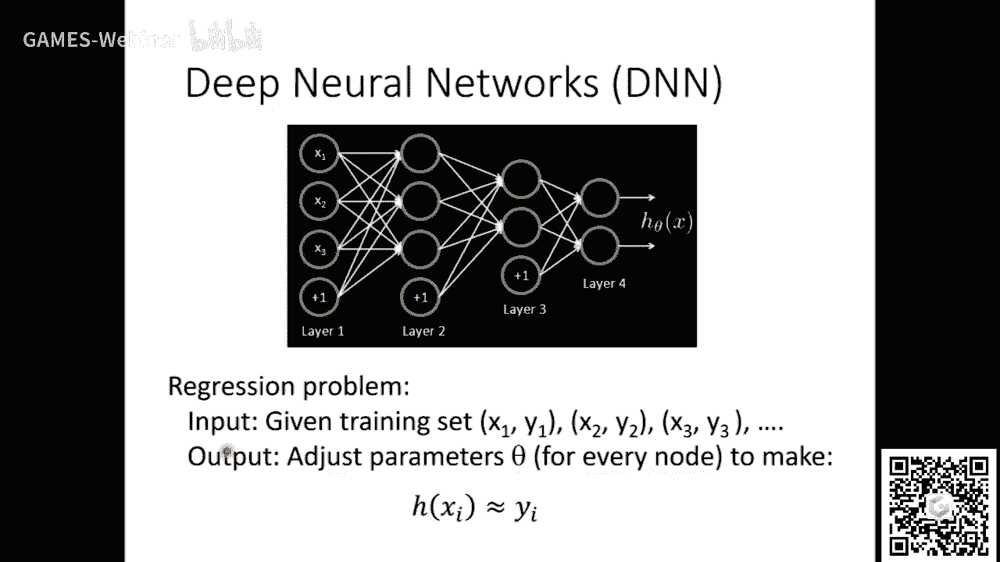

对吧好，还有从基本点名去学，还有一些图图表达啊，这个我不展开那么大，有兴趣的可以去扫描这个二维码啊，呃我大概几年前吧，这个那你你要理解好了以后啊，好的函数的度量就是not function。

然后去做一做优优化好，那我们呃只不过在我们这个学科的拟合函数，二维和三维和可视化比较容易，高维是不容易，所以它这个可解释性就不强啊，嗯好那这个我我就不展开，他是他还是在做数据的这个一个飞艇啊。

有它的一些啊压缩感知吧啊有些类比性我也不展开好，那么再讲讲这个趋势啊，趋势嗯，我今天就主要是讲一些内容啊，这个具体方法有很多，我没展开，但是呢你可以看到，即使因为数据随着最近几年在不断的增长。

但是数量级还是比不过图像，但图像112年啊，李飞飞叫做公布的英语net达到上千张是吧，我们现在的三维模型，这个上万张上万个几10万个模型就算多了是吧，你远远还没达达到千万级别啊，可以等等。

要随着这个采集设备重建啊，可能再过一段时间，这个数据量就会达到一个级数量上级别的增高，那就是几何于别的一些模态，这个叫跨模态，cross in，啊我不仅是文本啊，啊不仅图像，还有文本。

还有甚至还有视频啊，因为同学们知道就是图像啊，文本啊，他们因为质量比较多，他们这个很多模型啊，可以在某些应用上可以做到的是吧，那么我们怎么样利用他们的一些信息来做到单位形成的，一些高于高层次的。

也理解就是这个冷兰啊，这个对于我们来讲就是怎么创造创作这个内容仍然是个挑战啊，就是到现在还是远远没有解决了一个问题是吧，我我上节课的末尾也讲了，就是重新学三三大任务，建模仿真啊，渲染啊。

这个其他两个呢基本上方法上面就是就是解方程嘛，但是在建模这一块呢，还是啊离我们用户需求还是很远啊。

最后。

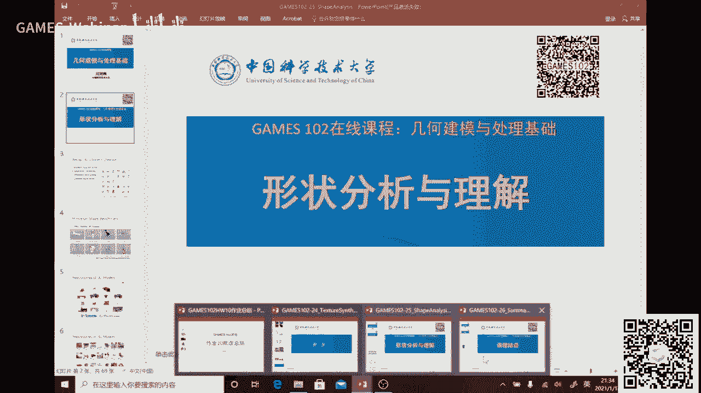

天下没有不散的宴席，好这个这个课啊。

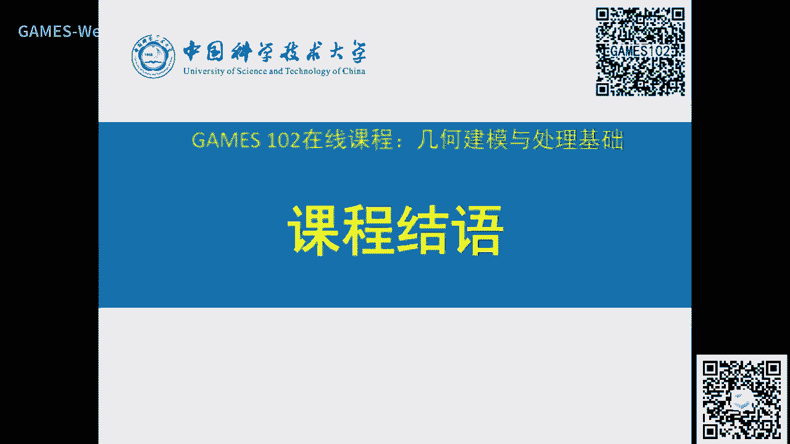

到现在15周啊，那那个连续15周啊，那个这四五周我也是啊这个精心准备了，每每每每节课都是整整个一个礼拜天啊，所以所以也也是也是花了非常多的时间，把这个我所这么多年很理解啊。

这个变成了这样一门这个基础课程呃，比较系统化的啊，但是没有很详细，因为时间比较少，但是这这个零几何从从这个拟合开始，大家啊一定要理解这个拟合的思想啊，这个属于连体几何啊。

这个在研究生里面我们是一门一门专门课，叫计算机辅助几何设计啊，那叫数据处理，有何处理好，就是讲这个曲面是零上表达点线面网格好是吧，所以内容大概过一下啊，还是内容比较多的啊，这个应该分成两门课来讲啊。

我我把它比较紧凑的分成分成一节课，还有他的一些方法啊，那当然没有讲到啊，很展开时间有限，每次也就一个半小时啊，看我到了那个我们啊处理的所有的一些方法论啊，那么一些什么特殊这种方法呢。

还有一些表达形式可能不一定顾及得到，但是你能理解以后呢，再去看那些文章或者去阅读的时候呢，就会有更啊，这个啊很快不能理解好，那么呃这个呃介绍两本书啊，这本书呢左边那本书呢是好几年前。

你写的是跟我的博士导师王国瑾教授啊，浙大啊这个写了一本结合计算，毕竟有处理这本书呢更多的是连连续集，连续集合多一点，最后的五张啊，那么对于连续几离散几何呢，我最近的2年多啊，还有黄金教授一起合作啊。

写写写完了一本刚刚刚刚写完啊，一个离散几何处理应用啊，当然有些我们课的内容，这个这本书也陆陆续写了大概2年多时间啊，最近在教稿啊，希望啊能够在春节之后就能出版啊，同学们可以关注一下啊，里面也有啊。

除了这个我们讲的内容，还有好多其他内容也在这里面进行了详细的展展开啊，大家如果同学们啊这个后后面如果这个书证书版了，我也会以一定的方式来跟大家这个通知一下，好吧，呃写书是非常耗耗时间的啊。

这个花了花了我们大量的时间，这次这个课程呢我们也布置了实实是作业啊，这个所作业啊啊嗯嗯你看着眼算是我也是精心设计啊，从简单的函数拟合到后面的啊，这个参参数曲线拟合到后面的这个细分啊。

到极小曲面转化到这个后面五个是离散网格是吧，去参加画传统画里面即交往曲面就接触了这个吸收取证求解，这个非常重要啊，常态化这个也是吸收方式，吸收吸收取证求解啊，初步体验一下这个典型的构建啊。

所以你每个地方的知识点都不一样啊，但是你们掌握这时如果同学们能够坚持啊，我也非常感谢啊，也非常高兴看到有啊，还是有不少同学能够坚持是做完十个十个作业啊，有些事还甚至有些是企业的员工啊，真的不容易啊。

那么我相信你呢，同学们如果做完这十个作业，收获是一非常大啊，这个基本上了解了大部分的这个方法，你们后面去看文章，看别人的一些文献啊，或者看别人一些代码啊，相对来说就不会那么困难好。

那么这个几何结合这个我们把它叫几何计算，也叫图形计算，有哪些用领域，实际上是除了传统的大家看到就对这个几何模型的这个啊设计以外，还有不同的领域，好像我们做研究，我谈谈我的体会啊。

那么我这里画一个这样的施工格啊，就是就是横轴呢是人人是一主体是吧，物和场景，单个物体和多个物体场景，还有虚拟，这边也是人和物，物和场景是实的呃重头，那么这里有有四个格子啊，在问号啊。

比如说我我们可能看第二个格子，实际上能跟虚拟的人能干嘛，对吧啊，实际的人根据虚拟人是不是就是vr对吧，所以vr里面有大量的这样一些几何问题，比如说怎么去重建我的人送到对方去，怎么去呃。

进行这个上面这些个交互对吧啊，像最近几年我们围绕着这个vr领域的这个大场景啊，这个没法在小的场景里面进行很好的光滑的一有漫游啊，我们连续做了这个占三篇高质量的工作，解压初步解决啊，给出了一个这个大场景。

在小的实景里面的漫游的一个策略啊，啊这个就是最近3年连续做的工作，好，你看这个这个问号，这个问号是什么，实际的人去操纵虚拟物啊，这个这个是是个什么啊，比如说我实际人去操纵虚拟物，vr也有有操纵是吧。

还有建模是吧，所以建模这是一大块，我们有我们我们团队啊，还有团队老师也做了很多像这种啊分析啊，传统化呀，曲面影射，这是最近几年的一个非常啊的一个工作啊，好，人脸重建，我们再看这个问号，就问号什么呢。

是虚拟的人在实际的物体和场景中，那么训练的人在实际场景中是吧，那么这个虚拟人可能在跟实物场景交互是吧，那么这个它的一个代理就是机器人领域啊，我机器人是相当于是具我一个虚拟的人的一个行为，还有他的思考。

像机器人能不能主动地去这个场景啊，能不能主动去抓杯子啊，能不能主动的去跟实际的场景和人进行交互啊，就需要把我们人类的这个认知，把它把它赋予机器人是吧，这里面就是看唉我们也做了新的工作啊，能不能啊。

这个让这个物呃这个机器人机械臂啊去抓物体啊，人漫游啊啊，能不能让机器机器人自动的去在一个场景里面去去探索，锁空间啊等等啊，第一个问我这个这个这个空白就是右下角啊，虚拟的物到实际的物。

或者是啊啊这个就是制造是吧，物理出来以后以后怎么去变成实物啊，就制造啊制造啊，这个也是我们团队一个比较大的特色，我们我们面向三维打印做了这样的这个结合处理优化啊，因为呃大概3年前这个三维打印出来的时候。

我发现这里面有这个，它只是把一个虚拟的一个模型变成一个实际的模型，中间其实是有很多问题啊，轻轻量化呀，还有这些这个这个这个拓扑优化等等等的问题啊，当然还有一些结构的一些一些这个分解啊等等啊，我就不展开。

因为这个10年前可能这些工作是我们重新学的呢，是不会去做的，也做不了，为什么那个10年前你这个物质变成虚拟物体，变成实际物体是要去找工厂，去找各种各种这个工工具啊，切床铣床，刨床，磨床啊，这个这个等等。

那你才能去做那么3d打印，先让这个制造呢成为一个非常啊非常非常啊这个比较方便的一个过程，这样吧我们我们做这种方面的一些处理啊，这也是最近10年吧，五到10年发生一个变化啊，现在是现在这个国家也在呃。

呃在关注这个工业软件，这些东西也是跟这个相关好，那我们最后花个几分钟吧，我们总结一下啊，那么几何数据呢呃随着那个声音一维的图像，二维视频，三维数据的这个发展到最近的10年20年吧。

随着这个深度相机采集这个模型越来越多，它也可以成为啊这个一个新的一个数字媒体啊，它是真正的全三维的去表达这样一个世界啊，世界中的物体啊，场景啊等等是吧对啊，最近也是研究热门，并且这个应用越来越广啊。

特别是今年china graph啊，这个在厦门11月份啊，这个很多企业也参与到了我们这个大会的赞助啊，这个讨论啊，觉得这里面是非常多的，这这个应用潜力也非常缺人才啊。

这个都在会上共同形成了一个关于图形的春天这样一个概念是吧，还有很多呃这个创新创呃，这个创业企业都对这个图形的这个技术具有很大的一些需求量，所以同学们如果感兴趣多关注一下，实际上是这个这个呃人才。

这个你只要只要只要你有料啊，是走是还是可以发挥非常大的作用的，但是三因为上手呢也比较难是吧，因为这个课我也看出来，开始大家跟上的同学还是不是不后来卓越到越来越的时候呢，就就就跟着人就不多了是吧。

毕竟这个它的它的它的难度是有的，为什么一个是它的几何，你可以看到这张图表达一个几何，有点于网格体术距离场，还有函数组合，好吧好吧，这么多表达，所以说它的这个不像图像，就一个举证啊。

举证呢就是一个n行m列的一个这样的方块对吧，这个每个呃元素存rgb对吧，就是它的结构很简单，编程很很快，为什么啊，这个呃很很擅长处处理这种举证的是吧，所以基本上这个这个编程都不需要了哈。

你拍成跑一下一个框架，所以他们那个相对来说觉得上手确实容易，但是图形的话啊，这个这个光靠这个matlab是不行的是吧，有大量编程啊，数据结构啊，但难点在有的话，就算人就不多嘛，所以大家如果能在这一块啊。

有更获得这种能力发挥的这个潜力啊，不过这个机会就会很多，好多数学上的难度啊，这个拓扑很复杂啊，这sampling啊，还有这个很多细节啊，这个我就不展开好，最后我们再讲一讲呃。

这个102的课也是这个games这个平台创建以来的第三门课啊，可以看到呃101年龄起啊，201活跃明是去年上半年疫情期间是吧，下半年我就开开了102，那么这个根本是也是当年17年我来为主创建的啊。

到现在运营啊，应该也让很多同学啊对这个学术界奇，都是应该也有很大的帮助，我也很高兴看到这个团队不断在在变，从最初一个群到现在13个群有6000 6000多人啊，第13个群也会快满了啊。

呃可能再过段时间14位圈啊哈那么呃我们这个做完了以后呢，在后面我们应该会有广告啊，这个呃20202203我们已经规划好了啊，等下下介绍啊，就在这里嗯，大概在春节之后啊。

由年龄企业会继续开一门这个高质量实时渲染啊，这就应该在2月下旬或者或者3月初啊，这个呃因为美国他们那个现在已经开学了，好年立起正在准备好，所以啊到时候会在群里面通知大家啊，那这之后6月份在黄提心啊。

这个ut austin的啊，就会讲这个三维视觉和理解，这个就是今天我后面最后一部分题课所讲的那个三维理解，这个一个高级课啊，大家注意，大家也可以继续关注203啊，怎么去理解这个三维的一些形状的啊。

性性质，这里啊大部分的这个方法论啊，大家大家有兴趣也可以继续关注一下，我们我们也在做一些努力啊，降低图形学的门槛啊，所以我们在推动和普这个这个开源文化啊，因为视觉领域呃，啊拍这个框架出来啊。

大家就上手非常快是吧，连高中生都可以马上去跑跑好多这种啊这个视觉的任务啊，可以可以可以写很多文章啊，这个我们也希望通过我们的努力啊，这个今年在川普拉普，我们专委会就是计算机学会啊。

这个计算机辅助设计与重新学的专委会啊，我们设立了这样一个图形开源讲，应该是图形开源，一个是还有数据集开源啊，如果在座的各位，啊你们有一些开源项目，欢迎你们来关注一下，这个开始讲，我们每年会评一个啊。

这个啊我们也有好多在以前也积累了一些别的一些啊，这个资源好像可能上面这个付老师也是我们团队的啊，因为年年轻老师充满了这个能量和热情啊，他在去年上学期在我们科大呃开里面数字几何处理，面向博士生和研究生的。

他也把这个录成了一个视频啊，免费共享在b站啊，大家他的那内容就就讲的比我这个课要细，并且专注在后面的离散结合啊，另外呢就是呃这个three d啊。

这个solidometry innovation是一个国际化的一个这个啊也是刚刚创办，也还不到17，美洲有一个报告啊，美国就北美，欧洲和亚洲轮着来啊，有不同的讲者啊。

然后呢那个呃呃我们科大这个张馨宇老师也参与这个组织啊，把它移到了我们国内的b站啊，所以在前几天这个已经移过来了啊，这样的话也让国内的这个这个啊同仁啊，能够享受到这个国际的这个盛宴啊。

虽然他们这个讲的都是英文哈，这个大家通过ppt啊，顺便也可以定有点听力嘛啊也可以学到很多东西啊，像这里讲的这个我我看了一下现有讲的一些讲者都是在p上，在三维几和视觉这方面做得非常好的一些学者啊。

他们的这个有些讲的报告啊，嗯就是比较比较最新的，还有一些方法论也是非常好啊，那么如果同学们有兴趣啊，b站上面都有比较全的啊啊啊，另外一句话，如果呃同学们还有对这个计算机图形学基础啊。

要因为这个这个上这个课过程中，也经常收到一些同学来问我要学重新学，我应该算什么课，但上一个一个比较好的课，大家都都都知道的，就跟的是101啊，这个严老师还讲的非常不错啊。

然后我上学期这个也是疫情期间也是网络授课，所以在克拉也看你们这个给我们本科生的啊，这个这课的内容呢相对来说比严老师课是要多一点啊，作业量也大，所以呢如果你们想比较好的训练这个编程啊。

还有一些这个相关的这样一些这个呃内容可以去访问这个主，上面有ppt下载主页，还有录屏的是下载地址啊，也欢迎大家呃这个推荐给不同的入门的啊，希望入门就能重新学的一些啊，同学啊，或者是一些啊这个师弟好。

师妹好，最后再做几个会的这个广告啊，啊这个会议呢是我们games这个在线平台的一个线下交流会，每年一次，去年由于一新的就没有开展啊，推到了今年啊，今年是在西安5月份啊，这个从现在来看。

5月份到底到底能不能这个现成功举行啊，看疫情的发展，但是到线上我们还是希望把它展开起来好，而不是取消，所以呢呃可能呃如果疫情不是那么严重，那个那个如果这个国内形势很好，我也鼓励大我们都到西安去啊。

面对面啊，呃现场我也会在啊，这个可以跟不同的学者，还有企业写同人啊，这个可以展开一些面对面交流啊，那么这是跟那个是啊那个可以同时举办的一个英文会议啊，这个大家如果有投稿也可以欢迎啊。

但是投稿的期限可能已经快快到了2月初啊，那么是8月份在另外一个国国内会议啊，叫全国计算机辅助几何与同一学大会啊，这是专委会的一个年度会议啊，参与人也比较多，大家也可以关注一下啊。

是另外一个呃关于几何这个偏几何设计与计算啊，就像这个样条啊，这个内容也比较广泛，这个在10月在国防科技大学啊，这个在长沙啊举办啊，这个比较晚，我相信这这个会议应该是线下还是没问题的啊。

就像今年桥梁在厦门，我们也是呃规模空前啊，500多人大会呢我们都是这这几年也是在推动啊学术与产业的结合啊，如果曾有产业界的这个同人朋友啊，这个希望很快的了解到这个学术界的一些，或者认识到学术界的一些呃。

呃同人和教授啊，可以来展示你们的产品，展示你们的这个真甚至做一些这个呃呃产品的或者招聘宣宣传啊，这样话呢能够让啊，这个贵企业能够很快的得到学术界的这样一些认识啊，这个课呃15周啊。

那个啊基本上还是比较顺利，除了其中有一次这个直播平台出了一个问题啊，这个后来我补录了那一节课啊，这个后背后啊，感谢这个现在的game平台的这个呃执行啊，这个负责人啊。

周晓薇老师以及以及他的两个基础秘书啊，一个陈琳号，一个董庭郡啊，这个每次这个视频的剪辑以及上传都是由这位两位同学来负责完成，这个再次特别感谢，那么另外也感感谢我们三位助教啊。

我的三位啊呃也流动员博士生庄涛和玉成是硕士生啊，都都是非常优秀的学生啊，就是庄涛同学啊，花了将近1年多时间啊，现在继续还在不断的啊，这个升级就是那个utopia这个框架啊的那个。

也是同学付出了很大的努力，每次作业都是非常认真的去看你们的代码，好帮你们提些意见，好好后，这个呃认识活到老，学学那个学到老，虽然中间有很多痛苦啊，这个中国是呃人在冲这过程中是成长是最快的啊。

这个你通过过程中一定是有很多收获啊，那个也非常感谢各位学员的这个陪伴啊，连续15周，那么另外就是如果各位同学或同仁吧，如果需要跟我们来讨论交流，我们做好，欢迎好吧，我们的这个邮件邮箱啊。

这个一些方方式都在网上啊，我我都在啊，大家如果有希望我们以后通过合作，然后再不断交流来共同促进这个学科的发展。

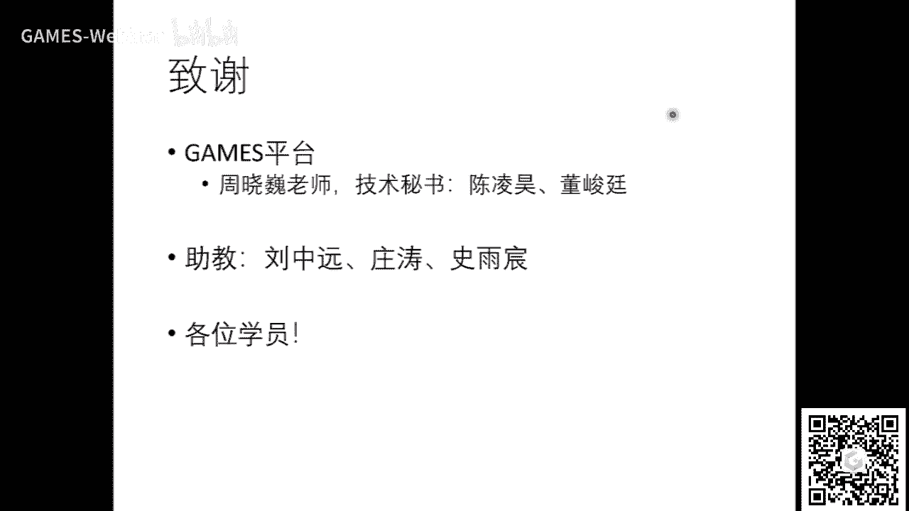

好好最后再次感谢大家好，我们这个课就结束了。

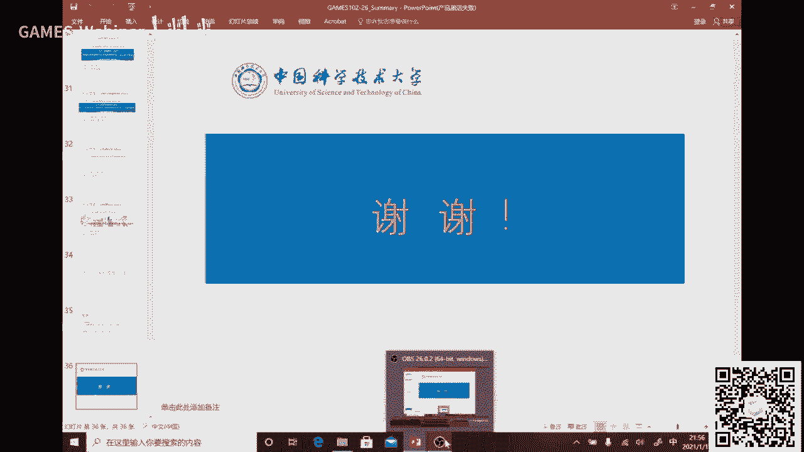

