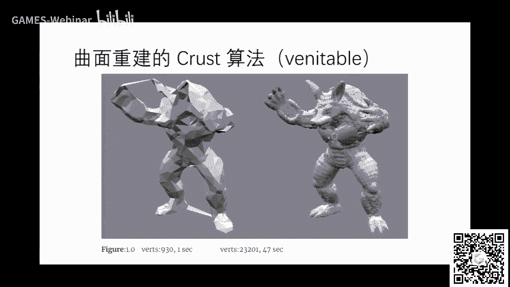

# GAMES102：几何建模与处理 - P15：纹理合成与形状分析 🎨🧩

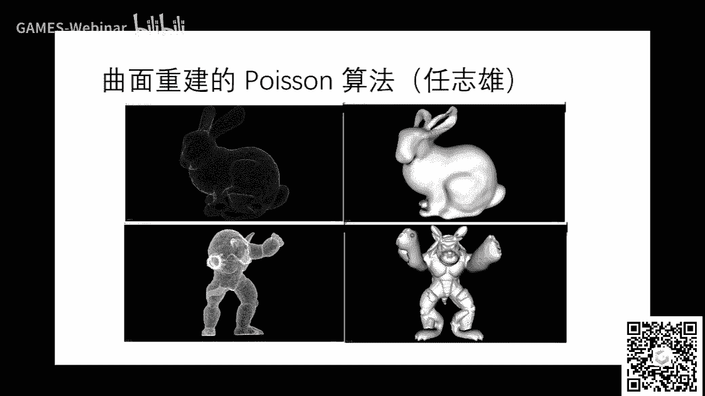

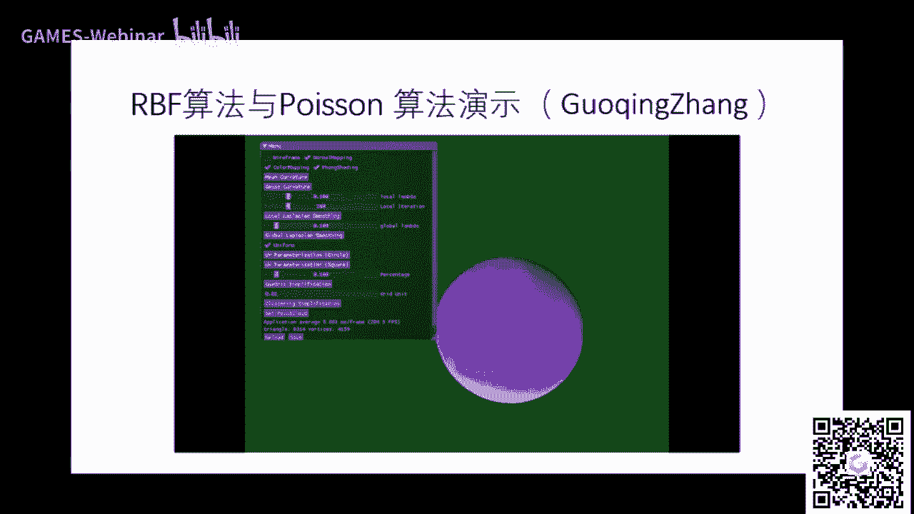

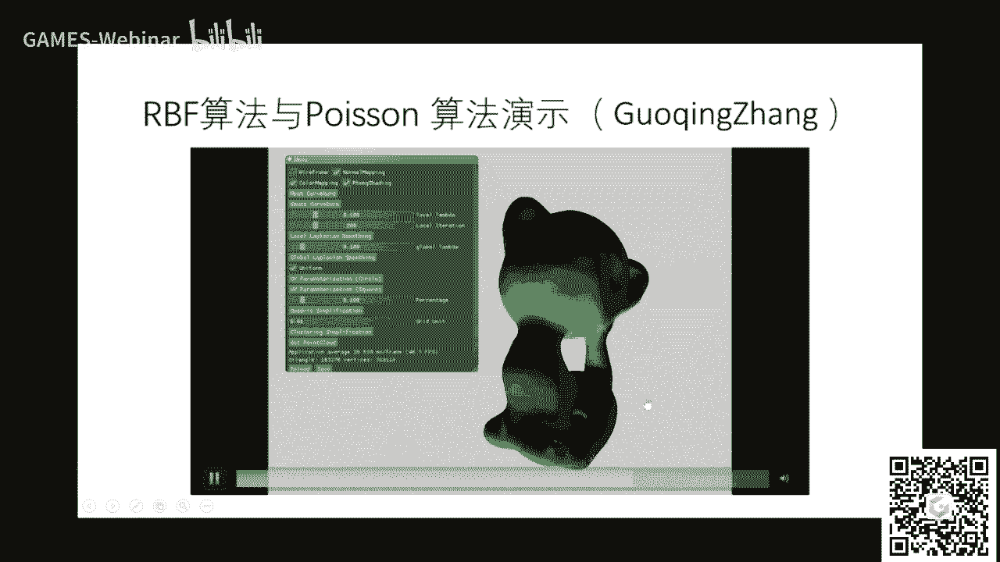

在本节课中，我们将学习课程的最后一部分内容：纹理合成与形状分析。我们将探讨如何为几何模型赋予纹理，以及如何从更高层次分析和理解三维形状。

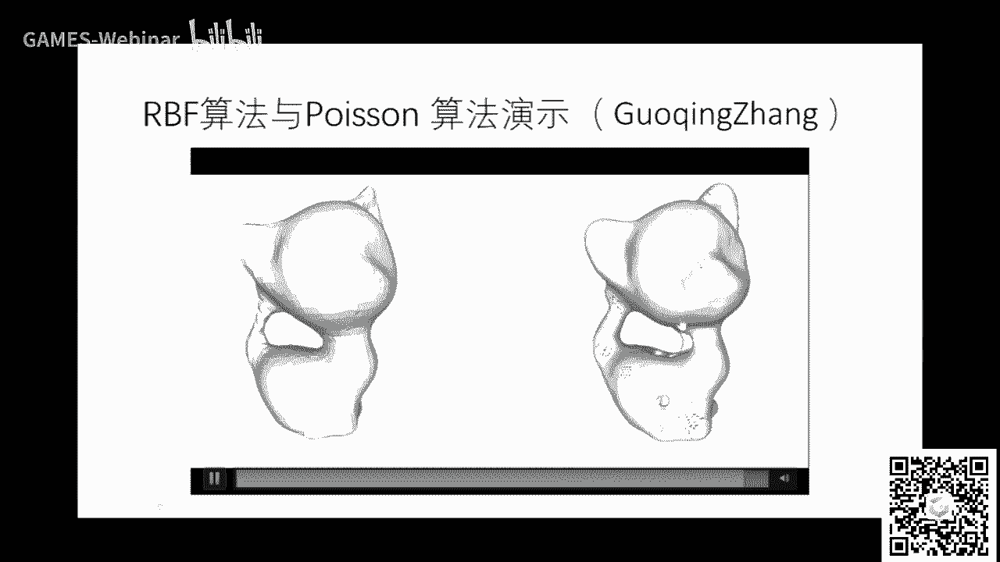

---

## 作业回顾 📝

上一节我们介绍了曲面重建与建模。本节开始，我们先回顾最后一次作业的情况。

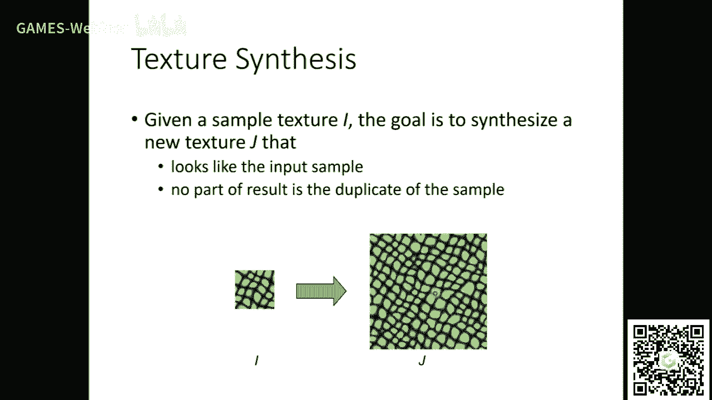

总体上交作业的同学表现不错。以下是部分同学的作业结果：

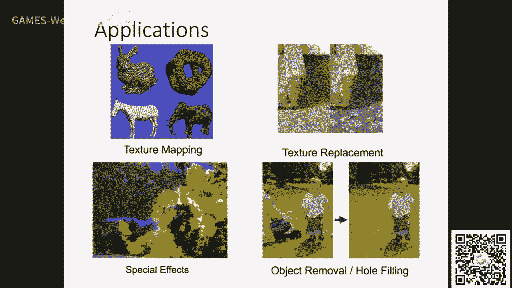

*   一位同学实现了显示方法（Cross-stitching算法），算法出现一些小问题，例如连接处发生错误。但总体上大部分结果是正确的。顶点加密后可以避免这种错误。
*   另一位同学使用泊松方法进行重建。泊松方法是一种隐式方法，需要点的法向。如果法向发生错误，重建结果就会出现异常。大部分异常现象是因为法向相反。由于是作业，同学们可能没有太多时间检查法向的正确性，因此结果存在一些错误。
*   一位同学录制了视频演示。首先展示点云，然后调用Marching Cubes算法重建网格。重建结果不错，因为数据质量较好，法向都正确。
*   另一位同学进行了比较完整的演示，实现了两种方法：RBF（径向基函数拟合）和泊松拟合。在菜单中可以选择不同方法，并对距离场进行自适应剖分来计算距离值。切换到泊松方法后可以看到，如果顶点不是特别密，重建质量不是特别好，会出现一些小问题。

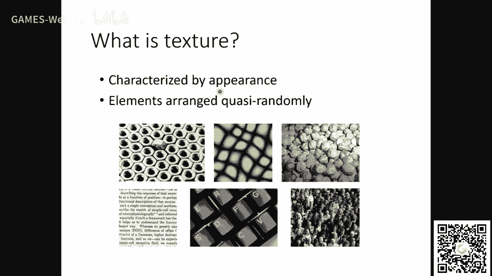

我们同样会把最后一次作业的报告、代码以及优秀同学的报告代码挂在网上供大家参考。

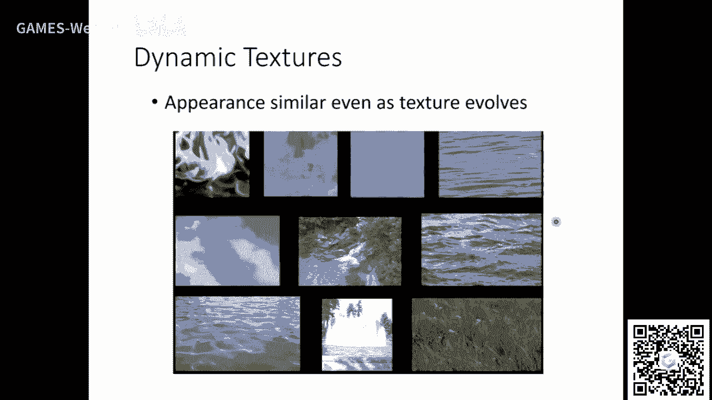

---

## 纹理合成概述 🖼️

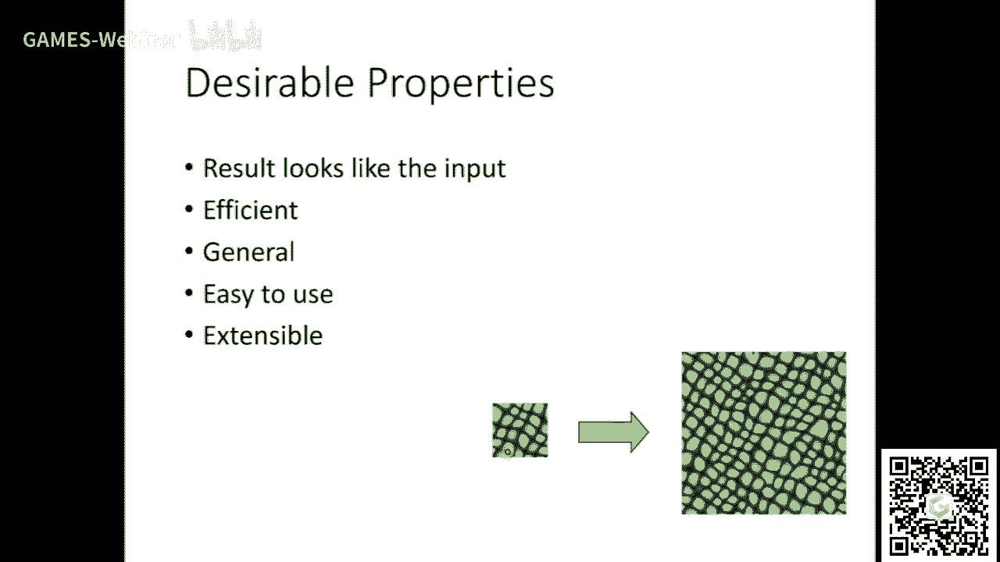

回顾前几次课程，我们从曲面重建讲到曲面建模。重建是物体已存在，我们通过设备测量出点，再利用算法重现三维模型。建模是通过用户交互进行设计。这些模型只有顶点数据，没有颜色，看起来不真实。我们需要为模型贴上纹理，使其看起来更真实。

为模型赋予纹理有多种手段。对于重建的模型，物体本身带有颜色，只需采集其RGB颜色并对应到模型顶点即可。对于设计出来的模型，纹理后期需要通过交互手段赋予，例如参考图片并通过参数化结果上色，或直接用手工画笔在平面或曲面上绘制颜色。

今天我们不讲解如何绘制真实纹理，而是关注纹理合成。假设我们已经有一个小的纹理样本，我们能否将这个样本铺满到一个几何模型上？这就是纹理合成要解决的问题。

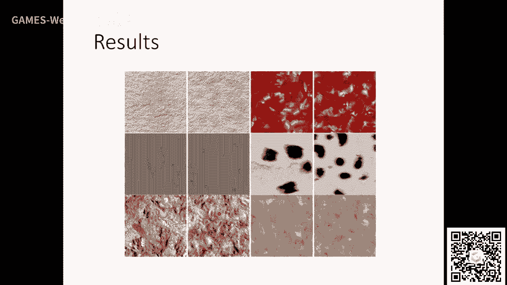

纹理合成的定义是：给定一个小的纹理样本 `I`，目标是合成一张大的纹理 `J`。`J` 看起来像 `I`，但又不是简单的重复。这个“看起来像”的度量很困难，且需要带有一定的随机性。这个问题在20多年前开始成为研究热点。

纹理合成的用途广泛：
*   为枯燥的光滑曲面赋予丰富纹理，使其更形象。
*   图像修补，例如将图片中某块区域去掉，然后用小纹理样本填充空洞。
*   Photoshop中的克隆画笔工具就是一种简单的拷贝，但纹理合成不仅仅是拷贝，还需要带有变化。

---

## 纹理的定义与分类 🔍

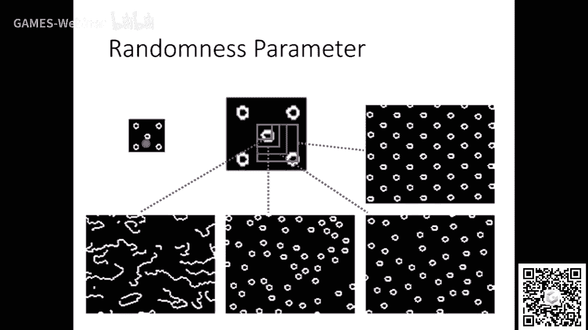

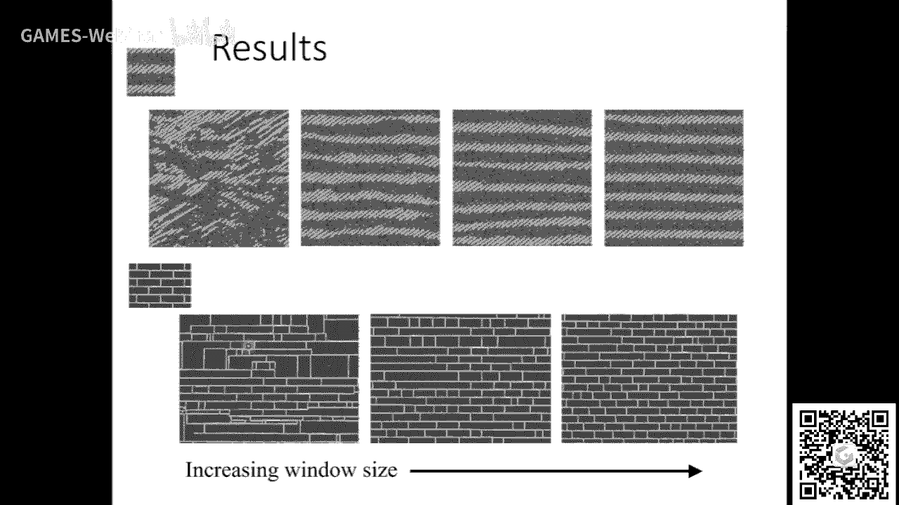

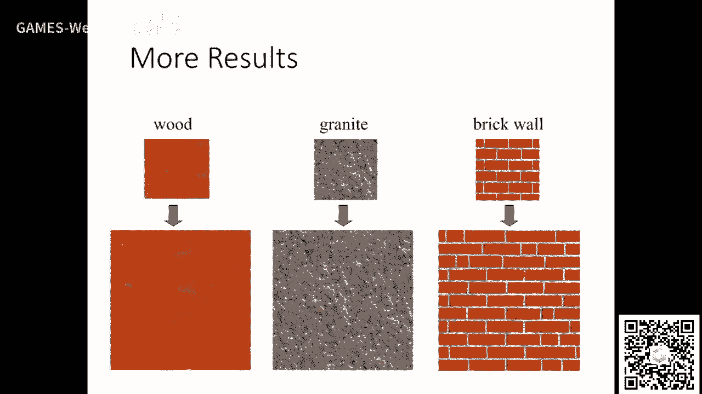

我们首先需要理解什么是纹理。纹理（Texture）与一般图像（Image）有所不同。

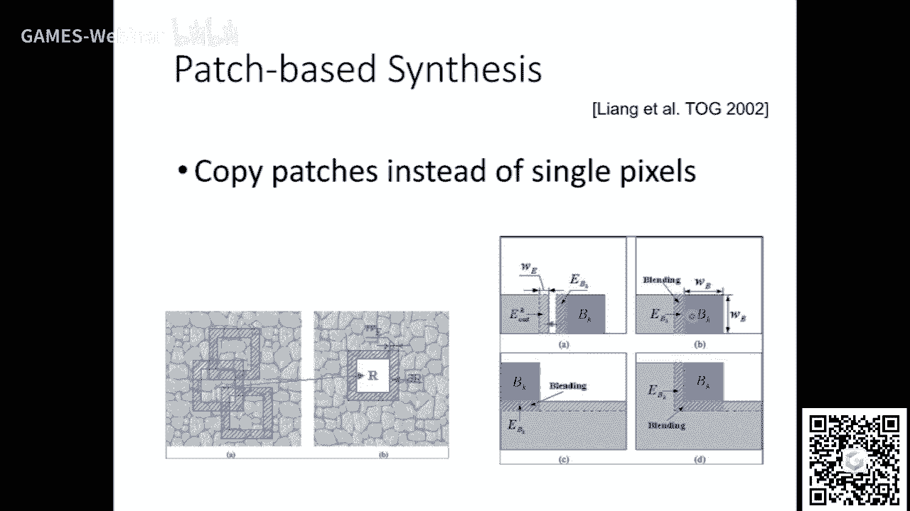

纹理通常指物体表面的表现，如木纹、墙砖、草地等，带有重复性。一个关键特征是它具有很多重复的相似模式。

如何判断一张图是纹理还是图像？
*   对于纹理，在任意两个地方取同等大小的框，肉眼看会觉得它们差不多，属于同一种纹理。这种各处都相似的表现称为纹理。
*   对于图像，在任意两个地方取框，看起来显然不同，没有太多相似性。

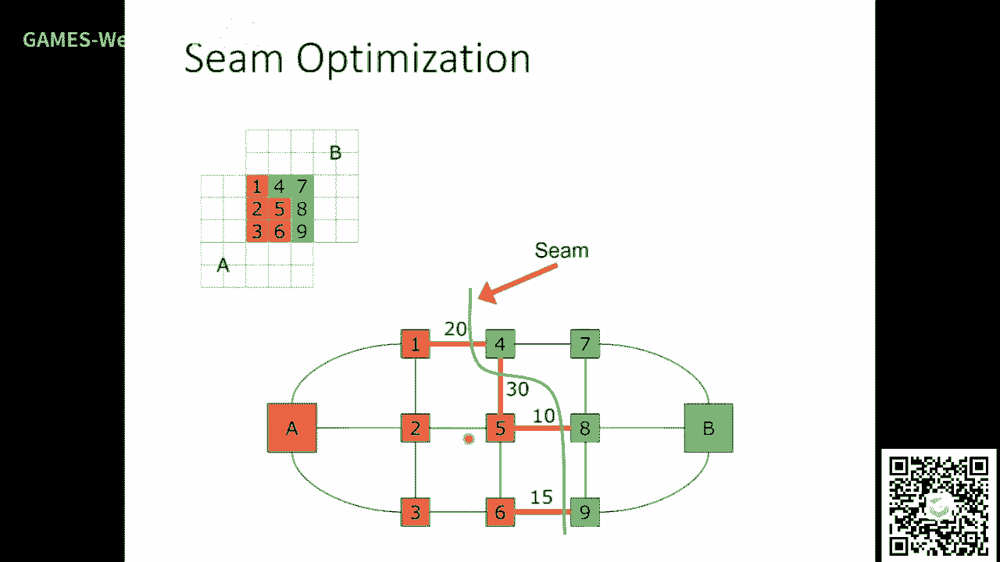

根据属性，纹理可以分类为：
*   **各项同性**：各个方向看起来差不多。
*   **各项异性**：不同方向有差异。
*   **规则重复**：像砖头一样一块块重复。
*   **随机**：看不出明显重复。
*   **介于两者之间**。

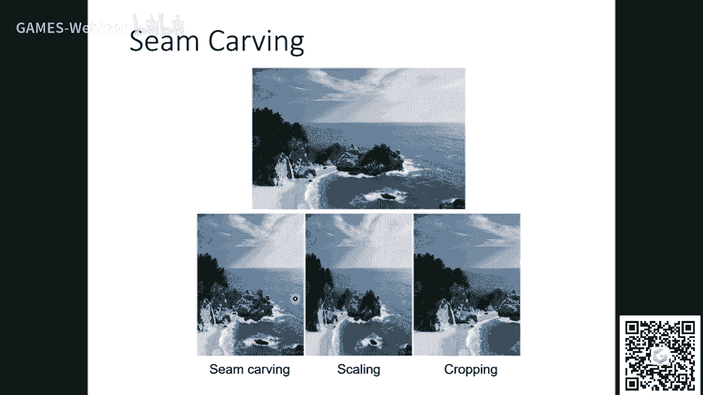

不同的纹理性质，其合成方法会略有差别。

---

## 二维纹理合成方法 🧱

我们先理解二维纹理合成，三维就容易类比。

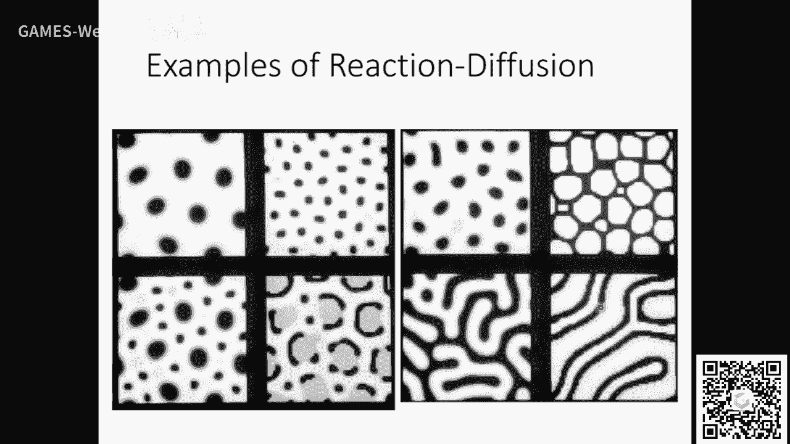

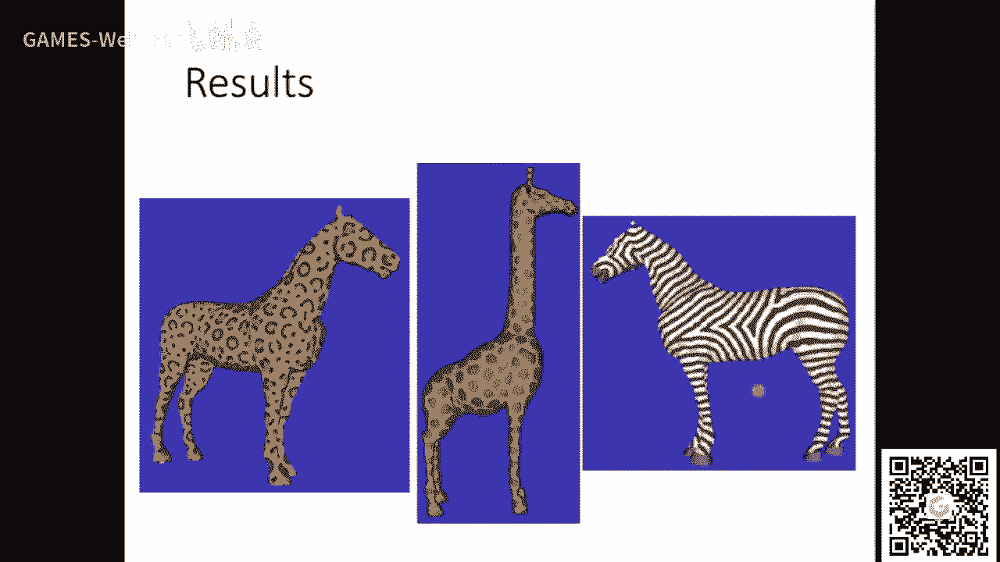

### 简单平铺与目标

最简单的纹理合成就像铺瓷砖，将小样本一块块贴满区域。但这会产生很强的重复特征，看起来太规则，不是纹理合成期望的目标。我们更希望合成结果有一定的随机性，不是完全平铺，但看起来仍然是原始样本的纹理。

纹理合成没有唯一解，很多算法结果都是可接受的，算法通常带有一定的随机性。

### 核心挑战：量化“看起来像”

纹理合成的难度在于如何捕捉或描述“看起来像”这种视觉感受。这不是一个精确的数学定义，很难量化。解决问题的第一步就是如何将其建模成可量化的东西。

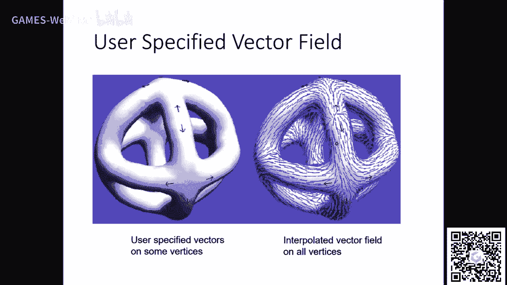

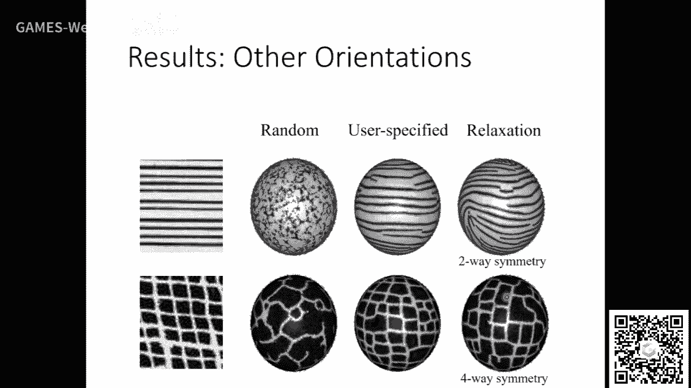

今天主要讲两种基于样本的方法：参数化方法和非参数化方法。
*   **参数化方法**：对纹理进行描述，构建数学模型（函数），然后将函数应用到区域生成纹理。
*   **非参数化方法**：从样本中拷贝像素或图块，在过程中产生随机现象。

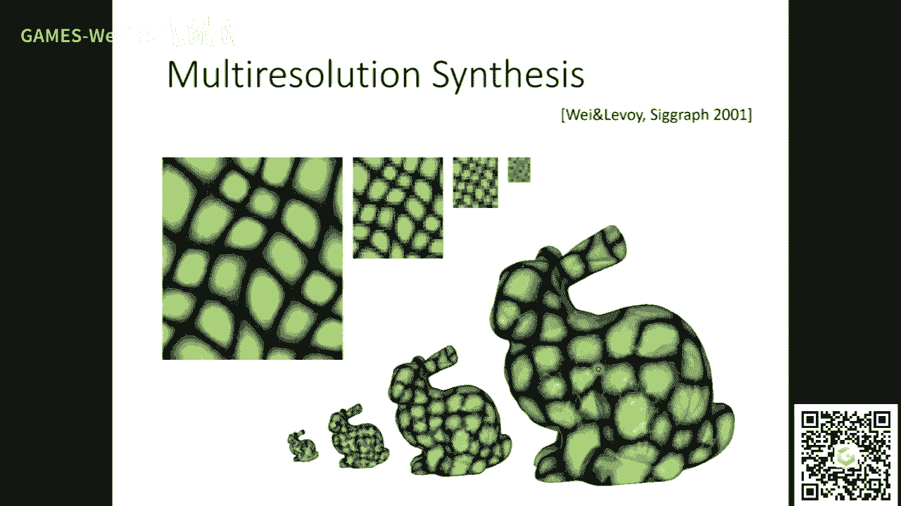

---

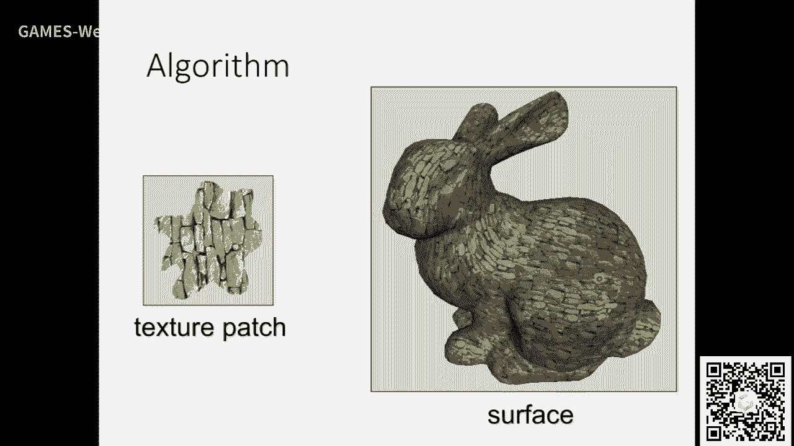

### 参数化方法 (Parametric Method)

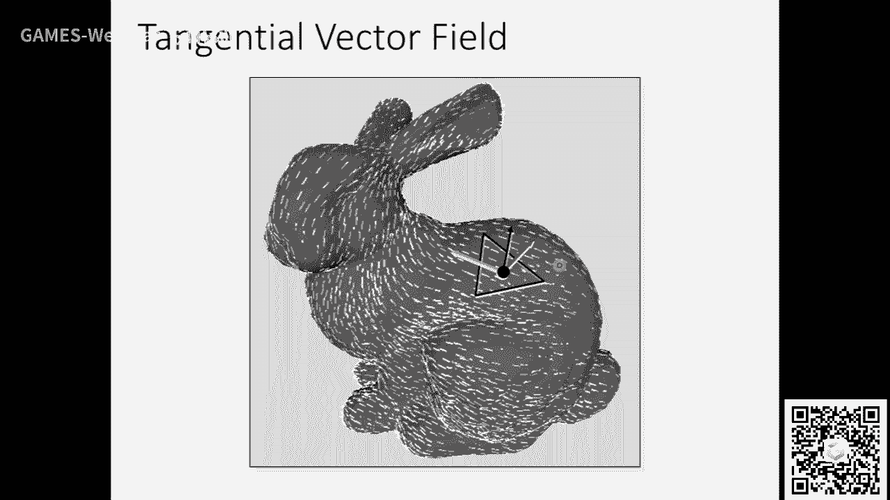

参数化方法在早年应用较多。其思想是对纹理生成一个多分辨率金字塔，在每个分辨率上用一个函数（映射）提取特征，将纹理隐射到一个特征空间，然后再通过函数逆映射回图像。这有点像现在的自编码器（AE）或变分自编码器（VAE）。

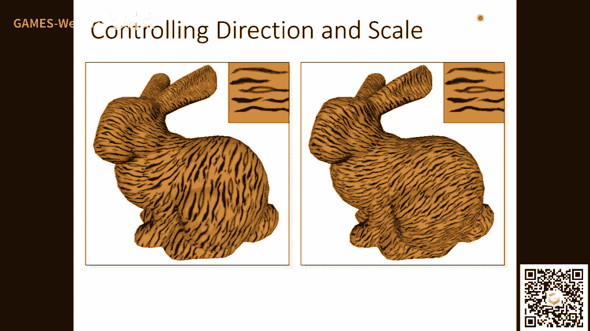

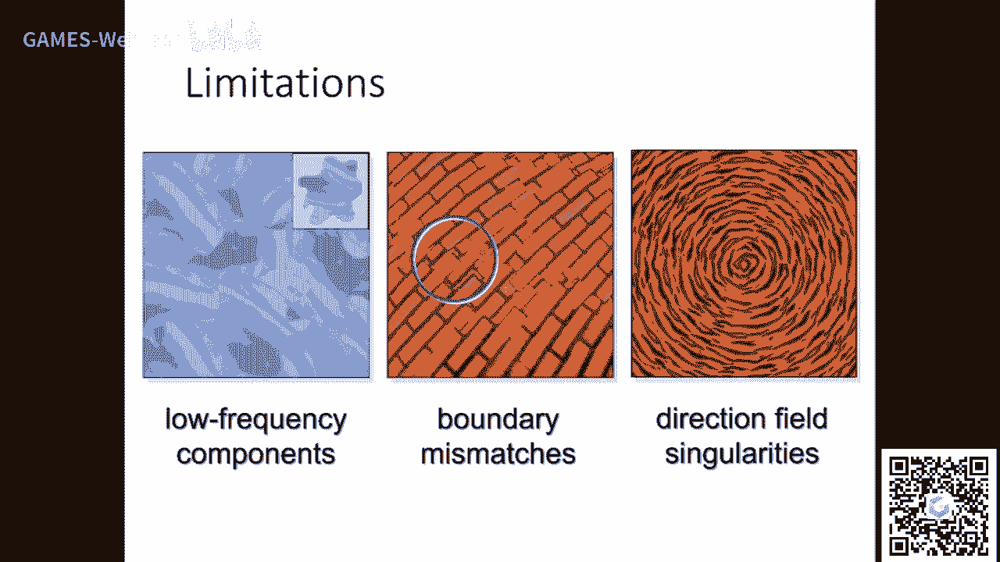

具体构造映射有不同方法，例如使用卷积或全字塔滤波提取特征。多分辨率方法可以捕捉不同尺度的特征。一个简单的早期算法使用了直方图（颜色分布）进行匹配和迭代。但直方图只体现了颜色分布，没有很好刻画特征，因此合成效果有时不好。

---

### 非参数化方法 (Non-parametric Method)

非参数化方法思想更简单，它不用函数描述纹理，而是直接从原始样本中拷贝。拷贝过程中不是从同一地方考，而是可以发生随机现象。这个过程可以从数学上解释为一个**马尔可夫随机场**：拷贝了某一块后，其周边的像素颜色就不能乱拷贝了，需要根据这一块的特征去样本里搜索最相似的周边图块。这就像一个条件概率过程。

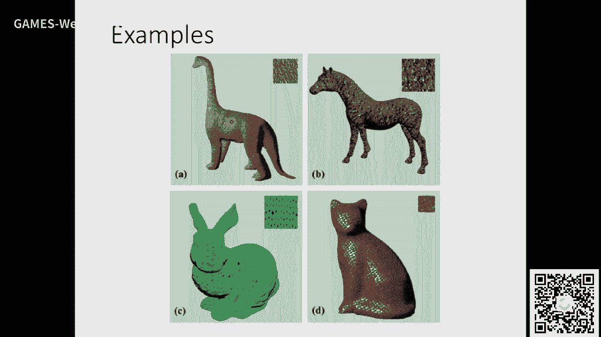

#### 1. 基于像素的方法 (Pixel-based)

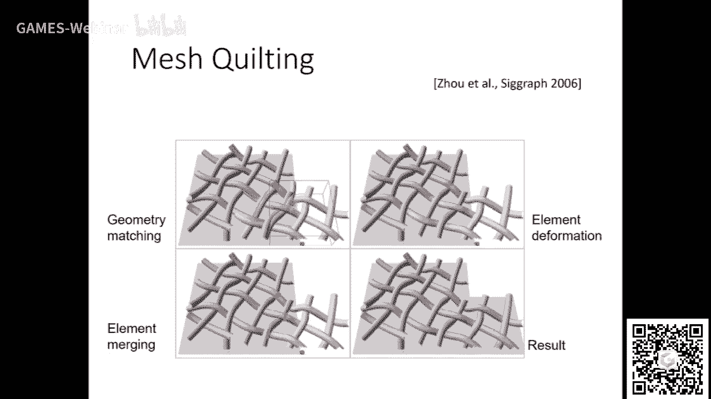

这是最简单的逐像素纹理合成方法。
*   **算法步骤**：假设右边已经合成到某个位置，当前未知像素 `p`。取 `p` 周边已知颜色的 `L` 型区域。用这个 `L` 型区域的颜色到样本图像中所有位置进行比对，找到最相似的位置。将该位置 `p` 点的颜色拷贝过来。以此类推，逐个像素合成。
*   **计算量**：最大的计算量在于比对 `L` 型区域的颜色与样本中所有位置的颜色。度量通常使用 L2 范数（逐像素差异平方和）。这是一个检索问题，需要用数据结构（如 kd-tree、八叉树）组织样本中的特征向量以加速搜索。
*   **窗口大小影响**：用于比对的窗口（邻域）大小很重要。窗口太小，合成质量低；窗口合适，才能抓住纹理的结构（pattern）。参数取决于样本中 pattern 的大小。

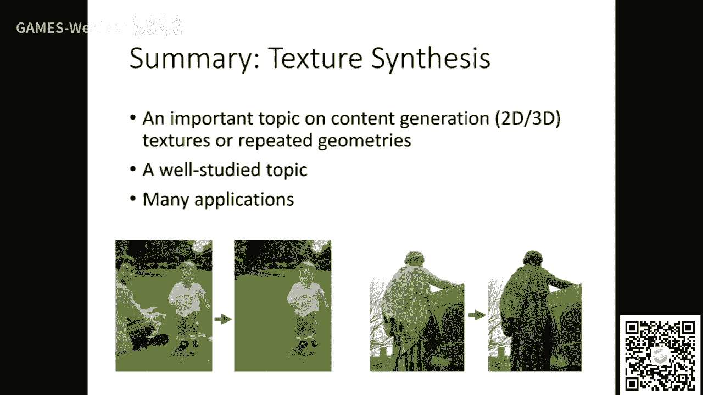

#### 2. 基于图块的方法 (Patch-based)

逐像素方法很慢。基于图块的方法一次拷贝很多像素，速度更快。
*   **算法步骤**：假设已经合成了一块区域。用这块区域的一个邻域（通常是重叠部分）去样本中搜索最相似的图块。然后将这个最相似的图块拷贝过来。一次操作可以拷贝一个图块（如 10x10 像素），速度比逐像素快很多。
*   **接缝处理**：两个图块重叠在一起时，它们可能不完全一致。需要找一条误差最小的接缝，使得拼接后视觉效果更光滑。这可以转化为在误差图上寻找最小代价路径的问题，是一个典型的动态规划问题，在图论中也是最小割/最大流问题。
*   **应用**：这种基于图块和最小接缝的技术非常适合自然图像合成，也是当年“内容感知图像缩放”技术的核心原理。内容感知缩放能保持图像明显特征，避免简单缩放带来的扭曲或裁剪导致的内容丢失。

#### 3. 其他高级方法

为了保持纹理 pattern 的完整性，避免合成结果破碎，后续研究提出了许多方法：
*   **基于纹理元素**：手工或通过视觉方法判断纹理中的基本元素（texel），在合成过程中保持这些元素的结构。
*   **控制局部大小与方向**：合成时可以控制纹理图块的大小和方向。通过生成一个向量场来引导合成顺序，可以产生不同朝向的纹理结果。

---

## 三维纹理合成 🎯

理解了二维纹理合成，三维可以类比进行。核心思想类似，但需要在三维曲面上定义邻域、方向和参数化。

### 主要方法分类

1.  **过程式纹理**：用一个三维函数 `F(x, y, z)` 定义纹理特征（颜色值）。将三维模型嵌入到这个场中，模型表面顶点即可获得颜色值。函数可以通过一些方法构造，例如著名的 Perlin 噪声函数，通过扰动和随机生成各种纹理。这种纹理是定义在三维空间中的体纹理，物体内部切开来也有颜色。
2.  **基于样本的曲面纹理合成**：给定一个小样本，如何将纹理“长”在曲面上。这需要解决几个关键问题：生成多密的采样点、如何定义曲面上点的邻域、如何定义方向。
    *   **思路**：类比二维，在曲面上对于一个点，需要朝各个方向走一定距离来采样其邻域。这需要定义一个向量场来指示方向。将局部曲面片参数化到平面，然后在参数域上进行采样和颜色匹配，最后将颜色拷贝回顶点。
    *   **多分辨率方法**：在网格上也可以使用多分辨率方法，低分辨率捕捉大特征，高分辨率捕捉细节，使匹配更精准。
    *   **基于图块的合成**：也可以将一个面片（patch）贴到曲面上，然后根据邻域匹配找到最好的图块贴上去，像贴膏药一样。为了保持纹理元素完整，图块形状可能是不规则的，沿着纹理元素边界设置。
    *   **向量场的重要性**：对于各项异性的纹理，一个好的向量场对合成结果至关重要。向量场需要光滑，并且可能要求与模型的几何特征（如边界）对齐。生成符合要求的向量场本身是几何处理中的一个重要问题，通常可以看作插值问题。

---

## 形状分析与理解 🧠

最后一部分我们简要介绍形状分析与理解。这部分内容属于高级主题，涉及从更高层次理解三维形状。

随着互联网上三维模型越来越多，我们需要组织、理解和检索这些模型。这超出了传统局部几何处理的范围，涉及全局操作和语义理解。

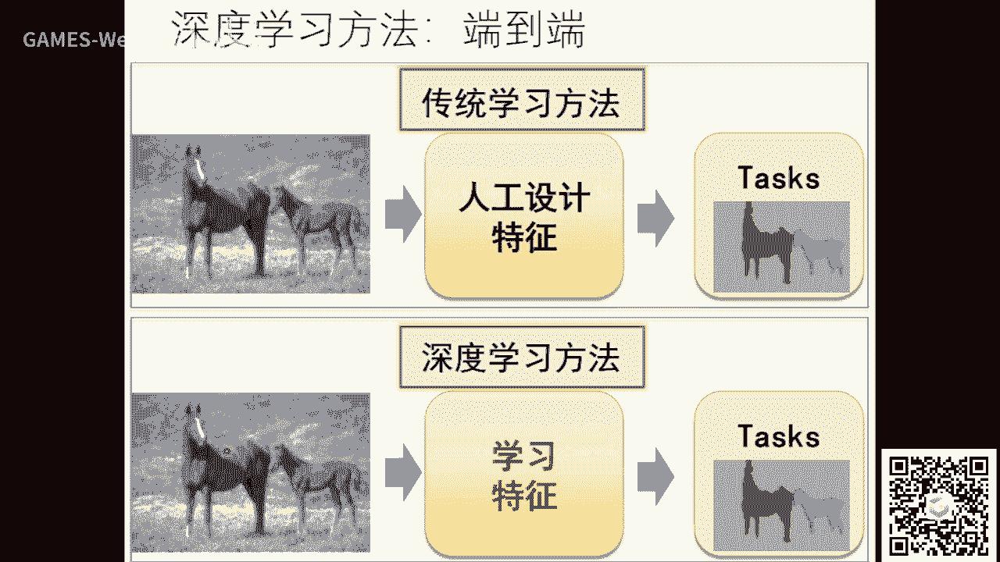

### 主要研究问题

*   **特征检测**：检测模型上的关键点、特征线、显著性区域。
*   **方向归一化**：将模型摆正，使其具有一致的朝向，便于后续处理。
*   **分割**：将模型分割成有意义的部件。
*   **语义标注**：为分割后的部件赋予标签（如头、腿、扶手）。
*   **对称性检测**：检测模型的对称性（镜面对称、旋转对称等），用于压缩和编辑。
*   **骨架提取**：提取模型的一维骨架，用于抽象表示和分类。
*   **对应关系**：找到不同模型之间点、部件或整体的对应关系。
*   **形状检索与分类**：基于形状特征从数据库中检索相似模型，或对模型进行分类。
*   **结构分析**：分析模型部件的层次结构、连接关系。
*   **功能分析**：分析模型部件的功能、运动机构以及人与物体的交互方式。

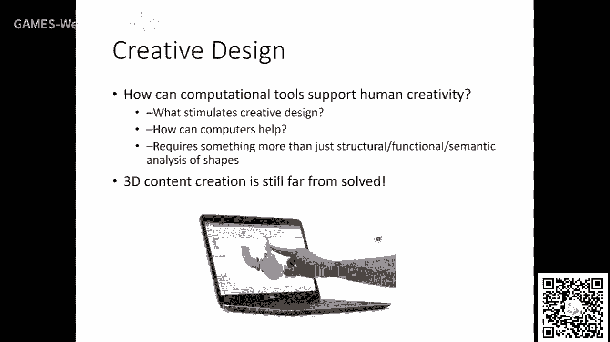

### 形状描述子

解决上述任务的关键是度量形状元素之间的相似性。这就需要**形状描述子**——将点、面片、部件或整个形状映射到一个高维向量（描述子），通过比较向量间的距离（如 L2 范数）来度量相似性。

*   **人工设计特征**：早期工作依赖于人工设计的特征，如曲率、法向、局部面积/体积、测地距离等。这些特征需要针对不同任务和模型类型进行精心设计和选择。
*   **端到端学习**：最近5-10年，深度学习方法崛起。通过神经网络，可以直接从输入数据（如点云、网格）学习到适合特定任务的特征描述子，无需人工设计。这本质上是拟合一个复杂的函数，但可解释性较弱。

---

## 课程总结与展望 🌟

本节课我们一起学习了纹理合成与形状分析的基础概念和方法。

几何数据随着采集设备发展而日益丰富，成为表达三维世界的新数字媒体。其应用越来越广，但上手难度高于图像处理，因为它涉及点、网格、体素、距离场、函数等多种表达方式，拓扑复杂。

GAMES102 课程至此结束。本课程系统性地介绍了从拟合、参数曲线曲面、细分、离散网格处理到纹理合成的基础知识。虽然时间紧凑，但希望能帮助大家建立几何处理的知识框架。

后续 GAMES 平台将继续推出高质量课程，如《高质量实时渲染》（GAMES202）和《三维视觉与理解》（GAMES203）。此外，也欢迎大家关注图形学相关的开源项目、学术会议和书籍。

感谢各位同学15周以来的陪伴与坚持！学习过程虽有挑战，但成长最快。希望大家在几何处理的道路上继续探索，收获更多。

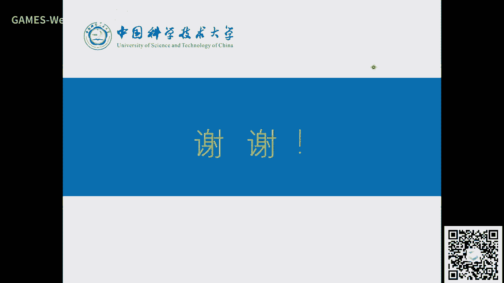

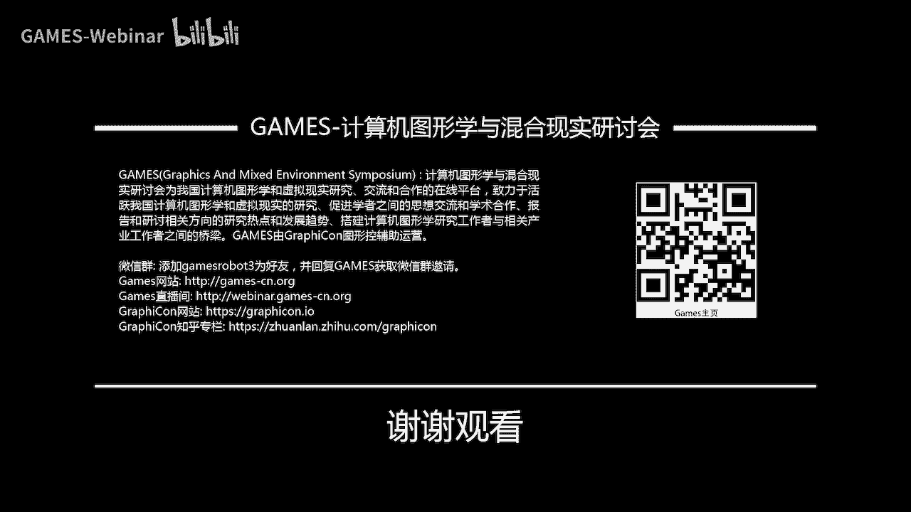

**课程结束，感谢大家！**