# GAMES102：几何建模与处理 - P2：数据拟合 - GAMES-Webinar - BV1NA411E7Yr

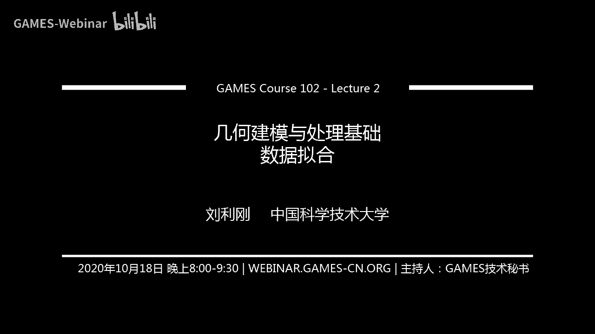

嗯好各位线上的啊，学友们晚上好，那么今天开始我们啊gm是102这个课程的啊，第二次课好，我们这次课程呢呃继续把数据里和这一块来讲完啊。

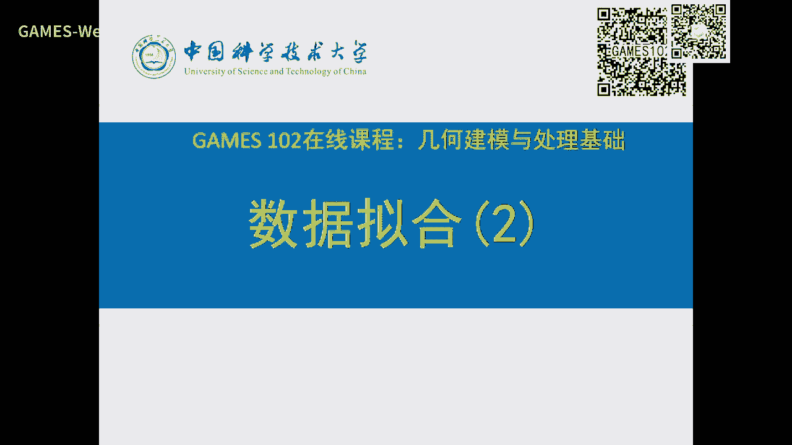

那么上周讲的数据你也可以后呢，我们看一下啊，啊上周啊也许各半小时啊，回顾了一下学生学的基本内容啊，解释了函数饮食变换在不同的场景是正常，就是一个一个同一个东西给一个x那么输出一个y。

当然我们现在是限制在函数的x和y都是实数的情况下，现在把这个一些里面的门道搞清楚，那未来可能那x呢可能是那个向量，甚至是一个矩阵，甚至是张亮y也一样啊，那么那个呃如果是一个图片。

它就可以看成是一个矩阵啊，这样的话呢就这个影射函数这个啊可以推广到高维都是没问题的，所以同学们先不要着急啊，什么要要先下子搞明白张量向量，还有含那个那个多多维的这样一个函数，要把它搞明白好。

大家也清楚了，我们给了一些x y x y都是实数啊，这样一些对子怎么去找一个函数去拟合它，那么呃有三个步骤是吧，是什么叫做好的函数，你找哪个啊，那么你告诉我一个池子，一个结合一个函数空间啊。

我到那里去找是吧，就把一个函数变成一些实数，把这个系数的去去去那个找，那么怎么找，那么我就是要去求这个目标函数的梯度啊，就是它的重点对吧好，有些同学可能第一次接触啊，在哪个尝试啊，有些在那思考。

有些哎这个结果很很怪异，很困惑啊，很很很激烈，挺好好，那么大家有了这样一个知识以后呢，再来接我，今天再来给大家啊，这个这个过一遍呢会理解的更好一点，另外的话为了答疑解惑呢，在主页上啊可以看到啊。

我就在大家同学们可以到主页上去把这个下载啊，这个不是放在电视那个网站，杂志放在那个课程主页上好，大家可以去看一下，以便于有些同学可以在自己跟着去去推一下啊，好那么我们很快回顾一下啊，就是啊。

那么我们还是在假定我们现在这个函数的一个一个一个一个啊形式啊，就是x和y都都是现在啊这个实数空间，也就是我们初中学的函数，因为初中高中都没有学过啊，你能够学会向量，所以我们现在还是从这个入门啊。

初中的这个这个呃形式来做啊，那么我们下面啊下面这三个图呢都是非函数，是一般的曲线啊，这个曲线呢我们到下周就开始跟大家讲，你只要把函数搞明白了，曲线这个呃就很好理解啊，他只不过是高位者有多个分量的函数。

就每个分量是一个函数啊，所以这样理解的话就很容易过渡过去，所以呢我们先把函数里的拟合一些问题把它搞明白啊，故里河清理河啊，这个嗯这个函数空间优化等等啊，所以大家并不用着急啊。

如果碰到下面这一类的这种非函数型，那么我们后面会来讲，那么函数很容易，那就是给一个x那么就有一个v的y啊，给给它规定对吧，所以所以啊每一条竖的线呢与这个曲线只有一个交点，这个叫函数形好。

那么我们的函数拟合我们在很快过一下啊，那为什么要给的一些观察点，就是我可能这个函数很复杂的函数去表示规律，但是我呢不知道它是表达形式，但是呢我只能观察一些采样点啊，叫离散点，那也叫做数据点好。

那么我要你和一个函数呢有什么好处呢，加上这个函数啊，就就什么就你扣了就叫什么，就是说假设这个嗯有有100万的数据，但是我函数可能只用了啊这个这个这个1000个系数就存储起来了。

是不是达到一个压缩存储的这个效果，所以你不用去不用去存那100万数据，你只要存1000个数，这个这个这个系数就可以了，所以那个是压缩，第二个呢是用来预测预测，就是你有没有函数以后呢，是那些终结者呢。

你把它带进去就可以知道啊，它所对应的东西是吧，所以说他也用预测啊，只不过呢他们的那个语言叫他们说叫叫编码，把他这个数据信息编到这个这个一个函数里面啊，当然他那个领域他们叫网络啊等等，我今天会把它解啊。

那么另外一个就预测哎我有个新现象x，那么那么比如说这里的x求出来了，那我要预测这个值是多多多少是吧，好所以它这是它的背景，大家好，那个我给了一些点，这个这个你看还有多少个好。

你要多少个就多少个无穷多个是吧，当然有些函数的好一点，有些函数不好好，我们来看一下，那么一个拟合函数，什么叫好和坏啊，这个有很多的这个不同应用对他的要求啊，比如说我最简单，哎，我反正我最暴力。

我就呃把这些点相互连起来，假设知道它的顺序的话，那这个不就是也是个函数吗，确实是个函数，这个函数每一段都是直线啊，我们把它叫做线性函数对吧，它是只不过是一个分段线性函数，它的误差全是零啊。

因为它经过了所有的这个形式点啊，那没有任何误差啊，这个但是这个函数好不好呢是吧，大家一看哎可能不好吗，为什么它不够光滑啊，就是在这些点上都是c0 的c d的位置呢，这两个函数只能在这里大牢了啊。

甚至连c一这个导数都没有，为什么，因为在左边左导数是这个方向，右边右导数是这个方向的，左导数和右导数是不一样的，所以它这个是c0 ，所以呢这个函数性质不够好啊。

所以大家一般在在这个实际应用中不会用这个函数是吧，这只有在一些非常对这个这个精度不高，不是很高的鞋啊，这个时候会用到啊，因为它只有c0 啊，并且它不可求导啊。

不可求导的话就带来后面很多一些对他的利用了一些啊，这个这个难度啊，所以啊当然你说我就这个函数我要做数字计算啊，用差分来做也可以改，当然也可以做那个呢就属于离散啊，所以我们后面的啊后半部分的这个网格处理。

实际上就是在研究这种对象，好，我不是光滑，我是分片线形，曲面来说是分片三角形状啊，就是就是最通用的或者叫最简单的表达好，那么这种曲面会叫曲线，它的一些限制什么球。

那么这就涉及到一些数值积分里面那些计算了好数字微分，数值积分怎么去求这个点的导数是吧，这个导数是不是可以用周围的这两两个点的导数，那个那个数值来估计呢是吧，这个我们放在后面去，当然从我们今天的课上来讲。

这个函数也是可以算出一个女孩子，但是呢他不够好，那我们就追求一种非常光滑的一个函数对吧，那么我们就要提高这个函数的性质啊，那么这种函数叫光滑差值，这个大上周大家也能理解了啊，那么这种这种这个求求解呢。

哎差值函数呢有一个问题啊，就是说你如果数据啊还有一些噪声，就是这个噪声英文叫noise啊，就是还带一些噪声，或者叫一些alliar alderly，什么呢，是叫叫优劣点，就说可能由于一个随机的一个现呃。

现象这个这个这个点呢并不是出现在这个我们要的那个函数上面，它是个随机的一个啊，由于由于这个这个外外界的这个误差，或者是仪器的误差，或者是一个什么会出现一些奥特莱尔这个数据呢，实际上是非常不可靠。

不应该成为我的数据集，但是呢我不清楚我只是拿了很多数据回来，100万数据里面到底哪些是噪声的，哪些是奥特莱尔，我更不知道，所以呢我我都什么啊，这个全州最终数据负负负责啊，那么去你和他这样的话呢。

就可能被他什么啊，这个这个这个虽然你和他了误差是零，但是呢这个值很不可靠，你在这里做的预测就极其不准确是吧，就本来应该是这样过来的，但是呢他虽然是在预测方这个函数，所以呢这个是是有问题的。

你去啊完全要尊重原始数据去插值，也不是个非常好的想法，除非你可以保证这个采样点是非常精确的，而是由女人保证的，或者是这个仪器足够的可靠好，所以呢我们更多的希望是用用，毕竟就说我允许一切误差不为零。

但只要小一点，这样的话呢就对一些奥特莱尔还有一些噪声呢，就能够会部分的抵抵抗啊，就就人口部分抵抗这样一些啊，这个这个这个呃呃性性质好，这里就是这三个函数啊，就是一个是啊，这个黑色的是啊，分片啊。

分放线形，绿色的是差值的，那么这个红色的是拟合的，你可以看到这三个函数呢，就这个数据集来讲，毕竟都还可以啊，误差有大有小啊，光滑性有好有坏啊，所以这个呢你说啊这哪个是绝对好的，都说不上，就看你这个应用。

这个东西这个是非常痛苦的过程，因为你根本不知道这个数据是是什么样子是吧，那除非你有先验啊，你知道这个数据是什么什么样的性质分布好，所以求你和函数啊，绝对没有唯一的方法啊，它是个根据你的这个这个应用。

你的你的意是什么，你的背景是什么，所以我们在求拟合函数的时候呢，一定要什么，要有领域背景啊，我们把它叫叫，就是你对这个这个这个问题本身的领域啊，这个能不能了解啊，比如说我们后面会讲到曲线曲面的意思。

但我知道它是一个二维平面的曲线，我知道它是个三维空间的一个曲面诶，那么这个曲面和曲线的这个性质呢，我就知道它的维是多少，这样的话我可以设计好这函数就有个他。

但如果是你对这个这个数据的性质意义一点都不清楚啊，假设是一个100万维的一个数据啊，这个数据到底是多少维，到底是从什么样的分布状态，你两眼你可以不知道，那这个事情做起来很难啊，这些人那怎么办。

那只能试啊啊，我又不正常的为数，那我只能是啊这个这个不断去调啊，这就是所谓的调参啊，就是就是说这个是蛮痛苦的过程，后面我会再展开好，那么这样局面就算三部曲啊，大家那就全清楚了。

找一个函数结合我在哪找什么叫最好的啊，然后呢去去去去求解它啊，求解它的话基本上都是啊这个梯度下降啊，因为如果他的这个有两阶的导数，那么可以用一些更高阶的方法，牛顿法啊，甚至这个其他方法啊。

好那么后面的话我们就会再继续展开好，那么顺理的方法论很简单啊，所以我就把它总结一下啊，那上节课呢，因为有些同学第一次接触可能啊还不一定基础，现在我再讲一遍呢，反正就非常清楚了啊，后面我会越讲越快啊。

就是因为照顾到一些啊，这这个可能背景不一定是非常啊这个相关的一些一些一些学员，所以我还是今天再过一遍好，首先你要你要找一个规律函数啊，那么你首先要告诉我在哪找，在哪找函数，有这个这个这个千千万是吧。

那么你总得限定我我一个范围，或者叫我一个形式啊，一般呢我们就会把一个函数就变成了一些系数的求解，这系统什么呢，是一些基函数所章程的一个线性空间，那么这样的话我对这个系数求到了这个函数就求到了啊。

当然这个函数这些函数好不好，你造成的空间好不好，这是另外一个问题啊，这个大家也要也要考虑，假设说诶我这个空间啊，我只有呃线性函数的表达，那么你这个空间是不是很小，你根本没法表达非常复杂的函数。

也就是说它啊这个这个这个函数结合啊，只是我所有的函数可能性的一分就一点点的这个这个这个几集，那么你这个空间就不够大，就不能去做非常复杂的现象或者规律的求解是吧，所以人们也会仔细想。

我这个战略空间这个能不能尽可能大啊，那个因为你你就大概率能找到我，我要的或者数据集所表现的这个规律，否则的话呢你就概率很小，甚至是一个非常差的一个函数啊，所以这里面这个g函数组怎么选择。

今天我们要把它搞明白好，第二个就怎么找啊，就是不是找哪个他哪个就是你要定一个目标函数是吧，这诺贝函数是最小零点买是一个啊，这个目标函数很多，变函数呢第一个项叫误差项。

就是它离我的这个xi yi这个点的靠近程度，你必须要保证，因为这个函数这个点是我从这个这个采样过来的，所以这个叫误差项，这个也叫data tern啊，就是叫误啊，数据误差项，那么往往呢我们上节课也讲了。

就是往往这个还不够，为什么呢，因为因为如果碰到一些欠拟合的现象，这个无邪有无穷多，那怎么办呢，我们还要对这个这个系数往往是对对这个系数啊，实际上对系数加加约束，就相当于对函数加一加约束是吧。

那么对系数啊，这个比如说那个啊，那你回归对它的按摩加居处那个吸收优化，对它的这个临摹加约束，当然你说我对f本身加约束行不行，可以啊，比如说我我希望f的这个两阶导数的平方五啊，这个也不能太大。

你就把它当做正直项放上去也是ok的，那个什么呢，因为你含数的2000导数的平方，你的一个积分在这个区域积分数量的这个函数的一个光滑性，它的两阶导数什么是取率，就是它它不会发生很大的震荡。

不会像蛇一样的游刃，有游刃有趣啊，这也是可以经常作为一个政策下，还有啊我可以把f这这这个弧长啊，这这个弧长啊作为一个啊这这个限制，我希望它这个弧长尽量的紧啊，弧长解什么呢，就是它的7度的积分啊。

尽量的小啊，这注意经常看到这个lv模型啊，这个这个也叫做拖拽感选tv啊，当然你说我我能不能提出一些统计的规划的一些模型去描述，f当然也可以了啊，所以这里面就有很多很多东西啊。

一大部分研究工作者在这里面去去去定义这个model啊，好那么有了以后的话，很多函数呢如果是一个呃呃平方的这种形式，那非常的好解，一求导马上就线性方程就好了，就是有没有第一个作业所获的。

但是往往那个那个那个那个屋面函数非常复杂，飞出非线性，那就这个优化就比较难，所以在我们这里呢我们用的形式都比较简单，和平方的误差，正则项呢这个也也是平方的，所以呢一求导就变成一个方方程组，方程组。

如果那个你是确定的啊，你要去加加约束，因为因为如果你不加约束的话呢，这个这个解释可能随机的，或者是这个无穷多个解是吧，我们学过现在估计知道如果变量数小于方程啊，大于方程组织做出它的那个解空间就是无穷。

并且它的这个这个这个无无穷，这个尾数是等于这个啊，总之n减去这个这个啊西部矩阵的秩是劣质，那这样的话呢就就可以调整它为数，那我们就在这个无穷空间里面再去找一个，这时候呢你就要命了。

用到这些政策下去限制住，在里面找一个最稀疏的解，这里面找一个按摩最小的解等等，这样的话你就可以让你的这个这个这个系统啊，能够得到一个合理的解啊，所以这是整整个过程啊。

那个上这就是上周我们讲了一个大致的东西好，那下面我们就把一些细节把它再重重新重新理一遍啊，那么好，我假设要有有一些这样点啊，就是a b c i和yi这样点，那么我要去用n次多项式去拟合。

怎么样把这个把把这个条件带带进去，然后就这样得到了，欢迎技术的啊，这个n加一乘n加一，这样有cd一个一个一个系统，那么那么这个系统这个系统矩阵是呃能够证明啊，在这个问题里面能够证明它是会退化的。

放过取证，在我们大一的时候，很多功课的，并且行列值啊，这方程式方程组有一点，那么你这个g函数不一样，法律只不只不过这个系数不一样啊，这个系数不一样，但是呢都不能证明它是行业次数为非零啊。

这个单元我们就学过了好，那么在数学上还有一个技巧，就是说量冲的比较比较麻烦，每次都要去求解方程组比较麻烦，他们呢能不能就会想到诶，如果你x0 y0 我我能不能有一种方法。

我是预先求出一些这样子这样的所谓的啊那个函数，这样的话呢我只要y来了，y变了啊，这些变了，那么我能不能预先求出来，这样的话呢，你y在变的时候呢，我的函数一下子就这样就这样表达出来了。

就不用去再去求解方程组啊，这个是可能的啊，因为这些这些性质你可以看到每个l0 x是在什么，是在这当前点等于一啊，我自己画一下啊，假设x0 x1 x2 ，那么那么这个这个l0 x呢只在这1。

40在在别的别的点呢，就啊这是一在别的点是零，那么这个函数在这个点是一，在别的点全是零，那同同理，这样的呢，这个函数就这些所谓的所谓的预先求解出的函数就有个性质，只在这一点为一，其他为零。

他们在这一点为一，加为零，这样的话呢一组合就刚好就满足差值性质，那么那么这些函数的求解呢又化成了刚才这个限制用什么，这函数在x0 等于一，你去求解的方程组就行了，所以这些呢是可以预先求解出来，放到这里。

然后呢我数据来了，我就可以不断一组合就出来了啊，这是为这是一些小的技巧好啊，当然这这个这个这个这些系这个函数怎么求啊，求解这就是我们大一学的那个拉格朗日差值啊，这个拉的话我就我就哎把它写在这里啊。

这个好，那么还有一两个技巧呢，就是比较比较比较这个啊需要偷懒哦，就是我不需要每次都去求解方程组，怎么好，那我想你既然是求一个做相似，那当时去你和我的数据是吧，那么如果我能得到一个互相识跟你要的多相似。

在零阶一阶二阶导数不一样，基本上就可以证明他们两个样子是一样的，所以就用这种插上方法去去定定啊，这是n阶叉叉k线商，这是一阶差商，然后呢用用这种擦伤跟对这些器具组为版就出来了啊。

这就是我们这个这个数字分析里面学的叫牛顿插值多项式，这些呢都是人文啊，我不需要每次都去求那个范德蒙啊，因为如果你把它当一个问题，就是这个换换什么行列式，每次都要去求解这样这样一个啊这个这个这个方程组啊。

那这样的话呢我可以预算看这个是预算出l0 到l m用的时候呢，就主为把这里我也预预算出这个这个这些差分，那么他们有了以后，然后我就直接带进去就可以得到这样一个函数，不需要去求方程组。

但是呢他天下肯定是天下是没有免费的午餐，你肯定是要前面啊做一些预预算，预计算预存储啊，这个用起来更快，所以啊这个是算法，大家做做做计算机的做清楚啊，在计算机里面算盘和空间啊，时间和空间永远是矛盾是吧。

你如果存的多，你到到时候算的时候就快啊，或者是你你存的少，你没存什么东西线算，那你算的时间要开下来就大，你算的慢啊，这个东西呢就是就是拿空间来换时间啊，如果有空间赚不多，这是还是合理的，好好在这是差值。

有什么问题啊，我再过一遍，这个这个算是所有的一个问题都有这个问题啊，所以这是通用的啊，不是不想只差值存在的问题，你也可以把这个理解成上存在问题，到一就学，这是稠密的啊，刚才那个范什么行列式是从立的。

他没有它，它处处元素都非ing啊，不像有些矩阵啊，虽然很大，但是呢它非零元素很少，大部分证明那个叫西初学制好，吸收取证的方程求求解是有非常好的迭代方法啊，这个呃很快啊，这个i跟库里面有好多这种啊。

这是一个非常有名的数学库，我建议大家都要去去学会用它啊，里面有解方程组啊，你接下来用就行了啊，没必要自己写，因为自己写的话还写不过这些这些库，因为这库经过大量的验证啊，里面的效率啊，好我们回来好。

那么这个参数就是矩阵处理就怎么就慢，因为新取证求解会有很好的抵达方，数量很快，第二个呢它可能是病态啊，那什么叫病态病态就是他求你不好求，我，这里举个例子啊，就是说这是一个非常简单的一个2x2的。

有两两个变量啊，就这个系数这样啊，你可以求出它的它的解为一和一带进去，大家验证出来好，但是我把这个一稍微做个脑洞，假设你由于呃计算精度或者采样之后，这个值啊就一点点就是在-3次方的误差。

你看这两个方程方程组是一样的对吧，好微不差，然后呢你求解出来的话，减呢完全变了，跟跟跟这个一和111是完全不一样的对吧，所以一点也不差，脑洞就带来数数字的那个解的非常大的一个艺术变动好。

那我如果我对系数做一个片片跟啊，这些都都都没有变，只有这个便利一下啊，从0。333变到0。334，那么我们看一下这个点又变成一样，也就是说我对无论是对这个系数矩阵。

还是对右右边这个这个项去做一些小脑洞对解啊，对影响是非常大，就是本来你说这个这个这个是个连续的一个系统，你你你这个系数老兵一点点应该对解，也是应该要要老公一点点是吧，但是呢这个这个这个变化为什么放大呢。

说明这个呢说明这个系统啊在在在这个地方的导数非常大，它上升的很快，所以你一点点脑洞呢它变很大，那么这种矩阵呢这种性质呢就叫做病态啊，变态数据上是用什么来刻画呢，就是用用一个这个这个这个条件数来刻画。

就是这个矩阵呢这两个他真的值啊啊这个相差非常非常大啊，这个这个全身大就表示什么呢，就表示呃呃上次用那个这个矩阵的啊棋子来描述可能会更好一点，其实就相当于这个矩阵它的一个各个方向的比例。

如果他嗯呃最大智能值跟最小性能值比较大的，表示什么，它有个位数就丢丢掉了，它什么它是有好多相关性，就是线性相关性相关，是不是这个系统就变成了啊，这个有无穷多个解，因为它的这个这个解的可能性很大。

所以说你点脑洞，它可能就跳到另外一个这个这个空间的减去了啊，所以在数值分析里面，我们要控制住这个啊这个啊汽车举重的条件是他如果一般大，这个系统就不稳定哦，你你你你如果不去关心的话。

傻乎乎的去去去去去去求，把这个解当成你现在的解，往往这个可能会造成很大的问题啊，所以呢在做一些求解的时候呢，上这些东西都是非常重要啊，不能够啊，这个这个啥也不管，就是做好好。

那么这个多元子差值为一个变态，为什么呢，就算是这里有个原因，我解释一下，可以证明啊，我记得不不是数学课，所以我就证明这个饭怎么行，行列式的条件数啊，随着这个个数增长，它是指数型增长。

那从小指数就是长这个样子非常快，就是这个点就是差值点越多，就是差值点越多，意味着什么，意味着这个多项式的系数越大，那么如果这个这个越大，它就越容易这个从这个指数型就这个条件数越差。

这就是为什么指数如果你分开始的这个指数用的很高，你去做差值的话，就容易变态变态怎么体现出来，就是混合啊，你跟就得到多少个去，他他很他很他那个很熟悉的一种现象啊，好这就是它的原因。

所以你们出现在昨天过程中，我也看到你的报告里面也写了啊，这个这里面都都体现了一些这个啊反映了一些问题啊，这个我听一天稍微这样比较定性的描述啊，如果要定量描述的话，你们要去数学书去看一看啊。

里面有严格的推导和证明啊，我们只讲原理啊，照顾到更大多数的学员好好，那么我们再看看这个幂函数为什么不好啊，因为因为你们这个经济作业里面发现这个次数一高就容易过于和，那一对吧，这个是一啊，这是x这是x吗。

你看它怎么它这个这个这个这个这个内涵差别啊，这个随着次数而减少，但是呢增长非常快，你看如果是x的一个十次方，它的系统上升非常快的一个函数啊，所以这个函数呢上升数值是不好的啊，然后那么呃一般的话。

那这个呢我就讲一讲经验啊，这个我们就不去展开，就说这个函数啊啊要什么，要要要有有有正有负去抵消，那么这样的话呢，这个函数加起来呢就不会，总之总之是增长总值大化，这个总总的函数就全全是很大的值。

就就很容易抵消掉，那大家如果在初中应该高中嘛，就就知道怎么去求一个多项式是最好的，比如说你去求一个a0 x啊，a i x i西格玛啊，那么如果x很小的话，而一旦次数很高。

这个这个数值在现实里面基本就就被被丢掉了对吧，因为这个次数一高，如果很小的值是0。1，这个i s 10基本上就是啊这个-10次方，在计算机里面可能就连基数都没有了是吧。

所以我们在初中应该我记得是我在初中竞赛的时候学过对吧，不是求这个求职要用什么，要用请求招法对吧，我们是a0 加上a一啊，怎么a2 加上怎么这造就一加x那就这样先先这个层，然后再乘系数，再乘x。

然后再乘系数，再这样就把它这样，至少可以把一些这个精度给它控制住啊，所以所以多项式幂函数实际上是不好的方法，那么那怎么办呢，我们这学上有好多要有正交对象式电话呢，你看这个是这个蓝色的，就一阵一副啊。

就是就这样站一个金子是吧，那么那么这个浅蓝的有有有有两个震荡啊，其他的有三个震荡啊，那么这样的话呢一正交正确的话表示这些函数的内积啊，这个这个是等于零，为什么它们相乘相加就能够相互抵消啊。

那么就可以用那些啊，这个这个这个就这样性质就比较好，那么那么我们在大一，我记得大一学过啊，这是怎么一个多项式机或者是一般的一个基，怎么去获得它的正交基啊，这个大家提一提啊，大家回忆一下。

我觉得你就是大一里面学的那种题都是有用的啊，就是就是就是我也比较着急，就但是那些那些老师没有讲出这个这些这些为什么要去做这些话啊，它的原理是什么啊，就是如果能带着这个应用的问题去学大。

我相信很多同学大一的这个这个对数学的炒面没有那么厉害啊，甚至可能会热爱啊，所以这里面呢就是呃我们这里讲的所有东西都是新的，都是原来的东西啊，我们只不过啊这个这个呃我也不是知识创造者啊。

我只是支持的方运工，然后把那些大一的知识把它翻过来，用到实际问题中，告诉大家怎么去去求解，好好那么这个差值呢大家就就就就这个现象也看到了啊，这个就这个叫如何现象，就是不稳定的这个这个现象啊。

这个你可以看到这里面同学们在左眼中也有好多这样类似的图啊，你可以看到这个啊，我看看啊，在这里面这些人就是次数红的，你看绿的，蓝色的还好，绿色的就抖动了，红的就抖得更厉害是吧，所以次数越高。

这个一些数据九个九个数据啊，这虽然是误差等于零，这个函数是不好的啊，那么这个误差在这误差看起来也不大，但是呢这个这个抖动非常非常大啊，那么结论啊，这个多项式插值不稳定啊，因为这个这个速度高。

因为这个这个基函数不好，这个呃在数据上只要是多项式空间都能够拟合所有函数是吧，开始展开持续函数就用wechini保证了，但是呢这种函数中间的g函数不是很好求，它不稳定，而且这个导致这种混合现象啊。

那么有没有更好的基函数呢是吧，所以人们也会去想那个如果我也不想使，我仍然不用这种技术天函数，大家看到的都是这种增长的是吧，越增长越快，那有没有可能啊，这个这个稍微有抖动的这个基函数构成。

也同样能够表达这个多项水平空间呢有啊，就是这种温室暖机函数，好像那模式想介绍中呢，我们这个我先卖关子啊，都放到后面去讲，那么差值讲完了做笔记啊，这个内差距有那个问题是吧，差值虽然无法等于在数据呢啊。

如果有噪声或者来了就不好是吧，并且这个容易产生如何现象，那么怎么样，我我就退一步，我呢只要去逼着你这个函数啊，这次呢我不是有点就经过，那为什么这些点可能会有噪声，你看到这些点看起来是像线性关系。

虽然他还是离这个直线是有一定距离的对吧，所以啊做法是一样的啊，我找一个找一个函数结合奇函数啊，去去在这个章程的这个建筑空间去找一个函数去最佳的距离啊。

这个逼近毕竟的话一般都用这个啊这个函数所需函数的这个带进去，跟我目标值的一个平安符，因为这是平方和这个这个这个这个函数，注意啊，那么这个函数是谁的变量，就是那些那些210和兰姆达n的变量。

就是那个n的系数变量，就是那个g函数系数变量，所以这个问题就变成了表达的是l是一是这些变量啊，那么你要对它求极小值，是不是对它求那个那个e求拉姆达e的偏导，等于是吧，每个每个变量都等于零。

那么这样的话呢就化成了南大营造南打人的一个方方的组，你进行记录好，那么这里就把它展展开来啊，那么具体我就不去自己写，稍微有一点点线性方在座的变压器知识就知道了，这个这个式子一求导就变成差了啊。

就呃就可以把它提成一个矩阵形式，那么这个这个系数呢就是反映了这个怎么去求兰达的一个呃，这个血精啊，防守吸毒矩阵好，那么这个求解大家一吹捧为推啊，所以这个这个目标函数变成一个二次型，也变成一个线性方程。

这方面这里也涉及到一个a的一个幂的求解，所以也同样存在着这样一些这个稳定性问题啊等等，好，那么呃这个毕竟我就我就回忆一下啊，好那我们再进一步把上周出现的或者你们昨夜中出现的一些问题。

我们在一步步探讨一下，分解化好，都是我刚那个上节课也讲一讲，就说是为什么说诶还可以，大家喜欢用公钥匙，因为有一个非常强的一个定义叫wegame啊，就是说你无论你给我一个什么样的函数，这个函数是未知的。

我总能找到一个n次n次多项式函数，对你啊靠得足够近，一个数值内一小啊，这那小的一个误差就是九-6-8-6啊，你给我一个n p，你要多小，我就可以总之找到一个p n，只不过这个n次数可能很高。

你存在一个n啊啊这就是数学的思维，就是我告诉你存在啊，没有存在对吧，然后呢呃怎么找，我不管，反正它存在存在一个多小时，毕竟他那么这个东西呢用对线的语言来讲什么意思啊，就是可以很容易相当于是函数空间。

这个这个这个这个这个非常非常多，但是呢我里面不认识封面在这里面啊，处处都在，你问fx在哪里，我总有附近有一个多项式存在，电影是靠的比较近好我们举个例子，比如说实数组x是吧啊，属于实时数，无论你给我。

你给我一个什么系数啊，这个实数我是不是总存在一个有理数靠在b一进，对吧好，那表示什么呢，表示有理数啊，在这实数上面处处都有啊，你你不管这个这个实数在哪里，无理数在哪里，它总存在一个有理数。

要多近就多近是吧，这就叫做重秘啊，也叫完备性，好重秘，那么它处处都有同样公式函数在整个函数空间它是错误的，它无处不在啊，只不过呢就是次数可能很高而已，当然我这里是限定的一个一个区间了。

一般我们讨论问题都会把它规划到零一啊，这个a b和零一就差一个系数好，他就说这样子空间，为什么大家还是觉得还不错，因为他表达能力很强，因为什么呢，你无论x在哪里，我总能有存在一个不是那么靠靠近一。

那么只要我这个n足够大，用这个这个这个空间去找一个函数呢，还可以，因为他他能至少能够有概率表达到我要的东西是吧，只不过这n子多大，我不知道，那么怎么就变成实际过程中呢，要要自己去找。

要去调n是100不够啊，1000 1000不够1万是吧，但是呢不可能这样搞，因为这样这样搞的话就就就贵一点啊，就是因为次数太高，好证明不讲啊，这个我只只是告诉大家那个那个那个叫做博士坦的人啊。

你和李大数学家啊，这个这个又通过各种性证明什么呢，就是那个一个函数，这不知道，但是我可以构造出一个温暖中式，然后呢告诉你这个在上在这个任务记录下面呢，就可以避免它那么多次呢，最开始长的是啥样呢。

长的这个这个样子啊，就是啊这里都是0~1啊，0~1好是x减一减x n减减a就是这个这个次数啊，这里呢截从零到n有n加一个计算值，这个呢是一个二次项，就是那个啊就是叫着数啊。

就是cn j我们已经叫这个符号是c n j那现在是变成了这种形式，就是那个元素里面拿杰克的组合数啊，好这样我们可以看到这是一些简单的啊，这是一次的，是这样，有黑的，绿的，黄的跟红的，这是这是30。

这是二次三次，这样那四次是你可以看到它是最函数啊，这个阶函数同样是四次，这这个应该是这是50多项式啊，这一个一个积空间跟那个x1 x的平方，x1 x方x5 方这个图画的不一样。

但它仍然是一个这个线性无关，并且是啊这个组成负相纸机空间，安全机空间的一个内阻机啊，后面我们啊可能会花更多时间来讲啊，我这里一再而过啊，这是什么呢，就是同样一个函数空间，我可以用不同的机。

那么结合肌之间的变换就是矩阵，所以所以举证的本质是在不同的基函数之间做变化啊，呃呃我不是特别赞成，然后里面这个东西叫矩阵，然后呢举证了很多性质啊，搞搞半天不知道他他有啥用，那举证实上非常有用的。

举证就是什么，表示信息中间不同基函数的线性变换的，一个一个一个一个变换的一个描述啊，要用这样一个理解好，我后面有时间我再展开一点啊，反正我就扯扯到这里，我就讲一下好，那么用用上专项式去做ppt。

为什么好，事实上在我们这个啊，我们这个学科啊，就像句子，我们这个课啊啊有一门课叫做计算基础和几何设计，这些地图啊专门在讲这个多项式的性质啊，那么这个性质呢我稍微稍微介绍一下啊。

这个展开一下这个这个这个g函数啊，你可以看到刚才这个图啊，它呢呃有正信正信什么，就每个价值大一点啊，这没问题，还是权限全体的权限就是这个基函数1n一直看的是j n哈。

x始终等于如果固定的x属于0~1的任何一点，所以奇函数的累加都是一，我们这个图哪里啊啊这里固定颜色是一个奇函数，我这里弄了一个值，那么这些函数在正常值啊，这些点就值加起来等于一，好又大于零。

又等于这是什么，这就是全啊，就是加起来的全是吧，如果n个数加加起来等于一，又不大于零，这是不是一个线性组合，就是七个全，所以它具有作为权的性质，应该有权利限制这种基函数非常好，那么它就有突破性。

它的计算就很稳定，有猪八戒又有非常缩缩减又可以递归啊，还有细分，就是后面我们要讲的那个北热曲线的一个所属性的多，它这里都有啊，因为他是关心海这样一个一个表达好，所以这个基函数呢就很很很好的性质。

并且你可以可以看到这里用了500接的这个多项式，这个都没有发生融合现象啊，因为它这个基函数呢相互抵消啊，正负可以看这个图，这才是五次呃，呃这个这个这个这个词时20次都是这样啊。

这个键盘的整体它是长长长长长成这个样子啊，我跟这个样子类似，这个是是这样的，这是一啊这个那么第二个呢就这样翘一下啊，你慢慢慢慢翘啊，就像在一个波一样的，到到到到最后一个函数是这样啊。

无论多少次他都是这样战争的形状，并且是左右对称啊，这是但是它们是一个另外一组基函数啊，当然在我们这个学科里面，我们还还还还有不同的学者构造了不同的很多种减速啊，啊还有这个都是一些人民的好国产西北人啊。

所以呃在呃期间就是专门研究这东西的，所以对他非常熟啊，就是各种各样的函数，我觉得只要你觉得这个函数作为一个函数，它有一些性质啊，你要把它证出来，并且它有一些的一些曲线设计或者函数的一些特征啊。

这个性质那你就可以有可能是一个在建函数，那你可以画个论文好，早年的很多文章都有这样一个特质，好那个关于函数呢，我这里也稍微讲一下，这个有两个观点，这个观点呢嗯从不同观点去考虑啊。

你最后面得知道曲线怎么看好，各位不一样啊，那么这个观点呢我这里稍微讲一讲啊，好那么这些蓝色点是从一个采样点出来的啊，假设是一个函数上采样的，你把这个蓝色点一次，这样线性连连起来，就是这个蓝色蓝色。

不然这个就不能行对吧好，那么那么以他们这个这个值呢，假设这个是我在这个di点，这个坐标是m仔好，那么这个函数在上面取值就是这个点，如果我用这个这个奔海机去组合，它就得到一个函数。

就是个红色的啊啊就就这个红色的这个这个这个曲线好，那么这个叫做不反对项式，什么意思呢，我给这个函数这个不断就这样组合，然后你就得到一个曲线好，这个可以被证明当n足够大，如果在一个函数上面采样就足够幂。

那你构成这个红色函数的是什么，当n组到时p n fx一致收敛到f x收敛啊，一直是表示处处都差不多的情况啊，就一次收敛好，那么缩减到这个f x这个红色会越来越靠近函数。

所以呢你用这个函数呢就有保证a你是毕竟你要的东西啊啊，那么这里呢就两个观点，一个是这是一个函数值，表示这个点的y y值对吧，这y字号，那么这个可以把它看似是一系列的点啊，y f n i c k集合好。

我用这个系数去做了，这个就是一个代数观点，哎我这里给给那些函数值，我用b n x，因为它具有权限加起来等于一大于零，主要它是对它的一个加权，也就得到其中的一个点啊，这是概括观点什么呢，结构是什么。

我我把这个解这个函数及函数看成是一些函数，从这个系数去组合这些这些函数，那就变成另外一个新的函数了啊，那么这两个观点呢在后面做设计的时候去控制顶点，比如我我我这个点调一调调到这里来。

那么这个函数呢就就就会变变成这个样子啊，这样的话就可以用一些交互手段去做一些这种曲线的设计啊，这就是这个建模中啊，这种交互的这个对指导曲线的一些这个啊来源啊，这讲到这里。

我们再把这个呃呃上周也有同学关心的叫rbf阿b f呢，实际上是是在高维中教育比较多一点，那么在低位中，在一维中我们把它叫做高斯函数啊，高大家都很熟啊，小孩子就是就这样一个东西啊，这是ax一个函数。

这个六呢就叫方差，那不叫君子啊，就是市场的期望值，那个西格玛呢是叫方差，这个函数呢涨涨起来啊，我们一般啊这个比较容易记的话，把它叫做帽子函数，像一个帽子一样是吧，处处都不为零，在很远的地方。

那如果对很远地方我们考虑这个函数g0 逗号1x，这这就是一个规划了啊，就是均值在在这个零啊，咱们这样一个沿着坐标轴对称的一个函数啊，这就是t0 ，如果这个六和七孔嘛不会零，那个不为零，为数不为一的话。

他就什么就就是六不为零的话，西格玛不为一呢，就是这个胖瘦，所以一个是决定它的位置，一定是决定它的宽度，就是胖瘦是宽还是错，你可以看到这里几个值蓝色的话是6=0，表示这个y轴是在这。

那么西格玛等于零二比较小，那么西格玛等于一就变成了红色，就变得比较胖，你们看到啊，如果这里有个系数呢，他把他规划了，这里还少了一个星马，星马就是为了规划啊，所以为什么他有高原低。

这是这是让他下这个面积积分等于零啊，这等于一就是变成一个概率函数啊，先不先管这个啊，你不要去管概率好，这样一个函数呢啊一个new他在哪里，你看这个绿色的内容呢就等于-2了，就相当于往左偏了，变成0。5。

它稍微胖一点点，但没有这个红字的胖啊，因为红字是一啊，所以说这样一个函数有两个参数，这这这这两个参数一个表示它快，它在哪，就是没有表示君子，还有一个呢，他不胖啊，会多送很瘦呢。

哎你这个就就就有如果姓马很小，等于0。01，这个函数涨起来就像脉冲一样的，很尖很尖锐的啊，因为这个西西格玛很小对吧，所以西格玛不能太小，尽管射程0。01啊，就是脉冲量的这个就就一个值凸出来了啊，很高啊。

那么好，那么这你这里无人性啊和没有，你就没有取什么值构造的这个函数，就是这里出现的四个函数都是线性无关，自然是线性无关，是不是就可以装成一个空间组合，语法也可以表达很多函数对吧。

所以呢这个所谓的rbf差值就是这个道理，好实施实施者怎么做呢啊，有不同做法，我这里讲一个比较通用的做法，就是说我给给了一些点，我就在这里面放放放一个呃这个基函数，这里放个基函数，在这里放一个基函数。

在这里放个基函数啊，那么把这个阶函数的主谓吧，就是变变成将就是把这些现象中的左一把定义为我的fx，既然这样的话呢，你再对它求导，所以x这个系数b0 在放这里只是让它有上下移动啊。

那么这样的话就组合出一个所谓的这个这个高速线性函数啊，啊在有些地方也叫gmm，就高斯混合模型里面也有这个东西，好好，那么你去求解的话，同样求解的方法跟刚才一样，求那个球，然后你就可以得到bi的一个方程。

这时候有的时候呢b b0 会有个多余的，那这时候呢你b0 可以给他一些鲜艳，有些地方在这里加一个二次的占占这个项啊，比如说对系数加起来挺低啊，约束啊，只是为了让他规划好，那么rbf拟核就是这样。

如果在高维中啊，你这些点啊也可以接就放，你就不是这个函数是一个二维函数，就是一个草帽一样的话，就是把这个呀这个函数进行一个旋转，就变成一个二维的啊，三维一样好，这里是同学们作业中出现的东西啊。

这里就因为在上一周我们还没讲这个东西，大家都大家都出现这个情况，大家不知道是什么原因对吧，现在原因就清楚了嘛是吧，因为你这个很小，每个g函数都都都是都是尖锐的对吧，虽然它经它差值了，但是这个函数不够好。

因为每个基函数都很瘦啊，用用这些数字来，毕竟这些也只能长成这个样子是吧，这个这个还不够丰满好，尽管等于十来胖一点，但是这个好一点是吧，所以可以看到变化，这些现象呢大家都是可以这个这个这个现在动了哈啊。

唉这可是另外一同学的，也也是可能周三还是周一啊的时候，我们把他找来，就是这次做的看起来做对了，这个这个这个西格玛啊，这个设子不够好，太小了啊，好了，这里就有一个困惑，哎这起码都去多少只跑啊。

也是频频经验对吧，就是你你如果希望这个函数稍微胖一点，那么尽管取大一点是吧，那怎么办，有没有可能让这个西格玛和滤网也变成一个，就是这时候呢就就很智能了嘛是吧。

因为又和西格玛呢也做了一个变量好我这里写成这个样子，这两个变变成参数变量还是x这个函数如何，西格玛在变，这个函数在变，如果我能把任何方差，把任何西格玛也能这懂得去求出来，那那太好了。

那那就我就不用不用什么i去试，因为在这些方法里面没有核系统嘛，被射死了，我们又放在哪里，就是在数数据点上，方差怎么样，我我方差，当然你说哪个取的不一样，那个你怎么知道去去哪些不一样呢。

所以没办法去预先知道，如果你能够去有个方法优化出没有，那这些函数啊不一定放这有可能发这更更好对，那么是不是有有更好的这样一个解呢，啊这个回答是好。

那么我们把这个把这个问题来这个这个formulate把它来示范好好，那我们来看一下，那就是我们从另外一个角度来看这个引号函数好，我们来看一下啊，好现在呢我们想诶我米号函数啊。

这个把六核西格玛把它限制住了，挺不好的，你们怎么呢，那你你什么理由说新冠等于实好，我说我姓马等于1号是吧，这个这个不同的数据都有不同的特写，但是我的数据是啥类型。

你能够很智能的很自动的告诉我这个新号码是什么，是最好，这样的话就非常正常是吧，所以我们这样我们来做个变形啊，那我把这个西格玛呢把它放进去就变成这个形式，这个形式呢那么这个形式是表达成了一个1t01 。

就是那个标准的高斯是吧，然后里面只有过变量呢是一个a加b的形式，这个a呢是在这里，是这里写，写错了，仔细1%是负的，七个6%，是不是这些词汇，也就是说你任何一个这个一般的函数都是由我这样一个g函数。

通过一个变量的一个这样的变换给它生成的啊，就是让它沿着x轴是平移，a呢是一个伸缩，伸缩因子，就是性能分之一，也就是说我通过我一个函数不同的变换变胖变瘦，左移右移，是不是可以产生出一系列的这个新的函数。

这些函数也可以通过它去组合，然后就组合出我要的一个目标函数啊，我这里讲慢一点啊，这里很重要，因为这个东西明写好了以后嗯，现在这10年大家很很很赶潮的一个东西，就就离就离也好了，好我以前是写成这个样子。

这个量词是直接把这个s没有写在这里是吧，我现在把它当做一个变量，为什么我这里面的变量呢跟西格玛，啊啊这个应该就叫交叉啊，无所谓哈，好那么变量的ai和bi就就是就是跟这个666。

跟这个吊塔这个这个这个相机那个相关的好，我通过一个一个函数对吧，通过左移右移变胖变瘦，但是这个a i b i啊，我都不知道我要有这种球好，我让他走，这线有关就可以装成一个空间，相信很多函数是吧。

那我就讲讲这个函数长的这个样子啊，这个函数就我要求的好，既然你定义好了这样一个空间，这个函数形式，你再去用刚才说的拟合也好，差值也好去求就行了，这样就是把这个ai bi也就西格玛和啊。

这个调查并没有就做成变量，这样的话呢我就可以同时去优化这个六跟这个这个这个点卡的方差好，这里就一个思想啊，你看那个最后一个函数，通过它的一个平移跟升缩变换就可以找到好的好的程度，什么意思呢。

我通过一个一个函数，就只不过这里是用高斯函数，是标准高斯，那么通过佛教规范化高三人数，通过它的平移啊变换啊，这个伸缩呀就可以装成很多函数，通过它组合也有很大的表达能力啊，至上啊可以告诉大家啊。

理论上数学上可以证明这个a和b足够多，这种形式的函数做个大a和b足够多，随机啊，它所产生的函数空间同样可以逼近只有函数什么什么电影，刚才说的不要强制定义定理，只是说关键是足够大，就足够次数高，它也可以。

毕竟所有数据函数没有这个性质啊，只要这个a i b i足够多，好像像素足够大啊，你可以看看，就相当于你这个函数无论长成啥样，我总可以在上面布局一些这种帽子函数为组合来啊。

这个这个这个这个逼近名字只是足够进的理解吗，所以说拿bf在计算数学里面是一个很大的领域，就是这个研究了很长时间的，因为它本身也有这样一个稠密性的，这样保证好嗯嗯，我们停一停啊，大家不知道诶。

我看不到您的表情啊，是是痛苦还是迷惑，还是在那微微笑啊，那个这个你嗯直播间里面很多同学还是听懂了啊啊妙啊啊啊，这个香不香啊，但是很香好，那大家继续，我们再把这个函数形式在再变一下，诶。

这个这个怎么怎么变成变成这个样子。

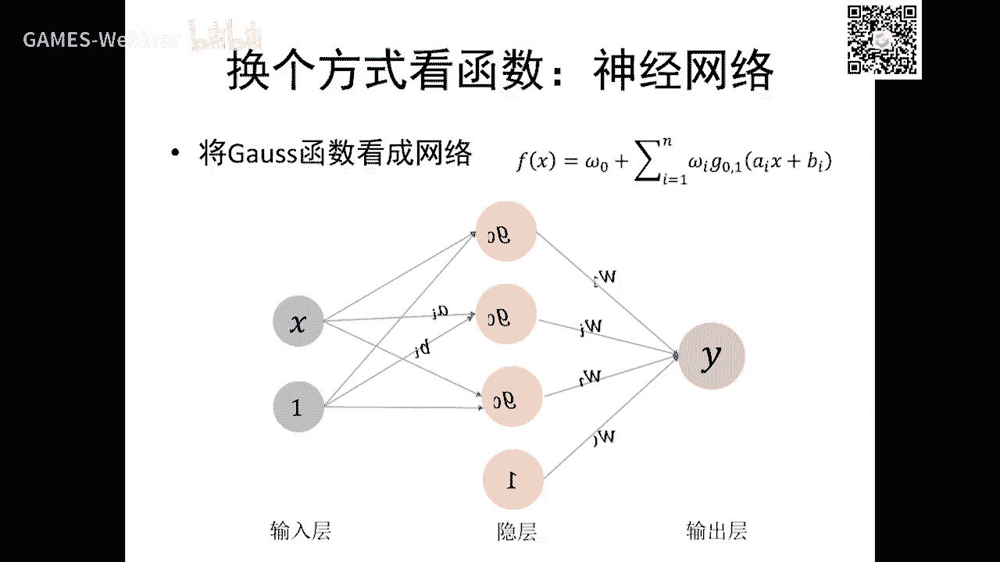

是不是。

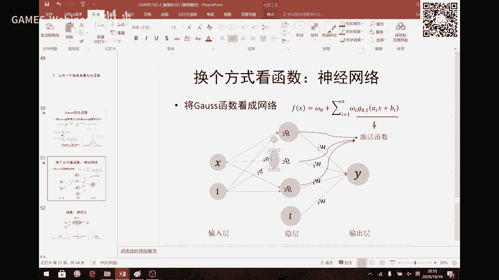

我这里不知道是发生什么问题，好没有关系好，我们倒过来了，修建一下，我就还在继续啊，我可能也不，这个地方是ai，这是di，这个地方就是这个g01 ，这里都是g01 ，这是w e w w n w i。

这是w0 ，好，这样中国的一些变换组合就得到我的r b函数据和我有关系，由于它们就当成一个空间，我用这样一个函数形式去拟合，我好，那你可以我的数据啊，这个形式啊看成这样一个图，这个图大家应该都见过了啊。

就是网络网络什么呢，每个地方都是用同样的东西，都是一个机灵摇啊，基于零幺，就是那个那个那个高高三函数是吧，我把它看成一个二维，实际上就是一个极坐标概念，就是咱们这个认为还有个平移是吧。

同学里面文法平移也变成一维，就变成矩阵相乘啊，这就一个非常大的技巧，叫就叫叫叫叫提示坐标啊，啊你也可以把它叫做平移号x去乘上一个，再加上一乘上一个这个这个这个这个这个这个b一是不是a一加b好。

就把这个值呢把它带进去啊，这这两个呢就是这个这个和a1 b一跟这个x一将是点成一乘，以x加b一乘一就在这里，所以这里每根线上面有一个全a1 b e好，对这个这个dd来讲，就是a i b i是吧。

就是a i b i a i乘x加b i啊，就是这里把它带到这个好，同样a n b n好，这里加完以后呢，在同在一起做一个组合啊，这个这个我的目标函数y f x就出来了。

那么这里还有一个还有一个五零百零是什么，就是它的一个平移，没关系，因为到到这位说的时候，你再把它变成骑士来来看，你就变成这样一个形式试图啊，虽然这个这个里面字符有点乱啊，这没关系，我刚才已经讲清楚了。

你可以看到我把这些系数a i d i，我们改这个网络里面的这些线上的一些权，我这个函数刚才讲的，我用一个单独的函数经过平移，组合起来就等价于中间同样的一个函数。

只不过呢这a1 b1 a2 b2 都是什么，都是对这个做了一个线性的变化，这个变化呢你可以把它看作是个仿制变化啊，就做什么就是啊成线性加平移现象给你嘛，这个这个再再做做一个提示坐标。

就就变成一个这个这个这个这个矩阵乘法啊，好我这个函数实际上就是这样一个网络，这个网络呢哎这里就对上了，经网络的增添这些图片呢呃美其名曰叫激活函数啊，规范函数就叫做计划函数。

a一乘x加b一乘一下就把他纸给激活了，上激活就把它带进去啊，只不过它的语言角激活，实际上这里也没法激活，就是就是就是带进去再琢磨出来啊，这就这个把这个函数看着适合网络形式啊，大家就诶好慢慢慢来啊。

等一下我们大家看啊，那么这里叫借款函数，那么那么这些全啊，这里面每一个线上的全呢就叫做这个网络的啊，这个全系数也叫网络参数，好我们回忆一下，我们听讲到这里啊，从从上节课讲到现在，每天就两个小时好。

那么这个函数我们以前碰到什么困难，这个n不知道有多少是吧，这里就对应了这里的节点个数，一来到你这里多少个，我也不知道是不是要调这个网络的节点数啊，当然调了文化的变量是什么呢，就是这些网络参数啊。

所以这就是一个神经网络啊，只不过这个网络呢比较特殊，我用的激活函数呢是一个高斯函数而已啊，所以这个网络也叫做rbf网络，也是这个数学里面一个比较经典的网络，大家好，理解这个以后的话。

你再去理解神经网络是非常简单的哦，那么这个这些这些直播的怎么了，就是好，这个神经元叫什么，我一个输入，当然我这里输入全是一维的啊，就是一个实数，没关系，以后呢这里高一点点点可以嘛，只不过多出来嘛。

这不管它好好，一尾跟40数一个一，这里有两个圈啊，那除了这个激活这个激活函数，那出来就得到一个啊，这个这个y y这边如果有11元，两个三个给它组合，这里这里面也是一个对接上来就形成一个盘式。

所以一个神经网络是什么，就是一个函数，只不过你这计划函数我这里是用高斯用一个扣三次，你你用别的函数可不可以啊，只要你这个函数平移加上伸缩天线无关，都可以造成含空间啊。

只不你这个空间是不是能够处理在整个函数中间处理，那是这个函数的性质，所以我们去找那些函数啊，所以净化函数好，高配函数的话就叫rbf啊，我们这里是啊，上次是一种特殊的bp方式，就是指优化过程中。

因为这个优化呢不是很难啊，不是很容易啊，为什么呢，你想想啊，你要这个这个这个误差项要对ai di去做做导数，a i b i是不是出现在在在这个指数里面，它的导数就变成一个高度非线性飞出。

大家都知道数数学这么多年发展，大家觉得他很很厉害啊，不厉害啊，一旦碰到飞出线性的函数，我们数据上没辙，他是最好的值啊啊这个大家都清楚哈，我这里稍微补补一补这个知识啊啊我我画到这里。

那个函数我还我还挺意外的，因为那个来看啊，这个函数很复杂啊，我我你这个函数待会它就在那里，但是但是导致我我也能求，但是你要求他的权利极小值，结果就这个玛雅这个这个是很难求的啊，没办法，因为它是凸的。

什么叫凸的，这函数长长成这个样子啊，或者是这个样子to的，这个当然好找了，我我一个点一求导下下降下降下降走人是吧，出什么表示它稳定，就是就是另外一个初值，你你你直接带总能试问到这是吧，那这个就不不定了。

好如果游戏不好，只找到了这跌跌跌跌跌在只能找到找到这样一个极小极小的这个解，所以呢现在数学上也只能去保证找到到局部抵消减全局最优解，没任何办法能保证啊，除非你运气太好，或者说你这个问题太特殊。

知道你这个初值就在这里附附近，允许好就找到一个很好解啊，但是往往啊你力气啊那么好啊，所以说为什么这个全局极小，这个这个问题是很难做，只能做到局部极小，这个技巧大家也很清楚啊，你要注意啊。

也不是什么初值啊，一定要根据你的问题经验，初次选取极其重要啊，一般问题里面找到权益技巧确实很难，但是你找到一个不那么差的技巧还是有可能的，之后你要对这个问题要分析，要用很好的初值。

你不能了解一抹黑什么什么变量全变成呃，全用初始值为零去去做是吧，你这个字根本就就就就就是在那在那随机的去去找出资，找找他那个绩效值，这是不对的，一定要找这个问题本身的意义，有物理意义。

早没有物理意义所对应的数值，那是最好的啊，因为至少至少有道理啊，好吧好唉，这里我想一个，所以说这个rp我网络我用这个rbf这个函数解释什么叫神经网络好，同样神经网络也清吗，没有什么呃。

这个这个难它就是一个函数，只不过是用一个啊这个激活函数去章程，当然一个函数通过一些构造作用一个函数空间是吧，你可以看到这个函数我就我就不念了啊，这个这个软路是这几年用的比较多的啊，我这里稍微解释一下啊。

数学本质是在去做做运合，只不过他们在呃把它解释成什么类似于神经什么的抽象，我觉得那个是很不严谨的，哈，扎去去去吧，我有空间好，那么都是递增的，递增的话你可以看到它什么它一平米那个平民啊，伸缩啊。

它就消费抵消了，因为你大的地方我可能小，我小的地方很大啊，就有这样一个性质，所以他呢就就能够完备了啊，这就是啊这个叫万能啊，这个这个毕业证啊，就是我定义我定义的一个推广围墙。

只是证明了这个波散啊这个真实空间能，所以函数，那么这个这个这个这个这个这个定义呢，能证明他这个这种函数能够毕竟所有哈，所以说你网络只要节点中国多。

你网只要只要只要呃这个这个这个啊技术主要说我我就有很强的，毕竟能力是吧，你给我数据，我就可以来逼近你啊，当然我这里先提一下，知道后面还会可以再再展开是吧，如果是一个高位的。

就刚才我说的就是刚才有个图还画了一下，在这里出现了好多x x一到x m好，那那那那怎么组合呢，那组合也也挺简单，就是每个分量成型，这个是做这个是x1 x n跟一跟这个这个全函数b做点击是吧。

就这个层它这个存款加起来就做这样做一个反复变换，诶，我一个多，那那个周围的一个一个点，也可以通过一个这样单变量的函数去装成一个函数，因为呃我这里还是讲函数函数形式是吧，好，我一定要问。

如果y也多个怎么办，y多可不是这y1 y2 y3 ，每个y都是同样的结构吗，对对我们后面下课就会讲啊，对就作为跟这个这个这个这个这个叫什么向量值啊，这个理解非常简单好，你们不要去觉得很是吧。

只不过就是你要把它分解，那为什么我现在还是强调在讲函数，把函数搞明白了，都为只不过是变量多了，这个这个呃就是多变量啊，那么那么下量词只不过这个弯呢是变成y1 y2 y3 ，每个y呢都是一样的东西。

怎么做，y2 t怎么做是吧，然后呢y一和y2 怎么办呢，哎这个网络共享基函数共享全职回去啊，性质就可以一样了，你只要研究一维就行了嘛，所以没什么难的哈，没必要你自己操作麻烦。

万一你用多项式机y你用什么什么什么什么什么打蝙蝠机，你不制造麻烦吗，这什么共享一下来激发激发能量，技术不一样而已是吧，所以很容易啊，所以大家不要慌啊，不要着急啊，我们先把函数形式把它讲明白。

好好这个多元我就稍微稍微啊这个多变量比较多元啊，那它值不值很多维的话叫叫向量值，就是只有很多维数啊，啊这个下周我会把它再把它剖析啊，那个如果你那个那个那个那个那个这方面你没理解。

那个后面理解起来怎么一上矩阵张量就蒙了是吧，矩阵和张量就是那些东西的一个表达方式去做，就是用来表达的啊，它它不是贫富产生的一个什么n乘n的一个东西，每个东西叫叫元素啊，里面有什么什么什么什么什么裂变换。

糖变换啊，这样讲应该应该从轻情变化来角度上讲，好吧好那么等等，那么你不变量的话就是函数是表达这个样子啊，你这这也是函数哦，啊只不过是这里有很多变量啊，那么我这里提一下那个呃，下节课可能还会展开好。

那么不成啥意思，不成就是生嘛是吧，生好这个这个组合组合成一层，这是不是最最层我就可以给它给它变成一个积极形式，就可以给他接，这时候他就是一个新的维数的一个细心的这个这个词嘛，那我也可以接啊。

那么这个又是网络，可能又可以网络键啊，网络你这里接100l就是对100 100分的网络，那么从我本质上来讲，这就是一个啊，这就是个函数，这个函数只不过函数怎么相互的符合了吗。

复合你没有把它表达成这个样子，就表达了矩阵，所以它整个整个过过程已经基本上全是一个线性变换啊，就是啊就是那个呃这个这个这个现金这个啊这个相乘啊，所以这个函数啊也可以自己去选啊，基函数你每一层选的不一样。

可不可以呀，当然可以的，但不利于你去优化呀对吧，所以一般人们就所有就是用一个啊，然后呢这个这个这个有些为了减少这个规模，因为规模就是这些啊，这这这些网络中的这个权啊，这你想想这个圈这里有100个。

这有100个111交叉乘100x100就1万个变量了，就是指一层的这个节点个数啊，这个呃就这个变量一下的膨胀，变量膨胀什么意思呢，它的就不告诉你以后能力就比较强，所以说用用那个深的就会比这个宽的啊。

是要来的好一点好好，它本上你把它理解成一个你把函数的这些东西去理解，他的一些这个这个这个这个方式就很容易理解啊，那么为什么要要要那个去调参，就是调这些函数空间啊，结构就是空间啊。

那里面的这个参数个数就是它的自由度啊，那么为了减少自由度，要对这些这些这些参数进行什么共享啊。

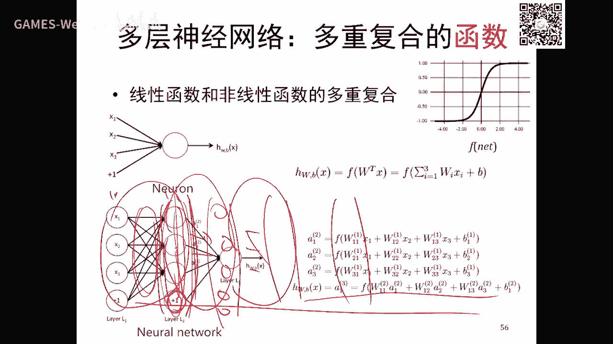

啊这样就会减少这个变量好，甚至本身的函数，那么里面有大量的参数参数，就是这这里面的全我给了一些变量啊，他给了一些采样点，你要联系求这个西西塔，这个说起来以后，你这个网络就出来了，玩出来了就函数出来了。

就你和函毕竟目标函数是不是跟我们一样。

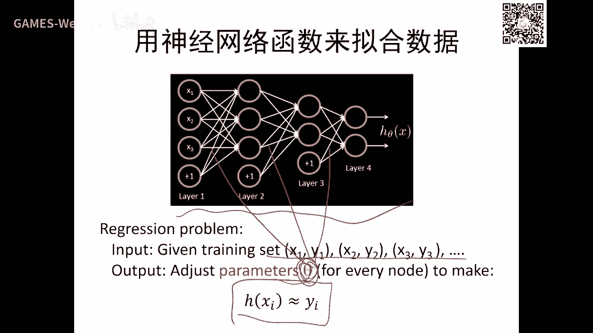

三部曲，那么那个那个为什么他work啊，就是我刚才讲了是吧，你只要只要足够深好不就足够多，就是这个足够多，然后呢这个变量值啊也也也这个足够多以后，那么这个可以毕竟所有函数跟那个west x电源一样的好。

那么我就讲一讲好，这样我们这节课多来，请问你会碰到什么问题啊，啊这个数怎么选不好选吧啊误误误差怎么定啊，这个这个也靠经验嘛是吧，并没句话怎么办，也没靠自己啊，这个这个去去建模啊，如果是非线性的话。

就不好优化，你你老老实实啊，要有一些这种方法去去搞啊，所以同样问题，这个就在这里啊，挑战啊，听明白了吗，所以所以所以呢哎哎呀这个反正这个本质量也好，以后你去再协调。

你就知道感觉了啊啊那么呃大家也不也不用去自己去实现这种优化器，像神经网络啊，这基本基本learning市场很乱，就在说句话，只不优化了，没办法，就是bp叫什么叫梯度下降法。

只不过呢他把多层的这个优化变成一层一层的减啊，就就减少规模啊，好程序方法，我们再一起来回顾一下啊，是什么，首先问题是有些问题呢，你可能端到端挺难搞什么，我中间搞一些啊，我先做影射再做影射，再做影射。

这个影射叫叫吉连对吧，有些呢哎我这个影子不够，我这里在隐射过来，再隐身过来，是你先怎么搞些花招好，要把每个镜头都变成一个网络，为什么它统一了所有的函数表达，就一个函数就表达所有东西嘛。

哦我们在以前的话要去想到底有多项式还是用高斯，还是还是用三角函数，这这是这是这是根据人的感觉经验相关和位置相关，它这里呢就什么啊，这个很暴力啊，就用一个函数全全考，所以你里面你想要反思啊。

原来这个就像我希望周边给给他，给他给他平均一把好，那么这个颜色呢就是一个特殊隐私，叫卷积啊，我那这个像像素呢跟周边是平均，那就先抹掉一些噪声好，那么这卷积完以后呢，我再去搞，这个是想降维是吧。

我觉得大家是变成562，所以说所有的不管不管他怎么变换声音也好，是什么什么呃，这个不同的网络也好，都是在我眼里，就在我们眼里面都是函数，只不过函数变换它有一些地方是有意义的啊。

就你的任务就是怎么去设计啊，倒是有网网络函数是吧，网络加一个片片很很大，如果容易造成过核啊，那么网络简化是吧，什么什么什么减脂啊，找找哪个就是损失函数加各种各样的惩罚，加按正直下啊，那么你这里面哪一个。

如果中间呢有一些所谓的特征，你知道它的几何意义，那么他又给他加一个惩罚项，或者或者叫做正则项，那么最后的误差肯定正常下对吧，所以你可以看到任何一篇文章拿来都在做这个事情啊，网络就是呃就是调嘛道理的啊。

真的说不出道理，就是你只有些事，你这个这个采样样本足够多，我就去你和你这个这个这个现象是吧，好不靠运气好，你是不是只是吃的好不好，你看右边这张图，同样是那个那个那个求解最小值，你看看不同的颜色。

不同方法，有些人很快，有些人在上面在，再再再那再让这个这个这个这个这个这个摆一摆才才才下来是吧，所以你你去调这个这个参数要有耐心，当然也要有直觉，你有直觉跟没知觉，调到这个是不一样的，好。

那么下下周呢我想这个呃呃，我们会进一步展开，有这些时间已经呃这个这个这个快快到了啊，然后呃下周呢我们会进一步讲这些东西好，那么我们再花个十分钟讲一讲这些主要情况。

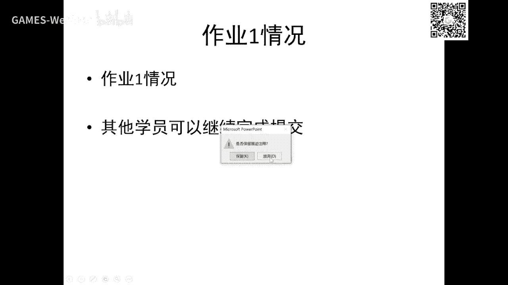

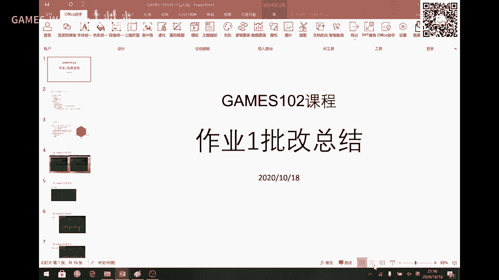

加德兰是今天早上啊，上次昨天晚上是吧，因为这里面用的是标准时间，我们是北京是东八区，所以他是早上八点啊，这就这个没关系，反正我们发了以后才才才才来改啊，这是我们经过三个三个助教啊，这个这个经过一天啊。

唉这个经过一天，用肝来把大家作业给给批改完了，好那个也谢谢大家，应该把这个作业做完了哈，好像是这作业比我预期的多啊，我以为只有三四份额，这个这个这个只是只是那个交流有56分啊。

当然很多同学可能有些有些经验啊，做的挺好啊，那么有些同学可能一次做啊，这个也竟然能够接近啊，在同学们的学术学历呢，群里的发挥下做完了哈，我们要求我的呃，这个很明确啊，你可以看到嗯。

嗯如果在我们科大上课呢，我可能会统一来教大家用一个框架，这样我也好感，但是在网络上这种a tv，你看因为我们也很不好的人学会了我们的这个这个啊叫无忌框架是吧，唉有些呃少部分是我们科大的同学啊。

还有很多同学用matlab写好，拍照一些啊，拍拍on也挺好，还有一个用太极可能是201课程的啊，这个学院啊来过来啊，就非常好，还有一些用其他环境，我觉得都都很好，没有没问题，大家本身就是那个多样化。

因为你擅长啥你就用啥啊，就像武林高手啊，这个这个也不要什么都都会，什么都不精啊，这个这高手一定是精通一门武器是吧，这个这个少林寺和尚用棍用用了极致啊，这个武当用剑啊都可以，只要你抓住抓住一个语言。

把它精通就可以了啊，不要啥啥都啊，上个学就是啊，就像天龙八部里面王语嫣啥都懂，就啥啥都不会是吧，对这个好那个呃坚持用，就是你们觉得哪个做能做好就用哪个啊，所以我们都能改好，这作业呢。

这个总体上达到了要求啊，这个这个还有同学说能不能再教，没问题，我后面会再开放出来，好那个呃已经有同学看到没有，已经有同学把这个系统啊当作当作参数去去调了，因为他发现尽量靠经验取不好取嘛，是吧。

一啊这个0。1这个这个这个太瘦脸吃太胖啊，这个所以他把它当做当做那个去去调参挺好，他他也做了个ui啊啊那么这些呃就现象我就不解释了。

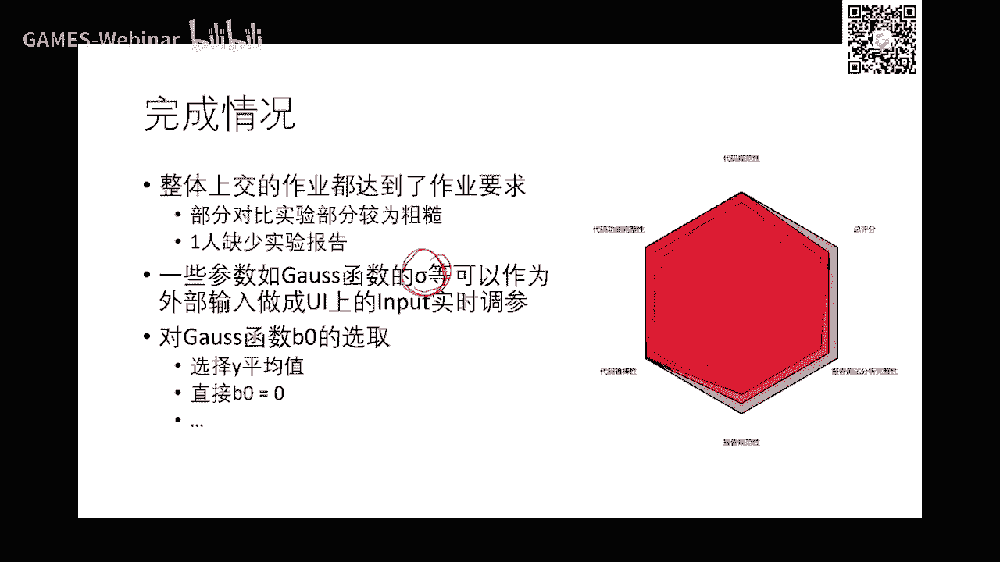

那么那么现在再来看这些现象啊，学这个同学们啊，你们上周的那些困惑，那些迷惑啊，那些不安啊，这个今天你们基本看都能找到答案了啊。

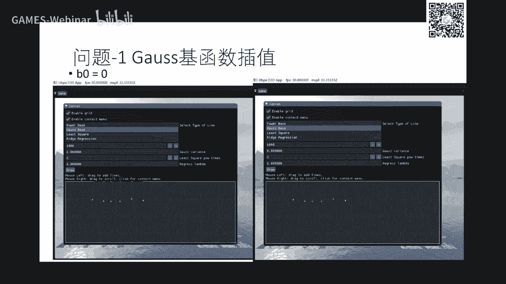

为什么出现这种现象啊，为什么是这样啊。

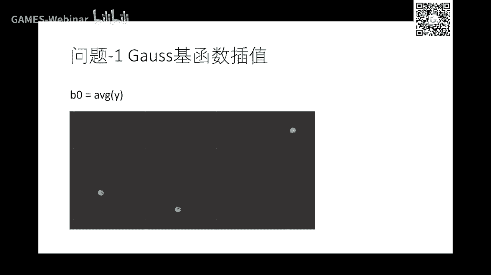

然后现款选一，为什么这样，尽管选5。5。039啊，十点一零二二十是吧，哎为什么这样啊，我已经讲明白了好那么只不过你现在是调的嘛是吧。

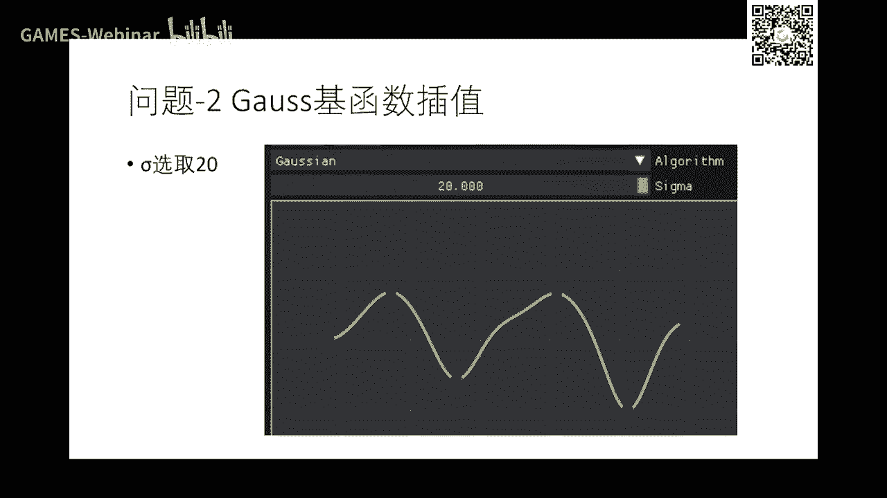

然后六个点好好，这里面呃这个同学这个这个时刻点就是公式的是吧，已经出现了融合现象是吧，为什么我刚才解释了，因为不想死，他那个换什么行列式是吧，这个次数有的次数高，它的这个啊这个叫条件数急剧上上升啊。

导致人物形象，所以非常适不适合，内积不是个好的技术，你要用国产机比较稳定，有同学用了你你也做了，你回归是吧，呃当然呃这个大家也没有必要自己去写个画，你可以调mac mac的零化器。

你谁家也可以去去叫lp对吧，所以这个大家来这个只要能解决问题啊，就这个这个就是好啊，工具啊，这规定啥都要写是吧，因为有一个就是呃观点也是，我也是不知大家就是有这你要用就把它用起来啊，不要重复造轮子啊。

我们要解决我们的问题啊，兰大等0。010。1啊，这些可以看到就是这个这个越来越小啊，然后呢我这里还有想想给大家演示一个比较好的一份这个报告。

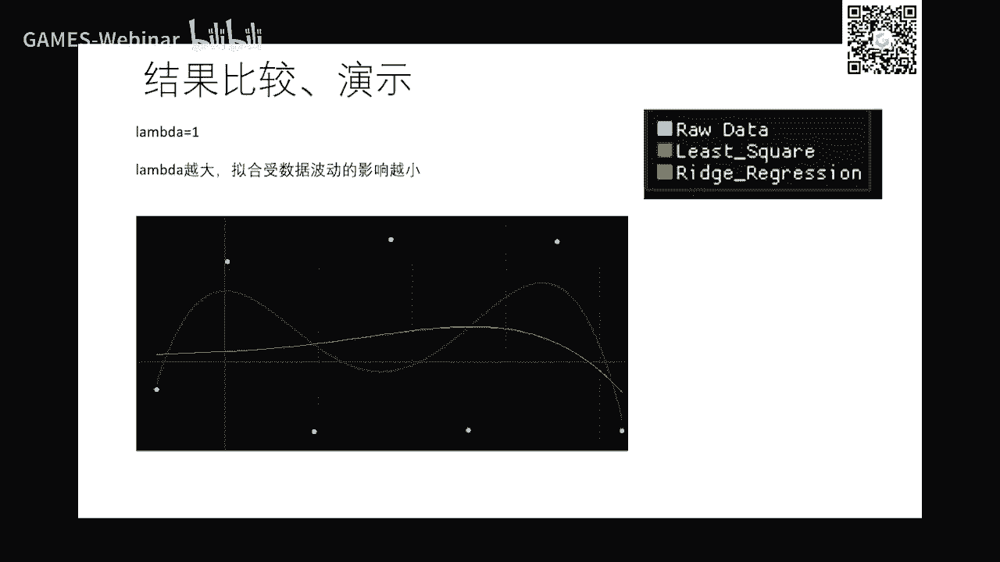

他没有用真名啊，叫lt lx t有点像方程组嘛，l x就是一个矩阵乘以一个变量等于等于t啊，那我不知道他是名字缩写还是啥啊。

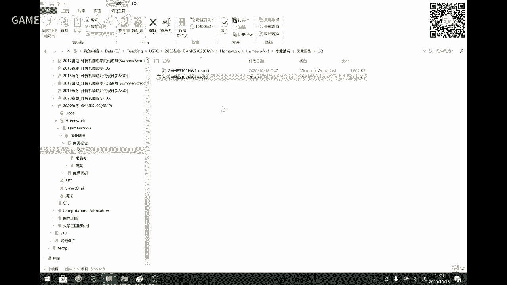

好来看一下它的一个video，就他的一个作业的啊。

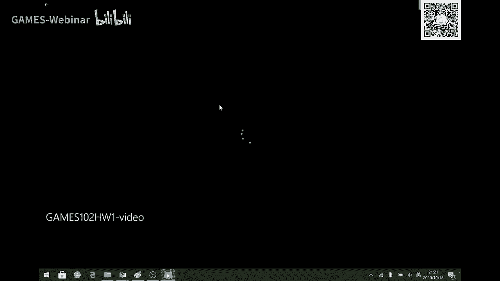

这这个同学写得非常好，可以看到他点一个点就能够马上算出那个插值函数，它现在是用的是pomial fin啊，左上角好改成高斯啊，高斯发现呢全西格玛不对啊。

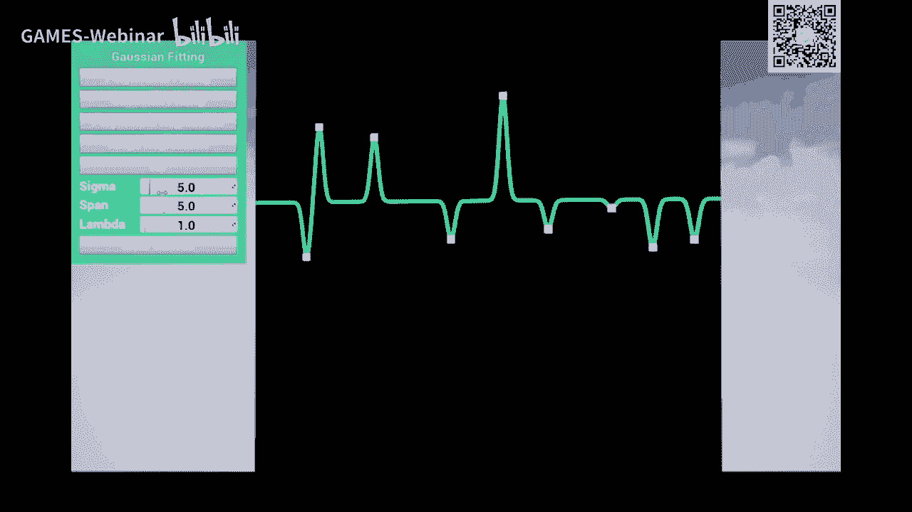

他只调到28 36啊，调调的可以可以不断调是吧。

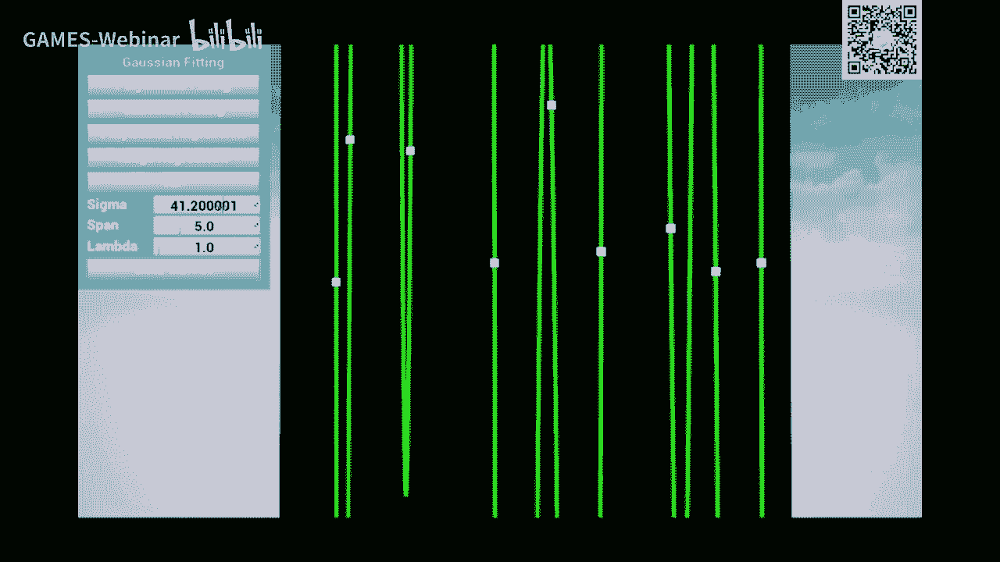

然后发现这个特性调到40。

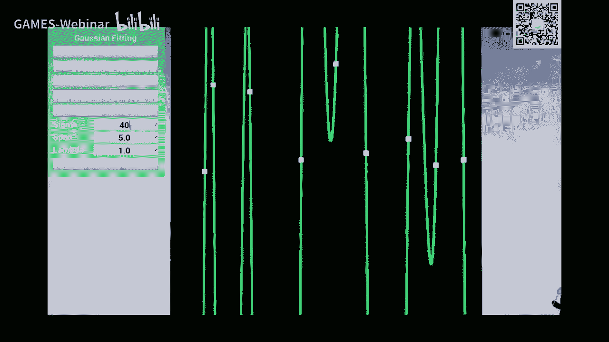

将这个号大概试一下pom，你也看看这个这个spam，即便自己mac参数，这这是又用了你回归哦，这次调的那个拉达啊，他做了一个非常好的ui啊，这个界面。

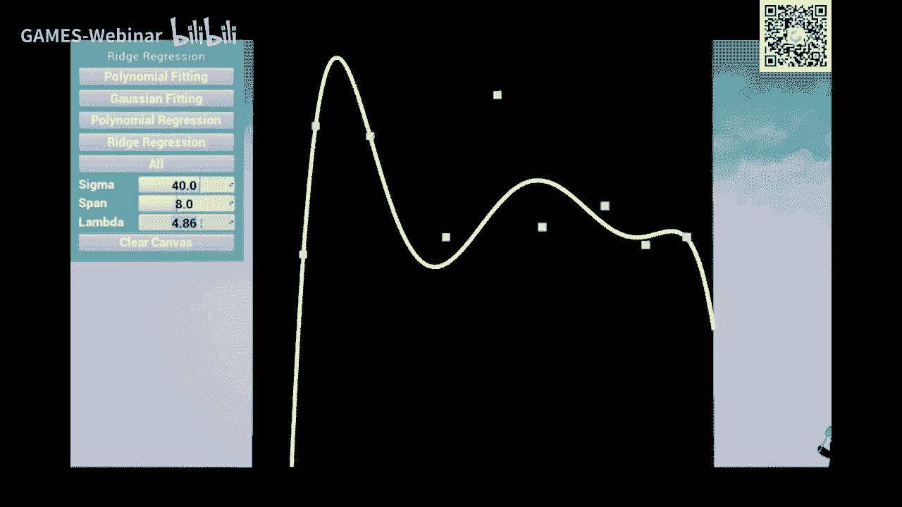

然后来看各种函数的性质是吧，然后可以诶可以把所有方法都放在一块儿啊。

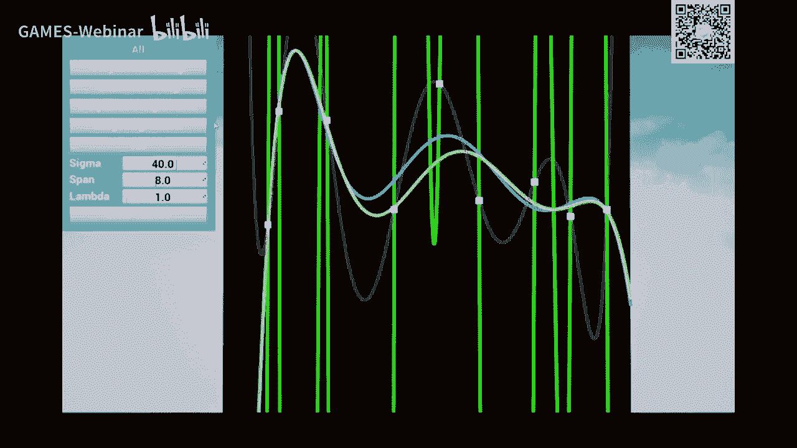

来来来看看这些这性能好，也可以在实时的增加一些交互点啊，然后所有函数性质，你看这函数最有道理，但是也好有坏是吧，好那我们这样调有什么好处呢，我能看到结果啊，有没有想有没有看到我在看到结果。

如果你是个100为1万为100万的数据，再来调啥呀，你能看到的就是那个lost function的词，这个图里面有绿色的跟或者红色跟蓝色的这个风险差不多，但是显然绿色显然这个蓝色的比红色要好。

两眼一抹黑，啥也不到是吧，那你就继续去调，有些可能你调个一个礼拜你都不调，不调不出来，为什么你如果它它的本质或者这个函数向量的方向啊。

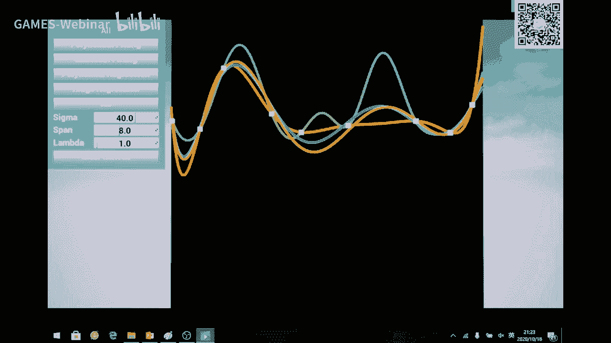

这些问题你就可以调出来啊，还有一些这个报告也挺好，嗯，这个同学报告，那他把这个拟合的专业差值啊，都还差值啊，比我写的要详细，都把它推导出来了啊，然后他按这个编程去做了啊。

我觉得这个后面我可以用他的这个东西来放到我ppt里面去啊，挺好啊，谢谢嗯嗯并且他也付了这个源码好，所以这些呃我分别分别选了那个。

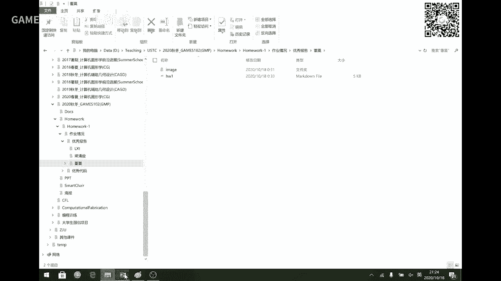

选了那个三份同学啊。

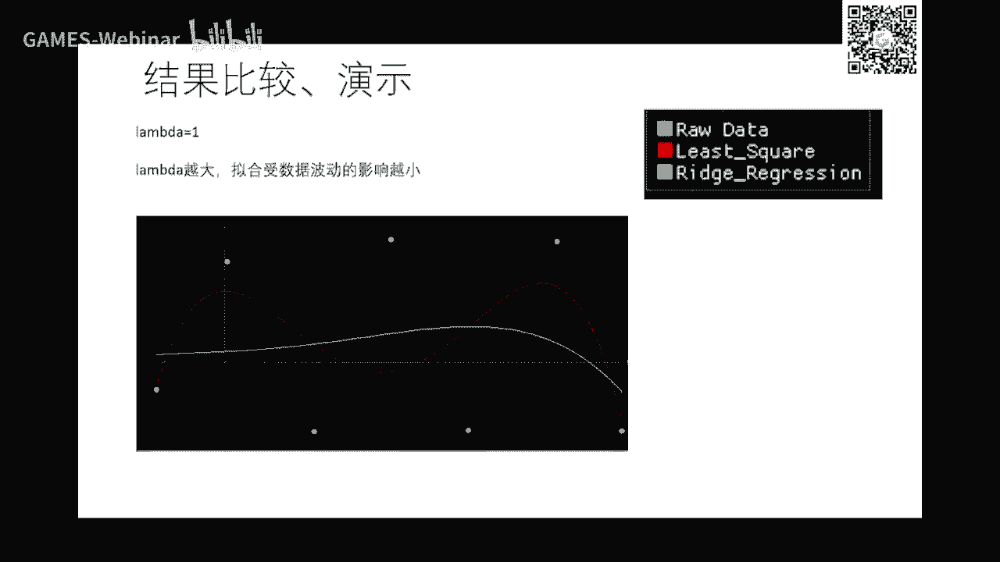

这个叫做优秀代码啊，还有优秀报告啊，我会挂在我们的网站上，大家去下载啊，相互参考啊，那么最终就是这个这个学校过的人，我也呃呃也也不清楚，没关系啊，那我想games也是一个开源社区。

开源的文化也相当于是相互帮助好吧，也谢谢这几个同学愿意分享啊，他们的报告跟代码代码c加加也有，好像python也有，所以呢呃也这个呃适合于不同的这样一些学生啊，这个一些背景好吧。

所以等下可能呃等下课结束之后，我会整理一下这些报告哈，代码啊也非常到给大家。

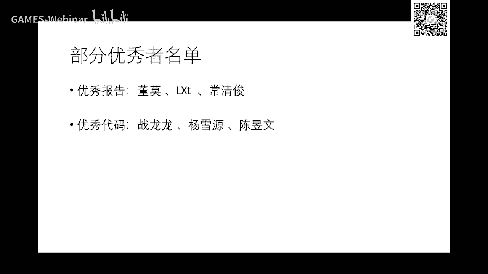

大家如果有些兴趣可以去继续下好，可以去参考。

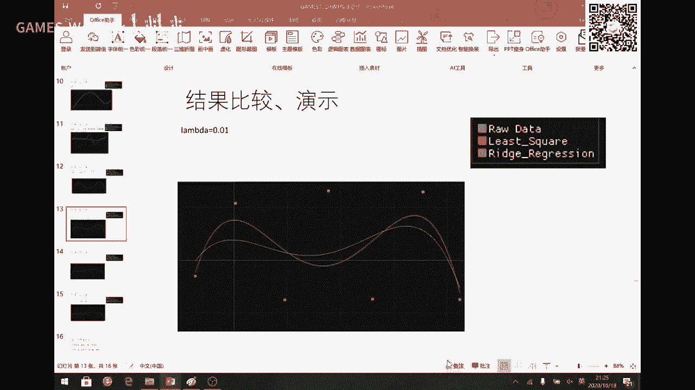

但是如果你们要补交作业啊。

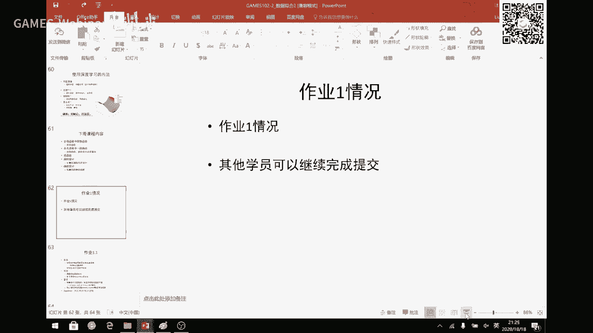

这个作业啊，这这个做作业，因为我可以继续，我们会看那建议啊，如果只是抄啊，这个反正我眼内对里面有非常强的约束是吧，这个这个嗯抄作业只是自欺欺人是吧，自己不断提高啊，这个我也希望通过这些啊这个设计啊。

我们专业设计我还是经过一些考虑的啊，那个能够帮助大家爬到上面去，我们一步一步爬好，没关系，每一步都不难啊，为什么上次我就敢不止这个东西，因为做作业就是垃圾的东西啊。

只不过很多人啊这个呃被留在了深深的记忆里面啊，我就把你捞回来是吧，然后呢捞回来以后呢，慢慢的知道这样降一些这个这个原理啊，有利于后面做人的工作，好好今天第二次作业来了，这个作业呢也没多少啊。

这个也是上次作业的一个延伸，这作业呢让大家觉得练一练啊，这个叫做神经网络啊，ibf c g网络呢因为是非线性，所以呢他也记到一个优化优化，如果自己能写一些简单的优文化啊，这个可以自己写好吧。

还是因为主好吧，别先先别搞中周围好，他就是个这个方法，我们前面也也做了一个方法，你再做个笔比较看看啊，就是要让那个六根，让六跟那个比啊，这个这个这个是这个西格玛要变啊啊就是这个啊。

那么这个网络啊好另外一个呢就是你可以用这个c这个mod啊，这种传统的就是啊这神经网络诶，你把它变成因为你去用城市服务的优化去去去去去拟合，你不要去搞，没有问题啊，就右尾啊。

然后你也把它当当这个方法去跟我们的文化做比较好吧，就是啊所以1。1呢走得快的同学呢可以再往前走一点啊，把这个网络的一些工具，像每个太阳的这种殖民网络框架，它都是一个非常好的优化器啊，因为把它设计好了。

里面给他，他就帮你优化，还有当然你要设好那个lost function，lost这个函数，这个这个啊要定义好吧，然后然后呢，当然我们推荐你还是同学们咬咬牙还是学一学这个框架。

因为这个框架呢是为了后面这个网络来来那个啊设计啊更方便，虽然它有些局限windows啊，v2019 啊，还有要求啊，这个大家如果能学学，如果不如果实在是机器或者是这个这个这个这个硬伤啊，或者是不匹配。

你能用其他的框架也没问题好吧，但是现阶段啊可以尝试用一下啊，时间仍然是礼拜六晚上好吧，礼拜六晚上，那么要不要还是维持东八区啊，还是说变成美国，那变成那个啊历时期就是12点结束了啊，那么看到东八区嘛。

反正还有晚上八小时，可能有些同学愿意晚上再再再再再再再努力吧，好吧好，如果没有跟上的同学，还还还在第一个啊作业的同学或者第一个第步的同学啊，你们可以再继续教我们，这个还是会继续开放好吧。

如果你们需要我们的助教再帮你看一下，也是帮你看看，这也不也不用再看了，为什么呢，你我们都有这些参考代码，我没有参考代码，也就是参考文档啊，你们可以去朝着这些目标去去逼近，好不好，最后剩下一分钟。

我看一看平台上有没有固体啊，问题有几个啊，我看看50天我就回答一下，有同学说分数怎么判定关注关注我们有三个两个维度和一个代码，一个是报告好吧，因为我们就是两位作，所以大家就在你教的同学呢。

在大家在那个什么你都能看到你的分数啊，我们都改完了啊，那我们三个助教也很也很辛苦啊，呃那个你随便问样条样条啊，别着急啊，那个就来了，好亮条，你想想啊，我我就给我启启发。

我们这里所有函数都是全局函数对吧对吧，动一点他就要动来看这个这个这个容易把它变成举动了，我那个对方我这个点的地方呢，这个啊这个数据摆一摆，有别的地方不影响啊，这样是不是会更好一点是吧。

这就是我们在做这个样条，我发一样条的这个初衷，好好好，很多同学说终于明白神经网络在干嘛，从网上就在做这个事情啊，只不过只不过那个领域的人把神经网络变成了一个一个，我老是为了一个抽象，然后从那个角度上看。

我个人觉得他是非常不严谨的，数据上他就是个好地说，只不过这空间你说能力非常大而已啊，他好像今天天呃比较比较问题比较少，好的，如果还有问题的话，你可以在我们有有很多方式可以可以来提问的话，bbs啊。

qq啊，甚至在vk群，你甚至可以去我们去叫是吧，对这个这个单独给他们啊，这个交流都可以。

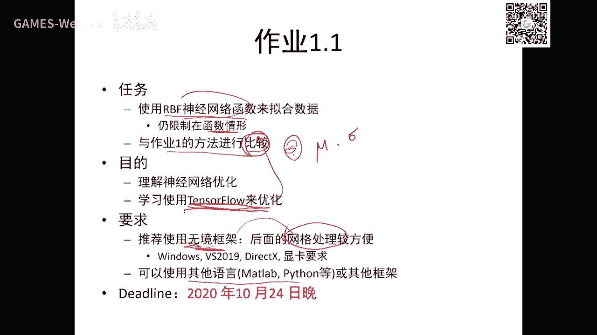

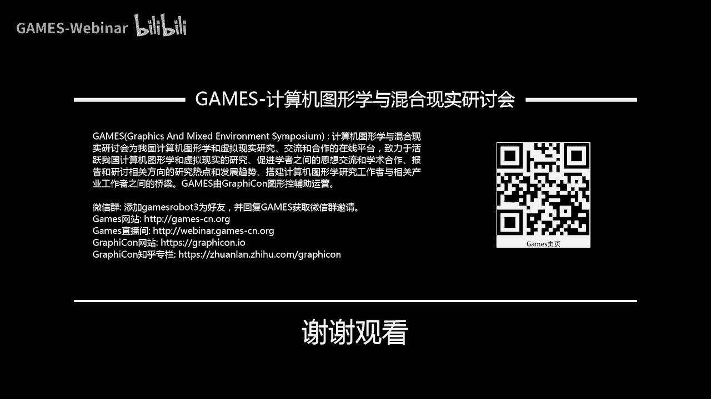