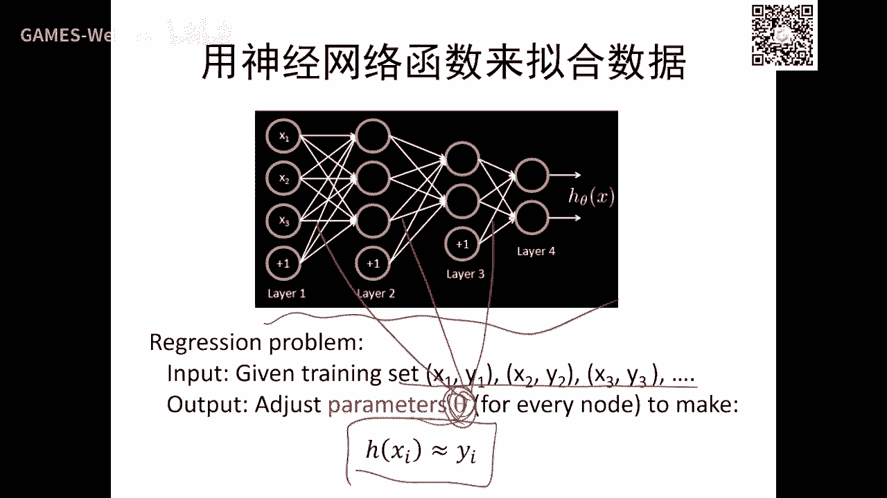
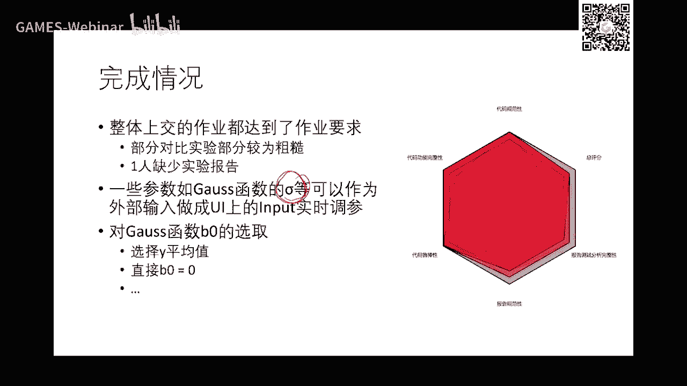
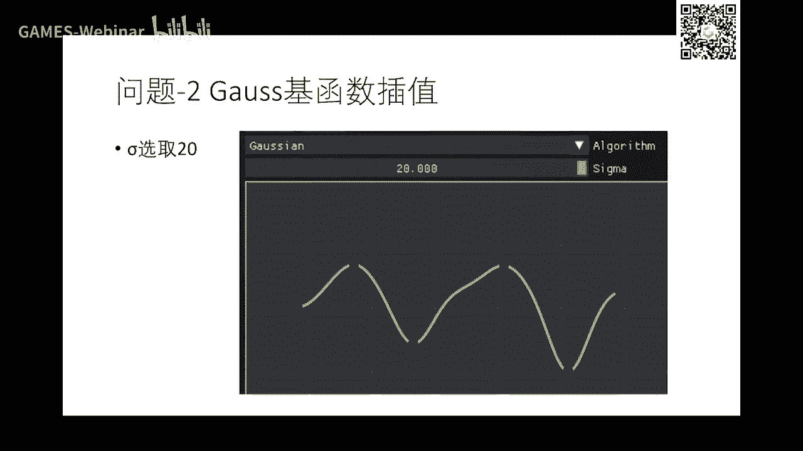
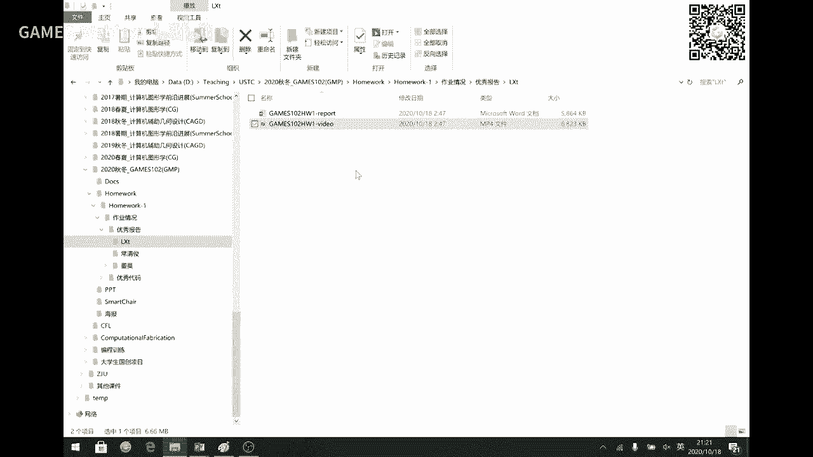
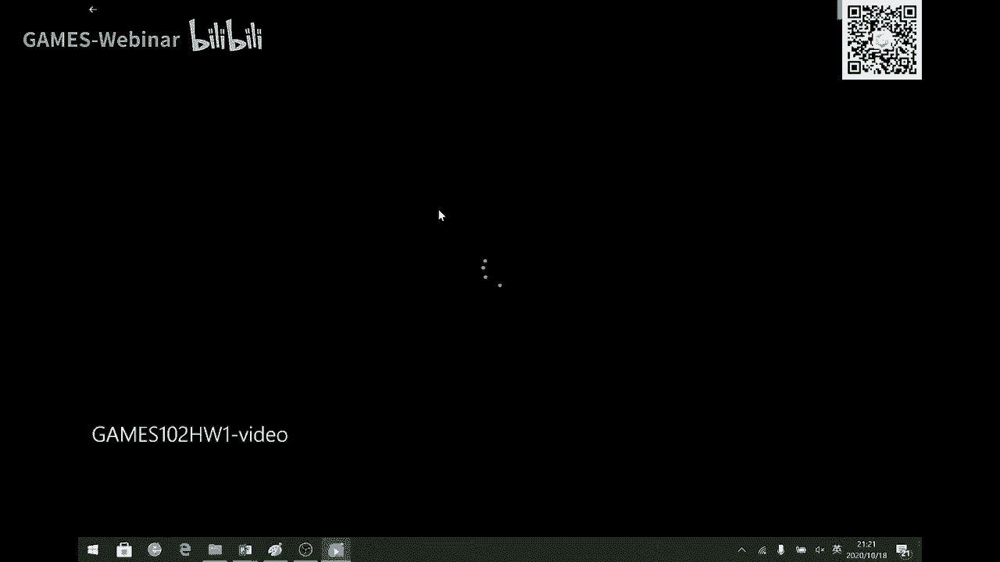
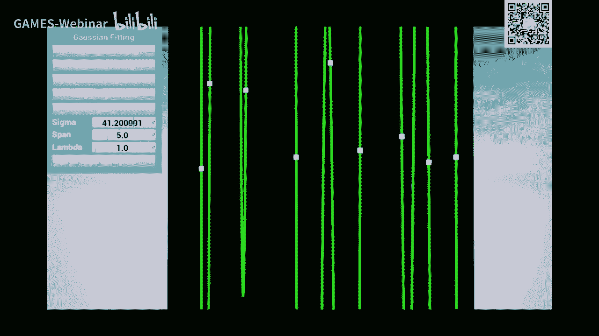
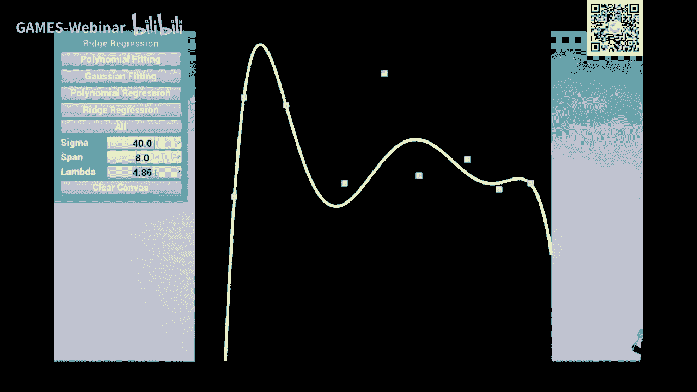
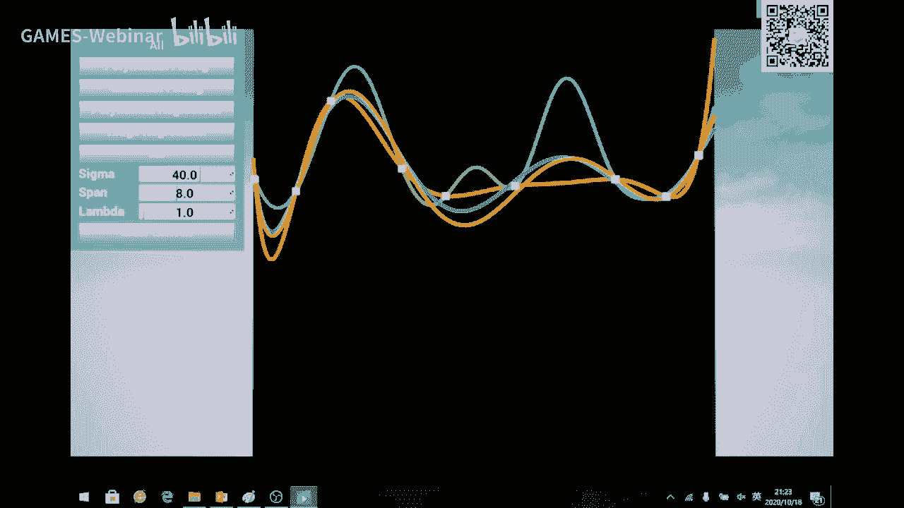
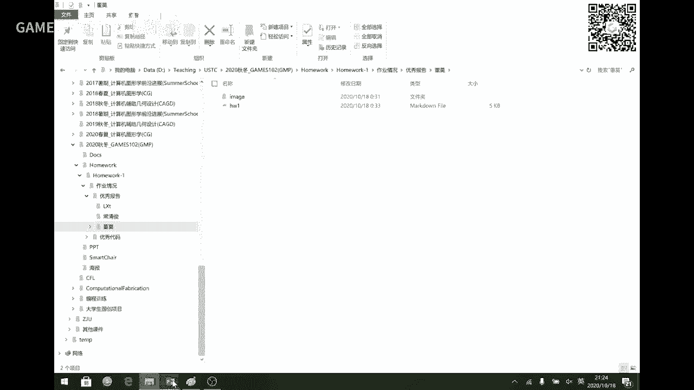

# GAMES102：几何建模与处理 - P2：数据拟合 📊

在本节课中，我们将继续学习数据拟合的核心内容。我们将回顾函数映射的基本概念，深入探讨如何寻找一个“好”的函数来拟合给定数据，并理解函数拟合的三个关键步骤：定义函数空间、设定目标函数以及进行优化求解。课程将涵盖多项式插值、最小二乘拟合、径向基函数（RBF）等经典方法，并揭示它们与神经网络之间的内在联系。

---

## 回顾与引言 🔄

上一节我们介绍了函数拟合的基本框架。函数映射，即给定一个输入 `x` 输出一个 `y`，是我们分析的基础。目前我们限定 `x` 和 `y` 为实数，未来可以推广到向量、矩阵甚至张量。例如，一张图片可以看作一个矩阵，因此映射函数可以推广到高维。

我们面临的核心问题是：给定一组 `(x, y)` 数据对，如何找到一个函数来拟合它们？这个过程分为三步：
1.  定义什么是“好”的函数。
2.  确定从哪个函数集合（函数空间）中寻找。
3.  通过优化目标函数（通常是求梯度）来找到最佳函数。

理解这个框架后，我们就能更好地处理更复杂的拟合问题。

---

## 函数拟合的目的与挑战 🎯

我们为什么要进行函数拟合？给定一些观测点（离散数据），拟合一个函数主要有两大好处：
*   **压缩存储**：用少量系数存储复杂函数，代替存储大量原始数据。
*   **预测**：有了函数模型，可以对新的输入 `x` 预测其输出 `y`。

然而，定义一个“好”的拟合函数并非易事。以下是几种常见情况及其挑战：

以下是几种常见的拟合思路及其优缺点：

*   **分段线性插值**：用直线段连接所有数据点。误差为零，但函数不够光滑（仅 `C^0` 连续），在连接点处不可导，不利于后续数值计算。
*   **光滑插值**：寻找一个经过所有数据点的光滑函数。但若数据含有噪声或异常值，强行插值会导致函数扭曲，预测不可靠。
*   **拟合（逼近）**：允许函数不精确经过每个点，但要求整体误差较小。这种方法对噪声和异常值有一定鲁棒性。

绝对好的方法并不存在，选择取决于具体应用场景和领域知识。如果对数据背后的规律一无所知，拟合将变得非常困难，通常需要反复“调参”。

---

## 拟合方法论三部曲 📝

寻找拟合函数可以系统化为以下三步：

1.  **确定函数空间**：我们需要限定函数的搜索范围。通常，我们将目标函数表示为一系列基函数的线性组合：`f(x) = Σ λ_i * φ_i(x)`。问题转化为求解系数 `λ_i`。基函数的选择至关重要，它决定了函数空间的表达能力。
2.  **定义目标函数**：我们需要一个标准来衡量函数的好坏。目标函数通常包含两部分：
    *   **误差项（Data Term）**：衡量函数预测值 `f(x_i)` 与真实值 `y_i` 的差距，常用平方和 `Σ (y_i - f(x_i))^2`。
    *   **正则项（Regularization Term）**：对函数或系数加以约束，防止过拟合或得到病态解。例如，惩罚系数的大小（L1/L2正则化），或惩罚函数的高阶导数（控制光滑度）。
3.  **优化求解**：在设定的函数空间中，寻找使目标函数最小的系数。对于平方误差这类形式，求导后可化为线性方程组求解。对于更复杂的目标函数，可能需要梯度下降、牛顿法等优化算法。

---

## 多项式插值及其问题 ⚠️

用 `n` 次多项式 `P_n(x)` 插值 `n+1` 个点，可以通过求解范德蒙德方程组得到系数。拉格朗日插值法和牛顿插值法是两种预先计算基函数、避免重复求解方程组的技巧。

然而，多项式插值存在显著问题：

*   **病态问题**：范德蒙德矩阵的条件数随着点数增加而指数级增长，导致方程组对输入数据的微小扰动极其敏感，求解不稳定。
*   **龙格现象**：使用等距节点的高次多项式插值，在区间边缘会出现剧烈的振荡。这是因为幂函数基 `{1, x, x^2, ...}` 在高次时数值性质很差。

因此，高次多项式插值在实践中并不常用。

---

## 更好的基函数：伯恩斯坦基 ✨

同一个多项式空间可以用不同的基来表示。伯恩斯坦基函数是一组定义在 `[0, 1]` 区间上、具有良好数值性质的基函数。

以下是伯恩斯坦基函数的关键性质：

*   **非负性与权性**：`B_i^n(x) >= 0`，且对任意 `x`，`Σ B_i^n(x) = 1`。这组基函数可以看作一组“权”。
*   **数值稳定性**：用伯恩斯坦基表示的多项式，即使次数很高（如20次、50次），也不会出现龙格现象，计算稳定。
*   **几何意义**：系数可以视为控制顶点，调整顶点位置能直观地改变曲线形状，便于几何设计。

基函数之间的变换由矩阵描述。选择数值性质优良的基函数，是获得稳定算法的基础。

---

## 径向基函数（RBF）拟合 🎯

径向基函数是另一种强大的拟合工具。在一维情况下，最典型的RBF是高斯函数：`g(x) = exp(-(x-μ)^2 / (2σ^2))`。

RBF拟合的核心思想是：在每个数据点 `x_i` 处放置一个高斯函数（或其他RBF），然后对这些基函数进行线性组合来逼近目标函数：`f(x) = Σ w_i * g(||x - x_i||)`。

以下是RBF拟合中的关键点：

*   **参数选择**：高斯函数的中心 `μ`（常取为数据点 `x_i`）和宽度 `σ` 需要设定。`σ` 过小会导致基函数像脉冲，拟合曲线不平滑；`σ` 过大则过于平滑，可能欠拟合。
*   **稠密性保证**：理论上，只要使用足够多的高斯函数，其线性组合可以逼近任意连续函数。
*   **与神经网络的联系**：将上述 `f(x)` 的表达式稍作变形：`f(x) = Σ w_i * g(a_i * x + b_i)`。这可以看作一个单层神经网络：输入 `x` 经过仿射变换 `a_i*x + b_i`，再通过激活函数 `g`（此处为高斯函数），最后加权求和输出。这里的 `w_i, a_i, b_i` 都是可学习的参数。

因此，RBF网络是一种特殊的神经网络。优化这些参数是一个非线性优化问题，通常只能找到局部最优解，初始值的选择非常重要。

---

## 神经网络的函数视角 🧠

从函数拟合的角度看，神经网络就是一个复杂的函数 `f(x; θ)`，其中 `θ` 代表所有权重和偏置参数。

*   **万能逼近定理**：只要神经网络具有足够多的神经元（即足够大的容量），它可以以任意精度逼近任何连续函数。
*   **本质**：神经网络通过多层线性变换与非线性激活函数的复合来构造复杂的函数空间。训练网络就是寻找最优参数 `θ`，使网络输出 `f(x_i; θ)` 尽可能接近真实值 `y_i`。
*   **挑战**：与所有拟合方法一样，神经网络也面临如何选择网络结构（层数、每层神经元数）、如何设置正则化防止过拟合、以及如何有效优化非凸损失函数等问题。

卷积、池化等操作，可以理解为在网络结构中引入了具有特定物理或几何意义的函数变换（如局部平滑、降维）。

---

## 课程总结 🏁

本节课我们一起深入学习了数据拟合的核心内容。

我们首先回顾了函数拟合的三部曲方法论：选择函数空间、定义目标函数、优化求解。然后，我们分析了多项式插值的局限性，如病态问题和龙格现象，并介绍了性质更优的伯恩斯坦基函数。

接着，我们探讨了径向基函数（RBF）拟合方法，揭示了其通过基函数的平移与缩放来组合逼近目标函数的本质，并建立了RBF与单层神经网络之间的直接联系。

最后，我们从函数拟合的视角重新审视了神经网络，将其理解为一个通过大量参数定义复杂函数空间的工具，其训练过程就是在该空间中寻找最佳拟合函数。

理解这些方法的共性与差异，掌握从“定义空间”到“优化求解”的完整思维链条，是灵活运用各种拟合技术解决实际问题的关键。在接下来的课程中，我们将把这些关于函数的理解推广到曲线与曲面的建模与处理中。