# GAMES102：几何建模与处理 - P3：参数曲线拟合 - GAMES-Webinar - BV1NA411E7Yr

好那个同学们晚上好，今天开始我们这个games 102的课程啊，那么今天要进一步讲这个曲线啊，主要是参数曲线在前面两次呢。

呃我们回顾一下前面两次主要是讲单变量啊，就是一元函数，就是啊定义域是实数，那个词语也是实数的这种函数呃，大家只要把它理解好了啊，这个函数形式，那么后面呢呃在理解这个高维的话呢，就不是特别难啊，那。

么理解这个这个一元函数呃，因为高原函数的话，高多元或者是高原函数就是它的一些这个推广，所以后面的掌握起来会比较容易一点好，那么我们回忆一下这两次作业啊，就是同学们应该是非常能够理解这个函数拟合。

也就是这么简单的一个函数去拟合啊，那个一个一些点云而不点列啊，那么有这么三个事情你要搞明白是吧，你是啊，到哪找这个函数啊，就是我们说的是函数集合，就像你想啊这个钓鱼你总得知道是哪个池子里啊。

限定这个池子，那你去钓啊，那么这个池子呢如果有这个集合呢，如果有一些好的结构啊，有一些好的结构，比如说线性结构，那么就表达起来啊，就就就比较比较那个容易就把这个函数变成n个n个n个实数。

就是一个向量是吧，并且呢这个池子呢也要足够广，这个也要也要足够多啊，就是叫啊表达能力强是吧，比如说所有的多项式啊，这些呃所有的多项式的可能就表达力很强，因为根据无钥匙圈的定理就知道。

那么一个函数我在里面总存在一个多项式，我能毕竟是吧，就说明这个池子呢足够广，这个叫表达力，就表达能力啊，函数表达能力强嘛，就就可能有可能找不到，你要容许好，第二个就是找哪个当哪个嘛。

就是度量你这个什么叫好的啊，这个这个函数，那么就是由这个损失函数一般来看就是定一个损失函数来度量一下啊，跟误数据误差这逼近程度啊，就是诶至少要你要逼近我的数据啊。

另外一个呢可能对这个函数呢还有一些描述啊，光滑性啊，或者是他的一些这个这个啊系数的系数性啊，或者或者系数的模小一点的，就叫正则下是吧，正向有好多，好，在在这个历史上有非常多的这种政策下。

不同的问题政策向是不一样的啊，这函数性质描述是不一样的，有些函数我还故意要求它不连续，那么正正项呢是可能是例外的形式好，另外找把这两个定义好了以后呢，好那么就怎么找的问题了，怎么找的问题。

基本上就是一个优化求解的问题啊，那么如果你这个问题是个能量是一个平方啊，关于变量四个平方，实际变量就是系数嘛，就是内积函数的系数，那么这个就变成一个解方程组的问题啊，这个第一个作业给大家体体会过了。

那么如果是这个变量啊，是是一个非常复杂的一个非线性，并且是非凸，那么这个就比较难了啊，那么凸的话有理论保证能找到全局绩效结，但是非出问题的话，基本上没法保证，现在数学还保证不了啊。

能够找到一个非to非线性函数的全局最小解，那怎么办，那只能数据求解，数值求解啊，你根据一个初值啊，根据一些方法啊，一般都是p图下降法，总是朝着这个函数下降方向去找是吧。

反正我就迭代迭代总能叠加到一个局部极小值再来稳定，那么就得到一个解，实际上这里是是比较难的，就是呃优化里面有好多好多这种方法啊，不同的函数，不同的性质有不同的方法是比较有效的。

那么最近又有什么a d m的方法呀，这个一些这种高级方法，当然在优化优化里面，近代还发生了很多呃，这个产生了很多其他的一些全局，所谓的全局法啊，就是我随机去撒种子，然后呢让这个种子呢不断的去演化是吧啊。

就是演化方法啊，人气算法呢就是啊有点像靠运气啊，让这种子呢不断的去啊，这个继承好好的种子就继承下来啊，在其中通过交叉，再通过变异啊，就是产生新种子，也有可能去找到你。

就大概率找到你这个全局技巧的这个地方，当然那些方法也不保证啊，因为你这个根据这个函数形式也有关系啊，好了我这也不展开，所以说实际上是即使你for formulate了一个好的问题。

但是如果这个问题很复杂啊，是个非洲非线性的话，你也不一定保证能得到好的解，因为如果你处处不好，或者你这个函数极其复杂或者极其不稳定啊，那么你有可能找到解呢也不是很理想啊，那么这个具体问题具体分析好吧。

就是同学们在在做你实际问题中呢，也基本上这个所有的这个优化问题或者是函数拟合问题，基本上都是最有资啊，这么几个问题好，那么加固一下啊，那么今天呢我们要开始讲多元函数作为函数呢。

实际上是就是比刚才那个呢一个r一这里变成一个r n i什么意思呢，就是从有n个变量是吧，那么n个变量呢啊映射到一一个值5y所以这次还是r一啊，以前是单变量，现在多多变成多变量啊，大家可以看看，想象一下。

这样在这个函数z等于f x y x x y是属于一个区域，比如说是0~1好，那你x从0~1，y x是从从从从0~1啊啊那么呃那么这个这个呃每一个xy啊，这里一个点就唯一上面就对于这样点啊。

给定一个点就就可以定定一个值是吧，然后同样啊，我们怎么来看看看看这个曲线呢啊看这个函数呢是x y这两个点，再把f x y看成第三个维度是吧，就是那个有x y y就有f x y啊，就这样吧。

是对函数类的这种曲面就可以这样看啊，就跟列维一样，我们把它称为来看啊，这就是看函数的这样一个可视化啊，就是这个轴我们人为的产生一个新轴啊，那么这个函轴呢表达这个f x y。

所以双变量x y这种曲面还能看，如果是一个三变量啊，比如说是g啊，等于啊f x y z啊，那么这种函数就看不了了，因为它是四维，这一点你要分为到四位，一个值，那个四位值我们都看不到是吧，我不可想象好。

所以呢我们一般都研究二维的双变量函数比较多一点啊，三变量呢反正你不可视化，但是你可以去研究它的性质，偏导啊，梯度等等好，那么这个变量呢往往在实际过程中，这个这个这个变量的个数啊很多很多啊。

这个n可能非常非常非常大，好像同学们如果做过一些图像处理的啊，这个用经济学去做，那么这个尾数可能是几百几百枚，几万维啊，甚至上千万位都有可能啊，所以这时候呢直接问题就把那些点在哪里，你其实你根本不好看。

如果有好多点的话，你就要要通过一些数学方法来去去去推测出它的性质，它的分布啊不就不容易，那么直观去看到它的这个结果好，那么二元函数同样也存在这个问题，我有一个这样的函数。

你要告诉我这个函数怎么去定义是吧，那么同样也要去在记忆空间去定义是吧，你你你告诉我这个函数值是在哪里好，那么因为在这个g函数啊，前两个作业大家都体会过，我可以选好多好多基函数是吧，多项子机啊。

博士生产基，还有那个高司机是吧啊，甚至呃上主页里面大家还尝试过用用那个sigma的这种啊，这种神经网络的基函数来拟合一个或者描述一个函数集合，那么对二元函数的外化啊。

实际上在数学上面我们用的最多的是叫张量级，张艺兴什么意思呢，我觉得我一个唯唯独是x，我另外一个微微都是y好，然后我们把它们两两相乘，是不是构构造了很多这种双变量的啊，这个这个一些函数形式啊。

就是1y y y平方好，那么我就取里面最高次数为二的那些项目拿来，就作为这个所谓的二次多项式函数啊，只不过这是二元而已是吧，那么二次转折函数，那么它的基函数构造很容易就是把这个单变量的函数。

通过这样一个矩阵或者是叫叫直接方式啊，实际上就是张量积啊，一个一个上乘1x1=1，一乘x等于x是吧，还有这个x乘y，这是x y x平方乘y平方是吧，好那么这里面最高次数有哪些呢，同学们一看啊。

应该是这些是最高次数不高于二的是吧，也就是这个三角形里面的好，我把这些东西拿来，就这样就造成了，就这样这些所有这些组合就长成了一个二次的啊，多项式函数空间好，那么你你这里面123456有六六项。

那么这里面有六个系数就决定了一个二次二元的多项式函数啊，那么同样去做拟合啊，真正都是啊一模一样的做啊，只不过变量变成了这个这个两两个两两个变量，但是它的系数是不是仍然是这六个g函数的系数啊。

a0 到到a5 是吧，这层好吧，大家都很很熟悉，好我们一步一步来好，下面可以看到哎，如果你说要要要三次的是吧，三次就是也这样乘，那么基本上也是这个对角线哦，这里这里应该发过来，就这些数是不高于三次的。

这个这个g函数我可能可能画画的歪了，你看看这样对好，不高于高于不高于三次的这个阶函数啊，这样构造好，你我们这里是拿幂函数，幂幂函数就是1u u平方这种提示啊，那么如果是这里面换成任何一种啊。

这个这个别的形式的基函数啊，b1 b2 b300 分之四是关于单变量u的一个基数，这这这we呢b1 b2 b3 也是，那么这样的话就两两相乘，就这样就构成了这个up双变量的这样一些基函数啊。

就是这这种道理啊，非常简单，就叫张量级啊，那么这里就重新问问诶，我u方向是b1 b2 b3 b 10，我v方向也用b1 b2 b是这个两个啊变量或者两个维度，这个用的这个计算式是一样。

是不是就是你们经常看的这种形式是吧，你说我这里偏要用另外一些函数，我这个au用b1 b2 b3 ，我这里呢用d1 d2 d3 ，选另外一种体积函数啊，举例啊。

这个u方向我选面面积第一方向呢我选三角函数积可不可以啊，当然可以啊，就算如如果你发现一个方向是呈一个啊周期，另外一个方向呢啊这个这个没有规律，那么你你你另外一个周期方向呢就就用三角函数就可以是吧。

但这样我们一般呢啊如果不是特殊问题，我们不会自己给自己找麻烦啊，我们还是希望g函数是一样啊，这个是叫做各个变量叫共享g函数，什么呢，我u方向v方向无论多少变量，我还是用同一量接函数去表达啊。

如果那个阶函数空间足够，表达能力强，我省事儿是吧啊，你说我呃就像说你偏向一个方向，跟密码方向用的计算数不一样，可不可以，没问题啊，这个多重样做，但是比较少见，好好我们再来看这个幂函数。

幂函数是这个三次的，那么如果你看单独的一个函数啊，充分一个函数，那么它就是一个二维的是吧，就这样这样一个帽子一样的是吧，因为它是就是这个是右方向，这个是位方向乘一下就是变成两个变量啊，这是u啊。

这这是v啊，你就可以看到它的它的一个函数拿来就是个帽子啊，这是个可视化的形象的那个表达好，这个没问题好，那么多元函数张量积定义啊，这个好处是什么呢，哎好处你只要单变量的基函数能够定义好啊。

这个是这是密集，两座密集是吧，那么它的发量机就可以构造出它的那个啊g函数形式对吧，因为它只要用单变量g函数就可以定义张量积的这个多变量的基函数，但是这样做的有一个不足，大家有没有发现它的维数增加。

你看这就是两个变量是不是呈平方解的，虽然是个三角形，这样是只有一半，它至少是一个大o他们二分之n平方在一个数量级啊，就是什么n是二次啊，这就是这么多哈，如果n很大。

这个这个平方平方数量级的这个个数啊是非常恐怖的啊，你们知道平方函数实际上是这个这个这个非常陡峭的，所以呢如果你的尾数是三啊，九个了是吧，如果是100，100x100就是1万个。

所以它会导致切函数个数急剧增加，非常不好是吧，就不好用啊，就是就是这个规模就很大，就就就不好用是吧，所以在中多元函数的时候呢，我们二二维的2月二元的呢还能够去啊，这个这个这个接受。

因为因为这个反正啊还能啊这个求解范围或者求解规模还能接受，如果三个四个甚至什么呃，这个这个100万维的或者100维的这样一个一个维数呢，这样构造就不好弄，所以传统的拟合里面。

我们对这种多变量的这个这个拟合呀，基本上其实还是比较难处理啊，这空间不够，就是内存空间不够，因为为数一高就不不大好做是吧，这就是到为什么就是以前做这种比较复杂数据啊，啊数据上面确实没有好办法。

因为什么你的基函数定义呃，我不太好定义，你用发动机定义为数一个这个这个变变量一多，就以这个这个高原函数变量越多，我现函数构造就极其膨胀啊，这样使得我的规模非常大啊，我根本搞不动是吧，机器搞不动。

你看刚才不是说了吗，100位的这样一个小规模的一呃100位的数据，你这个用这种单人机定义就要有1万个奇函数，所以呢是不现实的啊，当然那么最近呢哎最近呢这个神经网络这种方式诶。

这个解巧妙的避开了这个问题啊，那么上节课大家听了那个啊理解了这个神经网络的一个是函数以后，你就知道诶我这里是多变量，没关系，我这里呢用同样一个所谓所谓的激活函数啊，我这里应该全改成这里忘了改哈。

就这里面全是这个啊西格玛x啊，就是同样是同样一个g啊，只用一个单变量积函数什么呢，我通过他的那个变换啊，这个这个这个事实上就是他的那个房子变换啊，就是这个变量乘这个系数，加上这个变量乘乘这个系数啊。

就变成这个样子啊，然后然后然后再加加上一个偏移是吧，bi所以我这里面应该少了一个啊，应该bi啊，这这这里就这些是线性组合这个变量，然后再加上一个偏字啊，再再加上偏移西格玛，就这就定义了一个新的阶函数。

然后最后呢组合一把w一乘西格玛w啊，就这样，那么再加再加上个偏移的w0 啊，这样的话呢就构成一个函数，这函数什么呢，它有就一个西格玛这样函数形式，但是呢我通过了很多这种变量的一些组合啊。

主要是线性组合啊，加上一个偏移，就是防止防止变换是吧，哎我这个m呢这个数m个数就是这里的节点个数啊，你可以自己控制啊，你你你你比如说100 100为按照刚才大量机，你要你要1万位啊。

你要1万个g函数才能觉得是靠谱的啊，因为你少一个，你总觉得这个少了一些奇函数嘛是吧，在这里呢这个这个位数呢，就靠这个这个这个中间这一层的节点数量来决定啊，你你可以不用设1万啊，你可以设设个设个500啊。

可能可能就能就能以后的很好，因为为什么呢，因为这里面它通过这个函数的偏移呃，左边偏一下，右边偏一下，然后通过系数变胖变瘦，它所上升的空间长啊，这个有可能能够找到你要的东西是吧，所以通过这样一个方法啊。

就是高于高维的这个数据，也就也是有多元函数，这个这个拟合问题就巧妙地解决掉了，并且它的优化啊，这个有统一的这样一些啊，提出下降方法去求解，而且现在有好多这种这种tend flow啊。

拍拖鞋这种框架你就可以拿来用，所以呢神经网络这个对这个拟合的贡献还什么，哎我对高维函数就这样拟合问题啊，当然这里面同样有问题啊，你这个m就是你这个数m啊，少了你就欠拟合是吧。

太多了就过拟合对吧啊就是啊就是大家就能看懂啊，这个节点取多少合适是吧，接着合适就是你这个节点多嘛，表达的是确实很强，因为积函数多嘛是吧，少了就就就就欠拟合，所以中间这些基函数调多少。

你这个m是这里面m个到底是多少，我不知道，你也去调，把它调到让这个误差函数小啊，就就就是这个样子是吧，所以所以呢那个那个结局叫调参是吧，因为这里面的变量这些这些变量系数都是啊这个这个变量啊。

所以你去求求找的话就变成一个系统啊，大家呃如果如果想深入了解的话，去看一看这个相关的这个神经网络的这个这个优化的一个b p啊，就这个这个啊方法啊实际上很很简单。

就这个啊梯度下降加上一个链式法则这个原理哦，哦这这个我还我还没讲深度啊，深度一样的，就是就是你这里变换过来以后，你中间再加一层神经元啊，然后然后然后把这个的呃输出作为这一层的输入啊，到底原理是一模一样。

你看你在这引申的时候，你还要加加个一吗，你如果你把把这个当成一个变量，是不是跟这里一模一样的结构是吧，所以相当于什么呢，相当于是这个这个网络相当相当于是一个函函数变换一。

那么中间第二个网络相当于函数变化二啊，如果你多层的话，就相当于多个函数啊，f一啊，就是f2 符合f1 ，再符合f3 啊，就这样是吧，所以他是个他是个复合函数，如果深度的话。

就是复合函数就比较比较比较那个呃复杂的一个函数，但是它的原理就是什么，把这个函数是从这个n维空间的一个点变到了一个m v空间的点，在变到另外一个位数的空间点，再变成另外空间的点啊。

那么这里在变化过程中呢，就让这个点啊在不同位数它的顶的分布啊，就有可能散开啊，它的性质拟合这个这个方法呢就可有可能找得到你要的那个函数对吧，对它所以深度越深，它的变换呃。

能让数据在分过来变得越来越那个啊啊散啊，或者是怎么样好好，那我这个我们课主要讲深度神经网络，我只是让大家去理解神经网络本质，数学上本质就是你和函数啊，并不是啊，有些啊有些人讲的什么，他这个是一个抽象。

抽象出这个特征，当然中间你设计一些巧妙的一些运算啊，先这里再加个运算，再再再出来这个这个运算呢，你把这个这个点跟他周围的点做一个平均啊，就所有所谓的卷积啊，这里加一层啊，就是鲜果座位处理，先卷积一下。

然后再再再再带到这里来啊，就是就是就是所谓的卷积神经网络啊，这这么卷积完以后，你还要让他这个维度下降，就做一个ping啊，就是磁化啊，对网络这个东西虽然它就是网络。

只不过中间加了一些特殊的操作操作呢卷积呢有一定意义，所以啊都是很容易理解啊，这个网络是吧，那那么只不过在做图像处理的时候呢，这个卷积就是在这个像素跟周围像素再做个平均，能够把一些这个这个造成模糊掉是吧。

而且降维pin打的很好，降维啊，就四个点里面拿一个最大值或者平均啊，也能够能够让这个信信息能够更加抽象，好吧，我们就不展开啊，大家就是能理解有多元函数呢，以前单位进行式确实有它的问题。

来这个位数增高就不好弄是吧，现在呢能够啊这个这个用户网络就可以很很方便表达好好，那么这个多元大家能理解哈，这个有同学这个可能是估计数学出身，我还是稍微解释的多一点啊，对数学的学生呢应该是很容易理解好。

那我们下面就再往另外一个维度去去好，现在这个维度呢是什么变量，是一个一个一个实数啊，但是它的值啊是一个高位子，什么意思呢，我这个一个点啊，我一个实数变成了m个实数啊，实际上是这个东西很容易理解。

怎么你这里你用到m时数是不是相当于是个m v空间的一个点啊，这时假设是rm就这一点是吧，那么你把它看什么，就是一个实数映照了一个m v空间的一个点啊，因为高位分的一个点。

那么这个点上有m个分量是mm乘一，你只要把它看成了每一个分量，y一是关于x的函数，y2 也是关于x一函数，ym也是关于x函数啊，只不过这个函数是不一样的啊，我这里少少少写了一个下标好。

就是y一是x一函数，可能是一个好y2 y m也是一个函数啊，你就这样理解，就是说你对这个这个这个所谓的多个因变量啊，我们叫做向量值函数是吧，因为它的值是一个高维的点，是个向量，所以叫向量值函数啊。

大家在微积分里面应该碰到过这个名词啊，啊很好理解，就是说只不过它是一个高位点是吧，高位点怎么理解，把它理解成每一个维度就是一个单独的函数，并且它们之间没有关系，所以这个问题是不是变成了我对这个东西。

用你前面你学的知识去做这个东西，每一位我都单独去做就行了呀，他们毫不相关，当然有些特殊函数它们会向相关相关，这个以后再说是吧，而且呢表达这些函数呢跟刚才一样的诶，我基本上也会用共用阶函数啊，共享阶函数。

这个是这样的话呢，我如果共性函数的话，我这个系统求解方法可以原封不动的用在第二位，第三位dmv，为什么这个只是这个系数不一样，所以它的方法是一样的，就就让我们审视就是这个m无论多大，我我只要这个方法呃。

优化我求出来了，用mm变就行了，因为每一个维度单独去做，所以理解这种向量值函数很简单，就是把这个看成单独的某个相互无关的一个函数，好大家能理解啊。

好理解这一点就后面就是基本上所有case里面都能理解理解了是吧好，那么我们来来来来看一个特例啊，或或或者来看看它的解释啊，几何解释大家一定要学学东西，要要要要用这个几何去去想啊。

去或者是理解好这样一个函数是一个实数，变成一个mv中的一个点是吧，好你可以看到你当你这个时数0x从0~1的范围啊，0~1啊，一般我们叫a和a到b规划就变成0~1是吧，我取一个x的值就印到了一个点。

取x值就遇到一个点，并且可以想象，如果这个函数没有特殊的一些性质啊，它比较比较连续，好光滑，这个美丽的弧线是吧，那么这个弧线就是曲线，所以呢如果变量是一维是实数。

它就对应的空间中的i m空中一个一条曲线，啊所以曲线曲曲线曲线无论这个曲线是在平面上表达还是在空间，你可以拉个绳子啊，这个这个你用起来就是空间曲线是在四维空间，五维空间我不管啊。

只要他这个是跟我是是由一个单变量来来这个对应关系的话，这个曲线本质维度就是一，所以你无论那个曲线放在哪里，二维三维是吧，你这个曲线的维维度是以这个叫本真维度啊，也叫本本质维度啊。

这这个就是你曲线上的点可能在三维中，每个点都是三维坐标，但是呢这个三维坐标叫什么，叫叫嵌入空间，是我在那个空间看的，但他的这个本质维度就是一，因为它是曲线啊。

所以所以对这种函数本质的维度是取决于这个维度啊，是一维的啊，因为意味着中期就是曲线好，那么我把这个围住，再把它死啊，这个身高啊，哎呀我这个图可能画错了，这这是这是2v2 维的话，这应该是是个平面曲线啊。

跟刚才有点啊小号，那么就是呃这个t是在这变，那么那么这个曲线就在这里变，这样的话，这个曲线是不是就不限于我们以前面两节课所变成的那个啊，所限制的那个函数型啊。

他就可以什么在平面上可以表达非常复杂的这个曲线，甚至可以可以这种曲线，为什么你这个只要你这个函数形式能够啊，巧妙地设置这种曲线就能表达，所以呢这种平面的参数曲线表达能力非常非常非常强啊。

可以表达很多函数啊，就是非函数形式曲线就是任意曲线啊，这个图错了啊，我后后面会把它改掉好，那么这个呢我们这时候呢我们再去看看这个几何意义啊，这个这个单变量是t，我们xy是平面上的点是吧。

因为一个t就对应取取曲线上的一个点好，那么这个t呢在这走的时候呢，你想象一下一个一个汽车沿着这个曲线走，你是不是这个这个走的速度跟这个时时间讲的这个时时间流逝，这其实就是沿着时间走。

所以t呢我们很像一种时间，我实际在流逝，汽车就在这个区间上沿着路径走是吧，哎有些时候走快，有时候走慢是吧，当然当然有一种特殊的这种函数诶，我走的是匀速的。

也就是说我这里有多少比例跟这里走多少比例是一样的啊，那么那个就叫弧长参数化啊，这这种参数化就这种参数是非常非常好的，也非常特殊啊，那事实上是任何一种曲线，你你才给我，我都可以把它变成弧长三的话是吧。

这个这个数据上有保证的啊，是可以有办法证的啊，好我这个以后碰到我再来解释，我这里提一下啊，有些概念呢你们可能碰到过好好这个叫单参数曲线啊，所以很多书上有些有些书上就直接就就把这个形式扔出来啊。

就讲后面的故事啊，我我这里前面铺垫了两节课啊，你们现在就就就容易理解了，好我们再看哦，这图在这里，我刚好这两个图换掉了，好没关系好，那么对于这里三维空间，那么是空空间中的一条曲线是吧。

所以呃是一个实属t变成了x y z3 个分量，它是不是就是就就应该对这这张图啊，我我这两张图放错了啊，抱歉好，就是空间中一条条曲线是吧，然后你设置的好的话呢。

你可以可以可以可以设置很很漂亮的一些这个这个曲线出来啊，所以啊也一样，这个是t时间在变化，这个这个这个这个汽车呢就沿着空间这条曲线路径是在在变是吧，所以也可以描述非常呃呃任意函数曲线好。

这个能理解没问题，那么全面也一样很好理解了，那曲面就没问题了，全面什么曲面是一个二维中的一个区域的点，应到三维中的一些点是吧，注意它是叫双参数，有uv啊。

这uv呢跟啊如果做游戏的这个朋友们知道uv就是叫uv图啊，这是个uv啊，我这里可以映射到这里一个点，这个点呢是x y z是吧啊，就是指二维啊，u v这x y z啊，那么你可以看到我第一张取这一个点。

uv变成x y z，所以呢它也叫做参数曲面啊，叫双参数曲面是在欧式空间啊，三维中能看到的，这样的话呢你可以看到这种学员就很复杂了，我可以表达一个球面是吧，哎大家我考考大家求球面参数。

大家能不能写出来是吧啊，这个这个如果如果出的话呢，应该是啊r是吧，cos theta，sin fi y等于r cos theta啊，cos in fine是吧。

就是用用用用用用这222个角来参数化z等一啊，sr sin sin theta，这样的话呢就可以表达一个球面了，好那么那么这个这个这个呃这个曲面呢就是被这两个参数给定义了。

好同样大家有没有发现跟刚才的曲线是一样的道理，好，所以说这个曲面啊虽然在空间中看起来是个每个点数是三维坐标啊，如果不给你看这张图，是给你看一堆数据都是三维的，你可能误认为它它是个空间中的一坨啊。

确实就是相当于是一个地方体里面很多点，不是它只是位于这样一个薄薄的一层啊，这薄薄一层呢有个名词叫流行，啊就是它是它是个很低位的一个结构啊，这这个结构呢实际上你可以看到它本质上是一个二维的啊。

所以u v两个维度是它的一个本质维度，所以它不是很复杂，虽然站在三维中呈现出来好，那你可以想象，如果把三维分成四维，我在视频中看到好多好多好多点啊，每个点都有四个四个维度，如果你你是你。

你视频以上你是看不到的对吧，所以你只能通过一些方法去推推到它，但是这里如果三维中你能看到你画，原来这是遇上曲面嘛，那么它本质上就是个二维的曲面，所以三维中的曲面流行曲面本质上是二维，这个叫本真维度。

只不过你在三维中呈现出来了，啊啊就是好，那么这个什么什么叫流行呢，流行意思说我认为一个点它的无穷小的区域好，等下一个平面的一个圆盘，为什么，当然你在无穷小区域用它能展开，是不是就等于一个平面，就是是吧。

就是它不会出出出现，就这种结构是吧，我这里又长了一个面出来啊，就是这这这个面，然后中间就长了面，因为它的无穷小区域就不可能等加一个圆盘，这个就叫非洲行啊，那么后面这种非流形我们还会展开啊，今天不涨啊。

不讲提一下，所以呢你一句句点一些高为点，它到底是解围的，你是不知道的啊，只不过在我们做啊这个设计的时候呢，我们是在3年中来考虑这个问题，就是能看到它的尾数能想象出来啊，很高维，高维的话就不想降好。

那么所以这里参数曲面呢，什么是本身维度是二维好，那么当然还有一些别的，我就我就讲的快一点啊，平面到曲面区域上，就是这个这两个变量啊，两个参数啊，实际是就可以，你把你也可以把它看成是个特殊曲面。

为什么z直接使用等于零是吧，我把它扩展一下，这定理是吧，就就用三维刚才来来理解也没问题是吧，好那么在这种局面，大家这种映射大家经常看得到吧，就图像我品变形是吧，我我我一个人脸啊。

把它拉到这个这个这个变变成另外形状，像像就是这种这种景色好，到这里为止，应该同学们全部都理解隐私了哈，我就快了，那么三个形式就是提到体的是吧，这个这个就是体型变啊，底仓的话呀，你要去做有限元啊。

如果同学们以后去串游戏园，基本上就是描述一个这样的体，还有一个微元，就是一个一个一个有限元单元啊，它的芯芯片能量是怎么样啊，这个就如果能描述出这个影射。

那么它的梯度啊以及其中的一个形式就描述了它的它的一个变性人，变性人就是这个这个这个啊啊一些一些物理参数所所定义的啊，我就不展开好，这里大家都能理解这个这些隐私啊是怎么表达，好好。

那么还有一种刚才都是低位到高位映射，当然如果说我前面是高维，后面是地位是吧，那如果我们就先拿一个容易理解的是这样一个曲面，把它拍平，拍到r中是吧，像这个呢就叫地位影射，也要低位投影，因为如果数据在这里。

这一点数据从你你有办法把它拖到这里来是吧，当然你投的时候呢，你当然你你最注意那个最简单就往一个平面上投，你网页平面上投的时候，就有可能很多点是重合在一个点上，这时候就一定会有信息丢失。

所以姜维的时候呢一般都有信息，就是啊除非你非常好的平面，所以一般作为基因就是当然对于这种流行，我有好的办法，你看这张这张曲面是一个这样的流行结构，把它把它映射到二维差，你只要方法上面是能够中西结构。

它知道吗，我我再回来有没有可能回来呀，有可能回来我再定义用一记，就是我们刚才讲的参数参数表达是吧，所以呢哎我先降为再升维，回来能不能回来，有可能回来，只要你这个函数，你这个点的分布就这个曲面足够好。

但是如果把分布不好，你这个影射过的不好，把很多点印到同一点了，他根本就回不来了，大家能理解吧啊因为你看这些点分布在这个曲面上面，刚好这个结构很好是吧，是是个流行结构，运过来啊，再回来回来。

我可以定义另外一个函数，就上面函数啊，好那么这个就是诶大家有没有诶我画这个图，这是个这个位置的变量，把它把它把它把它做了好多映射啊，中间有好几个映射或者一个映射过来是吧，然后你要把它再把它运回来啊。

是吧哦那那么那么那这个跟这个误差去比比较是吧，那么那么这个这个这就是a一叫auto encoder，叫自自编码器是吧，我把一个高维的，把它变成低位的啊，把它再展开啊，再过来是吧。

所以这自编码器呢不是适合所有的数据的数据，如果是像这种这种定位流行，所以所以这个位数如果你这个为为数低于你这个本质为数，你这回来肯定回不来好我这里再讲慢一点，如果你这个映射这个所谓的特征。

这位数低于你这个实际的本质维度，你怎么弄都回不来好举例，我这个这些点分布在这个曲面上是三维的，那你见到二维还有可能回来，为什么它本质上是二维，它是它是二维图形嘛，对吧好，如果你再把它印到一条一维。

就是一和线段上面去，现在很多点都都都印到了存活的一些点，你要构造一个曲面，构造一个函数，即像这个重建出原来这些点可能吗，想想就不可能，为什么他说你这个函数g本质为主是一维。

意味着东西怎么可能表达二维二维的曲面是吧，所以这个是很难的啊，所以你们在做这个构造这个网络的时候啊，这个这个这个值啊，首先你你去你去调仓的时候，这个这个值不能太低，泰迪一旦低于它的本质为主。

就进行九死了，你这里回来就回不来，你这个loss就很大啊，所以这个到时候呢是不同数据呢，你这一层这个啊，当然现在很多方法反正比比较比较比较暴力啊，有102451512啊，这个是真到了2128644是吧。

那么这个就就可能产生呃，就可能产生一些这种这种这种问题啊，好那个从同学有呃，呃b站有问流行的不同xy组合不能生成相同的值，z流行的不同xy组合，哦这个直线足够长，不能返回到高位吗。

啊这个问题一这样就你你如果直线足够长，那么相当于是用用曲线去去去去便利这个这个曲面，对吧啊，就是在数据上要叫皮安诺曲线啊，这这个是有可能的，当然你如果是个离散点，那么也是有可能的，但概率很小啊。

因为为什么在它这个它这条曲线啊，但是你是若干个点有限点，那么呃也是有可能的，这就看你这个数据的这个这个分布好，那么这个刚才的高位高位到低位理解好了以后，那我们一起来看这个。

一般也是你们已经就就是全部理解了啊，我这个n和m可以任意是吧，如果n小于m是定位到到到到高位表示什么，我是低位的一个结构的数据，到高维中呈现高维，这个叫叫叫那个啊嵌入空间啊。

这个定位的这个n呢是本本质空间维度啊，因为他要用n维的这个数据就能表达它啊，如果n大于m，这是个降维问题是吧，那降维的时候呢就一般会有损失，会有特殊特殊结构啊，就是刚好位于一个mv的一个流行上面。

那么信息可能就会无损，如果你这个函数又构造很好啊，就可以被恢复的，如果你你是小于m呢，就可能这个信息被破坏了，你想回来啊，这个这个误差可能很大是吧，这个唉刚才我以二维三维这个比较直观的例子。

大家就能理解这个原理，所以你们在做调仓时候，证明是这个网络这个这个这个这个为数不能太啊这个太低，影像做人脸，人脸呢有人推测它的维数是本质为数，是是是是100位是吧，所以基本上设设成64~128。

基本上能做出很好的结果，也就是思维啊，这个结果就很差啊，好那个我们啊就不展开啊，因为呃你理理解这些东西之后，你去看那些网络，这个所谓的网络啊，都都是在在在调这个把数据就用了另外一个维度啊。

只不过用了统一的一个基函数是吧，这样去理解这个神经网络的本质啊，啊就就就可以很好的去去去去那个应用它去做你的问题好，那么这一张表是吧，这个表就是把我刚才解释的那些题全部都过了一遍，好意味着1a是函数。

二维啊，这个是平面曲线，意味着三啊，这个这个意味着三维就是空间曲线为二维，到二维就是平面的这个这个这个变换是吧，做图像的变形啊，这些都要用到这个这个啊，那么2~3就是设备是3~3就是体这边变体是吧。

所以我们说的参数曲线曲面就是指这个红色部分，只不过是参数曲线的二维的曲线，三维曲线，三维曲面在我们这个这个课的时候，主要是讨论这三个红色部分的一些设计，因为什么是比较直观。

因为我们生活在我们一个三维欧式空间，我们的呃不管什么东西表面基本上都是阿里流行是吧，汽车表面很光滑，是个二维流形，所以我们有有一些特殊方法可以做得很好是吧，但是呢这个因为不可见，所以就不直观是吧。

好好那我们就在继续啊，清明那么现在呢我们就能回答这个，当时第一节课同学有人问是吧，诶这种函数是怎么拟合啊，这个非非函数嘛啊就这种曲线，你看它它这里有个x对了两个点是吧，对它不是函数啊，它是非函数型。

那么现在非常流行怎么办呢，我给了一些点啊，p x就是x y y y i给了给了这么多点，那么我怎么去拟合呢，哎这个用函数形，你们你们一节课讲的那个函数型就可能做不到嘛，因为它有两个变量嘛，xy嘛怎么办。

哎x y刚才我解释了呀，把它单独看作是222个函数嘛，哦原来我用x就你和，用另外一个函数，所以不怕啊，千万别怕啊，很简单啊，只不过呢你们你们你们大一的老师把你们的数学讲话了啊，是他们的责任啊。

不是你们责任对吧，所以呢对于这种东西怎么办，你就用两次嘛，你你你本质还是在做你我第一个作业嘛，对不对，你只不过apply两次而已，有什么怕的嘛对吧，y虚拟和y系列啊，嗯这样就理解了。

当然我稍后再把它写成向量诶，就就让你们困惑了啊，等下我们再说啊，至少你现在能理解对吧好那么这里就有问题了，哎x对xx i y去拟合yi是吧，这里还是不差一个什么东西对吧，是不是你这个t还没有啊是吧。

这里是不是还少了什么东西，比如说我想决定这个这个这个啊，这个这个这个一个点啊啊即使为你表达成x是f t，这里应该变成g因为要两两个函数啊，所以我这里稍微刚才备课的时候写的快了啊，就是x是一个。

但我们一般写的可能会更显得这x等于x t，y等于y t想去拟合一些点啊，怎么办好，那我这个这个点就是把它转换成什么什么样的问题呢，但是这个好像又不是我们刚才的问题啊，不是我们呃你看跟跟这个t没关系啊。

就是还少了脏东西是吧，诶应该什么应该是b跟x是没关系的，这个变量是吧，所以是不是还要一个t i x i，我这个用xt去拟合才行啊，这才是我们前面两节课学的东西对。

所以所以所以诶我还要为这个点啊去找一个ti啊，给它配对，你这个才变成了啊，因为x来讲就是变成了这个轴了，就变成这个做了，所以x在这是吧，所以你还要还要找一个ti。

这时候呢a x t去拟合它就没问题了对吧，所以你做这种结合的时候发现不对，不能用以前的方法哎，就是还不是以前的问题，还什么还少一个这个t东西，t是什么，就是这个变量，所以这里有个时间t啊，这个叫ti好。

所以你要做这种拟拟合，你是不是要去找每个点所对应的这个维度上的，如果没有这样的东西，你这个怎么做啊，你你你你就就不是拟合问题啊，这个问题问题不可解是吧，所以这时候啊怎么做啊是吧，就大家就理解了。

要去找这个点，说对应的它的参数域，它的定义域上的那个值，你这个问题才可以做是吧，所以这个叫做参数化啊，所以呢你要去你和这些离散点，用一个这个这个这个所所谓的参数曲线去拟合。

这个你应该比写的另外一行最好啊，或者出了直接写的x y好好，那么好，那么我们现在把把这个东西呢请一个符号化向量矢量哈，好你看我这个字字母都加加粗了哈啊什么意思，我把这样一个向量啊。

我把这个st styt变成一个p拼了一个出题，看下主体就把它看成向量，那么就1p t就是x y t啊，这个这个就就这里x y t啊，我这里这个p t bug很多，好这1p好。

那么你现在如果你预先假设找到了这样一个x i y i对应的ti好，如果如果如果想要找到了好好，那么你这个你问题呢度量这个曲线与这个点的误差，是不是把t i这个函数里面是不是p p t i就得到了。

取曲面上的曲线上一个点是吧，好与这个p i p i就是这个实际的这个这个这个点，是不是我曲线上取值为ti的这个曲线上的点，这个写的是曲线上的点，实际数据点的误差，给它按按摩就按摩就距离嘛是吧。

加起来西格玛一下这个误差就定义好了是吧，数量呢点数据点令我曲线的距离诶，这个这方呢就又变成了一个优化问题是吧，这个优化问题是二次型，当然很很好解了是吧，好你p t形式实际上就是xt和yg的形式。

和t y g前面的问题一样啊，你你你你x t你和你喝啥呀，a c t你和ti x x x i c起点y t呢去你和ti 5这几点就行了呀是吧，就是每一个问题呢都变成一个一个原来的问题。

只不过呢你要你要你要把把这两个误差，因为这里面是个向量的减号是吧，是两个分量的误差的平方和开根号是吧，但我们一般不开根号，平方平方的话，就你开根号的话，你求导给自己找麻烦，所以一般把大平方啊。

所以说叫最小二乘嘛，好好这样的话呢就就顺利地把这个取曲线拟合的问题就搞明白了，搞明白了哈啊现在还剩一个什么东西啊，还剩一个怎么怎么为一个数据找这个ti，你把这个问题啊，就是要找到它的它的所谓的一个ti。

这个ti叫参数，为什么我们把低位的这个这个变量看的是高位那个点的参数，参数是它的本质，是它的本质的维度，这些点就是应该是一维的序列，那么就应该去找它的意味着这个参数啊，所以这个叫参数化啊。

所以参数化呢经常听到很多同学唱的话啊，我遇到很多同学连常态化的这个问题都不知道啊，所以常态化我来我来，我们通过这个课把它理解了好，参数化是指一个高位的点去找它的地位的本真的那个参数。

这个上本身的话就是个降维问题是吧，好刚才我讲了降维可能会丢失信息，但这里唱的话呢不会丢失，为什么，因为这个取这些点本身就是一维，我找他一尾不会丢啊，这个属于能回来好，那么早餐的话。

这这个是一个非常非常关键的问题，好怎么对一个这个点找到它的对应参数，找到对应参数以后，ti找到以后好去minimize这样一个误差啊，你就可以去求得这个最后的曲线，这个红色曲线你就出来了是吧啊。

具体呢这个xt这y t你用什么形式，是不是前面两节课你就明白了吧是吧，西格玛ai啊，一个奇函数对吧，y呢也是chick嘛，是另外另外另外一套变量嘛是吧，p2 ，那么这两套基函数基本上你你你不会。

就就就除非你这个这个这个这个有别的用，是不同阶函数，一般都用充电基函数，所以说他们两个的这个求解系数总是一模一样的啊，所以你只要调用啊，就是求解一次调用两次啊。

如果你能为他又把这个bi变成一个c i g函数，真麻烦，一般一般呢我们就用用用那个同样的基函数啊，叫共享基函数啊，就像网络里面一样的，我共享记函数共享全啊，就这样就可以把那个系统变复简单一点。

好好那个没问题啊，跟上了好，他们看不到你们的表情啊，但没关系，我相信大家应该跟上了，哎因为你把他利问题理解好了以后，你就清楚为什么要做长的话，好好唱的话，就这样好，那么这唱的话呢，呃我把这个图画一下啊。

好我还是以二维为例，这1。2。三点四点啊，这些啊我的画板，这不太好好好，你怎么找这个参数呢，那么这里有历史上的那个有有一些这种呃方法，一个最最极端的方法，最直接的方法是吧，我投一个点啊。

p0 我我就对于这个这个实数的零，对吧，p0 就零好，p n是最后一个点就对一好，我中间呢我就沿着他们的，因为他们是依次相连嘛是吧，我用a为什么我我就没一段呢，我就按这个均匀来，这里有十个点。

我就分成九份啊，所以这个叫均匀差的话啊，这种方法是非常非常简单啊，因为什么暴力嘛啊反正你十个点我就1/10，每一个参数呢啊这个这个这个这个就很好求是吧，因为因为它每个间隔是constant。

所以这个均沾的话是最简单可以求，所以这个这个叫均匀产的话好，那么更直观的我或者更加有道理，是不是我按这个弦弦长的比例来分配，如果这段长应该分配的多一点，这种短我分配的应该短一点是吧。

所以说诶我希望这个参数啊跟他们的延长啊，这个这两两个点的延长，那个啊啊等比例相等是吧，所以我把总时长先求出来，西格玛ki加一上面就pi加一了，减pi把把他们所有的这个弦长啊，然后呢再按比例分配是吧。

这个弦长比上l就是低一点的，这个呢这两段加起来比上l就是这个简单参数对吧，这个叫这个叫弦长参考法理解哈啊，所以先看看是不是比均匀叫有道理啊，为什么呢，哎有些点分布可能我这里很密。

前期如果你用均匀上升化的话，我这么密的地方都用时间是一样的啊，都都用同样时间，那你这个函数性态可能会出问题啊对吧，因为因为你这个这个这些参数没有体现出这个曲线的性质啊，所以用弦长上的话会稍微好一点好。

还有呢还有一些用的比较古怪的一些话啊，我这里把公司链列出来，我就不解释啊，大家有兴趣自己去找好吧，我们我们这个课你们理解这个思想啊，我这个具体怎么推，为什么为为什么搞得这么复杂啊，我也懂啊。

这个这个让我懂，我不讲啊，这个你们自己去搞，那么这个呢根号他们他们有有有一个名字叫中心唱的话啊，那么实际上是它有一个规划的问题啊，因为呃这个这个也是一些物理上的一些变量好，那么我们来看看例子好。

那么而且黑点呢是是是呃这个平面上的一些点是吧，那么你用刚才那个那个方法去拟合，如果用均衡的话的话，你可以看到是吧，呃这里地方有点小问题，那它取率一下子变得很大是吧，那我们再再用弦长是吧。

看的时候呢就这里就你看这段呢，就这一段就比较平滑了是吧，就不像刚才那个那么那么那么那个那个这个啊不是很好的线现象啊，这个叫中心仓的话啊，这个消消火你看更方法了啊，所以大家不妨按几个公式自己去搞搞看啊。

然后呢你作为一啊，实际上这个作业就做完了啊，你只要把三的话做着看带进去啊，x和y分别求两次over是吧，所以这个作业可能一小时就做完了啊，所以这次作业不难，但是但是你要对这个理解啊。

因为一来理解这个这个这个问题好吧好你看这是另外一个例子，好均匀上的话，平常中心唱的话是吧，你去唱的话呢，很容易这种这种扭结啊，为什么呢，因为你你这这两点很近，你也用同样的这个参数跟这么长一样的是吧。

那么那么这个呢因为汽车在那走嘛是吧，所以他这里一定要扭两下是吧，因为尽量的拉长，你才有可能这个这个时间差不多，你看这里这两点本来这样光滑过度多好呀，他这里这里凸出来了是吧，还是凸出来。

为什么用了多长时间嘛，我我就会延长道路是吧，所以它有这样一个啊这个这个这个artifact不好的地方，好像全长a9 就爆光滑一点，像这个中心哎就就就会用另外一个啊，这个效果是吧，更光滑，给看到这里哈。

具体为什么更光滑，大家啊，这个不用不用什么做，我教啊，教你继续找答案好吧，自己要去找方法，找找找找找答案啊，网上有很多解释啊，所以都有结论，参数化对可以体现你和影响很大，你要做好你的问题，一定得找好。

你唱的话是吧，好三是什么呢，参数是不是降维啊，所以你要做好你的问题，你一定得去找好你的这个这个低位的这样一个嵌入，那个神经网络auto encoder，你定位的嵌入如如果是错的，你怎么回来都回不来。

或者说你定位嵌入虽然嵌到那那个本真维度，但是它的分布差你也回来很差，这个例子是不是说明了我我把这个点牵扯到一位以后，看到这这个这样一个样子，你用你用那个那个那个函数去拟合它，就效果球啊。

这些地方就很差对吧，如果你嵌入的时候呢好一点是吧，保证你保持了一些结构，如果在这里有结构呢，就是长度而已是吧，所以现在就好一点，那么那么所以在我能做设计的时候呢，二维和三维我可视化能看到。

就这就可以去搞清楚这些方法到底好在哪，坏在哪，所以这个什么这是可解释的，对于高维的东西是什么，这个暴力人拿一个网络去调到这个函数形式是什么样对吧，变成什么样子，你不可视化啊。

你只能看到loss function，看那一条躲着走去的这个曲线是吧，你发生什么事情不知道啊，罗斯方形等于零，盈余很好，但预测很差对吧，这个现象，所以高位的不好做啊，神经网络也也就是函数嘛啊你去调啊。

这样的话呢你很多东西就看得明白啊，就是这个这个要理解这些东西，好好这东西是很多唉，只会只会调仓的一些呃，这个这个就这些东西都不懂啊，这个这个一定要学啊。

所以你们我把这个东西跟到现在通用的或者流行的网络啊，结合起来，你们也知道了，神经网络不是什么神秘东西，是是可以理解的啊，但是你要可解释也不用解释，因为怎么怎么你这个东西数据就是这个样子嘛。

你这个这个嵌入地位出问你，你回来就肯定没问题嘛是吧，所以这个这个只不过你高位中确实很难调啊，为什么你看不见你最后看见的东西是什么，最后看的东西这个值啊，这个值只是一堆数据的一些嗯无误差呀，你误差等于零。

你说明啥呀，因为你可能过拟合呀，对不对，所以说误差啊，这个当然还有很多手段去去看见他们的一些呃这个结构啊，这是另外问题，我们就讲好，同样我们刚才曲面你要去你要去你和一张曲面。

如果你想用那个呃两啊这个这个这个双双边的拟合，你对这个的每个点做求出它的一个uv坐标，没坐标以后呢，你再去做拟合，这个拟合，刚才我讲明白了是吧，你无论变量多少啊，多变量就是就是多个函数g转转机是吧。

多这个值就是维度是一样的东西，所以你无论这里这个变量是多少，你只要把刚才我所讲的那些理解的方法学会啊，不会问题很简单啊，这数学没那么难好好，那么他的话这个呃今天是剃个头啊。

实际上是后面我们会有会有很很长时间来讲他的话啊，因为他的话是一个非常重要的问题对吧，这个有一个曲面啊，或者或者是一堆点，是在空间中，这个点可能来自于一个飞机来这个轮船。

或者来自于你一个物件的表面上的点是吧，你怎么样去把这个把这个曲面给求出来是吧，要你你和他就需要它的一个参数对应啊，你然后你用函数去拟合它，就能把它拟合好，你们就没有这个参数，你就不好拟合了是吧。

好所以常态化是一个非常重要的问题啊，就是求它的一个，当然山东话什么叫好长的话呢，我们未来的未来再来讲好，这可以先留下一个伏笔，你曲线上的话，你可以看到你保持什么呀，保持悬长嘛。

保持悬长的一个一个量嘛是吧，好你这空间不讲，你们你们都会猜出来，唉呀我又要两个点，对于这两点是不是也要保持它它的边长啊是吧，那么在这里这里有三个点，这是有个小小面积啊，是不是要也要保持它的面积啊啊啊。

或者是诶这里有个角，是不是宝宝角度啊，是吧对啊，你猜对了，就是说这东西就以未来产生化保持这些东西你在看的话就是好的是吧，因为什么它保持了它的一个局部的英语的这样一个几何结构啊，它是如果它这个是可转的。

那么这个就是叫等距变换啊，那么不是客场曲面穿的话，这里面一定会有挤压，好像这里眼睛这里可能网格都很好，这里挤得很厉害是吧，没办法，因为因为这个这个这个你要应过来，这个你把它拍平，它拍不平啊是吧。

一个球面球拍不平，对不对啊啊考个大学啊，对不考了吧，就是什么叫科三曲面，科三曲面有哪哪几类啊，学过学过微分几何的同学呢就清楚了是吧，什么叫可展，就是能够没有扭曲展开平面的这种局面是吧啊平面啊。

当然平面本身就是客栈啊，因为它就是平面嘛是吧，叫圆柱是吧，因为把一方纸卷啊，这个圆柱肯定是圆锥圆锥，我们高中就学过剪开一下人圆柱也一样，就可以把它展开成一个扇形，圆展开这个矩形，所以这些都是客串曲面。

这些都是很常见的啊，还有另外一类叫切线面，也是可展，就对于这种曲面呢就展开来就没有这个呃叫几何的度量的，就是长度，边长和角度啊，面积啊全能保持好啊，就像曲线一样的，如果这曲线这个是一个弧长长的话。

它的性质也保持很好，那么我这里先先先买一个问题啊，这个未来我们再来这个这个这个后面再来分解，怎么去求这个方法，那是那是后面的网格处理的问题啊，好这个话很有用啊，为什么你把一个曲面展开是吧。

我们地球学我们古人很多年前就知道怎么把地球展开来展开来，这个实际上是这里一定会有扭曲靠近，比如说我们的地球一般是沿着一条金线啊，是这个这个经线把它剪开来展开来是吧。

有些最大的地方是在这越靠近赤道扭扭曲会会会越小啊，如果如果这里有有个小圆，基本上圆柱的保持住，如果在这里有个小圆呢，这个小圆会变成这样一个椭圆，椭圆就是把它把它拉差啊，越越靠上面的越那个。

所以呢因为球面是不可展啊，所以你们能把它展开来，一定会有扭曲啊，且你无论用什么方法，你那个扭曲啊都存在，只不过程度不一样是吧，那么呃这个这个在地理学里面有好多这种投影方法啊。

这个都是啊根据这个地球这样形状来来找的方法好，那么你可以所以可以在地球上面是测测测不准的，不知道的，但是在这里误差非常大，所以你想在基础上去测北冰洋南极洲的面积啊，误差大得不得了啊。

我我们后面再再来再来一步一步分解，另外就是纹理影射纹理是什么，我有我有我有个曲面啊，这个曲面是是一个动物的表面是吧，我要给要贴上一个纹理，贴上一个图图片啊，那么怎么我把它参数化以后呢。

再插的话跟这个图片这张图片是吧，然后呢这这个点就找找到找到一个点了嘛是吧，那这里每个点啊，找到这里必须点是吧，然后它的颜色把它附上去就变成这个啊，这个就是图形学里面学的纹理映射啊。

如果你们学过games是101啊，这个101这个作业里面都会给你一张影视图，也把你这个uv坐标都给给你了啊，这个嗯就直接贴上去啊，那么这个参数化的结果呢就叫uv值啊，啊这个平面上的这个点叫uv坐标是吧。

uv坐标就是给这个曲面复颜色用的好，那么这个呢在工业界这个叫uv图，所以uv图就是三生化啊，具体怎么做，我们后面再来那个后面有的时间来分解啊，我今天只是提出来，所以它的话就是做一个影射高位到一个地位。

只在我们这里面就是三维到二维是吧，就是我们不只不过跟一般数据做参照，做这次这个参的话或者做颜色是不一样的，就不一样，我们这里是可以看见的，是是很直观的，是可以解释的，因为我用什么阶函数。

这个不然啥我都很清楚啊，啊是吧，我不想高位数据，我我这个这个这个想根本想象不出来他们是什么样子啊，那么呃这里今天我们讲一下啊。

讲一下做做作业情况啊，我们把这个作业布置掉。

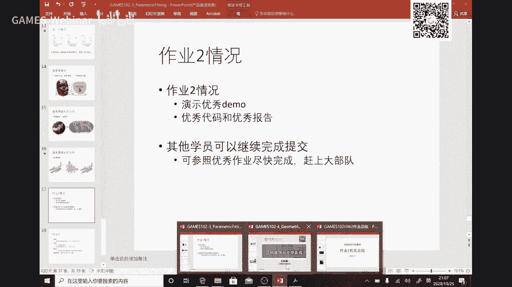

今天晚昨天晚上呃，同学昨夜啊交了35份啊，呃还还不错啊，加上多份啊，毕竟这是网络课，这个呃能跟上的同学尽量跟啊，跟不上同学慢慢改好，那么这主要是ur bf神经网络来拟合，实际上是只是让大家体验一下啊。

如果这是这个作业不做，没有关系啊，因为这个这个呃只是让你们心心心理啊，不要去认为最近网络是什么什么这个不可解释是吧，它是可以解释的，只不过呢就是确实很难调是吧，好那么呃非常不错。

有同有有五个同学还是用那个我们的无尽这个框架啊来来做哈，这个说明说明啊高手处处都在啊，行大家继续努力好，那么总体上的交流同学都还是不错的啊，这个但是有有些同学可能是不是啊做得比较晚啊。

然后没有写报告是吧，所以我们有些编译不过是吧，这也没法判断你的这个这个这个结果，所以同学们还是还是要写报告，写报告才证明你这个写报告就像写论文一样的啊，就论文嗯很多同学写过或者是准备写，或者未来要要写。

你上研究论文，就是你的思想，你的算法的一个呈现啊，你这个写报告就是在写就应论文的一个一个初级阶段是吧，你把你实现的东西用用用，用一个这个pdf或者word就把它写出来是吧。

汇报一下你的结果，汇报一下你的你的这个过程，好好这是一个呃大家我不知道直播平台能能能不能看看到这个动画啊，就是它它是一个呃呃就是用rb f g函数，你看到这这这个盾过程就是在在那个呃狩猎。

就它的优化意味着它是一个非常复复杂的一个啊，呃呃这个呃飞行优化无问题是吧。

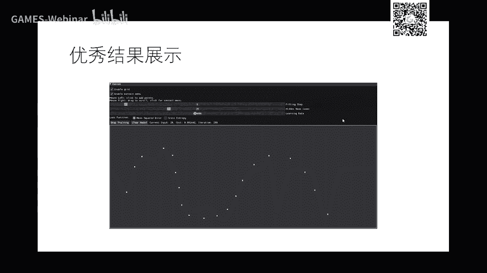

好那么这个同学呢，这种这种选择是是在我们五五级平台，我就跳跳跳是吧。

它启动以后它可以在在这里交互很多点，点，完点以后它就是个初值，就可以做点代，啊，这个是用高斯高斯g函数，因为它这个节点的个数还是比较合适啊。

所以他那个。

那么我们看看下一个它也是一个交互界面，然后他点一些点是吧，然后就可以来训练，这里训练它也是这个同学应该也是用rb 5来来来训练是吧，唉我们看到有些同学直接用那个sigma的那个函数去训练。

但是你们也没也没问题啊，函数在很多情况下实际上是比阿b f训练的结果要稳定，大家可能还想想为什么哈，因为这个模式是一个递增函数，高等函数是有升有降，有升有降到7度啊，它回传的时候呢可能会相互抵消。

可以就让他的这个啊收敛到这个绩效节啊，会会会有点慢啊，好我们就不展开，反正就是这个作业就让大家来理解一下，它实际上是呃实行网络就在做出拟合是吧，我们通过函数型这个一个例子啊，大家如果能学会用啊。

就不怕啊，后面如果真接触到那个啊啊，你们也可以展开啊，问题问题不难。

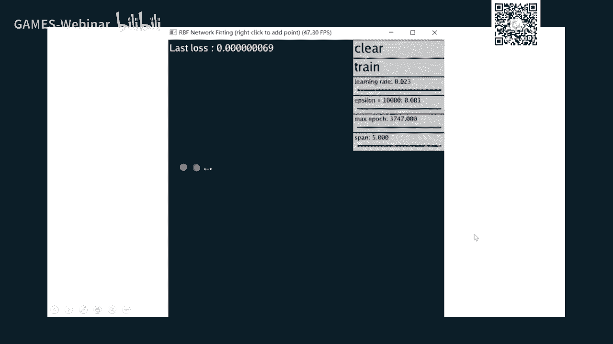

好，这是一些优秀同学名单啊，还是不错的啊，我们会把这几个同学呃，我也不知道是哪里学校是哪里的，但是做得不错。

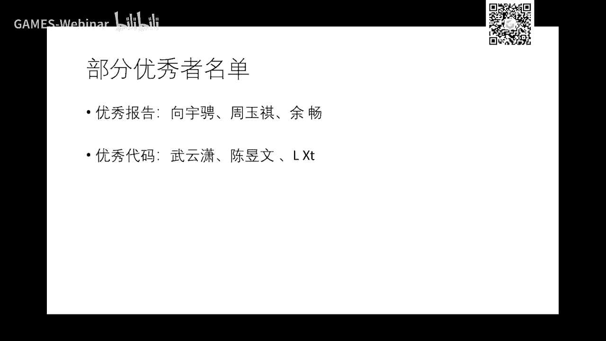

那么给大家参考好吧，后面后后续那个同学如果还要做的话。

你们可以参考，但是参考一定要理解，我不理解这个还是害自己啊，因为我也没给你呃，什么一定要你让你做啊，如果你想想学的话呢，就可以自觉的去按照这些流程啊去去。

今天诶哦哦昨天都忘了布置了。

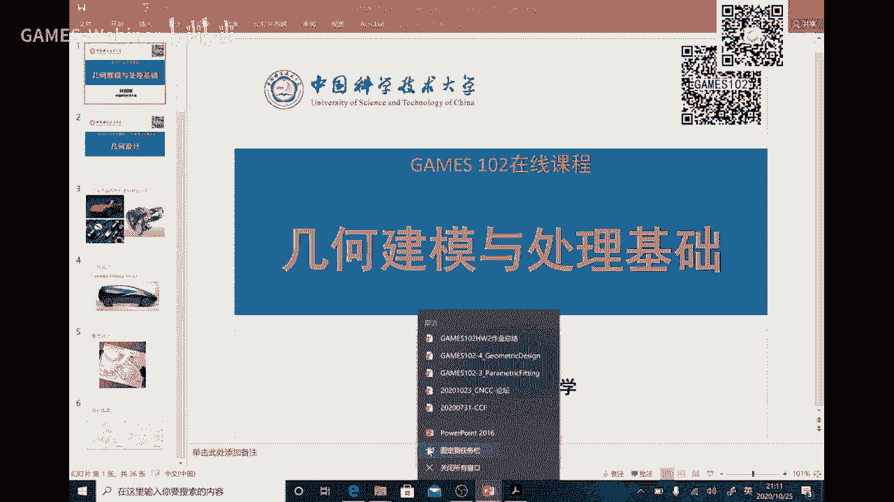

我们回到刚才那张作业，好，刚才所有情况这个呃就教的东西都还不错，虽然数量没有第一次多啊，毕竟这个时候这个网络课是吧，这个呃觉得这个进度啊，可能不一样，但是如果真的想想去跟着再继续啊。

现在我们已经在接触参数去是吧，这个就就后面就接着还是要跟一根改一改啊，好吧好作业三制作也非常简单啊，就是现在你们点点点这个序列啊，可以是一个月啊，就是不一定要函数型了，可以是任任意形状啊。

甚至想这样的多卷卷，只要有有顺序啊，但是还是有序啊，这个12345678 99点啊啊取号，那么你去用一条曲线去拟合它，对吧啊，你看他的话就其中有一个参数化的一个问题，对不对，看过唱的话，唱方面听呢啊。

均匀称的话啊，反正公司都在ppt里面啊，你自己去搞啊，然后然后再看看好，所以这是作业非常简单，本质上就在球场的话，因为前面你和你们已经学会了嘛啊，所以你可以调用作业一，你作业二也有对吧，反正我做四次啊。

所以这是作业啊，一个小时就搞定了啊，你你你交互界面你也写完了嘛，对吧啊，所以交互有了啊，已经ok了，在这拟合也就有了，把三句话求出来几个几个三话求一求拟合一下方方法固定住，上次画变一下就可以做比较是吧。

你就可以感知一下好吧，所以作业不难，所以每周一个还是是人跟着算的。

那么这一周呢也在等一等后面的一些同学，因为这是这是作业比较简单嘛。

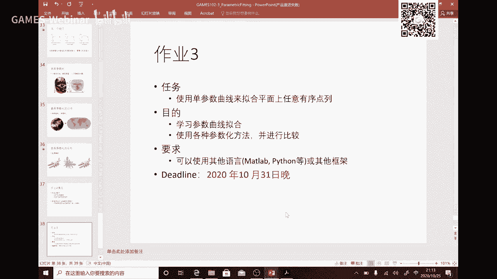

那么后面有些同学呢怎么配啊，这些啊这个在在读文的同学好。

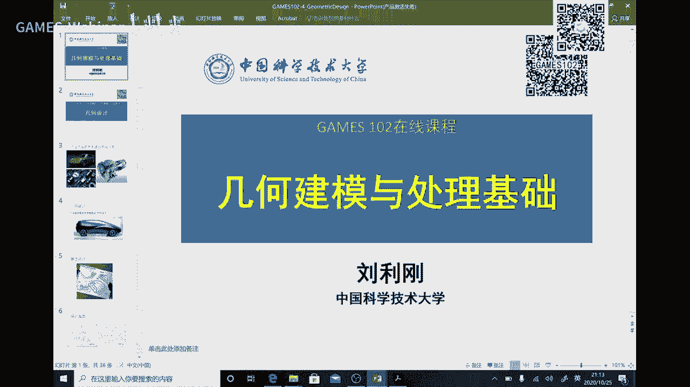

我们继续继续看，时间已经快了啊，还十来分钟，十来分钟我就开个头吧，啊这个这个下次来做做一些铺垫啊。

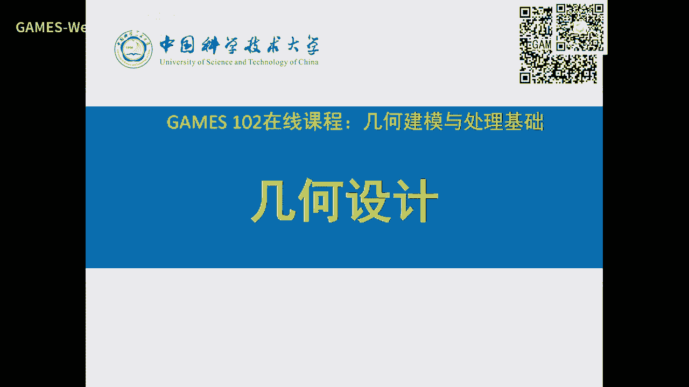

好今天叫几何设计，好好我们的工业产品外形是怎么设计的，你看这个汽车这么光滑光滑是吧，这个反光度是吧，这个一看就是非常漂亮的曲面对吧，还有这种复杂的这种叫机械零件叶片。

像这个发动机的叶片这个曲面方程是极其难得到的啊，你方程不好，你局面不好啊，这么刺激这个这些曲面，这个很重要，因为这里面后面我们会讲到这里面，你像一个一个发动机叶片高速旋旋转。

它是高速的切切割空气就会怎么有主啊，也会怎么发热是吧，所以你这个形状能不能尽大可能的减少阻力是肯定有的嘛是吧，那么叶片为什么要是这个形状啊，一阻力减少，第二要给出风最大啊。

因为它可能可能可能你就比如说是飞机的发动机，它是要喷射空气啊，这个气流才能给它推力，是吧，所以你这个这个这个这个叶片随便设计一下，你肯定有问题啊，肯定不够是吧，好你看我们平时用的电风扇叶片扭一下。

那就行了是吧啊，这个呢是是比较低进度的一些东西啊，你这个啊这个随便扭一扭，可能抽枫叶，ok所以但是呢它有规律的，你们不妨去看一看啊，你们可以去推导一下叶片的形状，什么是最好啊，这个好。

那么当然这个这个这个怎么表达是数学方法，那么我们马上要讲好这个在在在70年代，80年代就是叫就是怎么去设计一些曲面啊，那么这个叫几何设计啊，也叫外形设计是吧，那么看到一般你要设计一款产品都是艺术家啊。

或者是在在笔在纸上绘图，它的它的一个草图啊，那么根据这个草图呢再去求它的数学表达，就表达有了以后呢再去做做制造和生产好好，那么像有些早年是用这种叫三视图，就是一个一个产品啊，零件也好，还是这个物品也好。

它往两个这个方向去投射啊，就是双视图啊，111个正面，侧面和顶面就是叫三视图啊，如果是这个也土木工程啊，建筑行业的这种专业的学同学就画过这张图是吧啊，就是先把二维理解，然后去想象范围是吧。

后来有计算机以后呢，就就直接是可能避开了二维，就是直接用这个三维，那么如果基于二维的这种图纸来做设计的系统啊，就是叫二维的cad，如果是直接用三维的这个系统，那么叫三维7d3 维系比二维要要复杂多了啊。

所以这个你想做一个二维的话，相对来说工作量啊这个小一点，但但也很难了啊，好那么设计好了以后，你要去做生产或者叫做制造，你要保证它的光滑性，你还是要要他的数学函数表达是吧，然后表达这个曲面啊。

比如那个啊怎么样啊，这个这个保持表表表达一定的光滑性和连续性，好好，当然在几十年前啊，这个这个设计师是怎么来做设计的啊。

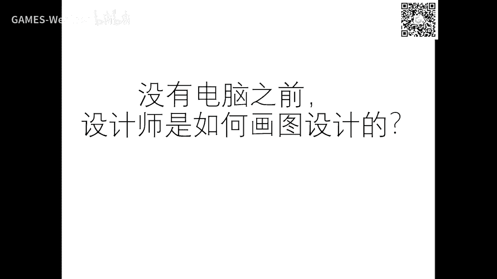

大家可以看看，首先啊这个把几个视图画出来好，那么大量的人都在做这种啊这个设计啊，可能这些人分工设计的这个物件不一样对吧好，另外就是呃这个叫放样是啥意思呢，放样就是诶我设计好了以后呢。

这个是是这种艺术家在在画了一些一些一些点是吧，那么你可以看到这里有个有个有个有个小东西啊，这些这些呢像这这这是个铁块，然后这个呢是一个软软木非常细的一个木头啊，那他们叫叫就叫样条。

我也不知道为什么叫叫叫样条。

反正是啊这个啊这个那么他们沿着这个这个这个这个曲线，这个曲线是艺术家给画出来的啊，这个曲线就一个个秒点，这是啥，他也不知道描点是吧，那么瞄完点以后呢，那么这个软木呢是可以弯的啊，你可以看到他们描啊。

这是这么多人在瞄好，那么就他们他们这个设计曲线可能是因为画了画了一条是吧，他们就描了一些关键点，那么这一点呢描了以后呢，这个木条是一个非常软的啊，不塑料的，是一个是就是我们的木好像是有一种专门的木头。

反正就比较比较软，这个只要不值得很厉害，它不会断啊，浓度这个弹性，那么这个呢叫压铁，压压血的事，是个铁块很重，所以你只要木木木那个样条啊，这个木样条啊，把它固定在这个铁块是很重，它摩擦力很大。

所以它也不不动好，那么样条呢所形成的这样形状的诶，就是我想表达的这个曲线啊，这曲线呢就这样一个点一个点啊，就是描出来，并且用软木样条啊，因为就那种软妹样子是比较比较柔的是吧，变形啊。

一定范围之内变形没问题，然后你就把它再描一下，就去研究设施出来了，取出来以后再去进行加工啊，当然这是传统诶，你你这样只是把曲线给画出来了，但是呢还是不知道它的数学表达对吧，你你不用数学表达没有。

所以呢我们要去推导这个数学表达好。

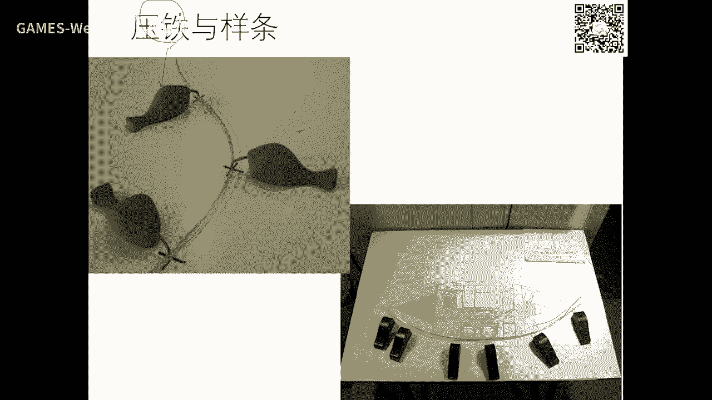

那么这两个问题就在于好，我给了一些离散点，是不是你们这个问题，你们前面两节课多是吧，怎么去求以后数学函数是这个木头木头木样条所表现的曲线呢，最后有没有数学能够描述这个模样条的这个变形后的曲线呢。

有问题啊，那么在70年代，80 80年代这个这个这个样条函数，这就是是从的牧羊条来吹导出来的啊，是可以求出来的啊，那么具体怎么求，我下节课再来跟大家讲吧，那今天来不及了好，那么就是这个叫自由曲线设计好。

我们要去求一个曲线，我们往往不知道它的数学表达，但我能采样得到形式点，直到形成点以后呢，那么就什么我我我要通过我的数学啊，你和逼近差值啊等等方法，我们已经我们已经全部都理解了是吧。

把它的数学函数给描述出来，有了这些描述以后呢，诶我要对这个这个曲线进行修改的话呢，就去修改它的系数，修改它的基函数啊，就能够对这个区间进行一些编辑变变形啊，变化好，那么这袁绍先就是上我先把结论给啊。

就是啊就是分段这个这个这东西也挺有意思，为什么这个模样条啊，这个点到这个点之间啊，唉既然是个多项式，用三次方式就可以描述出来是吧，然后一段一段一段拼起来啊，这个这个叫三次并呃样条啊。

这个当然中间有有一个小的近视啊，我们下节课来推好，我下次再解释吧，好所以摸两条本身一要光滑啊，但是呢诶这个数学家经常推出来，它是个分段多项式，一段一段的多项式，这个就拼出来的啊。

x x t y t z t3 啊，这两现在是两个xy多，是多项式三次的就够了啊，所以当时要调函数嗯，我记得就开个头好吧，就就把这个背景讲讲掉，那么具体三次函数是什么推啊，我下节课把那个思路讲一讲啊。

我不会推那个，因为网络网络课的话没黑板好，黑板就不好推好了。

好吧哎，那看大家有没有什么问题，我这个怎么死机了哈，上面这个这个地方不知道怎么被关掉了，所以不知道怎么问题啊，如果大家有问题的话呢，好吧，我们稍后问题我我们会在群里面看一看有没有什么问题啊。

那么呃b站我这个这边有点小问题，所以看不到你们的问题好，那么这次作业做清楚哈，反正我们助教会这两天会把这个作业啊供不出来啊，大家这一周反正这个作业非常简单，但实际上是本质上就是在就在求这个串的话啊。

就点了三热化问题啊，所以你们只要把花花个几个小时就可以做完好，所以这作业我们稍微等一等，后面的同学好吧好，今天就到这里结束。

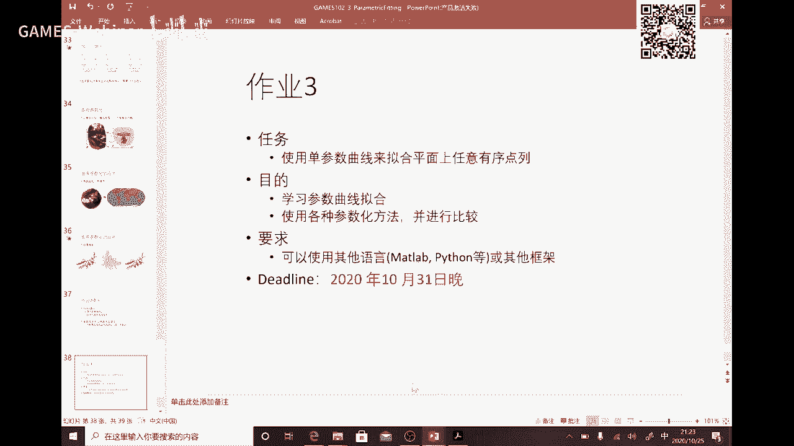

