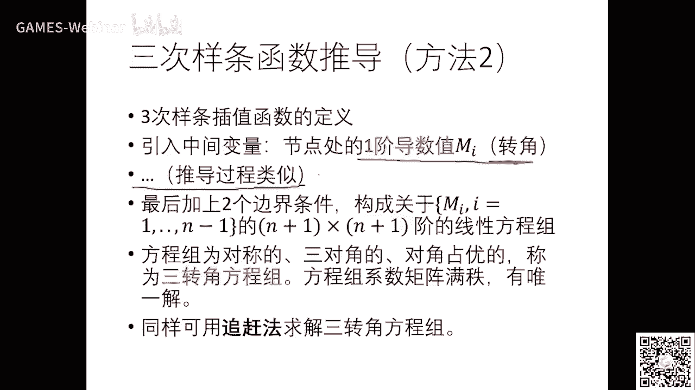

# GAMES102：几何建模与处理 - P4：三次样条函数 - GAMES-Webinar - BV1NA411E7Yr

好那个同学们，我们今天晚上的课继续啊，今天啊这主题是三次样条函数啊。

那么在讲之前的话，我们呃讲一下昨天递交的卓越三的情况。

好，好那个卓越三的总体情况，今天呃我们已经改完了，好看一下啊，实际提交呢有40多份啊，41份，那么这是作业上相对来说比较简单啊，如果你啊第一次第二次做完了啊，那么第三次呢实际上只要把插座化实现一下对吧。

就是有序点列，那么有好好多不同仓的话，那么你把它的话这个点着它的话那个值求出来，然后对各个坐标分别求就可以了啊，那你去作业相对来说还是比较简单的，那么这是下下面的实践情况啊，用那个那我各个平台都有好。

那么总体情况呢完成了从学啊。

可能呃这个效果都还不错啊，那么这里演示几个，先演示一个demo啊，这是这是一个同学lx t啊，然后利用，应该是需要引擎还是什么啊，然后做了一个界面，然后背后的算法呢还是c加加做的。

你可以看到它可以实时的交互这个点，然后然后生成这个参数曲线，来看一下啊，它有差执行，也有b进行，那么这个不同颜色就是不同的，这个方法可以可以看到这个不同不同的这个商量化方法，它这个效果虽然都是差值。

但是这个结果还是会会不一样，啊右边是各种参数化方法嗯，它可以随时的可以啊去尝试它的结果啊，这个做的挺挺直观啊。

也挺好啊，哎后面的作业看哈。

那么这是另外一个同学啊，一个叫常清俊的同学，他给的报告里面很清晰，它这个点位是一样的，但是参数化是不一样啊，从左到右啊，弦长中心均匀啊，还有forty time的话，你可以看到这个不同商的话呢。

对这个啊拟合的结果还是有不一样的啊，这个效果因为这些点呢相对来说比较均匀，所以大家看起来好像差别也不是特别大好，那么如果对于点比较均匀的话，你想想均匀称的话跟显转差的话就差不多啊。

所以如果点列相对来说间隔比较均匀啊，你无论采用什么参的话呢，都结果做还是可以的好，那我们看下一个例子，三个例子呢就是如果这个点分布很不均匀，就像我上节课ppt里面所绣的，大家有没有看到这里啊。

有两个点啊啊非常非常近，啊就是这里两个点会非常非常近，还有这里三个点也也是很近，这时候呢这个几个差异化的结果呢就差别很大，比如说你还是采用均匀算的话，运算的话就相当于每两点之间的这个参数值是一样的。

所以呢它这里就容易产生这个纽结，你没看到这个地方已经出现了自交了啊，就就效果很不好啊，然后如果采用其他的方法呢，基本上还是比较光滑，你可以看到中心的在在这个地方表现的还是比较粗不错的，这里面时长的话。

这这一块啊还是有点这个尖角是吧，然后forty上的话的话，总体上表现也还不错，但是这里和这里还是有明显区别，这些证呢大家都可以尝试一下，所以不同商的话呢，这个带来的结果是不一样的，所以是哪个哪个更好。

事实上是就是那个每个参数的话，对于他的一个一个理由啊，所以没有最好的，所以要根据你数据的这个一个分布或者是具体情况啊。

那么这是一个更复杂的例子啊，这个同学应该也是常见句吧，呃用那个高斯基函数来拟合，这左边的这个呢他用r b f神经网络来拟合是吧，那这个东西挺好。

他现在已经能够完全理解这个神经网络实际上就是一种拟合方法是吧，只不过我们这里呢这个尾数是知道的，因为这些点点我们知道它是一个一维，所以呢你把它拆了化到一维的这样一个参数节点上面。

然后再来做拟合就就很直观，那么这个因为网络如果对于高维数据是不可视不可看的是吧，所以只是几维啊，本周为数不知道，那时候呢这种问题就相对来说你是你是没法判判断出它的好坏，也只能从它的误差函数来判断。

所以呢对高维数据的这种理论呢，相对来说就就是啊只能通过一些这个loss function的一些值啊，但是对我们二维一维的这种数据，三维数据就可以看得见啊。

所以也肉眼就能判断出它的好坏，那么这是另外一个同学的一个一个递交的demo啊，这个demo还有点长，我们看看其中几段啊，也是让大家看看它的这个交互界面啊，每每点一个点，就就就自动在就拟合出一个这个曲线。

这个是他是用神的网络，就是初值可能是比较糟糕，后来就收收敛过来啊，我跳着看啊，这是其中的一个二啊，我看看这是用应该用高斯差值，它它这个西格玛就是那个值在不断变化的时候呢，这个结果也不也也是有差别好。

你可以看到这些曲线上这些这些解都是拟合着这个原始数据，就是哪个好哪个不好，在我们这里呢是能看得见啊，可以直观的判断啊，就像我刚才说的高位数据，你你觉得好不好，你是两眼摸黑，你以为你根本不是看不见。

所以你也只能从误差来来判断，但误差是零也未必好对吧，这个通过前几节课大家一个印象是非常深刻了哈好了。

那么这个作业就讲解到这哈，我们已经把部分的优秀作业，我们都挂在主页上，大家可以去下载参考啊，还有他的一些优秀的这个报告，好，我们课程继续，课程呢上节课我们开了个头。

就讲几何四纪啊，几何设计啊，就是说我们要去对这种产品的外形建模啊，这种工业产品啊，汽车表面还有无数无论什么样的产品是吧，那么呢在早年没有计算机的时候呢，大家都是先啊这个去采样一些点的，或者是先概念设计。

这个一般是有一些产品金额，产品这个美工啊，他们去画一些草图，然后呢呃还有二维的这种图纸啊。

那么最终你要去生产的时候，或者抽到建模所，还是要有一些数学的表达，你就比较精确，你你如果采用一些点，这个是很难表达出所有的这个这个表面的点是吧，所以在以前那句话就是这种设计师啊。

就在图纸上勾了一些图片啊，你可以看到呃，然后呢这个曲线不知道是什么样子。

但是我知道这个关键点在哪里，所以用用这个叫做样条的方法啊，就是啊就是样条样条呢它就是一个软木条，就这个就这样一根软软木条，就软木条呢它比较柔软，它可以自由地弯曲，当然在一定程度下啊，弯曲它也能反弹回来。

所以他有力学上面他是个弹性感啊，弹性感，弹性感呢就是只要你不超过他的那个弹性的，这个就是弹性到十属性的这个临界值，它都能回来啊，那么那在一定范围之内的话，这个弹性感呢就就可以弯曲，那么这些呢叫压铁。

压铁是比较重的铁块啊，就是就是这个放在这里呢，它也不会动啊，因为摩摩擦力足够大，所以呢这个设计师描了一些关键点，就是这些押解的点啊，1。2。3。4。2可以可以看到，然后你就压到这里。

他就认为这个点是很重要的，就就把这个压铁放这，然后就让让这个木条呢就沿着这个压铁自由弯曲，就形成小曲线，然后那个那个设计师有盐的这个一样条，就连续的描述一条曲线出来啊。

这这就是这个曲线，当然大家大家就要去问这个问题啊，那么呃这个这个这种曲线叫做自由曲线，就是没有数学表达，我只有一些关键的节点，那么你怎么去数学表达他呢，哎这就我们现在已经学到了啊，拟合呀，毕竟啊差值啊。

还有什么方法，你要把它的数学方程给它求出来，求出方程以后，你后面才能做你后面的事情对吧好，那么这里就自然就有一个问题，这个在传统用样条来生成这种差值曲线啊，这个只是通过工程的方法去描出来的一条曲线。

但是曲线数学表达有没有啊，这个是啊我们要关键事情，如果你只是画出来没说表达，你还是没法去做后面后面的一些运算或者叫制造，对吧好，所以大家一起来想想啊，这个样条这个木样条就是软木样条。

这样写自然通过经过若干点所弯曲，自然弯曲形成的这样一条曲线到底是是什么啊，有没有数学表达啊，那么这就是啊三次样条函数今天要讲的好好，那我们先把先把它抽象压铁就是固定点是吧，这个叫形制点。

好在我右右边这个图就是用这个三角形的这个顶点啊，就三角形就表示压铁啊，就就这个这个这个点是关键点，这个点是关键点啊，这一头一尾也是关键点，好那么这个黄色的线就是那个软模样条自由变形所形成的一条轨迹啊。

所以你的模样条啊肯定是一个差值形的一个曲线对吧好，那么我们来看一下，那么嗯实际上是在早年人们也在推导，想推导这个这个软样条的这个数学方程，事实上如果从力学角度上来解释，是还是可以解释的啊。

就是说你这个螺纹样条它是个弹性梁啊，所以楼面样条它本身有一个弹性模量，弹性模量就是呃来度量它一个力跟它受力的一个关系，鸦片呢就是个载荷力啊，所以由这个能量条的那个玻璃欧拉方程就是力学方程啊。

就是这个叫呃曲线的弯弯，曲弯矩等于弹性模量乘以几何惯性矩，再乘上它的曲率啊，就这个这个是指这个曲率呢，因为它是个呃这个函数方程是吧，所以它的曲率是这样计算的啊，这个微积分里面同学们都学过这个公式啊。

就是y x的曲率是这样一个实子好，这个时候我们来看啊，这式子呢是一个这里有平方，这里有3/2次方，所以它是一个呃比较比较比较这个大的一个非线性的一个表达。

但是呢诶我们如果假设这个弯曲程度啊不是那么剧烈啊，那么这个y一撇啊，就是这个导数啊啊就就就小于一啊，所以他这里做了个假设，就在这里叫小老度，假设就是如果弯角不是大于40度，他认为y一撇啊就远远小于一。

小于小于什么意思呢，就是分母这一项呢它就近似为零，近似为零以后的话，就下面这里就变成一，所以上面这个式子呢就变成了这个式子了对吧，就就变成了这个式子，就就这一项已经没了嘛，所以就变成这个式子啊。

这个式子以后呢可以可以可以看到好啊，那个就就相对来说分分母没有就比较简单，然后再因为两个压铁之间没有外力，没外力的话，这个这个叫叫唤醒矩，它就是一个一次式，就是这个式子好，那么由由这两个式子一对比是吧。

这两只只是所以呢y两撇就是一个现行时，那么积两次分就可以得到y x呢是一个三次函数，什么意思呢，就是说每两个压铁之间它是个三次函数，这两个亚铁之间也是三个三次函数。

所以呢就可以通过这样一个近似来解释这个软木样条，它的那个曲线啊，是分段的一个三次函数，每一段呢是由这个行词典所所定义的啊，就这就是它的一个力学解释，当然这个从数学上来讲，上次也是比较好的啊，太简单。

二次呢没有拐点，就是表达力不不够丰富是吧啊，那四次以上的拐点比较多，并且次数越高，同学们知道这个多项式次数越高，计算就越不稳定啊，因为它次这个这个次数高的话，乘法太多是吧。

那么所以三次呢是人们比较喜欢的一个一个选择啊，因为二次没拐点，它因为它只抛抛物线嘛，它没有拐点，所以表达不够丰富，三次呢刚好有一个拐点啊，所以它至少可以表达拐点的这个这个形状，40以上呢就多了好。

那么这样的话呢就大家就诶就数学上来讲呢，三次也有它的好处好，下面我们来看一看，就是既然这一段这一段这一段都是三次是吧，那么我们怎么来推导这个三次函数的方程呢是吧，那么这个方程需要满足什么条件啊。

怎么来求解好，如果我先不讲啊，大家可以来思考思考啊，这几个点压点的点是固定的对吧，然后这里这一段这一段这一段都是三次函数是吧，好这一段三函数三参数大家知道哈，是有几个几个几个未知数啊。

就是四四个系数对吧，所以呢你只要去求出每一段的四个系数，就求出它的函数方程，那么那么那么这里有没有什么约束呢，比如说在在在这个点这个点这222段，这一段和这一段是不是是不是在在这一点大牢了。

所以要啊至少c0 连续，而且在这一些简单可能还有c一连续，还有c2 连续，因为三次的话呢我们基本上讲的就是c2 的c2 连续啊，那么在在这里是不是就可以得到很多约束啊，所以我们最早方思想呢也是这样。

我们来看一下啊，好假设每一段啊，我就啊这个假设是持这一段啊，是三次对三次最大值，三最小值表达就是啊最高次数是三次是吧，所以它前面有四个系数，所以每一段呢这个yi啊yi啊就有就有四个待定变量啊。

就决定这个这一段的这个函数，注意啊，我们这里还是以呃以函数来做例子的这个参数的，等一下再说好好，那么假设有零到n个这个形式点就是n加一个形式点，是不是中间就有n n段了是吧，n段的话就总共有四个变量。

因为基本每一段就四个是吧，所以变量有这么多好，那么你要求他们的话需不需要一些约束啊，是吧好，首先曲线要差值行，这点是不是这里就有n加一个约束一啊，每个点是一个约束好，那么还有呢我假设整体曲线是c2 。

这样是不是两段在在这一点就有拼接三个条件，c0 表示顶点大牢，c一表示有公共的曲线，c2 表示有公共的两阶导数是吧，所以123中间的中间的n减一个点，因为一头一尾去掉中间的都要满足这个拼接条件。

所以这里有三个，那么有n减一个中间的节节点，所以有总共有3n减三个约束条件，因为那个变量是4n个，你你要拿到4n个这个方程，你才能求解它是吧，所以现在我们来看看现在有多少方方程了。

现在已经有4n减二个方方程诶，有四按4n个变量是n减二方程，是不是变量数多于方程数啊，或者说方程数少于变量数，这还不够对吧，因为这样的话其实有五种多个解是吧，所以还要去找两个额外的条件。

这样就构成了是n个方程，就有四个变量，这样就可以唯一确定整个，那么那么这两个额外条件呢加在哪里是吧，那么当然很容易想到哎，我一头222个端点分别一个加入条件是吧。

给它加个条件即进就可以刚好满足这个这个方程方程的个数啊，所以这个边界条件这个也是很自然的啊，好那么我们来推推导一下啊，好我们推导一下那个这个推导过程呢，那个今天这个笔没带啊，所以啊就我又不去用纸来推导。

我们我们写一个文档。

文档，我把思路讲一讲啊，这个文档也挂在了主页上，好，这文本当然是这样，这个这个我把思路写到这里了啊，首先你上次这个定义已经讲完了啊，他们引入中间变量。

假设我节点处的两栖导数是n m m i m一般叫弯曲，就是刚才吹倒的那个那个m啊，推到弯曲，那么假设中间这里每个点啊，这个这个两条两条曲线的节点，它的那个两阶导数值是mi，我先带带，这个是待定的。

那么你那么你这个没转这个y两撇，就是它的两种导数呢，就能表示成，因为它是它是线性的嘛是吧，所以它又能表达成一左一右的两个两阶导数的线性差值，就是这个文档里面的，在这。

啊就就就这尺子是两个端点的这个差差值，差值以后的话，你再两次积分就可以写出这个这个这个这一段的方程，注意这里mi和mi加一两个两端点的两阶导数是不知道的。

但是我可以把它表达它在表达在这里等一下是可以来求的好，可以来求好，那么通过这样一个啊这个两个两阶导数的这样一个待定系数，就可以表达这个诊断函数好，那么整个函数那我们再看我们还要满足这个条啊。

这个这个约束条件是吧，我们每个约束条件呢把它列出等式啊，首先是端端点疲劳，然后一阶导数连续，然后在两两个导数是公共的嘛，就自然而自然而然就就有了，然后呢再把所有的这个池子把它连接起来。

然后再加上两个边界条件，就刚好构成一个n加一乘以n加一，接着心理方程方程组，因为每一个点有一个导数是吧，所以呢这个方程组呢大家课后再去仔细看这个文档啊，就变成这样一个式子，注意m一到m m n减一啊。

那个n减一哦，错了，这里是应该是n减一，好解解方程好，也就是有n减一个未知数，就是那个啊中间那些拼接点的两阶导数，那么这将构成一个方程组，与其求解方程组啊，这边和这边都是已知数。

就可以得出它的2000方这个导数，这两导出以后是不是就这个中间每一段这个式子就全都出来了，就就这个式子啊，所以呢它通过一个中间的一个变量，就是中间节点出的两阶导数，然后来来推出这个曲线的表达好。

那么这个这个方程组呢因为是待定了这个弯曲，所以呢这个方程组呢就是在啊这个这个这样条理论里面，这个叫三弯矩啊，三弯举这个这个方程组啊，这这方程方程组呢是有无解啊，因为这个方程组是可以证明他是啊对称的啊。

三对角的对就对角占优，什么什么三对角就是沿着直角最角线有一条两条三条三个角，而且这个值中间这个值大于这其他的每行啊，大于其他的两个量词的和，这个叫对角占优。

从计算数学来讲就是对角占优的这个方程式都是可以是满满字的啊，然后是是有一节，而且因为它是这个三对角，所以可以采用比较啊，一个简单的方法去求解方程组叫追赶法啊，因为刚好一追一赶两次就可以。

因为从第一行就可以求出求出n m1 ，从第二行就求出u u r啊，这样一行行来来做，具体的大家可以自己去看一下啊，而且这个三弯曲方程组呢，这个这个这个求解啊，这个三追赶法还是非常高效的啊。

好这里还漏了一个这个两个边界条件好，我们来看看下一章边条件呢，就是这里你可以看到啊，有人们可以设不同这边条件就是两个两个端端点的边条件啊，啊我把这个图拷拷过来。

啊就是这这一头一尾是不是刚才少了两两个条件是吧。

那么这两个条件你就你就假设啊，这有些叫自由端，就算是说我我就我就啊确定这两个两个端点的导数等于零啊，就叫自然样条，因为它自然伸展对吧，我就不管它还有什么价值端，就是说我这个地方的切线呢，我我想控制住它。

你给它指定是不是222边的切线叫导数一阶导数值啊，你也可以给它给它啊，这个这个这个给定这样也是两可以这样设来他的那个啊这个边界条件，当然你说我我我我说我这个两两个两个边界条。

条条条件是不是是不是一个抛物线的还是怎么样，你只要给一个条件，把这两个条件够了，你就上一页啊，就这个边条件有了以后，就可以得到一个n减一乘n减一阶的方方程组了，好好具体最早呢我们这里不会花时间。

我把这个思路给讲一下，就是你你这个由这个力学知道它这个是一个上三次函数，那么再由这些呃拼接条件啊，就可以待定中间的那些啊呃三次函数的形式，那么这里呢又引入一个中间变量啊。

就是以它为一个中间桥梁来表达各段的这个曲线，然后去求解出这个中间变量m i你就可以得到这个函数啊，这就是三次样条分段的啊，所以要调什么呢，样条就是分段的对项式，那么三次样条就是分段的三次多项式啊。

那么只不过每一段跟每一段相邻的两段之间满足一定的连续性，光滑性啊，至少是两节连续啊，好那么实际上是在这个这个推导过程中呢，我们还有另外一种就是什么，我可以先假设节点出这一阶导数mi啊。

一阶导数就是导数嘛，对吧，就是就就叫转角，就这这个这个这个力学几何意义叫转角推导过程是一模一样啊，这算过程是一模一样的啊，你们去找找一些书去看啊。

那么同样也是啊，可以可以这样得到这个中间的导数的那个m减一乘，以按m减一，接着线性化的变分方程组，同样这个这个方程组的形式是一样的，也是三对角，对角占优，而且是对称的，那么因为它是以转角为未知数来求解。

所以这个叫三转角方程组，同样求解也是这个用三三这个追赶法去去去求解好吧，那么这个在一般的数字代数的书上都有啊，这个这个同学来回忆一下，没学过的同学呢找本数字在数书出字，数字计算的书都可以找得到。

这就是经典的三次样条函数的这个推导思路，而且这个是无论是三湾区还是三转角放的主，他说有这个性质啊，是是有一节啊，大家可以有关心的话，可以去看看他们去证明啊，好那么这个呃嗯这里我稍微提一下啊。

就是这里因为我比比这个没带，我就鼠标啊简单试一下，就是呢因为两个形形成点之间，还有就是刚才呢是是完全这个用a0 x a0 加a b0 x加上b2 c啊，c0 x的平方就是这种多项式形式。

那话你变量就是有四个是吧，但是对于一些比较特殊的这种这种这种条件啊，中间这三次差次方程组啊，是可以很容易有两个边线条条件给定，比如说我们通常说的2。2切线好，假设这个点给定了，这个点给定了。

还有这个点导数给定了这个点导数给定了，那么事实上是是可以很快写出中间这一段的那个那个叫做这个多项式，三多项式的形式是吧，2。2线线刚好四个条件是股四个未知数，大家可以去推一下啊，就是你去求一组啊。

这个叫后面的差值多项式啊，就是待定一个啊，30多项式，2。2线线给定啊，那么切线呢就是刚才带进的那个那个转角值啊，那么就可以用后面形来求啊，马上写出来中间的这段曲线，另外你说我给你2。2曲率也同样。

你可以去带进这个曲线啊，这个形式，然后呢就求出这个形式啊，那么这个呢是数学上的一些技巧，就是说我我可以把这种都有同样的条件的形式，编辑条件形式呢给它预先求出一组啊，这种满足这个性质，但性质什么呢。

你求出四条曲线，那一条曲线呢是经过这一点，那么其他点都等于零啊，呃另外一条曲线呢是经过这一点，其他条件不等于零，还有呢呃第三条是这个导数是给定的，其他作者一零，这样的话呢你就给出2。2切线的时候呢。

有那四个函数就可以马上做出来啊，这个函数形式真的只不过是最早过程中比较简单一点啊，我这里啊今天没有比这个这个就先这样提一下，后面有机会我再给大家把这个思路讲的明白一点。

好好这个是一个啊啊这个这个这个呃附附加的一个东西，但是前面那个思路大家啊可以理解一下，这个不难啊，就是啊知道他是三次，那么你就可以这样去推啊，这就是大学里面的数字函数都有讲的啊。

数字数字方法里面都有讲的好，那么这次就是和科比的差值多项式，你可以看到啊，我这里啊写写一下思想是吧，那么这是两个点啊，就是两个两个端点，这是两个端点的导数是吧，那么呃那么这个这个h0 h一和这个呢。

就是我刚才说的待定的四个函数，这四个函数呢在这个函数在这里是1000，这个函数h一呢是1000啊，这个函数呢是0010，这个正函数呢是0001，就是你只要是这样呃去去设。

然后你你这个你求出预先求出这个h0 h一大h大h以后呢，你那你给这样一个条件，这个函数就直接由这四个函数若就写出来了，那么这四个值刚好是上面这四个值啊，那么这四个函数怎么求。

就是就是这个方程式所给给定的啊，好好那么这个呃三次这样条呢也是一样道理，三次样条你可以看到我，我那个三四样条，刚才刚才不是要解放的主裁才可以推推出来嘛，啊那么在这里呢你可以看到它呢就直接用两个端点啊。

这这是y0 ，这是y n，这两这里是以这个两边给定的导导数为止是吧，那么中间呢是一些函数值，你看看到没有，sx就直接用这个形式点组合一个函数就把它写出来了，那么两个端点呢它也是组合了两个函数。

那么这些函数是怎么待定呢，假设你在这个这个中间都是给定的值，加上两个端点的导数值，那么这些基函数怎么给定，就跟刚才后面的差值一样的，那么那么这个函数就在什么。

就在在在在这一点加上i j就是等于1i及i等级的时候，其一其他都是零，他只有这个值是一的，全部全部是零，那么中另外一点也一样啊，那么两个端点的这个函数的一样，那么只在这个x0 处端点处，它的导数是一。

别的值全是零，同样这个也是一样，所以说你预先求出来y呃，这个呃f f0 到f n加二以后，那么你只要条件是一样的，那么我这个函数呢就直接可以这样写出来，就根本不用去求方程组，那大家就问你不喜欢程组。

怎么刚才那个不就白搭了吗，实际上是把方程组呢是这里每一个n加一个函数是求换的组，因为他的条件都是特殊的啊，就只占一点等于零啊，一不等于零，所以呢这里是用刚才的方法去求求方程组啊，就这这里有n减一个函数。

加上这两个端点的函数，就这样，所以这个就叫做几样条啊，那么刚才后面的这个这个思想呢也叫基函数，用后面的积在啊，那么金函数的性质我就不去不去不去展开了啊，因为你要你要你要你要去研究的话。

也可以去去找到这些这些这些关系啊，好咱们好，那么三次样条函数呢，我就刚才讲讲到那好吧，那么还有三次样条曲线，曲线就就不用讲了是吧，你们上节课刚刚就有理解了，因为函数呢它有局部性嘛是吧，它不能多值。

那么怎么去推广到曲线啊，大家都会了吧是吧，好你就就就把三个分量看成是某一个参数器的三次样条函数是吧，所以你多出一个变量来了t因为我知道它是一维的嘛是吧，所以你先去做三的话，所以你上前面那个作业里面做了。

那么先把这个顶点用弧长上的话呀，或怎么算的话，然后每个每每个点对应一个ti，那么对三个分量x y z分别是t的函数对吧，所以就变成了三个这个并行的这个方程组求解就行了啊。

那么这个这个所以啊我为什么前两节课讲得慢一点，让大家理解函数函数完了以后呢，这种这种呃叫做呃这个呃矢量函数呢就是什么三个分量分别对啊，分别在函数而已是吧，那么只不过那个那个自变量是一个变量。

叫单变量还是多多个变量叫多多变量而已，所以这种向量值函数很好理解，所以把它变成了函数的这个啊形式，只不过我们有的时候要写的时候写成一个向量格式而已啊，好那么至少你们昨天是啊主页上做完以后呢。

这个怎么把这个三次啊，这个样条函数变成三次参数，样条曲线就会会了，好那么这里可以可以看到好，那么那么这个曲线实际上是这里啊，这个再把作业这个如果改一下，你们刚做完的作业，马上就可以实现这个啊。

但是实现这个的话要实现实现前面这个三次样条啊，就就是这个方法啊，这个这个方法反正就啊我们已经写这个文档给大家参考，大家好好再再再再消化一下啊，就这个在方程组呢求解不难追赶法啊，这个你百度查找一找。

这种3万系方程怎么追，怎怎么敢，一来一回就可以把方程组求求掉，好吧，这个大家练一练啊，好那我们继续啊，这个这个这个这个练一练，这个这个这个求解方法，那么，另外我今天还要讲一个这个曲线的这个几何连续性啊。

这个连续性呢这个呃同学们在大学里面大一学就听过这个连续是吧，好什么，什么叫连续呢，就是如果一个函数它可微是吧，f啊他处处是连续，那么这个就叫c0 连续是吧，c0 连续就是没有任何一个点是断的。

那么什么叫c一连续呢，它处处有问倒数是吧，处处可导，也就是它的导数是左导数等于右导数，它它可导是吧，那么这样呢就是两阶导数是吧，处处存在两阶导数，我们就把它叫做光滑性，它比较光滑，因为它它具有高阶导数。

所以呢有两条曲线啊，一条是t0 t一啊，在这另外一条是啊，这个这个x一这是一条，这是x2 ，如果两条曲线啊，给定曲线一个是t0 t1 ，一个t1 t2 ，刚好在t0 的时候，是是是是大佬的好。

如果这两条曲线呢在这个端点处，x一的右导数跟x2 的左导数从零阶到r阶都一样，那么这个曲线呢就是cr连续对吧，这个跟我们大学里学的连续一模一样的概念，就是虽然这里看起来是两段，我即使是一个光滑函数。

是不是是不是我也可以把它在这里看成两段，一边左一边右的是吧，那么这一段的左边的这个导数跟这边的这一段的右边，这个导数完全吻合的话，那么在这里导数就存存在了嘛是吧，所以呢这里如果是两条曲线在这里拼拼接。

那么呢它们从零接连接什么呢，零接就是他们端点，这是吻合的，一阶就是他们的这条曲线的右右导数，曲线在这里的左导数是一样，那么两阶就是它的两阶导数也一样啊，那么这个叫c2 连续。

这就是我们大学里这个学的这个连续性，我们是用这个这个函数在这一点的导数来刻画啊，这个是就是连续性的，但这种连续性有些什么问题啊，我们我们这个呃来看一下啊，啊这里这里解释了cd是什么意思。

cd就是啊这个两个端点大牢是吧，应该是一阶导数啊，这个是连续的，实际上是两阶导数是连续的啊，就一样，那么用物理上的话就是这个速度是一样，那么这是一些例子啊，实际上是在数学上面，我们也定义c-1。

这个比较少见，但是也经常会用，是为什么呢，他们两个大都大不了就叫-1啊，就是c f1 ，那你说你有没有cf 2呀，cf 3还没有，我们这个就不定义更cfm没有意义。

因为c f一已经什么已经是没大牢了是吧，我们是一个符号好，更多的用的是c0 c1 c2 ，这是什么凉血，站在这大牢，那就是它端点重合，但是呢它的它的切线不一样，这个线线是这个方向。

这个线线是这个方向是吧，所以它切线是不相等的，指指在这里啊，这个介绍了c一呢，就是什么有公共的一个切线啊，这就是啊这个曲线在正在切线时，正方向这么这么长，这曲线切线也是这个样子。

那么c一第二的话就更光滑了，就是不仅有c的相同的值，而而且有两阶导导数的值啊，这个这个相同的值啊就更光滑啊，你说c2 c3 c4 有没有啊，大家都可以定义好吧，这就是参数连续性好。

那么参数连连续性上是比较严格的一种定义啊，它有什么不足啊，我们来看一个例子好，假设一条一条一条线段吧啊这个线段呢是v0 到v这个点啊，这样一条线段，这线段大家看肯定是直线嘛是吧。

但是这个现状呢我把它表示成两段表表达，一段表达是啊，这这么一小段啊是参数是00~1，还有这么一长段呢是1~2，所以他们站在t的空值是一样是吧，都是单位t也是一。

但是呢你看这个这个一占的只有百分之可能一小部分，那么这个这一段呢占了占了一大部分，好我们来把这个式子写一下，那么那么这个函数呢是一个直线啊，所以可以看到它是t的一个单变量啊。

这个函数啊t从0~1这个这个样子我们来试一下啊，就等于零，就等于v0 是吧，没错就等于一一，这个这个变成了v一减2/3的为零是吧，好那么t从1~2那么大，大家也可以验证一下啊，7。

1的时候刚好是跟这个点重合，7。2的时候呢，二再再进来，刚好是v一啊，刚好是v一啊，也就是说我我这个也是直线段，是表达这一段，但是它的参数值是0~1，我这一段呢也是表达一段是表达这一段。

啊那个参数值是去从1~2啊，对所以说如果你不去看这个这个这个啊，食子你去看看这个图v0 v这两个five啊，确实是一条直线段，虽然它表达成两段了啊，好那么这样会有什么问题，我们来看好。

我们我们来看一下这个f在一它就值为一，这个左左导数啊，等于这个它这个饭呢在这里的右导数等于这个左导数，就不等于右导数了，有没有发现它好，也就是说这个函数的右右导数跟第二个函数的左导数，在这里是不相等的。

如果按照我们传统的这个函数的经验来看，这个函数是在这里，是不是c c一的，因为他们这个两边导数在这个拼接点是不相等的，大家能理解吧，好问这里发生什么事情，本一条线段是无穷接连续的了。

线段中间任何一个点就是无穷连续，那为什么会出现这种现象啊，我这个把它表达成这样一个分段以后，就左导数和右导数不相不相等了，就被判断成为这个函数，在这一点是不不连续了啊，就是不不是c一光滑了啊。

这这个什么呢啊这个问题本质什么本质是什么，我们求导的时候，大家求导应该在微积分里写的是对某个变量来求导是吧，所以它是反映了对这个变量的一个变化率好，而你左右两段这个这个参数啊。

这个这个变量啊是不是不一样的，因为这个单位一占这么小段，这单位一占这么一大段，所以呢它就导致了这个导数啊，是依赖于什么，依赖于这个这个参数啊，所以这个啊结论是什么矛盾号，那么这个问题是在哪里呢。

这个问题怎么原，原因是连续性依赖于这个参数，你这个参数的选择这个不一样，它的连续性就可能跟着不一样啊，即使是从小曲线，你如果给它做不同的参数参数化，那么它的连续间就不同，这就很奇怪啊，我同样是一条曲线。

比如说看上面这条线段，我明明看起来就像线段中间这个点，这个这个这个我不看的话，他当然是c无穷了，怎么可能连c都不，是，因为你这个上面这个表达式里面，分段再给它不同的参数的这个参数化了。

所以所以这个连续性的依赖于参数选择，所以呢它是什么，是跟这个曲线的本身的这个一个性质，依赖于一个外界的东西，但是你跟他做了一个插图画以后呢，就变掉了啊，所以导致他这个对他的性质的判断就错了啊。

所以呢参数连续性它有不足啊，因为它是对参数敏感的好，那那这样就要问有没有一个更加本质描述这个唉，这个几何连续性它不依赖于参数呢啊所以在这个c基地，就我们这个学科就一种新的联系性啊。

这也是我们学科的一个非常大的贡献啊，就是哎我们从曲线在本质上的一个连续，来来来这个性质来刻画这个连续性好，那我们还是看这个例子啊，那么那么这个例子呢我稍微对它进行一个改造，怎么改改造呢。

好我把它的参数啊，前面一段变成0~3分之二，不是一啊，我这里写错了啊，这2/3，那么后面的是是是2/3到二，啊我我就把它改改掉得了，好我呢给他做一个重新商量化啊，就或者是一个一个一个一个变换啊。

这变换呢前一段呢不是0~1了，是2/3或者2/3到到到t啊，就在这里变了，这个形式呢基本上也没有变啊，那么就把它放化，因为这个地方确实是2/3，那么这是一又13/3分之四啊。

所以呢哎这样一个重新把它做一个参数变化以后呢，发现诶这个函数呢在这一点这个t啊，这个这个这个三炸，就在在2/3这个这个这个地方呢，就左导数和右导数就相等了，三就就就变成c无穷了啊。

因为你可以再去推它的呃，导数也一样啊，所以这个就是做了个变化以后呢，发现他又回归了生无穷，所以这就说明了这个参数啊，它中间是但是不能啊真正刻画一条曲线或者一个形状的啊，真正内在的一个光滑性啊。

它它是个外部啊，这个这个依赖的参数好，所以它本质是什么呢，是本质引入了一个这个参数的变换啊变换，那么是怎么变化呢，把这个原来参数变成2/3 s这一段。

那么这一段呢变成这样这样一个这样的参数变换就带到带到啊，刚才刚才这个这个这个这个是狮子里到这里来，然后就变成了就变成了这这个式子了，好这是直接这时候又变成了一个c c一点连续了，使得原来不是c一的。

变成了c一的，好，那么这里呢就就看到了这个参数呢，我可以做很多变换，你即使给了我一条曲线，你是参参数形式的，但我参数可以任意变换，放在你这个曲线呢，就性质就就就没有办法去刻画了，因为你只要做个变换。

我我性质来，可是连续的又变成不连续，本来是光滑的，又变成不光滑是吧，所以所以大家就是想这里到底是发生什么事情啊，所以就引入了叫做几何连续性啊，加了加了一个字，几何减刑，什么叫做几何不变的五。

这个曲线怎么表达，我的曲线只要不发生变形，发生旋转平移都没关系，这曲线的这个本质它是就就固定下来了，像曲线的曲率就是它的一个本身不变量啊，它不会随着它的位置和旋转发生变化是吧。

所以我们要去找出一一个几何体或几何形状，或者曲线的一个本质上的一些属性，叫做几何不变属性，那么这个几何连续性就是其中的一个这样的属性怎么了，我跟你猜的话没关系，你只要这个曲线给我，你把它分成100段。

1000段或者两段啊，这个这个性质是始终是不会变的，好那么这个是我解释一下啊，好如如果这个参数曲线是是是这样一个由参数所定义的啊，这个这个范围应该是出体表示由x y z好不好。

这n个n个这个这个这个这个这个分量好，如果存在一个变化，使得这个变换变换的这个t啊，带进去弹性其实是是不是就是个佛函数了，符合这种rot等于ros s，看看有没有s就变成了另外一个参数了。

好就变成另外一个参数了，好s是从a到b t等于a到b是吧，那么这里做变换，你把这个这个t等于6s带到在这里去就发现啊，这如果这个这个这个带进去以后，它是关于s是参数的一个cn的话。

那么就称这个曲线是n阶几何连续，也就是说如果存在啊，这但是这个怎么找这个变换，这是另外一回事，如果存在一个变换，使得它达到了cn连连续，那么他就是个本质上它怎么它这个本身是几何n阶几何连续的曲线。

或者简称叫gg n cn是一般的连续性，那么g表示几何连续性啊，咱们如果写的清楚一点，叫g n多多一个字母是吧，所以大部分会用gn这样g的指呃，这个这个n的指数这样好，也就是说如果存在一个变化。

是这个曲线变成了一个这样的c n连连续的话，那么这个曲线本质上应该就是n阶几何连续，就跟我刚才那个例子一样的那个线段分成了两段，开始的时候看看诶，他不是一连续的，但是我做了个变化以后呢。

把它变成了11连续变换啊，那那我那我知道了那两个函数呢刻画的这个曲线在内卷一定是c1 ，当然你刚才那个没没讲c2 c3 啊，这个这没关系，大家都可以去证明啊，好几何连续性，所以九等于什么呢，有连续性。

不是他的联系，也不赖不赖，不依赖于这个t，为什么我存在一个变化，能把它变成一个sn，因为什么它的曲线看起来啊这个这个样子好像不是光滑线，但是呢它本质上是从一个cn的这个曲线变过来的，你怎么变就变。

就是离开不了这个本质上的那个光滑性叫cn，所以只不过呢它呈现出来了一个非光滑的这样一个性质，它的本质上就应该是c，那么我们称这种啊，这个曲线叫几何连续性啊，结合结合连续好，我们来看一下啊。

好这就是它的定义啊，定义我们刚才已经解释清楚了啊，大家再等一下再再消化消化一下啊，就是什么意思呢，我们研究中心呢要研究它的几何不本身不变量啊，比如说曲线的曲率，大家如果学学过啊，曲线论的话。

你这个曲线无论是怎么在平面上移动啊，这个这个这个旋转平移，它这取率始终是一个定值是吧，这个没那个一点的曲率是从优点的，曲率值是它是个刚性不变量，这个方法连续性几何连续性也是一样。

它的本质上就是个cn连续的啊，这个只不过呢你经过了一些参数变换，变成了一个看起来非光滑的这样一个形式而已是吧，所以所以呢它本质上是那么具体存在，他这个是另外一问题啊，怎么判断一个曲线本质上是到底是几节。

那是另外一个问题，我们先不讲好，那么这里有有有几个条件，因为条件这个不等于零，什么导数不等于零，因为如果导数等于零，这个这个这个就变成起点啊，一般我们曲线的不考虑这种情况。

还现在就是它的几何连续性与参数是无关的，他它是固固有性性质，就跟曲率一样的啊，曲率是固固有性质，它不会随着你的参数变换啊，变换啊，不会随着你的位置变换而变换啊，方位啊啊所以说你基因的条件比cs要宽啊。

更多类型好，我们来举例啊，举几个例子大家就就就理解了，好好那么几何连续性的具体形式有哪些呢，哈c0 跟c0 是一模一样，只要端点啊，这个不考虑它高阶，那么就是c0 ，所以c0 c0 等于g0 等于四零。

拼接好啊，反正因为这里没有导数，你这个g和这个这个c就没什么区别好，但是如果g1 g表什么意思呢，表示这条曲线的切线跟这条曲线切线是共线，所以它们具有公共的切线方向，切线方向是连续。

但切线长度可以不一样啊，比如说这个这个就就是就是这个曲线在这里这一点的这个导数啊，可能是这个膜是这么这么长，而这个曲线这个导数模可能只有这么长，虽然他们的这个导数值不完全一样。

因为什么一一个切线是两个分量嘛，就是x对t的导数，还有y对t的导数是一个向量是吧，虽然他们这个长度不一样，长度不一样，就是说不相等嘛，就肯定不是c1 ，但是如果他们有公共的切线方向。

那么这个这个就是就是记忆，因为什么，因为我可以通过一个参数变换，让这个切线值可以变短一点，那么他们就达到一个是光滑，就是g1 ，好大家听明白哈，好有公共切线本质上什么就是g1 c什么本质上就是c1 。

因为什么我要我要我要做个创作变化以后才变成c一好好，那么这样的几何意是什么呢，这意思是什么，它在这里有一个公共的曲率圆，比如说它的曲率是连续的，所以很好记啊，g是切线连续，第二是曲率连续。

就是这这一点就这个曲线在这一点的这个曲率圆，曲率圆就是它的两阶密切圆啊，就这个半径，如果如果这里还有一条曲线啊啊或者是是是是这个方向曲线啊，如果他和他可能两阶导数在这一点是不一样的。

但它的这个曲率圆曲率是一样的好，而曲率是不是我刚才讲了是几何不变量，所以它跟参数化是没关系的，那么这个也叫做gr连续，我先提一下啊，大家看看有没有问题，这个这个好没问题，我们继续。

这个呃算是呃呃现在我们就可以来解释啊，你们可能会经常用到的一些曲线编辑工具啊，事实上啊office就是微软的office啊，都有这种工具是吧，如果同学们做过一些平面设计啊，这一路确实还有pj。

有早年的这个矢量编辑工具，都是有很强大的这个编辑工具啊，这就是做设设计用的，就平面设计师，你可以看到这个e像这个字母的边界轮廓啊，就是有一些控制控制点就可以来来决定，当然到三维就到曲面了啊。

曲面我们放在后面来讲，我们先把曲面的东西把它搞明白啊，这个曲面上就是张量啊，后后后面再来再来看好，我们来看一下啊，我这里没有装任何软件，我就是一个好，我把ppt，开第一页ppt，这里这是pp。

我这个pp的软件office也一样啊，等下office 3，大家如果有电脑可以跟我一起操作菜单，这里有一个插入插入形状形状，这里可以插入什么矩形啊，椭圆是吧，你们在做时候也会经常插入一些简单的图源是吧。

好我们这些还是比较简单啊，我插入你选择这个行中有一个叫曲线啊，这个看到没有曲线曲线点一下好，那么这里出现一个十字，就表示你要输入了，输入什么，输入一些控制点，我点一点，我点完以后。

这个这个拖到什么时候呢，它会跟着我走是吧，好再点一点，因为现在只有两个点，它当然是直线段了是吧，好，但是我如果变的话，第三点你看这个我第三点动的时候呢，这整个曲线会会跟着我在变形前面已经不是直线断了。

是变变成一个曲线了啊，三个点上去是抛物线了啊，好我就随便第三点在第四个第五个，第六个，第七个好，那么什么时候结结束呢，就可以结束掉了啊，所以这个这个呢是一个几何体啊，等然后你可以拖动放大缩小啊。

呃因为它是个矢量啊，好那么那些控制点点跑哪去了啊，那当你选中你任何一个，它就有框表示你选中了好，那么选中的时候呢，你点右键，这里有很多菜单啊，其中有一个叫做编辑顶点，背景点是不是就看到一些黑色点。

这黑色黑色点就是你刚才输入的那些关键点，这就是那些形式点，你们昨昨夜昨夜昨夜几啊，昨夜三就是把这个呃，当然呃今天的作业才是真正的实现了这个30样样条了，因为它这个啊参数性能啊，好看了，看好你现在拖动。

当你把这个鼠标放在这些黑色点的时候呢，你可以对它进行修改，把它拖动一下，好诶，剪掉的时候呢，哎又出出现了一条一条一条这个线，这个线呢就是什么呢，就是这个曲线在这个形式点的切线方向。

好你可以点这个切线方向的两个端点是个白框，你可以把它拖动，没有拖动的时候呢，就线线就变长了，变短了，你也可以去旋转它，曲线就跟着你，这是在动，你看设计师就是来调控这些控制顶点啊，这是几何设计的啊。

这个好那么好，那么本来刚才你求出一条上次刚才最原始的那条曲线，就是我刚才今天讲的三次样条函数，那你现在呢你可以去修改它的点啊，位置啊，修改它的位置，这样的话你就可以啊加好多好多。

这个这个是去去去去设计你的形状，当然你说我控制定点少了怎么办啊，关系你点中间的任何一个点，点一下就就增加一个点了吧，哦是要选右右键啊，就就就增增加一个点了，所以你可以对这个形状不断的去去去给它加密啊。

当然你也可以把它删掉，点右键删除啊，右右键也有点怎么增加是吧啊，我删除好，我先不要那么那么多点哈，那么多点可能大家看的比较乱，现在把它删掉好，好再再再再看啊，我点任何一点的时候。

你可以做到拖动这个这个这个曲线呢，哎刚才点了一个什么，这里有有一个在点哈，有一个叫平滑顶点，有这个叫直线点，有一个叫脚步顶点啊，我现在点平滑，选什么平行线就表保证这个是个c2 连续啊，c连续是拖拖。

这个这一段呢也会更更，我在变，因为它们长度是一样，是具有相同的缺陷，这叫平滑点，平滑点确实是光滑，光滑点，如果你想做设计的时候呢，表表示这个光太光滑了，为什么我想把它变成一个直线点，这是啥意思呢。

就是这三点贡献就是这两条曲线在这里有公共的切线就行了，所以我拖这个点的时候呢，你看左边这个切线它它不会变短，这个变长变变短啊，这这这就是g没有啊，g是吧，是所以如果我想左边曲线形状还可以不动。

我右边把它变成啊这个扁扁一点的，胖胖的啊，那我就我就这样设计是吧，对我们怎么再再来一次编辑顶点好，假设我觉得这个点呢这个这个点啊，这个这个点呢不是不是个光滑点，是跟什么尖锐的点点，右键脚部顶点。

脚步顶什么就是不光滑的，就就就什么就是机灵的，所以我编辑这个时候呢，哎它不会动，也不会跟着我是共线，因为什么它是小点啊，那么这里我把它拖一下啊，就可以设计出这样一个焦点的形状。

脚点的时候呢就不是c也不c2 啊，这也不是g它只有是g0 的，我们我们再再来看一下啊，就这个这个角角角点的角两边的形式，谢谢仍然可以可以可以编辑，你想想设计一些尖点啊，就可以，这个工具你看这工具啊。

哪里都有啊，office只要office工具基本上都有啊，我这是ppoint啊，你你用word office啊，可能也也也有的吧，看一下新建一个word文档，大家要画图的话，经常啊也是插入形状好。

在word里面画图也没问题是吧，好用法用法好像是一样的，点右键点点啊，你就就可以做编辑，因为因为都是微软的产品，它那个编辑工具是一样的是吧，那个我早年也也也做过一些这方面的开发。

好我们不去看好那个同学们，现在啊你们对这个呃曲线的这个设计啊，这个虽然是曲线比较简单，但它的设计原理你们现在已经全搞明白了啊，然后你你在这里去去去去做设计的时候啊，这个会知道怎么去用这些工具是吧。

要加一个点减一个点啊等等，你要你要编一个真正点都都没问题了，好嗯，所以今天呃到到今天为止呢，就是把这个二维矢量图像编辑啊，它背后的三次样条啊就搞明白了哈，嗯好，那我们再再再来看一下两种连续性啊。

一种是叫参数连续，一种叫几何连连续好，那么参数连续呢，它是传统的c0 c1 ，它要导数连续啊，两级导数连续啊，那么它怎么它它那是取决于这个要依赖于这个参数化是吧，那么肯定做动画可能比较合适。

但是呢你要做设计叫做design，做modering，做那个建模说，因为设计师你要你要去通过这个啊不断的这个来去去交互调节，这些顶顶点来达到他的要求，那么啊啊就希望有更好的工具是吧，表达形式。

所以n连续它是适合于什么，不依赖于参数的一个本质上的连续性啊，就像刚才这里面这个这个点，你无论怎么表达，它始终是c0 ，怎么表达它就是c一啊，虽然虽然它左右切线是不一样，但它贡献了两边的切线是共线的。

啊贡献是你可以可以可以可以可以可以看到它这边切线这么长，这个导数这么长是吧，但是它这个点还是啊c一的，只不过他表现出来不是c一啊，他的基因啊，基因连续嘶，这就是我们今天所讲完的作业是啊。

我们今天布置作业，这作业是上次也也不难，但是为了呃等等，还有其他同学啊，那么呃我们给了两周啊，上一周也可以，因为这个主要是就是在什么学会解释这样调这个函数方程组，就追追那个追赶法，算你把最高法写完了。

这个当然中间要有些推导，因为我今天推导只是讲得比较模糊，那个那个啊我们的参考文操口文档里也有啊，然后再去细好好推一推啊，但我就慢一点好，那么这个呢就什么就按就模仿我刚才泡泡的那个曲线设计工具。

一个这样的设计工具是吧，首先你输入一个有序点点列是吧，实时生成分段的三次样条曲线，注意不是你们昨夜三作业啊，作业一的那个全局的差值或者叫拟合的那个奇函数了，它不是个调节函数，它是一个分段的啊。

这里我再说明一下，那么这种分段好处你可以看到啊，我我这个这个曲线在变的时候，有没有看见只有这个虚线的两条曲线是被变的，别的点是不是不动的，可能会稍微有点严重，像刚才我说的时候，这一条呀。

这一条这一条这一条这一条会稍微有点变动，变动最大的是相邻的两条，还有在相邻的两条，因为它是三次，它会影响四转，远离四段以后，这一段跟这段是绝对不是不会动的，我们再看一下啊。

啊这个222块五微微动微动了一下，这几条是绝对不会动的，这个就是一个非常好的性质，就说我在修改，我在在修改这个地方的时候呢，我不希望他全局都给我多变化，为什么这个这个变化以后，我那边已经设计好了啊。

你你给我变一下，那个不就功亏一篑嘛是吧，所以呢我需要这个曲线具有局部性，因为你们是分段上分段的这个三四线条，它这个点的移动只影响它的那个相邻的三段啊，那就就不会有这个这个啊。

所以呢如果你们用卓一到卓越三的三个方法，注意啊，注意到社会出现三，你们用的g函数都是全局的，你只要一点点变动，整个曲线都会发生变动，只不过比较远的地方能变动比较小而已，你们不妨再去用你们市场。

刚才在demo里面，这个呃同学在这个优秀作品里面就可以看到，你中间连一个点稍稍微动一点，它整条曲线都会动，虽然远的地方动作比较小，众的比较小，它还是在动啊，只不过微微动而已是吧，在微重而已。

那别人性态呢就就发生变化了，这句不利于设计，这是什么设计，我设计师一段一段来修改啊，我我来微调这个这个地方动一下，整个整个曲线全动，那这个是性质是非常非常不好的啊，所以好这个作业是开始啊。

这个体验啊怎么样啊，把这个差值的方法变掉，因为以前的差值你们是全局积函数，无论是用啊，呃这个me还是伯恩斯坦机还是高斯，还是什么什么rb f g函数，它是全局函数，那么这这个这个这个影响是全局的啊。

那么这里要变成分段的，好吧好，那么刚才那个操作啊，大家也也也看到了是吧好你你也类似，可以去拖动行驶点位置啊，去修改它，也可以去修改它，它它的连续性成为g一和g2 ，可能是不用买就g吧啊我这样改。

干脆把它改掉，你们没有去推导这个表达式，你们是不知道怎么控成为g好了啊啊乘积或，精灵吧是吧，精灵就是不光滑，就就是角点嘛，就刚才演示里面好，那么你们写一个可以啊，可以模仿着，因为这工具到处都在啊。

你们怎么抠脚啊，甚甚至那个photoshop里面都都有啊，都有这种编辑工具啊，都是大同小异，基本上原理我今天就讲明白了啊，是三样条啊，这个只不过三次样条参数性的啊，这个好。

那么呃这个作业我有给大家本来是一周啊，按照我以前要求啊，这个是自己学，这样的话已经做过了，那么我就留两桌吧，好吧，这样大家可能不用太大压力，好还有点时间。

还有时间，我们开个头。

好东西来了，北京曲线，这个我我拉了一个这么大的弯，好再来介绍别的曲线啊，这个如果是我，我给我们数学学生讲，就直接讲他的理论了啊，因为啊毕竟考虑到有些是企业的同事同仁哈，还有些是非数学专业的啊。

你们前面就理解了全局积函数啊，函数空间啊。

现在参数曲线现在都明白了哈，参数曲线就是这个xy跟t的一个就是相当于这个张量张量值啊，比如说这个这个这个因为它有两个分量嘛是吧，所以所a呢写成一一啊，b呢写成y0 ，c乘一零啊。

是变出体表示表示它是个向量，表示表示多值的是吧，那么那么嗯上fx就相当于是x t y t是吧，哎x t y t。

就是他就是一个这样的表达，它实际上是f4 叫叫叫出题的话就表表达了两个两个函函数，是是是两行上面xxt呢是上面这一第一个分跟t平方，第二啊p啊加权。

那么价格分量y t x等于1t平方0t加上零啊，是这个意思好，所以啊看到这种出题就是这样，这样写的话就比较比较比较简单啊，就不用不用老写这个这个矢量和向量啊，这他这个这代表什么。

就代表了这样一个有两个分量的函数，每一个就是函数了啊，就是所有都变成函数，只不过呢这个函数呢是由第一行就x t呢是由一一所定义，y t呢是由100所定义啊，都看明白了哈，好那个到现在嗯大家都非常熟了啊。

好好，但是你可以看啊，这个函数等幂函数一一这个点在这二零，这个点在这一零，这个点在这，曲线是指这个蓝色的曲线，好这个曲线呢跟这个三个系数啊，这三系数你把它看成是控制顶点的话，诶好像没有毛关系是吧。

它它好像不直观啊，like这个叫magic mini，很直观的有意义，应该就是说如果我想去修改这个曲线，我想去拖动这个绿色点，我不知道怎么拖，这个蓝色曲线会跟它变很不直观，就不利于我们设计师去设计。

因为什么我不知道这个蓝色曲线是怎么跟着这个绿色曲线是动的，为什么，你看为什么这个点出现在在这是吧，这个这个点动的话，对这个难度会有会有什么变化呢，不知道就是这个是一个非常不好的一个表达，这个叫密集啊。

表达有没有更好的表达呢，唉这个人类啊也是苦思冥想是吧啊，终于这个这个在60年代70年代啊，一个叫北泽的啊，这个工程师对他不是数学家，他是工程师啊，他是当时在雷法国雷诺公司是做汽车的啊。

因为当时做做汽车也要经常设计曲线，诶他发现这种这种这种这种密集啊，不好，很不直观是吧，诶他怎么了，他把这个秘籍啊成了这种形式，这种形式就是我们以前讲的brt基，还记不记得风扇机，这是二次的啊。

因为国产机函数也是线性无关，也当成一个二次多项式的一个啊，这个空间你从上面这一行是可以啊，这个变化到下面下面这一行来啊，好只要变成这个形式，你看到没有，这个这个系数当然会会更更更更着变了是吧。

这三个会跟着变啊，2t乘以一减t加上t平方啊，就只要把这个形式是稍微变成这个这个这个形式诶，我们来看一下诶这个形式以后呢，发发现诶这个点呢是变成了这个曲线的端点，这变成了这个选项。

另外一个断端点中间这个点呢在在在这这三个点呢连连起来，起来这个连起来这个红色这个叫做控制变形，跟这个蓝色曲线啊就很就很相似，如果你这个是红色曲线，是是是是是这样的，控制变成变形曲线就变成这个样子吧。

如果如果如果如果是这样的话，就先变成这个样子是吧，所以我可以可以很直观地看出这个三个控制点的形状，跟曲线的大致关系，至少是个大致走向，诶什么更加直观诶，我什么我下刚才那个三次差值的，我是拖动曲线的顶点。

但是呢我这个是拖动另外一个叫控制顶点，曲线呢能跟着我这个控制链在变而变，所以呢你可以看看刚才同样的一个呃叫多项式，我把奇函数变成另一个形式，或者用另外g函数表达，这时候它的控制点点就有非常强的几何意义。

又不是新的，是几百年前就有了是吧，但是北泽尔这个人啊，一个工程师，他不是学数学的啊，他就是个工程师，就是个在飞机场里面啊，这个这个这个做设设计一个普普通通的一员，他发现变成这一进函数以后。

诶它的这个这个这个性态呀，诶很直观，所以这因为并没有并没有新的发明，但是它的它贡献在于什么，发现了这样一个非常好的基函数啊，这个这个形式使得啊这个控制景点能够跟曲线之间非常相似，很容易控制啊。

那么那么这个曲线就以北侧命名啊，叫北侧曲线，所以曲线啊这个嗯他的故事也比较比较有有意思啊，他这个当时也没有一下子想到不用分散机，他用用了另外一个g函数啊，这个g函数啊，后来他自己也不知道怎么吹出来的。

但但但事实上后面证明就是国产机啊，那故事我就我就不去讲了啊，这个有兴趣可以自己去百度啊，例子啊，那么好，你只要固定义三个点，就是这三个点呢用波茨坦机去组合一把，然后就得到这个曲线。

那么你去拖动这个b的点的时候呢，你你如果b点是拖到这里来，这三角形变成变成这样一个形状，这曲线呢也会跟着你弯啊，就很难就很直观啊，所以啊这个今天我想这个呃就把这个意义先讲一下啊。

就是用播放器函数所表达的曲线，它本质上什么是一个三，是个多项式，那它比密集要有非常好的几何意义啊，风扇机不是新的，虽然是不是新的，但是北京这个人发现了这种好的性质，有利于在这个做几何设计啊。

这个啊所以说呢有些这种看起来不是很难的东西，就是来自于这个工程实践啊，它如果不是在飞机做设计啊，有可能他就不一定能发现这个事情，而数学家呢老是用国产机函数去去组合一些函数，也没有去去想它的这些好的性质。

为什么数学家没有工程基础啊，他不会去想到怎么去让设计更更友好，反正他对他们来讲就是一个函数空间，我能毕竟所有函数为常数定理对吧，所以呢这个是一个非常有意思的现象，这么一个简单的东西啊。

但是呢产生了这么大的意义啊，甚至以他的名字来来命名北辙的曲线，好吧好，那那么下面就是啊，那么为什么博尔坦基函数所表达的别的曲线有那么好的性质，那么我们就要去从研究博尔坦基函数的性质去研究啊。

事实上数呢博产基函数的性质在几百年前就研究的很透了，只不过正想着它用来做曲线设计啊，这就是本身的意义啊，所以现在所有的这个这个这种方式定义的曲线，我们都把它叫做北泽，所以他的名字啊，这个永留青史啊。

这个这个这个永远被别人记住，虽然看起来不是那么难的一些东西，好吧，这就是为什么就是很多东西要从实践结合起来啊，如果大家有很好的数学基础，又去实践中去去不断实践，去探索一些更好更友好的东西。

说不定就能发现很好的啊，这个这个东西啊好那么时间有限，那个现在已经快九点半了，那个保产机性质以及被主要曲线的一些性质，我们下节课啊再来阐述一下啊，那个东西都很简单了啊，后面呢这个今天是第四第四次了哈。

前面是因为考虑到同学的基础不一样，我讲的比较慢，那后面我可能很快过掉了啊，所以同学们自己去啊，嗯那么后面还有一关，这个北完全理理解好以后，别这是一段嘛，还被分到北辙呢，你分了，这不是分成多项式吗。

就是样条是吧，那么但是我们刚才的样条呢只是三次这种这种这种兵线的样条，它还是一段一段表达啊，人们用户就会想有没有可能是一起表达，然后然后也是一段一段是吧，b是basic叫基本样条啊。

好我会把它的产生的原理给大家介绍一下啊，把它原理介绍一下，以后你们就不会怕，为什么呢，奇函数长得怪怪的是吧，这一段一段一段一段的是吧，它就是为了是吧，解决这个函数的分段性质好吧，这个啊想听更多的故事啊。

这个我们下节课再见好，今天到这里为止，我看有没有提问啊，看来看到大家这节课这个都还理解的比较好啊。

没什么问题好，那我们就下课了，好再见。

