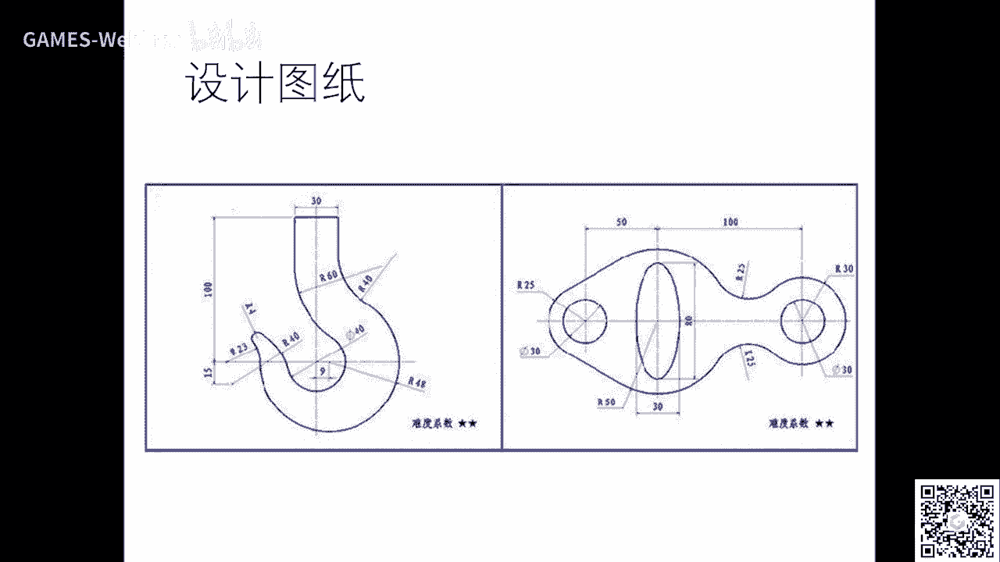
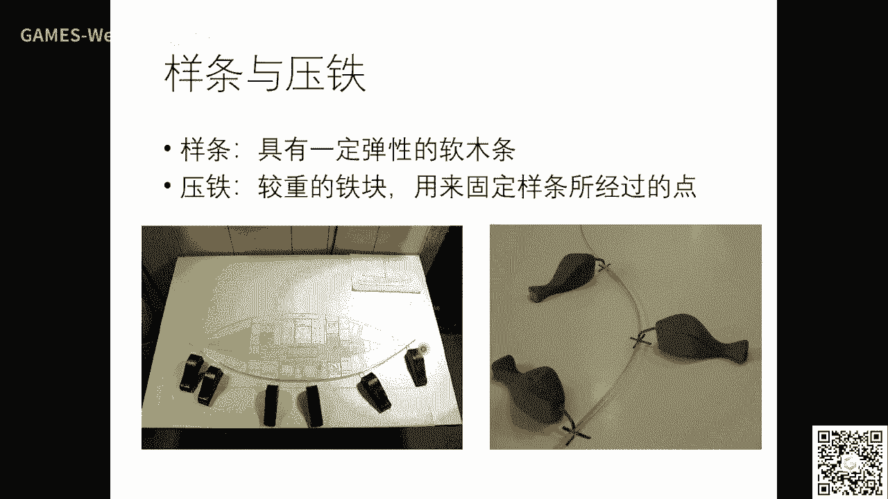
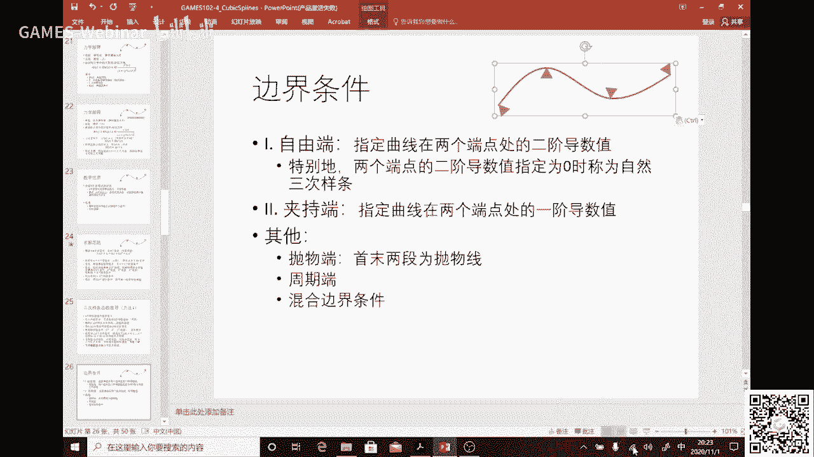
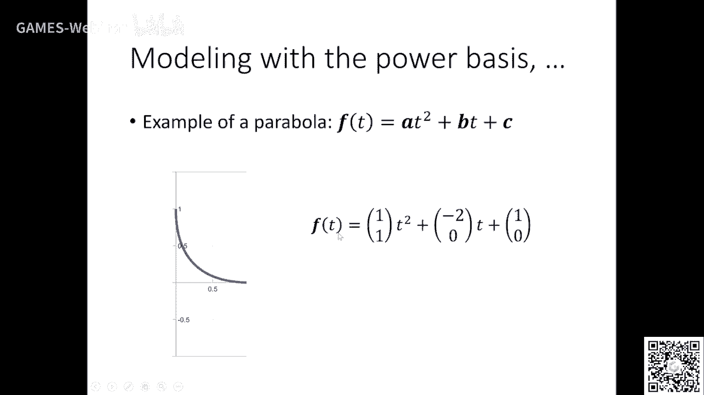
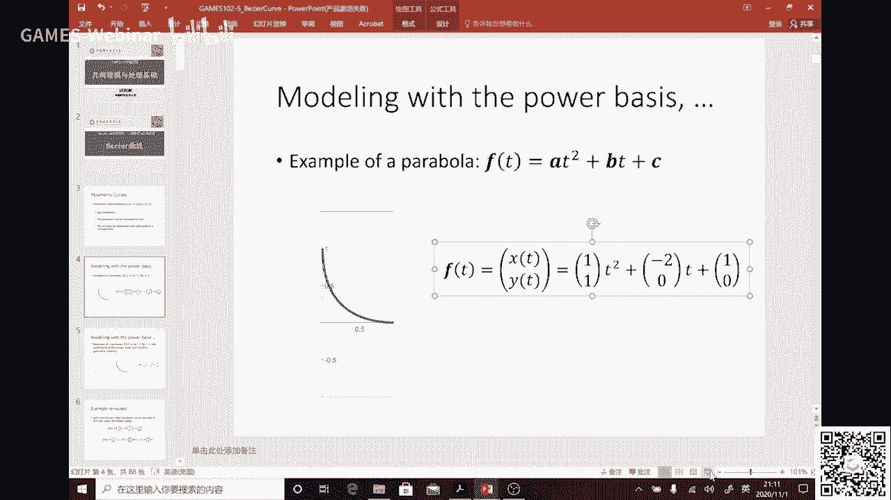
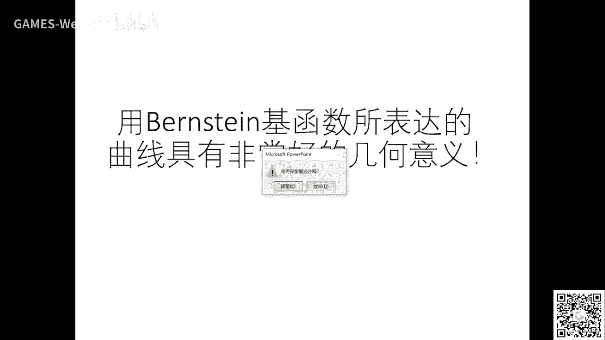

# GAMES102：几何建模与处理 - P4：三次样条函数 🧮


在本节课中，我们将学习三次样条函数。这是一种在几何设计和工业建模中至关重要的数学工具，用于通过一系列控制点生成光滑的曲线。我们将从三次样条的历史背景和力学原理讲起，逐步推导其数学表达，并探讨参数连续性与几何连续性的区别。

---


## 作业情况回顾 📊


上一节我们介绍了参数化方法对曲线拟合的影响。本节开始前，先回顾一下作业三的提交情况。




作业三总体提交了41份，内容相对简单，核心是实现有序点列在不同参数化方法下的插值。总体完成效果良好。



以下是几位同学的优秀作业展示：

*   **同学 lxt**：利用游戏引擎或类似工具制作了交互界面，背后算法由C++实现。可以实时拖动控制点，并生成参数曲线，支持差值执行和B样条等不同方法，不同颜色代表不同参数化方法，结果直观。
*   **同学 常清俊**：在报告中清晰展示了相同点列在不同参数化（弦长、中心、均匀、Foley）下的拟合结果。当点分布均匀时，各种方法结果相似；当点分布不均匀时，结果差异显著，例如均匀参数化可能导致曲线出现自交。
*   **另一位同学**：使用高斯基函数和RBF神经网络进行拟合。报告展示了对于低维（如一维、二维）数据，可以直观判断拟合好坏；而对于高维数据，则只能通过损失函数值来判断。

部分优秀作业和报告已挂在课程主页，可供参考。

---

## 三次样条的起源：从物理样条到数学函数 📐


上一节我们开启了几何设计的主题。在计算机出现之前，设计师使用一种称为“样条”的物理工具来绘制自由曲线。

设计师会先确定一些关键点（形值点），然后用沉重的“压铁”固定这些点。接着，他们将一根富有弹性的软木条（即样条）绕过这些压铁，让其自然弯曲，从而描出一条光滑的曲线。

这就引出了一个核心问题：这条由物理样条自然弯曲形成的曲线，其背后的数学表达式是什么？这正是三次样条函数要解决的问题。



从力学角度分析，软木样条可视为一根弹性梁。在小挠度（弯曲角度不太大）的假设下，通过欧拉-伯努利梁方程进行推导，可以得出结论：在两个压铁（形值点）之间，曲线的数学表达式是一个**三次多项式**。整个样条曲线因此是分段的三次多项式。


选择三次多项式是因为：一次函数是直线，表达能力不足；二次函数是抛物线，没有拐点；四次及以上多项式计算不稳定且拐点过多；三次多项式恰好有一个拐点，既能表达丰富形状，又相对稳定。

---

## 三次样条函数的数学推导 🔢

既然已知曲线是分段三次函数，那么如何推导其具体方程呢？核心思路是利用已知的形值点和曲线段之间的连续性约束来建立方程组。

假设有 `n+1` 个形值点，则中间有 `n` 段曲线。每一段三次多项式有4个未知系数，因此总共有 `4n` 个未知数。

我们需要建立 `4n` 个方程来求解：
1.  **插值条件**：曲线必须经过每一个形值点。这提供了 `n+1` 个方程。
2.  **内部连续性条件**：为了保证曲线整体光滑，在内部 `n-1` 个拼接点处，要求相邻两段曲线具有相同的函数值（C⁰连续）、一阶导数值（C¹连续）和二阶导数值（C²连续）。这提供了 `3(n-1)` 个方程。

目前总方程数为 `(n+1) + 3(n-1) = 4n - 2`，比未知数 `4n` 少了2个。因此，需要额外指定两个**边界条件**，通常在曲线的两个端点处给出。常见的边界条件有：
*   **自然边界**：指定端点处的二阶导数为零。
*   **固定切线（夹持）边界**：指定端点处的一阶导数（切线方向）。

添加两个边界条件后，我们就得到了一个 `4n` 阶的线性方程组，可以唯一确定所有系数。

在实际推导中，常引入中间变量简化计算。例如，设每个形值点处的二阶导数值为 `m_i`。由于每一段的三次函数的二阶导数是线性的，可以表示为两端点二阶导数的线性插值：
```
y_i''(x) = m_i * (x_{i+1} - x) / h_i + m_{i+1} * (x - x_i) / h_i
```
其中 `h_i = x_{i+1} - x_i`。对此式积分两次，并结合插值条件与连续性条件，最终可以得到一个以 `m_i` 为未知数的线性方程组。因其系数矩阵是三对角且对角占优的，可以使用高效的**追赶法**求解。这个方程组在样条理论中称为“三弯矩方程”。

类似地，也可以以一阶导数作为未知数推导，得到“三转角方程”。求解思路一致。

---

## 从函数到曲线：参数样条 🧵

上一节我们介绍了函数与曲线的联系。三次样条函数是 `y = f(x)` 的形式，存在多值性问题（一个x对应多个y），无法描述任意曲线。

将其推广到曲线非常直接：将曲线视为一个向量值函数 `C(t) = (x(t), y(t), z(t))`。对三个坐标分量 `x, y, z` 分别独立地应用上面推导的三次样条函数方法（基于相同的参数 `t` 序列），然后将结果组合起来，就得到了**三次参数样条曲线**。

参数 `t` 的序列（参数化）可以通过弦长参数化、中心参数化等方法获得，这在之前的作业中已经实践过。

---

## 连续性的深入：参数连续 vs 几何连续 🔄

我们之前用 `C0, C1, C2...` 来定义连续性，这称为**参数连续性**。它要求曲线在拼接点处具有直到n阶的**相同的参数导数**。

然而，参数连续性依赖于具体的参数化方式。一个经典的例子是：将一条直线段用两种不同的参数化方式表示成两段，在拼接点处计算参数导数，结果可能不相等，从而被判定为 `C0` 连续而非 `C1` 连续。但这显然与“直线是无限光滑的”几何直觉相悖。

问题在于，参数连续性受参数选择的影响，不能完全反映曲线内在的几何光滑性。

因此，引入了**几何连续性**的概念。其定义是：如果存在一个参数变换，使得两条曲线在拼接点处达到 `Cn` 参数连续，则称这两条曲线是 `Gn` 几何连续的。

几何连续性是曲线本身的内在属性，不依赖于参数化：
*   **G0**：与 `C0` 相同，即点连续（端点重合）。
*   **G1**：切线连续。要求两段曲线在拼接点处具有**相同的切线方向**，但切线向量的长度可以不同。
*   **G2**：曲率连续。要求两段曲线在拼接点处具有**相同的曲率**。曲率是几何不变量。

`Gn` 的条件比 `Cn` 更宽松，为设计师提供了更大的灵活性。在许多图形设计软件（如 PowerPoint、Adobe Illustrator）的曲线编辑工具中，调节顶点类型（平滑点、角点）本质上就是在控制曲线的几何连续性（G1 或 G0）。

---

## 贝塞尔曲线简介：更直观的设计工具 ✨


最后，我们为下节课内容做一个铺垫。之前用幂基 `{1, t, t^2, t^3}` 表示多项式曲线时，其系数（控制点）与曲线形状的关联不直观，不利于设计。





工程师皮埃尔·贝塞尔发现，使用一组称为**伯恩斯坦基**的函数作为新的基，来表示同样的多项式空间时，其系数（称为控制顶点）具有极佳的几何意义：
*   曲线的起点和终点分别与第一个和最后一个控制顶点重合。
*   曲线的形状被“拉向”中间的控制顶点，整体趋势与控制多边形（依次连接控制顶点形成的折线）相似。

这种用伯恩斯坦基和控制顶点定义的曲线，就是著名的**贝塞尔曲线**。它使得设计师可以通过直观地拖动控制顶点来预测和调整曲线形状，极大地便利了几何设计。我们将在下节课详细探讨它的性质。

---

## 本节课总结 📝

本节课我们一起学习了：
1.  **三次样条函数的起源**：从物理样条的力学原理推导出其分段三次多项式的数学本质。
2.  **三次样条的数学推导**：通过插值条件、内部连续性条件和边界条件建立方程组，并介绍了以二阶导数为未知数的“三弯矩方程”求解方法。
3.  **参数样条曲线**：将三次样条函数应用于各个坐标分量，以生成参数曲线。
4.  **两种连续性**：理解了依赖于参数化的**参数连续性**与反映曲线内在光滑性的**几何连续性**之间的区别与联系。
5.  **贝塞尔曲线引介**：了解了使用伯恩斯坦基函数能带来更直观的几何控制，为后续学习打下基础。




通过本课，你已掌握了二维矢量图形编辑（如软件中的曲线工具）背后的核心数学原理——三次样条函数。