# GAMES102：几何建模与处理 - P5：Bezier曲线 B样条曲线 - GAMES-Webinar - BV1NA411E7Yr

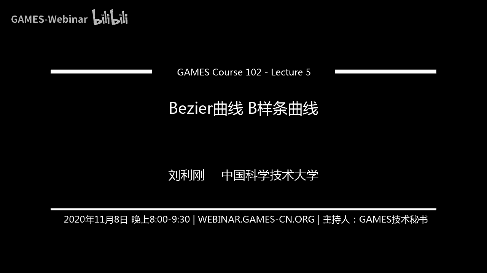

啊同学们那个今天我们课程开始哈，啊今天我们准备啊把那个北这曲线讲完。

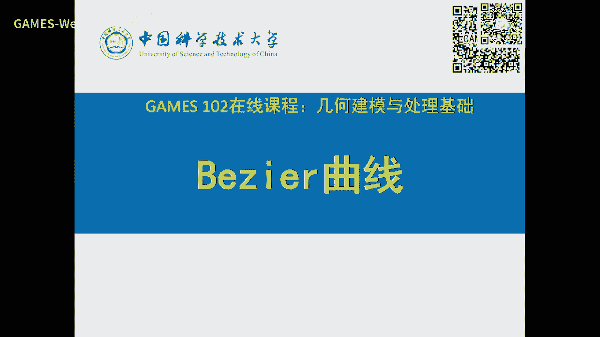

上周我们简单开了个头哈，我们回顾一下啊，在前面四，此刻啊我们重点很慢的比较详细的介绍一下函数或者叫曲线的拟合，那函数是单变量曲线，你可以把它看成是那个参数化的参数型的，已经多元的。

那么在我们这个实际造型中呢，啊有一个词叫逆向工程，建工程大家可能也或多或少听到过，就是说在早期中国计算机发展史的时候，像我们的工业也比较落后的时候，我们很多产品啊是是无法就不知道它的那个曲面是什么。

就没法制造，这时候呢我们就通过购买国外的一些这个产品，比如发动机叶片啊，或者是一些这个铸模的一些机机械鳞片，然后呢我们就通过去仿造它啊，就是我上面就因为这个曲面本身我不知道是是什么，是什么表达。

那么我们就上面踩点，通过踩点的话呢，把它勾勒出一些哎轮廓，然后再去模仿他，当然这只是外形上的一个模仿啊，或者是一些性能，这个我们这个课不是我们的内容，但是我们先把它外形就说逆向工程呢。

就是把产品的外形把它逆向，把它生成出来，那么这就涉及到一个联合，就是我们往往可以采到这个产品的表面上的一些点啊，虽然我们这里是一维表达，是二维，三维，后面我们都会讲到啊，通过拟合方法去做。

所以函数拟合曲线拟合这个非常重要的一个内容啊，只不过它用的函数形式是不一样的好，那我们来从带着观点来看，就是给了一些点，我们要去找一个好的函数啊，这个好的函数是什么呢，是有不同的评价。

然后心理和这些点呢，那么我们希望从一个函数池子里面啊，函数在池塘或者叫结合里面去找一个函数，那么这个函数池子呢为了表达方便呢，我们会定义一种基啊，这个机呢当成一个这个函数空间啊。

比如说二次函数就是这样的形式，a b c啊是待定的啊，去求，那么你去用这个好的函数的度量就可以求证那个这个函数是吧，就是我们前几节课讲的拟合啊，那么这个如果是参数性的话，就是这样一个形式。

它有它有两个分量啊，这样的话就可以表达范围，比函数是要广一点好了，我们再来看这个刚才说的含这个这个一个抛物线啊，比如说x分量y分量分别有，这样我把它写成向量形式，就是x是上面这三个值的啊。

这个这个t平方的幂，这组合y也一样，那么如果我把xy联立起来，这个这个接前g函数前面这个系数啊，就是空间中的一个点，一个表达x分量，一个表达y分量好，那么这样表达的话呢。

你可以看到这个mg函数前面这个顶点啊，就成了一个各个分量的一个系数好，那么我们从几何观观点，从另外一个观点来看，如果我们把这些点看成是我们用户要的，那么是不是t平方t这个密集啊，这是一啊。

这个密集是不是看成去组合这些顶点的一个阻系数，也就是说我用户的假设是啊，这个这些顶点是我不要的，那么我就g函数呢可以看到是另外一个这个这个全，那么这个呢就是一个几何观点啊，就是说同样一个表达。

但是代表他的观点是什么意思呢，就是我从这个函数集合里面去去去找一个这个这个系数是吧，好结构点的什么，我顶点给进，把把g函数看成是一个组合系数，那么我们看一下，如果是这个g函数如果不够好的话啊。

你看一看诶，我我这个顶点在这，第二个地点是在这，第三点是在在这，而曲线的是在这，就这个曲线跟这个三个顶点啊就就没什么关系啊，这这个原因是什么呢，原因就是这个g函数啊可能没有太多的这个几何意义。

或者说选的不好是吧，如果这样的话呢，我用户如果想想去调整这个曲线啊，想什么呢，我就想去调整这个系数，这个系数呢是一个点，那么如果把它拖到这里来，曲线可能一下子变得很大，就不一定不一定是这个样子了。

可能可能是变成这个样子了，就导致我用过啊去交货就不直观，没有那么几个意义是吧，所以这里呢就又导出一个这样的问题，g函数的选择很重要啊，如果你要去做设计好。

这时候呢就我把今呃这个我们的课比较重要的两个概念，一个叫建模就建模啊，两种形式啊，一个一个叫重建啊，英文叫reconstruction，什么意思呢，就是逆向工程就形状已经有了。

我呢去通过采集采样点去把它拆出来，当这个猜你要猜它的函数形式，函数奇函数啊，或者或者其他的一些性质，那么就通过理论方法，这个我们已经这节课讲得很很多了啊，还有另外一个呢就叫设计，设计是什么呢。

就用户呢它会发挥自己的设计美学的或者工程的一些经验，简单的从一个形状进行编辑，比如说我从一个圆开始编辑一个船的形状，飞机的形状行不行啊，那么这个叫设计，因为那个那个物体是不存在的。

那个物体呢是存在于设计师的脑袋里面，他呢只不过通过这个交互的方式，希望通过一些这个方式来把它把它做出来啊，因为他们可能可能也会可能会有个参考，但是呢很多时候呢是他是从凭自己经验啊，那么这个呢就是设计。

所以这两个从这个中效建模啊，像现在的扫描啊，都是叫重建啊，扫描仪呀，就什么我们我们的地球，我们的物品是存在的，你只要把它采样点到来，再去把它拟合出来啊，重建就重建，还有可能叫设计。

或者教学设计师提供工具，那么这个一个一个比较这个重要的一个要求什么，你要交互式啊，你要非常好的直观性啊，那这时候呢就是说我通过一些点，用户可能通过少量的一些点就能控制出一个曲线就好了是吧。

那么那么这些点呢这个曲线呢可能只有这些点通过一些组合组合，就是记函数组合去把它组合出来是吧，t从零变到一，这个曲线呢就一个一个点一个点就出出来了，那么就形成一个光滑曲线，这时候呢就要求g函数呢要非常好。

要么要很直观，刚才我们说的幂函数就不够直观对吧，刚才那一页好，那么我们如果把这个幂函数t平方t和一写成另外一种形式啊，这个形式我们以前提到过这个形式叫波尔斯坦基啊，光自产机如果写成这种形式。

你看他们也是二次的，这个也是二次的，如果把它改成这个形式的话，我们来看看会发生什么样的现象，好诶这个发生变成这个样子以后呢，这个顶点系数啊，就跟这个曲线啊就就很很相关的，一头一尾一中间啊。

刚好是这这三三个点，这时候呢哎我这个这个这个曲线形态呀，就跟我三个系数是个点就非常相似是吧，因为我多边形，我这个是这个这个样子，体现出这个样子，当然后面高次也一样啊。

这个这种设计方式方法呢就非常非常直观，能让艺术加压，让这个设计师啊很方便的去控制这些顶点来改变这个曲线的形状啊，使得这个这个他的那个那个编辑啊，设计的这个啊方法就非常非常灵活啊。

好那么下面就介绍这个分散机啊，上节课我只是简单提了一下分散机呢在数学上存在了几百年啊，这个早就有了啊，它的形式是这样啊，就是一个1t一减t的这样两个次数加起来是n啊，总次数是n次，多项式。

你可以看到它也是t的，多项式是n次多项式啊，那么中间有一个组合系数，主要系数在我们那个时候呢是写成这个样子啊，现在你们可能主要系数是写成这个样子啊，就是从n个里面拿个球啊，这这样一个一个一个一个个数啊。

这个大家都肯定接受过好，那我们这里有个记号，上面有个括号呢，就表示这个n次啊，那么下面i呢是表示第几个，那么i呢是有零到n啊，012345的线n有n加一个奇函数，所以n次多项式有n加一个减函数是吧。

一和这个t t平方啊，到那个，所以呢它也跟密集一样的，所以它等价于等下，我们也会证明它也组成了不高于n次的多项式的g函数，所以它的组合跟那个幂函数组合是造成的空间是一模一样的，他们可以相互转化。

那么国产机呢这个在历史上存在着很多年，只不过大概在上世纪60年代，50年代由法国的联络公司，人家公司是做飞机的啊，是造造飞机的，因为工程师叫比北zl，他呢把它用来做矩形设计。

所以一下子就变成非常非常方便和灵活，那么啊那个人们为了纪念这个这个发现吧，这个啊那么就以北热曲线来命名啊，那么这个但是奇函数呢我们还是仍然叫波斯坦基，因为博尔特产机存在了很多年。

所以我们不把叫不把它叫北极二基，因为体积函数是存在的，但是呢你说我那个呃一定要把它叫做北热机，临时叫叫也是行的啊，好我们来看看呃比较低阶的哈，这是连接的就是一个常识函数一啊。

那么呃我们先限定在001之间啊，好那么这个是一阶啊，一阶就是一减t一减t是这个函数啊，t是这个函数是吧，两两间啊，二那么是这是b0 绿色的这b这b23 也一样，b0 b1 b2 b3 啊。

这个绿色的是b一城市的b2 啊，蓝色的b3 啊，可以看到，如果你简单的用mac去画一画，就好像把这么几个曲线出来，当然如果你这个次数n啊再高一些，同样的啊可以幻化出来啊，好了，那么这个这么风扇机。

这个就是这么漂亮，就是说我b0 b1 b2 这个三三个顶点，然后如果你用二次的这个多项式啊，这个北北辙去画一下，就就就是这三点点是这个样子，曲线变成这个样子啊，就是很难直观啊，你看这个点。

如果你把它拖到这里来啊，那么这个曲线呢可能就会更翘一点而已啊，这个很容易用一个程序做起来好，也就是说我们上节课讲到这儿，用不用上机啊，给它曲线非常好的，好的几何意义啊。

这这个你可以看到这个跟我们以前说的函数没有没什么两样，止步呢我们换了个角度来看，是什么看呢，我们把顶点p i你pi以前是我们基函数系数，现在怎么我把它看成另外一个点，把g函数看到什么。

看到是组合pi的一个全是吧，好那么这个就生成一个函数或者叫曲线啊，这个这时候呢就我们p i是为主要，那么bi呢是它的组合系数，也就是说我比如说你334p0 p1 p2 p3 好，给定个t t等于零。

那么b i就生成四四个系数，那么是由p0 p1 p2 p3 p42 p1 p2 p3 组合出来一个点，好t等于0。10。2就在这啊，p b等于0。3啊，又又又生生成一个点，并且0。4啊。

好那么这样拼的从0~1光连续变化就形成一条曲线，所以中间的任何任何一点就是t在某个时刻属于0~1的一个一个点，那么t从0~1变化就生成一条曲线。

那么这个曲线上每个点都是由p0 p1 p2 p3 这四个点组合出来的，这组合是组合的，是这个权呢是由t变化而得得到的啊，所以从这个观点呢几个观点来看，哎我们同样一个函数形式，我把pi看的是我要的东西。

b g函数看着是个这个组合系数啊，所以bi的特性决定了这个曲线的特性啊，好那么别的比这个曲线的定义就这样啊，给定n加一个点啊，我们这是用三次啊，n n n n等于3b0 b1 b2 b3 。

那么呢由那么这个呢我们一般把它叫做控制顶点，就把这个系数叫控制顶点，因为它是控制这个曲线的这个这个一些平面上的点啊，我们这是二维的啊，单参数，那么呢这个把它连起来，顺序连起来，这个叫控制多边形。

那么由这个空中顶点跟中多边形，再由这个g函数一组合啊，就可以组合出一条光滑曲线啊，这个就叫北侧曲线啊，如果这个是波产机，就叫北色北色曲线，当然人类历史上啊，那么自从比较这种形式出来以后。

你把奇函数做个变换啊，把它去产生很大的很其他的一些类型的这个基函数也有很多人做啊，比如有些人去用这个这个机函数，生成一个更靠靠近这个多边形的一个曲线啊，比如说过去线等等啊，那么这样还有很多这种奇函数。

我们不去展开，那么大家这节课呢我可能还是讲它的原理，它的思想就是你们懂得懂得这道理以后就就能看得懂啊，早年一些文章为什么去构造那么多基函数，因为构造奇函数有它的性质是吧。

那么我们分散基函数且性质我们马上就会讲到，所以呢一条曲线通过这样的方式构造出来以后，这个基函数对这个曲线的形态是构成了非常非常关键的一个性质，所以曲线的性质来源于这个基函数的性质。

因为我顶点那是用户所看得到的交互的啊，好嘞，那么这是一些典型的三次曲线啊，3334g函数，这个这个在右上角大家可以看到，那么如果是这个这个形状1234，那你可以看到啊，还有这种带拐点的啊。

p0 p1 p2 p4 啊，你可以看到如果这个充值变形有折折一折，那么曲线就可能会有个拐点是吧啊，那么呢还有一个p0 p1 p2 p3 ，如果是可以控制顶点呢，这个是是共线。

那么这曲线就是p0 到p3 的这条线段啊，当然它也可能会产生自交啊，如果是p0 p一啊，p2 p3 是这样排列啊，那么它有可能直接啊，这个时候反正这三次有这么多形态啊，好那么这是高次的，这是n等于六啊。

高次你可以看到就是你你画了多少条曲线啊，这这多少多少个顶点，那么就有一条曲线出来啊，那么那么这里也也是六指，那么当然这个如果你要生成复杂的曲线啊，这个你可以用多段。

比如大家可以看到这个瓶子的侧面这一段里面这一段，那么右侧面是一段啊，顶面是一段，所以你可以用多少多段北子来拼接啊，生存，因为这一段应该是c0 光滑的，所以它是啊这个拼起来的好，那么这个同样的概念啊。

你你只要是单单参数啊，单参数，那么我们以前讲过单参数，只不过到空间阿三阿三空间只不过是x y z x t y t c t而已是吧，所以他他也应该是西格玛这个这个这个pi跟系数。

只不过ps 4空间中的空间中的一些点是吧，像这里b b0 在这b1 b是在是在这是吧，那么这是形成了空间中的一条曲线啊，它的性质也一样可以讨论，所以我这里只提一下，但是你说定义四维五维中的曲线可不可以。

只要是单参数，它的本质为主都是一，所以都是定义了曲线好，那我们呃下面就讲一讲这个北热曲线的性质，为什么它这么这么有名啊，就是在在设计中这么用了这么多，因为它有很好的性质，那么这个分散机的这个这个定义。

这个就在这啊，那我们大家要非常熟悉啊，cn i ti一减t n减i啊，这个就是分散机，那么这个基函数就可以看到我们这里画了一个呃不同的次数的，这个这个基函数，你看到它是左右最对称的。

就是d个跟dn减x实际上是完全一样，只不过关于这个中点是对称，你可以看到t和一减t刚好是关于这个中点对称嘛是吧，还有任何一个g函数它的最大值啊，实际上是就是在n分之i中第啊第零个应该是在零。

第一个视频应该在n啊，在在在一，那么中间的是n啊啊那个m之2/1啊，所以它的最大值还是比较比较均匀的分布啊，这个这个这个基函数好，那么还这个性质很重要，这个叫叫正性，就基函数呢你可以看到都是在零之上啊。

这个绿的成分的就是啊，这是第零个，这是第一个，这第二个计数啊啊那所以证很容易证明啊，因为它的表达式就可以看出来，还有一个呢它有个权限啊，这个性是非常重要，全是什么意思呢，我任何一个t。

这里是不是有n个n个基函数的值啊，它们加起来的和一定等于一，无论这个t是0~1中间哪哪个值啊，0~1中间哪个值啊，你只要取个t啊，那么在这里n个函数在这里上升值加起来，重点一。

这个实际上就是这个这个叫weight权，叫规权全加起来等于一是吧，这个性质非常好啊，那么有这两个性质呢，大家可以想一想，一个是加权平均这个ps是吧，这是曲线啊。

然后呢它又等于这是不是一个非常好的规划的一个加加权平均是吧，所以呢这个由正性加权限呢就推出来这个曲线是具有突破性啊，这个这个这个叫突组合，如果是阵型加强型，叫叫出组合，就这个叫线性组合是吧。

有基函数组合这个pi，所以呢组组组合就一定有突破性对吧，所以你可以看到这个曲线啊，这个多边形里面，无论这个怎么分布啊，这这是三阶的，那么这是多阶的这个这个阴影区域就是这个控制多边形的图标。

所以呢你这个曲线跑不出你这个图标范围之内啊，那么第二个呢就即兴这个已经证明了啊，就刚才讲了，我还没证明，但是这个啊我们这课不会去讲太多的这个理论推导，你去相信他这个是是那个不高于n次的。

因为同一个空间它有不同的基，所以啊本产机也是不高一次n次的多项式，那么这个密集也是，所以他们两个g函数之间一定是可以相互转化的，也就是说任何一个g函数都可以由它们表达。

就是像这个等于这个乘上第一列是吧啊，那么第二个是成了第二点啊，那么同样反过来这个幂函数也可以由它的去表达，只要把这个绝境的逆乘乘过来就可以了啊，所以那这个都是因为我们维数都是n维啊。

好还有一个就是递推式，这个就是我稍微提一下，就是n阶的这个一个基函数等于n减一，接着两个减个减和相邻减函数的这个加权，这个权呢是t和一减t啊，这个性质也非常容易证明啊，这个这个性质用来干嘛呢。

这个以后啊怎样可能会减少啊，也就是你可以看到从这里来就是一个g函数，是有两个低阶的g函数，通过一个组合声是吧，把它提升，因为提升的过程中呢是有两个线性组合，一减t因为中间带了个t。

所以一定会提高一个次数，因为t是变量啊，所以它会保存一些好的形式，禁止也会怎么让光滑接提高，因为你这个乘乘了一个t以后，你再求导它，这个导数呢就多多一些啊，所以它会提高光滑性啊，这个呢呃我先卖个关子啊。

这个等一下就会回忆起这个这个公司的好处好，那第二个性质呢就是端点差值，就是啊这个你可以看到除了第零个基函数在这是一以外，别的在这里都是零啊，同样在这个端点最后一个奇函数是一比，特别是零表示表示少数。

为什呢，表示这个曲线是有端点差值，因为只有第一个啊，就是这个曲线啊，就是差值两个一头一尾啊，无论你这个贬值曲线是怎怎么怎么怎么次数高啊，它是断点差值啊，所以这个别的选项有很好的性质，他差值手握两点好。

这是这是导数，你对崩散机进行求导，可以看到啊，这个这个导数公司我我就不推了，这个如果大家有一点点这个最大能力去求导，对对对，这个把这个式子带过来，对t求导，然后再经过一些简单的转化啊。

这都是大一的或者高中的知识啊，这些就会转化出来，好那么呢这里呢有一个啊，这里f一撇t等于这个，然后后面有一个这个啊，这个我把它具体化一下，就是也也是看端端点的啊，有零一，那么。

我还是以这个三次为为为例吧，啊好三次为例，p0 p1 p2 ，那么这个几何意义我稍微解释一下啊，好两个点在零和一之间啊，在零和一这两个端点做差值，这没问题是吧，p0 等于啊f0 等于p0 。

这个啊这里这里这里写错了，这里应该是p p3 啊，就是端点差b3 好，那么f这个曲线在这个零上的一个导数，导数有两个分类嘛，就是切线这个现象可以看到是第一条边跟它完完全吻合，只不过多了个倍数。

如果这是三次的话，这是应该三倍是吧，也就说是什么呢，曲线在这一点的导数切线方向跟他完全重合，但是大小是这个长度的三倍啊，啊你看是吧，同样这这曲线在这个点的导数也是跟他完全重合。

但是呢长度是p2 p3 的三倍，所以你看到它不仅手握相应那个相连啊，这个相间，而且线线呢就是手握的两条边，那么最高阶段话几何意义就不是那么明显，但是也可以很好看啊，p0 减去两倍，p一加上p0 。

你把它变换一下p啊，p2 加上p一除以二减去p一这个重重的两倍嘛是吧，好什么意思呢，是p2 加p0 ，就是这两点的中点跟这个点的方向的两两倍，所以这个点的导两阶导数是这个方方向啊。

那么同样这个点的两边导数呢应该是14，只是四个方向啊，所以这几个e还是挺明显的，但我们用的最多的是两两个，一个是端点差值，第二个切线啊要沿着手握的啊，这个边，那么这个升阶升阶的意义呢。

就是因为你风扇机啊，这个这个dj的n跟n加一啊，这个有这样一个关系啊，那么很容易把它推导出来，所以呢我我一条这样的，这里是一个啊，本来是1p0 p1 p2 p3 是一个是一个三次的。

那么呢我通过这个组合就可以通通出来，就是这里有一个点，这里有个点，这个点就变成了四次，就这个黑色的曲线呢是一个被呃，是一个呃是一个四次北朝的曲线的共同多边形，那么它生成的曲线跟这个由原来的p0 p。

1p2 p3 生成的30多万的这个曲线是一模一样的啊，就是它升阶，但是就曲线是保持不变，但是你空景点呢多多了一个次数变成四次，所以从这里可以看到，就是看起来这条红色的是由这个黑色的五个空。

五个顶点定义在40北朝的曲线，事实上它本质是三阶的，所以这容又引起一些曲线的降阶的问题啊，我这里不去讲是吧，实际上在这个如微笑曲线是由dj升级过来的话，它的次数就是那个dj的次数啊。

所以只是表面上看起来它的四次就是次数比较高嘛，而为了节省这个存储量，我们希望它次数越低越好，所以有很多人去做降阶，当然这个是早年很多文章啊，好在这里也一样，就是啊这个每条边加一个顶点啊，就就声音阶。

同样你不断的递归可以升到五阶，六阶，七阶八阶都可以好好，那么本周曲线还有另外一个非常重要的性质，就是这个decastle的算法啊，这个这个这个应该是一个拉拉丁文decastle。

就是呃完了这个就卡卡卡斯特罗吧，就是以前古巴的领导人哈给castle的算法，这个算法呢是发现了一个北辙曲线的一个非常重要的性质，最近出的就是由由刚才这个递归时所发现的啊，所表达的就就就这实质啊。

我们看一下好，这是这个这个算法到底在做什么呢啊我们始终得用这样一个式子，因为刚才g函数是不是有有这样一个地推死啊，你把g函数代呃，把那个式子积函数带进来，这样就拎出来就变成了这样一个关于顶点的一个组合。

好我们来看一下一减t我们把这两两个顶点啊，由一减t跟t t先任意给取一个值，这个值是0~1之间就行了，比如取取取1/3啊，取1/2好，那么这两个点就得到一个新点，那么这两个点呢就得到一个新点。

这两个点叫做新点，就就是这一列的啊，好同样操作我再做一次，那么由他们两两个人得到新点，因为他们两个得到了心点，就是这一列的值是吧，同样最后我在这两个两个点则得到了新点，就就这个点可以证明。

这个点一定是这个曲线在t这个当前值的这样一个位置啊，也就是说我通过这样一个线性的组合了三次，就得到了曲线上这个点啊，这这个选项上这个点，而且还有好多好多限制，我这里统一讲一下啊。

就是通过这样一个分割分割啊，分分了几次以后，那么就得到血线上的一点，并且1234，因为这个点把曲线分成了两段，因为一个左边这一段，一个右边这段可以可以，我们可以肯定这是个点。

就是表达这个值曲线的这个北这空空的顶点，所以这一段这个曲线是由这么四个控制顶点所表达的三次北辙，同样这边的一半是由123是所表达的这个北条曲线，所以这个算法呢不仅是求到了学上的一个点。

而且把这个选项上这个分成左右两段的北泽二，表达的控制定点都求出来了，而且最后一条边就是跟这个曲线在这一点是相切，所以所以这条边就是它的切线对吧，这个这个这个显然因为因为这这个边就是跟它相切是吧。

这条边跟它相切，而且是中点，所以它们线性相等，所以这是啊这个这个直接连续好了，所以这个算法呢你要去求曲面上的一个点啊，给另一个t你要去求一个点，就是这这么简单的一个一个递归啊。

每就是每次运算呢都都是线性线性组合啊，所以算起来非常非常快，也非常非常稳定，因为线性组合不会造成太多误差积累是吧，所以它技能非常稳定，并且可以证明他的那个时间和这个占用空间并不大啊。

啊当然这个算法呢这个也不是完美的，因为它一次给定个t只能只能算一个点是吧，历史上还有好多些算法，我同时算n个点应该怎么算是吧，会有更好的算法，我这里不讲啊，只是告诉大家有这些一些一些因素要考虑。

因为你画条曲线，你总得采用很多点是吧，那么一个检测方法与for从t从零到到一做循环t的音t加等于零点，0。1就取十个点对吧，你你算算十遍，把它连起来就是曲线，如果是0。01，那么就是100个点是吧。

就就就画的更密了啊，好了，那么这个对抗算法是性质啊，我就总结一下啊，总是用这个去去做剖分，可以看到啊，这个呃t我取1/2就找到t等于1/2的点是吧，我去提取1/3就得得得到1/3这个点。

只不过普分的时候呢都是用1/3来来补分啊，只要保持这个普分的比例，我如果去等于2/3啊，就得了2/3，在这个点就是绿的这个普普普门过程是吧啊那就这样，所以他结论啊，你几个意见也很强。

把分成两个子北侧曲线，并且空中控制顶点也找到了啊，那么这个性质非常非常好，这个性质啊，这个如果深入研究的话，他可以一个是做离散是吧，就是把取线变成多边形，就是因为你要踩踩点嘛是吧。

还有求多项式根啊等等啊，比如说leeping算法，我这里不展开就会讲，有些同学呢这个可以去去看一些相关的一些这个这个课程啊，初级好比j讲完了啊，我这北热就讲讲到这里。

那个其他的这个啊大家都通过自己的自学去看看北辙的，因为北这个书太多了啊，并且已经很容易躲，我今天把主要的一些北京的一些来源啊，这个一些呃这个呃性质给大家大家讲一下啊，大家脑袋里就有个印象。

去看书呢就不会太突兀啊，所以北京的这个奔驰产机啊存在的，只不过这个北周这个人呢把它用来做做了设计啊，发现他的这么好的性质啊，用来做飞机的这个造型，他虽然是一个非数学家啊，是个工程师啊。

但是呢它产生影响非常大，所以像现在所以这种形式的这个就叫北辙是吧，诶好那么下面一个这个就也是以前讲过的哈，就是我有k个点啊，那那那那么你实际上这就是作业式的任务是吧。

你怎么去生成这个中间插值它的一个分段的样条是吧，那么这个上节课讲的那样强呢，它这个整体方程它要把所有点全拿来啊，这个一起去生成这个这个这个曲线是吧，那么上节课我们也讲了，就是你可以改变这个连续性是吧。

拖动这些这些这些感是吧，连续性好，那么我可不可以两每两个点之间来生成，用北泽二来也来生成的，就是我中间去去什么去待定两个空军点，那么再加上一头一尾，假如我用三次啊。

那么这样话的就这两个点之间我就生成一条曲线，那么那么下两点之间啊，我也生成一条几条曲线，只不过中间还有若干点是要待定的，那么这里就涉及一个问题，我这里定在北侧曲线跟这一段配的比分体现在这一点。

要保证一定的光滑性是吧，那么问c0 c1 c2 的条件，那么这些待定待定的点需要满足什么条件，这就是两个北周曲线的拼接条件，好好我首先大家我问你啊，四零平行线是不是很容易懂啊，只要这个点是固定。

这个是公共的，那么这两个曲线一定在这里拼牢了是吧，所以c0 非常自然就满足了，那么c1 c c c什么c是这个，切线要连续对吧，而我们刚才知道了，北侧曲线在这个切线啊，是这条边的三倍。

如果是说要左边这个曲线在这一点切线跟右边曲线在这里切线要相等，是不是只要三点共线，战略控线是什么，是切线方向相同，而且切线左右线线是差的三倍，所以这两个曲线段也要相同啊，因为三可以约掉嘛是吧。

所以c一连续是不是很容易找到，就是三点共线，并且p这个点是这两个待定点的中点啊，所以c一很容易推c2 呢啊，这样就稍微缓一点，这样你只要去按照我刚才那个有一个食指啊，你去推也能推出来啊，等一下我来讲啊。

好那我下面更想问大家，我们学过几何连运行，如果我不需要c一连续，应该是怎么设计是吧，有没有有没有什么啊，这个这个更多的设计方法g什么g我只要切线方向一样，可不可以长途不一样对吧，这叫g1 。

是不是上节课我们讲了，那么如果是g一的话是什么呢，是不是只要三点共线就行了，不要求它们相等，就是基因啊，所以你们这次作业你们可以很容易改，随意改成g一是吧，好啊，这就是我讲完了这个平行条条件了哈。

因为曲线比较像，比较简单啊，那么你只要啊这个这个这个把端点的导数啊，这些啊把它列接，你就可以去去推测出来啊，所以c0 简单，这里只要这个点是公共的，你这两个曲线自然是c0 c一啊，c一是三点。

这个这个共线啊啊啊啊。

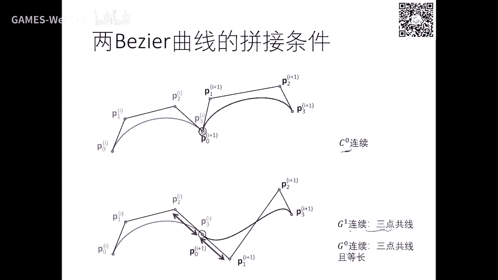

这里写写错了。

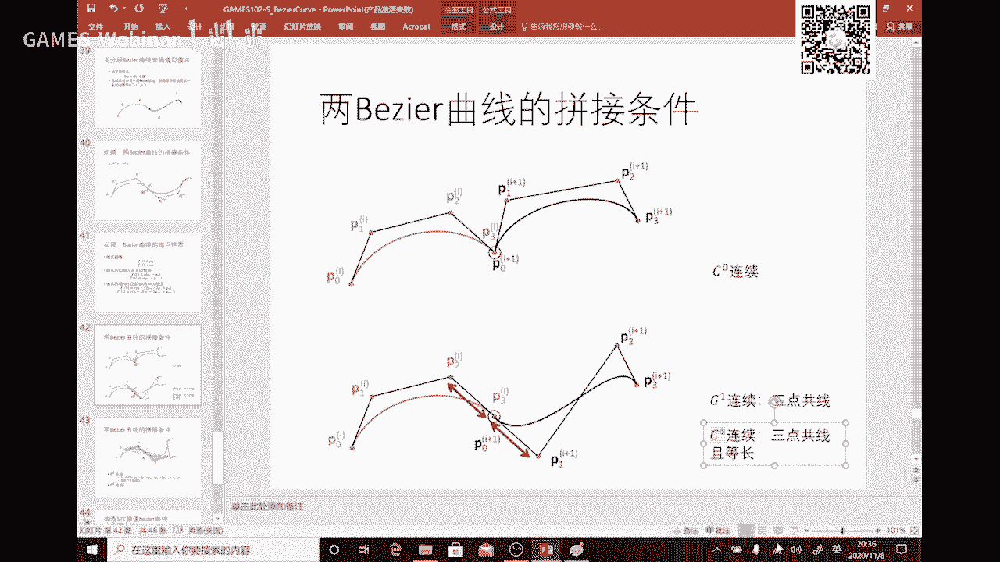

那那个g3 点贡献就够了，因为3g只要切线啊，这个是这个相同就行了啊，放一下相同，但c一的话呢三点共线，且要等等长好好，那么这样呢稍微联系啊，稍微稍微复杂一点。

实验的实际上是你只要把这个几何意义找到就行了，这这这几何意义我放在刚才讲了，就是这个终点，所以终点你你要平行，你要你要想相等嘛是吧，可以推出来这两个阴影三角形是什么，是是相似的，市场就是全等啊。

因为因为因为这两条边是一样的嘛是吧，好所以最最最最这个如果你要判断他的c2 条件，你它的相邻的三点都要拿来做考虑啊，那么这样呢变量就多一点啊，这个既然我们因为我们没去推过，所以我们就就先忽略啊。

好那么构造三次差的曲线，如果有刚才那个经验的话呢，呃同学们可以啊，就是呃我们上节课讲的三四样条啊，是要求解一个global，求解一个整体方程组，如果这个顶点有个点点点，再再再再动一下。

你的方程组是要重新求解的是吧，就比较麻烦，不利不不利于设计，那么有没有更好的办法呢，啊，我这里介绍一个工程中经常用的一个利用几何方法来构造这种分段，三次曲线好，那么你希望每一段都是一个北侧曲线啊。

就是这一段是个本子啊，三次这一段是这段这段哈好吧，我们中间还要满足一定的联系性，是不是都是要带进中间的两个点是吧，那么那么这里两两个点也要待定，这里两个点也要待定是吧，那么这些点怎么来待定比较好呢是吧。

我们介绍一种方法啊，这个方法呢也挺实用，就是就是也是很多工程中用这方法啊，我这里稍微讲一下，假设是1234好，如果你要去这个这个去产生这一段的空空军，然后呢这个点沿着它平行啊。

那么这个长度呢取成它的1/6，啊那么这里也一样啊，那么那么这个方向呢取成这两个点的平行方向啊，长度取线1/6好，1/6，我用红字表表示好，那么这样的话1234所构成的北侧的曲线就就可以构造出来。

你可以看到这个方法的时候，是不是这两个相等，所以这里面这个那么这个呢可以可以可以随便取了啊，那么就可以在另外一个区间，可以看到这个学校跟这个曲线就达到c级连续是吧，有没有c2 啊。

这个根据我们刚才你可以注意一下，还有买到什么条件，但是至少是c一啊，那么这里也一样，c啊，就是说可以通过这种构造方法构造出中间的两个点啊，这个平行1/6平行1/6啊，就够了啊。

那么可以证明他甚至有可能达到c2 ，这过程中他们这样做，因为这样做的话呢，每一段在这里，每一段呢它都是由相邻的四个点所决定的，所以很远的这个点这个曲线啊就跟他是没关系，就就具有局部性。

因为如果用上节课的那个方法呢，它你需要整体求解一个方程组啊，这个一点动一下，整个曲线都要动啊，好了，这就是样条曲线跟这个啊，这个叫分段北则曲线这个样条。

那么这个样条呢我们不跟我们上节课的样条是不一样的概念啊，样条的是真正的一个一个样条，是一个光滑，是c2 连续的这个这种这个样条的叫北，这样条就是每一段五是构造方法去这个构造，然后满足一定光滑性。

它要满足cr是比较难的，门cr是要一个全局的这个方法好好，那么呃什么呢，像条本来是那个严格来讲是从那个木板，一个木条来的，叫样条是吧，但是呢你可以看到它具有分段三次的特性。

我们把这个分段多项式曲线也叫分段，本周曲线都叫做样样条啊，你可以看到这个曲线里面啊，有些是光滑曲线，有些是直线段啊，有些甚至还是c0 ，连续是吧，都没有啊，那么这个都可以把它看成样样条。

甚至一个多边形样条啊，因为也是也是样条，因为它是依次分段的，多项式，也是样条是吧，只不过这个样条的概念呢就可以更广一点啊。

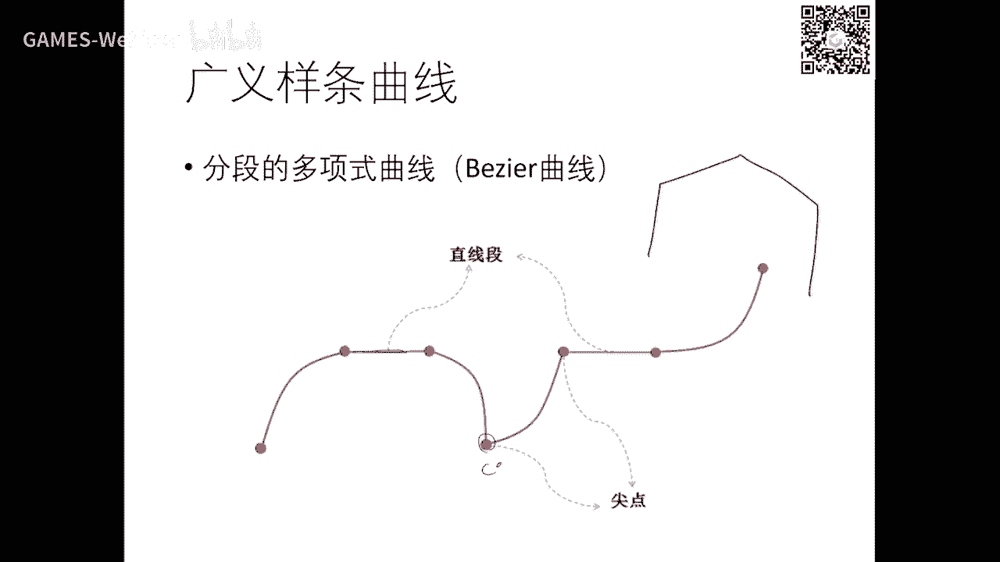

那么这个就讲完了。

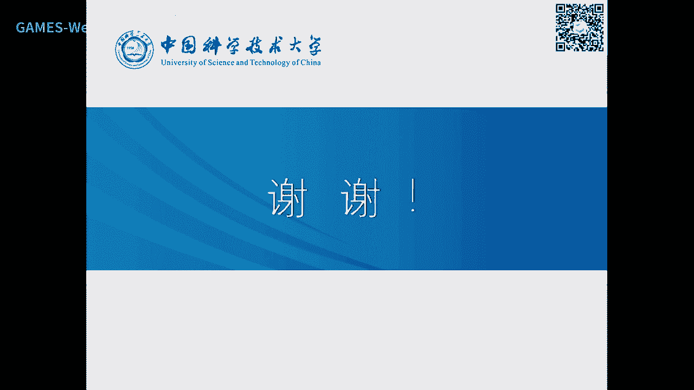

那么下面我们讲下一个内容啊。

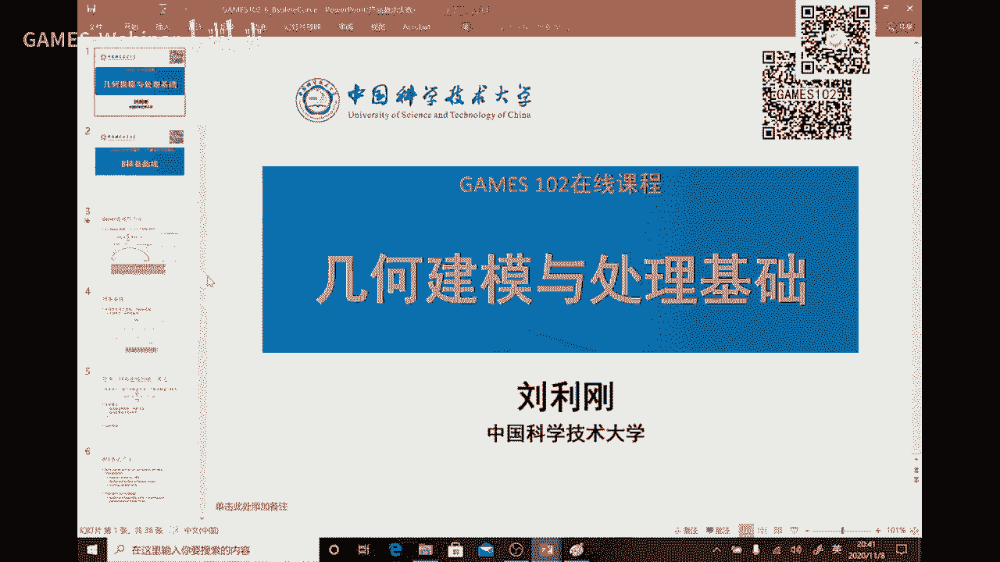

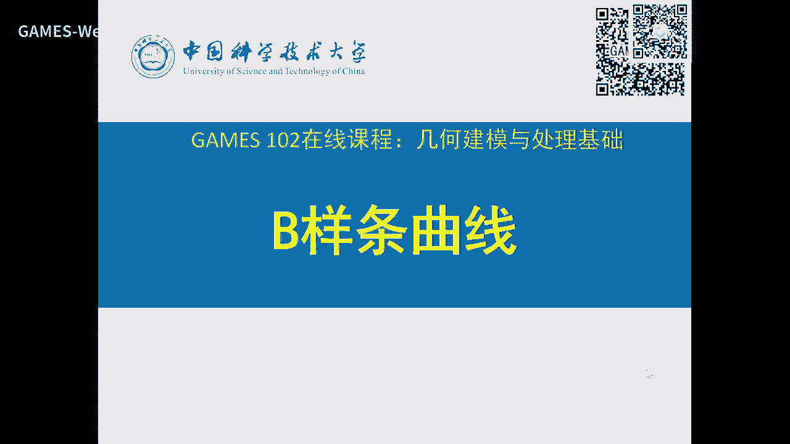

这个这个b是什么意思是吧，好那么这个北京的学生不多啊，不足那个以前提到过是吧，它具有全局性，全局性什么呢，因为因为这个g函数啊，你可以看到它在零一区间就是从头到尾之间。

这个g函数你可以看到都是定义在整个空间，无论哪个g函数，它都是一个全局，不是说整个实数啊，是指在这个0101这个范围之内啊，因为如果是定在a和b之间的话，你可以把它规划过来啊，我这里也不去提好好。

那么这个全景镜是指在这个0~1区间是是一个全局的，什么意思呢，我中间的任何一个顶顶点做一些小小财务劳动啊，就是这个b i做一个脑洞，因为你这个奇函数在零一之间都不等于零，你可以看到吗。

每个g函数都不等于零是吧，所以呢它势必会影响到对任何一个点的影响，就是你这里一个点的移动，也会对这个点进行一些这个扰动，因为整条曲线是在变的，虽然可能离他远一点的话，劳动者是比较小。

但是呢这个但它毕竟还是一个会有变化，所以这个北侧曲线呢是比较那个呃这个这个啊就全全局性啊，啊那个那个平台上面有同学在问，刚才那个北京这个是第一点和第二点怎么构造是吧。

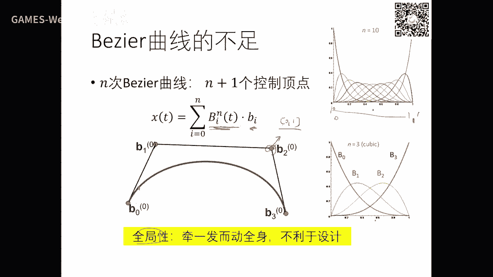

唉就是就这个点怎么构造，可以随意，这是一个自由度啊，这中间的话是由这些所约束的啊，从一头一尾就跟讲的样条一样，就和你的自由度，你可以去调它的方向等等啊，这个你可以自由一点。

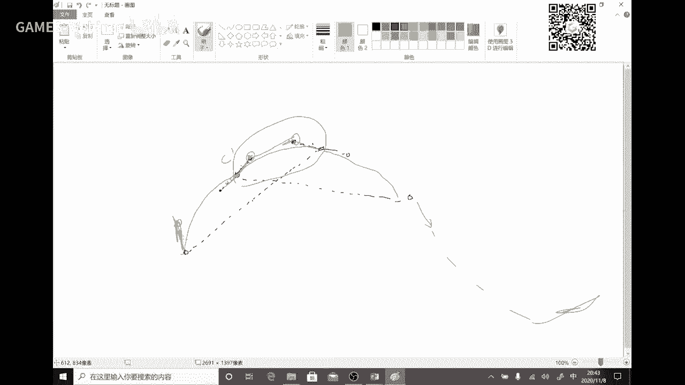

好，没关系，好，我们回来，那这个全全局性啊，好那么这全局性的原因就是这个基函数是全全局的，你是用了一个全局基函数，至少在零一空间中，你是用这个全体技术，所以你就导致你这个这个函数是全局的一个影响。

一点点的系数变化你都会有影响是吧，好我这里稍微提一下，你们在前面也用过神经网络去去去做函数拟合那个sigmmd也好啊，阿蝙蝠也好，也是全体减函数，这就是为什么你在做这个网络更新时候。

你一点点数据更新就得重新做一遍是吧，就是这个阶函数所引起的啊，如果你能用局部清函数呢，可能就更新不用全局的更新，只要部分的更新啊，就知道我在讲什么好，我们再继续好，也就是说样条曲线就是一个分段的啊。

分段的话有什么好处啊，每一段呢我可以局部的调整好，不会影响很远的地方，所以它具有很好的局部性，这局部性是什么呢，有助于设计师去思考诶，我当我另外一部分设计好了，我想局部修改这部分的形状。

我只要去改这里的曲线就行了，没有必要我改进一点点就影响我很大的地方或车身是全局地方对吧，所以这个角度来看啊，从从学术性角度来看，就这个你的这个表达一定的有局部性啊，没有局部性的话。

这个是这种这种这种方法是很难做设计的，我我那我本来那边修改好了，我在我这里稍微调一调，我所有的形状都给我动一动是吧，虽然可能动的不多，但你毕竟还是在动是吧啊，这种真正的局部性的什么，你这里一块修改。

我肯定这两段会有任何的修改，为什么他们是局部定义的啊，这里有一个问题，就是说好我分段表达没问题是吧啊，这个一段一段表达，反正我就表达成有有有有这个六段，我就表达六段，但大家有没有去想啊。

但是数学家做基本上就会想的比较深刻，有没有一种方式啊，对这种分段的对象是我也统一表达出来，那就非常漂亮了啊，就是哦哦不不是分成六个函数去表达，我通过一个函数表达，但是呢它就是有分段的性质是好。

那么我们来看一下这个思考吧，我们来看一下这个是怎么引出来的，好同样我有很多很多个点，我想定一个曲线，我的曲线呢这个d i就是这些d i d0 d n，我呢也是想通过一个基函数去组合这些顶点。

形成一条光滑曲线，但是呢我需我需要什么，它是一段一段的，要用什么系呢，我能不能这几个控制顶点定义一段，那么这几个混子顶点定义这个制定点定义另外一段，这样呢你这个g函数要有什么性质啊。

g函数本身就必须要有局部性，如果你进函数是一个全体减函数，像北北这期一样的话，你不可能达到这个目的是吧，所以我们要要有那个性质，我们要从基函数的局部性质来构造来思考这个问题啊，当然也要振兴和全性。

但现在来看你们再去思考这个问题已经晚了啊，这个数学家已经几十年前就想到了，好我们把这个思路讲一讲好，那么市场是在60年代啊，后，后来呢就用到了这个这个这个设计中啊，这是他的历史历史。

好啊好这个公司又出现了这个公司呢，实际上是具体这个是不是由这个公式来，我也不知道，但是呢我我们这样去理解，看到这两个g函数是低阶的，那么我乘上一个一减t和t那么就变成一个高阶的是吧，这是个非常好的递推。

因为一线因为这这两个啊，这个这个次数就升升升升一次满啊，好那么我如果要模仿的话，我局部是不是处处也可以定，然后有一个g函数去平移是吧，然后再通过这样一个乘法就可以去升升阶，升级的话可以保持光滑性啊。

就是提高光滑性好，那么这个思想价啊，刚才忘了讲了一个这个参数one啊。

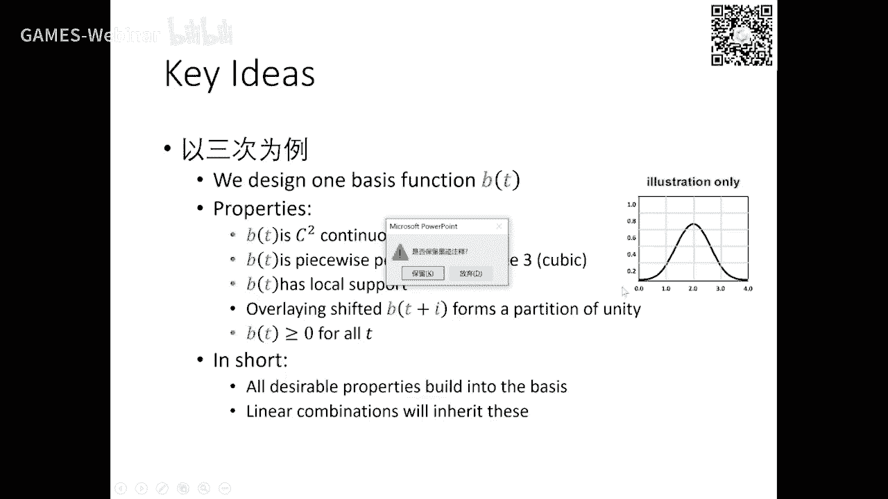

我我这个用用一张图来表达，你要去，啊呃这个用这些点去构造一条曲线，那么同样我这里t要要有个这个这些点的参数是吧，这个参数这个点对这个参数这个点对对这个参数这个点对这个参数好。

这个参数化我们也也已经有了这个概念是吧，这是用d0 号点到d，所以叫d i那么我这个这个参数叫t0 啊，这个叫ti，这个叫t m啊，就是这个具体怎么算的话，因为它它们是相互连接起来啊。

其他的话你你简单一点就有均匀参数化是吧，复杂一点就用悬长啊，或者是中心参数化都可以好，我希望呢d0 乘上一个奇函数n，那么最基函数是定义在t t0 这个这个这个这个这个上面。

既然呢也这里有有有几个基函数，但这几个氢元素的最有局部性，可能它的跨度呢可能就是就是局部范围，超过这个范围就是零，这时候是不是这里没没没没没几段啊，每一段是不是由相邻的几个点就有计算出的组合。

有还有局部积，所以局部性质，所以这一段曲线呢就是由相邻的几个点来定义的是吧，这个建函数怎么构造，我我可以是一样构造，因为什么这个节点都是定义好了，所以我只要一个基函数呢沿着这些节点重复的平移就行了啊。

那平移过程中可能跟这个节点距离是有关系的啊，这关系怎样就会吹出来啊，或者等下等下我我解释一下啊，这就是什么，哎我们又联系联联想到那个那个神经网络是吧，哎我有一个这个这个da这屁股嘛。

这个这个激活函数把它平移下伸缩一下，这个伸缩呢就是由这些节点的宽度来决定，平移呢就是让它在这里乘积函数是吧，给每个地方都有计数嗯，它和它组合，它和它组合就可以组合出一个一格一个函数出来，好哦。

由于这个g函数有局部性。

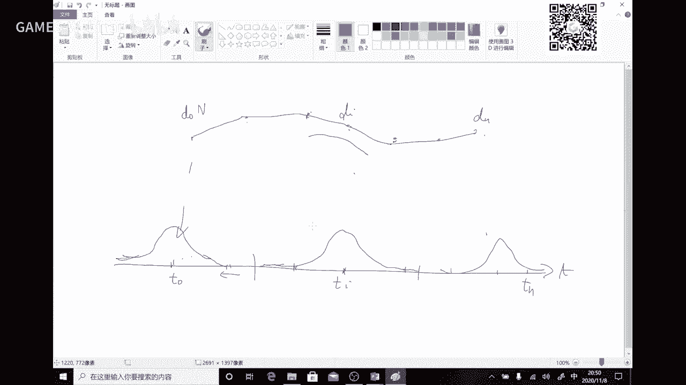

所以导致这个曲线是有局部可控的性质，可以从这个角度上去理解，这个可能下次同学们还不一定完全能理解，没关系啊，这个第一次听到，然后后面呃这你们再慢慢慢慢消化一下，好这就是一个这个示意图啊。

好这些顶点是我的叫做空中顶点，然后没控制控制变量呢有一个参数参参数，这里面是一个均匀节点的形式，那么这个叫做节点向量，你必须首先对这个节节点啊，这个控制顶点要要有个参数，这是就是节点向量。

那么g函数是由通过节点向量来定义的啊，就是每个每个阶函数来定义在这个啊相邻的几个节点向量啊，节点中啊，只不过是慢慢平移啊，那么这个是将这里是均匀节点啊，因为还有用弧长来做监理，你可以看到-10123好。

那么那么这个计函数怎么构造呢，啊我文件我们也不展展开，我们讲一下思路哈，嗯跟零阶一样的零一，你去定一个连接的，就是要直直线啊，就是水平直线由刚才那个组合我要定义一阶的，怎么办呢。

我就用这么相邻的两个连接，一个乘一减t，一个乘t然后1l阶就变成这样一个帽子函数了，同样这是一阶，这是零阶啊，那么同样是一阶，我再用这个乘一减t相邻的啊，这个乘t加起来就变成了这样一个两阶。

啊怎么递推上上去两阶又这样乘就变变成三阶，好这里你可以看到光滑性有刚才的这样一个跳跃，变成这样一个c0 ，并在积分啊一层变成一个这样这样的光滑函数，那么这样慢慢的往上升以后呢。

你可以看到它的跨度每每每升一阶呢，它跨度多一个节点的区间，这个是占占两个，这个这个是占三个123，那么再升级的话，那这个就比这个多一个，因为这个是一减t乘上它相邻的t啊，就就多一个。

所以它的跨度呢就就多一个声声音阶啊，所以它不仅是定义了高阶的g函数，而且它在它的定义区间，从数学上来讲叫叫井知己，知己呢就扩扩大了一下好，那么我们所有书上就一吸上来就是这个式子啊。

这个一上来就是说变量条就是这样定义的，这变压强这个定义方式有好多，还有通过擦啊，擦伤法定义，那我们这里就引出这个递归定义好零阶就是这样这样一个函数，这个函数呢每个节点区间定一和零，就是这个中间段就是一。

那么它的高阶k是k减一跟k最简易的两段，一个是di段跟di加一段，通过这样一个线性组合多出来，那么这个组合组合系数是怎么来的，就是可以去反推过来啊，由它的权限就可以推出来啊，这里我们也不去推啊。

反正反正就是这样一个表达就表达呃，事实上是挺好记的啊，这个我等下讲到非虚拟节点，那么注意这里我们定义的东西是在均匀节点啊，叫uniform，叫均匀节点。

也就是嗯每个控制顶点呢它的这个对应的参数是一样的啊，实际上就是我们的均匀参数化啊，就均匀节点啊，那么这个式子是这样好，等下我们还要定义非均匀节点是一个什么形式啊，那么这个是非均匀节点。

非节点是t0 t1 t2 t n啊，到tn加k这个叫叫节点向量，定义方式也一样，在每一段中间的是一，这是第零阶t i t i加一好，那么呢k接的话是由dk减一两个阶函数做出来。

这组合着的系数是挺容易记的啊，这个系统呢是什么，这两个指标加起来，ti加k减一减去第一个指标，ti上面是t减t i是这两个是一致的好，那么第二个系数两个加起来也是一样，i加k这个是i加一。

然后上面的这两个是一样啊，减t就这样啊，所以当时我们因为读博期间这个非常熟啊，就是这些指标是非常非常非常容易记，记熟了就很好记，它是有规律的，好这规律呢你要去真正的去把它搞清楚啊，还是要花不少时间。

毕竟这个数学符号一大堆啊，指标啊一大堆很容易搞错啊，我这里讲几个重要的吧，好我们我们我们我们先先先看几个例子啊，好这是一阶的第一个基函数t0 开始哦，是这样，那么t2 开始是第二个计算数啊。

d那么d第七第三阶函数就是就这个是吧，这是n31 啊，一切的第三个啊，后面那个值呢是krm是接触，这是第几，第几个由他们他们俩两个组合就变变成了一阶的，这这个建筑。

由这两个组合呢就变成了这样一个跨度为为三个节点区间的计数是吧，因为它跨度两，它跨度两，他们他们俩一乘起来啊，加相加啊，线性组合就变成变成这样子啊，就这样慢慢慢升阶。

那么瞬间的话呢它就变成三次三阶的那个奇函数啊，那么由这个三阶的两个相邻的就变成了这个细节啊，就它们变成四节啊，这是几个图，你可以看到所有b站的g函数都长得像帽帽子一样的，有点像高斯函数，不完全是高速啊。

只不过呢接触越高跨度会越大，那么这里有很多一些这个性质啊，这个系列性质呢我也想啊，也不是呃想详细介绍，因为呃你作为一个课程来讲，这个是要讲不少时间啊，我们这里大部分是这个非数学类的。

我们就不用去学那么深啊，就能看得懂它这个是什么原理啊，那么我这里讲几个性质啊，我看看这个性质呢，像第一行行行，那那我来解释一下啊，那么我假设这个是n也就是ni k k，接着计算数第i个。

它的非零区间是在哪里啊，进行分行间是ti t i加k应该结论是一样啊，那ti到ti加k是非零，其他其他地方都都等于零，无论它是小于ti的还是大于ti加k的。

这个就说明了奇函数的不信lol这一任何一个dx这个计数是k阶的哈，它的区间只有是ti到ti加k是非零，是长长的这个样子啊，那么这个之外都都是零啊，所以呃从刚才这个递推式啊。

是可以证明出来每个阶函数都是局部直接的啊，只在部分是非零别的零啊，这个第一句话，第二句话呢表示弹性就是加强等于一好，我们来看一下啊这个例子哈，那么下一个计划中呢是从这里开始下一个下一节点对吧。

因为往往往往往往左往右平行嘛，再下一个好，这里是不是有有好好几好几个基函数是会会经过好，我取任何一个点，然后这里有若干个基函数经过他值给拿来，把所有的非零的这个价值拿来，这些值加起来一定等于一。

所以通过刚才那个构造非常好，就是你无论在哪个地方，你只要是非零的加权，你去加权呢，多多等于一比什么，表示它有非常好的突破性，局部原有突破性啊，所以这个是基函数的权限，我们就得到了啊。

当然所以我刚才不是指出这些系数是怎么得来的嘛，上就是有全性倒推过来的啊，我们就不去推了，大家我们把性子直接跟大家讲一讲，那么还有一个叫光滑性的话，在这个拼接处是k减二接连连续啊，啊这里这里还少讲了一个。

就是b按照g啊，对这g函数没问题啊，就是这个g函数在这个节点，ti到七，the basis啊，是在这里，是c k，接连续啊，这个怎样曲线的时候我再解释，那么这个呢这个就叫做它的紧支集啊。

就是就是就就这个区间就仅仅自己就是指非零非零的区间，别的区间是等于零好，刚才是g函数曲线，就是这个这个这个意思啊，如果每个曲线顶点这个控制地点都有，都有一个这个叫做这个这个参数的话。

那么这个曲线可以可以这样定义啊，就是直接把这阶函数跟这个顶点，但是组合一把就可以找到一条曲线啊，这个这个这曲线呢这个顶点呢就叫做控制顶点啊，你也可以把它叫做debug的顶点啊。

就跟刚才那个北京的形式是又一模一样的，剧情世界跟以前的rbf g还是一样，只不过以前去平均一个一个点的话，是用rb f g的高斯g函数，它是几个亿，我看好好几个亿在在这里。

我们这里用了五阶啊啊k04 是表示第四段好好，也就是说武器的话呢，它是用相邻的，五阶的话应该是六个点，123456会定义其中的一小段曲线，这曲线呢是中置加的中间啊，因为有刚才有粗暴性。

那么那么这个这条曲线呢由这五个点定义，如果在第五之后还还还有一个曲线啊，还有一个叫第第六，第一第二第三第四第五第六会定义第二条曲线，就像我随便画，可能可能在这啊。

也就是说d0 到d5 这六个点定义一条曲线，因为n等于五啊，好d一到第六定义第二条曲线，那么一一直类推，如果还有第七期，那么其实第三到第七定义这条曲线，所以你可以看到它相邻的一个点就是六个点来定义。

其中一段往往往那个在这个往右平移一下，就下六个点，又定义第二条，下面有个点再定义第三条，所以你可以看到它控制控制多边形是一条，但它这个曲线呢是本质上是什么，是分段的，你这一段一段在这个段上呢。

它是n减二的连续性，如果这是n啊，这是五，应该是n的三阶连连续啊，就这两个曲线在这里是c3 啊，本质上就是一个分段的多项式曲线啊，一个分段曲线表达成了一个非常漂亮的这么统一形式。

通过构造了一个这种局部的计算数，就统一表达了，或者是一个这样的一个技技巧啊，不可以定义分段的这个这个这个曲线啊，好这里有些性质我我就提前讲吧哈在这里刚好也也也讲到了，就是叫叫叫做重节点，好。

如果你这个节节点啊，就是刚才那个参数啊是可以重合的啊，就是刚才那个t这个节点，那么某个重合啊，那么这里就有这个性质，一旦有点点节点重合啊，在这一点的这个这个光滑性就降降一阶啊，如果这里是两个两个点重合。

那么其他的方法性就降到c c2 ，如果再重合降到c1 ，再重合就变成c0 ，你要去通控制这个曲线的光滑性，可以通过节点的重合度啊，你是三重还是两重还是一重来控制它的，这样是不是也有利于设计啊。

就说我刚才指出我这一段这一段直线啊，我我只有基连续怎么构造，我只要让让让这个点的对应的节点重塑呢，是三小，这是三次的，就就可以达到g好，如果我要设成一个尖点，就是c0 的，它不光滑。

只要它所对应的这个这个节点都是要达到啊，三重或者四重啊，就看你这个这个这个接受啊啊也就是说我这个连续性啊，可以通过这个节点的重塑啊，因这里是不相等吗，你可以去三等于t4 ，就是相当重重叠在一起啊。

来来控制这个曲线的光滑性，我把先把结论讲讲啊，就具体怎么控制呢，这个需要一定时间，你们去再去去去看一些书去推导啊，好也就是我可以通过这个这个重塑来控制这个曲线的，在拼接点的光滑性。

那么这里就是为了让让让让这个曲线，反正这个曲线我用我用三次啊，三次的话就这四个点构造一段，点构构构构造一段，那么这两个手摸两点呢就并不差值是吧，所以我只要让点的这个从从数是是是是k重。

那么这个曲线呢就就会插值它因为层数一高的话，它这个就t占为本周基，那也一样啊，那么这个重组也可以这样啊，所以如果你要手摸端点要差值的话呢，一般我们会把手摸的重数设成一样啊，推重。

那么这里是你看到n等于五，还是刚才那个例子，1234566个顶点决定要曲线，如果我把这个曲线的两个重塑设置，那么这个北热机啊，本来第二条机就在这个这个端点的退化成了北周基，这个理论都是有保证的。

好好我们这个下面啊，下面是下面是另外另外一些一些例子了，这里啊好，如果你看这是重叠的哈，没错，你看t0 到t3 ，它是不不不重点，是t6 到t7 ，它也不不重点啊，这所以这里只是定定义了两两段。

他1232有三段呢，有三段前面的五个点，五的话是一段，应该是一段t3 ，好那么就是如果这几个点是不重合，那么那么这个端点就不差值啊，如果重合的话就就差值。

所以你也可以可以通过重节点呢来控制这个端点的行为啊，这里本质呢我讲一下，就是就鸡啊，上次他跟北周基有非常强的关系，你只要在一个编导系的两个端点都是能从数是n减一的话，在这里啊，我提一下啊。

那么这个是一个比较普通的，有有有这么多顶顶点，就有个问题是有个好处是什么呢，就是你把这个点进行一这个拖动，它，这个曲线呢只会局部的一段或者若干段受影响啊，远离它的这些段数呢，它就不会受到影响。

用户呢如果要修修改这一段的话，通通通这个点啊，那么只有少数的几段会跟着修改啊，这段数呢由这个接触所决定决定的，所以远离着这些点呢一点都不被动，绝对理论上保证是不动的，它可以局部的去进行一些设计和修改。

还有一些这个啊这个算是刚才讲完了啊，就是如果多子k重的话呢，它就啊这个达到这个混泵感激函数了，那么为了差值的话呢，就两两头一头一尾都都用k重是吧，那么它的一些性质也是挺有意思啊。

就是啊一个端点如果如果是k轴的话，两个端点也差值，然后也相切啊，相切系数不一样啊，然后嗯一个样条可以分成这么多多段的，这个次数为k减一的这样一个曲线好，那么呃你如果从数节点存数一多。

我就就可以降低它的这个方法，就reduction continuity，就是挂画性啊，那么你l从就变成就降了c k减一，从把那个次连续就变成k减l减一啊，好那么这里面啊。

某个顶点只会移动这个区间的这个曲线，别的区间的曲线是不会动的，刚才我也解释了啊，就这个叫叫中间插入节点，这个我就不再展开啊，那么这是个试点，这个试点呢我解释一下这个点呢，它移移移到这里来了。

这个曲线呢由这个黑的变成了这个黑的啊，你看到这段确实一模一样，不会动好，我这个顶点又拖到这来了，现在可能变成这样这个这样这样形状，但是但是这一段呢是完全不会动，它已经远离了他他那个区间啊。

这是边条曲线这个局部性的一个非常大的优势，我我为了修改这一段的形状，我用户在在在这里拖动这个顶点，我修改的曲线就是在这里，这个是会变的，但是它仍然是一条整体曲线啊，这个我稍微呃就提一个这样的啊。

这个这个呃问题吧，就是如果在在神经网络里面，你把那个西格玛的这种全曲g函数变成局部机，我也有这个性质啊，当然是次的啊，就这样的话有个好处，你这个拟合出一个网络出来以后，如果我有新的数据更新了。

我只要它所对应的那个附近的基函数，你不用整个网络再重新去更新啊，那么这样回答诶很多好处是吧，因为你这个这个这个源不断会有新数据来嘛，啊啊这个我就不展开啊，这个这个当然这问题呢是一个非常有意思的问题。

这个我们也在思考，然后但是嗯高维的时候还是遇到很多问题啊，这个暂时是个open的problem，哈计算计算机就是插节点算法啊，这个不断的插入节点，这个算法就就是就在这啊，这这也是个递归啊。

具体的啊我就不想去去去展开好吧，这个因为这部分第二条要搞得明白的话，甚至你要去写程序的话，还是要看不少东西啊，我在这里只是啊比较宏观的给大家带啊，这个啊这个一个简介。

让大家知道变量计函数的来由啊啊嗯这个我以前也讲过啊，刚才讲过，就是这个是是个n等于三的时候是1234这四个定义第一段，那么第二个四个定义第二段后面是个定义第三段。

这个这个呃能量条就是我们上节课讲的木头的那个样条是吧，但是这里呢我们也把它叫样条是吧啊b呢是指basic的一个简写啊，那么我们这里叫叫叫基本样条，因为在计算数据里面，10年代50年代就开始在用啊。

70年代变成一个计算几何里面，一个非常标准的一个设计曲线的一个啊方法啊，那么这里面的这个这个理论唉是比较比较多的，今天呢也只是走马观花啊，带大家这个了解一下冰箱条啊，呃对于我们这个叫重新学专业啊。

或者叫计算几何专业的，这个同学原来需要花大概7~8个课时才能才能全部讲完啊，我们这个一课时只能点到为止，那么呃大家脑袋里有一个这个概念啊，就变样条是怎么来的哈，他为什么啊。

好处它的好处最大的好处就是局部性啊，有突破性啊，还有其他很多很多的性质，就跟北泽尔一样的，有导数递推，还有基本地推，还有几何方法，还有还有做做图一样，链条本质上就是一个分段的北侧。

那个可以通过那个呃节点向量的重塑来得得那个得到，我这里画了一条曲线啊，这个光滑能不能，那么这个是个尖点啊，中间还有一段直线段，我刚才不是说了吗，你只要是这种每一段都是多项式的话。

就一样条函数现在是个样条，所以过程中这个东西是非常非常重要，你无怎么去画，我中间是啊，这是这是这是这是g一是吧，那么那么那么这是这是c0 g0 啊，那么这是有多少，那么我都可以把它表达成一条曲线啊。

那么这条曲线呢是什么，是很好的，通过构造节点向量的重合度来他们的这个光滑性，比如说这这一点是光滑性，是c0 ，只有拼接啊，那么可以构造什么构造三重的节点对应三个点啊，是相相同的。

就能生成这样一个尖点是吧啊，这个这个就很容易灵活去用到过程中，我不管是一条是光滑的还是分段的光滑，还是c0 就拼接的光滑啊，就是这个连续不光滑，但呢这个这个差值呢跟跟刚才讲的差距又不一样。

它是要什么去去反解成一个控制多边形，那么这个反潜呢就也涉及到上节课所讲的那个那个方程了啊，因为它是很多地方是要待定的，但它在规模呢不是整个曲线了，它规模呢是分段的，就每一段要去解一个方程。

每一段要解解方程啊，咱规模就不是特别啊，好这部分呢讲起来还是挺花时间啊，我在我们这样一个102的这样一个基础课里面呢，我们就不展开啊，要靠大家冰箱调这东西，这个理论博大精深，还是非常漂亮的啊。

以后你们要用，这时候呢你们再去看这部分东西，因为你们你知道了那个那个那个啊那个比这还第二条好，那么讲完了以后呢，我这里下节课呢可能会把样曲线的其他的部分讲完啊，那么这里开个厂啊，就是大家可以去想一想啊。

就是，虽然可以表达很多曲线是吧，但是一些简单曲线，比如一个圆，一个圆啊可以证证明一下用北泽尔是表达不了的啊，或者是一个圆弧吧，就是分之一圆弧啊，那是因为圆弧你你很容易想到这样这样一个多边形去逼近它对吧。

但是它是表达不了一些音源的，这个很容易证明啊，就是用多元是曲线，既然连这种圆都表达不了，那么这里面出现什么问题啊，这么就下节课我们会把有理啊，是要要要除上一个分母啊，这个形式要给大家推出来。

那么有理是什么呢，事实上就是摄影摄影几何的一个呃讲啊，就是从从从顺应空间，那这个就是像他啊，就跟我们重新学吧，平移变成了那个极这个叫起始坐标一样的概念啊，就可以把那个圆给表达出来，好吧。

下节课呢我们把有理讲完啊，下节课会会比较也比较快啊，因为后面还有好多关于三维的网格的一些处理的东西，还要还要讲，所以有理讲完以后呢，那么是曲线啊，就是我们工业的标准。

就是工业界世界飞机啊啊轮船啊这种这种曲面方法，曲面是甚至甚至设计这个字体都是统一用非均匀有理变量调，因为它也可以表达圆表达直线，表达这种多项式曲线啊，然后之后的话就还要介绍曲面啊，验证部分很快。

因为曲线是基础，去里面就是曲线的张良机形式，张量机我们以前也提到过是吧，就是两个g函数相乘，就表达了一个二维的一个一个一个g函数就可以装成一个曲面啊，曲面讲完以后，这个基本上啊再讲这个细分。

还有影视基本上这个光滑或者叫连续曲线曲面理论就讲完，后面就进入到离散的，离散的话就是这种去这个离散网格啊，就是曲面的离散，就是网格曲线离就是多边形是吧，那么零散跟光滑之间存在一个什么样的东西呢。

就是一个啊划分，就是你要把连续的形式你搞搞明白了，连零散的形式呢就是一个差分形式啊，所以离散这个结壳里面实际上就是我们连续着几何的一个离散啊，所以连续在那边呢有微分几何，因为研究这个曲线的微分属性。

所以有并集合名上电面呢就是要离散微命集合好吧，后面的知识还是比较多的啊，我们说前面的这个曲线的这个一部分呢啊就是连续型的曲线，一部分呢我们还有一节课到一节半课啊，争取一节课上课讲完啊。

后面就进入到离散好，那么今天的课呢就到这里哈，会有点难，但确实是如果同学们啊以后要用这个知识呢再去找相关的书，你们只要有有一个印象啊，有就像学东西一样，你们跟c语言的指针一样。

你们只要记住他有这样的概念，有这样的东西它是怎么来的，听说他它的一个逻辑真正要用的时候呢，你还得花大量时间去就推倒他那些性质，理解他那些这个这个定理啊，或者是他那些啊具体的计算。

如果你要写到甚至要写到这个程序的话，就更要进行精细了，指标不能发生错误啊，那那个呢就留到同学们未来有这个用的时候再去学啊，不不由我们这个课来教的很细，因为考虑到很多同学可能可能也不会会去用这个。

它只是去控制，那么今天提完以后，你就发现了这个控制变量条有好的手段是吧，也可以控制这冰箱调的这个节点向量啊，可以很多手段来去控制，那么你还可以控制有理变量的全函数，这个圈呢对这个曲线也是有影响的啊。

所以你们在3d max maya或者lol啊，这些在参数到底是对应的什么啊，那么那么怎么去控制未来稍微有个印象，具体的这个更细节的知识呢，还是靠大家自己去自学了啊。

因为我们不是本来这些东西还是要很好的推导啊，大家还是要理解深刻一点，但由于是这个这个基础课，我就讲到这里，好吧好，那么今天啊这个讲到这里吧，我看看有没有提问，提问还是光滑性的问题啊。

有个网友在问这个刚才的几何样条，第一个点和第二点没有办法约束啊，要不要考虑，我说我我建议嗯这个约束的自由度就留给是设计，因为一头一尾这个呃这个切线是可以自由调节的啊，好了，那么昨夜我这里再提醒一下。

昨夜是那个交接，这时候不交，那么那么上节课布置的作用呢是整体的一个32条啊，是要结合局部方全息方程。

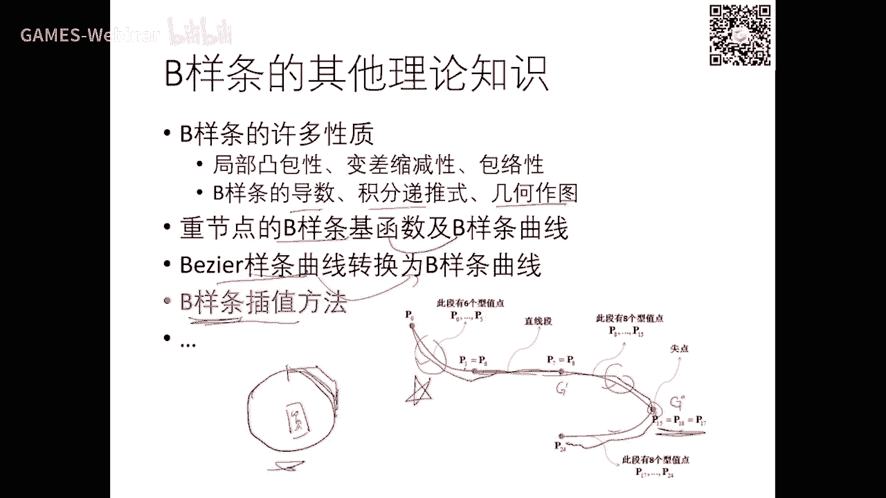

今天呢我在上上个ppt里面看到有同学已经教了啊。

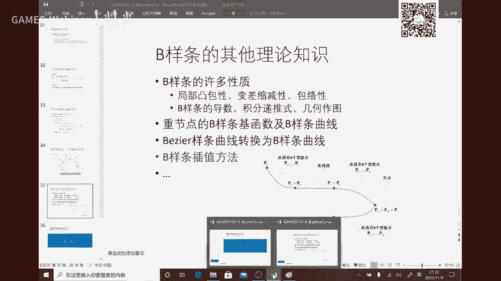

但我建议你如果教的同学呢可以可以再把这个给实现一下，这种呢就局部性的了，就是构造也很也很简单，就是每一段构造一个边调函数啊，这这个曲线，然后相邻两段的满足一定光滑性，这样的话呢你这个曲线呢也有机会性。

只不过呢它这个达不到c2 啊，c啊，c可以啊，或或或者记忆就可以好吧，这样的话呢又多了一种设计方法好，这个就稍微的花了时间，我觉得建议大家就不一定做了好吧，那么这个是一个可可选的。

如果大家有时间就做一做啊，也也不难，至少比那个姐那个三转角方程要容易多了，好吧好，那今天就到这里为止，好啊。

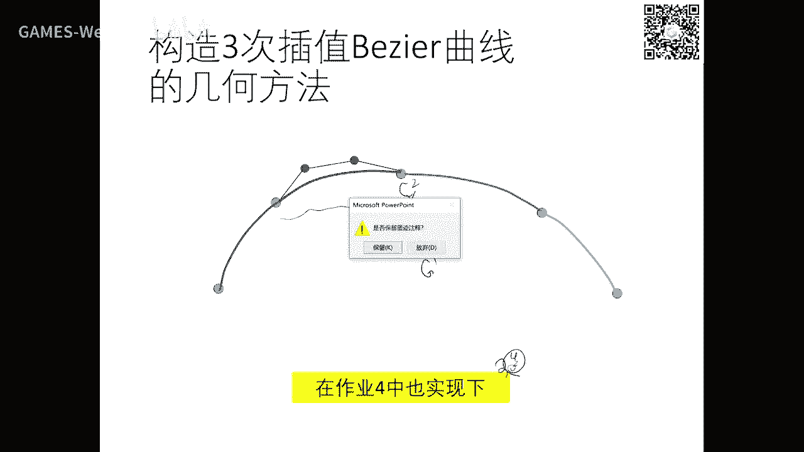

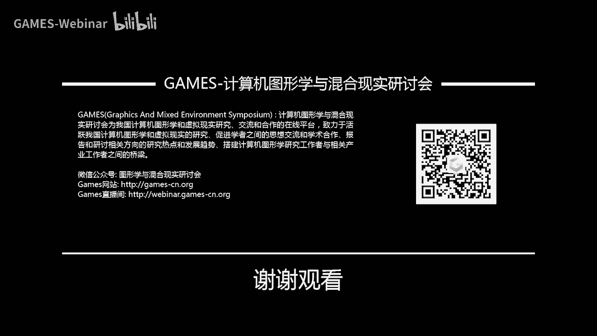