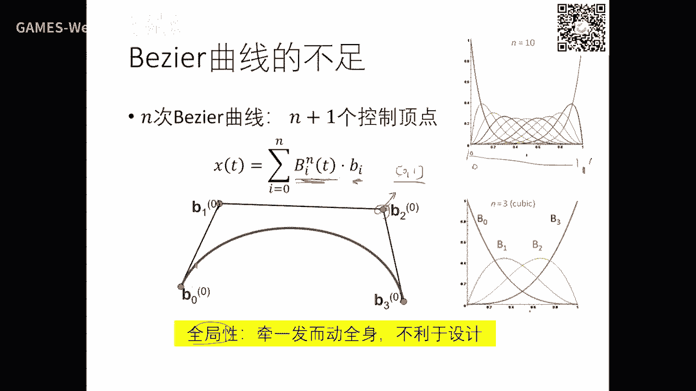
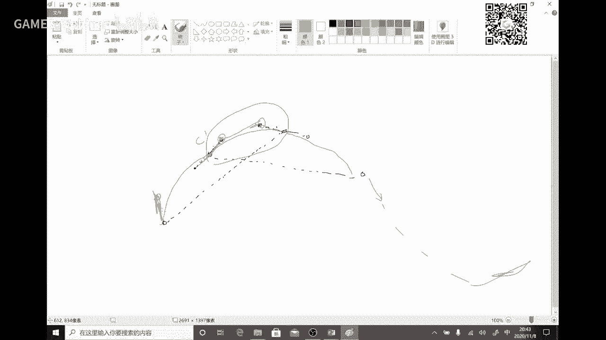
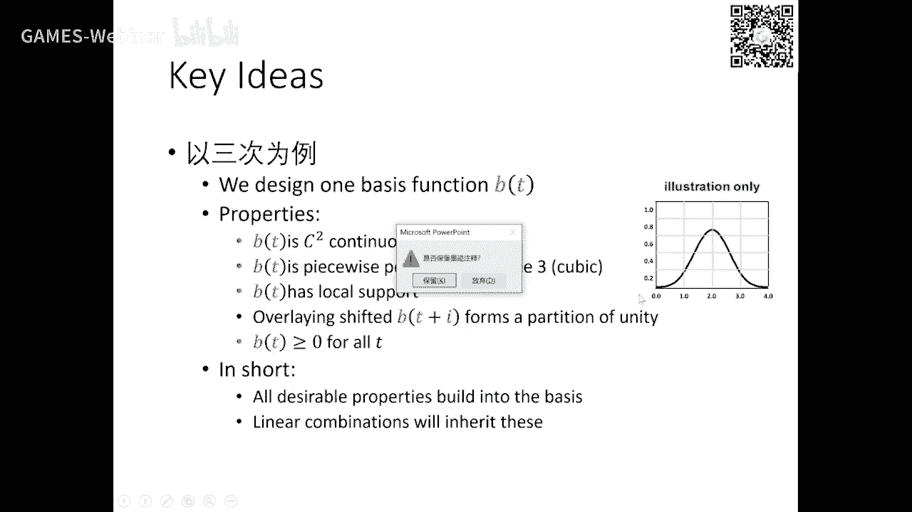
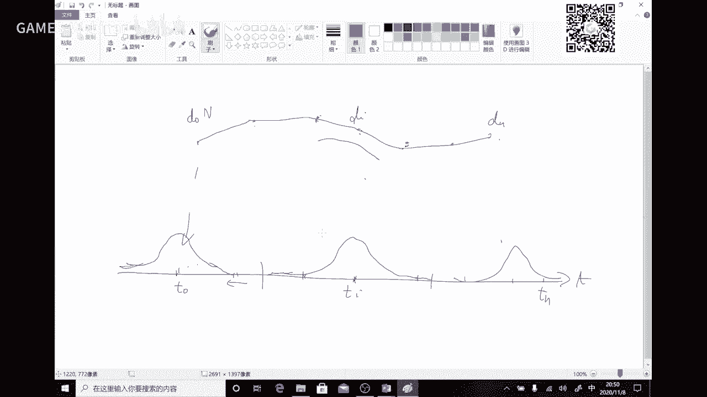
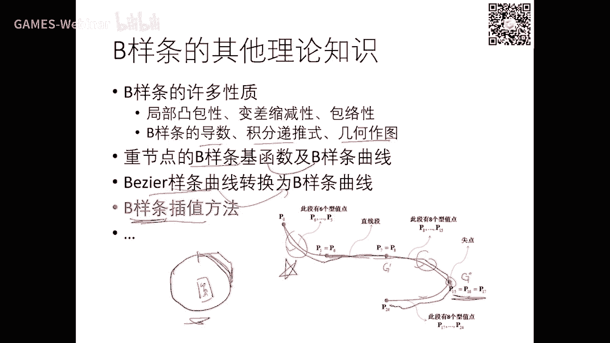
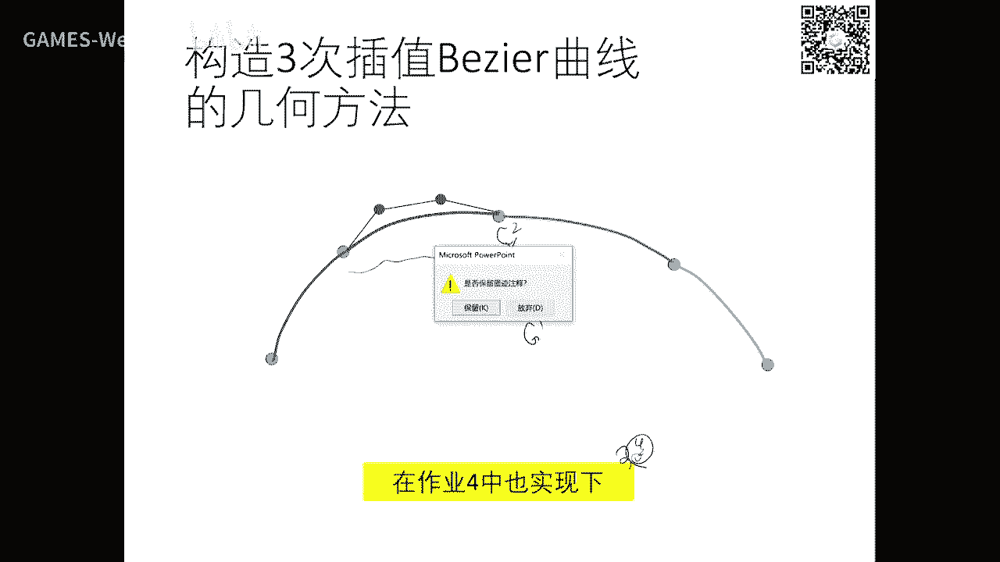

# GAMES102：几何建模与处理 - P5：Bezier曲线与B样条曲线 🧮

在本节课中，我们将要学习计算机图形学中两种核心的曲线表示方法：Bezier曲线和B样条曲线。我们将从函数拟合的基本概念出发，探讨它们如何从数学形式转化为直观的几何设计工具，并重点分析它们各自的性质、优势以及在实际设计中的应用。

## 概述：从函数拟合到几何设计

上一节我们介绍了函数拟合的基本概念。在实际造型中，有一个重要概念叫“逆向工程”，即通过采集产品表面的点，再通过拟合方法将其外形重建出来。这涉及到曲线拟合，即给定一系列点，寻找一个“好”的函数来逼近它们。

这个“好”的函数通常从一个由“基函数”定义的函数空间（或集合）中寻找。例如，二次函数空间的形式为 `f(t) = a*t² + b*t + c`，其中a, b, c是待定系数。对于参数曲线，形式为 `P(t) = (x(t), y(t))`，可以将其写成向量形式，基函数前的系数就成了空间中控制曲线形状的“顶点”。

然而，如果基函数（如幂函数 `1, t, t²`）选得不好，曲线形状与控制顶点之间的关系会非常不直观。用户调整一个顶点，曲线可能产生难以预料的剧烈变化，这不利于交互式设计。因此，我们需要寻找具有更好几何意义的基函数。

## Bezier曲线：直观的几何设计工具 ✏️

上一节我们提到了函数拟合，本节中我们来看看一种革命性的设计工具——Bezier曲线。它的核心在于使用了一组具有优良几何性质的基函数：Bernstein基函数。

### Bernstein基函数

Bernstein基函数在数学上已存在数百年，其形式如下：
`B_i^n(t) = C(n, i) * t^i * (1-t)^(n-i)`, 其中 `t ∈ [0,1]`, `i = 0, 1, ..., n`。
这里 `C(n, i)` 是组合数。n次多项式有n+1个Bernstein基函数，它们构成了不高于n次的多项式空间的一组基，与幂基等价且可以相互转换。

以下是低阶Bernstein基函数的图像示例（此处为描述，实际教程应配图）：
*   **0阶:** 常数函数1。
*   **1阶:** `B₀¹(t)=1-t`, `B₁¹(t)=t`，是两个线性函数。
*   **2阶:** 三个二次函数，形状类似抛物线。
*   **3阶:** 四个三次函数，在[0,1]区间内平滑分布。

这些基函数具有两个关键性质：
1.  **正性:** 对于 `t ∈ [0,1]`，所有 `B_i^n(t) ≥ 0`。
2.  **权性（单位分解）:** 对于任意 `t`，所有基函数值之和为1，即 `Σ B_i^n(t) = 1`。

### Bezier曲线的定义与性质

基于Bernstein基函数，我们定义Bezier曲线。给定n+1个控制顶点 `P₀, P₁, ..., P_n`，n次Bezier曲线为：
`C(t) = Σ B_i^n(t) * P_i`, `t ∈ [0,1]`。

控制顶点顺序连接形成的多边形称为**控制多边形**。Bezier曲线具有以下重要性质，这些性质使其非常适合设计：
*   **端点插值:** 曲线经过第一个和最后一个控制顶点，即 `C(0)=P₀`, `C(1)=P_n`。
*   **凸包性:** 由于基函数的正性和权性，曲线上任一点都是控制顶点的凸组合，因此整条曲线位于控制多边形的凸包之内。
*   **端点切向:** 曲线在起点处的切向量方向与第一条边 `(P₁-P₀)` 一致，在终点处的切向量方向与最后一条边 `(P_n-P_{n-1})` 一致。对于三次曲线，切向量长度是边长的3倍。
*   **几何不变性:** 曲线的形状仅取决于控制顶点的相对位置，与坐标系选择无关。
*   **变差缩减性:** 平面Bezier曲线与任意直线的交点个数不多于其控制多边形与该直线的交点个数。

### de Casteljau算法：高效的几何求值方法

为了高效、稳定地计算Bezier曲线上任意参数 `t` 对应的点，我们使用de Casteljau算法。这是一个基于线性插值的递归算法：

**算法描述:**
给定控制顶点 `P_i^0 = P_i` (i=0,...,n) 和参数值 `t`。
对于 `r = 1 to n`:
    对于 `i = 0 to n-r`:
        `P_i^r = (1-t) * P_i^{r-1} + t * P_{i+1}^{r-1}`
最终得到的 `P_0^n` 即为曲线上参数 `t` 对应的点 `C(t)`。

这个算法的几何意义非常直观：它通过不断对控制多边形的边进行线性插值和细分，最终收敛到曲线上的点。不仅如此，该算法还将原曲线在 `t` 处分割成两段子Bezier曲线，并同时给出了这两段子曲线的控制顶点。这为曲线的分割、离散化和求交等操作提供了基础。

### Bezier曲线的拼接与样条

单段Bezier曲线通过增加次数（提高阶数）来增加控制顶点，从而描述更复杂的形状，但高次曲线可能产生不必要的震荡，且局部修改会影响整体。

为了构造复杂曲线，我们通常采用分段低次Bezier曲线进行拼接，形成**Bezier样条**。关键问题在于如何保证拼接处的连续性。

以下是保证连续性条件的几何解释（以三次Bezier曲线段 `[P0,P1,P2,P3]` 和 `[Q0,Q1,Q2,Q3]` 在 `P3=Q0` 处拼接为例）：
*   **C⁰/G⁰连续（位置连续）:** 自然满足，只需 `P3 = Q0`。
*   **G¹连续（切向连续）:** 要求 `P2, P3(Q0), Q1` 三点共线。即切线方向相同，但长度可以不同。
*   **C¹连续（参数连续）:** 在G¹连续的基础上，进一步要求 `|P3 - P2| = |Q1 - Q0|`。即切线方向相同且长度相等。
*   **C²连续（曲率连续）:** 条件更为复杂，涉及到五个控制顶点 `(P1, P2, P3, Q1, Q2)` 的关系，要求二阶导数相等。

一种实用的构造C¹连续三次Bezier插值样条的方法是：对于给定的数据点 `D_i`，在每两个点之间构造一段三次Bezier曲线。中间的两个控制点可以这样确定：在 `D_i` 处，沿 `(D_{i+1} - D_{i-1})` 的方向，在两侧各取 `|D_{i+1} - D_{i-1}| / 6` 的距离放置控制点。这种方法具有局部性，修改一个数据点只影响相邻的曲线段。

## B样条曲线：兼具局部性与灵活性的强大工具 🔧

上一节我们学习了Bezier曲线，它虽然直观，但具有全局性——修改任一控制顶点，整条曲线都会受到影响（尽管影响程度随距离减小）。本节中我们来看看B样条曲线，它通过使用具有局部支撑的基函数，完美解决了这个问题。

### 从全局性到局部性的需求

Bezier曲线的全局性源于其Bernstein基函数在整個定义域 `[0,1]` 内都不恒为零。在设计中，我们常常希望修改曲线的一部分时，远离该部分形状能保持不变，即需要**局部可控性**。

B样条（Basis Spline）曲线正是为此而生。它的核心思想是：构造一组**只在部分参数区间非零**的基函数（即具有**紧支撑**），使得每个控制顶点只影响曲线的一部分。

### B样条基函数的定义

B样条基函数由一个**节点向量** `T = [t₀, t₁, ..., t_{m}]` 定义，其中 `t_i` 是单调非减的序列。对于 `p` 次（或 `p` 阶，阶数=次数+1）B样条，第 `i` 个基函数 `N_{i,p}(t)` 通常由著名的Cox-de Boor递归公式定义：

1.  **零次（p=0）基函数:**
    `N_{i,0}(t) = { 1, 如果 t_i ≤ t < t_{i+1}; 0, 其他 }`

2.  **高次（p>0）基函数:**
    `N_{i,p}(t) = (t - t_i)/(t_{i+p} - t_i) * N_{i,p-1}(t) + (t_{i+p+1} - t)/(t_{i+p+1} - t_{i+1}) * N_{i+1,p-1}(t)`
    规定 `0/0 = 0`。

这个递归定义表明，高次的B样条基函数是由两个低一阶的相邻基函数线性组合而成，从而继承了低阶基函数的性质并提高了光滑性。

### B样条曲线的定义与重要性质

给定 `n+1` 个控制顶点 `P₀, P₁, ..., P_n`，次数 `p`，以及节点向量 `T = [t₀, t₁, ..., t_{n+p+1}]`，定义的 `p` 次B样条曲线为：
`C(t) = Σ N_{i,p}(t) * P_i`, 其中 `t_p ≤ t ≤ t_{n+1}`。

B样条曲线拥有比Bezier曲线更丰富和灵活的性质：
*   **局部支撑性:** 基函数 `N_{i,p}(t)` 仅在区间 `[t_i, t_{i+p+1})` 上非零。因此，控制顶点 `P_i` 只影响曲线在 `[t_i, t_{i+p+1})` 区间内的部分。这是实现局部修改的数学基础。
*   **凸包性:** 曲线段 `C(t), t ∈ [t_i, t_{i+1}]` 位于定义该段的 `p+1` 个控制顶点 `(P_{i-p}, ..., P_i)` 的凸包内。整个曲线位于所有控制顶点的凸包内。
*   **连续性:** 在节点区间内部，曲线是无限光滑的 `C^∞` 多项式。在节点 `t_i` 处，曲线至少是 `C^{p-m_i}` 连续的，其中 `m_i` 是该节点的**重数**（即在节点向量中重复出现的次数）。**通过调整节点重数，可以精确控制曲线的连续性**。
*   **变差缩减性:** 同Bezier曲线。
*   **仿射不变性:** 同Bezier曲线。
*   **强凸包性:** 比Bezier曲线的凸包性更强，曲线段位于更小的局部凸包内。
*   **灵活性:** 通过插入节点或调整节点向量，可以在不改变曲线形状的前提下修改其表达，或进行局部细化。

### 节点向量与重节点的作用

节点向量 `T` 是B样条的灵魂。它分为几种类型：
*   **均匀B样条:** 节点等距分布，如 `[0,1,2,3,4,5]`。
*   **准均匀B样条:** 两端节点具有 `p+1` 的重度，内部节点均匀分布，如 `[0,0,0,1,2,3,4,4,4]`（对于p=2）。这是最常用的形式，它使曲线插值于首末控制顶点。
*   **非均匀B样条:** 节点任意非减分布，提供了最大的灵活性。

**重节点的关键作用:**
1.  **降低连续性:** 在 `p` 次B样条中，一个 `k` 重节点处曲线的连续性降至 `C^{p-k}`。当 `k = p` 时，曲线在该处仅为 `C⁰` 连续（位置连续）；当 `k = p+1` 时，曲线在该处甚至断开（或理解为插值于该控制顶点）。
2.  **插值控制顶点:** 使一个控制顶点对应的节点区间长度为零，可以让曲线**插值**于该控制顶点。通常通过使首末节点为 `p+1` 重来保证曲线经过首末控制点。
3.  **生成尖锐特征:** 在设计中，可以通过插入重节点在曲线上制造**尖角**或**直线段**。

### B样条与Bezier的关系

Bezier曲线是B样条曲线的一个特例。一个 `n` 次的Bezier曲线，等价于一个 `n` 次的、节点向量为 `[0,0,...,0,1,1,...,1]`（前后各 `n+1` 个重复节点）的B样条曲线。此时，B样条基函数退化为Bernstein基函数。

## 总结与展望 🌟

本节课中我们一起学习了计算机图形学中两大核心的曲线模型。

我们首先回顾了函数拟合的基本问题，并指出了用于设计的曲线需要直观的几何意义。由此，我们引入了**Bezier曲线**，它利用Bernstein基函数将控制顶点以加权平均的方式组合成光滑曲线，具有端点插值、凸包性等优良性质，并通过de Casteljau算法实现了高效的几何求值与分割。我们还探讨了如何将多段Bezier曲线拼接成样条以满足复杂造型需求。

接着，为了克服Bezier曲线全局修改的缺点，我们深入探讨了**B样条曲线**。B样条通过定义在节点向量上的、具有局部支撑性的基函数，实现了曲线的局部可控性。我们学习了Cox-de Boor递归公式，并详细分析了B样条曲线的性质，特别是**节点重数对曲线连续性的精确控制**这一强大特性。B样条统一并推广了Bezier曲线，成为工业标准（如NURBS）的基础。

无论是Bezier还是B样条，其核心思想都是：**用一组易于控制和理解的“基函数”去组合用户提供的“控制顶点”，从而生成期望的光滑曲线。** 基函数决定了曲线的数学性质（如连续性、局部性），而控制顶点提供了直观的几何编辑手段。

下节课，我们将探讨**有理曲线（NURBS）**，它通过引入“权因子”的概念，使得曲线能够精确表示圆锥曲线（如圆、椭圆），从而将Bezier和B样条的能力扩展到更广阔的几何领域，最终形成工业界通用的NURBS标准。此后，我们将把曲线理论推广到曲面，并逐步进入离散几何处理的世界。