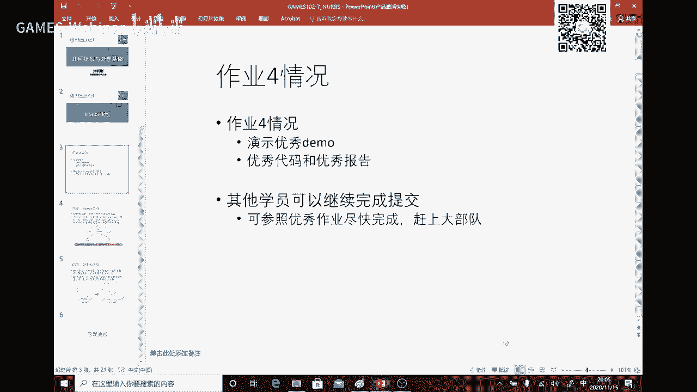
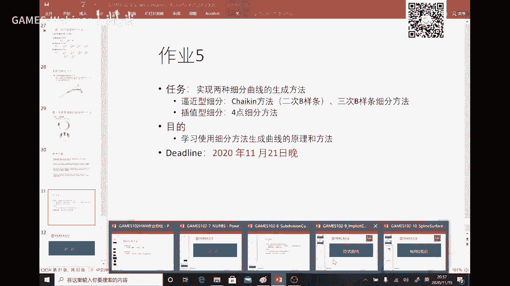

# GAMES102：几何建模与处理 - P6：NURBS曲线、细分曲线、隐式曲线与NURBS曲面 📐

在本节课中，我们将学习几何建模中几种重要的曲线与曲面表示方法。我们将探讨NURBS曲线、细分曲线、隐式曲线以及NURBS曲面的核心概念、动机和应用。这些内容是现代计算机辅助设计（CAD）和计算机图形学的基础。

---

## 作业回顾与优秀案例展示 📝

上一节我们介绍了样条曲线的构造方法。本节开始前，我们先回顾一下上次的作业。

本次作业涉及求解方程组，特别是推导三转角方程，具有一定难度。总体提交率接近30%，但提交的同学完成得相当出色。

以下是部分优秀作业案例：

*   **案例一：** 该作业实现了一个矢量曲线编辑与设计工具。用户可以调节曲线节点及其切线，可以全局求解三次样条以获得处处C²连续的曲线，也可以调节中间节点以获得G¹连续性，甚至产生尖点（C⁰连续）。其交互设计已达到实用程度。
*   **案例二：** 该作业界面不同，但同样支持实时叠加、拖动顶点，并可以增加输入点。它也能够改变切线的连续性，设计尖点，功能完善。
*   **案例三：** 该作业展示了灵活的设计能力，例如将曲线调整为兔子耳朵的尖点（C⁰连续），或将部分调整为G¹连续以保持圆滑。这些工具为艺术家和设计师提供了强大的灵活性。

这些优秀作业报告将与同学们分享。

---

## NURBS曲线：从Bézier到有理形式 🔄

回顾前五节课，我们从函数拟合到Bézier曲线，本质上都是在为每个控制顶点叠加一个权函数来构造曲线。Bézier曲线使用的Bernstein基函数在定义域[0,1]上是全局非零的，因此修改一个顶点会影响整条曲线，缺乏局部性。

为了获得局部可控性，人们引入了样条曲线，其基函数只在局部节点区间非零。这样，设计师可以分段设计曲线，互不干扰。

然而，Bézier曲线本质上是多项式，无法精确表示圆、椭圆等圆锥曲线，而这在工程中至关重要。为了解决这个问题，人们引入了**有理Bézier曲线**。

其核心思想是：在更高维的空间（投影空间）中定义一条Bézier曲线，然后将其投影回原空间。投影过程引入了除法，从而得到了有理形式。

**有理Bézier曲线的公式**为：
\[
C(t) = \frac{\sum_{i=0}^{n} w_i P_i B_{i,n}(t)}{\sum_{i=0}^{n} w_i B_{i,n}(t)}
\]
其中，\( w_i \) 是权因子，\( P_i \) 是控制顶点，\( B_{i,n}(t) \) 是n次Bernstein基函数。

当所有权因子 \( w_i = 1 \) 时，公式退化为标准的Bézier曲线。权因子 \( w_i \) 可以影响曲线的形状：权值越大，曲线越靠近对应的控制顶点。

引入有理形式后，曲线可以精确表示圆锥曲线。例如，要表示1/4圆，只需设置两端点权值为1，中间权值为 \( \sqrt{2}/2 \) 即可。

**NURBS** 是 **Non-Uniform Rational B-Spline** 的缩写，即**非均匀有理B样条**。它综合了以上概念：
*   **Non-Uniform (非均匀)**：指定义基函数的节点向量可以是非均匀分布的，这提供了更一般的控制能力（如产生尖点）。
*   **Rational (有理)**：指采用了上述有理形式，可以精确表示圆锥曲线。
*   **B-Spline (B样条)**：指其基础是B样条基函数。

因此，NURBS曲线的形状由三个因素共同决定：**控制顶点**、**节点向量**和**权因子**。它继承了B样条的优良性质（如凸包性、变差缩减性），同时表达范围更广，已成为CAD领域的工业标准数据格式。

---

## 细分曲线：通过迭代加细构造光滑曲线 ✂️

细分曲线提供了一种不同于基函数组合的曲线构造方法。其灵感来源于Bézier曲线的de Casteljau作图法，可以看作对一个初始多边形不断“割角”或“补角”以使其光滑的过程。

细分方法的核心在于两个规则：
1.  **拓扑规则 (Topological Rule)**：如何增加新的顶点（即在哪里加）。
2.  **几何规则 (Geometric Rule)**：如何计算新顶点的位置（即加到哪）。

细分方法主要分为逼近型和插值型。

**1. Chaikin割角法 (逼近型)：**
这是最早的细分方法之一。对于每条边，取距离端点1/4和3/4处的两个点作为新顶点，连接这些新顶点形成新的、更密的多边形。不断重复此过程，极限曲线是光滑的。

**2. 四点插值细分法 (插值型)：**
这种方法保持所有旧顶点位置不变，只在旧边之间插入新顶点。新顶点的位置由相邻的四个旧顶点加权平均得到。一个著名的公式是：
\[
P_{new} = \frac{9}{16}(P_i + P_{i+1}) - \frac{1}{16}(P_{i-1} + P_{i+2})
\]
其中，\( P_{i-1}, P_i, P_{i+1}, P_{i+2} \) 是四个相邻旧顶点。权值中的参数需要在一定范围内（如 \( \alpha = 1/16 \)）才能保证极限曲线光滑，否则可能产生分形曲线。

细分方法的收敛性和光滑性分析通常通过将其过程表示为矩阵乘法，然后分析该细分矩阵的特征值来完成。特征值的性质决定了极限曲线的行为。

作业五将让同学们实现Chaikin细分和四点插值细分，以体验其简单而强大的构造能力。

---

## 隐式曲线：由方程定义的曲线 🎯

之前学习的曲线都是**参数曲线**，即点的坐标由一个参数t的函数明确给出：\( C(t) = (x(t), y(t)) \)。

**隐式曲线**则由一个方程定义：\( F(x, y) = 0 \)。所有满足该方程的点(x, y)构成了这条曲线。例如，直线 \( ax+by+c=0 \)，圆 \( x^2+y^2-R^2=0 \)。

隐式曲线可以看作二元函数 \( z = F(x, y) \) 的图形与平面 \( z=0 \) 的交线。它非常适合表示封闭曲线和处理无序点集。

**如何绘制隐式曲线？—— Marching Cubes算法思想（二维即Marching Squares）：**
对于复杂的 \( F(x, y)=0 \)，很难求出显式表达式。Marching Squares算法提供了一种数值化绘制方法：
1.  用网格覆盖定义域，计算每个网格顶点处的函数值 \( F(x, y) \)。
2.  根据每个网格单元四个角点函数值的正负号（如+或-），判断等值线 \( F=0 \) 是否穿过该单元，以及穿过的可能方式。
3.  根据预设的几种情况模板，在单元内用直线段近似连接等值点。
4.  遍历所有网格单元，将线段连接起来，就得到了隐式曲线的多边形近似。

**如何从点集重建隐式曲线？**
给定一个无序点集（假设来自一条封闭曲线），我们可以拟合一个隐式函数 \( F(x, y) \) 使得：
*   在点集上，\( F(x_i, y_i) = 0 \)。
*   在点集内部，\( F(x, y) < 0 \)；在外部，\( F(x, y) > 0 \)。
这可以通过为点集及内外附加点赋予函数值（如0, +1, -1），然后利用前几节课的**函数拟合/插值技术**（如RBF径向基函数）来求解一个满足这些约束的二元函数 \( F \)。最后，提取 \( F=0 \) 的等值线即为重建曲线。著名的“泊松重建”方法就是此思想在三维的推广。

---

## NURBS曲面：从曲线到曲面的张量积推广 🧩

理解了曲线之后，曲面就变得直观。**NURBS曲面**是NURBS曲线在二维参数域上的直接推广，采用**张量积（Tensor Product）** 形式构造。

**NURBS曲面公式**为：
\[
S(u, v) = \frac{\sum_{i=0}^{m}\sum_{j=0}^{n} w_{i,j} P_{i,j} N_{i,p}(u) N_{j,q}(v)}{\sum_{i=0}^{m}\sum_{j=0}^{n} w_{i,j} N_{i,p}(u) N_{j,q}(v)}
\]
其中：
*   \( P_{i,j} \) 是控制顶点网格。
*   \( w_{i,j} \) 是权因子。
*   \( N_{i,p}(u) \) 和 \( N_{j,q}(v) \) 分别是u方向和v方向的p次、q次B样条基函数。
*   节点向量也分别定义在u和v方向上。

可以将NURBS曲面的构造理解为：先沿一个参数方向（如v方向）构造一系列曲线，再将这些曲线上的点作为新的控制点，沿另一个参数方向（如u方向）构造曲线。曲面的性质（如凸包性、局部性）是曲线性质的直接延伸。

由于定义域是矩形参数域，对于复杂拓扑曲面（如带洞曲面），通常采用**裁剪NURBS（Trimmed NURBS）** 技术，即在参数域上定义一条闭合曲线来表征“洞”，然后映射到曲面上进行裁剪。

此外，还有定义在三角域上的曲面片（如Doo-Sabin、Loop细分曲面），适用于非矩形区域的拟合，其基函数通常采用重心坐标的形式。

---

## 总结 🎓

本节课我们一起学习了几何建模中四种核心的曲线曲面表示方法：

1.  **NURBS曲线/曲面**：作为工业标准，它通过控制顶点、节点向量和权因子提供了强大且灵活的设计能力，并能精确表示圆锥曲线。
2.  **细分曲线**：通过定义简单的迭代加细规则，从粗糙多边形快速生成光滑曲线，概念直观，计算简单。
3.  **隐式曲线**：由方程定义，擅长处理无序点集和表示复杂封闭形状，其绘制和重建依赖于数值方法和函数拟合技术。
4.  **曲面构造**：NURBS曲面是曲线理论的张量积推广，而三角域上的曲面片则提供了处理非矩形区域的工具。

所有这些方法背后，**函数拟合**的思想贯穿始终。无论是选择基函数、设置权值，还是重建隐式函数，本质都是在寻找一个满足特定约束或目标的函数来表达几何形状。

从下节课开始，我们将进入课程的另一半，学习**离散曲面（三角网格）** 的表示、处理与分析，这是现代数字几何处理的核心内容。