# GAMES102：几何建模与处理 - P7：曲线光顺  离散曲线  三角网格 - GAMES-Webinar - BV1NA411E7Yr

好那个同学们，今天晚上我们的课开始了啊，啊今天我们继续会把曲线方面的内容讲完呃。

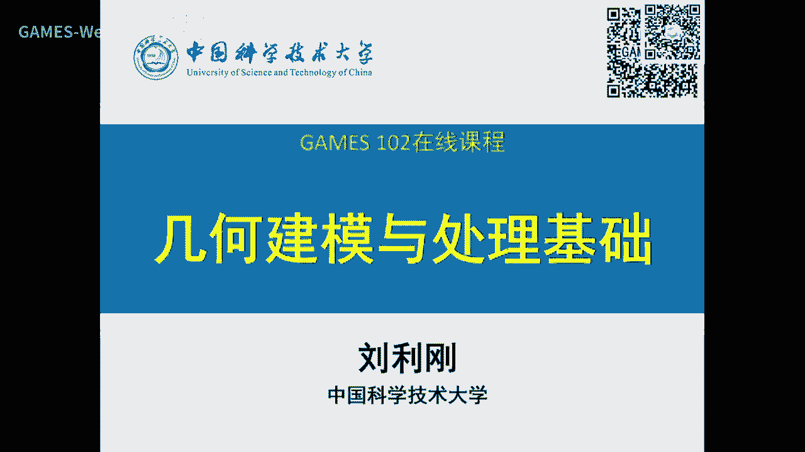

首先我们看一下那个好。

我们左右五的情况，昨天晚上昨夜我已经批改啊，这个地价完毕啊，今天我们啊昨天我那个批改了一下啊，这些任务呢主要是实现b进行和差字型细分啊，啊地交同学有29份啊，那个其中有十分啊，这个还有其他的一些语言好。

这个还有部分同学说延期延误交，这个也都可以的好，那我们看一下引擎递交的作业作业情况啊，这个我们挑选了部分吧，比较优秀的一些同学的例子和报告，就是那个蔡金细分的一个方法啊，这个事情非常简单。

这个在报告中也写的非常详细啊，这是三次啊，三次它的细分不一样是吧，那个如果后面的同学们有时间啊，就可以去阅读一些细分的一些更多的一些知识，所以二次跟三次呢要像上次那个呢这个叫proprimary。

就是叫主系分，二次那个叫duo细分啊，这个基础和偶数的细分可是稍微有点不一样啊，这个一个是刚好两个形式对有关系啊，我这里就由于这个是基础课程，我就没有详细展开。

但是这个嗯你们体验一下这个细分两个还是有点不一样啊，因为增加的点和线不一样，特别是对于曲面来讲，它那个嗯这个二次和三次的细分，这个啊方法还是有很大区别的啊，当然四点细分就是差值型的啊，就是实现也很简单。

那么中间有一个阿尔法值，阿法值就是那个向量的这个偏移是吧，这偏移是0~8分之一，这种中间啊取得不错的结果，那么王朝同学呢他把这个阿法值超过了1/8啊，零点你加我这个就发现它这个曲线就变得比较怪异是吧。

事实上呢它就变成了一个细分类的这个曲线啊，你可以调整阿尔法，阿尔法越大，可能细分这个会会会越杂乱一点啊，咱们呃这个证明了我们就不去讲啊，但大家可以可以试一试啊，你程序写好了，直线不难啊，程序写好了。

你就可以看到这个现象好。

那么这是王成同学的一个啊这个视频啊，可以可以看到它这个交互界面写的还是比较友好的，可以可以看到它呃输入点以后就马上可以生成不同类型的细分啊，这个四点的二次三次都可以啊，然后可以控制节点，可以显引调是吧。

只显示曲线，还可以显示这个细分的次数啊，啊所以它切换这些都是非常方便的，因为牺牲p粉本身它就是线性运算，所以啊你只要细分不是特别多啊，3~4次这个细分，反正这个速度还是人时跟得上啊。

这个总体上这个界面还是不错的，好我们来看另外的同学长金俊啊，这23次这个细分的这个形式开的和b的两种情况，他也做了那么4。7分啊。

这也也做了啊，这是他的一个demo啊，我们看一下啊，是这个绿色绿色多边形呢，就是它的输入的多边形啊，那么这个黄色的就是曲线，你看到他也能调这个阿帕兹啊，当然阿帕兹他固定在啊就小于1/8啊。

所以它没产生分型上飞行很容易把参数调下去了，然后这三种颜色就是三种不同的细分啊，那么其中两种逼近的一种是差值的啊，那么这个界面它就是两种积分，都产生了一种紫色的和一个绿色的封闭曲线。

你可以看一下它的这个曲线能够实时的被显示啊，后面后面应该还还有一些好没有好。

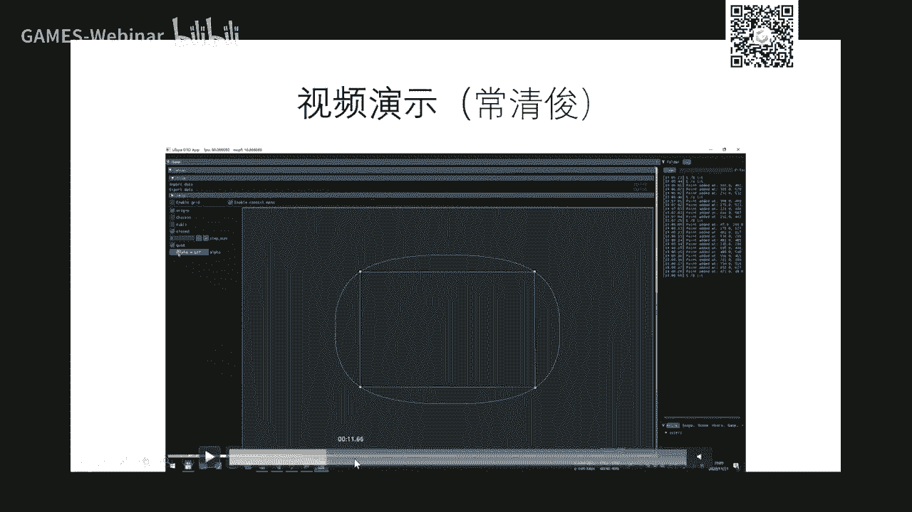

那么这是另外一个同学做的，也是相对比较好的啊，项羽啊，陈同学，然后那个他这个鼠标很有特色啊，点一下它会有一个像波浪一样的，可以让用让用户感觉就他输完了对吧，这是这个给用户一个比较实时反馈。

就是说你你你要告诉我这鼠标点的是产生作用了，产生产生效果了啊，就是一个响应啊，这也是一些很好的ui的一个啊，这种比较小的一个啊细节啊，这话让用户感觉到我输入鼠标点击了，确实是在系统响应了我的世界好。

那么从他的demo可以看到它呃，也也是一样，跟刚才两个同学一样，可以实时调节这个阿尔法值啊，还有不同的细分，还有还可以原始周边形啊，你可以看到阿帕值是0。477，就产生分支型啊。

分型的类型他也可以去实时控制啊，就改变这个初始的这个呃多边形曲线啊，然后就也可以实时得到这些曲线啊，啊这曲线它它它没有实时跟着动啊，上次也是完全可以跟着动。

跟着这个同时更新好啊，我们还选了另外一个小小同学的，他呢就实时性好一点啊，你可以看到我输的时候，曲线就跟着是在生成是吧啊，这是均匀三次的，刚才刚才那个是蔡京的啊，最近二次就是四点积分啊。

它也可以随时增加点啊，可以编辑点啊，拖动好像也也能够增加啊，唉好嘞好，我们就就不会看了，好嗯嗯嗯，这只要交交作业的同学做做，做的还是相当不错的啊，那么我们也会把这四位同学这几位同学吧的代码。

还有报告也分享给其他同学同学如果后面有同学啊还要做作业的话呢，可以参考一下啊，但最好是呃我们虽然公开了这些代码和报告，但这个只是参考，如果你们真要学学这些东西的话，最好最好自己做一遍以后呢。

就会啊掌握里面的原理以后会呢更更加啊能够很好的利用这些工具啊。

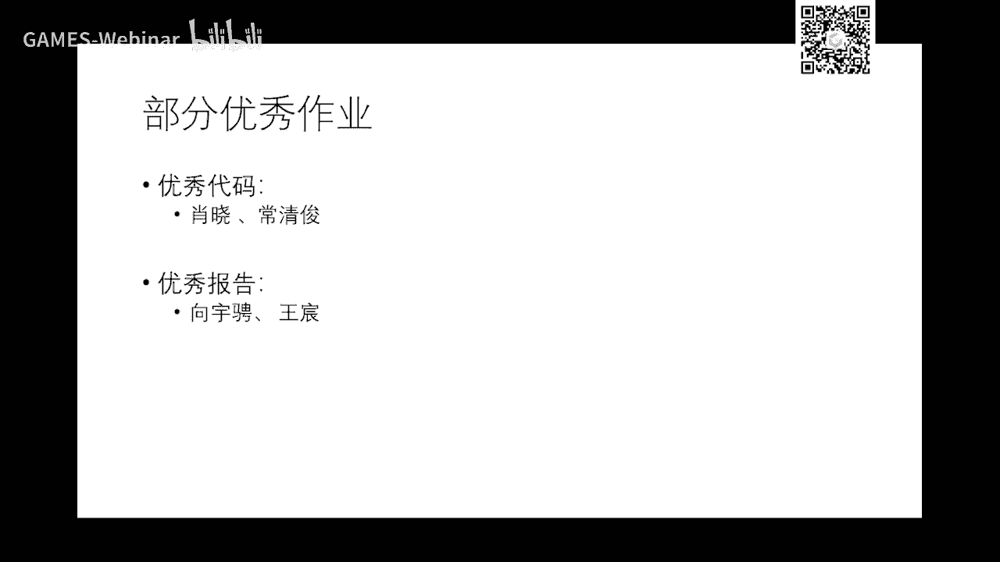

来做你的事情。

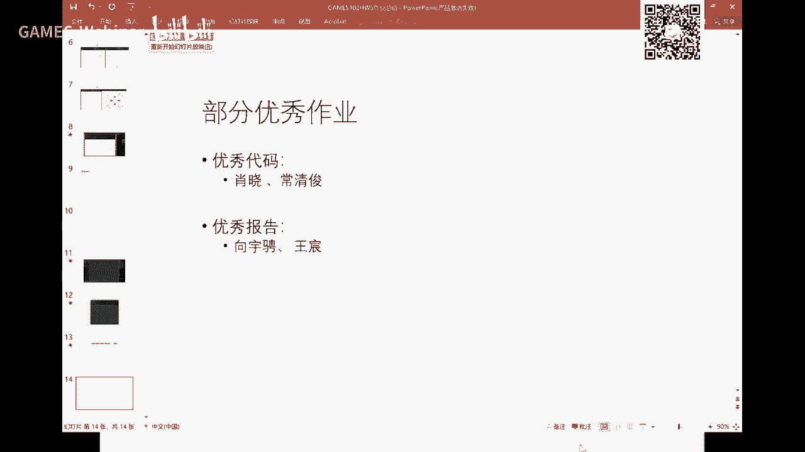

好吧好，就是叫光顺啊，这光顺呢一般在几乎大部分的课程里面嘛，或者教材里面都不会有啊，因为这东西是一个比较比较精细化的建模的一个啊，在很多软件里面，这个很多一些用户是不会用的啊，但是呢这个很重要啊。

我觉得所有今天还是抽点时间把这个东西讲一下。

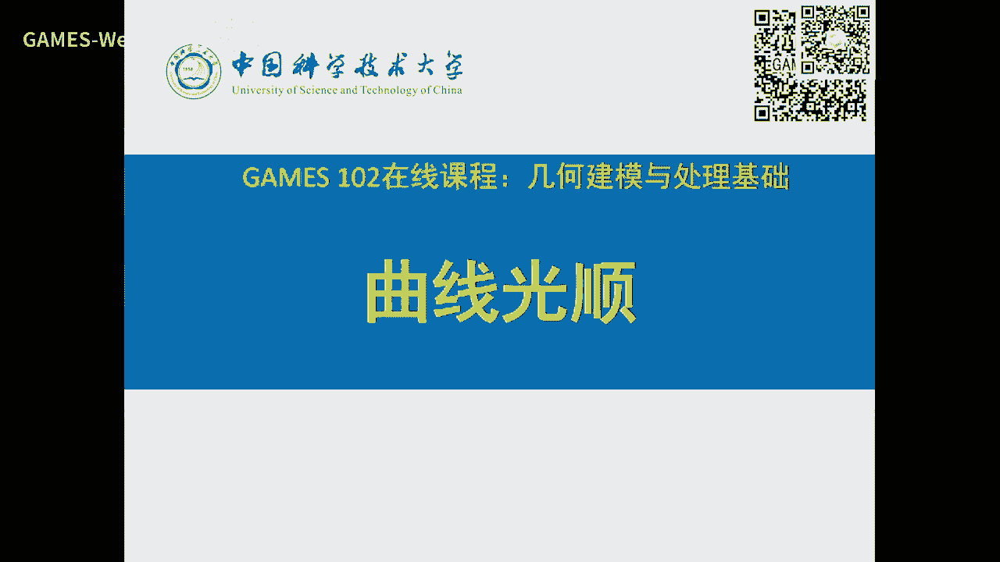

那么光滑这个概念大家都清楚啊，就连续我们在大一的时候就知道连续连续概念啊，连续概念我们那个在前几周也讲过，它的这个定义是吧，就是它关于它的参数是这个连接导数啊，一样就是c0 是吧，就是就是接牢了一阶。

就就是这个切线连续啊，那么r j就是高阶连续，那么一般我们只二阶以上的连续呢就叫光滑啊，指指这个东西曲线非常非常光光滑smooth啊，那么连续的是continuous，就是连续啊。

所以说有的时候连续跟方法我们也是啊，这个这个这个通用教的啊，就是光滑知识连续性高一点啊，那么我们也学过那个我们也讲过啊，就是几何连续跟参数连续又不一样，九点去呢实际上更刻画了他的本质方法性。

因为结构连续是跟参数化无关的，这个这个上面的这个连续呢是跟参数化是有关的啊，大家还记得我们举这个例子是吧，就就一个线段是吧，你在在这里分参数化不一样啊，如果你刚好是胡桃穿的话呢。

这个这个连续性就是实质性无穷啊，如果呢这个这个这个是跟这个战争这个参数呢是一样的，那么就这连光滑性啊，这这个光光滑性就会降低对吧嗯，但是呢如果我们跟参考无关的九零性呢就是一样啊。

就这里能刻画它的一个本真的一个方形好，那么更适合于这种曲线设计啊，因为它不属于你的表达而改变，它是它的一个本真的一个啊性质啊，好那么什么是光顺曲线，光顺呢英文叫fell啊，就是公平的啊。

就是那个那个词一样啊，啊就是fell fell，那么这里用的动名词fing啊，就是呃叫曲线光顺啊，光顺是什么概念啊，光顺呢嗯就是说它可以是非常光滑的，cc无穷的，但是呢你可以看到这两个曲线。

但如果你把这部分放大后，发现诶它呢还是一个比较啊，顺等一个曲线，它这边一放大呢，里面的凹凸凸的歪歪扭扭的是吧，那么这种呢是在这个肉眼呢，可能这样也可以看看不出来，但是呢你可能用手去摸的时候呢。

能感觉到他这边是有一些凹凹凸凸啊，就是因为手我们手指是很很敏感的一个啊，这个传传感器就是你去摸的时候呢，所以有时候木匠师傅做完一个东西以后，会用手去摸一下，看看是不是有一些凹凹凸凸的地方是吧。

还有办法呢实际上是你在你在里面打个光啊，这个后面也会提到这个事情啊，就是在这里打光，看它的反射，如果它反射是连连续的，表示这个曲面还是比较好，如果反射呢是呃这个有间断。

那么就表示这个法你看这个凹凸出的这个法向发射距离变化是吧，但是还不够，还有什么，还有曲率也发生了变化啊，所以后面我们会过来解释这个光顺呢实际上是从宏观来讲，你可能看不清楚，但是在微观上来看。

从用它的曲率线来看，就知道这个曲线是不是光圈啊，那么要要讲这个曲率，那么我们啊会会那个呃也讲一讲这个积分几何学啊，就因为这边啊里面有些概念，像这个曲率啊，法向还是大家需要清楚的啊。

这些东西呢这些内容呢都不复杂啊，这些都复杂，都是你们大一学过的这个微积分里面都涉及到的，只不过呢呃微分几何学呢回来会讲的更多一点，会告诉大家怎么用这个呃，呃这个微分几何的一些符号啊运算啊。

来来研究曲线曲面的更多的性质，大一的内心呢只是啊比如说这个切线啊，我一个曲线，反正现在大家都很清楚啊，就一个曲线就是一个单参数到一个r的一个影子影射啊，就是就是曲线只要是r一啊。

这个这个是一一个一个说一个变量就就是曲线嘛好好，那么对它的切线呢就是它的每个分量的导数，因为你有两个分量，刚好是刚好是两个导数，那么过起来就是一个啊在这个平面上的一个一个切线切线啊。

这这个就是这个曲线在接近切线，那么这个切线的这个沿着逆是逆时针呢，呃这个垂直呢就可以得到它的法线好，但是从无名几何上的角度上来看，我们法线不是这样来用t的旋转啊，是用t跟另外一个这种啊。

这种叫做叫做乘法时去做叉积得到n啊，它还能t n b啊，嗯是构成一个friend标价啊，在这里我们就不展开，因为呃有很多同学不是数学类的啊，数学类帮你，这不不数学类的话，你去呃找一本微几何书。

稍微了解一下他这些符号就能搞明白啊，好那么这个界线法向呃还有一个曲率，曲率概念呢，取的概念就是事实上也是曲线的一个本身的量，曲线是重量什么呢，啊曲率数量是什么呢。

取率就度量了一个曲线在这一点的一个弯曲程度啊，如果这个曲线弯的弯的很厉害啊，我这里举个例子啊，啊这里应该号后面有个图对你看这个这个曲线，就是这个曲线的曲率在这一点取是什么呢。

是跟它的两阶密切圆的半径的倒数这个r，那么这个曲率k等于r t那么是什么意思呢，就是说呃那什么什么叫两线密切圆，就是这个圆在这一点跟着曲线有共同的接触点只有一个，而且有共同的切线，而且有共同的曲率啊。

所以这个这个这个半径的倒数就是这个曲率啊，你可以看到在这一点，但是取原大一点，在这一点的曲率圆形小一点，所以这个r就小对吧，r小r小的话1/2就大对吧，所以这一点呢就取率大，所以越平的话曲率越越小。

因为它这个半径就很大嘛，是吧好，所以大家可以看到好，那么这个这个密切圆越越小呢，表示这弯的厉害，因为他要弯成一个小圆的样子啊，所以曲率越大表示更弯，曲率越小，表示越平，好吧好。

那么大家马上可以想象一条直线段，这一点的取值是多多少啊，斜率越小越平是吧，所以一直线段处处斜率不等于零啊，也就是说它的密切圆半径是1/0嘛，就是无穷大啊，这个因为我们一般就是无穷大的一个圆。

就是跟这一点相相切啊，当然但不存在无穷大的圆了，我们自然理解好吧好，这里有个概念，就是曲率啊，它是一个啊呃首先是它是描述这个曲率曲线弯曲程度的一个量，其次呢它是跟什么跟参数化是无关的。

就跟我们刚才提到的那个几何连续性一样的，它跟差的化是没有关系，它是描述了曲线的一个本质的一个量啊，这个无论你这个里面的参数是怎么写，怎么变换，它这个这个曲率是不变的啊。

所以现在我们同学们就学到两个不不变量，就是参数化不变量啊，一个是几何连续性，一个是曲率啊，当然对于空间曲线呢是三维中的欧式三维空间的曲线，还有个概念叫老绿老绿，我们今天还是以二维。

我想我们把二维搞明白了，三维的东西只增加了一个空间的一个，就相当于是从平面把它拎起来这样一个度量啊，因为曲率是描述了啊这个切线的变化的速度啊，老绿呢是描述的在垂直方向的切线变化的速度啊。

这个我们就简单这样解释一下，好吧，我们不展开好，那我们我们啊回到我们光寸定义，这光的定义呢实际上是在那个在很多软件啊，是不是工业软件像kt啊啊就是打锁的法国打手公司的卡t啊。

还c d里面算是都都是有一些工具可以让大家来调这个，来设计这个这个啊叫光顺，所以我们现在当前学的这种啊北辙的曲线啊，这种曲线都是宏观的一些曲线的一些性质啊，所以我们前面所讲的都是宏观的。

那么对于这个光顺，它是一个微观的性质，并且在研究界虽然有些文章，但研究的非常少啊，这个因为比较难描述啊，我们后面会解释，因为它没有一个非常明确的一个定义，就是数学建议。

因为知识既然没有数学很明确的定义呢，你就不好去去去做数学建模，去研究它，对吧啊，但但这个不存在说啊，不是不是说就没人去研究，也有啊，只不过这个都是啊一些不同角度去定义这个光顺好。

那我们在直接直观来看方程是啥概念啊，好我一条曲线，我把每个点的曲率，刚才我们不解释了，这个曲率k啊，我们专业叫卡卡啊，在数学上它是个希腊字母教学经验卡普，但是工科学生可能大部分就念k啊，一样啊。

好那么这个曲率卡帕那个它的它的大小啊，那么因为呃呃这个嗯有些地方是ky，就是就是就是k等于零，我们还是用k吧哈那么这个k等于零的地方呢叫拐点和它的啊，那么就是有正有负啊，所以正负呢就是方向不一样好。

如果你把一条曲线的这个k把它垂直于法线与，沿着法线方向把它把它标出来，是不是每个顶点的这个曲率啊，哎就有个这样的图，反正你在学曲线上做采样产生蜜饯吗，你就画的这个多一点啊，你可以看到这种题。

这条曲线它取率呢时大时小时正十负对吧，好像曲率变化很多，有规律好，那我们再看这条啊，这个曲线你可以看到它那个曲率呢没有符号变化，全在一边，并且呢你可以看到这个这个这个长度啊，哎慢慢慢的增加增加呃。

在在在在这个减减少，它不会像这里一样的，一会儿增加一会减少啊，一会增加一会减少，还有变成负是吧，所以呢从宏观上来看，这两条曲线就是这个黑色的啊，这个这个黑色曲线你根本肉眼看不出来。

但它的曲率分布完全不一样，那么那么从从用户或者叫设计角度上来看，这条这条曲线比这个学校要要要要好，这个这个学生是不好的啊，就不够好，也不是说它不好就不够好啊，为什么不够好，我们后面会来解释它的原因好。

这左边这条曲线呢，你可以看到它取率有负有正是吧啊有负有正，那这边呢哎虽然有负有正，但它这个变化啊就变化一次啊，符号是它这里变化了两次，符号三次，这里还一次对吧，所以它它这个曲率老变符号是吧。

变符号什么符号一变，从正变到负去掉就发生一个拐点啊，所以在这个k等于零的地方叫拐点啊，所以拐点就不好管理，就像蛇一样的歪歪歪歪扭扭啊，弯扭扭会增加什么呢，啊我们马上就会解释好，所以这是哪一条船船的话。

像以前设计船是朝三个方向投影，这个方向正方向还有顶啊，还有侧啊，三方向，那么这个方向当然都有那个专有名词啊，就在一个船船型设计里面啊，就最有名词我们就不展开好，那么这个我们我们遗传。

那么特别是在船造船工业，造船工业也是国之重器啊，呃像我们上海有好多这个造船厂啊，华东啊，沪东造船厂，江南造船厂都是呃，他实际上是非常希望这个处这个曲面啊，这个线型啊要非常非常非常光顺，光是什么意思呢。

哎我在水里面去运行的时候呢，水啊对它的这个冲击或者阻力最小好，那我们这次就就就想起了光顺子号，刚才我打比喻，曲面上面歪歪扭扭，就是像蛇一样的这个凹凸凹凸，是不是会增加水的阻力是吧。

所以这个这个船型这个就不是好的船啊，所以至少在在这个这个物理上，很好的这个这个信任啊，所以这个啊无论是这种高精度的这种这种船啊哈还有像这个鞋啊，鞋如果我们这个鞋不不光顺的话呢，穿的就别叫啊。

还有这种齿轮啊，齿轮的话呢，呃如果你看像这里这里这是一个半径变化，就在这个凹的地方，如果这里面也是yy这个曲线绕来绕去，就是曲率变化很剧烈，那么对这个叫叫这个这个这个地方的尖角啊。

就磨损是非常非常大的啊，实际上是寿命就不长啊，还有很很多了，我刚才举了造船，还有汽车，汽车一个表面，你看有些好的汽车表面看起来非常非常漂亮是吧啊，这个大家应该有这感觉是吧。

你你在一个啊呃呃室外去看的时候呢，还有背景在上面的这个反光是反光也很好看对吧，就是不是歪歪扭扭的好好，那么那么光顺呢为什么在基本上教科书里面提的很少啊，那么这个一个是比较难度的啊。

这个叫做特殊的一个一个一个度量啊，就是在传统的话多次关注这种宏观的这种样条表达啊，光顺的就讨论比较少，再一个呢就光说的没有一个数学定义啊，所以它比较难啊，所以所以说你说你说可以用眼睛看吗，当然可以啊。

像以前木匠啊啊我不知道你们有没有见过木匠哈，我们小时候那我舅舅出的木匠，所以经常在呃能看到他工作的状态，他他没用用那个报纸报一下，磨以后就会用眼睛去看一下，从侧面去看看他是不是光光顺啊。

所以现在我才明白，这样用眼睛这样去侧面看呢，是看到光顺度啊，是不是啊，好那么在历史上呢也有不同的学者啊，这个书啊就是有赫赫有名的啊苏步青先生啊，所以苏不清先生是威名几何学家，所以我们这个学科啊。

图形学或或者叫计算几何，上次就是苏先生在推动，特别是在啊70年代到80年代左右啊，苏先生还那时候在世，然后对推动，因为里面用了大量的微分几何学，所以呢说不清对着我们这个学科的推动。

成为一个比较重要的一个呃小小学科，那就发挥重要作用啊，那么这个刘就是他的学生刘鼎元啊，他们当时也对这个光顺fl定义了啊，他认为什么呢，他认为曲线一定要c2 连续，而且它的曲率图啊。

知道什么是是嗯嗯没有多余的这种震动，variation就是没有摆动是吧，你如果摆的这个曲率啊，老是一大一小，一会大一会小，一会儿，一会儿负我一会儿正就摆弄很多嘛是吧。

而且比他这个意思什么曲率的分布啊啊尽量的啊均匀，就说不要老是变来变去是吧好所以我们刚才也解释了这个定义，它的描述，还有这个定义呢，a fireforeign farming。

也是我们c g d这个学科的啊，美国的一个比较资深的啊，也是前几年去世啊，那个他写了很多在关于我们这个学科的书，所以你们如果要去看这个啊，我们这个这个曲线设计的一些书啊，去看他的书比较好啊。

它是描述什么呢，他是说曲线是光滑啊，就是取图，这是参数，这是把把那个取点拿来看，就它的图呢就是单调性不要太多，一会儿正一会递增，一会递减，如果如果老是这个这个曲率图是这样的话，就不好啊，按它的定义是吧。

所以可以看到曲率变化呢不能够太过于啊，这个这个非删掉，你会增粉精选角啊，后来他过了十多年，他又自己提了另外一个概念啊，那曲地图只要是连续，这个跟它也有瑞士。

还有啊这个这个这个定义呢就就跟他们前三个不一样，这个定义呢它是用一种曲线的能量来定义，就是说我整条曲线的曲率的平方做积分，因为这个平方是大于零嘛，大于是吧，所以说你这个曲率呢就不能太大是吧。

因为它这个整体上是要积小，所以它是用一种曲线的整体的一个人能量的定义啊，也有人这样定义啊，这并且这种定义的方式啊，我这里练一下啊，好那么这个呢我们把它叫做全局定义法。

因为它是刻画了这个曲线的全局一个积分嘛，积分不是整整体全部累加的一个性质是吧，是曲率平方的积分啊，要要尽量小好，那么事实上呢那个呃我这里的十代呢是没有出现在任何教科书上的啊。

这是当时我们啊中国的一批这个学者啊，到实际工厂啊，就是下了工厂，就是70年代在一些像沈飞啊，西飞沈阳飞机场，西安飞机场，还有沪东江南厂啊，去工厂摸索出来的一套东西啊，所以后来我在浙大的时候。

就跟那些老先生啊，其中有一位还是呃这方面非常经验丰富的总方方先生啊，就是他们呢就摸索出一套就关于光顺的一些观察啊，就是说这个光束呢不是一个传奇问题，就不能用这个一个曲率的一个积分来描述它，不是这个。

因为曲率全区域描述的话，就像最小2x1样的，他每个地方可能都很小，但是呢但是对k啊的这个这个增长性它控制不住，就是说你这个k平方等于等于几角啊，你这个可能这个值确实很小，但k很不大，但是k老是不呃。

这个这个脑洞也不好是吧，它也不是局部问题，你不能光看一个点的k不行啊，一个点的可以只是描述它的在这一点是不是弯曲啊，所以他认为他是个大局部问题啊。

所以第一点第二点呢对cr就是就是当时苏不清先生给的这个结论，就是要cr上次不用cr啊，等一下我会给例子，就是可以比c2 要弱啊，不用这么高光滑啊，只要啊这个这个弱一点，还有一个就是这个这个分布啊。

分布就是我们要研究光顺，一定要从曲率触发，这也是对的是吧，你先因为曲率是这个曲线的这种啊弯曲程度的光速的一个放大器，所以我们去研究这个曲率好，那么他举例举个例子啊。

以及这个例子你可以看到这个y等于sin x sin x，大家知道是个周期函数，在x轴上下扭来扭去是吧，这个曲线是c无穷啊，那么那么这个曲线为什么不光是呢，是因为什么他有太多的拐点。

就是这个震动点就是震动数比比较高，一正一-1正一负是吧，就是从凸变凹，从凹变凸有一样的意思，就是正常数就是拐点数跟正常数是其实是差不多相等的啊，所以这种正能数太高的曲线不不不过光顺好，我们再看这个例子。

这个例子呢虽然它它的曲率图啊全是正了，没有穿越x轴就没有拐点了是吧，但是曲率图本身呢也是拐来拐去的是吧，就是递增递减递增递递减，因为这个是个抛物线，加了一个这个sin x。

所以就使得这个曲率啊也呈现这样的规律，所以说它虽然很光滑，是无穷，但是呢它怎么含有非常多的啊，这个这个递增递减的这个正正正正数是谁，不是yx本身本身是第一递增的啊，没有任何的震动。

但是这个他的两阶导数有很多的智能数，就是为了这个是两阶导导数图啊，啊只是一增一减，所以是这个这种曲线也不好，虽然宏观上看起来这个曲线都是递增函数啊，这是递增的啊，没有震动，但它的曲率图有震动，第三啊。

这个例子这个例子是在在这一点，显然连g2 啊都达不到，你看这个这个点的左边是一个这个小的圆弧，右边是这下一个是这个圆弧，所以两个圆弧半径不一样是吧，所以他们这个两边啊这个这个曲率是不一样的。

左曲率跟右曲率不一样，所以他一定不是c2 对吧，就还没还没还没达到cr，所以呢它它的这个连续性光环性就降低了，但它的曲率啊，它的这个这个这个变化呀不要太大，如果拆散的话呢，就是非常突兀。

就一个大圆到这里一下子过渡到一个非常小的圆，这时候呢也不光顺啊，所以这个呢什么不能发生太大的这个曲率的变化啊，在这个不连续点啊，不能发生这个，所以呢基本上他们呃这个在造船的过程中呢。

他们发现了这么呃几个啊那个现象吧，这个现几个现象呢，嗯从现有的呃那些以发表文章来看，所以呢在10年前吧，那我当时也参与了一些工作，就说院校学生是光顺的啊，第一它是c一加l一加l是表示那个就是l大于零。

但是还没达c啊啊就是叫叫变差cc连续好，那么首先拐点要少啊，这个跟以前有些结论是一样哈，第二个曲图的拐拐点较少，呃以前也有相对的这个呃就是发明这个定义也说了，他不能有太多的单调段嘛是吧，好也是一样。

那第四点呢呃没有太多的这个定义来说明，我们是加了第四点，第一点是光滑性减弱了，第四点什么曲率图的变化的振幅相对小，就是第三个例子，这个呢虽然他可能k不一样，就是两边的曲率不一样。

但是呢这个正负啊不能太大太大，就不光顺啊，小一点啊，这个差别不大，也是光顺的啊，所以这里面是这么这么四点是吧，所以知名人基本上从工程中，他们就放样啊，这个所发现的一些非光村的一些现象啊。

好实际是这里有个柱啊，就实际是跟以前的话就是啊这个描述是大部分机制，只不过呢我们这个比描述比比较比较全面好，那么这里有几个值，我我就用嗯，就这个叫正动数啊，那么这个是一阶正中数。

这是两阶正数验证正数呢就是函数本身的成本身的智能数，两件正常数呢是指这个曲率图的，就举例函数上就是这个近视以上的y y两撇，严格来讲应该是啊这个绝对的这个函数啊。

好那么我们后面后面会会会有用一用一个比较特殊的例子，就是y两撇呢约等于嗯啊我们在推导那个三次样条的时候，大家记不记得我们也用了这样一个假设，那个叫小脑洞啊，就是这个曲线的变化不是特别剧烈的时候呢。

这个实际上是近视y两撇就可以用来近视这个区域，好，那我们就快速讲一讲这个啊光算方法吧好吧，那么这个还记得当时在去找31条的时候，也有个假19 10度就是指什么呢，就是y一撇啊，远远小于一。

就是这个就是这个曲线的这个转角啊啊不会太大，那么这时候呢y两撇就等于k x啊，就是可以进食，我们在推到三次样条的时候不是发现了吗，如果如果这个它是三次，那么k呢就是线性是吧，就可以用三船角去推导好吧。

大家应该还印象有好，那么这个曲线光速方法呢，我我就快速过一下啊，因为只有做非常高精度，就是这种设计的时候，大家可能以后会用用得着啊，咱们大部分情况呢就是离散情况就没有这么细致的啊，好那我们就讲一下嗯。

第一个方就叫出光顺双生的，上是这这个几个步骤都是围绕刚才那四点来来做，好像这个就是什么，我就调整控控顶顶点，减少这个曲率的这个啊，定价第二个呢叫基本方式叫卡尺啊，也是调整，都是通过调整空空点点。

但是那是减少多余的拐点，就相当于一个尺把它压平啊，就是如果他拐的话，不让它拐，把那个词给给他，就这个哎呀，就是就是把它压平啊，这个目标目标呢是怎么减少第一类的这个啊。

正中数最后回弹回弹有点像物理一样的放放松啊，然后去看他的一些这个切变力的一些符号，然后去去减少，这不是减少了减少它的第二正中数就减少什么，减少曲率的这个这个正中数啊，具体我就不展开好吧对不。

这个我们呃毕竟是这个热门课的一个非常小的部分，我们讲讲它的结论啊，以及它的方法好，那么这个上面这个图呢是一个原始的一条曲线的一个曲子图啊，一个一个二阶导数求图啊，你可以看到它这里有正负变化对吧。

就这个地方还有这么多绕绕去的，那么通过刚才也首先要把它压压上去啊，啊第一步，第二步呢要把这些拐点啊啊来把减少这个往往下压这个往上提啊，这个往下压再往上提，就就让它有这样一个单调性啊，你可以看到没有。

就r上去了，是下来了，但是不要以呃在做这些操作过程中呢，一定要保证原始曲线不能发生很大变化啊，所以那边原始曲线的变化是有个界的，所以就是一般要保证在那个界上面这些曲率来调，就微调这些曲率啊。

所以可以看到他这个拐点还是有一个呃，有一个零的，这个是吧，但是这里有有123有三个拐点是吧，所以减少了两个，并且这个单调段啊就一就一段了啊，就这个就一下子就可以提升这个曲线的光程度了啊。

这是另外一个例子啊，也是你看到这个拐拐点被去除掉了啊，那么这里啊这这里的单单单调性提高了，以前是有啊，变高变低是吧，这样就变没有了是吧，好好那么这是第三个例子，也是一样。

你看这这个例子就是把把这部分的这个递增递递增递减把他干掉了，然后这个呢这个拐点把它去掉了，还有还有还有这部分这个智能数也减减少了，所以通过不在影响原始曲线的形状的情况下啊，当然不是说不是完全不影响。

在一定误差范围，是针对这个曲线稍微做一做一些变更变更，让这个曲率图发生很很好的一些调整，这是呃另外一个例子，这这两个例子如果抹掉右边的图，你们看路演根本发现不了左边两个图的区别是吧。

所以它们之间不是完全相同，但是误差非常非常小，但是它的曲率图你可以看到差别还是挺大的，像这个曲率图就非常好啊，你可以看到基本上这个曲率是个长子来，是个真正的圆，这不是一个真正的圆。

它取率再发生一些变化啊，只不过我们肉眼在这个空间上是看不出来，所以这个呢啊就是相当于把这个曲线啊，从原始空间变成了另外一个信号空间，就是叫做曲率空间啊，所以在有些时候呢我们处理问题的时候呢。

这也是一种方法论，在这个时原始数据上面啊，这个数据呢我们我们把它叫做观察空间是吧啊，就是这个这个这个数空间呢哎是一个特定空间啊，是个latent，reen space，唉，有的时候在这个空间去看呢。

它特征呢就很明显诶，因为曲率在我们这个问的问题来说，它策划的光程度哎，我们用曲率图这个这个特征来描述这个数据a就更好是吧，所以我们会去找很好的这个return space。

所以你要知道这个物理的这个叫做问题的背景是吧，那么我们人类发发明了好多这种sb space，像在这个问题里面是是这个曲率是吧，就在复利分析里面，从时域变到频率有些问题呢在食欲不好找不好不好不好。

那个研究我把它变变个变个空间到频域上去是吧，频率上去就能够看到频频率上的变化来使得这个问题，比如说去照啊，就说是那个一些这种相关的处理就更加容易是吧，所以所以我们要去找这种很好的这种特种空间是吧。

一来都不用去找了啊，反正你就构造好多颜色，反正让他可能是硬开，然后你你有你有一个input去去拟合它也行是吧，所以他们叫做呃非人为的这个特特征啊，这个映射啊，那么我们这种人为定义的话呢。

是这个这叫hand corpit啊，就是人工的特征啊，好我这里就顺带着解释一下啊，你们以后看那些文章也很容易看，只不过呢他把这个人类的知识都抛掉了，就直接用程序网络去拟合就行了，好那么这些是一些例子啊。

那个例子刚才也解释了好，那么刚才是解释了函数的，那么对于这个非函数类啊，它这个就不是有小脑洞的，这个假设刚才那个只是函数，但是这个我们一般曲线这种非非单词的这种曲线还是比较多的哈。

这个曲线显然就是非常非函数嘛，是参数型，那么呢我们在40年前吧，我一个硕士生王世伟哈，呃就我们就把这个方法推广到了这个曲线啊，是稀疏优化比较流行的时候啊，所以我们实际上是这个就是啊这个两阶差分量。

两级差分量就是曲率的导数的导数有两级导数，所以所以这个值不能太大，我们去描述一下曲线的这样一个量e一个一模一模的话，稀疏啊，就是一模具有稀疏性，近似等于临摹是吧啊，这个我也不展开啊。

就是就是当时一模临摹优化呀，一进一大堆，就是阴谋，什么意思呢，就是这个值啊，这个值不能够这个太多的非零啊，很多视频是吧，然后呢原来这个曲线呢不能变化太大是吧，这就是刻画原来曲线不要动是吧。

好那么这里我就直接讲讲一些结果啊，那么这个本方法就是我刚才提的用用稀稀疏优化来来做的这个呃，这个是原始曲线加上曲曲地图，这是这个这一行应该是取决在这个曲率曲率图。

可以看到原来这个曲线曲率变化非常剧烈是吧，被我们优化一下就减少到只有1l一降是吧，哦原来那些方法就是这是一种方法，就还没做得很好是吧，因为我们是一个全局的一个吸收优化系统。

所以系所以10年前的吸收优化还是比较强大的啊，现在研究吸收优化的人不多了，那么诶这是另外一个例子啊，你可以看到这是取地图，我们上次只要看看这一行啊，这这一行只要取地图发生了很很好的变化。

这个曲线光程度就达到了非常大的提升啊，好那么在曲面的光程光程呢就稍微难一点，因为刚才描述的都是曲线的y歪扭扭，曲面呢啊前面的微分几何可能我们下节课才能讲啊，就是因为曲面有两个方向，我们也前面解释过。

曲面叫张亮机，一个u方向，一个v方向，所以呢在这个那简单一点，在早年就是用三项啊，曲线方式就是把它分解成两个方向或者三个方向的曲线的光顺，然后再把它叠加，那样的话是有局限性的。

就是你没有把这个两个方向结合起来，一起考虑曲面在一个点有无穷多方方向是吧，而不是两个方向而已，所以你刻画的两个方向是不够的是吧，所以就后面就有人提出了一个能能量法啊，当然具体例来讲有两个。

一个呃这个呃最大的一个曲率，一个最小曲率，所以让这个积分啊，这个minimize啊，所以简单推广是这样，这样对话都都可以的啊，但是在工业界呢实际上是有一类曲面叫class a叫a曲面。

特别是在打索的这个卡特亚这个软件里面啊，后来很多cd软件都有这样一个全面类型，我和我们也有一些这个描述性的啊，就是他们有些说是g3 连连续的，比g2 还要考，你可以看到这个图g2 的话。

这个举例还有有增有降，g3 基本上达到一个比较稳定的这样一个变化是吧，那么还有一个检测检测曲率的一个非常啊，光速的一个非常好的方法是什么呢，就是画这种曲率曲图在一条条黑的白的啊，然后这个呢是反应等反应。

反应什么呢，反应呢光线打到曲面上，我们的这个它的变化，因为因为光线通过这个反向一反射上，就是变成了两阶微分量的一个属性的这个刻画了是吧，所以可以看到在一些软件里面可以画这种图。

你可以看到这个地方光只要只要介介绍线呢比较光滑，就表示比较好，如果如果如果这条黑白相间的线呢，弯弯弯弯扭扭，表示这里是很不光顺的，就这个局面必须改是吧，就是你只要把这个汽车放在放在室外有反光的地方。

就看到这里很不好看，外面扭扭是吧。

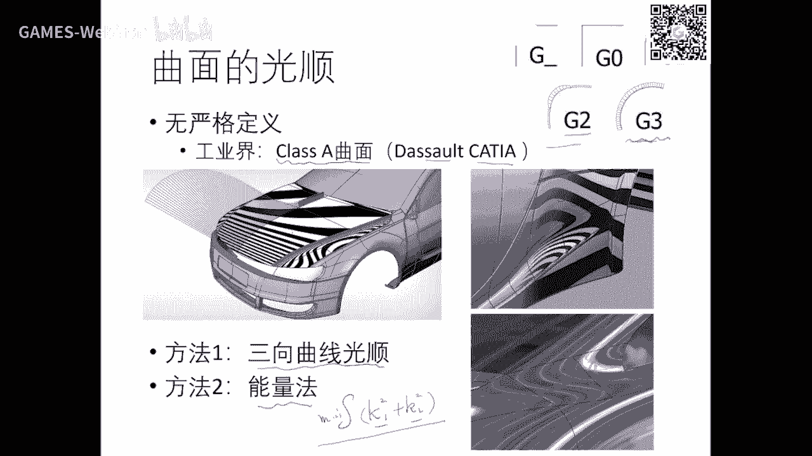

像像这个曲线就非常漂亮啊，你可以看到都是调的好好啊。

这是一辆汽车啊，大家应该认识这辆汽车吧是吧，就是你可以看到它的这个区域图啊，很漂亮是吧，出来的这个场景呢也不会呃，这里出现歪歪扭扭的地方啊，好当时呢我想就介绍到这儿啊。

我们也不是，我们可能也不是很多同学所关心的，如果有工业界从这个朋友啊在听的话呢。

这个产业界可能光顺还是要啊在你们的这个cd系统里面需要考虑的，好吧好，那我们啊继续啊，好我们我们基本上六节多课啊。

但是呢曲线曲面啊定义大家都非常清楚了哈，这个这个图我不知道以前有没有讲过的吧，这个图一拿来看，算是所有的影射，本质上都是一个我空间到另外空间的一个一个一个变换是吧，那么如果两两个都是实数。

就是一二函数啊，这个我们这个以这个重点讲得很清楚，如果是rm到r一是实数的多元是吧，好如果这个是变量是一维啊，这个是多维，实际上就是曲线，就是它的曲线是是个r n中的一个曲线，n等于二。

就是我们讲的平面曲线n。三，空间曲线n44 位中的曲线啊，只不过我们我们不行，无法想象这里就是m和n一样是吧，mmb变小就是从低位到高位，就是定义了高维的曲面是吧，你也可以把它叫超曲面啊。

我们r3 的情况我们已经讲过了是吧，如果是m大于n呢，这就是一种常态化啊，就是把把它相当于什么降维了对吧，参的话我们后面讲曲面差的话，就是把一个空间曲面啊，把它压平到二维啊，就是一个参数化。

所以这个降温影射一定可以把它认为是参数化，比如说你们做过的那个曲线拟合，你是不是一条曲线上的点，它本来就是一个二维的坐标是吧，你要把它变变成一个意味着意味着参数实际上就是说常态化对吧，是二维到一维。

对不对，好，所以你这些东西全理解与完整，学完这个课以后，这些函数都能看得懂啊，上次那个这个神经网络从不同维度降降温也好，升维也好，都在做这个事情啊，就是只不过他们的位数可以很高而已啊。

我们在实际生活中呢做一些设计呢只能在二维三维中可以看得到啊，好那么建模我这个课也是给大家一个非常重要的一个观点，就是呃我把这个虽然形式上看起来都是这样一个表达，实际上是有两种观点啊，一个叫叫啊。

就说我给定一些点啊，这个这个点呢是sj啊，这个这个点是采样的是什么啊，那么我希望用有表达能力的bi去拟合它，就像是求求解的另外一套pi对吧，然后去去拟合这样一个曲线啊，点啊注意这个是叫拟合啊。

以后又分为差值啊，毕竟啊等等啊，有的时候也要回归啊，在统计学里面叫回归啊，回归上就是拟合了，好好，还有另外一个呢就是说我们是什么，我们是把pi看成为为主用户，是去想去调pi。

那么这时候呢就需要一个非常好的基函数，这交互比较容易啊，像这个就是几何观点啊，所以计算数呢呃这个密集肯定不好嘛是吧，我们已经解释过，那么博士生产机非常好是吧，就是就是北朝曲线的这个基函数。

变压调节函数诶，它有局部性啊，它有什么很很好很好性质，所以呢从结婚年去研究这个design叫设计是吧，实际上很多早年的工作都在什么找好的基函数啊，一大堆文章啊，那么计函数上面再给一些参数啊。

让他可调等等好，所以你你们学完这课以后发现诶这个这里面两种观点上，有人用在两种不同的这样一个呃这个应用场景里面好，那么曲线的不同表达形式我们也讲完了哈，这个最简单就是我们高中就学过了。

那么要去画函数的话呢，要把它升一为是吧，要x跟fx放在一起，就是这个函数的曲线图我们已经没问题是吧，是有一个t一个二维的坐坐标啊，影视的我们也我们上节课讲了影视。

什么影视是一个z等于fx这样一个二元函数，就就这样，再一个就是二元的这样一个函数与z等于零，这个这个平面是z等于零的一个交线，这等于一的交线在这等2等1线在这是吧，所以这点二的什么f x y等于二嘛。

减2-2=0嘛，就是这个函数啊，这就是这个函数在这个二等值面，所以呢隐射函数什么是跟那个我们的高维曲面的一个零等值面啊，是这样定义的是吧啊，这个呢在在图像领域，他们叫level set水平集。

所以呢如果你们要去看一些图像处理的一些啊，这个这个呃方法的话呢，水平集经常会听到啊，就是就是隐私函数的这个一个应用，那么我们也刚刚接触过细分曲面啊，细分曲线，所以曲线有不同的形式表达啊。

这个除了这种稍微有点离，是离散的这个性质，它本身就是一段一段直线构成的啊，但你这个这个细分越多，这个片段越短就越光滑了嘛，所以就越逼近啊，就是k等于趋向无穷，它就变成一条光滑曲线，这个理论上都有保证啊。

除了这种心理本身天然就是一个线段表达了以后，这三个呢都是连续表达是吧，表达这个啊这个这个数学分表达性质都很都非常非常容容易啊，但是呢它的应用上面呢可能就有局限，因为很多情况下呢，我们我不去做拟合。

只有离散顶点怎么办是吧啊，那么我们在讲那个计算之前的话，我们先讲一个这个方法，大家可能脑袋中有有印象，这个方法呢在前几年也是我觉得也是比较比较方便来用的，就是我我们去呃，假设这个是用户这个形式点是吧。

想构造一下学生去拟合它是吧，那么我们要么就是反求控制，控制顶点是结构方程是吧，好那么呢这个方法呢很有意思，它通过一个在迭代，什么意思呢，我首先由它的构造体曲线好红的。

那么这个曲线这个每个点是不是有个参数啊，我我就度量这个点到它所对应的这个功能点，点一个一个一个误差，如果这个误差是存在的，那么怎么我就把这个q2 呢沿着这个方方向偏移一下，调一调，这个呢也调一调啊。

具体调多少就跟它等长就行了啊，啊这整整差，你说我能不能加个参数，加个比例，你可不可以啊，可以没问题，只不过呢你你你你后面的正面稍微要参数考虑进去而已，好好调完以后的话。

是不是就变成了c就这个q呢又变成那个紫色的，紫色的，紫色的，这个呢又可以定一条曲线，这个曲线是不是离绿越近了是吧，好不断的这样去度量这个误差，所以它是个迭代的构造方法啊，啊这个实现非常非常简单啊。

然后呢这里呢当然你要证明我无穷次迭代以后，我一定能够逼近或者差值原始给的那些控制顶点啊，那么这个方法就pia这个最早是我们这个啊齐齐老师，其中徐老师提出来，后面浙大利宏伟也做了很好的工作啊。

工作有很多学者啊，那么我们讲讲离散离散呢，因为这个从连续到离散呢，是我们这个后这个课的后半段啊，我们要重重点讲的啊，离散曲线去离线运算曲面啊，这个在计算机科学中实际上是所有东西都是计算的啊。

你可以看到计算机中012个位啊，表达一个beat是吧，我任何实数都是用有限位啊，比如说就是64位的这个实数，它也是离散表达，他不可能不可能表达所有实数是吧，它是实数的一个有量化对吧啊。

这个当然如果讲的细节的话，有部分的未表达指数，有部分位表示科学计算法，还有一位表示正正不好对吧，那你可以看到这样表达的话还是实数的一个离散，所以呢我们对对不能表达，不可能表达所有实数。

只是实数的一种想量化，所以呢就本身这个表达方面就带来了误差，尽量误差的话就会一定会带来计算它的一些精度误差的东西，所以为什么计算方法上面或者叫数学方法上面就有数值微分啊，积分啊，还有数值分析。

数值代数要去分析这些误差所带来的这个影响啊，所以在计算机学科吧，不仅是我们重新学科啊，这个采样啊，误差呀，离散的处处都这个无无所不在啊，所以这里面计算就非常重要啊，特别是有理论的保证的计算，那么就。

曲线零穿的是什么概念呢，就是我这个黑色曲线可能是一条画画曲线啊，上有啊，五五呃，这个非常连续的这个表达形式，任何一点我都可以算出它的值是吧，但是在我们计算机中呢不可能去啊。

呃这个这个用这种曲线去算东西是吧，所以我们必须把它呃采一些关于方向点，沿着这些点呢相顺序连成一些线，上就是多边形啊，那么我们用这个虚线呢来近似替代原来这个曲线，这个曲线呢就是多边形啊。

实际上它是本质上从数据上来讲，它是一个分段的一个线性，因为直线段都是线性函数，所以它是一段一段一段的线性是吧，只要我能控制住这个误差，比如比如这段这个曲线离这个线段还有啊，还有一段误差。

如果这个误差也不用不够小，诶，我就认为这个曲线能够带我这个原来的曲线，作为计算的这个这个元素啊，所以这个离散是是非常重要的啊，也是必要的必要性，在我这里从三个方面来来来讲啊，一个是渲染的必要性。

因为我们知道我们这个有没有学过同性，学101以后知道我们离散的时候呢，对直线段的离散是啊，就是填像素，大家都是吧，都有欧盟g2 的这个非常基本的这个这个你说我一条曲线给你，你要去做这个光栅化。

不可能专门为他去设计嘛是吧，除了一些呃这个非常特殊的圆，可以啊，少也有圆的这个方向画的非常高效的算法啊，那么除了圆的椭圆这种特殊的一般曲线都要把它变成线线段，一上线的去画就可以了，所以渲染的时候呢。

你必须把它就是你们现在呃前的作业也也也体验过了是吧，我虽然定义是一条光滑的北辙，你要去画它的话，你还是得人为去采样去变成一条条先转去画对吧，嗯还计算比较新，刚才我也提了。

你计算不可能用用这个连续的性质中去做，求更啊等等，都是把一条曲线离散成多条线段，然后用线段与线段的求交来算曲线与曲线的交点啊，因为只要他们那个线段你看来它足够的啊。

这个这个这个这个误差组合小就可以来代替这个曲线啊，因为本身在在呃中间这个应用中都是有误差的啊，所以误差是允许存在的，好制造必要性制造就是这个生态制造啊，可能啊以后会讲吧。

以后有时间我给大家讲一讲这个制造，制造就是拿一些刀轨去把一些这个比如说我我要加工一个语言，我就把这些东西把它把它把它有点像雕刻一样的，把它把它去掉，最后把那些无用的这个材料去掉以后呢。

就变成了我们这个弓箭一个圆啊，或者有一个我们北京定的曲线对吧，所以呢导轨在上面划的时候呢，切削切削的时候呢，由于机械限制，也只能走时先转变成圆弧所，在机械加工里面，工程师就只有直线段和圆弧。

所以你不管用什么表达一个方法，曲线最后还是给我离散成直线转和圆弧啊，所以这三个方法方面来讲都要去做第三法啊，无论是从应用渲染渲，你看嘛至少就用嘛计算计算就算算嘛，对吧啊，就是看算用都要去做计算，所以好。

那么一旦坐地上就是涉及到一个非常著名的采样定理了是吧，我的黑线就是原来原来信号好，我要采多少点呢，才是我能够从从这个红色点能够完全恢复出原来的信号呢是吧，这就是相同定理是吧。

像定义在上世纪新基处理里面就非常啊就证明了是吧，我采样的点也较多啊，为什么要比原来的这个频率啊，要要至少多一一倍的频率，就两倍频率的这个点才不会失真对吧，所以你看到什么想什么叫失真呢。

啊这个频率就是指那个复列这个变化以后的频率啊，好吧这个在101里面严厉旭老师好像解释过这个现象啊，那么北热曲线呃，在早年采样就是唉我每次曲线上就是用那个呃细分就是就是切切割啊。

比如说m之一我开始开始截1/2，就得了个点是吧，好那么我这里一个一半段跟这里半段就可以用这个这个多边形来表达，最终的话是要用这个弦跟这个用用用这个弦来替代这一段是吧，这个弦好。

那么你物质分一半的话就误差，当然大佬是吧，那么这里这个呃由于这个北京是比较好的性质，可以分析出来啊，我这个曲线你这个旋转距离啊，可以用这个控顶点与这个旋转距离啊来作为一个近视。

所以你你在做误差分析的时候呢，你只要算一下啊，这几个顶点，你这个弦的距离能够我的无法范围之内，你这个曲线我就认为就近视可以用这个弦来替代啊，所以呃我可以估计出离散离散层级，你什么性呢。

假设你希望我的精度达到十兆-6次方，马上算一下，我这样细分一般一般细分呢只要细分个八字就够了啊，所以他有很多定理来保证这个性质好吧，那么当然我们这里没有做的这么这么精致了啊，就是我们我高中同学讲。

你就反正沿着这个参数均匀才100份去画就行了啊，我们就不去研究这些性质了，那么嗯关于离散曲线的这个几何计算量，就是如果有联系表达，当然就就直接去算这个这个这个曲线的性质，比如说它的法向他的曲率。

因为因为因为你有表表达嘛是吧，所以你所以从冰箱调北侧的这个形式去比较好，最难的是什么，我们实际生活中就没有联系，表达好，我们只有一些离散点，我只知道这些离散点是从一条光滑曲线上采样出来的，这学生在哪。

我不知道，我只是怎么去去，你和他或者或者是，毕竟他我们认为是表达的这个采样点所表达的规律是吧，所以这时候呢就要用用用不同方法去去搞是吧，假设你已经拟合了一条一条曲线啊。

你就可以用这个拟合的曲线的微分量所定微分量啊，就叫拟合法啊，还有呢就是从计算方法来讲，就是说呃我我一个点的这个这个导数啊，是是相邻点的这个差分嘛，fx加d打t减去fx除以加个t是吧。

limit加到t趋向于零，就是定义了这这一点的导数是吧，所以呢我把这个东西呢看这是是个理想差分，用它的前前一点更厚一点的差除上这个季度，然后用这个弦的这个斜率来代替我的这个这个这个切线就叫差分法。

参法的是本体思想是什么，就是用连续型的这样一个函数，就它的一个离散形式来近视啊，事实上你可以把它看什么，看的是这个形式的一个一阶，再来打开数学上的东西，很多东西都是相通的。

你们只要把大一的数学微积分学学透了，这些东西都是这些知识啊，所以就是一些态度展开估计，那么你用一阶就是线性股b啊，估计用两阶就是抛物估计啊，抛物线啊，这就是精度高一点，我们去求最优化的时候。

你用这个梯度下降法就是一阶啊，叫梯度下降那个一阶方法，如果你用牛顿的话呢，就是它的两极性质对吧，好呃呃今天嗯那个呃还有一个知识呢，我想今天也还是讲讲调吧，他我他这里是虽然用的是一个北泽体，是三维的啊。

中间中的一个北泽就是用用了用了三个g函数，算是在平面上理解，就是这个这个理解，假设你有个图形啊，你你有个形状啊啊这个形状你想对它进行操作，再上上面呢就定义一个北北子二片是不是空空节点，就就这些。

你把空中空节点变一变，是不是这个这个区间就变了，变了以后这个图形也跟着变是吧，所以86年的思想就是这样，我用就北京一个非常简单的控制顶点，就是控制点不多嘛是吧啊，空间是在在这不多。

那么呢这些点呢顶多是n平方，n立马克里面的点呢是有无穷多个的话呢，那么我就通过控制它，通过这个组合就得到了是吧，好那么这个思想很很容易很容易懂，因为为我一个北泽的曲线，我以曲线为低是吧。

因为我通过这几个混合节点的新组合就能控制住这个点的位置是吧，所以我变它呢，自然这个曲线就跟我在变是吧，从我以前解释过，这里任何一个点就是这些控制顶点的一个线组合，组合的系数呢就是那个分散机所定义的。

所以呢他呢也就是用他的一些简单的来表示他好，我们这里就提一个词叫代理proxy，一个几何体或者形状可能很复杂，可能很多点，但是那我有一个比较简单的一个代理，只用四个控制顶点就可以来控制这个点的话呢。

诶我这个代理操作就比较简单啊，唉我我可以很好的操作这个代理，因为代理它的几何这个表达比较简单，可能只是有限的一些点我操作，那么通过这个代理呢再来控制这个曲线啊，就是啊一个一个一个关系，像这个是明白。

本质上就是一个注定坐标组合组合的系数好，我们下面来讲一讲，好比如说你要去做做变形对吧，我把这个区域变成这一区域，那么汽车变成这个形状啊，所以你这个两个函数你只要去控制这个曲线边界。

这个boundary啊，你去编辑完以后，里面就自然而然就跟着变，那这里就有个问题啊，我这个边界变成这个样子以后，我里面最后一点变变成啥了，变成哪个位置了，你要告诉我，如果这个告诉我以后呢。

就那么那么那么这个点呢跟他的关系就有这个关系来保持，就由这个点来把这个颜色拷过来就行了是吧，好或者这种编辑就是它啊，就是要把这个比赛斜塔把它纠正我，我把这个边界给它描述出来啊，我我去把它做一些调整。

把它调整，是不是我控制只要控制这么几个点就够了是吧，最后呢你要告告诉我啊，这里的1111个点啊，到哪去找这个点的颜色，把它把它填填填过来就行了啊，最后就可以编辑成这样子啊。

所以这个叫叫k就变base gk就容子啊，就就一个一个鸟笼一样的东西把它套牢，现在是他是跟北京的那个思想一样，就是我希望这个点啊是由兵线的，让那些点怎么一个关联，怎么和组合，是这这里假如有n个点。

有有n个组合系数告诉，那我在这里呢就是从同样用组合系数一样的这个点，就跟这个就对应关系就对应上了啊，就把相处拷过来就可以了啊，所以这个你要有一个方法告诉我一个封闭多边形内部的任何一个点。

跟我这个多边形的边界有什么关系，如果这关系给我找到了，那么我就可以去做这些这个应用啊，这个关系实际上就是这个这个本质问题，就这个问题啊，上次就是我刚才已经把这个问题解释清楚了啊，就是内部点。

你边界点边界点我们仍然用北泽的这个名词叫控制顶点，我是用这个边界线的少量点来控制我这个里面的像素啊，这关联关系啊，那么没关系呢，我们先一步步简单哈，假设这桌边形就三个点叫重心啊，就是三角形。

那问这个点啊，假设我这个点变变成在这了，变成这样一个三角形了，画的稍微不好，就别问这个点你到哪了，问题是吧，所以呢我只要有个办法，我里面的任何一个点就是三个点啊，这个p这个p能不能找到三个量。

阿尔法一和阿尔法贝塔伽马p3 能不能找到三个量，是我p是这三个量三个顶点组合，p组合呢减一是是一个是一个是一个two组合啊，因为阿巴贝塔干嘛都多带带带带精灵啊，就是作者哈。

这样的话呢我p1 p2 p3 都变了以后，我同样用这样一个同样系数去组合，那么这三个量的阿尔法贝塔伽马呢就是有个名词叫重心坐标啊，这周要去倒不难，难说是你首先要知道就是任何一点都能被这样表达。

这个这这证明很简单啊，这个表达就就就就不一定成唯一了啊，好如果三点不共线，你这个向量跟这个向量是不是就是线性无关，那么有关的话，那么任何一个向向量就能有两个线，有线性向量线有关向量给给它组合对吧。

所以就存在一个a和逼着一个系数把它带进去转一下啊，就就就就出来了啊，可能我不记得这个是一减a减b这是b，所以他们加起来就点一啊，所以很好证明啊，当然在三三角形的话，重心坐标这个几何意义也非常明显啊。

这个p关于p一的这个阿尔法等于等什么呢，等于这个三角形的面积比上大胆一些面积啊，贝塔呢是这个面积比上大弹性面积啊，这些性质都是非常好啊，就不详细展开啊，那大家以后要用的时候再去看一下。

那么四边形同样性质我是四个顶点的组，组合呢是唯一的呢就不存在了啊，因为在二维中三角形因为这个重用鼠标是表示啊，并且是唯一的，但四边形以上啊，及以上都不为一啊，所以我们要去寻找有没有比较好的性质的纵坐标。

因为它不唯一嘛啊，因为因为什么对这个向量由他们两个可以可以造成有他们俩也可以，这章程的表达有很多方式啊对吧，所以你在不同的这个这个向量表达上面，这个系数是不一样的，所以不可能唯一。

所以呢我们有没有一个比较统一的方式来定义，这样的话呢我也可以把重心坐标推广到多边形上面啊，再加看到我桌面形不删就行了，我这么多桌边形，我把这个顶点进行一些编辑，唉我这个形状就发生变化。

就就就就很好用了是吧，好那么在历史上呢，人们尝试找了好多好多各种类型的这个叫做重力坐标啊，那么重心坐标的这个英文叫barry sc啊，cos啊，那么用这个极坐标形式就可以去探讨这些性质啊。

我就我就不去讲这装备找到以后的话，就有很多很多应用了是吧，就是呃像这个就是三维中的这个笼子啊，以后我们还可能还会展开一点啊，还有2v现在终极坐标好，这个就是经常常常用的啊。

这个是早早年那个中心坐标定义它什么呢，它是这个这个点相对于这一圈中相对于这个点的作用坐标计算什么呢，是用它的cos品质加上这个角度cos的这个加起来以后，除以ri平方i就是这个距离。

min value叫叫平均值，这个作用坐标这个也是非常非常著名的啊，呃经常用的啊，就是用了这两两个角的这个tg i，那么还有一些用这种harmony调和的这个纵坐标是一。

是用了这两个角的一个口袋里这个值啊，那么不同的这个这个作用坐标啊，它都有一些几何背景啊，大家感兴趣啊，找到相关的这个书籍或者是文献去看啊，我们这里只是提一下啊，幸运这个是初级课啊，我们也不能展开太多好。

那么有了以后的话就做一个映射，做这个image wap变形就非常好就好做了，我用户呢只要关心它的这个几个导数也是一个点变一变。

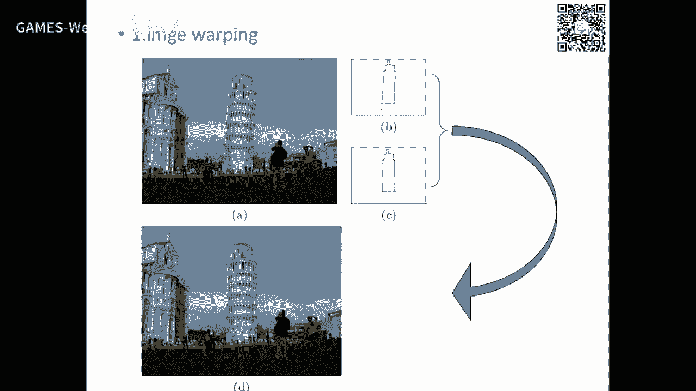

那么你们的像素全部都可以映射过来是吧，好那么这真的是薛林薛林薛林是101里面讲过哈，就是呃gro雪顶，还有phone确定啊，还有用处极坐标啊，这个严林奇老师也提到过树林坐标这个概念啊，什么超限差值啊。

参差值就是为维持微笑曲线，我要20出一张曲面出来，像这种东西就是什么，就是隐函数的这个方法啊，只不过是用中心坐标来表达而已，因为本身就提供了一个这样的隐函数了啊，那么还有这也是一个差值。

差值实际上是把重心坐标的这个值给它可视化出来了啊，还有这个呃控制曲面控制局面我们没有讲啊，这个大家有兴趣可以继续看，只是差值四条空间曲线的影响，曲面好像在这里面本身就是构造了这个差值的一个准确。

这个系数好，那么我这里给一个链接，这个链接呢是啊瑞士的一个开后门教授啊，他他因为做这方面他做了很多年，所以他有个网站，只要每年出来的新文章，他都会挂在他的网站上面。

所以它这个网站上面有关于所有重点坐标的啊，我很老的文章到现在最新文章都有啊，如果同学们有兴趣，可以找到找到相关资料啊，所以这个我给你们个指针好。

今天我还想开个头啊。

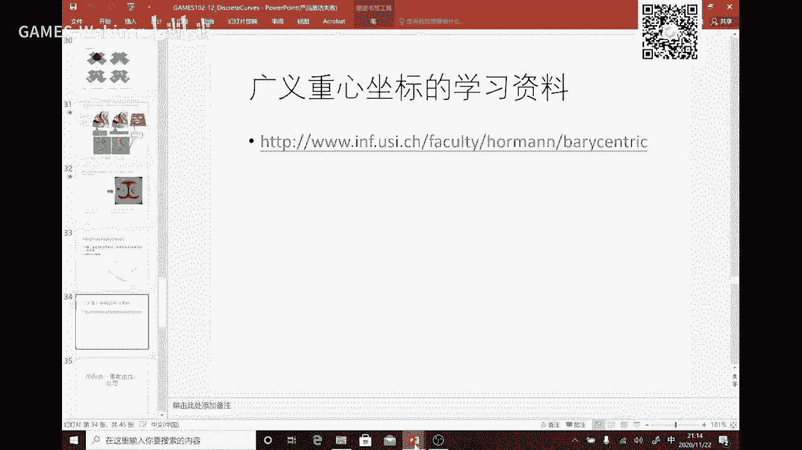

我们下半这个学期就是这个课的下半啊，就在重点讲这个三角网格了。

就是啊曲面的计算对吧，我们曲线离散，我们讲了好多这个曲线的中心，像曲线理解好了以后，曲面也算一样一样啊，只不过多了个维度而已是吧，就多了个方向，就是如果通过从张机形式上来讲，就一个方向，另外方向。

但是呢到了流行上面呢，就是它很多顺序就没了，所以又造成他的一些困难啊，所以曲线曲线的离散大家大家明白了哈，曲线曲面的地上也一样，就是我们的离散也有必要性啊，因为渲染中我们只能渲染三三也行啊。

因为因为三角形的光光光光栅化在硬件中可以实现最简单的，所以我们要把一个右边这个光滑曲面上面采样好多点以后呢，把它连成三角片是吧，那么我们每个三角片呢是个平面，是不是一个线性函数啊。

所以我们也是分片线性逼近，分配现金啊，这个这个逼近啊，那么如果你要画上曲面，也是必须要这样采样去去画对吧，变成三角形，现在已经灌到这个gpu啊，gpu拿到那三角形就可以去做光栅化去做绘制啊。

所以啊你一个光滑曲面你也给我，必须给我计算成三角网格才能做绘制，当然另外一个计算求交也要啊，跟平面求教是最简单的啊，任何曲面去求交就转身平面跟平面求交啊，那么这个三角网格呢是个什么概念啊。

就是你可以看到一个二维流行流行曲面，上面一些点相互的连成一些三角形是吧，所以点跟点之间呢这个四条边相连，每个点周边呢有几条边呢，这个是不固定的，不像图像，图像的话就是个grade，它这里呢可能是五个。

可能六个可能是三个最可能，所以它是这个非规等结构是吧，所以从数据结构从角度上来看，他就是一个什么，我们在呃1年级还是无论什么语言哈，这个学数据结构都学过这个三个类型的数据结构是吧，一个叫线性结构啊。

向量啊，堆栈啊，队列啊等等啊，这个都是线性结构，它就是一个数组就可以存储啊，一种呢就是非线性一点，但是呢它也在某些情况下，它也可以变成线性结构，就是数是吧啊这个这个这个这个数不是数学的书啊。

是这个数啊啊就是呃大学里面每个大学里面都有一棵著名的树对吧，上面挂了好多人啊，高数好啊，那个这个这个数呢就是一种近似于现行，但是又是非限行是吧，所以如果他是个平衡数或者或者叫满速呢，就可以线性化。

这个叫非线性结构，就是图图什么呢，图的就是有一些节点v还有节点之间的，你这个编译相连，就构成一个这样的一个非规则结构啊，每个点的这个这个这个领域啊啊啊都可以不一样是吧，好那么这里就几个概念。

这个概念实际上是大家如果学和数据结构图一定都会学是吧，可能某些学校的老师为了为了简单，可能图就不讲了是吧，注意结构就不讲了，事实是你要做好后面这后半断的作业，或者叫网络处理图纸。

数据结构一定要非常熟啊啊就是这些概念啊，就是do什么意思呢，跟这个点啊，顶点相邻的这些边的个数叫叫叫do，中文叫do good deviance，还有什么面面就是呃一圈这样的啊。

这个相邻的边所构构成的一个面啊，这个面可以是多边形，也可以333角形，当然我们用的最多的是三角形了啊，我们这个其他的因为在欧美jo里面就虽然也可以绘制多边形式上，是到最后还是把它变成两个三角形绘制。

所以呢我们更多的后面是研究，以这个面都是三角形整形的这样一个形式叫三角网格啊，那么为什么纸图啊，还是连通图啊等等啊，这个我又不想展开了，这个图像本质上就是一个流程上的图。

本质上你把它拍平到平面上以后就是2d，这是3d，它就是一个平面图，把这个顶点啊，往往空间拎起来点印到了一个空间，这个点进的空间拓扑关系还是这个联系关系，所以说一个网格或者这个流行上的。

还有二维流形上的一个三线网格，本质上就是个平面图，只不过平面图的顶点就有三个像三个方位的坐标而已，我以前也解释过，我一个曲面，你放在我三维空间中，它本质上是一个二维的流行，所以它本质上就应该拍屏。

应该能够突破通一个平面的这样这样这样的结构，所以呢你可以把它看成是一个吗，是一个中的一个图，把它嵌入到r3 中，因为阿三是观察空间，它它这个正式的一个空间的一个啊，这就是参数曲线一样对吧，曲面好。

那么平面图这个也就这个概念，就是任何一个曲边图都可以突破突不同。

配一个呃这个直边的啊，这个平面图，还有这个我们后面讲啊。

那么match这里有个概念叫做流行，这里稍微解释一下流行什么意思呢，你可以看到这个图啊，右边它有这个三角形，是你这个这个三角形对吧，它这里又长出三角形来，就这边有有三个像三角形相邻，这就是非流形。

就这种这种形式化，就那这个边呢它这边有相邻的两个面，这里还有个面啊，就是非流行，那么什么叫流行，流行什么意思呢，就是我对任何一个点它的一个无穷小的领域，它突不同配一个二维的一个圆盘，是啊。

每个点如果都这样的话呢，它就是个二维二维流形好，那么这个点你可以看到它无限小领域，它不是有三半对吧，不可能跟这个圆盘一样的，只有就只有一半或两半，所以他就最流行啊。

所以非流形结构我们在我们这里后面都基本上都不处理，如果处非中性结构，我们把它去掉，干掉它啊，这个或者把它处理掉啊，还有另外这种非为零结合呢是这种啊，就差的一圈呢是变变成了两半了是吧，两半不相邻的啊。

所以它也是非洲行，就一个顶点，这边长，现在形象已经出来，这边这边又长一上线引出来啊，就是中间有两一块是空的啊，这也是非流行啊，这个叫非流行顶点，这个叫非流行边啊，基本上都是非轮结构。

都是这些结构的组合好，那么在我们后面就都假设这个是流行的曲面，因为流行里面好好那个啊，就相对会容易一点啊，我们这个平面图的概念，大家这个同学们都有了哈，有了以后呢，呃这个插的话呢就很好理解。

那三个本质上就是把空间的a2 维图映射到一个平面中是吧，这个后面会来展开。

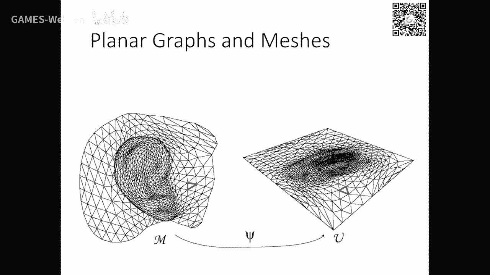

还top呢是突破学的一个概念，就是简单理解就top这个一个环啊，就中间有个洞，就top是音，这是两个洞，top 12就亏格为二，叫奎格cas啊，我碰到的时候我再解释吧。

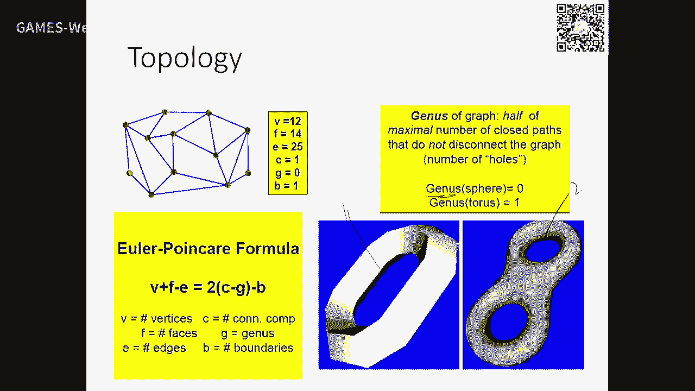

还有可定向，可定向在我们这里流行结构，基本上每个三角形的定定向要一样，比如说这三角形大家都是朝着顺来数，这是第一点，第二点，第三点，那每个相就是比如说呃法则的话都是大拇指是朝抄底的话。

那每个月每个三星都要这样统一的，这个叫可定向对吧，但是非常可肯定向呢就是指它有一个一致，这个朝向就反向，像莫比乌斯乌斯带就是非可定向的思维空间中，就是那个蓝屏啊，啊在这里有莫比乌斯带，这是蓝屏。

就是就是非镜像的啊，这些一般我们在呃做做问题过程中极少碰到啊，碰到的时候我再再再来解释吧，啊今天就不详细展开，还构图啊，这个下下节课来解释，下节课会讲delay跟文案图的关系好。

我们呃后面几分钟快速的过一下这个，因为这个东西你们要去做这个东西，必须要数据结构要非常非常熟啊，那么最结构啊就是一个问题，就是你给一个网格以后，你要这些东西呢，这些信息要尽快给我找到啊。

比如说你你要快点跟我找到，我给这个点给你，你要找到哪些边跟它相邻，哪些景点是它的一领域啊，哪哪些面是跟它相邻啊，还有我给一条边，你要快速找到哪两个面是我的李宁面等等，就是这种情信息有利以后。

你就可以做那些操作啊，不管是简化也好，还还是那个处理也好是吧好那么嗯嗯那个税税结构呢怎么存储呢，你有很很多方式啊，就是那么到一个好的数据结构呢，就是你时间和空间都要砸这个平衡啊。

这个在我们做算法的过程中呢，大家都很清楚，做算法过程中，你免费的午餐是吧，你空间和时间永远是一种矛盾啊，这是是一个是一个平衡去off啊，如果你存储量很多，如果你每个点的这个一领域或者叫淋浴的面。

淋浴的边全存下来了，就占了很多空间，我在运行的时候呢要找马上就可以找到索引一下是吧，但是那但那个是用空间换换时间，如果你不存，你要去临时去算啊，再去或者是搜索也可以，那个时候是什么用啊，换空间你存的少。

但是算的多啊，所以这里面什么叫一个好的数据结构啊，没有定义啊，就看你的应用啊，大家应该有这个体验是吧，你用项链好还是用链比较好，这两个都属于线性结构对吧，那么下是什么，是这个存储空间是一致的。

所以他找元素非常快，也就一个投地址骗一下就可以找到，但是它不是不善于什么，不善于删除一些元素，如果你像三这些原则主要移动是吧，所以列表的好处，所以说你说这两个数组好呢，还是向量那个列表好呢。

取决于你的应用，如果你应用里面大量的涉及到删除增加，那你用链表当然是首选是吧，如果不存在就用数组是吧，嗯好所以呢这也一样，所以一个好的数据数据结构啊，就看你这个应用是是面向什么操作为主啊。

那么你要定一个网格，首先要定义它的边啊，然后再定义它的边，或者或者或者面就可以定义好是吧，所以啊很多不同方法我这里这里找找找找几个啊，那么呃一个比较多的一个o o b g格式。

在历史上有好多不同软件就有不同的格式啊，那么o p g格式比较容易懂啊，所以它有一个v开头，这个我们讨论是一个txt格式的，当然也有二进制格式的啊，我们用txt来为例，它每一用一个v表示顶点。

那么后面加三个float就是表示xyz坐标，所以这里有四个点，那么来打头的是123，这个序号是从111开头啊，它不是从零开头，所以123什么什么表示这三个点连成一个面，12表示一表表示142连那个面啊。

所以大家应该能猜猜出来这是个什么东西是吧，有四个点，有四个面，就定义了一个四面体啊，啊因为四个点四个面是最简单的集合体啊，四面体啊，所以它它这个这个规则非常简单啊。

啊一个小程序就很容易把这个文件读成一个网格格式啊，当然我们不用啊重复的去写，我们这个框架里面都写好了，很多框架里面都写好了，所以啊读货币界也不是那么容易写的，因为还有好多材质group的信息。

你要去解析的话，还是要花不少时间，所以呢我们建议大家先用一些成熟的框架啊，去先对它做进行一些处理啊，具体涉及到什么读文件，什么怎么读啊，格式怎么定义啊，先不用管，因为如果管它的话呢。

你这这个这个这个焦点就错了啊，你先先把它用起来好吧，就是这些读文件是一个基本东西，就像有些同学学同样处理一个错误方法，就是怎么去写一个jpg jpc的一个这个解析器是吧，花很多时间没必要。

你先把它处理先做，做好以后有时间再去看看它的解析器好好，那么具体的这个我今天可能不一定想展开啊，那我想这个大家都能看得懂，就是你存这个几何一个网格啊啊有很多方式，有些是用矩阵来存啊。

像这个这个叫临界矩阵啊，就是我存了一些点，然后我在再存一些面，那么它用一个这样一个大的系数矩阵去存，如果那个点之间有有连接的，就是存一啊，先有没有连接去存零，所以它的存储空间是很浪费的。

但是它是系数表达啊，吸收存储可以也可以啊，有一些特殊方法，但它就是任何一种数据结构，注意它的利和弊啊，这个这种数据结构能做这个另外图结构可能就不好做对吧。

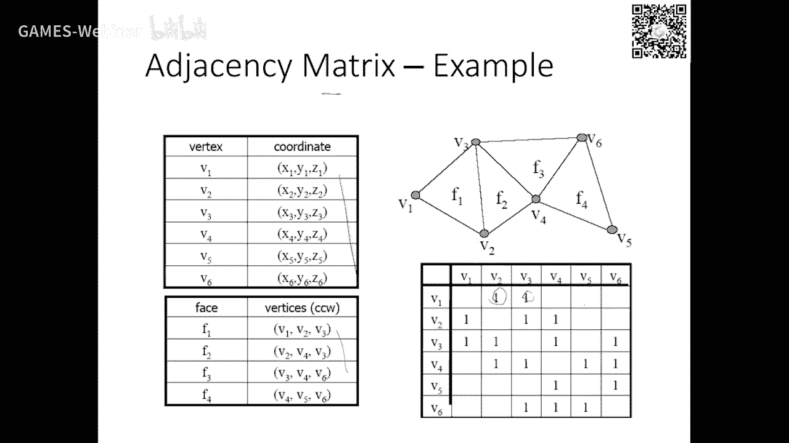

所以呢这个我就我不去讲。

好这个用的最多的是叫做双边处理结构，叫半半边，半边这里写错了，半边叫half edge，就是一条边呢，两个半边一去一回，那么每条半边里面呢它存在什么，从哪个点出发，到哪个点结束它，它插在一个面。

那这个半边呢从这个时候右边啊少点墨边，那么这个面好，那么一条边就有两个半边的，还另外和这两个半边呢也有索引，我通过这个半边马上就可以找到这个半边，所以你说我要找到这条边的两个三角形呢就非常非常快。

因为它里面到处都是我指针快速索引啊，那么我们这个呃这个我们助教啊自己写一个这个框架啊，有有特别有特别这个框架那个中文是无尽啊啊对，那么这这个这个这个这个这个框架呢，就是我们里面已经帮着你们写好了啊。

这个网格的数据结构啊，用的就是半面结构啊，这个在我们作业组织上面就会非常详细的文档，告诉大家怎么去读文件，怎么去去去里面拿着这些数据好吧，那么这个框架里面的算是里面有两套数据结构。

一直一个数据结构就是这个半面结构是为了做计算的，因为每个点你去找他的零点啊，信息啊，这个计算数据就是怎么找到这些相关数据来做计算，这个是要高效是吧，然后渲染的渲染实上就是把煤炭引擎换到gpu中是吧。

所以它会自动的帮你转成你要做渲染的时候呢，扣那个渲染的函数，它就会帮你去去去转成渲染数据就灌到gpu的这个流程中就可以了，好那么今天呢我呃我不布置作业，但是呢可以大家利用这一周啊去玩一玩。

这个有些同学已经玩的很熟了啊，这个这个前面几个作业都用它做，那么只不过以前是运用它的一个画板的一个二维的这个啊，i的一个这个界面没有用到，有toio本身的我们jo这个界面。

所以大家可以去读一个啊o o b g来你们看一看，玩一玩哈，里面反正光线的光照啊，纹理啊都可以去设，我建议大家先不要去关注这个纹理啊，就是我只想看那个几何啊，那么你不妨去去去做一个小的啊。

反正是试试看对吧，我对这个每个点呢，我对这个网网格的每一个点，做一个小小的脑洞啊，脑洞是吧，就这脑洞呢是沿着法向脑洞一个量啊，你试试看，反正就是那么为了做这个事情，你是不是要找到这个顶点的法向是吧啊。

你要算反向，反向可能没结婚给你，你是不是要找他的相邻的面，你用相邻的面的反向平均来进行这个反向就行了是吧，那么一种做多少呢，你是个参数啊，你你写个ui看看能不能调是吧，哎就一个阶段。

简单的这个这个先熟悉一下啊，我们我们不作为作业作业，下个星期我们在布置啊，所以这个星期呢是前后两部分的过渡，后面的先把这个框架玩玩起来，但玩框架的话你一定要有任务，这是我不明确把它作为作业的形式。

这个下节课我会把这个作业的详细情况给大家再介绍一下好吧，因为下节课我们会把这个啊网格的smooing的原理会会讲的更加细一点，这样的话现在你们会会更有利放肆啊，那么今天我想就这样开个头，好吧好。

那么今天时间哦已经已经超了两分钟，也差不多了，好那么今天就呃对三维的这个离散网格，就是三角网格做这个开场，那么后面我们就后面的大概6~7次吧，如果后面讲过，我们会增加到8~9次。

把这个几何处理就是网格处理的呃，大那个主要内容给大家介绍一下好吧，那以后以后你做这种离散的网格处理的话，就基本上就可以上手了，好那么今天就到这里为止。

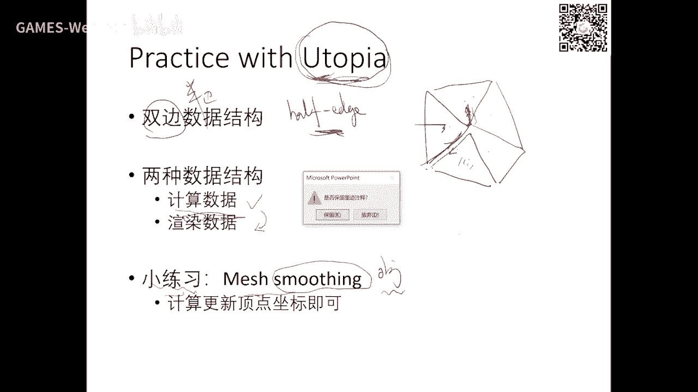

