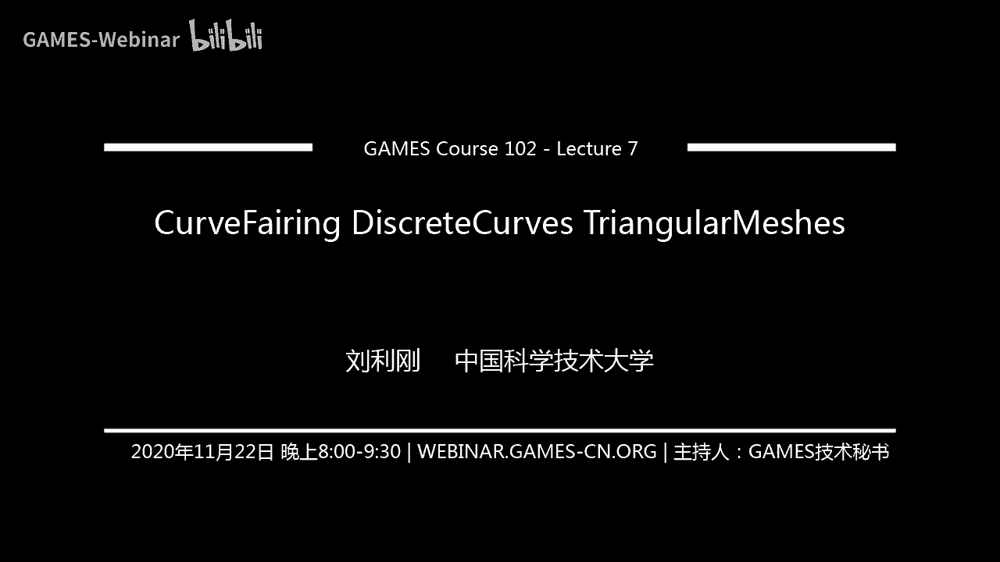

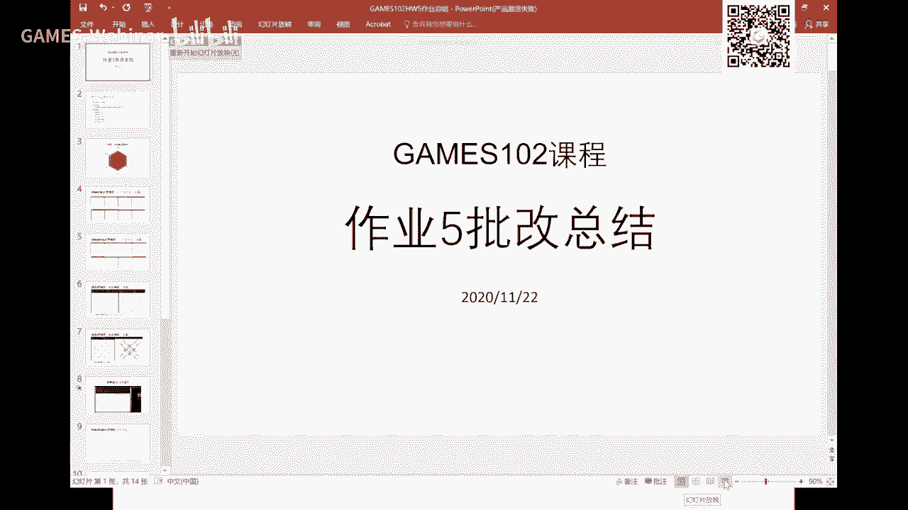

# GAMES102：几何建模与处理 - P7：曲线光顺与离散曲线三角网格 🧵

在本节课中，我们将学习曲线光顺的概念、离散曲线的必要性以及三角网格的基本知识。课程内容从作业回顾开始，逐步深入到曲线光顺的数学定义、离散化方法，并最终引入三维三角网格的数据结构与处理基础。

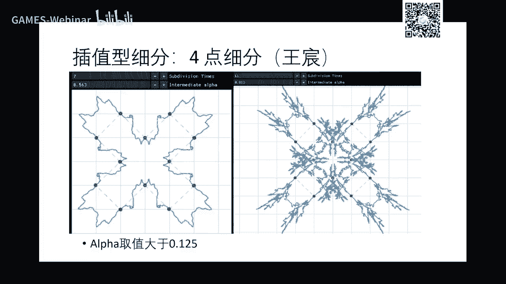

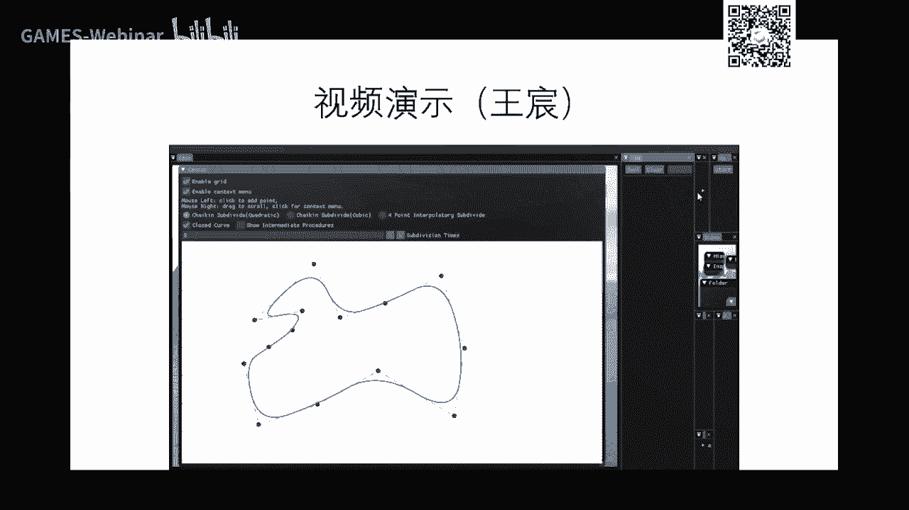

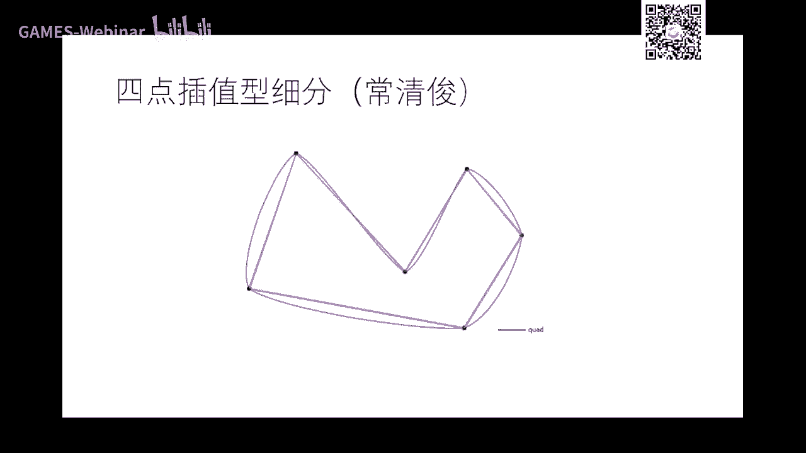

---

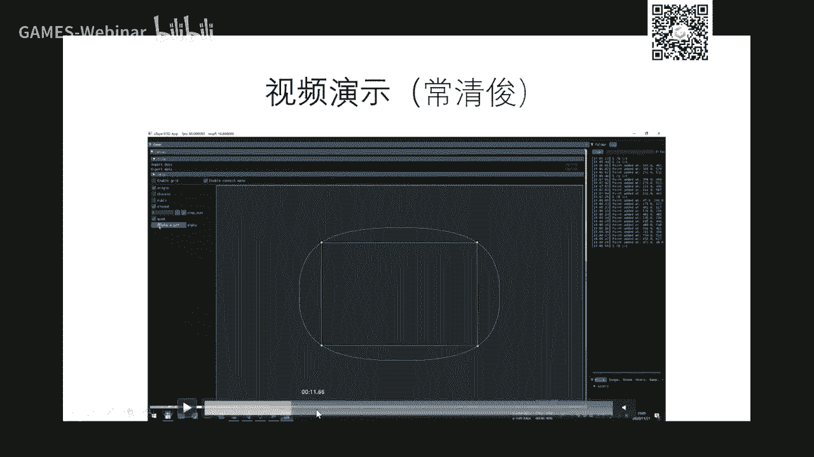

## 作业回顾与点评 📝

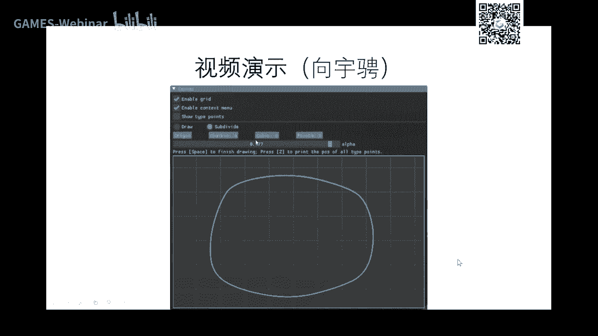

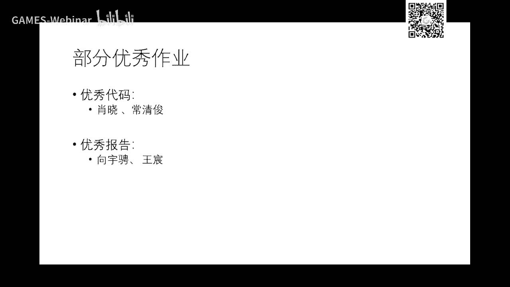

上一节我们介绍了曲线细分方法。本节中，我们来看看同学们提交的作业情况。

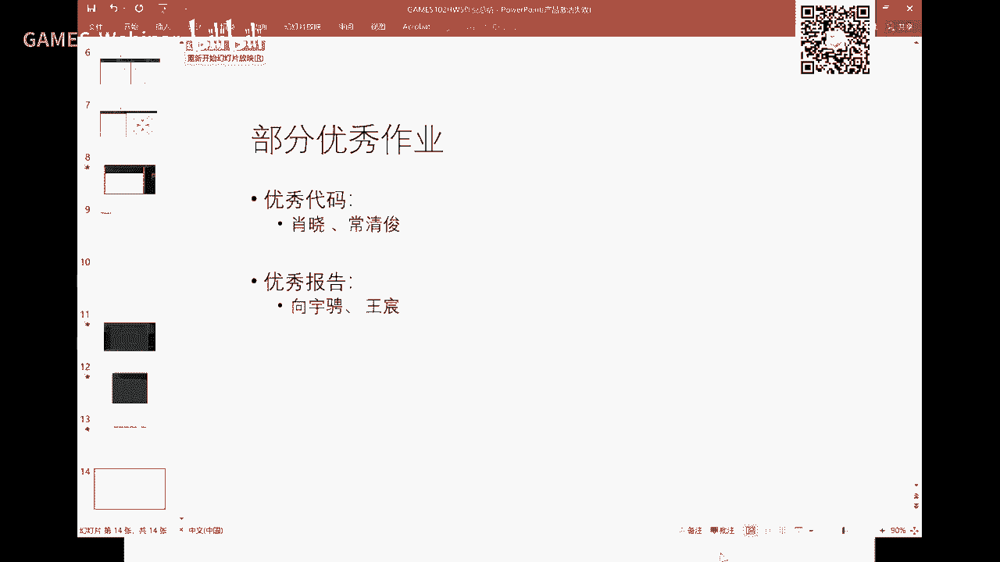

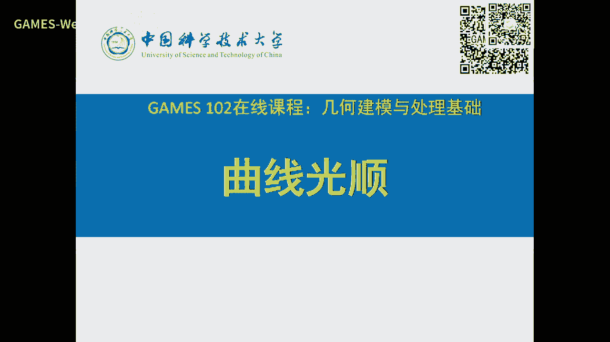

本次作业主要任务是实现B样条细分和四点细分算法。共收到29份有效提交，其中包含多种编程语言的实现。

以下是部分优秀作业示例：

*   **蔡金细分方法**：报告详细阐述了三次细分与二次细分（Doo-Sabin细分）的区别。逼近型与插值型细分均有实现。
*   **参数调整**：有同学探索了四点细分中α参数的影响。当α值超过1/8时，曲线会产生分形般的振荡，这验证了参数对结果的重要性。
*   **交互界面**：多位同学实现了友好的交互界面，能够实时调整控制点、细分类型（二次/三次/四点）、细分次数，并可视化曲线与细分过程。

这些作业代码与报告将作为学习参考。建议同学们在理解原理的基础上独立实现，以更好地掌握这些工具。

---

## 曲线光顺（Fairing）概念 🔍

在宏观曲线设计之外，高精度建模中还有一个重要概念——曲线光顺。这在许多教材中涉及较少，但在工业设计软件（如CATIA）中却是关键工具。

### 光滑与连续

首先回顾连续性的概念。参数连续（C^k）关注参数导数的连续性，而几何连续（G^k）关注曲线本身的几何性质，与参数化无关，更能反映本质。

### 什么是光顺？

光顺的英文是“Fairing”，意为“公平的”、“流畅的”。一条曲线可能非常光滑（C^∞），但在微观尺度下，其曲率分布可能仍有剧烈波动。这种波动可能导致：
*   **物理性能下降**：如船舶在水中阻力增加，齿轮磨损加剧。
*   **视觉效果不佳**：如汽车表面反光出现扭曲。

因此，光顺关注的是曲线曲率变化的“平缓”程度，是一种微观几何性质。

### 曲率：光顺的核心度量

曲率 **k** 是描述曲线弯曲程度的本质量，与参数化无关。其定义为密切圆半径 **r** 的倒数：**k = 1/r**。
*   直线曲率为0。
*   圆上各点曲率为常数。
*   曲率变化平缓的曲线更光顺。

历史上对光顺有多种描述：
1.  **苏步青、刘鼎元**：曲线需C²连续，且曲率图没有多余波动。
2.  **R. Farin**：曲率图单调段不宜过多。
3.  **能量法定义**：最小化曲线的总曲率平方积分 **∫ k² ds**。
4.  **工程经验（中国学者）**：光顺是大局部问题，需同时满足：
    *   具有C¹或更高连续性。
    *   曲线本身拐点少。
    *   曲率图的拐点少。
    *   曲率变化幅度小。

### 光顺方法简介

基于上述原则，传统光顺方法通过微调控点来调整曲率图，主要步骤包括：
1.  **粗光顺**：调整控制点，减小曲率极值。
2.  **削峰**：消除多余的曲率拐点。
3.  **回弹**：检查并减少曲率单调段的变化。

这些操作需在保证曲线形状变化极小的前提下进行。优化后的曲线，其曲率图变得更为平缓单调。

### 从曲线到曲面

曲面光顺更为复杂，因为涉及两个主方向。早期方法将曲面分解为两个方向的曲线进行处理。现代方法则考虑曲面的主曲率，并最小化其能量积分。在工业界，A级曲面（Class-A Surface）要求达到G²甚至G³连续，并通过反射线（Reflection Line）来直观检测光顺度。

---

## 离散曲线与计算 📊

所有连续表达在计算机中都必须离散化才能进行计算和渲染。本节我们来看看离散化的必要性与方法。

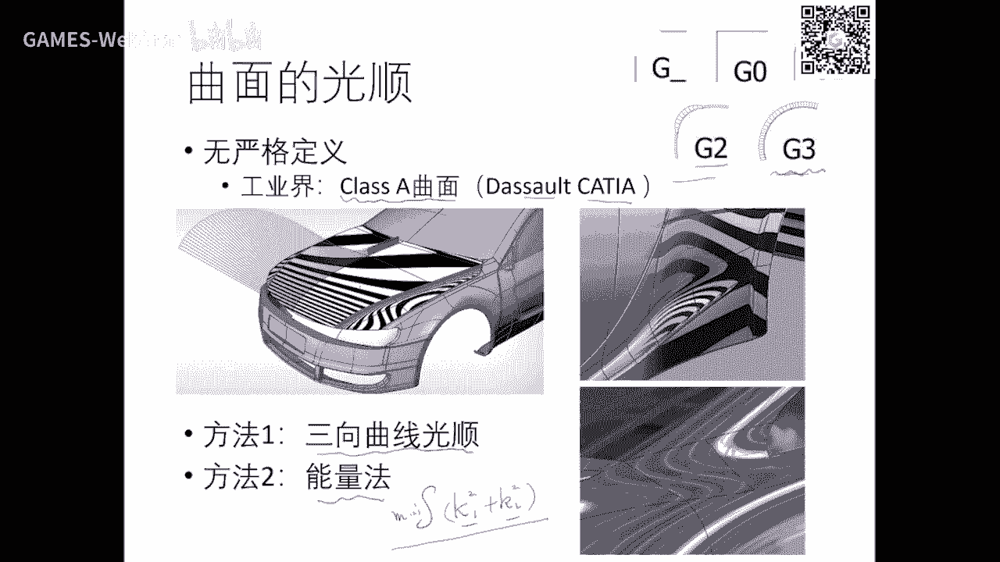

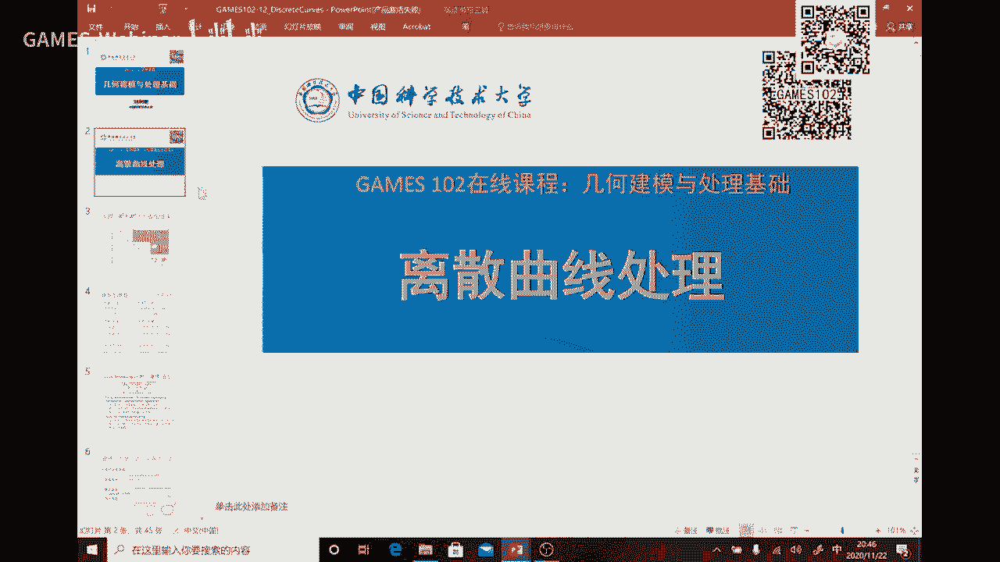

### 离散化的必要性

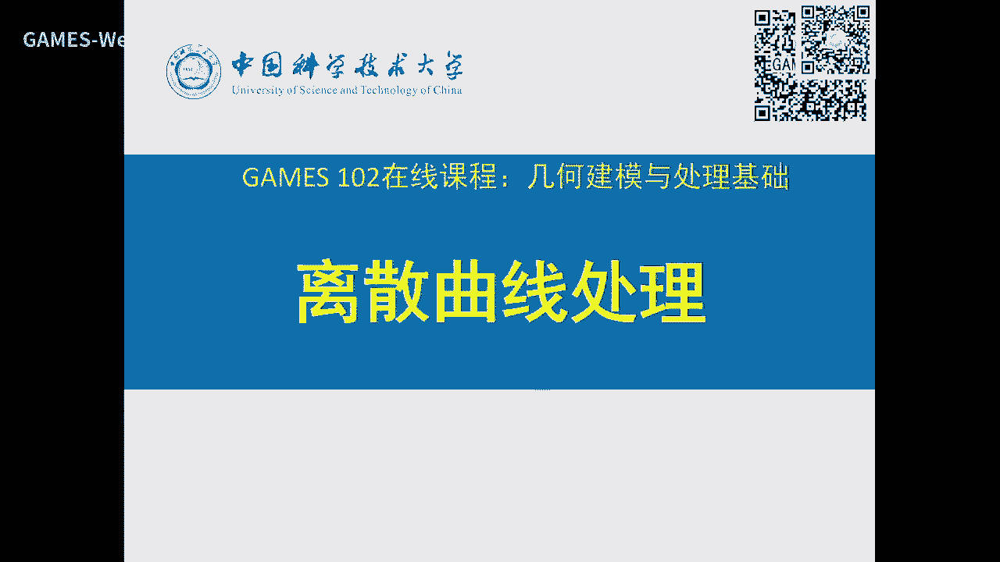

离散化主要有三个原因：
1.  **渲染**：图形硬件（GPU）主要处理直线段（多边形）。任何曲线都必须采样成折线进行光栅化。
2.  **计算**：数值计算（如求导、求交）需要在离散点上进行。用足够密的线段可以逼近原曲线。
3.  **制造**：许多数控机床（CNC）只支持直线和圆弧插补，复杂曲线必须离散为这两种基本运动。

### 采样与误差

根据采样定理，为了从采样点重建原信号，采样频率需至少为原信号最高频率的两倍。对于B样条曲线，可以通过分析控制多边形与弦长的误差，来估计需要细分多少次才能达到指定精度。

### 离散曲线的几何计算

当只有离散点而无数表达式时，计算几何属性（如法向、曲率）有两种思路：
1.  **拟合法**：先用离散点拟合出一条连续曲线（如B样条），再利用该曲线的解析表达式求导。
2.  **差分法**：直接用离散点的差分来近似导数。例如，一阶差分近似一阶导数（切线），二阶差分近似二阶导数（曲率）。其本质是泰勒展开的离散形式。

---

## 重心坐标与变形应用 🎯

在介绍三角网格前，我们先看一个连接连续与离散表达的重要工具——重心坐标，及其在变形中的应用。

### 从贝塞尔曲线到代理变形

贝塞尔曲线的核心思想是：用少数控制顶点的线性组合（基函数加权）来定义复杂曲线上的无数点。这启发了“代理”（Proxy）变形的思想：用一个简单几何体（如包围笼）控制一个复杂形状。

### 重心坐标的定义

关键在于建立内部点与边界控制点之间的定量关系。
*   **三角形重心坐标**：对于三角形内任意点 **P**，存在唯一的重心坐标 **(α, β, γ)**，使得 **P = αA + βB + γC**，且 **α+β+γ=1**。几何上，α 等于 **P** 对边小三角形面积与大三角形面积之比。
*   **多边形重心坐标**：不唯一，存在多种定义方式，如均值坐标、谐波坐标等，各有不同的几何性质和适用场景。

### 应用：图像变形

利用重心坐标，可以实现直观的变形操作：
1.  用户编辑代理控制点（如一个包围多边形的顶点）。
2.  对于原始图像/网格内的每个点，计算其相对于旧代理的重心坐标。
3.  将这些**相同的重心坐标**应用于新代理的控制点，计算出该点的新位置。
4.  将旧点的颜色或属性复制到新位置。

这种方法被广泛用于图像扭曲、曲面编辑等。

---

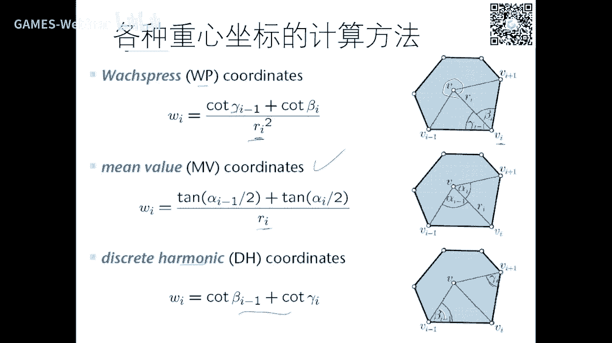

## 三角网格入门 🕸️

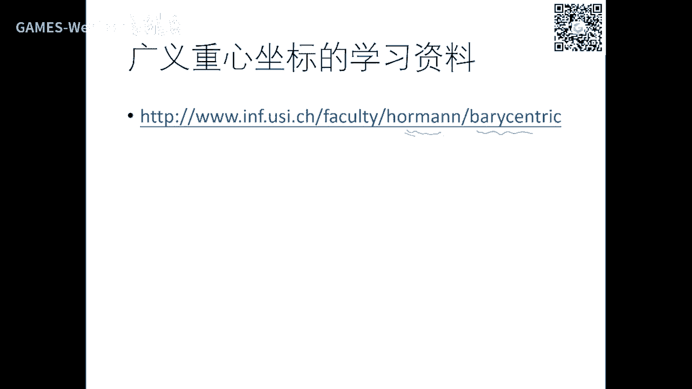

课程的后半部分将重点转向曲面，而三角网格是离散曲面的主要表示形式。

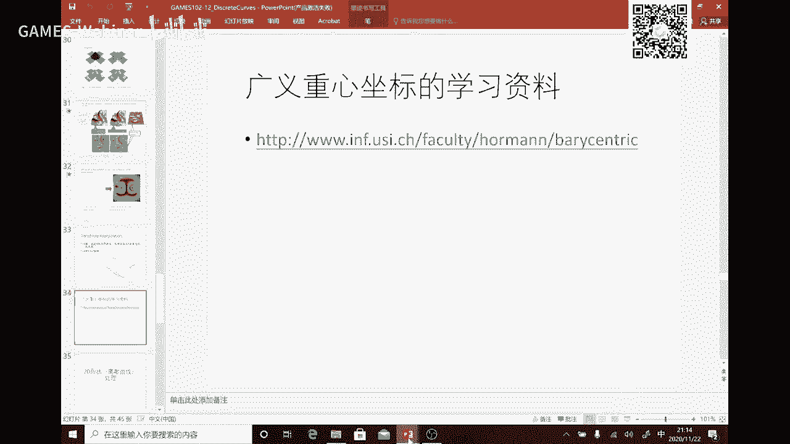

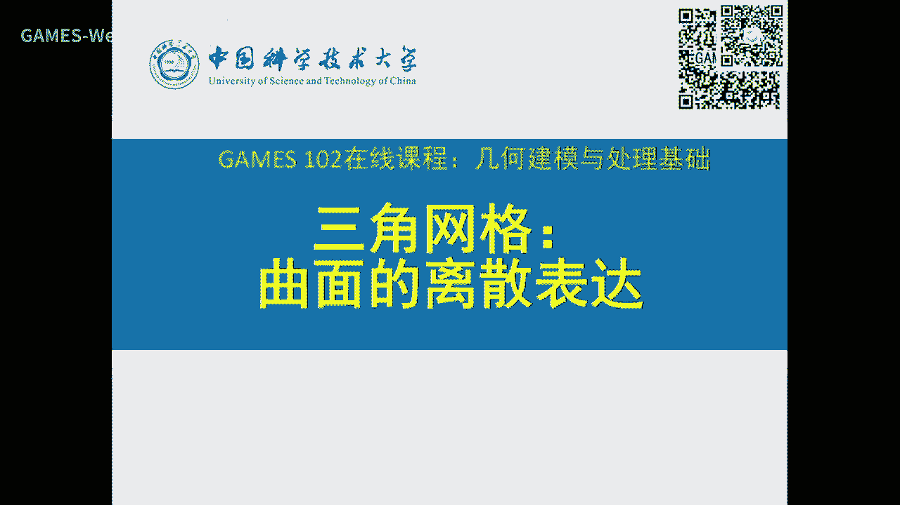

### 为什么是三角网格？

1.  **渲染需求**：GPU硬件高度优化了对三角形的光栅化。
2.  **简化计算**：将复杂的曲面求交等问题，转化为简单的平面（三角形）求交问题。
3.  **通用性**：任何曲面都可以通过足够密的三角片来逼近（分片线性逼近）。

### 基本概念与数据结构

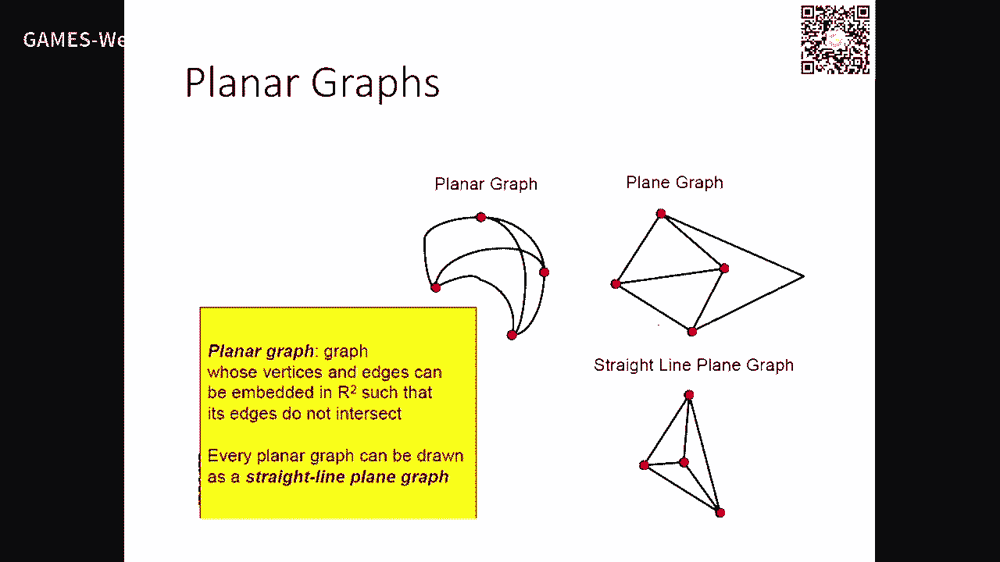

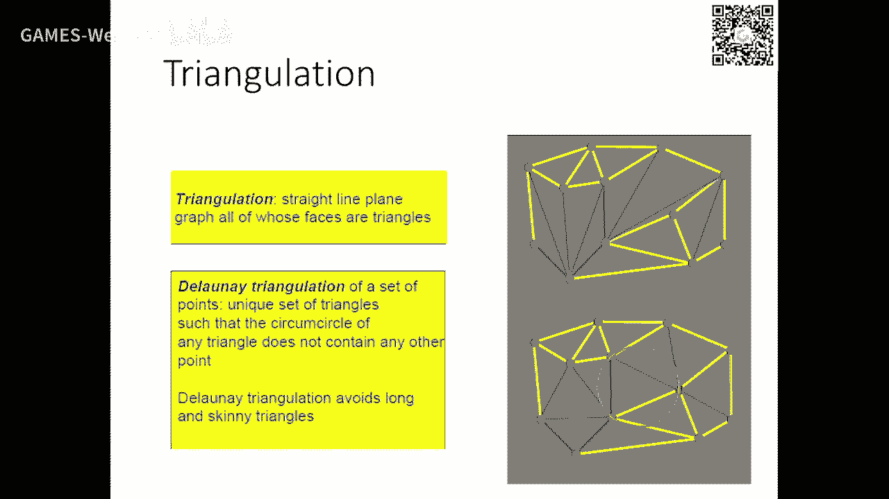

三角网格本质上是附着了3D坐标的图（Graph）。
*   **顶点（Vertex）**：空间中的点。
*   **边（Edge）**：连接两个顶点的线段。
*   **面（Face）**：由三条边首尾相连构成的三角形。
*   **度（Degree）**：一个顶点所连接的边的数量。
*   **流形（Manifold）**：网格上任一点的局部邻域拓扑同胚于一个圆盘。非流形情况（如一条边被三个面共享）会给处理带来困难，通常需要预处理。
*   **可定向性（Orientability）**：所有三角形的顶点绕序（如逆时针）保持一致。莫比乌斯环是不可定向的。

### 数据结构：半边结构

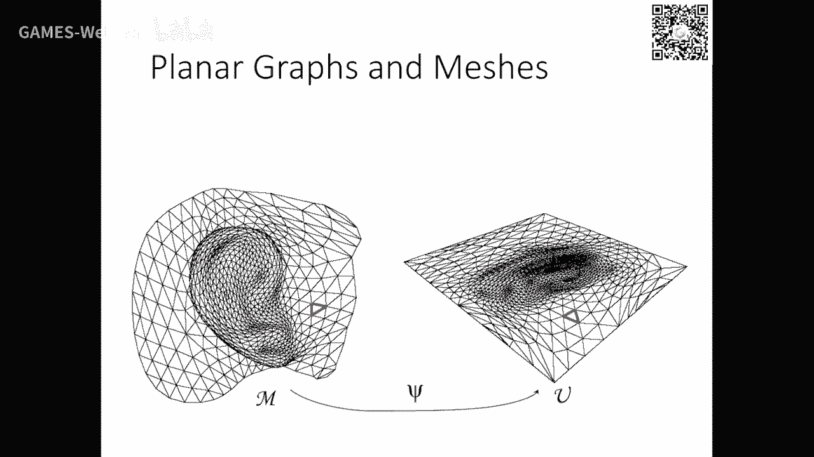

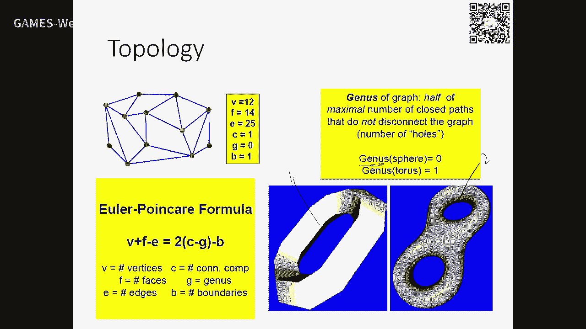

高效处理网格需要能快速查询顶点、边、面之间的邻接关系。半边结构（Half-edge）是一种经典表示：
*   将一条边拆分为两条方向相反的“半边”。
*   每条半边存储：起点、下一条半边、所属面、对偶半边。
*   通过这种链接，可以高效遍历一个点的所有邻边，或一个面的所有边。

### 实践：开始使用网格框架

许多几何处理框架（如课程助教提供的框架）已实现了半边等数据结构。建议初学者先利用框架读入一个OBJ格式的网格文件，并尝试进行简单操作，例如：
*   计算每个顶点的法向（邻接面法向的平均值）。
*   沿法向对顶点进行扰动，观察网格变化。
*   通过UI交互调整扰动参数。

这有助于熟悉网格数据的访问与操作流程，为后续更复杂的算法实现打下基础。

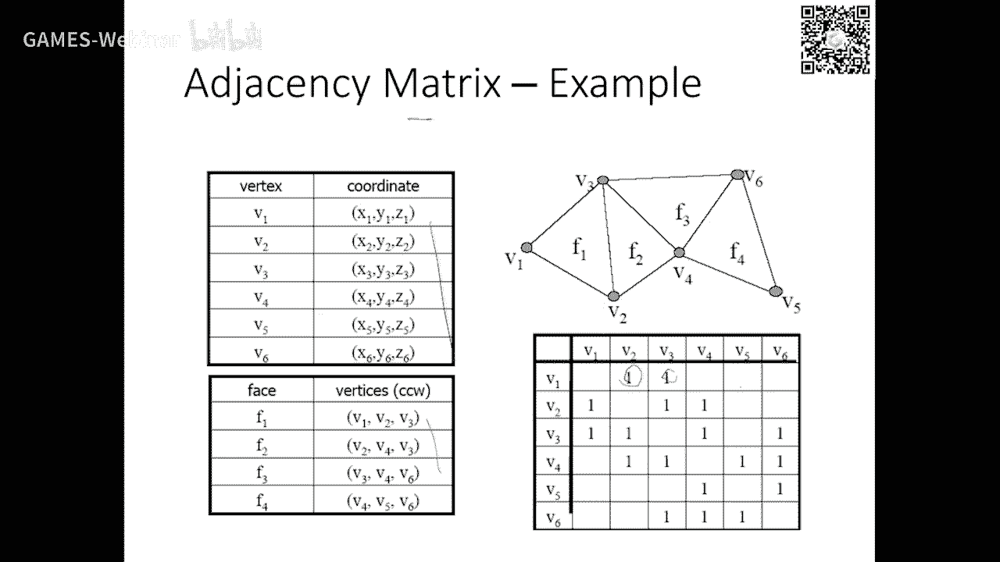

---

## 总结 📚

本节课我们一起学习了：
1.  **曲线光顺**的概念、意义及其基于曲率的数学描述和优化方法。
2.  连续曲线**离散化**的必要性、采样理论及离散几何计算方法。
3.  **重心坐标**作为连接连续与离散的桥梁，及其在形状变形中的应用。
4.  **三角网格**作为离散曲面表示的基础知识，包括其定义、流形性质及半边数据结构。

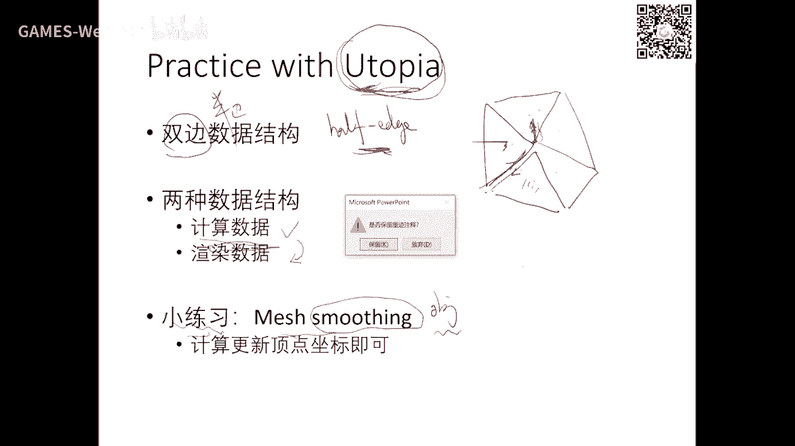

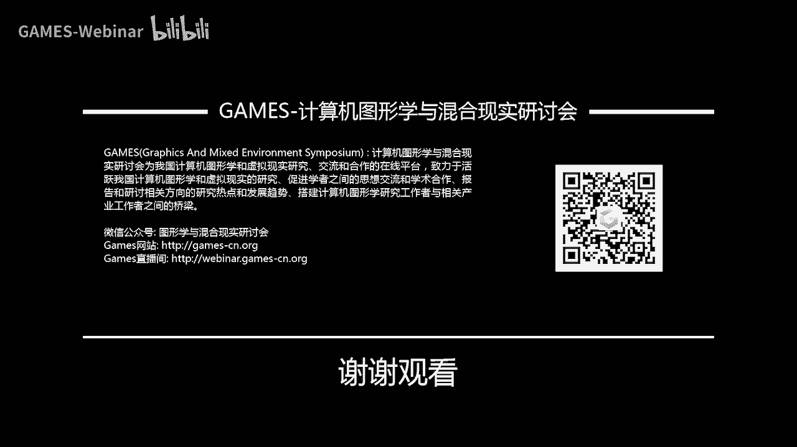

从下节课开始，我们将正式进入三角网格处理的核心内容，包括平滑、参数化、简化等算法。请同学们利用本周时间熟悉网格处理框架的基本操作。