# GAMES102：几何建模与处理 - P8：离散微分几何 Utopia框架介绍 - GAMES-Webinar - BV1NA411E7Yr

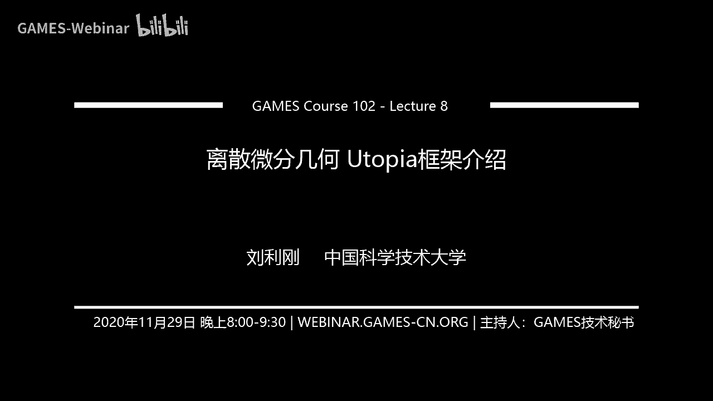

好那个时间到了啊，同学们，我们现在今天晚上的课程开始，那么今天的主要内容是讲一下那个就是离散曲面，就是三教网格上面的一些微分几何量的一些计算啊，曲率的计算，这个在后面的一些处理啊，或者经常用到啊。

是非常重要的一些东西，所以今天会花一节课啊，先讲一下这个微分几何以及它的离散计算一些方面的东西，那么之后呢我们会啊布置作业，然后是基于我们自己的一个utopia这样一个框架啊。

会做一些介绍，好那么我们从上节课开始已经开始进入这个三角网格曲面好，我们这个课的前一半呢都是讲光滑曲面啊，有这个基函数啊，连续函数构成的一些曲面表达，曲线表达，那么在实际应用中。

现在特别是扫描仪的应用啊，这个广泛应用，那么我们更多的得到一些点名点的话，可以看到是曲面上的一些点的采样，那么这样点呢就构成了那个三角网格，那么这个三角网格呢你可以啊点比较多的话呢，就踩踩得比较密。

所以三角网格比较精细，那么那个呃如果点比较比较少好，那么就比较粗糙啊，就如这个兔子这个曲面，它本身这个曲面是存在的，但我们不知道它的方程啊，这个我指着它的采样啊，采样以后呢。

我就构成右边这些这些三小网格对吧，当然你也可以用我们上呃，对光滑函数这都没问题好，那我们现在就假设是这种商业网格。

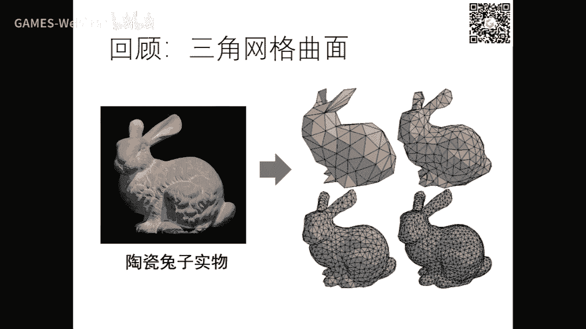

那么这个社交网格怎么来理解啊，那么这里有两个观点啊，这个观点呢就是说这些点啊，就是左边右边这张曲面啊，就这些红点是从往这个曲面上采样的，然后呢我有办法把这个红点相邻的红点把它连成三角形。

就构成一张也没有缝啊，水运行的这样一个呃叫做呃分片线性的这样一个分线平面，这样一个表达，所以这种这个绿色绿色三角形啊啊都是一个个连起来的，所以他呢就是原来这张曲面的一个逼近，而每个三角形呢是一个平面。

所以我们也把它叫做分片线形啊，那就是分屏线性递进，所以呢你从曲面的逼近论来看，就是它是哪一个更简单的，第一次的这个曲曲面只不过是只有c0 连续啊，他cd都没有，因为它不可能光滑是吧，这个只是拼拼劳了。

所以它是一个分片线性逼近函数，去逼近一个那个光滑曲面，那么你从泰勒展开的角度上来看，你也可以看成这个这个平面片是在这这一点啊，某一点中的一个一阶展开，所以呢它是用这样一些局部的平面片去逼近了原来的曲面。

所以事实上去曲面是一个不进啊，所以它是一个低阶的啊，低次的就是一次的这样一个啊形式的逼近啊，所以你也把它叫做离散曲面好，那么另外一个观点呢，诶我可以也可以把这个曲面啊，它它是上本上是一些个这个图啊。

这个graph它只是有一些这个点和线和面构成一张graph，就像我们数据结构学的这个graph，那么在平面上d完这个graph以后呢，我把这个点啊再把它意识到空间用某一个点位置，想在这个点把它拎起来啊。

叫提升，提升到另外一个空间，这个在拓扑学里面叫叫叫提升，就是这个点啊，我这个拓扑结构点界面的联系关系是不不变的，我只是把顶点啊，把它把它变到三分钟，把它拉起来，就像这样话的这个网啊，就像一个渔网。

我把它拎起来以后呢，就变成一个下垂的，或者说这样一个曲面形式，当然我这里拎的时候是是比较简单，是一个抛物面，但是你可以想象一下这个一些点，只要只要有个函数去映射到空间，这个就形成一张复杂的曲面。

所以呢它本质上它这个这个曲面啊，就是这个二维图的一个空间映射，所以它本质上它是一个二维流形，因为它本身就是二维的嘛是吧，所以这个曲面也应该是二维的，那么因为它只是顶点位置发生变化，它的这个三角形啊。

这些边啊，假设都没有发生太大变化的话，所以他还是本质上是二维流形，所以它可以看到是一个拓扑学里面的一个啊，从低维到高维的这个这个嵌入啊，就提升，那么这个从另外一个观点来看的话。

就是这个是它的一个参数域是吧，因为我这里一个点对应的中间一个点是吧，这里x y z是这里的uv的又一个函数啊，所以它是一个参数化好，所以无论从哪个角度看呢，它反正就是筛网格。

就是二维流形或者叫空间曲面的一个离散表达，那么要去掌握这个三角网格的这样一个呃这个操作啊，所以这就涉及到我们的数据结构，这门课程我相信同学们在大学里面都学过啊。

我上节课也提了一下与数据结构主要三大数据结构，好线性结构啊，我们以前学的那个数组堆栈队列什么什么啊，这个这个呃呃这些呃就是说属于数线性结构，还有树树的话就是呃非线性了，但是呢如果树满足一定的这个关系。

它也可以表达成线性，所以它是介于非线性和线性之间，最复杂的就是这个图啊，所以一个图呢是什么一个顶点集合，就这个在数据结构里面叫叫顶点，叫node是吧，那么今天跟顶点之间呢就连一些边啊。

那么就是这样就构成一个图结构是吧，这个图结构很很有用处啊，你可以在生活中碰到好多图结构，比如说你可以啊将这个城市道路的十字路口和入口看成这个节点，那些那些路口跟入口之间的路变成一个边。

那么这个可以是一个城市地图的抽象好，那么那么你从一个点到另外另外一个点啊，这个找一条最早最早路径是吧，就要利用图里面的很多算法，叫最短路的算法啊。

这就是你们生活中啊天天要用到的这个导航是吧啊就这样就这样图啊，那么如果把这个图这个节点看成是一个人，人跟人之间这个边看作是一个关系，比如说是认识和不认识，那么这就是一个社交网络的一个图。

那么从这视频呢也可以去去挖掘很多社交网络的一些信息啊，也也也要要利用一张这个图的结构啊，当然从研究论文来讲，我这篇文章set了引用了一篇文章，那么这一页也可以建立一个图。

所以所有的论文都可以建立一个图啊等等好，所以对我们这里来讲呢，我们这个图呢这个顶这个漏着呢就是网络上的一点啊，那么这个所以顶点集合表达空间的一个点的坐标，那么边就是仅仅跟节点之间有连接关系，就一条边。

所以一条边的话基本上就是这个v i和v界的一个这样对啊，这个好，那么他们有顺序的话就叫流向边，没顺序的话就是无相边啊，你f呢就是面积的集合，那么在我们这里，我们这里面假设都是三角形，如果出现了多边形啊。

多边形这种结构我在在我们这里非常容易就把它多边形，可以把三角化一下啊，你可以看到左左边这个这个网格做四边形，那么只要中间偏下边就可以变成三角形，所以呢任何的多边形网格都可以转换成三角网格好。

所以我们这里呢就比较特殊，只讨论三角网格，所以多边形网格也一样的去处理啊，这个难度没什么太大，所以呢这里可以看一下顶点边和面是不是给一个网格都要给出来呢，大家可以想一下啊。

比如我上节课介绍的这样一个格式叫ob接格式啊，或者后来变成alex或在autodesk收购啊，但是他早年用这个o b j格式比较比较简单啊，就是v一开头就三个实数就表示了顶点啊，那么这里有四个顶点。

那么f开头表示表示face就是那个三角形好，12年连个面好，所以这个o p接口是非常容易啊，这个理解，那么这种格式呢就是它这个最早的时候就只有这两个信息，那大家就会问诶，鞭策马跑哪去了呢是吧。

你可以可以很容易想啊，就是这些呃同学们要慢慢慢的这个掌握起来啊，我给定顶点跟面，是不是我可以推出边，因为每个三角形的这个边一二肯定直角边，234条边，131分一边对吧好，对这个三角形来说，144条边。

424的边，所以由此这个face这个这个面一定能推出所有变，当然这里可能会有重复啊，因为可能会有两个面共享一条边，所以这里重复把重复的去掉就可以找到编辑和好，同样我们来推学啊。

假设我只给你给给定额这个顶点v和一能不能推推出f是吧，好我我我有有些有些文件可能是我只给出给定这个这个这个顶点坐标，再加上边的连接关系，比如这个图好，你可不可以推出面，当然可以了是吧，好我举例。

那这个从一个点开始叫边，你你可以可以可以找这个编的下一个跟他相相邻的边边在哪啊，同样这样一个找找到我找回来以后，这个面积面就出来了是吧，所以由边跟点可以可以找到面的信息啊。

好那么我们再反过来一和f能不能推出，这是v呢啊，所以这个因为他们两个都错过信息，v是顶点信息，所以v v必须要先给定啊，所以要要这个是不行的，好好那么那个多边形网格刚才我讲了，就我们这里挺好的。

三线网格，还有一点呢就这里叫做非流行非流行的流行上学和我讲讲一点点，就是就是一个曲一个呃，这个这个曲面任何一个点它的无穷小灵域，它要就是它呢就拓扑同胚于什么，那么这个叫非流行啊，比如这个点是吧。

要走一圈啊，它这里有个面，这里有个面，就就不连通，所以它就飞就行，还有还有这个点，它是两个圆锥的一个顶点是吧，你你你转一圈，空间中转一圈，发现它它有两个面啊，本质上这个两个是等价的。

还有这个呢这个边呢有有三个面，上次你这里这一点边上的任何优点，转一圈发现它有三个面，它它不是这个两个两个面，所以会流行，所以我们这种这种流行啊，非中性结构呢，我们在后面的课程里面，我们都不讨论。

因为这个是比较麻烦的事情，因为我们的微分几何也好，还是我们数学也好，都讨论的是流行结构会比较比较顺利一点啊，分分析结构怎么办呢，那么把它变成流行结构，所以你还有一些工作呢。

呃是把非洲性结构把它变成一张流行结构啊，就比如说这个把这一段就变成两张曲面，这一段也是变成两段是吧，还有这里呢把一一条一条边哎，这个面给它去掉，就变成一个流行啊等等好那么这里稍微提一下好。

或者所有后面未来更复杂的操作，这个这个啊进行运算啊，所以你必须要掌握这个这个图的数据结构，在数据结构那个课里面呢，我们讲图，反正也呃大部分的老师在大学里的课程都不会讲图啊，不会讲图。

所以呢我们必须要掌握，那么在图形学里面啊，这个上节课那ppt后面有好多这种不同的表达，都是不同的数据结构表达啊，所以这个哪种方面呢都没有完美的啊，那么我们这里呢呃介绍一种在大部分这个啊这个呃利用里面。

或者是我们在做项目过程中用到的一种比较通用的，或者叫比较常用的数据结构，叫半边结构，那半边结构它的思想呢是一条边啊，它变成两个半边啊，它虽然说它是以边为中心的一种存储啊，一条边变成两个半边。

那么那么这个半边存什么呢啊，所以一般会存一它的一个这个这个墨顶点，还有它的它的一个下一个半边，以及它它的一个面啊，那么这里啊网上可以找到很多很多这种非常详细的关于半边结构的，一个数据结构的介绍。

好我们的我们提供的框架也是以半边结构为主啊，大家看一下代码好，我们看一下下一页好，我来介绍一下好，这是一条半边的数据结构啊，你是用一个结构也好，还是个class啊，用class的话。

你这里可以可以封他的那个很多接口对吧好，那么我们这里讲暂时就是一个纯数据好，那么这个一个一个一个这个哈佛edge啊，就是存什么存了一条一个顶点是吧，它指向了一个顶点，还有他的一个另外一个半边。

就是它的一个pair，就是他的另外一个半边，还有他的一个face，还有他的下一个边，所以它只存了那就是远景点，还有另外一个半边啊，还有这个他所相邻的face，我们拿这个图来看的话。

比如说这个这样一个半半边和这个半边是两条半边啊，那么它存存了一个这样的一个face，就是假设啊我们人从这里往往这里走，假设是从左边那个面，所以左边那个面它有一个这个指针指过来是吧，还有另外一个半边。

还有下下一个边都会存好，那么它就存这么四种就就够了，那么对于顶点的话，首先当然是要坐坐标是吧，那么它呢这个顶点呢只要是存它所在的半边就行了，好关于面的话呢，只要从它的某一个半边啊就够了。

好如果信息存了这么多，大家就会问我们能不能很快找到我所需要的一些信息呢，我们来看一看啊，好我们来看一看下面这个就怎么来通过灵异关系来查询啊，好那么我们来看由一条半边找两个顶点，怎么这么早，对吧好。

你可以看到这个半边只成了一个顶点，它还还有另外一点点怎么找呢，很简单是吧，那就是这个一个顶点找找到了，还有什么，还有它的配料在顶点是吧，因为他的另外一个半边的手手顶点是就是这条半边的未定点对吧。

所以这么两个语句就找到了这条半边的两个顶点啊，所以这个要找非常容易找，就就就这个这个两个指针就可以找到好，另外我要找到这条边的两个邻面，同样是吧，这个边已经存了一个零里面。

那么它的pr里面就是它的另外一个里面是吧，一边一条边啊，只有两两个里面是吧，这个半边存存着这个这个半边存在这个是吧，所以两人通过他的配偶就可以找到别的星系好，那我们来再看由面一一个面找所有的半边怎么找。

好好这个这个这个半边在这是吧，这个这个找到一个这个面，找到一条一个半边，因为这个面只存了一个半半边好，那么由这个半边呢不断的去next，因为next就是它的下一下一条，所以这个next的那个edge呢。

如果不等于这个分子edge就循环啊，这里就可以把这个这个这个半边就可能把他所有找到，就通过这样一个循环就可以找到所有的这个edge，直直到回到了原来的这条边啊，就就不用找了。

所以一个循环就可以找到所有半边好，我们再看再看另外一个有顶点，找所有半点好，因为因为一个顶点可能有好好多条边是吧，我怎么找所谓半边呢，同样啊，我从一个一个边开始，从他的pair去找next。

就是他的一个pair是吧，找他的next，那么他他再去找下一个顶点，就想找下一个啊，这个edge pair next就找到下一个半边是吧，那么下一个半边以后，他就他就不断的去去找他的下一个顶点。

就可以找到好，那么这里呢是有一个链接，当然这个链接很多了，就会有不同的这个网页都会介绍这种犯病结构，那么有一些不同的这个库里面的半边呢可能会有些差异啊，会有差异啊，这个有些可能会多存几条信息啊。

但是基本上思路都是这样啊，这个是相对比较成熟的一个数据结构，那么那个现在这个时代，那个你们也非常幸运，不像我们当时读书的时候，什么库都没有啊，连互联网都没有。

所以很多几何处理或者网格处理都要自己写自己的库，他现在呢非常好，就是现在慢慢开源的一些东西啊，所以呢网上有很多很多这种啊这种开源的几何或者网络处理库啊。

那么c g a l是一个比较大最大的一个也是最有名，工业商业化用的比较多啊，那个i t o呢它不是用半边，它是用那种啊，应该是这个举证啊，就是点跟点之关系啊，但是他呢里面也就是无论怎么存储。

它有很多方法能够很快适应到别的地方，它就很容易操作，并且呢它也封装了这个python的接口，所以如果同学们那个对python更熟一点啊，对c加加是赵睿不是特别熟，那么用它可以去做很好的这个工作啊。

在上个月china graph上面，我们也请了这个lip l i d l的作者来做一个totorial教程，大家有兴趣可以去找一下这个视频啊。

那么还有match lab的open match都是一些非常好的一些开源的一些工具，还有pcl，pcl是处于点点音比较比较好一点啊，chematch是也是比较有名的一个啊。

这这几个都是只不过这个呃稍微小众一点，但他们都还是啊这个这个有不少的用户，所以同学们呢这个可以自己去尝试啊，可运用这些库，这些库房的代码都有，你可以看它的代码，从这个开源库里面也可以学到很多啊。

编程的技巧，算法的一些技巧啊，那么我们这个课程呢是用的是叫utopia啊，但我们中文是叫无尽框架啊，这个是由我们的助教张涛同学自己搭建的啊，自己也也这个相信做了大半年吧，将近1年的时间把它搭建起来。

也是希望这个给同学们在这个这个框架呢比别的框架稍微小一点，但是它这个有很灵活的，特别是类似于unity这个游戏引擎的一些机制啊，等下我们会有啊，张三同学来介绍这个框架，好，大家这个可以试着尝试用一下。

这也是我们这个科大在做的一个事情，就是希望自研的一些引擎啊，然后不仅是方便我们自己学生，而且也希望给的行业更多的一些这个工具好，那么这些库呢这里我都给了链接，大家有兴趣啊。

这个我们的作业我是我们是推荐这个小框架，这个小小小小巧啊，上手容易，一届助教会随时给你们回答问题，但是你们这个也可以用别的引擎啊，比别的这个库啊都没问题啊，我们左眼不限啊，是用什么库。

只要你们觉得上手或者是以前用过的都可以用，甚至用一些有游戏引擎来做作业都可以好，那么我们下面讲讲一下这个曲面的一些微集合啊，我会呃这些内容都不难啊，就因为难的地方呢，我就把它略掉了啊。

这个有些概念大家还是清晰啊，比如说一条曲线啊，上面有个点啊，这个曲线是光滑曲线啊，是个参考性曲线啊，这个p是一个参数型，u等于，当然这里面实际上是x坐标，有个u啊，y坐标有个u啊，三维中啊。

就是还有三分钟的话，还有机油是吧，单参数嘛就是意味着就是曲线嘛哈好，那么这个固定一个呃，这个取一个幽灵啊，就得到了这样一个p这个点好，那么这个点呢对这个u求导，又对这个这个这个参数求求导啊，就就得到了。

因为这个这个导数上是这个是个向量，相当于是x在对u求导，y对u求导对吧，所以它得到一个二维向量，如果空间中的话，就是一个三维向量是吧，这个我们一起讲啊，就是呃对这种向量值的函数，求积啊都是对分量分别求。

所以每个分量求导以后就变成一个向量是吧，所以这个cu那就是二个向量，所以a向量可以证明它呢是跟这个曲线在这一点是相相切，什么叫相切，就是这个这个气这个直线啊，跟这一点只有唯一的交点啊。

并且更具有公共的接线啊，那么它的那么在微分几何里面，我们还定义了就是呃这个呃这个c u的关于u的导数叫c的，关于u的两阶导数，我们叫c u u，这个可以证明这cu是跟cu是啊，这个啊方向是不一样的啊。

并且是在呃怎么说呢，是与这个n是同方向的啊，所以他们把两个做差几就得到另外一个方向啊，另外一个方向b这个b呢我们把这叫从法使好，那么这个从法使与这个u再做点子差乘就可以得到一个n，这个n呢就是叫法向。

然后呢，这三个b和这个t t，就是这个c u和m构成一个相互垂直的一个直角坐标架，并且是构成一个右手机tnb啊，这个在微分几何里面叫french标价啊，这个点如果非退化。

那么这个啊切线从法还有法向就构成了一个正交标价啊，那么这个呃数据上都是非常漂亮的，这个可以推导的可以证明啊，那如果这一点如果退化了，中间这个c t等于零，可能就这个不满足啊，这个是另外的情况好。

那么呢这里呃有一个呃这个法向概念大家都很清楚啊，就是如果是平面曲线的法线就是垂直于切线的方向啊，那么那么那么如果是平面曲线这个病呢就指向屏幕里面了哈，如果是空间曲线的话，它有一点翘的。

那么这个那个呃法向跟切切象构成的平面就跟这个曲线截出一个方向，这个方向的垂直线就是头发四好，那么还有一个概念叫曲率啊，卡帕卡卡取率呢实际上就是这个点的弯曲程度的度量啊，至少是它的一个两阶密切圆啊。

这个叫密切密切圆的半径的倒数啊，所以是它的取取率啊，所以这个曲率大唉表示这个圆比较小，半径小嘛去就大，所以才弯的很厉害啊，直线距离等零是吧，因为它是一个无穷大的圆，好这些都非常容易理解好这个图啊。

这几两章我们上节课都讲过，那么这个曲率怎么计算呢，反正可以通过一些啊这个推导就可以算出来，那么曲率记住它是与参数化是无关的啊，它是以上化无关，它是个本质量，所以在取微分几何里面。

曲线第一定理就就说曲线的形状由它的曲率所为决定，那么这个这个曲率只要给定啊，嗯这个每个点的曲率，这个曲率图给定这个曲线就形状是唯一确定的，但是相差一个刚性变换，就这个曲线可以这样摆，也可以亮摆。

可以放到这里，可以放，浪，差一个钢琴变化，所以这个曲率是刻画了这个曲线本身的一个本身几何不变量啊，好曲面的话就稍微复杂一点哈，我们这里也给给大家稍微过一下啊，这是张曲面啊。

那个可以看到这个这个部分是被这个部分给遮挡了是吧，是另外一个人叫好，我给这个曲面在上面一个点p啊，p曲面在三维中的曲面可能是二维流形是吧，所以它一定是双边双参数的是吧，呃曲线是单参数，曲面一定是双参数。

它是它是本认为都是二维吗，好好就给你一个u0 v0 就给你一个一个点好，那么这个点呢，那么它们因为它有三个参数是吧，那么它就可以对每个参数呢进行偏导啊。

这是双双变量嘛啊注意s u s u v本质上是一个三个分量的，x u v y u v z uv是吧，所以它有三三个变量，u v运到空间那个点嘛是吧，所以呢对这个呃偏导等价于x对u偏导。

y对u偏导和z对u频道啊，就是对这个翻翻翻个三个分量分别偏导，这个跟以前我们讲的多，这个向量值函数完全啊，所以说以前的课你们了解了这个这些表达以后，在这里面非常容易理解啊，好那么你既然对u能偏导。

那么对v也能偏导啊，那么那么在这两个方向呢就构成它，然后一定是啊互相不共建的啊，就是相互无关，所以他们就可以当成一张曲面，好漂平面，那么这两个向量造成平面，这个平面呢就叫做它它的切平面切面啊。

那么这里的切平面上的任何一条直线啊，都是都是跟这个曲面只有一个交点，就属于都属于它的切线，所以曲面的切线你不是说这个这个是某条线，它是这个平面里面所有线都是这个曲面的切线，所以我们一般叫做切平面。

那么这个切线什么时候才有意义呢，是不是你指定一个方向告告诉我啊，你是在这个方向的切线知是哪一条啊，那我知道了，就这一条是吧，所以整个平面的所有的这个直线都是这个全程切线啊，所以这个切线是带方向的。

你要说某条切线，你要告诉我是哪个方向的切线啊，就是要让这个平面的方向要给定，我好，那么这个切平面的法向就是这个su和suv的一个差距啊，就就就变成了另外一个方向啊，就是这个方向垂直这个切平面。

这就是曲面的法向，所以曲面法向非常好记啊，就是两个偏导的差距规规划啊，这下面除以一个模，就是把它变成这个规划规划的意思，就是这个法向的模第一了啊，好那么我们在这个图啊，我们在某个方向，我们取一个方向。

就假设是这个图火炮的方向啊，然后呢这个方向呢连我们这个平面呢，这个经过这个n是不是这个平面可以绕着n转了，n就相当于一个平面啊，以n为这个转轴可以转好，假设就是它可以在这个切平面是不是可以转360度。

假设我去取某个t方向就转到这里，那么这个平面与这个曲面呢就有一条交线，就是这个黑色的啊，就就就这个黑色的这个曲线，那么那么这个曲线呢与，哎同学们是不是有点卡了，好我们先看好像是有点卡号。

那么那么这个曲线呢呃就是一个平面曲线，是不是就可以啊，这个定义它的一些一些参数啊，所以对于这个曲线它是这个方向的一个切平面，可跟这个呃这个这个这个平面与这个曲面所相交的一条曲线，所以它也有它的一个区域。

所以所以这个曲率呢就是什么一个叫做方向曲率，那么对于这个圈向是方向的啊，这个曲率也是方向确定好，那么所以在空间中的曲面讨论它的切线啊，还有他的那些这个法呃，所以这个曲率呢我们都是叫做方向曲率啊。

就给定一个方向，我我告诉你这个方向这个方向取义是什么定义啊，就是这这个方向的这个切线与法向的构成的，平面与曲面的相交线的曲率，我们定义成这个方向的区域，所以它这个带方向的一个曲率啊，那么在方向曲率呢。

你可以想象一下这个平面绕着n去转，就可以交出无穷多条曲线，每交出一个方向好，每个方向都可以交出一条曲线，所以它是每个方向都有一个区域，因为每个方向都交出一条曲线，曲线就可以定义平面。

因为这个曲线是平面曲线嘛，就可以定义它的曲率，所以它是个方向曲率好，那么这番曲有什么特点吗，啊所以这个这个这个曲面啊性质非常非常非常非常漂亮啊，就是诶可以证明啊，这个我们就这里就不展开。

可以证明就是你一个曲面任何一个方向就是这里有360度啊，这个有无穷多多个方向，那么可以可以可以证明它其中有两个方向的曲率啊，这个距离值啊，一个是最大，一个最小，就是这个是p，那么每个方向都有个曲率。

他这里这个这个这个微分几何告诉大家啊，其中有一个方向曲率是最大的，有个方向距最小的，并且这两个方向一定是相互垂直的，这是卡法一直卡八呃，对好，先先这样画啊，这个p啊，这一定是相互垂直的。

所以说这东西是对任何局面都是成立的啊，所以它很急很漂亮的一个这个性质，就是这两个方向所对应的这个叫做啊，这里这两个就叫主取率啊，叫最大主曲率与最小主曲率，那么这个这个方向呢就叫主曲率啊，方向啊。

最大主体的方向，这个叫最小的主体的方向好，那么另外任何一条其他任何一个斜的方向，这个方向的k就是卡卡是等于什么呢，是这两个曲率的一个线性组合。

并且组合系数高考加起来零一是不是cos theta加sin x的平方等于一，啊对吧，那么这个车它是什么呢，这个车它就是以这个k一所构成的夹角啊，所以这个性质啊，这是两个主曲率。

因为这两个加强点一都大于零嘛啊，所以他们他们两个组合一定是小于这个最大值，大于最小值是吧，并且它是个信息组合，所以他们那个曲率呢是有这样一个性质啊，这个西塔就是这个这个与这个k一的夹角。

那么这个就叫做欧拉公司啊，是欧拉最先发现了这样一个性质，就是你无论这个这个曲率方向是是在哪里，这个曲率呢都可以有两个曲率所表达出来，并且以这个夹角成这么一个非常特殊的关系啊。

好那么这个这个是两个主曲率啊，最大主曲率最小的主曲率啊，记住每个点都有两个方向在玩方向相互正交啊，是是一个最大一个最小，其他的曲率呢是他们两个的线性组合出组合。

那么由这两个区域呢也可以定义其他的一些曲率啊，其中两个重要的区域啊，一个叫高斯曲率，高学历就是两个曲率的一个成绩，那么还有另外一个群里叫平均曲率，就是他们两个平均值就是一个简单的算数。

平均他们的和除以二啊，你是个这样的呃，呃提取好，那么这两个区域呢非常有用啊，那么高速曲率呢也用来度量啊，这个曲率的保护物，曲面的一些弯曲程度啊，那么在win几何里面。

我们这里不证明可以证明等距变换是它是高曲率，是不变量，什么叫等于变换，如果你这个曲面发生一些变形，只要这个没两点之间的距离不发生改变，它就叫等级变换，比如你拿拿张纸把它卷成一个圆柱或者圆锥。

是不是这个纸上面的这个度量距离都没变化啊，只是做一些弯曲嘛啊所以它是等于啊叫等级不变量，好一个平面的一个平面的高度距离，大家应该可以推推推出来吧，因为它任方向都是直直线嘛是吧。

所以高速距离都是k一和k2 ，它的所有所有的卡牌都等于零，对面来讲是吧，所以呢哎高速曲率，肯定等于等于零是吧好，那么圆柱和圆锥可以用平面所说卷卷起来并没有发生撕裂，也没发生挤压，那么就可以证明啊。

这个圆锥和圆柱的每一点上的这个高速曲率一定等于零，反过来这个定理也成立啊，什么意思呢，处处高斯曲率为零的曲面，它的这个就是等距变换，可以变成一个平面，那么既然它可以长等于变化等于变化。

就是把它展开来展成平面，那么这种曲面就叫做可展曲面，它可以展开，可以没有任何扭曲的展开，叫核弹曲面啊，所以客单曲面是什么，是一种曲面，这曲面呢可以展开成一张平面，没有发生任何的撕裂挤压变形啊。

好那么柱面跟锥面，我刚才形象的告诉大家，哎这它又可以平面可卷起来是吧啊，这个呃呃形成，所以他们一定是可能局面，事实上还有一种呢，就是你拿张纸啊，按照那个方向去去去卷啊，所以那种这种曲面的一般化啊。

这个叫切线面，第三类接下面是什么呢，切切面是不是有一个有一条曲线上是这种局面很好构造，你随便给你一张一条空间曲线，那么空间曲线的所有的切线所构成的面，它就是一张曲面，这个曲面可以证明它一定是可展的。

因为它是由切线组成，而切线是直线，直线高度学历都不等于零，而而而这个高度学历是整形变量不变量，所以可以证明切切面一定是扩散曲面，所以这种局面就是什么，拿张纸随意扭一下，就变成一个切切面啊，就随便扭一下。

还并且还有一个很好的性质，我可以找到一个切一条曲线，使得这个面呢是这些曲线上的每个点的切线所组成的啊，所以这些性质呢大家记住就行了啊，因为你们这个毕竟不是学物理几何那门课，要学那门课的话呢。

一些理道理啊，或者是背后的数学就能够非常清楚啊，那我们这个是一个基础课，我们就把这个结论讲一讲，大家清楚啊，好可能全面能够成一张或者展开成一张平面的曲面，它的特性是什么呢，特性是这个高斯曲率啊，这个。

啊零好，那么还有另外一个曲面呢是叫做平均曲率啊，平均曲率，那么也有一种特殊的性质啊，就是就比如说处处平行取率等于零的曲面，叫什么叫极小曲面啊，那么什么叫极小曲面，就是什么面积是达到最小啊。

这个后面我们会展开，比如说我们生活中遇到的这个你们小时候吹的那个肥皂泡，肥皂泡在他的那个表面张力情况下，它会缩成最小的面积啊，就是一张极小曲面啊，好这里有个图，那个这个图呢可以可视化啊。

比如这里每个点它的那个最小曲率的这个方向啊，这是最大区别方向，那么这两个方向呢对任何一个点它都是相互正正交的，如果把两个方向放在这，放在一块的话呢，就是右边这张图可以看到一个一个曲面，你拿来给我。

我都可以看到它的那个区域主曲率的一个方向是什么样子啊，这是一个呃可以通过计算方法可以把它可视化出来好，那么在未名集合里面还有一些别的一些特殊的啊，这个这个一些概念我这里就不展开啊，你像像叫椭球点啊。

抛物点，还有这个双曲点啊，这个双修点就是这种满面一样的，上次是极小曲面的，没有点，它怎么它也这个这个双击向我们举例，角这个呢就是说这两个曲率都大于零，叫做椭圆点。

其中有一个曲率小小的这个主体的等于零的话，就叫这个抛抛物点，有一大一小啊，这个就是叫满点，因为一个方向这样弯，一个方向这样玩是吧，所以如果是取平均等于零，一定是一正一负才能抵消。

所以绩效局面的所有点都是叫做双曲点，就是满点也要因为它形状看起来像个满面啊，满就是马马背上做的那个东西啊，就是马鞍面，这些是一些这个特殊情况好，那么嗯刚才讲的都是这个微分几何，微分几何是零，研究什么呢。

研究一个曲面的一个无穷小邻域的一个微分属性啊，偶数啊，曲率啊这些这些性质啊，有些学校可以甚至可以开两门课啊，一个叫局部微分几何，就是研究它的无穷小零的性质，还有个叫整体文明集合，就研究这个整体性质。

比如规格呀，它的那个四星数啊等等哈，那么后面你们如果做深入研究的时候，可能会遇到些概念啊，如果遇到概念时候再去找一找，看一下就能够懂啊，所以现在不用去读。

怎么说我一定要去上什么课才能来来做我们的作业没有必要啊，我们作业不会用到那么多的一些微分集合的性质好，在win几何呢，它是研究它的一个光滑曲面的一个微分性质好。

但是呢我们这对象现在我们开始接触的对象什么呢，是叫三角曲面啊，网格曲面可以看到在网格曲面市场什么它是一个分段的平面，叫分片平面，平面是不是无无穷接光滑，这个没问题吧，但是在边上或在顶点上面。

这些平面如果不共面啊，不可能所有平面就共面吧，要不然就是这个网格就是平面了对吧，所以他一定这些曲面不一定都会共面，所以呢这个点对于我一个曲面，来来来来来来来来来看的话，是不是这个曲面只有在这一点。

只有c点连续啊，连c都达不到对吧，它不可能这个这个光滑啊，所以它的学名呢在边上跟在顶点上面只有c0 好，你40p不光滑，就不可微，你不可微，怎么去讨论它的微分性质呢啊这是不是就有一个这样的一个一个矛盾。

就是你这取名不可微，那就没法去讨论这个微分属性，但是我们又知道这些点是从一个可能是一个光滑曲面上采样过来的点，对吧，那么这个如果是光学产生点，那么它的这个原来那个曲面一定有它的微分属性。

我能不能通过我所观察的这些采样点，去估计出那个他所那个光滑曲面上能接微分属性呢，这就是我们要要做的任务是吧，因为我们这个观察点只有这些采样点。

但是呢我们还是希望求着他的那个的那个一些微分属性向法向取率好，那那么这时候呢就是就有必要呢就把原来的这个微分几何啊，就变成一个离散文明集合的一个研究啊，这也是22 20年来吧。

这大概20年来那个呃这个怎么把微分几何离散化来去，针对这种离散的三项网格来做一些研究啊，这个一个啊一些内容好，我们来看一下，好我们看一下这个呃，来看看第一个法向，估计，好我们来看看这张图吧。

我们举一个例子，就就这个点，就这个点这个点那个如果我们那个要算这个点的法向应该怎么算是吧，你可以看到这个点有这么多个平面跟它相邻，是不是每个平面都有各自的法向，并且这些方向都不可能都可能不一样是吧。

都可能不一样，那么这个点的法向该该怎么定义呢是吧，这两个栏大家就想哎如果简单一点，是不是就可以作为这个点的法向来处理对吧，所以这个很容易就这样得到了是吧。

当然你也可以说哎我可不可以在这个这些相邻的相邻点啊，跟这个点一起，你可以将括号曲面用这个方法曲面的法向，因为我可以用以前说的那个这个多项式或者是其他的曲面来来，你和这个局部的这样一个形状。

那么用这个框框曲面在反向来禁止它，可不可以，当然也可以了啊，所以呢这里面就这个就导致了就会产生这样两种方法论啊，啊就是怎么来啊，估计这个微分属性，所以可以从两个角度或者是两个方法来这个，啊研究啊。

好那么第一个方法呢就是一个就是呃叫连续逼近的一个方法啊，这个方法呢是呃这方法很简单容易理解啊，就是用我们以前说的啊，就是如果你要估计这个点的一些微属性，那怎么办呢，我在这个点啊，这个附近的点把它找来啊。

就在这个领域附近啊，对对这个呃这些点呢就做一些拟合，用光滑曲面去做做拟合，比如说你用一个抛物面去去去做拟合啊，那么这时候呢就就变成了这个剖面的这些层系数的一些系数对吧，这就是我们以前讲的拟合啊。

只不过它是用用函数啊，还是用那个参数化参数选型拟合以后呢，这个曲面出来以后，用这个曲面的这个属性去去估计这个这些曲率啊，这些高速曲率这些这些东西就可以做了啊。

所以啊这个呢在早年还真有很多paper论文来做这些事情是吧，怎么样利用利用这个呃领域的性质啊，来估计这些微分属性，当然你用的好的话呢，它的逼近阶可能比较高，像这篇文章04年啊，16年前啊。

当然你说我能不能用别的像西门曲面或者叫影视曲面来逼近它，可不可以也可以啊，并它以后呢我用这个光滑曲面这个函数型的，还是细分曲面，还是这个一次曲面的属性来逼近啊，所以这些就我就不展开啊。

那么我们更关心的是能不能用离散方法去逼近它啊，那这个明算方法毕竟它的话呢就我刚才讲法向时候就讲过是吧，这个平均有没有道理呢，嗯这个当然也有道理了是吧，但是呢有没有更好的办法呢。

就是这这几个三角形围成一圈，难道就用他们的这个法向简单平均吗，嗯难道每个方向都会全都一样嘛是吧，我假设有一个三角形很小，是就是它的贡献就应该小一点。

所以就这就产生了人能不能用这个一些更精确的一些这个方法，比如说我用面积来加权啊，就是每个面积在面积作为全来组合它的那个法向进行加权，可不可以也可以，所以在这个历上也有好多好多这样的一些工作啊。

好那我们最关心的或者是关心他的一些曲率计算啊，我们这里就把主要结论给给给那个讲讲一讲吧，那么我上次有一个严格推导，就是从那个win几何的一个拉普拉斯本小米算子，就它这个定理啊来算，这个像是个微分。

这个叫平均区流定理，可以来一步步离散推导出它的这个计算公式，那我就把这个公式直接这个给大家解释一下啊，那么公式说说什么呢，就是接纳属于这个i这个顶点的一领域。

表示1010是什么意力跟这个点跟有直接边相邻的以后，这个这个概念会经常用到啊，叫一领域就跟它只有一条边相近的这一领域啊，那么一般用n n neighborhood这个来来表达，再用一表示一领域。

如果二是20120，就是再往外扩一层的扩一圈啊，这一领域的每个阶段，这里有有章程的若干条边，啊每个边的中间有个全，比如说比如说这这条边它就用这条边所对的两个角，一个阿尔法来接一个贝塔来接它的一个余切啊。

两个加起来作为一个加权，就构成了这样一个啊这个这个和这个和的话，除以它的这个这个面积的两两倍啊，这个面积应该是它的紊乱涂的一个面积在两倍，这时候就可以进制出这个啊减的这个平均曲率啊。

啊具体的推导我这里不去展开，那个等下会有一些paper给他链接给到大家，大家可以课后去看一下怎么推导的，同样高曲率也是由这个高斯分离者这个定理可以推导出来啊，就推导出来以后呢，可以可以看到啊。

高斯曲率这个一个一个近视一个点的高度，曲率就等于二派减去这一圈的这个三角形的，在这个角的和除以这个阴影面积啊，就是它就是一个这些角与二派的差就是高度距离，因为x等于零，就是高度就等于零嘛是吧。

就就就是个平面啊，所以它这个零三以后非常简单，就是它的那个一圈角的和与二派的差啊，再给他做个因子就就就可以了，好那么高速曲率，那么同学们可以看到我们这里那个把这些跟平均曲率啊，都可以把它可能画出来。

这种图大家也要学会啊，一般是有一个叫做卡拉巴，就是颜颜色棒啊，比如说最小值是blue中中间有green啊啊就绿色，还有有些时候是是是yellow黄色，那么就你把这个算上的值啊，把它规划到这个区间。

比如说你区间是做这个最大值，int到红，最小值映射到这个蓝，说呢就每个值呢在上面有个值，就可以这里找到一个颜色把它填上去啊，就可以形成这样，这一个叫做color map。

开了map是一个非常非常通用的常用的一个可视化手段啊，可以看曲面上的那些标量值啊，就这个这个曲面上每个点有一个值，在这可能是一个高速区域或者平均取率的值而已，好，那么这个呃这里是另外一些曲面可以看到啊。

很形象啊，你可以看到这个红色值比较高，表示这个就比较比较弯曲啊，就平取率三上面这张图也一样啊，你看在这些眼睛啊，嘴巴啊，这些腿这里的脚尖，这里高的水都很大啊，在这里的话就cos距离很小。

所以越平的地方高，我的曲率会越小，啊提取率也一样的这个性质啊，那么这里有一篇非常重要的文章，003年也十几年了啊，这个呃他就是这篇文章的开创了，可以说是一个比较早年的工作，开创了一个叫他这个名字。

就是这篇文章所起的叫离散微分几何算子，就这篇文章非常详细的推导了各种各样的一些刚才讲的微分量，平等等啊，所以他这里唉介绍的非常详细啊，呃这篇文章在网上都可以找得到，比较经典，大家有时间可以去看一下啊。

如果没时间，你就照着我的ppt的公式去算就行了，好未来如果如果遇到了这些微分属性的一些离散计算，你可以看这篇文章啊，就再仔细看一看好，那么这里有更多的一些这个references，就是那个参考文献啊。

都比较早年，因为啊但是最近微分几何，离散微分几何有发展吗，也有啊，就是考虑的比较多的一些微分集分集合，比如外微分啊，黎曼这个是曲面上的微分啊等等啊，那么这个呢呃呃像初学的这些领域可能接触都不大。

所以呃我们就不去展开啊，有有兴趣同学呢可以查一下他在几年前的crab，一个tutorial，一个course，它里面有一个专门的叫离散微分几何的一个教程，里面讲了非常深的一些微分几何的一些离散的方法啊。

那么呃我们后面最后花写时间介绍一下极小曲面啊，极曲面嗯。

平均曲率出度等于零是吧，从视觉上来看还是非常漂亮的，因为它每个点都是满点，所以这么点就有有有一点啊，一个方向看看到一个印，方向是这样弯，一方向是这样弯啊。

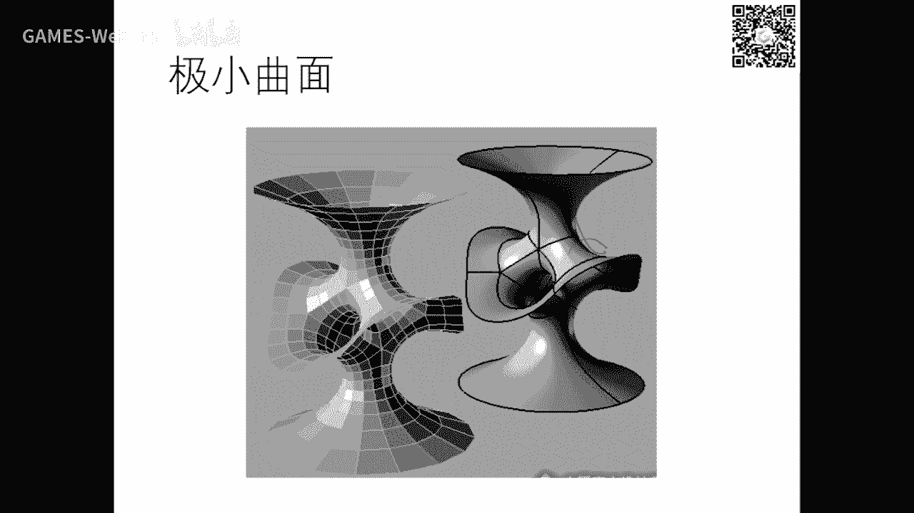

桌子满一点，每个点都是这样这样子啊，所以机械里面都比较漂亮，而我们这个实际生活中这种肥皂泡的表面就是机械局面，因为它自然就长成一个非常小的面，这个面积的一个t是吧。

像这个是网上一个什么仅仅是记录啊一个肥皂泡，那一个一个最大的肥皂泡的样子，算上里面它每个点都是啊类似以及要前面的一个艺术点啊，还有这些这些这是数学上有一些数学表达的曲面叫代数曲面。

也是一个天然的技巧曲面啊，你看到呃还是比较漂亮的哈，那么在实际应用中呢，我们也会经常用极小曲面来做什么呢，实际上是在建筑学里面用的比较多，像像这个屋顶为什么要用直角曲面呢，一它面积最小啊，这个省材料。

省制造成本，第二他每个点都是什么，都是难点，就是有一个方向是弯的，有方向是翘的，所以呢这个水啊或血啊或者一些物物物质啊，上面它是个不稳定平衡点，所以与下限来求，它一定会沿着这个凹的地方去流掉。

所以它上面的不大容易积水或者积雪，所以导致这个屋顶啊，这个非常就是不会被重血啊或雨啊这个这个积水所所压垮啊，所以可以看到在室外有好多这种键，就在顶都是这种绩效曲面所啊，这个章程的啊。

还有这些都是一些非常漂亮的啊屋顶啊，还有这样一个一些拿过奖的一些建筑都是用绩效水平来做型的啊，还有这些曲面都都是这个样子，好曲面平均to等于零。

那么我们这里呢刚才我们讲了一下这个需要全面的这个近似求解是吧，求解什么呢，求解就是这这个点跟它一领域啊，对这些方向的一个一个组合对吧，刚才是cos的222个两个值嘛，cos阿尔法和贝塔对吧。

只是更近更加好，实际上是从另外角度来来看的话呢是吧，你把这个v把它拎拎出来，实际上它也可以看成是什么呢，这样这样一个形式，它是个p啊，跟它的一领域的线性组合组合出一个点，最主要就是它的重心坐标啊。

作为这一点，那么咱们朝这个方方向呢去去运动，就这个这个这个方向就这个模式等于零是吧，所以呢我们就可以从一个任意曲面讲的是开局面出发，就可以来去找到它的极小曲面的形式啊，举例啊。

我们就把这个p啊沿着101这个一圈的重心去移动，当一般不建议直接把它移过来，什么我们一步步移啊，每每次呢一个10%啊，这个这个有个兰姆达比例啊，那么这样的话呢这个曲面就被光光滑了一点，然后不断迭代呢。

诶最后这个点呢就会无限靠近，这个每个点都能靠近它的一零域的这个中心，就变成加绩效全面的这个性质了啊，所以这也是那个离散平均曲率流的一个做法啊，可以看到啊，我们再解释一下，这是原来的顶点。

我们算出它的一个这个这个叫做离散平均曲率啊，然后这个是法向上，这两个方向呢就是刚才说的方向，这个点朝它的一领域的中心的一个方向，那么这个移动多少呢，多少移动的蓝兰达就可以了啊，这个这个蓝板呢不要太大。

如果等于一的话，就一下子移过去了，他反而会导致它不收敛，所以拉姆达小一点，但我可以多做一下啊，那么呃这个圈我建议大家是用用用这个权啊，这个圈非常这个点组合的系数就用这个系数去去去组合就行了啊。

cos cos的阿尔法i跟cos贝塔i好，那么这样的话就我们得到了一个极小曲面求解的一个局部迭代法啊，嗯我们这里当然是要一个封闭的曲面啊，讲的是是一个开局面。

那么这里每个点呢这个边界呢首先找到边界点不动，因为我们想模你一个这样边界的一个肥肥皂泡嘛，所以边界是用铁丝，假设这个铁丝所造成的，它不变，那里面的曲面，我想我想啊一进行一些变换，那怎么变换呢。

每个点每个点每个点都做同样操作，怎么操作呢，找找点点的一领域它的坐标，它移动的这个量呢是一个比例啊，好每个点都这样一种啊，所有点种完以后作为一一次迭代啊，那么你再做一遍啊。

那这个曲面就慢慢慢慢就会就会收缩成一个非常光滑的曲面啊，这这个所以这个非常非常非常容易实现啊，那么这里几个注意点啊，一般是这种操作就非封闭的啊，就带一条边界的，就是你算这个算这个点的更新的时候呢。

一定要用老的顶点啊，所以你要把老的顶点存起来，更新完以后再把它覆盖掉啊，啊第三个呢这个参数呢呃建议去小一点啊，那你取0。2可不可以啊，也可以，但不要取太大，太大的话呢，他有可能不收敛啊。

因为一下子这样敲，一下子那样敲啊，所以呢你这个迭代次数可以多一点啊，那么从理论上可以证明，当这个迭代次数趋向于趋向于无穷的时候呢，这张曲面就趋向了一个极小曲面。

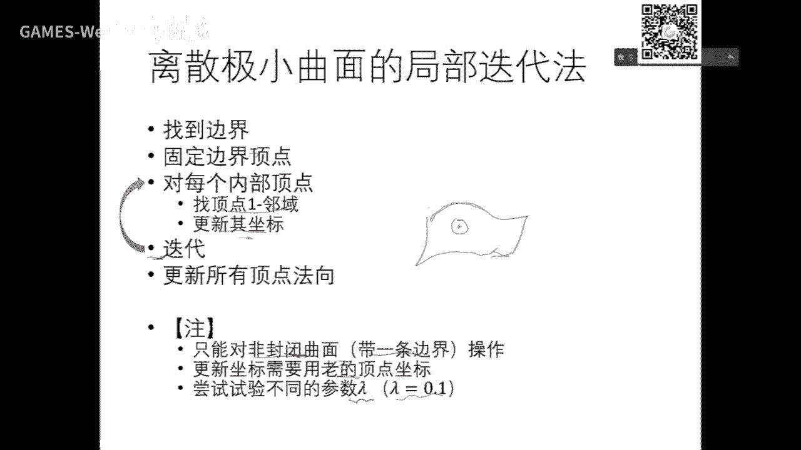

这这是个人脸，这个看这个人脸，这鼻子是凸出来的，这是它的边界，那么你如果通过刚才迭代，每个点都朝它的中心移动，每个点都朝到中心移动，迭代以后，你可以看到这些点都分布在一个非常光滑的这样一个局面上面。

就是边界是不动的，边界不动。

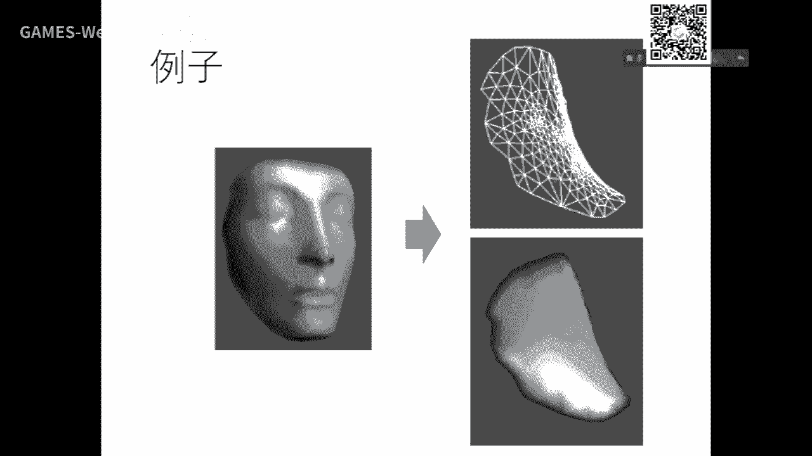

那么封闭曲面会怎么办呢，啊我刚才讲了，实际上它会收缩嘛是吧，所以对于封闭曲面的话呢，可以证明不固定任何点，每个点都按照刚才的操作，它呢这个曲面会收缩到一个点了啊，不管是愧疚自己啊，作为搜索到没没有了。

这是这是啊，这个迭代很多次以后就没了这局面是吧。

这是这个这个迭代算法的一个特性，好我布置一下这个卓越六啊，作业呢就是实现刚才我讲的这个呃绩效全面局局破法啊，非常简单，所以你要找到非封闭这个网格的边界，会提供几个这个带边界的。

当然你们呢首先要找到它的边界啊，那个那个框架里面可能有也可能没有啊，那如果有的话，那我们把它删掉啊，你们去首先要找到这一圈边界啊，这些简单就不动，对于里面的任何一个点，你要找他的，找找找到他的一零域。

找到101以后，这些点就找到了是吧，那么它的它的这个平均就加强平均就算算出来了是吧，然后把把这个点往往往往那个平听这个点呢移动个10%啊，每个点都这样操作，就做完一次更新。

所以呢你们这个作业你只要去用半边结构去找边界点，找它一领域，还有最后更新一下坐标就可以了啊，所以非常简单啊，如果你们对这个数据结构稍微摸索一下的话，可能几天就可以做完啊，所以目的主要是让大家了解一下。

怎么通过半面结构去找一个点的一领域，怎么去找这个整个的边界啊，那么这个边界边有什么特性呢，边界边可能就是什么，它的领域只有一个是吧，里面因为内部的边都有两个领域，都有两两个三角形相邻好。

那么我们会推荐大家还是用我们推荐的这个，或者我们给给的那个有拖把啊，有托比啊，这个这个这个框架啊，这个作业因为比较简单啊，你这这个迭代次数你稍微多一点，你要是可以自己认为是一一百1000啊。

你就可以设一下，然后就可以看到这个前面的最终形式，或者你就让它不断迭代，如果迭代过程中计算的这个新的点跟老的点，误差小于一定的程度的时候，你就你就停止迭代也可以啊，嗯然后你就用这个这个好。

那么对于有些同学可能做的比较快呃，过于简单，那么你可以怎么呢，可以去把曲率跟平均曲率做一做，就用刚才的语言可视化方法看一看它的颜色分布好吧，这作业就给你大家一周啊，后面呢就如果有同学还就稍微走的快一点。

能力更更强一点的话，你们可以自己去构造空间曲线啊，这个然后呢自己购购购购网啊，比如说你会各个平面平面的网，就网站你可以用这个全狗啊，这个全国是一个二维购网的一个这种库，挺好用的啊，那么你可以啊。

那个二维割完了以后呢，你就把它映射到这个空间的一个曲线，然后这个网网格不就是top有了吗。

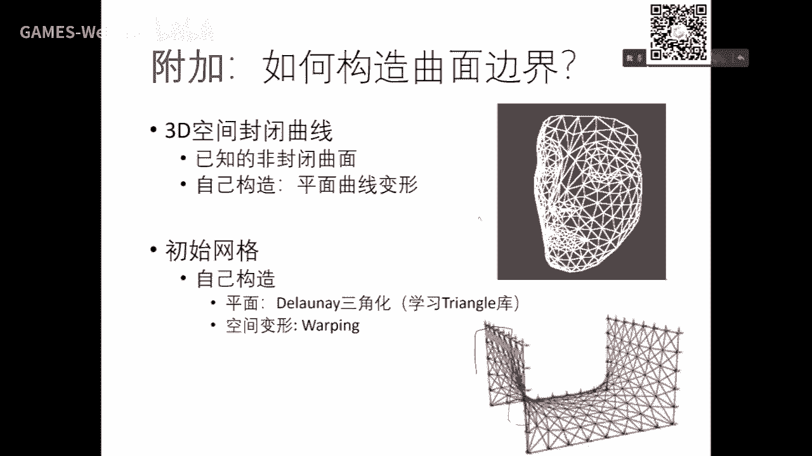

然后你再用机交曲面去去去带就可以做啊。

这个呃这个教学面生成好了，那么这次作业啊我们就布置完了哈，那个在在明天我同学们在网上就能找到这个作业好，下面我们请那个助教啊，张涛同学会来把这个有托比尔这个框架给大家介绍啊。

好，方韬在打哈嗯，哎，哎抓到啊好了，那个。

你就开始介绍这个有托比尔这个框架吧。

好我这边直播出去，好好的对。

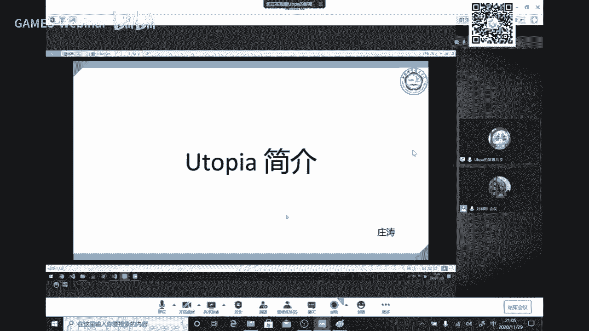

啊哦我现在开始开始，开始吧啊大家好啊，我是庄，我叫张涛，我们这个课程第六次作业之后呢，就要有一些关于网格上的一些操作，所以呢我在这里呢先跟大家介绍一下，这是我们课程推荐用的框架啊，是一个怎样的架构。

以及如何使用并完成作业。

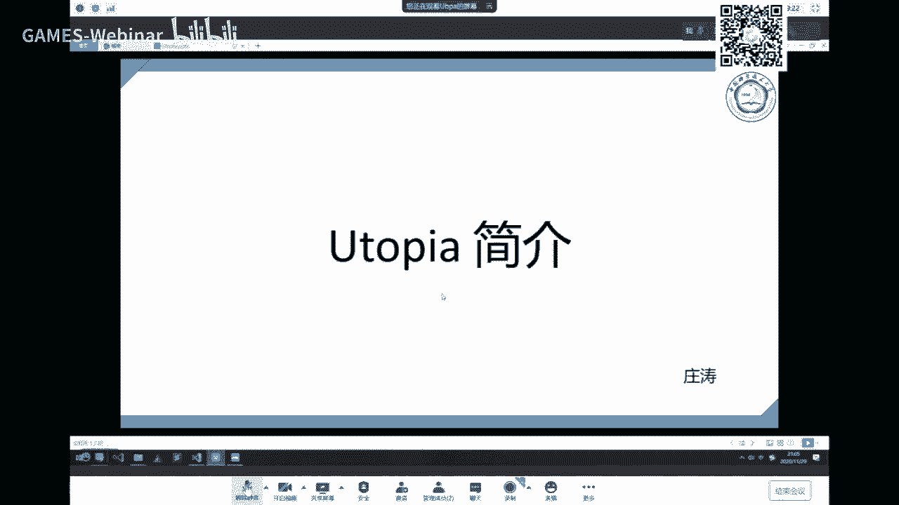

好啊，我们首先呢先看一下啊，我们的这个引擎是怎样子的。

运行这个框架之后呢，我们可以看到呃这左边是个游戏窗口，然后中最右边的是一个场景窗口，然后还有一些像呃，还有rocky，还要inspector这些，还有这个log啊，还有这个项目管理。

对于很多都是窗口很多很多功能，然后我们这里呢就是可以在场景窗口这边去啊移动，然后呃我们可以在这个海报里，体力这个窗口里面的去管理一下这个场景中的物体，比如说我们选中这个啊。

比如我们这里场景中有三个呃四边形，那我们可以选中这个路子，就是这这个四边形，然后我们打开inspector，然后可以看到最右边的它有很多很多很多呃选项啊，其实就是他的一些这个路子，这个对象的一些组件。

就比如说我们找到找到这个translation，就是它的位置位移，比如说我们把它往上移动，就是把它的y坐标加一加，这三个东西呢它都会往上走，因为这出来的是它的子节点。

就是这一套东西呢就是来帮助大家完成作业的好。

我们再来仔细讲这个框架呃。

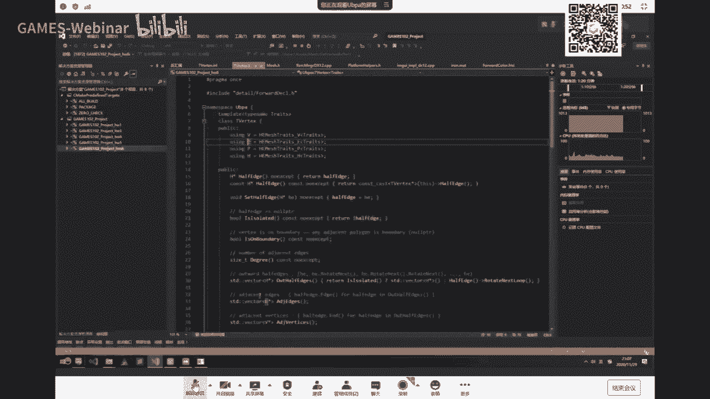

我们主要分两个部分，第一个是架构啊，接着再讲使用的方法，用来讲架构，就我这里就简单的把它分成四块，最最底层的就是一个基础，就提供了很多这个框架需要使用到的一些基础功能，往上走的就是分两个两大块。

第一个是渲染啊，另一个和编辑啊，是逻辑，就是这样子跑我们的我们的呃，我们的代码就是我们用户的代码，然后再往上呢就是呃一个编辑器，就是可以就是刚才我们看到那个界面就是编辑器好，我们基础部分啊。

这基础部分呢哦我就讲一些大家呃就是写作业比较涉及相关的，首先呢就是c ma我们构建项目要用到的工具啊，接下来就是我们组我们整个框架主要用的呃，库都是这个c加加的一些标准库。

好在网上的话大家比较喜要知道的是，一个是反射啊，一另一个是我们图形数学库，就是一些点向量。

然后变换的这东西好，然后大家讲这个c mac mac，就是呃我呢就是给封装了很多c mac上的一些功能啊，最终呢就是可以通过写一点点的呃代码，就可以得到一个呃很多就是呃就得到一个怎么说呢。

就是里面做了很多事情的一个一个功能好。

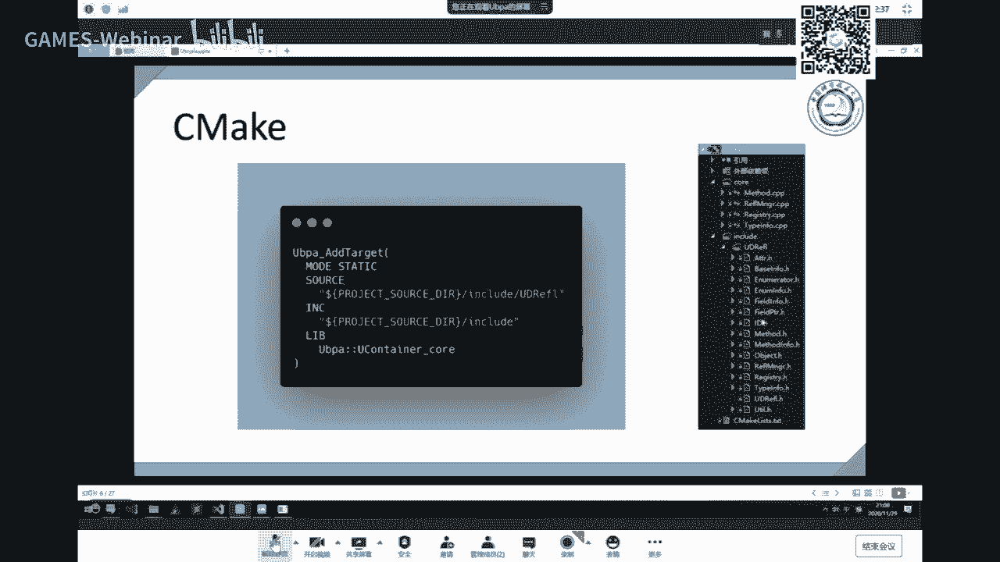

我们就看一下我们作业里面的c mac就可以在这里看到，简单就这里吧，就我们这里核心的就在这一部分就是添加了一个项目，这个项目呢是然后它引入了两个库，第一个是呃它底层的无头皮这个框架。

其次是我们的这个呃结构的一个库，好就引入了这两个库，然后他就能通过写这些代码就可以得到这一整个项目，项目可以呃这些源码的它都会自自动的添加进来。

然后我们也可以就是说在你的本地目录下去创建那些那些呃头文件啊，或者cpp文件。

它也是能够加进来的，好就加进到这个项目里好。

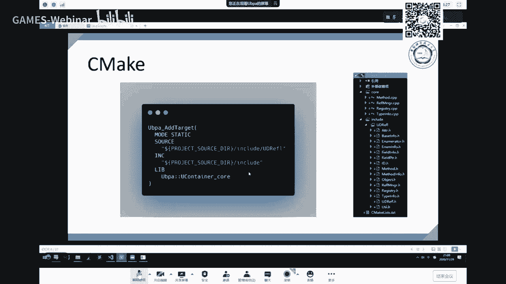

接下来是我们的图形数据库，因为数据库呢就是这样子设计的，就是呃我们会这些数学上的一些概念就写成不同的类，就是比如说点，然后向量法向啊，从而呢我们可以比如说啊这还有个变换啊。

就将变换作用与这些不同的对象的时候呢，就可以调用，就可以通过重载的方式是调用不同的函数嘛，比如说你看这右边呃，是他们的结果是大家都是不一样的，就是说呃可以大家都是就是说有x y z这三个坐标。

但是它是对应的概念是不一样的，就情况下啊就是写成了这样子的一个数据库啊。

我们再来仔细分析的话，就我们就比如说挑出三个东西，就一个是点，一个是向量，一个是法，向我们发现呢就是这些不同我对象它能够是支持不同的操作，比如说点他画它可以做呃，度量就是两个可以算两个点之间的距离。

然后可以做一个仿射变换，就是说这个加上一个向量之后，可以得到另一个点吧啊可以做这样的操作，那我们再看现在这个向量的话，可以做加法，可以做速成，也可以做啊，这个数量范数还有内积。

就是点乘吗啊然后我们再看一下这个法向，它也可以做很多操作啊，发现这些操作呢是有共同的部分的，所以呢我们可以呃将它们组织成这样子的形式啊，组织成这样子的形式，比如说这个向量呢就由这五个构成。

然后法向呢也是由这个内积泛式度量加成速成构成，这样是可以减少什么的，就是冗余是吧啊，就我们你们在用这个框架的时候呢，会用到这个数学库和看到这个数据库，就是我们怎么看这个库的代码。

其实就是看这个每个对象它有哪些呃，这些你可以当做是组件或者是功能有哪些功能组成，那么你在确定好它们有哪些功能组成的时候呢，你就能知道就是这一个对象，这个类它能够做哪些操作，你说可不可以做加法。

可不可以做乘法或换，或者可不可以做点乘这些好啊，这刚才是举的是三个三个例子，然后这里再举多一点例子的话，你可以看到它其实是确实是有很多可以公用的部分的，好我们这里再举，具体看每一个小组件它啊有哪些功能。

比如说这个内积就是in the fa，它呢有实现了这些这些接口，比如说可以可以点乘，可以求范数的平方，可以求距离的平方啊，当然也可以求距离，求放数，然后可以求余弦，余弦值。

就两个向量夹角的余弦值也可以解，实际上余切值也可以计算它关于某个方向上的投影，或者是它的那个垂直部分好啊，这就是数学库，我们在讲另一个一个技术组件，就是反射啊，很多语言的它都是有反射的功能的。

但是那个c加加呢它没有，就是本来说c加加在2020标，这个c加20，这个时候他就要加入反射，但是它是没加，他现在有的呢就是这种就是type rs这个库，它可以是对类型的去判断它的一些属性。

比如说是不是为的这些啊，这不介绍，然后就是说它的反射功能是比较局限的，所以啊我们在c加加上写东西的时候呢，就很有必要呢，就是说添加一些呃反射就是添加一些反射库啊。

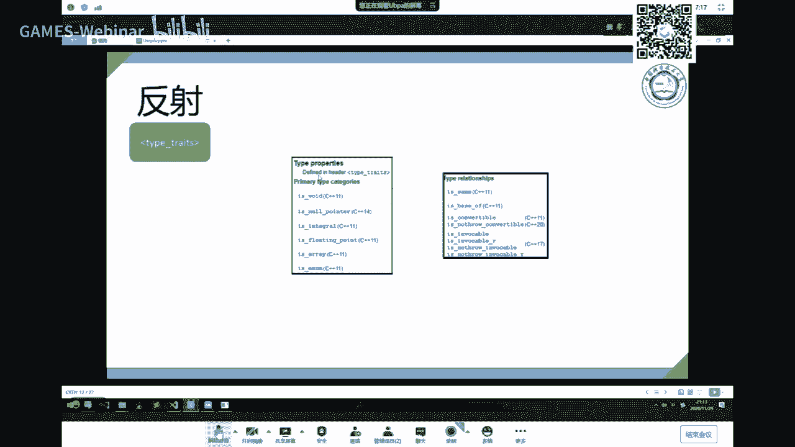

就是我们自己写的反射库啊，我们后面讲一下反射，就车库的话我们使用的是这个静态反射库，静态版好，我们看一下它最终就这些这个反射到底最终有什么功能，比如说哈我们有一个有个结构，这个或者是类啊。

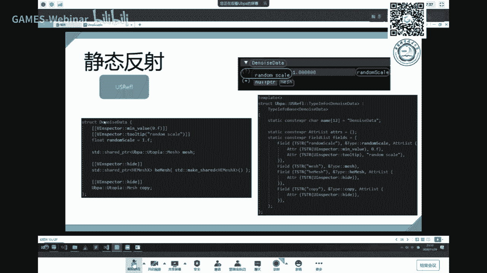

它是denoise data，就是我们这里啊这个数据结构嗯呢，呃我们比如说我们想把这些这些结构啊。

在我们的这个编辑器中去显示出来，那比如说在这里这里我们就把它显示出来了。

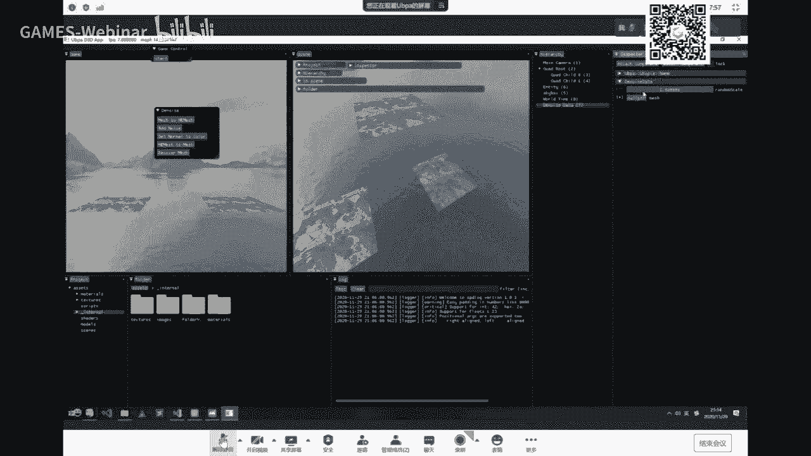

我们显示出来的我们需要说把他所有的所有的呃的成员给显示出来，并且呢可能说添加一些额外的信息，比如说我们这里这个london scale这个变量它有一个属性，就是说这个名就是最小值是零，就是它不能是负数。

然后有个工具two ti就告诉他这是一个随机啊。

就learning sc自己来看的话，它就呃能够在这里显示出来啊，比如说我们这里只能拉到零，就不能再往负的负的拉啊，好。

这这就是它的呃我们的结构哈，就是这些框框框起来就是它的属性，就是我们的想要实现的功能，就是把它显示在ui上，但是我们要实现这个功能的话，加加语言就他没有提供一个支持。

就是我们不能说便利他的所有的所有的那怎么办呢，就是说我们可以自己写一个静态反射，其实静态反射就是说把类的各种各样的信息啊全都保存起来，然后使得我们可以去便利啊，夫妻查找这些啊，这保存起来的方式呢。

就看这个右边是其实就是把他所有信息给列出来就可以了，比如说这里有个name，就是把他名字列出来，然后它有那些那些玉啊，比如说这里有好几个月，然后每个月呢它有一些属性。

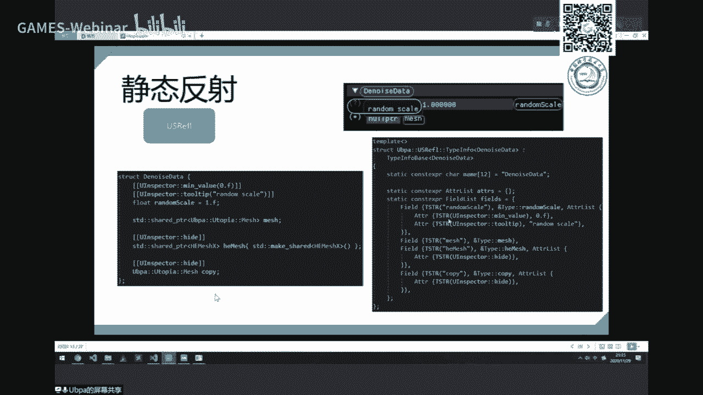

有哪些属性好，这就是我们反射的功能啊。

我们再看我们的框架里的话，我们能看到我们这里有四个月嘛，我们再跟大家演示一下，比如说我们这里添加了一个域，比如说是第就是我们其实就我们在做作业的时候，就需要你们自己去，就说你们需要什么数据。

就是这里往里加啊，加完之后呢，呃我们要更新一下这个静态反射的内容，就是可以这个找到这边有个入编译一下，你看这里它就会生成一个新的文件，那生产好了，那我们就能看到这里就多了一个d。

好好读了个d之后，你再运行一遍的时候。

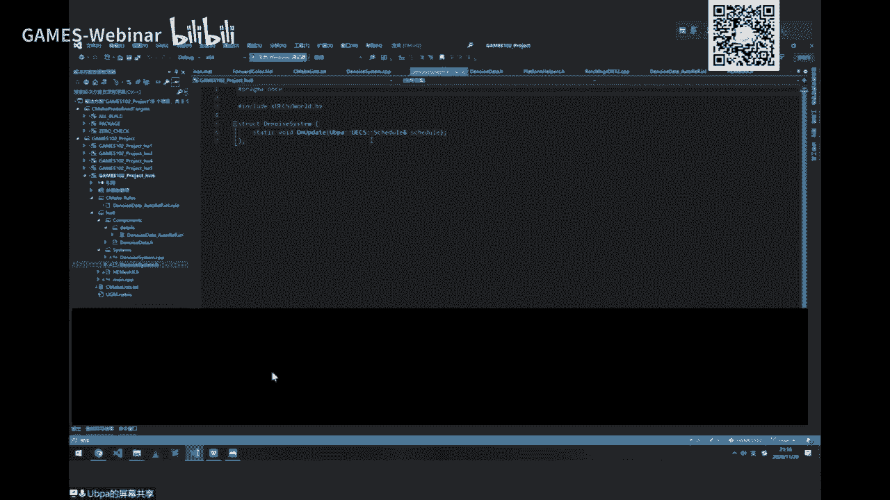

它就能够在你的那个刚才那个编辑器的窗口能看到这个d，就这样可以方便我们的编辑，就我们之前作业写作业的时候，大家的就是这个写了很多数据之后，是在系统里面去自己写了ui，然后去调去改那些数据，这样子就麻烦。

就是这里呢就是说我们可以通过用静态方式的方式啊。

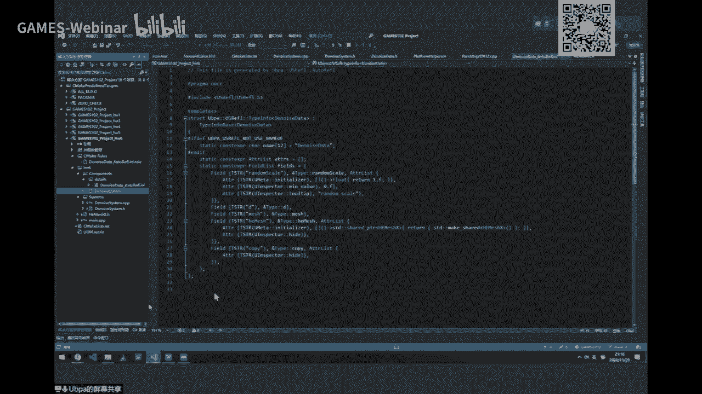

直接在那个窗呃，就是那个编辑器窗口里面，就就就就那个inspect这个窗口里面就可以去调它了。

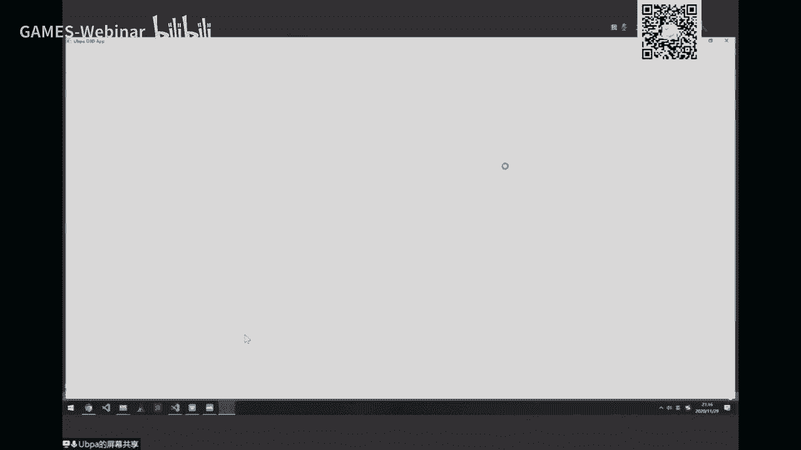

比如说这里你在inspector窗口可以看到这里就多了个d，这ui都已经写好了，就可以，大家可以直接在这边调以前作业，camer就那个画板的那个作业，大家就会在这边去调它的数据嘛。

就是呃其实其实右边是有的，就不用在左边这里自己写对吧。

好好这个反射内容就讲完了，好我们来讲这个嗯是这个渲染这个这一块，我们渲染的我把它最主要是说分成这么多层，从底层来看的就叫无层哈啊，最低就是一个图形接口，就是我们用的是地下室啊。

所以呢其实就是我们这个框架只能在windows上跑，这个以后再说，就是说添加一些，比如说啊welcome这些使得它可以在，就跨平台性能更多一些吧，现在先现在目前就是地下室，就只能在windows上好。

然后这个图形接口在网上看的话，就是有一些c的，c的，就是我们渲染应用的一个编程语言啊，然后还有它的纹理纹理，然后buff啊，纹理就是图片嘛，但是我们这里呢放在这里就主要是说它的。

比如说顶点的顶点的属性的buff，或者是它的索引的buff啊，往上走的就是一个叫其实较高级的一点的对象啊，这个谁的，他其实是在往上走，可以有一个呃就是这个西德的一个一个语言，就是谁的了。

他可以去给谁的添加一些声明的信息，然后添加一些声明的信息，然后还有material的材质，材质就是我们渲染的时候不是要需要图片嘛，就是比如说他需要好几张，然后这个但是就是c的里面要求要几张图片。

但是你没有具体说明是哪哪些图片，那么这mtl呢它其实就规定了，就是他就是在里面就告诉你就是需要哪几张图片，然后比如说这个还有呃网格，网格的话其实就是顶点数组啊，啊顶点的那些位置法向啊。

这些都是呃一个buff，还有它的索引，就是三角形的三角形索引的一个buff好，然后再往上呢就是我们要去组织这些对象，然后生成也就是得到一些你啊，就是你你的渲染的主要部分。

其实就是就是就是我们在网上写的那些东西，然后再呃怎么说呢，我们宣扬部分的代码，然后该怎么组织呢，就是我们其实d差12呢，其实是告诉我们我们应该啊并行的去执行那些渲染的代码。

然后这个并行执行这些生产代码的一个很好的架构呢，就是这个framework，你看后面再回再说一下这个fraground，然后再往上就是呃，具体你使用的是哪种管线。

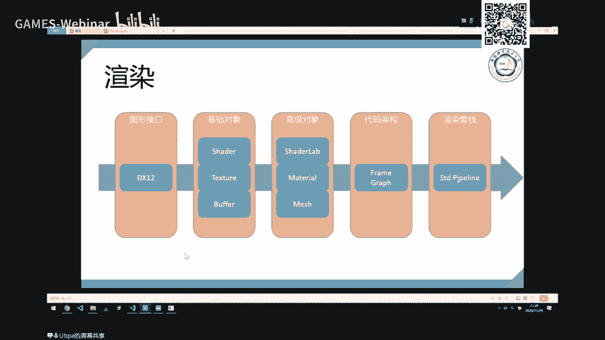

我们现在就一条一条管线，就是这个叫标准管线，这一条好好具体的讲，那你在右边看就是就是这个c的代码是一个很简单的，就是它是一个顶点的rtc的，一个是pc的。

然后我们再往下看叫test，就是这图片，然后我们在引擎里面呢。

其实可以在这个s下的test可以找到一些图片，比如说这里啊有一些图片。

然后buffer就是这些有这些顶点数据加了，然后它的法向，然后它的纹理坐标，还有另一个是它的索引。

就是每个三角形有哪些哪些点好，往下是谁的live，谁的life就是我们底层是c的嘛，然后是你要在网上，你要告诉他一些信息，比如说有哪些也是有哪些图片，比如这些呃lb度，然后emission这些图片好。

还有那些变量就告诉他说的这些声明信息好。

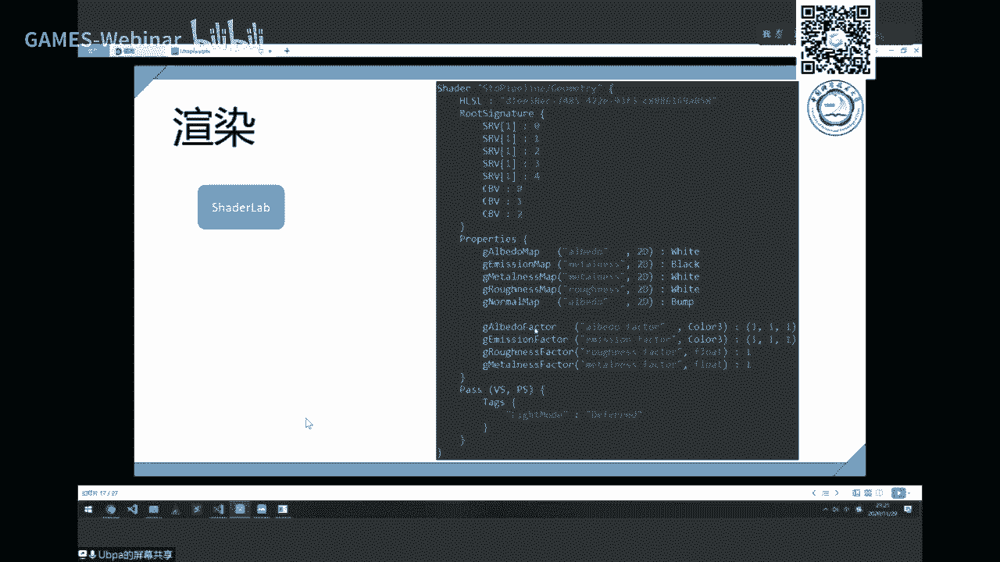

再往下是材质，材质呢就是说我们一个一个谁的谁的谁的life的一个东西。

它它会有图片嘛。

但是他没有具体说要哪哪些图片，那么ero呢他就是说具体的把那些那些图片给确定好，就是呃或者说是这其实就像是一个类型，就这样一个对象嘛，然后说我们这个material是就是铁锈。

这个材质呢它就它有它有它的漫反射贴图，比如说这个黄色的，然后这个呃金属度贴图啊，这它总共有四张贴图嘛，好嗯材质的话我们的框架里呢就是在这里material这里有好几种。

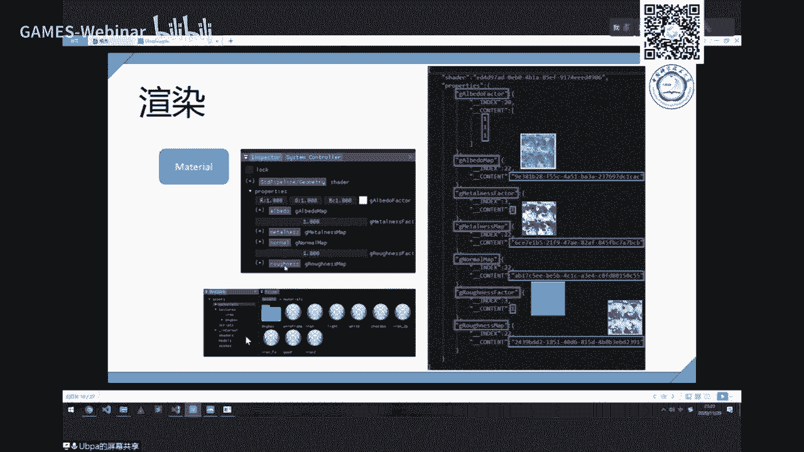

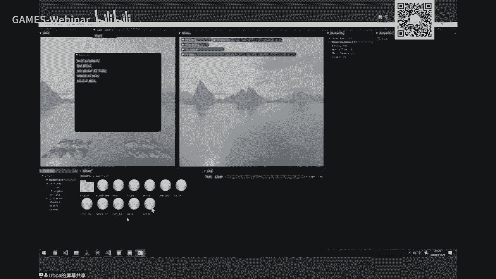

待会我们再演示它的材质，接下来是网格，网格的话呃，就是右边这个部分就是他们三角网格，然后它在引擎里面的就是这model下。

这里我们就预提供了，有其实你能看到的其实三个，这是我自己外边放进来的，大概写作业的时候会在额外提供呃。

就提供几个网格放在这啊，好接下来是逻辑的部分，我们逻辑呢整个整个框架用的是这个ecs架构，什么是ecs呢，就我这里简单的介绍一下，就是好整个事件就是整个世界，整个世界里面呢会有很多实体。

比如说实体a实体b实体c实体就是相当于一个对象，好像每个实体呢它会有它的一些功能部分，就是说比如说这个实体a它会有一个位置，就translation，它有个旋转，它还有这个变换。

local to work，它还有个random，所以说它是可渲染的啊，就是这个实体a它就四个组件，然后这b呢它也是四个组件，然后他们因为是他们拥有的组件是一样的，所以它们存在同一个框内。

存在同一种类型，它们是同种类型的东西，然后看再看这个实体系是体系，它是有三个组件，它有位置，它有旋转，它有个local to wor，这是实体与组件，其实就是我们的类型。

您的一种其实就是一种动态类型的系统，就是它有哪些组件，就决定了它是什么样的类型啊，我们再看这个sister，sister呢就是一个逻辑的部分，我们之前说的只是一个数据，那逻辑是怎么执行，它。

其实就是说他其实是把这个数据和逻辑给分割开了，以前我们写类就是有数据有方法吗，只有结构和系统结构，就然后系统的话就是它是剥离于这个剥离于剥离于这个类的，就是剥离于数据的，就是他啊。

他不会你的这个对象耦合起来，好好我们再看这个系统，就是它其实就是一个简单的这个local突破这个system system干嘛呢，就是就是你的位置变换和这个旋转变换相乘，得到一个logo突破这个变换。

它这个系统呢它就是一个规则，这世界的一种规则，就是它会对所有的有这些城市的，有rotation，有logo to work的那些尸体都会做这样的操操作，实体实体实体c它都会，它都有这三个组件。

所以他们都会做这个操作，然后从而就就这个系统会读取读取这个rotation，然后写入logo啊，这然后我们就解释完这个ecs啊，具体看这个代码，其实就刚才这个简单翻译一下，就不是简单翻译。

就是另外一个例子，就是我们就看这个例子，就是啊我们来看就代码中对应那些概念是怎样，是怎样子的，好我们来看啊，我们有两个组件，一个是位置，position i呃，速度velocity嗯。

然后我们的系统呢就是一个运动系统，就是他，这个运动系统是这样的，就是它会根据你的速度去更新你的位置嘛，然后我们就看这个这个这个拉达函数，可以看到它有两个参数，一个是速度，一个是位置，那个位啊。

就是能够加上速度，这里没有时间啊，所以就直接加了啊，这是这个系统叫move，然后我们来看这下面这个就是首先我们有个word，然后这个word呢就添加上这个，然后接着能不能创建一个实体。

我们把这个世界规定好之后呢，就可以去更新它，就是啊对啊，对的时候它就会执行这整个世界理论，就是和世界里的所有的系统，比如说就就有这个move系统，它就会把这个世界里的所有的组件，所有的实体。

它就会执行这个这个好，那我们这个框这里呢其实也是这样子的哈。

那我们来看这个hierarchy窗口里面的每一个每一条项目啊。

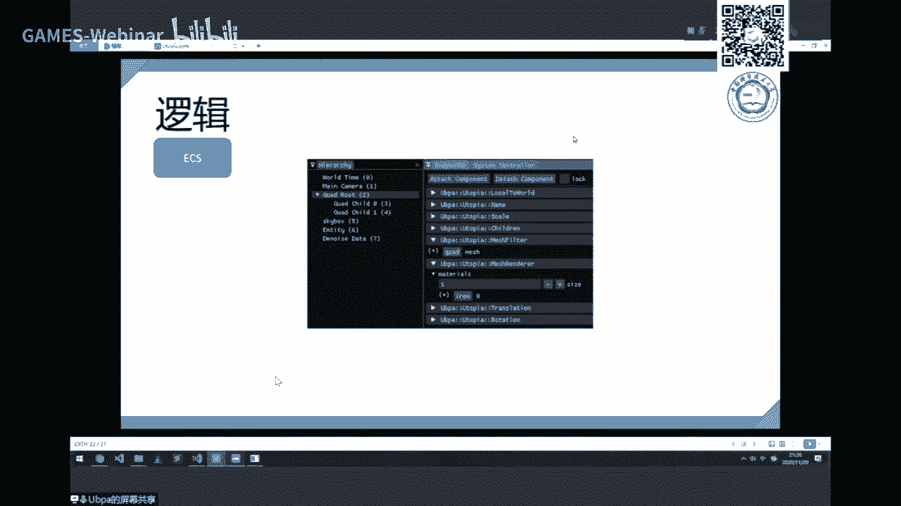

它每一条东西它都是一个实体，这都一个实体，然后这个实体右边呢就是这个inspector窗口看到的就是它的组件组件，就是一堆数据，就是它没有逻辑，它就是一堆数据啊。

在system control这里呢可以看到整个框架里有哪些系统，比如呃哪些系统，比如说我们现在运行听着的就有这些系统嘛，然后我们这里找一下，比如说这个dense system，就是你们。

作业里面要写的这个system，你它是运行着的，你勾掉的话，诶你看这右边这个窗就没了，就是它不运行了啊，就是我们的系统呢它就有多个状态，所以首先是呃这个是激活状态，这个是未激活状态。

你还可以把它就销毁掉，或者是把它添加上好，那时候它是未激活的，然后再打激活，ok好，我们再看这个各个实体，我们可以通过右在这里右键可以创建一个新的实体，创建好了，在这我们可以给它添加组件。

在这里比如添加组件，这里有很多嘛，比如说啊我们给它添加，我就随便点了，就缩放啊，旋转啊，然后logo图rotation欧拉旋转，然后translation logo to work。

这个match future就是网格，网格render就是渲染器，就当它有网格渲染器的时候，它就它就可以渲染啊，但是我们现在什么都没有复制，所以没有我们继续添加嗯，好再添加一个一个名字。

这名字可以调调一些，就这样，这里a就调成这样了，我们这个网格实体网格这里我们可以附上一些网格，比如说这个兔子帮你这样附上来，然后因为我们没有给他材质，所以看不到这材质加一个。

然后我们这些材质这个窗口呢去，如果这个这个材质wilfriend，这个材质好，我们就能看到东西了，然后这个兔子呢它很大，所以我们把它这个缩放是吧，小一点，然后其实我们这个相机位置不太对。

我们把这个相机位置移移啊，就一队了，然后这个有点挡啊，算了无所谓。

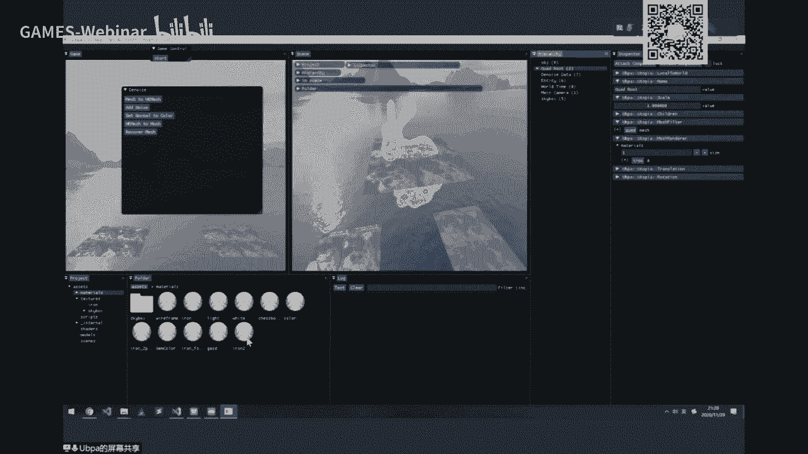

就这样，我再回回到这里来看好。

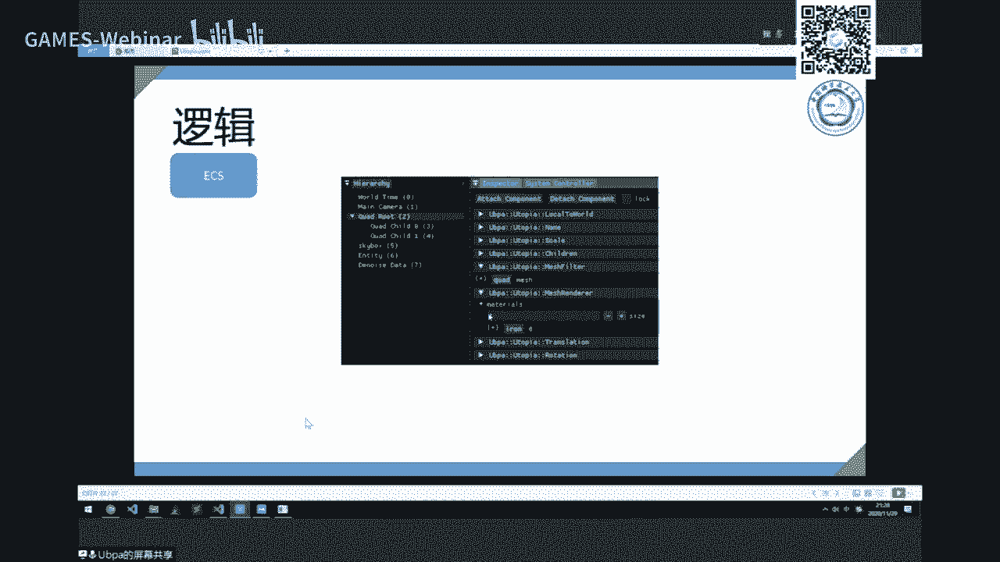

我们整个刚才看到了吗，这里有很多系统，这这这样子看的不知道他们之间有什么关系呢，然后这引擎提供这样的。

就把这个所有的系统给绘制出来，我们可以看到这里有很多很多系统，然后就这橙色的框就是系统，然后这个这圈呢它就是组件啊，具体不解释啊，就是只要看一下，就是他们这个系统啊，它其实会读取，会有写入。

它构成很多啊，用这这些读取和写入关系，它构成一种依赖，就是顺序依赖关系啊。

我们就在这逻辑就讲完了啊。

我们看一下我们作业里的事，情况是这样子，就是我们有组件叫dennis data，然后我们有个系统叫doris sim，dal sim，然后我们我们写代码就这么写，就是数据和逻辑拆开来拆开来好啊。

我们这里呢the nose stal，它是一个单例，就是它是一个单例，就是我们不需要说挂在某个组件上，其实挂在某个组件上，但是这个见底，整个世界里只有这么一个组件，所以它叫丹利好，我们就你看这个系统嘛。

首先获取了一个单例，就是这个获取到这个数据，然后这个数据，然后就是执行一些这些逻辑。

执行一些逻辑，然后这些逻辑是就是这些这个就它创建了一个窗口。

然后增加了几个按钮好。

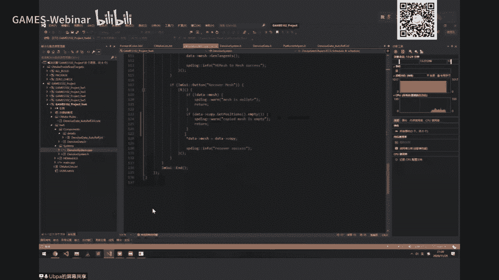

编辑器比其实也不用仔细讲，反正就是我们哦需要讲一讲，就是什么是编辑器。

就是三个，就我们刚才说的那个ecs，它是他是呃，就他其实上下文的概念就是一个是就上下文，然后每个实体它有一堆组件，然后这个世界里面有一些系统。

一个世界它就是一个上下文，我们可以在这个hierarchy在窗口里面可以看到这是一个世界，这个世界里面呢它也可以做一些编辑的功能，因为我给他上了这些系统，就是你可以看到它有一些一些东西。

比如说比如说我们在这里有个有摄像，你可以动这个摄像机，它为什么可以动，因为我们这里有一个rom组件，比如说我们可以这个有个运动速度有调成二，那它就可以运动的就更快一点，更快一点就调成十啊。

他可能就更快一些了啊，更快一些啊，这信这个世界里面的这些编辑是编辑性的编辑，这个信这个世界的，然后这个世界是什么，就是整个这个外面的这editor这个世界，这个世界里面也有一些系统。

有一些系统就这些可以尝试着把这些系统给全部display掉，会发生什么，看一下，哦其实不对，我们这边控制的是这个game的世界的系统，所以其实没什么，就是不影响这个editor。

好这就是edit，就三个字好，接下来我们讲一下这个引擎跟作业相关的一些使用方式哦。

我们这次作业呢我们这次作业是是极小曲面嘛。

极小曲面哦，我们用的是局部方法这样一个极小曲面，它其实在你它是一个迭代的过程嘛，就是你迭代的过程中，其实呃会把持这个网格变得光滑啊，最光滑的时候就变成了一个技巧曲面了，就是带边界的时候是这样。

然后这个操作呢就可以看作是去造一种所有这些取名叫去噪。

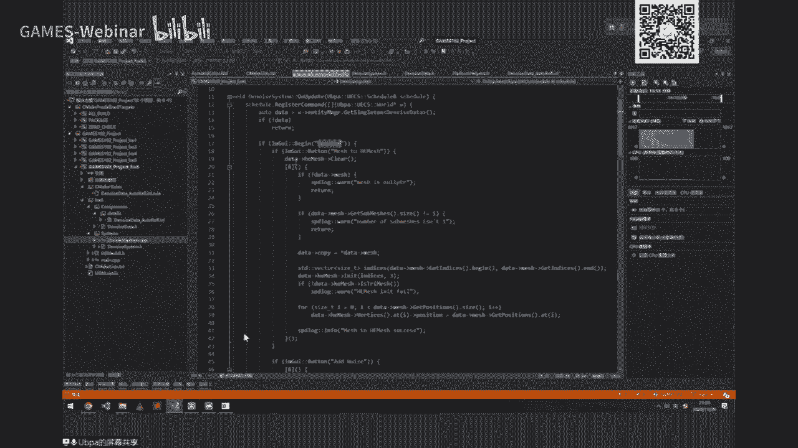

去掉系统啊，啊我们来演示一下啊，就是我们现在提供了一部分的代码啊，我们来先演示一下这已有的这些代码是这样子的，好比如说我们就取到这个这个兔子，这个兔子它是由帮你这个这个兔子这个网格的，我们要做操作的话。

我们首先先找到这个dis data这个实体，它有个这个组件嘛，嗯它这里有个可以放是的一个一个一个玉一个变量，然后我们把这个八点呢拖过来拖过来，好过来之后呢，我们在这个系统这个窗口里啊去操作它。

首先呢这第一个按钮就是说把这个三网格转到这个半边网格啊，转过去了，接着呢我们对这个半边网格做一个操作，给它添加噪声，我们就调成20啊，这个加上赵老师，你们看到这个logo里面会有消息啊。

接着呢我们再把这个半网格里面的外面结构里面的那些数据啊，就传回给我们这个三这个渲染用的三角网格传回来，你看这个三角网格就发生了变化，我们把这个扩的删掉啊，啊这三角网格发生变化。

它我们这里还提供的功能就是恢复恢复，然后你可以再看一下他们的之间的区别好。

作业呢就是要对这个半边网格进行一个操作，我们这里其实提供了很多代码，你可以去模仿一下啊，比如说这里这个添加噪声，我其实就是说对对这个半边网格去便利它的顶点，然后对每一个顶点它的位置做。

做了一些加上随机噪声好。

然后我们还有个可选的作业，就是呃着色，我们着色的话就是我们这里就演示了吧，法相就是传当做颜色，就法相当颜色，我们作业是将它的高斯曲率啊，或者其他曲啊作为颜色嘛，我们现在这里是也是法向对比用再传过去啊。

这个东西就有颜色了，好，这样的颜色就我们还提供多其他材质啊，我们看一下是网格嘛，就还有比如说你们会用到的，可以用这个color这个材质他就是一个不是动的，不是带动的啊。

就这两个材质比较比较需要用到了哈，一起再看啊，这个半屏网格这个结构是怎样长什么样的啊，这半边网格呢是就是我们这个啊啊edge mesh这个库，这个库啊是一个比较偏模板的一个库，但还好不是很呃。

首先就是我们看这里吧，首先就是预声明，这四个就是我们整个库会设计四种，对应一项，一个是啊顶点应该是边，应该是三角形，还有个半边这四个对象，你首先就是你自己用的这四个对象啊，先生你好，声明之后呢。

就是得到一个叫trace这样的东西，接着就可以去定义你的对象了，这个之前声明了，现在定义定义这个对象啊，比如说还有个位置啊，它的位置你也可以不要位置啊，反正就是你你可以添加任意的信息，随便你啊。

如果你不添加，就这个网格啊，其实它其实就这个它只处理一个拓扑关系，就是它没有位置，这些什么都没有，它只有一个连接关系，但就看你的任务需要需要什么属性的添加上，比如说你需要一个位置，你就给它添加上位置啊。

比如说你这个边的结构，你可以添加一些函数，比如说添加终点，就是终点怎么算，就是啊就两个端点的啊，那个端点的位置的平均码求平均大于0。5相乘，得到一个位置，终点位置，然后就是比如三角形。

你可以添加一个属性叫面积啊，或者其实我们整个半边结结构它不是只局限于三角形，它就可以是多边形的，所以我这里用的是polyg，我们这里这里的作业呢是三角形，所以啊现在你要判断一下这个三角形。

就这个多边形是不是这个三角形，就是判断这个中立是不是三啊，比如说这样，是不是三，就是它这是我们底层提供的函数叫degree，你可以看到是不是三来判断它是不是三角形，还有比如说这更新。

就比如说你要算面积的话，比如说而且你把这个面积存在这个三角形里面的话，你首先可以来一个这个变量，这是面积，然后你接着就啊来写一个函数，比如说阿they are the area，就可以算一个面积。

那其他的你可以在这个半边这里就随便加自己加，然后我们怎么用呢，就是怎么用，比如说我们这次需要需要是不是边边界对吧，是不是边界，那我们这个网格其实这个嗯我看一下我们的半边网格单元网格。

你可以通过这里啊用这个箭头就可以得到它的很多函数嘛，比如说你要知道它的，你要便利它的所有顶点，那就可以这个那个便利它的话就这样，然后比如说你要知道它的位置，你就可以这样得到它的位置。

然后你判断它是不是是不是边界点，就是比如说这个it's on boundary，他就告诉你它是不是在边界上，是在边界，说明这个点边界点，还有比如说你想获取它的一领域。

就可以a d j d j是adjacent的意思，ada adj vertex，adjacent vertex，因为它连接域也比如说你要算它连接域的一个。

比如说平均的一个他们连监狱的各个位置的一个军军军事点啊，你觉得你可以讲啊，就是就比如说啊，一个均值点的位置啊，稍微演示一下，哈哈，嗯，我们这里呢我发现可以可以这样，ok那就可以这样。

那就这样就可以算出一个均值点的位置，当然你还要除一下它的，除下它的啊，do啊degree啊，就这样就可以得到它的均值点，我们这里用的类型是呃三他写这个我们刚才说的那个数据库，它有点线面这些啊。

别说是点向量法向这些啊，他们支持的操作是不一样的，但是有时候你不想关心他是什么操作的话，你就可以直接用这个wei这个类，这个类就是支持所有操作，随便你随便你怎么做都可以。

就如果是point point的话，它就不能加，你看他顺利的告诉你错了就点是不能加点的，好这个是可以的，好呃，半边结构就有颜色，二三我们再再说说明几下，就是你怎么知道这个半圆结构它有哪些函数呢。

比如说我们这里有点线面，其实它是继承关系的，就这个它的积累，这个积累里面有一些操作你可以看啊，比如你用可以点到他他的那个源码，你可以看到这这些有一些操作吗，我有一些注释啊，都反正这些操作都挺简单的。

我下面有注释可以看一下，就点会有，然后这个边有些操作，可以让我们再看它有可以取到这个边的邻接的顶点，还有链接的这个半边，还有判断它是不是在边界上，反正就是它有很多函数，这是编的，然后这里有个多边形的。

然后还有这整个网格的，它也有一些函数，啊大家可以仔细看一下，然后其次呢就是看这里这边我是怎么用的啊，怎么将一个渲染应用的三角网格转成转成半边网格，怎么转的。

比如说这里有mesh to have a mesh，这怎么转，然后还有怎么加噪声的啊，怎么调它颜色，就你们有个可选作业，就是调颜色，这里可以调，然后是网格转成文三角网格啊，这这边是这么转的。

就是其实是把他的那些位置啊，然后它的法向啊更新一下就可以好，然后我们你们调试的话，如果要输入信息，用这个啊，s p d log，这个它可以输出到我们有个log窗口好，那你基本就讲到这就好了嗯。

啊刚才是演示部分好，我讲完了，谢谢大家，那个谢谢张涛同学哈。

场内，然后我们回到课程好。

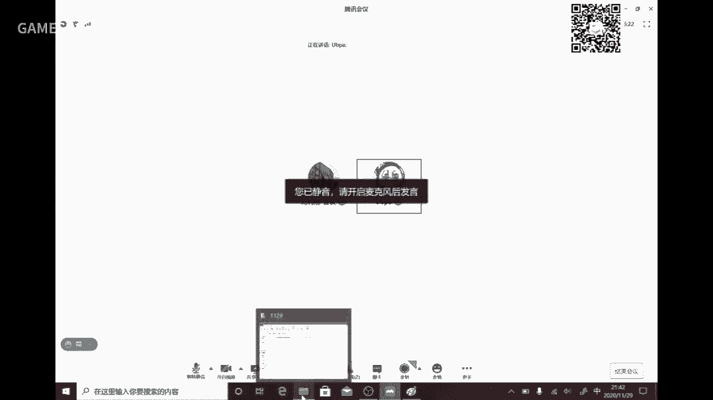

那么这样，那今天的课程呢基本上啊也就结束了啊，今天呃刚才看到平台上面同学们说可能会天天不知道什么原因，有点卡顿啊，那哦没关系，那个我们等一下检查一下录屏，如果这个屏幕录屏是好的。

好吧，刚才张同学把那个由托比尔这个框架给他讲的比较详细啊，同学们那个可能一下子不一定完全能理解，没关系，反正这个视频可以重复看啊，另外呢啊他刚才我看到了它里面已经写了，写了非常多的一些函数。

所以这个作业呢就更简单了，因为刚才他把那个一领域也找到了是吧，boundary to帮你找到了嗯，嗯因为即使你们提供函数，你们可以看看函数的逻辑，基本上你也会操作这个这个一些点一下，没关系好吧。

最好是自己实际操作一下，因为后面的作业量可能会越来越大，你们前面这个数据结构一定要掌握好吧，然后这个这个委托点毕竟是我们呃这这1年不到的时间里面，开发出来的啊，还不带在完完善，那中间难免有一些错误。

也欢迎大家及时在我们的作业，好吧，我们这个创造同学，还有反馈这些如何解决，好吧好，那么今天是呃这个课程时。

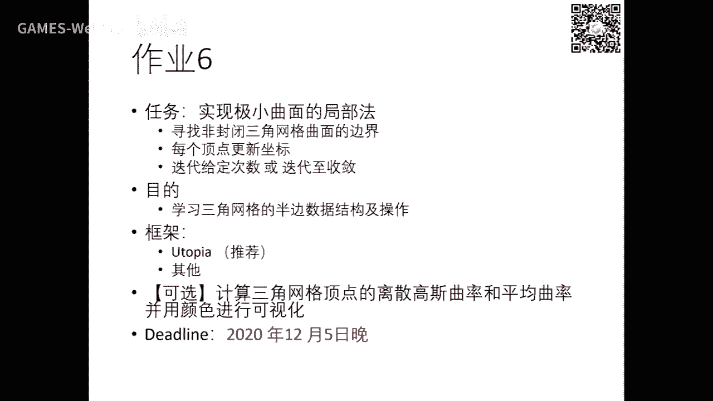

今天就到这里好，同学们再见好。

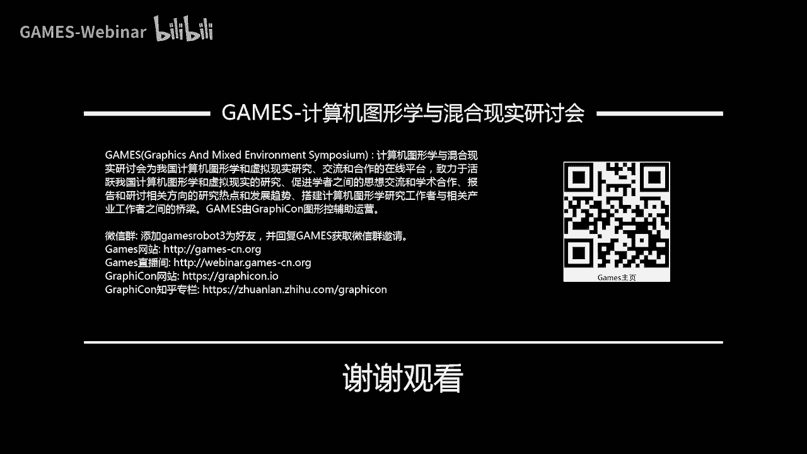