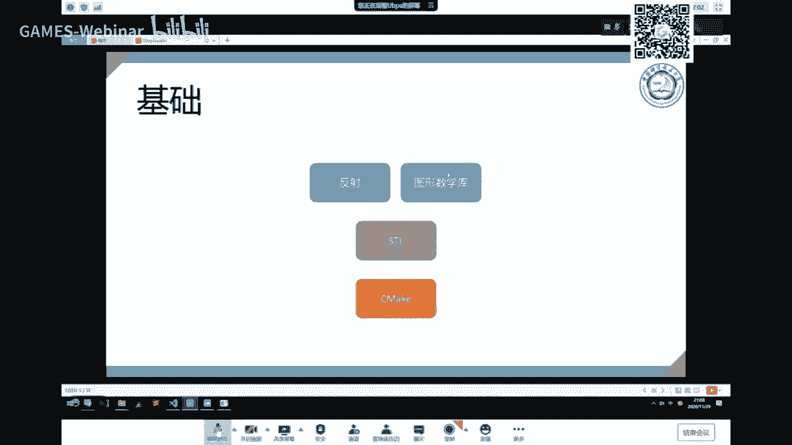
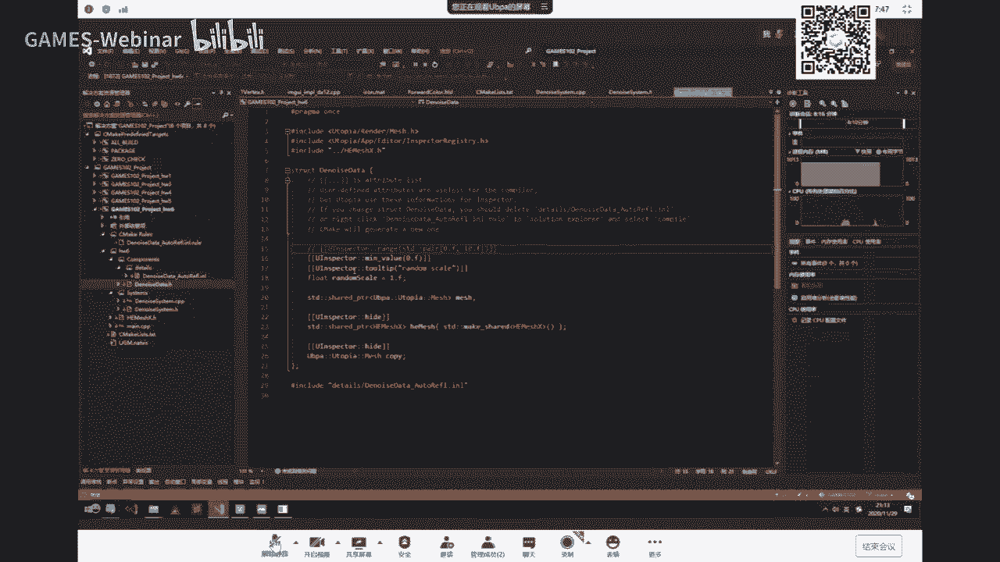
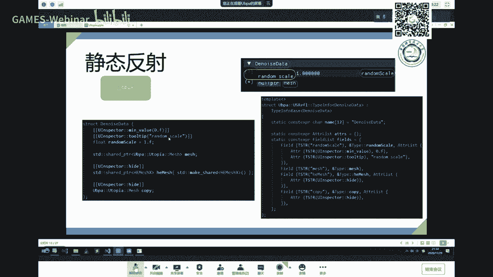

# GAMES102：几何建模与处理 - P8：离散微分几何与Utopia框架介绍 📐


在本节课中，我们将要学习三角网格上的离散微分几何量的计算，特别是曲率的计算。这些计算在后续的几何处理中非常重要。课程的后半部分将介绍我们用于完成作业的Utopia框架。

## 三角网格曲面概述 🔺

上一节我们介绍了光滑曲面的表达。在实际应用中，特别是随着扫描仪的广泛应用，我们更多地获得的是曲面上点的采样。这些采样点构成了三角网格。

三角网格可以有两种理解方式：
*   **逼近论观点**：网格点是从光滑曲面上采样得到的。将相邻点连接成三角形，就构成了一张分片线性的曲面，它是对原光滑曲面的一种逼近。每个三角形是一个平面，因此整个网格是C0连续的。
*   **拓扑学观点**：三角网格本质上是一个二维图（Graph）在三维空间中的“提升”（嵌入）。其顶点、边、面的连接关系（拓扑结构）不变，只是顶点的空间位置发生了变化。因此，它本质上是一个二维流形。

无论从哪个角度看，三角网格都是空间曲面的一种离散表达。

## 数据结构：图与半边结构 🗺️

要操作三角网格，必须掌握其数据结构。在数据结构中，图（Graph）是最复杂的结构之一，由顶点集合和边集合构成。

对于三角网格，我们需要存储顶点、边和面的信息。一个常见的格式是OBJ格式，它主要存储顶点（`v`）和面（`f`）的信息，边信息可以从面信息中推导出来。

在图形学中，有多种数据结构来表达网格。本节课介绍一种常用且通用的结构：**半边结构（Half-edge Structure）**。

半边结构的核心思想是将一条物理边拆分为两个有向的“半边”。每个半边存储以下信息：
*   `vertex`：该半边指向的终点顶点。
*   `pair`：与该半边配对的另一个半边（代表同一条物理边的相反方向）。
*   `face`：该半边所属的面。
*   `next`：在同一面内，该半边的下一条半边。

顶点只需存储其关联的任意一条半边，面只需存储其关联的任意一条半边。

通过这种结构，可以高效地进行邻接关系查询：
*   **由半边找两个顶点**：起点 = `pair->vertex`，终点 = `vertex`。
*   **由半边找两个邻面**：一个邻面 = `face`，另一个邻面 = `pair->face`。
*   **由面找所有半边**：从`face->halfedge`开始，不断访问`next`，直到回到起点。
*   **由顶点找所有半边**：从`vertex->halfedge`开始，访问其`pair->next`，循环直到回到起点。

目前有许多优秀的开源几何处理库，如CGAL、libigl、OpenMesh等。本课程推荐使用助教开发的**Utopia（无尽）框架**，它小巧灵活，易于上手。当然，学员也可以使用自己熟悉的库来完成作业。

## 微分几何基础回顾 📈

上一节我们回顾了曲线曲面的基本概念，本节我们进一步了解曲面的微分性质。

对于参数曲面 **S(u, v)**，其在点 **p** 处的偏导 **S_u** 和 **S_v** 张成了该点的**切平面**。切平面的法向，即曲面的**法向**，可通过叉积得到：

**n = (S_u × S_v) / ||S_u × S_v||**

过点 **p** 且包含法向 **n** 的平面与曲面相交，得到一条平面曲线。该曲线在点 **p** 处的曲率称为曲面在该**切方向**上的**法曲率**。


一个重要的结论是：在点 **p** 的所有切方向中，存在两个相互垂直的主方向，对应的法曲率分别达到最大值 **κ1** 和最小值 **κ2**，称为**主曲率**。其他任何方向上的法曲率 **κ(θ)** 都可以通过欧拉公式用主曲率表示：

**κ(θ) = κ1 cos²θ + κ2 sin²θ**


由主曲率可以定义两种常用的曲率：
*   **高斯曲率 (Gaussian Curvature)**：**K = κ1 * κ2**
*   **平均曲率 (Mean Curvature)**：**H = (κ1 + κ2) / 2**

高斯曲率是内蕴几何量，在等距变换下保持不变。处处高斯曲率为零的曲面称为**可展曲面**，如平面、圆柱面、圆锥面和切线面。
平均曲率与曲面的面积变化密切相关。处处平均曲率为零的曲面称为**极小曲面**，如肥皂膜。


## 离散微分几何 🔲


我们面对的是分片线性的三角网格，它本身不可微。离散微分几何的目标是通过网格的离散数据，去估计其背后所逼近的光滑曲面的微分属性。




估计方法主要有两类：
1.  **连续逼近法**：用光滑曲面（如二次曲面）去拟合网格顶点，然后用拟合曲面的属性来近似。
2.  **离散直接法**：直接对网格的几何量进行定义和计算。


对于**法向估计**，一个简单有效的方法是：将顶点周围所有相邻面的法向，按面积加权平均，作为该顶点的法向。







对于**曲率估计**，可以通过离散化微分几何中的定理来推导公式。以下是两个常用的离散化公式（针对顶点 **i** ）：


*   **离散平均曲率向量**：**(1/(2A_i)) * Σ_{j∈N(i)} (cot α_ij + cot β_ij) (v_j - v_i)**
    *   `N(i)`：顶点 **i** 的一环邻域顶点。
    *   `α_ij`, `β_ij`：边 `(i, j)` 所对的两个角。
    *   `A_i`：顶点 **i** 的Voronoi面积或混合面积。
    *   该向量的模长即为平均曲率绝对值，方向为法向。
*   **离散高斯曲率**：**(2π - Σ θ_j) / A_i**
    *   `θ_j`：顶点 **i** 周围第 **j** 个三角形的内角。
    *   `A_i`：顶点 **i** 的Voronoi面积。


计算出的曲率值可以通过颜色映射（Color Map）可视化在网格上，直观展示曲面的弯曲情况。


## 极小曲面与离散平均曲率流 ⭕


平均曲率流是使曲面沿法向以平均曲率为速度移动的演化过程。对于封闭曲面，它会收缩为一个点。如果固定曲面的边界，则内部曲面会演化成**极小曲面**（平均曲率为零）。


我们可以利用离散平均曲率流的思想，通过迭代算法来生成极小曲面：
1.  识别并固定网格的边界顶点。
2.  对于每个内部顶点 **v_i**，计算其向一环邻域重心移动的向量（即离散平均曲率向量）。
3.  将顶点位置更新为：**v_i’ = v_i + λ * 移动向量**，其中 `λ` 是一个较小的正数（如0.1）。
4.  重复步骤2-3，直到网格变化很小或达到指定迭代次数。


这个算法的核心代码逻辑如下：
```cpp
for 每个内部顶点 v_i:
    Vector3f delta(0, 0, 0);
    float weight_sum = 0;
    for 每个邻接顶点 v_j:
        float cot_alpha = cot(角 alpha_ij);
        float cot_beta = cot(角 beta_ij);
        float weight = cot_alpha + cot_beta;
        delta += weight * (v_j - v_i);
        weight_sum += weight;
    }
    // 简单起见，这里使用均匀拉普拉斯平滑作为演示
    // 实际应使用cot权重公式
    Vector3f laplacian = delta / weight_sum;
    v_i_new = v_i + lambda * laplacian;
}
```


## Utopia框架使用指南 🛠️


以下是Utopia框架的核心架构与使用方法简介。


### 框架架构
框架主要分为四层：
1.  **基础层**：提供数学库、反射系统等基础功能。
2.  **渲染层**：基于DirectX 12的渲染管线，管理着色器、材质、网格等渲染资源。
3.  **逻辑层**：采用ECS（实体-组件-系统）架构组织代码和数据。
    *   **实体**：世界的对象，只是一个ID。
    *   **组件**：附加在实体上的数据（如位置、网格、材质）。
    *   **系统**：处理具有特定组件组合的实体的逻辑。
4.  **编辑器层**：提供场景编辑、属性调试的可视化界面。


### 完成作业的关键步骤
作业目标是实现离散平均曲率流算法来生成极小曲面。
1.  **创建数据与系统**：在ECS框架下，创建一个组件（如`DenoiseData`）来存储网格数据，创建一个系统（如`DenoiseSystem`）来执行算法逻辑。
2.  **操作半边网格**：框架提供了`HalfedgeMesh`库。你需要：
    *   将渲染网格转换为半边网格结构。
    *   遍历内部顶点，计算其一环邻域重心（使用cot权重公式）。
    *   根据更新公式调整顶点位置。
    *   将修改后的半边网格数据传回渲染网格。
3.  **可视化曲率（可选）**：计算网格的高斯曲率或平均曲率，并将曲率值映射为顶点颜色，在材质中显示。


在编辑器中，你可以将网格对象拖拽到你的数据组件中，并通过系统控制面板触发算法的执行和迭代。

## 课程总结 🎯


本节课我们一起学习了以下内容：
1.  三角网格作为离散曲面的两种理解方式。
2.  用于表示网格拓扑的**半边数据结构**及其基本操作。
3.  微分几何的基础概念：切平面、法向、主曲率、高斯曲率与平均曲率。
4.  如何将光滑曲面的微分性质**离散化**到三角网格上，进行法向和曲率的估计。
5.  **极小曲面**的概念，以及利用**离散平均曲率流**迭代算法来生成极小曲面的原理与步骤。
6.  用于完成作业的**Utopia框架**的基本架构、ECS设计模式和使用方法。


通过本课的学习，你将能够理解离散曲面的微分性质计算方法，并利用提供的框架动手实现一个简单的几何处理算法。