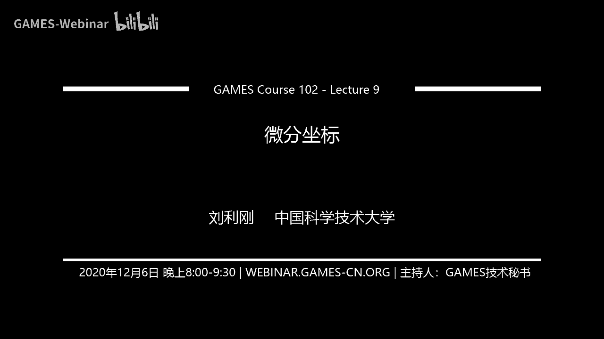

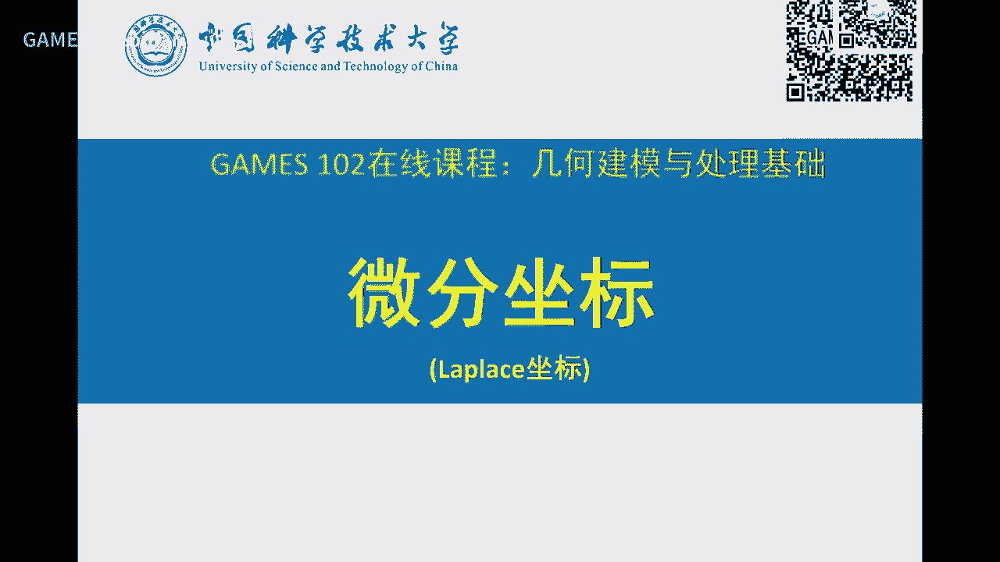

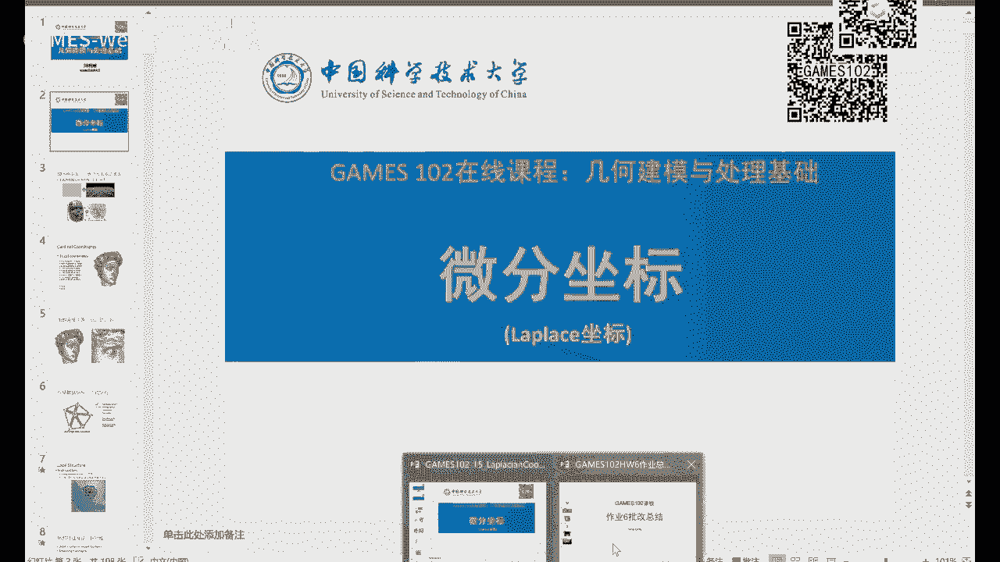

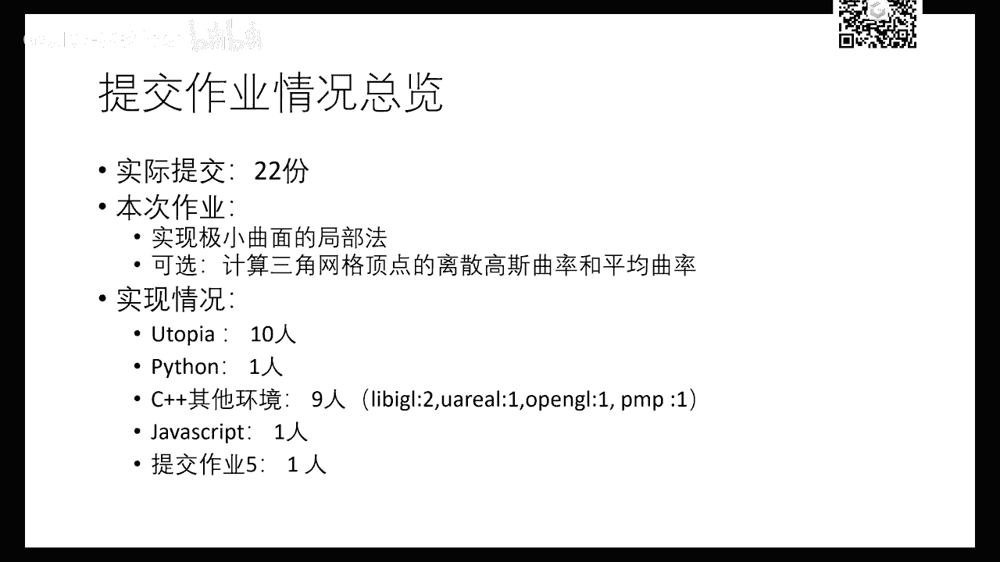

# GAMES102：几何建模与处理 - P9：微分坐标 📐

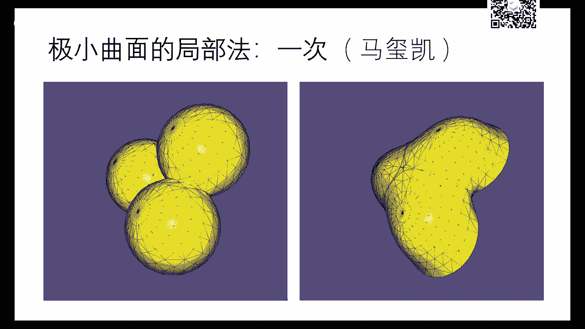

在本节课中，我们将学习微分坐标（拉普拉斯坐标）的概念及其在几何处理中的应用。我们将从回顾作业六开始，逐步理解拉普拉斯算子的几何意义、离散形式，并探讨其在网格光滑化、参数化和编辑等任务中的核心作用。

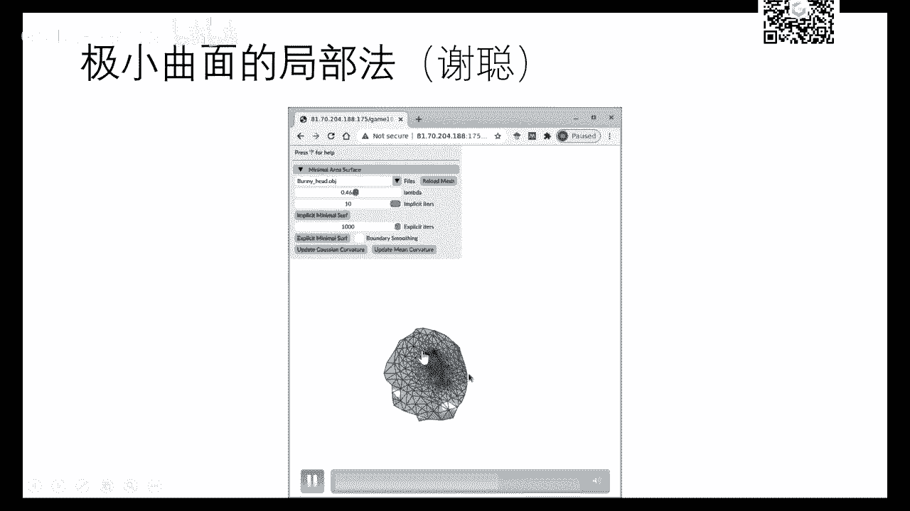

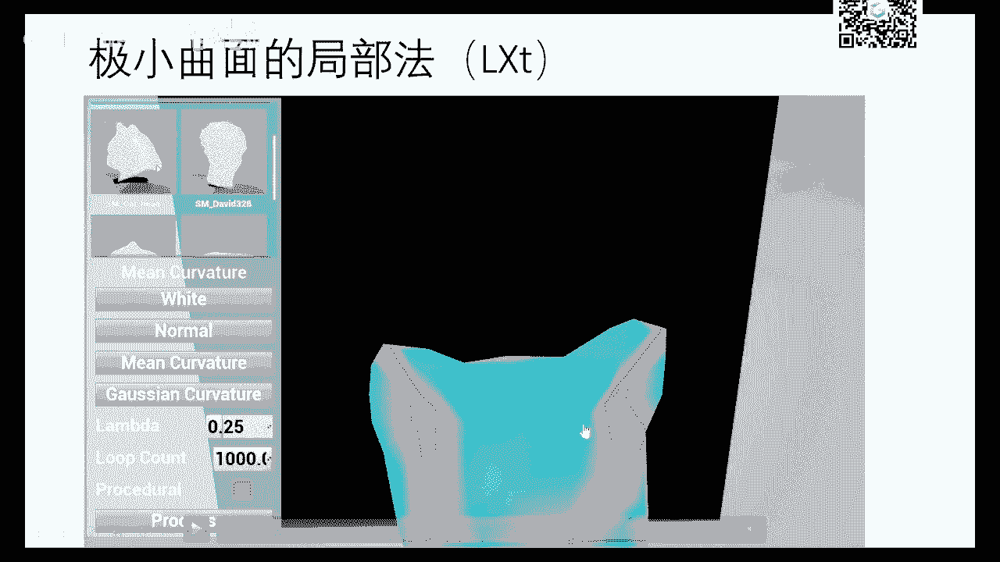

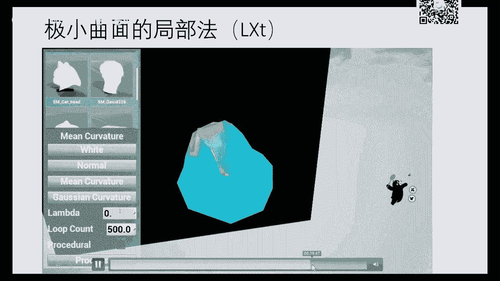

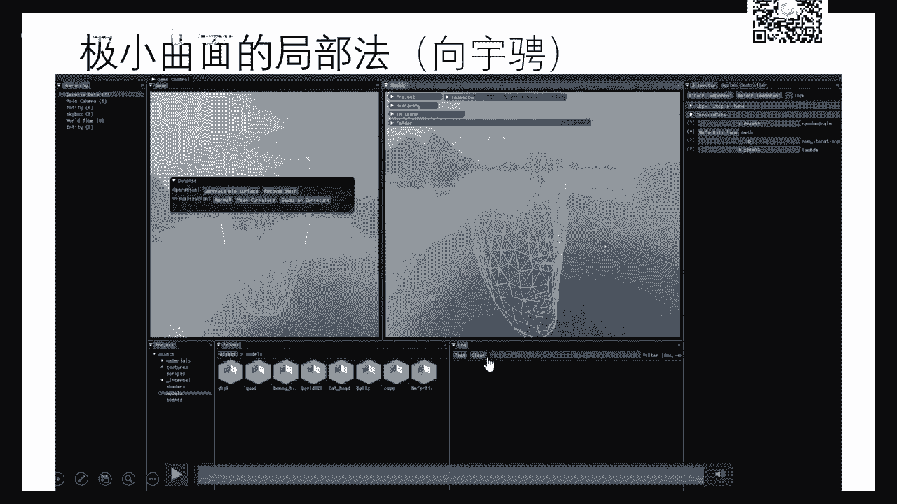

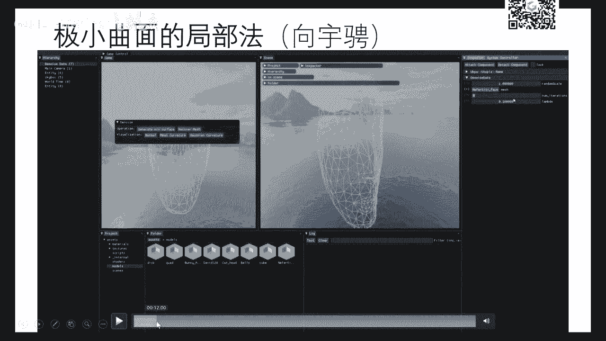

---

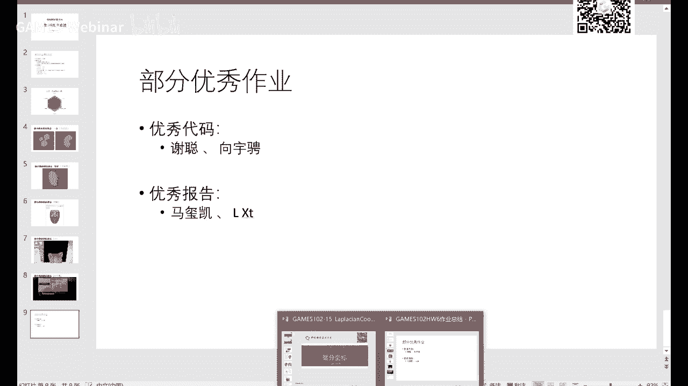

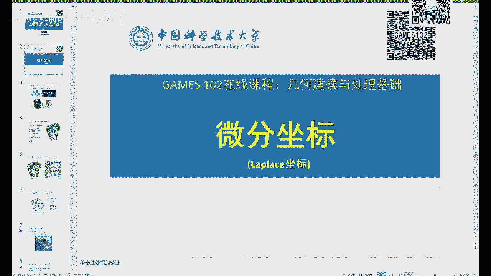

## 作业六回顾与总结 📊

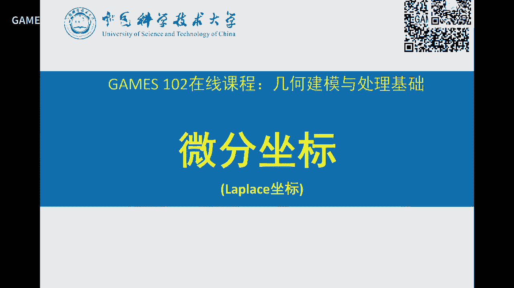

上一节我们介绍了网格的基本概念和数据结构。本节中，我们来看看作业六的完成情况，它为我们理解微分坐标打下了实践基础。

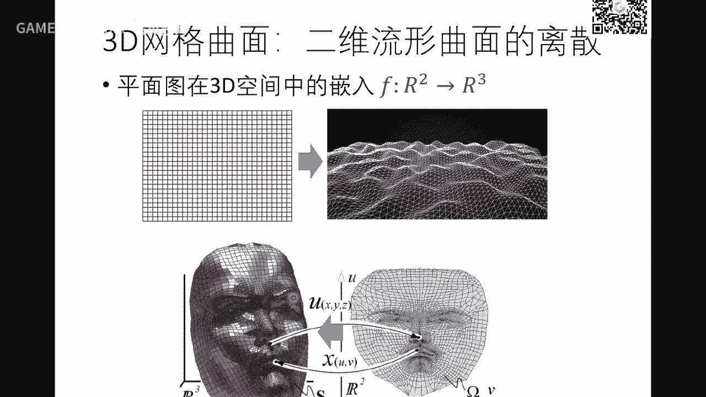

作业六要求对三角网格进行编程，通过迭代修改顶点坐标，使其朝着拉普拉斯方向移动，最终使网格变得光滑。

以下是作业完成情况的要点：

*   **核心操作**：将每个顶点向其**一邻域**（直接相连的顶点）的加权平均位置移动。
*   **迭代过程**：通过不断迭代上述操作，网格逐渐光滑，最终在边界固定的条件下逼近**极小曲面**。
*   **观察现象**：
    *   顶点密集的区域（如兔子耳朵）收敛速度较慢。
    *   使用均匀权重可能导致网格自交（面片翻转）。
    *   使用与几何相关的权重（如余切权重）通常能获得更好的性质。

通过这个作业，我们直观地体验了拉普拉斯坐标作为“几何细节”或“尖锐度”度量的作用：移动顶点以减少其拉普拉斯坐标的长度，相当于磨平该处的几何特征。

---

## 离散曲面与图结构 🔗

在深入微分坐标之前，我们需要巩固对离散曲面的理解。离散三角网格本质上是一个图（Graph）在三维空间中的嵌入。

*   **两种观点**：
    1.  **参数曲面观点**：将网格视为从二维参数域到三维空间的映射。每个顶点拥有三维坐标。
    2.  **图嵌入观点**：将网格视为一个二维图，其顶点被赋予了三维坐标。其本质是二维流形。

*   **数据结构的重要性**：处理网格的核心是掌握图的数据结构（如半边结构）。数据结构的选择需要在**存储空间**和**计算时间**之间权衡。没有最好的结构，只有最适合当前应用的结构。

*   **邻域概念**：要研究一个顶点的局部性质（如曲率），我们需要考察其邻域。
    *   **一邻域**：与该顶点直接通过边相连的所有顶点集合。
    *   **k邻域**：可通过不超过k条边到达该顶点的所有顶点集合。通常，一邻域足以近似“无穷小”邻域的性质。

---

## 拉普拉斯坐标（微分坐标）的定义与几何意义 🧮

理解了局部邻域后，我们就可以正式引入本节课的核心概念——拉普拉斯坐标，也称为微分坐标。

对于一个顶点 **v_i**，其拉普拉斯坐标 **δ_i** 定义为该顶点与其一邻域加权平均位置的差向量：

**δ_i = v_i - Σ_{j∈N(i)} ω_{ij} v_j**

其中，**N(i)** 是顶点 **v_i** 的一邻域，**ω_{ij}** 是权重，满足 Σ ω_{ij} = 1。

*   **几何意义**：这个向量 **δ_i** 的长度和方向刻画了该顶点偏离其局部邻域所构成平面的程度。长度越大，该点越“尖锐”；长度为零，则该点与其邻域共面，局部平坦。
*   **与平均曲率的关系**：在连续曲面的离散化中，可以证明，当网格足够精细时，拉普拉斯坐标 **δ_i** 近似等于该点的**平均曲率向量**，即：**δ_i ≈ H_i * n_i**，其中 **H_i** 是平均曲率，**n_i** 是法向。
*   **权重的选择**：权重 **ω_{ij}** 的选择至关重要。从离散微分几何推导出的**余切权重**（Cotangent Weight）具有优良的几何性质，通常比均匀权重效果更好，能减少网格变形和自交。

---

## 拉普拉斯光滑与全局方法 ⚙️

上一节我们通过迭代局部操作实现了光滑化。本节中，我们来看看如何从全局角度一次性求解光滑结果。

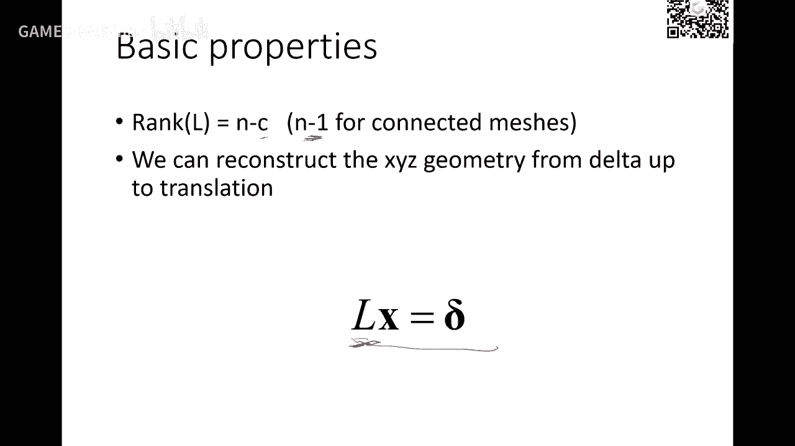

*   **拉普拉斯光滑（局部迭代法）**：即作业六使用的方法，公式为：
    **v_i‘ = v_i + λ * δ_i**
    通过不断迭代，逐渐减小 **δ_i**，实现光滑。λ 是步长参数。

*   **全局方法（一次性求解）**：目标是找到所有顶点的新位置 **V‘**，使得每个内部顶点的拉普拉斯坐标为零（或按比例缩小），同时固定边界顶点。这可以归结为求解一个线性方程组：
    **L * V‘ = B**
    其中：
    *   **L** 是**拉普拉斯矩阵**，一个大型稀疏矩阵，编码了网格的邻接关系和权重。
    *   **V‘** 是未知的顶点坐标向量（x, y, z分量需分别求解）。
    *   **B** 是由边界条件构成的右侧向量。

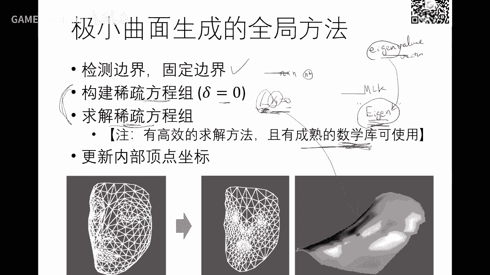

*   **优势对比**：
    *   **局部迭代法**：实现简单，但可能收敛慢，且易产生自交。
    *   **全局求解法**：通过求解稀疏线性方程组，可直接得到结果，数值上更稳定。这是作业七的核心内容，需要学习使用数值计算库（如Eigen）来求解此类方程组。

---

## 参数化初步应用 🗺️

参数化是将三维网格映射到二维平面的过程，是纹理映射等应用的基础。利用我们刚学的全局拉普拉斯方法，可以实现一种简单的参数化。

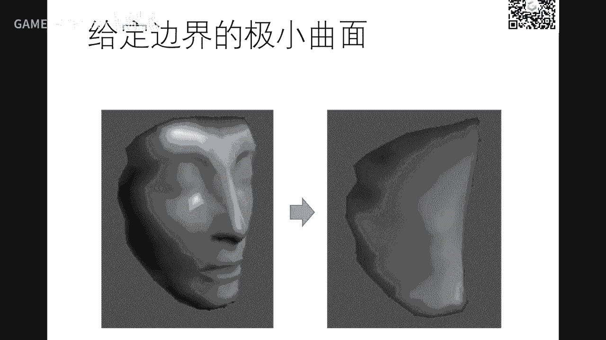

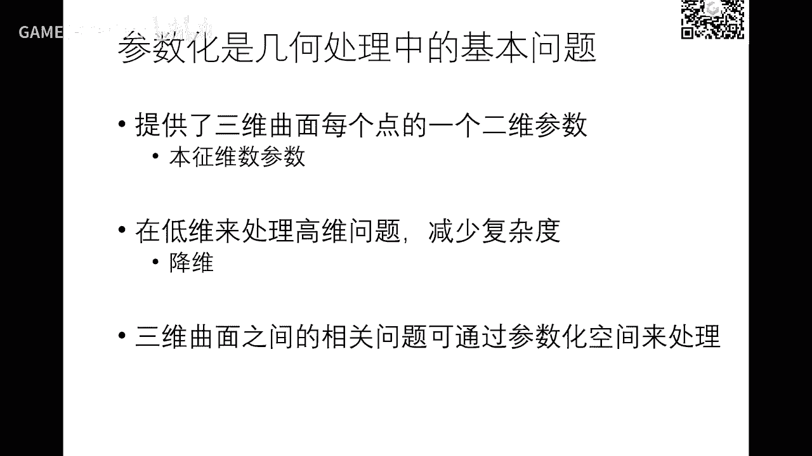

*   **基本思想**：
    1.  将三维网格的**边界顶点**映射到二维平面上的一个凸多边形（如正方形）边界上。
    2.  对于内部顶点，在二维平面上求解拉普拉斯方程 **L * U = B**，其中 **U** 是内部顶点的二维坐标，**B** 由映射后的边界顶点决定。
    3.  解出的 **U** 即为每个顶点在二维参数平面上的坐标。

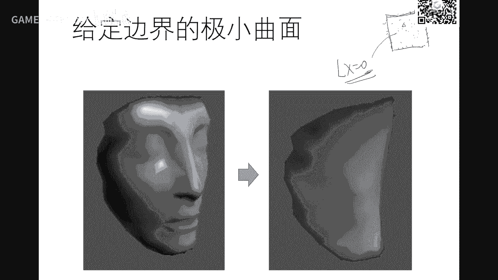

*   **特点**：
    *   这种方法称为**保角参数化**的线性近似，计算简单高效。
    *   可以证明，如果边界映射到凸多边形，则生成的参数化不会发生三角形翻转。
    *   缺点是可能产生较大的面积扭曲，特别是当三维网格形状与平面区域差异大时。

*   **应用**：生成的二维坐标（UV坐标）即可用于纹理映射，将二维图像贴合到三维模型表面。

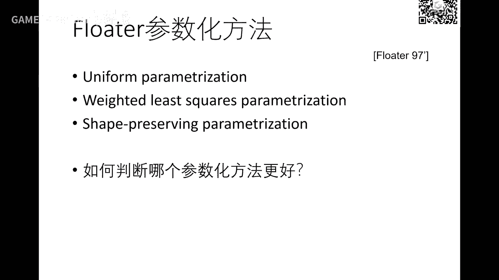

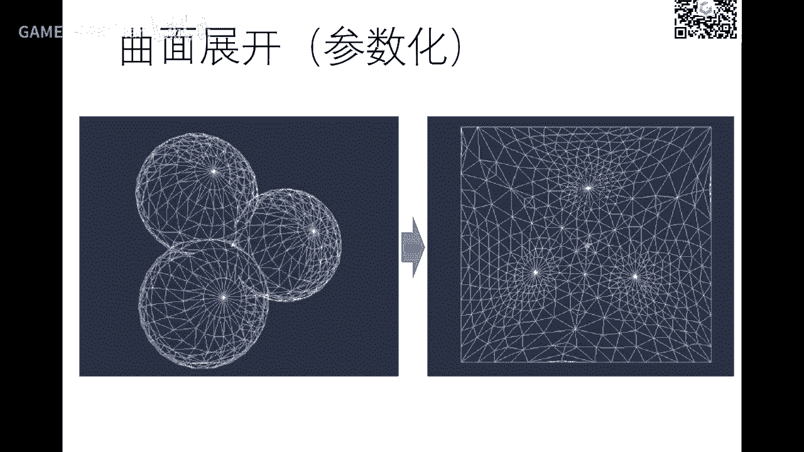

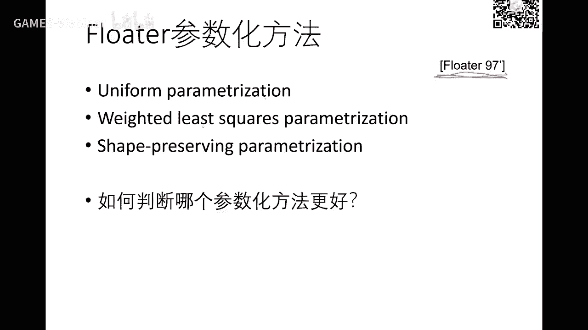

---

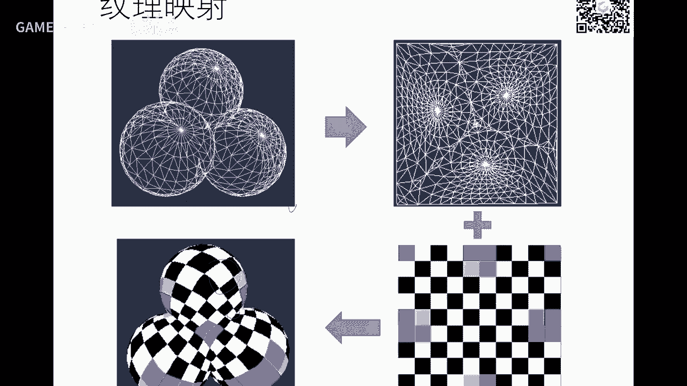

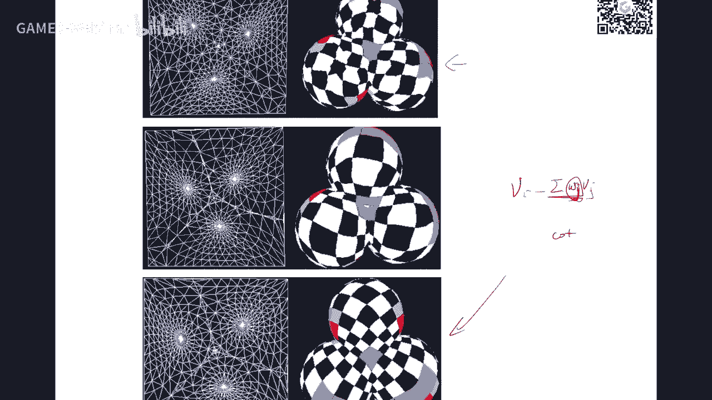

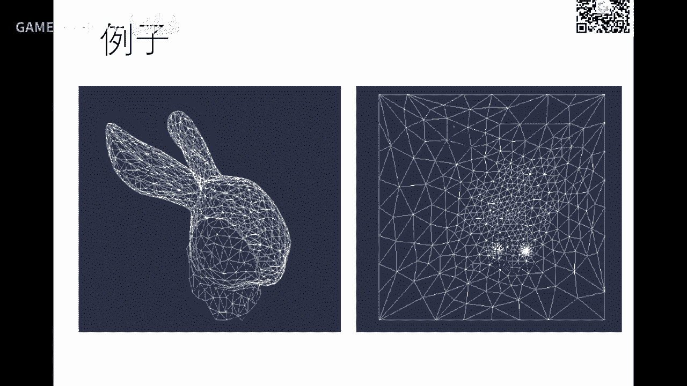

## 约束与网格编辑 ✏️

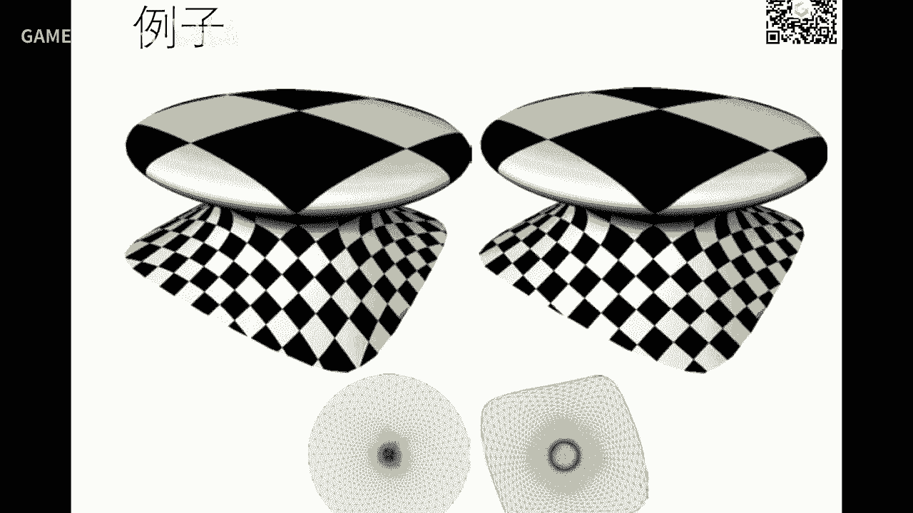

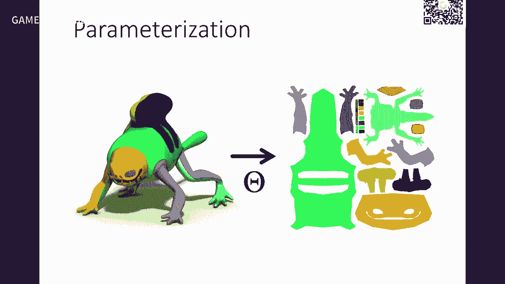

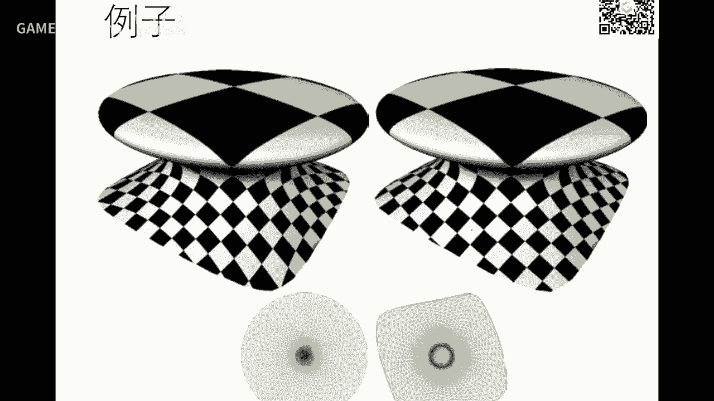

最后，我们探讨如何利用拉普拉斯坐标进行受约束的网格变形和编辑。

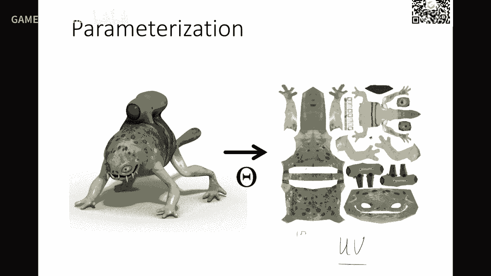

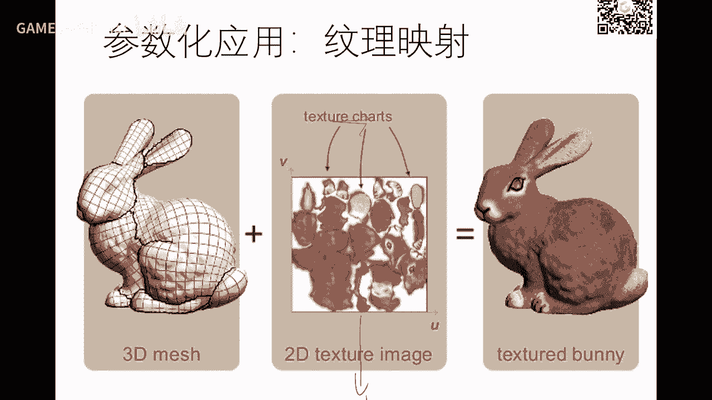

*   **硬约束与软约束**：在全局求解框架中，我们可以方便地加入约束。
    *   **硬约束**：某些顶点必须固定在指定位置。这通过将这些顶点的坐标从变量变为已知量（移到方程右侧）来实现。
    *   **软约束**：希望某些顶点尽量靠近但不必须到达指定位置。这通过将其作为最小二乘项加入目标函数来实现。

*   **网格编辑的应用**：例如，用户拖动模型上的一个点，希望模型其他部分随之自然变形。
    *   **核心思想**：在变形过程中，尽量保持每个顶点的**拉普拉斯坐标**（即局部细节）不变。但为了适应旋转，需要对拉普拉斯坐标的方向进行相应的旋转变换。
    *   **数学形式**：这通常转化为一个带约束的**最小二乘优化问题**，目标是最小化拉普拉斯坐标的变化，约束条件是用户指定的顶点位移。

---

## 总结与作业预告 📚

本节课中，我们一起学习了微分坐标（拉普拉斯坐标）这一核心概念。

*   **核心概念**：拉普拉斯坐标 **δ_i = v_i - Σ ω_{ij} v_j** 是顶点与其局部邻域平均的差，是局部几何细节的度量。
*   **关键应用**：
    1.  **网格光滑**：通过减小 δ_i 实现。
    2.  **参数化**：在二维平面上求解 L * U = B，将网格展开。
    3.  **网格编辑**：保持 δ_i 的变换，实现细节保持的变形。
*   **方法演进**：从**局部迭代**的直观方法，到构建**全局拉普拉斯矩阵**并求解线性方程组的稳健方法。

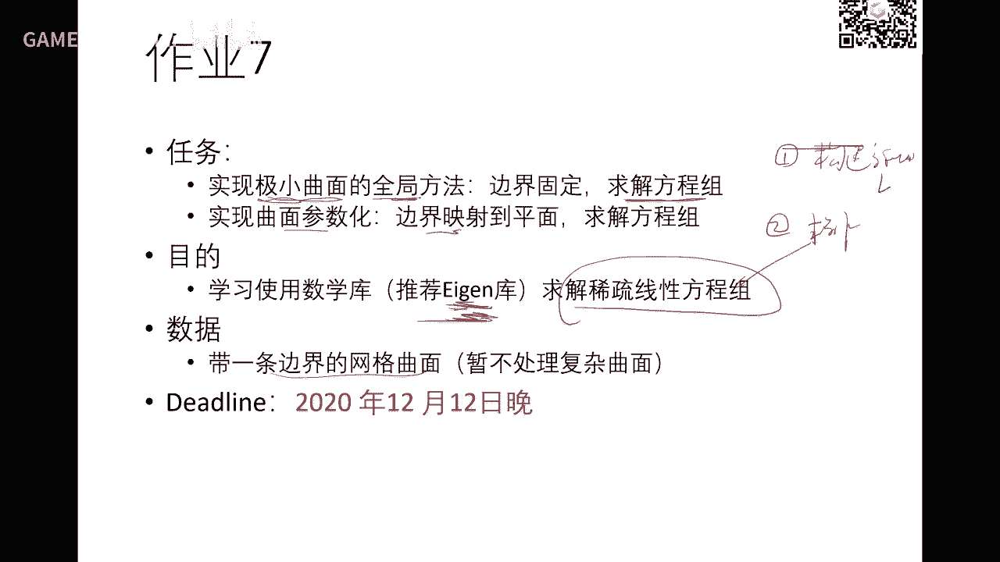

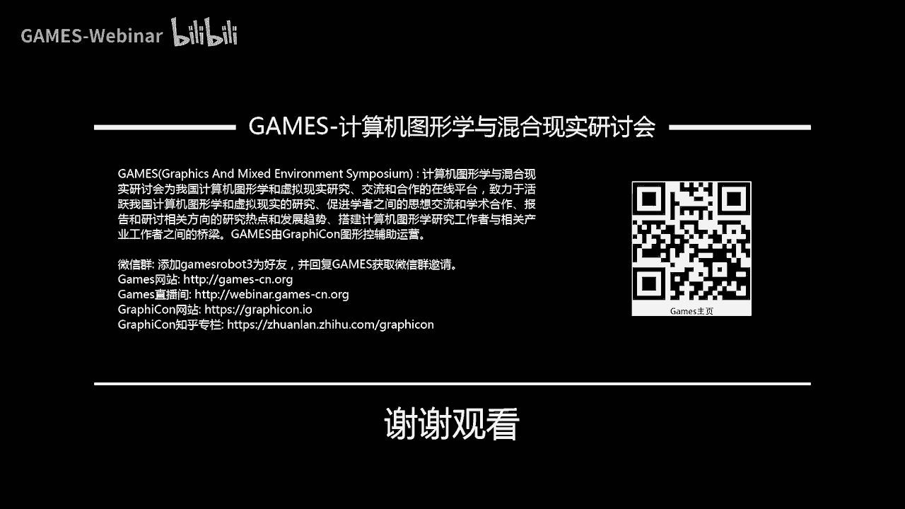

**作业七预告**：请使用全局求解方法（构建拉普拉斯矩阵并调用Eigen等库求解方程组）重新实现网格光滑化，并进一步将其扩展，实现简单的网格参数化。重点在于掌握稀疏矩阵的构建与线性方程组的求解。