# GAMES102：几何建模与处理 - P6：NURBS曲线 细分曲线 隐式曲线 NURBS曲面 - GAMES-Webinar - BV1NA411E7Yr

啊那个各位在线的同仁啊，同学们啊，啊晚上好，那么下面我们啊这个课也接近一半了啊，在前面五节课啊，我们啊学完了曲线的啊，函数的一些构造啊，那么今天呢会把los曲线曲面全部讲完，因为后面进度会加快啊。

因为前面那些东西你们如果理解好的话，这个主要是啊我更觉得应该受制于鱼啊，三点水的鱼里面的方法理解你们的本质，后面呢你们用的时候呢，可能还要去啊找相关的一些资料。

好那么上这个课之前我们讲一下那个这次作业是。

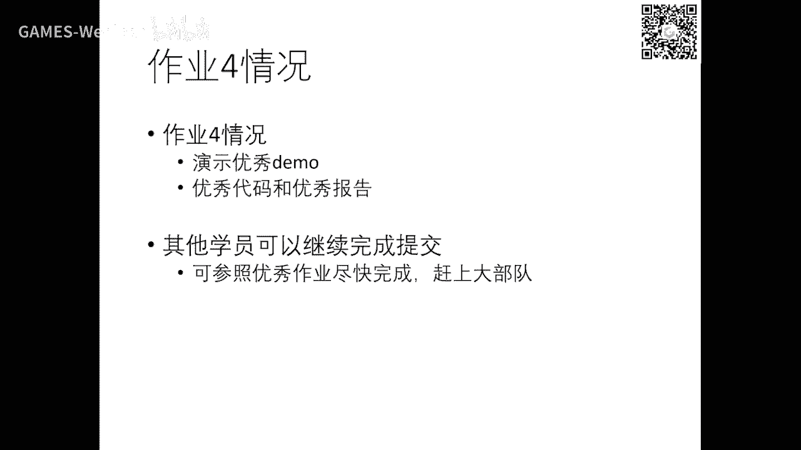

那么这是昨夜市呢。

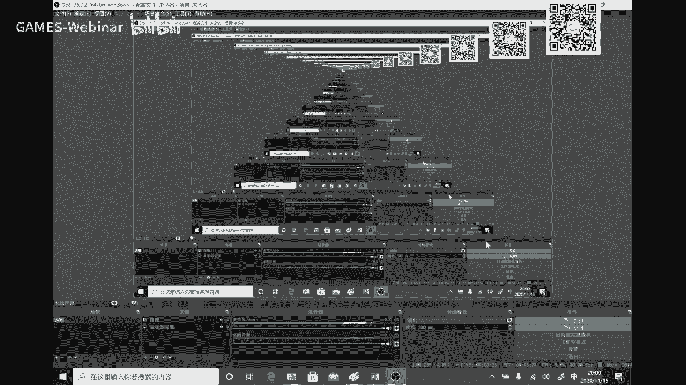

呃总共我们是留了两周时间啊。

好嘞这次可能相对来说比前几个作业要复杂一点，因为它这里涉及到那个啊求解方程组啊，特别是推导那个三转角啊，这个方程啊可能是有点难度啊，这次总体上30份不到一点啊，这个但是交叉的同学呢就做的还是挺不错的啊。

我这里演示几个。

那么这是几个呃，从同学们的报告里面拿出来啊，就是基本上交上同学们都能够完成啊，一个矢量的曲线编辑和那个设计工具啊。

总体上做的还是不错的，你可以看到啊，可以去调节曲线的一些节点。

还有它的切线啊，你可以是啊从全局求解三次样条，得到一个处处cr连续的，也可以是调节中间的某个节点啊，达到呃少一点的这个连续度啊，g一连续你可以看到切线的长度是不一样的，所以它是记忆，那甚至产生焦点啊。

c0 好。

这里我们挑了几个同学的啊，这个做的不错的，我们认为这个交互啊啊已经从理上设计的，还是可以成为一个其他这个工具的一个小小的功能了啊，已经达到实用的程度了，你可以看到这个这个交互手段与那个我们的嗯。

office里面不管是word还是pp point，整整一些工具里面的矢量交互啊，这个基本上功能都达到了，你可以编辑节点，它的它的切线是吧，改变它的光滑度啊，你也可以呃更改这个切线这个连续度是吧。

嗯好这是其中一个同学可以看到它这个交互还是蛮啊，操作起来还是达到了我们预期的效果好。

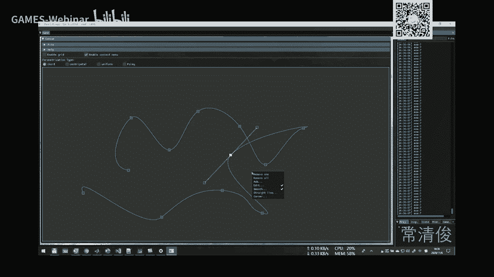

这是另外一个同学，这个大家也看一下嗯，界面有所不一样，但他做做着它能实时的叠加啊，不同的这个顶点啊，当然实时的拖动实时的交互，这些顶点以及它的位置啊，切线都可以啊。

你还可以支持继续增增加那些输入的点是吧啊，那我们跳一下啊，那么这里可以看到它也能够改变这个切线的连连续接啊，设计尖点，啊啊这个做到这个程度，基本上你这个工具就使用了啊，你可以作为一个插件啊。

放在你其其他程序里面啊。

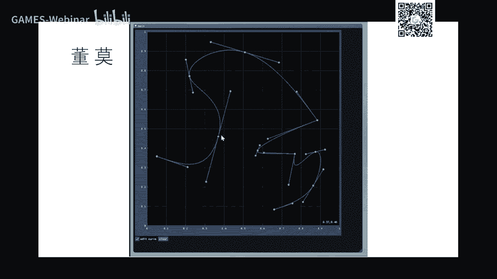

这个用户比较灵活的，能够涉及他所想要的啊，这里呢我们也看看一个其他同学的啊，这个呃我就跳一下哈哈可以看到他这里输入一个曲线以后，他就，这个大家想想这是两个兔两个耳朵，所以他这里想把它变变成一个尖点啊。

这个一个c0 连续的，那么这个耳朵这里呢它它它它也认为是看看它是改成啊，还还是保持光滑性c一啊，它它现在变成g一了，就是我从这边他希望这边稍微圆圆弧一点，圆滑一点啊，就把它切线拉长啊。

这个这个点变成g一点去了是吧，然后在交互兔子的这个这个脸部啊，就达到一个，当然这个如果对这个是真正的艺术家设计师，他如果呃绘画画的话，他用的工具可以很灵活，也是计非常不错的东西啊。

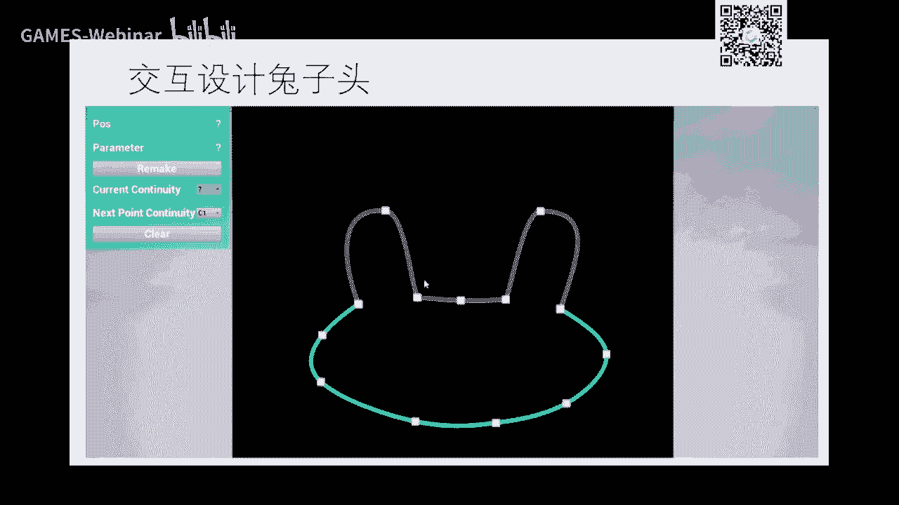

好大哥呃，这是部分的优秀同学的作业啊，这个报告，然后我们也会同样啊分享啊。

给同学们好，跟往常一样好，那么这是左眼呢啊举个例子还是不错的啊，好嘞。

好我们继续讲我们那个呃那不是好了，那个我们回顾一下我们花的前五节课，从拟合到后面的那个北北造曲线的一些概念，那么你这个曲线设计呢上次就是一个函数的一个呃，这个叫做向量形式是吧。

所以我们的以前构造rb f函数也好，各种函数下也是对每个控制定点叠加一个全函数，只不过rbf函数是叠加那个啊高斯g函数，然后幂函数呢是叠加幂函数是吧，所以从代数观点它是函数空间去找个函数是吧。

呃来以后我的数据，但是我从几何观点的话呢，我给你点，我怎么用函数去加强这些点啊，这是几何观点啊，这几个观点就给定一些点，我怎么样设计一些性质比较好的全函数，使得呢，这个点的构成曲线啊。

所以这个曲线的性质啊，很大程度上取决于这个g函数的选取啊，如果你选择幂函数，我们以前讲过是吧，它这个曲线跟顶点之间没有很明显的关系啊，这不直观，所以啊人们找到了崩散机啊。

就被热找到了本散机来设计这个曲线，当然我们以前讲过这本散机也不是他发明的是吧，就是数据上历史上就存在的，但是它用来把崩产机来设计这样的曲线，然后做来做交互啊，就达到了非常好的一个直观的应用。

这是它的这个成名啊，这个之处，那么北斋是个法国人，所以这个第二个e啊，我这里显示了啊，它是一个法文字母啊，就是应该带一个撇的啊，就是应该是个法文，所以啊但是我们这个用用英文字母的话，就这一撇就说不出来。

所以我这里指出一下啊，好那么后面我们会发现北周曲线用的g函数啊，在这个这个区间零一啊，如果是a b的话，可以规划到零一啊，所以它在零一选项上，每个键函数都在零一上面都是非零，所以它是个全局函数啊。

这虽然全局函数不是整个实数轴啊，但是在我们的定义域上，零一它是一个啊全局函数，所以呢北侧的曲线呢你动一个其其中一个顶点的曲线都要动啊，所以它没有很好的局部性，什么什么意思呢。

就每个点这个我是我上面放一个奇函数，就每每个点关于ut函数，这些函数呢只在它的那个地域的附近啊，就节点的附近才有定义，很远的地方呢，它就等于零，所以呢这个点跟全函数一组合呢。

所以就变成了一个局部可控的一个性质，这样的话很有利于设计师啊，我一段一段云状态设计，我那边设计好了以后，再设计另外一部分呢，这部分我就不会不会影响了啊，所以这样的话边条曲线在设计的时候啊。

达到更广泛的应用，上次作业式里面，你们刚才几个demo里面里面可以看到，你只要是一段一段的定义，这种曲线呢都具有这么好的性质，所以你可以看到啊，这个这个我讲的也比较快啊，就是主要是一个阶函数的构造。

在建函数呢这个每个顶点呢它有一个参数啊，这个这个参数叫节点向量啊，那么节点有了以后，那么就可以在节点上定义积函数，那么如果是不同接触它跨越的这个区间是不一样的，所以计函数每个线函数都可以这样去定。

定义好以后呢，主播这些顶点就构成一条光滑函数啊，光滑曲线好了，那么今天呢我们就继续要讲完这部分啊，其他部分，那么实际上是在这个过程中设计的时候，发现北热曲线呢它本质上是个多项式，x y都是多项式。

关于t的多项式，但是很奇怪，就是或者说大家很容易证明北侧曲线多项式啊，它是没法表达一个精确的语言，好像像这个有个例子是用了啊一个圆分成四部分，每部分是用用一个三次的去表达啊，同学们也可以可以很容易推导。

或者你定一个误差，然后呢呃选取最佳的这样一个四个混动顶点啊，因为手握这个比如说这个第一象限，这个是圆弧，手摸两个顶点肯定定了，那么这两个点点什么样是最佳呢，你可以去去定一个度量，好度量其中的啊。

不管是那个啊这个这个最大误差还是这个这个叫积分误差，那么就可以选取出两个好的，但是呢这个圆呢绝对不是一个精确的源圆弧，所以呢啊多项式曲线呢是没法表示圆弧，但是在工程中圆弧和直线是大量的被应用。

所以呢你不能给它圆弧的话，本周曲线这种形式也是会具有它的局限性，所以人们越来思考，怎么样让这曲线表达的这个类型更广泛一点，因为原是一个基本的在工程中啊，原来取啊这些这些这些几何体是吧。

所以它的局限性又发现了好，那么呢这个但是人们进步探索以后发现，这个实际上在我们重新学中也经常啊，实际上是学过啊，games 101的同学就知道我们可以重新投到屏幕空间，要做一个投影。

反正投影的话就是在图形学我们一个非常重要的一个呃，这个呃我们的学科的特点或发明吧，就就是啊发明了这个一个叫起始坐标，就是把这个坐标啊啊声声声音为，然后呢因为这声音为以后呢就是一个物体投到我。

我屏幕空间以后呢，它的这个这个点啊就形成这样一个关系啊，就形成这样一个向量关系上，其坐标带来好处，就是把那个呃旋转本身就是矩阵相乘，它把平移也变成了这个这个矩阵相乘啊。

所以使得我们这些钢琴变换平移压旋转呢，就统一用这个矩阵相乘就可以表达啊，那么投影变换的实际上是在投影几何里面是有很多研究啊，大人们发现诶我在一个平面上，在一个呃这个相机平面上形成一个圆。

但是它空间中的那条曲线啊，可以不是可以是一个多项式啊，这个但是投影过来以后呢，它可能是个圆啊，所以是因为投影要做个除法，所以呢你要足够分母才有可能达到这个这个表达精确原啊，所以这个就叫有理啊。

在数学上有理就是指带有分母的，就像像像像有理数一样的，有理数是两个整数相除啊，整数是不带分母的，分母是一，那么有理数是除以一个分啊，那个啊整数是吧，所以说带份分母的，所以呢这时候有点被这曲线就提出来了。

所以说我不在这个这个呃这个空间上去定义曲线，我在他高位空间去定义一下曲线，这曲线呢然后呢定完以后把它投影回来，你可以看到上面这个跟北侧是一模一样的，只不过呢这个中下面除了一个这个这个东西啊。

就出了一个这个这个分母，这分母我们再看一般形式，就是我们一般会带一个全好好，上面呢是呃这个这个就是传统的北辙，只只不过加了个群，然后呢把这个把这个全放下来，p i在上面，全在下面。

这时候呢这个点呢实际上是类似什么呢，类似于p i这里啊加了个一是吧，因为它再加个除法啊，所以呢呃就是如果我们把本产机跟这个p i这个北泽尔中间加个群，然后再把这个全跟这个g函数呢组合一把，放在分母。

这时候它就变成一个游离形式，因为它带分母的分母只不过是是个实数，因为w就是欧米伽是是是属于实数啊，啊这个一个实数好，那么这个形式怎怎么来看呢，你也可以看成这个样子。

pi呢才能承认上一个全形式还是跟一样的，只不过只不过这个全函数啊是一个有理性是全函数啊，以前只有只有这一块对吧，现在带了个弦除以这个规划，所以可以可以看到这个的和也就差点一啊。

因为我把上面的这个和把它加放到这儿来，所以它加起来一定等于一，所以呢你也可以把它看成是这个形式，我每个pi呢经过了另外一种特殊的权函数组合，一把就变成了有理曲线，只不过这个g函数呢是个有理形式。

是这样一个形式啊，这样就是这样，所以啊这里呢有一个特殊情况，就上面和下下面消掉啊，对那就等一以后呢，就这个就同等于一了，因为对这啊这个不散基函数是有权限等于，所以就退化成为北辙啊，这个北侧曲线。

所以呢如果全系数都等于这个有理，就是多项式的啊，当然如果不等于，那么我们改i是具有意义的啊，d e那么这个e呢就有可能让这种曲线呢啊就这种形式形式，曲线呢就表达更广泛的一类曲线。

那么这里是一个这个一个形象式的解释啊，就是我空间中的一条曲线是在三维中，然后我投影到一个平面上，这个这个城市的啊，那那么这个城市的呢就有可能是个圆锥曲线啊，那么这条曲线呢有可能是空间中的啊。

这个一条一条曲线，就这个曲线有可能是多相似的，是北侧表达，但是这条曲线呢啊有可能北辙表达不了，它有可能是个圆或圆圆锥，北辙曲线就表达不了，但是空间仍能表达，所以通过这种方式呢啊就把游历北侧的曲线。

这个这个这个类型啊，呃表达的范围就推广了啊，好那么这个圈引入一个全有的好处呢，实际上是这个就有啊，这个全啊，还是对这个曲线的这个形状会有影响啊，比如说这个全都等于一，它这个上就是被北侧曲线。

如果我两边的全啊，手握顶点的全大一点啊，中间是一或两边是十，那么这个曲线就会远离这样一个混多边形，相反如果我把全这个这个这个设置多大，那么这个曲线呢就很靠近空洞类型啊，这个呢是这个视野。

就是中间一个这个这个比较大就比较近，这个比较小就比较远一点啊，所以可以看到我还有另外一个形式，让这个权呢来控制这个曲线的形状啊，我圈越大，我曲线越接近我这个这个所对应的这个控制控制顶点好。

那么这个右边这个例子呢是把表示这个顶点在拖动啊，所以顶点在控制顶点在拖动时候，这个本身对曲线当然会有影响啊，这种是个毫无质疑是吧，你可以看到我点点不动我，我增加增加权。

那么那么曲线也会慢慢慢慢靠近这个顶点啊，所以大家这个直观上的几何意义还是比较明显的啊，大家看一下，就是引入权以后增加了它的一个啊这个曲线设计的一个变化啊，在80年代，90年代也有很多工作文章。

有很多很多做设计不同的这种参数放在那个奔驰产机里面，这样的话呢就让这个更多的这种控制因子啊，能够对曲线形状产生影响啊，那么我这里啊这个不讲，我这里只是提一下好，那么有里边的曲线的性质啊。

这个我不就不去展开，你是当你只要知道了北热曲的性质，这里其实基本上都有啊，线线也一样，切线是两个手握的边都是相切的啊，粗暴性也有啊，还有导出t j性，还有助读法都有，然后再回过这个投影空间来来做。

所以它的那个系数呢就是始终是在一个分母，所以表达稍微复杂一点，但它的性质是完全可以继承下来啊，就是基本上所有性质啊，呃大部分性质不能说所有啊，因为它毕竟占有分母，还有些性质是是保保证不了啊。

但是呢它同样也很直观，可以用来做设计啊，这就这啊，但是他的表达范围广一点是吧，至少这个北侧曲线是它的一个子集，因为有理曲线的全图等于一，就是北则曲线，所以它他表达的范围当然会更广一点啊，性质也保留了。

这些也非常好好，那么在这的话如果要去讲细的话呢，这个需要一点时间，那我这里就直接讲，就是啊如果要表达表达1/4圆，你这个全啊，你只要这个两个端点是一，中间设成二倍的根号二啊，这个就可以。

这个圆呢可以证明他是个精确的圆啊，没有任何误差，跟这个视频机缘完全吻合啊，所以用游离形式呢就可以表达，当然说你用三三那个三次的，可不可以一个两点点亮一点点，三个点点，四个点点是吧，啊这样这样可以表达吗。

也可以表达这个这个有全的，我记得是好像根号三啊，这个一根号三一啊，那么那么这个同样也可以表达近期的言，当然你用45次可不可以都可以啊，没问题，那么关于游里北侧曲线的一些这种推导，我这里就不详细讲。

大家清楚这个他的motivation是什么啊对吧，就是为了表达更广泛的这种曲线，特别是圆圆锥曲线和圆曲线，椭圆呢，还有抛物线啊，就是多项式是呃比较难搞的，那么这些有理曲线呢就可以很好地表达这种比较啊。

这个规则的曲线好好有理，就是这个概念啊，那我就不展开了啊，就讲完了好，那么下面就进行到这个最终大家经常听说的lp啊，那到底是啥啊，nb是这几个词的缩写啊，neu是non uniform，叫非均匀嗯。

r就是rational有理啊，b s就是be spring啊，这个大这个大家大家都说了啊，好rational也熟了，好，让uniform什么意思，就是说还记得吗，就是我们当时定义这个记函数的时候呢。

我们是有均匀节点对吧，真的是每一个p i这个对应参数是等等距的，这叫等距节点，如果这个节点是非均匀的啊，这个这个有宽有细，甚至还还有重合啊，这个如果这个节点有重合它的它的连续性就会就会就会减少是吧。

就如果重合的多一点，甚至可以产生c0 的间点等等好，be fine被basis是吧，所以这个节点如果是非均匀的话，就表达了所有的比较一般的这种样条形式，所以这个叫非均匀啊，所以非均匀是指节点向量非均匀。

它节点向量影响g函数，所以g函数呢还有带一个有理，所以你可以看到它的形式是用一模一样啊，这是第二条g啊，这个这个g函数呢可能是定义在这个非均匀有理节点向量上面是吧，每个pi嗯对应的这一个参数啊。

这个是均匀参数化呢还是均匀啊，这个等聚餐的话，还是这个服装上的话，这个由于参数化来决定的好，我们改i就是这个全啊，这个就是pi啊，所以这个形式是一模一样的啊，pi然后这里有一条曲线啊。

好不一定是不用上影机啊，rational搞明白了，rational只是指是指他有理啊，好了，所以我把这个干把这个定义应提出，大家也能基本上你明白了，所以关键点你还是要理解北这边央调的这个奶油啊，有理智。

不过多少分母啊，让他表达更广，这个这个这个更多范围的这样一些控制啊，好那么那不是这个曲线，我们在最后总结啊啊所以你有可能不是曲线影响这个曲线，这个有很多因素啊，第一个控制控制顶点啊。

用用户基本上都是通过交互控制顶点来设计曲线，是第二个节点向量，引体向量就是每个顶点点沙朵朵对应的参数啊，这个参数呢可以由啊这个参数化啊，这个怎么参数有很多是吧来决定，所以说p4 上面组合一个阶函数。

这g函数是定义定义在这个节点上面的啊，只不过它跨度呢可能是跨度了相邻的一些节点，那么节点之外呢它都等于零啊，所以p5 呢可能是定义在这个上面的对吧，那么这个节点呢是在这里是非零啊。

你可以看到每个节点上面还是有一个阶函数跟它组合，它是局部的啊，所以从这些性质可以推出来，你在哪个区间上面哪些计算数是沸点，可以反推啊，这个是要稍微稍微要一点点小小的这种呃，这个细心的推导就可以了啊。

当时我们学的时候还是比较熟的好，所以这个东西你不用说话没关系，但你要理解他的这个这个这个啊这个来由啊，像国产机什么国产是什么，是整个区间它都是非零啊，这就不一样，所以节点向量定义了基函数的局部性啊。

或者叫奇函数，那么全呢也影响了这个形状啊，就是那个欧米伽啊，那么它可以表达更多的圆锥曲线等等，也是具有很好的几何几何性突破性啊啊什么啊，如果你两边都有重点的话，就有端点差值性啊，相切啊，还有变差缩减好。

变速缩减，我以前可能没有特异体，那么变差衰减性是什么呢，变差缩减性是指那么一条曲线啊，如果一个直线与这个曲线进行相交啊，利用这个性质啊，人们就可以什么啊，就可以知道这个这个直线跟曲线有没有交点。

因为什么它不会多余，所以这个叫叫变差缩减性好，那么这个性质用来做曲线的求交是非常重要的，而曲线除胶是一个极其重要的一个东西，是所有cad系统里面的一个非常核心的一个部件是吧，你这不操作。

还有这个曲线在这个胶啊啊前面的胶等等啊，好所以那么可以看到刚才在这个所谓卓越里面，同学们也引用了这个nb曲线或者是分段的北辙啊，这虽然不是有理的，但没关系啊，有理只不过可以表达圆弧而已是吧。

那么在在看的demo里面，同学们可能不一定是表达圆弧啊，注册耳朵呀一个曲线是吧，所以设计师啊以不同的美工，可以利用这些工具就可以去设计这种图案啊，这个图案呢啊分段光滑，分段不光滑都有啊。

你可以看到这里就有点点是吧，这这这这c0 也是机灵是吧，所以其他地方都是比较比较比较比较光滑，所以在那个很多工具里面啊，但是novs可能那个是曲面啊，前面我们等一下会会稍微解释一下。

那么在如果俄罗斯曲线的情况下呢，就里面有三个因素大家都可以考虑啊，你可控制点点，这个是很直观的一个节点向量，接下来很多一些美工呢可能对于这个原理不懂的话呢，它基本上就会缺人使用较均匀节点啊。

所以实际上是均匀节点是大家就说你不用去管什么节点，不节点你就均匀啊，这这样啊，实际上就是什么就失去了有理啊，就不要表表示圆啊啊，所以呢这个这里面有很多控制手段呢，大家如果懂这个原理呢。

以后不妨自己可以去调一调试一下，可以设计的更好好，那么这是一些其他的一些这个例子啊，我这里就不去展开，可以可以看到你可以通过控制节点的这个这个这个叫做重塑，你看减减重数不一样的时候呢，这个基函数本身啊。

这下面这一行是g函数啊，本身就可以产产生一个节点，计函数本身就不连续，向左边的话计算数全是全是光滑的，这个是不光滑啊，你看到这两个基函数是不光滑，就不光滑的，就可以查在在这里产生两个尖点。

所以呢你可以看到这个我可以通过节点啊，以及控制零点呢可以来控制这个曲线，在不同的地方有不同的连续性和光滑性，好好，那么是曲线为什么很重要，就是它是所有的c d7 系统啊。

当前啊至少人类当前的所有的工业这个cd里面的一个工业标准，就是你无论是什么cd啊，你可以看到工业设计里面有有out cad啊，啊sally walks啊，这个是打锁的啊，还有ryo啊。

ryo叫犀牛里面的number工具啊，基本上都是这个nb为这个底层的表达啊，所以所以它是成为一个工业标准啊，那么在历史上起了好多好多标准标准这个数据格式标准，所以大家追求这种标准的话。

不同的这个cd系统呢它的数据就可以相互交换啊，我的数据比如说导是oto oto cat出来的工具啊，成为标准以后呢，那你会找到另外一个工具啊，这个这个工具是吧，历史上有什么step工具啊，标准啊。

怎么整体标准啊等等，还有a s s这种标准啊，那么我这里也不去啊，这个详细展开啊，如果大家有兴趣可以去看一看啊，不同的这个协会啊，有共同的这样的数据交换的过程，你可以看到右边这个图里面是七艘船啊。

这里面的这个曲线啊，大量的这种这种nos啊，这个呃是统统一的一个nb啊，就表达，所以你的数据格式呢就是用nbs格式表达好，所以它一个是表达式标准，第二个是交换式标准啊，你没有标准。

那么你这里设计的曲线你就找不到另外一个系统，这个就就你这又得重新设一遍，这是这是这是这是啊，很不方便的是吧，好还有在一些动画设计里面也有很多，那不是这个这个影子啊，max和maya都有啊。

大家很容易去找到这些工具啊。

好了，那么这个是呃这个这个那不是我就讲完了好。

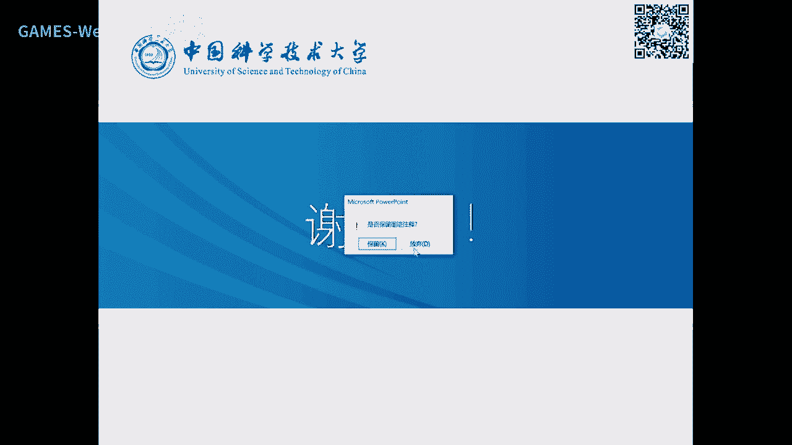

下面一个主题好。

叫细分曲线细分我我也相信同学们可能会有一些偏说过啊。

这也是一种在啊实践中产生了一种这个呃，曲线形式或者曲线构造方法啊，设计方法，那么大家回忆一下北京曲线的那个作图啊，大家有没有还记得啊，我用decastle的算法作图，我这样四个空分值零点啊，我这样呃。

比如说我要求中间t等于1/2这个点的值啊，那我可以12/2分之一，然后一条线就一条直线是一条直线啊，你这些也只是1/2啊，那1/2，那么中间再取1/2就达到了这个点啊。

可以可以判定这个点就一定是曲线上的点是吧，如果你是想取1/3的话，就基本11/3比二一比二好好，一比二，每一段都是一比二，那么就得到1/3是吧，这就是做出几个e非常非常直观。

好这个做出方法大家从另外一个角度上看诶，我可不可以认为这样我给定一个多边形，就像一块这个这个这个比如说是这个啊，嗯一块石头是吧，然后呢我用刀这一刀把这部分把它切切掉，那么这一刀把这部分切掉。

是不是就剩下这个啊，那我再把再把这部分切掉，是不是就剩下的就是里面这一层是吧，我每一招的话，对这个多边形呢都是进行一个什么进行一个割脚，勾脚过程中，就越来越什么越来越光滑了，好你在这个情况下。

你你再去切，因为这里是左边是一段北侧，右边是左边，这是不是可以同样去用，所以呢我又可以切，所以说诶是不是有点像用刀啊去去磨光一个粗糙的一个初始的形状，对吧，我们啊这个这个比如说去去打磨一个什么。

要把它光滑，也是用刀慢慢慢磨是吧，所以这种方法呢哎启发的人们呢去构造与其他方式的构造曲线方法，我拿一个粗糙的多边形，我不断的去切切角磨光诶，慢慢慢慢无穷以后呢，就可以得到一个光滑的曲线。

所以这个啊就是叫叫割脚法，在80年代啊，发生了很多这个事呢，就是一个雕刻的过程是吧，一块石头很那个一块这个很粗的石头，那我不断地通过工具，工匠啊，通过工具把这个多余的部分，把它把它啊这个这个这个刨掉啊。

那么剩下的东西呢就是这个教授课是吧，所以啊在在教科界有一句哲学性的话，对吧啊就是啊这个实际上这个雕塑课啊本来就在那石头你手里面啊，我只是把它多余的边边角角去掉而已是吧。

这当然是一个比较哲学性的一个一个又表达了是吧，但是呢你怎么知道去掉哪些这个的能力，这个是不容易的是吧，所以台上一分钟，台下10年功啊，所以你要你要知道爆掉脸先，你这个是不知道你要去你要去有艺术修养。

要不断积累练的是吧，好那我来做个比方，就是我要不断去磨掉这些不必要的东西，就剩下这个曲线对吧，当然你无穷无穷次的模式以后，这个曲线就会越来越光滑啊，这就是这个叫魔光法。

这个这个比值几何几何直观很强的一种方法，构造好，那我们把这个问题提提出来好，假设给定一个多边形，那么我要设计一个光滑曲线对吧，我现在不想用这崩闪机这种光滑啊，这个基函数形式我能不能通过磨光的这个操作。

我一步步切，一步步切，把它若干步以后呢，这个曲线就得得到了是吧好那么这个就是一个主角法，当时啊也叫魔光法的一个当时的驱动好，我通过一个啊这个都通过一个给定的这样一个正方形，我不能去啊。

切刀切刀就剩下的这两条是吧，这边眼睛不断切啊，注意这个这个剩下的第二步呢，我又又去切，慢慢切以后呢，这个这个密足够的密以后，那么这个形状就出来了啊，就当然可以啊。

这个一个好的磨光者这个算法你要证明它无穷期以后，切它最后的这个光滑的极限曲线啊，就极限曲线一定是一个数学表达的光滑函数，那么这样这个方法呢就比较可靠啊，这个是数学上的一些保保证好，那我们看一个例子好。

那么这个这个这个例子之前呢，我们要要要把这个目光方法呃，我们也叫细分方法，也叫个小方法哈，n v他们就是不断的去把点点加密加密加密啊，但是这里呢有两个要点，你们掌握第一个呢叫top规则。

就是怎么去加点啊，第二个几何规则，这个点加到哪啊，就是这个是在在哪家，这是加到哪，把这两个搞明白，你这个细分方法就确定了啊，那么加减以后呢，是不是会把这个多边形变成更密了，所以说组成一个新动微型。

这个叫叫split那个split啊，那么如果是加拿大，那么就是加上什么，加上你把这个这个顶点的坐标给算算出来，往往一个好的方法，顶点的坐标是原来的老坐标的一个线性组合，那么这样的话就比较快啊。

好那么如果对于结果来看呢，也有b进型和差值性两种，后面我们再来介绍好，所以这个过程有两种，一个是加上哪在哪加啊，把这两个问题啊在哪加呢，最好是线线性运算快啊，加上了这个就加密啊，就是不断的增加。

增加这个顶点好，那我们来看一下这个大概在70年代啊，啊这个上次最早是40年代就有了，就是194几年也是想，只不过呢呃呃这个呃checking呢就是蔡京他把它用到的设计里面。

70年代才用到了我们这个领域好这个方法不难啊，这种方法一解释大家都很明白啊，就是嗯黑的这四个顶点是初始的正方形，我先加一下，给你来加在每个边的中点啊，这是这是加拿大已经确定了是吧。

然后呢我再怎怎怎怎怎么加呢，我每个点都朝他的左这个这个这条边去移动，你用到这这个点移到这了，你可以把它认为割了那个角是吧，你也可以把它认为割那个角一个就构成了这个图了是吧，好从这个出发。

再按我刚才的两个规则加到哪啊，首先是终点，然后在每个点在移动是吧，这就割掉割掉割掉啊，就就变成这个样子啊，你可以看到我们才割了两次，你这个方法你看j4 顶点增加一倍，根增加四倍，这个三次增加啊。

这个这个4x4x28倍对吧，所以它是它是二的n次方的一点点增加，一般哥哥556次以后，这个顶点就非常非常多了，因为它是二的n次方倍数在增长啊，所以基本上细分个几次就很光滑了。

因为光滑的意思是说它这个顶点足够密了嘛，啊左边这个是一个例子啊，可以看到是红色的顶点不能割啊，所以他这个做的方法是非常非常简单啊，这是最呃这个最早的一种，那么很有意思的啊，就这种歌法呢。

这个可以证明可以证明啊，它的极限是一定是收敛的，并且收缩练级曲线呢就是由这个初始多边形所决定的量，所以这个这个理论上是可以被证明的，格格角法的一个实践啊，那么这里是重复了啊，那么每次增加一个点。

然后呢这个点是它的呃，呃在哪啊，这这个是一比三啊，那是三三比一，就是1/4是三嘛是吧，然后呢然后再再取个这个啊，这这叫新编点是吧，新编点以后，然后在这个刚才我的过程已经讲完了哈。

好所以可以看到一个数字变形，那不断割一次，割一个角，那么割两次割三次啊，就很密了是吧，然后那么最后这个可以得到这个这个当然是要证明你不能落眼看啊，我我不光滑了，所以他是c无穷，不是啊，这个是可以证明的。

并且呢它几乎处处c无穷，所以它是一个非常非常光滑的曲线，只有在哪些地方在节点处，就是这里节点二次的话应该是在这个中中点附近啊，这里几个点是只有c一啊，所以他只有在这么少数几个点啊，就节点数是c1 。

光滑性不是那么好，所以它顶多找到c1 ，所以跟理论上也吻合了啊，这就是一个非常简单的一个细分好，那同样你刚才说我二次有了三次，有没有同样的，当然有了啊，我就直接讲了啊，首先边分裂成两条新边。

就在虚线是原原始的多边形，那我这里增加两个新号，然后呢啊边分成成两个新编，然后每个点重新算它的位置，这个点要移动到这来啊，每个点都要移动过去啊，具体移动的这是什么方法呢，大家看一下啊。

这个方法看看几个亿，大家能不能找得到啊，v2 i一撇就是这个点给它更新到这个位置，就是要根据它它的它的这个顶点坐标是是v i减一，v i v i加一是这三点是原来的老的三个点的一个加权。

就是这个点的左0。六零点，这三个加权一个是1/8，38/4分之一啊，那这样看呢，你可能看不看不出那个那个味味道来啊，你可以可以这样看啊，这两个连连线中点就是它的两个的一半对吧。

这一半跟他跟跟这个点进行一个连连线啊，这里有个比啊，就就在这啊，具体比例大家可以很容易推导，那么这个这个新的边界的坐标呢很简单，就是取中点啊，所以它的规则就这么简单啊，然后由这个十的多边形。

你再去按它的规则啊，每个边点加一个，然后然后这个点再移动，再再再往里移动是吧，那么就形成了更密的一个多边形了，好好那么就慢慢慢慢把它磨光了啊，好那么这个就是军训三次啊。

当然啊你人们在实践过程中还啊发明了n多的很多很多这种细分规则，我就不一一讲，大家清楚它的来源是什么啊，好那你要去证明这个刚才有个结论是吧，知道这个极限曲线是什么，它的光滑性是什么。

那么那么怎么样才能做到他的极限曲线的性质呢，这里提一下思路，大家去看文献的时候呢也能看得懂啊，他思路是什么呢，你可以看到每次分割的时候呢，它都是相邻的几个点的组合，那那么那么这个点呢又是这几个点的组合。

那最后呢这个点呢又是这个越来越组合啊，但是你可以看到极限点的时候呢，这个点这三个是相关，而这三个呢又跟这三个相关，所以它的这个相关简单，实际上是应该是一个大范围的几个点的这个相关性对吧。

那么你因为这个分割只是一个构造方法，所以你怎么去知道它的性质呢，所以呢这里面就要把它数学化啊什么，所以很简单就是什么用用矩阵形式，它多是一些新的组合，所以你把这个系数啊拿过来写成一个矩阵形式。

这个是l就老的这一层的顶点是新的内存的景点啊，这是增加了一倍嘛，2n是吧，所以它的矩阵是2n乘n这样这样一个，那么你再把它展开啊，那所以是变成一个2x2 n，所以极限曲线。

比如说刚才那个checking那个积分就会表达这样的形式，所以所以你这个这个点产生的新点，怎么又是乘这个矩阵，乘矩阵吧，有时候不断乘，所以呢可以马上就出来无穷这个极限制的去点了。

是原来这些点乘上这个这个叫西门矩阵的k次方啊，乘一次就表达一个星星点，再乘一次又表达系列心点，所以它的极限就是就是当这个k趋向于无穷是吧，好达到这个数字以后，大家就很容易去找你要这个式子收敛。

是不是要一个矩阵的k次方要收敛是吧，大家学过高大一的线性代数，就知道一个矩阵的k次方怎么算呀，啊我觉得大家大一是不是老是出乎一个啊这个题目啊，让让你算它的100次方是吧。

100方100方方就是100个矩阵相乘嘛，对不对，你这样是一个课程，当然是肯定是不是科学方法嘛是吧好，那么这里就要用到了代数知识哈，基本上要去做一个这个这个叫对对角分分解，啊那么p和频率是相似矩阵啊。

这个是这个叫三角化，就m就变成p一个对角正乘以p e好，那么m的k次方好不断相乘和p e这里再强成个p就抵消掉了，所以说是p中间那个矩阵的k次方的pv啊，所以所以你就要把它做三角化。

才适合于做这个矩阵矩阵的这个这个幂是吧，那么就决决决决定了这个对角线的这个元素的k k次方，如果你要他收敛，是不是这个对角线这个值不能大于一啊，大于它就喷一下子爆炸了嘛是吧，所以取出来。

而这个最小线的值呢就是这个矩阵的特征根很容易推出来，如果你让他收敛这个矩阵的这个蹭蹭根的最大值不能超过一啊，这那他最大值肯定是一嘛啊，所以结论就可以推出来，你只要这个矩阵这最少正根根啊，这个这个是一。

其他的是小一就会啊，所以你要构造一个好的规则，细分曲线的这个形式，你必须要保证它的这个细分矩阵的特征根不能大于一，大于一的话就会发散，就是这个这个曲线就越来越不知道是什么什么情况啊。

就是可能是随机的一个非常爆炸一样的形式，好这个大家思路清楚啊，就大家知道你要去研究细分曲线的一个极限曲线的性质，就是研究它的细分矩阵的特征，根的性质好，那么具体的这个很多细分规则的推导证明。

都都在围绕着这个这个这个根本性质证明啊，那么你这个在早年很多文章一个小小的这个改变诶，我要去证明他的这个芯片取证啊，这个政治根不大于我的方法就收敛了啊，所以就几篇文章就一个小的创新啊，这种文章蛮多的啊。

我就不去展开，你们去看到这个文章，所以就知道这个文章在卖卖什么是吧，可能在卖它的一个细分细分格式，格子卖了就完，完了以后呢还要证明它要收敛，所以这也要证明一下，这样的话两个贡献就够了。

所以早年的一些文章蛮多的好，还是比这个23次也好，都是b进行，它不经过那些原始景点，那么这里呢我介绍一种啊比较有名的啊，就是一叫做差值型细分，就是啊差细分什么意思呢，我要差值原来的多边形是不是是桌边形。

原来的这个顶点是不能动的是吧，是在我最后的极限曲面里面是吧，所以这这种差值型呢基本上有一个原则，就是圆的顶点不动啊，只是不断增加不断增加好，那么这个这个我把这个过程稍微解释一下啊，这是原始的一个多边形。

中间呢每条边呢就加一个新的啊，这些带红圈圈的就是新的对吧，然后呢这个红圈圈的位置是在哪，等下我来解释啊，然后然后增加完以后呢，位置可能是要重新计算，不再不能在边上了，是不是就还是原来这个直直线了是吧。

不能变光滑是吧，好那不断加不断加不断加好，可以看到好，你可以看到这个就点没有，它往往外窄了一点点啊，那么这个极限曲线如果你构造的好的话，它的曲线也是光滑的，也能达到很好的光滑性。

那么这个基本格式就非常好啊，这就是80年代上世纪80年代提出一个叫叫呃呃四点差值细分啊，那么这个细分呢你可以看到不是割咬人，原来角他什么他补这么一块，这就补这么一块，这里补补这么一块啊。

有可能这一块面积440什么，他不是割掉原来的东西，它什么它往这个雕塑石头上面去贴贴个泥巴啊，所以我们以这个执行呢也可以叫做补交法，它不是割脚，它是补角，把它补上去，就是越那就月光滑啊。

所以可以可以可以可以啊这样去理解，所以你可以看到运行是割角x字型的啊，是补角啊，那么我们介绍一种198987年的啊，那时候在90年代研究的很火啊，这个一种差值性的，它方法也很简单啊，他怎么样呢。

我我中间选选啊，那个啊这个相邻时段我我来我来讨论中这个点位置变到哪啊，是比较好啊，他们按规则比较简单啊，一这个取相邻的pi减一跟pi加二啊，那么取中点。

他认为他这个点呢就往往这个这个中点进去跟这个中点的一个延长线，这里取一点，就这样补一点，补一点以后呢，诶就这个橙色在这两条边就替代这条边，不就每条边都可以这样搞嘛是吧，当然手握两点，如果他非封闭的话。

处理一下啊，总有办法啊，这个我不讲好，那么这样的话就增加了一条边啊，就增增加了一倍点是吧，然后再不断的去去做他的公司很简单啊，就是这个这个这个终点沿着这个方向这个方向这个是啊。

就就就这个这个这个是这个点对吧啊，这两个是这个点是吧，那么那么那么这个点呢是是是这个中点好，就是这个减这个就是这个方向向量是吧，它的阿尔法贝就是中间，这这个是他的阿法贝，然后从中间往外偏啊。

所以他公司很容易记是吧，所以你第一个细分要记记它的几何意义，你就很容易记住啊，但这个是我90年代读硕士的时候就知道的游戏分啊，虽然很长时间没有用，我还是能很好的写出来好。

并且我还记住了这个阿法值人随便取吗，不忍啊，你法值，当时这个文章的结论是，阿尔法是大概是0~8分之一还是1/16哦，我也忘掉了好，这时候呢证明这个极限曲线是光滑的，如果超过这个1/8。

这个曲线就不是不就不收敛了，它就会啊这个这个变得非常难预测啊，就就很随机，像分形曲线一样的啊，好好，那么这个是几个例子，你可以看到啊，输输入的是红色的几个顶点啊，多边形，然后呢增加一倍啊。

这这里再再增增加两个新点是吧，然后不断增加最后一个这个曲线啊，你可以看到它都在多边形外面补了一些三角形啊，所以是是叫补那个角是吧，你可以把它这样形象的这样的去去理解好，那么这是另外一个例子啊。

大家看一看啊，有个直观的，你可以看到，如果我要插足这些多边形，我可以这样不断的去去细分构造对吧，所以你们昨夜四中你们辛辛苦苦求了个这个叫什么啊，这个这个这个三转角是吧，方程组才得到一条曲线。

我自己轻松的就构造出来了对吧，所以这个实现很简单啊，这不就是不断递归，你就可以求出这个曲线出来啊，好那么这里面呢是理论上我也我也说一下啊，就是这个阿法值啊，呃在在在一定范围之内呢，它是能证明是光滑的啊。

要不然就就非光滑生成了一些分形曲线啊，因为你偏偏离的太远，那么那么那么这这个下一步呢它它就未必能够透，现在有多边形，它会远离了啊，所以这个啊这个啊这个词不能随便取，那么这个证明的话也是通过啊。

类似于刚才说的，把这个细分格式拿来，你去证明它的这个特征根不能大于一啊，所以真的跟不上晕，就就可以推出来阿尔法的范围是这样一个思路啊，这个我就不详细展开了，那么可以看到这个啊，这这这这就是分形的啊。

这个阿尔法已经大于1/800了啊，这个就看到这个形状就非常非常非常古怪啊，就就像这个就比较比较光滑，这个可能阿尔法小于1/8了是吧，其他的曲线呢你可以看到做和分型的状态好。

那么分型我不知道同学们有没有听过这个词啊，分型啊，分型的就是它的形状呢有点像啊，随机数是吧，就是这叫这也叫分数为的几何分数为的几何图形，分析是研究分数位的好大很奇怪，为数不就一维二维，三维。

四维正整数为吗，怎么还有分数为啊，确实在这个数学上可以定义这种1。67维的曲线是什么样子啊，这个要用到这个分析理论，这分析来源于什么呢，来源于这个大概在上个世纪四。

我今年在有一个英国的科学家对这个海岸线，他要问英国的是个岛嘛是吧，英国的航线到底有多长，这个问题提出来啊，就觉得哎呀不就是量一量就行了吗，你换后来发现不对啊，发现差别非常大，为什么。

因为它的它的海岸线边界啊，看到没有，只是这样杂乱无章的，为什么你可能1年凉了，难得这么长，还有好多多这个长度被你忽略掉了是吧，误差差别极大，是差别有好几倍甚至几十倍的这个效果，为什么。

那你因为这里有好的好的细节，你如果这样量的话，长度可以变变成非常非常长啊，所以后面就产生了这样一个分形几何的一个学科啊，就是我们去研究就是这个排线呢它也不是光滑，光滑曲线，它是个非常杂乱无章的啊。

这样就形状啊，那么我们这课也不去讲分析几何，提一下这个这个词啊，因为既然这个试点法产真的分形曲线这类似的情况，那我这里提一下啊，这门这门课呢啊以前也是一门专门的课去讲的哈，那我我就提一下啊。

那我在研究生的时候就学过，所以它里面啊这是里面一个基本的东西叫ipad，要自迭代函数系统，就一个函数不断去迭代，不断迭代就可以产生这种分型的这个效果啊。

嗯那个如果还有木木啊啊这个给产生非常漂亮的这些图形，而自然界上这海线啊，还有山脉的轮廓啊等等，都有点像分型的这样一个曲线的形态好，那么刚才是四点法呃，实际上是呃就是刚开始介绍的那个呃方法是两点差值。

刚才我们也介绍了四点差值啊，四点差值这里阿尔法就把它固定成了12/8啊，好还有当然你说我为了创新，我是产生用相邻点的呃，六点去差值可不可以构造，可没问题啊，你只要保证一个基本矩阵啊。

这个这个这个特征根小于一，你就可以做到啊，八点超市可不可以，当然可以，这个就b没没没多大意义，就是你点太多，它的那个比较大是吧，它的局部性就不好是吧，所以常用的就是四四点比较好啊，质检是最有名的啊。

87年这个定的发明的，所以这个啊这种上传法，我要去藏在另外的差的细分方法，可不可以也可以，所以当研究细分啊，这个领域的人呢就是不断的去找各种各样的构造方法啊，然后去证明这个方法是收敛的。

你这方法具有创新性，你要直观，你同样也也要有好的性质，才会才会被啊能不能接受，要不然你这个只是为了呃去去去去创造差值细分啊，那就和细分规则去去去去做文章，肯定没有多少意义好。

那么呃这个除了这个刚才说的那些线性细分，还有一些人在研究非线性细分啊，像这我就简单讨论一下，就是两个点之间，我中间要插一个点，我怎么插，我我用一个双圆弧，我这个圆弧加这个圆弧啊，就是两个都是圆弧。

只不过半径不一样，那么就是可以唯一的求着中间的一个一个交，那么这个圆弧怎么构造，半径怎么都是单定系数，但是我一定可以达到一个这个叫做这个这个光滑性啊，这个至少加二连续两个圆在这里建牢。

并且向切线要一样好，那么这样的话一个多边形完完了以后，我每每个每个每个边都构造一个这样这样的啊，这个圆弧去去找这个，那么这个点显然就不是我这些点的信息组合呢，它是一个非常非线性的一个啊。

这个要解方程的啊，甚至要解决一个优化的问题啊，所以但这样也是一个啊构造方法，所以啊那么从线性细分到非线细分也有不同的这个方法啊，那么并且也要也要证明这个方法是无穷啊，这个极限之后一定要有这个光滑性啊。

所以它可以证明是加这个这个点啊，端点处连gcr都达不到，只能但这证明还是蛮难的，因为什么你这个方法它不是显示写出来的，是通过构造方法出来的，所以你要是证明的话还是比较难啊，当然你也可以光顺宝行。

整整整都是数学上的一些性质，所以你诶我我拍脑袋就想一个细分细分方法，就能够发发文章，不是你必须要去证明它啊，这个有些性质，这个稳定的啊，这个收敛的啊，谱还有什么保险要关注这个性质。

创新性才会被review所接收，如果你要去了解细分哦，我今天也就是开个场啊，给大家一个指针啊，就像学加c语言啊，你们多记一些指针啊，以后听到这种词汇哦，哦细分原来是这样一个构造方法啊。

那以后要去做的时候，或者要用的时候。

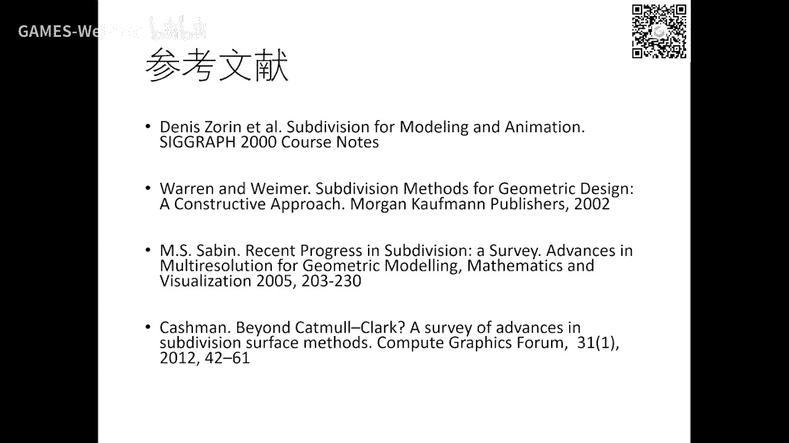

你再去啊这个找这些文章好吧，我这个就就不不去详细讲好。

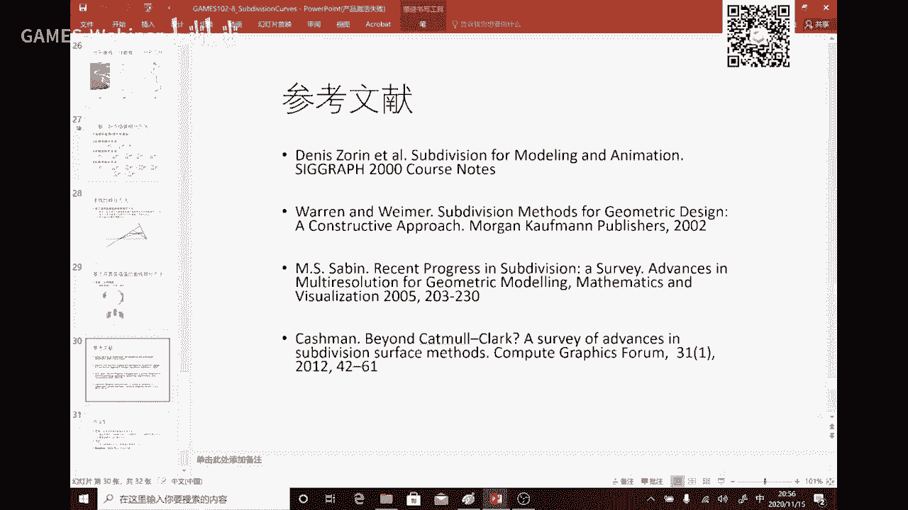

我们把左右五给大家布置一下啊，很简单，细分卓越是要容易吧是吧，主要是你还要去求解决方程组啊啊等等，那这个是细分，就是不断的迭代是吧，一般细分和3~4次就足足够密了嘛，啊所以你可以实现这个菜金啊。

三次样条，我这p t都有差值细分啊，就是一个逼近一个细差值，非常简单啊，你只要会写程序，基本上呃这个可能几个小时就写完了啊，大家体验一下啊，就这个作业就放一周好。

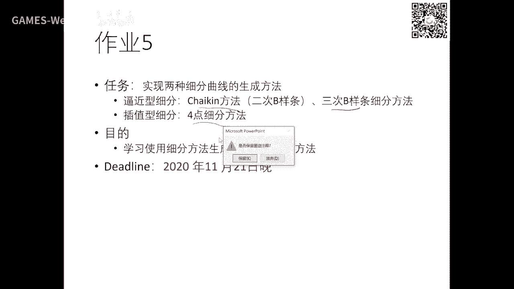

明天这个作业就会在give up上给放出来，继续。

上面讲的这个就是影视曲线啊。

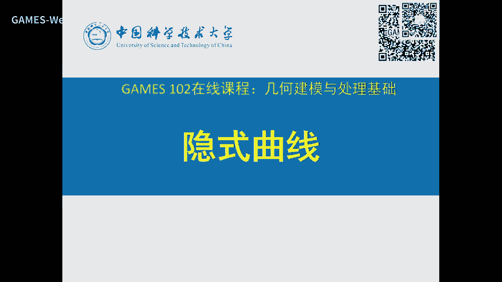

影视曲线呢是他我们看一下啊，这我们的，然后好多曲线类型都是这种啊，控制顶点加个奇函数啊，就是那么对曲线来源奇函数性质是吧，好，那么我们到现在为止已经呃呃这个了解到过很多这些方式定义曲线啊。

最简单就是我们高中就学过了是吧，一个函数五，我把把把这个函函数升为x跟y放在一块，就变成一个函数的曲线，这个这个叫高中啊，我记得初中的时候就定义过啊，什么叫函数的图，函数图呢就是x这个y放在一块是吧。

身为一下就变成了一个轨迹啊，x是一个t的函数，y分量是一个t的函数，那么这个叫参数曲线显示函数啊，所以啊这个只不过参数参数曲线呢是有另外一个参数t t变化，曲线上的点出来比较动，就构成了曲线啊。

所以它的更灵活啊，那么这个叫参数曲线，还有一种曲线呢，就是说我这个屏幕上的两个点，一个点xy啊，它两个自变量和应变量没有显示关系，不是和y等于fx关系，它是什么，是fxy啊。

是是被另外一个函数所表达的是一个方程式所表达啊，简单一点，像这个叫直线，大家一看就明白，这个大家一看也能知道是啥对吧，圆对吧，这个呢诶你就看得出来了吧，这个呢你你看不出来吧，哎我也看不出来啊。

但没关系啊，我这是随便写的啊，就是你可以看到你写写一个f等于fx要这个推出来不可能的，因为什么啊，我看我故意写了y啊，又出现在根号里，出现在log里面是吧，你不可能写出来是吧。

所以这种这种形式就不像我们传统的这种形式，好理解是吧，这个叫影视函数，一个方方程里面就叫隐函数啊，这个函数有什么用啊，我们来讲好，所以满足所有这种方程的点的轨迹也是一条曲线是吧。

简单一点就是你看这个直线大家都都明啊，这个圆椭圆大家也不用说了吧，除以一个a平方b平方嘛，好在大一的数学分析里面，大家学过任意给一个隐函数啊，我全局上写不出一个y等于fx这样形式，但是我在任何一个局部。

我可以定一个vc fx啊，这个叫隐函数存在定理，这是我们呃大一学微积分，学数学分析就学过的定理，就是这个隐函数呢局部都可以是表达成一个函数是吧，是因为什么，只要这个它会会退化。

那么我就可以找到一个啊这个这个这个这个这个函数，这个函数就是x n是表达成这个样子啊，就这等于零，那么这个基呢就是局部存在的那个显示函数啊，所以你虽然画不画不出来啊，虽然不能全局表达出来。

但我在一个领域的附近，我能够把它表达出来啊，这这叫存在啊，这只是叫存在定理啊，到底在哪不知道啊，所以数学上很多定理看起来很漂亮，它告诉你存在啊，而且还告诉你唯一，但是在哪里不是他的，他也不知道啊。

这这个还是要我们去找啊，但是我至少可以知道不还是存在这个函数好，那么隐函数呢我们从另外一个角度来看啊，嗯刚才你函数是fx y等于零对吧，我们我们设另外一个变量z等于f x y，也就是什么呢。

什么我在上面每个xy上面有一个函函数是z是高度函数，所以假设是这样，这样这样的形状，这好，那么你函数可以认为什么呢，是认为c这个的这样一个曲面与什么与j等于零，是这个xy平面的交。

交线就是你这个f x y所度量的曲线是吧，所以我可以看成是一个高维的函数平面的交线是吧，好那么我我我再等一是不是四在这个平面跟他交出这个截截面，就是fa观点一是吧，所以它是什么。

它是一个这个高维函数在零等值面啊，零等等等值线啊，取值为零的等值线在一个集合啊，啊呃那么呃这三个性质大家等于0=10间上小于零大于零的，我们规定啊就是小于零是在f是小于零。

外面是f大于零曲线上是f等于零是吧，你可以看到这个这个还是这样，这个是z在下面下面的，直接在上面是吧，所以它这个很容易理解，所以我们利用这个性质呢，就容易可以有办法去找到曲线上的点啊。

那么找一个饮食函函数当中的点呢啊这个叫叫显示化，也叫参数化，这个是比较难的一个问题，很难啊，这个一般很好很好的办法啊，这这个第四这个函数就是就是个典型是吧，第三个函数还好，那么这个平方我开个根号。

我也可以把它标出来，但这个函数很难是吧，所以说遇到这种啊非常复杂的隐函数啊，怎么样把它找出来或者画出来是一个比较难的问题，因为我找不到它的显示器啊，我这里介绍一种方法啊。

就叫做啊这个marking cube，那么介绍之前的话呢，我们来问这个问题，就是诶我如果想曲线怎么去表，怎么去构造一个隐函数去表达它呢，是哪个这个曲线，是哪个函数的零等值面呢是吧，哪个函数呢是吧。

你能不能找到一个函数，那么这个历史上有好多方法啊的方法啊，就叫做呃这个叫叫符号是吧，我里面全取一是正嘛是吧，我外面全取于零，是不是就一个里面全是正和令，外面全是等于零啊，是个符号是吧，可不可以可以。

还有呢为了光滑一点，我我用每个点到边界的距离作为这个这个函数的值啊，诶那么外面的值呢只不过这个距离是负的啊，那么这个叫叫有向距离场，是我对于平面上的两个任何一个点定义它的边界的这个具体的值啊。

里面就正外面的负，就这样的话就整个平面就定义了一个函数数是吧，那我用这个函数的零整成线就是这个曲线本身是吧，那么你也可以用这个呃这个呃平方这个具体的平方，这个只是你可能用于一些应用不一样啊。

带个平方可能容易求求导啊，但是这个sdf用的最多就是叫等，叫做那个距离符号场啊，符号距离长啊，sdf，那么这个函数呢有个性质，这个性质大家最好是记住啊，这个一般这个函数梯度不等于零，这个是个假设啊。

这个要要不然就容易发生起点，还有一个就是这个f梯度除以它的模规划，是这个隐函数这个的一个曲线的一个叫做法向，好像跟它的这个函数梯度是有这个关系啊，这个在微积分里面都学过的，这个是两两阶导数。

就是一阶导数的这个导数就是这个平均曲率啊，这个平均曲率流这个也是经常拿来用的，我这里不展开好，我想大家可能更关心就是影视曲线怎么去绘制啊，我怎么去画一个虚拟影视曲线。

刚才我们讲了这一个隐形曲线给予了你一个函数很复杂，你很难求出这个y等于fx这个形式表达，那怎么办，你就画不出来是吧，那么在历史上没有办法，这个有一种比较特殊方法，就是80年代啊。

这个就是你要去找一个隐函数的这个这个点啊，还是不不是叫什么非平方问题啊，比较难想像这三个还好都可以，比较比较简单是吧啊举例啊，这个就不用说了，这个这个直线想想这个这个很好表达成一个显示的是吧。

y等于一减a平方根号是吧，然后还还有这是上上半圆，还有还有下半圆对吧，所以这个是表示上半圆，这是是下下半月对吧，可以我至少可以把这个函数表达成分段函数啊，这个这个板就y根号一下是吧，就出来了。

但这个呢就不好表达是吧，那么这个函数怎么去画呢，那么在历史上这个80年代就一篇文章啊，这个提这个问题就是给另一个一般的这个二元二元函数，你怎么去求它的这个零。

整个面或者一般的a点的面等于a就加上z减a等于零啊，就这个f变成叉了嘛，没关系啊，所以呢你怎么样去去去找，完成我要的这个网格或者叫多边形或者叫曲线啊，并且把它画出来啊，这个这篇文章非常有名啊。

叫marking cube啊，marching就是爬行的意思啊，cube cube就是t他当时提出的时候是为了解解三维的这个隐函数，我们这里还是二维，二维的话，我们先把二维讲明白，三维的话你自己去看啊。

就能看懂啊，是基本上这个所有绘制影视曲线的方法的一个根本啊，就叫making cube啊，有n那个代码去实现了，所以你们以后要用直接去去找代码就可以了，好好他的思想是这样啊。

讲完以后发现大家也觉得非常非常简单啊，好我为了找一个这个函数啊，这个这个这个那些点在哪是吧，它呢用于格子，把它所在的区间画一个普分格格式点哈，我就计算每个格子点，把xy这个这个坐标带进来。

这个函数你是不是这就有个值啊，如果是如果是大于零啊，我就标它大于零在这啊，小于零在里面啊，这个图呢表示什么啊，蓝色的地方是在外面大于零的啊，这地方是小于零的啊，那么延迟越浅的值越小就越近嘛是吧。

所以你可以看到我对每个格子点我可算一个这种东西，是不是我就在格子点，每个每个值上面，每个格子点上面就有个函数值啊，隔着点越密，是不是这个函数值就相当于什么，我采样的比较比较密啊，好我要你去找零的点。

是不是就应该是在正负值交接的那那些地方啊，啊这不好，那么我们来看，假设一个格子四个地方都是正啊，但这里面不可能有零吧，基本上啊这除除非特殊情况好，假设是三个正，这是负。

那我可以判断这里一定有个零零的地方，这里有个值零点几吧，把它把它们相连，我就认为这个是曲线上的边，他说你我一定要举行反应行不行，可以没问题，但是我我说我把格子点加密，加密叫足够密。

这些地方基本上就是它局部性质基本上就是符合这些啊，这个格式的性质是吧，好同样这里有好多case，大家都可以去思考是吧，像像像这个case，这是正正负负，那我那我就假定这有个有个零点，这有个零点是吧。

把它连起来就行了，所以这就是87年谁管啊，这个是是毕竟任务文章引用极高啊，盈率极高啊，所以思想很简单，它就是呃这个你说他是比较粗暴的，在整个空间中采样，采完以后呢。

我去找到那些啊存在有可能存在值为零的那些点，把它找到，找到以后呢，然后再把它顺序下相连，一条条下相连，因为每这个格子都是这下面几种情况之一啊，那么这个是六种啊，在三是有15种啊，就是那个立方体啊。

就是这六种，所以你可以看到啊，你要是像这些地方都应该是属于属于属于这个或者这个是吧，地方是属于这种情况，那么这些有正负交叉的点呢，就是这这四种情况啊，然后你去不断的去找，那找完以后把它连起来。

就是这个曲线啊，这就是marin cube的方法，很好理解啊，不难啊，非常简单，但是你要实现好啊，有好多技巧啊，后面还有也有很多变种啊，这个比这个方法做的快，做的好好，这个方法本身思想很简单。

但是呢你要做好也不容易，为什么他有好多奇异情况啊，比如说这种情况啊，你你你你到到底是啊，这两个宇宙是零点，你你是这么连呢，还是这么连，问你那种情况是可能的，你不知可能如果你你连错的话。

你这个形状就什么拓扑拓扑关系都错掉了，对吧啊，所以这是个百代人里面的这个这个脸面前的一个问题，当然你你这个有有些办法也可以解决掉，为什么你把它加密哎，我就奇异性可以可以那个啊没有什么利用一些其他的性质。

如果对这个函数要倒数啊等等，我也我也去判断一下诶，我就知道这导数了，不应该是是沿这个方向，而是沿这个方向哎，我就有可能做判断啊，当然这个呃你有你有你有很多方法去去做一些更精致的判断。

好吧好还有哎我这个格子是不是每个地方都要加密呢，像这里再再加密，对这个早零点是没有用的是吧，所以我要尽快的找到那些啊，这个有可能有零点的这个这个地方再对它加密，这样的话计算量可以少啊。

这个叫adaptive啊，叫自适应的啊，那么曲线啊，呃除了刚才说的那个定义啊，实际上它很有用很有用啊，是用来做重建啊，我做拟合啊，呃我这里讲一下二维的情况的这个例子，三维也一样啊，三维后面我就不讲了啊。

三维到后面可能就是讲别的处理上，三维中用影视曲面来做的这个啊重建方法很有名啊，婆送就是一种啊，好我问题是什么呢，我给定平面上的一些点，当然我先假假定这个这个这个这个点是从一个封闭物体上啊，是封闭的啊。

这个这个啊是封闭的一个曲线啊，那么呢我去拟合一个函数对吧，有可能优点很多，条或者是细分可不可以做啊，没问题啊，但是有可能这个形式很复杂，你你甚至这个点的顺序都不知道啊，就是这个方法适合于无序的啊。

嗯就是就是没有顺序的啊，当然在平面中去还是能够排得出来是吧，但是空间中这个序没有序的话，影视曲面就比较好，因为你做参数去拟合的话，参数选型拟合的话，你要求这个点是有序的，为什么你要求它的参数化好话呢。

又要需要去算啊，算那个弦长，弦长一点一点是吧，i i加一，i加二，所以它要有序，那么这种无序的话呢，就影视影视函数拟合就非常好，非常管用啊，那么这个方法呢是怎么来做呢，我也我也讲一下思想好吧。

具体方法有n多啊，这个这个不可能在我们这个基础课里面在一个个讲的很细啊，我讲思想，这，但如果我不去讲之前啊，嗯能想到啊，就比如说我要求一个函数z等于f x y xy是定在这个整个平面上的。

就比如说就定在这个矩矩形上的这个函数呢，要在这些点点应该应该等于零是吧，在这里面在外面把这些值给它全部啊，就是要有要要有一个特点是吧，这个值到底是什么，我才能拟合出一个函数出来是吧，我们我们现在想啊。

我先不我不想我我先不讲，好好一个，就这个值地方肯定是要等于零是吧，所以你要求这个函数这个函数f x i y i是吧，这就是p i就是这样啊，还有没有别的别的条件呢，如果我有办法拿到这个点的法。

向我知道刚刚跟一个看的约定法，向这里的任何一个点都是负的对吧，就比如说我我多取一个长度叫-1，是正一，这些pi一撇跟这个点pi两撇，我又得到了一些条件，y两撇等于-1。

是不是每个点我就得到了这么几个差值条件，你要去求一个函数差值，每个点以及在这些点是不是在求一个二维空间中的一个差值函数，诶，我们以前都很熟了，不会嘛，就什么我出了好多啊，就是你把这个平面倒下来。

那么这里应该是有这个是零，这是正一-1正一-1，正一-1就是零是吧，你是不是要求一个函数去插着它，那么那么怎么去求这个函数差，直接点啊，我们前面五节课打的基础就有了啊。

你f你肯定要告诉我你在哪个函数空间去找嘛，对不对，你说用rbf去找可不可以，那你按f就假设xy等于西格玛是吧，阿尔法i一函数i j x y是吧，样条还是去什么，这就变成一个拟合问题了。

你你你函数的这个求解就是在什么就在做拟合，只不过呢你和呢光用这些点来做拟合呢，可能精度不高啊，我还要利用它内外的点是吧，但是有些方法呢也可能中间也构造一点来做差值点越多，对这个函数性质拟合的会越好。

因为因为这个这个点越多嘛，你这个函数就可以更复杂来拟合这样一个函数好最后这个函数求求出，求出来以后啊，差值完以后，或者是你也可以差值，你也可以做拟合是吧。

就最小二乘嘛啊那么最后求这个f x y等于零的点，把它找到，把它画出来，就是这个绿色边，所以我用这个语言这么快讲完这个你们基本上都听懂了哈，你们前面有了拟合的这个概念以后，实际上是他就在做拟合是吧。

只不过构造一个啊这个二维函数去拟合这些点而已好，所以第一步啊，这个利用局部信息估计法向第二步，那么有些地方取一，有些地方取零是吧，这个更多的拟合点啊，第三步去拟合啊，这个拟合我们前面五节课。

特别是你们两节课都在讲的事情啊，讲完了好以后，还有很多方法，有很多方法就是rb f，你看这篇文章是最快01年的，就是就是把我刚才讲的那个过程用r b f g函数去表达，然后去去求吧。

还有很有名的2005年的是吧，朴素呢它它只不过是你和其差什么，它不管是你和这个点，而且你和这个点的梯度是吧，就是用了两阶的一个性质啊，就是构造一个微分方程啊，上头本质上也是那种拟合。

因为火速编辑那个呢那个呢不仅是你和这个点，而且是你和点的梯度，只不过它拟合的这个阶数高一点，但是还是度拟合，只不过呢是对函数有特殊的性质啊，啊后面还有什么screen，就是这个窗口的改进。

还有这个方法也只是提一下这个大概是2003西瓜，我就mmp u啊，它是什么，它是利用这种呃，这个叫做自适应的啊，上面去做啊，上面构造了好多好多不同的r b f函数，然后去去逼近它啊。

它就是提出这个market level就比g函数呢这个要好一点啊，那么是80年代的这个matt ball，还有bb就是用这个球不断不断叠加，以前每个球是一个隐函数，是个例。

x平方加y平方加c平方减一嘛啊啊，这个这个求啊去构造一个影像函数啊，一样好，所以隐函数这个也讲完了。

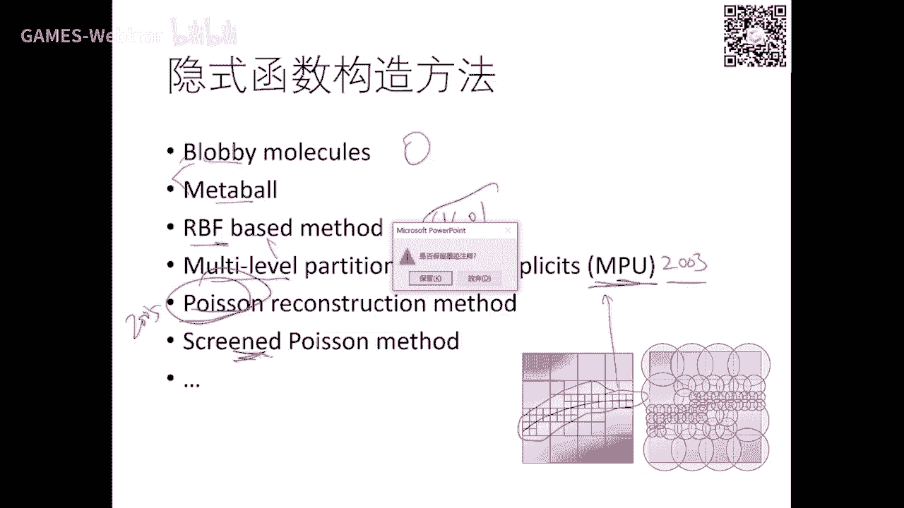

今天内容比较多一点，哈哈最后还有十分钟，我们再把nox讲完。

前面曲线基本上啊牛的啊，这个这个呃方法都都讲完了是吧。

这个啊从函从函数型到参数型啊，到这个影视函数到细分曲面和曲线吧，还做了曲线，你这些理解好以后去理解曲面就非常简单啊，我看看今天，好诶能讲的完，我们赶一赶啊，你留点时间给给后面好参数曲面的就是什么。

它就是双参数嘛，就是二维平面上一个uv到空间中的一个点是吧，所以好，那么那么这种优惠呢是不是实际上是我们以前提到过啊，就是怎么叫用专用机来构造啊，用啊用方向右方向跟v方向的两个c函数两两相乘。

就这些基函数呢就构构成了平面上的一个矩形区域上的一些奇函数，可以证明它也有也有正信，也有权限，因为所有加起来做点一啊啊，因为你这一代加起来这个有公共b one，所以这里加减一是吧。

然后然后每一列都把这个加完了以后，再再横向加全减一，所以它也是t函数，只不过呢这个那是用张量方方方法啊，这个这个两两相乘啊，这个一个方向好，那么呃一个方向是这个结函数。

右方向就积函数一相相成本就变成这个样子，帽子一样的哈，同样你要定义这个曲面形式呢就是什么，就是把两个奇函数体积函数加上一些控控控制顶点啊，就变成那么这两个这个东西你可以从这样看。

可以看是一个方向的一个比较曲线，然后做完以后呢，再用另一方向去合成，所以你可以看到这两个方向，所以看的是取限制曲线是吧，有一个方向构造完，等另外方向再把它构造一遍啊，所以它的方向是无关的啊。

所以你把前面的曲线这个明白曲面啊，就是麻烦一点，就是变成一个两个方向啊，这个两次的符合啊，它是曲线的曲线，所以曲线是根本，所以为什么我们前面要宁愿花五节课来讲曲线啊，讲讲透啊。

就是让大家理解曲面就是什么，就是两个方向而已啊，就是因为它本身就用这个张量来定义好，那么这个北斗曲面很简单啊，就是两个方向的北热机加上一个pg和pig，是这样这样一个格子是吧，比如说这是三。

这这是这是这是三次的时间，这就四个点，那么这也是啊，这个三次，那么这个叫做双三次，另一方向三次方相减三次，那如果一方三次这四次，那我们一般叫做3x4次被被热啊。

那么你这个行这个方向可以用你主机这方向也可以用另外一种机是吧，像这个是这三次，这个是十次啊，就可以装成3x10次的这个被罩曲面片啊，前面的性质在以前在我们那个cg的课里面，需要花很多时间来来证明啊。

去推导很复杂，因为它的它这个方向啊，它的这个符号就要多很多，但是它的性质啊完全跟曲线类似，边界差值啊，变差缩减啊，还有那个decastle的算法等等都有啊，变差缩减也有啊。

所以啊只不过就是符号系统比较多一点，因为它有u方向，也有v方向啊，啊是这个做主板，我给大家看一下，就是做的话不断细分，不断细分，也能求出中一个点，只不过这个点呢就不是曲线相切了，他这个切平面了。

好好这是那个拼接性啊，这个如果是这是一北泽，这是边北泽两边要拼接，要四个共点啊，控制地点如果要要c一就要什么，就是要相邻的三个点要贡献啊，并且要长途一样啊，这个方向也一样啊。

所以所以只不过增加了一些曲面拼接啊，这些特殊的一些情况啊，你要去做一些推导啊，但是这些东西都是曲线的一些一些一个性质的推广啊，那么曲面也一样啊，好那不是就讲完了哈，就是非均匀有理。

就是用两个张量积计函数来表达好这个乐不思里面的话，如果如果人们在未来你们可能会看到这个词叫train，叫那不就是什么意思呢，你怎么在一个novs曲面上，在工业设计里面，你可能在一个曲面上要掏不动。

这个曲面本身就是一个这么非规整形式，怎么办是吧，所以这种曲面在一个曲面里面拖动，因为那是曲面啊，它什么它是一个都是矩形域作曲曲面呢就限制了它的应用，就是他老要这个信誉是要举行嘛是吧。

因为他是张量性张量级形式嘛是吧，所以怎么样在曲面上挖个洞啊，那么一般形一般做法呢，就是怎么在用一个曲面上的直线去表达这个动物的边界，但在空间中去表达一个这样的一个曲曲曲线呢又很烦。

所以我一般在它的定义表达这个曲线，在这里表达这个洞，然后再把它带到这个北侧曲面片或者nova曲面片，就可以得到这个洞的形式，所以一般带带动的或者是这种回归整的曲面都是用参数域上的啊。

这个这个曲线来表表达啊，这个表达完以后把它印上去，找到了曲面上的一个呃曲线啊，就把扣掉，就是这个洞嘛是吧，最后变变成这样一个叫train nurse啊，叫裁剪曲面。

另外这个在在在这个cg里面还有一些这个推广的一些曲面片，我再提一下，这个可能同学们不一定用了很多，但是在这种软件里面经常会看到啊，就是什么，就是就是发电机曲面呢就有一个这样的一个局限性。

就差所有曲面片都要定在一个矩形域上的是吧，而取形有的时候去对一个非规则在取空间呢去跑分呢就比较难，所以但三角形就比较灵活是吧，所以我能不能在三角形上面再也定一个这样的一个光滑曲面呢是吧。

类似于这个相机的这种啊，北侧啊，曲名片呢有所以人们在80年代上78年的夜，发明一种这种定义在三角片上的北泽，类似于北泽的这样一个局面片啊，它的地方是横横，很简单啊，就是一个三角形上面。

我也定义好多空空这个节点啊，比较空空空的点点，这空洞控制点点点的去定义在这些点上面，就是比如说这个是分三段，每个边分三段，在这样也构成啊这么多点，那么它的g函数呢是这样一个比较有意思的形式啊。

实际上是这个这个这个阿法贝塔伽马的加下点一啊，这就是其中任何一个点的这个一个重力坐标叫重心坐标啊，那么那你把对坐标带进来，就得到了这个点在曲面上的形式啊，那么这个叫做三角比这个曲面片啊。

这个在90年代啊，80年代也有很大量的文章在在做这些方面的研究啊，这个呢呃可能用的比较少啊，但是呃这个同学们只要掌握住它的基函数是这个形式啊，并且这三个全函数i加j加k是有一个严格的约束。

它必须要等于n啊，是在在在在这里在这里，所以说看起来有三个变量，实际上是这本质上只有两两个变量啊，多一个变量是它是有个约束的啊，这对他的这个导数啊等等啊，这个研究就是有有些特殊手段啊，我这里不展开。

你们遇到时候呢再去看啊，呃只要我明白明白这个背后的道理啊，这个这个这个motivation你们去看就能看得懂好吧，那我也不去推导啊，这里就是呃也是连续性啊，这里一片这里一片都是三角域上的。

那么中间的这个连续性有什么性质等等这些地方啊，我们读书时候去推导，还是花了不少功夫去去推这些指标啊，这里推这些东西就是要有耐心，难道不难啊，因为i j k啊，这个呃什么i加一加减一啊，k啊。

很容易搞错是吧，只要细心一点都能推出来好最后那个总结一下啊，有理变量条这个东西就讲完了啊，所以要理解张亮机曲面啊，非常简单啊，你去理解，然后只要把曲线搞明白了啊，那么只要把曲线搞搞明白了。

那么你就对这个曲面的性质啊就去理解好吧，那么当然曲面有有一些特殊问题啊，有啊啊，你像这里有几片啊，曲面片，那么因为在这个焦点的这个光光滑性叫连续性呢，就比较特殊，曲线只有两段拼接。

所以它没有这样一个焦点的光滑性啊，这个问题在10年代的时候很难很难的一个问题啊，有很多人取得不不错的不错的工作啊，我这里也不展开啊，同学们有这个啊啊有兴趣哈，或者未来有机会接受你。

再你再去看他的这个最基本的原理，基本上都是曲线的这些东西的推广啊，好还有一个那就是你也可以进行进行上传出一个北泽题啊，那么这个叫北泽体思维就没有意义了啊，那么那么那么那么北泽体是干嘛用呢是吧。

实际上是取去做变性用啊，就我我用个铁套一个啊物体是吧，然后呢我本周呃这个这个中心进行变形，为你们物体进行变形，这就是我们未来要讲到的f f d啊，叫reform information，自由变形啊。

就要用到北体啊，还是把物体套在这个这个这个张量的啊，三餐张量题啊，这个这个题里面啊，好今天我们啊这个也是讲的比较快。

然后当时呢是内容都不难，因为最难的部分在前面几节课啊，这个要理解，那么今天算是有两个新东西。

一个是啊细分啊，细分也很简单啊，暂时你要去研究的话呢。

产生人家那么要有些功底啊，啊今天主要写一部分，一个有理啊，刚才学会了，还有细分啊，就是细分细分这两个还是比较简单的任务啊，大家再来练练手啊，熟悉一下细分是个什么什么什么形式。

还有一个隐是你试的本质就是在做做你和就刚才这一段啊，我我想细讲了，所以和函数的拟合，函数的回归是贯穿基本上大部分应用的，一个基本的是这个啊数学的基础啊，我为什么要花那么多时间讲你和是吧。

只不过用这函数的形式不一样是吧，那有些是我们这个g函数我们比较熟悉的啊，有些呢是什么用一个网络的形式，有些人可能是用一个判断性，用个数啊，分类数啊，有现在可能是用一些概率方式。

像这个贝叶斯啊这种概率形式，但除了上书上给，就是里面带有一些不同的这种问题呃，为啥问题要产生这个函数，所以都在做拟合啊，所以把这事情搞明白以后，看文章，看看他们的，听他们的，你就是抓住重点。

他到底在做什么问题啊，如果在做理科问题，用什么拟合函数是吧，是用我们的这种还是用什么什么g是吧，还是用这个一个网络，还是用这个一个数是吧，啊这个这个这个分类数还是用其他的拉出塔等等。

所以都是在什么fter，我的观察啊，只不过呢只是从不同行业，从不同这个方向来来说，他们解释的程度是不一样的好吧，所以啊函数这一块这个也很容易理解哈，你和我我也讲完了，最后就把这个nt给他。

虽然我里面很多性质没有去一个一个推导，那没关系，你们有了这个曲线的这个基础，再去理解曲面以后，如果遇到这个相关的一些问题，你们去看书，看参考书，还有网站的知识容易理解啊。

无外乎就是这个里面的是变来变去的啊，这些东西好吧好，从下节课开始呢，我们要进入那个离散型的网格了哈，就是我们在这个图形学最近的一二十年比较啊，主流的或者微，因为那不是这一块的，工业界。

这一块相对来说比较成熟了，但是在这个印象工程，我们更多的是用点云，是用三角网格来表，这个物体好，那么这个物体呢是三角化表达，它没有光滑的基函数，它所以它是个离散曲面啊，那么你离上曲面那些处理呢。

诶我们的微分微分几何可能就要做一些变动是吧，就要变造一些差分和一些离散计算好，那么我们后面的一半课程，就是围绕着离散的的曲面形式来做这个一些这个处理啊，差错化变形，还有你合成以及分析来展开一些这个介绍。

好吧好，那我们下周开始就进入到啊那个三角网格离散型的曲面的这个内容，好今天的课程到这里为止啊。

各位同学晚安啊。

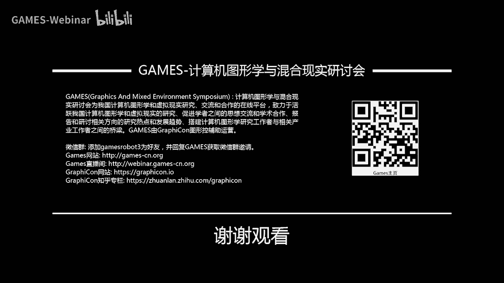