# GAMES102：几何建模与处理 - P9：微分坐标 - GAMES-Webinar - BV1NA411E7Yr

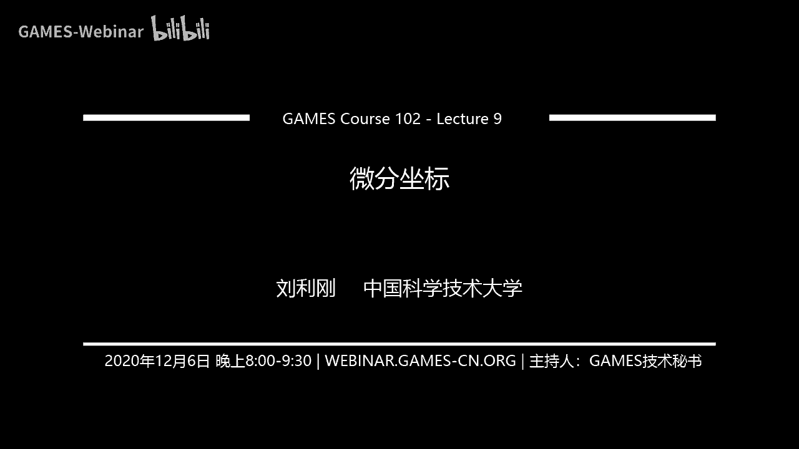

啊嗯同学们晚上好，那个啊，今天我们课程开始啊，那么今天的内容主要是讲那个微分坐标哦，哦对我们先把上一次的作业情况给大家分析分析一下啊。

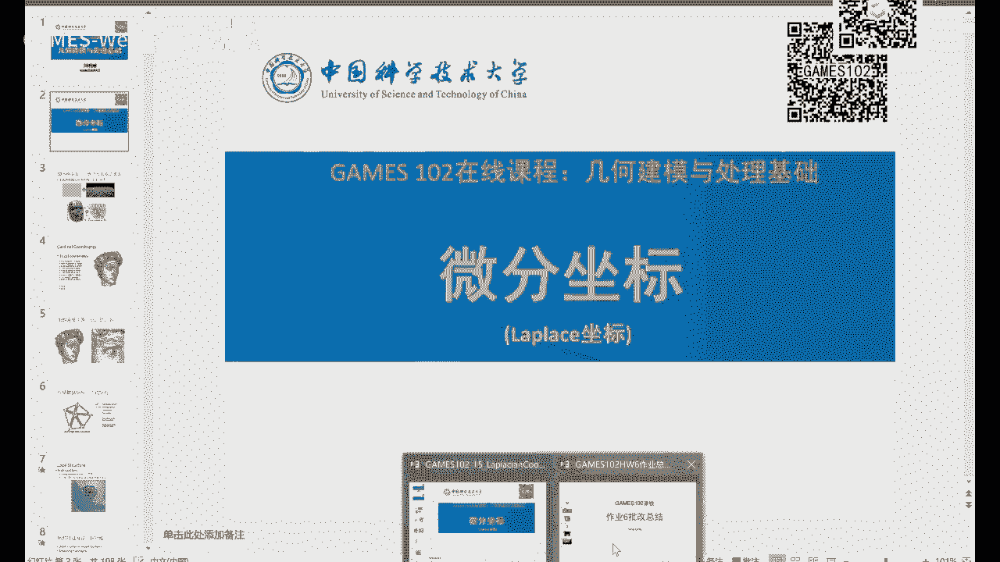

啊不知不觉我们这个课已经做到卓越六啊，本来计划这次课程的作业也就5~6个作业，但后来啊看同学们还是很多呃，能够跟上来，所以我们后面加了几个作业哈，那么希望这个有兴趣的同学能跟上，同学能够继续坚持。

那么还有的同学呢是进来比较晚的话，可以参照以前的作业的优秀代码，还有一些汇报啊，在慢慢后面跟好好，那我们今天呢就把这个作业六的情况给大家讲一下啊。

这次作业呢主要是呃第一个啊对三角网格来进行编程的一个作业啊，用啊utopia有sk 10个同学啊，还有其他两个同学用live i jo啊，挺好，还有有一个用unreal好，其他的啊。

那么具体情况我们后面看一下。

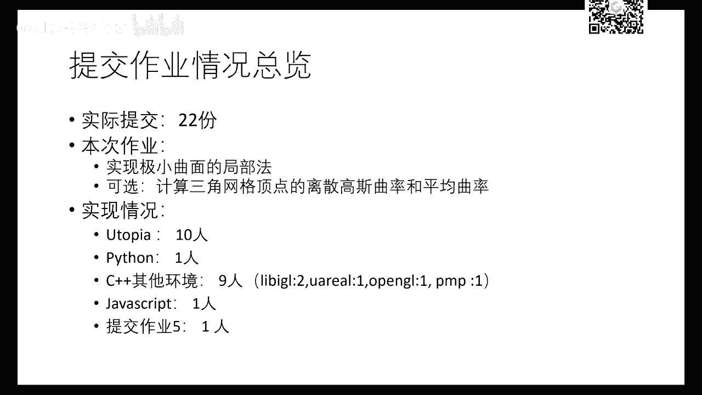

那么这个总体上作业交的情况，只要呃那个完成所有情况都还不错啊，那么能够正确掌握这个网格的点线面的关系的呃索引啊，以及它的处理，这次作业上很简单，你只要把这个点进行一个这个它的坐标进行修改。

修改方向呢就是朝他的那个啊拉普拉斯这个方向去修。

这个移动一点点是吧，然后不断的去迭代啊，可以看到啊，这里有一个动画啊，这个很多同学都做到这个样子对吧，就网格一步一步啊在不断的演化好，那么那么每次做的过程中呢，呃往往歌都是在点点都在修改是吧。

都是按照那个啊平均曲率这个反向按照那个方向去不断的去演化啊，那么这个同学这个可以看到它的边界是不动的，那么曲面越来越光滑，最后呃因为这个电电力可以保证它无穷情况下呢。

极限情况下呢是毕竟以这个边界所形成的极小曲面啊，当然这个这个网格顶点不是太多啊，所以它的光滑性边界上面稍微有一点点啊，看得出不光不是特别连续，这是因为边界采样不足所导致的啊，但是里面还是非常光滑好。

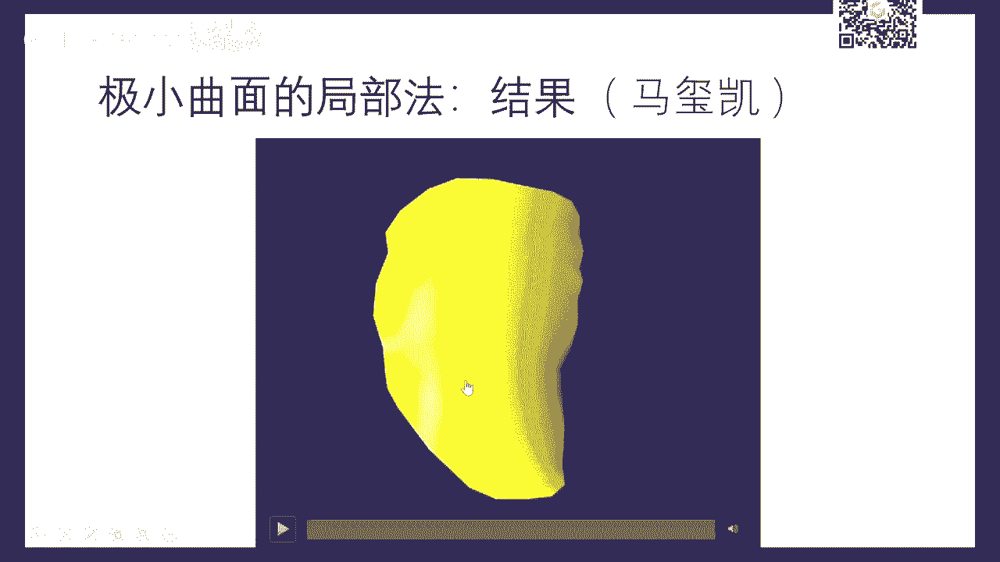

那么这是另外一个同学啊，呃这个呢同学做的呃稍微多一点，他可以他也我们来看看它它的它也可以可视化这个曲率啊，一个一个这个技巧嗯，平均曲率加上高速曲率，可以看到刚才演化过程中，它那个顶点演化的还是比较快的。

到最后一颗光滑曲面，啊这是那个兔子头，兔子头的话只有脖子那个地方边界是有的，然后可以看到它这个你可以看到这个耳朵的地方的收敛是慢一点啊，因为这边提点是点点多，上次同学们做这作业，今天会会展开解释一下啊。

那个耳朵那边因为它电线比较密，所以他的那个收敛速度跟那个其他地方就慢一点啊，因为它那个拉布拉向量比较比较短，比较少啊，所以他要经过很多次迭代这个这个尖角啊，才才会那个消失到最后变成绩效曲面。

但是你只要迭代次数足够多，这个理论上是可以保证啊，它是毕竟那个机要全面，只不过这这一块的地方，耳朵这一块地方呢，它那个顶点比较密一点而已。

好那么这是另外一个同学啊。

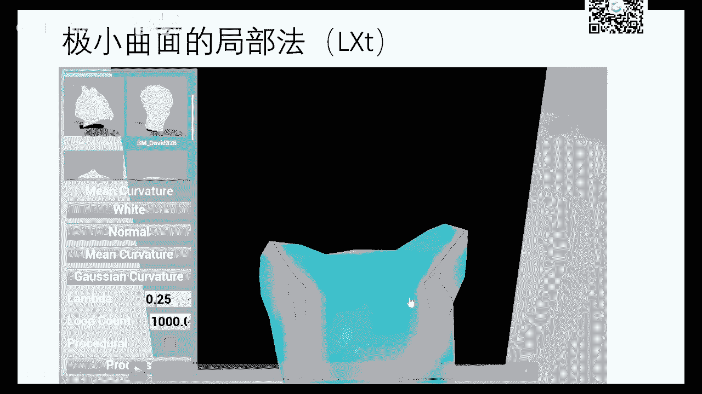

这个同学是用啊虚幻unreal引擎做的啊，这个同学一直是用虚幻来做呃，非常不错啊，可以看到它它这个演化过程好，我们就跳一下，中间一些伞是在叠叠带啊，因为迭代过程中呢法相会在不断的更新啊。

所以到最后还是会受点过去呃，上次这里他也看到有一些这个自交现象啊，这自交现象呢就是顶点发生了，就是面片发生翻转，在翻转主要是这个顶点啊，它有些收两块，有收的慢，就有可能导致这样的一些现象啊。

这这个是有可能是可以避免的啊，这个以后我们再讲，就局部方法有可能会导致这个现象啊，那在今天我稍后课程中，我们介绍另外一方法就能解决这个问题啊。

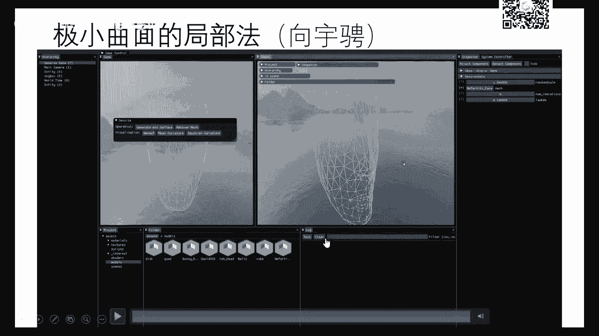

这个是另外一个同学啊，用utopia做的，还有一个演示。

它它已经掌握了这个框架啊，那这次作业也非常非常感谢有个同学对这个框架的一些bug指出来啊，那么能够让助教进一步在完善啊，所以你们发现任何问题都可以及时啊，这个通过左眼也行，通过啊，跟我们的助教联系。

这是三个那个那个球的一个例子啊，我们中间过程就跳掉吧，节约一些时间，因为整个整个演化过程都是类似的啊，就顶点不断不断在在在收缩，好嘞好，那么这些ui呢呃它可以随时调这个参数，还有调整这种啊。

所以这个框架还是提供了很多这种交互方式，能够让大家呃实时查看以及更新你的算法数据啊，参数等等，好了，我们同样我们也会把优秀代码和优秀报告啊啊放在网上分享给大家，相互参考啊，这个毕竟每个你的一个特色啊。

当然并不完美啊，他们也不是完美的，但是相对来说是值得相同，也可以参考的啊，好嘞好那么呃具体的那个一些代码报告啊。

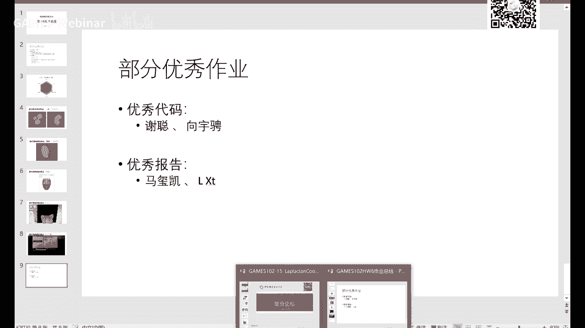

同学们就课后再好好仔细再看一看啊。

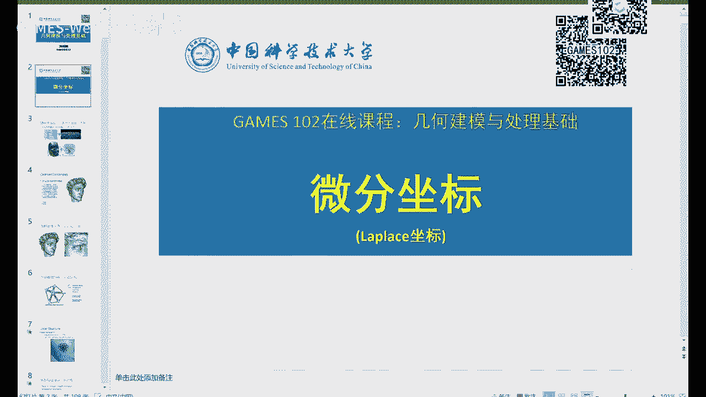

还有特别是有些同学呃经常问这，所以能不能缓缓交，或者是再过一周交，这个都没问题，反正我们那个啊网站所有网站都会开放的，但是呢最好是因为我们已经公开了这些代码跟那个报告，所以你们可以自己批改好吧。

那如果需要助教给你们再认真看一遍，给你们一些建议啊，你们也可以单独联系他们，好吧，就我们可能这个课得继续，往往前赶好这课也大半的课程也结束了，所以后面还有一些节课，我们想多给大家讲点内容。

因为这个关于离散网格方面的东西还蛮多的哈，我们才刚刚开始好了，今天我们继续啊讲一下在离散上次无论是连续也好，离散这个曲面也好啊，这个微分属性是非常重要，刻画这个三维空间中的二维流星的一种啊。

这个几何量啊，叫我们上节课讲了一些微分几何的一些基本概念啊，那么在这个网络上面，同样这个概念很重要啊。

那么今天我们介绍一个微分坐标好，我们先回顾一下啊，我们这个已经通过一个作业，大家能够感受到这个网格曲面本质上就是个曲面啊，只不过它是一个离散表达啊，我们上节课也讲到有两种观点。

一种观点呢就是呃就是二维到三维的一个影射啊，就像这个啊，那么在二维中呢呃是一个二二维图是吧，像上面这个是个规整图啊，这个那么每个每个点呢有一个三维坐标啊，像这种地形啊，地形图这种曲面就是一个高高度图啊。

就非常就是一个函数，那么对于一个一般的就是下面这个啊，它它不一定是这么规整的结构，它可能是任意任意结构啊，就任意的这个这个这个这个拓扑啊，就像这样啊，那么他从二维到三维也也也是个影射啊。

啊那么另外一个观点呢就是把它看成是一个二维图在空间的这个嵌入，只不过顶点是在r3 维中呈现是吧，它本质上是一个r2 维图，只不过你这个顶点呢有一个三维坐标而已，如果这个顶点是一个n维坐标。

就是想着n维空间中的一张r b流行啊，因为它本质上是一个uv这样平面，二维平面的一个图的上面的影子是吧，我们以前讲讲这个影视区别大家都清楚了，一个一个曲面的这个本质为主，是是这个呃x到y好用。

x的维度所决定的是吧，那么如果y的维度比它小的话，就是降维啊，如果维度比较高的话，就是参参数曲面，那么所以它也是一种参数型的区别。

只不过它是分片线性函数，有了这个概念呢，这个很多东西就很好理解，因为呃不不就是这个不光滑性差一点吧，因为光滑性差一点，但它本质上也是个也是个连续函数，连续连续曲面，那么我们通常用顶点坐标加这个面片啊。

当然这里改改成边，有些文件用边来那个表达也可以，所以用面片也可以转换成边的表达，用边也可以转换面面表达顶点坐标，这个是公共的，这个是必须给定的是吧好，那么要掌握这个呃离散几何实际上是呃编程。

这不是编程上面啊，最重要要掌握那个数据结构里面的图graph啊，就在这一节课的啊，第三部分的这个数据结构就是非线性数据结构，就是讲图啊，所以呃在那个课程里面，你们所了解的电影边面这些关系啊。

都都要在这里用得上，所以啊同性学这个离散几何的处理上也不难，就是数据结构啊，你把数据结构掌握，再加上对这个曲面本身上的一些几何关系，把它理解透啊，就是上手并不难啊，所以大家同学们心理上面不要有剧本啊。

这个这个压力好盯着我们的测，我会心一步步把那大家这个这方面的技巧，还有知识给它带起来好，那么你是一个有图的话，数据结构有非常多啊，呃这个没有最好的数据结构，只有适合于你应用的数据结构啊。

这个大家也也经过这样一个描述对吧，你现在甚至当然你说我我这个任何算法对于他一定道理对吧，就像那么多啊文章啊都有写出不同算法啊，只有报的数据，没有不好的算法，我算法只能找到时候他的数据是吧。

能拉他的算法最好同样最结构一样，就像线性线性数据结构一样的队列，就是线性表跟那个呃链表啊，这个各有它的优点和缺点是吧，没有呃，呃什么情况都通用的，所以呢啊我们在做应用过程中呢。

选一种你自己觉得适合的这个数据结构来用啊，把它掌握住就够了啊，因为它有它的优势呃，比如这次呃昨夜五啊，有人用utaia啊，就是我们的框，我们提供框架啊，是半边结构啊，这个是大部分框架都提供的啊。

也有两个同学是用那个lib i g啊，就是另外一个这个这个框架啊，那个框架呢是用的这个这个边表啊，这个矩阵的方式去去去存储，同样它有它的这个优势，所以也能做同样的处理，只不过呢某些应用过程中。

某某些应用呢可能这个数据结构会效率高一点，另外一个应用呢那个小那个数据结构会效率高一点，好就取决于你看看你，你说这个这个软件也好，还是应用好，你看这种操作哪个呃，数据结构对它优势大一点，那么采用它的话。

总体效率会不会提升好吧，所以这个不追求多，只要追求你自己的这个应用，作为初学者的话呢，我建议大家先用一种把它把它用熟了，别的数据结构呢是同样的一个用用法，只不过可能逻辑上点线面存的关系不一样啊。

那么关于数据结构还有这个观点，大家呃这个还有个认识，就是啊这个做编程或者叫算法啊，空间和时间永远是一对矛盾啊，你空间什么意思呢，就是你存储啊，你存储量多，假设你数据结构里面存储的点线面信息很多。

你把每个点的领域都存下来了啊，当你用的时候呢啊就时间就非常快，你很快就找到他的一些关系，就不用去找，也不用去算对吧，所以这个存的多，就就当时online的时候呢算的就快啊，就是你这你这算法性能就会好。

那你消耗对很多对吧，这是一种策略，还有呢诶你存的少，我我我想节省一节省一下内存啊，或者我的我的这个存储，但是呢很多关系呢你要实时去找，就像半边结构一样的，你找一一领域都要去根据半边一个可以去找。

这至少你要你要按照指针遍历一遍，你才找得到对吧，所以你没存起来，但是你要找早的话呢，就要消耗online的时候呢，你的cpu时间啊，所以你存的少计算量就就会多。

是你的选择是这个程序的性能可能就会慢一点哦，所以你是存的多算得快还是还是存的少，算的慢啊，这个就看你这个呃就是呃存储有内存跟着你的计算cpu啊，这这个中间打了个平衡啊。

这个去嗯在算法层面上你要综合考虑啊，这里我给大家稍微提醒一下啊，没有最完美的数据结构也是在这个道理上面好了，那么我们看一个网格，一个网格就是这样一个图是吧，只不过每个面的是三角面啊，比较特殊一点啊。

所以他他的那个那么这里有个概念，我们经常要提，就是我要考察一个点，比如说这个点啊，我要考察在这样一个点，这个点呢它的信息呢就是由他周围的这些顶点和面片所来决定的，对它的性质就是说这个点到底是弯的怎么样。

是不是要考察它的一些领域是吧，我们啊局部微分几何的任务就是在研究这个点无穷小领域的性质，在这里的话呢，因为无穷小就是这个面片所组成的这样一个局部领域啊，这就这个这个性质，所以呢我们用一领域啊。

就一零什么意思呢，直接跟这个点有边相连的这些点的集合就叫它的一领域，这么那么用这一领域性质来刻画这个点，因为我们所知道的信息也就这么呃，一领域跟它相邻的这个三角片的信息，所以用啊研究这个点的性质啊。

啊无论是算法向还是取率，大部分情况下都会用它的这个应领域信息，当然你说我可不可以再扩展范围大一点，用什么二零域，三零域可不可以，当然可以好，我们来看一下，你如果是二零的话呢。

就跟他这个点呢有有两条边相邻的这个点，这这三个点也算阿里云啊，好把它101的所有点这样一个一个一个一个这样便利好，便利完就是它的一零的所有经点的一零域就是变成了201啊。

所以所以这个啊这个阴影部分呢就是这个顶点的201，所以呢这个领域越大，你这考虑的这个几何信息啊，可能会去会越多是吧，嗯在微分几何里面，当然我们都是在一个这个点的无穷小领域来考虑，但是在遴选情况下。

无穷小不可能是吧，所以我们用英领域来建设它的无穷小，只要这个网格足够密，这些这些边足够短是吧，如果你想考虑更大范围，因为一领域毕竟有些时候会有脑动噪声的影响，所以考虑大面积啊，有案例从以此类推。

你三领域就是201101的所有的点的集合也可以找，所以说你每个点都可以用它的局部的一些呃这个数据来进行刻画啊，那么那么上节课我们也讲了唉，策划这个点的一些局部信息，你可以用用离散方法啊。

可以用它一领域的这些面片的一些性质来逼近它阅读法线，我用一零的这个面片的法向的平均来禁止这个点的法向，可不可以没问题啊，这是一个离散观点，还有一种连续关键的是什么，我取这个点的一个一领域或者二领域。

那么我我就利用这些点呢，然后在这个点上面，怎么你和一个光滑曲面啊，你可以在这里建立局部坐标系，比如说你查法向为z轴，然后再取啊，以法向垂直的一个平面，就是它的切平面啊。

取x和y就建立一个x y z这样一个取这个这个坐标轴，然后呢你用这些点呢啊，就作为这个这个这个标签下面的一些点，那么就拟合一个二次函数啊，或者三次函数，当然是指两个方向都是啊，双23 三式中项式。

你合出来以后呢，或者差值，那么这个点在所在点的这个曲面的性质，我就用它来作为这个点的微分属性，曲率啊，法相等等啊，咱们用局部拟合的方法也可以做好吧，所以拟合方法大家都很熟了啊。

我们前面前这个课的钱一大半都在讲这个拟合方法啊，那么具体用什么函数，你自己去挑是吧，还是用8b f都没问题啊，所以这些paper呢一看都能看得懂了啊，这个图册函数空间不一样啊，好了好有，有些领域的话呢。

其实上节课我们也引进了这个概念，好我们我们把这个红点是某个顶点，它这个蓝色点呢是它的一定域啊，我把它这样下象征性的刻画出来哈，那么这个这个这个城市点呢就是这一领域的平均，就是这些点的坐标啊，加权平均。

但这个圈子如果是均匀权，就是它的重心啊，就是这些蓝色点的重心，当然啊我们也可以可以推出其他形式的啊，就像中心坐标那一次课讲的，就是你可以从不同的意义上可以推出这个口腔品的权啊。

就是这个与它们的几何相关啊，它们加起来相关，所以这个这个点呢你可以把它看成是一个平均，这平均可以是个v t的啊，就是加权的平均啊，这个圈你可以等等全啊，就是等重的，也可以是这个跟他们几个相关的好。

这个点的跟这个这个点本身可能不会重合啊，那么那么如果这个蓝色点是假设共面啊，这个这个层次点可能在这个共面平面里面，这个红色点是呃，就是就是呃应该是偏离这个平面的，所以呢它们之间有个距离啊。

这这个距离啊就是这个向量这个距离呢还是上数量的这个红点啊，偏离它的一领域所在的假设是平面所在的平面的远近啊，这个向量是不是越长，这个点是不是越越越尖锐啊，所以呢能不能发现这样一个向量啊。

可以刻画这个某个点啊，像像一个伞一样的啊，这个闪电它的尖锐程度，这个项链越长，这个这个现在这个地方就越尖啊，这个这个向量等于零，表示这个红红的就跟橙色重合，那表示这个地方很平，对啊。

你们昨夜5月六就是什么不断让这个红的朝这个橙色的去移动嘛，直到极限的时候，他们重合不就是非常非常光滑的嘛是吧，但是他又不认识平面，因为边界是非平面，所以就呈现极小曲面的状态啊，所以这个向量很重要。

这个项链呢实际上是我们就给他一个一个非常酷的名字啊，马上出来了就叫拉普拉斯算子啊，这为什么这个东西就像一个向量叫拉普拉斯算子啊，拉帕斯同学们在那个呃别的课也不一定是微分几何啊，拉姆拉姆双子是什么呢。

呃就是就是如果你你看你们学过多元的话，就是最底下的这个形式啊，就是一个函数二元函数啊，他拉不拉算子呢，就是它的两阶微分算子啊，所以是个椭圆形的微分算子啊，这个就是这个形式f关于x的两阶。

加上y y上加上y的两阶这个偏导啊，这和叫拉普拉斯啊，他说对于一般的这个多元就这种形式对每个每个变量啊，就是三元四元啊，就是多变量多一点啊，其实是一样的啊，这这是二元啊。

好那么说这个这个从几何的角度上来看的话，它是什么大不算子是一个梯度的散度，散度的话呢是什么，散度就是这个向量的，因为梯度是个向量，向量的三个分量的和啊，叫散度啊，所以算顺子这样啊。

就是啊嗓子是这样这样一个记号，所以所以t度的散度就是两层，就相当于是调查的一平方，这是数学符号，用就用这种方式去定去定义的话呢，就可以定义推广到一般的流行空间，像这种定义的是什么，是取有坐标系了。

所以我们经常看得到的，像特别是工科学生来看的微分算子，就是阿巴斯只是这种形式，因为它怎么有坐标系，有具体坐标系，所以它的表达式样，但对于没有，就是一般的欧式空间啊，这个这个真正的流行上面啊。

用这个符号就可以推广到别的形式啊，我们看一下啊，对我这里就提了一下，如果是定义在一般的流行，甚至这种非欧几何上面流行，可以用这种形式，当然这些符号大家也不用看啊。

看的话呢呃可能有些同学一看这个符号就头大了啊，你就不用关心，反正就是你们所理解的这个如果有具体坐标系x y，那么这个行程就这样好，这是啊同学们经常在很多地方能看到的拉拉扇子好。

但因为问在哪个村子是这个形式是吧，为什么呃，在流离散上面的话，刚才那个算子在这一点的这个拉布拉算子是这样一个形式呢，对吧好，那那个我们呃怎么来理解啊，那么具体为推导嗯，可能要严格，那那个需要花的时间。

但是可以怎么来理解这个事儿啊，我们来我们来看一下这个算字形式是什么啊，我们我们把这个算字写在这，就是关于x的两阶，加上关于y的两阶，如果我们是用这个差分的形式来看啊，我们在意味着差分很好理解是吧啊。

我们要去算以这个点的导数啊，导数就是f关于x的一导数就可以进时乘什么啊，我们用y i加一减去y i，来进行这个导数啊，这个呢叫向后差分，因为是用后一个点减去前一个点啊，这个叫向后差分。

那么当然你也可以用向前差分，用x，嚯y减y减一，就是用它的一阶是吧，好对于二元二元的话呢，是是是一个，xy z是吧，好那么这里就有两个方向，一个x一个y是吧。

所以他这边的这个两阶的一个差分是等于一阶差分的差分是吧啊，我们这里距离呢就假设都都是一样的，就等于一好，那么就是这个进制好，那么那么这个值呢是不是等于x就是上面来y i加一减去y i是吧。

那个下面如果是等距的话，减去y减去y还减1÷1是吧，转换一下，换一下就等于两倍的y i加上负负得正yi减一，可以看到他x在x方向上，就在某方向上，它的值啊是x方向上的三个值啊，就是中间那个值是-2。

就是一和-21这个形式同样在y方向上面，就是另外一方向上面也是这个值，我这里可能符号有点乱了啊，这这里的z y都应该是变成z啊，那么那么另外啊在另外方向上的y22 间呢也是一样好。

用z好把它加起来以后呢，你发现整个的这个形式呢是什么，就是就是用这个点，我假设这是规整点，这个点用它的这个点加这个点，加这个点，加这个点减去四倍的，因为这是两倍嘛啊，减去四倍的。

所以说你看就是用它的左上下左右的这个点的和，减去中间这个点的四倍啊，那么你看刚好是这个最易领域的加起来平均啊，减去它是吧，所以我们就类比对于一般的这种多数v5 啊，16啊。

哎我们也用它的101的平均减去它，就作为它的拉普拉斯算子的近视好，所以这是一个比较直观的理解，拉到算式，为什么我们啊这个用它的一领域啊，这个符号ni就表示它的一零域。

因为这一领域这些点的和但是可以加权啊，然后呢作为啊这个红点啊，然后然后这个点vi到这个点的距离，这个德尔塔i向量就是这个箭头，就作为这个拉普拉斯算子的一三近视啊，我刚才是只是从差分角度上告诉大家。

这样这样近视是是合理的，因为这个从形式上来类比啊，这个一般这种great的规则，这个定义上的差分算子，这个呃两阶的微分算子，当然你这个这个进程是不是真正的，毕竟原来的这个呃理想的这个问题拉不算子呢。

那么就要证明当这些这些网格顶点无穷趋向它的时候，这个算子是不是极限能够趋向于金，金真的拉达转子啊，这个是数学上可以证明的啊，当然这个证明呢呃也是非频繁，需要满足一定的分布啊，这我就不展开好。

大家去中间记住啊，好我用这个点跟它1。16平均这个差这个差那是一个向量，这个向量呢我们把它叫做一个拉巴拉斯算子，也叫做拉普拉斯坐标好，那么这个因为它刻画了这个点的一定域的性质。

所以我们也把它叫做微分坐标好，如果不思上下文的歧义情况下，我们指微分坐标就是指这个拉普拉斯坐标啊，明明这个拉拉坐标呢在某些地方也叫散形算子啊，散金啊，坐标啊，好这里个算子啊。

大家听起来好像挺挺高大上是吧，算是事实上就是一个操作啊，这个这个是数学家发明的一个东西，of operator啊，就是操作，只不过它定义不是在定义在我们欧式空间，它可以定义在内空间。

定义在流行空间甚至黎曼空间啊，只不过啊这个为了区别于一般空间中的一个计算啊，我们把它美其名曰算子好，所以算子你就把它理解成是一种运算就行了，好拉帕斯啊，这个算算子好好了。

那么在win几何里面有一个平均曲率流定理，这个定理非常精妙啊，我把它解释一下啊，这个定理是说什么呢，是假设这个点不动啊，这个点我我来考察它的这个领域的一个性质好。

我在这个点周围取一个非常小的一个封闭区域，这个区域的边界呢我把它记成这个符号叫闸马，就就就进入这个符号伽马，那么那么这个伽马呢，那这个上的每个点就是边上的每个点跟这个点之间，我看是不是要退出好。

就就就这里任何一个点，这里任何一个点，那么跟他的这个连接，就这里形成一个向量，就是这个是吧，假设这个是v，这是v v i好，就是v i减去v，这个就是就是这样一个向量啊，我方向一反应没关系啊。

这个向量呢沿着这个伽马做一个线积分，看到没有，这个v在嘎巴上动对吧，然后沿着弧长做这个这个线积分啊，现积分就是你们微积分里面学的那个呃先积分面积分啊，好这是这是这是注意啊，是沿着曲线做积分啊。

这个积分定义大家还有印象，这里取一个无穷小是吧，然后算这个啊，这个东西跟切线的一个一个一个点击是吧，好你就可以做积分，这个积分值呢四是一个值是吧，好那这个针呢除以规划除以这个伽马的弧长，这伽马弧长。

那么那么这个值啊，所以伽马是不是可以随便取，不管怎么怎么取，但呢我越缩越小，越缩越小，说到它无穷小的时候啊，什么意思呢，就是当我这个伽马的弧长趋向于零哦，注意哦。

始终要呃这个vi要在这个伽马这个封闭区域里面好好，那么这个词啊，只要伽马这个无无那个无穷的缩小，无穷缩小趋向于零的时候，这个值啊，极限是一个长值，这个场子呢只跟这个点的微分属性相关，是个什么值呢。

这里两两部分，一部分呢是n i，另外就是这个点的法向，还有一部分的这个h vi就是这个点的平均曲率啊，所以很奇很奇妙的一个这样定理啊，就是这样一个值的极限是是什么，是一个向量。

就是个向量呢啊啊这个这个最终的极限是一个向量，在向量呢这个方向呢是法向方向长度呢是它的平均曲率的大小，这叫平均曲率流大小啊，那么这个这个这里的这个这个值啊，我们一离散是不是就这个形式是吧。

哎作为点跟vi的这个相差性玩一下，因为积分就是西格玛的离散对吧，这个nice就是这里点的个数不会画，所以呢我们拉帕斯啊，哎几何意义上还挺有道理是吧，就是这个平均曲率留这样一个定理的这样一部分的离散啊。

所以唉我们用用这样一个形式呢来呃，从这个观点来看诶，也是一个比较好的一个离散的啊，这个微分属性好，所以啊拉拉算子我们后面经常要用啊，这个大家呃我们慢一点发展时间来理解它啊，实际上是这个算子啊。

这个或者叫拉普拉斯坐标形式上非常简单，就是这个点跟它的一领域之间的差啊，然后这一个下一平均啊，如果如果你把这个v同时移出来，就是就是等于v i减去西格玛啊啊v啊，v属于这个民权啊。

地方往这来是不是v跟它作为一领域的一个平均嘛对吧，因为这里西格玛vi加了n次d选d i一比，就这就是一，所以从这个你你你这样看，这样看是一样的啊，就是vi减去它的一零平，这个平均就也是这个拉布拉德尔塔。

或者是看到这种形式都一样啊，所以所以啊我们这两个形式在不同的时候有有不同的这个这个表达好，所以呢我们几个亿啊，拉普拉斯拉普拉斯这个坐标呢也刻画了，刻画了这个点局部的一个什么性质，它的平均曲率性质。

因为因为它的极限是平均曲率长度啊，方向是n i是吧，所以哎这个拉普拉斯坐标应该也是刻画了他的一个平曲率的一个大小，当你这个领域越来越小的时候呢，它这个长度越来越极限逼近它的这个啊这个平均曲率是吧。

当然要足够小啊，这当然是个极限的性质，你你不是说我我这个随便取一圈就是一定一样，不不是这样，道理是极限情况要逼近它，至少它可以作为啊平均曲率的一个近视啊，但是这个这里面这个权呢就就有讲究。

那么我们中学上可以推导，我们是用这种cos电圈是最好的啊，是用平行区域这个流所推导出来的啊，对于我们中心加权，所以你们可以看到你们在左右左右六的时候呢，你们你们这个圈去取经行权。

往往它的收敛性自交性会很严重啊，嗯如果你们取成这种圈，这个圈就是这个几何相关啊，那么这个自交性不是那么严重，不是说它没有啊，但也可能会会有，但是它性质会比啊要好，因为它刻画了他的几何性质。

因为它考虑到这些角度和边长的关系，因为他们他这个这个圈就是从平均曲率以上推导出来的一种权啊，叫cos圈经常用的，所以你们以后做做这个后面的这个应用啊。

后面编程你们所有所有的这个拉布拉斯加以下选项全都取成这种，全好吧好，我这里说一下，因为这种权呢就是是严格的从啊这个平行垂直流这里推导出来的，好好了，那我们来看一下那个坐标有啥用啊，有啥用上用处。

你们左右六已经体会过了，左右五已经体会过了，因为这个向量呢刻画了这个点，远离作为这个呃呃平面的距离是吧，所以你这个向量越短就表示这里就有月光滑是吧，所以哎我们上上节课上上次作业就把这个点往往这里偏移。

偏移一次不够就偏移两次是吧，所以呢这个呃这个向量呢就体现了这个平均曲率的一个性质上，是我我也可以把它看成这个点的监督，这个这个项链越长越尖越尖锐，这个向量越短就越平滑是吧。

所以你也可以把它看成是一个几何细节的一个度量啊，这个这个地方几何，如果这个向量等于零啊，就很小，这个这个地方非常光滑，就没有细节是吧，细节什么细节就是那些尖锐的地方所呈现的性质对吧好好。

那么这就是我们这个啊上节课所做的事情啊，就是这个拉巴斯给他加一个拉姆达，然后对这个顶点进行一个变换，新的点，那么那么这个点的监督啊，因为这个点就变变从旧的变到这里来是吧，像这个闪就是没有那么尖了是吧。

那么这种操作呢啊把这个顶点进行变更操作呢，哎我们就把它叫做拉巴拉斯光滑啊，或者叫拉普拉斯啊，这个光顺这个什么时呃，呃叫光华光顺，有的时候不同的书都翻译成中文，就一个意思啊，就是叫叫光滑，有点像什么呢。

下面我们前面讲这个这个曲面造型的时候，叫叫叫割脚，就把就把你看这个点跌到这里来，是不是相当于是把用用这些面片啊，把这个割掉了，用这个面片把它割掉了是吧，就做了这个假设淋浴是五就割做了五次的割角啊。

把这个角给他削平啊，啊这个削平了这个点动一下啊，它实际上是你也可以把它认为是用了五个面片啊，15个的话呢把它消掉了，就把它削的更光滑一点啊，把这个尖尖角啊就变得没有那么尖啊。

所以你们上次昨夜所做的就是在做拉普拉斯光光滑啊，做了无穷多次，让它变成非常光滑是吧，那么无穷光滑非常光滑以后就是直角曲面，因为你边界给我定死了吗，边界不让我动嘛，所以所以就是变成一个无穷方法的一个曲面。

就是极小曲面啊，所以你们上节课就已经把这个光环已经已经体会了啊，没问题啊，因为每次作业呢都是有他的目的啊，所以你们只要跟着做啊，这个作业就让你们能够理解啊。

非常一步步把那理解这样一这样一些操作的这个本质好好，所以拉普拉斯光光滑就是可以看作是什么一种对这个信号，对这个几何信号进行一种啊不断处理的过程啊，这个处理呢啊我再从另外一个观点来跟大家解释。

你可以看看这个这个形式就是这样，拉巴斯坐标加上一个偏移量啊，这个这个更新这个顶点就可以了，那不动不能做是吧，to这个所有顶点是吧，然后你如果无，如果你repeat啊。

infinity times就是那个无穷次数，它一定是收敛到一个集交集交前面是吧，但是呢平时我们不会啊，去光环，我们只是去点点啊，就去点点的话，实际上就是我们我们后面下节课就会讲去造。

你想象一下一个一个网格顶点上面，由于这个采样或者是我们测量仪，或者是我们计算的时候会会发生一些误差，产生一些噪噪声噪声，我想把它把它把它去掉，怎么样，我就用周围把它平均，把它把它不吃掉啊。

那么这个观点呢你也可以把它看成是一种什么，就用周围的一些点的平均来进行对它进行操作啊，这也是一种滤波，叫filter，如果同学们学过这个信号处理，信号处理什么信号处理就是用周围的值啊。

把我这个值啊稍微平均一把啊，滤波滤波就是那个卷积啊，那么今天我不去讲这个卷积概念啊，下节课会讲啊，那么我们先先理解啊，它就是一个什么，把这个顶点往下压啊，你可以用我们以前细分曲面也好。

那个那个北京什么样，它这里呢就是我和平面割角，把这个角给割掉，割掉了以后呢，就让它变成光滑是吧，我们还记得把上基本曲面，我们通过割角不断让它光滑，变成一个机无用方法，不过这里隔墙呢比较特殊啊。

这个这个101点都不动是吧，只是把这个角给周围的一些东西多进过那个割掉啊，割掉以后把它变得不那么尖了，好那么这个真正的这个数据上映就是它是一种滤波滤波算子滤波操作，那为什么是滤波，我们啊这个课再讲啊。

好我们再看一下，就你们作业做完以后，你就这个过程就清楚了啊，一个一个战局面，你你对这个每个点点做几次就拉不拉，smooth，这个这个局面就会变得光滑一点，你看到这这里这里一些啊。

你可以看到打光以后就会发现这些细节啊，在这在这里面就没有了，变成光溜溜的是吧，你再一步一步操作它，好多这种细节就全部没有了啊，咱们同学们也知道你无穷次操作那个兔子，可能就说说说说的一个点了吗。

好那么我们一般在做去造啊，在做呃这个噪声去除的时候呢，我们不会啊，apply无穷多次，我们稍微稍微apply几次，把这个表面的细节以及造成把它去掉，干掉就可以了啊，好那么如果真正是用做去造啊。

比如左边这个物质顶点有有一些这种误差扰动啊，那么你可以看到如果你你去的比较多的时候呢，像在最右边啊，就是这个兔子太光滑了，丢掉了很多细节，你可以看到这个眼眼珠子都没了对吧，诶像中间有有一个过程呢。

唉有这个这个细节呢，眼珠子还保留的挺好，所以说诶你是你要做去做的时候呢，你是到了太光滑了，也不好啊，这个叫over smoothing，就跟我以前讲你和一样的overfitting，什么叫过拟合了。

那么这个叫过光华，那么这里就有个度啊，一个do呢是这个兰姆达怎么去，还有一个呢是这个迭代次数怎怎么取，就做多少次啊，你这兰姆达太大，很容易造成过过拟合啊，不过光滑啊，就是那个兰姆达怎么取。

是是是一个是一个是一个很重要的一个度量，还一个呢你你是迭代还是叠在1000次，还是我永远坚持下去是吧，你不可能用永远连降下去的话，就一定这个兔子变成一个点了，收缩掉了，那么啊这个是不是几次对吧。

所以这里面就有个度啊，这个具体的有没有方法研究呢，我们后面再展开啊，我这里提一下这个先把这个问题给他埋在这里啊，那要思考一下好，那么我们回顾一下这个也就是平均曲率流。

我们同学群里就开始来理解java算子，所以这ab算子呢也是多两了这个点局部的微分屏曲率啊，所以一般呢你可以把如果你有办法知道这个点的平行取率，你可以把这个平行取率啊放到这里来。

然后再再去给他拉姆达来这样一做啊，这个平曲率加上这个不就是拉不拉拉布拉斯嘛是吧，那这个n如果你有更准确的信息un的替代，所以用这种来做迭代也是可以的，好这就是把拉拉斯直接写成平行取率。

乘上这个罗某的这个法向的一样形式啊，这个叫平均几率流好，那么平行旋律流呢，这个啊我刚才刚才也提了一下，就是它它的全呢是这样一种特殊权，这是可以从像从外面几何离散化可以导出来，就是他的圈是什么呢。

就是跟他的这条边所对的两个角，阿尔法一贝塔，这cott啊除以二，这样拿到外面去就是4a嗯，因为这个这个这个局面肯定是ra吗，这里是四好，所以大家以后做一些几何相关的圈子，尽量用用用这样一个圈好吧。

那么平行这个性质比较好，就是我这里稍微提一下，就是刚才在做作业时给大家演示所的时候，我埋埋那个问题，就是那个兔子耳朵是不是很密啊，他名字说的时候是不是就说的慢，是因为那个地方就很密了。

好我们这里就来解释一下这样一个曲面，就是左边这张这张图啊，你看这里面是这部分是顶点很密，这部分顶点稀疏一点对吧好，那这就是你可以看到，如果你是按照同样的这个呃拉普拉斯这个这个做了是吧。

你可以看到诶这个地方呢它啊应该还还有rank图，这个图呢就这个地方呢收缩的非常快，它这个顶点c它的拉巴是向量长，所以先点点马上就就变矮了，但是如果你用了这个名举例这个数量呢，哎这个收敛性呢就就就一一致。

就不会一边说的那么厉害，这个说的很慢，这个这个顶点密码，所以拉拉向量很短啊，就收的慢，这个长，那么你如何采用名，就是什么就能保持这个几何也是密还是稀，它的几何不会跟着变得太多啊，我这里提一下。

可能下节课也会还提到这个问题啊，好，好那么刚才那个局部的拉巴斯，这个大家都清楚了哈，我们讲的慢一点好，那我们后面快一点，那今天那个还有后面还有一些拉巴斯好，那么现在大家讲讲一个叫global啊。

全局的拉普拉斯是什么，那么什么叫全局好，我们从这个极小曲面定义出发，知道如果每个点的平均曲率都等于零，那么它就是什么等于零的话，它就是一个极小曲面是吧。

所以我们上节课呢就是进那每个每个每个点不断的去修改修改修改啊，迭代迭代迭代迭代无穷多次，就趋向于这样一这样一个结论是吧，唉那我从另外一个角度上，我们能能不能这个啊来发现一些他这个方法的一些不足呢是吧。

我们卓越六已经发现了嘛是吧，呃是求上次做作业就是诶但是有些地方慢，有些地方快，还有呢容易产生自交啊等等这些问题啊，有没有好的方法来解决呢，啊我们这里来看一下啊。

好我们的目标是希望呃做一周就生成一张绩效体面是吧，希望每个点都跟它一领域啊，啊这个这个中心不吻合是吧，所以呢上次每个点最低，最后这点最后的这个曲面就是假设我那个已经得到这个极小曲面了。

是不是每个点都要满足这样一个关系，关系是不是关于vi的所有，如果你把这个vi全部把它作为未知数的话，是不是每个点的v i都满足一个方程，这里全就去cos 0的啊，就是确实cos的好，我们怎么来看的。

是这里的网格有好多顶点，我们把这个顶点呢就就就比编个号，这个号呢没关系，v1 vr意识到有n个顶点，有vn好，那么这里一个这样一个方程表示什么，表示这个vi可能是在中间的某某一点是吧。

跟它的一零与vj vj的可能是这里一个这里一个这里可没关系，好这个矩阵来看的话，就表达成这一行只有若干个是非零，其他的都是等于负-1或负ω个i j，这一行啊本来是所有顶点都要去相乘是吧。

但是呢这一行呢只有这一领域之间这几个点所在的这个像是非零，你看这是我们i解是吧，所以所以这一行呢是一个非常稀疏的一个一个一个行，只有假设这个点只有六个领域，那么这一行的只有七个字是非零顶点数。

vn点点可可能是1万 100万啊，所以所以这是一个1万的一个向量，但是只有七个是非零，因为这多数是六啊，如果多数是五的话，就是六个非零好，那么这样的话呢。

这个矩阵a是不是对每个顶点都可以构造出这个方程来啊，就是这样一个行行行向量是吧，vr也有一个v3 ，也一个在在平均曲率的那个情况下，这个边界上的点啊，如果这个是不是不动的话。

我把变量上点呢就把它移植到啊右边去也可以是吧，或者说我就一起表达，只不过呢这些点呢是是不动的好，这样的话呢我把这个a把这个矩阵呢就把它变成一个a，那么这些v呢啊x啊，就等于零好变成降一式好，什么意思。

要求得一个理想的这个网络曲面呢，事实上所有顶点的需要满足一个方程，这个方程什么意思，每一行主要就是这个拉布拉斯这个向量等于零，大家能理解吧。

啊这是我们不是通过logo一步步做来来逼近这个这个这个值等于零，是什么，是满足我们我们就这个理想曲面，这个曲面在哪里，我不知道，但是我知道他要满足这些式子，这是我1年里就变成这样一个式子。

这个式子呢这个a刚才解释了一下哦，它是个什么n乘n的一个矩阵，但是它非常稀疏，1万 10000x10000的一个矩阵，但是呢每一行只有七个啊，或者若干个是菲林，大部分是四零啊。

所以所以这个矩阵呢是一个这样的一个l啊，这个l l就这样一个结构啊，每个这个食指我这边是平均曲率等于零啊，就把它逼成等于零，但是这个值是delta，所以我把delta放在右边啊，每个地方delta好。

那么对于x分量，y分量和z分量是这个举这个食指l这个矩阵呢是是是是是同样的，所以呢分量xyz就分别分别具有这样一个方程，就是a a就是l这是看看这里用了l哈，l x等于调查xl y等于调查y z。

这叫做z啊，如果你如果你把它看变变变成向量形式，就是l ov是吧，等于交叉，就是加上x加上加上y加上这三个分量v就是v x y z的分量啊，所以分量表达就是就是具体实施的时候，大概是解三个方程。

但是呢实际上是本质上是一个向量方程，向量这样一个方程，前面只要大家数学上面都理解了，实际上你只要是向量的一些操作，基本上都做非分量操作就行了，就是哦不来一三次而已，好好哎好。

所以这个拉普拉斯矩阵呢就这样概念，我们把这个网格的这个拉普拉斯l啊，就l v x v y v z啊，就是有三个，那么这三个l是共用的啊，所以你把这个变成一个向量，把这个变成向量是吧。

就是继承了有的时候有时候就集成lv这一交叉，表示它是一个向量值，实际上就是三个分量，那么同样如果我一个图我知道了每个点的调查，我们通过这个方式一解，是不是就可以还原出，还原出原来网格。

假设l我就把它记下来了啊，这个关系l就是表达他们的邻居关系，我也记下来了，是不是通过解方程就可以求出v2 ，所以如果我有办法记住交叉，或者是这个这个把调查这个存放在哪里是吧。

或者我把它调查进行一个变换啊啊比如说把它缩短个10%，诶我这这个v是不是可以重建，这不就是你们上次作业六的一个作业吗，哎我把delta每个delta都缩短10%吗，哎这个da是不是就变成了da一撇。

这个l是不不变的，诶我是不是可以缓缓解，哎，就这样的话呢，我通过整体来求出你们上期作业一次迭代的新的顶点，而不是每次都是apply local的性质，如果我在这个想求它的极小曲面，是不是in加到等于零。

是不是就得到这方程就lv等于零，求出这个v可以得到技巧曲面，所以这是另外一种全局，把零点做一做一个这个这个这个约束啊，然后得到一个方程啊，这个方程当然这里是一个非常好的，这个是个线性方程。

但这个线性方程呢又是一个非常特殊的线性方程是吧，叫稀疏它的元素啊，这里可看到大部分元素14=0是吧啊，这这个就举得越大，这个吸收性会越好啊，所以这个拉普拉斯啊，这个矩阵我们就定义好了啊。

咱们矩阵实际上是指它的它是字啊，它非满字的，它是n减一，如果是就是一个那个connect match，就是一个mac的话，如果是有多和mac分离的话，就是n减c啊。

反正这个这我们基本上就一个个连通的完麦序来考虑啊，n减一，所以它是非满制的，非满一定一定一定要加条件是吧，就是约束一个点，或者是把边界点约数组啊，这个方程就可就可解了是吧，当然多了以后呢。

它这个可能有有这个这个这个没有唯一解，就要给大家最小二乘。

我等下再来再来再来讲好，那么这里就得到了主页六的改进啊，也是希望我们这周让大家做的啊，好同样我要我要生成这个网格的交界面，我不是每个点迭代做，我怎么做呢，同样检测边界功能偏见是吧。

好我每个内部点是不是都可以构造方程组in da等于零，就是刚才a为x等于零对吧好这个da变成零了好，然后去求解这个方程组边界固定了，里面每个点都有一个方程，所以n个点就按照内部点有n个方程。

就所以就差是个这个这个比如说里面的点是n，那么n乘n的一个这个这个这个方程你去求解它啊，那么就等于零，就把这个新的坐标给它求出来，求来以后把它更新，把它画出来啊，就得到了计要曲面。

所以它呢不是通过啊每个点局部操作不断迭代啊，他是直接就得到解，但是他要这个这个代价什么需要求解一个整体的一个方程组啊，这个方程组的l那是一个吸收方程组，那么那么你们再想想你们在作业上课。

作业室求那个三次样条的时候，是不是构造过一个方程组啊，就是三对角啊，就是叫叫三湾区是吧，所以你们已经啊体验过怎么去求解方程组了是吧，当然那个三湾区是一个非常特殊的。

才可以用追赶法求这里的这l呢也是很特殊，它对稀疏在数学上，在计算数学里面求这种系数方程组啊，是有很好的方法，就是迭代法啊，这种题算法啊就是非常有有有高效的啊，如果你们去学会计算数学。

就知道当主有好多这种迭代法去求解啊，当然你们如果为了练手，你们自己去实现一遍也也不难，但我建议大家呢，现在呢就是你们这个很多数据库啊啊都有啊，很成熟的这样一些这个接口。

去直接去求这种啊这个超大型的这个方程组，因为这个l越大啊，像这个点乘100，100x100，可能你自己写一写也能搞定，但是我1万 1万100000x100000，甚至是百万，成百万级别的这样一个方程组。

你们写的效率就就不一定高啊，而这些数据库里面是经过大量的这种数据学，会计算的一些这种研究工作者啊，研究出很好的解答方法，并且也保持很稳定啊，数学库有很多啦，你早年的intel的mk l。

还有我推荐大家用用这个这个梗啊，他的名字就是a根啊，在网上我们在我们作业期，助教会把这个ion库的资源给大家呃分享出来啊，这个这个icon呢就是那个叫特征值，i跟value是吧。

就是特特征值i跟vector叫特征向量啊，就是取了这样一个词作为那个酷酷的名字啊，i跟库，所以你们只要学会怎么去构造这个方程组啊，方程组呢你要你们也要去什么，知道怎么这方程组怎么表达。

它是一个它是一个系数表达啊，它这个系数方程组，所以如果里面有n n个顶点，所以你们要存n平方的点啊，这是最最最原始的存储，而一应该是变成了1万哇，这个存储量根本吃不消是吧，所以我们其中或者叫稀疏矩阵。

我们不是这样存n平方的点好吧，n平方的元素是什么，是用索引，你还记不记得数据结构里面存储这种稀疏结构用了什么双向链表啊，叫叫十字链表是吧，列有个指针列表，行有个指针列表啊啊我非常印象非常深刻。

当时学那个时候正面极其复杂是吧啊，这个大家也不用担心，我们也没必要让你们重写，你们只要去看i跟库里面这个这个这个稀疏矩阵是怎么存，你把它看懂啊，然后你就通过一个数据。

你去学会怎么把这个领域的这个这个系数啊，变问的数据结构好，你就扔给它，它求出来，你把它顶点坐标拿来更新就出来了好吧，所以这次你们要来体验一下这个这个非常重要。

因为很多这个后面处理都要用到拉普拉斯这个方程组啊，大家在一点点练，注意这时候呢你一定要看懂它的说明啊，他有些方程啊，矩阵矩阵呢是以行为主，有些是以列为主啊，你不要搞错，搞错的话，你求出来就不对了。

好好这里提一下。

好进去继续喝口水啊，然后那个，我们下面再讲这个参数化啊，时间哇就一小时了，好我们快点参数化一个很重要的内容啊啊啊，这个这个图我们以前也看到过啊，就是一个二倍就行。

就是一个围着一个参数域到它的一个隐私对吧，所以这也是r2 到r3 ，我们我们多次强调是吧，这个你是看它的位数这个高这个维度低，五差猥琐，是本质上是二维是吧，所以说诶这个曲面来讲，实际上它本身为都是二维。

因为它是从2~3的二维到三维，已知这个曲面是一个二维流形，如果它的三维中给我给我看，我看到他的一个三维空间曲面，它本身是一个二维对吧，所以我可以把它降维成一个二维，把它拍平，如果从几何上来看。

我把我把这个曲面啊，把它以这个每个点都把它拍到平面上去，如果前面是一个非常特殊的，是个高度长，就往这个x y平面把它投影，是不是就可以变成一个二维是吧，所以我们把一个曲面，把一个二维流形曲面。

把它把它变成一个二维上的一个图，把一个三维的这个空间中的二维的图变成一个二倍中的图啊，这个过程叫做参数化，因为哎你把它拍平以后呢，每个点的参数，它的uv的参数是不是我就找找找到了。

那么这个点呢我可以可以定一个影射，那是是一个f uv是吧，f只不过是x x y z3 个分量嘛，x等于x u v，y等于y u v接近于j u v好吧，他的话就是找这个面二倍锥形曲面的。

它的二维的对应啊叫参数化，你所以在呃不同的地方，有些叫promise promiration啊，叫商业化，有些叫frightening，叫展开啊，做做做做手指这个过程好。

那那参的话呢就定义我就定义清楚了啊，对一个曲面我每个点找到它的平面的一个对应啊，每个点找到对应以后呢，这个三角形对应就有了是吧，你看这个黄色三角形就走，就对应这个三角形啊，因为每个点p一对。

这里u1 p2 对，这里的u r p3 对，这点p u3 是吧，那么如果每个点都是是有个对应关系，这个牛讲的这个中间我我隔了一个缝，把它把它把它摊开来啊，就想把那个牛给的皮给它展开啊。

就变成右边这个这个图啊，那么那当然这里有好多性质可以值得讨论，我们今天先不讨论啊，比如说诶我这里三角形是方向，我这样一点也不能发生翻转，翻转翻转这个这个顶点就搞在一块了，就不好看是吧。

现在我希望这个扭曲保持的很好等等哦，我还希望边界呢不要自交是吧，就这个性质是不是会更好对吧啊，这个呢高级的刚才的话呢我们过一两周再讲，今天我只把这个概念性讲讲，好好插的话，就是只把它展开这个任务啊。

是非常重要，在很多应用里面都要用早餐的话啊，我们后面作为一节课来专门讲，今天只是把概念给大家那个讲一讲好，他有什么什么什么用的是吧，最直接啊，你要给一个曲面上面贴图贴纹理，你你是不是要把这个图呃。

我们图是一张纹理存储好讲，假设你这个图是在这啊，就上面有有有有一个图片，那么图片上面这个点是不是就这个顶点就对应这个这个图片的，一个一个一个这个颜色，这个颜色就把它引过来啊，就变成颜色。

所以这样的曲面上的颜色就得到了我们三维曲面的，这个下面的颜色是通过它的参数化所对应的纹理啊，怎么这个我们给它一个特殊的名字叫纹理啊，那么纹理uv坐标啊，那么这里每个点就有uv uv值，每个点就有uv值。

这个uv值它的参数化平面说这个所对应的这个uv坐标好，那么在很多软软件里面，这个也叫uv图展开呃，呃在对美美工来讲，它有的时候叫uv啊，什么什么什么什么啊，展开呀，uv图啊等等是一个道理啊。

啊就像做uv的话，美工需要花很多很多时间的啊，那么历史很长了啊，这个插画你可以看到这个啊地球在地图就要把地球给它展开啊，啊那个地球是客场曲面吗，应该是不可展吧是吧。

因为你这个只有可转曲面才会每个点展开来是没有扭曲是吧，所以一般曲面一定是用扭曲，就这那是每个有善心的挤压的厉害以及挤压的比较少，同样就对地球仪来讲啊，地图来讲也一样，因为地球是单曲面。

它展开一定是有扭曲是吧啊，这就是我们经常看到的地图啊，是这样子，大家都很熟是吧，实际上是你可以看到啊，我们的地图呢实际上是从金线开始切一条缝，就切一条缝啊，哎呀这个不好画啊，缝然后把它展开。

你可以看到越靠近赤道扭曲实际上是越小啊，你可以看一下赤道上面摆一个圆啊，这个圆的大小是一样，这里那基本上吃早人保持很好，越早到南北极啊，这个这个扭矩越大啊，就这个这个一个圆同样大小的圆啊。

在迟早是出大小啊，在求面上是一样大，但是展开以后呢，这次被拉伸成一个椭圆了啊，就一定是可展，一定会有形变啊，具体怎么控制形变，我们以后以后再来讲，今天只把这个概念讲一讲啊。

好那么但是虽然这个这个可以展开，但是它一定发发发生形变和扭曲，所以这里的度量事实上是不可靠的，是什么，是要是要是要考虑这里的扭曲以后的度量才才可靠，所以你在基础上测是测不准的。

越靠近赤道的地方测这种距离是还可以的，越靠就南北极是是完全错不准的啊，不知道不知道是放大多少倍是吧啊，比如啊你你去算啊，这个我们北京这是纽约啊，啊已经差不多隔了半个地球。

它的距离你用地图上去这样算算得准吗，来思考一下啊，如果有去过去过美国的经历啊，飞机它一定不是沿着这条线是飞吧啊因为你把它看这个球的话，中国北京在这，美国是在背面是吧，也也是在北半球。

所以他是老这条尾位这条小小圆飞的是吧，所以飞机呢会会走到北冰洋啊，绕绕回来飞，因为因为在球面上这是最短的啊，这条线是沿着这条线走的，这个比他比他长长多了啊，所以这是这是这是很不准的啊。

你可以看到我可以沿经线这样割啊，展开来就很像也可以这样隔一招纵向是吧，引言北纬啊，但是这个是为什么是北纬的，就是我们中国呃，把中国放到中心啊，这个我就简单讲讲啊，讲讲如果沿纵向就是就是我们传统地图啊。

是就是那个隔离位置啊，这个这个这个这个这个啊00号天线啊，能不能把它纵向格啊，正常开，就是这样啊，这样看的话你可以看到我们在这在这在这哈，那个纽约应该是跑到这了，就这个距离更更精确啊。

你可以可以可以看到，如果你在这里测的话，有11。9万在这里测的话，1。1万像它的8000km相当于一半了啊，这也是不存在是吧，好那么这种地图我不知道图啊，大家有没有看看到过右边的地图啊，很少啊。

这个在市场在军事上是用右边这个地图的啊，对在军事上面，因为军事上面这个地图你要你要真的打，打到美国的纽约是右边这个地图，这个是跟准确的啊，所以大家懂这个道理啊，我就有这个说说明一下。

那么参的话呢是一个非常基本的一个问题啊，提供了一个本真维度的参数，因为组合一种降维，并且很多三维曲面之间关系啊。

可以通过参数空间来处理啊，所以我们啊啊这个是非常重要的啊。

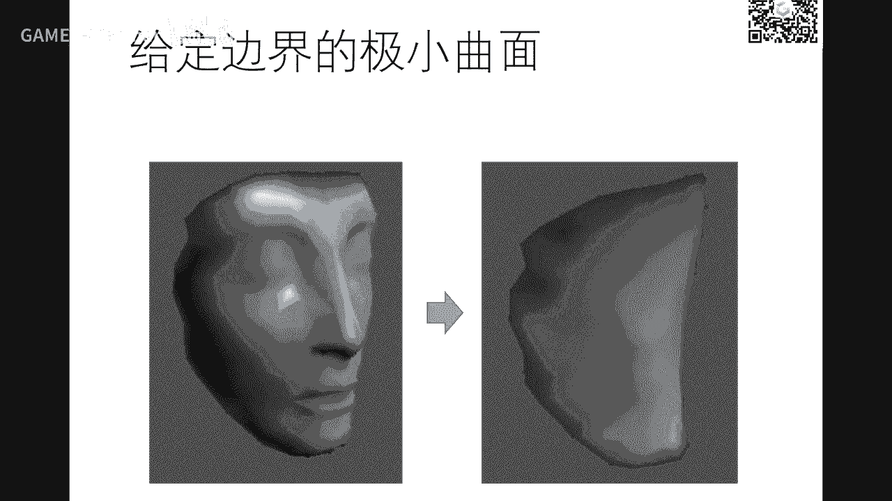

我们今天呢就讲一个简单的方法。

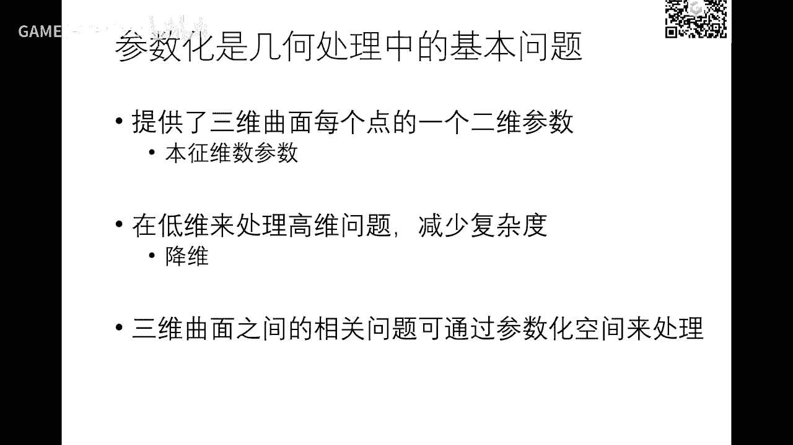

方法非常简单啊，你们做完了刚才说绩效曲面就会做好，我们机械曲面是不是把边界固定了，然后通过每个点的拉布拉斯等于等于零啊，就可以求求解刚才那个lx等于零，就可以求出这个曲面是吧，左右六是什么。

是是不断迭代啊，来逼近它，那么现在呢通过一个方程组就一下子就出来了，也是固定的，好，我们再来想一下啊，如果边界这个边界是空间的，对不对，如果我有办法把这个一圈这个封闭边界，把它映射到一个矩形的上面。

具体运势怎么印，这是另外问题啊，但是我的顶点顺序一样，但是最直观就是根据弧长的大小，这里多多长在这里比例是多长是吧，好运过来，是不是我同样解解解解这个方程，我可以保证这些点全部落落在这个平面上。

因为这是平面矩阵嘛，啊平面矩形嘛是吧，就得到一个解，因为这是平面的一个啊，正方形边框一定是平面是吧，哎是不是就得到了这个点在二维中的一个影射，这里也是一个网格，首先诶我们如果急交警面那个作业做完以后。

再进一步把边界把它拍到这个平面上一圈马，他就得到一个他的在二维中的嵌入啊。

就是一种参数化啊，所以就出来了好这就是早年一个非常简单的线性传统化的一个方法啊，这方法是什么呢，我把这个开面的边界把它拍到平面上啊，啊最好是凸啊，为什么图我怎么怎么解释啊。

比如说是一个原t上面或者是个方形上面，然后通过解刚才那个方程啊，每个点都等于它的一领域的中心啊，边界固定了，边界是已知量，只要求解内部的这些点啊，求解这个刚才的l x等于零，就是内部那些点边界是边界。

这些点呢是出现在这个b右边了啊，好啊，就是空间一个网格就可以把它参数放到一个平面上去啊，那么这个是一个西式方程组，就西方程组呢跟看到那个呃看看绩效全面的全球法是一模一样的，所以做完那个作业。

你把这个边界再处理吧，就变就可以求出它的参数化了，这猜的话呢实际上是这个方法，刚才啊我们这个地方给大家引导的是吧，这个方法很早就有了啊，63年啊这个tt啊，这年啊这是个人啊，63年就证明了啊。

如果这个边界上是边界是位于凸多边多边形上面啊，矩形啊啊方形啊，求圆上面都可以，那么可以证明刚才写的这个lx等于b，这个b就是边界上的点在右右边了啊，好中间点是x是未知量解，这方程我可以理论上证明啊。

证明啊这里里面的点一定三角形一定不会发生翻转翻转，什么翻翻转就是这个顺序就是右手系，那么这这个点的顺序也是右手系，并且这里面没有这么一个一个三角形，会发生左手系的这个啊顺序啊，这个非常强啊。

就既保证了什么，我这个网格如果是个流行，这算跨过来以后，他也是个很好的流行，不会有flip翻转，就是flip，forever，因为如果发生flip有应该有方方方出来以后，我我我我一个纹理贴到这里时候呢。

就是什么，就这里有好多三角形都对应同样一片纹理，这里就有鬼影啊，就是这个纹理在这里就不连续了啊，大家能理解吗，就有就有logo不同的顶点或三角形硬，直到同一片区域上面去了啊。

就是这个flip的这个发展的原因，就是这个函数在这里点的局部的亚托比小于零了，因为一般都大概率就是啊这个啊，我这个以后我再再来解释这个隐私的亚科比啊，跟这个翻转移的关系好，所以他的话你们也会了啊。

所以所以这是作业啊，常的话也要做好一不同的就是什么，就是把刚才做那个全解法再加一步变化，那么就把这个边界运行意识到平面上就行了，这两部一模一样，就是这两步是刚才已经讲清楚了是吧。

然后呢只不过要把边界印证一下，因为编辑器啊，你按你按你那个那个边界的这个弧弧长，把它应用到一个正方形或者或者根圆上面啊，这个非常简单啊，稍微细心算一算一下啊，按这个弧长算啊，就是就比例分配一下啊。

然后呢然后再再再办的一个纹理嗯，这个做网文里都有，你找一找啊，然后呢嗯你把它插画以后呢，这能切切切个纹理，把图像印到曲面上就可以了啊，这个应该是games 1019教大家就会的啊。

我们这里告诉大家怎么去生成张纹理图啊，怎么去做它的这个这个参数化的结果啊，你要就是同一学传统学学就告诉你怎么画，但是那怎么来呢，这个我们这个课要帮你们解决这些问题啊，哦好现在你们知道了，给定一个网格。

这网格可能是美工，也可能扫描扫描做的，也可能是你通过别的方法做的，我会把它插进化到一个评论区，你们至少现在有方法了是吧，是不是，不过这个方法可能比较简单啊，扭曲可能会比较大啊。

你可以看到啊啊这里好比如说这里顶点很密。

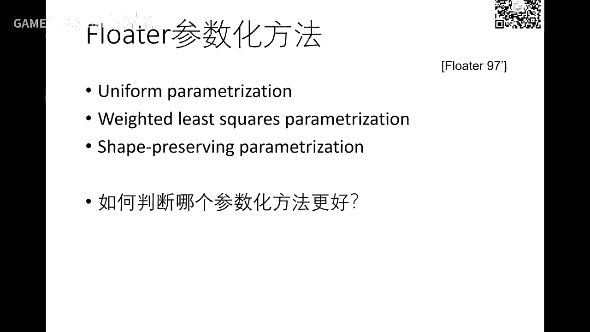

这里就就仅仅很很就很挤嘛，是吧啊，那么嗯在这篇文章里面啊。

我们也会课后公开给大家啊，那这篇文章里面就是这里有不同的权，实际上是这个权呢，大家也也不用多实现。

你就就用cos你就行了啊，我这里你提一下啊，好那么你插着画完以后呢，这三个球是你们上次作业也用到过的哦，然后加上这样一个纹理啊，假设这个纹理我们特意用这样格格点，格点的话，可以看出啊这个映照水面上的话。

这些格子大小到底是怎么样啊，用不同颜色就表示我知道哪一片印到哪一片去了吗，啊可以看到啊，像这一片格子比较大啊，这格子比较小，说明在前面在这里发生了扭曲了吗，啊你可以看到这个扭曲的结果啊，啊所以你猜的话。

完了以后纹理映射马上就出来了，好，那么这个是就是刚才说的拉普拉斯那个那个向量，就是那个坐标的全全不一样，结果不一样啊，就是这就是那那个组合的vi减去西格玛欧米伽i j vj，你这个全啊。

我们这里建议大家用口腔里那个圈口袋，好像是这个结果相对来说会好一点啊，如果用经营权是上面那个结果均匀权伤口啊，一般不好啊，看到歪歪歪歪扭扭的哈。

嗯你可以看到对于这种开口很小和口口在这儿啊，那么顶点很多，往往这个地方的顶啊很密很密很多吧是吧，它会挤在一块儿，就因为这里很多很多点都会在在，在这里就容易发生数字上的一些精度问题。

可能一个这么小区域里面就有好几百个甚至上千个点啊，那个数值误差一点点误差，可能这个这个错误就就会有问题啊，所以这里啊怎么样让这里有更好的性能，你这你们这里也可以想想。

这这里一个三角形面片可能跟这个地方成面片，在空间上这里看大小差不多，在这里呢这个面片段变成变得非常非常小了，在这里呢可能是这么大对吧，所以它的扭曲在在这里是极大极大的啊。

所以它的三角形被被扭曲形变得非常厉害啊，这边呢相对来说好一点啊，这这个是这个是是很不合理的，因为你贴贴个纹理，你你你这里一个格子一个一片颜色，跟这边格子像这里的话。

可能这格子就这么大，这格子呢可能是很大很大啊，那么还有还有还有还有这里一样，这口这个是这个曲面口口在这里啊，就脖子脖子这里是有个边界印到一圆上面，这肯定全部挤在这里了。

你可以看到这里一片一片区域格子跨了好大很多点点，这里呢你格子这么小是吧，所以很不均匀啊，那么呃但是它的一个参数化的简单啊，然后有效，什么叫有效呢，就是不会发生翻转啊，嗯怎么去解这个均匀化这些扭曲。

这是未来的事情好吧，我们这节课先先就接受这个结果啊，但是他至少给我一个比较好的参数化，没有翻转嘛对吧，只不过扭矩大了一点，即便大了一点，这个未来再来改好，这是映射到不同的图片键啊。

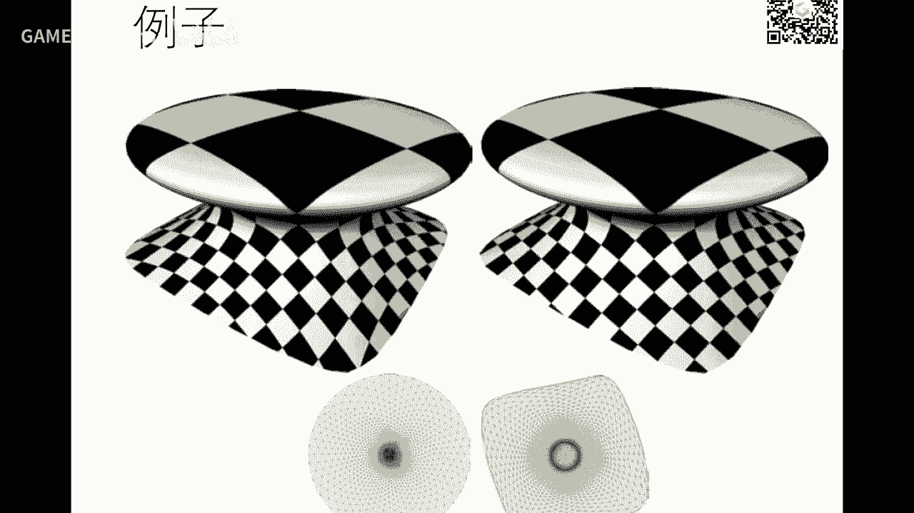

结果大家看一下这个例子啊，嗯当然如果一片去做到它的话。

就很容易发生这种问题，就是很多很多点啊，别被截在这儿是吧，就就导致这么大的扭曲不好看嘛是吧，所以很多很多美工呢也会去人工的去割。

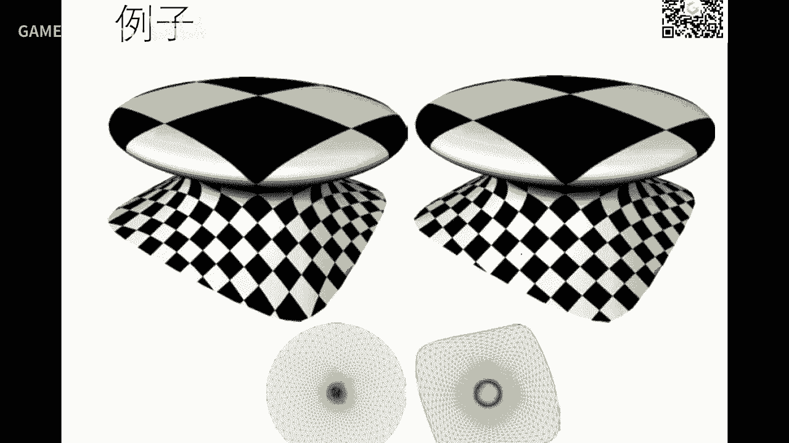

把这一个五大模型啊，就割成若干块，每一块的才能化啊，像这个这个才能画到这啊，身体呢参考到到这儿是吧，然后再把再把它packing，什么意思，pin就是把把它把它装箱装在一在这个矩形区域上面啊。

然后在上面再在上面贴图啊，就这个样子啊，这上面的纹理有了以后呢，再把它运过来啊，就这个这个这个u v图啊就出来了啊，美国的有的时候是直接在这里上面画，也可以在在上面画画它的颜色啊。

最后呢还是要有张这个uv图出来啊，所以你这所以呢这些白的地方就是浪费空间，因为你在比如说是1024x1024，你白的越多，实际上是白的，这个信息是没有的啊，对这个曲面的纹理是没有贡献的是吧。

所以但是你要增加它的存储，所以这里面怎么pk比较紧，也是里面的一个问题啊，以后呃我们介绍几个工作给大家参考啊，如果你们要去做算法的话。

那么这就是一个兔子分成多块的一个纹理贴图，右边是它的一个u v图，有的有有的这个uv图加上几个兔子啊，然后通过那个啊，这个图有个名字叫athless，有个谢谢主体叫cht片。

那么那么这个图叫arless，纹理地图啊，在软件里面看到这个词，就是指这个这个地图啊。

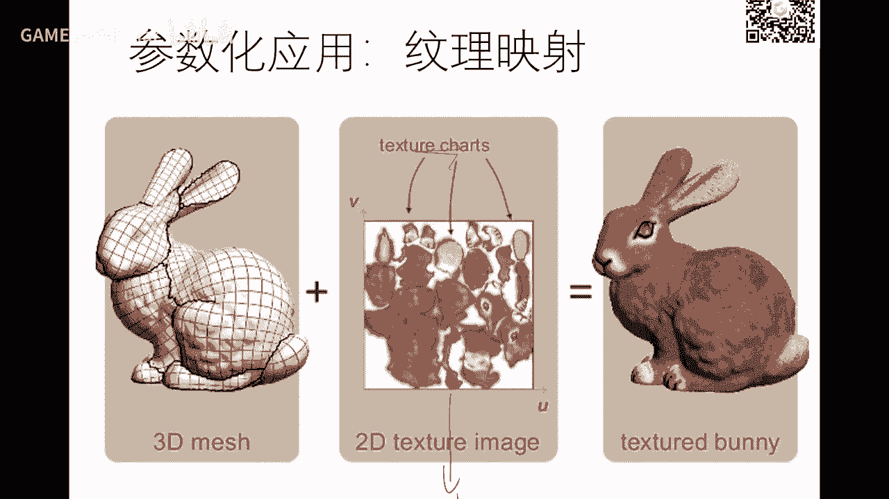

还有一部分内容，那我们尽快讲完好，那么三句话讲完明白了以后，我们再看一下这个啊，就是再回到前面，global拉普拉斯smoothing，我们这里再增加一点这个内容啊。

这个网格进行global的smoothing，还记得哈，就求解那个lx的调查，德尔塔，让德尔塔每个德尔塔缩短缩短这百分之啊，这个十上升你们操作的时候呢，往那个移动是不是相当于把这个拉普拉斯缩缩短是吧。

就拉8+1撇等一，比如说0。9加塔，这个零点就是指这个这个这个向量缩短了哈，那么你更新一下啊，哪些求解就变变成它了x一撇了哈，sp的这个调查一撇，这是交叉，原来交叉交叉变变成变短了。

就可以求出一个smooth的一个这样的网格好，你的网格很容易发生发生坍塌收缩是吧，所以呢哎我能不能一些关键点，关键点也叫特征点，然后我再让别的地方所说是吧，就怎么来加这个约束。

说的话呢啊啊我们这里就呃先把这个概念给大家介绍一下，叫叫叫叫heart constrain，跟soh变什么意思呢，它的方向就是说这个这个约束一定要满足，说什么约束呢，可以给它缓一缓。

就有点像我们优化里面的minimize fx subject to一个gx等于零，那么这个这个元素如果是一个啊，一定这个叫half constrain，这个约束一定得满足。

如果你说我这个约束呢可以给他放放放松一点，那么minimize加上一个兰姆达gx平方，我去循环，这个就变成一个无约束的形成分子，我希望这个值尽量小，因为这个值就不能太大太大，这个这个就很小是吧。

通过这个兰姆达拉姆达越大，这个值就越小，这个叫说不成sop constrain啊，它变成一个软约束上，是相当于是把它变成目标函数啊，啊如果是大成子的话，这个约束也要完全满足，因为它偏导等于零，好好了。

那么我们这里如果加约束的话，我们回忆一下拉普拉斯是这样一个构造哈，如果我们把xyz全部把它列的一起来，就可以变成一个这么大的矩阵xyz，因为有很多约束是对xyz同时要满足的好。

我们的举例这个性质刚才讲了好，如果我们希望把这个点fix这个点就不变成变量了，因为我要固定这个点，那么如果变成一元素，这个这个点就不作为变量啊，解没问题啊，但容易发生什么事事情呢，因为求解那个方程组呢。

实际上就是把那个误差平均分配了嘛，所以这个地方呢就比较怪怪的尖尖点，大家可以试一下啊，我们一般不不是，如果你这样用户以固定这个点呢，我们会把它变成软约束，让什么让误差平均分配啊。

所以我们会在下面这银行呢再加一个约束，x等于多少，x等于多少，y等于多少，等于多少，这样的话呢这个矩阵就变大了是吧，如果你想加这个降价呢，再把这个矩阵一点，虽然这个这个这个方程矩阵啊是变成了非方阵了啊。

变成一个狭狭长的，但没关系，我们可以在最小从意义上去解它啊，因为它它是个非方阵了嘛，啊等一下啊好，那么就把刚才那个带约束的这样一个呃拉普拉斯什么事啊，就变成这样这一个问题我希望他的拉巴斯尽量小啊。

这是拉普拉斯啊，诶我希望某些点呢要靠近我的标准那些点我也希望他他尽量小，中间加一个圈，就平方要不要注明没关系啊，啊这个平方可以可以不要好，这是个圈啊。

求解它就能找到一个最小二乘以上的这个东西加一怎么来呢，啊之前啊假设你想呃我这里再讲另外一个约束，叫叫叫叫三角形fish中心约束，我希望这个三角形的中心保持不变，这个是不是满满足，这样在一个三个点的方程。

三个点是未知数嘛是吧，所以呢哎你也可以把这种约束也加到这里来，所以这样一个方，现在你可以重新加好多别的约束啊，这时候就就相当于是是是这样一个约束，好好也可以加边的中点，我保持不变。

或者是呃一人语的终点保持不变，只要是所有是线性约束，都可以在这个矩阵这里加按约束，所以这里主要是线性元素，对于xyz的一起的线性元素啊，这时候这个l就这个这个这个以前是方正的这个l啊。

就就一个l11 个非方阵是吧，这个方程怎么解呢，啊就到这里了，你加了好多约束，顶点约束，面临约束，还有别的约束，最后就把它变成一个这样的这个a呢就不是方方正了，就不是一个啊呃啊方方正正的一个矩阵。

它可能是个很是这个狭长的好，那么对这个呢就是我们啊没有一是吧，所以我们会怎么会会会去解minim值这个最最小值就行了，好那么这个东西minimax差就等价于求这个啊，那么这个方程呢呃因因为它是非方阵。

所以我们用最小2x1去解，大家听清楚吗，这个这种过过你过啊，他解法就是这样啊，就是左边乘上一个ae啊，aa的那个转那个转置，他是这个时候他觉得方方算了嘛啊这个转制成它不一定是个啊，半半是吧。

如果它的列满值的话呢，它有一定是个镇定，所以它它就有逆，所以它的a t乘a的逆乘上a t b t b过来啊，这个是把密啊，就求求求求求这个点，那么这个呢就叫他的那个normal equation。

啊叫反方层，我们以前在很早，第二第一节还是第二节就讲过这个最小二乘拟合的法方程一样道理啊，所以我们是求这个带约束这个这个最小二乘解，这这这一页有的啊，就是求它的法方程啊。

就知道这个解好这个方法减减震方方程呢也有也有很多技巧，因为如果这个这个a呢不变，只是这些坐标在在变的话呢，我们这个这个方程呢啊这个逆啊啊，因为球技是比较烦的，所以我们是用它的分解，是一种分解技术。

这个呢在icon库里面也有啊，大家不用自己实现与小实现的话，还还还还挺麻烦，这时候呢你就分解一次，是你就可以重复去用啊，呃后面可能我们讲后面编辑时候还会讲到这一点啊。

这时候呢你可以看到如果我约束一些点不动啊，那么就可以什么防止这个曲面收缩很厉害，因为我相当于钉牢的一个点，把它钉钉住了吗，这些例子，那么你这个参数不一样，你可以光滑的不一样是吧。

然后这里有个l o d的概念，就是越来越光滑，后面还有啊，我们还有可能就来不及了啊，我先快速讲一讲吧，这个下下节课我再展开啊，编辑什么意思呢，编辑编辑就是我们过一下，我把把这个问题先提出来啊。

好我我有一个曲面网格曲面在这里，我用户呢希望拖动这个这个龙这一点把它往上移一点，就是我只是以一这个点问这个龙的其他点变成什么样子，是和我用不要的编辑是吧，比如说诶这个如果这如果全面变成这个样子。

这点点更新完以后更新成这个样子，诶是不是就有点像我们把这个笼子嘴巴给掰开是吧啊，这个叫编辑编辑呢，实际上我们用户往往是只是编辑一个点，我算法就是说我们的这个处理要求，你怎么根据这个点移到这个点的位置。

就是从这移到这呃，去求出其他点的坐标，怎么求啊，大家可以先想想好吧，那么这部分呢我们那个啊可能只能下下下都来讲，这个事情在本质上就是什么，我再提一下这个思想本质上就是什么，这些每个点变成哪里。

这是用户交互交互的吧，我们我们尽量去保持他的拉拉巴斯就行了好吧，因为拉普拉斯度量呢每个点的局部领域嘛啊局部的细细节嘛是吧啊，我们只要相当于什么我我这一圈之外都不动，这一圈里面顶点都作为变量。

都保尽量保持原来这个拉布拉向量是不是就保持这个曲面的性质是吧，只不过呢这里要要做的细点的时候呢，因为这个点到这里来的话，就发生了一个小小的旋转，所以这里的拉普拉斯呢也要经过一个小的变换，这个才合理。

如果你保持原来的拉普拉斯，可能就效果不是那么好好吧，细节啊，先把这个论文扔给大家哈，大家可以去看一下，就是呃每个人每个点局部拉普拉斯都保持同样的长度，但是方向可能会发生旋转，怎么怎么处理这个事情呢。

啊我们啊我们下节课再再再再来讲吧，今天，我把作业给布置一下哈，时间也快到了，也给给大家一周，因为上面这个方程组够电啊，你们只要只要拿呃，建议大家啊，那个任务就是这样，就把作业六的交交学院再做一遍。

只不过是用全新方法做好吧，这做完以后把边界变一变，就得到参数化了，很很快啊，所以本质上就在什么学，学会怎么去构造方程组以及整我去调用i跟库去求解这个方程组好吧，放下不必自己写。

自己写那个求解器怎么求解这这个吸收方程组的话，这个没有这么快啊，去直接调查啊，嗯这个这种不用重复造着造轮子重复，除非你以后专门去做那个高效的这个计划优化算法啊，那么你可以去自己去写更高效的这个方程组。

求别气啊，在这里的话大家先用用起来啊，先做我们做的这个这个几何处理事情好吧，然后局面也一样啊，都是我们上一节课给你们重复拿来用就行了，所以你们这里两个人一个是怎么去构建，就是那个拉拉拉l哈。

第二个怎么去求解求解求吊吊吊吊这个库啊，不要自己去，那么你要去调它的话，你一定要去看它的接口好吧，按照以前的经验呃，我是本上本科生的通信学作业，这种这种作业一个礼拜是人工完成的啊。

所以你们提早规划一下啊，这个周一周二周三稍微思考一下哈，稍微了解一下i跟库，不要多，周六日来做可能就来不及了啊，这同学们啊都是喜欢到最后一个晚上来做，有的时候遇到一些困难就不可预料。

还不如前面先了解了解一下好吧，关于啊这个啊怎么用啊，如果遇到困难的话，我们助教都是非常有经验的好吧，哎这个啊这个可以马上回答大家的问题啊，你们甚至可以跟注一下私聊，可能他会给你一些技巧，好吧，行对啊。

我本来想这个主页是留两周啊，我后来想了想，我后面还是给到呃那些好学的学生多多一点训练啊，一周啊，那唉呀说到底啊嗯嗯每个人从同学们都是这样啊啊差大部分吧，你给两周给三周都等价于给一天啊。

你们基本坐在最后一天来做是吧，所以给一周你们你们也够好吧，就一周一周的话呢，上次本质上是等价于给了你们1~2天啊，两天就可以做完嘛，好好那我就时间就那个不不在给长一点啊，那么呃能做完的同学一定能做完。

做完同学你给他一个月，他也他也做不完好吧，所以我们后面还是希望桌布是几个作业，好，让那些呃那个第一梯队的同学能够得到更多的一些技能和知识，好吧好，那么呃同学们由于因为有些学校要期中考试啊。

期末考试啊可能比较忙，那你以后再来补也行好吧，这个呃我们就先带着先锋队先往前赶，那么如果由于呃不同的人同学时间不一样，你们在后面再再来补也来得及好，那么这次卓越的就到这里嗯。

其中我们中间啊这个介绍的一些文章我们会也挂在网上啊，给大家参考好吧，如果没有的话，你们可以去问助教要啊，或者提醒我们一下，我们挂在网上好，那个视频同样啊明天会挂在b站，如果需要了解细节。

大家也可以去看好，同学们，咱们就今天到这里为止。

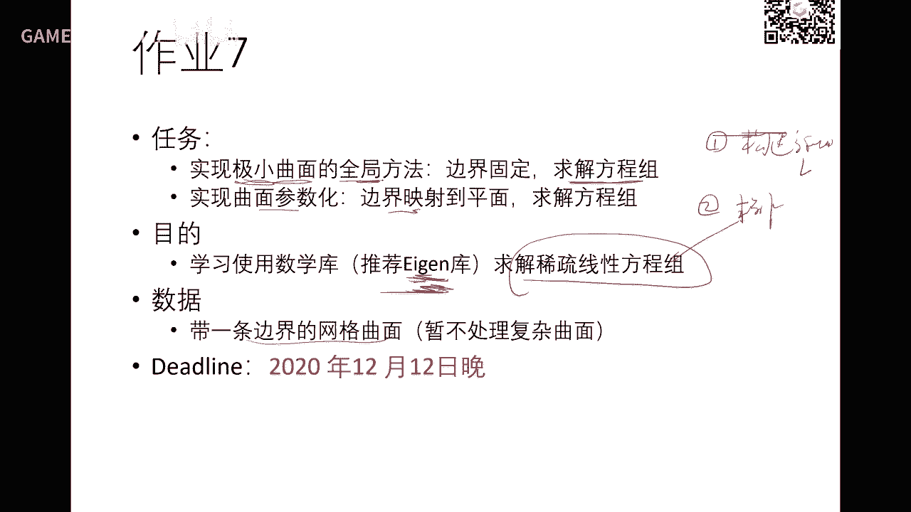

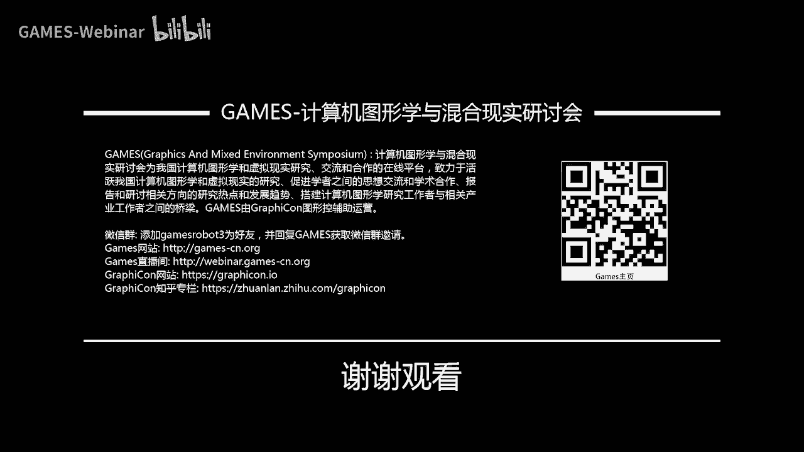