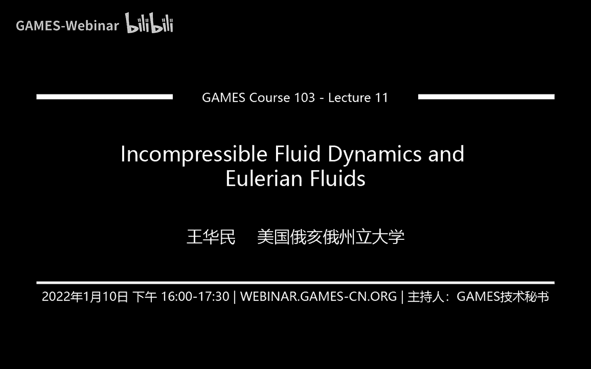

# GAMES103-基于物理的计算机动画入门 - P11：Lecture 11 Incompressible Fluid Dynamics and Eulerian Fluids - GAMES-Webinar - BV12Q4y1S73g

行那我们就那个呃开始吧，呃我们还有大概还有两节课的时间啊，主要就是来讲流体这一块啊，然后我们今天主要讲的是那个嗯叫做一呃基于网格的一种方法，基于欧拉的一种方法，我们来讲怎么来做流体模拟。

然后我们下节课有时间的话，我们会讨论一下怎么样用粒子的方法去啊解流体，处理流体问题啊，然后大家可能都知道，这个我们1月份的时候有一个对图形学比较重要的事情，就是有cf的deadline。

所以说我们最近都比较忙，所以所以说我下次下节课的ppt到现在都还没有弄啊，反正就是我就是尽量吧尽量给给同学们啊，把最后一节课上上完，嗯然后嗯然后有什么问题的话。

反正下节课我我也会留出一点时间来回答一些同学们的问题，好吧，然后今天主要讲的是呃基于这种网格的啊，模拟流体的方法，我们首先会讲一下这个网格的表达是怎么样的啊，然后我们会有点延续上上节课的知识。

叫做final difference的知识，我们会讲就是我们有了这个网格之后，我们怎么样可以利用网格去算很多呃，偏微分啊，还有算很多这种微分算子，这个对我们解流体力学就特别有帮助呃。

然后呢我们会讨论这个流体的这个方程叫做nel stokes方程，可能大家或多或少听说过，那么这里我们图形学里面主要解的是叫做incompressible visors的这种啊。

流体所谓的incompressible呢，就是说我假设这个流体是不可压的啊，就比如说像水，你不管怎么压这个水，这个水的体积基本上是固定的嘛对吧，那空气呢我们其实也是做同样的假设。

我们也是假设空气是不可压的啊，当然现实中我们知道这个不管是空气也好，水也好，它其实你给他足够的压强，它其实都是有能力有办法把这个它的体积变小的，但是我们这里呢就主要就是做一个简化。

我们就假设啊这些流体都是完全不可压的了，然后viscus的意思就是说我们会会有一些粘滞啊，我们会讨论这啊，就是navexecution，我们会讨论说我们怎么用啊数值的方法去解这个流体力学的方程啊。

那这个流体力学方程它主要描述的是流体的运动，也就是是流体的速度，说白了就是流体的速度啊，那光有速度不行嘛，对不对，因为光有速度，我们还要描述流体的状态，就像我们之前我们做粒子模拟也好。

做各种各样的形变也好，你光有速度还不够，你还要有顶点的位置吗，所以说同样的在我们解流体里面，我也需要有相对应的东西去描述流体的状态啊，那么我们会讨论水和液体和气体，我们分别应该用什么样的。

有哪些模型去描述这个状态啊，然后怎么样能够跟前面的navs qu结合在一起，嗯然后还有一点我想说的就是说图形学里面用到的这些方法，其实都不是图形学自创的，很多方法都是从流体力学计算。

流体力学里面借鉴过来的，有很多paper都是呃两边发两边引用的嗯，但是最近几年，最近这10年基本上就是这些方法都已经比较固化了啊，所以说啊所以说大家其实在很多啊这种引擎，像胡迪尼啊。

还有很多很多其他的这种工具里面，blender啊，其实都可以看到这些呃，解流体力学，解这个都已经变得很标准的一个操作了，所以说我们今天基本上也是讨论一些比较标准的这种算法。

那首先我们来想讨论的就是这种网格式的这种表达方式，呃，我们上周其实已经见识过了一种表达方式，但是那个实际上并不是真正的一个描描述一个二维或者三体，三维里面的流体，我们实际上是做了一个近似的对吧。

比如说我们二维，我们用一个一维的数组去描述这个网格，就像我们作业里面我们用的是一个二维的一个网格去描述数组，那这么它的好处在于，我们把空间给减小了，那么我们相对应的我们的内存的需求。

我们的这个计算的复杂度也会降低，那么如果说我们不做这样的简化，我们要真真正正的去模拟一个二维或者三维的水应该怎么样呢，那我就应该真正的在这个二维的空间或者三维的空间里面，去定义这么一个网格对吧。

那比如说我想做一个二维的一个流体的模拟，那我就把这个二维的空间用一个2d的一个网格给它覆盖，那比较常见的就是这种regular grade，所谓regular grade就是我里面都是一个正方形啊。

我的这个长跟宽都是一样的，然后呢我就均匀的分布把整个空间给占满，这种是一个比较标准的一个网格啊，当然也有很多变种了，比如说我可以把这种网格跟我们上节课讲的heat field结合在一起，我可以做这种。

还有这种做我可以做这种quite tra或者是binary tree的那种网格，还有呢我可以用不同大小的网格就等等等等，他这种会有很多这种呃不同的模型，但是呢我们这里好想的就是比较标准的。

比较简化的这种规则的这种网格，那么规则的网格它为什么我们呃想要用这种规则网格呢，其实因为它有一个很大的好处在于，如果有了这个规则网格之后，我就可以认为比如说我这里面是一个格子吗。

我认为这个格子里面的物理变量我可以定义在这个格子的中心，我就可以把这个每一个格子都给它附一些值，附一些物理的值了，那这种物理值它可以是一些标量，比如说啊密度啊，颜色啊，压强啊，温度啊等等等等等等。

这些都是标量吗，我可以认为这个格子里的这个密度啊，颜色啊，温度啊，什么都是在这个中心点的这个点上的，当然了，我也可以复制矢量，比如说速度等等等等等等，还有各种各样的其他的。

那么整个二维的网格我就有很多很多的小的这种格子嘛，每一个格子我都有相对应的标量或者矢量的物理的这种值，复制在这个格子上，它整个就构成了一个厂，我们可以把它叫做一个标量场或者一个矢量的厂。

那么这个厂由于它定义在这种规则的格子上，它带来了一个很大的好处，在于我算倒数呃，以及我利用导数进行各种各样的这种微分的这种计算，就变得非常容易了，啊我们比如说我们上节课我们讲过对吧，如果说在时间上。

假如说这个横轴是时间，然后呢我有三个相对应的时刻，分别是t0 减负dt，然后t0 加deltt对吧，我分别有前后两个时刻的这个函数值，然后还有个中间的函数值。

那么我可以利用我们central differency呢，我可以前面讲后面我可以把前面的值减去后面的值，我就可以，然后再除以两倍的跨度，我就可以得到函数值在t0 的一阶导数了。

这个是我们上节课讲过的叫central differen，就是可以利用前面左边前面剪，前面剪后面，或者说右边减左边，然后除以两倍的跨度值，就就是整个跨度值嘛是二代的t嘛，减去跨度值，我可以得到一阶导数。

这个是我们上节课讲的，那对于格子而言，对于这种网格而言，这个东西就变得很非常简单了，对不对，因为我就假设我这个函数值是在这个格子的中间的嘛，那这个格数指的是f i j，我假如说是个二维的对吧。

横横的是i做的是j，那么这个格子是f i j，然后边上这个格子呢是呃f i加1j，因为它是往a方向再多了一个嘛，那我就可以利用我们之前的那个centre difference的公式。

我就可以把中间的这个位置给他导数给他算出来了，那么中间这个位置是i加0。5，所以就是i加0。5的函数的一阶导数等于啊右边减去左边除以跨度，然后这个跨度就是咱们这个格子的宽度是h。

就是大家可以从这个例子上就可以看到它这个网格的这种表达方式，对于我们呃求一阶导数是非常便利的，e而且他不只是在这个位置，它在所有的位置上，如果说你想要算这个对于x对我们横横的方向叫做x啊，这个叫x。

然后我们把zm的叫y，那么我对x求一阶导数就变得很便利，呃同样的道理，比如说我现在我这里想做二阶导数，我想要知道这个二阶导数，那么二阶导数怎么算呢，我可以做两次一阶导数嘛，对不对。

我先把这个点上的一阶导数给他算出来，那是i加0。5，我用右边减左边，我给他算出来啊，然后呢，我现在算这个点上的一阶导数，这是i减0。5对吧，我可以利用右边减左边，也可以把它算出来。

那有了这两个一阶导数之后，分别是在这个不是在中间啊，分别是在这个格子上呃，分别是在这两条边上对吧，分别是在两条边上的一阶导数，我算出来之后，我再给他求一次一阶导数，对他们两个我再求一次一阶导数。

我就刚好完美的得到了ig这个位置上的二阶导数了对吧，因为他俩是一阶导数嘛，然后我对他俩的一阶导数再求一次一阶导数，我就得到了二阶导数，然后呢这个位置刚好又落在中间了。

所以说这里通过我们展开我们得到的这个整个式子，就是左边加右边i减一，加i加一，然后减去两倍的他自己除以h的平方，这个就是我们算二阶导数的公式，利用central difference算二阶导数的公式。

当然这个公式我们其实上节课也讲过啊，其实也讲过，就是利用这个公式算二阶导数，只不过对于格子而言，这个东西就变得啊那处处都可以算了对吧，因为我们整个就是个格子嘛，我们哪里都可以算。

那同样的我刚刚得到了x方向上的二阶导数，我对y方向上的二阶导数我怎么算，一样的道理，只不过我现在就变成了上下的这个方向对吧，然后利用我们的公式，我们得到的是呃上面的这个函数值，加上下面这个函数值。

然后减去两倍的它自己除以h的平方，这个就是我们算y方向上的二阶导数，那有了这个有了前面这个公式，我们知道怎么算二阶导数，分别作为呃x跟y方向，我知道怎么算二阶导数之后，我就可以呃做一些操作嘛。

比如说我想要算拉普拉斯算子怎么算对吧，对于网格上的拉普拉斯算子，拉普拉斯等于什么，拉普拉斯就是两个二阶导数的和，就是分别是x方向的二阶导数，加上y方向上的二阶导数，我把它俩加起来，这个叫做拉普拉斯算子。

然后呢我们利用刚才这个公式呢，我们最后得到的就是上面的加下面的加左边加右边的减去四倍的，他自己出h的平方啊，其实大家简单的直观的理解就是所有的邻居，我把我所有的邻居加在一起，这都是我所有的邻居嘛。

左右前后马上下左右嘛，然后减去四倍的，它自己除以，然后最后除以h的平方，这个我们叫做拉普拉斯算子，就是在这个网格上的一个离散的拉普拉斯算子，就是这个东西，这个是我们可以利用这个网格的这种特殊结构啊。

然后我可以很方便的把这种微分算子，拉普拉斯算子给它描述出来，离散化出来，那么跟上节课我们讲到了边界条件嘛，啊同样的我们在做这种完整的这种网格模拟的时候，我们也需要设置边界条件。

那边界条件跟上节课其实也差不多，就是也有两种边界条件，分别叫做dsent边界条件跟newman边界条件，所谓的derially的编辑条件，就是说我假设外面的这种边界上的这些函数值是已知的给定的。

比如说我这个点对吧，假如说我这些深色的这个格子啊，全都是啊已经已知的了，已经是在隔空间外面的了，已经是在外部了，那么我就假设这个格子里的这个函数值是已知的，比如说是某个常数，我假设它是个常数。

那么在这种情况下呢，我的拉普拉斯就变成了c加上其他邻居减去四倍的他自己了，如果说我想要得到i j的拉普拉斯的话，那么就是相当于这个，而原有的这个左边的这个函数值，我就认为是一个常数c了，我就带进去了。

同样的，如果是newman boundary condition呢，那我就稍微改一改，我就不假设它是一个常数值，而是我假设这个函数值跟我i j的这个值它有某种联系，某种关系。

它可以是个比例或者是一个什么线性函数，或者是某一个函数，不管他，但是我可以认为他俩是有某种关系的，那么比如说我可以认为他俩是相等的对吧，我假如举个例子啊，不一定是boundary no man。

帮助condition都是这个样子，但是比如说我这里假设他俩是相等的，那如果是他俩相等呢，啊这个拉这个拉普拉斯会变成什么样呢，就变成了其他邻居减去三倍的他自己了，为什么，因为他俩永远都相等嘛。

所以说他俩减一减等于零啊，所以就不需要考虑，就变成了其他邻居加在一起，再减去它三倍，它自己除以x的平方啊，所以说整个边界条件跟我们其实上节课我为什么上节课讲hifd的。

主要原因也是这个就是可以帮助我们啊很方便的理解，就是今天这节课里面啊的一些知识，同样的上节课我们讲了这个高度场的边界条件嘛，同样的我们在模拟这个啊这个这个完整的这个流体，就是不用高度常用。

直接用网格去模拟流体的时候，也会存在相应的便捷调节，好了，那么我们接下来看这个一个具体的一个小问题啊，而不是流体的问题，但是是我们一般来说做数值计算啊，里面会通常举的一个例子。

什么例子呢叫做拉普拉斯方程，拉普拉斯方程什么意思呢，其实很简单，就是他说拉普拉斯啊，他这个拉普拉斯永远等于零，当然了，这个f它不是一个函数值，大家要注意到这个f它不是一个函数值。

它是定义在所有的格子上的一个草，明白吗，它是一个草，你换句话说它每一个格子里面都有一个函数值啊，这里有一个这里有一个每个格子里面它都有一个f，然后呢，我要的是什么，我要的是在所有的格子里面。

它这个拉普拉斯都等于零，因为这是离散化的，我就认为所有的格子里面都等于零，如果是一个连续的还一，如果是个连续的问题的话，我就是认为这个空间里面这个求解的这个空间里面任意一点上，他的拉普拉斯等于零。

那因为我们做了离散化了，我就认为每个格子里面他这个拉普拉斯都等于零，那么具体比如说这个格子，我们看这个格子i j对吧，这是我的一个某个格子嘛，任意某一个格子它的编号是i跟j那么对于他而言，他而言。

他的拉普拉斯就等于我们我们我们前面讲了，对吧，我们前面讲了，他这个拉普拉斯，拉普拉斯就等于所有的邻居加在一起减去四倍的自己，除以h的平方嘛，所以这里就是啊所有的邻居加在一起减去四倍的自己啊。

除以这个h的平方，那我这里不除h的平方，因为出不出都无所谓，因为我要求它等于零嘛，所以说我就只考虑说把所有所有的邻居加在一起，减去四倍的时积等于零，然后满足某一个边界条件。

啊然后这里呢边界条件中呢必须要有一个是newman boundary condition，你不能所有的边界条，啊啊啊这里写错了，应该是norman，应该是ds，大家想一想为什么，我可能拼错了。

derrish derrhate，就是如果说这个问题，假如说我考虑我这个我我右边这个问题啊，我就我就用右边这个空间作为我的问题，然后这个小方块啊，这这这这个这个正方体正方形外面，假如说是它的边界的话。

那么这个边界中或者是某一个位置，他必须要有一个ditially的bdi，他不能所有的都是newman帮主，大家大家想想为什么为什么会是这样，假如说我是全部都是no man，帮助会发生什么。

其实你可以这么理解啊，不是体积守恒，是因为这个问题它就会有无穷多的解，因为为什么，因为大家看前面的norman boundary是说什么，norman帮主说的是，我跟我的邻居是同等的值的。

换句话说就是说这个函数这个这个值跟这个值是一样的对吧，那么假如说我得到了一个解，得到了，比如说我把所有的函数值都给它求解出来了，那如果说我把这所有的函数值全都加上某一个常数，是不是也是它的合理解啊。

因为我所有的值都加上c，首先我把你看，我把这些函数值全都加c加c加c，你会发现是不是还是等于零啊，对吧，减去四倍的c是不是还是等于零啊，然后其次如果说我在边界上，我只要求说这两个永远相等的话。

那么等于就是他并没有告诉你这个函数的绝对值是多少，所以说它会有无穷多个解，如果说你把这个方程列出来的话，你会发现它这个矩阵，他这个你你你就是你你会发现它这个矩阵它会是一个不正定的。

它不是它不是一个呃nsingle lar的矩阵，它会变成一个singullar的矩阵，换句话说它这个系统是会存在无穷多个解的，它会singular，所以说大家会发现就是当你构造这么一个信息系统。

如果说如果说你你把这个认为是一个信息系统，关于每一个格子啊，认为是个变量，你把每个格子认为是个变量啊，然后呢你去构造一个信息系统，就这样子，然后前面呢是这个我们公司里面的这些参数右。

然后呢右边呢是我的所有的f i j f，然后右边等于零嘛对吧，然后这个矩阵里面呢就是111，然后对角上是-1对吧，然后一然后如果说你去构造这么个系统的话。

你会最终发现如果说都是如果都是newman帮助condition，你这个会变成singular的矩阵，所以说他会有无穷多个解，它因为它会存在着无穷多个解。

那无穷多个解的原因就是因为你的解空间没有约束它的绝对值，你可以任意的给这个值加上一个常数，把所有的值，我们把这个厂里面的所有的函数值都给它加上一个常数，它还是符合要符合要求的。

所以说这是我们在求解这个这个拉普拉斯，就是边界条件上其实会啊，就是不能全部都是newman boundary condition，这个跟我们上节课的那个高度上有点不一样啊。

因为我们刚上节课的高度上是可以全都是能把bgary的，但是这里不可以，这个大家听明白吗，还是我要我我我停下来再讲一讲，这个其实可能需要有一点那种怎么讲，因为高度场那里它其实并不是拉普拉斯方程。

它是另一套系统了，因为它并不是解拉plus方程，他跟这个问题不一样，这个如果大家学过那个嗯学过数值，数值偏微分的话，其实这个都是数值偏微分里面啊最比较基础的东西，数值偏微分方程，那我就先呃先往下。

然后回头大家有什么问题可以再回过来看这里，然后我们就会构造一个信息系统，然后去解这个信息系统呢，啊就我们就可以用一些比较标准的套路了对吧，比如说比如说信息系统的话。

我们知道可以用jacob迭代的方法去解这个信息系统，那么这就是一个例子，就是我把这个gq币方法用到了这个信息系统里面，我去接他，然后通过迭代，然后最后把它解出来，然后大家注意到这个东西啊。

这个东西它我们其实嗯我们有一个比较直观的理解叫做拉普拉斯平滑，为什么叫拉普拉斯平滑呢，因为当你反复的进行这个操作的时候，你会发现整个东西就变得是平滑，就非常的光滑，非常的这个函数值就是趋向于一样的。

就比如说啊比如说我上面是红颜，我用颜色来说吧，比如说上面是红的对吧，然后下面是绿的，那么你反复的进行这个拉普拉斯操作呢，就相当于红颜色的就慢慢慢慢的往下走，绿颜色慢慢慢慢的往上走。

然后最终这个图片就变得很光滑，然后最终如果说你把这个解完的话，就就是这个dtf等于零，你把整个拉普拉斯方程解完的话，你就会发现整个东西就变得很平滑了，所以说我们一般来说会用这个东西。

利用这个东西啊进行一些，比如说呃图像里面我们做拉普拉斯平滑也是采用这样类似的方式，然后直观上你可以理解他这个拉普拉斯平滑的本质，就是我跟我自己的邻居求平均，比如说你看我这个f f i j就是我自己吗。

然后这些都是他的邻居嘛对吧，然后这个东西这个括号里面得到了什么，就是得到的，得到的是我跟我邻居的差，对吧，因为我跟我邻居的差就是我自己减去我的邻居嘛，然后呢我把这个差加在我自己上。

实际上就是意思就是什么，就是我把我自己的值，我把我自己手上的这个值啊，跟我邻居的这个值靠近，我尽量让我的值跟我的邻居变得一样，那么如果说你这样子反复的迭代，反复的迭代。

是不是就是最后就是大家都是趋向于平均嘛对吧，就是如果说理论上如果说很完美的情况下，那么最后我们所有的值应该都是read，都是一模一样的结果，那因为我这里我强制要求上面是红的，下面是绿的。

我没有办法做到所有的人都一模一样，那么最终的结果就是我整个场，我整个颜色的分布就会变得很很那个很很平滑，可以用八个邻居吗，有同学问可以用八个邻居吗，这个取决于你怎么离散化吧，像这个grade。

我们用的是四个邻居对吧，八个邻居的我还没真没见过，但是如果说比如说你用那种六边形的网格的话，是可以用六个邻居的，就像那种呃mash 3角网格的mesh啊，他每一个点平均下来是有六个民居的，是六个零居的。

这个套路还是比较常见的，但是八个邻居的网格我还嗯没怎么见过吧，一般来说就是四个邻居或者六个邻居比较常见，所以说这个就是拉普拉斯公式，还有跟这个呃拉普拉斯平滑的这么一个呃小关系，嗯然后呢这个整个过程啊。

这个平滑的过程呢在模拟里面啊，当然这个smoothing这个东西，这个名词本身是一个可能跟图片更有关系的一个名词吧，因为就平滑嘛啊如果在模拟里面呢叫做diffusion啊。

这个demo我就我就我就不弄了，因为我因为那个小程序有点问题啊，但是本身就是diffusion，意思就是什么就是扩散，就是在物理里面就是大家可能学过就是一个东西，比如说我有墨水对吧，我墨水滴在水里头。

然后那个墨水的墨水的这个颜料，它会逐渐的扩散到整个啊这整个这个液体的空间里面嘛对吧，这个扩散过程实际上就跟这个smooth是一回事情，当你在做smooth的时候。

本质上也就是你在对这个扩散过程进行时间上的积分，你不断的把这个墨水的颜料扩散到整个空间里面，然后最终最终所有的地方的颜色颜料都会一模一样，就是啊解到最后的结果是，哪怕是等于零的时候。

嗯如果说你做正常的模拟扩散模拟的话，是会有时间上的那个时间，像一般来说在这个前面的系数上，就是如果说你你模拟啊里面会有delta t会跟dtt相关，但是这里没有，因为这里咱们就是直接解这个公式嘛。

它这个这个东西它不是在做模拟，好然后我们前面讲了这个central difference，然后呃讲了这个三central difference in，可以拿来搞这个拉普拉斯算子，然后跟拉普拉斯公式啊。

然后跟这个拉普拉斯平滑跟这个模拟扩散都有关系对吧，那么我们现在来讲一讲一个问题，一个什么问题呢，就是关于一阶导数的问题，因为我们刚才前面其实讲直接就搞二阶导数去了，就讨论二阶导数了。

然后没怎么仔细看一阶导数，但是其实你自己琢磨一下，你会发现这里其实对一阶导图是有一个问题的，这个问题是什么，问题在于我算出来的一阶导数他没有定义在我们格子的中间对吧。

我们之前我们假设所有的物理的这些量都是在各自的呃，就是在这个格子中间的中心点上面，但是如果说我们做central differences的话，那么我算出来的东西它不在格子的中间了。

他在这个格子跟格子之间的这个墙上了，对不对，而我这个墙上呢是没有定义任何变量的，这个就有问题，我算出来的东西我没有办法去进行保存，没有这个格子，那么有同学说这个倒不是，这个为什么是个问题啊。

我还是可以用century ency嘛，对不对，我可以比如说我想要算这个ig上的一阶导数，我可以，我还是可以右边减左边吗，我可以f加一减f减f i加一减去fi减一嘛，对不对，那这个是可以的。

我就是做这个右边键左边的这个操作，但是呢这个有点奇怪，对不对，因为我这里完全忽略了我这个自身的这个函数值，我直接是右边减左边了，这个好像不是很合理啊对吧，因为我直接把自己的函数跳过函数就跳过了，照理说。

我自身的函数值应该是对于我自身的这些物理变量是很有关系的，但是呢我为了算我一阶导数，我反而用我左边跟右边的领取，我直接把自己的函数值根本就没有考虑，这个就有点奇怪了，所以呢大家就想就是我是不是可以。

不要把所有的物理变量都定义在格子的中间，尤其是对于流体模拟而言，我不要把所有的物理变量都定在格子中间，我可以把一部分物理变量定义在墙上，那么什么物理边界定义在墙上呢，这里我给大家告诉大家，就是速度。

那速度它定义在墙上，它有一个什么好处啊，就是我们知道速度它是一个矢量，对不对，它有两部分构成，分别是x方向的速度跟y方向的速度，那么速度定义在墙上，它有个最大的好处，在于我就可以把x定义在这个竖的墙上。

然后把y方向上的速度呢定义在这个横向的墙上，就像这样子，比如说you我认为是x方向的速度嘛，我就直接定义在这个用蓝颜色的表示，我就直接定义在这种树的桥对吧，然后绿颜色的呢是咱们y方向上的速度。

那我把它定义在这个横向的墙上，那么就大家可以直观的理解，就是每一个墙上我都有一个流速嘛，对不对，我这个水是从一个格子流到另一个格子里去的，那么这个水穿过这个墙的这个流速就代表了这个这个方向上的速度。

我们就可以直观的理解，就是相当于这个水哗哗哗的从这个左边游到右边，那么这个u i j就代表了这个流速，那么这个流速可以是正的，也可以是负的对吧，因为它可以从左边流到右边，也可以从右边流到左边。

所以说它可以是啊正的，也可以是负的，那么我就是可以利用这个东西来做这个定义了，那么这种格子，这种网格跟前面咱们那种所有的物理定义，定义在这种中心点的格子有点不一样。

这种格子我们有个名字叫做staggered grade，然后这个在流体里面特别的呃常见，也特别的方便，因为为什么方便，我等会给大家解释啊，为什么这个东西特别方便，但是呢啊这个我想给大家介绍一下。

就是会有一种把这种速度，专门把速度定义在这个墙上的这种表达方式，那么我们接下来就讨论我们利用这种staggered grade这种表达方式，我们可以做什么，对不对。

那么首先我们可以来计算一个格子的水的净流出或者是净流入是多少，如果大家把这个格子当作是一个由四面墙构成的一个区域的话，那么在某一个时间内，在一个单位时间内，我这个区域里面水的增加或者减少。

实际上就是由这四面墙上的速度所决定的，对不对，我这个速度越大，就表示我这个流入的这个格子里的水越多，我这个速度越小，或者是速度是负的，就表示它这个流入的水越少，那么总的流入量是多少呢，净流入量是多少呢。

是ui加1g加上vi加v j加一减去u i j，减去b i g然后这里为什么不都是全加的，是因为左边的墙跟右边的墙是不一样的，同样上面的墙跟下面的墙是也是不一样的。

所以说我实际上是右边加上边减去左边减右边，然后这个就可以得到我的这个总的净流出量，这个应该是净流出量，因为你想想看这个东西越大，u i j加一就这项越大，也就意味着流出的水越多嘛对吧。

然后这个项越大就意味着流净的水越多，然后我减一减，实际上就得到了它的净流出量，那么单位时间的净流出量实际上就是由这个速度，这些这些速度的这些组合来决定的。

所以说我们这个stard grade它有一个很大的好处在于什么，它就比较直观，你就可以想象它这个速度，它定义在这些墙上，就告诉了你这个格子里面，它这个水到底是个怎么个变化，那么好了。

我们前面讲我们要解的这个流体，我们是假设它是incompressible，不可压的，那什么叫做不可压呢，假如说我这么一个空间里面，这个3x3的这个网格里面，每一个地方都有水，都沾了水。

那么不可压也就意味着我每一个格子的净流入和净流出都等于零，也就是说我进来多少水，我出去多少水，我进来多少水，出去多少水，那么这样子的话，我总的变化，我总的水量的变化。

零也就意味着我整个体积是没有发生改变的，这个就叫做divergence free，就是它的这个那么为什么叫做divergence free呢，是因为如果说我们利用前面这个我们这个体积变化的流出。

流入公式等于零来看的话，你会发现，这个东西跟我们的divergence实际上是一回事情，如果说同学们不记得什么是divergence的话，其实这个东西啊。

这个我们用这个倒三角dot这个来表示倒三角dot，意思就是you就是x方向的速度啊，叫u啊，对x求导加上y方向的速度，也就是v对y求导，这个就叫做divergence，就是我这个u v是一个速度嘛对吧。

我这个大写的u我把它叫做速度，它是它是一个向量，它有两部分，上面是小写的u下面是小写的v，然后上面对x求导，下面对y求导，然后我把一阶导，然后我把它加起来，这个就叫做divergence。

然后你就会发现，如果说如果说我们用这种stgrad的话，那么在i j这个地方啊，他的这个一阶导数就比较好算了，为什么，因为刚好我这个左边跟右边都是在墙上吗，都是在墙上的话，我这个左右左右减一减。

我就得到了这个又对x的一阶导数，然后同样的我这个上下减一减，我就得到了v对y方向的一阶导数，然后把它加起来等于零，这个是divergence freed的定义。

然后你就会发现这个东西其实跟上面这个东西是一样的对吧，就是这个是咱们是数学上的这个表达式叫做divergence free，为什么叫divergence free，就是说divergence等于零。

就是divergence等于divergence free，就是没有divergence，然后你会发现跟咱们前面说的这个直观上的这个理解就是净流出，净流入，净流出等于零的这个那个描述其实是等价的。

就是你会发现这个咱们这个微分的这个推导啊，跟我们前面这个直观的理解呢，就是刚好就是match了，所以说divergence free的这个东西就是就是我们数学上写成这样了，兰姆达u等于这个等于零。

这个东西呢你就可以直观地理解为净流入，净流出等于零啊，所以说我就可以保证体积是不发生改变的，它这个水是不可压的，是这么个意思，这个同学们这里理解吗，有没有什么问题，ok行。

然后还有一点我想说的就是我们等会儿要讨论的就是需要用到的，就是binian interpolation，嗯，就是做差值，这个大家这个大家有学过吗，这个101里面，我们在像素里面我们对像素的差值。

对图片做差值啊，有是吧，就是我反正这里反正也重复讲一下吧，那么假如说我想要得到非格子中心的这个对抗拒只会用到，就假如说我们得到想要得到非非像素中心，非格子中心的一个函数值，我怎么做呢。

我就利用这个bina做by ina interpolation，然后把它全都存在一起，然后求和，然后最后就可以得到这个差值啊，然后这是二维的情况，如果是三维的话，那就稍微复杂一点。

我要做trial and interpolation，其实是一个道理，就是不是一个方块了，它变成一个立方体了，不需要就是立方体做差距，但是实际上整个操作是一样的，这个是我们回头会用到的一个东西。

然后还有一个需要用到的需要考虑到，就是说如果说我们速度上他不是在中心点对吧，我们刚才讲了这个速度，它定义在这个墙上嘛，那如果说我要对速度做差值怎么办呢，其实是一样的道理。

只不过就是一假如假如说我这个i j对应的是左边的这个墙，那么我就把这个x减去0。5就行了对吧，就相当于就是把整个输入的这个坐标值啊，我给它偏移一下，偏移0。5，然后把这个值再拿来。

分别找到这个i跟j然后做差值就可以了，就是如果是x方向的，对这个u速度做差值，我要偏移对x偏移0。5，如果说对v方向的速度呢，我就要对y偏移0。5，其实是一个道理，分别对对它偏移0。5。

这个是对对这个速度差值所需要进行的一个特殊处理，好吧，然后这个基本上就是我们需要掌握的一些基础知识吧，因为呃如果说你学过这个很多这种啊数据计算啊，数据偏微分方程的话，这个其实都是一些基础知识啊。

如果说没有可能没有完全零基础的同学的话，这个相当于给大家介绍一下，因为咱们接下来会要用到这些东西，那接下来我们就看这个neequation到底是怎么一回事情。

那么levels coviation它其实是描述了速度场的一个函数，一个公式啊，他最后告诉你的是我的这个速度是怎么更新的，如果大家记得我们以前做这种各种各样的模拟对吧，我们模拟的时候我们会有两个东西。

两个变量分别是速度跟位置对吧，那对于流体而言，它就是速度跟状态，那么对于这两个变量，我其实都有相对应的更新函数，我会有一个函数，我会有一个公式去更新速度，我还有一个公式去更新位置顶点的位置对吧。

那么对于流体而言呢，他这个速度场的更新呢就是这个nest equation了，就是他这两个公式呢实际上就是讲我们的速度应该怎么更新，那它这里其实是不是一个公式啊，它是两个公式。

那这两个公式呢分别讲了什么呢，上面这个公式讲的是incompressibility，我们刚才前面讲的divergence，free condition。

这个东西其实就是说我这个速度长必须是divergence freed，他的divergence必须等于零，这样子的话我整个流体是不可压的啊，所以说他这速度首先应该满足这个条件。

其次呢速度的更新呢是满足于这个动量的这个函数的，他这个说意思就是什么意思，就是我这个速度的更新啊，它是由几部分构成的，水在有这个重力的情况下，它会掉下去，然后呢其次呢它有diffusion啊。

diffusion对应的就是粘滞，因为我们在真实世界里面，它这个水它跟物体运动一样，它会最终它会有一个阻尼嘛对吧，它会最终停滞下来，所以说一样的速度它会有一个diffusion。

这个diffusion本质上就是说我最后的速度，他应该会最终平均下来叫做年制，我们这里是diffusion，然后中间这个是advor，我等会儿会讲什么是ad，还有最后一个呢是一个内部压强的一个一个料。

所以说是由四个部分构成的，整个偏微分的系统是由四个部分构成的，那么怎么去解这么一个系统呢，那么这里我们会用到一个方法叫做method of characteristics，这个方法其实很简单。

他的意思就是说我有一个很长的这么一个偏微分方程，对不对，但是这个偏微方程它是分成好几个部分的，那么我去解这个偏分方程的时候呢，我就可以把它拆分为几个部分去分别的去处理，相当于一个微分方程拆成几个小块。

然后呢每一块呢我去解一下，每一块去解一下，我最后呢就得到了最终解，比如说呢我的假如说我当前的这个速度是you，我当前的这个速度场是u对吧，我去给他更新一下，更新之后的有了，这是我第一步。

然后第二步呢我是用这个第二项我去把这个又给他更新一下，那么得到的呢是前两个更新之后的优，然后第三步呢我用这个拉普拉斯diffusion就这一项啊去对它进行更新，然后最后呢我用这个压强去给它更新。

也就是说我本来呢是一个更新函数对吧，一个更新函数，但这个更新函数咱们看到了很复杂，所以说我可以把它分成四步，我就分别的每一步都对这个u更新一下，更新一下，更新一下，然后更新完了之后呢。

我得到的最终结果呢就是我下一个时刻的速度成，所以就是这么一个概念，就是虽然说我你看我整个公式很复杂，但是我把它拆开来之后，你就会发现其实每一个步骤其实都相对来说啊，没有那么复杂了。

虽然说还是以还是我们还是需要讨论的，但是相对来说没那么复杂了，所以说我们接下来就是把它拆成几部分，然后看每一部分我们怎么样这个速度进行更新，这个就是我们的一个求解的思路，pv分方程的思路。

这个更新起来其实比较简单了对吧，因为我知道速度嘛，我有速度，我有当前的速度，那么按照我们以前的做法，对不对，在这里，假如说我这个y方向是这个上下的方向的话，那么我对应的速度就是v对吧。

这个就是我的这个y方向上的速度，然后这里就得到了我的新的这个v啊，然后这里大家要注意就是我这里更新的时候，我需要对所有的v都更新了，我这里其实是有所有好多好多个这个绿颜色的这个v的速度的。

它对应的都是不同的位置上的这个v，我每一个点都需要对它进行更新，然后呢这里呢我把它叫做new，但事实上大家如果正常模拟的时候，就直接把这个原来的这个v的这个值它覆盖掉就可以了，对我们这个速度上的更新。

其实大家可以看到，其实很简单，直接把这个加上去就行了，同样如果说你对一个比如说你的容器里面啊有流体，然后呢你有一个呃或者是什么进行搅动啊，或者是比如说你有个电吹风对吧，这个电吹风在吹吹这个气。

然后呢你想要给这个一个外部的速度的话，其实一样的道理，你只要在某一某一个位置上对这个u v直接进行这个更新就可以了，一个东西，我们第一步完成了，我们把这个u给他变了，然后我们接下来看第二部。

第二步呢是这个，然后它这个公式是这个样子的啊，然后它这个定义我给我也给大家了，是这个样子的，是you乘以u对x的导数，加上b乘以v对x导数，这个公式呢也比较复杂啊。

然后呢呃大家可能想就是说这个东西其实也不是不可以解对吧，因为毕竟咱们怎么求一阶导数都知道了，我只要把这个东西算出来，我只要把这个东西给他啊，这里这里写错了，应该是y啊，我只要把这个东西算出来。

就是相对应的这一项，然后乘以一个负的deltt，然后加上去加到这个u上去，是不是就可以了，啊这里好像写错了，我看一下，这里可能有些问题，我回头再看一下吧，这个公式有点问题，就是这是一个方式。

就是利用咱们这个求导的方式来来计算的，但是呢这个方式它其实并不是一个特别好的方式，为什么，因为它有可能会造成不稳定性，然后呢我们后来就是很多人就考虑说怎么样让这个东西变得更稳定啊。

因为当你这个时间不长太大的时候，这个东西估算出来的后会不准嘛，对不对，一阶导数可能估算的不准，那么怎么样可以让它更合理一点，更稳定一点的，然后他就在想就是说这个东西到底是个什么东西。

这个其实也是在咱们刚才没有说的对吧，那是个什么东西呢，其实他的意思就是流动的意思，就是对流的意思，导流的意思，大家可以这么理解，就是假如说我这个水是在流动的，我从这个地方这么流过去了对吧。

那么在这个水流流动的过程中，这个速度它实际上是跟着这个水一起在动的，比如说之前上一个时刻，这个顶点的位置在这里，这个水在这里，假如说我有个小的水分子，它在这里是you，那么下一个时刻。

如果说这个小的水分子流到这里了，那么它这个速度是不是就被带到这里了，对不对，他这个速度就会被带到这里，所以说这个点上的速度，就应该由上一个时刻的这个水分子的原来的这个速度来提。

因为咱们的水分子会把这个水的速度给带过去，这个是由于水的流动性，流体的流动性所造成的，那么之前咱们在做这种拉格朗日的这个机，对于拉格朗日的这种模拟，就是换句话说，基于粒子模拟的时候，这个问题不存在。

为什么，因为我所有的速度啊，其他变量就直接定义在这个顶点上，我模拟的时候，我顶点的位置直接发生改变了，那么我自然的这些变量也就被带过去了，就说这个问题是不存在的，但是对于网格模拟这个问题就存在了。

为什么，因因为我这个速度我不是定义在这些水分子可以运动的水分子上的，我的速度是定义在这个绝对的固定的这个墙上的，这个水不管怎么流，这个墙它是不动的，那么换句话说。

我就需要考虑到由于水流的流动所带来的这个速度的变化，这就是所谓的所需要解决的问题，就是因为我这个墙没有动，因为这个墙没有动呢，而这个水在动呢，我就需要考虑到上一个时刻。

我这个水流应该对于这个时刻应该产生多少变化，大家明白这个的意思吗，我不知道我这里有没有解释清楚，就是因为这种欧拉的欧拉aria的这种表达方式，采用固定的这种长的固定位置的这种表达方式。

它所带来的没有办法这个流动性给他描述的问题，明白吗，那么想要解决这个问题怎么做呢，就是有一个思路叫做，seminar method，这个similar mesod的意思就是说我们根据刚才我们这个想法。

就是这个小的水分子从左边从这个x0 留到x一的时候，他会把这个速度从x0 带到x1 ，那么我的想法就是说，假如说这个我当前的这个是x0 ，我想要知道这个点上我的速度是多少，我只要倒推回去，对不对。

我只要倒推回去，我知道哪个水分子能流到这个，刚好留到这个墙上，那么我就用那个水分子的速度给它替换掉就得了，这就是倒推的一个思路，就是我现在想要得到这个墙上的速度啊，我倒推回去，我会看看之前哪一个水分子。

哪个老兄刚好流到这里，然后我给它速度替换掉，怎么做呢，首先x0 等于i减0。5g嘛，然后为什么减0。5，因为我用这个staggd嘛，我得刚好到墙上的这个位置对吧，然后呢我得到这个呃这个点上的速度。

利用这个当前的这个速度啊，得到的是ux 0，或或者不应该叫当前，应该叫上一帧啊，也要上一帧的速度是u x0 ，倒推回去，我得到了x1 ，根据这个咱们这个简单的这个线性的这个公式。

x0 减去掉的题为什么是减，因为我要倒推虚假的t ux 0，我得到了倒推回去，得到了这个这个点，然后呢我把这个点上的速度给它计算出来，算出来完了之后呢，我给他把它替换掉。

这就完成了我这个seminar lounge，这里的x是顶点的位置，是x是点的位置，然后他这里的思路其实就像我刚才说的那样，就是我想要知道哪一个小水分子啊，它刚好流到了这里，它刚好流到这里呢。

我就可以利用它的速度呢，把我现在的这个当前的速度给它替换掉就行了，那怎么找到这个小水分子呢，我利用这钱的速度呢，我给它倒退回去，我给他反向操作，我进行了一波反向操作嘛。

我给他找到之前的那个小水分子的那个位置，可以这个叫做semiconger method，然后如果说对于方向的速度，我也是同样操作对吧，我可以这里应该是v了，可以把这个v速度给它计算出来。

然后给它倒推回去，最终得到了这个v速度其实是一样的方式，一样的做法也是这个叫做sama lmaster，这个是完成了一次更新，然后这个更新方式呢你可以对它做细分。

因为这个更新方式它其实啊准确性是打折扣的，因为为什么，因为如果说你这个时间不长，deltt比较大的话，直接假设他这个线性的这种运动方式，它其实是不是那么准确的嘛对吧，你可以对它做细分。

可以分成几部分来做，这个你可以倒推的时候，你可以倒推几步，然后再给他分别的做，做的这个可以让你的这个呃ction更加准确一点，就是其实其实我这里写的也不太准啊，这个描述并不是特别准确准确的方法。

就是说你把dtt你可以认为是这样的，你把dtt分成几块对吧，你看变成第二台t除以，比如说除以四，然后你给这个利用这个方式呢，你对这个速度更新四次，更新四次，然后你就可以得到一个更新之后的结果。

我回头会把这个ppt再稍微修改一下，然后这个是这个叫做seminar langer，白色的问大家有什么问题啊，有没有什么问题，推的位置如果在边界，我想想一般的做法就是直接把它限定在边界，就是不越界。

就是我给他climb在边界上，但是确实会有这个问题，怎么计算每一个x的u啊，这个就是用我们前面讲的那个差值的方式来计算的，是用百零interpolation，四部的误差是多少，我还真不知道。

但一般来说你这个你的你的步长越小的误差会越小，可能也取决于你的这个时间不长的绝对值吧，这是塞米拉格朗日，它本身，但是它的误差不会导致不稳定性，因为很多时候我们做模拟最在乎的是稳定性。

而不是误差的绝对值大小啊，下面那刚刚叫的好处在于它比较稳定，它不会炸掉，说白了就是嗯它的误差，3米拉格朗者的误差一般来说就是会有模糊的artifact，因为大家可以这么想。

就是它其实每一步他每一步都会用到这个值嘛对吧，每一步做差值的时候，它其实你可以想他这个差值的过程就会取平均吗，差值本身就是在一个取平均的过程，如果你三倍拉格朗者，如果做的不准。

他这个差值的平均会越来越明显，最终它整个速度场就会糊掉，就是哪怕你不做任何的额diffusion，它这个也会导致这种artificial，有同学问差值用四个u算一个u对，就是差值就是用四个u算一个u。

就是我们原来的u，所有的u都是定义在墙上的吗，然后我这个x的这个u它可以是任e的位置吗，这个x可以任意位置嘛，所以说我要利用墙上的我定义的这个u来计算出这个ex的u来，它这个意思。

这就是这就是我们处理这个三倍like longer的这个方式，处理semi laner，完了之后呢，呃第三步，第三步相对来说就比较简单一点了，因为咱们前面啊讲了好多好久好久的拉普什么。

你会发现这个diffusion过程其实就是个拉plus，是关于速度的拉拉速度的拉普拉斯呢其实是由两部分构成的，分别是u的拉普拉斯跟v的拉普拉斯对吧，所以说分别对这个u跟v做一个拉拉就可以了。

然后就是拉普拉斯的这个给他算出来，然后前面乘一个deltt，就是时间不长，再乘以一个年质系数啊，这个其实deusion对应的就是粘滞，我前面拆一个粘滞系数就可以了，然后呢如果说这玩意儿比较大的话呢。

他也会不稳定，跟那个seminar on一样，它也会不稳定，所以说我可以用小步长来做，那小步长怎么做呢，就把它分成两块嘛，就是比如说我给它分成两步，两步做，我就带它除以二，然后先做一次。

算出这个you tap，然后再做一次得到最终结果，当然你也可以用更小更小的不长，这取决于你想分几次来做吧，啊还有一个是你可以利用饮食积分来做，就是之前也有一些paper做饮食积分。

但是我后来觉得我自己觉得没有必要，你搞搞这种饮食积分，你还不如直接分成几次小补偿啊，然后解决其实本质上也是一回事，情，也可以也可以做出类似的效果，然后最后最后一步咱们求解。

最后一步所需要做的就是嗯把这个加强对速度进行更新，对它进行更新呢就是我利用这个压强梯度，负的梯度，这里右方向的呢他他对这个梯度呢就是对x向上的导数。

那么压强在x方向的导数呢就是i j减去pi减1g然后除以h，然后呢v方向的导数呢方向的更新呢就是它减它除以这个好，这里这里还写错了，这里应该有个德尔塔t，这里应该有个det，这里是关于时间的积分啊。

所以说前面前面是要乘一个dtt的，就是比较，简单这个因为我因为呃因为我的压强是定义在压强，是定义在格子的中间的，那我刚好这个速度呢又定义在这个墙上，所以说我两个压强之间的差。

刚好就算出来在这个墙上的压强的一阶导数，然后我利用这个压强的一阶导数，根据gradient定义，我就可以对u v所更新就比较简单，但是呢同学可以注意到，就是咱们那没有讨论到什么是压强这个东西，对不对。

到底什么东西是压强，我们这个其实是没有说的，接下来的问题就是怎么样得到压强，压强是什么，尤其是这个流体内部的压强是什么，是什么原因造成压强的压强导致的原因其实是incompressibility。

不可压的，正因为流体是不可压缩的，所以说当你去有一端给流体一个压力的时候，他这个压力会传导到整个流体上，那么在每一点上都产生压强，而最终这是由于不可压导致的话说如果说这个流体是可压的。

你可以认为它是像棉花一样，可以随便随随便便拿捏的话，你这里捏一下的话，那么也就无所谓压强了，因为其他点完全不受干扰，不受影响，对不对，正因为它是不可压的，所以说会产生压强，那么换句话说呢。

加强的更新就是咱们做这个project的这个更新，会让我们满足我们这个约束条件，认为这个东西跟我们这个divergence free的这个条件啊，跟这个要求是，那换句话说我这个通过我压强更新完了之后。

我应该满足这个不可压的条件，由此呢根据我这个divergence free的定义呢，我知道这个uv这个东西等于这玩意儿嘛对吧，换句话说呢，我这个东西应该是这样子的，这个都是new，我这里其实都少了。

dt回头改一下，那这个东西变成了什么东西，实际上就变成了压强的一个一个方程组，我每一点都有一个压强，而这个压强是不不知道的，我不知道这个压强是多少，但是呢我根据我这个不可压的这个条件呢。

我可以构造一个方程组，把这个解出来，通过整理这个东西呢，我最终就得到了一个方程组啊，关于压强的方程组四pi减去这个周围邻居的，等于这个右边这个东西，当然了我压强也会有边界条件。

比如说呃如果是开放式的压强边界条件，dire帮助呢，我就认为外部是一个压强常数，就是close的压强就等于他自己，就比如说真实真真实的墙，你就可以认为压强是压强。

等于他自己就是nemburon dition，那我就去解这个信息系统吧，这个信息系统解完了之后呢，我就得到了我的这个压强，我再去更新这个速度，我这整个任务就完成了，就是这么基本上就是这么一个过程。

是求解，通过求解压强五让我更新之后的速度满足不可压，divergence free的条件，建的这么一个过程，然后这个过程呢我们通常也叫project projection，做压强投影。

就是利用压强对速度进行一个投影，让我投影之后的速度呢能够是不可压的，就这么一个意思，差不多就是这么一个意思，然后具体大家怎么构造这个拉普拉斯啊，就是通过这个东西来构造这个函数啊什么的。

反正大家啊可以再看看一下我们的这个课后的这个读物吧，但是反正大家可以注意到这个东西其实就是拉普拉斯嘛，大家有没有注意到这个其实就是关于抢到一个拉普拉斯，就是邻居减去他自己的，实际上就是压强的拉普拉斯。

所以说我们前面讲到的很多关于拉普拉斯的东西，其实在这里其实都是有复现了，又又又又又再次出现了，然后这篇paper嗯大家可以参考一下吧，是99年的一篇your stm的一篇叫做stable fits。

这篇paper主要讲的是关于seminar langer做的那个那个东西，但是呢他基本上也把整个就是做project projection这些东西，它其实也也讨论了一下。

啊这个就是关于never stocks，基本上就是关于never stokes的呃，一整个流程就是把整个方程才能拆分成四步，然后分别利用这四步对速度进行更新，最终完成了一个时间不长的一个更新啊。

大家注意到它这个东西是呃显示积分，本质上是显示积分嘛，因为流体一般来说影视积分做的比较少，很少做影视积分，基本上都是以显示积分为主的，然后我们刚才讨论的就是怎么样去对速度进行更新啊。

接下来我们讨论了对吧，因为光是更新速度没有用，咱们进行模拟的时候，速度没有办法直接拿来看嘛，我们真正想要看的是啊，比如说烟啊，比如说水的这种效果，对不对，那怎么样对淹水这种效果进行更新呢。

首先我们来讨论一下烟，比如说air空气模拟怎么样去对烟这种效果进行更新，烟的话一般来说是分成两部分的，每次更新我们都分成两部分，首先我们去把速度进行更新，把这个速度的这个又更新一下。

第二部分呢我们要更新它的物理量，比如说密度，比如说对于烟模拟而言，我就是一个密度，那那如果说是有颜色的烟，那么可能就是一个比如说一个不同不同不同channel的一个密度，同样我还可以更新温度对吧。

比如说我想要做一些火焰的燃烧模拟效果，那我可能要更新火焰的温的这个温度等等等等，我会更新这个这些表，那这些变量是通过什么更新呢，我可以利用seminar lounge更新，为什么，因为我们在做的时候。

本质上就是把这些变量从某从一个地方带到另一个地方的一个过程啊，这些变量其实跟速度一样，都是会被带着走的，所以说我要利用这个，我可以利用我们上就是前面我们讲的三my logger的这种方法。

利用这种小分子的这种模拟的方式，我也可以把这个密度跟啊速度跟温度跟速度一样，都是可以利用，这个主要的其实是一个套路，如果说咱们模拟一个环境啊，如果说你想要模拟一个比较开放的环境的话。

比如说我认为这个空间就是很大的话，那么你就用啊，你想模拟一个在一个封闭的一个环境里面的一个烟雾的效果，比如说我这是一个容器啊，我这个其实都一直在这个容器里面的话。

那么你就用newman把marcondition这个就是其实相当于烟来说就是比较简单了，或者是不是烟，比如说水下通过这个空间里面全部都是水，那么水下的这个模拟效果啊，我其实也是同样的方式。

没有什么本质的区别，水的模拟就会我为什么要单独拎出来讲，因为水跟或者是水下的环境会不一样，因为水这里有一个很严重的问题，就是它是有形状的，在模拟的时候，其实模拟的不只是水。

我其实模拟的是水跟空机器的表面对吧，当然我进行水的模拟的时候，我一般来说我不会同时去模拟空气，我一般来说不会同时模拟空气跟水一起，我一般只会模拟水，但是呢我需要考虑到拖它这个水。

它并不是把整个空间都占满了，它其其实只占了一部分空间，怎么样去模拟，怎么样去表达这个部分的空间的占用呢，水它就需要自己额外的一套表达方式了，有几种表达方式，比如说我可以利用体积的表达方式。

就是我把空间分成很多小格子嘛，每个小格子里面我存的是一个百分比，说50%，那么就意味着我这个里面50%的空间会被水占着，或者60%，那么60%的空间就被水占着，那这个方式叫做of fluid，叫做vf。

这种方式是比较早期的一种方式，大家可以看到它这个名字就很直观，就是说我利用这个格子里面存了多少水来表示，这个名字它虽然很直观，但是他这个方法有个小缺点，什么缺点就是它不精准。

说我告诉你这个格子里面有多少水，但是他并没有告诉说我这个水这个界面到底是什么样子的对吧，因为我很多时候我我做动画，我需要精确的知道说我这个水面到底是一个什么样的状态，没有办法得到这个的信息，换句话说呢。

我需要有一个相对来说比较精准的一个描述，那么还有一种比较常见的这种表达方式，就是用sign distant function，我们之前也讨论过，就是距离场，这种距离场呢就是说我每一个点存的呢。

它不是体积了，它存的是到这个表面的距离，这个格子呢存的呢就是到水面的距离，它把这个距离给它，存在这个格子的中间，我模拟的时候呢，我更新的呢就是这个到水面的距离，当水面波动的时候啊。

我这个距离也会发生改变，然后它也是sin的电方式，也就是说他这个值是有正负号的对吧，比如说表示是在外面负的呢，表示在水面水的里面，然后利用这个距离函数进行变形，然后怎么更新呢，呃有两种方式。

一种是seminar longer，就是跟咱们前面那种方式一样，这种呢就是level set method，然后大家可能我不知道大家有没有听说过这个level side method。

其实就是专门对这个距离函数更新的一种方法，然后这个方法呢叫做距离函数更新的方法叫做levels的mc，但不管说什么样的方法，其实我们在做水的模拟的时候，一般来说都会存在或多或少的问题。

什么问题呢是关于体积的问题，我在模拟过程中，其实体积啊它都会发生改变，改变一般来说我们在模拟有些东西的时候可能不会很明显，但是在你水的时候，如果说你这个水它的这个波动非常剧烈的话。

这个问题可能就会变得很严重了，比如说一杯水，你那只剩半杯了，那这个肯定就不合理，对不对，大家可能会看出破绽来说，你这个水怎么越来越少，越来越少了。

所以说lose以来都是就是我们做模拟里面比较关心的一个问题，就是怎么样避免volume loss或者是volume的变化，还有很多种方式方法了，就比如说有的是采用更加精细气的这种表达方式的。

比如说我加入额外的粒子，我利用粒子去矫正这个啊，这个这这个我们算出来的这个函数啊等等等等，还有各种各样的其他方法，但是我这里就不讲了，反正就是啊有各种矫正的方法，然后这一篇pa这这不是paper。

这是本书啊，叫做leveland methods and dynamic elies services，这个大家啊，我如果说大家呃是无心学，就是对渲染对对对模拟有啊进一步的要求就是需求对。

尤其是对流体这一块特别感兴趣的话，大家可以可以参考这本书啊，因为这本书我觉得写得特别好，它其实里面不光是介绍的leveson的方法，它里面也讲了一些比较经典的流体模拟的方法。

就是我个人觉得还是啊没有参考价值的，这是一本书，然后给咱们今天的课做一个总结吧，啊我们今天主要介绍的这种模拟的方法，是利用这种欧拉式的这种网格进行模拟的方法。

然后这种模拟方法它一个最大的好处就是和先求导对吧，然后我们这里利用的就是central differency求导的方式，这个让我们求导，算这种laua也好，就会变得很方便。

这个操作就变得相对来说比较容易，如果说对于速度的话啊，比较常见，比较建议的是一种staggered规的方法，就换句话说速度不是定义在格子的中间的，我们的速度是定义在墙上的，那这个好处在于。

我们就可以比较直观的理解这个速度是一个什么样的东西了，然后呢我们对于图形学里面，我们呢解的是这个低速的可不可压的这个risk的流体用来模拟水，用来模拟空气，气体都是采用这种模拟方式。

然后呢要解这个奈斯equation呢，我们用到的是method of characteristics，这种这种这种方法呢，它的本e呢就是说我把一个pd，我把一个pv分方程，我把它拆成几部分。

然后每一部分呢都分别对我这个速度进行更新，那么所有的更新完了之后呢，相当于也就是把整个更新结束了，然后如果说要模拟空气跟水，我们还需要额外的对这个力度啊。

或者是对这个呃这个水的这种这个距离厂进行更新对吧，然后对于水的话呢，就是会有volume loss的意思，就是水会变得越来越少，这个是需要解决的一个问题，然后还有一个我没有讨论没有说的问题。

就是说实际在实际图形学中，如果说你需要渲染，你需要把这个我这个模拟的这个数据给它导出来，而我们这个模拟数据它本身是一个体数据，它本身是定义在网格上的，对那怎么样把这个网格数据给它导出来呢。

你需要用一些额外的算法，比如说你需要用一个算法叫做marching cube，就是怎么样把这个提的这个数据给它倒到这个match上，这样子的话你可以生成三角网格，把这个水的这个表面用三角网格来替换掉。

你需要做这种额外的操作，烟的话，烟的模拟就会更复杂一点，烟的渲染会更复杂一点，因为烟你本身它没有一个明确的表面嘛，它本身是一个密度的厂了，你需要用用一些体渲染的一种一些一些一些方式啊。

在有些图形学上是既呃在一些硬件上是有这样的支持的啊，但是在游戏型上通常用的相对来说不是很多啊，用的这种体渲染的方式呃，相对来说会少一点，一般来说是用粒子渲染的方式更为主。

这个基本上就是体现这种grade的方式模拟所所存在的一些优缺点，然后还有一个我想说的是，咱们没有作业，但是呢呃我在知乎上放了一个那个一段代码，这个如果大家会matlab的话。

可以下这个matlab的代码，这个matlab代码基本上就是把咱们这个这节课啊，所用到的这些方法全部都给它实现了一遍，然后matlab本身比较功能比较强大，所以说那个代码也写的比较简单。

因为有很多这种操作，所以说大家可以去参考一下那个麦克雷的代码，然后跟那个跟这个咱们这个课上呢嗯讲的这些东西可以对应起来看啊，这个是我想说的，可以让我可以让回头让助教把他发群里吧。

然后今天咱们的想讨论的内容就到这里，同学们有什么问题，重建都自己做吗，有没有标准的库，但是反正我我自己以前是自己，我是自己做的，这个东西其实自己写代码也比较简单，虽然说有点工作量啊。

但是ming cube这个东西其实自己写还是挺简单的，大家有听说过这个方法吗，cube的意思就是一个cube，一个立方体对吧，然后每一个点上都有个函数值吗，你可以利用这个东西可以得到几个分段。

比如说我这个啊这个是正是负的，这个是正的，这个是正的，这个是正的，所以说我这个cube就会切成这么一个小三角形，它就会生成这个相对应的这么一个小三角形，0102上过是吗。

也会我觉得这个因为是一个比较标准的算法，可能也会有一些现成的库吧，嗯，以前我们以前是自己写的，可以做到matrix，可以啊，诶你们有没有注意到我给大家的那个作业。

就是啊高度场的那个作业就是matrix free，其实我不是要用那个康，用cg用那个共轭梯度法去解那个解一个一个一个方程吗，然后里面有一个矩阵乘法，但那个矩阵乘法就是matrix free。

raid的意思其实就是需要把这个矩阵真的写出来，你只需要解一个，你只要你只要写一个，写一个函数就可以了，然后这个函数只需要把需要把这个矩阵跟向量的乘法给他算出来，就可以了。

cg还有哪些可以做到matrix free，跟cg类似的方法都可以做到matrix free，比如说l b f g s，比如说gm 2应该也可以，因为cg主要是为了对对称矩阵求解嘛。

但是如果说矩阵如果是不对称的话，那么一般来说就是用gm r e s比较多了，跟烟的工作量算最大的了是吗，烟应该还好，烟应该工作量不是很大，然后水的工作量我觉得会大一点，因为水的水它比较复杂。

但你需要考虑到呃，你需要考虑到它这个边界的问题，然后水的边界它还有一个比较恶心的点，在于流体，比较恶心的点在于就是说你做完了之后，你会还会发现有瑕疵对吧，那你还需要解决这些瑕疵。

你就还需要再做一些额外的工作，不是说你直接做完就完事儿了，问你很多时候就是本身的整个模拟框架你可能比较简单，你只要复现一篇论文就行了，20年前的论文就行了，但是你为了解决一些瑕疵，你需要额外做很多工作。

插图怎么做的，论文的插图我一般是用我一般是用ppt做的，可以解吗，有有但有一些就是关于有限元的，就是把那个把流体用那种有限元的方式解的，但是呢有些语言它其实有一个有一些问题。

就是呃就是有些人它没有流动性，就是真实我们真实世界里的水它是可以任意形变的嘛，但是有电源，你没有办法任意形变，如果说你要形变的话，你就需要重新对有些对这个四面体网格进行构造，它这个成本就会很高。

所以后来说用有限元做的会比较少，说大家在处理一些比较小的场景，就比如说小水滴啊，是一些比较比较简单的一些呃水的这种效果的时候，就形变不是很大的时候，大家会用边界圆倒还不有限元的边界，圆的会有一些工作。

跟demo一般就是用渲染呗，视频一般就渲染了，一般用用vr或者是anno都可以，用玛雅一般都是用，我一般都是用玛雅渲染，这种商业软件做的已经很成熟了，完全可以使用，完全可以胜任。

你需要会你需要会调参数啊，就是嗯大家用过渲染引擎吗，大家可能都知道，就是会一回事，然后用得好又是一回事，有些圆不适用于大型片模拟，但是为什么作业里面可以所谓的大芯片模拟是那种永久性的大型变。

就是说你这个形变完了之后，他就不再回来的，就比如说像水啊，它的形变是没有记忆的嘛，所以说你任意形变这种情况下，你就不适用有限量，但是像作业里面，他这种实际上是有记忆的，就是虽然说你形变大。

但是他还是回去的，这边的话你可以你可以用有限元做，这里的形变不算特别大，像那种形变可能是更大的，医学里面说形变大，其实跟工程里面的还不是很一样，因为工程里面啊算大，对于图形学来说不算大。

对于工程里面算大的，其实哪怕是一点点都已经算是很大了，对是啊，昨夜形变大了会崩，那是因为作咱们作业只做了显示积分作业，没有做影视积分啊，影视积分就不会了，同参数换了模型，规则是参数不同，模型也需要调吗。

嗯看你模型的质量，因为有限元，如果你没有做饮食积分的话，其实哪怕你做了饮食积分，也非常依赖模型的质量，所谓的模型质量，就是说你这个里面这个四面体网格里面的四面体是不是比较规则。

是不是接近于正四面体啊的时候，你生成的四面体网格，它里面的四面体有可能是非常窄，非常记得像这种四面体，它如果模拟就会很容易炸啊，如果说你是比较接近于正四面体的，它就不容易炸。

所以说我们在构造四面体网格也是一门学问，就是怎么样去优化那个优化四面媒体的网格，让四面体网格质量尽量好一点，大家如果大家工程里面如果拥有一个库的话，一般都知道一般有tat jin。

还有net jam这种库啊，它会生成网格，但是你其实有的时候还是希望能够进一步额外优化一下的，我们今天就先到这里，然后我们下节课会讲那个。

