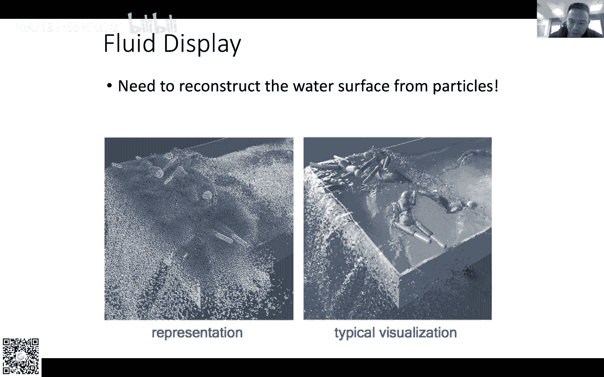
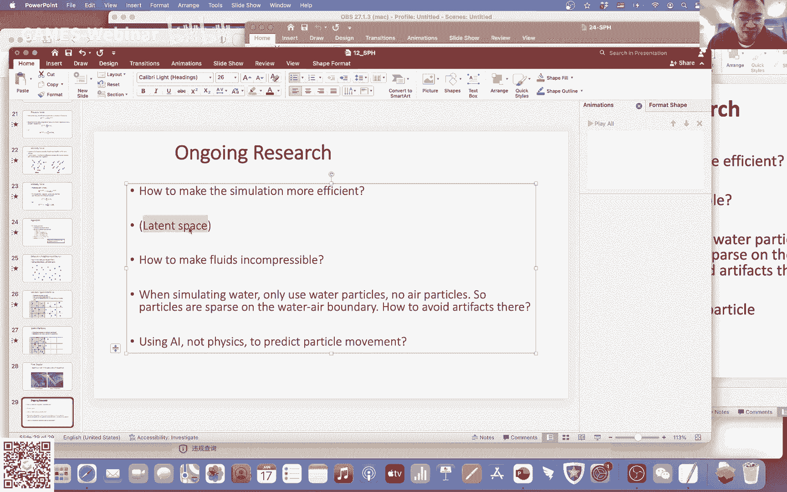

# GAMES103-基于物理的计算机动画入门 - P12：Lecture 12 SPH and Position-Based Fluids - GAMES-Webinar - BV12Q4y1S73g

我们就开始吧，那个首先咱们现今天已经是最后一节课了，已经不知不觉已经已经过了12周了啊，不知道大家学了多少，也不算开心吧，反正就是嗯反正就是算是告一段落不做，然后那个然后这个最近也比较忙。

因为大家可能知道下周我们下周还有segraph deadline，下周四下周五，然后我们然后接下来又要过年，所以啊所以所以那个哦对说一下作业的事情，就是啊所以说我们的ta我们的t助教可能呃时间比较少。

所以说我们就想把那个咱们最后总评分，还有颁奖啊，还有奖品啊，这些东西可能放在年后了，嗯，然后大家这段时间如果说呃想想补一下作业，过年期间有时间可以补一下作业的话，其实也可以也可以提交作业啊。

只不过就是啊只不过可能就评不了奖了，但是我们到时候会从咱们那个鹅圈子那里，它会有一个小小的电子证书的，你可以拿到一个电子证书，就是啊表示你完成了咱们这个103的作业的成绩。

然后哦我完成了咱们这个103所有的作业啊，然后到时候啊也会把就是答案，就是我们这边的一个相当于完成了一个答案发给大家，然后大家呃可以拿来做参考，其实我其实我一开始在课前。

刚开始咱们刚开始课上课课的时候就说过，就是其实模拟这个东西嗯，他这个涉及的东西跟其他图形学不一样，因为它涉及的面非常广啊，有流体，还有我们一开始讲的一些弹性体啊这些东西啊，其实还有很多很多。

其实咱们这个碰撞没有很深入嘛，怎么碰撞处理，其实也是有很多工作的啊，其实我是觉得很多时候就是做模拟的人，其实大家看一些做模拟的一些工作，其实他们有一些组，他们可能就只是做流体或者只是做某一个方面。

很少有一个组，他呃什么方面都做的，早年的时候早几年的时候有这样的，但是现在这种情况越来越少了，基本上可能就是一些人大家都比较集中的在某在做某一个方面，嗯，主要也是因为问题会变得越来越复杂了。

我今天其实也是想把咱们今天把这个嗯就是流体这一块，相当于最后的一点东西给大家讨论一下，然后完了之后就是呃可能会有点时间，然后我们可以讨论一些就是嗯这个这个之外的东西，不管是学术圈也好，还是工业界也好。

还是比如说游戏啊，或者是影视啊，数字人啊什么的，其实大家有什么问题我们都可以讨论看一下行吧，然后我这个我这个ppt做的也比较仓促，因为嗯都没什么时间搞这个东西。

反正就是我是把我之前我以前之前上课的这个p p t相当于搬过来，然后稍微修改了一下，给大家讲一下，嗯，然后流体我们我们最早的时候讲了嘛，流体因为流体这个现象很复杂，所以说有各种各样模拟的方式。

那么今天咱们就讲一个跟我们上两节课讲了不一样的方式，因为我们上两节课讲的是所谓的欧拉方法对吧，就是把整个空间划分成一些格子，然后利用这个空间里面的格子的里面的物理变量进行模拟啊。

然后呢这个格子本身是不运动的，不管是我们这个高度场的格子也好，还是真的是把整个三维空间划分成三维的这种网格也好，它这个格子是不动的啊，然后呢我们是通过改变那个格子里面存的那些值来进行动画的模拟。

那今天我们讲的这种模拟呢，就更像我们呃这个课前面部分所讨论的那种模拟方式，这个就是拉格朗日的这种视角上的模拟方式，就是利用粒子的方式来进行物理模拟了，那利用粒子来进行流体模拟，它其实嗯有很多种变形啊。

最早的这种最传统的这种方式，就是我们今天所要讨论的这种叫做s p h的方式啊，但是呢这个s p h也有很多很多各种各样的变形，比如说大家可能听说过。

就是利用啊利用这种position base的这种约束进行模拟的，叫做projected project fruit啊，然后还有一种还有这种，就是把这种p h这种方式跟呃弹性体的那种相结合来进行模拟的。

为什么这么做，主要的原因是因为我可以很方便的模拟东西，破碎这种效果叫做paradynamics啊，然后还有一种可能大家也听说过，就是把我们这种粒子的方式呢跟我们前面讲的这种网格的结合起来，就有的模拟的。

有的这种效果，我通过例子来做，然后有的这种比如说可压不可压求解的这种呢，我通过网格来做啊，这种叫做particle in cell。

或者是可能大家更常见的叫做material point method的m p m，这种方法就是基于粒子，它有很多很多各种各样乱七八糟的混合式的方法啊，但是咱们今天就不涉及了。

就今天咱们就是还是从最最这种传统的这种套路来跟大家讲一讲，然后大家如果以后有兴趣的话，可以去扩展看看其他的这种变形的这种粒子的模拟方法，然后这种力变形的这种模拟方法。

它主要的原因是因为它会比如说做一些模拟的效果，比如说大家可能知道啊，做血或者是做沙子的这种模拟效果，你可能要用这种m p m的方法啊，然后如果说比如说你想做一些什么也变形啊，形变啊。

破碎啊啊碎掉啊什么之类的，你可能考虑paradynamics等等等等，就是根据你具体的问题，你可能会采用一些不同的方法，但是咱们这里就不设计了，好吧嗯。

然后首先我们来讲一下这个s p h的这个模型是什么，就是什么叫做其实不叫s p h模型，应该叫做私募式的，就是光滑的平滑的模型，什么叫做一个smooth model。

然后基于这个smooth model呢，我可以怎么样进行流体的模拟，其实这个东西跟我们前面讲的欧拉其实是有一定的共同之处的，就是我们第一步就是想要搞一个模型，然后这个模型能够让我们来计算一些呃。

偏微分或者是一些微分的一些向量，然后我可以利用这些微分向量，我把它应用到流体的方程上去进行求解，基本上就是这么一个总的思路，那么首先我们来看一下这种smooth particle的模型啊。

什么叫做smooth particle的模型呃，首先我们的一个总的思路就是我们要用很多很多这种例子去表达流体，因为在现实生活中，我们的流体实际上是有很多水分子所构成的嘛。

那其实你可以理解为就是我一个例子相当于就是一个水分子对吧，呃然后如果说我有足够足够多的这么多的例子，那么我就可以啊，相当于在嗯通过计算机我可以去模拟现实生活中这个水的现象。

当然说我不可能真的就是去做到几百亿几千亿的这种规模，我肯定我的例子没有那么多，但是我可以把这个大概的趋势给他模拟出来，然后这个例子呢就跟我们之前做各种弹性体什么的一样，就是我每个例子它都有物理变量对吧。

然后这个物理变量就是附在这个例子上的，然后物理变量啊，当这个粒子在运动的时候呢，这些物理变量就也就跟着一起运动了，这个就是拉格朗日视角对吧，这个就跟奥拉视角不一样。

因为欧拉视角下他他的这个科他这个物理变量的位置是不动的，我们这边我们这里它这个每个例子都是可以运动的，那有什么物理变量呢，比如说位置速度啊，质量等等等等啊。

然后呢你如果说做这个呃这种粒子模拟的方法的话呢，你如果在图形学里的话，他其实会遇到一个比较现实的问题，他这个现实的问题就是说你这个表达方式是有很多例子构成的嘛对吧。

但是我通常我的这个我们我们的modern的这种gpu，它是没有办法去直接嗯，他没有办法直接去画这些那个例子的，他没有办法直接去渲染这些例子，那么你如果说没有办法直接渲染的话。

那我一般来说就是需要做一个转化，他需要把这些例子它转化成一个比如说一个三角网格，然后进行再进行一个离线的渲染，一般来说会需要这样子，这个主要是因为我们的现在的硬件呢，不支持这种以粒子的方式渲染所导致。

然后在游戏里面它一般来说讲究的就没有那么多了，因为他没有办法进行这个操作，所以说一般来说游戏里面他可能就直接把这个例子用一种，比如说带纹理的一种，比如说一种球或者一种啊方块来进行描述。

然后但是因为它带纹理，它的纹理会有一些透明贴图嘛，然后它就会看起来会比如说像一个喷泉，或者是像一个水瀑布什么的，一般来说它们就会用这种粒子的表达方式进行模拟，那么好我们首先来看一下呃。

假如说有这么一个场景啊，这个场景里面有好多好多例子对吧，然后每一个例子它都有呃所对应的物理变量，那我这里假设它这个物理变量叫做a啊，然后每个每个例子都有，然后这个物理变量它可以是矢量，也可以是标量。

比如说矢量就是常见的就是速度嘛，标量可以是压强，密度啊，温度啊等等等等，这个我们就反正就是都可以复制，那么我们这个所谓的smooth的模型是什么意思呢，这smoth的模型的意思就是说。

假如说我给我这个空间中某一个位置，比如说这个红颜色的这个位置，我想要知道我在这个位置上，我这个值应该是多少，那么实际上这个问题就变成了一个差值问题，对不对，就是说假如说我空间里面有这么多点这些例子。

每个例子你可以认为是一个连续的一个函数，在这个空间里面的一个采样，在这个位置上的一个采样的一个函数值，我这个函数值应该是多少，我想从周围的这些，一般来说就想周围的这些函数值上给它进行一个估计。

这个就是我想要做的事情，就是所谓的smooth的这么一个interpolation的一个操作，那么怎么做呢，一个简单的思路就是说我在一定范围内，我比如说我设一个半径，在这个半径下呃。

我以这个我这个想要得到的这个点的位置为圆球星，然后我在一定半径内，所有的在这个圆内，在这个球内的所有的例子，我给他求个平均值，是不是就可以对吧，那比如说像我这里就是一个求平均值的方式。

每一个点都有个尺码，我把所有的值加在一起，然后除以除以它们总的数量，就得到了这个我的这个差值，那这里的话你看他这里有总共七个嗯，粒子01234567123456，总共有七个，所以说这里的n就是七。

然后呢我把它全部加在一起，求平均值，那这个方式很简单，但是呢它有一个问题，他有什么问题呢，就是他其实没有考虑到分布对吧，他只是把所有的点加在一起，比如说我这里可以想象成这么一个场景。

假如说我有很多很多红颜色的点，假如说我这个差值的内容就是颜色，然后呢我有很多红颜色的点，大部分点都是红色的，但是有一个点是黄色的对吧，那么因为绝大多数的点是红色的，只有一个是黄色的，如果说我求平均值。

那么大概率我这个中心的这个点，我想要得到的这个差值的，插完以后的这个值应该还是红色的对吧，但是如果说因为种种原因，我在这边多采了几个例子，我这边有很多很多例子。

那么因为这个区域这个小的区域范围内是黄颜色的，所以说这些点也是黄颜色的，然后最后呢就会导致如果说我在进一步的差值的话，我会导致我这个就变成橙色的了，因为我这个黄颜色的点有点多，那么这个东西什么意思呢。

就说我这个取平均的这个方式啊，他其实并没有考虑到我这个例子的分布，因为虽然说我这里有好多好多黄颜色的，但是这些黄颜色它基本上就是在一个很小的区域，对不对。

如果说我认为每一个点它都在空间中占了一定的区域的话，那么黄颜色的区域显然是比较小的，而红颜色占有的这个区域显然是比较大的，那么照理说我虽然说我黄颜色的点多，但是它占的区域小。

那么其实它的贡献应该也小才对，那么我照理说我这个估评估出来的这个差值，照理说应该还是比较倾向于红颜色的，我不应该只是单纯的考虑数量，我还要考虑到他们占了多少的空间。

所以说第二个模型就是我要把它每一个点所占的空间给它考虑进去，那么这里我们就假设说每一个点，每一个例子它都不只是有他这个一个物理的值，同时呢它还有一个另一个值，它表示它所占的体积是多少。

这个呢v呢就是表示它的体积，就是说在这个空间这个区域内，它占了多少体积，然后我们把这个v呢作为一个权重加上去，那么就得到了这个第二个模型，那么这个v呢你就可以认为是他的一个权重对吧。

把它存在这个a的上面，然后把它全部加在一起，然后这里呢an呢是它的这个总和，这里呢我其实就我其实做了一个假设的，我假设这个球的是个单位球，所以说单位总的这个球的体积是一，所以说啊所以说我直接就是这样子。

我直接就出个a就完事了，那么这个模型呢比刚才那个好，因为我考虑到了呃，我每一个例子它所占的体积是多少，我不是说单纯的嗯把那个嗯就是把这个球平均值了，我我加了他的体积，但是呢还有问题。

还有一个问题是什么呢，就是我这个函数它其实并不够斯慕斯，什么叫斯慕斯，smooth的意思就是当我这个点我想要得到的这个差值的这个位置，发生运动的时候，我不希望我出来的结果会很剧烈的变化，对不对。

我希望它是一个比较连续的变化的一个函数，它是连续的慢慢的变的，但是如果说我用我们这套原来的这个差值的这个方式，它显然不存在这样的现象，为什么，因为我这里其实是非常依赖于我这些求里面的点数的。

如果说我这个这个位置发生改变了，那么有可能我会突然的增加我的粒子数或者减少我的粒子数，比如深深像这里，当我这个点从红颜色的这个位置走到这个绿颜色的这个位置的时候呢，我会突然的多了两个例子对吧。

我原来是1234567，本来是七个例子，在这个红颜色的球里面，但是如果说我运动到绿颜色的呢，那么我就多了两个例子，我变成九个例子了，那我如果说再去算这个总的这个和我一下子这个和就变掉了，对不对。

我这个值就变掉了，我这个就瞬间就发生改变了，这个是我不希望的，其实我明明这个位置只是动了一丁点儿，为什么我的这只会发生那么大的变化呢，这个不合理对不对。

这就是为什么我们想要的这个是一个smooth的一个差值的一个过程，它不是一个简单的差值过程，我还希望它是一个能够mooth的差值的过程，我希望它这是一个连续的变化，那么怎么样可以让我这个差值的方式嗯。

smooth呢，那么一个思路是什么呢，就是我还要再去额外的加一个权重，我对于我每个例子我还要去加一个权重，光是有这个体积的权重不够，什么样的权重呢，我其实要把距离考虑进去。

要把这个例子到球心的距离考虑进去，原则上如果说这个例子离这个球星很远对吧，他是在边界上的，他在这个球的边缘，像比如说像我们新来的这两个新来的这两个老兄对吧，他新来的吧，所以说他在边上嘛。

那么理论上我就应该给他的权重要低一点，这样子的话呢，他对总的这个和的贡献就要小一点，那如果说要有的例子，比如说这个例子它很靠近圆球星嘛，那他的贡献就应该照理说应该大一点。

所以说我们这个思路就是再额外的引入一个一个东西，我把它叫做w，这个w是什么呢，w实际上告诉我们的就是一个权重，这个权重是对于每一个粒子到球星的一个权重。

所以说我这里把它叫做w i j就是i和j之间的这么一个关系，就是最后我们给这个g这个例子的一个权重，然后呢这个权重具体的名字叫做smoothing kernel，它是一个kernel函数啊。

然后它就满足呃两个特性，就是我刚才说的，就是如果说距离大，那么它就权重就小，如果说距离小，那么全程就大，所以说我就根据这个进行调整，那么有了这个克隆函数呢，嗯再乘以这个体积呢，再乘以这个物理变量呢。

我就可以得到最终的这么一个表达式了，就是我这个最终的这么一个差值的smooth的一个放心了，那么这个问题解决了吗，好像并没有，对不对，因为我们前面是假设我们有这个k头函数，有这个体积。

ko函数可能比较好搞一点，因为它其实就是一个函数嘛，但是体积这个东西你怎么去搞，因为体积它其实如果说我用例子去做一个表达一个，比如说流体的话，它体积这个东西它其实并不是一个常数啊。

因为它这个流体它这个例子它始终在运动，对不对，他这个分布它有的时候会命，有的会会输，他一直是在运动的过程中，我照理说我不应该用这个一个常数去定义它这个体积，对不对，我应该去动态的计算这个体积。

那我怎么去计算这个体积，那我们去这么一个计算，首先我假设我每一个粒子都有一个质量，我把它叫做i，然后呢我假设我有一个密度叫做density，叫做热爱对吧，然后我们都知道的这个质量它是一个常数，一个例子。

如果说它就是一个真正的一个小水分子的话，它质量肯定是个常数嘛对吧，那么真正的变量是什么呢，真正的变量是体积跟密度这两个东西会发生改变，那这里大家要注意了啊，就是我这里的密度实际上是粒子分布的密度。

它并不是我们所说的水的密度，因为水的密度大家都知道是个常数，但是这里呢我这个肉呢是每个粒子在空间中，它周围的其他例子给它的产生的一个密度的一个值，相当于呃是描述在这个一定范围内。

这些粒子它分布的密度是高还是低，是这么一个密度，那么我们知道假如说我把这个密度认为是也是一个smooth的函数的话，比如说我这个点啊，这个点i我认为它是一个例子。

同时我也认为这个i它是一个我们想要差值的对象，那么我们差值的目标是什么呢，差值的目标就是这个密度，我认为这个i这个例子我们想要差值它的密度，那么它的密度是什么呢，它的密度根据我们前面的那个公式。

就是vj乘以zj乘以克隆函数吧，那这个g是它所有的周围的邻居，对吧，就是按照我们前面这个smooth的定义，应该是这样子的对吧，那么这个就可以让我们得到什么，你可以注意到前面这个部分是v j乘以rj。

那么就等于质量，那么换句话说，我可以通过这个东西把密度给它计算出来，可以利用咱们这个差值的这种私募斯的公式，我可以把密度给它估算出来，因为密度不是我们所定义的一个一成不变的物理量。

我是通过这个私募斯的这个定义，我给它反向的给它搞出来的，那么这个直观上你怎么去理解这个东西啊，你其实可以这么理解，你如果是观察这个东西的话，其实如果说你不考虑这个坑头函数的话。

你暂时把这个坑头函数忽略掉的话，它这个东西是什么，它这个东西就是所有的质量的和，对不对，那什么是质量的，和你去想一想，对于这个particle而言，对于这个例子而言。

它周围所有的粒子的质量和其实就是它的密度，直观上就是我周围的邻居如果都有好多好多，我有好多好多邻居，然后这些好多好多邻居都带了好多好多质量，那我肯定就密度大嘛，对不对，搞得我周围都很挤嘛，很拥挤。

所以我密度大，如果我说我周围没有什么粒子，或者说我周围的粒子密度都很小，质量都很小，那么也就意味着我这个空间就很自由嘛，那我相对应的我这个密度也就小，所以说其实它这个直观上就是这么一个意思。

就是我利用周围的粒子的密度，然后他乘上这个可能函数的权重，我就可以把这个密度给它估算出来了，然后有了密度之后呢，我这个后面的就比较简单了，因为我就可以直接套公式对吧，v j v i就是等于。

而质量除以这个东西，然后就是可以得到它的这个体积了，然后有了这个体积公式呢，我在可以带回到咱们前面的那个公式里面，就是这个东西是我们对于任意一个物理变量，注意这里是任意一个物理变量。

对于任意一个物理变量的话，那么我这个体积是这个东西，就是我们刚才估算的这个东西，那我把他带到这个vj里去，我就得到了我最终的这么一个差值方式，当然实际在你你实际上在计算的过程中。

你可以嗯就是不要把它合并，你可以把它分成两步来做，你首先你把每一个粒子的体积给它进行这么一个估算，利用这个质量分布进行一个估算，嗯然后利用质量分布估算体积，完完事了之后呢。

你在利用咱们前面的这个公式给他，把这个所有的物理量可以给它做一个差值，差不多就是分成两部分来做呃，然后我们我们接下来再来看一下这个克隆函数是什么样子的啊，先先不说克隆函数吧。

就是先说我们我们这么做的好处是什么，我们这么做的一个好处在于我们进行一些各种各样的这种微分啊，这种操作，微分算子的操作就变得很容易了，比如说我想要求梯度对吧，如果说我想要求梯度。

那么如果说我要在这里加个梯度符号的话，会发现你最后就只需要在这个后面这个克隆上加梯度就行了，因为你可以认为这个物理变量它对于在这个例子上，它的物理变量是一个常数。

同时你也认为他这个周围分布的这个体积也是一个常数，如果说他这两个都认为是常数的话，那么最终这个微分算子就会，这个规定就会被施加到这个后面的这个ko上去。

而这个kernel呢它是一个我们已知的一个有解析解的这么一个函数，所以说我直接就可以把这个东西写出来，它会有解析解，它会直接有公式可以套。

这就是它这个p h这种smooth interpolation模型的好处，就是它算梯度的时候啊，你可以直接套公式，你可以直接的认为就是说实际上就是你算梯度的时候，你直接把后面这个东西给它替换掉就行了。

你就用另一个函数，用kernel的gradient的函数作为他这个差值的一个权重就可以了，对有同学问体积为什么认为是常数，它其实这里是其实是做了一个近似的，就是它其实是假设我这个点运动的时候。

它不影响到周围邻居的体积，因为这个g它其实是周围邻居嘛对吧，我这个i算的是我想要得到i这个点上的梯度，这个g呢又是周围邻居，照理说我爱动了，我会影响到周围邻居。

但是我就是认为说我对他的邻居的影响会比较小，所以说我这里就假设我我自己在动的时候，我邻居的这个体积不变，那么我就可以认为邻居体积不变，所以说最终变的就是后面这个东西，它是这么一个思路。

然后同样的我也可以计算laution，laution就是它的二阶导的那个东西嘛，可以最终也可以计算拉普拉升，如果说对一个物理变量做拉普拉的话，那个拉拉最终就会施加到后面的那个w上去。

然后给大家看几个w的的定义吧，就是比较常见的，就比如说啊比如说这个是一种是如果说嗯i你认为i跟这是两个例子，比如说i跟这是两个例子啊，这是一个两个例子，然后这个是x这是x j。

那么你可以先把这个q给他算出来，这个q就是距离除以一个呃一个一个一个某一个单位的一个长度，这个h它叫smoothing lance，它实际上就是个单位长度。

相当于他对这个长度进行一个单位长度的一个normalization，然后完了之后呢，他得到这个q之后呢，他把这个带到这个公式里面，然后就可以计算出一个smoothing kl来了，这个是一种啊。

其实他这个smoko其实有好多种，但是我翻了一下一些paper，然后似乎这个是比较常见的一种，然后这个函数也比较简单，它基本上就是一个多项式函数嘛，它是个三阶函数，所以说它求导也比较简单。

然后它这个函数的样子大概是这个样子的，中间就是我们想要插值的那个点的位置，然后这些黑点你就可以认为是周围的邻居，然后你可以看到它这个就是越靠越靠这个这个边缘，他这个权重就越低，然后越靠中心权重就越大。

就有点像高斯函数，但是他用的不是那种啊指数的那种函数值，它用的是这种多项式的这种函数值，然后这里就是呃就是一些公式呗，就是就是求导嘛，比如说一阶导啊，然后一阶导就是这样子，然后这个这个基本上就是正常的。

我们求导的过程，如果大家自己去推一下的话，会发现其实也是比较简单的，比如说这个地方如果你对q你对q求一阶导，那么你得到的就是啊就是这个东西，然后后面的也是这样的，它是分段函数。

连接体积在dt时间内估算是不变的吗，你可以这么认为，就是他那个呃，就是他他那个连接的那个体积变化量很小，所以说他就直接把它忽略掉，然后这里我就跳过了吧，因为这个这个公司反正很多这个文献上都有。

大家可以参考一下，然后这个是拉拉，如果说你要对这个w这个函数求拉拉的话，它是这么一个东西，然后然后这个d w d q的二阶导，二阶导就是二阶导的这个东西，啊然后反正这个也是多项式函数嘛。

多项这个多项式函数的好处就是在于它求导，它求起导来比较容易，就是它的最大的优点，这也是为什么，而且它计算也很容易，就是做一些乘法就可以了，所以说这也是为什么大家喜欢。

一般来说喜欢用这种多项式函数来定义这个看懂函数的一个原因吧，那么好基本上啊反正就是这个是比较标准的，而且大家而且大家如果说自己要啊，这里写错了，这里应该是应该是正三角，如果说大家要做这个。

那实现这个代码的话，基本上就是套这个公式就行了啊，没必要自己去推这些东西啊，反正就是都是有现成的这种公式函数值给你的，你反正就是根据它这个东西套就行了，需要记住的就是需要记住的。

就是这里就是呃就是利用咱们smoothing这个interpolation的方式啊，你可以去很方便的把这个一阶导和二阶导，可以给他用这个方式给它计算出来，其实本质你可以认为它这个东西是一个函数。

比如说你可以认为是一个一个k i j这么一个新的函数的话，它其实就相当于就是用这个新的这个差值函数来给你做这个计算，然后我们来讲一下流体，就是这个东西怎么搞，在流体上。

尤其是可以大家可以跟前面咱们之前讲的这种模拟，各种各样的那种粒子的这种模拟方式，可以大家可以对应起来看，其实是有很大的相似之处的，就我们做流体的话，我们对于这种流体的例子呢。

就是要考虑到主要就是考虑这三个因素嘛，不限于这三个因素，但主要这三个因素，首先是重力，其次是压强，最后是年制，就是这三个方面，然后重力大家都比较清楚对吧，相当于是个力吗，我可以把这个重力的力给他算出来。

这个大家都清楚，那么接下来我们讲压强就重力，重力咱们就跳过了是吧，也不算跳过吧，就是应该大家都清楚，然后接下来我们讲压强，压强如果说在一个粒子，它在流体里面，它在一个水里面的话，或者是空气里面的话。

压强会对它产生一个力，那么压强的这个力它本质是个什么东西呢，它首先我们考虑到就是首先我们要把它分成两部分，首先怎么计算压强，第二我们怎么样把产生计算出来的压强转化成力，这是我们想要做的。

首先压强我们知道压强其实跟密度是有关系的，对不对，在真实世界里面密度越大，那么压强这个压力也就越大，密度越小，压力也就越小，所以说它跟这个密度的分布是肯定是有关系的，所以说我们首先把密度计算一下。

这个计算其实是我们怎么都需要的，因为我们前面在做体积计算的时候，我们本身就需要计算到这个密度了，然后我们前面也讨论了密度的计算，其实本质上就是把周围邻居的这些所有的粒子的质量加在一起，求一个加权的平均。

这个就是密度，那么有了密度之后呢，一般来说就是利用什么经验公式，我可以对它进行一个压强的转化了，那么经验公式呢也有很多种，这是其中一种就是一个七次函数，我其实也不知道为什么是七次函数。

反正这个是我从一个论文里面给抠出来的啊，他们采用的方式就是利用这么一个七次的这么一个函数，它把压强，他把他把密度转化成了压强这么一个压强值，大概是这么一个东西，然后呢这个constant，还有这个。

啊这个roll constant，还有这个k呢都是常数，然后利用这个公式给它进行一个转化，那么好，我们可以把每一个粒子的压强给他算出来，那么第二个问题就是说有了压强之后，怎么计算压强产生的力了。

那么我们想假如说想象这么一个场景，如果说我周围我有个例子，然后周围全是高压，周围的例子全都是带高压的对吧，你可以想象成一个压力锅，然后这个压力锅里面有一个小的水分子，战战兢兢的小水分子。

那么这个小的水分子会不会有运动，其实它不会有运动，对不对，为什么，因为你可以想象的就是说这些高压的这些邻居啊，都会给这个例子一个例，比如说这个它给它一个力，这个也给他一个例，这个也给他一个力。

这也给他一个力，这个也给他一个理，然后这些力它其实都最终会相互抵消掉，对不对，因为这些力它每一个面上每一个方向它都是高压，那么等于大家都没有高压，大家的利益都是一样的，最终都抵消掉了。

那么压力真正产生的原因是什么呢，是因为压力的不平衡所导致的，比如说我左边是高压对吧，然后右边是低压，那么也就意味着我只在左边，我会有粒子会推这个这些这个压力会推这个例子，而在右边它是没有这个力的。

那么所以说最终我会产生一个总的力，把这个例子往右边去推，就跟大家比如说猛地一下把压力给我打开一样，你猛地一下把压力给我打开，突然压力锅里面的高压碰到了外面的低压，那么这种压力差就会导致。

里面的容器里面的这个水被喷出来对吧，所以说本质上是由于压力的不平衡，压力差导致的压力，而不是单压压力，而不是单纯的因为压压强的高或者是低，所以数学上数学上我们把压力写成这个形式，是负的体积。

我首先要对压力成一个体积，压强的那个规定成一个体积啊，因为体积越大，压力越受到的压力也越大，体积代表着这个水分子在空间占有的面积的的的体积嘛，所以说我希望对它做一个权重。

其次呢是它的压强的gradient，那么什么是压强的规定，压强的gradient其实就是压强的差，gradient实际上代表的就是一阶导数，对不对，那么一阶导数是什么东西呢。

一阶导数实际上就是它的梯度嘛，就是它的这个它的这个差别，所以说我这里gradient实际上就是可以转化成零，那么这里呢大家注意到就是我这里用smooth来加这个东西，为什么我加了这个mooth呢。

是因为我加了这个私募词之后，我就可以利用咱们之前gradient计算的方式呢，我可以对它进行一个进四了，那么首先我假设压强这个东西呢是一个smooth差值得到的一个函数。

那么p i smooth就是周围邻居的压强的这个smooth差值的和，那么我把这个梯度加上去之后，那么我梯度就加在了后面，那么我就可以利用压周围邻居的压强乘以体积，然后再乘以这个kernel的梯度。

然后我就可以把压力给它计算出来，这个就是我压力计算的一个公式，而且大家可以从这个例子上就可以看到啊，为什么我们要做这个smooth interpolation。

为什么我们前面讲了半天这个smooth interpolation，原因就是因为我可以利用这个东西来计算啊，计算梯度，很方便的，把这个梯度给它计算出来，那么好，我们现在有了压力。

那么接下来我们再讲第三个理，对其实有同学说这是一个压强场嘛，对实际上就是你可以认为每一个例子它其实就是代表了一个采样，然后它整个我可以假设这整个空间是一个厂，它有个压强场，所以说我我做这样的假设之后。

然后viscosity其实跟单品有点像，但是跟单品又不一样，因为我们正常理解的单品是什么，单品就是会是一个阻尼对吧，当一个物体在运动的时候，会有一个无形的一个这么一个东西，会想让它尽量的停止下来啊。

尽量的让他把这个能量从动能转化成热能，那么年制这个东西呢跟单品很像，但是呢又跟单品不一样的点在哪里呢，在于他不希望把这个每一个粒子的运动给它停下来，他希望的是什么，他希望的是我们所有的例子。

大家都一起动，都整齐划一的一起动一起运动，比如说我这里给大家看了我这里的所有的例子对吧，每个例子都有自己的运动方式对吧，有的往左，有的往右，那我年制最终想要产生的效果是什么呢。

就是大家都一股脑儿的一起往一个方向运动，这个是我年制想要达到的最终效果，单品呢它是想要最终都变成零，而这年制呢他希望的是都是朝一个方向躲，那么怎么来做这个年纪呢，其实大家可以这么想。

就是粘滞最终的目的就是想要让这些速度之间的差趋向于零，那么数学上我们就用拉拉来定义，因为我们前面也讲过，就是拉拉是什么，拉拉实际上就是在计算每一个点跟周围邻居的差别吗，对不对，我们之前讲了。

有拉拉可以做各种各样smoothing啊，这种操作嘛，那smoothing本质是什么，smoothing的本质就是我希望所有的都一样，这种就是一个很私慕斯的状态。

所以说一个道理就是我想要去smooth我的速度，但本质上斯慕斯速度所产生的效果就是粘滞所产生的效果，那么我这里就可以构造一个力，这个就是我的这个年制的啊产生的力，那么我的粘滞力等于负的一个年制系数。

再乘以质量，再乘以速度的laua，然后我这里速度呢我也假设是一个有个速度的厂，我有个速度场对吧，然后每一个粒子都表示了这个速度长的长里面的一个采样，然后呢我想要计算它的laua呢。

我就可以利用我这个smooth的速度场的这么一个定义，我给大家最终转化成这么一个形式，然后就是就这么个形式，然后注意到大家注意到就是说你这个速度它其实是一个矢量，对不对，速度是一个矢量。

所以说这里实际上是由三个速度所构成的，u v w的三个速度分别是x y z方向的三个速度所构成的，所以说你这里需要做三次，然后拉plus它其实是一个标量。

这个后面这个kernel w的这个kernel的这个拉普拉a它是一个标量，所以说最终他们的标量它的这个维度是吻合的，因为它最终得到的还是一个三维空间的向量，这是他的这个力，然后有了这个东西之后呢。

我们这个算法其实就比较简单了，其实跟我们前面所做的各种各样的粒子模拟的啊，算法基本上是一样的，就首先对于每一个例子啊，我首先计算它周围的邻居，我知道我想要把每一个点周围有哪些邻居给他算出来。

然后利用邻居，我可以把首先我把重力加在这个立场，其次我把压强压力给它加在这个地上，利用前面的公式，然后把粘滞加在这个立场，然后最后呢我就可以对利用我这个力除以质量，我就可以对速度进行更新。

然后我利用我更新完了速度，我对顶点的位置进行更新，然后基本上就是这么一回事，然后我这里呢其实我们这里并没有讲流体力学是一个什么样的形式啊，为什么，因为流体力学。

其实如果说你以这种拉格朗日的这种视角来进行计算的话，它其实牛顿的流体力学它就是可以把它拆分为这么几三大块的啊，然后三大块呢分别就是对应咱们一利用s p h所进行计算的，这三种方式。

所以说基本上就是基本上就是这个这三个东西，然后我们这里其实就跟上节课稍微做了一些简化，就是咱们就不再回到这个流体力学方程去讨论流体力学方程了，我们直接就是啊把这个模拟动画的这个流程给大家。

我们描述一下啊，当然大家如果说对数学这一块比较感兴趣的话，大家也其实可以回过去看论文，看看他们到底是怎么从数学定义出发，然后又一步一步地推到这个呃，就是这个模拟的这个三个力的这个模型上去。

这个反正咱们就不讲，然后做这个模拟的话，他的这个挑战在于什么，其实他这个挑战其实有很多方面，其中有一个是计算上的性能上的方面，他这个性能的方面在于你的计算，neighborhood会是一个挑战。

因为我们在模拟流体的时候，如果说你想要一个比较逼真的效果的话，那那么你可能需要非常非常多的点，你可能要100万甚至好几百万个粒子规模，你才可以把这个水做的稍微比较像模像样一点。

如果说你只是做个几万规模或者是几10万规模的话，你其实你的瑕疵，因为它粒子它这个分布所产生的瑕疵会比较明显的，而我们上节课讲的这种volume的方式，它其实相对来说就会好很多。

你比如说你64x64x64的网格，你这是模拟，其实也挺像的，其实也像模像样的了，但是例子不一样，例子的话如果说你模拟的粒子的数量不够的话，其实就就很不像啊，除非说你是做一些比较简单的场景，比如说瀑布啊。

喷泉啊什么的那种场景器，其实可以就比较简单的可以做了，但是像比如说你想做一个比如说水荡漾啊，然后波浪啊，水浪啊，浪花啊，然后很大的波浪，这种效果的话，你肯定就是要上百万的点，那你上百万的点。

你计算每一个点去计算它周围邻居就会有花计算量，那么穷举显然是不行的对吧，因为穷举你如果是几百万的话，比如说11千万，那么就是呃100淬炼淬炼多少，我都不知道，反正就是很多很多个零吧。

就是你需要找很多很多检测，很多很多穷举肯定是不行的，所以说一般来说我们在计算中，我们也会用到很多这种类似碰撞处理，或者是类似你做光线追踪所会用到的一些方法，比如说在gpu上。

我们一般用到比较多的就是做spatial peditioning对吧，就是把空间进行划分嘛，分成很多格子，然后呢把每一个粒子都存到一个特定的格子里去，然后呢完了之后呢。

我可以就是说我可以根据每一个点所在的格子与它周边的格子，我可以很快的检测，我可以找到说每一个点它周围的呃，有哪些邻居是啊需要检测的，然后呢还有很多其他方法，比如说可以做otree。

做binary tree，这个主要是面向一些不均匀分布的粒子所导致的，然后为什么会做不均匀分布，有同学可能会问，为什么我要不均匀分布，为什么我不可以把所有的例子都搞成一模一样大。

其实有的时候他是会专门为了做某些细节，比如说其实大家可以这么想，就是如果说我想要做一个水花溅起来的效果，对不对，那么你做水花溅起来的效果，那么理论上就是靠近水面的地方，你需要的例子会小一点。

你靠近水水的这个整体的地方，就是水下的地方你可能想要的粒子会大一点，因为那种水下的地方它其实没有什么细节，他都在水里嘛，你这个水其实怎么流动，其实你也看不出差别来，是水面，因为它有浪，它有这个边界。

它有甚至有泡沫，那么他这种这种这种细节就会比较多，所以说你希望在不同的地方，你用不同大小的这些例子啊，这种也是一种模拟方式，叫做adaptive，adaptive的方式啊，这个好像以前也有做。

也有做过这方面的工作的，但是反正啊这种这种像我前面说的，就是做流体的。

就有各种各样形式的东西，啊然后还有一点就是说你需要做这个三维重建，你需要从这个点云里面，从这些点你其实可以认为是个点云嘛，啊做几何的，一般来说把这个叫点云，你需要从这个点云里面把这个三角面片给它搞出来。

这样子才可以做渲染，这个也是也是一个比较复杂的问题，因为为什么复杂，因为如果说你做的比较简单的话，你这个表面就会坑坑洼洼的，一般来说呢你需要对这个坑坑洼洼的表面再做一个平滑。

你想要把这些坑坑洼洼的东西给它抹掉，但是你在抹掉这些坑坑洼洼的同时，也有可能会把一些你想要的细节给它抹掉，所以说你怎么样去进行这个表面的平滑，一般来说呃也不是一般来说吧。

就我见过就是他们所谓的叫做bias的kernel，就是他在平滑这个过程中，他是有方向性的，它是尽量在某一个方向上，就是在平的这个方向上平滑，而在重的方向上尽量不平滑，类似这种点云的话，点云是三维重建。

做几何吗，好像我们之前是不是也有一个102的课，是102102的课吗，就是做几何里面一般会有会讨论这个东西的，203是吗，对，重叠，然后有有一些简单的方法，就是我我知道的一些可能讲的稍微简单一点的方法。

就是先把这些点都变成一个distance function，每一个点上你可以认为是个球，对不对，然后你把这个球的这个distance function，sign distance function。

这个是比较容易计算的，然后你利用这个求函数的这个3d function，你把整个空间的3d方面搞搞出来，搞出来完了之后你用这个sdance function再做一个啊，穿过mesh的转化，就是类似这种。

这个是我见过就是一种一种套路，但是但是这个肯定不是一个最优的套路，跟我想那个几做几何的同学肯定知道最优的套路，这个反正我也就嗯因为就不往这方面讨论了，因为我自己做啊。

这种s p h这种例子的这种也比较少，我自己一般来说不是一般来说不做这个这方面的，主体这块其实我做的总的来说也是相对来说比较少，我只是在我我最早最早的时候，我我是做流体的啊，都是十多年前了。

然后后来不是读完，我基本上后面就不做流体了，就是只只是做一些边边圆圆的流体的工作，后面就基本就是没有在做。

好吧，然后再然后就讲一下sph这块有有什么工作吧，首先就是你怎么样把这个模拟模拟讲得更有，做得更有效率，其实我觉得很多呃模拟的问题都存在这样的问题，就是怎么样能够高效地去进行模拟啊，尤其是对于游戏而言。

就是怎么样去模拟，能够让你的呃模拟引擎能够适配游戏的这个性能的要求，因为游戏其实对性能的要求非常非常的讲究啊，本身你一个游戏其实只有很少很少的一部分资源能够给模拟器，你正常情况下。

你可能对模拟引擎的开销可能都不足1ms，甚至是0。1ms，你还需要考虑到跨平台，考虑到你这个游戏能够在手机上也可以玩，在基本上也可以玩，你这个游戏呢可能不能只是给开发给土豪，对不对。

你可能要考虑到你这个游戏可能在比较低配置的电脑上，硬件上你也可以跑，所以说你怎么样把模拟搞得更有效率，这个事我觉得是一个永恒的，需要值得的课，需要研究的话题，而且游戏搞完之后。

你还要想就是怎么样能够做得更好的细节，因为当你去提升你的性能的时候，你不免得你需要你的效果打折，怎么样能够尽量的少对你的效果进行打折，同时呢又让你的这个性能更有效率。

这个是我觉得是图形学跟图形学里面的模拟，跟我们其他的工程里面的物理模拟啊，甚至跟影视里面的物理模拟所需的需求的一个很大的差异，因为你看我们工程的搞的同学，可能搞物理的同学对计算量要求不是很严格，对不对。

他们的做计算，比如说做一些什么大气环流的流体计算，直接放在这个超级计算机上去跑，无所谓，有个三天三夜也无所谓，但是咱们做这个物理模拟，我们更多的是想要从实际的一些，尤其是实时的应用场景出发。

所以说这个事我觉得是一个很重要的点，然后对于流体的话，很重要的一点就是说怎么样，可这个是一个很大的挑战，就是你怎么样能够让体积不发生改变，因为当你很多有粒子在运动的时候。

你很难去保证说粒子的运动过程中是不可压的啊，这就是为什么后来嗯后来搞了类似这种混合式的m p m p i c，这种方法，其实本质上就是也是想利用网格进行数值求解，而不是简单的在这个例子的点上进行求解。

然后还有就是说怎么样去处理这个水跟空气之间的界面，这个问题对吧，因为我们在模拟水的时候，有的时候想要是不考虑空气的嘛啊，因为他们空气的密度和水的密度，它的这个差太大了，你没有办法一起去模拟。

那怎么样去更好地处理这些边界，然后还有就是最近几年啊比较常见的，也不算比较常见吧，就是呃有一些同学在搞的怎么样去用ai去驱动这个模拟，怎么样去模拟那个流体，比如说大家可能知道news news啊。

siri他们的那个他们那个组，他们就搞了很多这种基于ai驱动的这种流体模拟的方面的研究吧，总的来说我个人觉得就是嗯ai这一块还是是比较前沿的，就是目前还没有看到，就是能够效果特别好。

然后可以把这个物理引擎替换掉的趋势在，然后其实我是觉得呃我是觉得，但是有两点我想要说的吧，这一点就是说我们物理引擎就是做图形学啊，然后研究物理模拟其实到底是应该研究个什么东西。

其实我觉得有很多同学也很困惑嘛，然后也就是说会觉得你这个模拟其实跟很多啊，模拟领就是很多这种工程领域里面，计算数学里面的模拟很像，对不对，其实我个人是觉得最重要的就是实时性，就是性能。

因为我们图形学最重要的，就是怎么样能够有效地去快速的去进行这个模拟，而我们的评价标准其实更多的是效果上的逼真，不是说这个物理的这个模型或者是这个啊这个过程是否正确啊。

这个其实也是为什么我们能够在效率上做文章的原因，因为我们本质上就是想要在效果跟效率之间达到一个平衡，对不对，怎么样去牺牲一部分效果，然后能够让我们的效率提升，真能够满足实时。

比如说游戏甚至或者是非非游戏，但是比如说做虚虚拟数字人之类的需求，能够让呃用户看不出这个问题来，这个是图形医学需要进行一个研究的问题，如果说单纯的去做某一类的效果啊，说实在的。

我个人觉得我不是很赞同这样的这种研究的理念，因为呃说实在的，我们现在物理模拟其实也已经搞了二三十年了嘛，从图形学最早开始搞物理模拟开始，最少最少也有20多年了，你说什么样的效果是没有做过的。

其实大部分都已经做过了，剩下的可能没有做过的效果，就是非常非常鸡毛蒜皮的一些不常见的效果，觉得其实那个东西也真的没有什么太多的研究价值，对不对，你说为了单纯为了做一个模拟，你去发一篇paper有意义吗。

有意思吗，我觉得更多的我们应该去考虑的是怎么样去进行效果的提升，然后这个其实就是我想说的第二点，就是我觉得很多时候就是工程里面，工业里面所需要的急需解决的问一起啊。

会感受到就是学术圈跟游戏圈在图形学里面其实是有很大的脱节的，你看比如说每年咱们的这个论文，c寡妇的论文，你觉得有多少的是能够实际有产生作用的，或者是有用的，其实很少对吧，那为什么会产生这些现象呢。

我就觉得就其实我觉得我们学术学院的同学就是应该更多的去落地，更多的去看看，去了解学术，从外面学校外面的东西，就是去了解一下，比如做游戏真正想要解决的一个什么什么问题，对不对，做电影特效。

visual effects，他们需要的是一个什么样的工具，比如说像我自己做服装，那么多数字服装，那么你整个服装行业它需要解决的一个什么样的问题，如果去了解这些问题。

你就会发现可能你当时以前所研究的这个问题，根本就不是一个问题，或者是不是最重要的问题，是希望就是因为我们上这个课，我我相信会有很多我们未来能很优秀的同学，能够成为我们图形学的很优秀的人才。

那么我希望你们能够去真正的去解决对于现实的问题，而不是说去在一个象牙塔里面去研究一些可能比比较容易能发paper，但是呢嗯对我们整个社会，这个其实是我想我说的这两点，上完这个课，下一步该干什么。

这个其实很难，因为为什么，因为嗯照理说应该会有一个中级课程吧，嗯但是我不知道就是今年有没有或者是明年有没有什么开中级课程，但是我希望是咱们上完课之后，完这个课之后能够对这个基础有一定的了解啊。

如果说你去看一些论文的话，至少就不会像以前那么吃力了，你会对他这个论文的前因后果会有一个比较清晰的概念，你知道他大概是干什么的，利用这个东西去入门，我相信会对对好一点，我自己其实是其实是也是也是。

其实还是通过上课这种方式来慢慢慢慢入门的，其实你自学不能靠自学，确实是比较难的一个事情，因为因为自学我自己我不知道大家同学们会不会有这样的感觉，就是你自学的话，虽然说你去读那些论文，看得懂。

其实也是看得懂的，也不是看不懂，但关键是什么，关键是你自学的时候，就是你这个论文他可能会有好多好多，对不对，但是你并不知道说这篇论文这个方向可能是一个比较怎么走，什么样的方向。

然后那个想法那个方法呢它会有一个什么样的缺陷，它是一个比如说是一个已经快黄掉的一个方向，对不对，就没有不能告诉你这些东西，你自己去读paper的话，会有这个问题，除非说你自己花时间。

你把每一每一篇paper都去从头到尾实现一遍，但是那也不现实，因为到因为毕竟模拟已经这么多年了，其实有很多很多各种方法，你如果说啊要把每个方法都实现的话，其实非常花时间，我觉得我觉得可以的。

就是就是自学的话，如果唯一可行的，要么就是从早年的一些paper开始看起来，而且就是我我会建议就是会盯着一个方向，比如说你比如说你想做碰撞，那么你就你就专心地做某一类的碰撞，就就盯着这一块看。

会比较容易入门，或者是比如说你想做弹性体，那么你就专盯某一块，比如说gpu，那么你就看gp修这一块的弹性体，会比较容易入门一点啊，就尽量呃不要三心二意吧，就是不要一会看这个流体，一会儿看那个弹形体。

一会儿又去看碰撞，然后一会儿又想看一下碰撞检测，就是嗯不要东打一耙，西打一耙，就是会会专注一点，会相对来说会会，作业做完可以去找工作吗，觉得简单的游戏里面的引擎开发。

我觉得我觉得基本上可以可以去做一些初级的工作吧，我觉得，同学们还有什么问题吗，就是我我我自己是觉得我自己已经不搞流体了吗，所以我自己是觉得流体没什么可研究的，会open机要怎么可视化。

我觉得可能还是学一下open gl吧，我我们那个要入门还是还是比较容易的，但是我觉得可以不用学van，因为walking挺复杂的，open gl会比较容易一点，证书就是在那个那个鹅圈子里面。

是叫鹅圈子吧，那个里面会有，到时候会有一个电子证书给大家，会有一个电子的证书，做到不用约束吗，ai模拟最大的是不够准确，觉得ai最大模拟最大的问题就是说因为ai本质是什么。

他就是想把整个问题投影到一个latin space上去嘛，对不对，这些东西其实本质上就是做一个in space，那么那么衣服，那么模拟就是这种衣服也好，流体也好。

真的是存在在一个latent space上的吗，这个是我所不确定的，因为本身像比如说衣服它的褶皱的形式会非常多，然后流体它的表现形式也非常多，它未必是一个latent space。

你比如说你做一个通用的模拟是合适的，但是在某一些比如说具体的问题上，它有可能是合适的，比如说我们之前做过一个就是就是水花，水花的一个利用ai做一个建模模拟的一个工作，我就是不做任何其他的水。

我就只做水花，然后我就假设水花这个效果，它是在一个lion背上的，是有可能可以做的，ten space，我给大家打一下吧。

大家没有学过，拉长了体积变小，密度变大，会不会更难弯曲，就不用连线，也是体积，我不太明白这个问题是什么，难不难弯曲，主要是取它的粒子度，就是你有多少根弹簧啊，多少个点啊，这些东西，你们学过。

你们有对ai有一些不说ai吧，最近几年确实是图形学里面搞这个的人挺多的，但是做的好的其实很少，粒子碰到边界怎么处理，就跟我们普通粒子碰到边界处理方式是一样的，就是弹反弹呗，然后或者是给个摩擦力什么的。

嗯，得看你在企业里面是做什么样的项目，如果说你在企业里面做工程的比较偏工程的话，就是说那可能论文就就没有什么机会发，如果是半研究的性质的话，那么就是你你做paper的时间会相对来说多一点吧。

这个要具体看做的好的老师有推荐看的吗，这个你得看是什么方向啊，说你你你看看看做哪个方向的那个的不同的好的老师都不一样，要的，比如说啊比如说dog james啊，斯坦福的dog james嘛。

他们就做那个young base simulation，就是呃做毛衣就现挤的种模拟，课上也没讲过图形学有必要读博吗，对如果说你要做模拟的话，我觉得读个博士还是挺有价值的啊，如果是做渲染，我倒不清楚。

我觉得可能没必要赌博吧，因为大家对图形学的很多认识基本上还是主要是以渲染为主，我觉得就是模拟会比较少，所以说你读不读博，其实可能价值差别不是很不会特别大啊，我觉得可能渲染的那个很多。

可能相对来说跟工业界的应用也没有太大的关系，还是我觉得是有必要读研的，我觉得本科跟读研还是有差距的，但是读博不一定，县级的模拟是复合材料吗，他们其实并没有模拟那个材料，本身。

它就是假设那个毛线的那个每根线是一根曲线，然后它在曲线的这个层次上去做碰撞，然后利用这种碰撞的这种相互交那种呃互相影响，然后来进行毛线的模拟，其实是很吃计算资源的一个模拟方式。

后来不是也有这两也有西瓜论文吗，就是说怎么样对这个模型简化到四面体网格，那种那种有限元网格的模拟上去，就是它基于呃基于这种毛线的那个原有的模拟，然后再映射上去，我觉得是有。

但是我觉得那个方法也是有一些小问题的，吃数学吧，嗯对我觉得我觉得计算机领域里面是比较吃数学的，跟跟其他计算机领域的数学相比是比较迟的，但是总数学我觉得跟在工程里面啊，应该是比较常见的。

或者是物理或者什么的，应该是差不多的，甚至可能有点甚至可能会更浅一点，计算机里面其实整个计算机专业里面其实用的数学都是比较少的，大家有没有觉得就除了图形学啊，搞ai的同学可能用的数学也很少。

因为现在大家都是用很简单的一个标准的一个库，类似tensorflow pytorch什么的套一下，然后调调参数就行了，数学都不需要学，大规模矩阵的求解价值有价值啊。

但是那个毕竟是一个图计算机图形学的问题，那个也有可能是一个数学的问题，通用的问题，cad cad也可以认为是图形学的一部分吧，特定的模拟方向读多少篇论文才算一个整体的认识，十十十几篇吧左右吧。

当然当然不光是读了，就是你还要去自己去实现一些代码，实现一些paper，会比较好，那个因为因为途径学跟那个ai不太一样，因为ai它有这些标准库了之后，有一个比较好好的点，就是绝大多数的代码都开源嘛啊。

然后然后你可以去去看看人家是怎么写的，然后图形学的话，因为年份比较早，然后也没有一个特别的标准，所以说大家每个人都可能都不太一样，所以说你有的时候需要自己去写，你没有那么多开源的资源可以给你。

准确性要求很高，所以最后突破骑士开始图形学这边把模拟效率提高的，其实有的时候对准确性的要求，他未必会在在可视的这个层次上体现，我举个例子，比如说我们做工程里面对吧一个桥梁，然后桥梁它比如说断裂裂了。

那断裂的话，它其实产生的应力应变应力可能很大，但它的应变其实可能会很小，那你去模拟的话，你根本就看不出来这样的效果，你完全就没有必要，你做一个prefracture就完事儿了，在在游戏里面尤其常见。

就没有必要去搞得那么真实，是比如说呃动画里面，比如说一个墙啊，比如说一个一个一个呃，比如说一个角色一拳打在墙上，那个墙碎掉了，你没必要去把那个墙真的去模拟一遍嘛，对不对，你完全可以啊。

先做一些让让美术调一些这个破碎的效果，然后直接给他跑一个破碎的效果就完了，你模拟跟所有的图形学都是一样的呀，就是一般来说conference就是sea graph。

然后journal的话就是talk tog transactional graphics，那个i吹破译tvc机会稍微差一点，这水管服为主吗，又搞一套图图形学标准嗯，我觉得我觉得比较难，因为为什么。

因为因为图形学里面就是模拟里面不说图形学吧，就说模拟里面就是模拟方式实在是太多了，就是不光就你看流体对吧，我们这个这这节课上，整个整个这个课上讲的流体，弹性体，刚体这都不一样，那我就不考虑别的。

我就说流体，那流体还有这种呃例子啊，还有这种网格啊，还有这种各种各样的方法，其实都很多，关键是就是很多时候就是为了我们追求性能，比如说通信学里面为了追求优化或者性能。

会搞各种各样的这种各种各样的这种一hack的一样的东西吧，就比如说我前面说的adaptive的方式，就是你每个例子都不一样，大有的大，有的小，为了细节啊，有的时候也会这样子就会做细分嘛，那你做细分的话。

你这个搞一整套的这种方式就很难啊，一整套标准的这种这种酷就很难来做这个事情，我是觉得这种气氛其实在工程里面也挺常见的，大家如果是工程背景的话，其实也也知道这些东西，你如果用一种标准的这种方式去模拟。

就挺麻烦的，能找到工程性能较好的research做做看嗯，什么意思，是指research topic吗，我觉得模拟还是可能是图形学里面入门入门最难的一个方向，我个人可能觉得。

就是我觉得是最有趣的一个方向啊，人家是不是这么觉得，那没有问题的话嗯，今天就先到这里啊，有什么模拟方向可以推荐做啊，模拟方向可以推荐做，我又不好说是我，我现在我们现在在做的方向。

因为我也我都已经我们都已经在做了，我觉得实时的东西永远是有价值的，就比如说流体嘛，你流体流体实时是一个很难的东西，我觉得如果谁能够把实时的流体做好了，我觉得非常非常有价值，is watton嗯。

他们之前做过一些就是做水面播的，实时的，为游戏做的这种东西，我其实就特别喜欢这种工作，还有就是毛衣吧，毛衣我觉得也特别难做，就是虽然说最近几年也也陆陆续续有做，不知道大家去年有没有有没有看过。

去年ccf有个section，专门做毛衣的设计，但是我觉得我觉得没有做的特别好，我觉得毛衣也也也是一个很难做的东西，然后就先这样吧，然后那个课有些晚，来的晚的同学可能没听到。

就是咱们那个咱们作业就是还是可以继续交，但是啊我我们ta就是不一定有时间会p，就是因为马上要过年了，下个礼拜就是西瓜deadline了，所以说我们会在年后差不多会年后会统一吧，成绩也好给大家。

然后到时候评奖也会呃，也会到，就是奖品寄给大家，然后我们林迪其实是有一个那个营地，是有个奖学金的，就是大家以后如果说大家啊在图形学生进一步研究，然后有一定成果的话。

就是也欢迎大家来评我们的这个奖学金每年都有，然后我们我们年后也会有我们这奖学金的颁奖活动，到时候也是安排在后面的，对还有还有还有证书吗，你可以补交呀。

就是这证书的话就是只要你在我们评奖之前把四次作业都补齐了，就有证书，就是就就就不限时间了，就是时间只是为了打分，就是为了评奖所设立的，但是如果说为了证书的话，只要你在嗯年前，然后把把作业补齐就行，填吧。

反正具体时间我也不知道，得得看看我们助教有没有时间去批改，但是基本上年前应该都可以提交不了了是吗，嗯那我让他们再开一个通道吧，就是不交作业的通道，那我们就先到这里，然后给大家拜个早年吧，嗯大家新年快乐。

祝大家新年快乐，然后就是呃明年可以在图形学上更进一步，然后如果有物理对物理模拟感兴趣的同学，然后进一步提高，那先这样。

