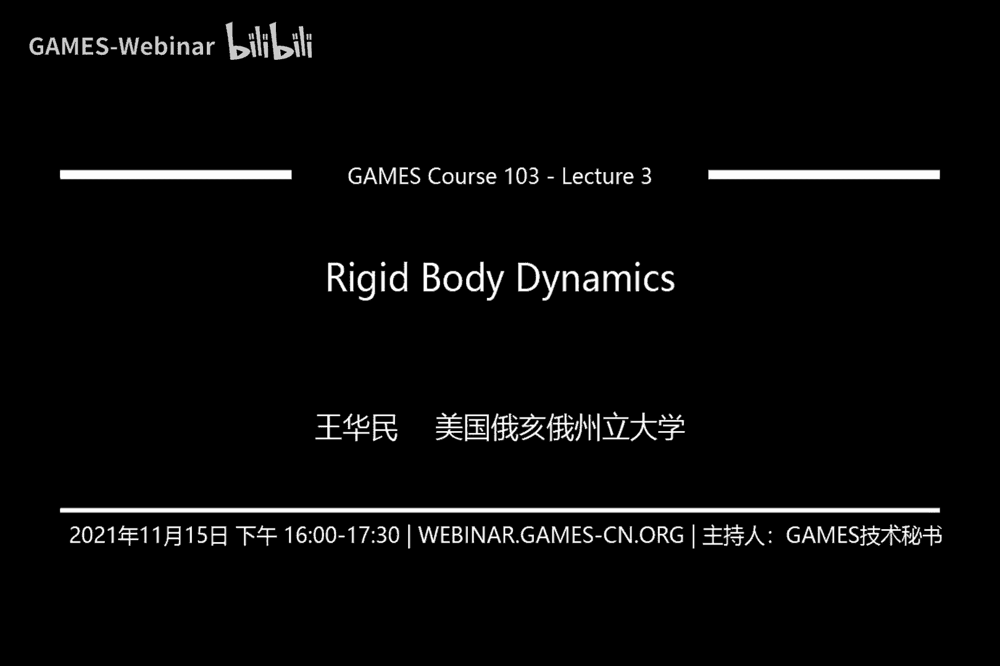
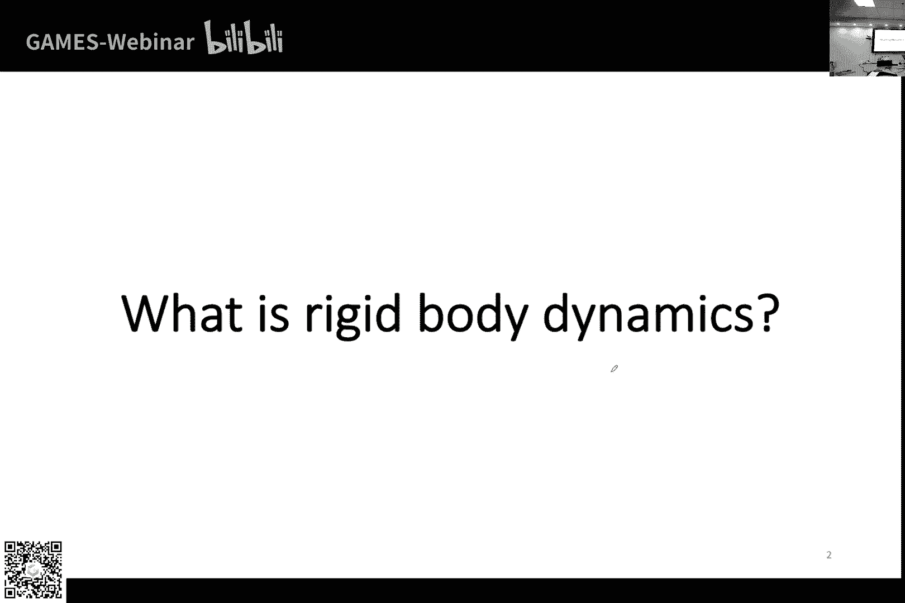
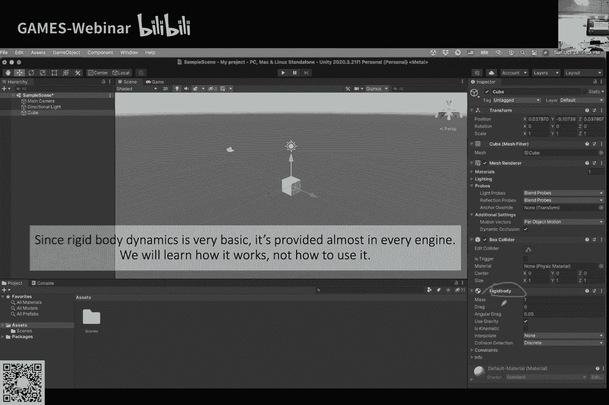

# GAMES103-基于物理的计算机动画入门 - P3：Lecture 03 Rigid Body Dynamics - GAMES-Webinar - BV12Q4y1S73g

是不是我们是不是都是浙大的同学为主啊，浙大同学举下手，让我看一下好吧，那就相当于是基本上是浙大专场，感觉，你们前两周的那个看了吗，还是发水，反正我们今天今天就继续往下讲好吧。

今天主要就是我们上周主要是讲了那个哎这听得清吗，可t吗，我们上周主要讲的那个就数学那一块嘛，但是没讲完，留着点尾巴，所以说我想把剩下的部分讲完，嗯然后讲完数学之后呢，我们会呃讲一下刚体。

然后刚体我主要是想分成两次来讲，我们今天讲一次，主要是讲就是当单个缸体本身的一些运动，比如说位移压旋转啊，然后你怎么样啊，写一个物理引擎，这是这周，然后我们下一周主要是讲碰撞这一块。

就是呃缸体跟别的物体它如果有接触，我怎么样处理钢体跟别的物体之间的接触，然后怎么样能够让钢铁不要跟其他物体发生穿透，就是把它分成两节课来讲啊，但是我不会讲的特别完，因为刚才那个冯旭东你也讲了。

就是就是钢铁，它其实里面还有很多，就是比如说带约束的钢铁，比如说我们做人体，那么人体骨骼的话，它其实可以认为是一种钢铁，但是呢他这种缸体它是由几个缸体构成的，然后这些钢笔之间彼此又有约束。

它是连接在一起的，那这种的话我想到时候我们讲专门会有一节课，讲约束的时候，我们到时候会回过头来讲怎么样处理，就是多个物体之间的约束关系，但是这次呢这周呢还有下一周呢，我们主要是讲单德纲写为单个缸体为主。

听得见吗，有回声是吗，我不是那么处理，我在想是不是因为这个原因，等一下，现在呢，回声好点了吗，等一下我看看是不是因为我这里有两个声音的那个，是不是删掉一个，嗯这个怎么删除啊，我是不是把这个关掉。

会不会就没有回去了，就关掉，那我就把它删了吧，感觉，现在呢现在还有回声吗，哈喽哈喽哈喽好了啊，那可能就是因为有两个麦克风的原因行行，我们上周就是呃呃讲了半天取证，然后讲了一下矩阵的正定这个东西嘛。

然后给大家一个呃一个小quiz，就是你怎么样证明一个矩阵是正定的，就是这里我想给大家举这么一个例子，就是假如说a是symmetric positive definite的，呃。

你怎么证明b然后b是这种样子，a负a负a a它必然也是半正定，那我为什么要举这个例子，是因为等会儿我们会看到，其实我们有很多的矩阵在模拟里面有矩阵是类似这样的形式啊，所以说如果说你要保证b是阵地的。

你只要证明半正定的，你只要保证a是正定的就可，那怎么证明呢，我们可以用定义去证明它，呃我假设啊有一个向量我可以把它拆成两半，一半是x一半是y对吧，这个向量可以是任意的向量，我我并不知道。

我并不知道这个向量是什么样的向量，反正我就有这么一个向量，那么这个向量呢我可以把它分成两部分，x跟y分成x跟y之后呢，我分别在b的左边跟右边，我都把这个向量乘上去，那么按照我镇定的定义，半正定的正义。

我需要证明的是什么，我需要证明的是嗯，我需要证明的是这个东西它必然是大于等于零的，我只要证明这个东西是大于等于零的，那么也就是意味着说b肯定是半正定的了，那么我怎么证明说这个东西不管xy是什么玩意。

我总归是大于等于零的呢，那我可以根据矩阵乘法的规则来说对吧，我根据b的定义，b是呃，这边是a负a负a a然后左边右边分别是x y那我把它乘一下，乘一下，完了以后我得到了什么。

我得到了x transpose乘以a乘以x减y，然后减去y transpose a乘以x减y，大家可以简单的做一个乘法，就会发现，假如说我先把这个矩阵跟右边的相乘，我先把矩阵跟右边的相乘。

我得到了a乘以x减y，对不对，上面第一行我就是a乘以x减y，然后下一行呢是负a乘以x减y，然后完了之后呢，我再跟分别跟xy相乘，我就得到了我这个下面公式的第一行，然后得到下面公式第一行之后呢。

我再去把这两个东西合在一起，我就得到了x减y的transpose乘以a，然后乘以x减y，然后得到这个之后呢，我就知道这个东西肯定是大于等于零的了嘛，对不对，因为这个东西a是正定的，a是正定。

这也就意味着，不管x减y是什么，它永远都是大于等于零的，等于零，什么样的情况等于零，那就是x等于y的时候，它会等于零，否则的话它就永远是大于零的，所以说因为a是正定的，我也就知道了。

这个东西肯定是大于等于零的嘛，所以也就意味着不管我的xy取什么样的值，我都能保证这个东西是大于零的，所以说我就证明这个东西是证明半正定的，这个东西反正就是可以从定义出发嘛，我根据定义。

然后我去构造这样的状态，然后我确保说这个东西乘出来肯定是大于零的，大于等于零的，就是把它当成定理，这个就是给大家举个例子，然后后面我们也会用到类似的矩阵呃，然后当我们讨论到类似的矩阵的时候。

我就默认就是说我只讨论a的正定性就够了，因为根据这个我们刚刚证明过的，就是只要是正定的，那么b也是正定半正定的，嗯好吧，这个反正基本上就是我们就是正定的，关于镇定这一块，我们就讨论到这里呃。

然后接下来我会稍微讲一下线性系统，因为我们很多时候我们处理数学问题呃，不管什么样的数学问题，很多时候最终都会呃涉及一个问题，就是怎么样去解一个线性问题，那什么叫做一个线性问题呢。

它其实本质上就可以写成这个形式，就是ax等于b然后a它是一个矩阵，是一个方块，是一个方块矩阵，然后b呢我们一般把它叫做边界条件或者是boundary vector，就是等于等于的那一个部分。

然后x是我们的位置，我们不知道x是什么，然后我想得到x，我想把它解出来，然后这个东西啊，其实大家从小到大一直都在学这个东西，对不对，小时候就学怎么解这个二元一次方程，然后三元一次方程。

然后老师就教做什么消元法啊什么之类的，然后其实本质上从小到大都在学，然后到了大学里面，其实学线性代数本质上也是想要去处理这个问题，因为线性问题是很多我们科学问题的核心所在，最终都是要解一个线性问题。

那么怎么样去解决线性问题呢，一种比较简单的想法，就是我只要把这个矩阵的逆算出来，我如果能把这个矩阵的逆算出来，我这个问题就解决了嘛，对不对，因为我有了矩阵的逆，我直接做a inverse乘以b。

我做个矩阵乘法，我就可以把x得到了，但问题在于，问题在于a universe这个矩阵的逆这个东西是非常难算的，它不光是非常难算，而且很多时候我们的矩阵它是稀疏的，而矩阵的逆一个稀疏矩阵的逆。

它通常就不是稀疏的，那也就意味着本来我们的内存占有可能比较少，比如说我比如说我有10万的点或者是100万的点，那我构造出来的矩阵可能大部分情况下都是虚数的，那我不需要用很多很多这个内存去存这些值嘛对吧。

因为很多东西都是零嘛，但如果说我要算矩阵的逆，矩阵的逆又不是稀疏的，那我内存开销就一下就变得很大了，那不光是计算的问题，同时它也带来的就是存储的问题，所以通常我们就呃不直接的去计算这个主线的利益。

那我如果不取证直接转矩阵的逆，我怎么来处理这个问题呢，那通常就有两个方法，一个叫做直接法，一个叫做迭代法，直接法呢一般来说就是基于分解l又分解，当然lu分解它有很多变形啊，啊比如说kiosk。

比如说l d l t类似的这种其实都是l u的分解呃，主要的区别在于就是还是内存啊，因为lu分解它相对来说是最佳内存的，然后其次是l d l t，然后还有再其次是killsd。

因为后两者他们是对对称矩阵，它有优越性，因为为什么，因为是一个对称矩阵，对称矩阵就意味着我只要存一半就够了对吧，因为它是一个对称的嘛，上下是一样的，我内存存的时候我只要存一半，那如果非对称。

那我可能就要用lu，那么我需要一个完整的把它记录下来，那什么叫l u分解呢，l分解本质上就是这么个意思，就是假如说我有一个矩阵a呃，然后呢我可以把这个矩阵a呃分成两部分，然后呢一个是分别叫a一个叫u。

然后l呢是我们叫做下三角矩阵，就是它对角线的上面都是零，然后只有下面有直，然后呢u呢它是对角上有直，对角向下面是零，然后对角的上面是有直的，呃这个具体怎么分解我就不讲了啊，因为他这个涉及到它一个算法。

其实还是比较简单的，如果大家呃上过信息代数的，有些课程的话可能有些接触，但是我这里就不展开了，展开的话可能就是要花好几个礼拜的时间来讲这个事情，那我为什么要做这个lu分解对吧。

因为lu分解呢它主要的目的是什么呢，主要的目的是呃，他做了这个lu分解之后呢，我就可以很方便地解这个线性系统了，稍等我看一下，怎么呢怎么做呢，比如说我现在首先我第一步我要解ax等于b对吧。

那我第一步我先解a y等于b，那怎么解l y等于b呢，因为l是一个下三角矩阵嘛，那我对于第一行而言，我是不是就是l00 乘以y0 等于b啊，那就变成一个非常简单的一个小公式了。

l00 乘以y0 等于b了，那么我就直接就可以得到一步就可以到位，我就知道y0 等于b0 除以l00 对吧，那我第一个元素马上就可以得到，然后我做第二个，第二个呢我是l10 乘以y0 。

加上l一乘以y一等于b1 ，那么l0 我刚刚已经解出来了，我l0 已经知道了，那么我就变成了一个只有一个未知量，那么现在我l一就变成未知量，l0 变成已知量了。

那么我就变成b1 b一减去l10 乘以y0 ，然后再除以l1 ，那以此类推，我每解完一行，我就把这行的未知量给得到了，把y0 解出来，再把y一写出来，再把y2 y3 y4 y5 y6 。

就把y每一个y都给它解出来了，对吧，就是一个顺序的关系，那解完l y等于b之后呢，我再回过头来我解x，那这里呢我就是u x等于y是因为你把这两个合在一起。

你就会发现这个是本质上就是l乘以u x等于b那么我先把y解出来，相当于y是一个我的中间结果，我得到这个中间结果之后呢，我再去解x那对于x而言的话，这个u就是一个上三角矩阵。

那我u n n就是我最下面那个东西，就是呃就只有一个，那么我就是u n n乘以x n等于y an对吧，对于这一行而言，我就是一个非常非常简单的一个小小式子，那我就可以得到xn等于y n除以u n n。

然后呢得到x n之后呢，我再去解倒数第二行，我可以把n减一减出来，然后我再减倒数第三行，按顺序，然后最后把所有的x都剪出来，所以说这个就是本质上就是呃lu factorization。

你得到了这个lu分解之后，我可以利用这个下三角矩阵跟上三角矩阵，我按顺序先做一次，我就可以把x求解得到了，这个叫做直接把，因为就相当于就是一步到位，把所有的东西都算出来，嗯那直接法有什么特点啊。

首先第一个特点就是说如果说a是稀疏的，如果说这个矩阵是稀疏的，那么l跟u它就没有那么稀疏了，相对而言它其实还是稀疏的，但是它相对而言没有那么稀疏了，那么它的稀疏性体现在什么呢，它稀疏性其实跟行跟列。

也就是我们的这些每一行每一列的这个未知量的排列顺序是有关系的，就是你换个顺序，有可能它的吸收性就会发生改变，然后呢如果你的顺序好，那么你的l u就会比较实数，如果说你的顺序不是很好。

那么可能你就啊就就很不稀疏，就就变得有很多非零项，这就是为什么我们通常在做计算的时候都是还要再多一步，就除了你要对u之外，我还要有一部叫做permitation，他的意思就是我要把这个顺序给修改一下啊。

我不是说我这个矩阵a给我什么，我就直接拿来算，我是需要把这些行跟列，我要按顺序先重新排列一下，排列完了之后呢，我可以让我的l u更稀疏一点，如果大家用过matlab，然后做lu分解的话。

你会发现它的输出其实是l u和p，然后这个p矩阵就是它的排序矩阵，这个的话我就不展开了，反正如果大会大家会买mate lab的话，可以尝试一下去看看这个，嗯然后第二点第二点就是它的关于它的计算啊。

它的计算实际上是由两部分构成的，一部分呢是分解l又分解，就是说我怎么样去把这个l和u给它搞出来，然后第二部分呢是求解求解，就是说我有了l u之后，我怎么样把最后把x给算出来对吧，那么目前而言呢。

就是说这两部分它其实是可以分开来计算的，你不需要求说这两个东西需要合在一起，你可以把它分开来，那么分开来的好处在于，如果说我解一些数学问题，然后呢我这个a是固定的，我的边界条件，我的b每次可能不一样。

但是我的a是固定的，那我前面分解那块我就可以只做一次了，那我分解那块只做一次，我后面求解sop的那一块，我还是要做很多次，但是分解我起码那块的计算量通常是一个计算量的大头嘛，我可以把这个计算量省掉。

这个也是一个需要额外注意的，因为图形学里面其实它有一些专门的方法，就是专门为了中心设计，就是如果说我假设我的举证固定，那我实际上只要做分解就可以了，那我在计算量上我就可以省掉一大部分。

然后最后一点就是说这个方法它是呃它是比较难并行的，相对而言，因为我们刚才也讲到了嘛，就是你首先要做l u分解，然后做完分解之后，本质上它就是一个比较创新的过程。

嗯但是分解那一块呢好处在于我想还是可以做一点变形的，它也不是说完全不能做变形了，就是可以做一点变形，然后市面上比较呃比较经典的一个库呢。

做这个呃direct solve的这个直接法分解的库呢叫做m k l polio，就是intel m kl的，之前他们收费，然后最近他们已经不收费了，所以说大家如果感兴趣，然后想要试一试。

想自己做解一个线性系统的话，这个是一个我个人认为是一个比较好的选择，然后很多其他的库，比如说像安哥那样的库，它其实也支持mk potio，就是但是你需要做一些对他的库做一些改修改啊，也可以支持这个东西。

这个我就不展开了嗯，大家可以尝试一下感兴趣的，然后direct sober，然后第二种方法解线性系统呢叫做迭代法，那么迭代法是什么样子的，迭代法基本上都是呈现这种形式。

叫做stationary的迭代法怎么样呢，就是说啊每次呢我都把我的x更新一下，假如说我现在有一个x0 ，那么我每次呢都更新一下，我得到x1 ，然后下一个时刻呢我得到x2 ，然后我以此类推，我不断的迭代。

不断的更新更新xx最终我希望我的x啊，就是我想要的ax等于b的那个x，那么我怎么做呢，我怎么迭代呢，一般来说就是这么个形式，就是我的新的x就是下一个x等于现在的这个x加上一个小的长，一个时速的一个系数。

我们这一般叫做relaxation coefficient，然后呢有一个矩阵and inverse乘以residual，residual就是b减ax啊，这个叫做我们的残插入c9 erro。

理论上就是说如果说你的x是你的解，那么这个东西实际上就等于零了，因为x等于b吗，如果说我的x已经完美了，那我这个东西理论上应该是等于零的对吧，当然因为我们在做迭代法。

所以说我们一开始是没有办法保证这个东西等于，如果说等于零，我其实就已经问题解决了嘛，所以说一开始他可能不等于零，不等于零，完了怎么办呢，我就不停的呃更新x就是利用这个公式我去更新它。

然后最终我就把这个x给他解出来了，那么这个东西它为什么会收敛，可以给大家看一下它这个收敛的性质是什么，就是我来看这个下一个residual error是b减x k加一对吧。

这个是下一个residual error，那下一个residual error等于什么呢，下一个residual erro等于b减a xk，也就是上一个recedure，再减去阿尔法乘以a。

然后这个a universe i am inverse，再乘以那个c就完了，这个就是我按照定义嘛，我按照这个刚才我这个x k加一的这个定义，我把它带进去，带进去，完了之后我乘以a然后再啊被剪掉。

然后我就可以得到这么一个公式，那这个公式我可以把它稍微整理一下，因为这边有residual啊，这边也有recedure对吧，那我两边都有recedure，我就可以把它合成一块嘛。

我就变成identity减去阿尔法乘以a乘以averse，然后再乘以b c92 ，那么我就可以以此类推，怎么类推啊，因为这个是k时刻的residual嘛，这个k迭代的recedure。

那我再往前推k减一是不是也要往前乘一个这个东西，k减二是不是也要往前乘一个东西，那我倒推回去，我倒推到最最粗的那个状态，零的那个状态，那么我前面是不是就成了一大堆这个东西啊。

那我也就得到了i减阿尔法a m inverse成的k加一次方，就是把这个东西反复的乘以它自己乘以他自己最后成了k加一次，我就得到这个东西，那么这个东西它其实是一个常数，因为我初值我是固定的。

我有一个初始值吧，那这个是个初始值是固定的，那么也就是说最初的残差它实际上是个常数，它是固定的对吧，那么如果我要收敛，那我要做什么，我要保证这个东西要无限的趋向于零，对不对。

因为只有当这个东西趋向于零了以后，我零乘以这个东西我才趋向于零嘛，我才可以把这个东西最终变成零嘛，我的目的就是要让error等于零，那么我怎么样让这个东西等于零呢，趋向于零呢，我这里就不展开了。

但是它这个东西跟特征值很有关系，那么这里面它有个数学里面有个概念叫做spectral radius，好像叫谱半径是吧啊，我把它算出来，这个东西叫图肝病半径，然后我要这个东西小于一。

我为什么要让它小于一二，因为当它小于一的时候，一个小于一的数，你不断地给它乘以，它自己乘以，它自己乘以它自己它会趋向于零的，比如说0。9对吧，0。9的平方，0。81，0。81，再乘以0。9。

它你乘了好多次之后，它就无限的趋向于零了，所以一个道理对于矩阵而言是一个道理，如果说你矩阵的谱半径也是小于一的，也就意味着矩阵乘以它自己，然后无限的这样子沉下去，它会最终会趋向于一个零矩阵。

所以这个就是判定呃一个矩阵是不是呃，这个系统是不是能够呃用迭代法收敛的一个呃一个特点，当然我们前面也讲过，其实你做特征值是很难计算的，对于一个很大的主角而言，你算特征其实挺麻烦的。

所以说这个是个很多时候只是理论上，理论上special radio小于一我就可以保证了，但事实上我也没法算，这个是其实也是一个一个蛮大的挑战，那么接下来我们看这个其实是我们这个整个计算的核心对吧。

那m呢它有个特点，就是说你必须要是一个比较容易求解的一个m，我才可以拿来拿来用这个迭代法吗，那什么样的am是比较合适的呢，比如说对角，比如说我可以用a的对角，如果是一个对角的话。

它的inverse就是超级容易算，对不对，我直接把每一个对角上每个元素按照分之一就行了，所以说这就是一种方法，其实就是我们如果学数值计算里面的话，这个就叫做jo比呃。

还有一种方法叫做ga die goost ele呢，就是用下三角，就是用a的下三角，这是两种方法，是相对来说比较常见的方法，当然这还没完，这还有别的方法啊。

比如说我可以在这个简单的这个stationary迭代的方法，是让我再加一些额外的方法，比如说共轭梯度法啊，这些就有很多很多方法，这个呃反正我也不展开了，那么迭代法跟直接法它们对比一下有什么样的差别呢。

首先迭代法很容易实现啊，就如果说你自己要写一个求解器，那么呃首推就是做迭代法，如果写直接法的话，可能你要花好几个礼拜，你迭代法你可能一天一个下午就可以写完，就是它很简单，实现起来非常方便。

第二点呢就是说如果说你不需要得到精确解的话，那么迭代法它是相当相当有效的对吧，你只要比如说你跑十个迭代，它比较可控，因为它的计算量跟你的迭代数量有关对吧，你迭代越多，你计算量越大，那么如果你精确解。

你不要求精确解，那么你就直接少少跑几个迭代就可以了，然后其次呢它也相对来说比较容易并行，它有各种各样的并行套路，对于迭代法而言呃，缺点缺点呢，首先第一点就是说它有收敛性的问题。

就是说他不是对于所有的矩阵他都收敛的，那么什么样的矩阵收敛呢，它就有一系列的条件，我们刚才比如说我们刚才讲了，就是他的special radius要小于一，但现实生活中我可能没有办法用这个东西判定。

那么有可能就是用别的方式，比如说比如说对于高斯贝尔而言，这个矩阵就必须是镇定的呃，比如说对于其科比而言，这个矩阵就必须是对角占优的，当然他有的时候不对角占优，他有可能也收敛。

但是这个东西就没有办法直接的判断了，我只能说给一些条件，然后我知道说这种条件下是可以收敛的，然后最后一个呃，对于迭代法院的一个一个问题，就是他如果说你想要得到精确解的话，它就相对来说比较慢了。

因为它迭代就会需要很多次迭代，这个是它的一个一个小问题，好吧，这个我就想把矩阵就先讲到这里，大家有什么问题吗，关于relaxation的一部分，有没有什么可说的呃，什么没没没什么可说的。

这个relaxation很多时候就是手工调，就是阿尔法这个系数嘛对吧，这个阿尔法这个系数很多时候大家都是手工调，他跟我们一维精确性风格里面的一系有关系，如果说你把信息系统认为是一个二次问题。

二次优化问题的话，这个阿尔法其实就是跟line search里面的那个line search的那个阿法是一样的，但是对于解信息系统而言，一般来说大家不会去手工的去展示。

各位max是因为实际上这个阿尔法理论上也应该是个常数嘛，因为它跟这个条件有关，就是说理论上是一个常数，所以一般来说就试错试的，觉得这个阿尔法ok了，我就我就好，要是不崩溃了，我就改小一点啊。

然后我们接下来讲点微积分吧，微积分的定义吧，因为我们回头到时候讲流体的时候，可能会讲到一些很多关于微积分啊，所以说我我这里会给大家过一遍，有可能到时候因为流体我们是放到最后讲的。

就有可能讲到最后大家全忘光了，可能到时候回头还要回来再把这个东西看一下啊，首先首先简单的讲就是一阶导，然后如果说fx是一个实数的函数，然后x它的它的变量是一个矢量的话，那么我们大家都知道。

就是你可以有偏微分嘛对吧，我就df就等于df x d f d x乘以dx，加d f d y乘以d y加d f d d z乘以dc，那么我们一般来说会写成这个形式啊，就是df dx dx的形式。

大家注意一下这个字体，我一般来说我们我上次也讲了，就是我们一般是用字体来区分到底是矢量还是标量的，像这个黑体字就意味着它是一个它是一个矢量对吧，然后这个斜体字就是标量，所以说我对矢量求导。

那么等于这个df分别对它的x y z的每一项求导，所以说就是d f d x d y d f d y d z，然后它是横着写的，大家有大家注意一下，它是横着写的，为什么横着写。

是因为呃你你会发现这个可以写成这个形式，跟矩阵乘法一样的形式，就是这部分是横着的，然后这部分是竖着的，所以说你这样子就可以做这个乘法，但有的时候我们不喜欢写成这个形式，我们就想竖着写，那怎么写呢。

那就用梯度，梯度呢，就是实际上就是他这个一阶导，但是我给他转置了一下，我把它本来是求导求出来的，是横着的嘛，我把它改成竖着，那我就叫梯度的，这个反正大家应该学微积分的时候应该学过吧。

学数学分析的时候应该学过吧，我记得对吧，那么梯度梯度它是什么意思呢，嗯梯度它是这么一个意思，就是你可以这么想，就是假如说f是一个函数，它是定义在一个比如说二维或者三维空间里的话。

那么这个二维空间这里面我就是用一个二维的例子啊，这是一个二维平面，然后这个对于平面里的每一个点x呃，它都有一个函数值嘛对吧，那么如果说我画一个等位线，iso surface iso curve。

就有点像我们学地理的时候会画那种等高线嘛，一个道理就是同样的值我都用一条线把它连起来，那么假如说我现在花了很多等高线吗，iso surface iso curve，那么这个是0f等于零的时候。

这个是f等于一的时候，f等于二的时候，f等于三的时候对吧，就是不同的等高线，那么gradient什么意思呢，gradient就是告诉了你垂直于等高线的那个方向，它其实就给你这个东西。

那这个东西实际上就是让你的这个函数能够最快，这个函数值能够最快上升的那个方向，比如说我现在在这个地方对吧，这个零的这个位置，然后呢它垂直于这个等高线的位置呢，方向呢就是这个方向。

那么沿着这个方向我就很快的就可以让我的这个f它的值往上往上跳，对不对，就有点像爬山一样，当你爬山的时候，你肯定是想沿着最陡的那个方向往上爬，这样子爬得最快的一个道理。

梯度就是告诉了你什么样的方向可以让你的f能够更快，那反过来如果说我想要往下山，我不想我不想爬山，我想下山，那我就反过来，我就沿着f的反方向往下走就行了，这个就是梯度啊，刚才有个同学问。

就是我们需不需要自己解放成呃，反正作业里面是不需要的，因为unity他这个我还不知道unity能不能解方程的，反正我是我们我们到时候作业里面反正是不需要自己解方程的。

但是如果说以后如果说比如说你自己想做些研究啊，或者做些项目什么的，是有可能需要减防车的，像我们这个课里面不会涉及到解放前的工作，然后一阶导可以往下扩展，就是我们刚才讲的是一个实数函数，就是f是一个实数。

那如果说f它本身也是一个矢量，然后它的变量x也是一个史料，那怎么办，比如说假如说我这个f是啊一个三维的一个向量啊，本身这个函数它是一个三维向量，它本质上就是三个函数构成的，分别是f g h对吧。

它本身也是有三个实数函数构成的，那么它的一阶导呢就不再是一个横的向量了，它变成一个矩阵了，因为我分别要对这f g还有h这三个函数都求导，那么每一个函数都给我一行嘛对吧，我第一行就是f的导数。

然后第二行是g的导数，然后第三行呢是a区的导数，然后这就构成了一个矩阵，然后这个矩阵呢叫做杰克比矩阵，就是中文的雅雅克宾举例对雅克宾矩阵嘛就是杰克变矩阵，这就是杰克比矩阵。

然后跟杰克变矩阵相关的呢就是一个叫做divergence，散度，散度是什么，散度就是它这个对角上的和他这个矩阵的trace，我们叫做divergence，然后另一个呢叫做kr，curl是什么呢。

curl呢就是你可以把它想象成，如果说我把这个梯度的这个运算符，你可以认为是一个d f d d g d d h d，你认为它是一个相当于是一个也是一个向量的话，你跟这个f你跟这个啊，你跟这个f相乘。

本质上就是对它这个函数里面的每一个求导，对x求导嘛，那么你就跟cross product一样，就是可以第一行就得到y跟z。

然后h跟g好像是f h z x第三行是这个就是跟cross production有点像，你你如果认为这个微分算子是一个项链，然后你利用类似cross product，就是我们差成那个规则。

你做同样的操作，你可以得到这个q这个是也是一个在流体里面蛮常见的东西，我们一般来说做那个做vertex，就是呃流的水流的漩涡的时候，我们一般来说会用到这个客，但是我这里反正就是跟大家提一个醒。

就是说呃我们会偷做流体的时候，我们会搞到这些divergence跟kl，我到时候也会跟大家提一下，免得到时候大家忘记掉，然后刚才讲了，我们讲了一阶导对吧，我们现在讲二阶导啊，如果说回到回到实数函数嘛。

假如说f是一个实数，我二阶导，那我搞二阶导的话，就呃我的这个这个这个这个东西偏微分就多一点了，因为我可以对x y求导，也可以对x z求导，也可以对y z求导对吧，我就最后就变成一个大矩阵了嘛。

那我这个矩阵呢就是可以啊，就是按照这个x y z的顺序，我可以对他的这个导数做一个排列，我构造这么一个矩阵出来啊，这个我们把它叫做和弦矩阵，然后这个矩阵是对称的，因为求导的顺序是不影响结果的对吧。

你先对x求导，再对y求导，跟你先对y求导，再对x求导的结果是一样的，所以说啊我就有个和尚是这，然后合成矩阵的对角，我们把它叫做拉普拉斯，拉普拉斯啊这个东西，然后我这里其实想提的一点是符号。

因为不同的paper，不同的文献，然后不同的文档，他们其实里面用的符号都有点不太一样啊，就有的人他喜欢用这个类似这种符号梯度dot t度这种符号，有的人喜欢用这个梯度的平方啊。

他认为这个东西就是梯度的平方，所以说他写这种符号，然后有的人呢就把这个梯度给反了，反了就变成了一个正三角，就也有人是用这种符号的，反正就是大家得注意一下，就是你看到这个符号的时候。

就是就会想到这个有可能是关于拉普拉斯，就主要还是因为符号不统一，很多时候大家啊用的符号都不一样好吧，然后嗯这个好，还有一个就是举个例子吧，就是泰勒展开，因为大家都知学过微积分，都知道。

就是我们一个函数可以对它做泰勒展开，对不对，假如说一个函数是个实数，函数变量又是实数，那么这个就是它的泰勒展开怎么弄呢，就是fx 0，假如说我要在x0 这个位置上做泰勒展开啊，fx等于f x0 。

加上df x0 ，dx乘以x减x0 ，这是一阶的部分，然后我还有个二阶的部分，二阶的部分就是二阶导，二阶导乘以1/2，然后x减x的平方，然后呢后面还有三阶导，四阶到五阶导，这个反正大家都知道。

就是你可以把这个函数展开成一堆这个啊，一堆不同那个接的这个形式，那么我们对这种向量函数也可以做类似的泰勒展开，怎么展呢，当这个x是一个向量的时候，那么我等于f x0 ，这个时候x是一个向量了。

加上df dx 0乘以x减x0 ，那这个是什么，这个是它的一阶导，它是一个横着的项链啊，大家还记得吗，这是一个横着的，就是这样子的，然后x1 x0 是个竖着的，所以说一个横着乘以一个竖着的。

就得到了他的得到了一个实数嘛对吧，那么我就实数加实数这个符号，就这个这个它的这个他这个dimension，他这个维度就统一了，二阶导是什么样呢，二阶导是x减x0 的transport乘以合成矩阵。

再乘以x减x那这个是横着的，然后这个是个矩阵，然后最右边是一个数字的，是这样的形式，然后我可以把这个东西重新整理一下，就变成这个形式，然后上一个上一个礼拜，有有的同学不是说觉得镇定这个东西特别的闷嘛。

就不知道镇定一个矩阵正定有什么用吗，其实这里你就会发现镇定有什么用了，因为这个东西跟正定的定义是不是非常像啊，因为我们说一个矩阵正定的时候，我们不是说v transpose a要大于零吗。

我们当时说这个一个矩阵正定义是这个东西吗，它其实就是对应上的，就这个东西呢就是我们的v x减x0 ，就是我们的v我这个h我这个和弦就是我们想要判定的这个矩阵，那如果说这个h是正定的。

也就意味着我这个二阶项必然都是永远大于零的，然后就会对这个函数带来很多有意思的特性，然后当然我们这个我们今天也不讨论，反正以后我们会讨论到优化一些优化问题的时候，我们会回过头来讨论这个东西。

就是给大家呃提个醒，就是当初我们学镇定是有有用的，为什么，因为他跟函数的二阶导是有直接关系的，好吧，好然后再再举两个例子，这个例子是我们到时候我回头也会呃。

我们也回头用到的就是怎么计算一个向量的norm，就是它的大小的导数怎么算啊，首先我用定义我一个矩阵的一个向量，它的这个nm它这个l等于x transport，x transport x开根号对不对。

我跟自己相乘，然后我开个根号，我就得到自己的大小了，那么这是这个是这个矩阵啊，这这不是矩阵这个向量长度的这个定义，那么我利用啊这个微微分它这个呃他这个这个这个这叫什么链式法则，什么啊。

我可以根据这个圈入，我怎么做呢，我首先把这个1/2扣出来，1/52抠出来之后呢，我原来是开根号，我就变成负的1/2了，那我把这个括号里面的全都放在这里面，变成了x transpx的-1/2。

然后再乘以括号里面的东西对x求导，明白吗，这个就是一个圈入，大家有没有问题，这里，这个其实就是我们正常做微积微分的时候，就是对于一个对于一个函数，我可以先把这个函数对x求导偏微分。

然后我再把函数变量里面的东西再给它求导，然后我要对这个括号里面的东西求导，我怎么求，不用定义求对吧，我知道x是什么，我知道x实际上就是x y z嘛。

那么x transpx就是x平方加y平方加z平方嘛对吧，那么你对x求导分别就得到了2x2 y2 z了，也就是意味着也就是这个东西等于2x transport好。

我知道这个东西是2x transport之后我放回去啊，这个东西呢，是什么呀，这个东西是二乘以x长度分之一，因为这个东西是负的1/2，负的1/2就变成了分母。

然后下面这个开根号也就是意味着这个是x的长度，那么我就有二就有二就取消掉对掉，然后最后就得到了x transport除以x的length，这个其实直观上也非常容易理解，为什么。

因为这个东西告诉了你一个向量长度的梯度是什么，因为你把这个东西做一个转置，就是梯度吧，一个长一个向量强度，怎么样能够让他最快的变长或者变短，因为你想要长度变大了，那么怎么样变长。

是不是就是继续沿这个方向继续找，继续沿这个方向长，那怎么样变短了，就是沿这个方向反方向继续缩，所以说这个东西实际上就是把这个方向给normalize了一下，它告诉了你这个方向怎么样能够最快的变长。

能变短，然后刚才有个同学问嘛，就是说呃为什么要做这个quiz，因为我接下来就会给下面这个例子，就是算一根弹簧，我现在把这个式子放在这个右上角，然后我现在假设有这么一根弹簧，弹簧的原长是l。

然后弹簧的能量是什么，是一个函数对吧，它是关于这个位置x的函数，它是1/2，二分之k乘以长度减去l的平方，这个就是弹簧的能量，就是当前长度减去原长的平方，再乘以一个k除以二，那么我现在要算利了。

大家可能知道怎么算力，但是我在想给大家展示一下，就是我们如果用我们刚才ta calculus的方式，怎么去算一根弹簧的力，弹簧的力根据物理的定义呢。

是能量的gradient是gradient的反方向就是负的gradient能量，这个就叫做力，这就是力，那么我对我刚才有这个能弹簧能量的定义对吧，那么我现在就对这个x求导了，因为梯度就是x求导。

那么我接下来就是对梯度求导好吧，那么我对这个求导，我首先把这个二他有这个平方，那么这个二跟这个二相乘抵消掉，然后接下来得到了什么，得到了k乘以长度减l对吧，就得到了这个东西，负号保留。

因为我本来就想需要得到一个负号，所以就有这个负号，然后接下来呢我需要对里面的这个东西求导，对x求导，当然我是梯度，所以说我把这个transpose给它摆上去。

这个t transport的来源在于来源于这个梯度吗，所以我对这个东西求导，那么这个东西什么呀，这个东西我前面不是算过了吗，我刚才这个右上角不是算过了吗。

这个东西就是x transport除以它的长度吗，所以说我把它整理一下，就得到了负的负的k乘以长度减l，然后乘以x除以长度，然后大家会发现，这个公式其实跟我们想象中的弹簧的力的公式是一样的。

就是什么意思呢，就是前面这个东西是弹簧的力的大小，它决定了弹簧力的大小，力的大小跟长度的缩放比例有关，后面那个东西告诉了你弹簧力的方向，然后这个方向是跟弹簧的这个向量的这个方向是一致的。

为因为我的利益永远是希望我的弹簧能够很快的变长，或者很快的变短了，所以说他可能是梯度的方向，所以说这个就是计算了弹簧的力，好我们再往下走啊，我们不满足于利，我们接下来还要再往下走。

我们怎么算这个能量的喝水，因为我们回头如果要做一些高级点的这个模拟的话，弹簧系统模拟的话，我们要它的合成，那么他这个喝水其实数学里面有个名字叫做steffness，矩阵怎么算呢。

和弦等于负的d f d x因为力是有负号的，我这里再把这个负号给扔掉，我就两两抵消掉，我把负号抵消掉，然后呢我对f对x我再去求个导，我就可以继续利用这个我们微积分里面学过的知识吗。

我首先对括号里面这玩球的，我括号里面就玩求导，是不是就是这个右上角这个东西啊对吧，就这个东西了，那我就得到了k乘以x乘以x transport除以的长度的平方，这个是对括号里面求导。

然后括号里面求导完了，我接下来对括号外面求导，因为括号外面它本质上就是最右边这个东西对吧，还有分子跟分母两块，所以我先对分子求导，那么就是加上k乘以长度减l分子求导，x对x求导就是identity。

因为我自己对我自己求导就是一嘛，x对x求导就是一嘛，只不过这个我们现在求导是因为是矢量，所以说求出来的不是一个实数，一identity取证，所以说这里就是identity除以x l。

然后呢接下来我们对分母求导，分母就是长度分之一啊对吧，那么我就长度分之一，我就变成-1，就是负号减去前面那个系数，再乘以分子，保留除以x norm的平方，然后再对x norm求导，x norm求导。

我把这个东西再放进去，就是一堆实际上本质上就是微积分，就是微分里面我们利用这个链式法则，文不大对求导，最后就得到了这个玩意，然后我可以稍微对这个公式整理一下，我就得到了这么一个公式。

所以说这个就是我们对弹簧能量求导，然后就可以得到力，然后再求一次导，我就可以得到一个矩阵，就是我们的stiffness matrix，就是它的合成矩阵，好吧，大家有什么问题吗，什么，物理含义。

就是你可以认为你x是认为是一个二维上的一个点的话，然后你把能量认为是一个相当于一个一个一个米曲面，那么它这个tension phens相当于就是它的这个二阶导，就是这个曲面的二阶导，我们常常看见的是。

比如说一个曲面看有点，那他那个space嘛对，但是这个东西它其实是一见到它是立理解到的处罚，这个其实你可以这么想，就是说而物理含义如果说你可以考虑一维的情况，如果说如果是一维的话，这个东西就是k。

我们正常情况下不是把这个k叫做stiffness嘛，对吧，就是它的这个stephens，中文叫格，就是叫进度系数吗，高中物理还阻尼，也不叫阻尼吧，也不是阻尼吧，胡克星系数对，有点好像叫胡克系数吧。

反正就是这个stiffness，这个就是k嘛对吧，那如果说一维的情况下，你做二阶导，它就是k，因为你可以想象，如果说这个x是实数，那你求二阶导他就是k吗，但是问题是我们现在不是一维，我们是一个高维空。

是个二维空间或者三维空间的时候，你对它的二阶导，它就变成了一个关于k的一个举证了，就是他的跟这个物理稍微有点关系的一个方式，然后这个有篇paper就是2002年的时候。

有一篇paper叫做stable responsive cross，这个里面也会也有引用了，这个就是计算方式，就如果大家想再仔细的看一下这个推导过程的话，可以参考一下这个paper。

有同学问为什么为什么叫tgent，我们刚刚也是讲，就是说为什么叫tgent，好像我们也想不出来为什么叫tgt，就是tgent，它跟可能是跟力有关吧，因为它是力的一阶导，如果说你认为力是一个函数的话。

那么二阶导就是力的函数的切向量，可能是因为这个原因，我们把它叫做tangent def，可能是这样的，然后在我在想再往下一点就是两个点，就是如果说我们有两个点，因为刚才我是一个点吧，x是一个点。

那如果说我有两个点怎么办呢，两个点都是活动点，两个点都是未知量，那么我的这个能量就变成x0 到x一的长度，减去l的平方乘以这个k除以二了，就说我的长度就不再是the norm，而是x0 到x一的。

那么我这里的力呢就是有两个力了，就不是一个力，是两个力，分别是零这个点上的力跟一这个点上的力对吧，你也可以认为我们我们上一节课也讲到了，就是当你有好几个顶点的时候，你可以把这些顶点都合在一起。

变成一个大香料吗，那么这个时候呢，如果说我把这个x都合在一起的话，就变成了一个六维的一个大向量，因为我有两个三维的顶点，那么就是六维的，我这个力也是六维的，就是r6 的，这是六维的。

然后分别上面就是分别就是两个力分别作用在零跟一上的力，然后这个符号大家有的时候会看到就是gradient 0，然后gradient的一什么意思，这个东西实际上就是他对x0 求导。

它对x一求导的意思就是大家想偷工减料，省一下，就是呃就是想写的简单一点，大家就会这么写，就是把这个下标就作为分别对某一项一个x求导，我们一般会这么写，然后这个结果是由两部分构成的。

分别是零上的力跟一上的力，然后呢它分别是f一跟负的f1 ，然后f一就是通过这个东西算出来的，这个我反正我也就不再推了，这个是满足牛顿定律的，就是都是相互的，弹簧给零的力跟弹簧给一的力，它是互相相反的。

然后呢这个东西的合成stiffness就是一个6x6的矩阵了，好这就是为什么我前面想要讲那个呃，刚一开始的时候，我想要举那个例子的原因是，因为他这个矩阵系统就是这个样子，然后它这边是h e对角都是h。

然后非对角就是负的，然后a h e就是我们刚才算出来的那个东西，只不过把换成了x0 x0 解x1 ，就是这点差别，我们回头呃，讲那个弹簧系统的时候，我们会再回到这里，然后会引用这些东西，就是大家呃。

如果说我们回头讲他们系统时候，如果说这里有些什么疑问或者是，有什么想法的话好吧，有没有什么问题，线上的同学呢，没有问题的话，我们没有问题的话，我们就讲那个讲rigid body了，我们还有一个小时。

可能半个多小时的时间吧，我们把rigid body那一块讲一讲，好好翻篇儿了，看一下哦，这个，首先我们来讲一讲什么是睿智的芭蕾，还有什么是rigid body dynamics。

就什么是缸体和缸体的运动学，钢铁的力学。

我们现实生活中其实有很多东西都特别硬，特别结实啊，所谓的in特别结实呢，就是说这些东西它其实很少有形变，如果说这种物体呢，我们就把它冲上去，把它叫做钢铁，就是我们默认这些物体没有形变。

形变呢我们就可以利用一些比较特殊的方法来模拟这些物运动，这个就是我们今天所要讲的这个主题啊，然后在动画还有游戏里面，还有很多这种图形学应用里面其实也用的非常多嘛。

说疯狂的小鸟就是一个比较典型的利用钢铁模拟的一个小游戏嘛，只不过他们做的是二维模拟，我们主要讨论的今天还有以后讨论主要都是以三维的，但二维可以认为是三维的一个特例，然后做很多事项，游戏里面。

比如说我们啊这个墙对吧，我把这个墙打穿了，墙打穿了以后，这个墙碎成很多块，然后掉地上了对吧，它本质上也是在做钢琴模拟，所以说失效都需要用到我们钢铁模拟的这个这个技术，那么钢铁模拟它其实非常常见。

非常重要，所以说一般来说在游戏引擎里面都是默认提供的，它其实也有钢铁模拟的这个东西啊，只不过我们到时候就是我们做作业的时候呢，就是不许不用到它自带的那个钢铁模拟，我们要自己来写这么一个东西啊。

就是如果说你自己以后想尝试一下这个，你可以发现这里其实是有一个未知的body这个引擎的，在这里的你只要添加添加一个component就会添加进去。

当然那我们到时候不会用到这个东西，它本质上做了一个什么事情呢，本质上就是说我们要去更新描述物体状态的一个变量啊，比如说我们的时间轴从左到右，我们的时间轴是很多时时刻t0 t1 t2 t3 t4 吧对吧。

很多时刻，然后呢我们的物理引擎呢更新描述这个物体的一个状态量，我这里把它叫做，那么假如说我现在有一个状态量叫做s0 ，对应的是t0 时刻，那么接下来我的游戏引擎呢就可以根据我这个状态量呢去更新。

这个物体在这个游戏里面的画面中的这么一个效果，就比如说我有个兔子对吧，s0 对应的这个兔子就是这个状态，那么接下来呢我如果做模拟模拟引擎呢，把这个s0 更新了，我得到了一个新的状态。

这个新的状态是t一时刻下的状态，那么我这个兔子就动了一下，然后呢下一个时刻呢我再通过模拟引擎得到一个新的状态，我就又兔子更新了一下，我就以此类推，我就每次呢我实际上就是我通过这个更新函数啊方式。

我就不停地更新这个状态，然后有了这个更新以后的状态呢，很多游戏引擎它就可以自动的把这个兔子的这个效果得到了，就是可以不退的往下走了，那么问题在于来了，就是说我怎么样去定义这个状态对吧。

我怎么样去描述这个一个缸体的状态，尤其是钢铁的状态，那么对于缸体而言呢，我像是只允许他做两种运动的，分别是平移和旋转，因为只有这两种运动是不影响一个物体的形变的。

那么通常呢是假设假设我这个兔子在一个prince的状态上，这个参照的一个状态，这个状态呢假设是这个兔子是在它自身的一个状态下，是它的中心就是圆点，比如说它这个左又是x，上下是y，然后前后是z。

就是类似的这样子的，我可以先假设兔子在一个某个参照的一个状态下，我们把它叫做reference reference space，首先我假设兔子是经过某一个旋转，就是它的状态，第一个状态量呢是旋转啊。

那么假设我兔子首先做了一个旋转对吧，这里呢我假设我是用一个旋转矩阵去描述这个旋转的，那么这个旋转矩阵我把它叫做大写的r，那么对于每一个顶点，一个顶点我用小2i来表示，我用这个i顶点来表示。

那么之前这个顶点的位置在这里之后呢，我做一次矩阵乘法，我就可以得到这个旋转之后的位置了，那么就是大写的r乘以2i这是我第一步，我假设这个状态首先是可以用一个旋转去描述这个旋转矩阵。

描述选中这个兔子的姿势对吧，然后接下来我假设有一个平移，平移决定了什么，平a决定了兔子的位置，那假如说它与原来的位置，原点新的位置是x点，这个兔子就从这个a原点跑到了这个x点对吧。

那么对于这个顶点而言呢，它的位置就是中心点，也就是平移的量加上rotation乘以reference space上的位置，说我是假设这个兔子它其实是它的状态，实际上是经过了两部分操作的，一部分呢是旋转。

一部分是平移，在unity里面也是一模一样的。

这个如果说大家啊用过unity的话，就是如果大家没用过的话，可以我们可以先尝试着先下载下来，因为我们到时候下个礼拜会有作业啊，如果说大家稍微简单地尝试了一下的话。

会发现对于unity而言其实是一模一样的，这个你这个状态栏里面它其实也会有不同的这个变量，分别是对应的是旋转跟position，还有一个放大缩小，但是我们就不做，不考虑放大缩小，这个就不考虑了。

旋转呢其实跟旋转矩阵还有点不太一样，我们回头也会讲这个东西，因为大家会发现它是由三个变量构成的对吧，它不是一个矩阵，我们会都会讲就是旋转，我到底应该怎么样去表示它，我们现在就知道了。

我们知道这个状态实际上本质上就是由旋转跟呃位置，这两个东西是构成的，我只要去修改这两个变量，我就可以让这个物体刚体运动了。

我们先来先来讲这个平移好吧，先来讲位置，那我位置我可以用这个xx也就是它这个圆，这个兔子至新的这个位置来描述嘛，表表示吗，这个位置比较简单，位置就是个3d向量，我们通常就是用3d向量来表示位置对吧。

假如说它原来的位置是x0 ，根据模拟我得到了一个新的位置，x一得到了一个向外一个位置x2 x3 ，然后依次模拟，然后我这个兔子的就可以沿着这个某一个轨迹在运动了，大家可以看到，虽然我位置改变了。

它这个姿势是不变的，它还是这个正的这个姿势，因为我暂时还没有考虑到旋转，我现在知道位置了，当然不够，为什么，因为在物理模拟里面，我还要去考虑到位置跟时间的关系，那这个时候呢我需要再引入一个变量叫做速度。

所以说我有两个变量，一个是x是位置，还有一个变量是速度，速度就叫做x dot，那时候大家叫dx dt，但是一般来说画一个小点，就他对时间的导数，那么就是跟速也是跟位置有关的，只不过是跟时间的导数。

根据定义速度是什么呀，速度牛顿说，所以说速度新的速度等于之前的那个速度加上量分之一，很有力的时间积分，就这么一个意思，这里我写的比较复杂一点，为什么，因为这个力它可能很复杂，它有可能是时间的函数。

有可能是位置的函数，有可能是速度的函数，所以说这个力本身是通过各种各样的方式给它计算出来，然后呢你根据时间做积分，然后冲量，然后再冲量再去更新速度，就是大概就这么个意思。

就是我们学物理的时候都会应该会学到这个东西，同样的呢，我们有位置，位置呢是位置是速度对于时间的积分，所以说新的位置就等于老的位置，加上时速度从t0 到t一时刻的一个积分，只有两部分构成。

所以说本质上我们在模拟呢就是要写积分，本质上就是要做这么一个积分，这就是为什么我们很多时候讲模拟引擎都在讲时间积分，时间积分为什么，实际上本质上就是这么一回事，就是我们要对时间做一个积分。

接下来我们看怎么样做积分，我们来看几种不同的套路，大家想一想什么是积分啊，假如说我这个横轴是时间，是时间，都是速度啊，我这里先假设是一个比较简单的一维的情况，就是都是速度跟位置都是一维的。

那么我就画一个简单的这么一个二维图来表示，这是时间，纵轴是速度，那速度的积分是什么呀，积分就是面积，就是假如说我这条曲线，我这个曲线是速度的函数的话。

这个积分t0 到t一时刻的积分实际上就是这一块阴影面积，这个函数在这个呃这个函数下面这块阴影面积，这个就是积分的意思，本质上我要去算积分，实际上就是我要去估面积，我想要估计一下这个面积是多少，对不对。

我怎么顾面子呢，比较简单，我们数学家也没什么别的本事啊，就是比较简单，怎么估面积，我就进四，最简单的方式是什么，就是搞一个方块，我就用一个方块去浸死他，这就是一个方块对吧，我用这个方块去进死他。

方块的面积我们都知道怎么算，对不对，就是底乘高吗，这个底是什么呀，这个底就是，就是两个时刻的时间间隔，我们叫时间不长，对叫deltt，就是它这个底面积宽度高呢，这个高就是零时刻的速度。

也就是说我有t0 时刻的速度，我再乘以deltt，我就把这个面积给估出来了，但是呢这个方法好不好呢，不是那么好，对不对，我是不是有误差呀，我这边其实有很大一块面积给漏掉了，我们来看一下泰勒展开。

根据泰勒展开，我们会发现其实我们刚才估的那个东西实际上就是它的一阶部分，这东西实际上就是我们的一阶部分对吧，不题在于一个函数，它做泰勒展开之后，它不只是有一些部分，它还有二阶，它还有三阶，它有四节。

据说呢我们这个方法呢我们把它叫做一阶精确的方法，为什么，因为我们只保留了一阶，我们保证一阶的东西，我们实际上都是估计到的，后面那个二阶三阶的东西呢，我们就是我们的误差，就是我们被我们漏掉的这个部分。

这就是叫做一种试积分，就是我们根据t0 时刻当前这个时刻的速度，我可以把面积给估出来，我把这个积分给估出来，既然有影视积分，那还有一种方式是啊显示积分，不好意思，刚才是显示积分啊，既然有显示积分。

那么还有一种方式就是做影视积分，影视积分那就反一反，我不用t0 时刻的速度，我用t一时刻的速度就换了一个高对吧，我换了一个方盒子，我用这个方盒子呢，我还是有底面积，底面是deltt，是t一时刻的速度。

然后我把它乘一乘，我就得到了这个积分，你说这个方法好不好，这个方法好像也不是那么好对吧，为什么，因为有一大块面积实际上是多余的，我多估了这个面积，如果说你做泰勒展开。

你会发现其实跟之前那个显示积分是一样的，就是估计了一阶的部分，二阶的部分呢我同样也是漏掉了，同样也是有二阶还是三阶的误差在。

所以说这个方法也是一阶first order accurate积分跟显示积分有这两种套路，这两种套路之后呢，很显然大家就会想，就说我是不是可以搞的更精确一点啊，那大家就想既然一个姑姑，一个小姑。

我是不是就可以放在中间了，叫做midpoint的方法，那mile point呢就是假如说我这是t0 ，就t一把我的采样点作为终点t0。5，然后我用这个位置上的速度给我这个方块的高。

然后再乘以这个啊这个宽我得到了b的t乘以v t0。5，这个呢似乎好像比刚才好一点对吧，虽然说我有一块少了，但是我也有一块多了呀，你说这个多了更少的是不是又可以互相抵消掉，其实也就是它这个本意所在。

如果说你做泰勒展开，接下来我们也做泰勒展开，t0 到t一的积分，等于t0 到t0。5的积分，加上t0。5到t一的积分，我把它分成两半，首先对于这两瓣我分别进行泰勒展开，找了这么个东西，还有下面这个东西。

我刚才不是说我有一库有部分面积是多，有部分面积是少，然后他俩互相抵消掉吗，就像这样，就是说变的面积有点多，估了对吧，我这块面积多估了，然后我这块面积少估了嘛，我希望他俩是不是能够互相抵消掉。

那么在泰勒展开里面，你就会发现它二阶的部分其实就可以要消掉了，他俩就抵消掉了，那我得到的就是三阶的误差，还有剩下的部分，也就意味着我的误差实际上是三阶，也就是一阶二阶的部分，我实际上都可以完美的。

所以说他这个方法是二阶准确，point是比这个方法好，比前面我们说的这两种方法好，有的同学可能会进一步问了，就是说我为什么非要用这个方块去估面积，对不对，我是不是可以用别的形状去估面积，是有的。

就比如说大家可以用七星啊，也有类似的方法叫做triple joy的方法，就是梯形法，当然我们这里就不展开了，就是反正就是给大家举这三个简单的例子，都是利用方块去布面积的啊，分别对应了三种不同的高。

分别是t0 的时刻的，t一时刻的，还有t0。50克的不同的积分方式，既然有了这三种积分方式，我们回到我们刚才那个刚才那个问题上啊，就是刚才这个问题上，我现在有速度x还有x这两个变量。

刚才的问题稍微复杂了一点，为什么，因为我有两个变量，我不是一个变量，我有两个变量，那我该怎么做，我们这里我们采用了一种混合式的方式，首先呢可以速度更新一下，我们速度采用的是explicit的方式。

就是说v一等于v0 加上t乘以m verse deltt，就是我这个方块的宽嘛，然后乘以方块的高，这个方块的高就是对立，然后我是用临时刻的力估出来的，这就是为什么把它叫做explicit的原因。

implicit n是呢，是因为我对于位置在做更新的时候，我接下来要用v来做更新了，一我刚才已经算出来了，一半implicit，当然这个虽然叫做implicit。

但是它并不是真正意义上的implicit，为什么，因为在计算这个x的时候，这个v实际上已经得到了，本质上它就已经是个已知量了，它并不是真正我们想象的，它是未知的吃的，是因为如此。

很多时候大家都把它叫做带sainquit，这个在有的文献里面会这么叫，是呢，但是呢它其实还有一个更好更有趣的名字，意思呢就是说你可以把这个v跟x，你其实可以把这个v不要求把它做v1 v0 。

认为这个v是0。5，然后之前那个时刻是负的0。5，然后这个是0。5，这个其实是不影响计算的，计算上是一模一样的，只不过就是我当我在解释这个方法的时候，你认为我的速度跟我的位置是错开的。

如果说我的速度跟位置是错开，有什么好处，就是在于，分别就是midpoint了，因为对于未知而对，因为对于速度而言是0。5跟-0。5的midpoint，对于位置而言呢，0。

5又是一跟零的middle point，本质上这个所谓的三面implicit，它并不是真正的implicit，它本质上是他只是把速度跟位置错开，然后分别做了个midpoint，这个名字为什么叫做lpg。

是因为我认为是两只青蛙，就是形象的解释，就是把速度跟位置当做两只青蛙，这个青蛙速度，这只青蛙呢先从位置的青蛙的背上跳过去，那么把它调到0。5的位置，然后接下来位置又从速度的背上跳过去，跳到一的位置。

然后我以此类推，就是一只青蛙，一只青分别就是从对方的跳过去跳过去，跳过去就是一堆mid point，本质上就是当你有两个变量有速度跟位置的时候，你认为所以速度跟位置是错开的。

然后他俩的积分就是可以用这个midpoint的这种方式来实现，反正就是这个是一个相当于给大家解释一下这个名字的游览啊，方法还是一样的，就是一个方法，这个方法之后呢，我就可以写我的这个更新函数了嘛。

因为我的模拟本质上就是要做更新，下午下午去对，接下来再讲一下力吧，就是我们会涉及到立马这样的力，首先有重力对吧，这个大家可能大家都知道，没学过，知道的，不知道的话就打回中学去学一下物理好吧。

还有一个呢是空气阻力airdg，那一般来说会认为是速度跟速度相关，就是认为这个历史跟速度相关了，然后速度乘以一个系数上去，这个是物理上一般来说对于空气空气阻力一般来说是这么解释的。

如果说我们做模拟的时候，我们也可以稍微搞得简单一点，说你不是很在乎这个能量的守恒，什么动量守恒，能量守恒的话，你可以做一个比较简单的一个操作，什么呢，就是你直接把这个速度乘一个系数，乘一个系数上去。

就把这个速度给变小了嘛，你把这个速度乘以0。99，那么就接下来就变成原来的99%了，那么速度就变小了，那么这种方式会相对来说更简单一点，而且也会更稳定一点，因为有时候你把力定义为一个速度的变量。

然后你在做一些计算的时候会稍微复杂一点啊，如果如果说你不是很对这个这个这方面要求不是很精确的话，那么一个简单的操作，你就直接把这个速度做一些衰减就可以了，这个我后面这个方式是我比较推荐的啊。

但是呢也不排除就是有很多啊，大家读到的时候会发现他们其实更追求这种比较精确的计算，都是都是有的啊，有了这些公式之后呢，我就可以做做计算了，这就是我的更新函数是我的输入，右边是我的输出。

我的输入是速度跟位置，输出是新的速度跟新的位置啊，首先呢我把力算一下，我把每一个顶点的力算出来，爱就表示i丁点这个顶点上的力，那我把这所有的力加起来，我得到了总的这个力对吧，我对力求个和结合之后。

我根据牛顿公式，我得到了新的速度啊，得到新的速度之后呢，我把新的速度乘以dt加上位置，就得到了新的位置，这个就是完成了一个简单的操作，unity里面unity的话，本本身呢它没有定义速度。

你需要自己在脚本里面定义这个速度，但是位置它是有的，它的位置叫做transform position，反正到时候大家作业里面会解释的。

就是说它里面专门有一个变量叫做transform of position，到时候大家去访问这个变量，然后就可以得到他的x，你去更新那个x就可以了，是一个具体的模拟的过程，矢量我们没想质量对吧。

那质量怎么样，质量一般来说你可以自己手工的定义这个东西，反正就是你自己想设一个什么样的值就可以了，取决于你认为这个物体有多大的质量，然后dt呢时间不长吧，在我们的作业里面。

我也是就是想大家就是自己手工的设这个值就完了，也不用太纠结，说去能够跟这个本身模拟的过程相对应啊，跟本身那个动画速度相对的，如果说在游戏开发里面的话，你可能是需要这个deltt能够跟你的帧率。

比如说你的帧率对上，但是在这个里面作业里面，我就希望大家就是手工的去改这个调查题，然后看看用不德德塔t会产生一个什么样的效果，好吧，反正就是这个大家就是自己去尝试一下吧，就是把它当做一个变量。

你可以自己去手工的尝试一下，什么问题吗，那个或者显示或者三代法，它们是可以形容一个一阶欧洲的这样的差异方式的，因为midpoint就是二阶的，然后是二阶精度，是我们对象是二阶超一变量是吗。

对是只有两个变量，你才需要这样子交替的，对对对，线上的同学没有什么问题的话，我就继续往下走了，我稍微等一下，能力的更新需要位置跟速度更新啊，因为利他有可能是速度的函数，就比如说我刚才讲了弹簧。

弹簧的话就是历史位置的函数，空气摩擦就是力跟力是速度的函数，但是如果说你用简单的像我们刚才讲的，就是如果说一个简单的衰减模型的话，你力跟速度无关，那么这种情况下你也可以把这个给划掉，对于缸体而言的话。

其实跟这个甚至都无关，对缸体而言的话，如果只有重力的话，就是完全就是一个常数的力，就是常数的，我只是说这里就是我假设一个比较通用的情况，通用的情况的话，你可以认为历史位置速度的函数。

有同学问质量是不是一个对角矩阵，等会儿我们讲那个旋转的时候，质量是对角矩阵，但是质量是一个矩阵，但是这里的话是一个对角矩阵对，但是你也可以认为是一个实数，因为实数也可以跟一个向量相乘吧。

用速度衰减就不需要再说按那个单品的力，而drag的例子就是空气阻力，就不需要再用那个再用那个算了，如果只用速度出来怎么办，接下来再稍微往下讲一点吧，因为时间也不是很多，我看能讲多少算多少吧。

首先来讲一下旋转，先把旋转的定义先讲一下，就是我们刚才之前讲的就是旋转，可能大家之前学那个图形学101的时候，就知道就是旋转可以用矩阵来表示嘛对吧，然后这个矩阵表示其实在图形学里面也是很常见的。

然后它有一个好处在于当你要选某一个向量的时候啊，比如说你要有个顶点，你想要得到这个顶点旋转之后的位置会比较容易，因为你只要做一个旋转跟呃，只要做一个矩阵跟矢量的乘法就可以了，如果我们在做模拟的话。

我们还要不要用矩阵呢，这个就存疑了，为什么，首先大家看这个矩阵是一个3x3的矩阵，它实际上是由九个变量构成的，你有3x3吗，总共有九个变量是旋转，它并没有九个自由度啊，在做旋转的时候。

我们就只有三个自由度，对不对，分别是左右上下前后的这么转对吧，有三个轴嘛，所以说旋转矩阵在描述旋转的时候，它是有很大的，它不是所有的旋转矩阵都是不是所有的矩阵都是旋转矩阵。

所以说他有redundancy这个东西是一个问题，第二个问题是什么，第二个问题是旋转矩阵，你看到这个旋转矩阵，你也不知道这个东西到底怎么旋转，他很不直观，这个东西它是一堆数字嘛对吧。

它不能够直接地告诉你这个东西到底是怎么旋转的，另一个问题就是说当你去做它的时间，时间微分的时候，当你想要得到它对时间的导数的时候，我们所谓的旋转速度角速度的时候不是那么容易，所以说这是旋转矩阵。

它的一些缺点，第二个方式叫欧拉角角，一般来说我们在做cd设计，在unity的界面上也是采用了这种方式，unity界面大家可以看到是三个角度嘛，三个值嘛，xyz嘛，这三个就是分别对应三个欧拉角度。

它比较直观，它的直观点在哪里呢，就是说他认为旋转三个旋转构成的组成的，那这三个旋转呢就分别对应xy z的旋转，就分别对于三个轴的旋转，你要做一个旋转，你只要需要定义这三个旋转，然后把它组合起来。

就构成一个旋转，里面呢它是这么一个顺序，就是z x y这么一个顺序，如果拿来做模拟也有一些问题，首先它有一个老式叫做电波，等会我给大家举这个例子，就是万向节的一个锁死的一个问题。

然后第二个问题就是如果说你拿来描述它的时间导数，时间导数也不是那么直观，它本质上是三个旋转构成的，而这三个旋转的还都是分别相关的，所以说也不是那种直观一个给大家举个game lock的意思。

就是说假如说我有个小飞机，假如说你本来是有三个旋转轴对吧，分别是x y z，那么大家可以看到下面有个旋转轴，坐上有个旋转轴，然后呢这是一个旋转轴对吧，绿框的这个旋转轴，然后呢最后呢他自身有个旋转轴。

旋转轴分别对应了三个不同，我的旋转模式也就是三个不同的自由的旋转度，然后这三个自由的旋转度呢是不一样的，自由的方式，然后giblock说了个什么事啊，就是说在某个特定的状态下，不再有三个自由度了。

你可能就只有两个，甚至你只有一个自由度，右边这个情况，假如说我这个框变成这个状态的时候，你底座上的这个旋转轴是这个旋转轴对吧，你自身的这个旋转轴也是这个旋转轴，这两个旋转轴是一模一样的。

这意味着你只能绕着这个轴旋转，绕着这个轴旋转这两种旋转模式了，你就不再有三种旋转模式了，会想一想到底是丢掉了哪种旋转模式，但是简单的讲就是game log，就是当在某个特定的情况下。

你的自由度就会降低了，你的旋转自由度就会降低了，这是欧拉角带来的问题，因为此，所以说大家都在想怎么样去解决这个问题，就是引入了一个新的东西，叫做queria，就是四元数。

元素呢最早想要解决一个什么样的问题呢，就想要解决一个怎么样去描述三空间中的一个点的问题，大家都知道虚数跟二维空间是有很大的关系的，因为大家如果学过复变函数的话，大家有没有学过复变函数啊。

有些同学学过是吗啊，不过没学过也不要紧，就是说你可以这么理解，就是说假如说如果你的横轴是实数空间，你的纵轴是虚数空间的话，那么你在这个二维的平面上，你每一个number，你每个虚数啊都可以啊。

每个复数啊都可以描述一个二维空间中的一个点，就就是你的虚数，你的这个复数空间可以跟你这个二维空间对应起来，问题在于，如果说给你一个三维空间，一个点，你可不可以做同样的事情，对不对，很多同学可能就想了。

如果说一个三维空间中，我给一个点，那我用个3d向量是不是就可以了，向量有个问题，什么问题呢，就是我可以做3d向量的加法减法，但是我没有办法定义3d向量里面的这个除法是没有的，我可以简单定一个乘法。

比如说类似cross product，但是你说怎么定义除法，这没法搞，现在想我能不能像虚数复数空间那样子，我可以定义加减乘除，我都给它定义出来，为什么大家搞了这个四元数据的概念。

是最早是由哈密尔顿发现的，有他就是有一天在一个桥上，他就在想这个问题，就是说3d向量，3d向量没有办法表示3d的点，因为我没有办法定义这个除法怎么办呢，哎他就突然想到，既然三个向量不成。

那么三个向量不成，那么我是不是就可以搞四个值xyz w，我再多一个四个数字变成四个数字去描述一个3d空间中的一个点，叙述有点像，只不过呢我不是一个叙述，我有三个叙述。

分别就是i j还有k这里是一一是实数，是一个虚数，这也是一个虚数，k也是一个虚数，我就可以用这张表来描述，除法也可以用来这个表来描述，因为乘法反过来就是除法，所以说我就利用这个东西。

我就定义了乘法和除法的规则，quaternion 4元数的定义，次元书呢它有一些计算公式啊，我这里就给大家看一下，因为到时候可能会需要用到，就是我有一个geria，它有两部分构成的，一个是实数的部分。

实数的部分叫s，部分呢叫v啊，然后虚数的部分呢它是一个向量，它是一个向量，它不是一个值，它是不是一个虚数，它是三个虚数，所以说它是一个向量这个实数，然后v是个虚数向量，跟一个常数的乘法呢。

就是a乘以q等于a乘以ab啊，它就分别做乘法就完了，加减法呢就跟向量的加法减法是一样的，就是分别对虚数和实数的部分做加法减法，这里其实应该多个减法啊，乘法呢是这么定义的啊，如果大家回到那个表上。

根据那个规则，你自己推，你其实也可以得到这个公式，但是我这里反正就给你了，就是这部分就是实数的部分，这是实数的部分，然后这部分是虚数的部分，亮亮的这个呃。

这个库特尼的大小呢就是虚数的部分的平方加上10 15分的平方，就是它的长度，向量长度啊，korn长度，这个其实跟刚才是一模一样的，在unity里面，因为我们到时候回去要做作业的时候用unity。

然后unity里面就是有这个特点吗，我记得她很奇怪，就是unity里面提供了惩罚，它不提供加减法，也不提供这个就其他东西它简单的东西它不提供，但是它乘法倒是提供了，所以说到时候如果说要做那个作业的时候。

做计算的时候呢，就是乘法这块你可以不用自己写，但是减法还有这个乘这个乘以这个向量，这个啊乘以这个实数的这个部分，你需要把这个xyz w这个分别这四个值分别做一些啊。

然后对于unity里面它那个xyz这个v它把它叫做x y z，然后w呢就是这个s在unity里面好，我记得是这么叫的啊，就是分别x y z跟w回头看一下，就是就是跟这个不同的cos的。

有一些排列顺序稍微有点不一样，刚讲了这个口特林的定义，四元素的定义，那接下来我怎么来去表示一个旋转，假如说我有个旋转之后，我会表达叫做v啊，旋转轴，然后我旋转的角度呢是c可以把它写成这个东西。

这个v呢就是它的旋转轴，就是它的虚数的矢量和虚数的向量，实数的这个部分呢就是cosc，它除以二，再除以二，然后呢因为它是个四元数，但旋转是只有三个自由度，对不对，所以说我需要稍微把它自由度给约束一下。

那怎么呢，我就要求它这个长度为一，这就我对库特尼做一个约束，能够保证它表示旋转的一个操作速度为一，那么因为长度为一，然后长度呢分别是这两个的和长度平方和，所以说这也意味着这个v的长度啊。

等于sin平方分之sin的平方，sin theta除以二的平方，你这个学这个向量的长度得是这个啊，这里这里应该有个2x应该是有对的，应该是有的，这个是表示旋转的一个含义，它可以跟它非常直观。

因为我们很多时候讲旋转就是一个一个一个轴绕着一个轴啊，旋转按一个角度做一个旋转嘛对吧，所以说你根据这个轴，你根据这个角度，你就可以把它换算出来，你就可以很方便的得到了，里面呢它也是默认的一个表达方式。

就是虽然说它界面上是采用欧拉角的方式，但它的表达方式是这个，为什么我们在做模拟的时候会相对来说比较简单，因为我直接可以通过这个unity里面自带的一些变量，我就直接可以把这个库存点得到了。

它转成矩阵呢也有一个公式啊，但是这个东这个东西大家不用记，因为反正很多时候我们就是抄公式嘛，那就是直接抄就完了啊，具体到unity里面，我有三种不同的表达方式，分别是矩阵，欧拉角跟呃对吧。

依然是它自带的方式，它内部自带的方式，然后欧拉角是它界面上的方式取证，虽然说它定义了矩阵，但是我还真没看到那个unity里面具体哪里，他自己用到，它倒是不用怎么样在这两者之间做切换，其实很简单。

就是你啊这个它里面有个赋值的一个变量的，你把这个transform，这个transform是它内部关于变形变的一个变量，你把这个里面的关于旋转的里面的欧拉角给它赋个值。

然后呢你再用rotation的那个变量去访问它，你就可以得到它，然后反过来你对rotation赋值，然后你再访问欧拉角那个变量，你就可以得到它，所以说你可以通过赋值来进行这两个值之间的转化。

这个unity里面反正可以做一个简单操作，如果说你有cturn，你怎么得到旋转矩阵啊，你可以有一个函数在unity里面有个matrix，four by four dot rotation。

这个函数你调用这个函数啊，这里可以看到就是你把querion作为变量传进去，你就可以得到，就这就是说因为那些本身自带的这种不同的表达方式的切换，这种机制啊，所以说不需要自己写。

这是一个unity的一个好处，其实这也是为什么我选用unity作为大家作业的一个原因，因为不用unity用别的话，这个东西全得自己写，大家肯定叫苦不迭，叫苦连天对吧，用unity的好处就是接玩都提供了。

反正就用这个功能就完了，给个好处，现在有cturn了，我们知道我们接下来应该用ian去描述这个旋转了对吧，那根据我们之前的那个模拟方式吗，我们之前是更新位置，我现在是更新quaternion一样的。

我通过模拟我得到新的quaternion，然后我去模拟，继续模拟，那么我这个兔子就可以根据不同的状态，我可以得到不同的不同的时刻，我可以得到不同的姿势，把这个模拟结果我完成了，没玩为什么没有玩啊。

一需要知道它对时间的导数对，那么这是什么，这个叫做角速度，旋转速度，里面我们用一个3d的向量omega来表示这个角速度，角速度的大小呢，这个3d向量的大小呢就是它的旋转速度。

速度的这个欧米伽的这个方向呢，就是它的旋转轴，就是它的这个速度的旋转轴，注意到这个表达方式跟coorion非常像，就是是通过这个向量的长度跟向量的这个大小去啊，向量的方向去描述它这个方向和位置的。

这也就是为什么我们喜欢用qian啊去跟这个旋转相关的原因，因为他跟这个角速度的定义是能够比较契合的，我们现在有旋转的这个keria来描述旋转的姿势，然后我们有角速度物来描述水准的速度了。

但是呢我们还得有力跟治疗，对不对，根质量，那对于旋转而言，这个就不叫利根质量了，这个分别叫做例句跟inerti，这是例句呢怎么去计算，例句呢，它是这么计算的，我这里有个顶点。

这个顶点呢是ri乘以rotation matrix，这个ri是它原来的位置，这个ri是它原来的位置，然后根据旋转呢，到原点，从原点出发到顶点的向量变成了大写的r i，大写的i乘以r i。

我这个顶点上收到了一个力，这个力是f i，对于旋转而言，它会产生一个例句，这个例句就是向量cross product fi，这个就是它的例句，例句加在一起就是总的例句，那我就是跟力一样，就是力一样。

我每个顶点会有力，我把所有的力加在一起，我就是总的受力一样的道理，每个顶点我会也会产生例句，我把所有的力例句加在一起，我就可以得到一个总的例句了，这个就是我的总例句痛，那么有的例句我还要有质量，对不对。

因为我们在讨论质量的时候，质量是一个实数，它是一个小数，一个实数，旋转而言，这个力这个力所对应的质量它就不是一个实数了，它是要变成了一个矩阵，你那手举证，然后这个矩阵怎么计算呢呢。

首先我会计算一个reference状态下的参照状态下的矩，这个矩阵ercial，这个ercial呢是每一假如说每一个顶点它都有质量i，每个顶点都有一个mi的质量，乘以它这个向量，transpose。

乘以它自己，也就是这个向量的长度平方乘以identity matrix，减去它自己，可以他自己transpose这个东西最后算出来是一个3x3的矩阵，我把所有3x3的矩阵对于每一个顶点。

我把它全都算出来，然后加在一起，我就得到总的3x3的initial，你的手是什么呀，这个赢得al是reference状态下的，是reference状态下要做一个旋转。

我要分别做rotation transport，然后右边再乘以旋转矩阵，到了这个当前，接下来这个这里我就不解释为什么了，大家可以回去想一想，就是有些感兴趣的同学可以想想为什么是通过这个方式来计算的。

他做了什么事情，他为什么要这么做，但这里我就暂时不写，不解释了，给大家一个思考，得到了一个矩阵，这个矩阵就是对应质量，只不过这个质量它不是一个实数，它变成了一个矩阵，就是我有一个更新法则。

就是物理对于物理而言呢，是质量除以本来是力除以质量，那么对于选手而言呢，就是例句，除赢了，只不过那手是个举证，所以说我不能直接出矩阵嘛，我就变成矩阵的逆，例句拓，这个就是小的更新，然后更新完角速度呢。

我在更新，进queria呢，那我新的qian等于老的quorian，加上这个玩意儿跟老的tan相乘，那其实不是不是cross product，在这里就是一个普通的quernion quorian乘法。

我们刚才tnt tnn乘法吗，这个是cotnt tnt乘法，那我这里实际上是把这个玩意儿也当成，实数的部分是零，部分是第二再t除以二乘以，我们刚才算出来的那个角速度东西，你可以认为是一个eria。

然后这个特点跟后面那个点做一个qun qun乘法，然后再加上去就得到了，里面我们刚才讲了嘛，就是说这个乘法是定义的，但是很奇葩的是啊，这个东加法它不定义，所以说这里大家需要自己改一改，还有一点需要做的。

就是说你算完这个quan之后，你结果它是没有nomalize的，它的这个它这个lance有可能不唯一，这里需要最好是需要对它重新normalize一下，保证这个东西等于一天呐，坏又就是unity呢。

你不做这个东西，也不要紧，因为它内部机制是自动的把它给normalize过的，但是我还是希望他叫normalize school，因为如果你不normalize，有可能你使得时间比较长。

你模拟的时间比较长了之后，它有可能会overflow，因为它本身用浮点来表示这个eria的，它的这个浮点精度有可能会有溢出，所以说希望大家还是尽量把它normalize一下啊，normalize一下。

有可能你直接跑也可以跑啊，我们有状态，我们现在知道我们的状态分别是速度跟位置，速度这变量你需要自己定义，你自己写这个模拟小的这个脚本的时候，你需要自己定义，不需要定义。

因为它这里面在unity里面就是transform，our position，你直接访问这个变量就可以了，速度呢你需要自己定义带关注完，你不需要pton，你不需要。

因为他transform drotation就是cos，就是这个q，就是四个变量分别描述了这个缸体的状态，还需要有一些物理变量对吧，我们模拟的时候还需要有物理变量，分别是质量力，还有talk。

然后这些呢是需要你计算，比如说质量，还有inertial是你需要事先提供的，那么力跟例句呢是需要你在模拟的过程中计算的一些中间变量，你计算完了之后呢，你可以拿来更新状态。

给大家看一下这个模拟器大概是一个什么样的样子嘛，就是左边呢是关于呃平移的运动的更新对吧，我更新我首先算力算完之后呢，首先算力算完力之后呢，对立求和算出总的力，算出历来算完合力了，我更新速度，速度之后呢。

我去更新位置，这个就是我们刚才讲了吗，那么这边呢是我跟当前的当前的位置，我首先得到我的旋转矩阵，取证之后我取证跟ri相乘，我可以得到这个位移的顶点，位移的向量可以去算出来，之后呢我给例句求和。

我可以得到总例句，我可以把这个inn也给它算出来，我根据例句跟inertial的inverse，我可以把这个欧米伽小速度更新，然后根据这个coteria qun相乘的这个法则呢。

我可以把这个cotnt更新，当然最后可能还需要有一部normalization，这个我还需要normalize，尽量大家尽量搞不来，还有一点就是unity一个比较好的优点啊，就是关于举证啊。

有缺点有优点，我先说缺点吧，缺点对于unity它只有4x4的矩阵，它没有3x3的矩阵，也就大家如果想用unity可以做3x3的矩阵，你应该把最后一行跟最后一列填一下，0001001题，把它填一下。

这样子的话就可以把这个3x3的变成4x4的，然后你用4x4的去做计算，好处在于unity提供了一些蛮多的一些操作，比如说inverse算一个矩阵的逆，你不需要自己算，他直接可以通过一个矩阵点英文。

你就可以访问到他的这个矩阵的逆了，这是他的一个好处，但是很多奇葩的地方，比如说矩阵矩阵加法它又不提供，就类似这种，就是大家就会发现很奇怪，就是啊大家以后会留意一下，就是他有矩阵乘法，它有矩阵的逆。

但是他又没有加法，他也没有跟像样小矢量呃，标量相乘的，这些他都又没有大家需要额外注意的一些地方，具体写模拟引擎的时候呢，我其实并不需要说啊，宝宝保存好几个version的，这个v跟x。

还有这个mega跟q的，因为为什么，因为我实际上本质上需要更新这些变量，那更新这些变量，我想只要保保留一个版本就够了，所以说我想只需要vx omega跟q就可以了，那我的输入跟输出分别就是v跟x。

我相当于每次把新的b算出来，我直接把原来的那个给覆盖掉就行，我把新的x算出来，我把这个x比如说像这里x算出来，我把这个覆盖掉就行了对吧，就是把它算出来覆盖掉，算出来覆盖掉就行了，一些时间的细节。

时间的细节啊，有一个就是平移要比旋转要容易，所以说建议大家做作业的时候，比如说大家回头做作业的时候，先写拼音，再写旋转，就是当你写这个旋转的部分的时候啊，你可以先不要去更新速度。

你就先假设omega是个常数，然后你看看你的这个这个物体能不能正确的旋转，比如说绕某一个旋转轴来旋转，绕某一个omega的旋转轴来旋转，你看看这个q的你是不是正确的，做完之后觉得ok之后呢。

你再接下来写就是怎么样去更新欧米伽啊，这个就是就可以把复杂的任务分成几块简单的任务，然后每次去把一个简单的任务完成掉，然后一步步的要把这个代码写出来，就不要上来，就把所有的东西都写出来。

重力是不造成例句的，自由落体的时候，它是不会自发地旋转，或者它已经旋转了，它就会继续旋转下去，它不会例句，所以说如果说你模拟引擎里面没有重力的力，其实你是可以不用去更新米格的，因为它不会自身发生旋转。

空气阻力除外，空气阻力，你这里还是需要操作一下，就是你可以像前面那样，就是把这个东西成一个什么系数，把它衰减一下就行，作业反正就是大家如果做作业的话，就是可以会知道更多细节，我给大家布置一个选读吧。

就是嗯这这篇其实跟我们今天讲的这个内容是比较接近的，就是嗯就是vickbs他们在差不多20年前他们写过一个教程啊，这个教程是比较老了，所以说我倒是不建议大家什么都读全读啊。

但是它里面这部分还是写的比较简单，比较清晰的，大家可以把这一块就是碰撞之前的这块可以先读一下，就是看看人家是怎么写这个啊，就是描述这个缸体运动的，然后怎么样去啊，这个物理公式是怎么推导的。

因为我这个ppt里面毕竟就是信息是有限的，然后如果说大家想了解一些更多的细节的话，可以去参考这个教程，我觉得是一个比较好的一个课后一个选读的读物，什么问题吗，我看一下现实上的同学，了解一下，没事的好吧。

我会下周会大概布置，今天没有，然后我希望下周大概会布置一下吧，跟a相关吗，哪个m，打个m吗，哪一个m会发出来，然后碰撞会我们下周会讲碰撞。

线性系统哦，前面那个就是新系统那个东西是吧。

对一般来说m都是会跟a相关的，而且理论上其实你这么想，就是说如果完全等于a的话，如果说m等于a的话，其实你一步就搞定了，你一步就把这个问题给解完了吗，因为你m等于a的话。

你其实本质上你就知道a universe怎么解了吗，你知道a universe怎么解，你其实就本来就已经解出来了，但是我们我们没有办法用m就等于a，所以说一般来说我们会希望把m跟a更相关。

就是理论上m跟a越接近a越好，更新角速度的例子，这个我不太清楚，最开始平移后到了世界坐标，我们在讲这个的时候，其实都是假设世界坐标的，就是都是世界坐标的。

只是我相当于我用这个地方其实是局部坐标和世界坐标是重合的，但实际上都是在在做时间坐标，然后这一步呢这一步旋转，这一步是在局部坐标的，然后是变到十字坐标。

因为你旋转是不影响它那个旋转是不影响那个不影响世界坐标的，那个位置的，求是能再求梯度得到力吗，本来就是这样子啊，就是我不太明白这什么意思，就是因为我们算力，通过公式来得到的，就是你如果算出个势能。

它实际上是个数字嘛，你一个数字没办法求导的嘛，对不对，你求导是要用公式来求导的，是根据它的定义来求导的，所以你光是有个势能是不行的，你还是要有公式，你还是要知道这个能量跟位置是一个什么样的关系。

它的解析关系是什么样子的，当然如果说你用数值方法的话是可以的，就是如果说你用数值方法，你可以类似类似利用那种差分的方法是可以的，当然我们一般来说就是如果说我们能解析，我们尽量还是能解析。

因为解析的话它毕竟精确嘛，差分的方法还有的时候会有一些误差什么的，做流体，我们回头讲流体的时候，很多时候用差分，有问题吗，嗯，他在市场上几乎会被鬼微信，后来，对吧对，是会的，但是他们其实可以稍微差不多。

开销是差不多，对它主要原因就是因为你有两个变量，所以导致的，我们今天就先到这里吧，好吧。

