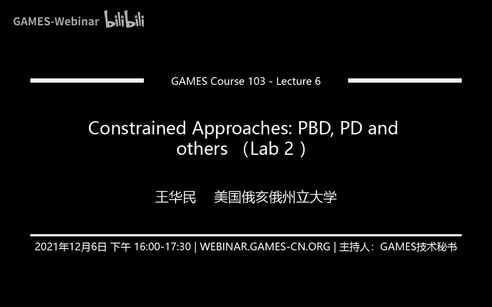
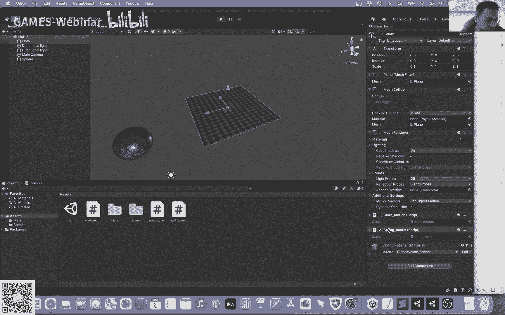
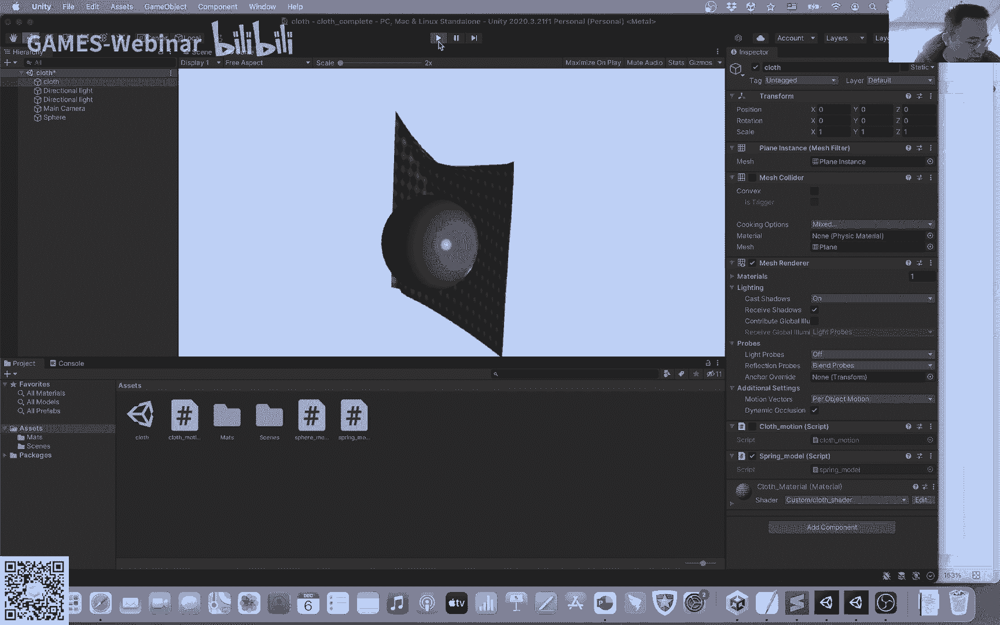
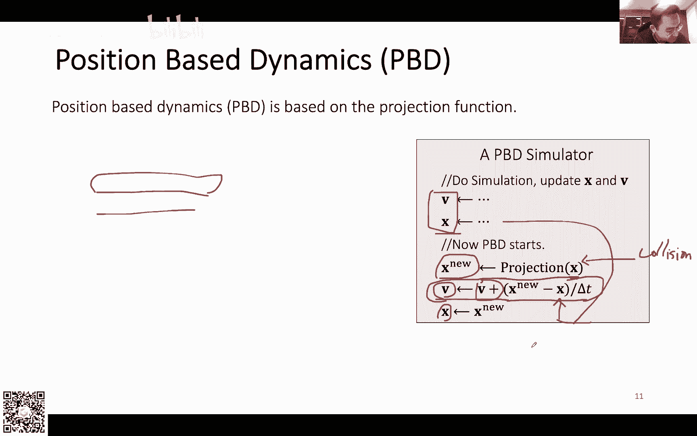

# GAMES103-基于物理的计算机动画入门 - P6：Lecture 06 Constrained Approaches： PBD, PD and others (Lab 2) - GAMES-Webinar - BV12Q4y1S73g

行行行行行啊，我们上周呃啊先不说上桌吧，我们先做作业的事情吧，因为今天是那个今天是我们第一次作业交的日子吧，嗯然后我简单看了一下，就是有的同学可能呃时间不太够好，有的同学尤其是有的同学。

我发现都喜欢拖到最后一天，最后两天才开始做作业，嗯所以说我们这边商量了一下，就觉得可以把作业适当的延期呃，但是呢嗯如果说你晚交作业的话，那么每晚一天啊你的成绩会丢20%啊，然后如果说你玩超过五天。

那么你的成绩就不会计入到我们啊计算获奖啊，计算统计这个总拍那个总分的这个理念，但是你还是可以交作业，如果说超过五天你还是可以交作业的啊，我们还是有ta会帮你来看这个你的这个作业的完成情况啊。

但是如果说你想让这次的成绩进入到我们的总分里面的话，那么你就尽量在这五天内啊把作业完成掉，只不过就是说如果你持交啊，持交五天，这五天的时间，你每天都会丢20%的这个成绩啊，这是一点，然后嗯做作业的话。

就是说如果说你有什么问题，可以在咱们微信群里面有那个呃呃圈子嘛，那个小程序嘛，你可以到小程序里面去问呃，问问题啊，然后如果说有一些比较具体的问题，可能就是你觉得可能嗯大家可能不会碰到类似的问题的啊。

或者是你有一些啊有些比较特殊的问题，比如说你自己的代码上有些问题你可以去问助教，就有些这种问题就不需要再啊公开的论坛上问啊，如果说你觉得这个问题可能大家有可能都会碰到过的。

那么你就可以在这个呃公共的那个圈子里面，小程序里面去问这个问题，然后我还是比较希望就是说大家如果有时间的话，就是尽量还是把作业做一下，因为为什么，因为呃我觉得计算机的课都是一样的，就是你如果说不实践。

那么其实是你很难学到干货的，有的时候大家可能听听讲，那可能就是可以听得一知半解，或者是自己觉得很懂了，但是一旦你开始实践，你就会发现会遇到各种各样的问题，所以说一定要我觉得是一定要做作业，一定要写程序。

然后能够帮助你把很多知识理解到位，比如说我其实看到有的同学就是呃一开始问了个问题，然后问着问着，然后他自己就就突然就理解了，其实有很多时候就是这样子，就是作业会逼着你去很深入的去想这个问题。

可能你听ppt听听这个课的时候，可能你没有意识到，但是当你做作业的时候，他会帮助你进一步的去巩固，进一步的去消化这个知识，所以说啊反正希望大家就是把作业也作为一个，我们完成这个课程的一个重要的一个部分。

然后还有一个呃今天开始的时候，我想讲的一个事情，就是我们第二次作业，我们第二次作业跟我们现在讲的这个课啊很有关系，就是我们做布料的衣服的模拟嘛，然后跟上次作业一样，就是我也给大家了，你下下来之后呢。

也会有一个场景叫cross的一个场景，然后你双击这个场景，你打开场景之后，你就会看到这个场景里面它会啊，然后转一下这个视角，到时候你会看到有一块面料，有块布，然后还有一个球。

这个球呢是用来跟这个布做交互的，呃然后我们模拟的目标实际上就是要模拟这个布啊，然后这个布呢会有两个固定点，分别是这个顶点，00号顶点跟20号顶点，因为我们这个不是一个21x21的网格。

总共有441个顶点，我们我们把它设为固定点啊，然后我们模拟模拟的时候呢，就是用户可以拖拽这个小球进行跟这个不进行交互啊，我给大家看一下吧。

啊就首先这个是一个，这是一个结果，这个是用我们今天要讲的一个技术叫做p p t，position based dynamics实现的，然后你可以看到这个啊这个布掉下来，然后你拖这个你可以用鼠标点这个球。

然后跟这个步交互啊，然后你看这个布可以被这个球撞来撞去啊，做一个动画效果啊，然后呢呃你看到这个布它会显得比较有弹性嘛对吧，他被感觉好像就是它不像个布，它有点它它它就会弹，那这个是什么原因呢。

实际上是因为收敛造成的，我们在啊模拟这个p p t的过程中，我们实际上是用一个迭代法，那么我们需要调整这个迭代数量，如果说你想让它更弹一点，那么你就把迭代数量减少，如果说你想让它更看起来更硬一点。

那个更更不谈一点，那么你就要把迭代数量降低啊，这里没有做布料的自相交，因为这个布料自相胶做起来特别麻烦，所以说这里自相交就没有做，就只是做了这个球跟这个呃这个布料之间的相交自相交就没有做。

然后呢这个作业实际上是由两个部分构成的，一个部分呢是这个p p t，然后还有一个部分呢是我们上节课讲的那个影视积分的方法。

那如果说要用饮食积分的方法呢，就是你要换一个脚本，到时候咱们会有两个脚本，分别是一个p p t的脚本，一个是饮食积分弹簧系统的脚本，那如果说你想要用第二个脚本，你就在这里做一个切换就行了。

然后你会看到呃可以采用另一种另一种模拟方式进行模拟，然后这个就是一个用饮食积分我们做的方法，可以看到这个呃也其实也是可以达到一个比较类似的效果啊，然后这个饮食积分这个东西呢。

我主要的目的还是想帮大家巩固一下我们上周学的知识，因为我觉得可能对呃基础呃没有什么基础，没有什么模拟基础的同学或者数学基础的同学来说，可能饮食积分那一块还是呃有点懵的。

所以说我想利用这个机会帮大家巩固一下，我们上周我们做影视积分，学影视积分的那个东西，但是跟上周学的那个东西会稍微有一点不一样，因为我们上周讲影视积分的时候，我们会讲我们需要主要是两个东西嘛。

一个是gradient，一个是梯度嘛，然后另一个是喝水，一个喝神矩阵对吧，但是在实际的开发过程中，你会发现你搞这个harsher啊，所以说我们作业里面我们其实采用了一个比较偷懒的一个近似的方法。

我们没有去真的去搞那个喝水，我们其实用一个简单的一个小矩阵，一个对角矩阵去近似了它这个和声，然后在这种近似下呢，我们的那个线性系统，原来解线性系统的那一步啊。

就会变成一个很简单的一个一个更新的一个操作了，就是个利用梯度，我可以直接的把我的这个更新给它算出来，然后这个我们在作业里的描述里面会具体告诉你，告诉大家呃，怎么样做怎么样做怎么样做啊。

但是呃目前呢当前呢你就先假设这个事，反正就是我给你的这么一个magic equation啊，你就先不要去纠结说这个公式是怎么来的了，我们回头讲那个讲有些圆的时候，我们会具体讲到诶。

这到底是一个什么样的方法，然后为什么这个东西它也能收敛，也能work的，本质的原因是什么啊，反正这个就咱们就先不讲了，这个其实跟我们我其实看到就是上周就是有的同学也问嘛。

就是说为什么呃本来算牛顿法的时候是用到和神对吧，那为什么我们对这个和神呃涂涂改改修修改改，它也能收敛，也能work，其实是一个道理，就很多时候我们做非线性优化的时候，用和弦去解这个问题是一个理想状态。

但是你如果不用和神，你去近似，他用近似的方法去修改，去修改这个合成，然后呢用修改过的这个合成再去啊解线性系统，再去更新这个规则，它其实也是可以收敛的，这个我们其实在后面会嗯。

具体讲就是说他这个收敛的条件是什么啊，这个方法应该叫师，应该换个什么名字什么的，反正我们之后会讲，但是作业里面反正就是嗯给大家这么一个操作的机会，就呃其实其实严格意义上讲也不能把它叫做这个牛顿法了啊。

就反正是是一种方法吧，然后大家可以利用这个机会去呃感受一下饮食积分，大概是一个什么样的一个呃操作流程，其实总体上跟我们上周呃讲的这个影视积分解。

这个cross dynamics的这个方式是基本上是一模一样的，都是一个迭代方法，都是去构造这个gradient，然后利用贵一点的去找到这个对顶点的更新，然后去更新顶点就差不多是一个流程。

所以说希望大家就是嗯就是去把这个作业给看一下，嗯，这个有有没有什么问题，看这个海应该还在模拟，我等会看看看大家有什么问题，没问题吗，这个没有问题的话，我们就没有问题的话，我们就继续往下讲了啊。

把这个停下。

然后我们今天啊就回到我们上周我们讲了，上次没有讲碰撞，对碰撞，没讲碰撞，我是想留到下周去讲的，讲自碰撞，应该说就是跟钢铁的碰撞会比较容易，就是跟其实跟咱们之前讲的那个钢铁碰撞其实是一样的。

所以说这里就是跟那个球的碰撞，做作业的话，咱们就不讲了，然后下周我们会讲那个字碰撞，啊然后回到我们今天这个东西上，就是我们上周讲了弹簧系统，然后我们今天再细细的讲一下，就是说嗯弹簧系统它这个有什么缺陷。

有什么地方我们可以做的更好的，就其中有一个问题，弹簧系统会比较呃严重的一个问题就是弯曲，一个，一个简单的例子就是呃一个简单的例子，我给大家看一个简单的例子，就是假如说我这里有两个三角形对吧。

两个小三角形，然后呢我假设他这个两个三角形，它是一个面片，一个一个布料嘛，然后我假如说我现在用弹簧系统去模拟它这个弯曲，我怎么说我在相对的这两个顶点中间，我给他加一根弹簧，那么这就构成了一个弯曲弹簧。

那这个弯曲弹簧呢它就是阻止这两个小三角形就是翻折的对吧，这个是我们上周讲的，但是这个方式它其实是有一个问题的，这个问题是什么呢，就是说当这两个三角形几乎是平面的时候啊，他略微的弯一点。

这跟弹簧的长度其实是不怎么发生改变的，我在右边给大家画了一个图，大家可以看到把这个设置一下，应该还没全屏呢，就是右边大家可以看到，就假如说我这里是中间有个顶点，然后边上有两个边嘛。

这个你可以把这两条边就是认为是两个三角形对吧，这是一个三角形，就是一个三角形，然后假如说他开始略微的弯曲，那么一点点的话，那么对于这两个顶点而言，几乎就是在往上运动，对不对，很轻微的弯曲的时候。

它几乎就是在往上运动，那么因为它在几乎在往上运动，如果说你去测量这根弹簧的长度的话，它基本也是不变的，那么换句话说呢，如果说你用这个弯曲弹簧去构造这个这个弯曲的这种抵抗的话。

那么当这两个三角形几乎是平面的时候，当这块布几乎是一个平面的时候，它略微弯曲一点，你也是很难去抵抗它这种弯曲的这种抵抗是非常弱的，换句话说，那么这个其实跟咱们真实世界里面的这种很多这种比如说纸啊。

或者是其他这种物体，它这种弯曲的抵抗就不太像了，对不对，因为有的时候你就你想弯曲一点，他其实就想抵抗的就就产生了啊，而这种情况下，因为我是用弹簧，用这个弹簧的长度去描述的。

他这个抵抗就会变得相对来说很弱，那么我到底怎么样应该去构造这种弹簧的抵抗，这种这种弯曲的抵抗呢，那么一个很简单的一个很直观的思路，就是说我可不可以用角度，因为我这里两个面之间。

两个三角形之间其实是有一个夹角的嘛，有个c他角的嘛，那么我是不是可以搞一个模型出来，然后让这个模型呢呃利用这个夹角去搞这么一个弯曲的这个力，那这个就是它这个一个二面角方法的一个简单思路了。

这个这个方法我们把它叫做二面角方法，带hedral angle，那么打hero angle这个二面角方法呢，他把弹簧的力，它而不是把弹簧的力量弯曲的力，这个bending force。

它把弯曲的力呢写成了一个二面角的一个函数，是这个形式，因为咱们有四个顶点吧对吧，对于一个二面角而言，它其实涉及了四个顶点，所以说我其实每一个顶点上我都会有一个力。

然后呢每一个力呢是都是一个关于这个二面角的这么一个函数，这个二面角这个函数本身它其实告诉了我这个弯曲的力的大小，而后面这个部分ui这个部分啊，这个u啊，它其实就告诉了我每一个顶点。

他这个弯曲力所应该处在的方向，那么我们去构造这么一个二面角模型，其实就可以把它拆分为两个步骤，首先我要知道这个如果说我产生了弯曲的力，那么这个弯曲的力对于每一个顶点而言，它应该分别在什么样的方向。

对不对，就由1u2 u3 u4 ，我想要知道这个u应该是什么，但是注意了这几个you呢，它跟这个力的大小没有关系，它只是告诉我说如果说有弯曲的力，它什么方向，然后这是第一步，第二步呢就是我去搞一个函数。

我去描述说这个力的大小跟二面角有什么样的关系就可以了，所以说就简单的说就是把他这个拆分为两个步骤，那么首先第一步我们想要找说我们这个弯曲的力对于每一个顶点而言，都分别应该是在一个什么样的方向上对吧。

那么那个呃这个这个researcher他就他就想首先对于u一跟u2 而言，对于u一跟u2 而言，他们应该分别在这个三角形的法向的方向上，也就是说由一应该在n一的方向对吧，然后u2 呢应该在n2 的方向。

这个也很合理嘛，因为假如说我有这两个小三角形，它们发生弯曲了，那么对于这两个端点，我们怎么样去产生弯曲的力，也应该在这个三角形的法向的方向上，这个直观上是应该是怎么回事对吧，那么这是第一步。

就是我认为他们分别应该在这个法向的方向上，第二步呢就是说弯曲，它原则上是不应该导致u3 u4 这条边发生形变的，因为弯曲我其实只是说想要把这个这两个三角形搞得更平一点，或者是更不平一点嘛对吧。

我实际上是想要把这个三角形这样子转起来，那我不应该让这条边有什么变化，那么换句话说呢，在由三跟由四的，也就是由三跟由四是分别是施加在三跟四这两个顶点上的力吗，那么这两个力的差应该为零，对不对。

那么也就是说由四根由三由四减由三呢，应该是平行，应该是与这个边垂直的，也就是说他在这条边的方向上是不产生任何的力的，在这条边的方向上，这个由三减由四，也就是说他们这个相对的力啊。

他们这个相对的相互的作用力啊，相对的作用力在这条边上应该是为零，那么如果说由四减由三垂直于这条边，那么也就意味着由四根由三，它应该分别垂直于n一跟n2 ，由此减u3 e它也应该垂直于n一跟n哦。

哦不说错了，应该是由这个n跟n2 的线性组合所构成的，对不对，因为n一跟n2 是什么，n一跟n2 是两个三角形的法向量吗，那么n一跟n2 是垂直于这条边的对吧。

n一跟n2 就是这两个法向量是垂直于三四这条边，那么我同时也知道，由四根由三，由四减由三，它这个相对的力也是垂直于这条边，那么也就意味着u4 线由三，它应该是n一跟l2 的线性组合吗。

它应该是这两个这两个力就这两个方向拼起来的，这是我的第二个假设，然后第三个假设是什么呢，我要假设我这个根据牛顿定律啊，我这个总的力的合力应该为零，因为本质上对于这个系统而言，我实际上这些所有的弯曲的力。

它都是它的内力，所以说如果我加在一起，理论上不应该有其他的力，应该总合力它应该是零的对吧，因为所有的内力它加在一起应该是零，所以说由一加油，二加油三，一加油四，它应该等于零，那么也就意味着由三跟由四啊。

这里写错了，应该由三跟由四，它应该是连一跟n2 的线性组合，这个大家能理解吗，就是你如果把有一把由一个由二移到公式的右边去，那么u3 加油四等于负的u一加u2 。

也就意味着由三加油四是由一个加油二的线性组合，而由四减由三也是n1 n2 的线性组合，所以说它由一由三根由四，它也必然是m一跟a2 的线性组合，这个其实是一个一系列的假设，一系列的推理。

这个大家反正呃如果说搞不清楚也不要紧，重要的事就是我们之后会有一些结论了，当然这个结论我其实是直接给大家的，就就就直接跳过了啊，啊这个过程我就不讲了，反正最后就推出来这个u1 u2 u3 u4 。

它分别是这么几个公式构成的，你其实可以看到这个和跟我们前面的那个p p t给的那些东西，是一样的，就是u一可以看到它实际上是在这个n一的方向的，然后u2 是在那的方向的，然后u3 由四。

它分别都是n一方向跟n2 的方向的一个线性组合嘛对吧，然后我没验证过，但是大家回头可以，如果感兴趣可以验证一下，看看是不是这四个东西加起来等于零啊，按照定义它应该是等于零的。

然后这个n呢它其实不是法向量，它其实只是做了一个cross product啊，大家如果记得的话，还记得的话，就cross product会告诉我们这个三角形的方式，normal的方向。

但是如果说你真的要得到法向量，你其实还是要对这个东西做个normalization的啊，这里啊他们就没有做normalization，就是直接做cross product就行了。

你可以认为是一个比较原始的normal，就是没有normalize过的一个normal，得到了这个u1 u2 u3 u4 之后呢，我就完成了第一步，就是我知道了，说我这几个力对吧，我几个弯曲的力。

它们分别处在什么样的方向上，然后接下来我就是要定义一下这个弯曲的力的大小对吧，我要根据我这个角度，我要搞一个大小呃，那么这里我反正也是还是给大家这个公式了，这个我啊我就不解释。

我就不说这个这个公式为什么是这样，为什么是这样的，反正这个论文里面是这么给的啊，我也就是照搬了一下，那么他说什么，他说这个力的这个力的大小啊，其实就是公式的前面这个部分啊是一个常数。

一个系数乘以这个边长的平方除以两个三角形的面积啊，这个这个cross product的这个magnitude，它其实就是两个三角形的面积，再乘以sin，然后这个派减c它除以二，然后这是个平面的情况。

为什么说它是平面的情况，因为当theta等于180度的时候啊，这个力的大小等于零，因为sin派减派等于零嘛，所以说当c塔等于180度的时候，我是没有任何的弯曲的力的，这是一个呃没有力的情况。

相当于是一个静止的情况，然后这个模型呢有一个比较好的优点，就是说我也很容易扩展到非平面的情况，如果说比如说我假如说我想有一个初始的一个角度，有一个初始的二面角，那么我只要有一个c塔零。

然后完了c t0 之后呢，我就引入了一个新的项，就是减去sin这个派减c t0 除以二就行了，跟前面的那个公式也是一样的啊，然后这里其实我跳过了一些细节，就是比如说这些公式是怎么推出来的啊。

啊然后啊就为什么是这个为什么是函数是这个形式啊，啊这个反正这个在paper里面论文里面大家可以看到，如果大家感兴趣的话，可以读一下这个paper，这个其实也是一个一篇满经典的paper啊。

它里面其实不只讲到了这个弯曲模型，它其实还讲到了其他东西，比如说啊就是自拍状是怎么处理的啊，然后他是怎么样做这个积分的，因为这个是一个蛮早期的paper嘛，一个03年的paper。

所以说他们就没有用影视积分，他们采用的是一个比较显示的积分方式，做了这么一个啊力的模型啊，这个lead模型的这个缺点呢呃也比较明显，就首先它其实你看我们整个推导的方式完全是基于力的对吧。

我们假设力应该是一个什么样的形式，力应该是什么样的方向，力应该什么样的大小，我就构造了这个力的模型，这里面其实没有谈到任何关于能量的东西啊，有同学问c塔零是什么。

c塔零就是说假如说你假设这个这个这个面啊，这两个三角形它的静止状态，它不是平面的话，那么c a0 就是它非静止状态下这两个角度，这个角度应该是多少，就是c塔零实际上就是它静止状态的角度。

其实这里面就平面的case，你也可以认为这里其它零是一是180度，只是因为c301 180度的时候，后面这项就等于零了，所以说我们就直接把它剔除掉了，而有的时候比如说这个呃两个三角形，它可能静止的时候。

它中间会有一个非180度的夹角，那么这个时候你就要用c t0 去定义这个啊，这个夹角在静止状态下的角角，我们刚才说这个呃这个模型呢它因为直接是关于力的，没有任何能量嘛。

所以说啊这是一个他做显示积分会比较容易，然后做饮食积分的会也不是说不能做吧，但是会比较麻烦一点，因为你看前面这个模型，其实你要去算它的这个导数还是挺麻烦的，所以说也不是说不能做吧。

但是你如果想要拿它做饮食积分啊，拿它来做求导啊，就会就会麻烦很多，但是我觉得这个是也是一个呃有些系统里面还是比较常见的模型，就是大家用的也很常见的，所以说我是建议大家有时间把这篇paper读一下。

而且这篇paper其实可以从头到尾的去读一下，因为它里面除了关于它的弯曲模型，它其实里面还是有一些蛮有意思的一个设计的，这是一篇paper，然后呢大家就想就说有没有稍微简单一点的弯曲模型啊。

因为前面那个模型虽然说比较直观，就是算力搞了个力的方向，搞了这个力的大小，然后算力它比较直观，但是有没有更简单一点，好操作一点的模型，所以说大家后来又搞了一个模型，这个模型呢它其实是有两个假设的。

他一个第一个假设就是说它假设我这两个三角形啊，啊它也是基于这种呃这种两个三角形，两个相邻三角形的这种模型的啊，他第一个假设是我这两个三角形它静止的时候是应该平面，它比较容易处理这种情况。

就是两个三角形静止的时候是平面状态，对于布料而言，这个问题不大，因为反正我们布料静止的时候就是个平面嘛，所以说我其实这个假设是ok的，然后第二个假设是说我这个三角形啊，它模拟的时候基本上没有什么拉伸。

没有什么形变，它主要是弯曲所产生的一些动画效果，所以说它拉伸是非常小的，这是我的两个假设，在这两个假设的基础上呢，嗯这个模型呢基于拉普拉斯变换呢，他就搞了这么一个能量函数，它定义了这么一个能量函数。

他这个能量函数大家可以看一下，它其实是相当于是一个矢量对吧，一个矢量乘以一个矩阵，再乘以一个矢量，乘以它自己所构成的，然后前面除以1/2，那么这个矢量就是这个矢量是什么呀。

这个矢量就是把这四个顶点按顺序排了一遍吗对吧，这个就很简单，就是顶点全都排了一遍，然后中间是一个矩阵，这个矩阵q我把它写在下面了，就这么一个形式，前面呢是一个常数三除以面积和面积是静止状态的面积。

所以说我直接就把它算出来了，这是个常数前面，然后后面是q乘以q transport，那q是什么呢，q实际上是一个向量啊，然后这个向量是什么向量啊，是一个是一个12x3的一个向量，12x3。

然后这个向量它其实就是由一堆被缩放过了的identity matrix构成的，那每一个identity matrix都是一个3x3的矩阵嘛。

每一个identity matrix单位单位矩阵是个3x3的矩阵，然后每一个矩阵我前面都给他乘一乘一个系数，然后呢下面也是cott和，然后再下面是两个负的cott和，然后下面也是负的cott和。

然后这个这几个角度是什么呀，然后我这个反正这个画在右边了，大家可以看到c他零是啊这个角，所以它一是这个角，所以他二是这个角，所以他算是这个角，啊然后这个是我的这个qua。

这个q这个q是一个我刚才说的是12x3的矩阵吧，所以说这个小q是12x3的矩阵，然后我根据这个公式我计算一下，就可以得到一个12x12的矩阵，所以说这个结果就是一个12x12的矩阵。

啊然后这里的话大家可以看到每个向量都是一个12，12个顶12个元素构成的嘛，对吧，12x1，因为每一个都是一个三维三维向量，然后有四个，所以就是12x1，然后这边是1x12，中间是个12x12的矩阵。

然后我就得到了这么一个能量函数了，然后呢你可以看到这个能量函数是一个什么样的形式啊，它其实如果说你把它变换一下的话，你会发现它其实就是q transpose乘以x，然后这个东西它其实就在计算。

它在估算这两个三角形的拉普拉斯，那么拉普拉斯是一个什么玩意儿呢，它其实就是告诉你这个两个像两个三角形之间的一个曲率，然后呢你平方一下，其实就把这个曲率的大小给算出来。

我们如果说两个三角形是一个完美的平的时候，它的曲率是零，所以说ex应该等于零对吧，那么如果说我这两个三角形开始弯曲了，那么它的这个曲率向量就会越来越大，越来越大，那么最终我这个能量也会越来越大越来越大。

那么产生的力相对应的也会越来越大，越来越大啊，这个其实就是它的一个基本思路吧，然后其实大家可以验证一下，如果都在同在一个平面上，那么这个东西你算出来的这个曲率向量应该是零，然后ex也等于零。

或者是一个客户的思考题吧，就是你可以证明就是利用这个cotent的这个权重，然后把这些呃叠加在一起，然后你会发现这个它的ex等于零，啊然后有同学问这个物理这个能量是物理推出来的吗，嗯其实不是。

这个不能说叫物理推出来的吧，它实际上是根据数学的数学里面的曲率推出来的，它因为我们计算一个平面的曲率啊，尤其是它的这个平均曲率的时候，就是用拉普拉斯变换来算的，所以说它这个东西实际上是通过曲率的定义。

然后根据拉普拉斯平面的那个，他这个曲面的曲率的这个方式来来推导出来的啊，但是如果说你根据更加物理的方式，其实照理说是应该根据测量的方式去做，其实也有一些研究吧，就是说他们设计一些实验。

然后利用这个实验去啊评估这个能量，这个反正我这里就不展开了，因为这个东西其实后来搞这方面的人也不是特别多，因为但我也不知道什么原因吧，反正可能一方面就是测量这方面比较难搞。

然后另一方面就是误差所带来的影响可能也会比较大一点，所以说一般来说后来大家就是基本上还是以这种模型，这种根据曲率搞出来的这种模型跟前面这种二面角模型会为主，content是怎么出来的是吗。

实际上是从那个拉普拉斯算子的那个东西出来的，拉普拉斯就是一个曲率，比如说一个三角形嘛，一个曲面三角形，你可以认为一个三角形网格，它是一个曲面，那么三角形网格的拉普拉斯的那个呃。

那个那个离散拉普拉斯的那个operator，它其实就是contagent weight所拼出来的，所以说他这个东西其实是从那里面推出来的，但这个过程我其实这里也跳过了是吧，反正你有大家有兴趣的话。

可以去看一下那个论文，我印象中那个论文好像也没有推导过程，也很奇怪，他也没有推导过程，反正他就是直接给你了，给你这些权重了啊，其实你可以自己也可以去验证一下，反正我之前是验证过的。

就是你按照这些content的权重，你把它这个假如说这个三角形是个平面啊，这四个顶点是在一个平面上，你会发现这个加起来确实是等于确实是等于零好吧，但反正这里咱们就不展开了。

就反正就是给大家这么一个公式告诉大家啊，其实还有这么一个方式，那我刚才说这个方式比较简单，对不对，之前二面角的意是啥，二面角之前二面角没有意义，这是其实是咱们前面二面角这个模型的一个缺点。

因为它二面角的模型是完全根据立出来的，它的力的模型，所以说它就没有任何的e的这个定义了，这个其实也是kda banding的一个优点，就是它其实是有能量的定义的，而且他其实还有一个更好的优点。

就是它的名字correlic，大家有没有注意到这个公式里面这个q实际上是一个常数矩阵啊，它其实是一个常数矩阵，它跟顶点的位置是没关系的，那既然是个常数矩阵，跟这个顶点的位置没关系。

你就会发现这个e它其实是一个关于x的一个二阶的这么一个方程，一个公式嘛对吧，它是一个扩拽的一个函数，它是一个二次函数，所以说它有一个很大的优点是什么，它的这个力。

它的这个一阶导这个力跟他的喝水都很容易计算，你立怎么算，你只要把这个q乘以这个向量就行了，然后前面加个负号就完了，这个q是一个常数矩阵，我事先计算出来就好了，和成就更简单了，合成直接就是这个q。

它最大的好处就是我如果做影视积分的时候，他就特别方便啊，这些关于这个bending的这些全这些矩阵啊，这些力啊，他都特别容易算，这是它的一个很好的优点。

然后它的缺点呢就是说如果说你这个物体它如果拉伸的很厉害对吧，这个面料如果拉伸的很厉害的话，他这个假设就相对来说就没那么准了，不是说不可以模拟啊，但是它可能它就是存在一些问题，他的他就他的描述。

这个曲率的定义就不是很合理，然后呢还有一个前面咱们前面还讲了一个假设嘛，就是我是假设这两个三角形是平面嘛对吧，那么如果说如果说这个三角形它不是平面怎么办，这两个三角形它不平不平的话，我其实也有一些方法。

比如说论文的作者，他们后来又搞了一个模型，叫做cubic shell，就是他发现如果说不平的情况下，我也可以搞个能量函数，只不过这个能量函数它就不是二次的，它是关于顶点的三次函数了，这是一个。

然后还有一种方式是我们回头会讲的，叫做projective dynamics，但是他这个模型，它这个论文里面其实是可以用到这种方式的啊，但是我们这里就不展开了，有同学问二面角没有，没有能量的话。

是不是不能用影视积分求导啊，影视积分其实还是可以的，还是可以，因为你只要能只要能对利益算他的一阶导数，你还是可以得到它的合成的，只不过他这个推导过程会更麻烦一点，只不过我们就就就假设有一个力吧。

但是我们就不真正的用到这个力，就直接就是对这个呃呃呃呃我们就假设有一个能量，但是我们并不真的去计算这个能量，我们也讲我们也不考虑这个能量是什么形式，我就直接对力求导啊，就可以得到合成，就还是可以做。

只不过就是会麻烦很多啊，也缺乏一些缺乏一些概念上的定义，能量的思想能在缸体上模拟吗，一般来说大家大家不会用能量，因为能量我们这里的能量是什么能量，它其实是弹性能量，那钢铁它没有弹性。

所以就无所谓能量不能量了，这个我是觉得gt其实一般来说不太会用到能量的思想，因为我们做能量的主要的目的就是因为它有弹性嘛，它是有势能吗，所以我们这个e它其实就是势能。

然后这是这篇我刚刚讲了半天的这篇论文啊，叫做cdc bending model for intenable surface，然后这个paper我觉得也是也是也是一个蛮经典的paper吧。

cubic shell其实是啊，就有同学问cubic shell的模型是啥，这个cubic shell基本上就是基于这个paper往下走的，相当于这篇论文也是同一批作者。

他们好像隔了1年就又发表了一篇论文，就是基于这个这个模型，然后又做了一些扩展，然后搞了一个搞了这个模型，反正感兴趣的话可以去读读那个那个paper，反正是同一个组，同一批人写的一篇paper。

好然后我们来讨论一个我个人觉得在布料里面，模拟里面是一个蛮重要的问题啊，真的一个问题叫做locking issu，就是我们之前就讨论了什么，讨论的就是弹簧系统，还是讨论各种弯曲模型对吧。

我们其实都是有一个假设的，我们假设这个布料的拉伸跟布料的弯曲，他应该是不影响互相不影响的关系，那么原则上呢原则上呢如果说一个布料是没有任何拉伸的，就是他是非常非常怎么讲，非常坚挺的啊，不应该叫舰艇。

就是他很stiff对吧，你没有办法去拉伸它，比如说有很多缩汁的面料都是没有什么弹性的，无法拉伸，但是它这个布料还是可以弯曲的，我们在现实生活中，我们见过很多这样的情况对吧，很多缩汁的面料。

这个纸你是很难拉动它，它几乎没有弹性嘛，但是纸张我们照样可以弯曲，但是如果说我们做模拟也会出现这样的现象吗，也是也可以做到这一点吗，大家可以想这两个例子啊，同样都是有这么两个三角形。

我假如说我有一个有块布，我是用这两个三角形构成的，那么我考虑我有两种分别把它弯曲的方式，一种是沿着我中间这条对角线的边弯曲，然后另一个呢是我转了90度，我换了一个角度进行弯曲。

假如说我这个弹簧是非常非常没有弹性的，就非常stiff的，非常刚的弹簧，大家想会发生什么，是不是右边这种情况她就弯曲不了了，因为我中间为什么我右边这个情况会弯曲不了。

因为我中间这根弹簧会把我这两个三角形给顶在那里，我再怎么弯曲，我也弯曲不了对吧，这是一种很奇特的现象，我左边这个情况不存在，为什么，因为我这条中间这条边就是跟我弯曲的边是一致的。

我就可以很自由的对这两个三角形进行翻折，但是右边呢，因为我假设我这个弹簧非常非常的坚挺啊，我想要沿着这个右边的这条边进行弯曲，我会弯曲不动，我会没有办法很自由地去弯曲，会把我这个给卡死在那里。

那么这个我们把它叫做locking issue，就换句话说我整个布料，整个衣服的这个系统啊，他被锁死了，被我这个弹簧系统给锁死了，那么这只是一个表面现象，本质的选项是什么。

本质的现象实际上是由于自由度的丢失所造成的，因为大家可以想就是根据欧拉的一个公式，欧拉公式说你编的数量，这个是所有的边的数量，对于一个manifold，所谓的manifold。

大家可以认为就是一个我们比较常见的一个三角形，相邻三个三角形，这种这种结构叫做manifold，一个三角形相邻三个，或者是就是每一条边上分别相邻一条三角形。

这种比较正规的这么一种三角形网格叫做manifold，但这里我就不展开了，然后man对于manifold而言呢，正常的这种正常的这种三角形网格呢，欧拉定律说。

边的数量等于顶点数量的三倍减三减去所有的边界上的边的数量，那么换句话说，假如说我进行模拟的话，我有多少个变量啊，我有三乘以顶点数量的这么一个变量对吧，这是我的总的变量数，3n n是顶点数量。

但是我编的数量呢同样很多，而且它也是几乎是三个顶，三乘以这个顶点数量，那么真正我的自由度实际上是什么呢，实际上是我的变量减去我的约束，因为我所有的编实际上都是我的约束嘛，那么我的变量减去我的约数。

就是我真正的自由度，我的真正的自由度是什么，我只有三家边界的数量的自由度，所以说换句话说，我其实做这个三角形网格的这个模拟，我的自由度其实是不够的，而且你如果是模拟一块比较比较方块的这种布。

它的自由度会更不够，因为它的边边界上的边的数量会更少，那么怎么样去根本上的解决问题呢，啊以前不说根本上解决问题吧，就是说先说实际上在操作中解决什么问题呢，有很多各种各样的套路啊。

比如说我可以让弹簧压缩的时候，我可以把它的弹性系数搞得小一点，因为我压不动对吧，我这块面料我比如说弯折不动，那我就把弹性系数搞小一点，那么是不是就可以把它弯下去了，对不对，这是一个套路。

然后还有一个套路是什么呢，就是我不要上来就施加弹簧的力，我可以先假设这根弹簧在一定长度范围内，它是可以自由活动的，它是没有任何力的，没有任何能量的，这也是一个套路，但这些套路他其实都不根本的解决问题啊。

然后还有一篇paper是呢说什么呢，就是说我可以帮自由度改一改，我不要把我的自由度定义在顶点上，我把我的自由度定义在边上，就把事情会搞得更复杂了，这就是另一篇paper，这个啊反正我就提这么一句话。

就是给大家提一下，然后我倒是也不建议大家就是呃去花时间去读这个paper，因为这个paper你读完之后，你也会想，就是说其实他这个方法也是很难实际应用在我们的这个模拟中的。

因为当你把自由度定义在边上的时候，又会引入其他的问题，但但是我之所以想这个题这个事情就是想提醒一下大家，就是模拟里面会有这个locking issue。

而且这个locking issue当你在你弹簧的弹性很弱，也就是弹簧很stiff，他很没有弹性的时候，还有当你这个网格的分辨率会很低的时候啊，他这个locking issue会变得很明显。

你会发现这个布它就弯不下去，因为为什么，因为我所有的弹簧都把它撑在那里了，这个是我想提的一点，然后呢其实也没有，我个人觉得其实也没有，目前也没有什么特别完美的解决这个方式，大家都是调参啊。

或者是一些比较high的方式来解决，给大家提个醒好吧，然后这个这个我想跳过了，因为我本来是想再讲一讲shape match，拿来模拟这个布料的这个方式，但是我想这个跳过，如果大家感兴趣的话。

可以回头看一下，我想给大家讲的，今天讲的一个第二个，话题呢就是约束就是约束方法，这个约束方法其实是哦对了，先停一下，就是前面大家有什么问题没有，因为现在要讲一个新的topic了，还在打字吗。

为什么是三家变，locking有几种啊，为什么是三家便，因为这里是3m嘛，总的自由度，总总共的顶点数量是3m，也就是三的顶点数，然后边的数量是约束的数量，所以说自由度是自由度。

是变量的数量减去约束的数量，所以说是三倍的顶点数量减去这个东西，所以说就是三加上这个东西，locking有几种locking，什么叫做几种，其实没有说所谓的locking有几种。

这个locking一首它其实是一个现象，他这个现象就是说你的弯曲实际上是会被你这个拉伸弹簧，拉伸的这个弹性所干扰的，当你这个拉这个弯，这个拉伸的弹性系数很大的时候，它会导致你弯曲会受影响。

会让你觉得好像弯曲很强，事实上它可能弯曲并不是很强，有同学问为什么不用四面体网格，可以用四边形网格，就是如果说你用四边形网格的话，你其实可以一定程度的解决这个问题，是如果说你中间四边形网格。

你中间又加对角对角弹簧的话，它还是会产生这个现象，还是会有这个问题，然后有同学问布的顶点多一点会不会好啊，其实并不会，因为你布的顶点多了，你的边的顶点也会，你的边的数量也会多，因为你顶点多了。

你边也会多，然后最终导致你的约束也会同样也会产生多，为什么帮助帮助edge和edge的区别，就帮助edge就是就是边缘上的edge，就是比如说我给大家举个例子吗，比如说前面这个例子嘛。

就比如说我这这有43条，就有五条边对吧，那么boundary edge就是这四条边就是在边上的边，那中间的这条边呢就是inner edge，就是中间的这条边，有限元其实也会导致同样的问题。

有限元其实也有locking issue，其实道理是一样的，就是你的约束太多，约束太多就会导致你自由度丧失，为什么boundary edge不算自由度啊，不是说不是说不算自由度，而是说根据这个定义。

它这个约束的数量，总共的约束数量是这么多，所以说所以说你这个约束的这么多之后，你用你用顶，你用顶点的数量乘三去减去约束的数量，你就会得这个公式，为什么弯曲跟弹簧的k有关啊。

理论上这就是我们我们在讨论的这个问题，就是理论上它应该是无关的，是因为我们模拟的时候，我们采用了这么一个弹簧系统，它就会导致它相关，因为它会把它锁死，就是你可以看这个图嘛，如果说假如说我想要沿着这条。

你可以想，假如说我要假如说我想要沿沿着这条边弯曲，你会发生什么，你会发生什么，你会发现它弯不下去啊，为什么弯不下去，因为中间的这条边内部的这条边把它给抵住了，不会把它顶在这里，所以说会导致它弯曲不下去。

本身上本质上是因为我们这个数学模型，我们这个呃弹簧系统模型，就是我们模型的一个本质上的一个问题，弹簧这里的约束是12，什么叫做弹簧约束是12啊，就是我这里你看比如说我这里吧，我我我就拿这个例子举好了。

实际上本质上也是因为这个原因，就是我本质上是一个离散的一个模型，它它没有足够的自由度，我举这个例子好了，我有四个顶点对吧，我总共的自由度理论上的自由度应该是12码，然后接下来我有几条边，我有五条边对吧。

所以说减五，所以说我实际的自由度是实际的自由度是七，有同学问为什么加点，比比如说我这里中间加一个点对吧，我中间加一个点的话，我你看我我其实我我加了一个点之后，我我多了三条边，虽然多了一个顶点。

我多了三个自由度，但是我的约束也多了三个，所以说最后得到的还是起，就是其实你加点就是怎么就是光是单纯的加点是没有影响的，但是你分辨率高，你会让顶点更密，这个其实是可以改善的，就是你的顶点数量更多。

你更密了以后它会改善，但不是代表说这个东西不是因为不是因为我的顶点数量多造成的，而是因为我的顶点密排列的密所造成的，中间的弹簧变成两段，可以解决这个问题吗，他如果说你把中间变成两段。

就是比如说你多了以后，他可能在这个状态上不会有问题，但他其他方向又会有问题，就比如说举个例子，比如说我中间加一根弹簧，中间加一个点，变成这个形式对吧，那么你换个方向，比如说我想要沿着这条边怎么办。

他是不是也会存在同样的问题，就是他怎么说呢，就是它没有办法在根本上去解决这个问题，加点也好，还有加鞭也好，他其实没有办法在根本上解决问题，只能零四的解决问题，弹簧的k调小可以解决问题吗。

就是你在视觉上可以解决这个问题啊，视觉上可以解决问题，但是我说的就是它根本上是存在这个问题，就只能说你做一个，比如说模拟一个动画效果啊，你开发一款游戏啊，你就尽量把有些弹簧的弹性速度搞小一点。

可以让这些问题不明显一点，但这个这个问题始终是存在的，明白吗，然后我接下来就想讲这个这一块，我想把这个问题，如果还有别的问题，咱们可以留到课后，然后呢我今天我估计可能就只有点时间就讲第一个东西了。

就是dynamics，然后这个东西跟大家做作业有关，咱们作业里头会用到，所以说我们我们会先把这个东西讲一下，之后有时间我们会讲后面两个东西，projective concert damics。

今天讲的可就这一块讲的这个ppt上讲的东西都是跟约束有关的，那么我们约束想要解决一个什么问题，就是解决一个真实真实世界跟模拟的差异的问题，我们在模拟真实世界，真实世界里面很多面料很多cross。

它其实都是拉伸，其实都是有比较强的抵抗的，你都很难去拉动它，或者说它是一开始比较有弹性，但是拉到一定程度，它就很难再拉动了，但是我们如果做布料模拟呢，你去把这个k你把这个弹性系数搞大呢，会带来一些问题。

对于显示积分而言，会导致这个显示积分不稳定，对于影视积分而言，会导致信息系统叫做econdition，那么这些问题呢虽然说不是说很致命的问题都可以解决，但是他们的问他们的这个难点在于什么。

难点在于这些解决方式最终都会带来很大的计算量，比如说我用显示积分，我可以用小步长，用影视积分我可以搞多迭代，我都可以解决，但是我都要花更多的计算时间吗，大家都在想。

就是哎我有没有什么办法可以就是比较简单的去处理这个问题，这就是大家的一个初衷，不见得不见得这个初衷是能够被完美解决的，但是反正就是大家就是想就是怎么样去处理这个系数很大的时候。

我还可以比较好比较简单的去模拟，那么我们首先来讨论想想，如果说只有一根弹簧，我怎么去构造这么一个模拟方式，假如说我只有一根弹簧对吧，我可以把这根弹簧的长度写成一个约束，这个约束我把它叫做ffix。

这个约束呢本身它是一个函数，那么函数呢你就是实际上就是弹簧的长度减去它的原长嘛，那么这东西等于零，也就是我的这个约束，就是卧室，我是希望这个弹簧的长度刚好等于它的原长的，这就是我的一个一个约束。

那么有了这个约束呢，我接下来我就想要定义一个函数了，这就是我们所谓的一个投影函数，这个函数做了什么事情呢，就是这个函数呢会让我这两个顶点满足我这个月数，这里就举两个例子，假如说这根弹簧啊。

其实不应该叫弹簧了，就是一条边了，假如说我有一条边这两个顶点，它这俩的距离是大于圆长的，它被拉伸了对吧，那么理论上呢我就应该把这两个顶点互相挪近一点，挪对吧，他们互相靠近一点。

那么最终我可以得到两个新的位置，那么这两个新的位置中间的距离可以满足这个我这个约束的要求，就是延长，满足延长长度的要求，这是拉伸的情况的情况也是一样的，只不过我不是把这两个顶点再往彼此靠拢。

反过来我想让这两个顶点互相远离，x j我也往远处走，那么得到了两个新的位置，这个其实就是我所谓的这个投影函数，projection function，想要做的事情就是把这个两个顶点给他，怎么样修改一下。

修改完了之后呢，可以满足我这个需求，那么我可以把这个问题想象成一个投影问题，假如说我现在是一个六维空间，比较高层次一点是一个六维空间，当前的这个顶点位置是六维空间中的一个点。

那么如果说我把满足我这个约束条件的顶点的集合，认为是一个区域的话，这个omega是一个合理区域的话，实际上想要做的投影是什么呢，想要做的就是怎么样去修改这个顶点x，让它落到我这个合理区域里面去。

这个区域这个下面这个红绿蓝颜色的这个合理区域，就是所有满足这个顶点所构成的区域，光是挪还不够对吧，挪到区域里面还不够，我还希望我挪的这个变化量足够少，就是说我不只是想要挪到里面去，我还要挪到最近点。

那么这个图上比较简单，就是这么一个绿颜色的这个位置，这个位置它刚好处在这个边界上，同时它也是离我们的原来的这个点是最接近的，一只就可以一个数学问题了，那个带约数的数学问题了，这怎么想的，就是前面呢。

上面这个东西做的讲了什么，讲了，就是说我挪的这个要足够少，我要尽量想要让这个点结果是足够接近于原来的位置，我想尽量挪的少，同时呢我要求我的结果，我要求我的结果是满足约束的。

也就是说我要保证我的结果是落在这个合理合理区间内的，这个是我们数学上的一个定义啊，就是关于投影的定义就是第一我想要挪，挪完之后，我要满足约束，第二我希望挪的这个改变量足够少，我这搞这么一个投影函数。

那具体的推导过程我就不讲了就不讲了，反正大家如果感兴趣的话，可以去课后可以去呃退退，就是哎到底是一个什么样的流程可以得到这两个结果，是直观上也是比较容易理解这个东西的啊，怎么理解呢。

就是说对于这根边而言，这两个顶点而言，我是希望它的质心是不变的，希望它的质心永远在同样的位置上，这是我的一个前提，志心同样的位置上的前提的情况下呢，我希望i跟g分别朝着志心或者远离至新的方向运动。

也就是说他始终沿着这个原有的这条边是方向上的一道，它运动的量实际上是由他们相对的质量关系所决定的，质量越大，它理论上应该挪得越少，量越小，那它理论上应该挪得越大，基于这些点，基于这些条件。

你其实就可以最后推推推，你就可以推出来这么两个公式了，就基于这个我们前面说的这个质量和这个质心动跟，然后其次就是每一个点挪动的量跟它们的质量相关，就这两个前提条件，然后你可以呃也可以课后做一个验证嘛。

你会发现就是呃这两个顶点相减的位置相减啊，你会发现它刚好等于原长，也就是意味着说我新的这两个点它其实是满足我这个约束的，在来说我们做模拟啊，很多时候我们其实对质量其实倒是没有一个特别强的一个规定啊。

大家比较偷懒，一般来说就直接假设所有的质量都是等于一或者是质量相同，有的时候我其实想要也有，也有一些呃比较极端的情况，比如说我假如说我这是一个固定点对吧，我固定你怎么做，我可以认为这个质量是无穷大的。

当这个质量是无穷大的，那么按照这个公式你就会发现啊，对这个点而言，它就会静止了，它就不会动了，这就是啊质量无穷大，或者是实际实际上你写代码肯定不可能把这个质量写成无穷大。

一般来说就是用一个很大的数字去描述啊，是一种ppt里，这是一种做这个约束里面我可以用的这种模拟方式，作业里面我其实给大家提了一个简单的要求，就比这个还要更简单一点，怎么做呢。

就是直接把定点从更新里面去掉，你就不更新它，你就完了，对不对，很简单，你就你就不要更新它吧，那它就是固定点，如果说你还是想要把这个东西放在这个模拟过程中的。

那么你也可以用这个把质量设为无穷大的这么一个方式，你好，我们这个简单地给大家介绍了一下，就是一根弹簧，假如说我有一根弹簧，一根边，我可以利用这个公式，我去修改顶点的位置，我可以满足我长度约束的要求。

那么我怎么来处理多根弹簧的情况，问题来了，我说我有好多根弹簧，我怎么办，那么有两个方法，这种方法叫做高斯赛德尔方法，赛德尔方法，它这个名字其实是从写信息系统的高赛德尔方法引入过来的，借鉴了那个思想。

但什么意思呢，就是说假如说我有好多弹簧的话，就一根一根一根的弹簧去处理过来就完了，对不对，我这里有两根弹簧，有两个边，分别连接了零一跟二对吧，假如说弹簧现在的长度是二，静止的状态长度应该是一。

我怎么办呢，我就按顺序处理这两根弹簧吧，我先处理上面这根弹簧，上面这根弹簧，我给它搞成长度为一，那么根据我前面假设至心不变原理啊，可以分别把x0 和x一分别往这个智星分别往中间挪，弄完之后呢。

我这个长度就变成一了，我这个上面这个弹簧的问题解决了，接下来我处理下面这根弹簧弹簧，我下面这根弹簧的长度也发生了改变，我变成了25，我之前是二，现在我变成了25，根据我之前说的志心不变的这个简单原理啊。

我就分别把x一和x2 也往智心挪，读完之后呢，下面这根弹簧的长度也是一了啊，然后下面这个弹簧的问题解决了，大家回过头来会发现什么，对不对，你说我还是要回过头来去处理上面那根弹簧的。

我还是按照之心不变的原理，我去挪上面这根弹簧，我把它搞成一，再回过头来我又去处理下面这根弹簧，再把它搞成一，然后以此类推，对于每一根弹簧我都按顺序啊，一个特定的顺序，我把它处理一次，每处理一根弹簧。

我去修改弹簧相连的那两根两个点，然后我再处理下一根弹簧，我再处理下面那一点啊，把它从头到尾处理一遍，那处理一遍，完了还不够，我还要多处理几遍，为什么，因为我光处理一遍。

这跟弹簧的长度没有办法保证都满足吗，我就还要多处理几遍，处理的越多，这个迭代数量越多，你会发现弹簧长度慢慢慢慢的可以收敛，可以逐渐的往这个我们想要的原厂去考对吧，可以尽量满足约束条件。

这个就是一个蛮简单的一个套路，一个高塞德尔的一个方法，处理多根弹簧，我就搞两个循环，两个迭代里面这个循环是循环所有的边，因为每根边说相邻的这两根顶点i跟j呢，我利用之前的公式，我把它新的顶点位置算出来。

把它新的顶点位置算出来之后呢，直接直接去更新这两个顶点的位置，把这个更新给释放给施加出去，然后我就分就是按顺序我把所有的边都处理，然后同样外面我还需要有一个迭代，这个迭代的主要目的就是为了。

我保证我所有的边都是能够相对的比较好的去满足约束的，坏话说回来，我虽然说我可以有这么一个收敛的趋势啊，那边这些边逐渐逐渐的满足这些啊，尽量的去靠近这个圆场，但我是没有办法去严格的保证所有的边都能满足的。

永远都是有一些变，它是不满足的，不在于我做得越多，我迭代数量越多，那么原则上我这些约束就是能够尽量地更好地去满足它越多，那么约束会更好，还有一点我想提的就是说虽然说他较高，塞德尔。

它其实并不是真正的高赛德尔，它其实跟数学里面的高赛德尔实际上是有差异的，我自己发现，一个叫做stochastic，gradient decent，其实更有关系一点。

只不过他这个东西不是stochastic的，它是有顺序的啊，还有一点其实就是刚才有个同学问的了，我觉得其实就把我想说的就就其实就说了，就是其实跟您的顺序是有关的，这边的顺序会影响会造成两个东西。

一真的顺序它有可能会造成artifact，它有可能会造成偏向性，你会发这个发现这个面料它有的时候就是会歪向一边不对称，说跟编的顺序有关，这是第一点，编的顺序它会影响你收敛的速度，有的时候用这种顺序。

你会收敛得更快一点，有的时候用那种顺序会收敛更慢一点，说高塞德尔他其实跟编的顺序也是有很大的关系的，有很大的依赖性的，为什么我作业里面其实是想大家尝试第二种方法的，原因就是不用这种方法。

虽然说这种方法更简单一点，这种方法呢叫做结构比方法，科比方法，它其实这个方法其实主要有两个目的，第一个目的是为了想要减少这种由于编的顺序所造成的这种影响，这是想要让这个方法能够尽量的并行在gpu上。

或者是你在cpu上想要做一些并行计算，那么这个方法其实还是比较合适的一个方法，高赛德尔这个方法不能并行，前面那个方法也可以并行，但是会复杂的很多，会采用一种比如说叫做着色方的方法。

就是把一些边进行分类这种方法，但是我这里就不讲了，方法相对来说就会容易变形很多，这可比的方法其实就是做了一个事情，这个思路是什么呢，思路就是说我每次去计算这个编的更新的时候。

不要把这个更新直接就施加到顶点的位置上去，可以把它先保存下来嘛，对不对，我可以把它统统地保存下来，它保存下来，完了之后呢，然后对于每一个顶点，我可能会得到很多个更新量，对不对。

因为我每一个顶点可能会相邻很多条边，每一条边都会对这个顶点都会有一个更新量，都会告诉他一个更新，我把这些全都加在一起，然后我进行一些取平均值的这么一些计算，做一些取平均值，那么我可以得到一个总的更新。

其实就是一个很简单的思路，就是说我不要说我一条边，我直接就更新顶点，出了一条边，我直接更新顶点，我先把我算出来的那些新位置，我先给它存下来了，我一起更新，这个就是我的思路啊。

然后这里呢xi 6呢它其实就是它其实这并不是真正的新的位置，它其实是一个你看它这个叠加的，它是一个保存所有的更新的和同样的，我还有个and i，它其实是计算了这个更新的数量啊，它是加一的，它是更新数量。

得到了这个和跟数量之后，我再给它取一个加权的平均值，我最终得到它这个结果，高赛点相比一样，它迭代用的越多，它这个约束能够更好地满足，这也是一个它的一个呃呃跟高三的一样的一个一个方式，但他的好处在于。

它这个并行起来会很容易，它没有这些阿里嗯，前面我就讲了，就是说我们有这个约束对吧，有了约束之后呢，我可以定义这个projection投影方式，然后这个投影的这种方式呢不只是为一条边做的。

对这条边呢我也可以做这样的方式，就是分别有两种不同的方式，一种是高塞德尔方式，一种是结构比方式，基于此我就可以开发我们的算法了，第一种算法我们把它叫做position base的dynamics。

dynamics，他其实做了个什么事情呢，它其实就是利用我们前面讲的这些投影的这种方式，他搞了一个算法，前面呢首先我前面这部分呢做正常的模拟，做简单的粒子模拟，对吧。

我假如说就像那个就像我们之前做shape match，大家做作业的时候做钢铁的shape match，很像那个方法，它都可以自由地随便活动，那么对于这些我都做速度跟位置的更新。

这就是第一步自由活动的步骤，第二步呢就是我开始施加我的这个，那这个约束了这些边的长度的约束了对吧，我就是搞了这个过程，首先我给他顶顶点的位置，我先做一个约束，我利用前面的几口比或者是高塞纳的方法。

我对他做了个投影，投影之后，我得到了新的顶点的位置，这就是我新的位置，其次利用这个位置更新的差除以第二的t，我对速度也有了更新，最后呢我把新的顶点的位置赋值给x这个原来的这个顶点的位置，给它覆盖掉。

所以说它其实这个思路其实跟我们呃前面如果说大家做附加题吧，从第一次作业的附加题的shape match的话，会发现它其实跟前面的shaming的思路几乎是一样的，无非就是说我这里的约束啊。

之前咱们ship match的时候是刚体啊，是这些约束，而我们这里呢就变成了这些约束，约束方式上会有些变化，但基本上是一个套路，ppt有一些什么样的特点。

特点就是它这里的这个你如果拿来模拟弹性体或者布料的话，这个方法其实没什么物理，因为咱们正常说物理的时候会有弹性系数，这些不管是弹性系数也好，或者是什么也好。

他反正会有一些量去描述说这个物体到底有没有弹性，做p p t的话，他就没这个东西了，我们自始至终你其实可以看到没有任何关于这个强度的这个概念，弹性强度的概念，如果说你做ppt的话。

他这个模拟的这个弹性是由什么体现的呢，它其实这是有两种方式体现的，它会受两个东西的影响，这东西是你迭代的数量，你前面讲了吗，你迭代数量越多，这个约束就满足的越好，你迭代数量越少，你约束满足的就越差嘛。

所以说你迭代数量越少，如果你这个布料的时候，它就会感觉就会很有弹性，你叠的数量多，那么你这个布料看起来就会没有弹性，就会很stiff，七点，第二点呢就是说它这个东西其实跟你的网格是有很大的关系的。

如果这个网格很小，你的顶点数量很小，你这个没几个三角形，它会很快地收敛，也就意味着你同样的迭代，它会显得，对吧，那如果说你网格很大，你顶点数量很多，你也就意味着你需要用更多的迭代去收敛，那么反过来说。

给你一个固定数量的迭代，你网格变大了，也就意味着这个布会看起来很有弹性，大家做作业的时候就是做第二次作业的时候，大家也可以试一试，我我默认的是我是设了21x21个顶点，可以把这个21x21改一下。

比如说改成11x11，或者改成31x31，然后用同样的迭代数量，你会看这个结果是什么样子，就会感受一下，通过调整网格的密度，还有调整这个迭代数量，其实可以做到一个就是调整它的弹性效果的一个影响。

第二点呢是我呃就是关于速度这一块了，其实嗯有同学就是做作业的时候也会问了，就是说这个速度是更新这一块嘛，其实这个速度更新是很重要的，因为这个速度更新它会影响到我们做dynamics的效果。

这个模拟的动态效果，然后为什么是叠加的，是因为为什么这里是加直接的赋值呢，是因为我这里的x啊是x是已经前面更新过的，x已经被速度更新过的x，这意味着说你当你做x6 减x的时候。

它这里其实是没有考虑到原有的速度的，我的原有速度呢，我就需要把原有的速度给它加上去，主要是因为这个原因，然后然后呢这个方法它其实也是一个相对比较通用的方法，我们其实做可以，我们其实也可以做其他的约束。

比如说三角形的约束，比如说体积的约束，比如说碰撞的约束，其实都是可以用类似的方法去处理的，但是这里我就不展开了，主要的话就是说对于不同的约束，比如说我对于这个体积的约束啊，我其实后面会讲一下。

就是可以就是搞一个它的这么一个函数，然后有了这个函数之后呢，我其实就可以做这样的投影，其实刚才有同学问这个方法的迭代的实质性怎么样嘛，啊其实这也是我想讲的，一就是说这个p p t这个方法它的优缺点。

优点在于它很容易在很容易并行啊，nvidia的这个physics engine，过nvidia游戏里面很常用的nv cross的这种engine啊，它其实都是本质上都是基于p p t的。

游戏里面用到的一些物理的这个布料引擎啊，很多都都是基于这种约束的方法，都是基于这种ppt方法，所以说大家可以看到，其实这种方法用的还是很广泛的，虽然说这个方法它其实不止因为本质上因为它容易实现啊。

本质本质上因为它容易并行，还有一个原因也是因为它本质上它容易实现，你只要定义了约束，你去搞一个类似这种约束的这种函数，然后呢就可以模拟啊，你不需要去纠结说啊，饮食积分。

你看他根本就没有影视的积分概念对吧，它也没有什么合成什么力的概念，就是特别简单，然后呢它的通用性也是比较强的，呃很有时候你可以不只是拿来做布料的模拟啊，弹性体模拟。

甚至于流体的模拟都是可以用类似的方式去解的，所以它很强，在效率上我应该这么讲，就是分辨率比较低的时候是比较有效率的，还是比较快的，那分辨率多低呢，再说我们在处理的时候不到1000个点顶点的网格。

你还是可以一个比较实时的效率去模拟的，但是超过1000个点就会明显下降，我接下来就会讲它的缺点啊，第一个缺点就是它没有什么物理含义啊，整个弹性的这种表现会受格的影响，也会受迭代数量的影响。

这个其实是不太合理的，为什么，因为我们其实正常，假如说去描述一个物理现象，混上这个结果应该跟网格是没有关系的，而且理论上随着你网格越密，你应该会收敛到某一个精确的结果，对于p p t而言。

这种方法而言呢，它就没有一个所谓的精确结果，因为如果说你真的要迭代数量很多很多无穷多的时候会发生什么，会发生所有的边都没有任何拉伸，那么反而会导致locking issue，对不对。

你本质上你是不希望有lock initial的，所以说他没有一个精确解，这个点就是当你分辨率提高的时候，高分辨率的时候它的收敛性会明显下降，会下降得非常明显，你就会发现11x11跟21x21的效率。

其实差距就已经比较明显了，然后有一些解决方式啊，然后有同学问用高阶的积分方式能不能提升pp的效率，我倒是不知道有什么高级的方式，其实这个东西它没有所谓高阶不高阶，因为它本质上它直接就是更新顶点的位置。

甚至你都没有办法用，因为它没有物理含义嘛，甚至你都没有办法用积分的方式去解释它，也就你用高阶的东西，你都没有办法去讲，提升物理，提升它的效率，这一块其实有有一些方法，大家其实研究了一些方法。

方法师就是说你可以去构造一个海ark hy，就是你的有一个网格，那么你可以构造一个低分辨率的网格跟高分辨率的网格，然后你先模拟一下低分辨率，然后把低分辨率的结果传到高分辨率上再去模拟。

然后再到更高分辨率上，就是类似就是层层层模拟的方式，从低分辨率逐步的模拟到高分辨率，这种方式可以做，但是对于p p t而言，会导致更，其他问题，比如说它会导致一些抖动的问题，这个我就不展开了。

比如说我自己也做了一些，这种反正也可以做，但是呢呃路上其实也不见得一定特别理想中，p p t我认为就是我的感受就是它是比较适合低分辨率，就是在游戏开发里面，就是网格里面很多衣服。

它的这个网格都是特别简单的一些网格，那么就是比较适合用p p t的方法，或者说你想要尝试，比如说1000个顶点以上的，可能就是没有那么合适了，它的效率就会相对来说比较弱一点，给大家一个课后阅读啊。

是mt miller在08年的一篇paper叫做hiro ppt，然后他当时是在vidia嘛，所以说你也可以看nvidia的很多物理引擎，基本上都是基于ppt的，还有流体的p p t等等。

各种各样的p p t，反正就是基于这个方法比较常见的一个，一个比较常见的一个实时低精度实时模拟的一个套路，bd它存在了一个这些这个缺乏物理含义的问题，所以说大家就在想说。

我可不可以不让这些投影方式约束方式负担那么重啊，大家就想了个思路，就是说如果说我还是做物理模拟，比如说我用影视积分或者是做有限元模拟对吧，我还是用正常套路，我就是加入一步，就是说我专门用来防止大型变。

让模拟更稳定一点，我如果是出于这个目的，是不是也可以做一些事情，利用我这个我们讨论的这个projection方法来做一些事情，这种方式就是大家就取了个名字叫做limit。

我刚才这个描述其实并不是很准确啊，因为从历史上来讲，string meeting发发现的其实比ppt还要早，strali整个思想它其实在1998年的时候，甚至97年的时候，其实就已经发现了。

而p p t到了差不多2000年的时候，2000多年的时候才发现，你其实可以认为strlimit实际上是一个p的一个改进版，什么事情呢，其实跟大家可以看哦，很像，也是把模拟分成两个步骤，这是做模拟。

然后第二个步骤是做投影对吧，其实跟p p t很像嘛，区别就是在做relimiting的话，你的第一个步骤其实不是简单地做一个粒子系统，第一个步骤里面其实也是做一些正常的模拟的。

比如说我也可以做正常的弹簧系统，做饮食积分或者做有些人我其实都可以做的啊，然后我后面那个部分他其实只是做一个纠错的一个步骤，它其实并不是说我要依赖我后面这些投影的这些东西，我来做动画效果。

我后面这部分仅仅是为了满足一个保证这个模拟稳定的一个目的，大家举一个例子啊，我还是用弹簧来举这个例子，根弹簧弹簧的原长是l对吧，那么我可以定义一个变量叫做stretching ratio，拉伸比例。

拉伸比例，拉伸比例就是弹簧长度除以它的延长，就这个东西是他的拉伸比例，我要求说我的要求是什么呢，我的要是他这个拉伸比例必须在一定范围内，我就跟弹簧不能拉超过一定幅度，也不能压缩超过一定幅度的最大值。

这个sigma最大跟sigma最小就是分别是它的最大跟最小的拉伸比例啊，啊这个之后呢，我也希望构造我的投影函数，对不对，投影函数其实跟我们之前的那个投影函数非常像，区别在于什么。

在于我投影了之后新的位置啊，不是严格的长度等于原长的，而是说我放宽了一下我的要求，我只要求他长度呢是满足我这个约束的这个范围就够了，这个拉比例的范围就够了，所以说我还是希望两个顶点靠近一点。

但是呢他也不要求说靠近到原厂的程度，我只要求靠近，然后满足我这个比例，同样的压缩也是说的时候我希望这两个顶点呢就是远离，但是我也不要求他远离到原长，我只要求就是远离一定长度，满足这一定程度就够了。

其实大家可以发现这个东西实际上就是放宽了的ppt，我把约束给放宽了，我把我的目标也放宽了之后呢，我可以定义我的我投影函数怎么定义呢，我计算一下我的这个拉伸比，我的拉伸比是原长，我是当前长度除以原长。

我计算一下我的目标拉伸比，什么目标拉伸比呢，就是我把这个西格玛，我这个拉伸的笔啊，我用我的这个sm minimal跟sm maximo给他约束一下，就是我把它这个比啊进到这个范围内。

这个就是我的这个范围，我把它限制在这个范围内，限制限制完之后的这个拉伸比就是我想要得到的拉伸比，问这个跟string有什么关系啊。

其实这这stretch ratio这个其实就可以把它认为是一个string，它应该说它减一叫做string，它叫做string，string是什么，ing里面就是说描述形变的一个量。

它其实就是一个描述形变的量，所以说我们这里就是把它叫做string方法，我们接下来得到了一个想要的拉伸比，到拉伸比之后呢，利用这个东西，我把原厂给它替对吧，我原来的圆长是l吗，我想要的长度是l。

那么现在我想要的长度是西格玛，凌晨也要分别放到这个公式里面，然后我就得到了我最终的这两个新的位置了，呃有同学问这个是一维的吗，其实strain它可以是一维的，也可以是二维的，也可以是三维的，对于生而言。

它的string是一维的，我们回头讲有限元的时候，讲到那个三角形四面体的时候，就是是二维的跟三维的，但是反正这个现在咱们先不讲那么多，这里就是一个一维的一个一个量，可以这么认为吧。

就是他其实水里面它其实有有不同的目的吗，目的是我后面会讲，就是说他其实是为了模拟有很多面料，它拉伸到一定程度就会变得很很stiff的情况种方式，然后还有一种方式就是我很多时候形变大的时候。

它会数值上它会不太稳定啊，它会容易发生这种呃，比如说我们做有限元的时候呃，有很多数学模型它在发量很大的时候，它就会变得很不稳定，它会有抖动，甚至它直接会炸掉，所以说我们可以利用string。

我可以让它的拉伸，那么我可以让他模拟会更稳定一点，主要是这种目的，所以它直接的目的是为了限制拉伸带，你也可以认为就是说这个背后的目的有可能是因为本身物理上，本身面料的这个物理属性上有这样的表现。

也可以认为是在数据模拟的过程中，它可能会有一些稳定性的问题，我需要算法上能够让它更稳定一点，就是都是有可能存在的，情况下就是ppt对吧，你可以认为这个就是认为西格玛永远等于一的情况吧。

如果说这个西格玛永远等于一啊，西格玛零永远等于一，就是p p t的方法，就是string可以p p t可以认为是string的一个特例，如果说你不想要做任何约束，你也可以把它搞成正负无穷大是零。

这里啊其实这里应该是零拉伸，你是零，你也可以不对他做任何约束，这是对于一根弹簧，我们前面不是讲了，其实呃还可以有不同的方式嘛，对吧呃就是这个三角形面积，我有一个三角形。

然后这个三角形的面积是a希望三角形的面积呢是落在这个范围内的，做呢我也可以搞数学模型对吧，我可以假设说我希望挪动这四个三个顶点，三个顶点呢我这里写错了，我回头会改一改，这三个点都尽量挪的足够少。

然后同时呢也满足约束嘛，一个数学上的一个要求，实际过程中其实就会发现他这个操作其实非常简单，你理解这个三角形的面积大于或者小于我的这个范围的时候，想要给他计算一个缩放量。

我就把这个三角形给它缩放一下就行了，那么这个缩放量是什么呢，缩放量就是面积，根据这个换算了之后，然后呢他的这个把这个面积呢投影到这个范围内，然后除以原来的面积，这里应该开个根号，这里这里少写了。

应该开个根号，就得到他的这个前后的面积比，这个部分呢就是我想要，面积，然后后面的面积，后面的这个a呢是当前的面积，想要的面积除以当前的面积，开根号呢就会告诉我说。

我到底应该把这个三角形按什么样的比例去缩放，那之后呢我就可以得到我想要理想的这个三角形面积了，就这么一个思路啊，这里应该写个平方，这里回头改一改，其实就是很好，就是这么一个思路。

就是首先我计算一下三面积，我把三角形面积算出来，接下来呢我计算一下我想要的缩放比，之后呢，我把三角形的质心给它算出来，因为我在做缩放的时候，我是希望它的质心是不变的，执行算出来之后呢，我对于每一个顶点。

我按照这个公式对吧，我知心不变，然后至新加上顶点到志鑫的这个时量，按这个比例进行一个缩放，乘以s分别对i j k做一个缩放，得到新的点的位置，这个反正就是给大家看一下。

就是一个比较简单的约束三角形面积的一个思路，就是可以利用这个东西来进行一个操作，的时候有的时候是希望三角形面积啊不会发生很大的改变吗，比如说有个三角形对吧，你不希望这个三角形被压扁。

那么除了对这个三角形的边长有约束以外，你同样也可以对它的面积进行一定的约束，我们接下来讲就是说这个string ming有什么用吗，有一个用处呢是有两个用处啊，出的是稳定性的问题，还有形变的问题。

很多物理模拟它它形变啊，有就问为什么至今不变对吧，因为心不变的目的主要是满足我们数学上顶点运动最少的要求，我们希望所有的顶点它这个运动的量是最少的，然后物理上讲，如果说至心不变。

也就意味着它没有新的动量，你不希望这个物体它约束了以后，他就自己就开始做奇奇怪国外的运动了，我希望它永远是在本地进行了这么一个性别对吧，本地进行了这么一个变形约束，所以说我是希望它的质心是不发生改变的。

但是如果说你根据这个数学公式推啊，你会发现这两个是等价的，就是质心不变，如果说你这个东西你知心不变，其实是两个是一样的，是可以回头回头去推一下，我，其实我我为了背这个课，其实我自己也推了一下。

我发现确实是如此啊，street limit，可以说保证就是说大型变变的时候呃，不发生大型变，我们模拟中不会产生大型变，没有大型变，也就意味着我们整个模拟会更稳定一点啊。

啊我们的这个artifact也会少一点，这是一个啊一个原因，然后这个原因是因为很多布料，比如说像这种布料都会有这种，就是一开始的时候它会比较没有弹性，它会基本上不怎么抵抗拉伸，但是到一定程度之后。

它这个抵抗会迅速的增长，它变得很大，所以说这种非线性的表现呢，我们可以利用stralia，我们可以模拟这样的效果，那么怎么模拟呢，我其实就把这个东西分成两个阶段对吧，第一个阶段如果说拉伸量比较小。

那么我就做正常的物理模拟，然后第二个阶段如果说拉伸量比较大呢，我就做这个relimit，这个其实也是一个比较常见的一个套路，做by physic simulation，嗯，不考虑大型变。

就是说这个前面这个东西主要是因为大型变的时候，数学我如果做物理模拟，它有的时候会有稳定性的问题啊，但是如果说你自己考虑，就说比如说你想要模拟史莱姆对吧，大家知道玩过史莱姆吗。

就是那种特别能拉伸的那种那种，你如果说模拟史莱姆的话，那么确实你需要做大型变，那么你就不需要做strlimit，但是很多时候我说我想模拟肌肉，那肌肉其实也是很少有很大的这种拉伸形变的，那么这种情况下。

你就可以考虑做strlimit，你的这个问题啊，一点就是relimiting，他是可以帮助解决这个locking issue的，为什么，因为当我把整个模拟分成两个阶段的时候。

我前面这个阶段我可以用比较小的弹性系数嘛，那比较小的弹性系数状态的时候，我这个弹簧是可以比较自由的弯曲的，就本质上就相当于我可以把我的弹性系数k给它弄小了，那把弄小了以后呢。

我这个locking issue也会变得不太那么明显一点，这个也是一个原因，少年的一篇paper哦，甚至都不是97年，95年，1995年的一篇paper，很早年的一篇paper。

这个但是我是不建议大家读的啊，这个paper太老了，而且其实这个思想特别简单，基本上基本上这个paper讲的这个思想，所以说我倒是不建议大家，大家有时间的话可以去读读读。

读读这个95年的paper是怎么来描述这个问题的，这一篇比较经典，但是也是比较老的paper，我今天的时间也不多了，所以说我今天就想停到这儿，然后有同刚才说了。

就是说感觉projection感觉约束跟能量挺有关系的嘛，啊所以说其实我们之后我们下次也会讲这个方法，projection project dynamics，就是啊对。

把这个把这个projection的方式，怎么样去跟我们之前这种物理模拟能够跟它结合起来，但是我们今天时间不够，我们就不展开了，看看大家有什么问题，我这里可以回答，吗，p是吗，嗯问一下助教嗯。

大概什么时候能够那个，但是我是想就是p完之后嗯，给同学们就是你的分数就是告诉你哪里做的不对什么的，会告诉大家，然后如果大家想要知道正确答案的话啊，我们会在就是五天以后，大概一周以后嘛。

我们会把正确答案就是你可以发给大家，就是大家如果想要的话，可以问助教，助教可以给大家，然后大家可以看一下正确答案是什么样子，那你可以对你可以加他，可以加他那个，内容是目前的内容已经可以做作业二了。

我们作业二其实就是两块嘛，一个是饮食积分，这个上周讲了，然后还有一块是p p t，然后咱们今天也讲了，其实都是可以做的啊，所以说你只要完成一个，咱们就算你这个作业完成了嗯，算是。

然后如果说你把两个都做完了，就算是就是把附加题也完成了，p p t中怎么控制高度，它其实前面我前面讲了，就是利用两个东西啊，一个东西啊，我刚看到两个因素相关，一个是迭代数量。

一个是网格的密度密度网格的密度一般来说你没法改，就是用迭代数量来控制的，你可以你可以让迭代多一点或者少一点，这样子可以调节钢铁，可以啊，就是如果说你自己有能力的话，可以修改，可以修改一下。

我看到有同学把那什么纹理都换了，这有什么物理含义吗，嗯其实跟那个就是p p d中质量大为一小，这个有什么物理含义吗，这个跟物理里面力的那个相互作用，力的那个物理含义是一样的，就比如说你可以这么想。

就假如说我有一根弹簧，然后一根弹簧连接了两个物体体，两个物体质量不一样对吧，那假如说我就跟弹簧连接着这两个物体的话，那么弹簧的力的大小是一样的，而两个物体受到的位移，它其实等于力除以质量，血量越大。

它的位移就越小，含义是一样的，它其实它的思想是这个，只是它其实真的没有什么物理含义，就是关于弹性那块的物理含义，所以说他尽量想把它搞的物理含义一点，但是我个人觉得在实际操作，其实你你搞那么有物理含义。

其实差别也不是很大，可以用不同的迭代数量吗，啊好像好像就是得所有的都是同样的迭代数量，把所有的点都过一遍，所有的点都过一遍，这样的是呃，有同学说迭代数量控制stiffness有点玄学。

确实它这个东西就是因为它就是没有物理含义，所以说它就是调参有完全完全是肉眼去看嘛，就是你觉得这个好像效果不太好，你就给它系数再调一调，考虑塑性吗，做塑性的这个研究比较少，之前有有一篇做那个内部摩擦力的。

但是大家试一下，我记得印象中也就那一篇论文吧，具体做塑性的论文还是比较少的，问用影视积分求解布料跟球的碰撞是怎么样做的哦，作业里里面我们做碰撞，做球的碰撞是作为一个后期处理的。

就是就是把那个跟球的碰撞是不放在饮食积分里面的，影视积分，你可以认为饮食积分它就只是更新布料，根据布料本身弹簧的呃来更新点的位置，然后更新完了之后呢，你再做碰撞处理，步骤，反弹效果好。

背不平的都不怎么反弹了，好像有可能会，安装处理啊，其实用的是应该是几周前的那个东西吧，就是我们之前讲的那个例子嘛，因为你布料其实本质上就是有很多点构成的。

所以说你其实我们到时候用作业里面用的是粒子的碰撞处理方式，用那个三distance function处理的方式，咱们也没有讲村庄，就是相当于这里就比如说p p t嘛对吧，然后这里再加一个碰撞。

你可以认为雷神也是一个投影方式，然后碰撞在这里处理掉，其实一般来说不用unity，一般来说用那个g l s l又和奔驰要写的比较多一点，用vn一般用gsl gl比较简单一点。

再说如果说你要想要做后期渲染，然后在论文里对吧，你想要做一个比较好的效果，一般来说可能就会用一些离线渲染器啊，用米醋吧，或者是那个呃玛雅玛雅玛雅里面的v锐都挺常见的。

一般来说科研本身一般来说用用open gl，用g l s l用的比较多，是有同学问，就是讲locking issue的时候，中间中是压缩，而不是真的弯曲，对就是因为本质上就是因为我们中间那根弹簧。

它没有办法真的去弯曲嘛，他说嘛他其实我们就只是用根线去描述，但他没有办法真的弯曲，它只能压缩的话，那如果我又不让它压缩，那我整个就弯不下去了，对不对，问题，多个concert一起求解的优化。

就前面说的高塞德尔跟这个比算是多个一起吗，他其实也算是多个一起求解的方式，不算是多个，求一起求解，你说的多个是什么意思，具体是什么意思吗，算是一种多个求解的方式，与球的碰撞用s3 判断。

然后布料的顶点如何更新，就你可以做个简单一点，就是不要做任何摩擦力，就直接把这个顶点从球里面推出来就行了，就直接对零点做一个impulse method。

impulse based method就可以了，如果你要做penalty也可以，直接用impulse直接把它推出来就可以了，就是有限元其实只是一个框架，具体的数值方法，怎么算出来的。

这个阿尔法其实也是调参调出来的，没有算出来，就是调参，我会给你这个参数，好像是0。2吧，反正你可以试试试，不同的参数，把好几个约束都满足了，我感觉做不到，因为数学还没有这个能力做这个事情。

咱们的数学家还不够牛逼，其实都是线性的元素，而一都是说错了，都是非线性的约束，而非线性的约束，它其实本质上是一个非线性优化问题，那目前还没有说什么方法能够一步就把所有的非线性约束都满足。

数学家还不够厉害，我们现在能做，你看为什么我们那么多线性问题研究那么多对吧，线性代数，我们我们数学科要学线性代数，然后解线性系统，线性问题本质上就是因为线性问题是容易的，非线性问题是男的。

线性问题是可以一步解出来的，而非线性是不能一步解出来的，所以说我们线性怎么解，就是把所有的非线性问题都用线性的问题去给它近似一下，然后呢我用线性的问题去解。

其实这就是这是我们所有的非线性优化的问题所做套路，大家解决问题的时候，永远都是想用知道的方法去解决不知道的问题吗，一个套路，其实我可以觉得非线性，其实非线性优化听起来很复杂。

反而是我学过的很多数学里面最容易的一个数学，为什么，因为就是因为非线性太难了，数学家其实也没怎么搞明白，数学没怎么搞明白的，结果就是它其实很多方法其实都特别简单，或者说数学家已经搞得特别简单的呃。

特别搞得特别明白的那种数学反而会很难，因为数学家研究的很深，你就没法搞明，对吧，其实就是这么回事，那没有别的问题，咱们就今天就先到这儿了，然后我们下周会接着这个constrain这一块，接着往下讲。

会讲两个，就是嗯比跟stralia ming相比就更高级一点的方法，但是可能也会更复杂一点的方法，所以说后面啊我就是是有点科普性质为主了，反正大家如果说听不懂的话呢。

就是呃跟着这个后面的paper就是跟着读，看看能不能就是理解一下，然后我为什么我们讲后面那两个高级方法，主要也是因为有些地方他确实是用会用到这些方法，所以说我给大家相当于给大家科普一下。

给大家一个参考啊，算法但是还是要复杂很多的，但是给的给大家科普科普，好吧好吧。

先到这了。