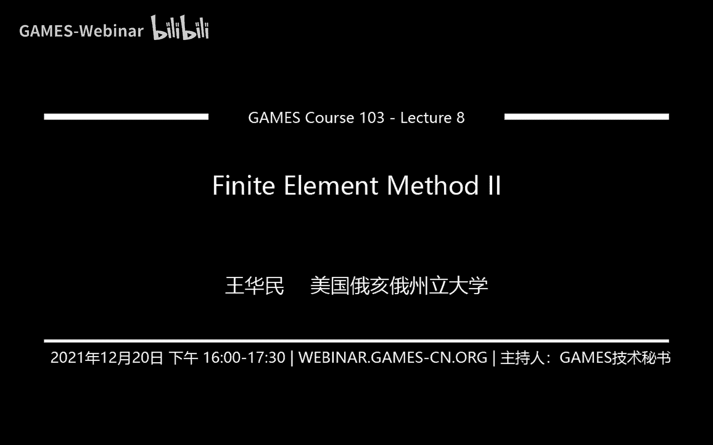
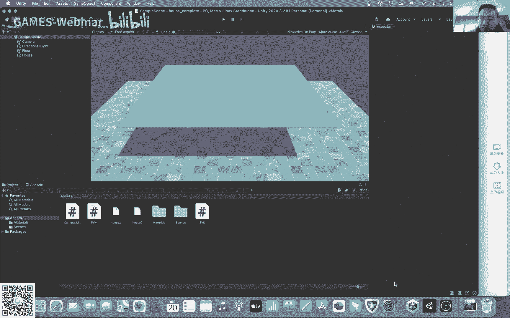
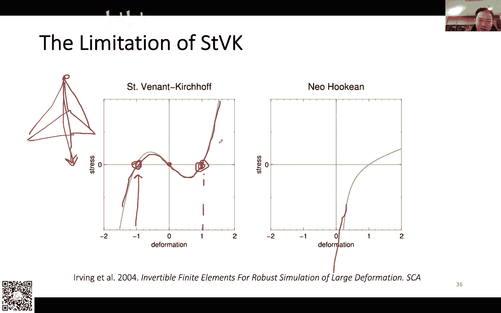
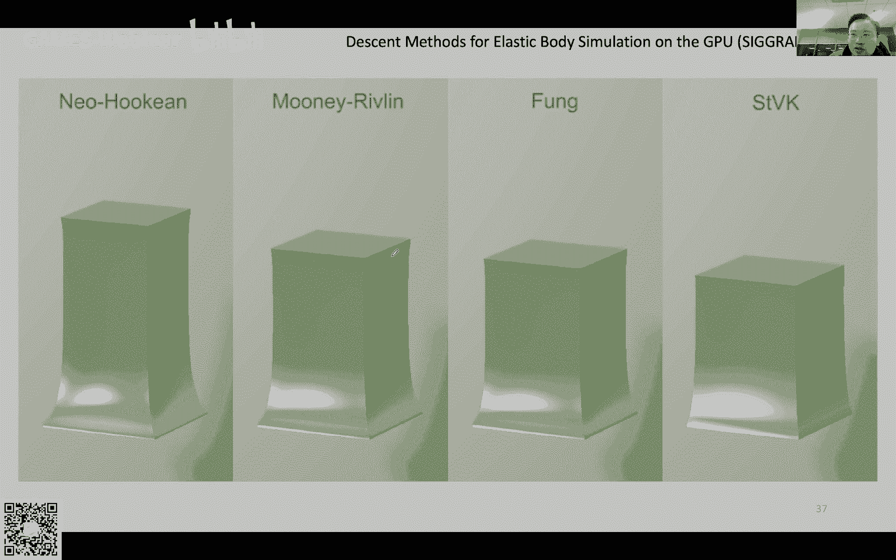
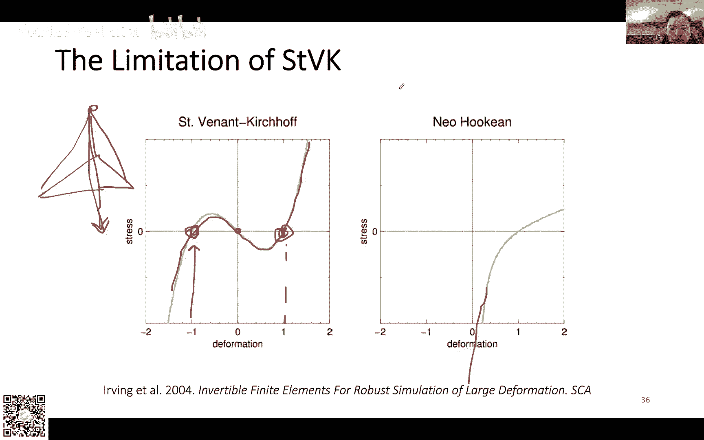
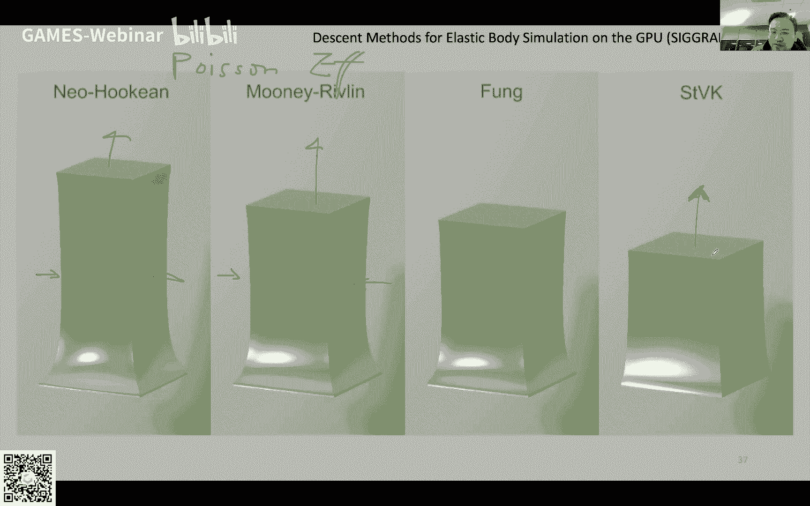
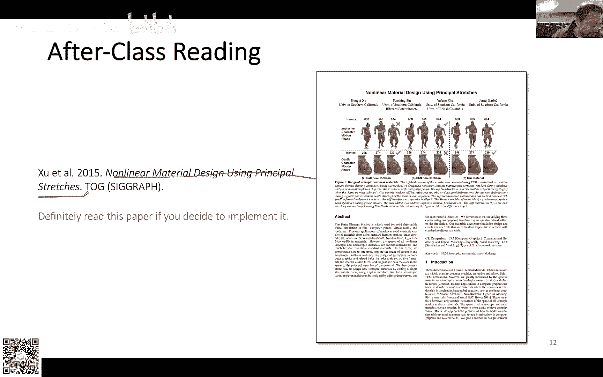

# GAMES103-基于物理的计算机动画入门 - P8：Lecture 08 Finite Element Method II (Lab 3) - GAMES-Webinar - BV12Q4y1S73g

可以啊好吧，咱们就准时开始吧，呃呃今天事情还是比较多的，有好几个东西要讲，所以说我估计我到时候也讲不完，所以说啊我反正尽量能讲的就讲啊，但是有的地方我会尽量节奏放慢一点，然后帮助大家。

而有些知识要理解消化一下，然后有些东西可能来不及讲，那么就反正ppt在那里，然后大家有时间的话就把ppt看一下，然后啊对有一些东西了解一下啊，先讲一下作业，作业的话其实已经发给大家了。

呃如果你拿到手的话，会是这么一个东西啊，跟之前一样，是一个一个代码，然后呢你做完作业之后运行了之后呢，他会我有一段代码，它会从文件里面去读取，读取一个四面体网格，叫做house啊，然后呢你运行了之后呢。

你会看到你会有一个小房子，它会掉到地上，然后它会弹起来啊，你可以改视角，你可以看到这个小房子是这样子的啊，然后你按空格空格的意思就是可以给这个小房子一个初速度，你可以把这个小房子抬起来。

然后你再把他摔下来，嗯嗯基本上就是差不多这么一个动画效果啊，是用我们这个有限元的方式去模拟的啊，然后呢我们用的这个模型叫做我们课上也谈过，叫做s t v k，主要的原因是因为这个模型它比较简单啊。

所以说大家写这个程序的时候会稍微方便一点，但这个s t v k它有一个问题，就是如果说四面体反转了，它比如说翻过去了以后，他是没有办法把这个四面体再翻回来的，他有这么一个问题存在。

所以说大家到时候抬的时候不要抬太狠，比如说大家如果太太狠，你会看到他这个小房子的下面这几条腿啊，下面的这些四面体它都被压压塌掉了，压塌掉了以后他就翻不回来了啊，然后因为咱们这个作业是用显示积分模拟的。

没有用影视积分啊，所以说大家也知道会有一个不稳定的问题吗，如果说你这个弹得太狠啊，它掉下来它就会炸掉，你看他一下就炸掉了啊，所以说就是利用这个作业给大家啊，主要就是了解一下这些呃有限元的这个方法啊。

怎么计算力，然后啊怎么把力去更新未知速度这些东西啊，这个就是比较简单的东西了，呃主要的难点在于怎么利用这个有限元去计算力啊，然后这个作业其实跟其他几个作业比起来的话，其实这个编程的代码量可能是最短的。

最简单的啊，但是呢这个只是编程上简单啊，如果说你要去读懂怎么样去做这个作业的话，你还是要花时间去读ppt的，所以说他写的东西简单，可能几行代码，几十行代码就把这个作业写完了，但是如果说你要明白怎么写。

这个是需要花时间的，好不好，有没有什么问题，关于这个作业，这个unity脚本比较慢哦，我以前在cpu上写的时候，用用open gl写的时候比这个跑的要快多了，但是unity脚本比较慢。

所以说它没有那么流畅，啊没什么问题的话，咱们就咱们就讲今天的这个有限元的东西啊。

看一下，就其实咱们上节课其实讲了有限元嘛，finite element method嘛，然后我们也讲了，说呃我们去定义一个能量，然后呢呃根据咱们以往的套路，用能量去对位置求导，我就可以得到力啊。

然后有了力之后呢，我们就可以把它当做一个粒子系统对吧，我可以啊，模拟这个四面体的各种形变，产生动画效果，就不是从有限元的角度，final element的角度，而是从final volume的角度。

然后这个叫做有限体积的方法，其实对于四面体，对于三角形这种简单的线性的这种呃这种element而言呢，你会发现这两种方法其实是等价的，这就是为什么我要谈这个方法的原因，因为这两个方式本质上是等价的。

而fined volume method在推导上，在他的这个数学表述上呢，要比find element method要更清晰一点，所以说我想重点的来讲这个方法。

而这个方法其实也在咱们图形学里面也是用的很多的一个方法，很多时候大家写paper，基本上是遵循了这种final volume method的这个formulation来写的。

但是这两种方法其实刚才也说了，其实本质上是等价的，那么它这个final volume method，它本质上就是基于说这个力是从何而来的这么一个思想，假如说我有两个东西啊，假如说我有两个弹性体对吧。

被一个界面背一条面，被一个某一个界面分割成上下两个部分，像这个样子，那么我其实就可以呃计算出这个两个物体之间，上下这个界面上的这个力来，这个力是什么呢，这个力我可以计算一个单位面积或者单位长度上的力。

我把它叫做t叫做traction，我把它这个单位长度或者单位面积上的力叫做traction，那么我的这个总的在这个表面上产生的力，就是这个traction在这条曲线上的积分，对不对。

如果说我认为利呃是作用在这一个表面上的，或者是这条曲线上的，那么单位面积或者单位体积的力啊，单位面积或者单位长度的力叫做traction，叫做t的话，那么我的合力总的这个表面上的这个力。

就是这个traction的这个积分了，那么怎么得到traction呢，我需要引入一个新的概念，叫做stress stress te，我们上节课讲到stress这个东西。

它本质上是一个跟利益相关的东西嘛对吧，那么这个东西怎么跟力相关的，这个stress它本质上是其实咱们在数学里面把它写出一个矩阵啊，那这个矩阵怎么样能够跟力相关呢，其实它就是做了一个矩阵跟向量之间的乘法。

我的沉的是什么，我乘的是这个表面的这个法向量，比如说我在这个点上，假如说我在这一点上，啊我想要得到这一点的traction是什么对吧，那么在这一点上，我的这个法向量是normal方向嘛对吧。

那么我只要把这个矩阵跟normal相乘，我就得到了我的traction，其实就是利用矩阵跟向量的乘法，我做了一个normal到traction之间的转化，我做了一个映射。

从normal detraction的映射，利用这个stress te，这个是我关于traction跟stress的定义，我们在物理上我们是这么定义的，那么有了这个定义之后呢。

我也就知道了咱们的利益实际上就是stress乘以normal的积分嘛，对于这个总长度的积分嘛对吧，traction是单位面积或者单位长度的力，所以说我根据这个长度记下分，我就可以得到力了。

那么这是咱们一个呃比较简单的情况，那么我们回到我们之前讨论三角形的情况，三角形的情况是怎么样子的呢，我考虑咱们的顶点啊，考虑这个x0 这个顶点，我假设这个x0 它代表的不是一个单纯的点。

它代表的是一个区域啊，这整个区域我假设都是通过x0 去代表的，在整个这个啊整个表面上，我这个区域是由我这个x0 代表的，那么这个x0 得到的这个力是什么。

是不是就是这这个区域的这个外轮廓的这个上面的traction的积分啊，对不对，因为这个表面里面它其实的内力是不产生这个作用，在这个整个物体上的嘛，这是内力嘛，真正对于这一个区域的产生作用的这个合力。

这个力实际上是表面的这个总的力的积分，那么总的力实际上就是traction嘛，所以说我是对traction在整个这一圈上的这个总的积分，这个是我真正的力，那么具体到这个三角形而言呢。

因为咱们有很多三角形，那么具体到这个三角形而言呢，就是这一段我把这个绿颜色的这个呃这个虚线，就是这个三角形对于这个顶这个这个区域这个顶点的力的这个贡献量，我把它叫做f0 对吧。

f0 就等于这个呃stress就是三角形的stress乘以normal，乘以这个曲面上的这个normal，然后再对于这条曲面曲线做一个积分，那么有同学就可能问了说诶这个曲线到底怎么定义啊，对不对。

因为这个曲线我我事先并不知道嘛，他可能歪歪扭扭的嘛，他可能嗯你怎么定义都可以嘛，对不对，那我首先做一个假设，我首先假设说这个曲线它必然是穿过x0 跟x1 ，还有x0 跟x2 这两个边的中点的。

它必然是穿过这两个中点，这是我的一个假设啊，不管它里面这条曲线怎么样，它的两个端点始终是这两条边的终点，那我为什么要做这个假设啊，我做这个假设的原因是。

因为我接下来我可以对这一个封闭的这条曲线做一个积分，啊这条封闭的曲线呢是由l，l10 ，还有l20 所构成的这三段所构成的，然后因为我们的stress这个西格玛这个东西啊，它其实是一个常数。

因为我假设这整个三角形它内部的形变，它其实都是均匀的嘛，这就是其实咱们说有限元做linear element，这意思就是我其实假设这是个三角形内部，在这个有这个element内部，它的这个形变。

它的stress都是常数，都是都是一样的，那么也就是意味着说这个stress本身这个东西是常数，都是常数，那么因为这个是常数，那么也就意味着我这一个积分实际上就是对于法向量。

在这一条封闭曲线上的积分了对吧，因为这个东西本质上就等于sigma乘以这个东西对于n的积分，那对于一个封闭的一个曲线而言，如果说你对法向量做积分，它就是零啊，因为你绕了一圈。

你把这个normal绕了一圈，然后做一个积分，他最后得到的是零，我们这个我们学过这个数学分析或者微积分类，大家应该听过这个叫做divergence theory。

就是说你把这个normal在某一个区封闭的曲线或者曲面上做一个一圈，一整圈积分，它应该得到设置，那换句话说呢，想要计算这个东西，这个是咱们的这个力的贡献量吗，我可以。

通过负的l0 跟l10 跟l20 上的积分来得到对吧，那么怎么计算这两个东西呢，诶我就可以我知道sigma是什么，假如说我知道sigma是什么啊。

然后呢我实际上就是分别对n normal 20跟normal 10做个积分了，对吧，那么normal 20是这个东西，normal 10做积分是这个东西对吧，这两个normal。

因为这两条线这两条边它都是直线嘛对吧，所以说他们的normal都是一样的，在这条边上它这个normal都是一样的，那我对它做积分，实际上也就是把这个normal乘以这条边的长度。

那这条边的长度呢是整条边的1/2啊，因为我假设这个端点是在这个中点上，所以说这就是x20 的长度除以二，x10 的长度除以二，这个就是咱们这个公式的由来，也就是说我这个三角形。

这个三角形对于x0 的贡献，实际上就是这个东西啊，除了这里除了咱们sigma还不知道以外，其他的都很简单，都可以根据这些normal啊，这些东西算出来，这里大家有没有什么问题。

其实这个东西其实跟你看这个呃，跟咱们之前上一节课讲有限元的不一样，因为咱们之前讲有限元的时候都是求导求导求导各种求导嘛对吧，这里的话他不求导它算积分，而算积分呢它又搞得更简单一点。

就直接把两条边上去做积分，你对两条边上做积分，因为normal是一样的，那么我就可以直接用长度来得到呃，有同学问为什么是终点呃，取终点的原因呢，是因为我假设这个力的贡献啊，对于三个顶点都是平均的嘛。

所以说我到时候计算的时候其实还是假，还假设这里还有可能还有个界面，对不对，那么这一块相当于是对x0 的贡献量，然后这一块呢又是对x一的x2 的贡献量，这一块是x一的贡献量。

然后取中点的原因就是为了相当于我希望它这个三角形产生的力啊，对于这三个顶点它是平均的，所以说这就是为什么咱们取中点的原因呃，三位上是不是面积分，有同学问对的，如果是三位上的话。

就变成了对于三角形的四面体的四个面的那个积分了，所以说其实只要把这个转化到面的影响就行了，所以最后所有三角形对x0 的合力不也是零了吗，啊不会是零，不会是零啊。

因为因为每一个三角形它的它的stress都不一样，你们注意到它的stress都是不一样的，它的sigma都是不一样的，如果说sigma都是一样的话，它的合力确实为零。

但是每个三角形它的stress不一样，所以说你这样子积分积出来它就不一样了，好吧那没有问题，咱们接着往下讲，咱们时间有限啊，啊这个就是回到刚才有个同学的提问了，就说如果是三维的情况是怎么样。

如果是三维的情况，就是就是面了，就是做面积分了，那面积分呢其实有对于一个三角形的一个四面体的顶点而言，它会有三个面对吧，因为每一个顶点都相邻三个面嘛啊我这里画的就比较简单，我这里没法画背后那个面。

所以我就直接画，只画了两个面，分别是呃012还有023构成的面，背面还有一个031构成的面，我这里就不画了啊，然后总的力呢总的力呢呃跟刚才很像。

就是stress乘以normal在三三这个这个叫什么这个界面上的积分，而这个界面上的积分呢实际上就是对这三个面的积分吗，为什么面积除以1/3啊，其实一样。

就是我希望把这个每一个面上的贡献都均匀地分布到这三个顶点上，所以说我就出1/3，这样子的话x0 能分到1/3，x一也能分到1/3，x2 也能分到1/3对吧，然后乘以这个normal方向啊，因为有三个面。

所以说我就做三次啊，分别把它给加起来，我就得到最后的结果了，那么这个公式咱们可以给它稍微整理一下啊，因为这个公式还稍微复杂了一点，所以咱们可以先也不算整理吧，就是把它展开一下啊。

首先对于a0 a1012 而言，就是012这个三角形，这个三角形啊，它的面积等于两条边的crosser duck除以二，对不对，这个咱们之前最早最早的时候讲这个三角形面积的时候。

讲过两条边的这个cross product的反the normal除以二，就得到了这个三角形的面积了。

然后三角形的normal是cross product除以它cross product自己的magnitude对吧，所以说这个也抵消掉了，你会发现这边就抵消掉了，同样的道理，对于第二个三角形。

还有第三个三角形而言，他们也都可以互相抵消掉，所以最后整理一下，我就得到负的六分之stress乘以这三个cross product，三个三条边的cross product。

然后这个就是啊我们finite element method在四面体上的这个效果，那么我们现在把这个formula有了现在的唯一的问题，咱们没有讨论的问题，就是这个stress怎么来计算了对吧。

我怎么得到这个stress，那么因为咱们第一节课的时候讲有限元的时候讲到了一个stress嘛，然后有同学就会想说，这个stress跟咱们上一节课讲的stress是不是一个stress，答案是否定的。

为什么呢，因为stress这个定义啊，它很特殊，我们刚才讲了这个stress是个什么玩意儿啊，这个stress，它实际上是在做一个映射，对不对。

他是要把这个normal这个表面的这个normal啊映射到这个traction上去，而这个normal跟这个traction它其实都可以有两种形式，有两个空间来描述，分别是它这个静止的状态。

我在静止的状态下，我可以描述一个表面，the normal，我也可以有一个描述一个traction的一个产生的另一个力的方向，而在形变的这个空间下，发生形变的这个当前的状态下，我也会有一个normal。

我也会有一个stress，所以说我这个解释就会很不一样了，那我们前一节课我们在讨论有限元的时候，我们定义的一个能量密度，我们这个能量密度呢是定义在reference状态下的，如果大家还记得话。

我们是定义了一个reference状态的能量密度，然后我们这个能量密度乘以reference的面积，乘以reference的体积，我得到了总能量，我们是这么算的，对不对。

换句话说我这个能量密度实际上是关于reference的能量密度，那么因为此呢我这个能量密度算出来的这个stress啊，我们上一节课我们用s s去表示这个stress呢。

它是把normal跟traction都假设是在这个reference状态下的，这个是我们上节课算出来的stress，都是关于reference状态的stress。

而这节课我们在讲有限有限体积的这个方式的时候呢，我们呢是假设有一个normal，然后呢我把这个normal转成了这个traction，转到traction之后呢。

我直接就可以把这个traction拿来算力了对吧，我假设这个力就是我们直接模拟里面所需要的力，换句话说我这里其实假设我的那个normal，还有这个traction啊，它都是在形变空间下的。

都是已经形变过后的这个normal and trans，也就是说我这个stress我们咱们这节课讲的stress，跟我们上节课讲的stress，它不是同一个stress，虽然说他们都是同一个目的。

都是想把normal转成traction对，都是要做这么个映射关系，但是因为我们用的normal跟用的traction它的定义不一样，我们这两个stress它也不一样，这就是有区别，那么也正因为此。

我们数学家他就搞了各种各样的这种描述这个stress的这个形式啊，他总共搞了四种可能性，因为我们有两种组合嘛，normal有可能是两种对吧，normal可以是在reference状态下。

也可以在形变状态下，我的traction可以是reference状态下，也可以是在当前的这个形变状态下啊，所以说我们就有三种事上常用的是三种啊，这个咱们就不考虑了，我不知道这个有没有这样的定义啊。

反正我们我是没见过我们有这三种不同的stress，分别呢叫做second piero kership of stress，first piloker of stress，还有柯西stress。

分别是三种，然后我们上节课说的呢实际上就是这个second peer pressure of stress啊，他假设normal contraction都是在reference状态下的。

而柯西stress呢是咱们这节课啊，我们刚才所说的想要的是normal跟traction都是在形变状态下的，当然还有另外一种比较怪的叫first pr，可stress。

他是假设normal是reference attraction呢，又是形变过后的，所以说有各种各样不同的形式，那么问题来了，我们想要的是coach stress对吧，我们想要coach stress。

我们其实不知道怎么算，但是咱们上节课已经讲到这个3d皮了，科学stress了，这个咱们可以通过这个d w d g，不知道大家记不记得把这个能量密度对于green rain，我求个导。

我其实就可以把这个second pierlock of stress给他算出来了，这个我其实可以算这玩意儿可以算啊，那么我现在就是说我怎么样把这个东西转成我的科西stress的问题了，对吧。

我如果能把这个东西转成科西stress，那么我也就可以计算科学ss，我有了科技dress，我回到我们前面这个p p t里面，这个东西我其实就可以把例算出来了，我这个问题就解决了嘛，那怎么做转化呢。

首先我会发现我的这个p啊，这个first pl跟second pl所有他的关系非常简单，为什么非常简单，因为我这个s这个second pl cos它其实得到的是reference traction对吧。

那么first他得到的是deformed traction，那么对于deform traction而言，我只要把reference traction乘以一个ation gradient。

我其实就可以得到deform traction，因为他俩的关系啊，他俩的关系其实就是一个deformation gredient的关系，因为not因为traction是一个矢量，对于一个矢量而言。

我乘以defamation gradient，我就可以从reference状态变到形变状态，咱们之前讲过什么是definition gradient。

他其实就做了一个呃从reference到形变的这个转化，所以说如果说给了我这个second plecs stress，我称一个definition规定的，我就可以得到first pl cos。

这俩关系是比较简单的，那么这两个人的关系是什么关系呢，我实际上需要得到normal和normal之间的关系啊，我需要知道reference。

一个reference的normal跟一个形变了以后的normal，他俩的关系是什么样子的，那这里我就想啊，我就想把这个跳过了，我就讲讲的比较简单了，大家有空的话可以把这个推导过程给他看一下。

但是我这里想省点时间，我就先跳过了，我就直接把结论告诉大家，但是大家有空有时间的话，可以看一下这个推导过程啊，结论是什么呢。

结论就是说这个coach stress啊是defamation gradient，determinant，分之一，陈以first plos of dress乘以formation gradient。

the transport，这个东西其实是它的定义，就根据咱们前面这个啊，我省略过的这几个p p t推出来的，省略过的这两个ppp推出来的，但是反正就是大家相信这个推导过程是正确的啊。

最后就可以得到这个东西，那么有了这个cos stress之后呢，我就可以构造这两个东西的关系了嘛对吧，因为我知道p是f乘以s对吧，那么我把这个p用f乘以s替代掉，我就可以得到口水stress。

最后我得到的cos stress就是有这个公式得到的，ok那么我们现在就把这个东西替换到我们刚才这个啊，这个公式里面去啊，因为咱们已经有这个计算公式了，有这个计算stress的公式了。

科西stress的公式了，我就可以替换一下了啊，咱们刚才说这个力1号顶点，这个力是这个公式算出来的吗，对吧，然后咱们也知道这个cos stress是刚才这个玩意儿，那么我就可以把它替换掉了。

那么首先咱们怎么替换呢，咱们首先这里做一个比较简单的替换啊，首先我把这个sigma用p给它替换掉，那这个替换我其实没有用刚才这个公式啊，因为这个公式跟这个公式不一样对吧。

大家有没有注意到这个公式跟这个公式不一样啊，为什么，因为这个stress这个柯西stress是把形变过以后的normal，变成形变过以后的力，这个是咱们柯西stress的attraction啊。

同最后得到力，这个是咱们科技stress的定义对吧，那么这个stress是什么stress呢，这个stress是，first plos of stress。

它跟可喜stress的唯一区别就是说我用的normal不一样，我柯西stress用的是形变的normal。

我first plocation of stress用的是眉形变的normal是reference的normal对吧，那么这里因为咱们这里，其实本质上这边右边的这一项其实就是normal嘛。

其实就是cross product normal，那么我这里其实只要把这个东西用没有形变的那个顶点来计算就行了，其实这里咱们就是用了一个小窍门啊。

没有用刚才那么复杂的这个呃这个这个stress之间的转化公式，咱们这里用了一个非常简单的小窍门，这个窍门的这个点在哪里呢，就是说因为这个东西是跟normal有关的对吧，因为本质上就是在算normal。

那么原来我们是用形变过后的normal来计算，形变过后的形变过后的顶点来计算这个东西，那么我用没有形变过后的没有形变的这些顶点来计算这个cross product。

我就可以用first pre stress，因为它俩的区别就是说我们的输入是什么输入，一个是形变的，一个是没形变的，那么做这个事情的一个好处是什么呀，好处在于这括号里面这个方框这里面的这些东西啊。

它是常数，因为这些顶点这些大x都是没有形变的，顶点位置它是没有形变的矢量，没有形变的向量，那没有形变的reference的状态它永远都是固定的嘛，对不对。

他的reference它的静止状态永远都只有一个，也就意味着咱们可以把这个方框里面的东西全都给他事先算好，我不需要我模拟的时候，我去啊去实际的去实时的去计算这个括号里的东西，因为这都是关于静止状态的。

我都可以事先计算出来，这是一个咱们做的一个简化，我们就把这个stress做了一个替换，我用first pure cos of stress替换掉这个科系stress就是咱们做的第一步。

然后咱们做的第二步呢，就是利用这个first pleasure of stress跟second pleasure of之间的差别，我把这个p用fs给它替换掉。

因为咱们之前讲了first和second之间的最大的差别，就是中间有个deformation gradi，所以我把这个替换掉，我就得到了负的六分之f乘以s再乘以b1 ，然后咱这个b一呀。

就是我假设只有这个东西，我给大家取个名字啊，因为这个写写一长串比较复杂，所以说我给它取了个名字叫做b1 ，然后这是一个常数常数向量，我可以把它事先算出来，然后second pre cos怎么算呢。

我们之前做有限元的时候计算过，就是啊就是dw d g嘛，这个能量密度对green rain求导，我就可以把它算出来了，这个就是咱们实际计算的一个方式，好吧，这里同学们有没有什么问题啊，我想听一下。

这里主要做的一个事情，就是咱们把之前用的这个柯西stress做了一些变化，变化完了之后我就可以用一个相对比较简单的方式来计算这个力了，然后这个string呢。

这个stress呢也可以根据咱们上一节课所讲到的计算方式来进行计算，对可能就是说大家如果没有之前没有学过一些这些力学的话，可能会就是因为第一次接触可能会有点陌生了。

但是公式基本上就是摆在这里给大家就是看一下，就基本上就是这个是咱们前面的这个公式啊对吧，然后呢是一个stress，然后呢对于这个stress而言，我根据他的这些定义出发。

我可以逐步逐步的一步一步的把它最终可以替换掉，然后f是这个大，f是deformation gradient，这个咱们上节课嗯，应该是讲过的，就是我是往前翻吧，我也不想往前翻了。

就是就是可以利用这些编的那个矩阵，可以把这个大f给它计算出来，就是我再往前翻一翻看看，the formation gradient，但方面是规定是在是在这计算的，大家如果还记得的话。

就是你有你有两个三角形吗，有两个形变状态吗，然后两个三角形分别有两条边嘛对吧，然后然后你把这两条边构成两个矩阵，一个是，一个是一个是形变过后的编矩阵，然后一个是没有新编的变矩阵。

然后它的逆这样乘一乘就是，对就是说这三个就是这三个方法其实是等价的啊，你其实其实这几个方法全是等价的，都是同一个方法在用不同的方式去解释，就是你这首先这三个公式是等价的吗，就这三个公式是等价的吗。

这三个公式分别对应了三种不同的stress对吧，柯西stress，second pierre科学of stress，还有second pre科学stress跟first pular of stress。

然后呢我利用这三种不同的stress，我都可以算出力了，就算出来力其实是一样的，其实对，其实其实就是其实就是不同的这个stress，不同的这个定义之间的转化。

然后我们最后呢是转化到一个呃对咱们的计算最友好的一个方式上去，然后最后就是咱们选择这个方式来做最后的模拟的计算，p表达的力为什么是一样的啊，因为我们这里是不一样的，因为我们后面的部分是不一样的。

就是这个力这个后面的部分啊，就科西stress用到的后面的右边的这个部分，用的是形变之后的四面体算出来的，右边的部分，然后p算出来的这个东西呢用到的这个右边的部分呢是没有形变的。

静止状态下的顶点的位置算出来的这个东西，cross product就这俩的区别就是在于右边的部分不一样，然后这个为什么咱们采用不同的右边的部分不一样，就能让它最后算出来的力量呢。

是因为他俩的定义所产生的，就是他俩这个stress它本质上就是做一个映射，就是把normal映射到立上去，然后柯西stress是把形变过后的normal映射到立上去。

而这个first pilot of stress p映射的呢是没有形变的力啊，没有形变的normal映射到形变过后的立上去，所以说以此根据这个定义呢，我只要把这个右边这个力啊，而右边这个normal啊。

因为右边这个本质上就是在说normal，我只要把这个normal从形变的顶点算出来的normal，变成没有形变的顶点算出来的normal。

那我也很自然的我就可以把这个stress用另一个stress给它替换掉了，其实就是做了一个不同的形式的之间的这么一个转化，大家反正如果说以前没有学过力学的话，我觉得肯定是这里会要稍微稍微要想一想啊。

稍微要想一想，但是其实其实你仔细的想，其实本质上就是它的映射会有把这个normal跟lee之间要做一个映射，然后这个normal跟li呢，它又分别又可以用形变跟没形变的两种方式去描述啊。

因为这个产生了一个差异，这个差异导致的我有不同的这个stress的定义，然后最后咱们选择了一个最符合我们这个设想的这个定义方式，就得到了这个东西，那么好，我现在就是可以在对。

咱们可以再对这个东西做一个呃简化，咱们就先首先就假设这个就是呃就这么回事了啊，就假如说大家不懂材料力学的话，反正就也先放一放，就是先来先默默的接受这个事实好吧，那么我们再接着往下走，我们接下来怎么走呢。

就是我们要讨论这个右边这个这个东西啊，这个b一啊，就是这个括号里面这个方框，这个里面这个东西它到底是一个什么东西，对不对，因为这个东西其实写的还是挺复杂的，虽然说我们都会算cross product。

知道怎么算cross product，但是这个cross product还挺复杂的，所以说我们想要再往深处走一走，看看这个coser到底算了个什么玩意儿，那么首先我们来想讨论一下b1 。

就是关于这个x1 ，我需要用这个b一来计算那个b一呢，就是这个东西，这个就是b一啊，那么首先我们来看看这个b一跟x10 做一个dot product会发生什么，假如说我这个b一根x10 啊。

就这条边我做一个dot product，这个就是transport乘以一个向量，这就是dot product，本质上，那么我会发现首先这里有一零的存在嘛，因为这里有0101就是一零的负的嘛对吧。

那么你一零跟一零跟另一个东西做cross的话，这个就抵消掉了，为什么呀，因为你做完cross product，你的结果你这个绿颜色的这个部分肯定是跟一零垂直的，你一个东西跟它垂直。

你去跟他做dot product就等于零嘛对吧，两个垂直的向量都dota product等于零，所以说它就抵消掉了，那么其次你橙色的这个部分它也有一零对吧，只不过是零一是负的。

所以说这玩意儿它也会抵消掉，它也是跟伊林垂直的都抵消掉，所以你得到的就是x10 跟x21 跟x31 做dot product，那么我这里可以把我这些顶点的顺序给它稍微调整一下。

这里反正就大家相信我这里正负号没有搞错啊，反正就把这个一零改成写成零一，然后二一写成二一保留，三一保留，然后但是他的前后顺序给它改一改，改成这个这么一个顺序，然后这个玩意儿是什么样。

大家如果还记得咱们第二节课的时候讲四面积的体积的话，这个其实就是六倍的四面积的体积嘛，对不对，因为我们之前算体积的时候，我们是写成16/6分之一的这个东西。

所以说这个东西你反过来这个就是六倍的四面体体积，首先这是第一个结论，然后另一个结论呢，你如果把这个x20 跟b一做点击啊，做点乘，做内积会发生什么，这条边跟他做内地会发生什么，啊不对，我是不好意思。

我这里写错了，应该是还能把它擦掉，应该是这条边对吧，就是这条底边，这条底边你去跟他做内积，你会发现呃呃做做做个点乘的，你会发现，首先我可以把这个蓝颜色跟橙色的这两个东西，做一个加法，做一个加法呢。

因为这里有三一吗，这里也有三一吗，对吧，他俩都有三一，那么我把这个后面的东西做一个前后顺序倒倒换一下，就变成了x21 减x01 ，那么x21 减x01 就得到x20 。

然后最后cross product x31 ，跟x20 做点乘呢都等于零，因为它也有x20 ，它也有x20 都等于零，所以说最后就玩就是等于零吗，对吧，然后以此类推，x30 也应该等于零，为什么。

因为它就是另一条底边，只只不过换了一条底边，但是反正换一条底边不影响跟这个x20 ，它其实对称的，所以说它也等于零，所以说我就会发现这三条边啊，它跟这个我们这个b一啊，她有这三个关系。

那么我为什么要做这个事情，因为我可以把这个东西写成这么一个形式啊，x10 x20 x30 ，我假如说它是一个矩阵的话，它的transpose乘以b一就等于六value。

然后零零这个其实就是咱们前面那一页的这个结论，我给她做了一些调整，那么同样的我对b2 相乘积x2 这个顶点，它也会有一个第二的这个向量用来算力的向量对吧，它相乘就会得到零六倍的ume，然后乘以零。

然后得到零，然后对b3 就会得到006倍的，所以说b1 b2 b3 也就是六倍的volume乘以它的逆了，就是这么一个形式，最后得到这么一个形式，然后换句话说呢，换句话说呢，我这个b1 b2 b3 呢。

也就是这个东西，这是什么东西啊，这个东西其实就是六倍的volume，只不过呢我是用这个这个逆矩阵的determinant分之一来描述的，这个东西其实就是determinant，x10 x20 x30 。

只不过我是因为我们我们可能在数据结构里面，我们并不保存这个东西啊，因为这个东西其实就是volume，就是这个四面体的体积吗，只不过我数据结构里面并不保存这个东西，所以说我用它的逆。

我先把这个determine算出来，然后做分之一，我就可以得到六倍的爆率，然后右边呢就是我们刚才这个编矩阵的这个分之一了，这个其实就是我整个呃推导过程。

我可以我可以发现我可以利用这个咱们前面推推出来的这些定义啊，我可以对这个东西做一个简化，然后咱们这个有限元的这个式子就可以这么写，我们的seo code是这样子的。

首先我的dm我把它叫做就是这个编矩阵啊，我把它叫做dm，我先把这个dm给它算出来，然后当然事实上我们在这个代码里面，我可以把它事先保存下来哦，因为这个东西是个常数矩阵嘛，我可以事先把它我给它保存下来。

我不需要每次都对它做计算，然后这个东西呢分之一乘以这个当前的编曲阵，这是形变，就是没有形变的reference的变矩阵，这个是形变过后的变矩阵，我可以得到defamation gradient对吧。

这是我第一步，然后第二步呢我可以得到green rain，我可以利用这个deformation gradient，我这样子乘一下，我可以最后得到这个green rain。

然后呢我可以利用这个我们的这个green rain啊，我可以对这个second pierre of stress，我可以计算一个second pure cure stress，哦不对。

这个好像是这个应该叫first pr stress，这里写错了，可以得到我这个p p矩阵，这个配矩阵怎么来的呢，我可以先做d w d g d g对吧，我得到second pre classifs。

我这个deformation规定我就得到了first，得到first，完了之后呢，我就利用我们前面这个公式，我把这个p乘以这个d m d m的food transport，我就可以得到这个东西。

然后乘以乘以这个哎，我这里好像是不是写错了，我看看啊，这里应该是没有六的，可能我这个回头再检查一下吧，这个这个常数这里是不是搞错了，然后最后我就得到了这个哦，这个应该是有六的，因为因为因为这个地方。

因为这个地方没有六，但是我们前面这个地方是有个六的，前面这个地方是有个六的，所以说后面还是有个六的，这个倒是没有错，我注意到我这里好像也写错了，这里应该是负的，transport，公式一多就容易写错了。

这个公式这边这一页应该是对的，大家可以参考一下这一页，然后我当时会把ppt也稍微改一下，然后大家就是以我改过的最新的那个ppt为准了，这个应该是有六的，我把这个六删掉，我把这个把这个叉删掉啊。

然后这个就是得到利了，然后注意啊，这个是一个矩阵，算出来的是一个矩阵，这个最后算出来的是个矩阵，然后这个矩阵我们有三列嘛对吧，那么每一列对应的三个力，然后呢最后我这个x0 这个顶点上的力呢。

我就是根据我们这个牛顿定律，我可以把另外三个力加起来，然后前面加个负号，我得到了f0 ，然后这是呃我比较推荐的一个paper，03年的这个joe tan，还有rptical，他们一起发的paper啊。

to find the volume methods for simulation of skeleton muscles，然后大家有兴趣的话可以读一下这个paper。

基本上就是把我这一页这前面几页ppt给他具体的介绍了一下，大家这里有没有什么问题啊，有问题吗，最后变形的列向量怎么给出来，什么叫做变形后的列向量，第二步，哪一个是这个吗，它这个就是一个边呢。

这是一条边呢，它每一个就是每一个列，就是每就是就是一条边嘛，我们一个四面体，我们一个四面体，它不是有三条边吗，对吧，假如说这是0123，我记得有三条边吗，我就是换个颜色，不就三条边吗。

然后这三条边就对应的这三个向量，三个链向量变形之后的坐标，就是你模拟的时候，你不是会有一个变形之后的状态，然后那个变形之后的状态它就会有三个顶点嘛，三个顶点的位置就是你的当前的这个位置。

因为咱们是影视积分嘛，啊咱们是显示积分嘛，显示分的话就是说当前你有一个位置，然后你想要根据当前的位置计算新的位置，对不对，当前的位置就会呃会有这些顶点的位置。

你就可以根据当前的位置把这个ation鼓一点算出来，然后呢你最后得到力，得到力了之后，你再去用这个力去更新啊，顶点的位置，更新速度，你就得到新的顶点的位置，新的顶点的速度就这么一回事。

然后那个你得到力之后，后面的东西后面的故事就跟咱们正常模拟粒子系统是一样的，就是你用力去更新速度，用速度再去更新力，更新位置，这边是如果是四面体的话，这边就是三维的，就是还是本质上就还是一个粒子系统。

本质上就是一个粒子系统，只不过就是这里面粒子系统的话里里面是有四面体的，然后这四面体的话会是会产生四面体所对应的力量都是三维的，因为咱们顶点是三维的，顶点是三维的，所以说边也是三维的。

然后这个其实都是3x3的矩阵，大家如果仔细观察一下的话，其实都是3x3的矩阵，然后最后得到的是一个四个向量，然后四个向量就是四个力嘛对吧，然后每个力都分别施加在四个顶点上，就这么回事，还有没有什么问题。

对，因为基本上就是除了流体，咱们做那个，其实流体里面其实也有粒子系统，基本上粒子系统这种粒子的这种方式实际上是贯彻所有的模拟的，除非你是做那种欧拉的那种流体以外，其他基本上都是都是由粒子系统，计。

算机四面体对立，对就是我们这里其实就讲因为你这个四面体的有限圆，最后算出来的其实是这个四面体的这个形变嘛，那你如果把这个四面体形变产生的力，你把整个四面体认为是本质上就跟一个弹簧一样嘛。

整个系统它其实总的合力应该是零，因为作用力跟反作用力嘛，它总最后总的合力应该是零，所以说你是四个力，你其实最后加在一起应该是零吗，那你加在一起是零的话，我就可以先把三个力算出来，三个算出来，完了之后呢。

你把这三个力加起来，然后前面加个负号，你就可以得到第四个力了，就跟咱们算弹簧是一样的，咱们算弹簧的时候不是先算一个力吗，顶点的力，一个顶点的力算完之后，然后另一个顶点的力就是前面加个负号，一个道理。

就是为了能量，就是为了动量守恒，其实就是就这么回事，四面体内有个面对点零是加f0 ，也就是traction，什么意思，因为traction假设对零对你对你也可以认为就是说你就是零点。

这个点就是跟另外三个顶点会用一个一个一个一个表面去分割的话，那其实是可以这么理解，模型是四面体构成的吗，对是四面体构成的，我其实是假设是由四面体填充的，它里面其实是有东西的。

你可它是一个实心的一个四面体，它不是一个它不是一个壳，它不是一个就是四个面，它不是只是四个面，它是一个实心的四面体，影视积分的话，我可能今天没有时间讲，但是我ppt做了，就是大家如果有时间的话。

可以去看一下那个ppt，但是我今天可能就暂时不讲了，有些人跟有限体积是同一个方法吗，其实并不是同一个方法，它其实这两个方法是不一样的，一个是积分，一个是微分的，但是只是在这种线性的element。

就是linear element，三角形，还有四面体这种特例的情况下，它俩是一样的，只不过他们在更多的复杂的情况下，他俩是不一样的，然后有同学问为什么不用高斯基点做数据积分，其实是有的。

一般来说我们做那种高阶的高阶的那个叫什么高阶的有限元的时候啊，一般来说是会有这种高斯积分的方法的，不过我们这里就是对于这种简单的就没有必要用高斯积分，因为高斯积分它本质上是要做采样的吗。

四面体可以是不同材料吗，可以啊，这种叫做这种叫做ha genius material，就是就是不均匀的材料，一般来说如果说四面体，一般来说咱们图形学里面用的比较多的是均匀的，就是homogenius。

也有做ho genius material的模拟，可以用不同的，就跟弹簧，你也可以用不同的弹性系数一样，然后咱咱们就先往下走，然后这一篇是有限圆的paper，然后如果大家有兴趣的话，可以去读一下。

不过这篇paper是关于2d的，它主要是讲三角形在衣服上，在cross上的模拟，如果说你想把它扩展到3d上，也是也是可以的，然后还有一点提一下，就是这个公式啊，你读paper的话。

你会发现那些paper都没有用，这个公式，我也不知道为什么，就是我不知道是不是因为他们没有意识到这一点，但是我后来自己推了一下，我发现其实就是可以用这个简化公式，可以自信的把这个力给他算出来。

paper里面一般来说都是直接把这个b1 b2 b3 给他算出来，分别算出来保存下来，然后再做这个计算的，实际上我发现没必要，直接可以利用这个dm来做计算，这算是一个小简化了，最后结果其实都是一样的。

只不过就是计算方式上咱们可以可以省一些，省一些计算量，然后接下来我就想讲讲一些材料了，这个其实跟我们模拟里面的材料很有关系，因为咱们之前做的比较简单，就是这个啊叫做s t b k的这种材料。

s t v k这个材料其实是有很大的缺陷的，最大的缺陷其实咱们作业里面我们可以体现出来，就是他没有办法处理反转，它翻过去了以后，他又转不回来了，其实真正的在材料力学，结构力学，还有在这个工程里面。

其实s t v k是用的很少很少的，而是在图形学里面用的比较多，因为大家有的时候都是想比较偷工减料，都想把这个事情搞得比较简单嘛，所以用的s t b k事实上在工程里面用的不多。

所以说我这里也想讲一下比较通用的啊，有什么样的模型去构造这个啊，计算stress，构造这些string stress的这些关系，我们这种材料就叫做hyper elastic material。

这几个意思呢就是说我这个模型是通过能量密度来推出来的，就是怎么样利用这个能量密度供了一个从，到stress的一个映射，首先我想这里想先跳过吧，因为这个比较复杂，我就我就先讲这个吧。

就是说有一类材料它比较特殊，叫做iso tropic material，tropic的意思就是各项同性，我们在现实生活中可能大家也会碰到，就比如说像我们的橡胶，它是各项同性的，什么叫各项同性呢。

就是这个材料在不同的方向上，你去拉伸它，或者是对它产生形变，其实效果是一样的，你横着压跟你竖着压其实没有区别，我们把它叫做iso tropic material，有的方有的物体。

有的材料它不是各向同性的，它方向是跟方向有关的，比如说你横着压跟竖着压，可能跟斜着压都不一样，那么叫做a s topic material，但咱们就不讨论了。

咱们今天主要就是想说说这种iso topic material，iotropic material，它有一个什么特点呢，他这个特点就是说你可以先假设这个。

大家记不记得这个p叫做first pre stress，我们这模拟计算里面用到的p啊，可以认为是deformation gradient的一个函数。

因为咱们之前的时候我们是说这个东西是根据string算出来的，是根据这个green string，格林string算出来的，string本质上是关于deformation gradient的一个函数。

所以说我本质上我这个i p也可以写成f的一个函数，我这个f如果做一个s v d的话，我可以得到三个部分是两个旋转，大家如果记得的话，你对这个ation gradient做一个s v d。

你可以得到两个旋转，加一个，然后这个d diagonal的里面呢把它叫做principal stretch，本质上就是说你这个defamation gradient，这个线性的形变。

我可以用旋转拉伸跟旋转来表示，我们最早最早的时候，第二节课的时候也讲过这个东西，不知道大家记不记得，就是说一个线性形变transformation，你可以用旋转拉伸旋转来描述。

那么中间这个拉伸的这个量啊，它其实是个对角矩阵嘛对吧，里面的每一个元素呢，它其实就描述了三个方向上的拉伸的量，把它叫做principal stretch，也就是主拉升量。

那么有了这个defamation gradient的s v d之后呢，iso tropic material，你可以发现你其实可以把这个u啊这两个旋转都扣到外面去，然后呢你中间这个。

就单纯的变成了一个principle stretch的一个函数，这句话说我其实可以把这些旋转都问题里面剔除掉，我直接把这个stress，直接把这个p啊跟principle stretch发生关系。

这是其实是他想要做的一个最主要的目的，就是不不管你这个形变，不管你这个ation gradient，这个linear transformation有多复杂，归根结底。

我只需要知道我最里面的这个拉伸的这个矩阵啊是什么样子的，然后我根据这几个拉伸的量，主方向上的拉伸量可以构造一个构造一个stress出来，然后两边乘以rotation matrix，我就可以了。

常呢在很多paper里面呢，大家喜欢把这个p呢用三个变量中间变量去描述，这三个中间变量我们叫做principal invariance。

然后呢第一个呢是就是三个principal stretch的平方和，第二个呢是四次方和，然后第三个呢是啊平方的两个平方的乘积分别的加起来，然后反正大家这个呃了解一下就就可以了。

倒也不用特意的去啊记他这个反正就是跟跟材料，跟跟这个数学他们相关的一些知识吧，相当于也是给大家科普一下，就有一些公式了，就比如说s t v k就是这么一个公式，who can。

这个是其实是在我个人觉得是材料力学里面，大家其实用的更常见的一个模型叫做你hook更标准的模型，然后其实你可以看到这个名字，new new就是新，who can，就是胡克胡克定律的胡克嘛对吧。

相当于就是一个新胡克的一个定律，新胡克的一个公式，这两个东西呢其实有两项，这两项分别是什么意思啊，一项呢是抵抗拉伸的一个物体，你可以去拉伸它对吧，朝不同的方向去拉伸，第一项它主要的目的是为了抵抗拉伸。

第二项是为了阻止以积或者面积的改变，大家有没有注意到，就是说咱们现实生活中，比如说你一个橡胶去拉一块橡皮，橡胶当你这样子拉的时候，中间它会缩短，它会试图会保持体积，是那么保持体积的。

这个也本质上也就是你洗希望它这个体积不发生改变吗，所以说这个东西也就是为了阻止阻止这个体积的改变，有同学问sharing不是剪切吗，对sharing的字面意思是剪切。

但是这里的话它其实就是各种各样的拉伸，其实都是在这个sharing里面的，其实你这个拉伸其实也是一种sharing，就是不同方向上的sharing，还有一种叫做moon revenue。

其实是一个new hoan的一个增强版，还有放mod，这些都是比较常见的，就是拿来模拟，就是描述橡胶，还有模描述这个放一般来说是模拟这些人体组织，一般来说是用这种模型，就是这里就是给大家科普一下啊。

我们想要利用这个是嘛对吧，我们想要计算这个first plos of stress对吧，算了我就用dw d这几个东西算了，wd这个lambda算了，然后这些是principal struts。

我知道这个w是这么一个公式对吧，然后这个i c和2c啊，分别是前面这几个东西，这个定义利用这个公式其实就可以把这些把这些东西给它推出来，我就想把这个东西留给大家一个作业啊来做了，这里我就不细讲了。

反正就是大家回头做作业的时候啊，作为附加题啊，然后看一下怎么样去把这个东西给它算出来，然后有了这个东西之后呢，我就我这个东西就比较简单了。

我就我就把这个之前我我计算second pr课程of stress的时候啊，我之前是用这个p等于f乘以s那么算的嘛，对吧，等于d w d d g吧，我之前是这么算的。

现在我对于这种材料还elastic这种模型，我可以利用这个公式来算，you呢，跟v呢就是它这个对于defamation古一点的s p d这个里面的principle。

stretch呢就是分别对应这些dma dma 2，那么到三，然后这个三项呢可以根据我们前面的这个这公式给它计算出来，然后就可以得到利用这个不同的这个里面的这项啊，我可以不同的w呢。

我可以模拟不同的弹性模型，我可以模拟sd vk，我可以模拟你，who can，还有等等等等各种不同的模型，其实就是对他做了一个改变啊，那跟前面的那个伪代码相比呢，我这里多了一步需要做s v d。

前面不需要做v s t v k，不需要s v d，那这里需要s v d，所以说这里的话会稍微复杂一点啊，然后咱们package我给大家的那个package里面已经有那个s b d的代码了。

所以说大家不需要自己去写s b d代码，直接调用那个函数就可以了，所以说稍微简单一点，所以说这个东西反正就是呃大家课后呃，相当于做一个啊自学的一个小东西吧，给大家一个，反正我这里讲的也比较简单。

可能讲的比较快啊，而且大家要大家就是有一点需要确定的，就是说这两个东西其实算出来结果应该是一样的，把东西算出来的结果应该是一样的啊，对于同样的模型而言，他们算出来的结果是一样的，所以说你做附加题的时候。

你也可以利用我们前面那个计算出来的东西去做一个验证，如果说算出来的不一样，肯定是你哪里写错了，或者你哪里理解的不对啊，所以去看一下我在我的这个我自己的那个学校的官网上，我也我也有开源的代码。

并不是说做这个这么简单的模拟，但是它里面其实也有一部是做这个类似的计算，所以说大家如果是呃没看看明白的话，可以去看一下我那个开源代码，可以去看一下计算过程是什么样子的，作为一个参考吧，然后我们前面讲了。

不是说s b k有一个问题吗，啊这里就是反正就给大家看一下，这个问题是横轴，横轴是形变示例，然后你会发现它这个有什么问题啊，问题就是一的时候零的时候是那时候是没有形变吗，对吧。

你会发现他一开始产生形变之后，哦，不对不对，这个好像有点问题，这里应该是一个你可以把它认为想象是一个弹簧的长度吗，这时候是没有形变，没有形变也就没有利，没问题对吧，一的时候没形变，没力都好。

然后当拉伸的时候没有什么问题，升的越大，你力越大对吧，压缩的时候你开始压缩，然后产生的力也没有问题，s b d k有什么问题啊，就是当你压到一定阶段之后啊，他这个抵抗反而变小了，而不抵抗了。

甚至你当你把所有的点压成零点的时候，就压到零的时候，你反而没有抵抗了，如果说你反方向压，就是你这个四面体如果被反转了以后，这个力也会反转，换句话说，你这个四面体被反转之后不会回到这个状态上去。

这是我们想要的静止状态，它会停留到这个状态上，这个反转的这个状态啊，它会停在这个状态上去，这是sdk的一个很大的一个缺点，四面体或者三角形它被压缩甚至产生反转的时候，它会翻不回去，你who can。

它其实避免了这个问题，就是他当你压缩的时候，它这个力会变得越来越大，越来越大，甚至趋向于无穷大，所以说它就会最终会是这个问题，四面体怎么反转，什么叫四面体的反转，就是说比如说我这个四面体是这样子吗。

对吧，四面体是这样子的，反转就意味着这个顶点跑到另一侧去，如果这个顶点跑到另一侧去，它就发生反转了，像一个气球一样，你把它翻过来，它本来一个气球是一个球壳，是这样子的，你把它翻到另一侧去。

它就变成这个音这个状态，是一个四面体的反转，利用咱们之前你可以用咱们之前算体积的方式去验证啊，如果反转的话，它体积会变负的，就会凹进去了，收敛啊，他还是可以模拟成功啊，就是咱们作业里面其实会试嘛。

就是可以模拟成功的，还是可以收敛的，只是会非常的怪异，就就像咱们那个房子的那几个腿一样，让他被压塌掉了以后，他会反反转，完了之后他就会凹进去，凹进去之后你会发现那几个腿都是都是会趴在那里的。

他你你就你就他就回不去了，就是a s t b k的一个问题。

反正这个东西也可以利用昨夜去验证验证。

这个是我们我之前16年的时候有篇paper吗，就是模拟了不同材料给大家看一下。

就是同样的一个小房子啊，同样一个小方块，一个立方体，然后不同模型去拉伸，它拉伸的时候没什么大问题啊，然后会产生一个模拟效果，大家而且可以注意到这个personratio。

这个叫做persony fect松，效果这个大家听说过这个名字吗，这个破松effect就是说当你去拉这个东西的时候，当你往这个方向去拉这个东西的时候，会凹进去，这两边会凹进去，这个也是的。

当你这样子拉的时候，这边两侧会凹进去，这个就叫做破松effect，为什么会产生破送一发给的本质上就是因为它需要保体积，除了体积，当你一端变长的时候，那么势必其他方向就会变小，这个例子为什么比较弱。

是因为系数的原因吧，是因为我这里用的弹性系数不一样，也是某种程度上也是因为这个s b d s t v k不太稳定，所以说我不敢用太大的力量拉它，我怕我太大力拉它，它会炸掉。

所以说我这里用的系数也比较小嗯。

然后然后简单的总结一下啊，我们有限元的方式呢是通过能量密度的导数去计算力的，有限体积的方式是通过traction的积分来得到力的，这种方式其实最终的结果都是一样的，只不过它提供了不同的表达式。

它提供了不同的这个描述方式啊，当然这个有个前提条件，就是说我们是在linear fm linear element的前提下，说你用别的方式的话是不一样的。

那我happy astic model呢是一个比较通用的描述这个力跟形变之间的关系，的一个表达式表表达模型，它这个本质上呢就是定义了一个能量密度函数，这个能量密度函数呢对于iotropic材料而言呢。

各项同性的材料而言呢，我可以用principle stretch来写，怎么不stretch，它就是definition规定的一个特征值，对于iso trafic material呢，我可以通过计算。

按对这个stress进行对角化，我可以计算它的方式，这个其实就是我们有些圆的这一块，当然这个东西其实咱们图形学里面其实还是比较简单的，相对于材料力学啊，相对于结构力学啊。

相对于啊学啊计算数学里面还是相对比较简单的，反正这个也是给大家相当于啊简单的啊描述一下，然后一方面也是把整个流程告介绍给大家啊，最简单的层次就是说我们了解这个计算过程，我们可以自己写代码。

可以自即把它用到不同的模拟引擎上，这是一个最低的要求，第二个要求就是说你要理解这个代码的含义是什么，然后能够举一反三，三个层次就是跳出图形学去看到图形学外面大家是怎么做的，然后反正不同的层次。

反正就是希望大家啊通过昨夜可以能不能达到第二个层次，然后如果说咱们以后未来有高级课程，可以也可以往更高的层次上去走，有同学问图形学模拟的方式跟传统力学的差别其实是没有差别的，咱们用的这个方式啊。

这些formulation其实在就是计算物理啊，材料力学里面其实都是有的，都是一模一样的，然后土星学其实研究的主要主要倒不是说这个本身的数学模型，咱们图形学里面研究的是怎么样算得快。

怎么样去优化这些问题，怎么样快速的去呃计算这些东西，比如说我们做游戏对吧，游戏肯定就不可能有很大的计算开销，不可能说给你几千几万甚至几百万个四面体来模拟了。

我们有里面可能就只能用十几20个四面体去做一个很快速的模拟，怎么样做这种快速的模拟啊，这是我们图形学比较关心的问题，然后我这里想接下来想稍微简单呢，以下，有限元的一个高级的东西，我看一下。

有同学说学历学的是不是就是学图形学更容易，其实也不见得，因为学力学的同学，他可能对这些概念很了解，就像学物理的，他可能对物理概念很了解，但是呢我们做图形学里面最重要的就是说你不光是有这些概念。

而第二点就是说你怎么样，你跑得更快，对不对，是很重要的，因为你很多时候你的一个算法，同样的算法你可能不同的写法都是不一样的，怎么样去优化这些模拟，请，嗯然后影视积分这里我其实呃就我不想讲了，我本来想讲。

但是我们时间肯定不够，所以说我就不想讲了，如果大家感兴趣的话，可以读一读这篇paper，paper是呃比较详细地介绍了，有限就是有限元模拟。

你怎么样去做影视积分的，这里就不讲了，好吧，大家感兴趣的可以去把这个paper读一下，同学问需不需要专门的去学材料力学吧，就如果说你对，就是专门对这种啊模拟这种弹性体这一块特别特别感兴趣的话。

有可能需要了解的稍微多一点啊，如果说你比如说你做流体啊，如如果说不涉及这些东西，具体的这些呃这种弹性体的话，可能相对来说可以了解的稍微少一点，如果说你做头发模拟，可能就完全没有，或者是刚体模拟。

可能完全就没有必要啊去了解这个东西，因为因为我觉得模拟啊在图形学里面，它跟渲染跟其他方向不一样，一个很大的点就是呃模拟设计的东西很多，就就比如说你做流体吧，你可能做流体的同学。

所以说你很难说就是保证每个方面都精通吗，我这里就先跳过，我现在想跟大家讲一个什么，讲一个非线性优化的一个东西，如果要算得快对吧，计算我个人觉得就是对于cpu跟gpu的优化都要比较了解，我也是比较重要的。

对线性优化我觉得是一个很大的点，因为同样的方对吧，同样的这个优化问题，同样的非线性问题，你怎么样去优化，它其实你做影视积分的时候也会变成一个非线性优化的问题，做有限元的paper。

我个人觉得主要就是在做优化，主要是我自己主要做gpu上的比较多，怎么样在gpu上做实时的模拟，比如说我们前几年做的，就是说几万个顶点，几万个四面体，我们可以在gpu上做实时模拟，做这块。

你光是模型上基本上没有太大的创，没有太多的创新，因为基本上都是力学的，力学的知识，其实有一些其实你会其实我个人觉得就是经常会看到这些paper，就是说他其实就把别的别的方法搬到学里面。

然后发一些paper，这些paper其实嗯早年比如说前10年前20年的时候其实还挺多的啊，但最近几年其实相对来说慢慢慢慢的少起来了，更多的时候大家其实在乎的更多的是一个效率问题。

然后就是说你怎么样做的准确，一个问题被别人搬已经搬完了吗，非线性优化，了解非线性优化吗，我想先问一下，在我讲这个之前，非线性优化吗，就学过有同学不了解了，先讲一个方法，叫做是一个很基本很基本的方法。

叫做gradient descent，这个可能大家可能大家听说过，gradient decent，一个很简单的思路是什么，就是我利用gradient我去做优化，一般来说我们做优化就是想解一个最小化问题。

就是给一个函数，我想要得到x x能够让小，假如说我这个我的解在这里对吧，这是我的这个解，然后呢我这每一圈呢都是一个等位线，分对的，对应的是不同的函数值，那么从里到外就是越来越大，可以想象成一个地形。

如果把这个想象成一个地形的话，这个就是一个坑，然后我这一圈一圈呢，就是相当于是一个呃一个同样高度上的一个一个一个一圈嘛，一个环嘛，然后这是一个坑，然后我就是一圈一圈的从里到外的绕出来对吧。

然后我谢谢非线性优化，我本质上就是想怎么样能够掉到坑里去，我掉到坑里，也就把这个非线性优化问题给解出来了，假如说我当前的位置在在这个x点上，我怎么样从我当前的位置坑里头去呢。

简单的思路就是我可以利用gradient去做，gradient是什么呀，我们的gradient实际上就是最快，我这个函数值的一个方向，也就是一个垂直于我这个等位线的一个方向，它是垂直于等位线的。

因为这是一个最快能够提高函数值的方向，换句话说，我反着这个方向走，我不朝古一点的方向走，是不是也就意味着我能够最快的减少这个函数值的方向啊，对吧，这个规定的定义我不要朝规定方向走，我我反着它走。

那么我也这个方向能够让我的这个函数值最快方式下降，其实就是梯度下降法的这个所在，就是说我反对这个梯度方向，我就可以往下降，大家看到我这个方向事实上并没有办法让我最终到谷底吗，其实中间还要有一步对吧。

我假如说我走到这个地方了，然后我这个地方我再根据我的梯度方向，我再走一步，我可能到某个地方，然后再走一步，然后最终我一步一步一步的迭代的，我从原来的位置，我最终走到我这个谷底，梯度下降法的意思就是。

假如说我有一个初始的位置，我每次都朝这个负的拐点的这个方向，我往前走一步，我可以收敛到我的这个思路线上去，录下降法，那么这个梯度下降法虽然说很简单，但是这里面有一个问题在什么问题。

就是说我这每一步要走多长多远，我如果走得太远，我肯定不行啊，我肯定走过头了，我走到这里了，不但没下降，反而还上升了，那不对啊，对不对，那我走的小也不行，走的小，我就是浪费我的步数嘛。

我们要得到一个最好的补偿啊，这个其实就是我优化里面其实也需要也是经常讨论的一个问题，这个alpha就是我的不长，我把它叫做step size，要找到step size。

其实对我们优化其实是一个很重要的东西，再说有两种方式去找这个部长，精确法就是说我想要找到一个合适的部长，能够让我这个沿着这个方向能够是最优的，这个叫精确法，另一个方法呢就没那么精确了，另一个进去。

另一个方法呢就是说唉其实咱们也不要求说找到这个最好的补偿，能够让它最小，我只要保证这个步长足够大，我又是能够保证我这个部长能够让我往下走的就够了，我们目的很简单，第一要大，第二我要下降，那怎么保证大呢。

我可以试错嘛，反复试错吗，先有一个初始的状态，我有一个初始的一个不长，这个步长可能比较大，稍微大那么一点，我每次都去测一下，我用这个不长o不ok是不是能够让我的这个函数值下降，可以，那么我就结束。

我就用这个补偿，我说我这个不长，用了以后发现它不他不下降，那么我就把这个步长搞得小一点，我乘一个阿尔法值，这个阿尔法啊，就乘一个贝塔值，这个贝塔通常是一个小的数，比如说0。30。4这么一个数啊。

我让阿尔法减小，然后乘完之后呢再去试，你不断的试，不断的试，直到我这个阿尔法变得足够小，能够让我这个函数值下降为止，就是一个反复试错的一个方法，叫做backtracking line search。

就是一个回溯的这么一个方法，这个条件让他下降的条件我们叫做wolf condition，这个反正我就不细讲了，反正这里也是给大家科普一下，这两种方式有什么优缺点呢，首先正确的方法他肯定收敛的最快嘛对吧。

因为你都已经最优的，对不对，那么我下次肯定也是最优的，我就不断的能够最快的速度下降，它所在的问题是，首先我本来就是要解一个非线性优化问题，你现在再给我搞一个非线性优化问题，我不是裂开了，对不对。

我这个问题太多了，我搞那么复杂，我怎去解这个阿尔法没法解吗，这个方法其实倒不是那么常用，穿蓝色其它的优点在于什么，就是特别简单，它这个成本也比较小，因为它只要去计算一下这个函数值就可以了对吧。

所以说它这个本质上就是一个很简单的一个反复试错的一个方法，所以说我们一般来说模拟的时候，一般来说用的比较多的就是社区居多，这个我们有了这个来search那么重要的就是说我们怎么去决定我这个。

刚才前面讲了，就是说负的gradient是一个下降的方向，我们刚才也说了，这个方向其实并不是最好的最合适的对吧，因为它这个东西其实只是保证跟我这个呃，这个这个这个等位线垂直而已对吧。

跟等位线的这个切方向垂直而已，它也不是一个最合理的方向，比如说这个方向是不是看着更合理一点啊，这个好像会路过我这个谷底，所以说这个方向似乎是更合理一点，大家都在想，可以我们去找一个更合理一点的方向。

找个更合理一点的方向，那么有一个很大的问题，就是说我怎么知道说我这个方向不能收敛，如果随便找一个方向，有可能这个方向你再怎么走，你都不可能下降对吧，那我们模拟里面。

我其实是还是希望我虽然说我不能保证我每一次下降多少，但是我还是总的来说，我还是希望我每次都往下降一点，每次都往下降一点，我最终能够降到谷底，我最终能够收敛了对吧，那假如说你这个方向不能保证下降。

那我可能这部就是完全白走了，我不希望这样，我还是希望能够我整个算法过程中，我永远都是在下降的，怎么样去判断说我这个方向是不是一个下降方向呢，也就是说是不是存在一个不不是不是存在一个不长。

能够让这个函数值下降呢，是我们需要对这个方向做一个定义的问题了，如果大家看这张图会发现，这条线假如说这条线是切线啊，接线是垂直于这个法这个规定的负的规定方向的对吧对，其实大家可以注意到。

倒是跟这个负的gradient的方向，处在同伴侧的方向都是一个可以下合理下降的方式，在这同样的半侧的方向都是合理下的方向对吧，反方向呢这侧的方向呢就是不合理的方向。

我的条件就可以利用是否在同侧来进行一个判断，那判断它跟负的规定的方向是不是在同侧呢，我只要做一个dot product，如果说大于零，那么保证我这个方向跟这个方向负的规定的方向在同侧。

那么它就是一个梯度下降的方向，不是梯度下降，合理的下降方向的方向，也就意味着存在一个最小的一个不长，一个小步长，能够让我的函数真的开始下降，其实就是，下降的这么一个概念，这个补偿之后呢。

我可以保证每次都下降嘛，那么我就可以得到x0 x1 x2 x3 ，最终我就可以得到一个结果了，那么我整个算法其实跟之前是一样的，只不过我之前用的是，其实这里应该是加二，因为我这里是d方向的。

我之前用的是负的规定的方向，就用d这个地方向来替代，然后前面乘一个成一个不长，把它叫做下降的方法叫做step descend方法，或者叫做descend方法，什么样的方法可以下降呢，比如说梯度下降。

它肯定是一个第三的方法，为什么方向就是负的梯度嘛，那负的梯度跟它自己相乘肯定是大于零的，因为梯度因为一个向量跟它自己相乘肯定是大于零的嘛，牛顿法也可以是一个第三的方法，如果说永远是镇定的话。

因为牛顿法的这个方向呢是负的，和神inverse乘以梯度，这个东西跟这个相乘的话，如果说这个东西是镇定的话，那么负号和负号相抵消，这是正定的，所以说两边乘以同样的向量，我可以保证它永远是大于零的。

是其实也是关于喝水，就是为什么喝什镇定的另一个原因啊，我们之前讲和神镇定和神正定主要是从有没有一个唯一解除发的，那跟数值计算里面它其实也有关系，数值方法里面也有关系，对于牛顿法而言，如果是镇定的话。

我就可以保证它永远是下降的，最早的牛顿法它是不可以保证他一定是收敛的，大家自己去试一试的话，你会发现牛顿法它有的时候它不见得一定是收敛的，但是像这种情况下，如果说喝神一定是镇定的，我可以啊。

这牛顿法一定能收敛，因为我可以利用这个下降的这个step size，这个玩意儿我可以保证它每次都下降，我可以保证牛顿法收敛，不然呢牛顿法它是有可能不收敛的，此类推。

任何利用一个镇定的矩阵去修改gradient，这种方法是一个下降法，就比如说我这里p是一个矩阵啊，我把它放在这里，然后因为同样的原因，我前面正负号相抵消，负号相抵消。

然后我都可以保证它现在方法为什么我们这个作业里面，我们做衣服模拟影视积分里面，为什么那个方法能够起作用的原因，因为我们其实用到了一个很简单很简单的一个对角矩阵。

我们用一个对角矩阵来作为我们这个p我前面其实也有一个小布长，只不过这个步长我用一个常数来替代了，然后它其实本质上也是这么一个下降方法，所以说它是能够收敛，能够work的啊。

其实大家会发现很多很多方法都有非常非常像的点，你用这么一个公式来啊，应该是乘二都可以用这么一个公式来描述啊，区别是什么呢，唯一的区别就是在于这个p它不一样，取证不一样，第三代而言呢。

我的p是identity，对于牛顿法而言，他的p是喝水，有各种各样不同的p，比如说project yamx用的是一个常数矩阵啊，我之前有一篇论文用的是这个合成的对角，然后还有用合成的下三角的等等等等。

就是采用不同的方法，各种各样不同的非线性优化的方式来，然后利用这种方式呢，我可以在开发我的相对应的这个模拟引擎，然后可以产生不同的效率，所以说一部分模拟引擎的效率取自于你的这个优化优化的这个能力。

然后另一部分呢取决于你这个本身的这个算法，所采用的这些细微这些差别，你想要强调的一点是什么呢，就是说我们总的计算量啊，我们总的这个计算时间等于每一个迭代的时间乘以总的迭代量。

你很多时候你不能说一个方法收敛得快就一定好，我们知道牛顿法它其实收敛的最快的，因为他用的是喝神，他用的是其实是二阶近似嘛，他用的迭代数量其实是最少的，但是为什么大家很多时候不用牛顿法盾法。

它每一次迭代需要解析系统对吧，它的这个成本其实很大，这个其实也是图形学，为什么图形学跟很多啊，工程里面像结构力学，材料力学它们很大的一个区别在于什么，就是我们图形学里面很在乎计算时间，计算量。

因为计算按量计算时间，计算效率就决定了我们的应用场景啊，说你要去解一个工程问题，其实用什么样的方法，其实他不在乎，他只要一个解就可以了，这种情况它其实更多，它会采用牛顿法，比如说牛顿法。

因为牛顿法它其实比较简单啊，同学说是不是可以叫拟牛顿法，我印象我理解中的quest newton，实际上广义上你可以这么理解，但是quest newton义上讲又不太一样。

因为quest newton它是利用一种迭代的方式，它去对和尚做近似的，所以说网易上你可以认为它是这个快速流程，但是狭义上我我还是不建议把这些方法叫做快速流程的，但是你也可以这么想。

就是说其实我们总的就是说怎么样，尽量地想要让我们的这个这个这个举证尽量的能够很和神接近，因为越接近我的收敛越好，但另一方面我又希望我的这个p比较容易被解出来，这样子我能让我的迭代迭代的时间也短。

所以说其实总的计算量我们在图形学里面，我们的总的计算量实际上是这两个的一个平衡，你怎么样找到一个更好的平衡点，你怎么样在不同的硬件上找到一个它的平衡点，这个其实是图形学研究的更多的问题啊，我就不讲了。

这个在作业里面，反正就是大家体会一下，就是迭代，关于这个非线性优化的话，我是建议他我有一篇paper，就是16年那篇paper，大家可以有时间的话可以读一下这篇paper，这个基本上就是我今天想要讲的。

然后呃不知道大家对那个影视积分有限元影视积分感不感兴趣啊，看到有有一个同学自己写了一个影视积分有限元的，一个模拟的一个小程序嘛啊，然后我在想大可能有别的同学也会对这个感兴趣，所以说有的同学对感兴趣的话。

可以去看一下，看一下p p t前面这这个paper其实挺复杂的，我自己也是我，我自己很早以前看过，我自己也写过这个代码，但是很久不看，我大概又有23年没看，我又忘掉了。

然后然后看那个paper又又有点看懵逼，然后又看了一会儿，然后后来才看明白，然后看明白之后完了之后然后再写啊，但是这个反正我就不讲了，因为这个东西比较复杂啊，反正如果说大家对这个感兴趣的话，可以啊。

这个把这个ppt还有这个paper给看一下，这个paper其实写的也挺好的啊，反正我是我的ppt，相当于是对这个paper做了一个总结啊，然后如果说你看paper其实也也挺好的。

我是觉得反正大家可以对这个好吧，课的话先到这里，大家有没有什么问题，我看一下，只算a的逆很慢，你用什么方式去算a的逆了，如果你是用高斯消元的话，也很慢啊，5x5个顶点就是25个顶点。

25个顶点乘三就是75，所以说这个矩阵是75x75的矩阵，75 75的矩阵，它的高斯消元应该是75的三次方，估算一个这样一个计算量吧，75的三次方这个计算量，实现了，其实如果说如果说有一些并行的话。

应该还是还是有效率的，的物理含义就是一个表面上的，在某一个表面上的力的密度密度traction其实你可以这么理解，压强你知道吗，就是我们压强不就是力除以面积吗，它其实traction很像那个压强，密度。

嗯其实最近几年有一些人做了一些工作吧，但是我个人感觉效果并不是特别理想，就只能说就是实验室性质的一些工作啊，因为呃很多大家还是看结果，如果说你的结果不是很好，就是说那证明这个方法其实也并不是很理想。

原因还有一个还有一个比较大的一个挑战，就是因为最近几年的gpu的性能提升的很快，gpu性能其实很快，导致我们整个模拟的这种算法提升也非常快嘛，效率也变得很高，但如果说g p u就已经能够做到这一点了。

是这么觉得的，一块模拟公式上是不是很难有突破了，对我我觉得是啊，就是如果说是模拟的模型上面就是模拟模型应该是固定了的，基本上这个其实大家如果学过渲染直播，那个game 101应该知道，就渲染公式。

渲染公式已经是固定了的，但是呢你为什么还要再研究下去，因为模拟的计算量通常都超级超级大，而且这个东西不像渲染，我们已经有gpu，有rtx了，我实时的光线追踪其实已经可以做得很好了。

模拟这个其实都是没有止境的，因为你的分辨率，你的这个顶点数量可以无限的往上涨，你无限往上涨，也就意味着你的计算量又可以变得超级超级大，那么怎么样你再更快的去解决这个模拟的问题。

这个其实有很多东西我觉得是需要需要解决的，物理效果是咱们自己看看还是怎么样，这个看你的应用啊，我觉得就比如说我比如说我自己这边啊，我我是做这个布料的模，你比较多嘛对吧，布料模拟你的话呃。

如果说游戏做游戏，做数字人，做虚拟人，一般来说他们就看看效果就ok了，因为他只要好看就行了，但是呢我们做数字做这种数字服装，为服装行业做，那么他们就对这种真实的要求会非常高。

他会想要你这个模拟的效果能够跟成衣要接近，所以这种情况往下，其实真实的标准及要求就会很高，这取决于你的应用是什么，比如说你做这个做流体也是一样的。

如果说你是想把这个流体用在一些比较serious的一些应用上，就会比较难，一般来说就是你可以设计一些实验，然后利用这些实验进行一些对比吗指标，然后然后这些参数化这些指标，然后利用这些指标进行一些对比。

我们布料的话一般来说就是会设计一些弯曲实验，还有一些褶皱实验，就是说你把这些布都缝成一件衣服，然后穿在一个比如说一个假人模特身上，然后看这个是不是跟模拟出来的效果是一样的。

我看最近几年有一些衣服模拟的paper，其实也都用到了，这些对比实验，我其实也看到过，有就是他们我记得很早以前吧，我忘了是哪1年了，就是做气泡的模拟，然后他们做一个类似的实验，然后对比这个气泡是对。

这个我课后会会我把这些有些地方错的地方，我把它修改一下之后会上传，嗯对是有模拟毛衣，毛衣其实毛衣其实会有两两种啊，一种是图形学里面的毛衣，然后另一种是我们真正那个工业界用到的数字模拟的毛衣。

然后其实太一样，因为医学里面其实大家可以看最近几年做的一些，比如说基于young base的模拟，还有基于那个基于什么啊，就就就基于简单有些圆的模拟，然后我们就最近做的衣服的模拟。

就是我们发现其实就就其实不用特别管毛衣的材质，直接模拟一下，然后用比如说你用弹簧系统模拟一下，然后你直接把这个渲染搞得像一点，毛衣也可以做得很像，就是模拟的方向是不是都来自工业界，不一定啊，就有的。

其实你看啊，有的有的有的idea，有的课题其实也是拍拍脑袋想出来的啊，其实我后来发现其实好像做的并没有什么太大的价值，但是我觉得模拟跟图形学其他方向相比，这种拍拍脑袋想出来的这种课题会少很多，会少很多。

一般来说用有限元，一般来说就会用有限元，我也不讲这节课，我们的这个课就不讲了，下节课不是想讲那个碰撞吗，然后有点担心我们下节课到底讲不讲得完，因为碰撞它其实东西也挺多的，然后也碰撞也挺复杂的。

那我到时候下节课也会可能也会跳着讲，就是可能把一些基础的东西先讲，然后有时间会讲一些高阶的，如果说没时间，那么就反正就p p t留着给大家，有什么材质是吗，诶这个我好像还真没有印象啊，不可能。

因为金属它的形变一般来说会比较小，它如果形变，一般来说就变成塑性形变了，所以说它那个弹性模型可能还不是很重要，比较简单的模型可能就够了，跟你who can可能差别不是很大，可能会少讲的稍微简单一点。

因为还有一方面原因，也是因为我最近几年都没有怎么做做流体的，流体的做了，所以说流体我可能会找的稍微简单一点，但基本稍微简单一点，其实基本上也是比较基础的流体吧，反正大家基本上我希望就是流体那一块。

基本上听完之后，基本上对流体怎么做基本上都有数了，我暂时还没有计划，因为高阶课我我觉得挺难讲的，挺难上的，就是如果说大家没有基础的话，没有一些基础的概念的话，就高阶课程可能会很难会跟不上。

然后高阶课程它其实也也会很，比如说流体的高阶课程跟啊有限元跟衣服的高级课程可能又都不一样，所以说很难就是用同样的一个一个一个专题啊，把它从头到尾的啊讲道讲到底，就像我们这个课。

其实我们这个基础课其实就已经有点散了，大家有没有发现就是每一个方向，让每一个每一个这个模拟的这个topic，这个方式方法都不太一样，又会又会是另一个东西，又是一个全新的东西，其实我觉得就是优化。

还有这个优化，还有这个呃gp，我觉得是一个蛮好的东西，但是我上这个课可能不合适，因为我gpu这一块其实并不是特别特别专业的，那我们今天就先到这里了，然后我们下节课会讲碰撞，然后大家作业已经。

然后如果大家没做完上个作业的话，就赶紧把这个上个作业给做了啊，然后做完作业的话，可以看一下我们这个新的作业，然后看看啊，这个帮助大家把这个有限元这块好好理解一下，好不好。

