# GAMES103-基于物理的计算机动画入门 - P1：Lecture 01 Intro to Physics-Based Animation - GAMES-Webinar - BV12Q4y1S73g

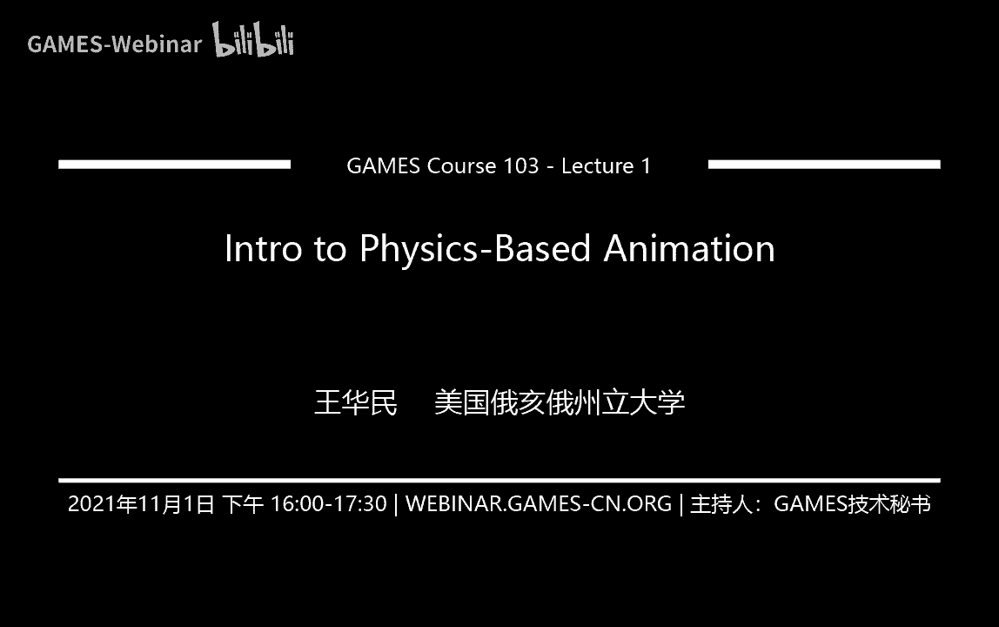

行吧，我们那个我们开始吧好吧，大家好啊，非常高兴，那个今天我们那个我们来开这个课，今天是这个课的第一天嗯，我们这个课的名字叫做基于物理的嗯，计算机动画入门呃。

从这个名字其实我觉得大家可以大概知道这个课是关于什么的，这个是关于物理模拟技术的，然后怎么样把物理模拟技术应用在这个呃计算机动画里面，所以说我们这个课呢呃主要就是讨论这些技术，怎么样利用这些技术。

然后因为这是一个嗯这是一个基础课，所以说我们主要是还是啊涉及到这些呃技术的一些基本的一些原理啊，基本的一些算法啊，然后呃我们也会有相应的作业去覆盖到这些知识，能够帮大家巩固到这些知识啊。

主要是这个目的啊，然后呃希望大家就是上了这个课之后啊，如果说对这个东西感兴趣，然后有进一步的想要提高的要求的话，以后也许我们也会开呃对应的高级课程，关于物理模拟算法的一些高级课程，然后我是我叫王华明。

然后这个是关于课程的一个邮件的地址啊，这个鼠标能看到吗，鼠标好像，啊可以看到这个是关于一个呃课程的一个邮件地址，如果说大家有一些关于课程上的问题的话，可以发送到这个邮箱啊，会有相应的同学啊。

或者是别的老师来解答啊，然后这个下面这个是games论坛的一个链接，一些我们的包括我们的一些回放啊，包括ppt啊，都是可以在这个上面找到的，然后我们的作业啊，之后的作业也会发布在这个网站上啊。

包括这个作业的一些内容啊，然后需要所需要用到的一些工具啊什么的，都是可以在这个上面找到的，呃然后我们开会的时间是每周一的四点到五点半，这个大家都知道了，呃，我是把时间设成一个半小时。

但是呃具体的时间可能会有有有有一些变动，比如说有的时候我们的内容比较多，可能会稍微长一点，有的时候我们内容相对少一点的话，我们可能会结束的稍微早一点，这个反正就是大概是一个半小时左右的时间，这个不一定。

然后我后面可能会留，比如说呃十几20分钟或者半个小时的时间来答疑，如果说大家有什么呃知识上的问题啊，或者有其他方面的呃，关于图形学的问题的话，嗯就是这个时间可以啊，通过弹幕的形式呃来问嗯。

然后还有一个我想说的是呃咱们这是个线上课啊，但是从第三周开始，也就是呃今天是第一周嘛，然后下一周是第二周，然后到下下周我们会有线下的课程嗯，然后到时候这个就会变成一个转播的形式。

相当于然后具体线下的地址，我是初步设想是会在林地科技的会议室呃，如果是在杭州的同学，尤其是浙大的同学会比较方便一点，因为那个地址就在浙江大学紫金港校区门口啊，门口步行大概几百米就到了，就非常近。

所以说如果是杭州本地的同学，或者是杭州周边的同学，如果感兴趣的话，可以来线下课，然后呃一个好处就是在于就是你在现场就可以直接问问题，然后直接回答你的问题，然后就是会比较方便一点。

或者是你课后有什么呃问题啊什么的都是可以呃来讨论的，这个会相对来说线下课会一直持续一直持续到结束吧，嗯从第三周一直持续到结束，因为我们总共是12周嘛，大概到过年前的前两周左右的时间，大概回到那个时间。

嗯然后我们作业包括一些课程上的一些答疑，然后包括作业的一些批改啊之类的，我们会有规定，我们会有ta来来辅助做这个事情啊，然后具体的联系方式，包括之后的呃怎么样操作的话，我想到时候会公布给大家。

到时候再看吧，好不好啊，然后关于上这个课，可能大家比较关心的就是因为今天是第一节嘛，然后呃大家可能比较关心的一点，就是我需要准备什么样的知识来上这个课，对不对，因为我看到很多同学都有这个问题，呃。

我个人是想把这个课的要求降到最低的，所以说呃你需要有一些基本的数学知识，比如说线性代数，还有微积分，然后还有一些基本的编程能力就够了，相对而言就够了，呃如果说你有其他的一些储备的知识呃更好。

我等会儿也会具体的讲到，但是基本上我会基本上把这个标准设定在这个呃一些基础知，基础的编程知识跟基础的数学知识这一块上，嗯然后下面这个是那个我们的微信群嘛，就是说如果大家还没有加的话。

就是可以扫这个二维码加一下这个微信群呃，加入这个微信群，然后到时候会有一些呃呃课程的关于课程的一些最新消息啊，然后包括如果说我们的日程上有些变动啊，呃也可以通过这个微信群了解，嗯然后我想稍微呃说一下。

就是哦对了，就是我们今天要干什么，这个事情可能会比较重要一点啊，我今天因为我们是第一节课，所以说我想主要是做两个事情啊，第一个事情是嗯跟大家讲，就是说我们这个课是一个什么样的课，是干什么的。

我们要学什么样的东西呃，然后设计什么样的内容，然后作业大概是个什么样子的，就会把一些关于这个课程的东西呃，关于知识的东西给覆盖到大家呃，然后呃第二点就是嗯就是关于这个课程的机制了。

就比如说我们需要阅读哪些东西啊，然后需要哪些预备知识啊，然后需要啊作业是个什么样子的，然后课程的这个大概的规划是个什么样子的，所以说这是两部分内容嗯，关于数学的东西，我等会儿会呃稍微讲一下好吗。

然后因为这是个基础课程嘛，然后我当时设计这个课程，主要也是根据我之前在以前呃，之前在学校里教书的时候，我们那个时候也有一个相对应的类似的课程，主要是面对大三大四的同学的呃。

然后基本上是假设这个大三大四的同学，他之前没有上过图形学，对图形学可能没有什么了解嗯，然后呢他作为这个把这个课作为一个呃图形学的第一节课嘛，就是呃作为一个呃一开始入门的一个机会。

所以说我基本上在课程的设置的难度上，也是包括这个预备的知识上，也是这个也是这么一个标准吧，就是设计为这个这个标准，当然如果说研究生，如果研一研二的同学，如果说大家对物理模拟比较感兴趣。

呃想要呃学习这个方面的话，也可以也可以上这个课，基本的难度设置是这样子的啊，然后线性代数这一块呢，因为嗯图形学里面用的是比较多的啊，所以说呃这一块肯定是少不了的啊，包括微积分也是新型代数。

主要是呃矢量矩阵，然后线性系统，然后比如说一些呃特征值分解啊，这些基本概念你要有对吧，你可能不会手工的去做做s v d，但是你可能需要了解s v d是个什么样的事情啊。

然后包括其他的一些呃关于线性代数的一些概念呃，然后微积分的话，你可能呃你需要了解一下，就比如说基本的求导应该怎么求，对不对，然后求导的时候有个链式法则，我不知道大家知不知大家还记不记得。

就是当你求导你有好多个函数，然后这个函数又是另一个函数的函数的函数的时候，那么你会有一些链式法则来呃，帮助你求导，就类似的就是你你需要大概懂得这些呃求导啊，积分啊这些概念啊，包括怎么样啊。

手工的做一些简单的计算这一块我希望大家是有一些了解的啊，然后包括呃微积分里面嗯包括梯度啊，然后包括呃泰勒展开啊，这些东西最好也是稍微有一些了解吧，概念上的一些了解，然后编程的话。

因为我我个人觉得就是咱们学一门计算机的课，就是如果说不做作业，这个就是毫无意义的事情，对不对，就是你你就其实就只是听听而已，你没有办法很深入的去掌握这个东西，所以说我们会有我们的作业是编程作业。

然后会有c啊，然后这个我们会用unity来做这个作业，因为unity的脚本里面本身是用c sharp的，所以说我们会呃，就如果说大家呃会c或者c加加或者c sharp或者是java呃，其实都很接近嘛啊。

都是可以拿来都是可以拿来呃写这个代码的就是会会比较接近，所以说因为像我比如说我自己，我之前没有接触过c sharp，但是我会c会c加加，然后我用这个写这个脚本是完全没有问题的好吧。

然后有同学问就说会介绍当今游戏引擎基于物理的动画吗，呃我们不会具体的介绍这个游戏引擎呃，里面用到的呃这个物理引擎，但是我们会介绍他这个物理引擎所用的算法。

就比如说我们现在物理引擎里面很多时候用到一个算法叫做p p t嘛，position based dynamics，我们也会介绍一下这个呃算法，然后跟这个它的优缺点，还有跟其他一些类似算法的一些比较。

我们会涉及到这一块，对javascript，嗯然后还有一点就是说呃希望大家能够就是呃就是呃主动的去学习，因为我觉得这个也是挺重要的，就是呃很多时候哦课程能够涵盖的东西，它毕竟只是一个子集。

呃如果说你要很深入的去理解很多东西的话，你肯定是需要课后去阅读啊，然后课后去呃去呃做更多的呃实验，做更多的操作的，这个呃也希望大家有一个能够自学的精神，我觉得这个也是蛮重要的。

啊然后这里我没有谈到一些比较复杂的一些物理啊，数学啊这方面的东西嘛，啊但是我们会涉及到这个包括了，就比如包括一些数值算法啊，数值线性代数啊，数值偏微分方程啊，有限元分析啊，流体力学啊等等等等。

其实我觉得嗯很多同学我估计之前可能就会问，会觉得好像呃如果要做物理模拟的话，会需要懂到这些，我觉得肯定是需要会懂到这些的，但是呢如果说你之前没有具备这样的知识呃，也不要紧。

因为我们本身的课程也就是帮大家去学习这方面的知识，我们也会有一些呃内容就是覆盖到这些数学的一些计算的方法呃，然后呃覆盖到一些流体力学的知识啊，涵盖到这些知识。

然后我们会学习怎么样利用这些东西去呃去做这个动画的开发，所以说呃如果大家会这样更好，但是如果说不会这些很高级的这些物理啊，数学的概念啊，也没有关系，我们也会具体的提到嗯，ue还是用unity嗯。

因为是这样子的，就是我们的作业它不是凭空让你做的作业，我们的作业是我会给你一个小呆，我会给你一个小demo，然后你要根据这个小demo去再写脚本，然后再去扩展。

然后我们本身的那个原始的这个代码是用unity写的嘛，这个场景也是用unity写的，所以说你如果说你自己有能力，能够花时间把它移植到unreal上也可以，但是这个这个工作量可能就会比较大一点。

如果说unity的话，就是你只需要完成一个代码的，就是脚本的一个编写工作就就可以了，unity版本unity版本没有什么太大的要求，就是嗯只要不是很老的版本都可以。

因为我自己的像我我像我自己作业里面的一些那个呃一些代码，其实也是用老版本写的嘛，然后也是可以完全运行，也是可以运行，也没有问题的，所以说版本的要求不是很很那个很严格嗯，games 101是吗。

games 101其实并不是特别需要，就是呃你最好是要稍微懂一些简单的一些嗯简单的一些图形学概念吧，比如说你比如说学旋转啊，做一些简单的一些transformation，我觉我觉我觉得这些可能是需要的。

然后需要有一些简单的，比如说渲染是大概是一个怎么回事儿，你可能需要了解一下，但是如果说很复杂的一些图形学的知识，你是其实是不需要的，是没有关系的，嗯其他的呃其实是这样子的，就是你没有接触过unity。

完全没有问题，为什么为什么我用unity的原因，就是因为unity上手它其实很容易，我我我觉得如果说你花两天时间啊，可能两天都不用花一天时间把一些简单的一些教程看一下就可以了。

这个unit可以上手是相对比较容易的，我们以前上课就是最早最早之前没有unity之前最早上的是用open gl，我不知道大家有没有听说过，如果用open gl的话，上手起来就会难一点。

就会需要花更多的时间去学习这个open gl的机制啊，这些东西有了unity之后的话，上手就会相对来说容易很多了，嗯然后作业的那个呃作业对显卡的要求其实很低，没有什么显卡的要求。

大部分计算都是基于cpu的，没有什么gpu的要求，呃然后这个例子我们的呃做的这些例子，做的这些demo也是比较简单的，例子，不会说用呃很复杂很复杂，比如说上几10万几百万个点的模型。

所以说呃对硬件的要求相对来说是比较低的，大家不用这点是不用担心的好吗，然后unity交作业，到时候我们讲作业的时候会会跟大家具体讲就是怎么用unity交作业，这个反正到时候看公告吧好吗。

还有还有没有什么别的问题吗，对渲染不用管，因为unity本身就有一个渲染引擎嘛，你直接拿去直接用unity自带的那个就可以了，我们不会讲m p m，因为m p m它是一个比较小众的hybrid算法。

我们这个主要还是介绍基础的比较大众的一些算法为主，而且m p m其实是呃两种方法或者是好几种方法的混合体吧，我们会把这些基本的算法告诉大家，然后你知道了这些基础算法之后，你再去看pm。

相对来说就会容易很多了，嗯既然大家问这么多，我干脆给大家看这一页好了，就是我们大概的一个schedule，呃，我们总共是12周吗，卡住了吗，等一下啊喂，哎好了，现在好了吗。

m p m p m它其实是一个混合的方法，它不是一个方法，它其实是把几个方法合在一起嗯，好了是吧，mp m它其实是几个方法合在一起，就就是它本质上它就是把粒子法跟网格法合在一起嘛。

然后我们这个课会涉及到粒子法，也会涉及到网格法，所以说如果说如果说你懂了例子法，也懂了网格法之后，你就会呃你再去自己去，如果说以后我们高级课程或者是其他课程，你去学习m p m相对来说就会容易很多。

我们这个课主要还是涵盖的是一个呃一些基础算法啊，然后这里给大家看一下这个我们大概的一个schedule吧，然后今天是第一天嘛，就是我们会是一个呃简介介绍的形式，然后下一周我们会呃主要讨论一下数学。

因为数学挺重要的，呃我们会把一些数学的基本的一些呃需要的一些呃嗯一些概念啊，会给大家呃，然后也会给大家举一些例子，就比如说我怎么去计算四面体，怎么去计算这个投影等等等等，我们会做一些计算。

然后包括vector calculus，这个我觉得大家可能有听说过吧，嗯但是我们也会有例子给大家，比如说一个弹簧，你怎么样去算这个弹簧的能量呃，所推导出来的一些嗯一些举证啊。

stiffness matrix啊之类的，就是我们会用一些比较简单的例子，然后给大家看数学是怎么应用在这个图形学里面的，一些具体问题上的啊，然后这个是第二天，然后第三周也就是我们线下课开始呢。

我们会首先花两周的时间来讨论钢铁啊，包括呃缸体的动力学和缸体的接触，也就是缸体的碰撞，缸体的摩擦这些我们会呃在第三周和第四周来讨论，然后这个完了之后呢，我们就会有第一次作业，第一次作业就是关于缸体的。

我们会用刚体做一个作业嗯，然后嗯然后之后是呃第五周，第六周，还有第七周，我们会有三周的时间来啊，来讨论这个衣服的模拟，然后我们会用衣服的模拟。

同时引入这个p p t projective dynamics，还有concert dynamics这一块呃，然后把这个把衣服这一块给大家吃透啊，然后同样我们还会有作业，就是基于p p t。

还有基于这个弹簧系统的一个作业来做，然后之后呢我们会讨论soft body dynamics，我们会讲弹性体啊，然后也会讲有限元，然后针对这些soft body dynamics啊，这些我们也会有作业。

就是给大家一个比较简单的一个小作业吧，就是呃有一个小的一个小的软体，然后在地上弹弹弹这样的一个做一个这么样的一个效果，嗯然后呢之后呢第10 11 12呢我们会讲流体，我们会讲表面波，然后会讲网格法。

就是说呃不可压的流体动力学，never execution，我们怎么样用网格法去解这个东西，然后呢我们会讲例子法，就是怎么样用particle base的方法，然后去解流体。

这个是个大概的一个啊一个过程，然后总共是四次作业啊，四次作业是呃就是每个作业是针对一个呃，相当于一个方向吧，呃然后我觉得这个物理模拟里面它有一个特别大的好处。

就是在于它每一个方向其实都是相对比较独立的啊，它不像可能有的学科或者是尤其是数学，就是可能你第一天听不懂，那么后面就完全就更听不懂了，就是前后是有关系的。

我们这个基本上每每天讲的内容基本上是一个独立的章节，比如说你钢铁诶，你刚体没学好，或者是钢铁，你没来得及听课啊，没有关系，我们后面会讲弹性体的时候，你还是可以继续跟得上的。

你不用担心说前面的miss掉了之后，后面就没有办法跟上了，这个我觉得是呃一个好处，嗯，如果说大家可能因为某些原因，就是有些课miss掉的话，不用担心，反正后面可以补上，然后后面的课也是可以继续听下去的。

这个都没有问题，然后还有就是作业这一块，我想大概跟大家讲一下作业是个什么样的形式，呃，我们的作业大概会有两个部分构成，一个是一个呃基本的任务，就基本作业，然后还有一个是一个高级作业，是一个精英的任务呃。

然后呃基本的作业就是主要是为了帮助大家能够满足一个，就是温故而知新的一个作用嘛，就是上完这个课之后，然后顺带着你把这个基本作业做了，可能不会花你太多时间，但是可以帮助你巩固我们刚刚学到的一些知识。

然后高级作业呢这个精英任务呢就是如果说你有更多的时间，你愿意花更多的时间呃，包括去读一些呃课后的一些教材和课后的一些辅导材料的话，然后你可以做个高级任务呃，然后我们是这样规定的，就是设计的。

就是如果说你四字作业都能够呃按时同时也是呃正确的完成的话，包括普通的任务，抛过的精英任务都可以完成的话，我们也会有一份呃呃礼品送给大家，就是根据大家一个完成情况，我们也会有小奖品给大家。

在课后最后结束的时候，但是这个这个礼品我们暂时还没有设计好，就是什么样的礼品，我我是我是在想，就是这个礼品有可能会根据有多少人能够完成这个作业来来设计吧，就如果到时候完成的人比较少。

那么我们礼品就会呃更好一点，如果说完成的人更多，那么我们礼品相对来说就会少一点，这个反正到时候根据大家到时候实际的完成情况来制定好吗，然后，哦然后还有一点就是没有这个咱们这个是没有考试的。

这个跟正常的上课不一样啊，以前如果说没有考试啊，同学们都高兴死了，但是因为咱们这个也没有办法考试嘛，对吧，咱们也不能给大家评分，所以说就没有考试，就没有去考试这一说了，嗯然后刚才有同学问到就是教材。

这个我们其实是没有这个呃没有教材的啊，因为教材读教材还是挺花时间的，呃，我希望大家能够把更多的时间花在读一些课外的一些选读的，一些文献上，我们到时候每节课都会有附带的一些选读的内容。

就是如果大家有时间有余力的话，可以去选读那些内容，嗯这个可以帮助你就是帮助你掌握就是我们课上miss掉的一些东西吗，嗯然后如果说你选读的话，还有一点我比较建议的就是你不需要去把整篇。

比如说是一篇论文或者是一个教材，教材的某一章对吧，我不希望大家就是把时间花在从头到尾去读这个东西上，尤其是相对于年份比较老的paper，他因为年份比较老，所以说它里面可能有一些内容它已经过时了。

那你当当你去读这个论文，读这个文献的时候呢，你需要把你的重点，把你的时间花在就是跟我们课程相关的那部分上就够了，然后至于说那些比较弱呃，比较过时的东西呢，可以粗粗的略过，或者是就是完全完全忽略。

也都没有关系，重点就是你把跟我们课程相关的，就是嗯跟这个技术相关的东西把它给读出来，这个我觉得就够了。

嗯然后这个是unity的主页，这个我想嗯大家可能都知道吧，就是如果没有知道，如果还没有去的同学可以，大家可以先呃去unity把这个把他们的这个下下来，嗯这个对于学生版本，对个人版本应该是免费的啊。

版本是没有关系的，嗯然后这个是unity的论坛，嗯，因为那些论坛的话就是如果说有一些具体的涉及到unity，怎么样使用unity的问题的话，呃比较通用的问题的话，可以在这个论坛上面得到一些解答。

嗯对这个版本没有关系，就是mac也可以，然后windows也可以，然后可能没有什么同学在linux上跑吧，linux上我记得好像会有一些问题，好像他们没有支持linux。

但是mac和mac跟windows都是没有关系的，因为我自己用的也是mac，个人版可以的，个人版学生版都是可以的，都是一样的。

啊然后还有一点我觉得需要强调的就是，我们用unity主要是呃用它作为一个学习的工具，我们本身并不是学怎么用unity，这个我觉得还是有点区分的，所以说呃我希望大家就是更多的时间是花在就是写脚本。

然后呃去阅读这些呃知识，然后就是掌握这些知识上，然后尽量的我们跟unity纯引擎相关的东西，我们相对来说会少一点呃包括比如说unity，它自身也有物理引擎嘛。

但是我们大部分时间都是不会使用它这个物理引擎的，我们其实我们写的脚本其实就是替代了他这个原有的物理引擎，好吧，嗯然后我觉得呃上这个课需要需要做什么事情呢，怎么样才可以成功呢。

嗯我觉得首先就是说呃要有一些准备吧，就是这些包括一些基础知识啊，数学啊啊物理啊这些基础知识，包括编程嗯，基础知识需要有一些准备呃，然后对unity要稍微有一些呃基本的要了解。

如果说你之前没有用过unity的话，可以先把unity下下来，然后可以先尝试着先使用一下，然后看看这个大概unity的操作是什么样子的，然后就是上课嘛，就是参加我们的呃，每周的这个线上课。

线上或者线下课，或者是如果说大家时间上比较冲突的话，可以去看这个replay，嗯然后如果说有时间的话，有时间有余力的话，就是可以把这个选读的这些文献啊啊去阅读一下，然后做作业啊，然后我刚才也讲到了。

就是我们对显卡的要求是比较低的，如果只是一个笔记本的话，就只能你只要只要你的笔记本不是特别特别旧啊，比如说10年旧的那种笔记本的话，大部分情况下都是没有什么太大的问题的，嗯然后我觉得呃不管学习。

不管学习什么样的东西吧，图形学也好，然后其他的领域也好啊，我觉得最重要的一点就是多读多写，多想，这个我觉得这个都是没有差别的，你读读得多，你才能够掌握更多的知识，你写的多。

你才能够对这个东西掌握的更深入啊，然后在这两者基础上，然后你要多想，然后就是可以帮助你对这个知识的理解能够进一步的升华，所以说我觉得希望大家就是在通过这个课能够啊能够对物理模拟引擎，物理模拟。

物理模拟算法，计算机的这个动画，它有一个呃比较呃基础的了解，然后呢呃未来如果说大家对这个东西感兴趣的话，我也是特别欢迎的，就是我们以后也会考虑开高级的课程，好吧，有什么问题吗。

我想在我这个接下来讨论下一个议题之前，我想听一下大家有没有什么问题，关于课程机制上有没有什么问题，没有的话，我们就继续往下走了，然后我然后行，然后我接下来就会呃，重点就是来说说四个事情啊。

然后第一个是第一个是什么是图形学，因为呃是不是是不是有同学可能之前没有上过图形学课程有吗，就是这个是完全是第一次图形学的课程，对是的，就是四个作业跟高级作业都完成的话，就可以拿到礼品。

就是所有的所有的内容都可以完成，就可以拿到礼品，就是我会我会想跟大家讲一讲，就是首先什么是图形学，然后图形学是拿来干嘛的对吧，他这个大概是一个什么样的作用，然后，然后然后我接下来会讲。

就说我们呃物理基于物理的动画又是一个什么样的东西，它在这个图形学里面是一个什么样的作用，然后最后呢我会讲一下，就是我们这个课，我们这个课会有哪些讨论，哪些东西会涵盖哪些内容，就主要是四个四个方面。

首先我们来讲一下，什么是图形学好吗。

就首先图形学你可以简单的认为就是说呃怎么样从3d的世界，怎么样构造一个3d的虚拟世界，然后把这个3d的虚拟世界呈现给大家，通过2d的形式来呈现给大家，所以说这个图形学就涉及到很多关于3d虚拟世界的东西。

比如说怎么样去构造这个虚拟世界，怎么样去运行这个3d的虚拟世界，然后怎么样渲染，怎么样把这个3d的世界转化成2d嗯，有的同学可能会把这个图形学跟计算机视觉混淆在一起，或者是理不清他们的关系。

其实你可以把计算机视觉跟图形学认为是两个完全相反的方向，图形学呢是从3d到2d对吧，是从3d的虚拟世界到2d的图像，而计算机视觉呢是给你2d的图像，给你影像，你怎么样去理解这个影像中的3d视角。

所以说他可以认为是这个反方向的一个操作，我们图形学有的时候嗯会用到一些呃vision所需要的东西，比如说我们想要构造3d虚拟世界的时候，我们可以从呃真实的影像出发，我们去做三维重建这些东西。

这就是为什么有的时候呃大家看一些呃计算机图形学，包括计算机视觉的论文，大家会发现有相当一部分的重复的原因是，因为大家都是围绕着这个3d跟2d之间的关系所做文章的。

但是大家我希望大家能够比较深刻的理解到它，其实这两个东西刚好是一个相反的关系，一个是3d到2d。

一个是怎么样从2d回到3d，然后呢图形学呢它大概有呃有三个方向吧，这个比较呃比较典型的方向，一个是几何几何，就是关于怎么样构造这个3d的世界的，然后渲染渲染是怎么样呈现这个3d世界的。

因为我光是有个3d世界不行对吧，我必须要显示这个3d世界，那我们今天大部分的显示设备都是基于2d的图片的形式的，基于像素的形式的，所以说我怎么样把这个3d转化成2d，这是渲染，然后呢最后呢是动画。

动画呢就是说我怎么样去把这个3d的世界运行起来，因为我不希望是一个静态的世界，真实的世界是物体都是有运动的，所以说我也希望在这个3d世界里面，我也有运动，我也把这个世界运动起来吧。

然后这里面呢我我我用了bunny这个例子，因为在图形学里面，这个bunny是一个比较知名的一个例子，大家一般来说都喜欢用用它来做这个demo吧，然后叫做stanford bunny，然后我就想跟大家。

讨论一下就是大概图形学的一个pipeline是一个什么样子的，图形学，大概是一个什么样的一个流程对吧，那么刚才我们讲到了有几何，动画渲染三个部分，那么几何首先是第一位的。

就是我需要构造这个3d的虚拟世界，我需要创造这个3d的虚拟世界，我需要把这个虚拟世界给制造出来，呃然后第二点呢是动画，就是嗯我怎么样去运行这个3d虚拟世界，比如说我这个虚拟世界里面有一些物体对吧。

有些圆柱，有些呃笑脸，然后呢在这个虚拟世界里面呢，我可以做动画，我可以让这个虚拟世界运行起来，然后最后呢是渲染，渲染呢就是把3d的虚拟世界转化为2d的图片啊。

嗯然后最后呢我把这些图片转化成呃发送到我的显示设备里面，然后通过这个显示设备给展示出来，这是一个理想情况下的一个实时的啊实时的一个图形学的一个管线，就是从几何到动画到渲染，最后到啊显示那么几何。

它实际上一般来说不需要实时，为什么，因为呃构造这个3d虚拟世界，我完全可以离线的操作嘛，我可以通过一些辅助工具，我可以通过比如说甚至计算机视觉的一些算法，我可以离线的去创造这个3d世界出来。

这个都没有关系，这个可以离线的操作，但是动画跟渲染它必须是实时的，因为如果说你这个虚拟世界他需要跟用户有交互对吧，我需要能够比如说用户做一些操作，玩家像一个游戏里面一个玩家做一些操作。

我需要这些玩家的操作能够对我这个虚拟世界产生影响，那么我的动画跟我的渲染就必须是实时的，必须能够让用户或者是玩家，他能够马上看到他这些操作所带来的效果，这是一个理想的情况，但是有的时候呢好哦。

这里的话其实有个概念就叫帧率嘛，就是我想大家可能知道就是说呃显示设备以多快的速度去呃，去展示这些呃渲染出来的针，这个叫做帧率frame rate，然后比较典型的帧率有24帧，30帧，60帧嗯。

大家知不知道电影一般来说是传统的电影，一般来说是帧率是多少，有知道的吗，24对对对，是的嗯，是24帧，而游戏时一般来说是多少帧，你知道吗，游戏，其实都有，其实30帧的也有，60帧的也有。

它这个区别主要是在于什么区别，其实主要在于交互，因为游戏它是强交互的一个应用，如果说玩家比如说做出了一些做出了一些操作啊，你是希望这个玩家的操作能够很快的在这个游戏里面体现的话。

那么你的帧率就要相对来说高一点，尤其是一些比较竞技类的游戏，它的帧率也比如说160帧，相对来说比较高一点，而电影呢它其实没有交互对吧，电影没有交互的话，那你一般来说它的几率要求就会就比较低一点。

24折其实就对于我们的肉眼，基本上就是可以看不出它这个不连续的这个效果来说嗯，然后30帧的其实也有，但是其实如果说是交互性比较强一点的话，有交互性比较强烈的游戏来说，它其实会有一些延迟。

会有一些卡顿的嗯，然后我们图形学里面一般来说标准的标准的帧率是30帧每秒，这个反正就是给大家一个基本概念嘛，就是说你的帧率其实交互会有关系，然后会跟用户的体验也会有一个关系。

嗯然后刚才我们讲的就是实时吗，实时的动画，实时的渲染，但事实上呢这个嗯这个实时的动画实时渲染，它其实是很相对来说是比较难的，为什么，因为我们的计算量，我们的硬件它的计算能力是有限的。

如果说你想要做一个非常真实的逼真的效果的话对吧，那么可能你的这个你的硬件就没有办法支撑这样的这个计算量了，那么这种情况下怎么办呢，也不是说图形学它就没有相对应的应用了，它也是有的。

只不过呢它的应用就会比较窄一点，比如说我可以把动画作为一个离线的部分，但是我把渲染作为一个实时的部分，换句话说我就不需要做这个，我不需要实时的去模拟动画，我不需要做交互，我可以把动画事先给录下来。

然后呢我就回放，然后我就把这个渲染的效果展现给大家，实时的展现给大家就够了，那么这个一般来说在一些过场动画里面，尤其是游戏里面的一些过场动画，它会比较常见一点，因为这个过场动画它不需要交互嘛。

他就是可以完全就是做一个渲染的展示，还有一些比如说在一些最近一些呃电子嗯，电商的一些商品的一些网上的展示啊，有很多也是采用这样的形式，就只做渲染啊，只做渲染的事实，而不做动画的事实。

这是一种比较常见的一种方式，然后我们甚至可以搞得更极端一点，就是完全做成一个数字电影啊，如果是做成一个电影的话，那么从几何到动画到渲染就全部都是离线的方式了，我就可以离线的把这些渲染效果啊。

动画效果给它生成好，然后呢我把它录制到这个电影里面，然后我就做一个回放就可以了，这个就是嗯电影跟一些实时的嗯图形学应用的一些差别呃，因为电影它不需要实时，它不需要实时交互嘛。

所以说他们一般来说采用了这个模拟也好，动画也好，渲染也好，他们的计算量相对来说都是可以大一点对吧，它可以花好几周甚至好几个月的时间去做渲染，去做模拟，这都没有关系，那么接下来我想跟大家就是来讲一下。

就是咱们刚才讲的这三个方向嘛，几何动画跟渲染对吧，我们分别他们里面大概是有些什么样的内容，然后有哪些问题呃，首先第一个就是几何几何呢，它其实就是关于怎么样去描述这个3d世界。

那么怎么样去描述这个3d世界，它通常有三种表达方式，第一种表达方式呢是网格叫match，嗯就是这里大家可以看到有个兔子对吧，然后这个兔子我是通过一些三角形来描述它，这个他这个兔子的表面的这个mesh呢。

它有哪些部分构成的，它由两部分构成，一个是顶点，就是我们这些呃覆盖在这个兔子身上的这些顶点，然后第二个部分呢是由这些多边形元素或者是多面体元素所构成的，比较常见的呢一般就是三角形相对来说会比较常见一点。

嗯多边形呢比如说四面体呢在一些cad设计软件里面，比如说玛雅用的会比较多一点，因为它比较符合大众的设计习惯，然后如果说嗯大家如果以后我们未来接下来做这个软体，包括这个弹性体的一些模拟的时候呢。

我们会用到四面体的网格，在这种情况下呢，我们的元素就是四面体，就是取决于你的内容是什么，三角形可以认为是整个图形学的基础，包括我们整个图形学的硬件，包括gpu显卡，整个都是基于这个三角形的框架的。

三角形的渲染框架的这个如果大家对硬件有一些了解的话，可能都知道就是三角形，它是一个比较基础的一个元素啊，然后关于这个mesh相关的一些问题呢，其实有很多，因为我们match是一个很基础的一个表达方式嘛。

那么我们怎么样去构造这个match对吧，怎样构造这个mesh，能够让这个match 3角形它比较有比较好的质量，嗯就是说我们不希望出现很窄的三角形，很细的三角形。

我们希望大部分三角形都是看起来都比较正对吧，都是接近于60度的这种正三角形，那么这种就叫mansion，怎么样去调整这个三角形网格，能够让这个三角形看起来比较嗯正一点，然后呢呃关于三角形网格呢。

还有就是说怎么样做简化对，因为有的时候我们的硬件没有办法支持很多很多三角形，我们希望我们可以减少三角形的数量，我们减少三角形的数量，我们又不希望把这个这个这个mesh的形状发生很大的改变。

那么我们就需要做简化，然后我们可以做细分，就是我们怎么样去增加三角形啊，然后我们怎么可以对麦，怎么样对max做优化对吧，可以做平滑，可以计算这个mac上面的这些flow等等等等等等。

然后还有一个比较其实比较有挑战性的，就是怎么样处理volume mesh，所谓的volume mesh就是类似四面体网格这样的mesh网格，其实比三角形网格相对而言，它这个处理起来的难度会大非常多。

嗯这个反正这个也是一个很大的一个难点吧，这个我想大家有可能知道，有可能不知道啊，但是总的来说volumesh相对来说处理起来会比较难啊，这个也是为什么做四面体网格，做有限元分析。

包括有限元分析的是一个呃一个难点，嗯然后这个就是mesh，然后这是两种比较常见的类型，麦是类型啊，一种叫做structured mesh，就是它这个mesh它是有一定的规律性的。

比如说它是一个方方正正的格子，当然不见得一定是一个横平竖直的格子，它有可能是六边形，基于六边形搞出来的mac，或者是基于某些特殊的这个呃，比如说足球的形状啊，对于一个球形来说。

它可以做一些特殊的分解等等等等，总之就是说你这个mac是有一定的规律的，这是一种mesh，然后第二种mesh是unstructured mesh，就是它是没有什么规律的，它是一个比较乱七八糟的mesh。

你可以这么认为，然后相对应的四面体就是volume，上面我也可以有structured，volume mesh跟unstructured volume mesh两种。

在右边大家可以看到下面的部分是structured，然后上面的部分是unstructured对吧，然后我为什么要提这个东西呢。

是因为对于structured跟unstructured mesh其实会有不同的计算方式，因为structure mesh它有一个很大的特点，就是它有structure，那么有一些模拟算法。

有一些几何算法，它就可以利用这个structure做一些文章，他可以做一些简化，可以做一些优化等等等等，然后我们这个课啊看看情况吧，就是有可能会提到一些就是structure的呃。

对针对structure做一些简化优化的一些东西，然后当然on structure它最大的好处就是它比较通用，它没有什么结构上的要求嘛，所以说它它通用性会更强一点，然后呃第二种表达方式是点云。

就是很多点，说白了就是很多点，那么点云这个表达方式它最大的好处是什么，就是这个好处就是特别简单，因为你不需要考虑那些三角形，不需要考虑这些三角形的连通关系，你只需要通过一大堆点来描述这个物体就行了。

然后呢通常呢这个点云呢是有，比如说我做一些三维扫描，3d扫描仪，它通常的原始数据它就是一大堆点云，它通常是一个原始数据，那么针对点云呢会也会有相对应的问题。

比如说我怎么样从这个点云里面去构造这个match对吧，因为直接给点云，我是没有办法渲染的，没有办法用硬件做渲染的，我怎么样把这个点云构造match出来，然后利用这个比如说来做渲染，这个是一个问题。

然后给了点云，我怎么样去采样对吧，可能有的地方输，有的地方密，我怎么样重新的对点云进行采样，能够让它的这个呃稀疏程度都一致，这也是个问题，然后给了点云，你怎么样去找它的近邻，怎么样给一个点。

你怎么知道周围有哪些点等等等等，在很多算法里面，这个都是要用到，都需要用到，这个是相对于点云所很多问题，然后第三种表达方式也是最后一种表达方式呢，就是grade是一个grade。

然后什么是一个grade，这个grade呢其实本质上就是你可以把它认为是一个三维的一个格子，然后他把这个三维的格子呢，他就把这个空间呢划分成很多小方块，小格子对吧小块，然后每一个块一个sell。

他就储存了一定的物理定义物理量，然后这是一个格子的表达方式，然后这种格子的表达方式呢比较常见的是什么，就是很多医学，还有很多科学实验，他出来的原始数据就是往这种格子式的，比如说我们做c t，比如说做呃。

做这个大气的一些流体模拟，他们很多数据原始数据就是基于这种格子来做的，然后呢他有什么问题呢，有一个问题就是它的内存，内存的消耗会很大，因为如果说你要一个三维空间，然后你要把这个三维空间划分得非常细的话。

你需要大量的内存对吧，那么有一些解决方案，比如说我可以用一些octra之类的方式来减少内存，但是总的来说呃内存是一个问题，然后其次又是怎么样去渲染一种方式呢，我可以转化成mesh，然后还有一种方式呢。

就是我可以直接对于这个volume的这个grade，我可以做渲染，叫volumetric grade，这其实也是图形学里面的一个研究的一个课题，然后当然还根据grade。

它会有一些其他一些各种各样延伸的问题，我们的话也会谈到就是跟动画相关的问题，然后这个就是几何这一块了啊，然后我们说完几何，我们接下来说一下渲染，然后渲染呢它其实分成两个大的内容。

就一个叫做nphotorealistic rendering，就是非真实感渲染，还有一种就是photo realistic rendering，就是真实感的渲染。

大家可能比较熟知的是photo realistic granny对吧，那为什么，因为nphoto realistic gry这个领域相对来说最近几年啊，衰败的特别的厉害。

就是研究的这个nphotoise ring的人也特别的少，大部分虽然领域研究的主要是photo release ruling为主吧。

但是也不能说nphoto release rendering它就没有用了，其实大家可以看到有很多呃，包括游戏也好，包括有一些设计软件也好，绘画软件也好。

它其实有很多运用到这些nphoto ristic rendering的技术，当然我们这个课不是关于渲染的，我们这个就不具体展开了，然后photo irendering呢它主要有两个两种类型。

一种类型呢是基于光线追踪的，然后另一种类型是基于传统的渲染管线的，这个我想大家知道吗，这个这个不知道也没关系，反正我们这课也不是关于渲染的，反正就是可以给大家看一下，就是呃一个对比的效果啊。

这个是用nvidia的rtx做的一个效果，左边呢是没有开rtx的，然后右边是开了rtx的，也就是右边就是做了光线追踪的，大家可以看到就是做了光线追踪之后，就是可以产生更好的这些折射反射的效果啊。

然后渲染里面其实有一块我我个人觉得挺重要的，但是呃研究的相对来说比较少的，就是怎么样去做材质的获取，因为你光是有渲染引擎是没有用的，你还需要有材质啊，对不对，怎么样让你这个你要去扫描材质。

怎么样把这个做出来的效果能够跟真实的一模一样，这个其实是一个蛮大的挑战，这个比如说你看别人搞的一个扫描仪，然后他扫扫描的皮革效果，做出来的一个呃渲染效果。

然后呃关于扫描其实还有一个很重要的就是怎么样去扫描人，因为人它不是一个平面，你没有办法把它当做一个平面的一个材质，这样去扫描对吧，人体它是一个有曲面的皮肤，它是一个曲面上的一个物体。

那么后来嗯就是图形学，尤其是电影领域，他就搞了这种技术，叫做next stage，就是他把一个房间里面，他布满各种各样的灯光，还有各种各样的摄像头啊，然后利用这些灯光不同，还有摄像头不同的位置。

它可以捕捉人体在不同的角度，在不同的照明的情况下的这个效果，然后把把这个人的这个整个的渲染效果给它捕捉出来，然后这个是其实是一个蛮大的挑战，b2 df就其实其实最大的问题就是你怎么样构造b2 df。

而且对于人体来说，其实有一个很大的挑战，就是人体皮肤它不是比2d f，它是比s2 df，好像这么叫吧，就是它会有光打到皮肤上之后，它的光会进去，然后他会从另外的地方出来。

它不是一个简单的在表面做一个反射的一个模型，如果说大家学过，如果说大家上过一个高级的渲染，比如说关于那个叫什么呃，就是半透明材质的话，可能会可能会了解这方面的东西，就这就是为什么人体人体的渲染会特别难。

特别有挑战性，而且人其实对人自身它是很了解的对吧，如果说你看到这个人，他渲染得特别不像，你会第一时间他算出来，但是有很多东西你可能对他没有那么敏感，相对来说你就没有办法嗯。

相对来说你的容忍程度就会高一点，我举个例子嘛，就比如说大家看人就认人会相对来说比较容易对吧，张三李四王五，你一看他的脸，你可能就认出来了，但是你看比如说猫猫狗狗，它有很多他长得特别一样。

你就没有办法判断出来，为什么你没有从没有每天都去观察这些猫狗，就一个道理，就是人对这个自身比较了解的东西，他会比较能够辨识出真假，但是对于相对来说没有那么了解的东西，它的容忍度就会高一点。

然后接下来是接下来是动画，然后动画呢，分为两类，一类是人体动画，基于人体的动画叫做character animation，然后另一类呢是物理动画，叫做physics based animation。

基于物理的动画，我们这个课程呢主要就是后期了，就是主要是关于怎么样利用物理去求解，然后把这个动画效果给它做出来的，当然在现实的这个嗯图形学的应用里面，人整体跟物理它是不分家的。

因为很多我们人穿衣服嘛对吧，然后人要跟整个环境有交互嘛，所以说你既需要有人的动画，要有物理的动画，这就是为什么这两者都会相对来说比较重要的原因，接下来我给大家看一个ue在前几年发布的一个虚拟人的一个呃。

一个效果吧，有声音吗，it ban international team of op wanted to challenge，our ideas of what a synthetic human。

could be，i've got state of the art，real time graphics and an unprecedented level of detail in my eyes skin and hair right。

but more than just a collection of fancy pixels，actually being driven by a real human actress and her dynamic motion。

capture through unreal engine，what you waiting for commeet me，the vicon booth and see yourself。

这就是一个给大家看了一个虚拟数字人的一个效果，然后从中你可以看到就是它既有人体的模拟人体的动画，它同时也有这个物理模拟的动画，这个是需要两个相结合的，好吧，这个就是我想给大家简单的讲一下这个呃。

什么是计算机图形学，然后接下来我们来讲一下，就是计算机图形学员能够拿来干什么。

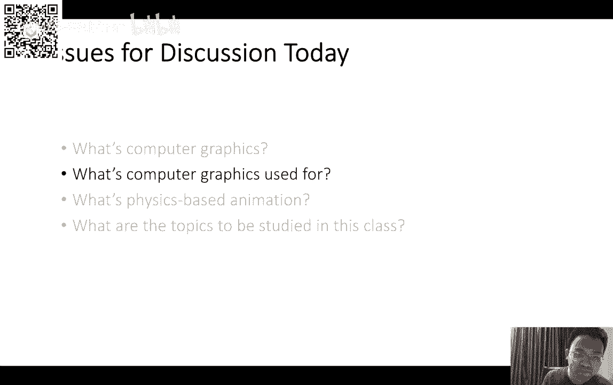

一个主要的应用就是有娱乐行业对吧，我可以拿来做游戏数，这游戏我可以拿来做电影特效，然后有很多轻娱乐的产品，比如说抖音，比如说啊mata human啊，比如说书投资人。

比如说还有各种各样的一些呃社交媒体里面，它其实都有啊这个这个图形学应用的这个需求，所以说娱乐一个是一个比较重要的一个行业，然后图形学也可以拿来做设计，做计算机辅助设计，跟计算机辅助工程。

比如说机械领域对吧，需要大量的这个图形学辅助工具。

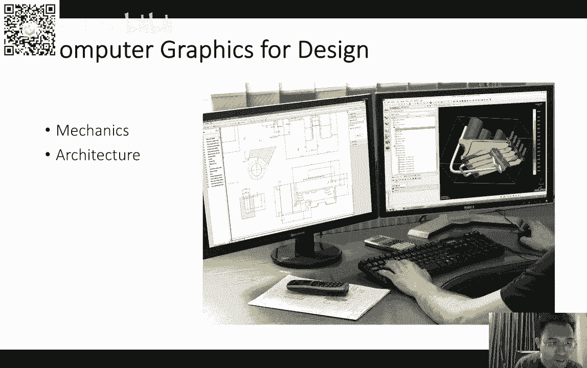

然后建筑行业，艺术设计，时尚还有等等一系列的这个一些很多领域都需要用到这个图形学技术，然后这个可以给大家看一个就是我们林迪科技。

我们做的一个cad的一个软件叫做style three three studio嘛，然后就是呃用户可以通过一些2d的版片，然后把这个一个3d的虚拟服装给他呃制造出来。

然后右边可以大家可以看到就是渲染的一个效果图，就是一个虚拟的数字服装啊，利用这个真实的这个服装制造工艺给它设计出来，然后图形学呃对于这个电子商务电商，还有这个跨境电商，尤其是跨境电商等等。

就是也会有一个很重要的作用，就是呃智能制造嘛，就是怎么样能够把这个数四化的产品呃作为一个商品嗯来呃推销出去，然后来销售出去，然后呃然后让那个消费者能够看到数字化的产品，然后下单，我们通过智能制造。

然后把这个食物袋制造出来，这个也是呃最近一段时间特别一个火的概念，就是智能制造一块呃，其实计算机图形学啊，在智能制造里面其实也是起到了一个非常重要的作用。

然后这个是社交媒体上，就比如说网红可以直播带货，这个我想大家可能多或少了解了解了解到一些嘛，就是网红带货对吧，那网红带货里面带货最多的是什么呢，就是服装跟化妆品，那么服装怎么样把这个数字的服装。

就是能够呃把这个能够跟制造相结合，能够把这个产业链，整个服装的产业链呃带动起来，这个其实图形学也起到了一个非常重要的作用。

然后嗯近一段时间可能比较火的就是元宇宙，还有vr a2 ，是所谓的mix 2这些这些概念嘛，那么图形学在这个里面其实也是起到了一个非常关键作用的，因为构造一个虚拟的世界里面，你就离不开计算机图形学技术。

我给大家看一个就是我们最近做的一个a2 的一个效果，嗯，左边是一个虚拟的服装，这个人当然是真的，这个人这个模特是真人，但是左边这个衣服是假的，其实右边呢是呃真实的照片的一个对比图。

然包括呃这个例子也这个牛仔裤的例子也是这个，左边是一个虚拟的衣服，这个呃上衣跟下这个裤子都是虚拟的，而右边是一个照片，可以看到就是我们可以目前可以做到几乎是以假乱真的效果了。

a21 个就是未来a2 的一个应用，就是相当于是一个11的一个或者是一个虚拟模特的效果，然后接下来我想跟大家讲就是什么是计算机动画，然后什么是基于物理的计算机动画，这个例子对人体也被建模了。

我们是有一个人体模型的，这个不是实时的，其实其实这个很难做到，事实我们是其实是一个离线的一个呃一个过程，接下来我们会讲就是基于物理的一个动画，然后呃动画首先我想跟大家讲一下。

这个动画大概是一个什么样的一个一个操作嘛，就是我们的最终目的是想把这些物体给动起来对吧，那么我们会设定时间点0t1 t2 t3 到t n对吧，我们会设定时间点。

然后每一个时间点呢我都需要得到一个这些物体的状态，那么我的动画其实本质上就是我需要更新这些物体的状态，在每一个时间点我都需要去更新这些状态，然后当我完成这个更新之后，我其实就把这个动画给它做出来了。

所以说我动画本质上就是我需要更新这些状态，那么我有什么样的状态是需要更新的呢，取决于你动画的内容是什么，比如说我可以更新它的位置，更新它的姿势，可以更新它的速度，我可以更新它的这个外观是什么样子的对吧。

比如说一个变色龙，我举个比较极端的例子，是个变色龙，那是变色龙，比如说我模拟一个火焰对吧，那火焰的这个颜色它会发生改变，可以更新一些密度，比如说烟要做一个烟雾的动画的效果。

我可以更新它的密度等等等等等等，就会有不同的状态，我需要更新不同的状态，然后两个时刻之间的这个东西呢，我们叫做不长time step delta t，这个步长呢可以是跟我你的帧率是一致的。

但也不一定要求说我的时间不长，是必须要跟帧率是一模一样的，时间不长，完全可以比帧率更低一点，那么这种情况下，我一针我渲染的时候，我一针可能就需要啊模拟更多的时间不长了，这个都没有关系。

就取决于你的这个引擎是怎么样设计的，所以说我们很多时候我们在讨论物理模拟的时候，我们主要讨论的就是怎么样去在一个时间步长里面，我们怎么样去更新这些状态，这个是我们所要研究的这个呃问题。

然后整个物理模拟大概可以分成四个方向吧，从左到右分别是钢体啊，衣服跟头发，衣服跟头发，我把它归为一类，就是一种比较窄的或者比较细的物体，然后呢是弹性体，软体，soft body，然后是流体。

流体包括液体和气体，这个我们一般来说是把液体和气体是当做一类流体处理的，是四大类，针对这四大类对吧，钢铁头衣服太软体跟流体，我们要有三种不同的不同的表达方式，分别是mesh。

跟grade我们刚才也提到了，就是啊和我们有三种不同的表达方式，所以说我们也有三种铜的相对应的模拟技术，那么对于缸体头发衣服还有弹性体而言，一般来说我们都是用mesh，为什么。

因为一般来说这些物体它们的整个形态它都是比较固定的，它都不会发生剧烈的这个呃扯或者是断裂这种现象，它相对来说会比较少一点，它基本上都还是一个整体对吧，就拿它是弹性体，它的形变会比较大一点。

它还是一个整体，所以说一般来说我们都会用mac来做这个模拟，可以给大家看几个相对应的例子。

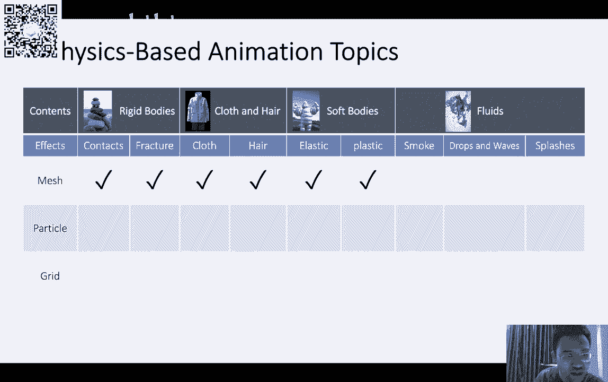

这个是用blender在youtube上有一个youtube在blender用blender做的一个，这有声音吗，没有声音。

钢铁的一个模拟的一个例子，看到有很多方块。

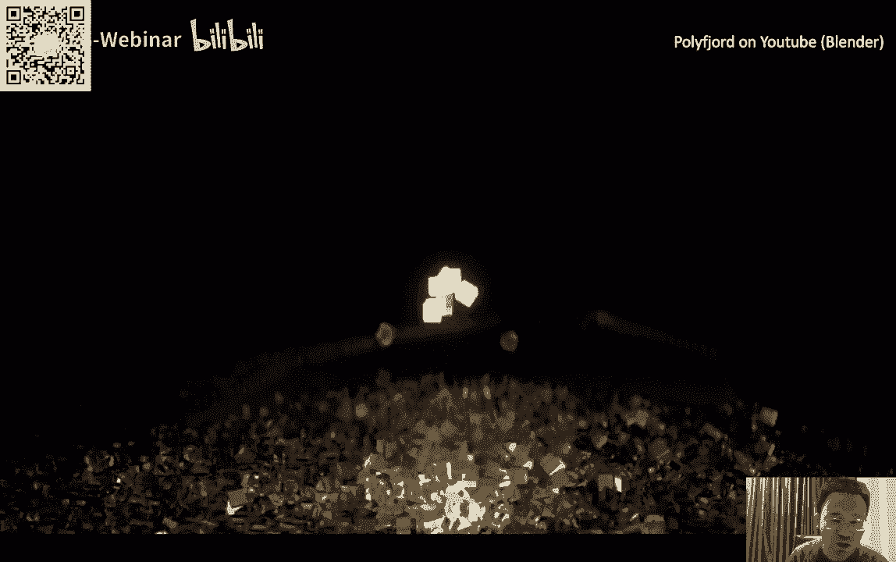

然后他就是最后掉在地上，然后嗯堆成一团的这么一个效果。

这个是我们前2年啊前几年做的一个fracture，就是体破碎的一个模拟的效果吧，这个实际上本质上也是钢铁模拟，但是呢我们对于钢铁模拟，我们专门处理就是怎么样去模拟它这个破碎掉。

包括是弹性体的一个破碎的效果，就一个果冻，被拉扯了之后，他就断成两段了，哦关于衣服，这个是我们今年c寡妇的一篇paper，就是怎么样去模拟这个嗯高分辨率的衣服吧，这个是一个羽绒服的一个效果。

这些基本上都是这些都是用mesh来做的，因为mesh它在处理这种形态比较固定的这些物体上，它是有很大的好处的，这不是实时的，这个大概差不多是不到一帧一秒左右吧，应该是这么样一个计算量，其实都不是实时的。

这些这几个例子都没有事实的例子，这个是我们啊前几年的一篇c graf asia，就是做弹性体，这个是不同的弹性体模型，从左到右大家可以看到不同的名字，可以再放一遍啊。

这是一篇也是一片c graf。

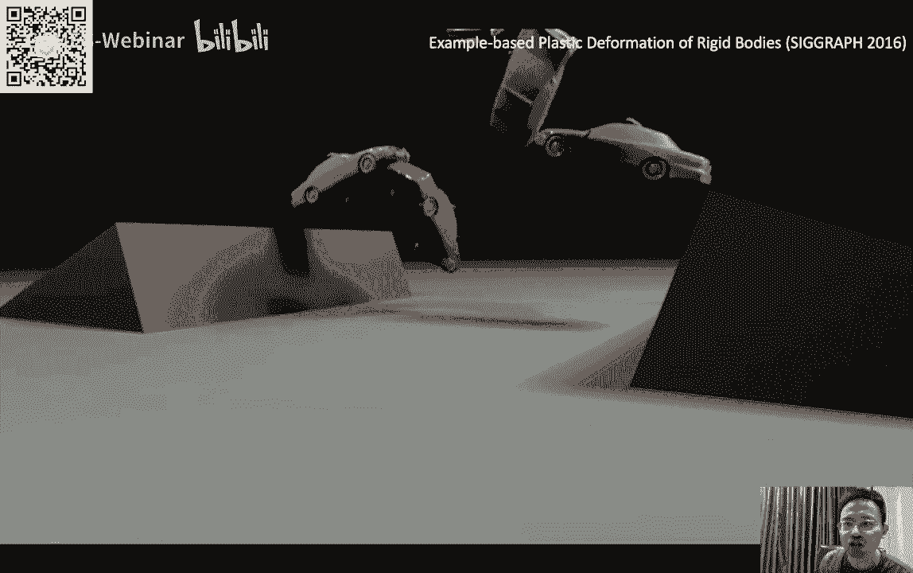

然后就是别人做的一些craft，然后他们所这个plastic形变的就是塑性形变。

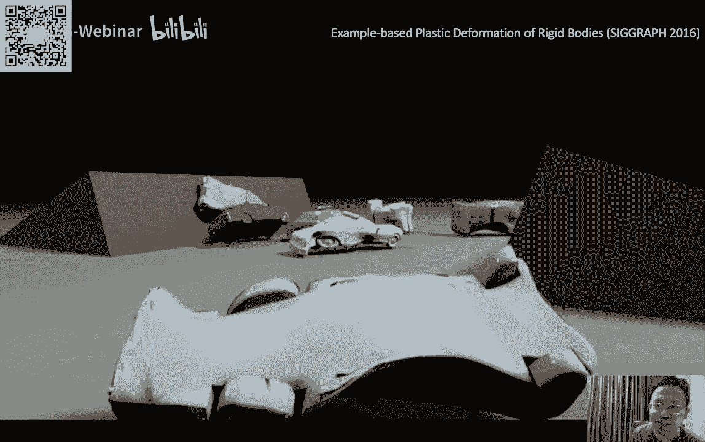

就是你可以看到一堆车撞在一起。

你可以认为是一些橡皮车，然后这些橡皮车撞在一起之后，它就发生这个永久形变了，它就被撞撞着装成各种奇奇怪怪的形状啊。

然后大家可以看到基本上啊这些方法基本上是以这些呃钢铁啊，衣服啊，基本上是用mac的方法为主的，但是呢甚至凡事都有例外对吧，就是不是所有的这个呃这些个这这这些内容都是用mash做的。

也有一些人去研究用别的方法，比如说用particle或者是gd去模拟别的东西，那么对于缸体而言，缸体的破裂呢，呃有些人去研究用mesh，用mesh list的方式，也就用粒子的方式去模拟，用例子呢。

因为用例子它例子最大的好处就是没有match，没有mesh呢，你也就意味着当这个物体碎裂的时候，你就不需要去跟这个match了，因为它就没有match，这个东西是最大的一个好处。

那么也有人用grade的方式，包括类似于pm这种就是hybrid的方式去模拟衣服或者是头发对吧，那为什么要这么做呢，主要的原因就是他想减少碰撞的处理，他想把这个呃这个碰撞处理这一块给它简化一下。

这个也是有这样的研究的呃但是总的来说，这方面的研究是一个比较实验性质的研究，它不是一个呃通用的一个呃处理方式，因为在你做用这些技术带来的好处的同时，也会有很强的局限性，比如说计算量可能会很大。

比如说它在处理细节的时候呃，会处理得不好啊，所以说我们通常就会把它考虑成一个比较实验的形式，pm吗，m p m叫做material point method，它是一个hybrid方法。

我等会儿其实会讲到一些hybrid的方法啊。

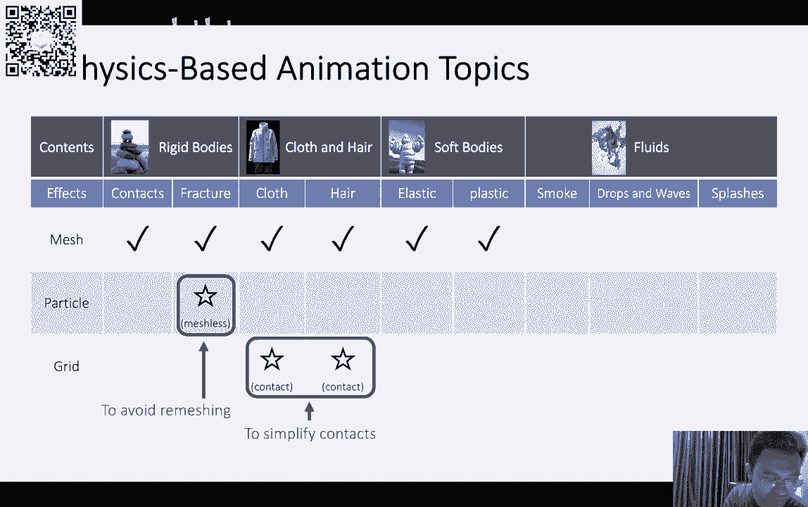

这是一个cv，其实大家可以看到这是2005年的paper。

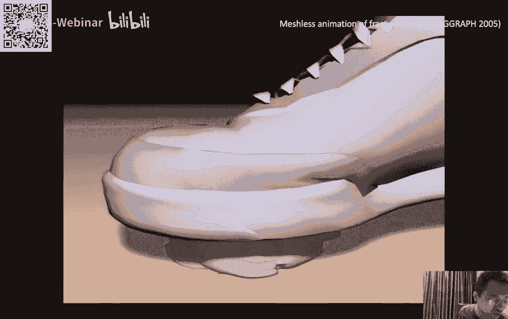

是现在已经有16年了，他就是这个paper。

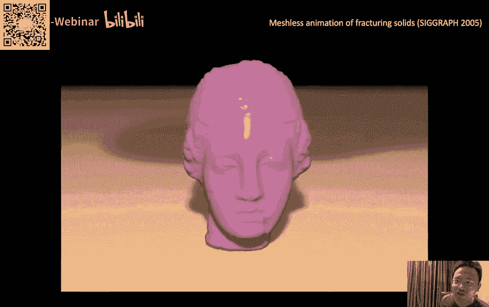

就是说怎么样用粒子，就是没有mesh的情况下。

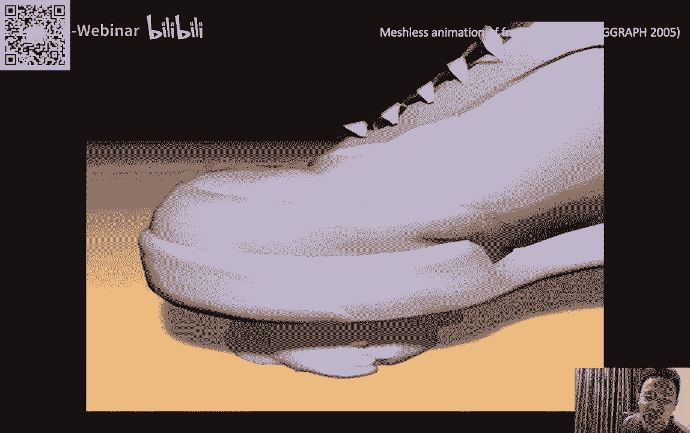

怎么样去模拟这个物体fracture的一个效果。

然后呢我们刚才讲了钢铁啊，然后弹性体这一块，然后接下来我们讲流体了，流体这个东西它就很神奇，因为为什么，因为流体它很多类型，它的展示的方式是很不一样的，从烟水滴跟表面波到水花，它其实都不太一样。

它的形式都不太一样，所以说我们研究这个流体，它用到的方式方法也不一样，烟而言，一般来说用到的是粒子法跟网格法会比较多一点。

给大家看一下这个一些效果吧，这个这是一个火焰的效果。

这个看起来像例子，它其实是其实是利用，我个人觉得应该是用blender。

是用网格法来模拟的，是用硅来模拟的。

这是另一个烟的效果啊。

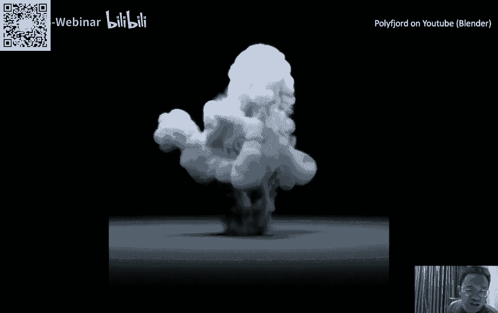

有个人他把这个人作为一个冤的烟的这个sce。

然后呃产生这个当人走路的时候，这个烟就是从人的身上被吹下来，然后产生这些效果。

上这个课吗，咱们这个上这个课，因为是用unity做的。

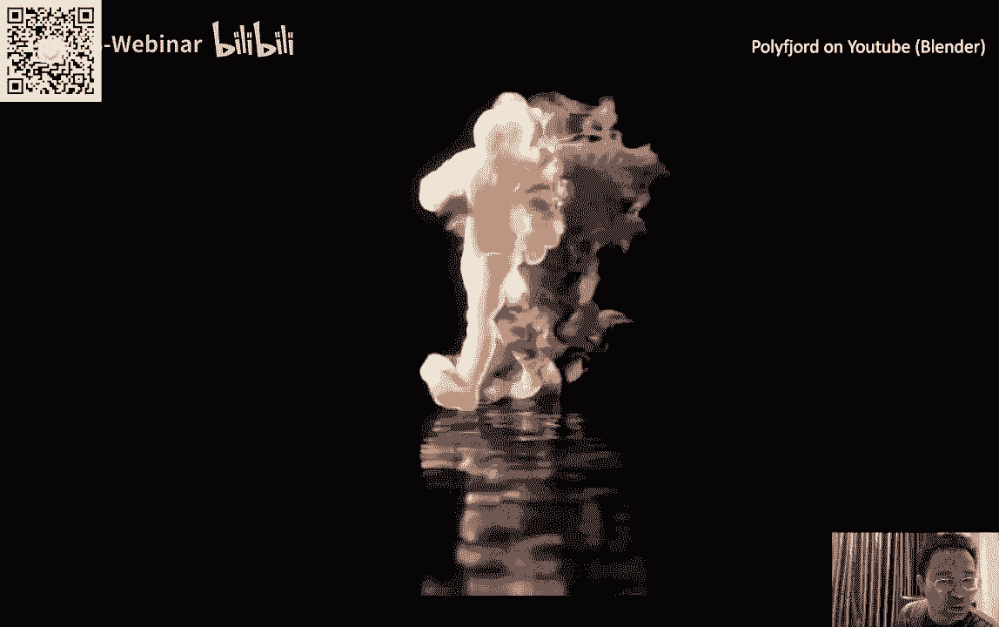

所以说计算量会有一定的限制，我们做不了这么复杂的模拟。

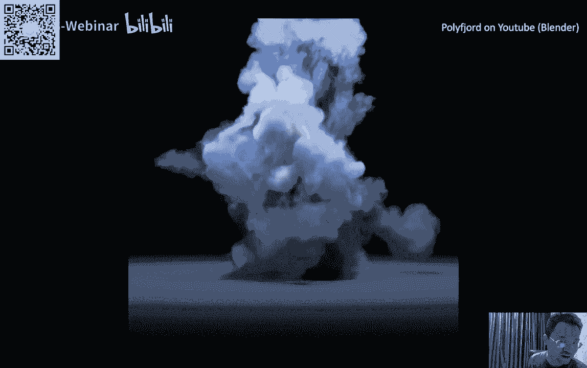

但是我们会有一些比较简单的，比如说2d3 d它会比较复杂。

但是我们可以做2d的这个烟的模拟，这个是可以的。

说完烟，我们接下来讲这个水滴跟波，为什么要把这个水滴跟波单独拿出来讲呢，因为水滴跟这个表面波水波有很大的特性，就是它基本上还是一个整体，对不对，它不会那么容易地分裂出来，所以说呃大家就研究了。

我不可可不可以用mesh来模拟模拟这个波，还有水滴，还有一个很大的好处，就是它基本上可以拿来做实时的模拟，而grade呢它可以拿来做比较高真实的，比较逼真的模拟，这个取决于你的需求是什么。

比如说这个c寡妇18年的时候有一篇paper是chris walton，他们那个组做的就是做surface，然后他就是把小波引入到了这个surface simulation。

然后可以产生这个实施时的来模拟这个水面波的一个效果，大家可以看到就是它不只是有这种大的这个浪花，它同同时还有这个很细的这些啊，播的效果都是可以拿来做出来的，都是可以实时的模拟出来的啊。

而且它跟这些物体也有交互，它它这个波不是单纯的波，它是能够跟物体是有一个交互的，然后呢烟说完这个水滴，然后最后面就是水花了，这个水花这个东西它大的问题是什么，就是它非常的多变，它非常的复杂。

所以说模拟起来它的这个呃相对来说就是没有那么实，是现在如果说实时的水花的模拟，相对来说就没那么容易了啊，mesh的基于mash做的水花呢可以做，但是实验性质更多的。

大家采用的是基于particle跟基于grade的方式来做这个模拟，给大家看一个我个人觉得蛮好的一个效果吧，怎么卡住了，是12年的时候嗯，的时候做了一个，第2年的时候做的一篇segraf吧。

就是可以做各种各样，但是我就这样放吧，给大家放一下，就可以做一个用用s p h，然后模拟的这水花的效果，视频播放有点卡顿，在我们这个课最后的时候。

我们也会讨论这个技术就是怎么样用这个s p h的方式来模拟流体，跟那个grade的差别吗，这个就是跟表达式有关啊。

就是它是三角形网格，三角形或者是多边形网格，是这样子的这样子的一个网格，后grade它就是一个是这个是这样子的网格，它是一个把空间细分成一个一个小格子的这样的一个体系的一个网格。

它其实主要的区别能不能做这样的效果是吗，如果是用unity的话，是做不了的，unity unity它的局限性很强。

它这个因为它是一个实时的引擎，它的局限性很强啊，我们能做的是做一个2d的烟的效果，这个是可以的，然后后我们会做一个播的一个我们的作业，大概是一个播的作业，就是类似这样子的一个作业，但是会比这个作业要呃。

效果要稍微差一点，如果说如果说大家想要尝试，比如说像类似这种效果的呃挂的话，然后可能会需要用到open gl类似的其他的一些渲染引擎，图形学引擎就光是unity是做不了的。

这个当然不是因为我们课程的原因，完全是因为这个作业布置的原因。

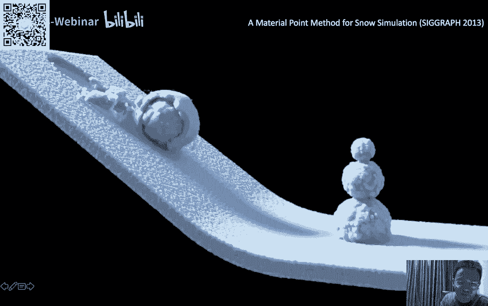

后接下来就是我们来讲一下有哪些东西我们刚刚没有讨论的对吧，我们刚刚讨论了就是呃四个不同的呃物质嘛，刚体弹性，然后衣服，然后流体，然后我们也讨论到了三种不同的方法对吧，基于mesh的方法。

基于particle方法，基于规则的方法，我们刚才还有什么东西没有讨论的呢，首先第一个就是方法就是图形学里面其实有一种方法，就是把一些这些方法结合在一起的。

比较典型的大家可能听说过的就是pm就是particle跟相结合的方法，那么为什么要做这个事情，主要原因是想要呃这个方法能够既有particle的优点，也有grade的优点。

所以说呃这个方法通常来说就是拿来做一些基于呃两者之间的，就比如说我有一些比如说pm，可能大家看到的最多的例子就是做雪，还有做呃各种粘滞的一些物体。

那么研制的物体它最大的特点就是它既有一些particle的属性，也有一些规律的属性，所以说用这种hybrid的方法是最常见，最通用的，那么反过来，如果说比如说你要做钢体，做衣服，做弹性体。

那么用一些hybrid的方法可能就不是合适，你可能用mac的方法会更好，更选择会更好一点，还有一类啊，还有一类就是这里面研究的比较重要的一个东西呢，就是怎么做company the coupling。

就是说在你这个场景里面，你可能既有刚体，也有衣服，也有弹性体，也有流体，那么怎么样你去模拟这几个不同的物质之间的交互对吧，你怎么样去模拟，比如说水落在衣服上，或者是水落在弹性体上。

或者是衣服怎么样在穿在人身上，然后人又是一个弹性体等等等等，就是c一个嗯，大家研究的一个比较多的一个比较多的一个课题。

然后关于hybrid的方法，我就给大家看一个pm的一个比较早期的一个paper吧，这个是就是做模拟这个血的效果。

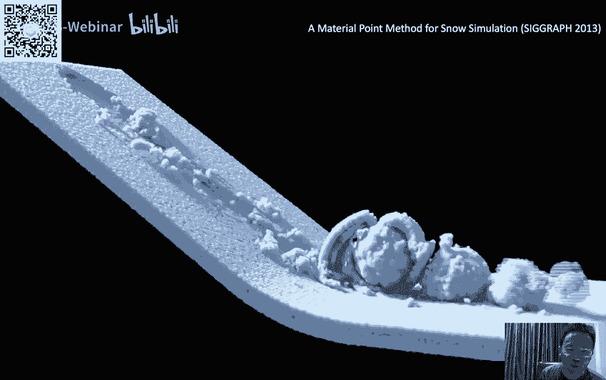

沙子都是可以用这个m pm的，这种方法是模拟是比较合适的。

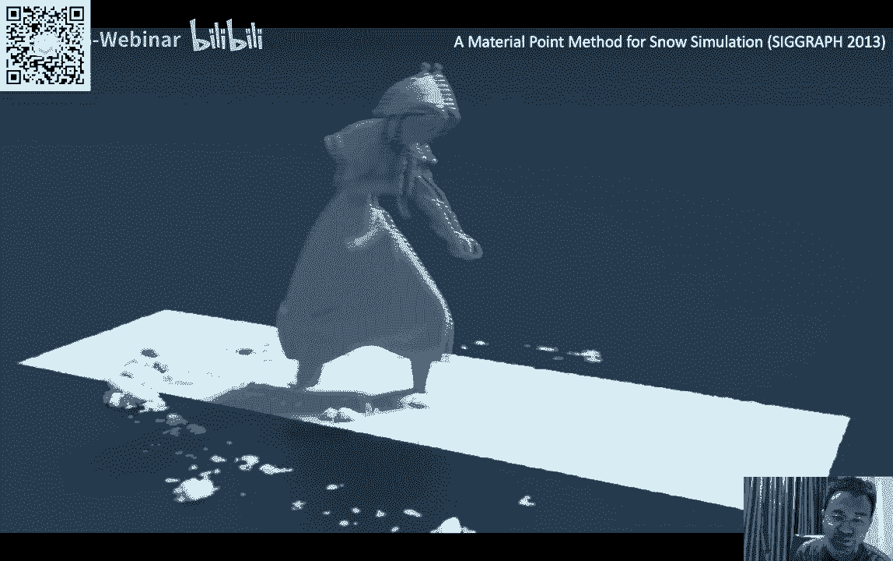

然后给大家看了这么多，然后最后我们说一下，就是我们这个课会学到上到一些什么东西吧，这个是我把这个打呃画的这个框起来的，这个是我们需要我们会上到的一些东西。

我们刚体这一块我们主要是呃上魔钢体的dynamics，跟他的这个context这一块钢铁的fracture呢我们就略过了，因为主要fracture这一块它会有一大块是关于remash的。

而这个unity在处理remash的时候，它会相对来说比较比较复杂一点，而且还有一个原因，还有一个原因是因为游戏引擎里面，游戏运行里面的fracture它通常是预计算的，它不是模拟出来的。

它是通过一些预处理的方式来做的，在游戏里面看过fracture的效果，就比如说一个墙打碎掉了，一个坦克，给他炸飞掉了等等等等，就类似这样子的flash效果。

其实在游戏里面还是挺一般来说都是通过预计算的方式来处理的，所以说我们就不会讲这个fracture这一块了，因为unity没有办法支持实施的这个模拟，然后衣服跟头发呢我们会把我们会主要会讲cross。

就是衣服这一块，模拟头发这块我就我们就暂时就不讲了嗯，头发这一块其实涉及的内容也挺多的，包括头发的摩擦嗯，自摩擦，还有一些就是发型的模拟的一些效果，但是我们这一块暂时就略过了啊。

软体呢我们主要是弹性体这一块，我们会讲的比较对，我们碰撞检测也会讲的，我们会专门有一天的时间会专门来讲这个碰撞处理，还有碰撞检测，弹性体这一块，我们会主要会讲有限元。

然后会讲呃超弹性模型及hyper elastic model这些东西，然后基于这个elastic model，然后我们也会扩展一些就是数值方法上的一些东西，这个我们暂时就啊也不讲。

因为plastic的东西它可以认为是以astic的一个延伸，然后plastic，而且说坦白地说，我也我自己以前也没有做过plastic，所以说可能我讲也不是很合适，所以说我自己就暂时就偷个懒。

这一块就不讲了，硬的软的边界在哪里，硬的东西其实就是你认为它是没有形变的，我们在做钢体模拟的时候，我们就是假设刚体是无形，是菱形变的，而任何有形变的，然后我们可以观察到形变的。

我们其实都可以把它认为是软体，还要看它有没有形变，如果说你你做一个比如说做一个简单的游戏，然后这个游戏里面呃轮它只是车辆的一个附件，然后它只是做一个滚动的话，你可以可以把它认为是一个钢铁，它没有形变啊。

但如果说比如说你单独模拟一个轮胎，比如说从天上掉下来，它会产生一个弹性的效果，那么你可能就需要把它做成一个弹性体，变是吗，形变其实它是有三个阶段的，真正的形变它是有三个阶段的，第一个阶段是弹性的形变。

然后第二个阶段是塑性的芯片，plastic，然后最后是一个破碎的fracture的芯片，它所以说严格的意义上讲，其实这三个阶段都是形变的，我不清楚tiger那个书啊，我没有看过这个书会讲。

我们到时候也会专门有一节有一节课讲ppt，事实上ppt我可以我们可以把它归成一种类型，叫做constraint，就是基于约束的proach，然后我们基于这个东西，我们其实会不光会讲ppt。

我们会讲ppt，然后会讲projective dynamics，然后还有一种技术叫做constrained namics，它是基于拉格朗日算子的。

我们也会讲就是怎么样各种各样的利用这个约束来做模拟的这种方式，我们其实都会涉及到这个是前面三块，前面三张，是的，match是对物体的，然后规则是对场景的，我觉得这个其实解释我觉得挺挺棒的。

就是mesh它其实是定义在物体上的，而good它是定义在整个3d场景上的，02102是几何吗，我不知道零二是什么，其实我们103对那个101跟102的依赖都不是那么强，因为我本来设计这个课。

就是想把它作为一个基础门课的，那基础入门课，你其实没有完全是零基础的，理论上也是可以学的，嗯不是特别大，流体的话我们主要会主会集中在particle跟grade这一块哦，其实漏掉了这个其实我们也会讲。

我们会讲波，然后反正就是会三天时间嘛，第一天会讲mesh，然后第二天会讲贵的，第三天会讲particle，会讲会讲，会讲不同的这个内容，然后呃还有一点我我想要强调的，我想要说的就是说其实不同的人。

不同的老师，他们的这个经验是不一样的，就是每个人不同的经历会不一样啊，然后我不知道大家有没有这样的体会，就是你上这个老师的课，你会发现有的东，而且他会讲的很多，有的东西会讲得很少。

因为他自己知道的东西会不一样对吧，我们一般来说懂得多的，我们就会讲的多一点，懂得少的就会讲的少一点，然后我自己的一个大概的一个那个一个expertise，大概是这样子的。

就是我们以前其实fracture也做过一些吧，我们做过我们有两篇c寡妇，但是我自己其实做fracture，相对来说是不是很多衣服其实还有弹性体，其实算是我的一个比较擅长的一个东西。

我大部分的经验主要是集中在这一块上，流体我其实做的相对来说嗯，以前我做的比较多，但是最近最近这几年，最近这56年其实相对来说做的比较少一点吧，然后我mesh的流体基本上没有做过。

我基本上是以particle跟grade为主的，它会集中在这两块上，我会嗯好好处在于其实这个两个重重叠度还是比较高的，所以说基本上能够把我们这个课上能够学到的内容都给他覆盖到，播的眼色是吗。

流体我们主要就是解never execution嘛，所以说对于波而言的话，就是正常的，它的波的反射折射衍射都会有，哦像这个今今天我们的内容就基本上就是到此为止了，然后嗯希望可以给大家一个基本的概念。

我们这个课大概是要学习一些什么样的东西，然后我们下周会从数学开始吧，嗯会讲一些我需要运用到的数学，然后跟数学相关的嗯知识，然后数学跟图形学里面一些包括模拟一些问题，怎么样能够结合在一起，有问题吗。

材质是吗，光照和材质不会涉及这个unity，我们就会用unity自带的光照和材质，你只要知道unity里面是怎么配置这些东西就可以了，前置作业倒是没有配置环境好像也没有吧，因为直接用unity就可以了。

书是没有的，我们的那个嗯我们的教材是没有的，但是我们会有一些那个呃就是选读的一些论文，我到时候会放在那些slides里，到时候会把那个二维码更新一下的，然后回头你们如果去那个官网上下载那个ppt的时候。

会看到一个更新过的二维码，games上的那个二维码应该也是也是也是新的，管线跟可编程的管线效率上有什么不同吗，其实得看硬件吧，我个人理解是没有什么太大的不同的，你这个碰撞响应的问题问的太具体了。

我觉得我不太好回答，d的2d的a b b它有一个套路的呀，它不是就是你可以在一个方向上先做那个先做排序吗，我记得好像大概是这样子的，不需要用computer shader，我们用unity就可以了。

有重点就是我们的那个就是我我每次放一个选读的论文，或者是一个选读的文献，他都会针对着某一个课，每每一个话题嘛，然后你只要读这个论文里面相对应的那个话题就够了，比如说嗯嗯比如说碰撞嘛。

比如说我会谈到说碰撞可以用这种方式，然后这个论文刚好用用到这个方式，那么你需要读这个论文里面关于碰撞的这个部分就可以了，你不需要读这个论文，关于就比如说数值求解这方面的东西，就是你会有一个重点。

穿穿衣模拟的例子，能简单介绍一下，人体建模就是。

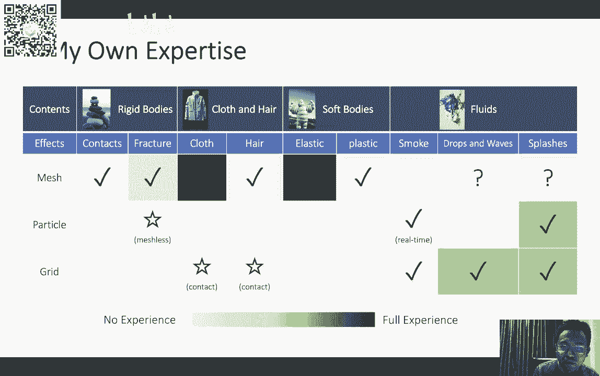

是支持。

吗，我记得好像是用pose做的一个人体，人体我有点我有点不太记得了，请if，是吗，本体我记得好像是手工调出来的啊，找了美术调的，因为你自动出来的人体它会有一些问题，所以我后来又用美术再单独调了一下。

这个东西其实它的计算量是呃，不是计算量，它的处理量是挺大的，我们做这个例子，差不多要花两三个小时的时间，做一个，什么读craft，然后将原理落地的引擎吗。

其实个人觉得就是有很多图形学论文他都没有办法落地啊，每年的c graf差不多有100篇嘛，100多篇，然后加上挂v社，差不多有200多篇，你看这个真正有多少论文是能够落地的，可能有1/10都不到对吧。

但是我觉得嗯有一些比较好的，特别优秀的这个论文，然后能这个东西能够运用到实际，我觉得就特别好，前面还有一个问题就是用c sharp，我记得unity以前是支持c javascript的两种的。

但是最近他好像不是javascript，我不是很确定啊，是不支持了吗，还是怎么样，到时候会发布在官网上，然后你可以从官网上下载，然后提交的话，我目前我倾向于是用邮件的形式。

就是你把那个嗯unity里面有个选项叫做导出，导出成一个package，然后你导出成package之后，把这个package打包，然后发送给邮件就可以了，我也我印象中也是不支持javascript了。

以前是支持的，那我们今天就先到到此为止，然后如果有问题的话，可以在微信群里面或者是发邮件问好吗，对我们就是要用c sharp了，不用写shader，本身c shop有脚本。

我们就没必要再去写别的shader。

